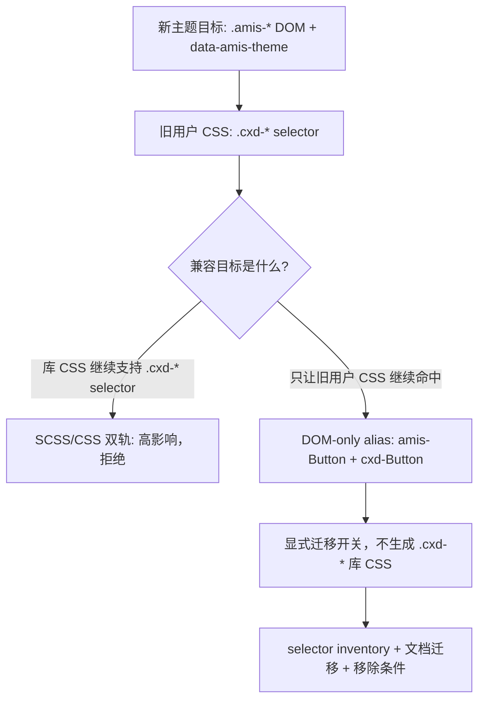

## 问题与范围

问题：`.cxd-*` 兼容性是否可以通过一个低影响的开关开启或关闭？

范围：区分两种兼容：

1. **SCSS/CSS legacy selector 兼容**：库样式继续输出 `.cxd-*` 选择器或双产物。
2. **DOM-only legacy class alias**：库样式不兼容 `.cxd-*`，只在用户显式开启时让 DOM 同时输出 `.amis-*` 和 `.cxd-*`，用于让老定制页面自己的 `.cxd-*` CSS 继续命中。

本记录只评估现有代码结构和构建路径是否支持低影响兼容开关；不实现兼容层，不评估外部用户项目中的自定义 CSS 总量。

## 速答

结论分两层：

- **不做 SCSS/CSS `.cxd-*` 兼容编译期开关**。它不是低影响改动，会把新主题系统重新拉回双公共 API。
- **可以评估并实现 DOM-only `.cxd-*` legacy class alias**。如果目标只是支持老定制页面中用户自己写的 `.cxd-*` CSS，那么不需要库样式双编；只要 DOM 在显式开启的迁移模式下继续带 `.cxd-*` alias，旧用户 CSS 就能匹配。

建议：把兼容策略改为“默认稳定 `.amis-*`，可选 DOM-only `.cxd-*` alias，拒绝 SCSS/CSS legacy selector 兼容”。这个 alias 只能是迁移辅助，不作为新的样式 API；默认关闭或至少显式开启；不生成 `.cxd-*` 库 CSS；文档主路径仍要求迁移到 `.amis-*` / `[data-amis-theme]` / token。

## 关键证据

1. `amis-ui` 当前主题 CSS 是固定按主题入口编译：`antd`、`ang`、`cxd`、`dark`、`default` 都从 SCSS 入口抽出到 `lib/themes/{theme}.css`，没有现成的“兼容选择器开关”或“legacy selector artifact”机制。证据：`packages/amis-ui/rollup.config.js:73-112`。
2. 现有运行时类名生成集中在 `makeClassnames(ns)`，它把以大写开头的组件 token 加上 `classPrefix`；`Root` 又把 `theme.classnames` 和 `theme.classPrefix` 注入渲染树。若只做 DOM alias，这个集中点反而让方案可控：可以优先在 classnames 生成链路验证 `amis-Button cxd-Button`，不动 SCSS 双产物。证据：`packages/amis-core/src/theme.tsx:45-60`, `packages/amis-core/src/theme.tsx:101-103`, `packages/amis-core/src/Root.tsx:122-146`。
3. `env.theme` 由 `getTheme(theme)` 派生，仍是完整 ThemeInstance。DOM alias 开关需要进入 `amis-core` / `amis` JS 运行时构建，不属于 `amis-ui` SCSS 构建开关。证据：`packages/amis-core/src/index.tsx:377-382`。
4. 选择器迁移面很大：`packages/amis-ui/scss` 中有 140 个文件、2185 行命中 `#{$ns}`；源码中有 411 行 `classPrefix` 引用；排除测试后仍有 50 行运行时代码硬编码 `cxd-`。这说明 SCSS/CSS 双轨兼容仍是高影响；但 DOM-only alias 可以把范围压回运行时 classnames 和少量硬编码选择器 inventory。
5. 编辑器和主题编辑器会继续生成或读取旧选择器：`EditorManager.getThemeClassPrefix()` 返回 `getTheme(...).classPrefix`，`getAllCssVar()` 读取 `:root, .AMISCSSWrapper`，`ParseThemeData` 直接生成 `.cxd-Button--...`。DOM alias 可能让一部分旧 editor selector 暂时继续命中，但不能替代 editor CSS generator 迁移。证据：`packages/amis-editor-core/src/manager.ts:2495-2496`, `packages/amis-editor-core/src/util.ts:1241-1248`, `packages/amis-theme-editor-helper/src/helper/ParseThemeData.ts:227-245`。
6. 公开文档仍把 `#{$ns}` 和 `.cxd-Avatar` 当贡献方式，IE11 文档也已经说明 `cxd-ie11.css` 无法支持 CSS 变量。DOM alias 若公开成“推荐用法”，会让文档同时维护旧前缀 API 和新 token/theme-scope API；因此只能作为迁移开关说明，不能进入主路径。证据：`docs/zh-CN/extend/contribute.md:108-120`, `docs/zh-CN/start/getting-started.md:452-453`。
7. SDK 构建已经有历史别名复制：`sdk/sdk.css` 会复制为 `sdk/cxd.css`，`sdk/sdk-ie11.css` 会复制为 `sdk/cxd-ie11.css`。这只是文件名兼容，不是 selector / DOM 兼容；不能证明 `.cxd-*` selector 开关低影响。证据：`packages/amis/build.sh:45-47`。

## 细节展开

### 为什么“CSS 编译开关”不够

旧 `.cxd-*` 自定义 CSS 的匹配条件是 DOM 类名仍包含 `.cxd-*`。如果新运行时只输出 `.amis-*`，那么即使编译产物里同时保留 `.cxd-Button` 规则，旧用户 CSS 也不会命中新 DOM。反过来，如果目标只是让用户自己的旧 CSS 命中，库本身不需要继续输出 `.cxd-*` CSS；运行时在显式迁移模式下让 `Button` 输出 `amis-Button cxd-Button` 就足够形成匹配条件。

所以 “CSS 编译开关” 不够，且不值得做；“DOM-only alias 开关”才对准了这类兼容需求。

DOM-only alias 仍会带来副作用：

- DOM 上重新出现 `.cxd-*`，容易被误读为仍受支持的公共 API。
- 快照、测试、插件选择器、编辑器 preview 都要理解双类名。
- `classPrefix` 可能从内部迁移 helper 重新变成兼容开关输入，增加长期收口成本。

缓解：alias 必须显式开启、默认不作为文档主路径、只支持 `.cxd-*` 旧定制 CSS 迁移场景、不生成库 CSS、通过 selector inventory 标注移除条件。

### 为什么影响面不是局部的

当前 `classPrefix` 不只在 `theme.tsx` 里出现。组件和渲染器中有大量基于 `classPrefix` 的 DOM 查询、子组件传参和浮层传参。即便 `makeClassnames()` 是集中入口，DOM-only alias 仍然需要明确哪些调用走集中 classnames，哪些硬编码 selector 必须迁移到 stable selector，哪些只是文件名或主题行为对象。

编辑器更复杂：它不只是消费 CSS，还会生成 CSS、迁移 schema、读取 CSS variables、在 preview / iframe 中模拟主题环境。DOM alias 可以让旧 selector 查询短期命中，但不能让 theme-editor 继续生成 `.cxd-*`；生成器仍必须迁移到 ThemeScope + `.amis-*`。

### 可以保留什么

可以保留三类兼容，不等于公开 `.cxd-*` 样式 API：

- 文件名兼容：类似 `sdk/cxd.css` 指向新稳定主题 CSS 的别名，前提是文档明确这不是 `.cxd-*` selector 兼容。
- DOM-only legacy class alias：显式开启时组件 DOM 同时带 `.amis-*` 和 `.cxd-*`，只服务老定制页面自己的 CSS，不提供库 CSS 兼容。
- 内部 legacy helper：在迁移期间为少量内部代码提供临时映射，必须有 selector inventory allowlist 和移除条件。

## DOM-only alias 的接受条件

- **默认路径**：默认输出稳定 `.amis-*`；用户文档主路径只讲 token、`.amis-*` 和 `[data-amis-theme]`。
- **显式开关**：只有显式开启迁移选项时输出 `.cxd-*` alias；不要从任意 `classPrefix` 自动推导 alias，避免继续支持 `.antd-*` / `.dark-*` 双轨。
- **CSS 边界**：不生成 `.cxd-*` 库 CSS，不在 SCSS 中做双选择器，不要求 theme-editor 继续生成 `.cxd-*`。
- **实现位置**：优先放在 `ThemeInstance` / `makeClassnames` 附近，避免组件散落手写 alias。
- **测试边界**：Button pilot 必须验证开启 alias 时 DOM 同时包含 `.amis-Button` / `.cxd-Button`，关闭时只包含 `.amis-Button`；selector guard 必须能区分“generated DOM alias”与“源码新增 `.cxd-*` 选择器”。
- **退出策略**：发布说明和迁移指南要说明该开关只为旧定制 CSS 迁移服务；后续移除条件由 `legacy-prefix-teardown` 记录。

## 未决问题

- 外部用户到底有多少 `.cxd-*` 自定义 CSS 不在仓库内，无法通过本仓库直接证明。
- DOM alias 开关应该放在 runtime config、build flag 还是 SDK 包装层，需要在 `theme-runtime-button-pilot` 里结合现有 API 决定。
- 是否需要提供 codemod / 文档表，把常见 `.cxd-*` 迁移到 `.amis-*` 或 `[data-amis-theme] .amis-*`，应在 docs rollout 里决定。

## 后续建议

把 roadmap 中 `.cxd-*` 兼容项改为“SCSS/CSS legacy selector 兼容已评估为高影响，不实现；DOM-only `.cxd-*` legacy class alias 作为显式迁移开关进入 Button pilot 和 legacy-prefix-teardown 的验证范围”。

## 相关文档

- `.codestable/requirements/adrs/001-tokenized-theme-system.md`
- `.codestable/roadmap/theme-system-refactor/theme-system-refactor-roadmap.md`
