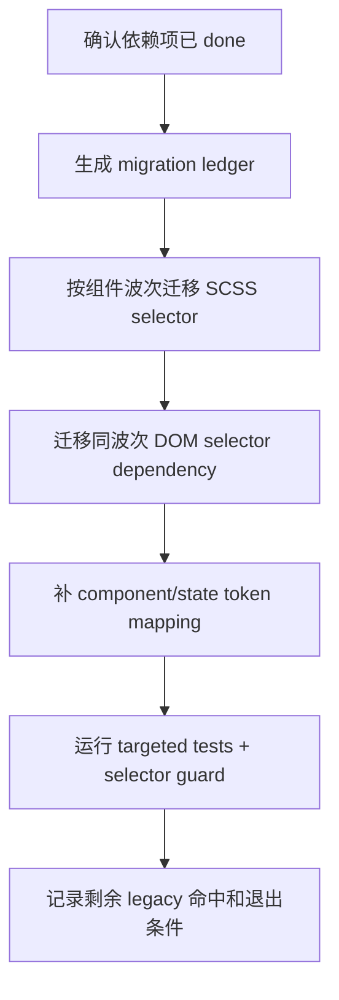

# core-component-selector-migration feature design

## 0. 术语约定

| 术语 | 定义 | 防冲突结论 |
|---|---|---|
| Component selector migration | 将组件 DOM class、SCSS selector 和 DOM 查询从主题前缀身份迁移到稳定 `.amis-*` 组件身份。 | 不是删除 `classPrefix` 字段；`classPrefix` 仍可能作为 legacy/internal 传参存在。 |
| Migration ledger | 本 feature 的迁移清单，按组件 / selector / DOM query / token 状态记录范围、证据和未完成项。 | 依赖 `stylesheet-stable-selector-build` 的 inventory/allowlist/guard，不另起第二套 selector 数据源。 |
| Stable component class | 由 `ThemeInstance.classnames` 主路径输出的 `.amis-Component` / `.amis-Component--state`。 | ADR-001 和 Button pilot 已把 `amis-` 定为稳定前缀；本 feature 不再讨论前缀命名。 |
| Component/state token | 面向组件和状态的 `--amis-{Component}-...` token 或既有旧 token alias。 | 不重新定义 token taxonomy；消费 `token-contract-css-layers` 的分层和 alias 规则。 |
| DOM selector dependency | TS/TSX 中通过 `classPrefix`、`.cxd-*`、`.antd-*` 或主题前缀类名做 `querySelector` / `closest` / `matches` 的行为依赖。 | 只迁移样式/DOM 选择器依赖；普通 props 传递、legacy alias 开关和非样式配置不在本项强删。 |

## 1. 决策与约束

### 需求摘要

本 feature 承接 Theme Runtime、Token Contract、Stylesheet Build 和 Overlay Scope 的前置设计，目标是把高覆盖组件与渲染器的公共样式身份迁移到稳定 `.amis-*`：优先处理 Button 后续样式、Form、Select、Dialog/Drawer/Modal、Table/Table2、Dropdown/Tooltip/Popover、Page/Layout。迁移范围同时覆盖 SCSS 中的 `#{$ns}`、源码中的样式 DOM 查询，以及需要从组件/state token 读取的主题差异。

明确不做：

- 不迁移 editor/theme-editor helper、`.AMISCSSWrapper`、历史 schema 或生成 CSS；这些属于 `editor-theme-helper-migration`。
- 不删除 `classPrefix` 公共字段，不关闭 DOM-only `.cxd-*` alias；收敛和退出机制属于 `legacy-prefix-teardown`。
- 不要求全仓库所有组件一次清零；本项只覆盖 roadmap 指定的高覆盖组件和被它们直接依赖的 selector。
- 不新增 SCSS `.cxd-*` / `.antd-*` / `.dark-*` 兼容输出，不把主题前缀类名继续作为用户定制入口。
- 不改变组件业务行为、表格拖拽/固定列/筛选、Select 搜索、多选、Dialog/Drawer 关闭和浮层定位语义。

### 复杂度档位

- 结构 = modules（跨 amis-core、amis-ui、amis 渲染器、SCSS 和测试）。
- 可读性 = public（贡献者会继续按迁移规则写新组件样式）。
- 可演进性 = stable（迁移 ledger 和 guard 会决定后续 legacy-prefix-teardown 的输入）。
- 可测试性 = verified（需要 DOM snapshot / targeted test / guard / grep / diff review 多证据）。
- Compatibility = backward-compatible migration（稳定 `.amis-*` 是主路径，DOM-only legacy alias 只作为显式迁移辅助保留）。

### 关键决策

1. **按迁移波次推进，不按全仓库字符串替换推进**
   Table/Table2、Form、Select、Dialog/Drawer/Modal 等组件体量大、状态多，必须用 migration ledger 和波次验收，而不是一次性 `#{$ns}` 替换。

2. **`classPrefix` 依赖先分类再迁移**
   `classPrefix` 用途至少分为：legacy/internal props passthrough、DOM selector dependency、theme runtime alias、组件业务配置。只有 DOM selector dependency 和样式 source-of-truth 是本项迁移对象。

3. **SCSS 和 TSX 必须成对验证**
   只把 SCSS 改成 `.amis-*` 不够；Dialog、Drawer、Modal、PopOver、Table 等源码里还有 `querySelector`、`matches`、`handle`、nested selector 字符串。迁移必须同时核对 DOM 查询路径。

4. **优先复用 Stylesheet Build 的 guard**
   本 feature 消费 `npm run check:theme-selectors --workspace amis-ui` 或等价 selector guard，不另写并行检查。guard 缺失时实现阶段必须先回到前置项补齐或记录阻塞。

5. **实现 admission 严格等待依赖 done**
   epic batch 允许本 design 在 `stylesheet-stable-selector-build` 与 `overlay-theme-scope-propagation` design-review passed 后起草；implementation 开始前必须重新读取 items.yaml，确认这两个依赖已 `done`。

### 基线风险与验证入口

- `packages/amis-ui/scss/_mixins.scss` 仍有 Button、Form control、ResultBox 等 `#{$ns}` helper 命中；这些会影响多个组件。
- `packages/amis-ui/scss/components/_table.scss`、`_modal.scss`、`_tooltip.scss`、`_page.scss` 等高覆盖 SCSS 大量使用 `#{$ns}`。
- `packages/amis/src/renderers/Dialog.tsx` / `Drawer.tsx` 通过 `classPrefix` 查询 Modal/Drawer content；`packages/amis-ui/src/components/Modal.tsx` / `Drawer.tsx` 通过 `${ns}Modal` / `${ns}Drawer-overlay` 判断 closeOnOutside；Table/Table2 也有多处 selector 字符串。
- `packages/amis-ui/src/components/Tree.tsx` 存在直接 `.cxd-TreeControl` 查询，属于后续 ledger 必须分类的硬命中。
- Button pilot 已证明 `.amis-Button` 和 `[data-amis-theme]` 最小路径；本项需要把 proof 扩展到高覆盖组件。

### Top 3 风险

1. **批量替换破坏行为语义**：DOM 查询、RootClose、拖拽、固定列、筛选等行为依赖 selector。缓解：先建 migration ledger，每波迁移只改一组组件，并用 targeted tests / snapshots / diff review 验证。
2. **迁移范围失控到 editor/helper 或 legacy teardown**：核心组件迁移很容易顺手清理 editor 和 alias。缓解：design/checklist 明确反向核对 editor/theme-editor、DOM-only alias、`classPrefix` 字段删除均不在本项。
3. **新旧 selector 长期并存但无退出信号**：如果只改一部分 selector，legacy-prefix-teardown 无法判断剩余债务。缓解：每个未迁移命中必须在 ledger/allowlist 有分类、owner、退出条件和后续 item。

## 2. 名词与编排

### 2.1 名词层

#### 现状

- Theme Runtime 已让 `ThemeInstance.classnames` 默认输出 `.amis-*`，Button pilot 已在 `_button.scss` 建立最小 `.amis-Button` / `[data-amis-theme='cxd']` proof。
- Stylesheet Build design 定义了 Stable selector helper、selector inventory、allowlist 和新增 selector guard，但这些工具尚未在本项实现前完成。
- Overlay Scope design 把 portal theme scope 独立出来，避免 Dialog/Tooltip/Select 的类名迁移后在 body container 下丢 token scope。
- 高覆盖 SCSS 仍大量依赖 `#{$ns}`，例如 `_table.scss`、`_modal.scss`、`_tooltip.scss`、`_page.scss` 和 `_mixins.scss`。
- 源码中既有 `classPrefix` 普通透传，也有 DOM selector dependency，例如 Dialog/Drawer 的 `getPopOverContainer()`、Modal/Drawer 的 closeOnOutside `matches()`、Table/Table2 的 nested selector 字符串。

#### 变化

新增或固化以下名词：

| 名词 | 形态 | 职责 |
|---|---|---|
| ComponentMigrationLedger | 机器可读或 Markdown 清单 | 记录每个目标组件的 SCSS selector、DOM query、token、snapshot/test、未迁移原因。 |
| MigrationWave | 迁移批次 | 按 Button/Form/Select/Dialog/Table/Overlay/Page 等高覆盖组件分组，每波可独立验证。 |
| SelectorDependencyKind | 分类枚举 | 区分 `scss-selector`、`dom-query`、`legacy-props-passthrough`、`runtime-alias`、`editor-out-of-scope`。 |
| StableDomSelector | helper / 字符串生成约定 | DOM 查询使用 `.amis-*` 或从 stable classnames 派生的 selector，不再拼主题前缀类名。 |
| ComponentTokenMapping | token 映射表 | 记录组件样式差异从旧变量 / `$ns` selector 迁移到 `--amis-*` token 或旧 token alias 的路径。 |

接口示例：

```yaml
components:
  Dialog:
    scss: packages/amis-ui/scss/components/_modal.scss
    dom_queries:
      - packages/amis/src/renderers/Dialog.tsx#getPopOverContainer
    stable_selector: .amis-Modal-content
    legacy_dependency_kind: dom-query
    validation:
      - npm test --workspace amis -- Dialog
```

Interface 设计检查：

- Module / interface：ComponentMigrationLedger 是 Component Migration 与 legacy-prefix-teardown 之间的交接接口。
- Seam placement：seam 放在 selector helper / ledger / component waves，而不是让每个组件临时决定如何解释 `classPrefix`。
- Depth / locality：每个迁移波次只需要消费 ledger、helper、guard 和该组件测试；未完成项可追溯到同一 ledger。
- Dependency category：repository-local build/test + DOM render tests；无远程服务。
- Adapter：DOM-only legacy alias 不是 adapter，只是 Theme Runtime 的显式迁移输出；本项不扩大。
- Test surface：targeted Jest / snapshots、selector guard、stylelint、grep、diff review。

### 2.2 编排层

#### 现状

当前主路径是“组件 TSX 使用 `cx('Component')` 输出 class，但 SCSS 多数仍以 `#{$ns}` 编译到主题前缀选择器；源码 DOM 查询有些仍拼 `classPrefix`”。Button 已局部切到 `.amis-Button`，但 Form/Select/Dialog/Table/Page 等仍缺少成套迁移证据。

#### 变化

主流程是“ledger → 波次迁移 → 守护验证 → 交接 teardown”的批处理流程：



流程级约束：

- implementation admission 前重新读取 roadmap items.yaml；依赖未 `done` 时只能停，不允许实现。
- 每个 wave 必须先记录基线，再迁移，再运行对应测试和 guard。
- `cx('Component')` 生成的稳定 class 是 DOM 主路径；手写 `.amis-*` 只允许在 SCSS/helper、测试断言或明确 DOM selector helper 中出现。
- 迁移 DOM 查询时优先使用 stable classnames / stable selector helper；不新增 `.cxd-*`、`.antd-*`、`.dark-*` 查询。
- 未迁移命中必须留在 ledger/allowlist 中，带原因和后续 owner；不能只在 review 里口头说明。

### 2.3 挂载点清单

- ComponentMigrationLedger：删掉后无法知道哪些核心组件已迁移、哪些 legacy selector 仍需 legacy-prefix-teardown 处理。
- Core component SCSS selector migrations：删掉后高覆盖组件仍依赖主题前缀 CSS。
- Core renderer DOM query migrations：删掉后 Dialog/Drawer/Table/Tree 等行为仍依赖 `classPrefix` 或 `.cxd-*`。
- Component/state token mapping：删掉后主题差异仍停留在旧变量或主题前缀 selector。
- Targeted tests / snapshots / selector guard evidence：删掉后无法证明迁移没有破坏行为或新增 legacy selector。

### 2.4 推进策略

1. **实现准入与基线**：确认 `stylesheet-stable-selector-build` 和 `overlay-theme-scope-propagation` 已 done，运行 selector guard / stylelint / 核心 grep 记录基线。
   退出信号：依赖状态可证，baseline ledger 能解释当前核心组件命中。
2. **Migration ledger**：建立组件级 ledger，按 Button/Form/Select/Dialog/Table/Table2/Dropdown/Tooltip/Popover/Page/Layout 分类 SCSS、DOM query、token、测试入口和未迁移项。
   退出信号：每个目标组件都有迁移状态和验证入口。
3. **Wave A：Button 后续 + Form 基础控件**：把 Button pilot 后续 modifier / mixin 依赖和 Form 基础选择器迁到 stable selector/token 路径。
   退出信号：Button/Form targeted tests 或 snapshots 证明 DOM class 与样式路径稳定。
4. **Wave B：Dialog/Drawer/Modal + Dropdown/Tooltip/Popover/Select**：迁移浮层相关组件 SCSS 和 DOM query，消费 Overlay Scope 的 scope 传播。
   退出信号：Dialog/Tooltip/Select/DropDownButton targeted tests 通过，且 selector guard 无新增 legacy 命中。
5. **Wave C：Table/Table2 + Page/Layout**：迁移高覆盖布局和表格选择器，特别核对固定列、拖拽、筛选、toolbar、aside/layout。
   退出信号：Table/Table2/Page/Layout targeted snapshots 或测试通过，DOM query 不依赖主题前缀。
6. **剩余命中分类与反向核对**：把未迁移命中归入 ledger/allowlist，确认 editor/theme-editor、legacy alias、非目标组件未被误改。
   退出信号：剩余命中均有分类、owner 和退出条件；无未解释 `.cxd-*` / `#{$ns}` 新增。
7. **验证与交接**：运行 stylelint、selector guard、workspace targeted tests 和 grep，更新 implementation/QA/acceptance 输入。
   退出信号：命令输出和 ledger 可供 legacy-prefix-teardown 直接消费。

### 2.5 结构健康度与微重构

##### 评估

- 文件级 — `packages/amis-ui/scss/_mixins.scss`：现有 mixin 混合 Button、Form、ResultBox 等 selector 逻辑；本项应消费/扩展 stable helper，不在这里做全量 mixin 拆分。
- 文件级 — `packages/amis-ui/scss/components/_table.scss`：体量大且 `#{$ns}` 密集，是高风险迁移波次；需要单独 wave 和测试证据。
- 文件级 — `packages/amis/src/renderers/Table/index.tsx` / `Table2/index.tsx`：文件巨大且 DOM selector 字符串较多，迁移要避免顺手重构业务逻辑。
- 文件级 — `packages/amis-ui/src/components/Select.tsx`：文件超过千行，迁移只处理 selector/token 相关点，不拆组件。
- 文件级 — `packages/amis/src/renderers/Dialog.tsx` / `Drawer.tsx` 与 `packages/amis-ui/src/components/Modal.tsx` / `Drawer.tsx`：close/root/container 行为敏感，需最小改动。
- 目录级 — `packages/amis-ui/scss/components` 已经高度扁平；本 feature 不新增成批组件 SCSS 文件。
- compound / ADR 命中：DOM-only `.cxd-*` alias 只能迁移辅助；SCSS/CSS legacy selector 兼容被拒绝。

##### 结论：不做前置微重构

##### 方案

- 不搬迁现有胖组件文件，不拆 Table/Select/Dialog 业务逻辑。
- 只允许新增/更新 migration ledger、targeted test fixture、selector/token helper 消费点。
- 如果实现阶段发现必须拆文件才能安全迁移某个组件，该组件 wave 应暂停，另开 `cs-refactor` 或拆出新的 roadmap item，不在本项里夹带行为重构。

##### 超出范围的观察

- Table/Table2 和 Select 的长期可维护性问题真实存在，但这次迁移目标是主题 selector source-of-truth，不是组件架构重写。
- 旧 `classPrefix` 字段的最终删除与 public API 收口属于 `legacy-prefix-teardown`，不能在本项完成前提前执行。

## 3. 验收契约

### 3.1 关键场景清单

- 输入：Button/Form/Select/Dialog/Table/Page 等核心组件渲染 → 期望 DOM 主类名为 `.amis-*`，默认不依赖 `.cxd-*`。
- 输入：核心组件 SCSS 编译或源码 grep → 期望目标 wave 的 `#{$ns}` / `.cxd-*` 命中已迁移或在 ledger 中有解释。
- 输入：Dialog/Drawer/Modal closeOnOutside、Select 下拉、Dropdown/Tooltip/Popover、Table 固定列/筛选/拖拽 → 期望行为不因 selector 迁移改变。
- 输入：两个 theme scope 下使用同一核心组件 → 期望样式差异走 token / `[data-amis-theme]`，不生成主题前缀组件类名。
- 输入：selector guard 运行 → 期望无新增 public `.cxd-*` / `.antd-*` / `.dark-*` selector，无未分类新增 `#{$ns}`。
- 反向核对：不迁移 editor/theme-editor CSS，不删除 `classPrefix` 字段，不关闭 DOM-only legacy alias，不做全组件清零承诺。

### 3.2 Acceptance Coverage Matrix

| Scenario | Covered By Step | Evidence Type | Command / Action | Core? |
|---|---|---|---|---|
| implementation admission 依赖 done | S1 | items.yaml / workflow hook | `codestable-workflow-next.py epic --roadmap ... --json` | yes |
| migration ledger 覆盖核心组件 | S2 | ledger diff review | ledger path + selector inventory diff | yes |
| Button/Form stable selector | S3 | test / snapshot / grep | `npm test --workspace amis -- button` + Form targeted test | yes |
| Dialog/Tooltip/Dropdown/Select stable selector 与行为不变 | S4 | test / DOM assertion | `npm test --workspace amis -- Dialog` / `Tooltip` / `Select` / `DropDownButton` | yes |
| Table/Table2/Page/Layout stable selector | S5 | snapshot / targeted test / grep | Table/Table2/Page/Layout targeted tests | yes |
| guard 无新增 legacy selector | S6 / S7 | command | `npm run check:theme-selectors --workspace amis-ui` | yes |
| editor/helper 未被误迁移 | S6 | diff review | `git diff -- packages/amis-editor-core packages/amis-theme-editor-helper` | yes |

### 3.3 DoD Contract

| ID | 要求 | 证据 | 阻塞级别 |
|---|---|---|---|
| DOD-DESIGN-001 | design 与 checklist 覆盖迁移 ledger、组件 waves、DOM query、token、guard 和范围边界 | design review | blocking |
| DOD-IMPL-001 | checklist steps 完成，migration ledger 与 selector guard 证据落盘 | checklist / implementation report | blocking |
| DOD-REVIEW-001 | code review passed，确认没有范围外 editor/helper/legacy teardown | review report | blocking |
| DOD-QA-001 | QA 覆盖核心组件 DOM class、关键行为和 guard | QA report | blocking |
| DOD-ACCEPT-001 | acceptance 回写 roadmap 状态，并把剩余 legacy 命中交给 legacy-prefix-teardown | acceptance report | blocking |

Validation Commands:

| ID | 命令 | 目的 | 核心性 | 失败处理 |
|---|---|---|---|---|
| CMD-001 | `npm run stylelint` | 校验 SCSS 基础规则 | core | fix-or-block |
| CMD-002 | `npm run check:theme-selectors --workspace amis-ui` | 校验没有新增未分类 legacy selector | core | fix-or-block |
| CMD-003 | `npm test --workspace amis -- button` | 验证 Button pilot 不回退 | core | fix-or-block |
| CMD-004 | `npm test --workspace amis -- Dialog` | 验证 Dialog/Modal selector 和行为 | core | fix-or-block |
| CMD-005 | `npm test --workspace amis -- Tooltip` | 验证 Tooltip/Overlay selector 和行为 | core | fix-or-block |
| CMD-006 | `npm test --workspace amis -- Select` | 验证 Select 下拉层 selector 和行为 | core | fix-or-block |
| CMD-007 | `npm test --workspace amis -- DropDownButton` | 验证 Dropdown menu selector 和行为 | supporting | fix-or-block |
| CMD-008 | `npm test --workspace amis -- Table` | 验证 Table/Table2 关键路径 | core | fix-or-block |
| CMD-009 | `rg -n -F '#{$ns}' packages/amis-ui/scss/components packages/amis-ui/scss/_mixins.scss` | 记录剩余 `#{$ns}` 命中并核对 ledger | core | document-baseline |
| CMD-010 | `rg -n "\\.cxd-|\\.antd-|\\.dark-|classPrefix" packages/amis-core/src packages/amis-ui/src packages/amis/src packages/amis-ui/scss` | 核对 DOM query / legacy selector 剩余命中 | core | document-baseline |
| CMD-011 | `python3 /Users/songmingxu/.agents/skills/cs-onboard/tools/validate-yaml.py --file .codestable/features/2026-07-25-core-component-selector-migration/core-component-selector-migration-checklist.yaml --yaml-only` | 校验 checklist YAML | core | fix-or-block |

Required Artifacts: design、checklist、design-review、migration ledger、implementation report、code review、QA、acceptance、selector guard 输出、targeted test 输出、剩余 legacy 命中说明。

## 4. 与项目级架构文档的关系

- 本 feature 消费 ADR-001 的稳定 `.amis-*`、ThemeScope、DOM-only alias 和非 SCSS legacy selector 兼容结论，不新增替代 ADR。
- 本 feature 消费 `stylesheet-stable-selector-build` 的 helper / inventory / allowlist / guard；如果实现发现 guard 契约不足，应回前置项修正，而不是在本项另起平行 guard。
- acceptance 后如 migration ledger 形成稳定格式，应作为 legacy-prefix-teardown 的输入并可沉淀为 architecture / compound 约定。
