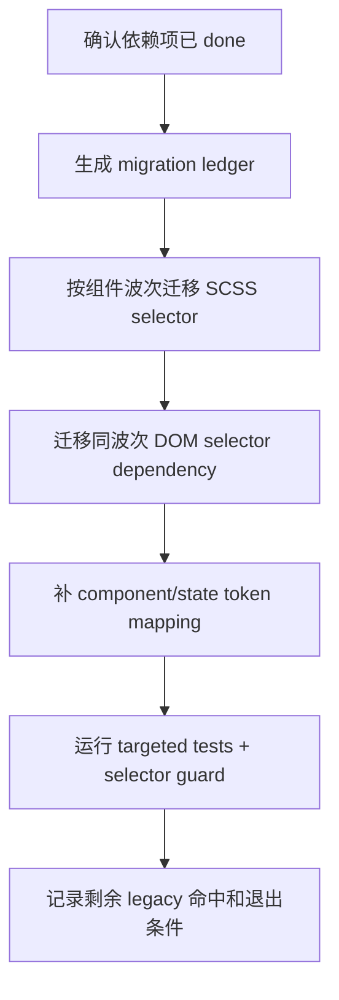

# CodeStable Implementation Review Packet

- root: `/Users/songmingxu/Projects/amis`
- unit: `.codestable/features/2026-07-25-core-component-selector-migration`
- stage: `implementation`

## Reviewer Mission

Review the implementation as an independent Task agent. Verify the code directly from the packet instead of trusting the implementer summary.

## Stage Focus

scope drift, hidden behavior changes, missing tests, maintainability, edge cases, security, and production safety

## Reviewer Output Contract

- Lead with findings, ordered by severity.
- Include severity (`P0`/`P1`/`P2`/`P3`) and confidence for each finding.
- Reference concrete files, code, docs, or validation evidence when possible.
- If there are no blocking findings, say so explicitly and list residual risks or test gaps.

## Unit Documents
### `.codestable/features/2026-07-25-core-component-selector-migration/approval-report.md`

```
---
doc_type: approval-report
unit: 2026-07-25-core-component-selector-migration
status: approved
reason: design-review-local-only-authorization
approvals:
  design-review-local-only: approved
approval_groups: {}
created_at: 2026-07-25
---

# Approval Report

## Decision: design-review-local-only

已批准 owner 降级授权 `design-review-local-only`。

## Decision History

- 2026-07-25：owner 明确回复“批准 core design-review-local-only”，允许独立 reviewer 工具不可用时以本地审查降级完成本轮 design review。

## Why Now

`core-component-selector-migration` 是 theme system refactor epic 的下一个子 feature。按 CodeStable gate，首次 design review 需要独立 Task agent reviewer；当前 reviewer tool 在创建 agent 前被参数 schema 拒绝，无法产生 reviewer id 或审查输出。

## Context

- Design: `.codestable/features/2026-07-25-core-component-selector-migration/core-component-selector-migration-design.md`
- Checklist: `.codestable/features/2026-07-25-core-component-selector-migration/core-component-selector-migration-checklist.yaml`
- Design review checkpoint: `.codestable/features/2026-07-25-core-component-selector-migration/core-component-selector-migration-design-review.md`
- Roadmap item: `core-component-selector-migration`

## Options

### Option A: 批准 `core design-review-local-only`

允许主 agent 对 design / checklist / roadmap / ADR / 前置 feature / 关键代码事实做本地逐项审查，并在审查报告中保留 local-only 降级来源。该批准不等于确认 design，也不进入实现；design 仍需后续 epic 批量确认。

**Decision**：approved，2026-07-25，owner 明确回复“批准 core design-review-local-only”。

### Option B: 不批准，稍后重试独立 reviewer

保持 design-review gate blocked，等待 Task agent reviewer 可用后重试。

## Recommendation

建议批准 Option A。该 feature 当前只落设计和 checklist，不改业务代码；local-only 降级只影响方案审查来源，不会跳过后续实现、code review、QA 或 acceptance。

## Risks And Tradeoffs

- local-only 缺少独立 reviewer 的第二视角，可能漏看波次拆分、依赖准入或高风险组件验证不足。
- 不批准会让 epic child design batch 停在本项，直到 reviewer tool 可用。
- 批准后仍应在本地审查中重点检查 Table/Table2、Select、Dialog/Drawer/Modal、editor/theme-editor 反向边界和 legacy-prefix-teardown 边界。

## Non-Automatic Actions

- 不自动批准 design。
- 不自动进入实现。
- 不自动提交 commit。
- 不自动 push。
- 不跳过后续 code review、QA 或 acceptance。

## After Approval

授权已生效。本轮 design review 可以用 local-only 降级完成，但该授权不自动确认 design，也不进入实现；design 仍需后续 owner 整体确认或 epic 批量确认。
```

### `.codestable/features/2026-07-25-core-component-selector-migration/core-component-selector-migration-checklist.yaml`

```
feature: 2026-07-25-core-component-selector-migration
created: 2026-07-25

steps:
  - action: "实现准入与基线：确认 stylesheet-stable-selector-build 和 overlay-theme-scope-propagation 已 done，并记录 selector/test 基线"
    exit_signal: "items.yaml 依赖状态可证，baseline ledger 能解释当前核心组件命中"
    status: done
  - action: "Migration ledger：建立组件级迁移清单，覆盖 Button/Form/Select/Dialog/Table/Table2/Dropdown/Tooltip/Popover/Page/Layout"
    exit_signal: "每个目标组件都有 SCSS、DOM query、token、测试入口和未迁移状态"
    status: done
  - action: "Wave A：迁移 Button 后续 modifier/mixin 与 Form 基础控件 selector/token"
    exit_signal: "Button/Form targeted tests 或 snapshots 证明 DOM class 与样式路径稳定"
    status: done
  - action: "Wave B：迁移 Dialog/Drawer/Modal 与 Dropdown/Tooltip/Popover/Select 的 SCSS 和 DOM selector dependency"
    exit_signal: "Dialog/Tooltip/Select/DropDownButton targeted tests 通过，selector guard 无新增 legacy 命中"
    status: done
  - action: "Wave C：迁移 Table/Table2 与 Page/Layout 选择器，核对固定列、拖拽、筛选、toolbar、aside/layout"
    exit_signal: "Table/Table2/Page/Layout targeted snapshots 或测试通过，DOM query 不依赖主题前缀"
    status: done
  - action: "剩余命中分类与反向核对：把未迁移命中写入 ledger/allowlist，确认 editor/helper、legacy alias、非目标组件未被误改"
    exit_signal: "剩余命中均有分类、owner 和退出条件，无未解释 .cxd-* / #{$ns} 新增"
    status: done
  - action: "验证与交接：运行 stylelint、selector guard、targeted tests 和 grep，形成 legacy-prefix-teardown 可消费的交接材料"
    exit_signal: "命令输出、ledger 和剩余 legacy 命中说明均可供 legacy-prefix-teardown 直接消费"
    status: done

checks:
  - item: "implementation 开始前重新确认依赖项 status=done，design-review passed 只允许 design admission"
    source: 关键决策
    status: done
  - item: "migration ledger 复用 stylesheet-stable-selector-build 的 inventory/allowlist/guard，不另起平行 selector 数据源"
    source: 名词契约
    status: done
  - item: "classPrefix 依赖已分类为 DOM selector dependency、legacy props passthrough、runtime alias 或 out-of-scope"
    source: 名词契约
    status: done
  - item: "Wave A 覆盖 Button 后续和 Form 基础控件，且不回退 Button pilot"
    source: 推进策略
    status: done
  - item: "Wave B 覆盖 Dialog/Drawer/Modal、Dropdown/Tooltip/Popover/Select，且不改变浮层/关闭/定位语义"
    source: 推进策略
    status: done
  - item: "Wave C 覆盖 Table/Table2、Page/Layout，且不改变表格固定列、拖拽、筛选、toolbar、aside/layout 行为"
    source: 推进策略
    status: done
  - item: "目标组件 SCSS 不新增 .cxd-* / .antd-* / .dark-* 公共选择器"
    source: 范围守护
    status: done
  - item: "目标组件 DOM 主路径使用 .amis-*，默认不依赖 .cxd-*"
    source: 验收场景
    status: done
  - item: "主题差异通过 component/state token 或 [data-amis-theme] 作用域表达"
    source: 验收场景
    status: done
  - item: "未迁移 #{$ns} / .cxd-* / classPrefix 命中均有 ledger 分类、owner 和退出条件"
    source: 交接契约
    status: done
  - item: "不迁移 editor/theme-editor helper、.AMISCSSWrapper、历史 schema 或 generated CSS"
    source: 明确不做
    status: done
  - item: "不删除 classPrefix 字段，不关闭 DOM-only .cxd-* alias，不执行 legacy-prefix-teardown"
    source: 明确不做
    status: done
  - item: "selector guard 是必跑命令；若前置项未提供真实命令，实现阶段必须阻塞或回前置项补齐"
    source: 验证入口
    status: done
  - item: "targeted tests / snapshots 覆盖 Button/Form/Dialog/Tooltip/Select/DropDownButton/Table"
    source: DoD
    status: done
  - item: "acceptance 能从 git diff、ledger、guard 输出和 roadmap 状态核验所有承诺产物"
    source: DoD
    status: done

dod:
  commands:
    - id: CMD-001
      command: "npm run stylelint"
      core: true
      failure_handling: fix-or-block
    - id: CMD-002
      command: "npm run check:theme-selectors --workspace amis-ui"
      core: true
      failure_handling: fix-or-block
    - id: CMD-003
      command: "npm test --workspace amis -- button"
      core: true
      failure_handling: fix-or-block
    - id: CMD-004
      command: "npm test --workspace amis -- Dialog"
      core: true
      failure_handling: fix-or-block
    - id: CMD-005
      command: "npm test --workspace amis -- Tooltip"
      core: true
      failure_handling: fix-or-block
    - id: CMD-006
      command: "npm test --workspace amis -- Select"
      core: true
      failure_handling: fix-or-block
    - id: CMD-007
      command: "npm test --workspace amis -- DropDownButton"
      core: false
      failure_handling: fix-or-block
    - id: CMD-008
      command: "npm test --workspace amis -- Table"
      core: true
      failure_handling: fix-or-block
    - id: CMD-012
      command: "npm test --workspace amis -- drawer"
      core: true
      failure_handling: fix-or-block
    - id: CMD-009
      command: "rg -n -F '#{$ns}' packages/amis-ui/scss/components packages/amis-ui/scss/_mixins.scss"
      core: true
      failure_handling: document-baseline
    - id: CMD-010
      command: "rg -n \"\\.cxd-|\\.antd-|\\.dark-|classPrefix\" packages/amis-core/src packages/amis-ui/src packages/amis/src packages/amis-ui/scss"
      core: true
      failure_handling: document-baseline
    - id: CMD-011
      command: "python3 /Users/songmingxu/.agents/skills/cs-onboard/tools/validate-yaml.py --file .codestable/features/2026-07-25-core-component-selector-migration/core-component-selector-migration-checklist.yaml --yaml-only"
      core: true
      failure_handling: fix-or-block
  evidence_required:
    - migration_ledger
    - command_output
    - targeted_tests
    - DOM_snapshots
    - selector_guard_output
    - remaining_legacy_inventory
    - diff_summary
  cleanliness:
    debug_output: forbidden
    temporary_todo: forbidden
    commented_code: forbidden
    unused_import: forbidden
```

### `.codestable/features/2026-07-25-core-component-selector-migration/core-component-selector-migration-design-review.md`

```
---
doc_type: feature-design-review
feature: 2026-07-25-core-component-selector-migration
status: passed
review_state: passed
review_reason: ""
reviewer_id: "local-only:user-approved-2026-07-25"
reviewed: 2026-07-25
round: 1
---

# core-component-selector-migration feature design 审查报告

## 1. Scope And Inputs

- Design: `.codestable/features/2026-07-25-core-component-selector-migration/core-component-selector-migration-design.md`
- Checklist: `.codestable/features/2026-07-25-core-component-selector-migration/core-component-selector-migration-checklist.yaml`
- Roadmap: `.codestable/roadmap/theme-system-refactor/theme-system-refactor-roadmap.md`
- Roadmap item: `core-component-selector-migration`
- ADR: `.codestable/requirements/adrs/001-tokenized-theme-system.md`
- Prior features: `theme-runtime-button-pilot`, `token-contract-css-layers`, `stylesheet-stable-selector-build`, `overlay-theme-scope-propagation`
- Compound: `.codestable/compound/2026-07-24-explore-cxd-compat-compile-switch.md`
- Code facts checked: `packages/amis-ui/scss/_mixins.scss`, `packages/amis-ui/scss/components/_table.scss`, `packages/amis-ui/scss/components/_modal.scss`, `packages/amis-ui/scss/components/_tooltip.scss`, `packages/amis-ui/scss/components/_page.scss`, `packages/amis/src/renderers/Dialog.tsx`, `packages/amis/src/renderers/Drawer.tsx`, `packages/amis/src/renderers/Table/index.tsx`, `packages/amis/src/renderers/Table2/index.tsx`, `packages/amis-ui/src/components/Modal.tsx`, `packages/amis-ui/src/components/Drawer.tsx`, `packages/amis-ui/src/components/Select.tsx`, `packages/amis-ui/src/components/Tree.tsx`

### Independent Review

- Status: local-only
- Detection: local-only
- Provider / agent: none
- Raw output summary: reviewer tool attempts were rejected before an agent id was created because the tool wrapper still injected empty optional fields or treated `message` and `items` as mixed.
- Merge policy: 本地逐项核验 design、checklist、roadmap、ADR、前置 feature、compound 和关键代码事实。
- Gate effect: owner 已批准 local-only 降级，允许本轮 design review 给出最终 verdict。

## 2. Design Summary

- Goal: 迁移高覆盖组件和渲染器的 `.cxd-*`、`#{$ns}` 与 `classPrefix` DOM selector dependency，改为稳定 `.amis-*` 与 component/state token。
- Key contracts: ComponentMigrationLedger、MigrationWave、SelectorDependencyKind、StableDomSelector、ComponentTokenMapping。
- Steps: 7 步；从实现准入、migration ledger、三组迁移 wave，到剩余命中分类和验证交接。
- Checks: 15 项；覆盖依赖 done 准入、ledger 复用、`classPrefix` 分类、三组 wave、范围守护、selector guard、targeted tests 和 acceptance 可核验性。
- Baseline / validation: 设计列出 stylelint、theme selector guard、Button/Dialog/Tooltip/Select/DropDownButton/Table targeted tests、`#{$ns}` grep、legacy selector/classPrefix grep 和 checklist YAML 校验。

## 3. Findings

### blocking

- none

### important

- none

### nit

- none

### suggestion

- [ ] FDR-001 实现阶段建议把 migration ledger 做成机器可读文件，至少包含组件、selector 类型、旧命中、目标 selector、验证命令、owner 和退出条件。
  - Evidence: design 第 2.1 节已把 ComponentMigrationLedger 定义为本项与 legacy-prefix-teardown 的交接接口；checklist 也要求剩余命中带分类、owner 和退出条件。
  - Impact: 不阻塞 design；机器可读 ledger 能减少后续 legacy-prefix-teardown 重新扫描和人工解释成本。
- [ ] FDR-002 `npm run check:theme-selectors --workspace amis-ui` 是本项核心命令，但它来自前置 `stylesheet-stable-selector-build`，实现阶段必须 fail-closed。
  - Evidence: design 第 1 节关键决策明确复用前置 guard，checklist `CMD-002` 将其列为 core。
  - Impact: 如果实现阶段前置项尚未真正提供该命令，本项不能临时绕开 guard，应回前置项补齐或记录阻塞。

### learning

- 这个 design 正确地区分了 design admission 和 implementation admission：epic batch 允许依赖 design-review passed 后继续起草下游 design，但实现前仍必须等依赖项 `done`。
- Tree 中直接 `.cxd-TreeControl`、Dialog/Drawer/Modal 的 `classPrefix` DOM 查询、Table/Table2 的 selector 字符串说明迁移不是 SCSS 替换题，而是 selector behavior migration。

### praise

- design 用 waves 限制迁移半径，避免把 Table/Table2、Select、Dialog 等大文件一次性改成不可审 diff。
- 明确把 editor/theme-editor、`classPrefix` 字段删除、DOM-only alias 退出都排除在本项之外，和 roadmap 的干净迁移节奏一致。

## 4. User Review Focus

- 用户需要重点拍板：是否认可“核心组件迁移按 ledger + waves 执行”，以及 implementation 前必须等 `stylesheet-stable-selector-build` / `overlay-theme-scope-propagation` 都 `done`。
- implement 需要重点遵守：先建 ledger，不做全仓库替换；每个 wave 都要成对处理 SCSS selector 与 TSX DOM selector dependency；未迁移命中必须有分类和退出条件。
- code review / QA / acceptance 需要重点复核：Table/Table2、Select、Dialog/Drawer/Modal 行为是否不变，editor/theme-editor 是否无范围外 diff，selector guard 是否真实执行。

## 5. Evidence Confidence Ledger

| Check | Verdict | Evidence Class | Basis | Follow-up |
|---|---|---|---|---|
| Acceptance Coverage Matrix | pass | E | design 第 3.2 节覆盖依赖 done、ledger、Button/Form、Dialog/Tooltip/Dropdown/Select、Table/Table2/Page/Layout、guard 和 editor/helper 反向核对 | implementation / QA 落命令与 snapshot 证据 |
| DoD Contract | pass | E | design 第 3.3 节与 checklist `dod.commands` 覆盖 stylelint、selector guard、targeted tests、grep、YAML 校验和 required artifacts | none |
| Steps and checks traceability | pass | E | checklist 7 steps / 15 checks 均可追溯到 design 第 1-3 节 | none |
| Roadmap contract compliance | pass | E/C | roadmap 要求迁移高覆盖组件和渲染器的 `.cxd-*` / `$ns` / `classPrefix` DOM 查询，优先 Button、Form、Select、Dialog、Table/Table2、Dropdown/Tooltip/Popover、Page/Layout；design 全部覆盖且未扩大到 editor/theme-editor | none |
| Module interface design | pass | E/C | ComponentMigrationLedger 被定义为 Component Migration 与 legacy-prefix-teardown 的交接接口；waves、SelectorDependencyKind、StableDomSelector、ComponentTokenMapping 的 seam 清晰 | 实现阶段优先机器可读 ledger |
| Validation and artifacts | pass | E | checklist YAML 与 roadmap items YAML 已校验通过；`git diff --check` 已通过；local-only 授权已记录在 approval-report | none |

Summary: E=6, C=2, H=0, H-only core checks=none。

## 6. Residual Risk

- local-only design review 缺少独立 reviewer 视角；用户 review 应重点看 wave 拆分是否过大，尤其 Table/Table2 与 Page/Layout 是否需要再拆。
- 前置 selector guard 若实现不完整，本项 implementation 会被阻塞；这是故意的 fail-closed 设计，不应通过临时 grep 绕过。
- migration ledger 如果写成散文，后续 teardown 仍会高成本；建议实现阶段尽量使用 YAML/JSON 或固定表格结构。

## 7. Verdict

- Status: passed
- Next: 交回 epic child design batch；所有子 feature design-review passed 后再统一进入 owner design confirmation。

## 8. Focused Closure

- none
```

### `.codestable/features/2026-07-25-core-component-selector-migration/core-component-selector-migration-design.md`

```
---
doc_type: feature-design
feature: 2026-07-25-core-component-selector-migration
roadmap: theme-system-refactor
roadmap_item: core-component-selector-migration
execution_lane: goal
status: approved
summary: 迁移高覆盖组件和渲染器到稳定 .amis-* 选择器与 component/state token
tags: [theme, selector, component-migration, class-prefix, token]
---

# core-component-selector-migration feature design

## 0. 术语约定

| 术语 | 定义 | 防冲突结论 |
|---|---|---|
| Component selector migration | 将组件 DOM class、SCSS selector 和 DOM 查询从主题前缀身份迁移到稳定 `.amis-*` 组件身份。 | 不是删除 `classPrefix` 字段；`classPrefix` 仍可能作为 legacy/internal 传参存在。 |
| Migration ledger | 本 feature 的迁移清单，按组件 / selector / DOM query / token 状态记录范围、证据和未完成项。 | 依赖 `stylesheet-stable-selector-build` 的 inventory/allowlist/guard，不另起第二套 selector 数据源。 |
| Stable component class | 由 `ThemeInstance.classnames` 主路径输出的 `.amis-Component` / `.amis-Component--state`。 | ADR-001 和 Button pilot 已把 `amis-` 定为稳定前缀；本 feature 不再讨论前缀命名。 |
| Component/state token | 面向组件和状态的 `--amis-{Component}-...` token 或既有旧 token alias。 | 不重新定义 token taxonomy；消费 `token-contract-css-layers` 的分层和 alias 规则。 |
| DOM selector dependency | TS/TSX 中通过 `classPrefix`、`.cxd-*`、`.antd-*` 或主题前缀类名做 `querySelector` / `closest` / `matches` 的行为依赖。 | 只迁移样式/DOM 选择器依赖；普通 props 传递、legacy alias 开关和非样式配置不在本项强删。 |

## 1. 决策与约束

### 需求摘要

本 feature 承接 Theme Runtime、Token Contract、Stylesheet Build 和 Overlay Scope 的前置设计，目标是把高覆盖组件与渲染器的公共样式身份迁移到稳定 `.amis-*`：优先处理 Button 后续样式、Form、Select、Dialog/Drawer/Modal、Table/Table2、Dropdown/Tooltip/Popover、Page/Layout。迁移范围同时覆盖 SCSS 中的 `#{$ns}`、源码中的样式 DOM 查询，以及需要从组件/state token 读取的主题差异。

明确不做：

- 不迁移 editor/theme-editor helper、`.AMISCSSWrapper`、历史 schema 或生成 CSS；这些属于 `editor-theme-helper-migration`。
- 不删除 `classPrefix` 公共字段，不关闭 DOM-only `.cxd-*` alias；收敛和退出机制属于 `legacy-prefix-teardown`。
- 不要求全仓库所有组件一次清零；本项只覆盖 roadmap 指定的高覆盖组件和被它们直接依赖的 selector。
- 不新增 SCSS `.cxd-*` / `.antd-*` / `.dark-*` 兼容输出，不把主题前缀类名继续作为用户定制入口。
- 不改变组件业务行为、表格拖拽/固定列/筛选、Select 搜索、多选、Dialog/Drawer 关闭和浮层定位语义。

### 复杂度档位

- 结构 = modules（跨 amis-core、amis-ui、amis 渲染器、SCSS 和测试）。
- 可读性 = public（贡献者会继续按迁移规则写新组件样式）。
- 可演进性 = stable（迁移 ledger 和 guard 会决定后续 legacy-prefix-teardown 的输入）。
- 可测试性 = verified（需要 DOM snapshot / targeted test / guard / grep / diff review 多证据）。
- Compatibility = backward-compatible migration（稳定 `.amis-*` 是主路径，DOM-only legacy alias 只作为显式迁移辅助保留）。

### 关键决策

1. **按迁移波次推进，不按全仓库字符串替换推进**
   Table/Table2、Form、Select、Dialog/Drawer/Modal 等组件体量大、状态多，必须用 migration ledger 和波次验收，而不是一次性 `#{$ns}` 替换。

2. **`classPrefix` 依赖先分类再迁移**
   `classPrefix` 用途至少分为：legacy/internal props passthrough、DOM selector dependency、theme runtime alias、组件业务配置。只有 DOM selector dependency 和样式 source-of-truth 是本项迁移对象。

3. **SCSS 和 TSX 必须成对验证**
   只把 SCSS 改成 `.amis-*` 不够；Dialog、Drawer、Modal、PopOver、Table 等源码里还有 `querySelector`、`matches`、`handle`、nested selector 字符串。迁移必须同时核对 DOM 查询路径。

4. **优先复用 Stylesheet Build 的 guard**
   本 feature 消费 `npm run check:theme-selectors --workspace amis-ui` 或等价 selector guard，不另写并行检查。guard 缺失时实现阶段必须先回到前置项补齐或记录阻塞。

5. **实现 admission 严格等待依赖 done**
   epic batch 允许本 design 在 `stylesheet-stable-selector-build` 与 `overlay-theme-scope-propagation` design-review passed 后起草；implementation 开始前必须重新读取 items.yaml，确认这两个依赖已 `done`。

### 基线风险与验证入口

- `packages/amis-ui/scss/_mixins.scss` 仍有 Button、Form control、ResultBox 等 `#{$ns}` helper 命中；这些会影响多个组件。
- `packages/amis-ui/scss/components/_table.scss`、`_modal.scss`、`_tooltip.scss`、`_page.scss` 等高覆盖 SCSS 大量使用 `#{$ns}`。
- `packages/amis/src/renderers/Dialog.tsx` / `Drawer.tsx` 通过 `classPrefix` 查询 Modal/Drawer content；`packages/amis-ui/src/components/Modal.tsx` / `Drawer.tsx` 通过 `${ns}Modal` / `${ns}Drawer-overlay` 判断 closeOnOutside；Table/Table2 也有多处 selector 字符串。
- `packages/amis-ui/src/components/Tree.tsx` 存在直接 `.cxd-TreeControl` 查询，属于后续 ledger 必须分类的硬命中。
- Button pilot 已证明 `.amis-Button` 和 `[data-amis-theme]` 最小路径；本项需要把 proof 扩展到高覆盖组件。

### Top 3 风险

1. **批量替换破坏行为语义**：DOM 查询、RootClose、拖拽、固定列、筛选等行为依赖 selector。缓解：先建 migration ledger，每波迁移只改一组组件，并用 targeted tests / snapshots / diff review 验证。
2. **迁移范围失控到 editor/helper 或 legacy teardown**：核心组件迁移很容易顺手清理 editor 和 alias。缓解：design/checklist 明确反向核对 editor/theme-editor、DOM-only alias、`classPrefix` 字段删除均不在本项。
3. **新旧 selector 长期并存但无退出信号**：如果只改一部分 selector，legacy-prefix-teardown 无法判断剩余债务。缓解：每个未迁移命中必须在 ledger/allowlist 有分类、owner、退出条件和后续 item。

## 2. 名词与编排

### 2.1 名词层

#### 现状

- Theme Runtime 已让 `ThemeInstance.classnames` 默认输出 `.amis-*`，Button pilot 已在 `_button.scss` 建立最小 `.amis-Button` / `[data-amis-theme='cxd']` proof。
- Stylesheet Build design 定义了 Stable selector helper、selector inventory、allowlist 和新增 selector guard，但这些工具尚未在本项实现前完成。
- Overlay Scope design 把 portal theme scope 独立出来，避免 Dialog/Tooltip/Select 的类名迁移后在 body container 下丢 token scope。
- 高覆盖 SCSS 仍大量依赖 `#{$ns}`，例如 `_table.scss`、`_modal.scss`、`_tooltip.scss`、`_page.scss` 和 `_mixins.scss`。
- 源码中既有 `classPrefix` 普通透传，也有 DOM selector dependency，例如 Dialog/Drawer 的 `getPopOverContainer()`、Modal/Drawer 的 closeOnOutside `matches()`、Table/Table2 的 nested selector 字符串。

#### 变化

新增或固化以下名词：

| 名词 | 形态 | 职责 |
|---|---|---|
| ComponentMigrationLedger | 机器可读或 Markdown 清单 | 记录每个目标组件的 SCSS selector、DOM query、token、snapshot/test、未迁移原因。 |
| MigrationWave | 迁移批次 | 按 Button/Form/Select/Dialog/Table/Overlay/Page 等高覆盖组件分组，每波可独立验证。 |
| SelectorDependencyKind | 分类枚举 | 区分 `scss-selector`、`dom-query`、`legacy-props-passthrough`、`runtime-alias`、`editor-out-of-scope`。 |
| StableDomSelector | helper / 字符串生成约定 | DOM 查询使用 `.amis-*` 或从 stable classnames 派生的 selector，不再拼主题前缀类名。 |
| ComponentTokenMapping | token 映射表 | 记录组件样式差异从旧变量 / `$ns` selector 迁移到 `--amis-*` token 或旧 token alias 的路径。 |

接口示例：

```yaml
components:
  Dialog:
    scss: packages/amis-ui/scss/components/_modal.scss
    dom_queries:
      - packages/amis/src/renderers/Dialog.tsx#getPopOverContainer
    stable_selector: .amis-Modal-content
    legacy_dependency_kind: dom-query
    validation:
      - npm test --workspace amis -- Dialog
```

Interface 设计检查：

- Module / interface：ComponentMigrationLedger 是 Component Migration 与 legacy-prefix-teardown 之间的交接接口。
- Seam placement：seam 放在 selector helper / ledger / component waves，而不是让每个组件临时决定如何解释 `classPrefix`。
- Depth / locality：每个迁移波次只需要消费 ledger、helper、guard 和该组件测试；未完成项可追溯到同一 ledger。
- Dependency category：repository-local build/test + DOM render tests；无远程服务。
- Adapter：DOM-only legacy alias 不是 adapter，只是 Theme Runtime 的显式迁移输出；本项不扩大。
- Test surface：targeted Jest / snapshots、selector guard、stylelint、grep、diff review。

### 2.2 编排层

#### 现状

当前主路径是“组件 TSX 使用 `cx('Component')` 输出 class，但 SCSS 多数仍以 `#{$ns}` 编译到主题前缀选择器；源码 DOM 查询有些仍拼 `classPrefix`”。Button 已局部切到 `.amis-Button`，但 Form/Select/Dialog/Table/Page 等仍缺少成套迁移证据。

#### 变化

主流程是“ledger → 波次迁移 → 守护验证 → 交接 teardown”的批处理流程：



流程级约束：

- implementation admission 前重新读取 roadmap items.yaml；依赖未 `done` 时只能停，不允许实现。
- 每个 wave 必须先记录基线，再迁移，再运行对应测试和 guard。
- `cx('Component')` 生成的稳定 class 是 DOM 主路径；手写 `.amis-*` 只允许在 SCSS/helper、测试断言或明确 DOM selector helper 中出现。
- 迁移 DOM 查询时优先使用 stable classnames / stable selector helper；不新增 `.cxd-*`、`.antd-*`、`.dark-*` 查询。
- 未迁移命中必须留在 ledger/allowlist 中，带原因和后续 owner；不能只在 review 里口头说明。

### 2.3 挂载点清单

- ComponentMigrationLedger：删掉后无法知道哪些核心组件已迁移、哪些 legacy selector 仍需 legacy-prefix-teardown 处理。
- Core component SCSS selector migrations：删掉后高覆盖组件仍依赖主题前缀 CSS。
- Core renderer DOM query migrations：删掉后 Dialog/Drawer/Table/Tree 等行为仍依赖 `classPrefix` 或 `.cxd-*`。
- Component/state token mapping：删掉后主题差异仍停留在旧变量或主题前缀 selector。
- Targeted tests / snapshots / selector guard evidence：删掉后无法证明迁移没有破坏行为或新增 legacy selector。

### 2.4 推进策略

1. **实现准入与基线**：确认 `stylesheet-stable-selector-build` 和 `overlay-theme-scope-propagation` 已 done，运行 selector guard / stylelint / 核心 grep 记录基线。
   退出信号：依赖状态可证，baseline ledger 能解释当前核心组件命中。
2. **Migration ledger**：建立组件级 ledger，按 Button/Form/Select/Dialog/Table/Table2/Dropdown/Tooltip/Popover/Page/Layout 分类 SCSS、DOM query、token、测试入口和未迁移项。
   退出信号：每个目标组件都有迁移状态和验证入口。
3. **Wave A：Button 后续 + Form 基础控件**：把 Button pilot 后续 modifier / mixin 依赖和 Form 基础选择器迁到 stable selector/token 路径。
   退出信号：Button/Form targeted tests 或 snapshots 证明 DOM class 与样式路径稳定。
4. **Wave B：Dialog/Drawer/Modal + Dropdown/Tooltip/Popover/Select**：迁移浮层相关组件 SCSS 和 DOM query，消费 Overlay Scope 的 scope 传播。
   退出信号：Dialog/Tooltip/Select/DropDownButton targeted tests 通过，且 selector guard 无新增 legacy 命中。
5. **Wave C：Table/Table2 + Page/Layout**：迁移高覆盖布局和表格选择器，特别核对固定列、拖拽、筛选、toolbar、aside/layout。
   退出信号：Table/Table2/Page/Layout targeted snapshots 或测试通过，DOM query 不依赖主题前缀。
6. **剩余命中分类与反向核对**：把未迁移命中归入 ledger/allowlist，确认 editor/theme-editor、legacy alias、非目标组件未被误改。
   退出信号：剩余命中均有分类、owner 和退出条件；无未解释 `.cxd-*` / `#{$ns}` 新增。
7. **验证与交接**：运行 stylelint、selector guard、workspace targeted tests 和 grep，更新 implementation/QA/acceptance 输入。
   退出信号：命令输出和 ledger 可供 legacy-prefix-teardown 直接消费。

### 2.5 结构健康度与微重构

##### 评估

- 文件级 — `packages/amis-ui/scss/_mixins.scss`：现有 mixin 混合 Button、Form、ResultBox 等 selector 逻辑；本项应消费/扩展 stable helper，不在这里做全量 mixin 拆分。
- 文件级 — `packages/amis-ui/scss/components/_table.scss`：体量大且 `#{$ns}` 密集，是高风险迁移波次；需要单独 wave 和测试证据。
- 文件级 — `packages/amis/src/renderers/Table/index.tsx` / `Table2/index.tsx`：文件巨大且 DOM selector 字符串较多，迁移要避免顺手重构业务逻辑。
- 文件级 — `packages/amis-ui/src/components/Select.tsx`：文件超过千行，迁移只处理 selector/token 相关点，不拆组件。
- 文件级 — `packages/amis/src/renderers/Dialog.tsx` / `Drawer.tsx` 与 `packages/amis-ui/src/components/Modal.tsx` / `Drawer.tsx`：close/root/container 行为敏感，需最小改动。
- 目录级 — `packages/amis-ui/scss/components` 已经高度扁平；本 feature 不新增成批组件 SCSS 文件。
- compound / ADR 命中：DOM-only `.cxd-*` alias 只能迁移辅助；SCSS/CSS legacy selector 兼容被拒绝。

##### 结论：不做前置微重构

##### 方案

- 不搬迁现有胖组件文件，不拆 Table/Select/Dialog 业务逻辑。
- 只允许新增/更新 migration ledger、targeted test fixture、selector/token helper 消费点。
- 如果实现阶段发现必须拆文件才能安全迁移某个组件，该组件 wave 应暂停，另开 `cs-refactor` 或拆出新的 roadmap item，不在本项里夹带行为重构。

##### 超出范围的观察

- Table/Table2 和 Select 的长期可维护性问题真实存在，但这次迁移目标是主题 selector source-of-truth，不是组件架构重写。
- 旧 `classPrefix` 字段的最终删除与 public API 收口属于 `legacy-prefix-teardown`，不能在本项完成前提前执行。

## 3. 验收契约

### 3.1 关键场景清单

- 输入：Button/Form/Select/Dialog/Table/Page 等核心组件渲染 → 期望 DOM 主类名为 `.amis-*`，默认不依赖 `.cxd-*`。
- 输入：核心组件 SCSS 编译或源码 grep → 期望目标 wave 的 `#{$ns}` / `.cxd-*` 命中已迁移或在 ledger 中有解释。
- 输入：Dialog/Drawer/Modal closeOnOutside、Select 下拉、Dropdown/Tooltip/Popover、Table 固定列/筛选/拖拽 → 期望行为不因 selector 迁移改变。
- 输入：两个 theme scope 下使用同一核心组件 → 期望样式差异走 token / `[data-amis-theme]`，不生成主题前缀组件类名。
- 输入：selector guard 运行 → 期望无新增 public `.cxd-*` / `.antd-*` / `.dark-*` selector，无未分类新增 `#{$ns}`。
- 反向核对：不迁移 editor/theme-editor CSS，不删除 `classPrefix` 字段，不关闭 DOM-only legacy alias，不做全组件清零承诺。

### 3.2 Acceptance Coverage Matrix

| Scenario | Covered By Step | Evidence Type | Command / Action | Core? |
|---|---|---|---|---|
| implementation admission 依赖 done | S1 | items.yaml / workflow hook | `codestable-workflow-next.py epic --roadmap ... --json` | yes |
| migration ledger 覆盖核心组件 | S2 | ledger diff review | ledger path + selector inventory diff | yes |
| Button/Form stable selector | S3 | test / snapshot / grep | `npm test --workspace amis -- button` + Form targeted test | yes |
| Dialog/Tooltip/Dropdown/Select stable selector 与行为不变 | S4 | test / DOM assertion | `npm test --workspace amis -- Dialog` / `Tooltip` / `Select` / `DropDownButton` | yes |
| Table/Table2/Page/Layout stable selector | S5 | snapshot / targeted test / grep | Table/Table2/Page/Layout targeted tests | yes |
| guard 无新增 legacy selector | S6 / S7 | command | `npm run check:theme-selectors --workspace amis-ui` | yes |
| editor/helper 未被误迁移 | S6 | diff review | `git diff -- packages/amis-editor-core packages/amis-theme-editor-helper` | yes |

### 3.3 DoD Contract

| ID | 要求 | 证据 | 阻塞级别 |
|---|---|---|---|
| DOD-DESIGN-001 | design 与 checklist 覆盖迁移 ledger、组件 waves、DOM query、token、guard 和范围边界 | design review | blocking |
| DOD-IMPL-001 | checklist steps 完成，migration ledger 与 selector guard 证据落盘 | checklist / implementation report | blocking |
| DOD-REVIEW-001 | code review passed，确认没有范围外 editor/helper/legacy teardown | review report | blocking |
| DOD-QA-001 | QA 覆盖核心组件 DOM class、关键行为和 guard | QA report | blocking |
| DOD-ACCEPT-001 | acceptance 回写 roadmap 状态，并把剩余 legacy 命中交给 legacy-prefix-teardown | acceptance report | blocking |

Validation Commands:

| ID | 命令 | 目的 | 核心性 | 失败处理 |
|---|---|---|---|---|
| CMD-001 | `npm run stylelint` | 校验 SCSS 基础规则 | core | fix-or-block |
| CMD-002 | `npm run check:theme-selectors --workspace amis-ui` | 校验没有新增未分类 legacy selector | core | fix-or-block |
| CMD-003 | `npm test --workspace amis -- button` | 验证 Button pilot 不回退 | core | fix-or-block |
| CMD-004 | `npm test --workspace amis -- Dialog` | 验证 Dialog/Modal selector 和行为 | core | fix-or-block |
| CMD-005 | `npm test --workspace amis -- Tooltip` | 验证 Tooltip/Overlay selector 和行为 | core | fix-or-block |
| CMD-006 | `npm test --workspace amis -- Select` | 验证 Select 下拉层 selector 和行为 | core | fix-or-block |
| CMD-007 | `npm test --workspace amis -- DropDownButton` | 验证 Dropdown menu selector 和行为 | supporting | fix-or-block |
| CMD-008 | `npm test --workspace amis -- Table` | 验证 Table/Table2 关键路径 | core | fix-or-block |
| CMD-009 | `rg -n -F '#{$ns}' packages/amis-ui/scss/components packages/amis-ui/scss/_mixins.scss` | 记录剩余 `#{$ns}` 命中并核对 ledger | core | document-baseline |
| CMD-010 | `rg -n "\\.cxd-|\\.antd-|\\.dark-|classPrefix" packages/amis-core/src packages/amis-ui/src packages/amis/src packages/amis-ui/scss` | 核对 DOM query / legacy selector 剩余命中 | core | document-baseline |
| CMD-011 | `python3 /Users/songmingxu/.agents/skills/cs-onboard/tools/validate-yaml.py --file .codestable/features/2026-07-25-core-component-selector-migration/core-component-selector-migration-checklist.yaml --yaml-only` | 校验 checklist YAML | core | fix-or-block |

Required Artifacts: design、checklist、design-review、migration ledger、implementation report、code review、QA、acceptance、selector guard 输出、targeted test 输出、剩余 legacy 命中说明。

## 4. 与项目级架构文档的关系

- 本 feature 消费 ADR-001 的稳定 `.amis-*`、ThemeScope、DOM-only alias 和非 SCSS legacy selector 兼容结论，不新增替代 ADR。
- 本 feature 消费 `stylesheet-stable-selector-build` 的 helper / inventory / allowlist / guard；如果实现发现 guard 契约不足，应回前置项修正，而不是在本项另起平行 guard。
- acceptance 后如 migration ledger 形成稳定格式，应作为 legacy-prefix-teardown 的输入并可沉淀为 architecture / compound 约定。
```

### `.codestable/features/2026-07-25-core-component-selector-migration/core-component-selector-migration-evidence-pack.md`

```
---
doc_type: feature-evidence-pack
feature: 2026-07-25-core-component-selector-migration
status: generated
---

# 2026-07-25-core-component-selector-migration evidence pack

## 1. Scope

- Design: `.codestable/features/2026-07-25-core-component-selector-migration/core-component-selector-migration-design.md`
- Checklist: `.codestable/features/2026-07-25-core-component-selector-migration/core-component-selector-migration-checklist.yaml`

## 2. DoD Results

```json
{
  "gate_id": "dod-runner",
  "stage": "implementation.before_review",
  "status": "passed",
  "blocking": [],
  "warnings": [],
  "evidence": [
    {
      "command": "npm run stylelint",
      "exit_code": 0,
      "stdout": "\n> stylelint\n> npx stylelint 'packages/**/*.scss'\n\n",
      "stderr": "",
      "id": "CMD-001",
      "core": true,
      "failure_handling": "fix-or-block"
    },
    {
      "command": "npm run check:theme-selectors --workspace amis-ui",
      "exit_code": 0,
      "stdout": "\n> amis-ui@6.13.0 check:theme-selectors\n> node ./scripts/checkThemeSelectors.js\n\nTheme selector guard passed: 1507 legacy baseline match(es), 0 new violation(s).\n",
      "stderr": "",
      "id": "CMD-002",
      "core": true,
      "failure_handling": "fix-or-block"
    },
    {
      "command": "npm test --workspace amis -- button",
      "exit_code": 0,
      "stdout": "\n> amis@6.13.0 test\n> jest button\n\n",
      "stderr": "PASS __tests__/renderers/ButtonToolbar.test.tsx (8.32 s)\nPASS __tests__/renderers/Form/buttonToolBar.test.tsx (8.414 s)\nPASS __tests__/renderers/Form/button.test.tsx (8.428 s)\nPASS __tests__/renderers/Form/buttonGroupSelect.test.tsx (8.858 s)\nPASS __tests__/renderers/DropDownButton.test.tsx (10.47 s)\n\nTest Suites: 5 passed, 5 total\nTests:       19 passed, 19 total\nSnapshots:   20 passed, 20 total\nTime:        11.134 s\nRan all test suites matching /button/i.\n",
      "id": "CMD-003",
      "core": true,
      "failure_handling": "fix-or-block"
    },
    {
      "command": "npm test --workspace amis -- Dialog",
      "exit_code": 0,
      "stdout": "\n> amis@6.13.0 test\n> jest Dialog\n\n",
      "stderr": "PASS __tests__/renderers/Dialog.test.tsx (6.798 s)\nPASS __tests__/event-action/dialog.test.tsx (12.686 s)\n\nTest Suites: 2 passed, 2 total\nTests:       12 passed, 12 total\nSnapshots:   14 passed, 14 total\nTime:        13.352 s, estimated 16 s\nRan all test suites matching /Dialog/i.\n",
      "id": "CMD-004",
      "core": true,
      "failure_handling": "fix-or-block"
    },
    {
      "command": "npm test --workspace amis -- Tooltip",
      "exit_code": 0,
      "stdout": "\n> amis@6.13.0 test\n> jest Tooltip\n\n",
      "stderr": "PASS __tests__/renderers/TooltipWrapper.test.tsx (9.782 s)\n  ✓ Renderer:TooltipWrapper with trigger & title (1074 ms)\n  ✓ Renderer:TooltipWrapper with offset (520 ms)\n  ✓ Renderer:TooltipWrapper with showArrow (1015 ms)\n  ✓ Renderer:TooltipWrapper with tooltipTheme (510 ms)\n  ✓ Renderer:TooltipWrapper with mouseEnterDelay & mouseLeaveDelay (1015 ms)\n  ✓ Renderer:TooltipWrapper with context data (523 ms)\n  ✓ Renderer:TooltipWrapper with inline (41 ms)\n  ✓ Renderer:TooltipWrapper with style & tooltipStyle (513 ms)\n  ✓ Renderer:TooltipWrapper with wrapperComponent (9 ms)\n\nTest Suites: 1 passed, 1 total\nTests:       9 passed, 9 total\nSnapshots:   6 passed, 6 total\nTime:        10.083 s, estimated 12 s\nRan all test suites matching /Tooltip/i.\n",
      "id": "CMD-005",
      "core": true,
      "failure_handling": "fix-or-block"
    },
    {
      "command": "npm test --workspace amis -- Select",
      "exit_code": 0,
      "stdout": "\n> amis@6.13.0 test\n> jest Select\n\n",
      "stderr": "PASS __tests__/renderers/Form/usersSelect.test.tsx (10.453 s)\nPASS __tests__/renderers/Form/mobileNestSelect.test.tsx (10.613 s)\nPASS __tests__/renderers/Form/chainedSelect.test.tsx (11.08 s)\nPASS __tests__/renderers/Form/buttonGroupSelect.test.tsx (11.144 s)\nPASS __tests__/renderers/Form/listSelect.test.tsx (13.279 s)\nPASS __tests__/renderers/Form/nestedSelect.test.tsx (13.349 s)\nPASS __tests__/renderers/Form/select.test.tsx (14.074 s)\n\nTest Suites: 7 passed, 7 total\nTests:       31 passed, 31 total\nSnapshots:   25 passed, 25 total\nTime:        14.715 s, estimated 21 s\nRan all test suites matching /Select/i.\n",
      "id": "CMD-006",
      "core": true,
      "failure_handling": "fix-or-block"
    },
    {
      "command": "npm test --workspace amis -- DropDownButton",
      "exit_code": 0,
      "stdout": "\n> amis@6.13.0 test\n> jest DropDownButton\n\n",
      "stderr": "PASS __tests__/renderers/DropDownButton.test.tsx (7.765 s)\n  ✓ Renderer:dropdown-button (58 ms)\n  ✓ Renderer:dropdown-button with buttons group (29 ms)\n  ✓ Renderer:dropdown-button with closeOnClick & closeOnOutside (2057 ms)\n  ✓ Renderer:dropdown-button with trigger (215 ms)\n  ✓ Renderer:dropdown-button with icon & rightIcon (7 ms)\n  ✓ Renderer:dropdown-button with hideCaret (7 ms)\n  ✓ Renderer:dropdown-button with defaultIsOpened (9 ms)\n  ✓ Renderer:dropdown-button with align (13 ms)\n  ✓ Renderer:dropdown-button with block & size (10 ms)\n  ✓ Renderer:dropdown-button buttons with className & level (9 ms)\n\nTest Suites: 1 passed, 1 total\nTests:       10 passed, 10 total\nSnapshots:   8 passed, 8 total\nTime:        8.213 s, estimated 11 s\nRan all test suites matching /DropDownButton/i.\n",
      "id": "CMD-007",
      "core": false,
      "failure_handling": "fix-or-block"
    },
    {
      "command": "npm test --workspace amis -- Table",
      "exit_code": 0,
      "stdout": "\n> amis@6.13.0 test\n> jest Table\n\n",
      "stderr": "PASS __tests__/renderers/Table/index.test.tsx (7.324 s)\nPASS __tests__/renderers/TableView.test.tsx (7.383 s)\nPASS __tests__/renderers/Table/Cell.test.tsx (7.576 s)\nPASS __tests__/renderers/Table.test.tsx (10.024 s)\nPASS __tests__/renderers/Form/inputTable.test.tsx (19.221 s)\n\nTest Suites: 5 passed, 5 total\nTests:       49 passed, 49 total\nSnapshots:   22 passed, 22 total\nTime:        19.876 s, estimated 21 s\nRan all test suites matching /Table/i.\n",
      "id": "CMD-008",
      "core": true,
      "failure_handling": "fix-or-block"
    },
    {
      "command": "npm test --workspace amis -- drawer",
      "exit_code": 0,
      "stdout": "\n> amis@6.13.0 test\n> jest drawer\n\n",
      "stderr": "PASS __tests__/renderers/DrawerThemeScope.test.tsx (6.235 s)\nPASS __tests__/event-action/drawer.test.tsx (16.088 s)\n\nTest Suites: 2 passed, 2 total\nTests:       7 passed, 7 total\nSnapshots:   14 passed, 14 total\nTime:        16.803 s, estimated 17 s\nRan all test suites matching /drawer/i.\n",
      "id": "CMD-012",
      "core": true,
      "failure_handling": "fix-or-block"
    },
    {
      "command": "rg -n -F '#{$ns}' packages/amis-ui/scss/components packages/amis-ui/scss/_mixins.scss",
      "exit_code": 0,
      "stdout": "/amis-ui/scss/components/_tabs.scss:679:          > .#{$ns}Tabs-links\npackages/amis-ui/scss/components/_tabs.scss:680:          > .#{$ns}Tabs-link {\npackages/amis-ui/scss/components/_tabs.scss:690:      .#{$ns}Tabs-addable {\npackages/amis-ui/scss/components/_tabs.scss:702:    > .#{$ns}Tabs-linksContainer-wrapper\npackages/amis-ui/scss/components/_tabs.scss:703:      > .#{$ns}Tabs-linksContainer\npackages/amis-ui/scss/components/_tabs.scss:704:      > .#{$ns}Tabs-linksContainer-main\npackages/amis-ui/scss/components/_tabs.scss:705:      > .#{$ns}Tabs-links {\npackages/amis-ui/scss/components/_tabs.scss:830:    > .#{$ns}Tabs-linksWrapper {\npackages/amis-ui/scss/components/_tabs.scss:836:    > .#{$ns}Tabs-linksWrapper > .#{$ns}Tabs-links {\npackages/amis-ui/scss/components/_tabs.scss:892:    > .#{$ns}Tabs-linksWrapper + .#{$ns}Tabs-content {\npackages/amis-ui/scss/components/_tabs.scss:896:    > .#{$ns}Tabs-content {\npackages/amis-ui/scss/components/_tabs.scss:900:      > .#{$ns}Tabs-pane {\npackages/amis-ui/scss/components/_tabs.scss:913:      > .#{$ns}Tabs-content {\npackages/amis-ui/scss/components/_tabs.scss:920:      > .#{$ns}Tabs-content {\npackages/amis-ui/scss/components/_tabs.scss:925:    > .#{$ns}Tabs-linksWrapper {\npackages/amis-ui/scss/components/_tabs.scss:931:    > .#{$ns}Tabs-linksWrapper > .#{$ns}Tabs-links {\npackages/amis-ui/scss/components/_tabs.scss:968:          .#{$ns}Icon {\npackages/amis-ui/scss/components/_tabs.scss:992:    > .#{$ns}Tabs-content {\npackages/amis-ui/scss/components/_tabs.scss:996:      > .#{$ns}Tabs-pane {\npackages/amis-ui/scss/components/_tabs.scss:1003:    > .#{$ns}Tabs-linksWrapper {\npackages/amis-ui/scss/components/_tabs.scss:1008:      > .#{$ns}Tabs-addable {\npackages/amis-ui/scss/components/_tabs.scss:1015:    > .#{$ns}Tabs-linksWrapper > .#{$ns}Tabs-links {\npackages/amis-ui/scss/components/_tabs.scss:1126:    & > .#{$ns}Tabs-linksContainer-wrapper {\npackages/amis-ui/scss/components/_tabs.scss:1129:      .#{$ns}Tabs-addable {\npackages/amis-ui/scss/components/_tabs.scss:1133:      & > .#{$ns}Tabs-linksContainer {\npackages/amis-ui/scss/components/_tabs.scss:1134:        > .#{$ns}Tabs-linksContainer-arrow {\npackages/amis-ui/scss/components/_tabs.scss:1139:        > .#{$ns}Tabs-linksContainer-main > .#{$ns}Tabs-links {\npackages/amis-ui/scss/components/_tabs.scss:1188:            & > .#{$ns}Tabs-link-close {\npackages/amis-ui/scss/components/_tabs.scss:1196:            &:not(.is-disabled):hover .#{$ns}Tabs-link-close {\npackages/amis-ui/scss/components/_tabs.scss:1214:    > .#{$ns}Tabs-content {\npackages/amis-ui/scss/components/_tabs.scss:1220:    & > .#{$ns}Tabs-linksContainer-wrapper {\npackages/amis-ui/scss/components/_tabs.scss:1224:      .#{$ns}Tabs-addable {\npackages/amis-ui/scss/components/_tabs.scss:1237:        > .#{$ns}Tabs-addable-icon {\npackages/amis-ui/scss/components/_tabs.scss:1246:      > .#{$ns}Tabs-linksContainer {\npackages/amis-ui/scss/components/_tabs.scss:1249:        .#{$ns}Tabs-linksContainer-arrow {\npackages/amis-ui/scss/components/_tabs.scss:1271:        > .#{$ns}Tabs-linksContainer-main\npackages/amis-ui/scss/components/_tabs.scss:1272:          > .#{$ns}Tabs-links\npackages/amis-ui/scss/components/_tabs.scss:1273:          > .#{$ns}Tabs-link {\npackages/amis-ui/scss/components/_tabs.scss:1369:          &:not(.is-disabled):hover .#{$ns}Tabs-link-close {\npackages/amis-ui/scss/components/_tabs.scss:1402:  .#{$ns}Tabs--line {\npackages/amis-ui/scss/components/_tabs.scss:1403:    .#{$ns}Tabs-linksContainer-wrapper {\npackages/amis-ui/scss/components/_overflow-tpl.scss:1:.#{$ns}OverflowTpl {\npackages/amis-ui/scss/components/_app.scss:1:.#{$ns}AppBcn {\npackages/amis-ui/scss/components/_app.scss:26:.#{$ns}AppFoldBtn {\npackages/amis-ui/scss/components/_app.scss:33:.#{$ns}AppLogo-html {\npackages/amis-ui/scss/components/_app.scss:38:.#{$ns}AppContent {\npackages/amis-ui/scss/components/_app.scss:43:.#{$ns}AppBody {\npackages/amis-ui/scss/components/_picker-columns.scss:1:.#{$ns}PickerColumns {\n",
      "stderr": "",
      "id": "CMD-009",
      "core": true,
      "failure_handling": "document-baseline"
    },
    {
      "command": "rg -n \"\\.cxd-|\\.antd-|\\.dark-|classPrefix\" packages/amis-core/src packages/amis-ui/src packages/amis/src packages/amis-ui/scss",
      "exit_code": 0,
      "stdout": "nents/table/Row.tsx:255:          classPrefix={classPrefix}\npackages/amis-ui/src/components/table/Row.tsx:298:            classPrefix={classPrefix}\npackages/amis-ui/src/components/table/Row.tsx:317:          classPrefix={classPrefix}\npackages/amis-ui/src/components/table/Row.tsx:353:            classPrefix={classPrefix}\npackages/amis-ui/src/components/table/Row.tsx:363:            classPrefix={classPrefix}\npackages/amis-ui/src/components/table/HeadCellFilter.tsx:33:  classPrefix: string;\npackages/amis-ui/src/components/table/HeadCellFilter.tsx:97:      classPrefix: ns,\npackages/amis-ui/src/components/table/HeadCellFilter.tsx:124:                      classPrefix={ns}\npackages/amis-ui/src/components/formula/Editor.tsx:477:      classPrefix,\npackages/amis-ui/src/components/formula/Editor.tsx:604:                classPrefix={classPrefix}\npackages/amis-ui/src/components/schema-editor/Common.tsx:131:      classPrefix,\npackages/amis-ui/src/components/schema-editor/Common.tsx:211:                  classPrefix={classPrefix}\npackages/amis-ui/src/components/formula/VariableList.tsx:97:    classPrefix: themePrefix,\npackages/amis-ui/src/components/formula/VariableList.tsx:109:  const classPrefix = `${themePrefix}FormulaEditor-VariableList`;\npackages/amis-ui/src/components/formula/VariableList.tsx:146:              <div className={cx(`${classPrefix}-item`, itemClassName)}>\npackages/amis-ui/src/components/formula/VariableList.tsx:185:                        <ul className={cx(`${classPrefix}-item-oper`)}>\npackages/amis-ui/src/components/formula/VariableList.tsx:234:                  <span className={cx(`${classPrefix}-item-tag`)}>\npackages/amis-ui/src/components/formula/VariableList.tsx:310:          className={cx(`${classPrefix}-base ${classPrefix}-tabs`)}\npackages/amis-ui/src/components/formula/VariableList.tsx:314:              className={cx(`${classPrefix}-tab`)}\npackages/amis-ui/src/components/formula/VariableList.tsx:321:                classPrefix={`${classPrefix}-sub-`}\npackages/amis-ui/src/components/formula/VariableList.tsx:322:                className={cx(`${classPrefix}-sub`)}\npackages/amis-ui/src/components/formula/VariableList.tsx:339:            className={cx(`${classPrefix}-base`, 'is-scrollable')}\npackages/amis-ui/src/components/formula/VariableList.tsx:352:            className={cx(`${classPrefix}-base`, 'is-scrollable')}\npackages/amis-ui/src/components/table/HeadCellSelect.tsx:28:  classPrefix: string;\npackages/amis-ui/src/components/table/HeadCellSelect.tsx:54:      classPrefix: ns\npackages/amis-ui/src/components/schema-editor/Array.tsx:38:      classPrefix,\npackages/amis-ui/src/components/schema-editor/Array.tsx:78:          classPrefix={classPrefix}\npackages/amis-ui/src/components/schema-editor/Array.tsx:99:      classPrefix,\npackages/amis-ui/src/components/schema-editor/Array.tsx:123:                    classPrefix={classPrefix}\npackages/amis-ui/src/components/schema-editor/Object.tsx:281:      classPrefix,\npackages/amis-ui/src/components/schema-editor/Object.tsx:373:                classPrefix={classPrefix}\npackages/amis-ui/src/components/schema-editor/Object.tsx:408:                  classPrefix={classPrefix}\npackages/amis-ui/src/components/schema-editor/Object.tsx:461:      classPrefix,\npackages/amis-ui/src/components/schema-editor/Object.tsx:493:                    classPrefix={classPrefix}\npackages/amis-ui/src/components/menu/MenuItem.tsx:32:  classPrefix: string;\npackages/amis-ui/src/components/ListGroup.tsx:34:      classPrefix,\npackages/amis-ui/src/components/schema-editor/index.tsx:179:      classPrefix,\npackages/amis-ui/src/components/schema-editor/index.tsx:244:          classPrefix={classPrefix}\npackages/amis-ui/src/components/menu/SubMenu.tsx:37:  classPrefix: string;\npackages/amis-ui/src/components/menu/index.tsx:60:  classPrefix: string;\npackages/amis-ui/src/components/menu/index.tsx:680:      classPrefix,\npackages/amis-ui/src/components/menu/index.tsx:738:          prefixCls={`${classPrefix}Nav-Menu`}\n",
      "stderr": "",
      "id": "CMD-010",
      "core": true,
      "failure_handling": "document-baseline"
    },
    {
      "command": "python3 /Users/songmingxu/.agents/skills/cs-onboard/tools/validate-yaml.py --file .codestable/features/2026-07-25-core-component-selector-migration/core-component-selector-migration-checklist.yaml --yaml-only",
      "exit_code": 0,
      "stdout": "Validated 1 file(s): 1 passed, 0 failed.\n\n  ✓ .codestable/features/2026-07-25-core-component-selector-migration/core-component-selector-migration-checklist.yaml\n\nAll files valid.\n",
      "stderr": "",
      "id": "CMD-011",
      "core": true,
      "failure_handling": "fix-or-block"
    }
  ],
  "providers": {},
  "feature": "2026-07-25-core-component-selector-migration",
  "inputs": {
    "checklist": ".codestable/features/2026-07-25-core-component-selector-migration/core-component-selector-migration-checklist.yaml"
  },
  "input_digests": {
    "checklist": "b2083ccf697c792064c0cd3aa1114e05471e2bd30200355771e955c33d728f58"
  }
}
```

## 3. Validation Commands

Extracted from checklist `dod.commands`; see DoD Results for command status.

## 4. Scope And Cleanliness

Design bytes: 14593
Checklist bytes: 5331

## 5. Residual Risks

- none

## 6. Provider Signals

```json
{
  "archguard": {
    "status": "skipped",
    "reason": "archguard collection disabled",
    "warnings": []
  },
  "meta_cc": {
    "status": "skipped",
    "reason": "meta-cc collection disabled",
    "warnings": []
  }
}
```

## 7. Gate Results

```json
{
  "gate_id": "scope-gate",
  "stage": "implementation.before_review",
  "status": "passed",
  "blocking": [],
  "warnings": [],
  "evidence": [
    {
      "changed_files": [
        ".codestable/features/2026-07-25-core-component-selector-migration/core-component-selector-migration-checklist.yaml",
        ".codestable/roadmap/theme-system-refactor/goal-state.yaml",
        "packages/amis-core/__tests__/theme.test.ts",
        "packages/amis-core/src/index.tsx",
        "packages/amis-core/src/renderers/Form.tsx",
        "packages/amis-core/src/theme.tsx",
        "packages/amis-ui/scripts/theme-selectors/policy.json",
        "packages/amis-ui/scss/_mixins.scss",
        "packages/amis-ui/scss/components/_button-group.scss",
        "packages/amis-ui/scss/components/_button.scss",
        "packages/amis-ui/scss/components/_drawer.scss",
        "packages/amis-ui/scss/components/_dropdown.scss",
        "packages/amis-ui/scss/components/_modal.scss",
        "packages/amis-ui/scss/components/_page.scss",
        "packages/amis-ui/scss/components/_popover.scss",
        "packages/amis-ui/scss/components/_popoverable.scss",
        "packages/amis-ui/scss/components/_table.scss",
        "packages/amis-ui/scss/components/_table2.scss",
        "packages/amis-ui/scss/components/_tooltip.scss",
        "packages/amis-ui/scss/components/form/_form.scss",
        "packages/amis-ui/scss/components/form/_select.scss",
        "packages/amis-ui/scss/layout/_layout.scss",
        "packages/amis-ui/src/components/Drawer.tsx",
        "packages/amis-ui/src/components/Modal.tsx",
        "packages/amis/__tests__/event-action/__snapshots__/dialog.test.tsx.snap",
        "packages/amis/__tests__/event-action/__snapshots__/drawer.test.tsx.snap",
        "packages/amis/__tests__/renderers/Dialog.test.tsx",
        "packages/amis/__tests__/renderers/Form/__snapshots__/button.test.tsx.snap",
        "packages/amis/__tests__/renderers/Form/__snapshots__/buttonToolBar.test.tsx.snap",
        "packages/amis/__tests__/renderers/Form/__snapshots__/chainedSelect.test.tsx.snap",
        "packages/amis/__tests__/renderers/Form/__snapshots__/inputTable.test.tsx.snap",
        "packages/amis/__tests__/renderers/Form/__snapshots__/listSelect.test.tsx.snap",
        "packages/amis/__tests__/renderers/Form/__snapshots__/select.test.tsx.snap",
        "packages/amis/__tests__/renderers/Form/__snapshots__/usersSelect.test.tsx.snap",
        "packages/amis/__tests__/renderers/Form/chainedSelect.test.tsx",
        "packages/amis/__tests__/renderers/Form/inputTable.test.tsx",
        "packages/amis/__tests__/renderers/Form/listSelect.test.tsx",
        "packages/amis/__tests__/renderers/Form/nestedSelect.test.tsx",
        "packages/amis/__tests__/renderers/Form/select.test.tsx",
        "packages/amis/__tests__/renderers/Table.test.tsx",
        "packages/amis/__tests__/renderers/Table/Cell.test.tsx",
        "packages/amis/__tests__/renderers/Table/index.test.tsx",
        "packages/amis/__tests__/renderers/TooltipWrapper.test.tsx",
        "packages/amis/__tests__/renderers/__snapshots__/Table.test.tsx.snap",
        "packages/amis/__tests__/renderers/__snapshots__/TableView.test.tsx.snap",
        "packages/amis/__tests__/renderers/__snapshots__/TooltipWrapper.test.tsx.snap",
        "packages/amis/src/renderers/Dialog.tsx",
        "packages/amis/src/renderers/Drawer.tsx",
        "packages/amis/src/renderers/Form/ChainedSelect.tsx",
        "packages/amis/src/renderers/Form/Select.tsx",
        "packages/amis/src/renderers/Table/VirtualTableBody.tsx",
        ".codestable/features/2026-07-25-core-component-selector-migration/core-component-selector-migration-evidence-pack.md",
        ".codestable/features/2026-07-25-core-component-selector-migration/core-component-selector-migration-implementation.md",
        ".codestable/features/2026-07-25-core-component-selector-migration/core-component-selector-migration-ledger.md",
        ".codestable/features/2026-07-25-core-component-selector-migration/core-component-selector-migration-review-packet.md",
        ".codestable/features/2026-07-25-core-component-selector-migration/core-component-selector-migration-scope-gate.json"
      ],
      "ignored_machine_artifacts": [
        ".codestable/features/2026-07-25-core-component-selector-migration/core-component-selector-migration-dod-results.json",
        ".codestable/features/2026-07-25-core-component-selector-migration/core-component-selector-migration-evidence-pack-results.json"
      ],
      "allowed_prefixes": [
        ".codestable/features/2026-07-25-core-component-selector-migration",
        ".codestable/features/2026-07-25-core-component-selector-migration",
        ".codestable/roadmap/theme-system-refactor/goal-state.yaml",
        "packages/amis-core",
        "packages/amis-ui",
        "packages/amis"
      ]
    }
  ],
  "providers": {},
  "feature": "2026-07-25-core-component-selector-migration",
  "inputs": {
    "feature_dir": ".codestable/features/2026-07-25-core-component-selector-migration"
  },
  "input_digests": {}
}
```
```

### `.codestable/features/2026-07-25-core-component-selector-migration/core-component-selector-migration-implementation.md`

```
---
doc_type: feature-implementation
feature: 2026-07-25-core-component-selector-migration
roadmap: theme-system-refactor
roadmap_item: core-component-selector-migration
status: ready-for-review
implemented: 2026-07-26
blocked_gate: null
---

# core-component-selector-migration 实现记录

## 1. Scope

本轮完成实现准入、selector 基线、migration ledger、DOM selector dependency 迁移，以及 Wave A/B/C 指定高覆盖 SCSS 的 stable selector 迁移。核心代码路径是 theme runtime 的 `classnames`：新增 stable class selector helper 后，DOM 查询、自定义样式 suffix 和测试断言都以 `.amis-*` 为默认主路径。

本轮没有迁移 editor/theme-editor helper，没有删除 `classPrefix` 字段，没有关闭 DOM-only `.cxd-*` alias，也没有进行 Table/Select/Dialog/Drawer 业务结构重构。

## 2. Step Evidence

| Step | 退出信号 | 证据 |
|---|---|---|
| S1 实现准入与基线 | items.yaml 依赖状态可证，baseline ledger 能解释当前核心组件命中 | `codestable-workflow-next.py feature --require-implementation-ready --json` 返回 `implementation_ready: true`，两个依赖 `stylesheet-stable-selector-build` / `overlay-theme-scope-propagation` 均为 `done`；`npm run check:theme-selectors --workspace amis-ui` 基线从 2233 开始；`rg -n -F '#{$ns}' ... | wc -l` 为 2076，广义 `classPrefix`/theme-prefix grep 为 362。 |
| S2 Migration ledger | 每个目标组件都有 SCSS、DOM query、token、测试入口和未迁移状态 | 新增 `core-component-selector-migration-ledger.md`，按 Button/Form/Select/Dialog/Drawer/Modal/Dropdown/Tooltip/Popover/Table/Table2/Page/Layout 记录 SCSS 剩余、DOM query 状态、token/scope 状态、验证入口和后续 wave。 |
| S3 Wave A | Button/Form targeted tests 或 snapshots 证明 DOM class 与样式路径稳定 | Button、ButtonGroup、Button mixin、Form basics SCSS 已迁到 `.amis-*`；`npm test --workspace amis -- button`、`npm test --workspace amis -- Select` 通过。 |
| S4 Wave B | Dialog/Tooltip/Select/DropDownButton targeted tests 通过，selector guard 无新增 legacy 命中 | Dialog/Drawer/Modal、Dropdown/Tooltip/Popover/Popoverable、Select SCSS 与 DOM selector dependency 已迁移；本地 review 补齐 Modal/Drawer outside-close 与 stack class 稳定类路径；`Dialog`、`drawer`、`Tooltip`、`Select`、`DropDownButton` 测试通过。 |
| S5 Wave C | Table/Table2/Page/Layout targeted snapshots 或测试通过，DOM query 不依赖主题前缀 | Table/Table2/Page/Layout SCSS 已迁到 `.amis-*`，`VirtualTableBody` DOM 查询使用 stable helper；`npm test --workspace amis -- Table` 通过。 |
| S6 剩余命中分类与反向核对 | 剩余命中均有分类、owner 和退出条件，无未解释 `.cxd-*` / `#{$ns}` 新增 | policy baseline 收窄到 1507；目标 wave 文件除 `_form.scss` 一条 docs-historical 注释外无剩余命中；editor/helper、alias、classPrefix 字段删除均未触碰。 |
| S7 验证与交接 | 命令输出、ledger 和剩余 legacy 命中说明均可供 legacy-prefix-teardown 直接消费 | `stylelint`、selector guard、Button/Dialog/Tooltip/Select/DropDownButton/Table tests、grep baseline、YAML、diff check 均已形成 evidence。 |

## 3. Implementation Details

- `packages/amis-core/src/theme.tsx`：新增 `getStableClassName` 与 `getStableClassSelector`，从现有 `classnames` 返回值中取稳定主类；legacy alias 开启时仍优先 `.amis-*`。
- `packages/amis-core/src/index.tsx`：导出 stable selector helper，供 `amis` 与 `amis-ui` 使用。
- `packages/amis-core/__tests__/theme.test.ts`：补充 legacy alias 场景下 helper 仍返回 `.amis-Modal-content` 的单测。
- `packages/amis-core/src/renderers/Form.tsx`：`Form-feedback` 查询迁到 `getStableClassSelector`。
- `packages/amis/src/renderers/Dialog.tsx`：`Modal-content` 查询迁到 `getStableClassSelector`。
- `packages/amis/src/renderers/Drawer.tsx`：`Drawer-content` 查询迁到 `getStableClassSelector`。
- `packages/amis/src/renderers/Table/VirtualTableBody.tsx`：Table root/fixed header selector 与 auto fill state class 迁到 stable helper。
- `packages/amis-ui/src/components/Modal.tsx`：draggable handle、outside-close root match 和 stack class 迁到 stable helper。
- `packages/amis-ui/src/components/Drawer.tsx`：root/overlay/content/close class、outside-close overlay match 和 stack class 迁到 stable helper / theme classnames。
- `packages/amis/src/renderers/Form/Select.tsx`、`ChainedSelect.tsx`：Select wrapper DOM class 和 CustomStyle option suffix 迁到 stable class path，保留 `classPrefix` 透传给尚未 teardown 的内部边界。
- `packages/amis-ui/scss/components/_button.scss`、`_button-group.scss`、`form/_form.scss`、`form/_select.scss`、`_modal.scss`、`_drawer.scss`、`_dropdown.scss`、`_tooltip.scss`、`_popover.scss`、`_popoverable.scss`、`_table.scss`、`_table2.scss`、`_page.scss`、`layout/_layout.scss`：目标 wave SCSS selector 从 `#{$ns}` 迁到 `.amis-*`。
- `packages/amis-ui/scss/_mixins.scss`：Button icon/loading/link 相关 mixin selector 迁到 `.amis-Button*`，其他非目标组件债务保留。
- `packages/amis-ui/scripts/theme-selectors/policy.json`：基线从 2233 收窄到 1507，避免已删除 selector 未来被重新引入。
- `packages/amis/__tests__/**`：mandatory suites 中默认 DOM 主路径断言和快照更新为 `.amis-*`。

## 4. Commands

通过：

- `PYTHONPATH=/Users/songmingxu/Projects/gold-market/.venv/lib/python3.13/site-packages python3 /Users/songmingxu/.agents/skills/cs-onboard/tools/codestable-workflow-next.py feature --feature .codestable/features/2026-07-25-core-component-selector-migration --require-implementation-ready --json`
- `npm run check:theme-selectors --workspace amis-ui` -> 第一轮 2233，通过；DOM selector、target SCSS 和 Button mixin 迁移并更新 policy 后当前基线 1507。
- `npm test --workspace amis-core -- theme`
- `npm run stylelint`
- `npm test --workspace amis -- button`
- `npm test --workspace amis -- Dialog`
- `npm test --workspace amis -- drawer`
- `npm test --workspace amis -- Tooltip`
- `npm test --workspace amis -- Select`
- `npm test --workspace amis -- DropDownButton`
- `npm test --workspace amis -- Table`
- `python3 /Users/songmingxu/.agents/skills/cs-onboard/tools/validate-yaml.py --file .codestable/features/2026-07-25-core-component-selector-migration/core-component-selector-migration-checklist.yaml --yaml-only`
- `rg -n "\.\$\{[^}]*classPrefix[^}]*\}" packages/amis-core/src packages/amis/src packages/amis-ui/src packages/amis-editor-core/src packages/amis-theme-editor-helper/src` -> exit 1，无命中。
- `git diff --check`

基线记录：

- `rg -n -F '#{$ns}' packages/amis-ui/scss/components packages/amis-ui/scss/_mixins.scss | wc -l` -> 1409。
- `rg -n "\.cxd-|\.antd-|\.dark-|classPrefix" packages/amis-core/src packages/amis-ui/src packages/amis/src packages/amis-ui/scss | wc -l` -> 349。

## 5. Cleanliness

- 未新增 debug output。
- 未新增临时 TODO / FIXME / XXX。
- 未注释掉旧代码。
- 未修改 editor/theme-editor helper、历史 schema 或 generated CSS。
- 未新增 `.cxd-*` SCSS/CSS legacy selector。
- 本轮新增 helper 复用现有 theme runtime，不创建平行主题机制。

## 6. Next Steps

- 进入 implementation.before_review gates：scope gate、DoD runner、evidence pack。
- code review 需要确认测试快照更新全部来自默认 DOM 主路径切到 `.amis-*`，不是业务结构变化。
- legacy-prefix-teardown 可消费本 ledger 的 1507 剩余 baseline 和分类。
```

### `.codestable/features/2026-07-25-core-component-selector-migration/core-component-selector-migration-ledger.md`

```
---
doc_type: migration-ledger
feature: 2026-07-25-core-component-selector-migration
roadmap: theme-system-refactor
roadmap_item: core-component-selector-migration
status: ready-for-review
updated: 2026-07-26
source_inventory: packages/amis-ui/scripts/theme-selectors/policy.json
---

# core-component-selector-migration 迁移清单

## 1. Inventory 基线

本 ledger 只消费 `stylesheet-stable-selector-build` 产出的 selector policy，不另起第二套 selector 数据源。当前 policy 已在本 feature DOM selector 与目标 SCSS wave 迁移后收窄：

| 指标 | 当前值 | 说明 |
|---|---:|---|
| total legacy baseline matches | 1507 | `node packages/amis-ui/scripts/checkThemeSelectors.js --update` 后的允许基线 |
| `scss-ns-selector` | 1465 | 非目标组件 / 后续迁移 SCSS `#{$ns}` 债务 |
| `theme-prefix-selector` | 42 | 现有 `.cxd-*` / `.antd-*` / `.dark-*` 历史命中 |
| `classprefix-dom-selector` | 0 | 本 feature 已迁移 6 个 DOM selector dependency |
| `migration-target` | 1448 | 剩余非本 wave 迁移目标 |
| `internal-legacy` | 37 | editor/theme-editor helper 输入，不属于本 feature |
| `docs-historical` | 22 | 历史注释/文档命中 |

第一波已迁移的 DOM selector dependency 与本地 review 补齐项：

| 组件/路径 | 旧依赖 | 新路径 | 验证 |
|---|---|---|---|
| `FormRenderer.jumpToErrorComponent` | `.${classPrefix}Form-feedback` | `getStableClassSelector(classnames, 'Form-feedback')` | `npm run check:theme-selectors --workspace amis-ui` 无 `classprefix-dom-selector` 命中 |
| `Dialog.getPopOverContainer` | `.${classPrefix}Modal-content` | `getStableClassSelector(classnames, 'Modal-content')` | 同上 |
| `Drawer.getPopOverContainer` | `.${classPrefix}Drawer-content` | `getStableClassSelector(classnames, 'Drawer-content')` | 同上 |
| `Modal` draggable handle | `.${classPrefix}Modal-header` | `getStableClassSelector(cx, 'Modal-header')` | 同上 |
| `Modal` root outside-close / stack class | `.${classPrefix}Modal` / `${classPrefix}Modal--nth` | `getStableClassSelector(cx, 'Modal')` / `getStableClassName(cx, 'Modal--nth')` | `npm test --workspace amis -- Dialog` |
| `Drawer` root / overlay / content / close / stack class | `${classPrefix}Drawer*` / `${classPrefix}Modal--nth` | `cx('Drawer*')` / `getStableClassName(cx, 'Modal--nth')` | `npm test --workspace amis -- drawer` |
| `Drawer` overlay outside-close | `.${classPrefix}Drawer-overlay` | `getStableClassSelector(cx, 'Drawer-overlay')` | `npm test --workspace amis -- drawer` |
| `VirtualTableBody` root/fixed header | `.${classPrefix}Table` / `.${classPrefix}Table-fixedTop` | `getStableClassSelector(cx, ...)` | 同上 |
| `VirtualTableBody` auto fill state | `${classPrefix}Table--autoFillHeight` | `getStableClassName(cx, 'Table--autoFillHeight')` | 同上 |

## 2. Target Wave Ledger

| Wave | 目标组件 | SCSS 剩余命中 | DOM query 状态 | Token / scope 状态 | 验证入口 | 当前结论 |
|---|---|---:|---|---|---|---|
| A | Button | 0 | 无 `classprefix-dom-selector` 命中；Button pilot DOM 输出 `.amis-Button` | 已有 `--amis-Button-*` proof，Button variant / icon / loading mixin 已走 stable selector | `npm test --workspace amis -- button` | done |
| A | ButtonGroup | 0 | 普通 props passthrough / Form renderer 组合，不是 DOM selector dependency | ButtonGroup SCSS 已迁到 `.amis-*`；未新增 token taxonomy | `npm test --workspace amis -- button` | done |
| A | Form basics | 0 public selector；1 条 `.cxd-*` docs-historical 注释 | `Form-feedback` DOM selector 已迁移；大量 `classPrefix` 保留为 legacy props passthrough | `_form.scss` 已迁到 `.amis-*`；基础 Form 样式继续消费既有 token/vars | `npm test --workspace amis -- button` / `Select` / `Table` | done |
| A/B | Select | 0 | `SelectControl` / `ChainedSelectControl` wrapper 已迁到 `.amis-*`；内部 `classPrefix` 透传保留 | `_select.scss` 与 CustomStyle select option suffix 已迁到 stable class | `npm test --workspace amis -- Select` | done |
| B | Dialog / Modal | 0 | `Dialog` content query、`Modal` drag handle、outside-close root match、stack class 已迁移 | Modal scope 由 overlay feature 负责；SCSS 已迁到 `.amis-*` | `npm test --workspace amis -- Dialog` | done |
| B | Drawer | 0 | `Drawer` content query、root/overlay/content/close class、outside-close overlay match、stack class 已迁移 | Drawer scope 由 overlay feature 负责；SCSS 已迁到 `.amis-*` | `npm test --workspace amis -- drawer` | done |
| B | Dropdown | 0 | DropDownButton 的 `classPrefix` passthrough 保留给 overlay/menu 兼容入口，不是 DOM selector debt | Dropdown SCSS 已迁到 `.amis-*` | `npm test --workspace amis -- DropDownButton` | done |
| B | Tooltip | 0 | 当前无 policy 级 DOM selector dependency；测试查询已切到 `.amis-*` | Tooltip SCSS 已迁到 `.amis-*`，overlay scope 已覆盖 | `npm test --workspace amis -- Tooltip` | done |
| B | Popover / Popoverable | 0 | `PopOver` closeOnOutside 的 `classPrefix` match 分类为 legacy behavior dependency，留给 teardown 评估 | Popover/Popoverable SCSS 已迁到 `.amis-*` | Tooltip / DropDownButton targeted tests | done |
| C | Table | 0 | `VirtualTableBody` root/fixed header/state 已迁移；Table props passthrough 保留 | Table SCSS 已迁到 `.amis-*` | `npm test --workspace amis -- Table` | done |
| C | Table2 | 0 | 当前主要为 props passthrough / head dropdown 参数，不是 policy 级 DOM selector debt | Table2 SCSS 已迁到 `.amis-*` | `npm test --workspace amis -- Table` | done |
| C | Page | 0 | 当前无 policy 级 DOM selector dependency | Page SCSS 已迁到 `.amis-*` | `npm test --workspace amis -- Select` / `Table` snapshots | done |
| C | Layout | 0 | 当前无 policy 级 DOM selector dependency | Layout SCSS 已迁到 `.amis-*` | `npm test --workspace amis -- Select` / `Table` snapshots | done |

## 3. SelectorDependencyKind 分类

| Kind | 范围 | 当前处理 |
|---|---|---|
| `dom-query` | `querySelector` / `closest` / draggable handle / classList 等行为依赖 | 已将 policy 中 6 个 `classprefix-dom-selector` 命中迁到 stable helper |
| `scss-selector` | `#{$ns}`、`.cxd-*`、`.antd-*`、`.dark-*` 样式选择器 | 目标 Wave A/B/C 已迁移并同步收窄 policy baseline；剩余非目标命中留给后续 roadmap item |
| `legacy-props-passthrough` | 传给旧组件或第三方封装的 `classPrefix` 参数 | 不在本 feature 删除；只在 ledger 中分类 |
| `runtime-alias` | 显式 `legacyDomClassAlias: 'cxd'` 的 DOM-only alias 输出 | 不关闭；由 `legacy-prefix-teardown` 评估 |
| `editor-out-of-scope` | editor/theme-editor helper、`.AMISCSSWrapper`、历史 schema/generated CSS | 不迁移；交给 `editor-theme-helper-migration` |

## 4. 反向核对

- 未迁移 editor/theme-editor helper、`.AMISCSSWrapper`、历史 schema 或 generated CSS。
- 未删除 `classPrefix` 字段。
- 未关闭 DOM-only `.cxd-*` alias。
- 未新增 `.cxd-*` / `.antd-*` / `.dark-*` SCSS 兼容输出。
- 未对 Table/Select/Dialog/Drawer 做业务结构重构。

## 5. 当前交接风险

- 目标 Wave A/B/C 已清零；剩余 SCSS `#{$ns}` 主要来自非本项组件，交给 ledger / legacy-prefix-teardown 后续评估。
- `classPrefix` 广义 grep 仍包含大量 legacy props passthrough；不得把这些直接当作 DOM selector debt 批量删除。
- `PopOver` closeOnOutside 的 `classPrefix` 用途不是 policy 级模板字符串 DOM query，本项分类为 legacy behavior dependency，后续由 teardown 决定是否移除。
```

### `.codestable/features/2026-07-25-core-component-selector-migration/core-component-selector-migration-review-packet.md`

```
[large file omitted]
```

## Git Diff Stat

```
### unstaged
...ore-component-selector-migration-checklist.yaml |    48 +-
 .../roadmap/theme-system-refactor/goal-state.yaml  |     2 +-
 packages/amis-core/__tests__/theme.test.ts         |    14 +
 packages/amis-core/src/index.tsx                   |     4 +
 packages/amis-core/src/renderers/Form.tsx          |     5 +-
 packages/amis-core/src/theme.tsx                   |    19 +
 .../amis-ui/scripts/theme-selectors/policy.json    | 13777 +++++--------------
 packages/amis-ui/scss/_mixins.scss                 |    16 +-
 .../amis-ui/scss/components/_button-group.scss     |   112 +-
 packages/amis-ui/scss/components/_button.scss      |    33 +-
 packages/amis-ui/scss/components/_drawer.scss      |   106 +-
 packages/amis-ui/scss/components/_dropdown.scss    |    16 +-
 packages/amis-ui/scss/components/_modal.scss       |    38 +-
 packages/amis-ui/scss/components/_page.scss        |    38 +-
 packages/amis-ui/scss/components/_popover.scss     |     4 +-
 packages/amis-ui/scss/components/_popoverable.scss |    30 +-
 packages/amis-ui/scss/components/_table.scss       |   158 +-
 packages/amis-ui/scss/components/_table2.scss      |   266 +-
 packages/amis-ui/scss/components/_tooltip.scss     |    66 +-
 packages/amis-ui/scss/components/form/_form.scss   |   348 +-
 packages/amis-ui/scss/components/form/_select.scss |   118 +-
 packages/amis-ui/scss/layout/_layout.scss          |   106 +-
 packages/amis-ui/src/components/Drawer.tsx         |    28 +-
 packages/amis-ui/src/components/Modal.tsx          |    18 +-
 .../__snapshots__/dialog.test.tsx.snap             |   450 +-
 .../__snapshots__/drawer.test.tsx.snap             |   450 +-
 packages/amis/__tests__/renderers/Dialog.test.tsx  |    55 +
 .../Form/__snapshots__/button.test.tsx.snap        |     3 +-
 .../Form/__snapshots__/buttonToolBar.test.tsx.snap |     3 +-
 .../Form/__snapshots__/chainedSelect.test.tsx.snap |   452 +-
 .../Form/__snapshots__/inputTable.test.tsx.snap    |  2564 ++--
 .../Form/__snapshots__/listSelect.test.tsx.snap    |   292 +-
 .../Form/__snapshots__/select.test.tsx.snap        |  3738 ++---
 .../Form/__snapshots__/usersSelect.test.tsx.snap   |   108 +-
 .../renderers/Form/chainedSelect.test.tsx          |     2 +-
 .../__tests__/renderers/Form/inputTable.test.tsx   |    24 +-
 .../__tests__/renderers/Form/listSelect.test.tsx   |     8 +-
 .../__tests__/renderers/Form/nestedSelect.test.tsx |    24 +-
 .../amis/__tests__/renderers/Form/select.test.tsx  |     6 +-
 packages/amis/__tests__/renderers/Table.test.tsx   |     6 +-
 .../amis/__tests__/renderers/Table/Cell.test.tsx   |     8 +-
 .../amis/__tests__/renderers/Table/index.test.tsx  |     6 +-
 .../__tests__/renderers/TooltipWrapper.test.tsx    |    48 +-
 .../renderers/__snapshots__/Table.test.tsx.snap    | 12606 ++++++++---------
 .../__snapshots__/TableView.test.tsx.snap          |   456 +-
 .../__snapshots__/TooltipWrapper.test.tsx.snap     |   284 +-
 packages/amis/src/renderers/Dialog.tsx             |     5 +-
 packages/amis/src/renderers/Drawer.tsx             |     5 +-
 packages/amis/src/renderers/Form/ChainedSelect.tsx |    21 +-
 packages/amis/src/renderers/Form/Select.tsx        |    19 +-
 .../amis/src/renderers/Table/VirtualTableBody.tsx  |    19 +-
 51 files changed, 15668 insertions(+), 21364 deletions(-)

### staged
No staged diff.
```

## Focused Diff

### Unstaged

```diff
diff --git a/.codestable/features/2026-07-25-core-component-selector-migration/core-component-selector-migration-checklist.yaml b/.codestable/features/2026-07-25-core-component-selector-migration/core-component-selector-migration-checklist.yaml
index 3a08788f8..0b55fb152 100644
--- a/.codestable/features/2026-07-25-core-component-selector-migration/core-component-selector-migration-checklist.yaml
+++ b/.codestable/features/2026-07-25-core-component-selector-migration/core-component-selector-migration-checklist.yaml
@@ -4,72 +4,72 @@ created: 2026-07-25
 steps:
   - action: "实现准入与基线：确认 stylesheet-stable-selector-build 和 overlay-theme-scope-propagation 已 done，并记录 selector/test 基线"
     exit_signal: "items.yaml 依赖状态可证，baseline ledger 能解释当前核心组件命中"
-    status: pending
+    status: done
   - action: "Migration ledger：建立组件级迁移清单，覆盖 Button/Form/Select/Dialog/Table/Table2/Dropdown/Tooltip/Popover/Page/Layout"
     exit_signal: "每个目标组件都有 SCSS、DOM query、token、测试入口和未迁移状态"
-    status: pending
+    status: done
   - action: "Wave A：迁移 Button 后续 modifier/mixin 与 Form 基础控件 selector/token"
     exit_signal: "Button/Form targeted tests 或 snapshots 证明 DOM class 与样式路径稳定"
-    status: pending
+    status: done
   - action: "Wave B：迁移 Dialog/Drawer/Modal 与 Dropdown/Tooltip/Popover/Select 的 SCSS 和 DOM selector dependency"
     exit_signal: "Dialog/Tooltip/Select/DropDownButton targeted tests 通过，selector guard 无新增 legacy 命中"
-    status: pending
+    status: done
   - action: "Wave C：迁移 Table/Table2 与 Page/Layout 选择器，核对固定列、拖拽、筛选、toolbar、aside/layout"
     exit_signal: "Table/Table2/Page/Layout targeted snapshots 或测试通过，DOM query 不依赖主题前缀"
-    status: pending
+    status: done
   - action: "剩余命中分类与反向核对：把未迁移命中写入 ledger/allowlist，确认 editor/helper、legacy alias、非目标组件未被误改"
     exit_signal: "剩余命中均有分类、owner 和退出条件，无未解释 .cxd-* / #{$ns} 新增"
-    status: pending
+    status: done
   - action: "验证与交接：运行 stylelint、selector guard、targeted tests 和 grep，形成 legacy-prefix-teardown 可消费的交接材料"
     exit_signal: "命令输出、ledger 和剩余 legacy 命中说明均可供 legacy-prefix-teardown 直接消费"
-    status: pending
+    status: done

 checks:
   - item: "implementation 开始前重新确认依赖项 status=done，design-review passed 只允许 design admission"
     source: 关键决策
-    status: pending
+    status: done
   - item: "migration ledger 复用 stylesheet-stable-selector-build 的 inventory/allowlist/guard，不另起平行 selector 数据源"
     source: 名词契约
-    status: pending
+    status: done
   - item: "classPrefix 依赖已分类为 DOM selector dependency、legacy props passthrough、runtime alias 或 out-of-scope"
     source: 名词契约
-    status: pending
+    status: done
   - item: "Wave A 覆盖 Button 后续和 Form 基础控件，且不回退 Button pilot"
     source: 推进策略
-    status: pending
+    status: done
   - item: "Wave B 覆盖 Dialog/Drawer/Modal、Dropdown/Tooltip/Popover/Select，且不改变浮层/关闭/定位语义"
     source: 推进策略
-    status: pending
+    status: done
   - item: "Wave C 覆盖 Table/Table2、Page/Layout，且不改变表格固定列、拖拽、筛选、toolbar、aside/layout 行为"
     source: 推进策略
-    status: pending
+    status: done
   - item: "目标组件 SCSS 不新增 .cxd-* / .antd-* / .dark-* 公共选择器"
     source: 范围守护
-    status: pending
+    status: done
   - item: "目标组件 DOM 主路径使用 .amis-*，默认不依赖 .cxd-*"
     source: 验收场景
-    status: pending
+    status: done
   - item: "主题差异通过 component/state token 或 [data-amis-theme] 作用域表达"
     source: 验收场景
-    status: pending
+    status: done
   - item: "未迁移 #{$ns} / .cxd-* / classPrefix 命中均有 ledger 分类、owner 和退出条件"
     source: 交接契约
-    status: pending
+    status: done
   - item: "不迁移 editor/theme-editor helper、.AMISCSSWrapper、历史 schema 或 generated CSS"
     source: 明确不做
-    status: pending
+    status: done
   - item: "不删除 classPrefix 字段，不关闭 DOM-only .cxd-* alias，不执行 legacy-prefix-teardown"
     source: 明确不做
-    status: pending
+    status: done
   - item: "selector guard 是必跑命令；若前置项未提供真实命令，实现阶段必须阻塞或回前置项补齐"
     source: 验证入口
-    status: pending
+    status: done
   - item: "targeted tests / snapshots 覆盖 Button/Form/Dialog/Tooltip/Select/DropDownButton/Table"
     source: DoD
-    status: pending
+    status: done
   - item: "acceptance 能从 git diff、ledger、guard 输出和 roadmap 状态核验所有承诺产物"
     source: DoD
-    status: pending
+    status: done

 dod:
   commands:
@@ -105,6 +105,10 @@ dod:
       command: "npm test --workspace amis -- Table"
       core: true
       failure_handling: fix-or-block
+    - id: CMD-012
+      command: "npm test --workspace amis -- drawer"
+      core: true
+      failure_handling: fix-or-block
     - id: CMD-009
       command: "rg -n -F '#{$ns}' packages/amis-ui/scss/components packages/amis-ui/scss/_mixins.scss"
       core: true
diff --git a/.codestable/roadmap/theme-system-refactor/goal-state.yaml b/.codestable/roadmap/theme-system-refactor/goal-state.yaml
index a88baddc8..f7b298c3b 100644
--- a/.codestable/roadmap/theme-system-refactor/goal-state.yaml
+++ b/.codestable/roadmap/theme-system-refactor/goal-state.yaml
@@ -47,7 +47,7 @@ features:
     review: ".codestable/features/2026-07-25-core-component-selector-migration/core-component-selector-migration-review.md"
     qa: ".codestable/features/2026-07-25-core-component-selector-migration/core-component-selector-migration-qa.md"
     acceptance: ".codestable/features/2026-07-25-core-component-selector-migration/core-component-selector-migration-acceptance.md"
-    status: pending
+    status: implementing
   - slug: editor-theme-helper-migration
     roadmap_item: editor-theme-helper-migration
     feature_dir: ".codestable/features/2026-07-25-editor-theme-helper-migration"
diff --git a/packages/amis-core/__tests__/theme.test.ts b/packages/amis-core/__tests__/theme.test.ts
index b2b6a24a9..55bda8f29 100644
--- a/packages/amis-core/__tests__/theme.test.ts
+++ b/packages/amis-core/__tests__/theme.test.ts
@@ -4,6 +4,8 @@ import {
   getTheme,
   getThemeScope,
   getThemeScopeProps,
+  getStableClassName,
+  getStableClassSelector,
   makeStableClassnames,
   resolveOverlayContainer,
   theme
@@ -48,6 +50,18 @@ test('makeStableClassnames prefixes only component tokens', () => {
   );
 });

+test('stable class selector helpers prefer the primary component class', () => {
+  theme('cxd', {
+    legacyDomClassAlias: 'cxd'
+  });
+  const cx = getTheme('cxd').classnames;
+
+  expect(getStableClassName(cx, 'Modal-content')).toBe('amis-Modal-content');
+  expect(getStableClassSelector(cx, 'Modal-content')).toBe(
+    '.amis-Modal-content'
+  );
+});
+
 test('explicit legacy DOM alias updates cached theme classnames', () => {
   expect(getTheme('cxd').classnames('Button')).toBe('amis-Button');

diff --git a/packages/amis-core/src/index.tsx b/packages/amis-core/src/index.tsx
index 13dda19a2..2725f0068 100644
--- a/packages/amis-core/src/index.tsx
+++ b/packages/amis-core/src/index.tsx
@@ -72,6 +72,8 @@ import {
   themeable,
   makeClassnames,
   makeStableClassnames,
+  getStableClassName,
+  getStableClassSelector,
   getThemeScope,
   getThemeScopeProps,
   getNearestThemeScope,
@@ -227,6 +229,8 @@ export {
   classnames,
   makeClassnames,
   makeStableClassnames,
+  getStableClassName,
+  getStableClassSelector,
   getThemeScope,
   getThemeScopeProps,
   getNearestThemeScope,
diff --git a/packages/amis-core/src/renderers/Form.tsx b/packages/amis-core/src/renderers/Form.tsx
index 7d23b0f48..0f1070921 100644
--- a/packages/amis-core/src/renderers/Form.tsx
+++ b/packages/amis-core/src/renderers/Form.tsx
@@ -53,6 +53,7 @@ import LazyComponent from '../components/LazyComponent';
 import {isAlive} from 'mobx-state-tree';

 import type {LabelAlign} from './Item';
+import {getStableClassSelector} from '../theme';
 import {
   CustomStyleClassName,
   injectObjectChain,
@@ -1169,7 +1170,9 @@ export default class Form extends React.Component<FormProps, object> {
       renderer.focus();
     } else {
       this.formRef.current
-        ?.querySelector(`.${this.props.classPrefix}Form-feedback`)
+        ?.querySelector(
+          getStableClassSelector(this.props.classnames, 'Form-feedback')
+        )
         ?.scrollIntoView({
           behavior: 'smooth',
           block: 'center'
diff --git a/packages/amis-core/src/theme.tsx b/packages/amis-core/src/theme.tsx
index b1a53b77d..c33fe6b60 100644
--- a/packages/amis-core/src/theme.tsx
+++ b/packages/amis-core/src/theme.tsx
@@ -140,6 +140,25 @@ export function makeStableClassnames(
   return (stableFns[prefix] = makePrefixedClassnames([prefix]));
 }

+export function getStableClassName(
+  classnames: ClassNamesFn,
+  className: string
+): string {
+  const value = classnames(className);
+  return value ? value.split(/\s+/).filter(Boolean)[0] || className : className;
+}
+
+function escapeClassSelector(className: string): string {
+  return className.replace(/([ !"#$%&'()*+,./:;<=>?@[\\\]^`{|}~])/g, '\\$1');
+}
+
+export function getStableClassSelector(
+  classnames: ClassNamesFn,
+  className: string
+): string {
+  return `.${escapeClassSelector(getStableClassName(classnames, className))}`;
+}
+
 function makeThemeClassnames(
   componentClassPrefix: ComponentClassPrefix,
   legacyDomClassAlias: LegacyDomClassAlias = false
diff --git a/packages/amis-ui/scripts/theme-selectors/policy.json b/packages/amis-ui/scripts/theme-selectors/policy.json
index 08c7e9744..132775f29 100644
--- a/packages/amis-ui/scripts/theme-selectors/policy.json
+++ b/packages/amis-ui/scripts/theme-selectors/policy.json
@@ -89,85 +89,18 @@
     }
   ],
   "summary": {
-    "total_matches": 2233,
+    "total_matches": 1507,
     "by_scan": {
-      "classprefix-dom-selector": 6,
-      "scss-ns-selector": 2185,
+      "scss-ns-selector": 1465,
       "theme-prefix-selector": 42
     },
     "by_category": {
-      "migration-target": 2163,
-      "docs-historical": 33,
+      "migration-target": 1448,
+      "docs-historical": 22,
       "internal-legacy": 37
     }
   },
   "entries": [
-    {
-      "scan": "classprefix-dom-selector",
-      "category": "migration-target",
-      "file": "packages/amis-core/src/renderers/Form.tsx",
-      "pattern": "\\.\\$\\{[^}]*classPrefix[^}]*\\}",
-      "text": "?.querySelector(`.${this.props.classPrefix}Form-feedback`)",
-      "count": 1,
-      "lines": [
-        1172
-      ]
-    },
-    {
-      "scan": "classprefix-dom-selector",
-      "category": "migration-target",
-      "file": "packages/amis-ui/src/components/Modal.tsx",
-      "pattern": "\\.\\$\\{[^}]*classPrefix[^}]*\\}",
-      "text": "handle={`.${classPrefix}Modal-header`}",
-      "count": 1,
-      "lines": [
-        491
-      ]
-    },
-    {
-      "scan": "classprefix-dom-selector",
-      "category": "migration-target",
-      "file": "packages/amis/src/renderers/Dialog.tsx",
-      "pattern": "\\.\\$\\{[^}]*classPrefix[^}]*\\}",
-      "text": "`.${this.props.classPrefix}Modal-content`",
-      "count": 1,
-      "lines": [
-        390
-      ]
-    },
-    {
-      "scan": "classprefix-dom-selector",
-      "category": "migration-target",
-      "file": "packages/amis/src/renderers/Drawer.tsx",
-      "pattern": "\\.\\$\\{[^}]*classPrefix[^}]*\\}",
-      "text": "`.${this.props.classPrefix}Drawer-content`",
-      "count": 1,
-      "lines": [
-        363
-      ]
-    },
-    {
-      "scan": "classprefix-dom-selector",
-      "category": "migration-target",
-      "file": "packages/amis/src/renderers/Table/VirtualTableBody.tsx",
-      "pattern": "\\.\\$\\{[^}]*classPrefix[^}]*\\}",
-      "text": "const fixedHeader = rootDom?.querySelector(`:scope > .${classPrefix}Table-fixedTop`);",
-      "count": 1,
-      "lines": [
-        102
-      ]
-    },
-    {
-      "scan": "classprefix-dom-selector",
-      "category": "migration-target",
-      "file": "packages/amis/src/renderers/Table/VirtualTableBody.tsx",
-      "pattern": "\\.\\$\\{[^}]*classPrefix[^}]*\\}",
-      "text": "const rootDom = wrap.closest(`.${classPrefix}Table`)!;",
-      "count": 1,
-      "lines": [
-        100
-      ]
-    },
     {
       "scan": "scss-ns-selector",
       "category": "migration-target",
@@ -202,83 +135,6 @@
         716
       ]
     },
-    {
-      "scan": "scss-ns-selector",
-      "category": "migration-target",
-      "file": "packages/amis-ui/scss/_mixins.scss",
-      "pattern": "#\\{\\$ns\\}",
-      "text": ".#{$ns}Button--loading:first-child:not(:last-child):not(.pull-right),",
-      "count": 1,
-      "lines": [
-        272
-      ]
-    },
-    {
-      "scan": "scss-ns-selector",
-      "category": "migration-target",
-      "file": "packages/amis-ui/scss/_mixins.scss",
-      "pattern": "#\\{\\$ns\\}",
-      "text": ".#{$ns}Button--loading:last-child:not(:first-child):not(.pull-left),",
-      "count": 1,
-      "lines": [
-        282
-      ]
-    },
-    {
-      "scan": "scss-ns-selector",
-      "category": "migration-target",
-      "file": "packages/amis-ui/scss/_mixins.scss",
-      "pattern": "#\\{\\$ns\\}",
-      "text": ".#{$ns}Button-icon:first-child:not(:last-child):not(.pull-right),",
-      "count": 1,
-      "lines": [
-        253
-      ]
-    },
-    {
-      "scan": "scss-ns-selector",
-      "category": "migration-target",
-      "file": "packages/amis-ui/scss/_mixins.scss",
-      "pattern": "#\\{\\$ns\\}",
-      "text": ".#{$ns}Button-icon:last-child:not(:first-child):not(.pull-left),",
-      "count": 1,
-      "lines": [
-        263
-      ]
-    },
-    {
-      "scan": "scss-ns-selector",
-      "category": "migration-target",
-      "file": "packages/amis-ui/scss/_mixins.scss",
-      "pattern": "#\\{\\$ns\\}",
-      "text": "& .#{$ns}Button--link {",
-      "count": 1,
-      "lines": [
-        119
-      ]
-    },
-    {
-      "scan": "scss-ns-selector",
-      "category": "migration-target",
-      "file": "packages/amis-ui/scss/_mixins.scss",
-      "pattern": "#\\{\\$ns\\}",
-      "text": "&:not(.#{$ns}Button--link) {",
-      "count": 1,
-      "lines": [
-        294
-      ]
-    },
-    {
-      "scan": "scss-ns-selector",
-      "category": "migration-target",
-      "file": "packages/amis-ui/scss/_mixins.scss",
-      "pattern": "#\\{\\$ns\\}",
-      "text": "&.#{$ns}Button--iconOnly {",
-      "count": 1,
-      "lines": [
-        291
-      ]
-    },
     {
       "scan": "scss-ns-selector",
       "category": "migration-target",
@@ -323,17 +179,6 @@
         580
       ]
     },
-    {
-      "scan": "scss-ns-selector",
-      "category": "migration-target",
-      "file": "packages/amis-ui/scss/_mixins.scss",
-      "pattern": "#\\{\\$ns\\}",
-      "text": "img.#{$ns}Button-icon {",
-      "count": 1,
-      "lines": [
-        312
-      ]
-    },
     {
       "scan": "scss-ns-selector",
       "category": "migration-target",
@@ -683,1495 +528,1498 @@
     {
       "scan": "scss-ns-selector",
       "category": "migration-target",
-      "file": "packages/amis-ui/scss/components/_button-group.scss",
+      "file": "packages/amis-ui/scss/components/_calendar.scss",
       "pattern": "#\\{\\$ns\\}",
-      "text": ".#{$ns}Badge {",
-      "count": 3,
+      "text": ".#{$ns}CalendarMobile {",
+      "count": 1,
       "lines": [
-        16,
-        29,
-        158
+        109
       ]
     },
     {
       "scan": "scss-ns-selector",
       "category": "migration-target",
-      "file": "packages/amis-ui/scss/components/_button-group.scss",
+      "file": "packages/amis-ui/scss/components/_calendar.scss",
       "pattern": "#\\{\\$ns\\}",
-      "text": ".#{$ns}Badge + .#{$ns}Badge,",
+      "text": ".#{$ns}CalendarTime {",
       "count": 1,
       "lines": [
-        43
+        435
       ]
     },
     {
       "scan": "scss-ns-selector",
       "category": "migration-target",
-      "file": "packages/amis-ui/scss/components/_button-group.scss",
+      "file": "packages/amis-ui/scss/components/_calendar.scss",
       "pattern": "#\\{\\$ns\\}",
-      "text": ".#{$ns}Badge + .#{$ns}Button {",
+      "text": ".#{$ns}DatePicker-shortcuts {",
       "count": 1,
       "lines": [
-        44
+        309
       ]
     },
     {
       "scan": "scss-ns-selector",
       "category": "migration-target",
-      "file": "packages/amis-ui/scss/components/_button-group.scss",
+      "file": "packages/amis-ui/scss/components/_calendar.scss",
       "pattern": "#\\{\\$ns\\}",
-      "text": ".#{$ns}Badge-dot {",
+      "text": ".#{$ns}DateRangePicker-rangers {",
       "count": 1,
       "lines": [
-        33
+        302
       ]
     },
     {
       "scan": "scss-ns-selector",
       "category": "migration-target",
-      "file": "packages/amis-ui/scss/components/_button-group.scss",
+      "file": "packages/amis-ui/scss/components/_calendar.scss",
       "pattern": "#\\{\\$ns\\}",
-      "text": ".#{$ns}Badge-dot,",
+      "text": ".#{$ns}PickerColumns-header {",
       "count": 1,
       "lines": [
-        31
+        439
       ]
     },
     {
       "scan": "scss-ns-selector",
       "category": "migration-target",
-      "file": "packages/amis-ui/scss/components/_button-group.scss",
+      "file": "packages/amis-ui/scss/components/_calendar.scss",
       "pattern": "#\\{\\$ns\\}",
-      "text": ".#{$ns}Badge-ribbon,",
+      "text": ".#{$ns}PopUp-content {",
       "count": 1,
       "lines": [
-        32
+        134
       ]
     },
     {
       "scan": "scss-ns-selector",
       "category": "migration-target",
-      "file": "packages/amis-ui/scss/components/_button-group.scss",
+      "file": "packages/amis-ui/scss/components/_calendar.scss",
       "pattern": "#\\{\\$ns\\}",
-      "text": ".#{$ns}Badge-text,",
+      "text": ".#{$ns}ScheduleCalendar {",
       "count": 1,
       "lines": [
-        30
+        1
       ]
     },
     {
       "scan": "scss-ns-selector",
       "category": "migration-target",
-      "file": "packages/amis-ui/scss/components/_button-group.scss",
+      "file": "packages/amis-ui/scss/components/_calendar.scss",
       "pattern": "#\\{\\$ns\\}",
-      "text": ".#{$ns}Button {",
+      "text": ".#{$ns}ScheduleCalendar-action {",
       "count": 1,
       "lines": [
-        161
+        103
       ]
     },
     {
       "scan": "scss-ns-selector",
       "category": "migration-target",
-      "file": "packages/amis-ui/scss/components/_button-group.scss",
+      "file": "packages/amis-ui/scss/components/_calendar.scss",
       "pattern": "#\\{\\$ns\\}",
-      "text": ".#{$ns}Button + .#{$ns}Badge,",
+      "text": ".#{$ns}ScheduleCalendar-large {",
       "count": 1,
       "lines": [
-        40
+        54
       ]
     },
     {
       "scan": "scss-ns-selector",
       "category": "migration-target",
-      "file": "packages/amis-ui/scss/components/_button-group.scss",
+      "file": "packages/amis-ui/scss/components/_calendar.scss",
       "pattern": "#\\{\\$ns\\}",
-      "text": ".#{$ns}Button + .#{$ns}Button,",
+      "text": ".#{$ns}ScheduleCalendar-large-day-wrap {",
       "count": 1,
       "lines": [
-        38
+        81
       ]
     },
     {
       "scan": "scss-ns-selector",
       "category": "migration-target",
-      "file": "packages/amis-ui/scss/components/_button-group.scss",
+      "file": "packages/amis-ui/scss/components/_calendar.scss",
       "pattern": "#\\{\\$ns\\}",
-      "text": ".#{$ns}Button + .#{$ns}ButtonGroup,",
+      "text": ".#{$ns}ScheduleCalendar-large-schedule-content {",
       "count": 1,
       "lines": [
-        39
+        87
       ]
     },
     {
       "scan": "scss-ns-selector",
       "category": "migration-target",
-      "file": "packages/amis-ui/scss/components/_button-group.scss",
+      "file": "packages/amis-ui/scss/components/_calendar.scss",
       "pattern": "#\\{\\$ns\\}",
-      "text": ".#{$ns}Button--primary.is-active {",
+      "text": ".#{$ns}ScheduleCalendar-large-schedule-footer {",
       "count": 1,
       "lines": [
-        81
+        98
       ]
     },
     {
       "scan": "scss-ns-selector",
       "category": "migration-target",
-      "file": "packages/amis-ui/scss/components/_button-group.scss",
+      "file": "packages/amis-ui/scss/components/_calendar.scss",
       "pattern": "#\\{\\$ns\\}",
-      "text": ".#{$ns}Button,",
-      "count": 2,
+      "text": ".#{$ns}ScheduleCalendar-large-schedule-header,",
+      "count": 1,
       "lines": [
-        110,
-        156
+        97
       ]
     },
     {
       "scan": "scss-ns-selector",
       "category": "migration-target",
-      "file": "packages/amis-ui/scss/components/_button-group.scss",
+      "file": "packages/amis-ui/scss/components/_card.scss",
       "pattern": "#\\{\\$ns\\}",
-      "text": ".#{$ns}ButtonGroup {",
-      "count": 4,
+      "text": ".#{$ns}Card {",
+      "count": 1,
       "lines": [
-        1,
-        67,
-        74,
-        111
+        1
       ]
     },
     {
       "scan": "scss-ns-selector",
       "category": "migration-target",
-      "file": "packages/amis-ui/scss/components/_button-group.scss",
+      "file": "packages/amis-ui/scss/components/_card.scss",
       "pattern": "#\\{\\$ns\\}",
-      "text": ".#{$ns}ButtonGroup + .#{$ns}Button,",
-      "count": 1,
+      "text": ".#{$ns}Card-actions {",
+      "count": 5,
       "lines": [
-        41
+        274,
+        288,
+        308,
+        327,
+        343
       ]
     },
     {
       "scan": "scss-ns-selector",
       "category": "migration-target",
-      "file": "packages/amis-ui/scss/components/_button-group.scss",
+      "file": "packages/amis-ui/scss/components/_card.scss",
       "pattern": "#\\{\\$ns\\}",
-      "text": ".#{$ns}ButtonGroup + .#{$ns}ButtonGroup,",
-      "count": 1,
+      "text": ".#{$ns}Card-actions > a {",
+      "count": 4,
       "lines": [
-        42
+        204,
+        226,
+        279,
+        293
       ]
     },
     {
       "scan": "scss-ns-selector",
       "category": "migration-target",
-      "file": "packages/amis-ui/scss/components/_button-group.scss",
+      "file": "packages/amis-ui/scss/components/_card.scss",
       "pattern": "#\\{\\$ns\\}",
-      "text": ".#{$ns}ButtonGroup--tiled {",
-      "count": 1,
+      "text": ".#{$ns}Card-actions > a:hover {",
+      "count": 2,
       "lines": [
-        153
+        213,
+        235
       ]
     },
     {
       "scan": "scss-ns-selector",
       "category": "migration-target",
-      "file": "packages/amis-ui/scss/components/_button-group.scss",
+      "file": "packages/amis-ui/scss/components/_card.scss",
       "pattern": "#\\{\\$ns\\}",
-      "text": ".#{$ns}ButtonGroup--vertical {",
+      "text": ".#{$ns}Card-actions-wrapper {",
       "count": 1,
       "lines": [
-        105
+        287
       ]
     },
     {
       "scan": "scss-ns-selector",
       "category": "migration-target",
-      "file": "packages/amis-ui/scss/components/_button-group.scss",
+      "file": "packages/amis-ui/scss/components/_card.scss",
       "pattern": "#\\{\\$ns\\}",
-      "text": ".#{$ns}ButtonGroup,",
-      "count": 1,
+      "text": ".#{$ns}Card-actions,",
+      "count": 2,
       "lines": [
-        157
+        203,
+        225
       ]
     },
     {
       "scan": "scss-ns-selector",
       "category": "migration-target",
-      "file": "packages/amis-ui/scss/components/_button-group.scss",
+      "file": "packages/amis-ui/scss/components/_card.scss",
       "pattern": "#\\{\\$ns\\}",
-      "text": ".#{$ns}ButtonToolbar {",
+      "text": ".#{$ns}Card-body {",
       "count": 1,
       "lines": [
-        61
+        319
       ]
     },
     {
       "scan": "scss-ns-selector",
       "category": "migration-target",
-      "file": "packages/amis-ui/scss/components/_button-group.scss",
+      "file": "packages/amis-ui/scss/components/_card.scss",
       "pattern": "#\\{\\$ns\\}",
-      "text": "> .#{$ns}Badge .#{$ns}Button {",
-      "count": 1,
+      "text": ".#{$ns}Card-fieldLabel {",
+      "count": 2,
       "lines": [
-        76
+        209,
+        231
       ]
     },
     {
       "scan": "scss-ns-selector",
       "category": "migration-target",
-      "file": "packages/amis-ui/scss/components/_button-group.scss",
+      "file": "packages/amis-ui/scss/components/_card.scss",
       "pattern": "#\\{\\$ns\\}",
-      "text": "> .#{$ns}Badge + .#{$ns}Badge,",
-      "count": 1,
+      "text": ".#{$ns}Card-multiMedia-img {",
+      "count": 2,
       "lines": [
-        120
+        300,
+        312
       ]
     },
     {
       "scan": "scss-ns-selector",
       "category": "migration-target",
-      "file": "packages/amis-ui/scss/components/_button-group.scss",
+      "file": "packages/amis-ui/scss/components/_card.scss",
       "pattern": "#\\{\\$ns\\}",
-      "text": "> .#{$ns}Badge + .#{$ns}Button {",
-      "count": 1,
+      "text": ".#{$ns}Card-multiMedia-img,",
+      "count": 2,
       "lines": [
-        121
+        332,
+        349
       ]
     },
     {
       "scan": "scss-ns-selector",
       "category": "migration-target",
-      "file": "packages/amis-ui/scss/components/_button-group.scss",
+      "file": "packages/amis-ui/scss/components/_card.scss",
       "pattern": "#\\{\\$ns\\}",
-      "text": "> .#{$ns}Badge:first-child > .#{$ns}Button:first-child {",
-      "count": 1,
+      "text": ".#{$ns}Card-multiMedia-video {",
+      "count": 2,
       "lines": [
-        142
+        333,
+        350
       ]
     },
     {
       "scan": "scss-ns-selector",
       "category": "migration-target",
-      "file": "packages/amis-ui/scss/components/_button-group.scss",
+      "file": "packages/amis-ui/scss/components/_card.scss",
       "pattern": "#\\{\\$ns\\}",
-      "text": "> .#{$ns}Badge:last-child > .#{$ns}Button:last-child {",
+      "text": ".#{$ns}Form-item {",
       "count": 1,
       "lines": [
-        148
+        122
       ]
     },
     {
       "scan": "scss-ns-selector",
       "category": "migration-target",
-      "file": "packages/amis-ui/scss/components/_button-group.scss",
+      "file": "packages/amis-ui/scss/components/_card.scss",
       "pattern": "#\\{\\$ns\\}",
-      "text": "> .#{$ns}Badge:not(:first-child) > .#{$ns}Button {",
+      "text": ".#{$ns}Form-static {",
       "count": 1,
       "lines": [
-        95
+        128
       ]
     },
     {
       "scan": "scss-ns-selector",
       "category": "migration-target",
-      "file": "packages/amis-ui/scss/components/_button-group.scss",
+      "file": "packages/amis-ui/scss/components/_card.scss",
       "pattern": "#\\{\\$ns\\}",
-      "text": "> .#{$ns}Badge:not(:first-child) > .btn {",
+      "text": ".#{$ns}Video {",
       "count": 1,
       "lines": [
-        134
+        372
       ]
     },
     {
       "scan": "scss-ns-selector",
       "category": "migration-target",
-      "file": "packages/amis-ui/scss/components/_button-group.scss",
+      "file": "packages/amis-ui/scss/components/_card.scss",
       "pattern": "#\\{\\$ns\\}",
-      "text": "> .#{$ns}Badge:not(:last-child) > .#{$ns}Button {",
-      "count": 2,
+      "text": ".#{$ns}Video-player {",
+      "count": 1,
       "lines": [
-        88,
-        127
+        378
       ]
     },
     {
       "scan": "scss-ns-selector",
       "category": "migration-target",
-      "file": "packages/amis-ui/scss/components/_button-group.scss",
+      "file": "packages/amis-ui/scss/components/_card.scss",
       "pattern": "#\\{\\$ns\\}",
-      "text": "> .#{$ns}Button {",
+      "text": "& > .#{$ns}Button-icon:first-child:not(:last-child) {",
       "count": 1,
       "lines": [
-        7
+        192
       ]
     },
     {
       "scan": "scss-ns-selector",
       "category": "migration-target",
-      "file": "packages/amis-ui/scss/components/_button-group.scss",
+      "file": "packages/amis-ui/scss/components/_card2.scss",
       "pattern": "#\\{\\$ns\\}",
-      "text": "> .#{$ns}Button + .#{$ns}Badge,",
+      "text": ".#{$ns}Card2 {",
       "count": 1,
       "lines": [
-        117
+        1
       ]
     },
     {
       "scan": "scss-ns-selector",
       "category": "migration-target",
-      "file": "packages/amis-ui/scss/components/_button-group.scss",
+      "file": "packages/amis-ui/scss/components/_cards.scss",
       "pattern": "#\\{\\$ns\\}",
-      "text": "> .#{$ns}Button + .#{$ns}Button,",
+      "text": ".#{$ns}Cards {",
       "count": 1,
       "lines": [
-        115
+        1
       ]
     },
     {
       "scan": "scss-ns-selector",
       "category": "migration-target",
-      "file": "packages/amis-ui/scss/components/_button-group.scss",
+      "file": "packages/amis-ui/scss/components/_cards.scss",
       "pattern": "#\\{\\$ns\\}",
-      "text": "> .#{$ns}Button + .#{$ns}ButtonGroup,",
+      "text": ".#{$ns}Cards--masonryLg1 {",
       "count": 1,
       "lines": [
-        116
+        198
       ]
     },
     {
       "scan": "scss-ns-selector",
       "category": "migration-target",
-      "file": "packages/amis-ui/scss/components/_button-group.scss",
+      "file": "packages/amis-ui/scss/components/_cards.scss",
       "pattern": "#\\{\\$ns\\}",
-      "text": "> .#{$ns}Button,",
+      "text": ".#{$ns}Cards--masonryLg12 {",
       "count": 1,
       "lines": [
-        15
+        218
       ]
     },
     {
       "scan": "scss-ns-selector",
       "category": "migration-target",
-      "file": "packages/amis-ui/scss/components/_button-group.scss",
+      "file": "packages/amis-ui/scss/components/_cards.scss",
       "pattern": "#\\{\\$ns\\}",
-      "text": "> .#{$ns}Button:first-child,",
-      "count": 2,
+      "text": ".#{$ns}Cards--masonryLg2 {",
+      "count": 1,
       "lines": [
-        75,
-        140
+        202
       ]
     },
     {
       "scan": "scss-ns-selector",
       "category": "migration-target",
-      "file": "packages/amis-ui/scss/components/_button-group.scss",
+      "file": "packages/amis-ui/scss/components/_cards.scss",
       "pattern": "#\\{\\$ns\\}",
-      "text": "> .#{$ns}Button:last-child,",
+      "text": ".#{$ns}Cards--masonryLg3 {",
       "count": 1,
       "lines": [
-        146
+        206
       ]
     },
     {
       "scan": "scss-ns-selector",
       "category": "migration-target",
-      "file": "packages/amis-ui/scss/components/_button-group.scss",
+      "file": "packages/amis-ui/scss/components/_cards.scss",
       "pattern": "#\\{\\$ns\\}",
-      "text": "> .#{$ns}Button:not(:first-child),",
-      "count": 2,
+      "text": ".#{$ns}Cards--masonryLg4 {",
+      "count": 1,
       "lines": [
-        93,
-        132
+        210
       ]
     },
     {
       "scan": "scss-ns-selector",
       "category": "migration-target",
-      "file": "packages/amis-ui/scss/components/_button-group.scss",
+      "file": "packages/amis-ui/scss/components/_cards.scss",
       "pattern": "#\\{\\$ns\\}",
-      "text": "> .#{$ns}Button:not(:last-child),",
-      "count": 2,
+      "text": ".#{$ns}Cards--masonryLg6 {",
+      "count": 1,
       "lines": [
-        86,
-        125
+        214
       ]
     },
     {
       "scan": "scss-ns-selector",
       "category": "migration-target",
-      "file": "packages/amis-ui/scss/components/_button-group.scss",
+      "file": "packages/amis-ui/scss/components/_cards.scss",
       "pattern": "#\\{\\$ns\\}",
-      "text": "> .#{$ns}ButtonGroup + .#{$ns}Button,",
+      "text": ".#{$ns}Cards--masonryMd1 {",
       "count": 1,
       "lines": [
-        118
+        172
       ]
     },
     {
       "scan": "scss-ns-selector",
       "category": "migration-target",
-      "file": "packages/amis-ui/scss/components/_button-group.scss",
+      "file": "packages/amis-ui/scss/components/_cards.scss",
       "pattern": "#\\{\\$ns\\}",
-      "text": "> .#{$ns}ButtonGroup + .#{$ns}ButtonGroup,",
+      "text": ".#{$ns}Cards--masonryMd12 {",
       "count": 1,
       "lines": [
-        119
+        192
       ]
     },
     {
       "scan": "scss-ns-selector",
       "category": "migration-target",
-      "file": "packages/amis-ui/scss/components/_button-group.scss",
+      "file": "packages/amis-ui/scss/components/_cards.scss",
       "pattern": "#\\{\\$ns\\}",
-      "text": "> .#{$ns}ButtonGroup:first-child > .#{$ns}Button:first-child,",
+      "text": ".#{$ns}Cards--masonryMd2 {",
       "count": 1,
       "lines": [
-        141
+        176
       ]
     },
     {
       "scan": "scss-ns-selector",
       "category": "migration-target",
-      "file": "packages/amis-ui/scss/components/_button-group.scss",
+      "file": "packages/amis-ui/scss/components/_cards.scss",
       "pattern": "#\\{\\$ns\\}",
-      "text": "> .#{$ns}ButtonGroup:last-child > .#{$ns}Button:last-child,",
+      "text": ".#{$ns}Cards--masonryMd3 {",
       "count": 1,
       "lines": [
-        147
+        180
       ]
     },
     {
       "scan": "scss-ns-selector",
       "category": "migration-target",
-      "file": "packages/amis-ui/scss/components/_button-group.scss",
+      "file": "packages/amis-ui/scss/components/_cards.scss",
       "pattern": "#\\{\\$ns\\}",
-      "text": "> .#{$ns}ButtonGroup:last-child > .#{$ns}Button:not(:last-child) {",
+      "text": ".#{$ns}Cards--masonryMd4 {",
       "count": 1,
       "lines": [
-        100
+        184
       ]
     },
     {
       "scan": "scss-ns-selector",
       "category": "migration-target",
-      "file": "packages/amis-ui/scss/components/_button-group.scss",
+      "file": "packages/amis-ui/scss/components/_cards.scss",
       "pattern": "#\\{\\$ns\\}",
-      "text": "> .#{$ns}ButtonGroup:not(:first-child) > .#{$ns}Button,",
+      "text": ".#{$ns}Cards--masonryMd6 {",
       "count": 1,
       "lines": [
-        94
+        188
       ]
     },
     {
       "scan": "scss-ns-selector",
       "category": "migration-target",
-      "file": "packages/amis-ui/scss/components/_button-group.scss",
+      "file": "packages/amis-ui/scss/components/_cards.scss",
       "pattern": "#\\{\\$ns\\}",
-      "text": "> .#{$ns}ButtonGroup:not(:first-child) > .btn,",
+      "text": ".#{$ns}Cards--masonrySm1 {",
       "count": 1,
       "lines": [
-        133
+        141
       ]
     },
     {
       "scan": "scss-ns-selector",
       "category": "migration-target",
-      "file": "packages/amis-ui/scss/components/_button-group.scss",
+      "file": "packages/amis-ui/scss/components/_cards.scss",
       "pattern": "#\\{\\$ns\\}",
-      "text": "> .#{$ns}ButtonGroup:not(:last-child) > .#{$ns}Button,",
-      "count": 2,
+      "text": ".#{$ns}Cards--masonrySm12 {",
+      "count": 1,
       "lines": [
-        87,
-        126
+        161
       ]
     },
     {
       "scan": "scss-ns-selector",
       "category": "migration-target",
-      "file": "packages/amis-ui/scss/components/_button.scss",
+      "file": "packages/amis-ui/scss/components/_cards.scss",
       "pattern": "#\\{\\$ns\\}",
-      "text": ".#{$ns}Action {",
+      "text": ".#{$ns}Cards--masonrySm2 {",
       "count": 1,
       "lines": [
-        891
+        145
       ]
     },
     {
       "scan": "scss-ns-selector",
       "category": "migration-target",
-      "file": "packages/amis-ui/scss/components/_button.scss",
+      "file": "packages/amis-ui/scss/components/_cards.scss",
       "pattern": "#\\{\\$ns\\}",
-      "text": ".#{$ns}Button {",
+      "text": ".#{$ns}Cards--masonrySm3 {",
       "count": 1,
       "lines": [
-        26
+        149
       ]
     },
     {
       "scan": "scss-ns-selector",
       "category": "migration-target",
-      "file": "packages/amis-ui/scss/components/_button.scss",
+      "file": "packages/amis-ui/scss/components/_cards.scss",
       "pattern": "#\\{\\$ns\\}",
-      "text": ".#{$ns}Button--loading {",
+      "text": ".#{$ns}Cards--masonrySm4 {",
       "count": 1,
       "lines": [
-        869
+        153
       ]
     },
     {
       "scan": "scss-ns-selector",
       "category": "migration-target",
-      "file": "packages/amis-ui/scss/components/_button.scss",
+      "file": "packages/amis-ui/scss/components/_cards.scss",
       "pattern": "#\\{\\$ns\\}",
-      "text": ".#{$ns}ButtonToolbar {",
+      "text": ".#{$ns}Cards--masonrySm6 {",
       "count": 1,
       "lines": [
-        881
+        157
       ]
     },
     {
       "scan": "scss-ns-selector",
       "category": "migration-target",
-      "file": "packages/amis-ui/scss/components/_button.scss",
+      "file": "packages/amis-ui/scss/components/_cards.scss",
       "pattern": "#\\{\\$ns\\}",
-      "text": "&.#{$ns}Button--block {",
+      "text": ".#{$ns}Cards--masonryXs1 {",
       "count": 1,
       "lines": [
-        876
+        115
       ]
     },
     {
       "scan": "scss-ns-selector",
       "category": "migration-target",
-      "file": "packages/amis-ui/scss/components/_button.scss",
+      "file": "packages/amis-ui/scss/components/_cards.scss",
       "pattern": "#\\{\\$ns\\}",
-      "text": "+ .#{$ns}Button--block {",
+      "text": ".#{$ns}Cards--masonryXs12 {",
       "count": 1,
       "lines": [
-        847
+        135
       ]
     },
     {
       "scan": "scss-ns-selector",
       "category": "migration-target",
-      "file": "packages/amis-ui/scss/components/_button.scss",
+      "file": "packages/amis-ui/scss/components/_cards.scss",
       "pattern": "#\\{\\$ns\\}",
-      "text": "> .#{$ns}Button {",
+      "text": ".#{$ns}Cards--masonryXs2 {",
       "count": 1,
       "lines": [
-        885
+        119
       ]
     },
     {
       "scan": "scss-ns-selector",
       "category": "migration-target",
-      "file": "packages/amis-ui/scss/components/_button.scss",
+      "file": "packages/amis-ui/scss/components/_cards.scss",
       "pattern": "#\\{\\$ns\\}",
-      "text": "a.#{$ns}Button.is-disabled,",
+      "text": ".#{$ns}Cards--masonryXs3 {",
       "count": 1,
       "lines": [
-        864
+        123
       ]
     },
     {
       "scan": "scss-ns-selector",
       "category": "migration-target",
-      "file": "packages/amis-ui/scss/components/_button.scss",
+      "file": "packages/amis-ui/scss/components/_cards.scss",
       "pattern": "#\\{\\$ns\\}",
-      "text": "fieldset:disabled a.#{$ns}Button {",
+      "text": ".#{$ns}Cards--masonryXs4 {",
       "count": 1,
       "lines": [
-        865
+        127
       ]
     },
     {
       "scan": "scss-ns-selector",
       "category": "migration-target",
-      "file": "packages/amis-ui/scss/components/_calendar.scss",
+      "file": "packages/amis-ui/scss/components/_cards.scss",
       "pattern": "#\\{\\$ns\\}",
-      "text": ".#{$ns}CalendarMobile {",
+      "text": ".#{$ns}Cards--masonryXs6 {",
       "count": 1,
       "lines": [
-        109
+        131
       ]
     },
     {
       "scan": "scss-ns-selector",
       "category": "migration-target",
-      "file": "packages/amis-ui/scss/components/_calendar.scss",
+      "file": "packages/amis-ui/scss/components/_cards.scss",
       "pattern": "#\\{\\$ns\\}",
-      "text": ".#{$ns}CalendarTime {",
-      "count": 1,
+      "text": ".#{$ns}Cards-toolbar {",
+      "count": 2,
       "lines": [
-        435
+        47,
+        165
       ]
     },
     {
       "scan": "scss-ns-selector",
       "category": "migration-target",
-      "file": "packages/amis-ui/scss/components/_calendar.scss",
+      "file": "packages/amis-ui/scss/components/_cards.scss",
       "pattern": "#\\{\\$ns\\}",
-      "text": ".#{$ns}DatePicker-shortcuts {",
+      "text": "> * + .#{$ns}Button,",
       "count": 1,
       "lines": [
-        309
+        28
       ]
     },
     {
       "scan": "scss-ns-selector",
       "category": "migration-target",
-      "file": "packages/amis-ui/scss/components/_calendar.scss",
+      "file": "packages/amis-ui/scss/components/_cards.scss",
       "pattern": "#\\{\\$ns\\}",
-      "text": ".#{$ns}DateRangePicker-rangers {",
+      "text": "> * + .#{$ns}ButtonGroup,",
       "count": 1,
       "lines": [
-        302
+        29
       ]
     },
     {
       "scan": "scss-ns-selector",
       "category": "migration-target",
-      "file": "packages/amis-ui/scss/components/_calendar.scss",
+      "file": "packages/amis-ui/scss/components/_cards.scss",
       "pattern": "#\\{\\$ns\\}",
-      "text": ".#{$ns}PickerColumns-header {",
+      "text": "> * + .#{$ns}ButtonToolbar {",
       "count": 1,
       "lines": [
-        439
+        30
       ]
     },
     {
       "scan": "scss-ns-selector",
       "category": "migration-target",
-      "file": "packages/amis-ui/scss/components/_calendar.scss",
+      "file": "packages/amis-ui/scss/components/_carousel.scss",
       "pattern": "#\\{\\$ns\\}",
-      "text": ".#{$ns}PopUp-content {",
-      "count": 1,
+      "text": ".#{$ns}Carousel {",
+      "count": 2,
       "lines": [
-        134
+        20,
+        207
       ]
     },
     {
       "scan": "scss-ns-selector",
       "category": "migration-target",
-      "file": "packages/amis-ui/scss/components/_calendar.scss",
+      "file": "packages/amis-ui/scss/components/_carousel.scss",
       "pattern": "#\\{\\$ns\\}",
-      "text": ".#{$ns}ScheduleCalendar {",
-      "count": 1,
+      "text": ".#{$ns}Carousel-dot {",
+      "count": 3,
       "lines": [
-        1
+        28,
+        45,
+        150
       ]
     },
     {
       "scan": "scss-ns-selector",
       "category": "migration-target",
-      "file": "packages/amis-ui/scss/components/_calendar.scss",
+      "file": "packages/amis-ui/scss/components/_carousel.scss",
       "pattern": "#\\{\\$ns\\}",
-      "text": ".#{$ns}ScheduleCalendar-action {",
-      "count": 1,
+      "text": ".#{$ns}Carousel-item {",
+      "count": 3,
       "lines": [
-        103
+        36,
+        53,
+        67
       ]
     },
     {
       "scan": "scss-ns-selector",
       "category": "migration-target",
-      "file": "packages/amis-ui/scss/components/_calendar.scss",
+      "file": "packages/amis-ui/scss/components/_carousel.scss",
       "pattern": "#\\{\\$ns\\}",
-      "text": ".#{$ns}ScheduleCalendar-large {",
-      "count": 1,
+      "text": ".#{$ns}Carousel-leftArrow {",
+      "count": 3,
       "lines": [
-        54
+        166,
+        179,
+        188
       ]
     },
     {
       "scan": "scss-ns-selector",
       "category": "migration-target",
-      "file": "packages/amis-ui/scss/components/_calendar.scss",
+      "file": "packages/amis-ui/scss/components/_carousel.scss",
       "pattern": "#\\{\\$ns\\}",
-      "text": ".#{$ns}ScheduleCalendar-large-day-wrap {",
-      "count": 1,
+      "text": ".#{$ns}Carousel-rightArrow {",
+      "count": 3,
       "lines": [
-        81
+        172,
+        182,
+        191
       ]
     },
     {
       "scan": "scss-ns-selector",
       "category": "migration-target",
-      "file": "packages/amis-ui/scss/components/_calendar.scss",
+      "file": "packages/amis-ui/scss/components/_carousel.scss",
       "pattern": "#\\{\\$ns\\}",
-      "text": ".#{$ns}ScheduleCalendar-large-schedule-content {",
+      "text": ".#{$ns}Marquee-container {",
       "count": 1,
       "lines": [
-        87
+        274
       ]
     },
     {
       "scan": "scss-ns-selector",
       "category": "migration-target",
-      "file": "packages/amis-ui/scss/components/_calendar.scss",
+      "file": "packages/amis-ui/scss/components/_carousel.scss",
       "pattern": "#\\{\\$ns\\}",
-      "text": ".#{$ns}ScheduleCalendar-large-schedule-footer {",
+      "text": ".#{$ns}Marquee-content {",
       "count": 1,
       "lines": [
-        98
+        281
       ]
     },
     {
       "scan": "scss-ns-selector",
       "category": "migration-target",
-      "file": "packages/amis-ui/scss/components/_calendar.scss",
+      "file": "packages/amis-ui/scss/components/_carousel.scss",
       "pattern": "#\\{\\$ns\\}",
-      "text": ".#{$ns}ScheduleCalendar-large-schedule-header,",
+      "text": ".#{$ns}Marquee-item {",
       "count": 1,
       "lines": [
-        97
+        288
       ]
     },
     {
       "scan": "scss-ns-selector",
       "category": "migration-target",
-      "file": "packages/amis-ui/scss/components/_card.scss",
+      "file": "packages/amis-ui/scss/components/_carousel.scss",
       "pattern": "#\\{\\$ns\\}",
-      "text": ".#{$ns}Card {",
+      "text": "&-image .#{$ns}Image-origin {",
       "count": 1,
       "lines": [
-        1
+        138
       ]
     },
     {
       "scan": "scss-ns-selector",
       "category": "migration-target",
-      "file": "packages/amis-ui/scss/components/_card.scss",
+      "file": "packages/amis-ui/scss/components/_carousel.scss",
       "pattern": "#\\{\\$ns\\}",
-      "text": ".#{$ns}Card-actions {",
-      "count": 5,
+      "text": "&-vertical.#{$ns}Carousel {",
+      "count": 1,
       "lines": [
-        274,
-        288,
-        308,
-        327,
-        343
+        206
       ]
     },
     {
       "scan": "scss-ns-selector",
       "category": "migration-target",
-      "file": "packages/amis-ui/scss/components/_card.scss",
+      "file": "packages/amis-ui/scss/components/_carousel.scss",
       "pattern": "#\\{\\$ns\\}",
-      "text": ".#{$ns}Card-actions > a {",
-      "count": 4,
+      "text": "&.#{$ns}Carousel--dark {",
+      "count": 1,
       "lines": [
-        204,
-        226,
-        279,
-        293
+        44
       ]
     },
     {
       "scan": "scss-ns-selector",
       "category": "migration-target",
-      "file": "packages/amis-ui/scss/components/_card.scss",
+      "file": "packages/amis-ui/scss/components/_carousel.scss",
       "pattern": "#\\{\\$ns\\}",
-      "text": ".#{$ns}Card-actions > a:hover {",
-      "count": 2,
+      "text": "&.#{$ns}Carousel--light {",
+      "count": 1,
       "lines": [
-        213,
-        235
+        27
       ]
     },
     {
       "scan": "scss-ns-selector",
       "category": "migration-target",
-      "file": "packages/amis-ui/scss/components/_card.scss",
+      "file": "packages/amis-ui/scss/components/_carousel.scss",
       "pattern": "#\\{\\$ns\\}",
-      "text": ".#{$ns}Card-actions-wrapper {",
+      "text": "&.#{$ns}Carousel-arrow--always {",
       "count": 1,
       "lines": [
-        287
+        178
       ]
     },
     {
       "scan": "scss-ns-selector",
       "category": "migration-target",
-      "file": "packages/amis-ui/scss/components/_card.scss",
+      "file": "packages/amis-ui/scss/components/_cascader.scss",
       "pattern": "#\\{\\$ns\\}",
-      "text": ".#{$ns}Card-actions,",
-      "count": 2,
+      "text": ".#{$ns}Cascader {",
+      "count": 1,
       "lines": [
-        203,
-        225
+        27
       ]
     },
     {
       "scan": "scss-ns-selector",
       "category": "migration-target",
-      "file": "packages/amis-ui/scss/components/_card.scss",
+      "file": "packages/amis-ui/scss/components/_cascader.scss",
       "pattern": "#\\{\\$ns\\}",
-      "text": ".#{$ns}Card-body {",
+      "text": ".#{$ns}Cascader-option--text {",
       "count": 1,
       "lines": [
-        319
+        71
       ]
     },
     {
       "scan": "scss-ns-selector",
       "category": "migration-target",
-      "file": "packages/amis-ui/scss/components/_card.scss",
+      "file": "packages/amis-ui/scss/components/_cascader.scss",
       "pattern": "#\\{\\$ns\\}",
-      "text": ".#{$ns}Card-fieldLabel {",
-      "count": 2,
+      "text": ".#{$ns}Cascader-tab {",
+      "count": 1,
       "lines": [
-        209,
-        231
+        12
       ]
     },
     {
       "scan": "scss-ns-selector",
       "category": "migration-target",
-      "file": "packages/amis-ui/scss/components/_card.scss",
+      "file": "packages/amis-ui/scss/components/_cascader.scss",
       "pattern": "#\\{\\$ns\\}",
-      "text": ".#{$ns}Card-multiMedia-img {",
-      "count": 2,
+      "text": ".#{$ns}Cascader-tabs {",
+      "count": 1,
       "lines": [
-        300,
-        312
+        1
       ]
     },
     {
       "scan": "scss-ns-selector",
       "category": "migration-target",
-      "file": "packages/amis-ui/scss/components/_card.scss",
+      "file": "packages/amis-ui/scss/components/_cascader.scss",
       "pattern": "#\\{\\$ns\\}",
-      "text": ".#{$ns}Card-multiMedia-img,",
-      "count": 2,
+      "text": "& > .#{$ns}Checkbox {",
+      "count": 1,
       "lines": [
-        332,
-        349
+        98
       ]
     },
     {
       "scan": "scss-ns-selector",
       "category": "migration-target",
-      "file": "packages/amis-ui/scss/components/_card.scss",
+      "file": "packages/amis-ui/scss/components/_chart.scss",
       "pattern": "#\\{\\$ns\\}",
-      "text": ".#{$ns}Card-multiMedia-video {",
-      "count": 2,
+      "text": ".#{$ns}Chart {",
+      "count": 1,
       "lines": [
-        333,
-        350
+        1
       ]
     },
     {
       "scan": "scss-ns-selector",
       "category": "migration-target",
-      "file": "packages/amis-ui/scss/components/_card.scss",
+      "file": "packages/amis-ui/scss/components/_city-area.scss",
       "pattern": "#\\{\\$ns\\}",
-      "text": ".#{$ns}Form-item {",
+      "text": ".#{$ns}CityArea {",
       "count": 1,
       "lines": [
-        122
+        1
       ]
     },
     {
       "scan": "scss-ns-selector",
       "category": "migration-target",
-      "file": "packages/amis-ui/scss/components/_card.scss",
+      "file": "packages/amis-ui/scss/components/_code.scss",
       "pattern": "#\\{\\$ns\\}",
-      "text": ".#{$ns}Form-static {",
+      "text": ".#{$ns}Code {",
       "count": 1,
       "lines": [
-        128
+        1
       ]
     },
     {
       "scan": "scss-ns-selector",
       "category": "migration-target",
-      "file": "packages/amis-ui/scss/components/_card.scss",
+      "file": "packages/amis-ui/scss/components/_collapse-group.scss",
       "pattern": "#\\{\\$ns\\}",
-      "text": ".#{$ns}Video {",
+      "text": ".#{$ns}Collapse {",
       "count": 1,
       "lines": [
-        372
+        2
       ]
     },
     {
       "scan": "scss-ns-selector",
       "category": "migration-target",
-      "file": "packages/amis-ui/scss/components/_card.scss",
+      "file": "packages/amis-ui/scss/components/_collapse-group.scss",
       "pattern": "#\\{\\$ns\\}",
-      "text": ".#{$ns}Video-player {",
+      "text": ".#{$ns}Collapse--title-bottom:last-child {",
       "count": 1,
       "lines": [
-        378
+        32
       ]
     },
     {
       "scan": "scss-ns-selector",
       "category": "migration-target",
-      "file": "packages/amis-ui/scss/components/_card.scss",
+      "file": "packages/amis-ui/scss/components/_collapse-group.scss",
       "pattern": "#\\{\\$ns\\}",
-      "text": "& > .#{$ns}Button-icon:first-child:not(:last-child) {",
-      "count": 1,
+      "text": ".#{$ns}Collapse-arrow-wrap {",
+      "count": 3,
       "lines": [
-        192
+        52,
+        67,
+        77
       ]
     },
     {
       "scan": "scss-ns-selector",
       "category": "migration-target",
-      "file": "packages/amis-ui/scss/components/_card2.scss",
+      "file": "packages/amis-ui/scss/components/_collapse-group.scss",
       "pattern": "#\\{\\$ns\\}",
-      "text": ".#{$ns}Card2 {",
-      "count": 1,
+      "text": ".#{$ns}Collapse-header {",
+      "count": 3,
       "lines": [
-        1
+        51,
+        64,
+        76
       ]
     },
     {
       "scan": "scss-ns-selector",
       "category": "migration-target",
-      "file": "packages/amis-ui/scss/components/_cards.scss",
+      "file": "packages/amis-ui/scss/components/_collapse-group.scss",
       "pattern": "#\\{\\$ns\\}",
-      "text": ".#{$ns}Cards {",
+      "text": ".#{$ns}Collapse-icon-tranform {",
       "count": 1,
       "lines": [
-        1
+        57
       ]
     },
     {
       "scan": "scss-ns-selector",
       "category": "migration-target",
-      "file": "packages/amis-ui/scss/components/_cards.scss",
+      "file": "packages/amis-ui/scss/components/_collapse-group.scss",
       "pattern": "#\\{\\$ns\\}",
-      "text": ".#{$ns}Cards--masonryLg1 {",
+      "text": ".#{$ns}Collapse:first-child {",
       "count": 1,
       "lines": [
-        198
+        6
       ]
     },
     {
       "scan": "scss-ns-selector",
       "category": "migration-target",
-      "file": "packages/amis-ui/scss/components/_cards.scss",
+      "file": "packages/amis-ui/scss/components/_collapse-group.scss",
       "pattern": "#\\{\\$ns\\}",
-      "text": ".#{$ns}Cards--masonryLg12 {",
+      "text": ".#{$ns}Collapse:first-child:nth-last-child(1) {",
       "count": 1,
       "lines": [
-        218
+        39
       ]
     },
     {
       "scan": "scss-ns-selector",
       "category": "migration-target",
-      "file": "packages/amis-ui/scss/components/_cards.scss",
+      "file": "packages/amis-ui/scss/components/_collapse-group.scss",
       "pattern": "#\\{\\$ns\\}",
-      "text": ".#{$ns}Cards--masonryLg2 {",
+      "text": ".#{$ns}Collapse:not(:last-child):not(.is-mobile) {",
       "count": 1,
       "lines": [
-        202
+        46
       ]
     },
     {
       "scan": "scss-ns-selector",
       "category": "migration-target",
-      "file": "packages/amis-ui/scss/components/_cards.scss",
+      "file": "packages/amis-ui/scss/components/_collapse-group.scss",
       "pattern": "#\\{\\$ns\\}",
-      "text": ".#{$ns}Cards--masonryLg3 {",
+      "text": ".#{$ns}Collapse:not(.#{$ns}Collapse--title-bottom):last-child {",
       "count": 1,
       "lines": [
-        206
+        13
       ]
     },
     {
       "scan": "scss-ns-selector",
       "category": "migration-target",
-      "file": "packages/amis-ui/scss/components/_cards.scss",
+      "file": "packages/amis-ui/scss/components/_collapse-group.scss",
       "pattern": "#\\{\\$ns\\}",
-      "text": ".#{$ns}Cards--masonryLg4 {",
+      "text": ".#{$ns}Collapse.is-active:not(.#{$ns}Collapse--title-bottom):last-child {",
       "count": 1,
       "lines": [
-        210
+        26
       ]
     },
     {
       "scan": "scss-ns-selector",
       "category": "migration-target",
-      "file": "packages/amis-ui/scss/components/_cards.scss",
+      "file": "packages/amis-ui/scss/components/_collapse-group.scss",
       "pattern": "#\\{\\$ns\\}",
-      "text": ".#{$ns}Cards--masonryLg6 {",
+      "text": ".#{$ns}CollapseGroup {",
       "count": 1,
       "lines": [
-        214
+        1
       ]
     },
     {
       "scan": "scss-ns-selector",
       "category": "migration-target",
-      "file": "packages/amis-ui/scss/components/_cards.scss",
+      "file": "packages/amis-ui/scss/components/_collapse-group.scss",
       "pattern": "#\\{\\$ns\\}",
-      "text": ".#{$ns}Cards--masonryMd1 {",
-      "count": 1,
+      "text": "& > .#{$ns}Collapse-header {",
+      "count": 5,
       "lines": [
-        172
+        8,
+        15,
+        27,
+        34,
+        41
       ]
     },
     {
       "scan": "scss-ns-selector",
       "category": "migration-target",
-      "file": "packages/amis-ui/scss/components/_cards.scss",
+      "file": "packages/amis-ui/scss/components/_collapse-group.scss",
       "pattern": "#\\{\\$ns\\}",
-      "text": ".#{$ns}Cards--masonryMd12 {",
+      "text": "> .#{$ns}Collapse-body",
       "count": 1,
       "lines": [
-        192
+        20
       ]
     },
     {
       "scan": "scss-ns-selector",
       "category": "migration-target",
-      "file": "packages/amis-ui/scss/components/_cards.scss",
+      "file": "packages/amis-ui/scss/components/_collapse-group.scss",
       "pattern": "#\\{\\$ns\\}",
-      "text": ".#{$ns}Cards--masonryMd2 {",
+      "text": "> .#{$ns}Collapse-content {",
       "count": 1,
       "lines": [
-        176
+        21
       ]
     },
     {
       "scan": "scss-ns-selector",
       "category": "migration-target",
-      "file": "packages/amis-ui/scss/components/_cards.scss",
+      "file": "packages/amis-ui/scss/components/_collapse-group.scss",
       "pattern": "#\\{\\$ns\\}",
-      "text": ".#{$ns}Cards--masonryMd3 {",
+      "text": "> .#{$ns}Collapse-contentWrapper",
       "count": 1,
       "lines": [
-        180
+        19
       ]
     },
     {
       "scan": "scss-ns-selector",
       "category": "migration-target",
-      "file": "packages/amis-ui/scss/components/_cards.scss",
+      "file": "packages/amis-ui/scss/components/_collapse.scss",
       "pattern": "#\\{\\$ns\\}",
-      "text": ".#{$ns}Cards--masonryMd4 {",
-      "count": 1,
+      "text": ".#{$ns}Collapse {",
+      "count": 3,
       "lines": [
-        184
+        1,
+        187,
+        237
       ]
     },
     {
       "scan": "scss-ns-selector",
       "category": "migration-target",
-      "file": "packages/amis-ui/scss/components/_cards.scss",
+      "file": "packages/amis-ui/scss/components/_collapse.scss",
       "pattern": "#\\{\\$ns\\}",
-      "text": ".#{$ns}Cards--masonryMd6 {",
+      "text": ".#{$ns}Collapse-arrow-wrap {",
       "count": 1,
       "lines": [
-        188
+        172
       ]
     },
     {
       "scan": "scss-ns-selector",
       "category": "migration-target",
-      "file": "packages/amis-ui/scss/components/_cards.scss",
+      "file": "packages/amis-ui/scss/components/_collapse.scss",
       "pattern": "#\\{\\$ns\\}",
-      "text": ".#{$ns}Cards--masonrySm1 {",
-      "count": 1,
+      "text": ".#{$ns}Collapse-content {",
+      "count": 3,
       "lines": [
-        141
+        178,
+        199,
+        229
       ]
     },
     {
       "scan": "scss-ns-selector",
       "category": "migration-target",
-      "file": "packages/amis-ui/scss/components/_cards.scss",
+      "file": "packages/amis-ui/scss/components/_collapse.scss",
       "pattern": "#\\{\\$ns\\}",
-      "text": ".#{$ns}Cards--masonrySm12 {",
+      "text": ".#{$ns}Collapse-fieldset--disabled {",
       "count": 1,
       "lines": [
-        161
+        205
       ]
     },
     {
       "scan": "scss-ns-selector",
       "category": "migration-target",
-      "file": "packages/amis-ui/scss/components/_cards.scss",
+      "file": "packages/amis-ui/scss/components/_collapse.scss",
       "pattern": "#\\{\\$ns\\}",
-      "text": ".#{$ns}Cards--masonrySm2 {",
-      "count": 1,
+      "text": ".#{$ns}Collapse-header {",
+      "count": 2,
       "lines": [
-        145
+        190,
+        223
       ]
     },
     {
       "scan": "scss-ns-selector",
       "category": "migration-target",
-      "file": "packages/amis-ui/scss/components/_cards.scss",
+      "file": "packages/amis-ui/scss/components/_collapse.scss",
       "pattern": "#\\{\\$ns\\}",
-      "text": ".#{$ns}Cards--masonrySm3 {",
+      "text": ".#{$ns}Collapse-icon-tranform,",
       "count": 1,
       "lines": [
-        149
+        171
       ]
     },
     {
       "scan": "scss-ns-selector",
       "category": "migration-target",
-      "file": "packages/amis-ui/scss/components/_cards.scss",
+      "file": "packages/amis-ui/scss/components/_collapse.scss",
       "pattern": "#\\{\\$ns\\}",
-      "text": ".#{$ns}Cards--masonrySm4 {",
+      "text": ".#{$ns}Form {",
       "count": 1,
       "lines": [
-        153
+        186
       ]
     },
     {
       "scan": "scss-ns-selector",
-      "category": "migration-target",
-      "file": "packages/amis-ui/scss/components/_cards.scss",
+      "category": "docs-historical",
+      "file": "packages/amis-ui/scss/components/_collapse.scss",
       "pattern": "#\\{\\$ns\\}",
-      "text": ".#{$ns}Cards--masonrySm6 {",
+      "text": "// .#{$ns}TplField {",
       "count": 1,
       "lines": [
-        157
+        97
       ]
     },
     {
       "scan": "scss-ns-selector",
       "category": "migration-target",
-      "file": "packages/amis-ui/scss/components/_cards.scss",
+      "file": "packages/amis-ui/scss/components/_collapse.scss",
       "pattern": "#\\{\\$ns\\}",
-      "text": ".#{$ns}Cards--masonryXs1 {",
+      "text": "&.is-active > .#{$ns}Collapse-header > .#{$ns}Collapse-arrow-wrap > &-arrow {",
       "count": 1,
       "lines": [
-        115
+        101
       ]
     },
     {
       "scan": "scss-ns-selector",
       "category": "migration-target",
-      "file": "packages/amis-ui/scss/components/_cards.scss",
+      "file": "packages/amis-ui/scss/components/_collapse.scss",
       "pattern": "#\\{\\$ns\\}",
-      "text": ".#{$ns}Cards--masonryXs12 {",
+      "text": "> .#{$ns}Collapse-arrow-wrap",
       "count": 1,
       "lines": [
-        135
+        139
       ]
     },
     {
       "scan": "scss-ns-selector",
       "category": "migration-target",
-      "file": "packages/amis-ui/scss/components/_cards.scss",
+      "file": "packages/amis-ui/scss/components/_collapse.scss",
       "pattern": "#\\{\\$ns\\}",
-      "text": ".#{$ns}Cards--masonryXs2 {",
+      "text": "> .#{$ns}Collapse-header",
       "count": 1,
       "lines": [
-        119
+        138
       ]
     },
     {
       "scan": "scss-ns-selector",
       "category": "migration-target",
-      "file": "packages/amis-ui/scss/components/_cards.scss",
+      "file": "packages/amis-ui/scss/components/_color.scss",
       "pattern": "#\\{\\$ns\\}",
-      "text": ".#{$ns}Cards--masonryXs3 {",
+      "text": ".#{$ns}ColorField {",
       "count": 1,
       "lines": [
-        123
+        1
       ]
     },
     {
       "scan": "scss-ns-selector",
       "category": "migration-target",
-      "file": "packages/amis-ui/scss/components/_cards.scss",
+      "file": "packages/amis-ui/scss/components/_column-toggler.scss",
       "pattern": "#\\{\\$ns\\}",
-      "text": ".#{$ns}Cards--masonryXs4 {",
+      "text": ".#{$ns}Button {",
       "count": 1,
       "lines": [
-        127
+        29
       ]
     },
     {
       "scan": "scss-ns-selector",
       "category": "migration-target",
-      "file": "packages/amis-ui/scss/components/_cards.scss",
+      "file": "packages/amis-ui/scss/components/_column-toggler.scss",
       "pattern": "#\\{\\$ns\\}",
-      "text": ".#{$ns}Cards--masonryXs6 {",
+      "text": ".#{$ns}ColumnToggler {",
       "count": 1,
       "lines": [
-        131
+        1
       ]
     },
     {
       "scan": "scss-ns-selector",
       "category": "migration-target",
-      "file": "packages/amis-ui/scss/components/_cards.scss",
+      "file": "packages/amis-ui/scss/components/_column-toggler.scss",
       "pattern": "#\\{\\$ns\\}",
-      "text": ".#{$ns}Cards-toolbar {",
-      "count": 2,
+      "text": ".#{$ns}ColumnToggler-menuItem {",
+      "count": 1,
       "lines": [
-        47,
         165
       ]
     },
     {
       "scan": "scss-ns-selector",
       "category": "migration-target",
-      "file": "packages/amis-ui/scss/components/_cards.scss",
+      "file": "packages/amis-ui/scss/components/_column-toggler.scss",
       "pattern": "#\\{\\$ns\\}",
-      "text": "> * + .#{$ns}Button,",
+      "text": ".#{$ns}ColumnToggler-modal-title {",
       "count": 1,
       "lines": [
-        28
+        150
       ]
     },
     {
       "scan": "scss-ns-selector",
       "category": "migration-target",
-      "file": "packages/amis-ui/scss/components/_cards.scss",
+      "file": "packages/amis-ui/scss/components/_column-toggler.scss",
       "pattern": "#\\{\\$ns\\}",
-      "text": "> * + .#{$ns}ButtonGroup,",
+      "text": ".#{$ns}ColumnToggler-modeSelect {",
       "count": 1,
       "lines": [
-        29
+        223
       ]
     },
     {
       "scan": "scss-ns-selector",
       "category": "migration-target",
-      "file": "packages/amis-ui/scss/components/_cards.scss",
+      "file": "packages/amis-ui/scss/components/_column-toggler.scss",
       "pattern": "#\\{\\$ns\\}",
-      "text": "> * + .#{$ns}ButtonToolbar {",
+      "text": ".#{$ns}ColumnToggler-tooltip {",
       "count": 1,
       "lines": [
-        30
+        255
       ]
     },
     {
       "scan": "scss-ns-selector",
       "category": "migration-target",
-      "file": "packages/amis-ui/scss/components/_carousel.scss",
+      "file": "packages/amis-ui/scss/components/_column-toggler.scss",
       "pattern": "#\\{\\$ns\\}",
-      "text": ".#{$ns}Carousel {",
-      "count": 2,
+      "text": ".#{$ns}Tooltip-arrow::before {",
+      "count": 1,
       "lines": [
-        20,
-        207
+        258
       ]
     },
     {
       "scan": "scss-ns-selector",
       "category": "migration-target",
-      "file": "packages/amis-ui/scss/components/_carousel.scss",
+      "file": "packages/amis-ui/scss/components/_column-toggler.scss",
       "pattern": "#\\{\\$ns\\}",
-      "text": ".#{$ns}Carousel-dot {",
-      "count": 3,
+      "text": "&--column-#{$i} > .#{$ns}ColumnToggler-menuItem {",
+      "count": 1,
       "lines": [
-        28,
-        45,
-        150
+        212
       ]
     },
     {
       "scan": "scss-ns-selector",
       "category": "migration-target",
-      "file": "packages/amis-ui/scss/components/_carousel.scss",
+      "file": "packages/amis-ui/scss/components/_column-toggler.scss",
       "pattern": "#\\{\\$ns\\}",
-      "text": ".#{$ns}Carousel-item {",
-      "count": 3,
+      "text": "&.#{$ns}DropDown-divider {",
+      "count": 1,
       "lines": [
-        36,
-        53,
-        67
+        88
       ]
     },
     {
       "scan": "scss-ns-selector",
       "category": "migration-target",
-      "file": "packages/amis-ui/scss/components/_carousel.scss",
+      "file": "packages/amis-ui/scss/components/_column-toggler.scss",
       "pattern": "#\\{\\$ns\\}",
-      "text": ".#{$ns}Carousel-leftArrow {",
-      "count": 3,
+      "text": "&.is-actived > .#{$ns}Button {",
+      "count": 1,
       "lines": [
-        166,
-        179,
-        188
+        22
       ]
     },
     {
       "scan": "scss-ns-selector",
       "category": "migration-target",
-      "file": "packages/amis-ui/scss/components/_carousel.scss",
+      "file": "packages/amis-ui/scss/components/_column-toggler.scss",
       "pattern": "#\\{\\$ns\\}",
-      "text": ".#{$ns}Carousel-rightArrow {",
-      "count": 3,
+      "text": "> .#{$ns}Button {",
+      "count": 1,
       "lines": [
-        172,
-        182,
-        191
+        119
       ]
     },
     {
       "scan": "scss-ns-selector",
       "category": "migration-target",
-      "file": "packages/amis-ui/scss/components/_carousel.scss",
+      "file": "packages/amis-ui/scss/components/_condition-builder.scss",
       "pattern": "#\\{\\$ns\\}",
-      "text": ".#{$ns}Marquee-container {",
+      "text": ".#{$ns}Button {",
       "count": 1,
       "lines": [
-        274
+        161
       ]
     },
     {
       "scan": "scss-ns-selector",
       "category": "migration-target",
-      "file": "packages/amis-ui/scss/components/_carousel.scss",
+      "file": "packages/amis-ui/scss/components/_condition-builder.scss",
       "pattern": "#\\{\\$ns\\}",
-      "text": ".#{$ns}Marquee-content {",
+      "text": ".#{$ns}ButtonGroup {",
       "count": 1,
       "lines": [
-        281
+        177
       ]
     },
     {
       "scan": "scss-ns-selector",
       "category": "migration-target",
-      "file": "packages/amis-ui/scss/components/_carousel.scss",
+      "file": "packages/amis-ui/scss/components/_condition-builder.scss",
       "pattern": "#\\{\\$ns\\}",
-      "text": ".#{$ns}Marquee-item {",
+      "text": ".#{$ns}CBDelete {",
       "count": 1,
       "lines": [
-        288
+        239
       ]
     },
     {
       "scan": "scss-ns-selector",
       "category": "migration-target",
-      "file": "packages/amis-ui/scss/components/_carousel.scss",
+      "file": "packages/amis-ui/scss/components/_condition-builder.scss",
       "pattern": "#\\{\\$ns\\}",
-      "text": "&-image .#{$ns}Image-origin {",
+      "text": ".#{$ns}CBFormula {",
       "count": 1,
       "lines": [
-        138
+        485
       ]
     },
     {
       "scan": "scss-ns-selector",
       "category": "migration-target",
-      "file": "packages/amis-ui/scss/components/_carousel.scss",
+      "file": "packages/amis-ui/scss/components/_condition-builder.scss",
       "pattern": "#\\{\\$ns\\}",
-      "text": "&-vertical.#{$ns}Carousel {",
+      "text": ".#{$ns}CBFunc {",
       "count": 1,
       "lines": [
-        206
+        432
       ]
     },
     {
       "scan": "scss-ns-selector",
       "category": "migration-target",
-      "file": "packages/amis-ui/scss/components/_carousel.scss",
+      "file": "packages/amis-ui/scss/components/_condition-builder.scss",
       "pattern": "#\\{\\$ns\\}",
-      "text": "&.#{$ns}Carousel--dark {",
-      "count": 1,
+      "text": ".#{$ns}CBGroup {",
+      "count": 2,
       "lines": [
-        44
+        5,
+        368
       ]
     },
     {
       "scan": "scss-ns-selector",
       "category": "migration-target",
-      "file": "packages/amis-ui/scss/components/_carousel.scss",
+      "file": "packages/amis-ui/scss/components/_condition-builder.scss",
       "pattern": "#\\{\\$ns\\}",
-      "text": "&.#{$ns}Carousel--light {",
+      "text": ".#{$ns}CBGroup-toolbarConditionAdd {",
       "count": 1,
       "lines": [
-        27
+        173
       ]
     },
     {
       "scan": "scss-ns-selector",
       "category": "migration-target",
-      "file": "packages/amis-ui/scss/components/_carousel.scss",
+      "file": "packages/amis-ui/scss/components/_condition-builder.scss",
       "pattern": "#\\{\\$ns\\}",
-      "text": "&.#{$ns}Carousel-arrow--always {",
+      "text": ".#{$ns}CBGroupOrItem {",
       "count": 1,
       "lines": [
-        178
+        273
       ]
     },
     {
       "scan": "scss-ns-selector",
       "category": "migration-target",
-      "file": "packages/amis-ui/scss/components/_cascader.scss",
+      "file": "packages/amis-ui/scss/components/_condition-builder.scss",
       "pattern": "#\\{\\$ns\\}",
-      "text": ".#{$ns}Cascader {",
+      "text": ".#{$ns}CBIf {",
       "count": 1,
       "lines": [
-        27
+        256
       ]
     },
     {
       "scan": "scss-ns-selector",
       "category": "migration-target",
-      "file": "packages/amis-ui/scss/components/_cascader.scss",
+      "file": "packages/amis-ui/scss/components/_condition-builder.scss",
       "pattern": "#\\{\\$ns\\}",
-      "text": ".#{$ns}Cascader-option--text {",
+      "text": ".#{$ns}CBInputSwitch {",
       "count": 1,
       "lines": [
-        71
+        415
       ]
     },
     {
       "scan": "scss-ns-selector",
       "category": "migration-target",
-      "file": "packages/amis-ui/scss/components/_cascader.scss",
+      "file": "packages/amis-ui/scss/components/_condition-builder.scss",
       "pattern": "#\\{\\$ns\\}",
-      "text": ".#{$ns}Cascader-tab {",
+      "text": ".#{$ns}CBItem {",
       "count": 1,
       "lines": [
-        12
+        461
       ]
     },
     {
       "scan": "scss-ns-selector",
       "category": "migration-target",
-      "file": "packages/amis-ui/scss/components/_cascader.scss",
+      "file": "packages/amis-ui/scss/components/_condition-builder.scss",
       "pattern": "#\\{\\$ns\\}",
-      "text": ".#{$ns}Cascader-tabs {",
+      "text": ".#{$ns}CBPicker-trigger {",
       "count": 1,
       "lines": [
-        1
+        512
       ]
     },
     {
       "scan": "scss-ns-selector",
       "category": "migration-target",
-      "file": "packages/amis-ui/scss/components/_cascader.scss",
+      "file": "packages/amis-ui/scss/components/_condition-builder.scss",
       "pattern": "#\\{\\$ns\\}",
-      "text": "& > .#{$ns}Checkbox {",
+      "text": ".#{$ns}CBSeprator {",
       "count": 1,
       "lines": [
-        98
+        504
       ]
     },
     {
       "scan": "scss-ns-selector",
       "category": "migration-target",
-      "file": "packages/amis-ui/scss/components/_chart.scss",
+      "file": "packages/amis-ui/scss/components/_condition-builder.scss",
       "pattern": "#\\{\\$ns\\}",
-      "text": ".#{$ns}Chart {",
+      "text": ".#{$ns}CBValue {",
       "count": 1,
       "lines": [
-        1
+        472
       ]
     },
     {
       "scan": "scss-ns-selector",
       "category": "migration-target",
-      "file": "packages/amis-ui/scss/components/_city-area.scss",
+      "file": "packages/amis-ui/scss/components/_condition-builder.scss",
       "pattern": "#\\{\\$ns\\}",
-      "text": ".#{$ns}CityArea {",
+      "text": ".#{$ns}ConditionBuilderControl.is-mobile {",
       "count": 1,
       "lines": [
         1
@@ -2180,1977 +2028,2020 @@
     {
       "scan": "scss-ns-selector",
       "category": "migration-target",
-      "file": "packages/amis-ui/scss/components/_code.scss",
+      "file": "packages/amis-ui/scss/components/_condition-builder.scss",
       "pattern": "#\\{\\$ns\\}",
-      "text": ".#{$ns}Code {",
+      "text": ".#{$ns}ResultBox {",
       "count": 1,
       "lines": [
-        1
+        189
       ]
     },
     {
       "scan": "scss-ns-selector",
       "category": "migration-target",
-      "file": "packages/amis-ui/scss/components/_collapse-group.scss",
+      "file": "packages/amis-ui/scss/components/_condition-builder.scss",
       "pattern": "#\\{\\$ns\\}",
-      "text": ".#{$ns}Collapse {",
+      "text": ".#{$ns}Select {",
       "count": 1,
       "lines": [
-        2
+        52
       ]
     },
     {
       "scan": "scss-ns-selector",
-      "category": "migration-target",
-      "file": "packages/amis-ui/scss/components/_collapse-group.scss",
+      "category": "docs-historical",
+      "file": "packages/amis-ui/scss/components/_condition-builder.scss",
       "pattern": "#\\{\\$ns\\}",
-      "text": ".#{$ns}Collapse--title-bottom:last-child {",
+      "text": "// .#{$ns}CBDelete {",
       "count": 1,
       "lines": [
-        32
+        183
       ]
     },
     {
       "scan": "scss-ns-selector",
-      "category": "migration-target",
-      "file": "packages/amis-ui/scss/components/_collapse-group.scss",
+      "category": "docs-historical",
+      "file": "packages/amis-ui/scss/components/_condition-builder.scss",
       "pattern": "#\\{\\$ns\\}",
-      "text": ".#{$ns}Collapse-arrow-wrap {",
-      "count": 3,
+      "text": "// .#{$ns}CBGroupOrItem-body-group.is-hover {",
+      "count": 1,
       "lines": [
-        52,
-        67,
-        77
+        247
       ]
     },
     {
       "scan": "scss-ns-selector",
-      "category": "migration-target",
-      "file": "packages/amis-ui/scss/components/_collapse-group.scss",
+      "category": "docs-historical",
+      "file": "packages/amis-ui/scss/components/_condition-builder.scss",
       "pattern": "#\\{\\$ns\\}",
-      "text": ".#{$ns}Collapse-header {",
-      "count": 3,
+      "text": "// & > .#{$ns}CBGroup {",
+      "count": 1,
       "lines": [
-        51,
-        64,
-        76
+        251
       ]
     },
     {
       "scan": "scss-ns-selector",
-      "category": "migration-target",
-      "file": "packages/amis-ui/scss/components/_collapse-group.scss",
+      "category": "docs-historical",
+      "file": "packages/amis-ui/scss/components/_condition-builder.scss",
       "pattern": "#\\{\\$ns\\}",
-      "text": ".#{$ns}Collapse-icon-tranform {",
+      "text": "// & > .#{$ns}CBGroupOrItem-dragbar {",
       "count": 1,
       "lines": [
-        57
+        248
       ]
     },
     {
       "scan": "scss-ns-selector",
       "category": "migration-target",
-      "file": "packages/amis-ui/scss/components/_collapse-group.scss",
+      "file": "packages/amis-ui/scss/components/_condition-builder.scss",
       "pattern": "#\\{\\$ns\\}",
-      "text": ".#{$ns}Collapse:first-child {",
+      "text": "& > &-body > &-body-item > .#{$ns}CBDelete {",
       "count": 1,
       "lines": [
-        6
+        374
       ]
     },
     {
       "scan": "scss-ns-selector",
       "category": "migration-target",
-      "file": "packages/amis-ui/scss/components/_collapse-group.scss",
+      "file": "packages/amis-ui/scss/components/_condition-builder.scss",
       "pattern": "#\\{\\$ns\\}",
-      "text": ".#{$ns}Collapse:first-child:nth-last-child(1) {",
+      "text": "&:only-child .#{$ns}CBGroupOrItem-body > .#{$ns}CBGroupOrItem-body-item {",
       "count": 1,
       "lines": [
-        39
+        408
       ]
     },
     {
       "scan": "scss-ns-selector",
       "category": "migration-target",
-      "file": "packages/amis-ui/scss/components/_collapse-group.scss",
+      "file": "packages/amis-ui/scss/components/_condition-builder.scss",
       "pattern": "#\\{\\$ns\\}",
-      "text": ".#{$ns}Collapse:not(:last-child):not(.is-mobile) {",
-      "count": 1,
-      "lines": [
-        46
+      "text": "> .#{$ns}CBDelete {",
+      "count": 2,
+      "lines": [
+        387,
+        400
       ]
     },
     {
       "scan": "scss-ns-selector",
       "category": "migration-target",
-      "file": "packages/amis-ui/scss/components/_collapse-group.scss",
+      "file": "packages/amis-ui/scss/components/_condition-builder.scss",
       "pattern": "#\\{\\$ns\\}",
-      "text": ".#{$ns}Collapse:not(.#{$ns}Collapse--title-bottom):last-child {",
+      "text": "> .#{$ns}CBGroup {",
       "count": 1,
       "lines": [
-        13
+        328
       ]
     },
     {
       "scan": "scss-ns-selector",
       "category": "migration-target",
-      "file": "packages/amis-ui/scss/components/_collapse-group.scss",
+      "file": "packages/amis-ui/scss/components/_condition-builder.scss",
       "pattern": "#\\{\\$ns\\}",
-      "text": ".#{$ns}Collapse.is-active:not(.#{$ns}Collapse--title-bottom):last-child {",
-      "count": 1,
+      "text": "> .#{$ns}CBGroupOrItem-body",
+      "count": 5,
       "lines": [
-        26
+        379,
+        382,
+        385,
+        394,
+        398
       ]
     },
     {
       "scan": "scss-ns-selector",
       "category": "migration-target",
-      "file": "packages/amis-ui/scss/components/_collapse-group.scss",
+      "file": "packages/amis-ui/scss/components/_condition-builder.scss",
       "pattern": "#\\{\\$ns\\}",
-      "text": ".#{$ns}CollapseGroup {",
+      "text": "> .#{$ns}CBGroupOrItem-body-group",
       "count": 1,
       "lines": [
-        1
+        380
       ]
     },
     {
       "scan": "scss-ns-selector",
       "category": "migration-target",
-      "file": "packages/amis-ui/scss/components/_collapse-group.scss",
+      "file": "packages/amis-ui/scss/components/_condition-builder.scss",
       "pattern": "#\\{\\$ns\\}",
-      "text": "& > .#{$ns}Collapse-header {",
-      "count": 5,
+      "text": "> .#{$ns}CBGroupOrItem-body-item",
+      "count": 4,
       "lines": [
-        8,
-        15,
-        27,
-        34,
-        41
+        383,
+        386,
+        395,
+        399
       ]
     },
     {
       "scan": "scss-ns-selector",
       "category": "migration-target",
-      "file": "packages/amis-ui/scss/components/_collapse-group.scss",
+      "file": "packages/amis-ui/scss/components/_condition-builder.scss",
       "pattern": "#\\{\\$ns\\}",
-      "text": "> .#{$ns}Collapse-body",
-      "count": 1,
+      "text": "> .#{$ns}CBGroupOrItem-dragbar {",
+      "count": 2,
       "lines": [
-        20
+        323,
+        346
       ]
     },
     {
       "scan": "scss-ns-selector",
       "category": "migration-target",
-      "file": "packages/amis-ui/scss/components/_collapse-group.scss",
+      "file": "packages/amis-ui/scss/components/_condition-builder.scss",
       "pattern": "#\\{\\$ns\\}",
-      "text": "> .#{$ns}Collapse-content {",
-      "count": 1,
+      "text": "> .#{$ns}CBGroupOrItem-dragbar,",
+      "count": 3,
       "lines": [
-        21
+        381,
+        384,
+        396
       ]
     },
     {
       "scan": "scss-ns-selector",
       "category": "migration-target",
-      "file": "packages/amis-ui/scss/components/_collapse-group.scss",
+      "file": "packages/amis-ui/scss/components/_condition-builder.scss",
       "pattern": "#\\{\\$ns\\}",
-      "text": "> .#{$ns}Collapse-contentWrapper",
+      "text": "> .#{$ns}Select-option {",
       "count": 1,
       "lines": [
-        19
+        94
       ]
     },
     {
       "scan": "scss-ns-selector",
       "category": "migration-target",
-      "file": "packages/amis-ui/scss/components/_collapse.scss",
+      "file": "packages/amis-ui/scss/components/_context-menu.scss",
       "pattern": "#\\{\\$ns\\}",
-      "text": ".#{$ns}Collapse {",
-      "count": 3,
+      "text": ".#{$ns}ContextMenu {",
+      "count": 1,
       "lines": [
-        1,
-        187,
-        237
+        28
       ]
     },
     {
       "scan": "scss-ns-selector",
       "category": "migration-target",
-      "file": "packages/amis-ui/scss/components/_collapse.scss",
+      "file": "packages/amis-ui/scss/components/_copyable.scss",
       "pattern": "#\\{\\$ns\\}",
-      "text": ".#{$ns}Collapse-arrow-wrap {",
+      "text": ".#{$ns}Field-copyBtn {",
       "count": 1,
       "lines": [
-        172
+        1
       ]
     },
     {
       "scan": "scss-ns-selector",
       "category": "migration-target",
-      "file": "packages/amis-ui/scss/components/_collapse.scss",
+      "file": "packages/amis-ui/scss/components/_crud.scss",
       "pattern": "#\\{\\$ns\\}",
-      "text": ".#{$ns}Collapse-content {",
-      "count": 3,
+      "text": ".#{$ns}Crud {",
+      "count": 2,
       "lines": [
-        178,
-        199,
-        229
+        1,
+        158
       ]
     },
     {
       "scan": "scss-ns-selector",
       "category": "migration-target",
-      "file": "packages/amis-ui/scss/components/_collapse.scss",
+      "file": "packages/amis-ui/scss/components/_crud.scss",
       "pattern": "#\\{\\$ns\\}",
-      "text": ".#{$ns}Collapse-fieldset--disabled {",
+      "text": ".#{$ns}Crud-toolbar {",
       "count": 1,
       "lines": [
-        205
+        149
       ]
     },
     {
       "scan": "scss-ns-selector",
       "category": "migration-target",
-      "file": "packages/amis-ui/scss/components/_collapse.scss",
+      "file": "packages/amis-ui/scss/components/_crud.scss",
       "pattern": "#\\{\\$ns\\}",
-      "text": ".#{$ns}Collapse-header {",
-      "count": 2,
+      "text": ".#{$ns}Select {",
+      "count": 1,
       "lines": [
-        190,
-        223
+        135
       ]
     },
     {
       "scan": "scss-ns-selector",
       "category": "migration-target",
-      "file": "packages/amis-ui/scss/components/_collapse.scss",
+      "file": "packages/amis-ui/scss/components/_crud.scss",
       "pattern": "#\\{\\$ns\\}",
-      "text": ".#{$ns}Collapse-icon-tranform,",
+      "text": "> .#{$ns}AutoFoldedList-more > span {",
       "count": 1,
       "lines": [
-        171
+        17
       ]
     },
     {
       "scan": "scss-ns-selector",
       "category": "migration-target",
-      "file": "packages/amis-ui/scss/components/_collapse.scss",
+      "file": "packages/amis-ui/scss/components/_crud.scss",
       "pattern": "#\\{\\$ns\\}",
-      "text": ".#{$ns}Form {",
+      "text": "> * + .#{$ns}Button--disabled-wrap {",
       "count": 1,
       "lines": [
-        186
+        190
       ]
     },
     {
       "scan": "scss-ns-selector",
-      "category": "docs-historical",
-      "file": "packages/amis-ui/scss/components/_collapse.scss",
+      "category": "migration-target",
+      "file": "packages/amis-ui/scss/components/_crud.scss",
       "pattern": "#\\{\\$ns\\}",
-      "text": "// .#{$ns}TplField {",
-      "count": 1,
+      "text": "> * + .#{$ns}Button,",
+      "count": 2,
       "lines": [
-        97
+        118,
+        189
       ]
     },
     {
       "scan": "scss-ns-selector",
       "category": "migration-target",
-      "file": "packages/amis-ui/scss/components/_collapse.scss",
+      "file": "packages/amis-ui/scss/components/_crud.scss",
       "pattern": "#\\{\\$ns\\}",
-      "text": "&.is-active > .#{$ns}Collapse-header > .#{$ns}Collapse-arrow-wrap > &-arrow {",
+      "text": "> * + .#{$ns}ButtonGroup,",
       "count": 1,
       "lines": [
-        101
+        119
       ]
     },
     {
       "scan": "scss-ns-selector",
       "category": "migration-target",
-      "file": "packages/amis-ui/scss/components/_collapse.scss",
+      "file": "packages/amis-ui/scss/components/_crud.scss",
       "pattern": "#\\{\\$ns\\}",
-      "text": "> .#{$ns}Collapse-arrow-wrap",
+      "text": "> * + .#{$ns}ButtonToolbar {",
       "count": 1,
       "lines": [
-        139
+        120
       ]
     },
     {
       "scan": "scss-ns-selector",
       "category": "migration-target",
-      "file": "packages/amis-ui/scss/components/_collapse.scss",
+      "file": "packages/amis-ui/scss/components/_crud2.scss",
       "pattern": "#\\{\\$ns\\}",
-      "text": "> .#{$ns}Collapse-header",
+      "text": ".#{$ns}Button-icon {",
       "count": 1,
       "lines": [
-        138
+        271
       ]
     },
     {
       "scan": "scss-ns-selector",
       "category": "migration-target",
-      "file": "packages/amis-ui/scss/components/_color.scss",
+      "file": "packages/amis-ui/scss/components/_crud2.scss",
       "pattern": "#\\{\\$ns\\}",
-      "text": ".#{$ns}ColorField {",
+      "text": ".#{$ns}Button.is-fixed-right-bottom {",
       "count": 1,
       "lines": [
-        1
+        260
       ]
     },
     {
       "scan": "scss-ns-selector",
       "category": "migration-target",
-      "file": "packages/amis-ui/scss/components/_column-toggler.scss",
+      "file": "packages/amis-ui/scss/components/_crud2.scss",
       "pattern": "#\\{\\$ns\\}",
-      "text": ".#{$ns}Button {",
+      "text": ".#{$ns}Card {",
       "count": 1,
       "lines": [
-        29
+        153
       ]
     },
     {
       "scan": "scss-ns-selector",
       "category": "migration-target",
-      "file": "packages/amis-ui/scss/components/_column-toggler.scss",
+      "file": "packages/amis-ui/scss/components/_crud2.scss",
       "pattern": "#\\{\\$ns\\}",
-      "text": ".#{$ns}ColumnToggler {",
+      "text": ".#{$ns}Cards-placeholder {",
       "count": 1,
       "lines": [
-        1
+        149
       ]
     },
     {
       "scan": "scss-ns-selector",
       "category": "migration-target",
-      "file": "packages/amis-ui/scss/components/_column-toggler.scss",
+      "file": "packages/amis-ui/scss/components/_crud2.scss",
       "pattern": "#\\{\\$ns\\}",
-      "text": ".#{$ns}ColumnToggler-menuItem {",
+      "text": ".#{$ns}ColumnToggler {",
       "count": 1,
       "lines": [
-        165
+        140
       ]
     },
     {
       "scan": "scss-ns-selector",
       "category": "migration-target",
-      "file": "packages/amis-ui/scss/components/_column-toggler.scss",
+      "file": "packages/amis-ui/scss/components/_crud2.scss",
       "pattern": "#\\{\\$ns\\}",
-      "text": ".#{$ns}ColumnToggler-modal-title {",
+      "text": ".#{$ns}Crud {",
       "count": 1,
       "lines": [
-        150
+        308
       ]
     },
     {
       "scan": "scss-ns-selector",
       "category": "migration-target",
-      "file": "packages/amis-ui/scss/components/_column-toggler.scss",
+      "file": "packages/amis-ui/scss/components/_crud2.scss",
       "pattern": "#\\{\\$ns\\}",
-      "text": ".#{$ns}ColumnToggler-modeSelect {",
+      "text": ".#{$ns}Crud2 {",
       "count": 1,
       "lines": [
-        223
+        1
       ]
     },
     {
       "scan": "scss-ns-selector",
       "category": "migration-target",
-      "file": "packages/amis-ui/scss/components/_column-toggler.scss",
+      "file": "packages/amis-ui/scss/components/_crud2.scss",
       "pattern": "#\\{\\$ns\\}",
-      "text": ".#{$ns}ColumnToggler-tooltip {",
+      "text": ".#{$ns}Crud2-header-toolbar.is-sticky {",
       "count": 1,
       "lines": [
-        255
+        289
       ]
     },
     {
       "scan": "scss-ns-selector",
       "category": "migration-target",
-      "file": "packages/amis-ui/scss/components/_column-toggler.scss",
+      "file": "packages/amis-ui/scss/components/_crud2.scss",
       "pattern": "#\\{\\$ns\\}",
-      "text": ".#{$ns}Tooltip-arrow::before {",
+      "text": ".#{$ns}Form {",
       "count": 1,
       "lines": [
-        258
+        248
       ]
     },
     {
       "scan": "scss-ns-selector",
       "category": "migration-target",
-      "file": "packages/amis-ui/scss/components/_column-toggler.scss",
+      "file": "packages/amis-ui/scss/components/_crud2.scss",
       "pattern": "#\\{\\$ns\\}",
-      "text": "&--column-#{$i} > .#{$ns}ColumnToggler-menuItem {",
+      "text": ".#{$ns}Form-control {",
       "count": 1,
       "lines": [
-        212
+        205
       ]
     },
     {
       "scan": "scss-ns-selector",
       "category": "migration-target",
-      "file": "packages/amis-ui/scss/components/_column-toggler.scss",
+      "file": "packages/amis-ui/scss/components/_crud2.scss",
       "pattern": "#\\{\\$ns\\}",
-      "text": "&.#{$ns}DropDown-divider {",
+      "text": ".#{$ns}Form-item {",
       "count": 1,
       "lines": [
-        88
+        203
       ]
     },
     {
       "scan": "scss-ns-selector",
       "category": "migration-target",
-      "file": "packages/amis-ui/scss/components/_column-toggler.scss",
+      "file": "packages/amis-ui/scss/components/_crud2.scss",
       "pattern": "#\\{\\$ns\\}",
-      "text": "&.is-actived > .#{$ns}Button {",
+      "text": ".#{$ns}Form-value,",
       "count": 1,
       "lines": [
-        22
+        204
       ]
     },
     {
       "scan": "scss-ns-selector",
       "category": "migration-target",
-      "file": "packages/amis-ui/scss/components/_column-toggler.scss",
+      "file": "packages/amis-ui/scss/components/_crud2.scss",
       "pattern": "#\\{\\$ns\\}",
-      "text": "> .#{$ns}Button {",
+      "text": ".#{$ns}Image {",
       "count": 1,
       "lines": [
-        119
+        220
       ]
     },
     {
       "scan": "scss-ns-selector",
       "category": "migration-target",
-      "file": "packages/amis-ui/scss/components/_condition-builder.scss",
+      "file": "packages/amis-ui/scss/components/_crud2.scss",
       "pattern": "#\\{\\$ns\\}",
-      "text": ".#{$ns}Button {",
+      "text": ".#{$ns}Panel {",
       "count": 1,
       "lines": [
-        161
+        232
       ]
     },
     {
       "scan": "scss-ns-selector",
       "category": "migration-target",
-      "file": "packages/amis-ui/scss/components/_condition-builder.scss",
+      "file": "packages/amis-ui/scss/components/_crud2.scss",
       "pattern": "#\\{\\$ns\\}",
-      "text": ".#{$ns}ButtonGroup {",
-      "count": 1,
+      "text": ".#{$ns}SearchBox {",
+      "count": 3,
       "lines": [
-        177
+        144,
+        283,
+        298
       ]
     },
     {
       "scan": "scss-ns-selector",
       "category": "migration-target",
-      "file": "packages/amis-ui/scss/components/_condition-builder.scss",
+      "file": "packages/amis-ui/scss/components/_crud2.scss",
       "pattern": "#\\{\\$ns\\}",
-      "text": ".#{$ns}CBDelete {",
+      "text": ".#{$ns}Select {",
       "count": 1,
       "lines": [
-        239
+        125
       ]
     },
     {
       "scan": "scss-ns-selector",
       "category": "migration-target",
-      "file": "packages/amis-ui/scss/components/_condition-builder.scss",
+      "file": "packages/amis-ui/scss/components/_crud2.scss",
       "pattern": "#\\{\\$ns\\}",
-      "text": ".#{$ns}CBFormula {",
+      "text": ".#{$ns}Table-render-wrapper {",
       "count": 1,
       "lines": [
-        485
+        10
       ]
     },
     {
       "scan": "scss-ns-selector",
       "category": "migration-target",
-      "file": "packages/amis-ui/scss/components/_condition-builder.scss",
+      "file": "packages/amis-ui/scss/components/_crud2.scss",
       "pattern": "#\\{\\$ns\\}",
-      "text": ".#{$ns}CBFunc {",
+      "text": "> * + .#{$ns}Button--disabled-wrap {",
       "count": 1,
       "lines": [
-        432
+        340
       ]
     },
     {
       "scan": "scss-ns-selector",
       "category": "migration-target",
-      "file": "packages/amis-ui/scss/components/_condition-builder.scss",
+      "file": "packages/amis-ui/scss/components/_crud2.scss",
       "pattern": "#\\{\\$ns\\}",
-      "text": ".#{$ns}CBGroup {",
+      "text": "> * + .#{$ns}Button,",
       "count": 2,
       "lines": [
-        5,
-        368
+        112,
+        339
       ]
     },
     {
       "scan": "scss-ns-selector",
       "category": "migration-target",
-      "file": "packages/amis-ui/scss/components/_condition-builder.scss",
+      "file": "packages/amis-ui/scss/components/_crud2.scss",
       "pattern": "#\\{\\$ns\\}",
-      "text": ".#{$ns}CBGroup-toolbarConditionAdd {",
+      "text": "> * + .#{$ns}ButtonGroup,",
       "count": 1,
       "lines": [
-        173
+        113
       ]
     },
     {
       "scan": "scss-ns-selector",
       "category": "migration-target",
-      "file": "packages/amis-ui/scss/components/_condition-builder.scss",
+      "file": "packages/amis-ui/scss/components/_crud2.scss",
       "pattern": "#\\{\\$ns\\}",
-      "text": ".#{$ns}CBGroupOrItem {",
+      "text": "> * + .#{$ns}ButtonToolbar {",
       "count": 1,
       "lines": [
-        273
+        114
       ]
     },
     {
       "scan": "scss-ns-selector",
       "category": "migration-target",
-      "file": "packages/amis-ui/scss/components/_condition-builder.scss",
+      "file": "packages/amis-ui/scss/components/_divider.scss",
       "pattern": "#\\{\\$ns\\}",
-      "text": ".#{$ns}CBIf {",
-      "count": 1,
+      "text": ".#{$ns}Divider {",
+      "count": 2,
       "lines": [
-        256
+        1,
+        78
       ]
     },
     {
       "scan": "scss-ns-selector",
       "category": "migration-target",
-      "file": "packages/amis-ui/scss/components/_condition-builder.scss",
+      "file": "packages/amis-ui/scss/components/_divider.scss",
       "pattern": "#\\{\\$ns\\}",
-      "text": ".#{$ns}CBInputSwitch {",
+      "text": ".#{$ns}Divider--with-text {",
       "count": 1,
       "lines": [
-        415
+        42
       ]
     },
     {
       "scan": "scss-ns-selector",
       "category": "migration-target",
-      "file": "packages/amis-ui/scss/components/_condition-builder.scss",
+      "file": "packages/amis-ui/scss/components/_divider.scss",
       "pattern": "#\\{\\$ns\\}",
-      "text": ".#{$ns}CBItem {",
+      "text": ".#{$ns}Divider-text {",
       "count": 1,
       "lines": [
-        461
+        66
       ]
     },
     {
       "scan": "scss-ns-selector",
       "category": "migration-target",
-      "file": "packages/amis-ui/scss/components/_condition-builder.scss",
+      "file": "packages/amis-ui/scss/components/_divider.scss",
       "pattern": "#\\{\\$ns\\}",
-      "text": ".#{$ns}CBPicker-trigger {",
+      "text": "&--horizontal.#{$ns}Divider--dashed {",
       "count": 1,
       "lines": [
-        512
+        14
       ]
     },
     {
       "scan": "scss-ns-selector",
       "category": "migration-target",
-      "file": "packages/amis-ui/scss/components/_condition-builder.scss",
+      "file": "packages/amis-ui/scss/components/_divider.scss",
       "pattern": "#\\{\\$ns\\}",
-      "text": ".#{$ns}CBSeprator {",
+      "text": "&--horizontal.#{$ns}Divider--solid {",
       "count": 1,
       "lines": [
-        504
+        10
       ]
     },
     {
       "scan": "scss-ns-selector",
       "category": "migration-target",
-      "file": "packages/amis-ui/scss/components/_condition-builder.scss",
+      "file": "packages/amis-ui/scss/components/_divider.scss",
       "pattern": "#\\{\\$ns\\}",
-      "text": ".#{$ns}CBValue {",
+      "text": "&--vertical.#{$ns}Divider--dashed {",
       "count": 1,
       "lines": [
-        472
+        21
       ]
     },
     {
       "scan": "scss-ns-selector",
       "category": "migration-target",
-      "file": "packages/amis-ui/scss/components/_condition-builder.scss",
+      "file": "packages/amis-ui/scss/components/_divider.scss",
       "pattern": "#\\{\\$ns\\}",
-      "text": ".#{$ns}ConditionBuilderControl.is-mobile {",
+      "text": "&--vertical.#{$ns}Divider--solid {",
       "count": 1,
       "lines": [
-        1
+        18
       ]
     },
     {
       "scan": "scss-ns-selector",
       "category": "migration-target",
-      "file": "packages/amis-ui/scss/components/_condition-builder.scss",
+      "file": "packages/amis-ui/scss/components/_divider.scss",
       "pattern": "#\\{\\$ns\\}",
-      "text": ".#{$ns}ResultBox {",
+      "text": "&.#{$ns}Divider--with-text-left:before,",
       "count": 1,
       "lines": [
-        189
+        59
       ]
     },
     {
       "scan": "scss-ns-selector",
       "category": "migration-target",
-      "file": "packages/amis-ui/scss/components/_condition-builder.scss",
+      "file": "packages/amis-ui/scss/components/_divider.scss",
       "pattern": "#\\{\\$ns\\}",
-      "text": ".#{$ns}Select {",
+      "text": "&.#{$ns}Divider--with-text-right:after {",
       "count": 1,
       "lines": [
-        52
+        60
       ]
     },
     {
       "scan": "scss-ns-selector",
-      "category": "docs-historical",
-      "file": "packages/amis-ui/scss/components/_condition-builder.scss",
+      "category": "migration-target",
+      "file": "packages/amis-ui/scss/components/_dropdown-context-menus.scss",
       "pattern": "#\\{\\$ns\\}",
-      "text": "// .#{$ns}CBDelete {",
+      "text": ".#{$ns}DropdownContextMenus {",
       "count": 1,
       "lines": [
-        183
+        1
       ]
     },
     {
       "scan": "scss-ns-selector",
-      "category": "docs-historical",
-      "file": "packages/amis-ui/scss/components/_condition-builder.scss",
+      "category": "migration-target",
+      "file": "packages/amis-ui/scss/components/_each.scss",
       "pattern": "#\\{\\$ns\\}",
-      "text": "// .#{$ns}CBGroupOrItem-body-group.is-hover {",
+      "text": ".#{$ns}Each {",
       "count": 1,
       "lines": [
-        247
+        1
       ]
     },
     {
       "scan": "scss-ns-selector",
-      "category": "docs-historical",
-      "file": "packages/amis-ui/scss/components/_condition-builder.scss",
+      "category": "migration-target",
+      "file": "packages/amis-ui/scss/components/_formula.scss",
       "pattern": "#\\{\\$ns\\}",
-      "text": "// & > .#{$ns}CBGroup {",
+      "text": ".#{$ns}FormulaCodeEditor {",
       "count": 1,
       "lines": [
-        251
+        648
       ]
     },
     {
       "scan": "scss-ns-selector",
-      "category": "docs-historical",
-      "file": "packages/amis-ui/scss/components/_condition-builder.scss",
+      "category": "migration-target",
+      "file": "packages/amis-ui/scss/components/_formula.scss",
       "pattern": "#\\{\\$ns\\}",
-      "text": "// & > .#{$ns}CBGroupOrItem-dragbar {",
+      "text": ".#{$ns}FormulaEditor {",
       "count": 1,
       "lines": [
-        248
+        1
       ]
     },
     {
       "scan": "scss-ns-selector",
       "category": "migration-target",
-      "file": "packages/amis-ui/scss/components/_condition-builder.scss",
+      "file": "packages/amis-ui/scss/components/_formula.scss",
       "pattern": "#\\{\\$ns\\}",
-      "text": "& > &-body > &-body-item > .#{$ns}CBDelete {",
+      "text": ".#{$ns}FormulaEditor-FuncList-collapse {",
       "count": 1,
       "lines": [
-        374
+        402
       ]
     },
     {
       "scan": "scss-ns-selector",
       "category": "migration-target",
-      "file": "packages/amis-ui/scss/components/_condition-builder.scss",
+      "file": "packages/amis-ui/scss/components/_formula.scss",
       "pattern": "#\\{\\$ns\\}",
-      "text": "&:only-child .#{$ns}CBGroupOrItem-body > .#{$ns}CBGroupOrItem-body-item {",
+      "text": ".#{$ns}FormulaEditor-FuncList-expandIcon {",
       "count": 1,
       "lines": [
-        408
+        405
       ]
     },
     {
       "scan": "scss-ns-selector",
       "category": "migration-target",
-      "file": "packages/amis-ui/scss/components/_condition-builder.scss",
+      "file": "packages/amis-ui/scss/components/_formula.scss",
       "pattern": "#\\{\\$ns\\}",
-      "text": "> .#{$ns}CBDelete {",
-      "count": 2,
+      "text": ".#{$ns}FormulaEditor-VariableList {",
+      "count": 1,
       "lines": [
-        387,
-        400
+        244
       ]
     },
     {
       "scan": "scss-ns-selector",
       "category": "migration-target",
-      "file": "packages/amis-ui/scss/components/_condition-builder.scss",
+      "file": "packages/amis-ui/scss/components/_formula.scss",
       "pattern": "#\\{\\$ns\\}",
-      "text": "> .#{$ns}CBGroup {",
+      "text": ".#{$ns}FormulaEditor-VariableList-body {",
       "count": 1,
       "lines": [
-        328
+        246
       ]
     },
     {
       "scan": "scss-ns-selector",
       "category": "migration-target",
-      "file": "packages/amis-ui/scss/components/_condition-builder.scss",
+      "file": "packages/amis-ui/scss/components/_formula.scss",
       "pattern": "#\\{\\$ns\\}",
-      "text": "> .#{$ns}CBGroupOrItem-body",
-      "count": 5,
+      "text": ".#{$ns}FormulaPicker {",
+      "count": 1,
       "lines": [
-        379,
-        382,
-        385,
-        394,
-        398
+        495
       ]
     },
     {
       "scan": "scss-ns-selector",
       "category": "migration-target",
-      "file": "packages/amis-ui/scss/components/_condition-builder.scss",
+      "file": "packages/amis-ui/scss/components/_formula.scss",
       "pattern": "#\\{\\$ns\\}",
-      "text": "> .#{$ns}CBGroupOrItem-body-group",
+      "text": ".#{$ns}FormulaPicker-input {",
       "count": 1,
       "lines": [
-        380
+        574
       ]
     },
     {
       "scan": "scss-ns-selector",
       "category": "migration-target",
-      "file": "packages/amis-ui/scss/components/_condition-builder.scss",
+      "file": "packages/amis-ui/scss/components/_formula.scss",
       "pattern": "#\\{\\$ns\\}",
-      "text": "> .#{$ns}CBGroupOrItem-body-item",
-      "count": 4,
+      "text": ".#{$ns}FormulaPicker-toggler {",
+      "count": 1,
       "lines": [
-        383,
-        386,
-        395,
-        399
+        631
       ]
     },
     {
       "scan": "scss-ns-selector",
       "category": "migration-target",
-      "file": "packages/amis-ui/scss/components/_condition-builder.scss",
+      "file": "packages/amis-ui/scss/components/_formula.scss",
       "pattern": "#\\{\\$ns\\}",
-      "text": "> .#{$ns}CBGroupOrItem-dragbar {",
-      "count": 2,
+      "text": ".#{$ns}FormulaPicker.is-input-group {",
+      "count": 1,
       "lines": [
-        323,
-        346
+        562
       ]
     },
     {
       "scan": "scss-ns-selector",
       "category": "migration-target",
-      "file": "packages/amis-ui/scss/components/_condition-builder.scss",
+      "file": "packages/amis-ui/scss/components/_formula.scss",
       "pattern": "#\\{\\$ns\\}",
-      "text": "> .#{$ns}CBGroupOrItem-dragbar,",
-      "count": 3,
+      "text": ".#{$ns}GroupedSelection {",
+      "count": 1,
       "lines": [
-        381,
-        384,
-        396
+        358
       ]
     },
     {
       "scan": "scss-ns-selector",
       "category": "migration-target",
-      "file": "packages/amis-ui/scss/components/_condition-builder.scss",
+      "file": "packages/amis-ui/scss/components/_formula.scss",
       "pattern": "#\\{\\$ns\\}",
-      "text": "> .#{$ns}Select-option {",
+      "text": ".#{$ns}InputBox > .#{$ns}FormulaCodeEditor {",
       "count": 1,
       "lines": [
-        94
+        720
       ]
     },
     {
       "scan": "scss-ns-selector",
       "category": "migration-target",
-      "file": "packages/amis-ui/scss/components/_context-menu.scss",
+      "file": "packages/amis-ui/scss/components/_formula.scss",
       "pattern": "#\\{\\$ns\\}",
-      "text": ".#{$ns}ContextMenu {",
+      "text": ".#{$ns}Number-handler-wrap {",
       "count": 1,
       "lines": [
-        28
+        601
       ]
     },
     {
       "scan": "scss-ns-selector",
       "category": "migration-target",
-      "file": "packages/amis-ui/scss/components/_copyable.scss",
+      "file": "packages/amis-ui/scss/components/_formula.scss",
       "pattern": "#\\{\\$ns\\}",
-      "text": ".#{$ns}Field-copyBtn {",
+      "text": ".#{$ns}Tabs {",
       "count": 1,
       "lines": [
-        1
+        241
       ]
     },
     {
       "scan": "scss-ns-selector",
       "category": "migration-target",
-      "file": "packages/amis-ui/scss/components/_crud.scss",
+      "file": "packages/amis-ui/scss/components/_formula.scss",
       "pattern": "#\\{\\$ns\\}",
-      "text": ".#{$ns}Crud {",
-      "count": 2,
+      "text": "&.#{$ns}FormulaPicker--text {",
+      "count": 1,
       "lines": [
-        1,
-        158
+        569
       ]
     },
     {
       "scan": "scss-ns-selector",
       "category": "migration-target",
-      "file": "packages/amis-ui/scss/components/_crud.scss",
+      "file": "packages/amis-ui/scss/components/_formula.scss",
       "pattern": "#\\{\\$ns\\}",
-      "text": ".#{$ns}Crud-toolbar {",
+      "text": "ul.#{$ns}Tabs-links {",
       "count": 1,
       "lines": [
-        149
+        262
       ]
     },
     {
       "scan": "scss-ns-selector",
       "category": "migration-target",
-      "file": "packages/amis-ui/scss/components/_crud.scss",
+      "file": "packages/amis-ui/scss/components/_grid-nav.scss",
       "pattern": "#\\{\\$ns\\}",
-      "text": ".#{$ns}Select {",
+      "text": ".#{$ns}Badge-text {",
       "count": 1,
       "lines": [
-        135
+        74
       ]
     },
     {
       "scan": "scss-ns-selector",
       "category": "migration-target",
-      "file": "packages/amis-ui/scss/components/_crud.scss",
+      "file": "packages/amis-ui/scss/components/_grid-nav.scss",
       "pattern": "#\\{\\$ns\\}",
-      "text": "> .#{$ns}AutoFoldedList-more > span {",
+      "text": ".#{$ns}GridNav {",
       "count": 1,
       "lines": [
-        17
+        15
       ]
     },
     {
       "scan": "scss-ns-selector",
       "category": "migration-target",
-      "file": "packages/amis-ui/scss/components/_crud.scss",
+      "file": "packages/amis-ui/scss/components/_grid-nav.scss",
       "pattern": "#\\{\\$ns\\}",
-      "text": "> * + .#{$ns}Button--disabled-wrap {",
+      "text": ".#{$ns}GridNavItem {",
       "count": 1,
       "lines": [
-        190
+        28
       ]
     },
     {
       "scan": "scss-ns-selector",
       "category": "migration-target",
-      "file": "packages/amis-ui/scss/components/_crud.scss",
+      "file": "packages/amis-ui/scss/components/_grid-nav.scss",
       "pattern": "#\\{\\$ns\\}",
-      "text": "> * + .#{$ns}Button,",
-      "count": 2,
+      "text": ".#{$ns}GridNavItem-text {",
+      "count": 3,
       "lines": [
-        118,
-        189
+        97,
+        105,
+        113
       ]
     },
     {
       "scan": "scss-ns-selector",
       "category": "migration-target",
-      "file": "packages/amis-ui/scss/components/_crud.scss",
+      "file": "packages/amis-ui/scss/components/_horizontal-scroll.scss",
       "pattern": "#\\{\\$ns\\}",
-      "text": "> * + .#{$ns}ButtonGroup,",
+      "text": ".#{$ns}HorizontalScroll {",
       "count": 1,
       "lines": [
-        119
+        2
       ]
     },
     {
       "scan": "scss-ns-selector",
       "category": "migration-target",
-      "file": "packages/amis-ui/scss/components/_crud.scss",
+      "file": "packages/amis-ui/scss/components/_horizontal-scroll.scss",
       "pattern": "#\\{\\$ns\\}",
-      "text": "> * + .#{$ns}ButtonToolbar {",
+      "text": ".#{$ns}HorizontalScroll-wrapper {",
       "count": 1,
       "lines": [
-        120
+        1
       ]
     },
     {
       "scan": "scss-ns-selector",
       "category": "migration-target",
-      "file": "packages/amis-ui/scss/components/_crud2.scss",
+      "file": "packages/amis-ui/scss/components/_icon.scss",
       "pattern": "#\\{\\$ns\\}",
-      "text": ".#{$ns}Button-icon {",
+      "text": ".#{$ns}Icon {",
       "count": 1,
       "lines": [
-        271
+        1
       ]
     },
     {
       "scan": "scss-ns-selector",
       "category": "migration-target",
-      "file": "packages/amis-ui/scss/components/_crud2.scss",
+      "file": "packages/amis-ui/scss/components/_image-gallery.scss",
       "pattern": "#\\{\\$ns\\}",
-      "text": ".#{$ns}Button.is-fixed-right-bottom {",
+      "text": ".#{$ns}ImageGallery {",
       "count": 1,
       "lines": [
-        260
+        13
       ]
     },
     {
       "scan": "scss-ns-selector",
       "category": "migration-target",
-      "file": "packages/amis-ui/scss/components/_crud2.scss",
+      "file": "packages/amis-ui/scss/components/_image-gallery.scss",
       "pattern": "#\\{\\$ns\\}",
-      "text": ".#{$ns}Card {",
+      "text": ".#{$ns}ImageGallery-toolbar {",
       "count": 1,
       "lines": [
-        153
+        268
       ]
     },
     {
       "scan": "scss-ns-selector",
       "category": "migration-target",
-      "file": "packages/amis-ui/scss/components/_crud2.scss",
+      "file": "packages/amis-ui/scss/components/_image-gallery.scss",
       "pattern": "#\\{\\$ns\\}",
-      "text": ".#{$ns}Cards-placeholder {",
-      "count": 1,
+      "text": ".#{$ns}ImageGallery-toolbar-action-icon {",
+      "count": 2,
       "lines": [
-        149
+        310,
+        322
       ]
     },
     {
       "scan": "scss-ns-selector",
       "category": "migration-target",
-      "file": "packages/amis-ui/scss/components/_crud2.scss",
+      "file": "packages/amis-ui/scss/components/_images.scss",
       "pattern": "#\\{\\$ns\\}",
-      "text": ".#{$ns}ColumnToggler {",
+      "text": ".#{$ns}Image {",
       "count": 1,
       "lines": [
-        140
+        32
       ]
     },
     {
       "scan": "scss-ns-selector",
       "category": "migration-target",
-      "file": "packages/amis-ui/scss/components/_crud2.scss",
+      "file": "packages/amis-ui/scss/components/_images.scss",
       "pattern": "#\\{\\$ns\\}",
-      "text": ".#{$ns}Crud {",
+      "text": ".#{$ns}Image-image {",
       "count": 1,
       "lines": [
-        308
+        611
       ]
     },
     {
       "scan": "scss-ns-selector",
       "category": "migration-target",
-      "file": "packages/amis-ui/scss/components/_crud2.scss",
+      "file": "packages/amis-ui/scss/components/_images.scss",
       "pattern": "#\\{\\$ns\\}",
-      "text": ".#{$ns}Crud2 {",
+      "text": ".#{$ns}Image-origin--cover {",
       "count": 1,
       "lines": [
-        1
+        38
       ]
     },
     {
       "scan": "scss-ns-selector",
       "category": "migration-target",
-      "file": "packages/amis-ui/scss/components/_crud2.scss",
+      "file": "packages/amis-ui/scss/components/_images.scss",
       "pattern": "#\\{\\$ns\\}",
-      "text": ".#{$ns}Crud2-header-toolbar.is-sticky {",
+      "text": ".#{$ns}Image{",
       "count": 1,
       "lines": [
-        289
+        12
       ]
     },
     {
       "scan": "scss-ns-selector",
       "category": "migration-target",
-      "file": "packages/amis-ui/scss/components/_crud2.scss",
+      "file": "packages/amis-ui/scss/components/_images.scss",
       "pattern": "#\\{\\$ns\\}",
-      "text": ".#{$ns}Form {",
+      "text": ".#{$ns}ImageField--thumb {",
       "count": 1,
       "lines": [
-        248
+        562
       ]
     },
     {
       "scan": "scss-ns-selector",
       "category": "migration-target",
-      "file": "packages/amis-ui/scss/components/_crud2.scss",
+      "file": "packages/amis-ui/scss/components/_images.scss",
       "pattern": "#\\{\\$ns\\}",
-      "text": ".#{$ns}Form-control {",
-      "count": 1,
+      "text": ".#{$ns}Images {",
+      "count": 2,
       "lines": [
-        205
+        19,
+        576
       ]
     },
     {
       "scan": "scss-ns-selector",
       "category": "migration-target",
-      "file": "packages/amis-ui/scss/components/_crud2.scss",
+      "file": "packages/amis-ui/scss/components/_images.scss",
       "pattern": "#\\{\\$ns\\}",
-      "text": ".#{$ns}Form-item {",
+      "text": ".#{$ns}ImagesField {",
       "count": 1,
       "lines": [
-        203
+        569
       ]
     },
     {
       "scan": "scss-ns-selector",
       "category": "migration-target",
-      "file": "packages/amis-ui/scss/components/_crud2.scss",
+      "file": "packages/amis-ui/scss/components/_images.scss",
       "pattern": "#\\{\\$ns\\}",
-      "text": ".#{$ns}Form-value,",
+      "text": ".#{$ns}Img-container{",
       "count": 1,
       "lines": [
-        204
+        216
       ]
     },
     {
       "scan": "scss-ns-selector",
       "category": "migration-target",
-      "file": "packages/amis-ui/scss/components/_crud2.scss",
+      "file": "packages/amis-ui/scss/components/_input-box.scss",
       "pattern": "#\\{\\$ns\\}",
-      "text": ".#{$ns}Image {",
+      "text": ".#{$ns}InputBox {",
       "count": 1,
       "lines": [
-        220
+        1
       ]
     },
     {
       "scan": "scss-ns-selector",
       "category": "migration-target",
-      "file": "packages/amis-ui/scss/components/_crud2.scss",
+      "file": "packages/amis-ui/scss/components/_json-schema-editor.scss",
       "pattern": "#\\{\\$ns\\}",
-      "text": ".#{$ns}Panel {",
+      "text": ".#{$ns}SchemaEditor {",
       "count": 1,
       "lines": [
-        232
+        1
       ]
     },
     {
       "scan": "scss-ns-selector",
       "category": "migration-target",
-      "file": "packages/amis-ui/scss/components/_crud2.scss",
+      "file": "packages/amis-ui/scss/components/_json-schema-editor.scss",
       "pattern": "#\\{\\$ns\\}",
-      "text": ".#{$ns}SearchBox {",
-      "count": 3,
+      "text": "& .#{$ns}SchemaEditorItem:before {",
+      "count": 1,
       "lines": [
-        144,
-        283,
-        298
+        29
       ]
     },
     {
       "scan": "scss-ns-selector",
       "category": "migration-target",
-      "file": "packages/amis-ui/scss/components/_crud2.scss",
+      "file": "packages/amis-ui/scss/components/_json-schema.scss",
       "pattern": "#\\{\\$ns\\}",
-      "text": ".#{$ns}Select {",
+      "text": ".#{$ns}InputBox {",
       "count": 1,
       "lines": [
-        125
+        43
       ]
     },
     {
       "scan": "scss-ns-selector",
       "category": "migration-target",
-      "file": "packages/amis-ui/scss/components/_crud2.scss",
+      "file": "packages/amis-ui/scss/components/_json-schema.scss",
       "pattern": "#\\{\\$ns\\}",
-      "text": ".#{$ns}Table-render-wrapper {",
+      "text": ".#{$ns}JSONSchemaMember {",
       "count": 1,
       "lines": [
-        10
+        1
       ]
     },
     {
       "scan": "scss-ns-selector",
       "category": "migration-target",
-      "file": "packages/amis-ui/scss/components/_crud2.scss",
+      "file": "packages/amis-ui/scss/components/_json-schema.scss",
       "pattern": "#\\{\\$ns\\}",
-      "text": "> * + .#{$ns}Button--disabled-wrap {",
+      "text": ".#{$ns}JSONSchemaObject {",
       "count": 1,
       "lines": [
-        340
+        81
       ]
     },
     {
       "scan": "scss-ns-selector",
       "category": "migration-target",
-      "file": "packages/amis-ui/scss/components/_crud2.scss",
+      "file": "packages/amis-ui/scss/components/_json-schema.scss",
       "pattern": "#\\{\\$ns\\}",
-      "text": "> * + .#{$ns}Button,",
-      "count": 2,
+      "text": ".#{$ns}Number {",
+      "count": 1,
       "lines": [
-        112,
-        339
+        157
       ]
     },
     {
       "scan": "scss-ns-selector",
       "category": "migration-target",
-      "file": "packages/amis-ui/scss/components/_crud2.scss",
+      "file": "packages/amis-ui/scss/components/_json-schema.scss",
       "pattern": "#\\{\\$ns\\}",
-      "text": "> * + .#{$ns}ButtonGroup,",
+      "text": "& .#{$ns}JSONSchemaMember {",
       "count": 1,
       "lines": [
-        113
+        120
       ]
     },
     {
       "scan": "scss-ns-selector",
       "category": "migration-target",
-      "file": "packages/amis-ui/scss/components/_crud2.scss",
+      "file": "packages/amis-ui/scss/components/_json-schema.scss",
       "pattern": "#\\{\\$ns\\}",
-      "text": "> * + .#{$ns}ButtonToolbar {",
+      "text": "& .#{$ns}JSONSchemaMember:before {",
       "count": 1,
       "lines": [
-        114
+        124
       ]
     },
     {
       "scan": "scss-ns-selector",
       "category": "migration-target",
-      "file": "packages/amis-ui/scss/components/_divider.scss",
+      "file": "packages/amis-ui/scss/components/_json-schema.scss",
       "pattern": "#\\{\\$ns\\}",
-      "text": ".#{$ns}Divider {",
-      "count": 2,
+      "text": "& .#{$ns}JSONSchemaMember:first-child:before {",
+      "count": 1,
       "lines": [
-        1,
-        78
+        135
       ]
     },
     {
       "scan": "scss-ns-selector",
       "category": "migration-target",
-      "file": "packages/amis-ui/scss/components/_divider.scss",
+      "file": "packages/amis-ui/scss/components/_json-schema.scss",
       "pattern": "#\\{\\$ns\\}",
-      "text": ".#{$ns}Divider--with-text {",
+      "text": "> .#{$ns}InputBox-caret {",
       "count": 1,
       "lines": [
-        42
+        47
       ]
     },
     {
       "scan": "scss-ns-selector",
       "category": "migration-target",
-      "file": "packages/amis-ui/scss/components/_divider.scss",
+      "file": "packages/amis-ui/scss/components/_json.scss",
       "pattern": "#\\{\\$ns\\}",
-      "text": ".#{$ns}Divider-text {",
+      "text": ".#{$ns}JsonField {",
       "count": 1,
       "lines": [
-        66
+        1
       ]
     },
     {
       "scan": "scss-ns-selector",
       "category": "migration-target",
-      "file": "packages/amis-ui/scss/components/_divider.scss",
+      "file": "packages/amis-ui/scss/components/_link.scss",
       "pattern": "#\\{\\$ns\\}",
-      "text": "&--horizontal.#{$ns}Divider--dashed {",
+      "text": ".#{$ns}Link {",
       "count": 1,
       "lines": [
-        14
+        1
       ]
     },
     {
       "scan": "scss-ns-selector",
       "category": "migration-target",
-      "file": "packages/amis-ui/scss/components/_divider.scss",
+      "file": "packages/amis-ui/scss/components/_list-menu.scss",
       "pattern": "#\\{\\$ns\\}",
-      "text": "&--horizontal.#{$ns}Divider--solid {",
+      "text": ".#{$ns}ListMenu {",
       "count": 1,
       "lines": [
-        10
+        1
       ]
     },
     {
       "scan": "scss-ns-selector",
       "category": "migration-target",
-      "file": "packages/amis-ui/scss/components/_divider.scss",
+      "file": "packages/amis-ui/scss/components/_list-menu.scss",
       "pattern": "#\\{\\$ns\\}",
-      "text": "&--vertical.#{$ns}Divider--dashed {",
+      "text": ".#{$ns}ListMenu-add-wrap {",
       "count": 1,
       "lines": [
-        21
+        94
       ]
     },
     {
       "scan": "scss-ns-selector",
       "category": "migration-target",
-      "file": "packages/amis-ui/scss/components/_divider.scss",
+      "file": "packages/amis-ui/scss/components/_list-menu.scss",
       "pattern": "#\\{\\$ns\\}",
-      "text": "&--vertical.#{$ns}Divider--solid {",
+      "text": ".#{$ns}ListMenu-item {",
       "count": 1,
       "lines": [
-        18
+        75
       ]
     },
     {
       "scan": "scss-ns-selector",
       "category": "migration-target",
-      "file": "packages/amis-ui/scss/components/_divider.scss",
+      "file": "packages/amis-ui/scss/components/_list-menu.scss",
       "pattern": "#\\{\\$ns\\}",
-      "text": "&.#{$ns}Divider--with-text-left:before,",
+      "text": ".#{$ns}ListMenu-itemLabel {",
       "count": 1,
       "lines": [
-        59
+        85
       ]
     },
     {
       "scan": "scss-ns-selector",
       "category": "migration-target",
-      "file": "packages/amis-ui/scss/components/_divider.scss",
+      "file": "packages/amis-ui/scss/components/_list-menu.scss",
       "pattern": "#\\{\\$ns\\}",
-      "text": "&.#{$ns}Divider--with-text-right:after {",
+      "text": ".#{$ns}PopOver > .#{$ns}ListMenu {",
       "count": 1,
       "lines": [
-        60
+        112
       ]
     },
     {
       "scan": "scss-ns-selector",
       "category": "migration-target",
-      "file": "packages/amis-ui/scss/components/_drawer.scss",
+      "file": "packages/amis-ui/scss/components/_list-menu.scss",
       "pattern": "#\\{\\$ns\\}",
-      "text": ".#{$ns}Button {",
-      "count": 3,
+      "text": ".#{$ns}ResultBox {",
+      "count": 1,
       "lines": [
-        119,
-        304,
-        390
+        100
       ]
     },
     {
       "scan": "scss-ns-selector",
       "category": "migration-target",
-      "file": "packages/amis-ui/scss/components/_drawer.scss",
+      "file": "packages/amis-ui/scss/components/_list.scss",
       "pattern": "#\\{\\$ns\\}",
-      "text": ".#{$ns}Drawer .#{$ns}Drawer-content {",
+      "text": ".#{$ns}AlphabetIndexer {",
       "count": 1,
       "lines": [
-        154
+        270
       ]
     },
     {
       "scan": "scss-ns-selector",
       "category": "migration-target",
-      "file": "packages/amis-ui/scss/components/_drawer.scss",
+      "file": "packages/amis-ui/scss/components/_list.scss",
       "pattern": "#\\{\\$ns\\}",
-      "text": ".#{$ns}Drawer {",
+      "text": ".#{$ns}Cards-toolbar {",
       "count": 1,
       "lines": [
-        1
+        58
       ]
     },
     {
       "scan": "scss-ns-selector",
       "category": "migration-target",
-      "file": "packages/amis-ui/scss/components/_drawer.scss",
+      "file": "packages/amis-ui/scss/components/_list.scss",
       "pattern": "#\\{\\$ns\\}",
-      "text": ".#{$ns}Drawer--bottom .#{$ns}Drawer-content.in,",
+      "text": ".#{$ns}List {",
       "count": 1,
       "lines": [
-        246
+        1
       ]
     },
     {
       "scan": "scss-ns-selector",
       "category": "migration-target",
-      "file": "packages/amis-ui/scss/components/_drawer.scss",
+      "file": "packages/amis-ui/scss/components/_list.scss",
       "pattern": "#\\{\\$ns\\}",
-      "text": ".#{$ns}Drawer--bottom {",
+      "text": ".#{$ns}ListGroup {",
       "count": 1,
       "lines": [
-        330
+        107
       ]
     },
     {
       "scan": "scss-ns-selector",
       "category": "migration-target",
-      "file": "packages/amis-ui/scss/components/_drawer.scss",
+      "file": "packages/amis-ui/scss/components/_list.scss",
       "pattern": "#\\{\\$ns\\}",
-      "text": ".#{$ns}Drawer--bottom.#{$ns}Modal--#{$i}th {",
+      "text": ".#{$ns}ListGroup-item {",
       "count": 1,
       "lines": [
-        215
+        147
       ]
     },
     {
       "scan": "scss-ns-selector",
       "category": "migration-target",
-      "file": "packages/amis-ui/scss/components/_drawer.scss",
+      "file": "packages/amis-ui/scss/components/_list.scss",
       "pattern": "#\\{\\$ns\\}",
-      "text": ".#{$ns}Drawer--left .#{$ns}Drawer-content.in {",
+      "text": ".#{$ns}ListItem {",
       "count": 1,
       "lines": [
-        247
+        159
       ]
     },
     {
       "scan": "scss-ns-selector",
       "category": "migration-target",
-      "file": "packages/amis-ui/scss/components/_drawer.scss",
+      "file": "packages/amis-ui/scss/components/_list.scss",
       "pattern": "#\\{\\$ns\\}",
-      "text": ".#{$ns}Drawer--left {",
-      "count": 1,
+      "text": ".#{$ns}ListItem-fieldLabel {",
+      "count": 2,
       "lines": [
-        360
+        236,
+        251
       ]
     },
     {
       "scan": "scss-ns-selector",
       "category": "migration-target",
-      "file": "packages/amis-ui/scss/components/_drawer.scss",
+      "file": "packages/amis-ui/scss/components/_list.scss",
       "pattern": "#\\{\\$ns\\}",
-      "text": ".#{$ns}Drawer--left.#{$ns}Modal--#{$i}th {",
-      "count": 1,
+      "text": "+ .#{$ns}ListItem {",
+      "count": 2,
       "lines": [
-        188
+        232,
+        247
       ]
     },
     {
       "scan": "scss-ns-selector",
       "category": "migration-target",
-      "file": "packages/amis-ui/scss/components/_drawer.scss",
+      "file": "packages/amis-ui/scss/components/_list.scss",
       "pattern": "#\\{\\$ns\\}",
-      "text": ".#{$ns}Drawer--lg .#{$ns}Drawer-content {",
+      "text": "> * + .#{$ns}Button,",
       "count": 1,
       "lines": [
-        174
+        35
       ]
     },
     {
       "scan": "scss-ns-selector",
       "category": "migration-target",
-      "file": "packages/amis-ui/scss/components/_drawer.scss",
+      "file": "packages/amis-ui/scss/components/_list.scss",
       "pattern": "#\\{\\$ns\\}",
-      "text": ".#{$ns}Drawer--md .#{$ns}Drawer-content {",
+      "text": "> * + .#{$ns}ButtonGroup,",
       "count": 1,
       "lines": [
-        169
+        36
       ]
     },
     {
       "scan": "scss-ns-selector",
       "category": "migration-target",
-      "file": "packages/amis-ui/scss/components/_drawer.scss",
+      "file": "packages/amis-ui/scss/components/_list.scss",
       "pattern": "#\\{\\$ns\\}",
-      "text": ".#{$ns}Drawer--right .#{$ns}Drawer-content.in,",
+      "text": "> * + .#{$ns}ButtonToolbar {",
       "count": 1,
       "lines": [
-        245
+        37
       ]
     },
     {
       "scan": "scss-ns-selector",
       "category": "migration-target",
-      "file": "packages/amis-ui/scss/components/_drawer.scss",
+      "file": "packages/amis-ui/scss/components/_log.scss",
       "pattern": "#\\{\\$ns\\}",
-      "text": ".#{$ns}Drawer--right {",
+      "text": ".#{$ns}Log {",
       "count": 1,
       "lines": [
-        281
+        1
       ]
     },
     {
       "scan": "scss-ns-selector",
       "category": "migration-target",
-      "file": "packages/amis-ui/scss/components/_drawer.scss",
+      "file": "packages/amis-ui/scss/components/_mapping.scss",
       "pattern": "#\\{\\$ns\\}",
-      "text": ".#{$ns}Drawer--right.#{$ns}Modal--#{$i}th,",
+      "text": ".#{$ns}MappingField {",
       "count": 1,
       "lines": [
-        187
+        1
       ]
     },
     {
       "scan": "scss-ns-selector",
       "category": "migration-target",
-      "file": "packages/amis-ui/scss/components/_drawer.scss",
+      "file": "packages/amis-ui/scss/components/_markdown.scss",
       "pattern": "#\\{\\$ns\\}",
-      "text": ".#{$ns}Drawer--sm .#{$ns}Drawer-content {",
+      "text": ".#{$ns}Markdown {",
       "count": 1,
       "lines": [
-        164
+        1
       ]
     },
     {
       "scan": "scss-ns-selector",
       "category": "migration-target",
-      "file": "packages/amis-ui/scss/components/_drawer.scss",
+      "file": "packages/amis-ui/scss/components/_menu.scss",
       "pattern": "#\\{\\$ns\\}",
-      "text": ".#{$ns}Drawer--top .#{$ns}Drawer-content.in,",
+      "text": ".#{$ns}Badge {",
       "count": 1,
       "lines": [
-        244
+        348
       ]
     },
     {
       "scan": "scss-ns-selector",
       "category": "migration-target",
-      "file": "packages/amis-ui/scss/components/_drawer.scss",
+      "file": "packages/amis-ui/scss/components/_menu.scss",
       "pattern": "#\\{\\$ns\\}",
-      "text": ".#{$ns}Drawer--top {",
+      "text": ".#{$ns}DropDown {",
       "count": 1,
       "lines": [
-        251
+        365
       ]
     },
     {
       "scan": "scss-ns-selector",
       "category": "migration-target",
-      "file": "packages/amis-ui/scss/components/_drawer.scss",
+      "file": "packages/amis-ui/scss/components/_menu.scss",
       "pattern": "#\\{\\$ns\\}",
-      "text": ".#{$ns}Drawer--top.#{$ns}Modal--#{$i}th,",
+      "text": ".#{$ns}Nav-Menu {",
       "count": 1,
       "lines": [
-        214
+        119
       ]
     },
     {
       "scan": "scss-ns-selector",
       "category": "migration-target",
-      "file": "packages/amis-ui/scss/components/_drawer.scss",
+      "file": "packages/amis-ui/scss/components/_menu.scss",
       "pattern": "#\\{\\$ns\\}",
-      "text": ".#{$ns}Drawer--xl .#{$ns}Drawer-content {",
-      "count": 1,
+      "text": ".#{$ns}Nav-Menu-item {",
+      "count": 2,
       "lines": [
-        179
+        5,
+        700
       ]
     },
     {
       "scan": "scss-ns-selector",
       "category": "migration-target",
-      "file": "packages/amis-ui/scss/components/_drawer.scss",
+      "file": "packages/amis-ui/scss/components/_menu.scss",
       "pattern": "#\\{\\$ns\\}",
-      "text": ".#{$ns}Drawer--xs .#{$ns}Drawer-content {",
+      "text": ".#{$ns}Nav-Menu-item-active {",
       "count": 1,
       "lines": [
-        159
+        457
       ]
     },
     {
       "scan": "scss-ns-selector",
       "category": "migration-target",
-      "file": "packages/amis-ui/scss/components/_drawer.scss",
+      "file": "packages/amis-ui/scss/components/_menu.scss",
       "pattern": "#\\{\\$ns\\}",
-      "text": ".#{$ns}Drawer-close {",
-      "count": 4,
+      "text": ".#{$ns}Nav-Menu-item-disabled,",
+      "count": 1,
       "lines": [
-        252,
-        282,
-        331,
-        361
+        732
       ]
     },
     {
       "scan": "scss-ns-selector",
       "category": "migration-target",
-      "file": "packages/amis-ui/scss/components/_drawer.scss",
+      "file": "packages/amis-ui/scss/components/_menu.scss",
       "pattern": "#\\{\\$ns\\}",
-      "text": ".#{$ns}Drawer-content {",
-      "count": 4,
+      "text": ".#{$ns}Nav-Menu-item-divider {",
+      "count": 1,
       "lines": [
-        260,
-        289,
-        339,
-        368
+        715
       ]
     },
     {
       "scan": "scss-ns-selector",
       "category": "migration-target",
-      "file": "packages/amis-ui/scss/components/_drawer.scss",
+      "file": "packages/amis-ui/scss/components/_menu.scss",
       "pattern": "#\\{\\$ns\\}",
-      "text": ".#{$ns}Drawer-error {",
+      "text": ".#{$ns}Nav-Menu-item-dragBar {",
       "count": 2,
       "lines": [
-        130,
-        315
+        426,
+        439
       ]
     },
     {
       "scan": "scss-ns-selector",
       "category": "migration-target",
-      "file": "packages/amis-ui/scss/components/_drawer.scss",
+      "file": "packages/amis-ui/scss/components/_menu.scss",
       "pattern": "#\\{\\$ns\\}",
-      "text": ".#{$ns}Drawer-footer {",
+      "text": ".#{$ns}Nav-Menu-item-group-list {",
       "count": 1,
       "lines": [
-        301
+        714
       ]
     },
     {
       "scan": "scss-ns-selector",
       "category": "migration-target",
-      "file": "packages/amis-ui/scss/components/_drawer.scss",
+      "file": "packages/amis-ui/scss/components/_menu.scss",
       "pattern": "#\\{\\$ns\\}",
-      "text": ".#{$ns}Drawer-info {",
-      "count": 2,
+      "text": ".#{$ns}Nav-Menu-item-group-title {",
+      "count": 1,
       "lines": [
-        123,
-        309
+        710
       ]
     },
     {
       "scan": "scss-ns-selector",
       "category": "migration-target",
-      "file": "packages/amis-ui/scss/components/_drawer.scss",
+      "file": "packages/amis-ui/scss/components/_menu.scss",
       "pattern": "#\\{\\$ns\\}",
-      "text": ".#{$ns}Drawer-resizeCtrl {",
-      "count": 5,
+      "text": ".#{$ns}Nav-Menu-item-icon-after,",
+      "count": 6,
       "lines": [
-        140,
-        272,
-        320,
-        351,
-        381
+        31,
+        46,
+        62,
+        78,
+        93,
+        755
       ]
     },
     {
       "scan": "scss-ns-selector",
       "category": "migration-target",
-      "file": "packages/amis-ui/scss/components/_drawer.scss",
+      "file": "packages/amis-ui/scss/components/_menu.scss",
       "pattern": "#\\{\\$ns\\}",
-      "text": "&.#{$ns}Drawer .#{$ns}Drawer-content {",
-      "count": 2,
+      "text": ".#{$ns}Nav-Menu-item-icon,",
+      "count": 6,
       "lines": [
-        189,
-        216
+        30,
+        45,
+        61,
+        77,
+        92,
+        754
       ]
     },
     {
       "scan": "scss-ns-selector",
       "category": "migration-target",
-      "file": "packages/amis-ui/scss/components/_drawer.scss",
+      "file": "packages/amis-ui/scss/components/_menu.scss",
       "pattern": "#\\{\\$ns\\}",
-      "text": "&.#{$ns}Drawer--lg .#{$ns}Drawer-content {",
-      "count": 2,
+      "text": ".#{$ns}Nav-Menu-item-label {",
+      "count": 1,
       "lines": [
-        205,
-        232
+        614
       ]
     },
     {
       "scan": "scss-ns-selector",
       "category": "migration-target",
-      "file": "packages/amis-ui/scss/components/_drawer.scss",
+      "file": "packages/amis-ui/scss/components/_menu.scss",
       "pattern": "#\\{\\$ns\\}",
-      "text": "&.#{$ns}Drawer--md .#{$ns}Drawer-content {",
-      "count": 2,
+      "text": ".#{$ns}Nav-Menu-item-label,",
+      "count": 6,
       "lines": [
-        201,
-        228
+        32,
+        47,
+        63,
+        76,
+        91,
+        756
       ]
     },
     {
       "scan": "scss-ns-selector",
       "category": "migration-target",
-      "file": "packages/amis-ui/scss/components/_drawer.scss",
+      "file": "packages/amis-ui/scss/components/_menu.scss",
       "pattern": "#\\{\\$ns\\}",
-      "text": "&.#{$ns}Drawer--noOverlay {",
-      "count": 1,
+      "text": ".#{$ns}Nav-Menu-item-link {",
+      "count": 3,
       "lines": [
-        136
+        515,
+        522,
+        739
       ]
     },
     {
       "scan": "scss-ns-selector",
       "category": "migration-target",
-      "file": "packages/amis-ui/scss/components/_drawer.scss",
+      "file": "packages/amis-ui/scss/components/_menu.scss",
       "pattern": "#\\{\\$ns\\}",
-      "text": "&.#{$ns}Drawer--sm .#{$ns}Drawer-content {",
-      "count": 2,
+      "text": ".#{$ns}Nav-Menu-item-selected {",
+      "count": 3,
       "lines": [
-        197,
-        224
+        378,
+        385,
+        461
       ]
     },
     {
       "scan": "scss-ns-selector",
       "category": "migration-target",
-      "file": "packages/amis-ui/scss/components/_drawer.scss",
+      "file": "packages/amis-ui/scss/components/_menu.scss",
       "pattern": "#\\{\\$ns\\}",
-      "text": "&.#{$ns}Drawer--xl .#{$ns}Drawer-content {",
-      "count": 2,
+      "text": ".#{$ns}Nav-Menu-item-tooltip {",
+      "count": 1,
       "lines": [
-        209,
-        236
+        763
       ]
     },
     {
       "scan": "scss-ns-selector",
       "category": "migration-target",
-      "file": "packages/amis-ui/scss/components/_drawer.scss",
+      "file": "packages/amis-ui/scss/components/_menu.scss",
       "pattern": "#\\{\\$ns\\}",
-      "text": "&.#{$ns}Drawer--xs .#{$ns}Drawer-content {",
-      "count": 2,
+      "text": ".#{$ns}Nav-Menu-item-tooltip-wrap {",
+      "count": 1,
       "lines": [
-        193,
-        220
+        546
       ]
     },
     {
       "scan": "scss-ns-selector",
       "category": "migration-target",
-      "file": "packages/amis-ui/scss/components/_dropdown-context-menus.scss",
+      "file": "packages/amis-ui/scss/components/_menu.scss",
       "pattern": "#\\{\\$ns\\}",
-      "text": ".#{$ns}DropdownContextMenus {",
-      "count": 1,
+      "text": ".#{$ns}Nav-Menu-item-wrap {",
+      "count": 3,
       "lines": [
-        1
+        356,
+        415,
+        641
       ]
     },
     {
       "scan": "scss-ns-selector",
       "category": "migration-target",
-      "file": "packages/amis-ui/scss/components/_dropdown.scss",
+      "file": "packages/amis-ui/scss/components/_menu.scss",
       "pattern": "#\\{\\$ns\\}",
-      "text": ".#{$ns}Button {",
+      "text": ".#{$ns}Nav-Menu-item,",
       "count": 2,
       "lines": [
-        24,
-        32
+        241,
+        452
       ]
     },
     {
       "scan": "scss-ns-selector",
       "category": "migration-target",
-      "file": "packages/amis-ui/scss/components/_dropdown.scss",
+      "file": "packages/amis-ui/scss/components/_menu.scss",
       "pattern": "#\\{\\$ns\\}",
-      "text": ".#{$ns}DropDown {",
+      "text": ".#{$ns}Nav-Menu-item.#{$ns}Nav-Menu-item-selected {",
       "count": 1,
       "lines": [
-        1
+        566
       ]
     },
     {
       "scan": "scss-ns-selector",
       "category": "migration-target",
-      "file": "packages/amis-ui/scss/components/_dropdown.scss",
+      "file": "packages/amis-ui/scss/components/_menu.scss",
       "pattern": "#\\{\\$ns\\}",
-      "text": "& ~ .#{$ns}DropDown-button {",
+      "text": ".#{$ns}Nav-Menu-overflow-item.#{$ns}Nav-Menu-overflow-item-rest",
       "count": 1,
       "lines": [
-        126
+        552
       ]
     },
     {
       "scan": "scss-ns-selector",
       "category": "migration-target",
-      "file": "packages/amis-ui/scss/components/_dropdown.scss",
+      "file": "packages/amis-ui/scss/components/_menu.scss",
       "pattern": "#\\{\\$ns\\}",
-      "text": "&.#{$ns}DropDown-divider {",
+      "text": ".#{$ns}Nav-Menu-overflowedIcon {",
       "count": 1,
       "lines": [
-        98
+        554
       ]
     },
     {
       "scan": "scss-ns-selector",
       "category": "migration-target",
-      "file": "packages/amis-ui/scss/components/_dropdown.scss",
+      "file": "packages/amis-ui/scss/components/_menu.scss",
       "pattern": "#\\{\\$ns\\}",
-      "text": "&.#{$ns}DropDown-groupTitle {",
-      "count": 1,
+      "text": ".#{$ns}Nav-Menu-submenu-active {",
+      "count": 2,
       "lines": [
-        106
+        435,
+        465
       ]
     },
     {
       "scan": "scss-ns-selector",
       "category": "migration-target",
-      "file": "packages/amis-ui/scss/components/_dropdown.scss",
+      "file": "packages/amis-ui/scss/components/_menu.scss",
       "pattern": "#\\{\\$ns\\}",
-      "text": "> .#{$ns}Button {",
+      "text": ".#{$ns}Nav-Menu-submenu-active,",
       "count": 1,
       "lines": [
-        156
+        18
       ]
     },
     {
       "scan": "scss-ns-selector",
       "category": "migration-target",
-      "file": "packages/amis-ui/scss/components/_dropdown.scss",
+      "file": "packages/amis-ui/scss/components/_menu.scss",
       "pattern": "#\\{\\$ns\\}",
-      "text": "> .#{$ns}DropDown-menu-root {",
-      "count": 1,
+      "text": ".#{$ns}Nav-Menu-submenu-arrow {",
+      "count": 17,
       "lines": [
-        151
+        33,
+        48,
+        64,
+        79,
+        94,
+        516,
+        594,
+        608,
+        623,
+        652,
+        657,
+        666,
+        674,
+        682,
+        691,
+        706,
+        757
       ]
     },
     {
       "scan": "scss-ns-selector",
       "category": "migration-target",
-      "file": "packages/amis-ui/scss/components/_each.scss",
+      "file": "packages/amis-ui/scss/components/_menu.scss",
       "pattern": "#\\{\\$ns\\}",
-      "text": ".#{$ns}Each {",
+      "text": ".#{$ns}Nav-Menu-submenu-disabled {",
       "count": 1,
       "lines": [
-        1
+        733
       ]
     },
     {
       "scan": "scss-ns-selector",
       "category": "migration-target",
-      "file": "packages/amis-ui/scss/components/_formula.scss",
+      "file": "packages/amis-ui/scss/components/_menu.scss",
       "pattern": "#\\{\\$ns\\}",
-      "text": ".#{$ns}FormulaCodeEditor {",
-      "count": 1,
+      "text": ".#{$ns}Nav-Menu-submenu-selected {",
+      "count": 3,
       "lines": [
-        648
+        19,
+        445,
+        471
       ]
     },
     {
       "scan": "scss-ns-selector",
       "category": "migration-target",
-      "file": "packages/amis-ui/scss/components/_formula.scss",
+      "file": "packages/amis-ui/scss/components/_menu.scss",
       "pattern": "#\\{\\$ns\\}",
-      "text": ".#{$ns}FormulaEditor {",
-      "count": 1,
+      "text": ".#{$ns}Nav-Menu-submenu-title {",
+      "count": 8,
       "lines": [
-        1
+        14,
+        242,
+        453,
+        514,
+        534,
+        629,
+        640,
+        744
       ]
     },
     {
       "scan": "scss-ns-selector",
       "category": "migration-target",
-      "file": "packages/amis-ui/scss/components/_formula.scss",
+      "file": "packages/amis-ui/scss/components/_menu.scss",
       "pattern": "#\\{\\$ns\\}",
-      "text": ".#{$ns}FormulaEditor-FuncList-collapse {",
-      "count": 1,
+      "text": ".#{$ns}Tooltip-arrow {",
+      "count": 2,
       "lines": [
-        402
+        773,
+        782
       ]
     },
     {
       "scan": "scss-ns-selector",
       "category": "migration-target",
-      "file": "packages/amis-ui/scss/components/_formula.scss",
+      "file": "packages/amis-ui/scss/components/_menu.scss",
       "pattern": "#\\{\\$ns\\}",
-      "text": ".#{$ns}FormulaEditor-FuncList-expandIcon {",
+      "text": ".#{$ns}Tooltip-body {",
       "count": 1,
       "lines": [
-        405
+        788
       ]
     },
     {
       "scan": "scss-ns-selector",
       "category": "migration-target",
-      "file": "packages/amis-ui/scss/components/_formula.scss",
+      "file": "packages/amis-ui/scss/components/_menu.scss",
       "pattern": "#\\{\\$ns\\}",
-      "text": ".#{$ns}FormulaEditor-VariableList {",
+      "text": "& .#{$ns}Nav-Menu-submenu-open > .#{$ns}Nav-Menu-submenu-title {",
       "count": 1,
       "lines": [
-        244
+        690
       ]
     },
     {
       "scan": "scss-ns-selector",
       "category": "migration-target",
-      "file": "packages/amis-ui/scss/components/_formula.scss",
+      "file": "packages/amis-ui/scss/components/_menu.scss",
       "pattern": "#\\{\\$ns\\}",
-      "text": ".#{$ns}FormulaEditor-VariableList-body {",
+      "text": "& > .#{$ns}Nav-Menu {",
       "count": 1,
       "lines": [
-        246
+        2
       ]
     },
     {
       "scan": "scss-ns-selector",
       "category": "migration-target",
-      "file": "packages/amis-ui/scss/components/_formula.scss",
+      "file": "packages/amis-ui/scss/components/_menu.scss",
       "pattern": "#\\{\\$ns\\}",
-      "text": ".#{$ns}FormulaPicker {",
+      "text": "& > .#{$ns}Nav-Menu-item {",
       "count": 1,
       "lines": [
-        495
+        588
       ]
     },
     {
       "scan": "scss-ns-selector",
       "category": "migration-target",
-      "file": "packages/amis-ui/scss/components/_formula.scss",
+      "file": "packages/amis-ui/scss/components/_menu.scss",
       "pattern": "#\\{\\$ns\\}",
-      "text": ".#{$ns}FormulaPicker-input {",
+      "text": "& > .#{$ns}Nav-Menu-item-icon-after,",
       "count": 1,
       "lines": [
-        574
+        747
       ]
     },
     {
       "scan": "scss-ns-selector",
       "category": "migration-target",
-      "file": "packages/amis-ui/scss/components/_formula.scss",
+      "file": "packages/amis-ui/scss/components/_menu.scss",
       "pattern": "#\\{\\$ns\\}",
-      "text": ".#{$ns}FormulaPicker-toggler {",
+      "text": "& > .#{$ns}Nav-Menu-item-icon,",
       "count": 1,
       "lines": [
-        631
+        746
       ]
     },
     {
       "scan": "scss-ns-selector",
       "category": "migration-target",
-      "file": "packages/amis-ui/scss/components/_formula.scss",
+      "file": "packages/amis-ui/scss/components/_menu.scss",
       "pattern": "#\\{\\$ns\\}",
-      "text": ".#{$ns}FormulaPicker.is-input-group {",
+      "text": "& > .#{$ns}Nav-Menu-item-label,",
       "count": 1,
       "lines": [
-        562
+        748
       ]
     },
     {
       "scan": "scss-ns-selector",
       "category": "migration-target",
-      "file": "packages/amis-ui/scss/components/_formula.scss",
+      "file": "packages/amis-ui/scss/components/_menu.scss",
       "pattern": "#\\{\\$ns\\}",
-      "text": ".#{$ns}GroupedSelection {",
+      "text": "& > .#{$ns}Nav-Menu-submenu-arrow {",
       "count": 1,
       "lines": [
-        358
+        749
       ]
     },
     {
       "scan": "scss-ns-selector",
       "category": "migration-target",
-      "file": "packages/amis-ui/scss/components/_formula.scss",
+      "file": "packages/amis-ui/scss/components/_menu.scss",
       "pattern": "#\\{\\$ns\\}",
-      "text": ".#{$ns}InputBox > .#{$ns}FormulaCodeEditor {",
+      "text": "& > .#{$ns}Nav-Menu-submenu,",
       "count": 1,
       "lines": [
-        720
+        587
       ]
     },
     {
       "scan": "scss-ns-selector",
       "category": "migration-target",
-      "file": "packages/amis-ui/scss/components/_formula.scss",
+      "file": "packages/amis-ui/scss/components/_menu.scss",
       "pattern": "#\\{\\$ns\\}",
-      "text": ".#{$ns}Number-handler-wrap {",
+      "text": "&-collapsed > .#{$ns}Nav-Menu-submenu > &-submenu-title {",
       "count": 1,
       "lines": [
-        601
+        484
       ]
     },
     {
       "scan": "scss-ns-selector",
       "category": "migration-target",
-      "file": "packages/amis-ui/scss/components/_formula.scss",
+      "file": "packages/amis-ui/scss/components/_menu.scss",
       "pattern": "#\\{\\$ns\\}",
-      "text": ".#{$ns}Tabs {",
+      "text": "&-root.#{$ns}Nav-Menu-collapsed {",
       "count": 1,
       "lines": [
-        241
+        240
       ]
     },
     {
       "scan": "scss-ns-selector",
       "category": "migration-target",
-      "file": "packages/amis-ui/scss/components/_formula.scss",
+      "file": "packages/amis-ui/scss/components/_menu.scss",
       "pattern": "#\\{\\$ns\\}",
-      "text": "&.#{$ns}FormulaPicker--text {",
+      "text": "&-vertical.#{$ns}Nav-Menu-sub {",
       "count": 1,
       "lines": [
-        569
+        393
       ]
     },
     {
       "scan": "scss-ns-selector",
       "category": "migration-target",
-      "file": "packages/amis-ui/scss/components/_formula.scss",
+      "file": "packages/amis-ui/scss/components/_menu.scss",
       "pattern": "#\\{\\$ns\\}",
-      "text": "ul.#{$ns}Tabs-links {",
-      "count": 1,
+      "text": "&.#{$ns}Nav-Menu-dark {",
+      "count": 2,
       "lines": [
-        262
+        341,
+        384
       ]
     },
     {
       "scan": "scss-ns-selector",
       "category": "migration-target",
-      "file": "packages/amis-ui/scss/components/_grid-nav.scss",
+      "file": "packages/amis-ui/scss/components/_menu.scss",
       "pattern": "#\\{\\$ns\\}",
-      "text": ".#{$ns}Badge-text {",
-      "count": 1,
+      "text": "&.#{$ns}Nav-Menu-expand-before {",
+      "count": 3,
       "lines": [
-        74
+        628,
+        639,
+        656
       ]
     },
     {
       "scan": "scss-ns-selector",
       "category": "migration-target",
-      "file": "packages/amis-ui/scss/components/_grid-nav.scss",
+      "file": "packages/amis-ui/scss/components/_menu.scss",
       "pattern": "#\\{\\$ns\\}",
-      "text": ".#{$ns}GridNav {",
+      "text": "&.#{$ns}Nav-Menu-item {",
       "count": 1,
       "lines": [
-        15
+        736
       ]
     },
     {
       "scan": "scss-ns-selector",
       "category": "migration-target",
-      "file": "packages/amis-ui/scss/components/_grid-nav.scss",
+      "file": "packages/amis-ui/scss/components/_menu.scss",
       "pattern": "#\\{\\$ns\\}",
-      "text": ".#{$ns}GridNavItem {",
+      "text": "&.#{$ns}Nav-Menu-item-tooltip-dark {",
       "count": 1,
       "lines": [
-        28
+        779
       ]
     },
     {
       "scan": "scss-ns-selector",
       "category": "migration-target",
-      "file": "packages/amis-ui/scss/components/_grid-nav.scss",
+      "file": "packages/amis-ui/scss/components/_menu.scss",
       "pattern": "#\\{\\$ns\\}",
-      "text": ".#{$ns}GridNavItem-text {",
-      "count": 3,
+      "text": "&.#{$ns}Nav-Menu-rtl {",
+      "count": 5,
       "lines": [
-        97,
-        105,
-        113
+        607,
+        638,
+        651,
+        665,
+        673
       ]
     },
     {
       "scan": "scss-ns-selector",
       "category": "migration-target",
-      "file": "packages/amis-ui/scss/components/_horizontal-scroll.scss",
+      "file": "packages/amis-ui/scss/components/_menu.scss",
       "pattern": "#\\{\\$ns\\}",
-      "text": ".#{$ns}HorizontalScroll {",
+      "text": "> .#{$ns}Button {",
       "count": 1,
       "lines": [
-        2
+        366
       ]
     },
     {
       "scan": "scss-ns-selector",
       "category": "migration-target",
-      "file": "packages/amis-ui/scss/components/_horizontal-scroll.scss",
+      "file": "packages/amis-ui/scss/components/_menu.scss",
       "pattern": "#\\{\\$ns\\}",
-      "text": ".#{$ns}HorizontalScroll-wrapper {",
+      "text": "> .#{$ns}Nav-Menu-submenu-arrow {",
       "count": 1,
       "lines": [
-        1
+        632
       ]
     },
     {
       "scan": "scss-ns-selector",
       "category": "migration-target",
-      "file": "packages/amis-ui/scss/components/_icon.scss",
+      "file": "packages/amis-ui/scss/components/_menu.scss",
       "pattern": "#\\{\\$ns\\}",
-      "text": ".#{$ns}Icon {",
+      "text": "> .#{$ns}Nav-Menu-submenu-title {",
+      "count": 6,
+      "lines": [
+        20,
+        436,
+        446,
+        466,
+        472,
+        553
+      ]
+    },
+    {
+      "scan": "scss-ns-selector",
+      "category": "migration-target",
+      "file": "packages/amis-ui/scss/components/_multiline-text.scss",
+      "pattern": "#\\{\\$ns\\}",
+      "text": ".#{$ns}MultilineText {",
       "count": 1,
       "lines": [
         1
@@ -4159,464 +4050,488 @@
     {
       "scan": "scss-ns-selector",
       "category": "migration-target",
-      "file": "packages/amis-ui/scss/components/_image-gallery.scss",
+      "file": "packages/amis-ui/scss/components/_nav.scss",
       "pattern": "#\\{\\$ns\\}",
-      "text": ".#{$ns}ImageGallery {",
+      "text": ".#{$ns}Nav {",
       "count": 1,
       "lines": [
-        13
+        1
       ]
     },
     {
       "scan": "scss-ns-selector",
       "category": "migration-target",
-      "file": "packages/amis-ui/scss/components/_image-gallery.scss",
+      "file": "packages/amis-ui/scss/components/_nav.scss",
       "pattern": "#\\{\\$ns\\}",
-      "text": ".#{$ns}ImageGallery-toolbar {",
+      "text": ".#{$ns}Nav-dropIndicator {",
       "count": 1,
       "lines": [
-        268
+        14
       ]
     },
     {
       "scan": "scss-ns-selector",
       "category": "migration-target",
-      "file": "packages/amis-ui/scss/components/_image-gallery.scss",
+      "file": "packages/amis-ui/scss/components/_nav.scss",
       "pattern": "#\\{\\$ns\\}",
-      "text": ".#{$ns}ImageGallery-toolbar-action-icon {",
+      "text": ".#{$ns}Nav-SearchBox {",
       "count": 2,
       "lines": [
-        310,
-        322
+        28,
+        40
       ]
     },
     {
       "scan": "scss-ns-selector",
       "category": "migration-target",
-      "file": "packages/amis-ui/scss/components/_images.scss",
+      "file": "packages/amis-ui/scss/components/_nav.scss",
       "pattern": "#\\{\\$ns\\}",
-      "text": ".#{$ns}Image {",
+      "text": "&:not(.#{$ns}Nav-horizontal) {",
       "count": 1,
       "lines": [
-        32
+        23
       ]
     },
     {
       "scan": "scss-ns-selector",
       "category": "migration-target",
-      "file": "packages/amis-ui/scss/components/_images.scss",
+      "file": "packages/amis-ui/scss/components/_nav.scss",
       "pattern": "#\\{\\$ns\\}",
-      "text": ".#{$ns}Image-image {",
+      "text": "&.#{$ns}Nav-horizontal {",
       "count": 1,
       "lines": [
-        611
+        35
       ]
     },
     {
       "scan": "scss-ns-selector",
       "category": "migration-target",
-      "file": "packages/amis-ui/scss/components/_images.scss",
+      "file": "packages/amis-ui/scss/components/_overflow-tpl.scss",
       "pattern": "#\\{\\$ns\\}",
-      "text": ".#{$ns}Image-origin--cover {",
+      "text": ".#{$ns}OverflowTpl {",
       "count": 1,
       "lines": [
-        38
+        1
       ]
     },
     {
       "scan": "scss-ns-selector",
       "category": "migration-target",
-      "file": "packages/amis-ui/scss/components/_images.scss",
+      "file": "packages/amis-ui/scss/components/_pagination.scss",
       "pattern": "#\\{\\$ns\\}",
-      "text": ".#{$ns}Image{",
-      "count": 1,
+      "text": ".#{$ns}Pagination {",
+      "count": 3,
       "lines": [
-        12
+        1,
+        235,
+        380
       ]
     },
     {
       "scan": "scss-ns-selector",
       "category": "migration-target",
-      "file": "packages/amis-ui/scss/components/_images.scss",
+      "file": "packages/amis-ui/scss/components/_pagination.scss",
       "pattern": "#\\{\\$ns\\}",
-      "text": ".#{$ns}ImageField--thumb {",
-      "count": 1,
+      "text": ".#{$ns}Pagination-inputGroup,",
+      "count": 3,
       "lines": [
-        562
+        282,
+        337,
+        369
       ]
     },
     {
       "scan": "scss-ns-selector",
       "category": "migration-target",
-      "file": "packages/amis-ui/scss/components/_images.scss",
+      "file": "packages/amis-ui/scss/components/_pagination.scss",
       "pattern": "#\\{\\$ns\\}",
-      "text": ".#{$ns}Images {",
-      "count": 2,
+      "text": ".#{$ns}Pagination-item {",
+      "count": 4,
       "lines": [
-        19,
-        576
+        224,
+        270,
+        314,
+        351
       ]
     },
     {
       "scan": "scss-ns-selector",
       "category": "migration-target",
-      "file": "packages/amis-ui/scss/components/_images.scss",
+      "file": "packages/amis-ui/scss/components/_pagination.scss",
       "pattern": "#\\{\\$ns\\}",
-      "text": ".#{$ns}ImagesField {",
+      "text": ".#{$ns}Pagination-perpage {",
       "count": 1,
       "lines": [
-        569
+        305
       ]
     },
     {
       "scan": "scss-ns-selector",
       "category": "migration-target",
-      "file": "packages/amis-ui/scss/components/_images.scss",
+      "file": "packages/amis-ui/scss/components/_pagination.scss",
       "pattern": "#\\{\\$ns\\}",
-      "text": ".#{$ns}Img-container{",
-      "count": 1,
+      "text": ".#{$ns}Pagination-simplego {",
+      "count": 4,
       "lines": [
-        216
+        283,
+        299,
+        338,
+        370
       ]
     },
     {
       "scan": "scss-ns-selector",
       "category": "migration-target",
-      "file": "packages/amis-ui/scss/components/_input-box.scss",
+      "file": "packages/amis-ui/scss/components/_pagination.scss",
       "pattern": "#\\{\\$ns\\}",
-      "text": ".#{$ns}InputBox {",
+      "text": ".#{$ns}Pagination-wrap {",
       "count": 1,
       "lines": [
-        1
+        223
       ]
     },
     {
       "scan": "scss-ns-selector",
       "category": "migration-target",
-      "file": "packages/amis-ui/scss/components/_json-schema-editor.scss",
+      "file": "packages/amis-ui/scss/components/_pagination.scss",
       "pattern": "#\\{\\$ns\\}",
-      "text": ".#{$ns}SchemaEditor {",
+      "text": ".#{$ns}Pagination-wrap-size--md {",
       "count": 1,
       "lines": [
-        1
+        350
       ]
     },
     {
       "scan": "scss-ns-selector",
       "category": "migration-target",
-      "file": "packages/amis-ui/scss/components/_json-schema-editor.scss",
+      "file": "packages/amis-ui/scss/components/_pagination.scss",
       "pattern": "#\\{\\$ns\\}",
-      "text": "& .#{$ns}SchemaEditorItem:before {",
-      "count": 1,
+      "text": ".#{$ns}Pagination-wrap-size--sm {",
+      "count": 2,
       "lines": [
-        29
+        267,
+        313
       ]
     },
     {
       "scan": "scss-ns-selector",
       "category": "migration-target",
-      "file": "packages/amis-ui/scss/components/_json-schema.scss",
+      "file": "packages/amis-ui/scss/components/_pagination.scss",
       "pattern": "#\\{\\$ns\\}",
-      "text": ".#{$ns}InputBox {",
+      "text": ".#{$ns}PaginationWrapper-pager {",
       "count": 1,
       "lines": [
-        43
+        259
       ]
     },
     {
       "scan": "scss-ns-selector",
       "category": "migration-target",
-      "file": "packages/amis-ui/scss/components/_json-schema.scss",
+      "file": "packages/amis-ui/scss/components/_pagination.scss",
       "pattern": "#\\{\\$ns\\}",
-      "text": ".#{$ns}JSONSchemaMember {",
+      "text": "&.#{$ns}Pagination-perpage {",
       "count": 1,
       "lines": [
-        1
+        225
       ]
     },
     {
       "scan": "scss-ns-selector",
       "category": "migration-target",
-      "file": "packages/amis-ui/scss/components/_json-schema.scss",
+      "file": "packages/amis-ui/scss/components/_panel.scss",
       "pattern": "#\\{\\$ns\\}",
-      "text": ".#{$ns}JSONSchemaObject {",
+      "text": ".#{$ns}Button {",
       "count": 1,
       "lines": [
-        81
+        206
       ]
     },
     {
       "scan": "scss-ns-selector",
       "category": "migration-target",
-      "file": "packages/amis-ui/scss/components/_json-schema.scss",
+      "file": "packages/amis-ui/scss/components/_panel.scss",
       "pattern": "#\\{\\$ns\\}",
-      "text": ".#{$ns}Number {",
+      "text": ".#{$ns}Button + .#{$ns}Button {",
       "count": 1,
       "lines": [
-        157
+        190
       ]
     },
     {
       "scan": "scss-ns-selector",
       "category": "migration-target",
-      "file": "packages/amis-ui/scss/components/_json-schema.scss",
+      "file": "packages/amis-ui/scss/components/_panel.scss",
       "pattern": "#\\{\\$ns\\}",
-      "text": "& .#{$ns}JSONSchemaMember {",
+      "text": ".#{$ns}Panel {",
       "count": 1,
       "lines": [
-        120
+        1
       ]
     },
     {
       "scan": "scss-ns-selector",
       "category": "migration-target",
-      "file": "packages/amis-ui/scss/components/_json-schema.scss",
+      "file": "packages/amis-ui/scss/components/_panel.scss",
       "pattern": "#\\{\\$ns\\}",
-      "text": "& .#{$ns}JSONSchemaMember:before {",
+      "text": ".#{$ns}Panel--form {",
       "count": 1,
       "lines": [
-        124
+        218
       ]
     },
     {
       "scan": "scss-ns-selector",
       "category": "migration-target",
-      "file": "packages/amis-ui/scss/components/_json-schema.scss",
+      "file": "packages/amis-ui/scss/components/_panel.scss",
       "pattern": "#\\{\\$ns\\}",
-      "text": "& .#{$ns}JSONSchemaMember:first-child:before {",
+      "text": ".#{$ns}Panel-body {",
       "count": 1,
       "lines": [
-        135
+        225
       ]
     },
     {
       "scan": "scss-ns-selector",
       "category": "migration-target",
-      "file": "packages/amis-ui/scss/components/_json-schema.scss",
+      "file": "packages/amis-ui/scss/components/_panel.scss",
       "pattern": "#\\{\\$ns\\}",
-      "text": "> .#{$ns}InputBox-caret {",
+      "text": ".#{$ns}Panel-footer {",
       "count": 1,
       "lines": [
-        47
+        247
       ]
     },
     {
       "scan": "scss-ns-selector",
       "category": "migration-target",
-      "file": "packages/amis-ui/scss/components/_json.scss",
+      "file": "packages/amis-ui/scss/components/_panel.scss",
       "pattern": "#\\{\\$ns\\}",
-      "text": ".#{$ns}JsonField {",
+      "text": ".#{$ns}Panel-footerWrap {",
       "count": 1,
       "lines": [
-        1
+        243
       ]
     },
     {
       "scan": "scss-ns-selector",
       "category": "migration-target",
-      "file": "packages/amis-ui/scss/components/_link.scss",
+      "file": "packages/amis-ui/scss/components/_panel.scss",
       "pattern": "#\\{\\$ns\\}",
-      "text": ".#{$ns}Link {",
+      "text": ".#{$ns}Panel-title {",
       "count": 1,
       "lines": [
-        1
+        234
       ]
     },
     {
       "scan": "scss-ns-selector",
       "category": "migration-target",
-      "file": "packages/amis-ui/scss/components/_list-menu.scss",
+      "file": "packages/amis-ui/scss/components/_panel.scss",
       "pattern": "#\\{\\$ns\\}",
-      "text": ".#{$ns}ListMenu {",
+      "text": "> .#{$ns}Button {",
       "count": 1,
       "lines": [
-        1
+        252
       ]
     },
     {
       "scan": "scss-ns-selector",
       "category": "migration-target",
-      "file": "packages/amis-ui/scss/components/_list-menu.scss",
+      "file": "packages/amis-ui/scss/components/_panel.scss",
       "pattern": "#\\{\\$ns\\}",
-      "text": ".#{$ns}ListMenu-add-wrap {",
-      "count": 1,
+      "text": "> .#{$ns}Panel-footer {",
+      "count": 5,
       "lines": [
-        94
+        51,
+        70,
+        89,
+        108,
+        127
       ]
     },
     {
       "scan": "scss-ns-selector",
       "category": "migration-target",
-      "file": "packages/amis-ui/scss/components/_list-menu.scss",
+      "file": "packages/amis-ui/scss/components/_panel.scss",
       "pattern": "#\\{\\$ns\\}",
-      "text": ".#{$ns}ListMenu-item {",
-      "count": 1,
+      "text": "> .#{$ns}Panel-heading {",
+      "count": 8,
       "lines": [
-        75
+        19,
+        29,
+        40,
+        59,
+        78,
+        97,
+        116,
+        229
       ]
     },
     {
       "scan": "scss-ns-selector",
       "category": "migration-target",
-      "file": "packages/amis-ui/scss/components/_list-menu.scss",
+      "file": "packages/amis-ui/scss/components/_panel.scss",
       "pattern": "#\\{\\$ns\\}",
-      "text": ".#{$ns}ListMenu-itemLabel {",
-      "count": 1,
+      "text": "> .#{$ns}Panel-heading,",
+      "count": 5,
       "lines": [
-        85
+        50,
+        69,
+        88,
+        107,
+        126
       ]
     },
     {
       "scan": "scss-ns-selector",
       "category": "migration-target",
-      "file": "packages/amis-ui/scss/components/_list-menu.scss",
+      "file": "packages/amis-ui/scss/components/_pdf_viewer.scss",
       "pattern": "#\\{\\$ns\\}",
-      "text": ".#{$ns}PopOver > .#{$ns}ListMenu {",
+      "text": ".#{$ns}PdfViewer {",
       "count": 1,
       "lines": [
-        112
+        1
       ]
     },
     {
       "scan": "scss-ns-selector",
       "category": "migration-target",
-      "file": "packages/amis-ui/scss/components/_list-menu.scss",
+      "file": "packages/amis-ui/scss/components/_picker-columns.scss",
       "pattern": "#\\{\\$ns\\}",
-      "text": ".#{$ns}ResultBox {",
+      "text": ".#{$ns}PickerColumns {",
       "count": 1,
       "lines": [
-        100
+        1
       ]
     },
     {
       "scan": "scss-ns-selector",
       "category": "migration-target",
-      "file": "packages/amis-ui/scss/components/_list.scss",
+      "file": "packages/amis-ui/scss/components/_popup.scss",
       "pattern": "#\\{\\$ns\\}",
-      "text": ".#{$ns}AlphabetIndexer {",
+      "text": ".#{$ns}PopUp {",
       "count": 1,
       "lines": [
-        270
+        24
       ]
     },
     {
       "scan": "scss-ns-selector",
       "category": "migration-target",
-      "file": "packages/amis-ui/scss/components/_list.scss",
+      "file": "packages/amis-ui/scss/components/_popup.scss",
       "pattern": "#\\{\\$ns\\}",
-      "text": ".#{$ns}Cards-toolbar {",
-      "count": 1,
+      "text": ".#{$ns}PopUp-overlay {",
+      "count": 2,
       "lines": [
-        58
+        59,
+        66
       ]
     },
     {
       "scan": "scss-ns-selector",
       "category": "migration-target",
-      "file": "packages/amis-ui/scss/components/_list.scss",
+      "file": "packages/amis-ui/scss/components/_portlet.scss",
       "pattern": "#\\{\\$ns\\}",
-      "text": ".#{$ns}List {",
+      "text": ".#{$ns}Button {",
       "count": 1,
       "lines": [
-        1
+        34
       ]
     },
     {
       "scan": "scss-ns-selector",
       "category": "migration-target",
-      "file": "packages/amis-ui/scss/components/_list.scss",
+      "file": "packages/amis-ui/scss/components/_portlet.scss",
       "pattern": "#\\{\\$ns\\}",
-      "text": ".#{$ns}ListGroup {",
+      "text": ".#{$ns}Portlet {",
       "count": 1,
       "lines": [
-        107
+        1
       ]
     },
     {
       "scan": "scss-ns-selector",
       "category": "migration-target",
-      "file": "packages/amis-ui/scss/components/_list.scss",
+      "file": "packages/amis-ui/scss/components/_portlet.scss",
       "pattern": "#\\{\\$ns\\}",
-      "text": ".#{$ns}ListGroup-item {",
+      "text": ".#{$ns}Portlet-tab .#{$ns}Tabs-links {",
       "count": 1,
       "lines": [
-        147
+        48
       ]
     },
     {
       "scan": "scss-ns-selector",
       "category": "migration-target",
-      "file": "packages/amis-ui/scss/components/_list.scss",
+      "file": "packages/amis-ui/scss/components/_portlet.scss",
       "pattern": "#\\{\\$ns\\}",
-      "text": ".#{$ns}ListItem {",
+      "text": ".#{$ns}Portlet.no-header {",
       "count": 1,
       "lines": [
-        159
+        47
       ]
     },
     {
       "scan": "scss-ns-selector",
       "category": "migration-target",
-      "file": "packages/amis-ui/scss/components/_list.scss",
+      "file": "packages/amis-ui/scss/components/_portlet.scss",
       "pattern": "#\\{\\$ns\\}",
-      "text": ".#{$ns}ListItem-fieldLabel {",
-      "count": 2,
+      "text": ".#{$ns}Tabs-links {",
+      "count": 1,
       "lines": [
-        236,
-        251
+        20
       ]
     },
     {
       "scan": "scss-ns-selector",
       "category": "migration-target",
-      "file": "packages/amis-ui/scss/components/_list.scss",
+      "file": "packages/amis-ui/scss/components/_portlet.scss",
       "pattern": "#\\{\\$ns\\}",
-      "text": "+ .#{$ns}ListItem {",
-      "count": 2,
+      "text": ".#{$ns}Tabs-pane {",
+      "count": 1,
       "lines": [
-        232,
-        247
+        25
       ]
     },
     {
       "scan": "scss-ns-selector",
       "category": "migration-target",
-      "file": "packages/amis-ui/scss/components/_list.scss",
+      "file": "packages/amis-ui/scss/components/_progress.scss",
       "pattern": "#\\{\\$ns\\}",
-      "text": "> * + .#{$ns}Button,",
+      "text": ".#{$ns}Progress {",
       "count": 1,
       "lines": [
-        35
+        1
       ]
     },
     {
       "scan": "scss-ns-selector",
       "category": "migration-target",
-      "file": "packages/amis-ui/scss/components/_list.scss",
+      "file": "packages/amis-ui/scss/components/_property.scss",
       "pattern": "#\\{\\$ns\\}",
-      "text": "> * + .#{$ns}ButtonGroup,",
+      "text": ".#{$ns}Form-item:last-child {",
       "count": 1,
       "lines": [
-        36
+        20
       ]
     },
     {
       "scan": "scss-ns-selector",
       "category": "migration-target",
-      "file": "packages/amis-ui/scss/components/_list.scss",
+      "file": "packages/amis-ui/scss/components/_property.scss",
       "pattern": "#\\{\\$ns\\}",
-      "text": "> * + .#{$ns}ButtonToolbar {",
+      "text": ".#{$ns}Property {",
       "count": 1,
       "lines": [
-        37
+        1
       ]
     },
     {
       "scan": "scss-ns-selector",
       "category": "migration-target",
-      "file": "packages/amis-ui/scss/components/_log.scss",
+      "file": "packages/amis-ui/scss/components/_pull-refresh.scss",
       "pattern": "#\\{\\$ns\\}",
-      "text": ".#{$ns}Log {",
+      "text": ".#{$ns}PullRefresh {",
       "count": 1,
       "lines": [
         1
@@ -4625,20 +4540,20 @@
     {
       "scan": "scss-ns-selector",
       "category": "migration-target",
-      "file": "packages/amis-ui/scss/components/_mapping.scss",
+      "file": "packages/amis-ui/scss/components/_quick-edit.scss",
       "pattern": "#\\{\\$ns\\}",
-      "text": ".#{$ns}MappingField {",
+      "text": ".#{$ns}Field--quickEditable {",
       "count": 1,
       "lines": [
-        1
+        19
       ]
     },
     {
       "scan": "scss-ns-selector",
       "category": "migration-target",
-      "file": "packages/amis-ui/scss/components/_markdown.scss",
+      "file": "packages/amis-ui/scss/components/_quick-edit.scss",
       "pattern": "#\\{\\$ns\\}",
-      "text": ".#{$ns}Markdown {",
+      "text": ".#{$ns}Field-quickEditBtn {",
       "count": 1,
       "lines": [
         1
@@ -4647,6199 +4562,218 @@
     {
       "scan": "scss-ns-selector",
       "category": "migration-target",
-      "file": "packages/amis-ui/scss/components/_menu.scss",
+      "file": "packages/amis-ui/scss/components/_quick-edit.scss",
       "pattern": "#\\{\\$ns\\}",
-      "text": ".#{$ns}Badge {",
+      "text": ".#{$ns}Panel {",
       "count": 1,
       "lines": [
-        348
+        49
       ]
     },
     {
       "scan": "scss-ns-selector",
       "category": "migration-target",
-      "file": "packages/amis-ui/scss/components/_menu.scss",
+      "file": "packages/amis-ui/scss/components/_quick-edit.scss",
       "pattern": "#\\{\\$ns\\}",
-      "text": ".#{$ns}DropDown {",
+      "text": ".#{$ns}QuickEdit-popover {",
       "count": 1,
       "lines": [
-        365
+        45
       ]
     },
     {
       "scan": "scss-ns-selector",
       "category": "migration-target",
-      "file": "packages/amis-ui/scss/components/_menu.scss",
+      "file": "packages/amis-ui/scss/components/_quick-edit.scss",
       "pattern": "#\\{\\$ns\\}",
-      "text": ".#{$ns}Nav-Menu {",
+      "text": "&:hover .#{$ns}Field-quickEditBtn {",
       "count": 1,
       "lines": [
-        119
+        40
       ]
     },
     {
       "scan": "scss-ns-selector",
       "category": "migration-target",
-      "file": "packages/amis-ui/scss/components/_menu.scss",
+      "file": "packages/amis-ui/scss/components/_remark.scss",
       "pattern": "#\\{\\$ns\\}",
-      "text": ".#{$ns}Nav-Menu-item {",
-      "count": 2,
+      "text": ".#{$ns}Remark {",
+      "count": 1,
       "lines": [
-        5,
-        700
+        1
       ]
     },
     {
       "scan": "scss-ns-selector",
       "category": "migration-target",
-      "file": "packages/amis-ui/scss/components/_menu.scss",
+      "file": "packages/amis-ui/scss/components/_remark.scss",
       "pattern": "#\\{\\$ns\\}",
-      "text": ".#{$ns}Nav-Menu-item-active {",
+      "text": "> span + .#{$ns}Remark-icon {",
       "count": 1,
       "lines": [
-        457
+        39
       ]
     },
     {
       "scan": "scss-ns-selector",
       "category": "migration-target",
-      "file": "packages/amis-ui/scss/components/_menu.scss",
+      "file": "packages/amis-ui/scss/components/_result-box.scss",
       "pattern": "#\\{\\$ns\\}",
-      "text": ".#{$ns}Nav-Menu-item-disabled,",
+      "text": ".#{$ns}ResultBox {",
       "count": 1,
       "lines": [
-        732
+        1
       ]
     },
     {
       "scan": "scss-ns-selector",
       "category": "migration-target",
-      "file": "packages/amis-ui/scss/components/_menu.scss",
+      "file": "packages/amis-ui/scss/components/_result-box.scss",
       "pattern": "#\\{\\$ns\\}",
-      "text": ".#{$ns}Nav-Menu-item-divider {",
+      "text": ".#{$ns}ResultBox-arrow {",
       "count": 1,
       "lines": [
-        715
+        359
       ]
     },
     {
       "scan": "scss-ns-selector",
       "category": "migration-target",
-      "file": "packages/amis-ui/scss/components/_menu.scss",
+      "file": "packages/amis-ui/scss/components/_result-box.scss",
       "pattern": "#\\{\\$ns\\}",
-      "text": ".#{$ns}Nav-Menu-item-dragBar {",
-      "count": 2,
+      "text": ".#{$ns}ResultBox-clear {",
+      "count": 1,
       "lines": [
-        426,
-        439
+        345
       ]
     },
     {
       "scan": "scss-ns-selector",
       "category": "migration-target",
-      "file": "packages/amis-ui/scss/components/_menu.scss",
+      "file": "packages/amis-ui/scss/components/_result-box.scss",
       "pattern": "#\\{\\$ns\\}",
-      "text": ".#{$ns}Nav-Menu-item-group-list {",
+      "text": ".#{$ns}ResultBox-overflow-wrapper {",
       "count": 1,
       "lines": [
-        714
+        310
       ]
     },
     {
       "scan": "scss-ns-selector",
       "category": "migration-target",
-      "file": "packages/amis-ui/scss/components/_menu.scss",
+      "file": "packages/amis-ui/scss/components/_result-box.scss",
       "pattern": "#\\{\\$ns\\}",
-      "text": ".#{$ns}Nav-Menu-item-group-title {",
+      "text": ".#{$ns}ResultBox-value {",
       "count": 1,
       "lines": [
-        710
+        311
       ]
     },
     {
       "scan": "scss-ns-selector",
       "category": "migration-target",
-      "file": "packages/amis-ui/scss/components/_menu.scss",
+      "file": "packages/amis-ui/scss/components/_result-box.scss",
       "pattern": "#\\{\\$ns\\}",
-      "text": ".#{$ns}Nav-Menu-item-icon-after,",
-      "count": 6,
-      "lines": [
-        31,
-        46,
-        62,
-        78,
-        93,
-        755
-      ]
-    },
-    {
-      "scan": "scss-ns-selector",
-      "category": "migration-target",
-      "file": "packages/amis-ui/scss/components/_menu.scss",
-      "pattern": "#\\{\\$ns\\}",
-      "text": ".#{$ns}Nav-Menu-item-icon,",
-      "count": 6,
-      "lines": [
-        30,
-        45,
-        61,
-        77,
-        92,
-        754
-      ]
-    },
-    {
-      "scan": "scss-ns-selector",
-      "category": "migration-target",
-      "file": "packages/amis-ui/scss/components/_menu.scss",
-      "pattern": "#\\{\\$ns\\}",
-      "text": ".#{$ns}Nav-Menu-item-label {",
-      "count": 1,
-      "lines": [
-        614
-      ]
-    },
-    {
-      "scan": "scss-ns-selector",
-      "category": "migration-target",
-      "file": "packages/amis-ui/scss/components/_menu.scss",
-      "pattern": "#\\{\\$ns\\}",
-      "text": ".#{$ns}Nav-Menu-item-label,",
-      "count": 6,
-      "lines": [
-        32,
-        47,
-        63,
-        76,
-        91,
-        756
-      ]
-    },
-    {
-      "scan": "scss-ns-selector",
-      "category": "migration-target",
-      "file": "packages/amis-ui/scss/components/_menu.scss",
-      "pattern": "#\\{\\$ns\\}",
-      "text": ".#{$ns}Nav-Menu-item-link {",
-      "count": 3,
-      "lines": [
-        515,
-        522,
-        739
-      ]
-    },
-    {
-      "scan": "scss-ns-selector",
-      "category": "migration-target",
-      "file": "packages/amis-ui/scss/components/_menu.scss",
-      "pattern": "#\\{\\$ns\\}",
-      "text": ".#{$ns}Nav-Menu-item-selected {",
-      "count": 3,
-      "lines": [
-        378,
-        385,
-        461
-      ]
-    },
-    {
-      "scan": "scss-ns-selector",
-      "category": "migration-target",
-      "file": "packages/amis-ui/scss/components/_menu.scss",
-      "pattern": "#\\{\\$ns\\}",
-      "text": ".#{$ns}Nav-Menu-item-tooltip {",
-      "count": 1,
-      "lines": [
-        763
-      ]
-    },
-    {
-      "scan": "scss-ns-selector",
-      "category": "migration-target",
-      "file": "packages/amis-ui/scss/components/_menu.scss",
-      "pattern": "#\\{\\$ns\\}",
-      "text": ".#{$ns}Nav-Menu-item-tooltip-wrap {",
-      "count": 1,
-      "lines": [
-        546
-      ]
-    },
-    {
-      "scan": "scss-ns-selector",
-      "category": "migration-target",
-      "file": "packages/amis-ui/scss/components/_menu.scss",
-      "pattern": "#\\{\\$ns\\}",
-      "text": ".#{$ns}Nav-Menu-item-wrap {",
-      "count": 3,
-      "lines": [
-        356,
-        415,
-        641
-      ]
-    },
-    {
-      "scan": "scss-ns-selector",
-      "category": "migration-target",
-      "file": "packages/amis-ui/scss/components/_menu.scss",
-      "pattern": "#\\{\\$ns\\}",
-      "text": ".#{$ns}Nav-Menu-item,",
-      "count": 2,
-      "lines": [
-        241,
-        452
-      ]
-    },
-    {
-      "scan": "scss-ns-selector",
-      "category": "migration-target",
-      "file": "packages/amis-ui/scss/components/_menu.scss",
-      "pattern": "#\\{\\$ns\\}",
-      "text": ".#{$ns}Nav-Menu-item.#{$ns}Nav-Menu-item-selected {",
-      "count": 1,
-      "lines": [
-        566
-      ]
-    },
-    {
-      "scan": "scss-ns-selector",
-      "category": "migration-target",
-      "file": "packages/amis-ui/scss/components/_menu.scss",
-      "pattern": "#\\{\\$ns\\}",
-      "text": ".#{$ns}Nav-Menu-overflow-item.#{$ns}Nav-Menu-overflow-item-rest",
-      "count": 1,
-      "lines": [
-        552
-      ]
-    },
-    {
-      "scan": "scss-ns-selector",
-      "category": "migration-target",
-      "file": "packages/amis-ui/scss/components/_menu.scss",
-      "pattern": "#\\{\\$ns\\}",
-      "text": ".#{$ns}Nav-Menu-overflowedIcon {",
-      "count": 1,
-      "lines": [
-        554
-      ]
-    },
-    {
-      "scan": "scss-ns-selector",
-      "category": "migration-target",
-      "file": "packages/amis-ui/scss/components/_menu.scss",
-      "pattern": "#\\{\\$ns\\}",
-      "text": ".#{$ns}Nav-Menu-submenu-active {",
-      "count": 2,
-      "lines": [
-        435,
-        465
-      ]
-    },
-    {
-      "scan": "scss-ns-selector",
-      "category": "migration-target",
-      "file": "packages/amis-ui/scss/components/_menu.scss",
-      "pattern": "#\\{\\$ns\\}",
-      "text": ".#{$ns}Nav-Menu-submenu-active,",
-      "count": 1,
-      "lines": [
-        18
-      ]
-    },
-    {
-      "scan": "scss-ns-selector",
-      "category": "migration-target",
-      "file": "packages/amis-ui/scss/components/_menu.scss",
-      "pattern": "#\\{\\$ns\\}",
-      "text": ".#{$ns}Nav-Menu-submenu-arrow {",
-      "count": 17,
-      "lines": [
-        33,
-        48,
-        64,
-        79,
-        94,
-        516,
-        594,
-        608,
-        623,
-        652,
-        657,
-        666,
-        674,
-        682,
-        691,
-        706,
-        757
-      ]
-    },
-    {
-      "scan": "scss-ns-selector",
-      "category": "migration-target",
-      "file": "packages/amis-ui/scss/components/_menu.scss",
-      "pattern": "#\\{\\$ns\\}",
-      "text": ".#{$ns}Nav-Menu-submenu-disabled {",
-      "count": 1,
-      "lines": [
-        733
-      ]
-    },
-    {
-      "scan": "scss-ns-selector",
-      "category": "migration-target",
-      "file": "packages/amis-ui/scss/components/_menu.scss",
-      "pattern": "#\\{\\$ns\\}",
-      "text": ".#{$ns}Nav-Menu-submenu-selected {",
-      "count": 3,
-      "lines": [
-        19,
-        445,
-        471
-      ]
-    },
-    {
-      "scan": "scss-ns-selector",
-      "category": "migration-target",
-      "file": "packages/amis-ui/scss/components/_menu.scss",
-      "pattern": "#\\{\\$ns\\}",
-      "text": ".#{$ns}Nav-Menu-submenu-title {",
-      "count": 8,
-      "lines": [
-        14,
-        242,
-        453,
-        514,
-        534,
-        629,
-        640,
-        744
-      ]
-    },
-    {
-      "scan": "scss-ns-selector",
-      "category": "migration-target",
-      "file": "packages/amis-ui/scss/components/_menu.scss",
-      "pattern": "#\\{\\$ns\\}",
-      "text": ".#{$ns}Tooltip-arrow {",
-      "count": 2,
-      "lines": [
-        773,
-        782
-      ]
-    },
-    {
-      "scan": "scss-ns-selector",
-      "category": "migration-target",
-      "file": "packages/amis-ui/scss/components/_menu.scss",
-      "pattern": "#\\{\\$ns\\}",
-      "text": ".#{$ns}Tooltip-body {",
-      "count": 1,
-      "lines": [
-        788
-      ]
-    },
-    {
-      "scan": "scss-ns-selector",
-      "category": "migration-target",
-      "file": "packages/amis-ui/scss/components/_menu.scss",
-      "pattern": "#\\{\\$ns\\}",
-      "text": "& .#{$ns}Nav-Menu-submenu-open > .#{$ns}Nav-Menu-submenu-title {",
-      "count": 1,
-      "lines": [
-        690
-      ]
-    },
-    {
-      "scan": "scss-ns-selector",
-      "category": "migration-target",
-      "file": "packages/amis-ui/scss/components/_menu.scss",
-      "pattern": "#\\{\\$ns\\}",
-      "text": "& > .#{$ns}Nav-Menu {",
-      "count": 1,
-      "lines": [
-        2
-      ]
-    },
-    {
-      "scan": "scss-ns-selector",
-      "category": "migration-target",
-      "file": "packages/amis-ui/scss/components/_menu.scss",
-      "pattern": "#\\{\\$ns\\}",
-      "text": "& > .#{$ns}Nav-Menu-item {",
-      "count": 1,
-      "lines": [
-        588
-      ]
-    },
-    {
-      "scan": "scss-ns-selector",
-      "category": "migration-target",
-      "file": "packages/amis-ui/scss/components/_menu.scss",
-      "pattern": "#\\{\\$ns\\}",
-      "text": "& > .#{$ns}Nav-Menu-item-icon-after,",
-      "count": 1,
-      "lines": [
-        747
-      ]
-    },
-    {
-      "scan": "scss-ns-selector",
-      "category": "migration-target",
-      "file": "packages/amis-ui/scss/components/_menu.scss",
-      "pattern": "#\\{\\$ns\\}",
-      "text": "& > .#{$ns}Nav-Menu-item-icon,",
-      "count": 1,
-      "lines": [
-        746
-      ]
-    },
-    {
-      "scan": "scss-ns-selector",
-      "category": "migration-target",
-      "file": "packages/amis-ui/scss/components/_menu.scss",
-      "pattern": "#\\{\\$ns\\}",
-      "text": "& > .#{$ns}Nav-Menu-item-label,",
-      "count": 1,
-      "lines": [
-        748
-      ]
-    },
-    {
-      "scan": "scss-ns-selector",
-      "category": "migration-target",
-      "file": "packages/amis-ui/scss/components/_menu.scss",
-      "pattern": "#\\{\\$ns\\}",
-      "text": "& > .#{$ns}Nav-Menu-submenu-arrow {",
-      "count": 1,
-      "lines": [
-        749
-      ]
-    },
-    {
-      "scan": "scss-ns-selector",
-      "category": "migration-target",
-      "file": "packages/amis-ui/scss/components/_menu.scss",
-      "pattern": "#\\{\\$ns\\}",
-      "text": "& > .#{$ns}Nav-Menu-submenu,",
-      "count": 1,
-      "lines": [
-        587
-      ]
-    },
-    {
-      "scan": "scss-ns-selector",
-      "category": "migration-target",
-      "file": "packages/amis-ui/scss/components/_menu.scss",
-      "pattern": "#\\{\\$ns\\}",
-      "text": "&-collapsed > .#{$ns}Nav-Menu-submenu > &-submenu-title {",
-      "count": 1,
-      "lines": [
-        484
-      ]
-    },
-    {
-      "scan": "scss-ns-selector",
-      "category": "migration-target",
-      "file": "packages/amis-ui/scss/components/_menu.scss",
-      "pattern": "#\\{\\$ns\\}",
-      "text": "&-root.#{$ns}Nav-Menu-collapsed {",
-      "count": 1,
-      "lines": [
-        240
-      ]
-    },
-    {
-      "scan": "scss-ns-selector",
-      "category": "migration-target",
-      "file": "packages/amis-ui/scss/components/_menu.scss",
-      "pattern": "#\\{\\$ns\\}",
-      "text": "&-vertical.#{$ns}Nav-Menu-sub {",
-      "count": 1,
-      "lines": [
-        393
-      ]
-    },
-    {
-      "scan": "scss-ns-selector",
-      "category": "migration-target",
-      "file": "packages/amis-ui/scss/components/_menu.scss",
-      "pattern": "#\\{\\$ns\\}",
-      "text": "&.#{$ns}Nav-Menu-dark {",
-      "count": 2,
-      "lines": [
-        341,
-        384
-      ]
-    },
-    {
-      "scan": "scss-ns-selector",
-      "category": "migration-target",
-      "file": "packages/amis-ui/scss/components/_menu.scss",
-      "pattern": "#\\{\\$ns\\}",
-      "text": "&.#{$ns}Nav-Menu-expand-before {",
-      "count": 3,
-      "lines": [
-        628,
-        639,
-        656
-      ]
-    },
-    {
-      "scan": "scss-ns-selector",
-      "category": "migration-target",
-      "file": "packages/amis-ui/scss/components/_menu.scss",
-      "pattern": "#\\{\\$ns\\}",
-      "text": "&.#{$ns}Nav-Menu-item {",
-      "count": 1,
-      "lines": [
-        736
-      ]
-    },
-    {
-      "scan": "scss-ns-selector",
-      "category": "migration-target",
-      "file": "packages/amis-ui/scss/components/_menu.scss",
-      "pattern": "#\\{\\$ns\\}",
-      "text": "&.#{$ns}Nav-Menu-item-tooltip-dark {",
-      "count": 1,
-      "lines": [
-        779
-      ]
-    },
-    {
-      "scan": "scss-ns-selector",
-      "category": "migration-target",
-      "file": "packages/amis-ui/scss/components/_menu.scss",
-      "pattern": "#\\{\\$ns\\}",
-      "text": "&.#{$ns}Nav-Menu-rtl {",
-      "count": 5,
-      "lines": [
-        607,
-        638,
-        651,
-        665,
-        673
-      ]
-    },
-    {
-      "scan": "scss-ns-selector",
-      "category": "migration-target",
-      "file": "packages/amis-ui/scss/components/_menu.scss",
-      "pattern": "#\\{\\$ns\\}",
-      "text": "> .#{$ns}Button {",
-      "count": 1,
-      "lines": [
-        366
-      ]
-    },
-    {
-      "scan": "scss-ns-selector",
-      "category": "migration-target",
-      "file": "packages/amis-ui/scss/components/_menu.scss",
-      "pattern": "#\\{\\$ns\\}",
-      "text": "> .#{$ns}Nav-Menu-submenu-arrow {",
-      "count": 1,
-      "lines": [
-        632
-      ]
-    },
-    {
-      "scan": "scss-ns-selector",
-      "category": "migration-target",
-      "file": "packages/amis-ui/scss/components/_menu.scss",
-      "pattern": "#\\{\\$ns\\}",
-      "text": "> .#{$ns}Nav-Menu-submenu-title {",
-      "count": 6,
-      "lines": [
-        20,
-        436,
-        446,
-        466,
-        472,
-        553
-      ]
-    },
-    {
-      "scan": "scss-ns-selector",
-      "category": "migration-target",
-      "file": "packages/amis-ui/scss/components/_modal.scss",
-      "pattern": "#\\{\\$ns\\}",
-      "text": ".#{$ns}Button {",
-      "count": 1,
-      "lines": [
-        185
-      ]
-    },
-    {
-      "scan": "scss-ns-selector",
-      "category": "migration-target",
-      "file": "packages/amis-ui/scss/components/_modal.scss",
-      "pattern": "#\\{\\$ns\\}",
-      "text": ".#{$ns}Dialog-error {",
-      "count": 1,
-      "lines": [
-        236
-      ]
-    },
-    {
-      "scan": "scss-ns-selector",
-      "category": "migration-target",
-      "file": "packages/amis-ui/scss/components/_modal.scss",
-      "pattern": "#\\{\\$ns\\}",
-      "text": ".#{$ns}Dialog-info {",
-      "count": 1,
-      "lines": [
-        230
-      ]
-    },
-    {
-      "scan": "scss-ns-selector",
-      "category": "migration-target",
-      "file": "packages/amis-ui/scss/components/_modal.scss",
-      "pattern": "#\\{\\$ns\\}",
-      "text": ".#{$ns}Modal {",
-      "count": 3,
-      "lines": [
-        4,
-        24,
-        265
-      ]
-    },
-    {
-      "scan": "scss-ns-selector",
-      "category": "migration-target",
-      "file": "packages/amis-ui/scss/components/_modal.scss",
-      "pattern": "#\\{\\$ns\\}",
-      "text": ".#{$ns}Modal--#{$i}th {",
-      "count": 1,
-      "lines": [
-        193
-      ]
-    },
-    {
-      "scan": "scss-ns-selector",
-      "category": "migration-target",
-      "file": "packages/amis-ui/scss/components/_modal.scss",
-      "pattern": "#\\{\\$ns\\}",
-      "text": ".#{$ns}Modal--base .#{$ns}Modal-content {",
-      "count": 1,
-      "lines": [
-        213
-      ]
-    },
-    {
-      "scan": "scss-ns-selector",
-      "category": "migration-target",
-      "file": "packages/amis-ui/scss/components/_modal.scss",
-      "pattern": "#\\{\\$ns\\}",
-      "text": ".#{$ns}Modal--full {",
-      "count": 1,
-      "lines": [
-        243
-      ]
-    },
-    {
-      "scan": "scss-ns-selector",
-      "category": "migration-target",
-      "file": "packages/amis-ui/scss/components/_modal.scss",
-      "pattern": "#\\{\\$ns\\}",
-      "text": ".#{$ns}Modal--lg .#{$ns}Modal-content {",
-      "count": 1,
-      "lines": [
-        221
-      ]
-    },
-    {
-      "scan": "scss-ns-selector",
-      "category": "migration-target",
-      "file": "packages/amis-ui/scss/components/_modal.scss",
-      "pattern": "#\\{\\$ns\\}",
-      "text": ".#{$ns}Modal--md .#{$ns}Modal-content {",
-      "count": 1,
-      "lines": [
-        217
-      ]
-    },
-    {
-      "scan": "scss-ns-selector",
-      "category": "migration-target",
-      "file": "packages/amis-ui/scss/components/_modal.scss",
-      "pattern": "#\\{\\$ns\\}",
-      "text": ".#{$ns}Modal--sm .#{$ns}Modal-content {",
-      "count": 1,
-      "lines": [
-        209
-      ]
-    },
-    {
-      "scan": "scss-ns-selector",
-      "category": "migration-target",
-      "file": "packages/amis-ui/scss/components/_modal.scss",
-      "pattern": "#\\{\\$ns\\}",
-      "text": ".#{$ns}Modal--xl .#{$ns}Modal-content {",
-      "count": 1,
-      "lines": [
-        225
-      ]
-    },
-    {
-      "scan": "scss-ns-selector",
-      "category": "migration-target",
-      "file": "packages/amis-ui/scss/components/_modal.scss",
-      "pattern": "#\\{\\$ns\\}",
-      "text": ".#{$ns}Modal-content {",
-      "count": 1,
-      "lines": [
-        194
-      ]
-    },
-    {
-      "scan": "scss-ns-selector",
-      "category": "migration-target",
-      "file": "packages/amis-ui/scss/components/_modal.scss",
-      "pattern": "#\\{\\$ns\\}",
-      "text": ".#{$ns}Modal-content:not(.#{$ns}Modal-content-custom) {",
-      "count": 1,
-      "lines": [
-        205
-      ]
-    },
-    {
-      "scan": "scss-ns-selector",
-      "category": "migration-target",
-      "file": "packages/amis-ui/scss/components/_modal.scss",
-      "pattern": "#\\{\\$ns\\}",
-      "text": ".#{$ns}Modal-footer {",
-      "count": 1,
-      "lines": [
-        266
-      ]
-    },
-    {
-      "scan": "scss-ns-selector",
-      "category": "migration-target",
-      "file": "packages/amis-ui/scss/components/_modal.scss",
-      "pattern": "#\\{\\$ns\\}",
-      "text": "> .#{$ns}Button {",
-      "count": 1,
-      "lines": [
-        269
-      ]
-    },
-    {
-      "scan": "scss-ns-selector",
-      "category": "migration-target",
-      "file": "packages/amis-ui/scss/components/_modal.scss",
-      "pattern": "#\\{\\$ns\\}",
-      "text": "> .#{$ns}Modal-body {",
-      "count": 1,
-      "lines": [
-        256
-      ]
-    },
-    {
-      "scan": "scss-ns-selector",
-      "category": "migration-target",
-      "file": "packages/amis-ui/scss/components/_modal.scss",
-      "pattern": "#\\{\\$ns\\}",
-      "text": "> .#{$ns}Modal-content {",
-      "count": 1,
-      "lines": [
-        249
-      ]
-    },
-    {
-      "scan": "scss-ns-selector",
-      "category": "migration-target",
-      "file": "packages/amis-ui/scss/components/_multiline-text.scss",
-      "pattern": "#\\{\\$ns\\}",
-      "text": ".#{$ns}MultilineText {",
-      "count": 1,
-      "lines": [
-        1
-      ]
-    },
-    {
-      "scan": "scss-ns-selector",
-      "category": "migration-target",
-      "file": "packages/amis-ui/scss/components/_nav.scss",
-      "pattern": "#\\{\\$ns\\}",
-      "text": ".#{$ns}Nav {",
-      "count": 1,
-      "lines": [
-        1
-      ]
-    },
-    {
-      "scan": "scss-ns-selector",
-      "category": "migration-target",
-      "file": "packages/amis-ui/scss/components/_nav.scss",
-      "pattern": "#\\{\\$ns\\}",
-      "text": ".#{$ns}Nav-dropIndicator {",
-      "count": 1,
-      "lines": [
-        14
-      ]
-    },
-    {
-      "scan": "scss-ns-selector",
-      "category": "migration-target",
-      "file": "packages/amis-ui/scss/components/_nav.scss",
-      "pattern": "#\\{\\$ns\\}",
-      "text": ".#{$ns}Nav-SearchBox {",
-      "count": 2,
-      "lines": [
-        28,
-        40
-      ]
-    },
-    {
-      "scan": "scss-ns-selector",
-      "category": "migration-target",
-      "file": "packages/amis-ui/scss/components/_nav.scss",
-      "pattern": "#\\{\\$ns\\}",
-      "text": "&:not(.#{$ns}Nav-horizontal) {",
-      "count": 1,
-      "lines": [
-        23
-      ]
-    },
-    {
-      "scan": "scss-ns-selector",
-      "category": "migration-target",
-      "file": "packages/amis-ui/scss/components/_nav.scss",
-      "pattern": "#\\{\\$ns\\}",
-      "text": "&.#{$ns}Nav-horizontal {",
-      "count": 1,
-      "lines": [
-        35
-      ]
-    },
-    {
-      "scan": "scss-ns-selector",
-      "category": "migration-target",
-      "file": "packages/amis-ui/scss/components/_overflow-tpl.scss",
-      "pattern": "#\\{\\$ns\\}",
-      "text": ".#{$ns}OverflowTpl {",
-      "count": 1,
-      "lines": [
-        1
-      ]
-    },
-    {
-      "scan": "scss-ns-selector",
-      "category": "migration-target",
-      "file": "packages/amis-ui/scss/components/_page.scss",
-      "pattern": "#\\{\\$ns\\}",
-      "text": ".#{$ns}Page {",
-      "count": 2,
-      "lines": [
-        1,
-        115
-      ]
-    },
-    {
-      "scan": "scss-ns-selector",
-      "category": "migration-target",
-      "file": "packages/amis-ui/scss/components/_page.scss",
-      "pattern": "#\\{\\$ns\\}",
-      "text": ".#{$ns}Page--asideSticky {",
-      "count": 1,
-      "lines": [
-        187
-      ]
-    },
-    {
-      "scan": "scss-ns-selector",
-      "category": "migration-target",
-      "file": "packages/amis-ui/scss/components/_page.scss",
-      "pattern": "#\\{\\$ns\\}",
-      "text": ".#{$ns}Page--rightAside {",
-      "count": 1,
-      "lines": [
-        173
-      ]
-    },
-    {
-      "scan": "scss-ns-selector",
-      "category": "migration-target",
-      "file": "packages/amis-ui/scss/components/_page.scss",
-      "pattern": "#\\{\\$ns\\}",
-      "text": ".#{$ns}Page--withSidebar {",
-      "count": 1,
-      "lines": [
-        160
-      ]
-    },
-    {
-      "scan": "scss-ns-selector",
-      "category": "migration-target",
-      "file": "packages/amis-ui/scss/components/_page.scss",
-      "pattern": "#\\{\\$ns\\}",
-      "text": ".#{$ns}Page-aside {",
-      "count": 3,
-      "lines": [
-        110,
-        119,
-        138
-      ]
-    },
-    {
-      "scan": "scss-ns-selector",
-      "category": "migration-target",
-      "file": "packages/amis-ui/scss/components/_page.scss",
-      "pattern": "#\\{\\$ns\\}",
-      "text": ".#{$ns}Page-content {",
-      "count": 1,
-      "lines": [
-        123
-      ]
-    },
-    {
-      "scan": "scss-ns-selector",
-      "category": "migration-target",
-      "file": "packages/amis-ui/scss/components/_page.scss",
-      "pattern": "#\\{\\$ns\\}",
-      "text": ".#{$ns}Page-header,",
-      "count": 1,
-      "lines": [
-        39
-      ]
-    },
-    {
-      "scan": "scss-ns-selector",
-      "category": "migration-target",
-      "file": "packages/amis-ui/scss/components/_page.scss",
-      "pattern": "#\\{\\$ns\\}",
-      "text": ".#{$ns}Page-main {",
-      "count": 1,
-      "lines": [
-        131
-      ]
-    },
-    {
-      "scan": "scss-ns-selector",
-      "category": "migration-target",
-      "file": "packages/amis-ui/scss/components/_page.scss",
-      "pattern": "#\\{\\$ns\\}",
-      "text": ".#{$ns}Page-toolbar {",
-      "count": 3,
-      "lines": [
-        40,
-        45,
-        104
-      ]
-    },
-    {
-      "scan": "scss-ns-selector",
-      "category": "migration-target",
-      "file": "packages/amis-ui/scss/components/_page.scss",
-      "pattern": "#\\{\\$ns\\}",
-      "text": "> .#{$ns}Page-aside {",
-      "count": 2,
-      "lines": [
-        176,
-        188
-      ]
-    },
-    {
-      "scan": "scss-ns-selector",
-      "category": "migration-target",
-      "file": "packages/amis-ui/scss/components/_page.scss",
-      "pattern": "#\\{\\$ns\\}",
-      "text": "> .#{$ns}Page-asideResizor {",
-      "count": 1,
-      "lines": [
-        180
-      ]
-    },
-    {
-      "scan": "scss-ns-selector",
-      "category": "migration-target",
-      "file": "packages/amis-ui/scss/components/_page.scss",
-      "pattern": "#\\{\\$ns\\}",
-      "text": "> .#{$ns}Page-content,",
-      "count": 1,
-      "lines": [
-        165
-      ]
-    },
-    {
-      "scan": "scss-ns-selector",
-      "category": "migration-target",
-      "file": "packages/amis-ui/scss/components/_page.scss",
-      "pattern": "#\\{\\$ns\\}",
-      "text": "> .#{$ns}PullRefresh {",
-      "count": 1,
-      "lines": [
-        166
-      ]
-    },
-    {
-      "scan": "scss-ns-selector",
-      "category": "migration-target",
-      "file": "packages/amis-ui/scss/components/_pagination.scss",
-      "pattern": "#\\{\\$ns\\}",
-      "text": ".#{$ns}Pagination {",
-      "count": 3,
-      "lines": [
-        1,
-        235,
-        380
-      ]
-    },
-    {
-      "scan": "scss-ns-selector",
-      "category": "migration-target",
-      "file": "packages/amis-ui/scss/components/_pagination.scss",
-      "pattern": "#\\{\\$ns\\}",
-      "text": ".#{$ns}Pagination-inputGroup,",
-      "count": 3,
-      "lines": [
-        282,
-        337,
-        369
-      ]
-    },
-    {
-      "scan": "scss-ns-selector",
-      "category": "migration-target",
-      "file": "packages/amis-ui/scss/components/_pagination.scss",
-      "pattern": "#\\{\\$ns\\}",
-      "text": ".#{$ns}Pagination-item {",
-      "count": 4,
-      "lines": [
-        224,
-        270,
-        314,
-        351
-      ]
-    },
-    {
-      "scan": "scss-ns-selector",
-      "category": "migration-target",
-      "file": "packages/amis-ui/scss/components/_pagination.scss",
-      "pattern": "#\\{\\$ns\\}",
-      "text": ".#{$ns}Pagination-perpage {",
-      "count": 1,
-      "lines": [
-        305
-      ]
-    },
-    {
-      "scan": "scss-ns-selector",
-      "category": "migration-target",
-      "file": "packages/amis-ui/scss/components/_pagination.scss",
-      "pattern": "#\\{\\$ns\\}",
-      "text": ".#{$ns}Pagination-simplego {",
-      "count": 4,
-      "lines": [
-        283,
-        299,
-        338,
-        370
-      ]
-    },
-    {
-      "scan": "scss-ns-selector",
-      "category": "migration-target",
-      "file": "packages/amis-ui/scss/components/_pagination.scss",
-      "pattern": "#\\{\\$ns\\}",
-      "text": ".#{$ns}Pagination-wrap {",
-      "count": 1,
-      "lines": [
-        223
-      ]
-    },
-    {
-      "scan": "scss-ns-selector",
-      "category": "migration-target",
-      "file": "packages/amis-ui/scss/components/_pagination.scss",
-      "pattern": "#\\{\\$ns\\}",
-      "text": ".#{$ns}Pagination-wrap-size--md {",
-      "count": 1,
-      "lines": [
-        350
-      ]
-    },
-    {
-      "scan": "scss-ns-selector",
-      "category": "migration-target",
-      "file": "packages/amis-ui/scss/components/_pagination.scss",
-      "pattern": "#\\{\\$ns\\}",
-      "text": ".#{$ns}Pagination-wrap-size--sm {",
-      "count": 2,
-      "lines": [
-        267,
-        313
-      ]
-    },
-    {
-      "scan": "scss-ns-selector",
-      "category": "migration-target",
-      "file": "packages/amis-ui/scss/components/_pagination.scss",
-      "pattern": "#\\{\\$ns\\}",
-      "text": ".#{$ns}PaginationWrapper-pager {",
-      "count": 1,
-      "lines": [
-        259
-      ]
-    },
-    {
-      "scan": "scss-ns-selector",
-      "category": "migration-target",
-      "file": "packages/amis-ui/scss/components/_pagination.scss",
-      "pattern": "#\\{\\$ns\\}",
-      "text": "&.#{$ns}Pagination-perpage {",
-      "count": 1,
-      "lines": [
-        225
-      ]
-    },
-    {
-      "scan": "scss-ns-selector",
-      "category": "migration-target",
-      "file": "packages/amis-ui/scss/components/_panel.scss",
-      "pattern": "#\\{\\$ns\\}",
-      "text": ".#{$ns}Button {",
-      "count": 1,
-      "lines": [
-        206
-      ]
-    },
-    {
-      "scan": "scss-ns-selector",
-      "category": "migration-target",
-      "file": "packages/amis-ui/scss/components/_panel.scss",
-      "pattern": "#\\{\\$ns\\}",
-      "text": ".#{$ns}Button + .#{$ns}Button {",
-      "count": 1,
-      "lines": [
-        190
-      ]
-    },
-    {
-      "scan": "scss-ns-selector",
-      "category": "migration-target",
-      "file": "packages/amis-ui/scss/components/_panel.scss",
-      "pattern": "#\\{\\$ns\\}",
-      "text": ".#{$ns}Panel {",
-      "count": 1,
-      "lines": [
-        1
-      ]
-    },
-    {
-      "scan": "scss-ns-selector",
-      "category": "migration-target",
-      "file": "packages/amis-ui/scss/components/_panel.scss",
-      "pattern": "#\\{\\$ns\\}",
-      "text": ".#{$ns}Panel--form {",
-      "count": 1,
-      "lines": [
-        218
-      ]
-    },
-    {
-      "scan": "scss-ns-selector",
-      "category": "migration-target",
-      "file": "packages/amis-ui/scss/components/_panel.scss",
-      "pattern": "#\\{\\$ns\\}",
-      "text": ".#{$ns}Panel-body {",
-      "count": 1,
-      "lines": [
-        225
-      ]
-    },
-    {
-      "scan": "scss-ns-selector",
-      "category": "migration-target",
-      "file": "packages/amis-ui/scss/components/_panel.scss",
-      "pattern": "#\\{\\$ns\\}",
-      "text": ".#{$ns}Panel-footer {",
-      "count": 1,
-      "lines": [
-        247
-      ]
-    },
-    {
-      "scan": "scss-ns-selector",
-      "category": "migration-target",
-      "file": "packages/amis-ui/scss/components/_panel.scss",
-      "pattern": "#\\{\\$ns\\}",
-      "text": ".#{$ns}Panel-footerWrap {",
-      "count": 1,
-      "lines": [
-        243
-      ]
-    },
-    {
-      "scan": "scss-ns-selector",
-      "category": "migration-target",
-      "file": "packages/amis-ui/scss/components/_panel.scss",
-      "pattern": "#\\{\\$ns\\}",
-      "text": ".#{$ns}Panel-title {",
-      "count": 1,
-      "lines": [
-        234
-      ]
-    },
-    {
-      "scan": "scss-ns-selector",
-      "category": "migration-target",
-      "file": "packages/amis-ui/scss/components/_panel.scss",
-      "pattern": "#\\{\\$ns\\}",
-      "text": "> .#{$ns}Button {",
-      "count": 1,
-      "lines": [
-        252
-      ]
-    },
-    {
-      "scan": "scss-ns-selector",
-      "category": "migration-target",
-      "file": "packages/amis-ui/scss/components/_panel.scss",
-      "pattern": "#\\{\\$ns\\}",
-      "text": "> .#{$ns}Panel-footer {",
-      "count": 5,
-      "lines": [
-        51,
-        70,
-        89,
-        108,
-        127
-      ]
-    },
-    {
-      "scan": "scss-ns-selector",
-      "category": "migration-target",
-      "file": "packages/amis-ui/scss/components/_panel.scss",
-      "pattern": "#\\{\\$ns\\}",
-      "text": "> .#{$ns}Panel-heading {",
-      "count": 8,
-      "lines": [
-        19,
-        29,
-        40,
-        59,
-        78,
-        97,
-        116,
-        229
-      ]
-    },
-    {
-      "scan": "scss-ns-selector",
-      "category": "migration-target",
-      "file": "packages/amis-ui/scss/components/_panel.scss",
-      "pattern": "#\\{\\$ns\\}",
-      "text": "> .#{$ns}Panel-heading,",
-      "count": 5,
-      "lines": [
-        50,
-        69,
-        88,
-        107,
-        126
-      ]
-    },
-    {
-      "scan": "scss-ns-selector",
-      "category": "migration-target",
-      "file": "packages/amis-ui/scss/components/_pdf_viewer.scss",
-      "pattern": "#\\{\\$ns\\}",
-      "text": ".#{$ns}PdfViewer {",
-      "count": 1,
-      "lines": [
-        1
-      ]
-    },
-    {
-      "scan": "scss-ns-selector",
-      "category": "migration-target",
-      "file": "packages/amis-ui/scss/components/_picker-columns.scss",
-      "pattern": "#\\{\\$ns\\}",
-      "text": ".#{$ns}PickerColumns {",
-      "count": 1,
-      "lines": [
-        1
-      ]
-    },
-    {
-      "scan": "scss-ns-selector",
-      "category": "migration-target",
-      "file": "packages/amis-ui/scss/components/_popover.scss",
-      "pattern": "#\\{\\$ns\\}",
-      "text": ".#{$ns}PopOver {",
-      "count": 1,
-      "lines": [
-        1
-      ]
-    },
-    {
-      "scan": "scss-ns-selector",
-      "category": "migration-target",
-      "file": "packages/amis-ui/scss/components/_popover.scss",
-      "pattern": "#\\{\\$ns\\}",
-      "text": ".#{$ns}PopOver-overlay {",
-      "count": 1,
-      "lines": [
-        43
-      ]
-    },
-    {
-      "scan": "scss-ns-selector",
-      "category": "migration-target",
-      "file": "packages/amis-ui/scss/components/_popoverable.scss",
-      "pattern": "#\\{\\$ns\\}",
-      "text": ".#{$ns}Field--copyable {",
-      "count": 1,
-      "lines": [
-        45
-      ]
-    },
-    {
-      "scan": "scss-ns-selector",
-      "category": "migration-target",
-      "file": "packages/amis-ui/scss/components/_popoverable.scss",
-      "pattern": "#\\{\\$ns\\}",
-      "text": ".#{$ns}Field--popOverAble {",
-      "count": 1,
-      "lines": [
-        20
-      ]
-    },
-    {
-      "scan": "scss-ns-selector",
-      "category": "migration-target",
-      "file": "packages/amis-ui/scss/components/_popoverable.scss",
-      "pattern": "#\\{\\$ns\\}",
-      "text": ".#{$ns}Field-copyBtn {",
-      "count": 1,
-      "lines": [
-        53
-      ]
-    },
-    {
-      "scan": "scss-ns-selector",
-      "category": "migration-target",
-      "file": "packages/amis-ui/scss/components/_popoverable.scss",
-      "pattern": "#\\{\\$ns\\}",
-      "text": ".#{$ns}Field-popOverBtn {",
-      "count": 1,
-      "lines": [
-        1
-      ]
-    },
-    {
-      "scan": "scss-ns-selector",
-      "category": "migration-target",
-      "file": "packages/amis-ui/scss/components/_popoverable.scss",
-      "pattern": "#\\{\\$ns\\}",
-      "text": ".#{$ns}Field-popOverWrap {",
-      "count": 1,
-      "lines": [
-        24
-      ]
-    },
-    {
-      "scan": "scss-ns-selector",
-      "category": "migration-target",
-      "file": "packages/amis-ui/scss/components/_popoverable.scss",
-      "pattern": "#\\{\\$ns\\}",
-      "text": ".#{$ns}Form-item {",
-      "count": 1,
-      "lines": [
-        48
-      ]
-    },
-    {
-      "scan": "scss-ns-selector",
-      "category": "migration-target",
-      "file": "packages/amis-ui/scss/components/_popoverable.scss",
-      "pattern": "#\\{\\$ns\\}",
-      "text": ".#{$ns}Panel {",
-      "count": 1,
-      "lines": [
-        62
-      ]
-    },
-    {
-      "scan": "scss-ns-selector",
-      "category": "migration-target",
-      "file": "packages/amis-ui/scss/components/_popoverable.scss",
-      "pattern": "#\\{\\$ns\\}",
-      "text": ".#{$ns}PopOverAble--fixed {",
-      "count": 1,
-      "lines": [
-        68
-      ]
-    },
-    {
-      "scan": "scss-ns-selector",
-      "category": "migration-target",
-      "file": "packages/amis-ui/scss/components/_popoverable.scss",
-      "pattern": "#\\{\\$ns\\}",
-      "text": ".#{$ns}PopOverAble--fixed-center {",
-      "count": 1,
-      "lines": [
-        76
-      ]
-    },
-    {
-      "scan": "scss-ns-selector",
-      "category": "migration-target",
-      "file": "packages/amis-ui/scss/components/_popoverable.scss",
-      "pattern": "#\\{\\$ns\\}",
-      "text": ".#{$ns}PopOverAble--fixed-left-bottom {",
-      "count": 1,
-      "lines": [
-        92
-      ]
-    },
-    {
-      "scan": "scss-ns-selector",
-      "category": "migration-target",
-      "file": "packages/amis-ui/scss/components/_popoverable.scss",
-      "pattern": "#\\{\\$ns\\}",
-      "text": ".#{$ns}PopOverAble--fixed-left-top {",
-      "count": 1,
-      "lines": [
-        82
-      ]
-    },
-    {
-      "scan": "scss-ns-selector",
-      "category": "migration-target",
-      "file": "packages/amis-ui/scss/components/_popoverable.scss",
-      "pattern": "#\\{\\$ns\\}",
-      "text": ".#{$ns}PopOverAble--fixed-right-bottom {",
-      "count": 1,
-      "lines": [
-        97
-      ]
-    },
-    {
-      "scan": "scss-ns-selector",
-      "category": "migration-target",
-      "file": "packages/amis-ui/scss/components/_popoverable.scss",
-      "pattern": "#\\{\\$ns\\}",
-      "text": ".#{$ns}PopOverAble--fixed-right-top {",
-      "count": 1,
-      "lines": [
-        87
-      ]
-    },
-    {
-      "scan": "scss-ns-selector",
-      "category": "migration-target",
-      "file": "packages/amis-ui/scss/components/_popoverable.scss",
-      "pattern": "#\\{\\$ns\\}",
-      "text": ".#{$ns}PopOverAble-popover {",
-      "count": 1,
-      "lines": [
-        58
-      ]
-    },
-    {
-      "scan": "scss-ns-selector",
-      "category": "migration-target",
-      "file": "packages/amis-ui/scss/components/_popoverable.scss",
-      "pattern": "#\\{\\$ns\\}",
-      "text": ".#{$ns}TableCell-ellipsis {",
-      "count": 1,
-      "lines": [
-        15
-      ]
-    },
-    {
-      "scan": "scss-ns-selector",
-      "category": "migration-target",
-      "file": "packages/amis-ui/scss/components/_popup.scss",
-      "pattern": "#\\{\\$ns\\}",
-      "text": ".#{$ns}PopUp {",
-      "count": 1,
-      "lines": [
-        24
-      ]
-    },
-    {
-      "scan": "scss-ns-selector",
-      "category": "migration-target",
-      "file": "packages/amis-ui/scss/components/_popup.scss",
-      "pattern": "#\\{\\$ns\\}",
-      "text": ".#{$ns}PopUp-overlay {",
-      "count": 2,
-      "lines": [
-        59,
-        66
-      ]
-    },
-    {
-      "scan": "scss-ns-selector",
-      "category": "migration-target",
-      "file": "packages/amis-ui/scss/components/_portlet.scss",
-      "pattern": "#\\{\\$ns\\}",
-      "text": ".#{$ns}Button {",
-      "count": 1,
-      "lines": [
-        34
-      ]
-    },
-    {
-      "scan": "scss-ns-selector",
-      "category": "migration-target",
-      "file": "packages/amis-ui/scss/components/_portlet.scss",
-      "pattern": "#\\{\\$ns\\}",
-      "text": ".#{$ns}Portlet {",
-      "count": 1,
-      "lines": [
-        1
-      ]
-    },
-    {
-      "scan": "scss-ns-selector",
-      "category": "migration-target",
-      "file": "packages/amis-ui/scss/components/_portlet.scss",
-      "pattern": "#\\{\\$ns\\}",
-      "text": ".#{$ns}Portlet-tab .#{$ns}Tabs-links {",
-      "count": 1,
-      "lines": [
-        48
-      ]
-    },
-    {
-      "scan": "scss-ns-selector",
-      "category": "migration-target",
-      "file": "packages/amis-ui/scss/components/_portlet.scss",
-      "pattern": "#\\{\\$ns\\}",
-      "text": ".#{$ns}Portlet.no-header {",
-      "count": 1,
-      "lines": [
-        47
-      ]
-    },
-    {
-      "scan": "scss-ns-selector",
-      "category": "migration-target",
-      "file": "packages/amis-ui/scss/components/_portlet.scss",
-      "pattern": "#\\{\\$ns\\}",
-      "text": ".#{$ns}Tabs-links {",
-      "count": 1,
-      "lines": [
-        20
-      ]
-    },
-    {
-      "scan": "scss-ns-selector",
-      "category": "migration-target",
-      "file": "packages/amis-ui/scss/components/_portlet.scss",
-      "pattern": "#\\{\\$ns\\}",
-      "text": ".#{$ns}Tabs-pane {",
-      "count": 1,
-      "lines": [
-        25
-      ]
-    },
-    {
-      "scan": "scss-ns-selector",
-      "category": "migration-target",
-      "file": "packages/amis-ui/scss/components/_progress.scss",
-      "pattern": "#\\{\\$ns\\}",
-      "text": ".#{$ns}Progress {",
-      "count": 1,
-      "lines": [
-        1
-      ]
-    },
-    {
-      "scan": "scss-ns-selector",
-      "category": "migration-target",
-      "file": "packages/amis-ui/scss/components/_property.scss",
-      "pattern": "#\\{\\$ns\\}",
-      "text": ".#{$ns}Form-item:last-child {",
-      "count": 1,
-      "lines": [
-        20
-      ]
-    },
-    {
-      "scan": "scss-ns-selector",
-      "category": "migration-target",
-      "file": "packages/amis-ui/scss/components/_property.scss",
-      "pattern": "#\\{\\$ns\\}",
-      "text": ".#{$ns}Property {",
-      "count": 1,
-      "lines": [
-        1
-      ]
-    },
-    {
-      "scan": "scss-ns-selector",
-      "category": "migration-target",
-      "file": "packages/amis-ui/scss/components/_pull-refresh.scss",
-      "pattern": "#\\{\\$ns\\}",
-      "text": ".#{$ns}PullRefresh {",
-      "count": 1,
-      "lines": [
-        1
-      ]
-    },
-    {
-      "scan": "scss-ns-selector",
-      "category": "migration-target",
-      "file": "packages/amis-ui/scss/components/_quick-edit.scss",
-      "pattern": "#\\{\\$ns\\}",
-      "text": ".#{$ns}Field--quickEditable {",
-      "count": 1,
-      "lines": [
-        19
-      ]
-    },
-    {
-      "scan": "scss-ns-selector",
-      "category": "migration-target",
-      "file": "packages/amis-ui/scss/components/_quick-edit.scss",
-      "pattern": "#\\{\\$ns\\}",
-      "text": ".#{$ns}Field-quickEditBtn {",
-      "count": 1,
-      "lines": [
-        1
-      ]
-    },
-    {
-      "scan": "scss-ns-selector",
-      "category": "migration-target",
-      "file": "packages/amis-ui/scss/components/_quick-edit.scss",
-      "pattern": "#\\{\\$ns\\}",
-      "text": ".#{$ns}Panel {",
-      "count": 1,
-      "lines": [
-        49
-      ]
-    },
-    {
-      "scan": "scss-ns-selector",
-      "category": "migration-target",
-      "file": "packages/amis-ui/scss/components/_quick-edit.scss",
-      "pattern": "#\\{\\$ns\\}",
-      "text": ".#{$ns}QuickEdit-popover {",
-      "count": 1,
-      "lines": [
-        45
-      ]
-    },
-    {
-      "scan": "scss-ns-selector",
-      "category": "migration-target",
-      "file": "packages/amis-ui/scss/components/_quick-edit.scss",
-      "pattern": "#\\{\\$ns\\}",
-      "text": "&:hover .#{$ns}Field-quickEditBtn {",
-      "count": 1,
-      "lines": [
-        40
-      ]
-    },
-    {
-      "scan": "scss-ns-selector",
-      "category": "migration-target",
-      "file": "packages/amis-ui/scss/components/_remark.scss",
-      "pattern": "#\\{\\$ns\\}",
-      "text": ".#{$ns}Remark {",
-      "count": 1,
-      "lines": [
-        1
-      ]
-    },
-    {
-      "scan": "scss-ns-selector",
-      "category": "migration-target",
-      "file": "packages/amis-ui/scss/components/_remark.scss",
-      "pattern": "#\\{\\$ns\\}",
-      "text": "> span + .#{$ns}Remark-icon {",
-      "count": 1,
-      "lines": [
-        39
-      ]
-    },
-    {
-      "scan": "scss-ns-selector",
-      "category": "migration-target",
-      "file": "packages/amis-ui/scss/components/_result-box.scss",
-      "pattern": "#\\{\\$ns\\}",
-      "text": ".#{$ns}ResultBox {",
-      "count": 1,
-      "lines": [
-        1
-      ]
-    },
-    {
-      "scan": "scss-ns-selector",
-      "category": "migration-target",
-      "file": "packages/amis-ui/scss/components/_result-box.scss",
-      "pattern": "#\\{\\$ns\\}",
-      "text": ".#{$ns}ResultBox-arrow {",
-      "count": 1,
-      "lines": [
-        359
-      ]
-    },
-    {
-      "scan": "scss-ns-selector",
-      "category": "migration-target",
-      "file": "packages/amis-ui/scss/components/_result-box.scss",
-      "pattern": "#\\{\\$ns\\}",
-      "text": ".#{$ns}ResultBox-clear {",
-      "count": 1,
-      "lines": [
-        345
-      ]
-    },
-    {
-      "scan": "scss-ns-selector",
-      "category": "migration-target",
-      "file": "packages/amis-ui/scss/components/_result-box.scss",
-      "pattern": "#\\{\\$ns\\}",
-      "text": ".#{$ns}ResultBox-overflow-wrapper {",
-      "count": 1,
-      "lines": [
-        310
-      ]
-    },
-    {
-      "scan": "scss-ns-selector",
-      "category": "migration-target",
-      "file": "packages/amis-ui/scss/components/_result-box.scss",
-      "pattern": "#\\{\\$ns\\}",
-      "text": ".#{$ns}ResultBox-value {",
-      "count": 1,
-      "lines": [
-        311
-      ]
-    },
-    {
-      "scan": "scss-ns-selector",
-      "category": "migration-target",
-      "file": "packages/amis-ui/scss/components/_result-box.scss",
-      "pattern": "#\\{\\$ns\\}",
-      "text": ".#{$ns}ResultBox-value-wrap {",
-      "count": 1,
-      "lines": [
-        341
-      ]
-    },
-    {
-      "scan": "scss-ns-selector",
-      "category": "migration-target",
-      "file": "packages/amis-ui/scss/components/_result-box.scss",
-      "pattern": "#\\{\\$ns\\}",
-      "text": ".#{$ns}ResultBox-valueLabel {",
-      "count": 1,
-      "lines": [
-        118
-      ]
-    },
-    {
-      "scan": "scss-ns-selector",
-      "category": "migration-target",
-      "file": "packages/amis-ui/scss/components/_result-box.scss",
-      "pattern": "#\\{\\$ns\\}",
-      "text": "&.#{$ns}Tooltip--dark {",
-      "count": 1,
-      "lines": [
-        309
-      ]
-    },
-    {
-      "scan": "scss-ns-selector",
-      "category": "migration-target",
-      "file": "packages/amis-ui/scss/components/_result-box.scss",
-      "pattern": "#\\{\\$ns\\}",
-      "text": "&.#{$ns}TransferDropDown {",
-      "count": 1,
-      "lines": [
-        276
-      ]
-    },
-    {
-      "scan": "scss-ns-selector",
-      "category": "migration-target",
-      "file": "packages/amis-ui/scss/components/_result-box.scss",
-      "pattern": "#\\{\\$ns\\}",
-      "text": "> .#{$ns}AutoFoldedList {",
-      "count": 1,
-      "lines": [
-        132
-      ]
-    },
-    {
-      "scan": "scss-ns-selector",
-      "category": "migration-target",
-      "file": "packages/amis-ui/scss/components/_result-box.scss",
-      "pattern": "#\\{\\$ns\\}",
-      "text": "> .#{$ns}ResultBox-placeholder {",
-      "count": 1,
-      "lines": [
-        282
-      ]
-    },
-    {
-      "scan": "scss-ns-selector",
-      "category": "migration-target",
-      "file": "packages/amis-ui/scss/components/_result-box.scss",
-      "pattern": "#\\{\\$ns\\}",
-      "text": "> .#{$ns}ResultBox-value {",
-      "count": 1,
-      "lines": [
-        287
-      ]
-    },
-    {
-      "scan": "scss-ns-selector",
-      "category": "migration-target",
-      "file": "packages/amis-ui/scss/components/_result-box.scss",
-      "pattern": "#\\{\\$ns\\}",
-      "text": "> .#{$ns}TransferDropDown-icon {",
-      "count": 1,
-      "lines": [
-        278
-      ]
-    },
-    {
-      "scan": "scss-ns-selector",
-      "category": "migration-target",
-      "file": "packages/amis-ui/scss/components/_result-box.scss",
-      "pattern": "#\\{\\$ns\\}",
-      "text": "div.#{$ns}ResultBox-value {",
-      "count": 1,
-      "lines": [
-        115
-      ]
-    },
-    {
-      "scan": "scss-ns-selector",
-      "category": "migration-target",
-      "file": "packages/amis-ui/scss/components/_search-box.scss",
-      "pattern": "#\\{\\$ns\\}",
-      "text": ".#{$ns}SearchBox {",
-      "count": 1,
-      "lines": [
-        1
-      ]
-    },
-    {
-      "scan": "scss-ns-selector",
-      "category": "migration-target",
-      "file": "packages/amis-ui/scss/components/_search-box.scss",
-      "pattern": "#\\{\\$ns\\}",
-      "text": ".#{$ns}SearchBox-history {",
-      "count": 1,
-      "lines": [
-        156
-      ]
-    },
-    {
-      "scan": "scss-ns-selector",
-      "category": "migration-target",
-      "file": "packages/amis-ui/scss/components/_search-box.scss",
-      "pattern": "#\\{\\$ns\\}",
-      "text": ".#{$ns}SearchBox-history-content {",
-      "count": 1,
-      "lines": [
-        206
-      ]
-    },
-    {
-      "scan": "scss-ns-selector",
-      "category": "migration-target",
-      "file": "packages/amis-ui/scss/components/_search-box.scss",
-      "pattern": "#\\{\\$ns\\}",
-      "text": ".#{$ns}SearchBox-history-dropdown {",
-      "count": 1,
-      "lines": [
-        161
-      ]
-    },
-    {
-      "scan": "scss-ns-selector",
-      "category": "migration-target",
-      "file": "packages/amis-ui/scss/components/_search-box.scss",
-      "pattern": "#\\{\\$ns\\}",
-      "text": ".#{$ns}SearchBox-history-tag {",
-      "count": 1,
-      "lines": [
-        219
-      ]
-    },
-    {
-      "scan": "scss-ns-selector",
-      "category": "migration-target",
-      "file": "packages/amis-ui/scss/components/_service.scss",
-      "pattern": "#\\{\\$ns\\}",
-      "text": ".#{$ns}Service {",
-      "count": 1,
-      "lines": [
-        1
-      ]
-    },
-    {
-      "scan": "scss-ns-selector",
-      "category": "migration-target",
-      "file": "packages/amis-ui/scss/components/_shape.scss",
-      "pattern": "#\\{\\$ns\\}",
-      "text": ".#{$ns}Shape {",
-      "count": 1,
-      "lines": [
-        8
-      ]
-    },
-    {
-      "scan": "scss-ns-selector",
-      "category": "migration-target",
-      "file": "packages/amis-ui/scss/components/_signature.scss",
-      "pattern": "#\\{\\$ns\\}",
-      "text": ".#{$ns}Signature {",
-      "count": 1,
-      "lines": [
-        1
-      ]
-    },
-    {
-      "scan": "scss-ns-selector",
-      "category": "migration-target",
-      "file": "packages/amis-ui/scss/components/_signature.scss",
-      "pattern": "#\\{\\$ns\\}",
-      "text": ".#{$ns}Signature-Tool {",
-      "count": 1,
-      "lines": [
-        83
-      ]
-    },
-    {
-      "scan": "scss-ns-selector",
-      "category": "migration-target",
-      "file": "packages/amis-ui/scss/components/_slider.scss",
-      "pattern": "#\\{\\$ns\\}",
-      "text": ".#{$ns}Slider {",
-      "count": 2,
-      "lines": [
-        1,
-        13
-      ]
-    },
-    {
-      "scan": "scss-ns-selector",
-      "category": "migration-target",
-      "file": "packages/amis-ui/scss/components/_sparkline.scss",
-      "pattern": "#\\{\\$ns\\}",
-      "text": ".#{$ns}Sparkline {",
-      "count": 1,
-      "lines": [
-        1
-      ]
-    },
-    {
-      "scan": "scss-ns-selector",
-      "category": "migration-target",
-      "file": "packages/amis-ui/scss/components/_spinner.scss",
-      "pattern": "#\\{\\$ns\\}",
-      "text": ".#{$ns}RootLoader {",
-      "count": 1,
-      "lines": [
-        204
-      ]
-    },
-    {
-      "scan": "scss-ns-selector",
-      "category": "migration-target",
-      "file": "packages/amis-ui/scss/components/_spinner.scss",
-      "pattern": "#\\{\\$ns\\}",
-      "text": ".#{$ns}Spinner {",
-      "count": 2,
-      "lines": [
-        21,
-        189
-      ]
-    },
-    {
-      "scan": "scss-ns-selector",
-      "category": "migration-target",
-      "file": "packages/amis-ui/scss/components/_spinner.scss",
-      "pattern": "#\\{\\$ns\\}",
-      "text": ".#{$ns}Spinner-icon {",
-      "count": 2,
-      "lines": [
-        33,
-        210
-      ]
-    },
-    {
-      "scan": "scss-ns-selector",
-      "category": "migration-target",
-      "file": "packages/amis-ui/scss/components/_spinner.scss",
-      "pattern": "#\\{\\$ns\\}",
-      "text": ".#{$ns}Spinner-icon--darkBg {",
-      "count": 1,
-      "lines": [
-        108
-      ]
-    },
-    {
-      "scan": "scss-ns-selector",
-      "category": "migration-target",
-      "file": "packages/amis-ui/scss/components/_spinner.scss",
-      "pattern": "#\\{\\$ns\\}",
-      "text": ".#{$ns}Spinner-mark {",
-      "count": 1,
-      "lines": [
-        198
-      ]
-    },
-    {
-      "scan": "scss-ns-selector",
-      "category": "migration-target",
-      "file": "packages/amis-ui/scss/components/_spinner.scss",
-      "pattern": "#\\{\\$ns\\}",
-      "text": ".#{$ns}Spinner-overlay {",
-      "count": 1,
-      "lines": [
-        164
-      ]
-    },
-    {
-      "scan": "scss-ns-selector",
-      "category": "migration-target",
-      "file": "packages/amis-ui/scss/components/_spinner.scss",
-      "pattern": "#\\{\\$ns\\}",
-      "text": ".#{$ns}Spinner-tip {",
-      "count": 5,
-      "lines": [
-        114,
-        126,
-        134,
-        142,
-        150
-      ]
-    },
-    {
-      "scan": "scss-ns-selector",
-      "category": "migration-target",
-      "file": "packages/amis-ui/scss/components/_spinner.scss",
-      "pattern": "#\\{\\$ns\\}",
-      "text": ".#{$ns}Spinner-wrap {",
-      "count": 1,
-      "lines": [
-        184
-      ]
-    },
-    {
-      "scan": "scss-ns-selector",
-      "category": "migration-target",
-      "file": "packages/amis-ui/scss/components/_spinner.scss",
-      "pattern": "#\\{\\$ns\\}",
-      "text": "&.#{$ns}Spinner-icon--disabled > svg.icon {",
-      "count": 1,
-      "lines": [
-        80
-      ]
-    },
-    {
-      "scan": "scss-ns-selector",
-      "category": "migration-target",
-      "file": "packages/amis-ui/scss/components/_spinner.scss",
-      "pattern": "#\\{\\$ns\\}",
-      "text": "&.#{$ns}Spinner-tip--bottom {",
-      "count": 1,
-      "lines": [
-        139
-      ]
-    },
-    {
-      "scan": "scss-ns-selector",
-      "category": "migration-target",
-      "file": "packages/amis-ui/scss/components/_spinner.scss",
-      "pattern": "#\\{\\$ns\\}",
-      "text": "&.#{$ns}Spinner-tip--left {",
-      "count": 1,
-      "lines": [
-        147
-      ]
-    },
-    {
-      "scan": "scss-ns-selector",
-      "category": "migration-target",
-      "file": "packages/amis-ui/scss/components/_spinner.scss",
-      "pattern": "#\\{\\$ns\\}",
-      "text": "&.#{$ns}Spinner-tip--right {",
-      "count": 1,
-      "lines": [
-        131
-      ]
-    },
-    {
-      "scan": "scss-ns-selector",
-      "category": "migration-target",
-      "file": "packages/amis-ui/scss/components/_spinner.scss",
-      "pattern": "#\\{\\$ns\\}",
-      "text": "&.#{$ns}Spinner-tip--top {",
-      "count": 1,
-      "lines": [
-        123
-      ]
-    },
-    {
-      "scan": "scss-ns-selector",
-      "category": "migration-target",
-      "file": "packages/amis-ui/scss/components/_status.scss",
-      "pattern": "#\\{\\$ns\\}",
-      "text": ".#{$ns}Status-icon {",
-      "count": 1,
-      "lines": [
-        48
-      ]
-    },
-    {
-      "scan": "scss-ns-selector",
-      "category": "migration-target",
-      "file": "packages/amis-ui/scss/components/_status.scss",
-      "pattern": "#\\{\\$ns\\}",
-      "text": ".#{$ns}Status-icon.icon-fail + &-label {",
-      "count": 1,
-      "lines": [
-        107
-      ]
-    },
-    {
-      "scan": "scss-ns-selector",
-      "category": "migration-target",
-      "file": "packages/amis-ui/scss/components/_status.scss",
-      "pattern": "#\\{\\$ns\\}",
-      "text": ".#{$ns}Status-icon.icon-schedule + &-label {",
-      "count": 1,
-      "lines": [
-        115
-      ]
-    },
-    {
-      "scan": "scss-ns-selector",
-      "category": "migration-target",
-      "file": "packages/amis-ui/scss/components/_status.scss",
-      "pattern": "#\\{\\$ns\\}",
-      "text": ".#{$ns}Status-icon.icon-success + &-label {",
-      "count": 1,
-      "lines": [
-        103
-      ]
-    },
-    {
-      "scan": "scss-ns-selector",
-      "category": "migration-target",
-      "file": "packages/amis-ui/scss/components/_status.scss",
-      "pattern": "#\\{\\$ns\\}",
-      "text": ".#{$ns}Status-icon.icon-warning + &-label {",
-      "count": 1,
-      "lines": [
-        111
-      ]
-    },
-    {
-      "scan": "scss-ns-selector",
-      "category": "migration-target",
-      "file": "packages/amis-ui/scss/components/_status.scss",
-      "pattern": "#\\{\\$ns\\}",
-      "text": ".#{$ns}Status-icon.rolling + &-label {",
-      "count": 1,
-      "lines": [
-        99
-      ]
-    },
-    {
-      "scan": "scss-ns-selector",
-      "category": "migration-target",
-      "file": "packages/amis-ui/scss/components/_status.scss",
-      "pattern": "#\\{\\$ns\\}",
-      "text": ".#{$ns}StatusField {",
-      "count": 1,
-      "lines": [
-        1
-      ]
-    },
-    {
-      "scan": "scss-ns-selector",
-      "category": "migration-target",
-      "file": "packages/amis-ui/scss/components/_status.scss",
-      "pattern": "#\\{\\$ns\\}",
-      "text": "svg.#{$ns}Status-icon {",
-      "count": 1,
-      "lines": [
-        42
-      ]
-    },
-    {
-      "scan": "scss-ns-selector",
-      "category": "migration-target",
-      "file": "packages/amis-ui/scss/components/_steps.scss",
-      "pattern": "#\\{\\$ns\\}",
-      "text": ".#{$ns}Steps {",
-      "count": 1,
-      "lines": [
-        1
-      ]
-    },
-    {
-      "scan": "scss-ns-selector",
-      "category": "migration-target",
-      "file": "packages/amis-ui/scss/components/_steps.scss",
-      "pattern": "#\\{\\$ns\\}",
-      "text": ".#{$ns}Steps-mobile.#{$ns}Steps--horizontal {",
-      "count": 1,
-      "lines": [
-        408
-      ]
-    },
-    {
-      "scan": "scss-ns-selector",
-      "category": "migration-target",
-      "file": "packages/amis-ui/scss/components/_steps.scss",
-      "pattern": "#\\{\\$ns\\}",
-      "text": ".#{$ns}StepsItem {",
-      "count": 9,
-      "lines": [
-        6,
-        113,
-        151,
-        186,
-        207,
-        276,
-        285,
-        370,
-        409
-      ]
-    },
-    {
-      "scan": "scss-ns-selector",
-      "category": "migration-target",
-      "file": "packages/amis-ui/scss/components/_steps.scss",
-      "pattern": "#\\{\\$ns\\}",
-      "text": ".#{$ns}StepsItem-body",
-      "count": 1,
-      "lines": [
-        375
-      ]
-    },
-    {
-      "scan": "scss-ns-selector",
-      "category": "migration-target",
-      "file": "packages/amis-ui/scss/components/_steps.scss",
-      "pattern": "#\\{\\$ns\\}",
-      "text": ".#{$ns}StepsItem-body {",
-      "count": 4,
-      "lines": [
-        46,
-        233,
-        417,
-        434
-      ]
-    },
-    {
-      "scan": "scss-ns-selector",
-      "category": "migration-target",
-      "file": "packages/amis-ui/scss/components/_steps.scss",
-      "pattern": "#\\{\\$ns\\}",
-      "text": ".#{$ns}StepsItem-container {",
-      "count": 8,
-      "lines": [
-        195,
-        268,
-        304,
-        311,
-        319,
-        327,
-        398,
-        472
-      ]
-    },
-    {
-      "scan": "scss-ns-selector",
-      "category": "migration-target",
-      "file": "packages/amis-ui/scss/components/_steps.scss",
-      "pattern": "#\\{\\$ns\\}",
-      "text": ".#{$ns}StepsItem-containerIcon {",
-      "count": 1,
-      "lines": [
-        143
-      ]
-    },
-    {
-      "scan": "scss-ns-selector",
-      "category": "migration-target",
-      "file": "packages/amis-ui/scss/components/_steps.scss",
-      "pattern": "#\\{\\$ns\\}",
-      "text": ".#{$ns}StepsItem-containerWrapper",
-      "count": 1,
-      "lines": [
-        374
-      ]
-    },
-    {
-      "scan": "scss-ns-selector",
-      "category": "migration-target",
-      "file": "packages/amis-ui/scss/components/_steps.scss",
-      "pattern": "#\\{\\$ns\\}",
-      "text": ".#{$ns}StepsItem-description {",
-      "count": 4,
-      "lines": [
-        86,
-        254,
-        344,
-        429
-      ]
-    },
-    {
-      "scan": "scss-ns-selector",
-      "category": "migration-target",
-      "file": "packages/amis-ui/scss/components/_steps.scss",
-      "pattern": "#\\{\\$ns\\}",
-      "text": ".#{$ns}StepsItem-ellText {",
-      "count": 1,
-      "lines": [
-        74
-      ]
-    },
-    {
-      "scan": "scss-ns-selector",
-      "category": "migration-target",
-      "file": "packages/amis-ui/scss/components/_steps.scss",
-      "pattern": "#\\{\\$ns\\}",
-      "text": ".#{$ns}StepsItem-icon {",
-      "count": 5,
-      "lines": [
-        27,
-        337,
-        349,
-        355,
-        361
-      ]
-    },
-    {
-      "scan": "scss-ns-selector",
-      "category": "migration-target",
-      "file": "packages/amis-ui/scss/components/_steps.scss",
-      "pattern": "#\\{\\$ns\\}",
-      "text": ".#{$ns}StepsItem-icon-line {",
-      "count": 1,
-      "lines": [
-        380
-      ]
-    },
-    {
-      "scan": "scss-ns-selector",
-      "category": "migration-target",
-      "file": "packages/amis-ui/scss/components/_steps.scss",
-      "pattern": "#\\{\\$ns\\}",
-      "text": ".#{$ns}StepsItem-subTitle {",
-      "count": 3,
-      "lines": [
-        80,
-        244,
-        436
-      ]
-    },
-    {
-      "scan": "scss-ns-selector",
-      "category": "migration-target",
-      "file": "packages/amis-ui/scss/components/_steps.scss",
-      "pattern": "#\\{\\$ns\\}",
-      "text": ".#{$ns}StepsItem-subTitle,",
-      "count": 1,
-      "lines": [
-        343
-      ]
-    },
-    {
-      "scan": "scss-ns-selector",
-      "category": "migration-target",
-      "file": "packages/amis-ui/scss/components/_steps.scss",
-      "pattern": "#\\{\\$ns\\}",
-      "text": ".#{$ns}StepsItem-title {",
-      "count": 5,
-      "lines": [
-        47,
-        103,
-        235,
-        418,
-        435
-      ]
-    },
-    {
-      "scan": "scss-ns-selector",
-      "category": "migration-target",
-      "file": "packages/amis-ui/scss/components/_steps.scss",
-      "pattern": "#\\{\\$ns\\}",
-      "text": ".#{$ns}StepsItem-title,",
-      "count": 1,
-      "lines": [
-        342
-      ]
-    },
-    {
-      "scan": "scss-ns-selector",
-      "category": "migration-target",
-      "file": "packages/amis-ui/scss/components/_steps.scss",
-      "pattern": "#\\{\\$ns\\}",
-      "text": ".#{$ns}StepsItem-title:after {",
-      "count": 2,
-      "lines": [
-        251,
-        376
-      ]
-    },
-    {
-      "scan": "scss-ns-selector",
-      "category": "migration-target",
-      "file": "packages/amis-ui/scss/components/_steps.scss",
-      "pattern": "#\\{\\$ns\\}",
-      "text": ".#{$ns}StepsItem-title.is-success {",
-      "count": 2,
-      "lines": [
-        69,
-        259
-      ]
-    },
-    {
-      "scan": "scss-ns-selector",
-      "category": "migration-target",
-      "file": "packages/amis-ui/scss/components/_steps.scss",
-      "pattern": "#\\{\\$ns\\}",
-      "text": ".#{$ns}StepsItem.is-clickable {",
-      "count": 1,
-      "lines": [
-        397
-      ]
-    },
-    {
-      "scan": "scss-ns-selector",
-      "category": "migration-target",
-      "file": "packages/amis-ui/scss/components/_steps.scss",
-      "pattern": "#\\{\\$ns\\}",
-      "text": ".#{$ns}StepsItem.is-error {",
-      "count": 1,
-      "lines": [
-        348
-      ]
-    },
-    {
-      "scan": "scss-ns-selector",
-      "category": "migration-target",
-      "file": "packages/amis-ui/scss/components/_steps.scss",
-      "pattern": "#\\{\\$ns\\}",
-      "text": ".#{$ns}StepsItem.is-finish {",
-      "count": 1,
-      "lines": [
-        354
-      ]
-    },
-    {
-      "scan": "scss-ns-selector",
-      "category": "migration-target",
-      "file": "packages/amis-ui/scss/components/_steps.scss",
-      "pattern": "#\\{\\$ns\\}",
-      "text": ".#{$ns}StepsItem.is-process {",
-      "count": 1,
-      "lines": [
-        360
-      ]
-    },
-    {
-      "scan": "scss-ns-selector",
-      "category": "migration-target",
-      "file": "packages/amis-ui/scss/components/_steps.scss",
-      "pattern": "#\\{\\$ns\\}",
-      "text": ".#{$ns}StepsItem.is-wait {",
-      "count": 1,
-      "lines": [
-        336
-      ]
-    },
-    {
-      "scan": "scss-ns-selector",
-      "category": "migration-target",
-      "file": "packages/amis-ui/scss/components/_steps.scss",
-      "pattern": "#\\{\\$ns\\}",
-      "text": "&.#{$ns}StepsItem-vertical {",
-      "count": 1,
-      "lines": [
-        15
-      ]
-    },
-    {
-      "scan": "scss-ns-selector",
-      "category": "migration-target",
-      "file": "packages/amis-ui/scss/components/_steps.scss",
-      "pattern": "#\\{\\$ns\\}",
-      "text": "&Wrapper > .#{$ns}StepsItem-body > .#{$ns}StepsItem-title {",
-      "count": 1,
-      "lines": [
-        132
-      ]
-    },
-    {
-      "scan": "scss-ns-selector",
-      "category": "migration-target",
-      "file": "packages/amis-ui/scss/components/_table.scss",
-      "pattern": "#\\{\\$ns\\}",
-      "text": ".#{$ns}AutoFilterToolbar {",
-      "count": 1,
-      "lines": [
-        1226
-      ]
-    },
-    {
-      "scan": "scss-ns-selector",
-      "category": "migration-target",
-      "file": "packages/amis-ui/scss/components/_table.scss",
-      "pattern": "#\\{\\$ns\\}",
-      "text": ".#{$ns}Checkbox {",
-      "count": 3,
-      "lines": [
-        143,
-        656,
-        875
-      ]
-    },
-    {
-      "scan": "scss-ns-selector",
-      "category": "migration-target",
-      "file": "packages/amis-ui/scss/components/_table.scss",
-      "pattern": "#\\{\\$ns\\}",
-      "text": ".#{$ns}DropDown {",
-      "count": 1,
-      "lines": [
-        139
-      ]
-    },
-    {
-      "scan": "scss-ns-selector",
-      "category": "migration-target",
-      "file": "packages/amis-ui/scss/components/_table.scss",
-      "pattern": "#\\{\\$ns\\}",
-      "text": ".#{$ns}DropDown-divider {",
-      "count": 1,
-      "lines": [
-        858
-      ]
-    },
-    {
-      "scan": "scss-ns-selector",
-      "category": "migration-target",
-      "file": "packages/amis-ui/scss/components/_table.scss",
-      "pattern": "#\\{\\$ns\\}",
-      "text": ".#{$ns}DropDown-menu {",
-      "count": 1,
-      "lines": [
-        853
-      ]
-    },
-    {
-      "scan": "scss-ns-selector",
-      "category": "migration-target",
-      "file": "packages/amis-ui/scss/components/_table.scss",
-      "pattern": "#\\{\\$ns\\}",
-      "text": ".#{$ns}Field--quickEditable svg {",
-      "count": 2,
-      "lines": [
-        1149,
-        1163
-      ]
-    },
-    {
-      "scan": "scss-ns-selector",
-      "category": "migration-target",
-      "file": "packages/amis-ui/scss/components/_table.scss",
-      "pattern": "#\\{\\$ns\\}",
-      "text": ".#{$ns}Form-control > & {",
-      "count": 1,
-      "lines": [
-        12
-      ]
-    },
-    {
-      "scan": "scss-ns-selector",
-      "category": "migration-target",
-      "file": "packages/amis-ui/scss/components/_table.scss",
-      "pattern": "#\\{\\$ns\\}",
-      "text": ".#{$ns}Form-item {",
-      "count": 1,
-      "lines": [
-        161
-      ]
-    },
-    {
-      "scan": "scss-ns-selector",
-      "category": "migration-target",
-      "file": "packages/amis-ui/scss/components/_table.scss",
-      "pattern": "#\\{\\$ns\\}",
-      "text": ".#{$ns}Form-static {",
-      "count": 1,
-      "lines": [
-        313
-      ]
-    },
-    {
-      "scan": "scss-ns-selector",
-      "category": "migration-target",
-      "file": "packages/amis-ui/scss/components/_table.scss",
-      "pattern": "#\\{\\$ns\\}",
-      "text": ".#{$ns}InputTable {",
-      "count": 2,
-      "lines": [
-        1148,
-        1162
-      ]
-    },
-    {
-      "scan": "scss-ns-selector",
-      "category": "migration-target",
-      "file": "packages/amis-ui/scss/components/_table.scss",
-      "pattern": "#\\{\\$ns\\}",
-      "text": ".#{$ns}InputTable-pager {",
-      "count": 1,
-      "lines": [
-        1183
-      ]
-    },
-    {
-      "scan": "scss-ns-selector",
-      "category": "migration-target",
-      "file": "packages/amis-ui/scss/components/_table.scss",
-      "pattern": "#\\{\\$ns\\}",
-      "text": ".#{$ns}InputTable-toolbar {",
-      "count": 1,
-      "lines": [
-        1176
-      ]
-    },
-    {
-      "scan": "scss-ns-selector",
-      "category": "migration-target",
-      "file": "packages/amis-ui/scss/components/_table.scss",
-      "pattern": "#\\{\\$ns\\}",
-      "text": ".#{$ns}OperationField {",
-      "count": 1,
-      "lines": [
-        1187
-      ]
-    },
-    {
-      "scan": "scss-ns-selector",
-      "category": "migration-target",
-      "file": "packages/amis-ui/scss/components/_table.scss",
-      "pattern": "#\\{\\$ns\\}",
-      "text": ".#{$ns}Remark {",
-      "count": 2,
-      "lines": [
-        453,
-        844
-      ]
-    },
-    {
-      "scan": "scss-ns-selector",
-      "category": "migration-target",
-      "file": "packages/amis-ui/scss/components/_table.scss",
-      "pattern": "#\\{\\$ns\\}",
-      "text": ".#{$ns}SearchBox {",
-      "count": 1,
-      "lines": [
-        882
-      ]
-    },
-    {
-      "scan": "scss-ns-selector",
-      "category": "migration-target",
-      "file": "packages/amis-ui/scss/components/_table.scss",
-      "pattern": "#\\{\\$ns\\}",
-      "text": ".#{$ns}Table {",
-      "count": 1,
-      "lines": [
-        1
-      ]
-    },
-    {
-      "scan": "scss-ns-selector",
-      "category": "migration-target",
-      "file": "packages/amis-ui/scss/components/_table.scss",
-      "pattern": "#\\{\\$ns\\}",
-      "text": ".#{$ns}Table-content-colDragLine {",
-      "count": 1,
-      "lines": [
-        429
-      ]
-    },
-    {
-      "scan": "scss-ns-selector",
-      "category": "migration-target",
-      "file": "packages/amis-ui/scss/components/_table.scss",
-      "pattern": "#\\{\\$ns\\}",
-      "text": ".#{$ns}Table-divider2 {",
-      "count": 1,
-      "lines": [
-        632
-      ]
-    },
-    {
-      "scan": "scss-ns-selector",
-      "category": "migration-target",
-      "file": "packages/amis-ui/scss/components/_table.scss",
-      "pattern": "#\\{\\$ns\\}",
-      "text": ".#{$ns}Table-divider3 {",
-      "count": 1,
-      "lines": [
-        641
-      ]
-    },
-    {
-      "scan": "scss-ns-selector",
-      "category": "migration-target",
-      "file": "packages/amis-ui/scss/components/_table.scss",
-      "pattern": "#\\{\\$ns\\}",
-      "text": ".#{$ns}Table-SFToggler-arrow > svg {",
-      "count": 1,
-      "lines": [
-        1134
-      ]
-    },
-    {
-      "scan": "scss-ns-selector",
-      "category": "migration-target",
-      "file": "packages/amis-ui/scss/components/_table.scss",
-      "pattern": "#\\{\\$ns\\}",
-      "text": ".#{$ns}Table-table {",
-      "count": 1,
-      "lines": [
-        56
-      ]
-    },
-    {
-      "scan": "scss-ns-selector",
-      "category": "migration-target",
-      "file": "packages/amis-ui/scss/components/_table.scss",
-      "pattern": "#\\{\\$ns\\}",
-      "text": ".#{$ns}Table-table > tbody > tr {",
-      "count": 1,
-      "lines": [
-        728
-      ]
-    },
-    {
-      "scan": "scss-ns-selector",
-      "category": "migration-target",
-      "file": "packages/amis-ui/scss/components/_table.scss",
-      "pattern": "#\\{\\$ns\\}",
-      "text": ".#{$ns}Table-table > thead > tr > th {",
-      "count": 1,
-      "lines": [
-        1208
-      ]
-    },
-    {
-      "scan": "scss-ns-selector",
-      "category": "migration-target",
-      "file": "packages/amis-ui/scss/components/_table.scss",
-      "pattern": "#\\{\\$ns\\}",
-      "text": ".#{$ns}Table-table td {",
-      "count": 1,
-      "lines": [
-        1216
-      ]
-    },
-    {
-      "scan": "scss-ns-selector",
-      "category": "migration-target",
-      "file": "packages/amis-ui/scss/components/_table.scss",
-      "pattern": "#\\{\\$ns\\}",
-      "text": ".#{$ns}Table-table th,",
-      "count": 1,
-      "lines": [
-        1215
-      ]
-    },
-    {
-      "scan": "scss-ns-selector",
-      "category": "migration-target",
-      "file": "packages/amis-ui/scss/components/_table.scss",
-      "pattern": "#\\{\\$ns\\}",
-      "text": ".#{$ns}Table-toolbar {",
-      "count": 1,
-      "lines": [
-        160
-      ]
-    },
-    {
-      "scan": "scss-ns-selector",
-      "category": "migration-target",
-      "file": "packages/amis-ui/scss/components/_table.scss",
-      "pattern": "#\\{\\$ns\\}",
-      "text": ".#{$ns}TableCell--title {",
-      "count": 1,
-      "lines": [
-        457
-      ]
-    },
-    {
-      "scan": "scss-ns-selector",
-      "category": "migration-target",
-      "file": "packages/amis-ui/scss/components/_table.scss",
-      "pattern": "#\\{\\$ns\\}",
-      "text": "@at-root .#{$ns}Table-table-tr {",
-      "count": 1,
-      "lines": [
-        479
-      ]
-    },
-    {
-      "scan": "scss-ns-selector",
-      "category": "docs-historical",
-      "file": "packages/amis-ui/scss/components/_table.scss",
-      "pattern": "#\\{\\$ns\\}",
-      "text": "// .#{$ns}TableCell--title {",
-      "count": 1,
-      "lines": [
-        449
-      ]
-    },
-    {
-      "scan": "scss-ns-selector",
-      "category": "migration-target",
-      "file": "packages/amis-ui/scss/components/_table.scss",
-      "pattern": "#\\{\\$ns\\}",
-      "text": "& > .#{$ns}Form-item > .#{$ns}Form-control:not(.is-thin) {",
-      "count": 1,
-      "lines": [
-        303
-      ]
-    },
-    {
-      "scan": "scss-ns-selector",
-      "category": "migration-target",
-      "file": "packages/amis-ui/scss/components/_table.scss",
-      "pattern": "#\\{\\$ns\\}",
-      "text": "& > .#{$ns}Form,",
-      "count": 1,
-      "lines": [
-        302
-      ]
-    },
-    {
-      "scan": "scss-ns-selector",
-      "category": "migration-target",
-      "file": "packages/amis-ui/scss/components/_table.scss",
-      "pattern": "#\\{\\$ns\\}",
-      "text": "& td .#{$ns}SwitchControl {",
-      "count": 1,
-      "lines": [
-        359
-      ]
-    },
-    {
-      "scan": "scss-ns-selector",
-      "category": "migration-target",
-      "file": "packages/amis-ui/scss/components/_table.scss",
-      "pattern": "#\\{\\$ns\\}",
-      "text": "&-table > tbody > tr:hover .#{$ns}Table-dragBtn,",
-      "count": 1,
-      "lines": [
-        1050
-      ]
-    },
-    {
-      "scan": "scss-ns-selector",
-      "category": "migration-target",
-      "file": "packages/amis-ui/scss/components/_table.scss",
-      "pattern": "#\\{\\$ns\\}",
-      "text": "&-table > tbody > tr.is-dragging .#{$ns}Table-dragBtn,",
-      "count": 1,
-      "lines": [
-        1051
-      ]
-    },
-    {
-      "scan": "scss-ns-selector",
-      "category": "migration-target",
-      "file": "packages/amis-ui/scss/components/_table.scss",
-      "pattern": "#\\{\\$ns\\}",
-      "text": "&-table > tbody > tr.is-drop-allowed .#{$ns}Table-dragBtn {",
-      "count": 1,
-      "lines": [
-        1052
-      ]
-    },
-    {
-      "scan": "scss-ns-selector",
-      "category": "migration-target",
-      "file": "packages/amis-ui/scss/components/_table.scss",
-      "pattern": "#\\{\\$ns\\}",
-      "text": "&:hover.#{$ns}Table-placeholder {",
-      "count": 1,
-      "lines": [
-        547
-      ]
-    },
-    {
-      "scan": "scss-ns-selector",
-      "category": "migration-target",
-      "file": "packages/amis-ui/scss/components/_table.scss",
-      "pattern": "#\\{\\$ns\\}",
-      "text": "&.#{$ns}CheckboxControl,",
-      "count": 1,
-      "lines": [
-        306
-      ]
-    },
-    {
-      "scan": "scss-ns-selector",
-      "category": "migration-target",
-      "file": "packages/amis-ui/scss/components/_table.scss",
-      "pattern": "#\\{\\$ns\\}",
-      "text": "&.#{$ns}RadiosControl {",
-      "count": 1,
-      "lines": [
-        308
-      ]
-    },
-    {
-      "scan": "scss-ns-selector",
-      "category": "migration-target",
-      "file": "packages/amis-ui/scss/components/_table.scss",
-      "pattern": "#\\{\\$ns\\}",
-      "text": "&.#{$ns}SwitchControl,",
-      "count": 1,
-      "lines": [
-        307
-      ]
-    },
-    {
-      "scan": "scss-ns-selector",
-      "category": "migration-target",
-      "file": "packages/amis-ui/scss/components/_table.scss",
-      "pattern": "#\\{\\$ns\\}",
-      "text": "&.#{$ns}Table-checkCell {",
-      "count": 1,
-      "lines": [
-        421
-      ]
-    },
-    {
-      "scan": "scss-ns-selector",
-      "category": "migration-target",
-      "file": "packages/amis-ui/scss/components/_table.scss",
-      "pattern": "#\\{\\$ns\\}",
-      "text": "&.#{$ns}Table-table--tableFillHeight {",
-      "count": 1,
-      "lines": [
-        1075
-      ]
-    },
-    {
-      "scan": "scss-ns-selector",
-      "category": "migration-target",
-      "file": "packages/amis-ui/scss/components/_table.scss",
-      "pattern": "#\\{\\$ns\\}",
-      "text": "&.#{$ns}Table-tr--hasItemAction:hover {",
-      "count": 1,
-      "lines": [
-        528
-      ]
-    },
-    {
-      "scan": "scss-ns-selector",
-      "category": "migration-target",
-      "file": "packages/amis-ui/scss/components/_table.scss",
-      "pattern": "#\\{\\$ns\\}",
-      "text": "&.#{$ns}Table-tr--odd {",
-      "count": 2,
-      "lines": [
-        386,
-        523
-      ]
-    },
-    {
-      "scan": "scss-ns-selector",
-      "category": "migration-target",
-      "file": "packages/amis-ui/scss/components/_table.scss",
-      "pattern": "#\\{\\$ns\\}",
-      "text": "> .#{$ns}Button {",
-      "count": 1,
-      "lines": [
-        1231
-      ]
-    },
-    {
-      "scan": "scss-ns-selector",
-      "category": "migration-target",
-      "file": "packages/amis-ui/scss/components/_table.scss",
-      "pattern": "#\\{\\$ns\\}",
-      "text": "> .#{$ns}Button--disabled-wrap > .#{$ns}Button {",
-      "count": 1,
-      "lines": [
-        1191
-      ]
-    },
-    {
-      "scan": "scss-ns-selector",
-      "category": "migration-target",
-      "file": "packages/amis-ui/scss/components/_table.scss",
-      "pattern": "#\\{\\$ns\\}",
-      "text": "> .#{$ns}Button--disabled-wrap > .#{$ns}Button--link {",
-      "count": 1,
-      "lines": [
-        1196
-      ]
-    },
-    {
-      "scan": "scss-ns-selector",
-      "category": "migration-target",
-      "file": "packages/amis-ui/scss/components/_table.scss",
-      "pattern": "#\\{\\$ns\\}",
-      "text": "> .#{$ns}Button--link {",
-      "count": 1,
-      "lines": [
-        1200
-      ]
-    },
-    {
-      "scan": "scss-ns-selector",
-      "category": "migration-target",
-      "file": "packages/amis-ui/scss/components/_table.scss",
-      "pattern": "#\\{\\$ns\\}",
-      "text": "> .#{$ns}Button,",
-      "count": 1,
-      "lines": [
-        1190
-      ]
-    },
-    {
-      "scan": "scss-ns-selector",
-      "category": "migration-target",
-      "file": "packages/amis-ui/scss/components/_table.scss",
-      "pattern": "#\\{\\$ns\\}",
-      "text": "> .#{$ns}Panel {",
-      "count": 1,
-      "lines": [
-        825
-      ]
-    },
-    {
-      "scan": "scss-ns-selector",
-      "category": "migration-target",
-      "file": "packages/amis-ui/scss/components/_table.scss",
-      "pattern": "#\\{\\$ns\\}",
-      "text": "> .#{$ns}Spinner {",
-      "count": 1,
-      "lines": [
-        716
-      ]
-    },
-    {
-      "scan": "scss-ns-selector",
-      "category": "migration-target",
-      "file": "packages/amis-ui/scss/components/_table.scss",
-      "pattern": "#\\{\\$ns\\}",
-      "text": "> .#{$ns}Table-content > table {",
-      "count": 1,
-      "lines": [
-        1072
-      ]
-    },
-    {
-      "scan": "scss-ns-selector",
-      "category": "migration-target",
-      "file": "packages/amis-ui/scss/components/_table.scss",
-      "pattern": "#\\{\\$ns\\}",
-      "text": "> .#{$ns}Table-content table thead {",
-      "count": 1,
-      "lines": [
-        1088
-      ]
-    },
-    {
-      "scan": "scss-ns-selector",
-      "category": "migration-target",
-      "file": "packages/amis-ui/scss/components/_table.scss",
-      "pattern": "#\\{\\$ns\\}",
-      "text": "> .#{$ns}Table-contentWrap {",
-      "count": 1,
-      "lines": [
-        1071
-      ]
-    },
-    {
-      "scan": "scss-ns-selector",
-      "category": "migration-target",
-      "file": "packages/amis-ui/scss/components/_table.scss",
-      "pattern": "#\\{\\$ns\\}",
-      "text": "> .#{$ns}Table-footToolbar {",
-      "count": 1,
-      "lines": [
-        1095
-      ]
-    },
-    {
-      "scan": "scss-ns-selector",
-      "category": "migration-target",
-      "file": "packages/amis-ui/scss/components/_table.scss",
-      "pattern": "#\\{\\$ns\\}",
-      "text": "> .#{$ns}Table-wrapper {",
-      "count": 1,
-      "lines": [
-        50
-      ]
-    },
-    {
-      "scan": "scss-ns-selector",
-      "category": "migration-target",
-      "file": "packages/amis-ui/scss/components/_table.scss",
-      "pattern": "#\\{\\$ns\\}",
-      "text": "> .#{$ns}TableCell--title {",
-      "count": 1,
-      "lines": [
-        707
-      ]
-    },
-    {
-      "scan": "scss-ns-selector",
-      "category": "migration-target",
-      "file": "packages/amis-ui/scss/components/_table.scss",
-      "pattern": "#\\{\\$ns\\}",
-      "text": "> * + .#{$ns}Button,",
-      "count": 1,
-      "lines": [
-        126
-      ]
-    },
-    {
-      "scan": "scss-ns-selector",
-      "category": "migration-target",
-      "file": "packages/amis-ui/scss/components/_table.scss",
-      "pattern": "#\\{\\$ns\\}",
-      "text": "> * + .#{$ns}ButtonGroup,",
-      "count": 1,
-      "lines": [
-        127
-      ]
-    },
-    {
-      "scan": "scss-ns-selector",
-      "category": "migration-target",
-      "file": "packages/amis-ui/scss/components/_table.scss",
-      "pattern": "#\\{\\$ns\\}",
-      "text": "> * + .#{$ns}ButtonToolbar {",
-      "count": 1,
-      "lines": [
-        128
-      ]
-    },
-    {
-      "scan": "scss-ns-selector",
-      "category": "migration-target",
-      "file": "packages/amis-ui/scss/components/_table.scss",
-      "pattern": "#\\{\\$ns\\}",
-      "text": "> tbody > tr > td.#{$ns}Table-checkCell {",
-      "count": 2,
-      "lines": [
-        651,
-        661
-      ]
-    },
-    {
-      "scan": "scss-ns-selector",
-      "category": "migration-target",
-      "file": "packages/amis-ui/scss/components/_table.scss",
-      "pattern": "#\\{\\$ns\\}",
-      "text": "> tbody > tr > td.#{$ns}Table-dragCell {",
-      "count": 1,
-      "lines": [
-        673
-      ]
-    },
-    {
-      "scan": "scss-ns-selector",
-      "category": "migration-target",
-      "file": "packages/amis-ui/scss/components/_table.scss",
-      "pattern": "#\\{\\$ns\\}",
-      "text": "> tbody > tr > td.#{$ns}Table-expandCell {",
-      "count": 2,
-      "lines": [
-        666,
-        685
-      ]
-    },
-    {
-      "scan": "scss-ns-selector",
-      "category": "migration-target",
-      "file": "packages/amis-ui/scss/components/_table.scss",
-      "pattern": "#\\{\\$ns\\}",
-      "text": "> tbody > tr > td.#{$ns}Table-primayCell {",
-      "count": 1,
-      "lines": [
-        713
-      ]
-    },
-    {
-      "scan": "scss-ns-selector",
-      "category": "migration-target",
-      "file": "packages/amis-ui/scss/components/_table.scss",
-      "pattern": "#\\{\\$ns\\}",
-      "text": "> tbody > tr.is-expanded > td.#{$ns}Table-expandCell {",
-      "count": 1,
-      "lines": [
-        689
-      ]
-    },
-    {
-      "scan": "scss-ns-selector",
-      "category": "migration-target",
-      "file": "packages/amis-ui/scss/components/_table.scss",
-      "pattern": "#\\{\\$ns\\}",
-      "text": "> thead > tr > th.#{$ns}Table-checkCell,",
-      "count": 1,
-      "lines": [
-        650
-      ]
-    },
-    {
-      "scan": "scss-ns-selector",
-      "category": "migration-target",
-      "file": "packages/amis-ui/scss/components/_table.scss",
-      "pattern": "#\\{\\$ns\\}",
-      "text": "> thead > tr > th.#{$ns}Table-dragCell,",
-      "count": 1,
-      "lines": [
-        672
-      ]
-    },
-    {
-      "scan": "scss-ns-selector",
-      "category": "migration-target",
-      "file": "packages/amis-ui/scss/components/_table.scss",
-      "pattern": "#\\{\\$ns\\}",
-      "text": "> thead > tr > th.#{$ns}Table-expandCell,",
-      "count": 1,
-      "lines": [
-        665
-      ]
-    },
-    {
-      "scan": "scss-ns-selector",
-      "category": "migration-target",
-      "file": "packages/amis-ui/scss/components/_table.scss",
-      "pattern": "#\\{\\$ns\\}",
-      "text": "> thead > tr > th.#{$ns}Table-primayCell,",
-      "count": 1,
-      "lines": [
-        712
-      ]
-    },
-    {
-      "scan": "scss-ns-selector",
-      "category": "migration-target",
-      "file": "packages/amis-ui/scss/components/_table.scss",
-      "pattern": "#\\{\\$ns\\}",
-      "text": "> thead > tr > th.#{$ns}TableCell--filterable {",
-      "count": 1,
-      "lines": [
-        706
-      ]
-    },
-    {
-      "scan": "scss-ns-selector",
-      "category": "migration-target",
-      "file": "packages/amis-ui/scss/components/_table.scss",
-      "pattern": "#\\{\\$ns\\}",
-      "text": "> thead > tr > th.#{$ns}TableCell--searchable,",
-      "count": 1,
-      "lines": [
-        705
-      ]
-    },
-    {
-      "scan": "scss-ns-selector",
-      "category": "migration-target",
-      "file": "packages/amis-ui/scss/components/_table.scss",
-      "pattern": "#\\{\\$ns\\}",
-      "text": "> thead > tr > th.#{$ns}TableCell--sortable,",
-      "count": 1,
-      "lines": [
-        704
-      ]
-    },
-    {
-      "scan": "scss-ns-selector",
-      "category": "migration-target",
-      "file": "packages/amis-ui/scss/components/_table2.scss",
-      "pattern": "#\\{\\$ns\\}",
-      "text": ".#{$ns}Button {",
-      "count": 1,
-      "lines": [
-        940
-      ]
-    },
-    {
-      "scan": "scss-ns-selector",
-      "category": "migration-target",
-      "file": "packages/amis-ui/scss/components/_table2.scss",
-      "pattern": "#\\{\\$ns\\}",
-      "text": ".#{$ns}Checkbox {",
-      "count": 3,
-      "lines": [
-        153,
-        503,
-        929
-      ]
-    },
-    {
-      "scan": "scss-ns-selector",
-      "category": "migration-target",
-      "file": "packages/amis-ui/scss/components/_table2.scss",
-      "pattern": "#\\{\\$ns\\}",
-      "text": ".#{$ns}DropDown {",
-      "count": 1,
-      "lines": [
-        149
-      ]
-    },
-    {
-      "scan": "scss-ns-selector",
-      "category": "migration-target",
-      "file": "packages/amis-ui/scss/components/_table2.scss",
-      "pattern": "#\\{\\$ns\\}",
-      "text": ".#{$ns}DropDown-divider {",
-      "count": 1,
-      "lines": [
-        912
-      ]
-    },
-    {
-      "scan": "scss-ns-selector",
-      "category": "migration-target",
-      "file": "packages/amis-ui/scss/components/_table2.scss",
-      "pattern": "#\\{\\$ns\\}",
-      "text": ".#{$ns}DropDown-menu {",
-      "count": 2,
-      "lines": [
-        908,
-        962
-      ]
-    },
-    {
-      "scan": "scss-ns-selector",
-      "category": "migration-target",
-      "file": "packages/amis-ui/scss/components/_table2.scss",
-      "pattern": "#\\{\\$ns\\}",
-      "text": ".#{$ns}DropDown-multiple-menu {",
-      "count": 1,
-      "lines": [
-        936
-      ]
-    },
-    {
-      "scan": "scss-ns-selector",
-      "category": "migration-target",
-      "file": "packages/amis-ui/scss/components/_table2.scss",
-      "pattern": "#\\{\\$ns\\}",
-      "text": ".#{$ns}Form-static {",
-      "count": 2,
-      "lines": [
-        309,
-        322
-      ]
-    },
-    {
-      "scan": "scss-ns-selector",
-      "category": "migration-target",
-      "file": "packages/amis-ui/scss/components/_table2.scss",
-      "pattern": "#\\{\\$ns\\}",
-      "text": ".#{$ns}InputTable-pager {",
-      "count": 1,
-      "lines": [
-        1046
-      ]
-    },
-    {
-      "scan": "scss-ns-selector",
-      "category": "migration-target",
-      "file": "packages/amis-ui/scss/components/_table2.scss",
-      "pattern": "#\\{\\$ns\\}",
-      "text": ".#{$ns}InputTable-toolbar {",
-      "count": 1,
-      "lines": [
-        1039
-      ]
-    },
-    {
-      "scan": "scss-ns-selector",
-      "category": "migration-target",
-      "file": "packages/amis-ui/scss/components/_table2.scss",
-      "pattern": "#\\{\\$ns\\}",
-      "text": ".#{$ns}OperationField {",
-      "count": 1,
-      "lines": [
-        1050
-      ]
-    },
-    {
-      "scan": "scss-ns-selector",
-      "category": "migration-target",
-      "file": "packages/amis-ui/scss/components/_table2.scss",
-      "pattern": "#\\{\\$ns\\}",
-      "text": ".#{$ns}Panel {",
-      "count": 1,
-      "lines": [
-        870
-      ]
-    },
-    {
-      "scan": "scss-ns-selector",
-      "category": "migration-target",
-      "file": "packages/amis-ui/scss/components/_table2.scss",
-      "pattern": "#\\{\\$ns\\}",
-      "text": ".#{$ns}Remark {",
-      "count": 2,
-      "lines": [
-        247,
-        899
-      ]
-    },
-    {
-      "scan": "scss-ns-selector",
-      "category": "migration-target",
-      "file": "packages/amis-ui/scss/components/_table2.scss",
-      "pattern": "#\\{\\$ns\\}",
-      "text": ".#{$ns}Table-badge {",
-      "count": 1,
-      "lines": [
-        1012
-      ]
-    },
-    {
-      "scan": "scss-ns-selector",
-      "category": "migration-target",
-      "file": "packages/amis-ui/scss/components/_table2.scss",
-      "pattern": "#\\{\\$ns\\}",
-      "text": ".#{$ns}Table-cell-fix-left {",
-      "count": 1,
-      "lines": [
-        669
-      ]
-    },
-    {
-      "scan": "scss-ns-selector",
-      "category": "migration-target",
-      "file": "packages/amis-ui/scss/components/_table2.scss",
-      "pattern": "#\\{\\$ns\\}",
-      "text": ".#{$ns}Table-cell-height-large {",
-      "count": 1,
-      "lines": [
-        332
-      ]
-    },
-    {
-      "scan": "scss-ns-selector",
-      "category": "migration-target",
-      "file": "packages/amis-ui/scss/components/_table2.scss",
-      "pattern": "#\\{\\$ns\\}",
-      "text": ".#{$ns}Table-cell-height-middle {",
-      "count": 1,
-      "lines": [
-        338
-      ]
-    },
-    {
-      "scan": "scss-ns-selector",
-      "category": "migration-target",
-      "file": "packages/amis-ui/scss/components/_table2.scss",
-      "pattern": "#\\{\\$ns\\}",
-      "text": ".#{$ns}Table-cell-self-sticky {",
-      "count": 1,
-      "lines": [
-        665
-      ]
-    },
-    {
-      "scan": "scss-ns-selector",
-      "category": "migration-target",
-      "file": "packages/amis-ui/scss/components/_table2.scss",
-      "pattern": "#\\{\\$ns\\}",
-      "text": ".#{$ns}Table-cell-wrapper .#{$ns}Table-badge {",
-      "count": 1,
-      "lines": [
-        5
-      ]
-    },
-    {
-      "scan": "scss-ns-selector",
-      "category": "migration-target",
-      "file": "packages/amis-ui/scss/components/_table2.scss",
-      "pattern": "#\\{\\$ns\\}",
-      "text": ".#{$ns}Table-cell-wrapper-prefix {",
-      "count": 1,
-      "lines": [
-        314
-      ]
-    },
-    {
-      "scan": "scss-ns-selector",
-      "category": "migration-target",
-      "file": "packages/amis-ui/scss/components/_table2.scss",
-      "pattern": "#\\{\\$ns\\}",
-      "text": ".#{$ns}Table-container {",
-      "count": 1,
-      "lines": [
-        641
-      ]
-    },
-    {
-      "scan": "scss-ns-selector",
-      "category": "migration-target",
-      "file": "packages/amis-ui/scss/components/_table2.scss",
-      "pattern": "#\\{\\$ns\\}",
-      "text": ".#{$ns}Table-content {",
-      "count": 2,
-      "lines": [
-        165,
-        649
-      ]
-    },
-    {
-      "scan": "scss-ns-selector",
-      "category": "migration-target",
-      "file": "packages/amis-ui/scss/components/_table2.scss",
-      "pattern": "#\\{\\$ns\\}",
-      "text": ".#{$ns}Table-divider-#{$i} {",
-      "count": 1,
-      "lines": [
-        530
-      ]
-    },
-    {
-      "scan": "scss-ns-selector",
-      "category": "migration-target",
-      "file": "packages/amis-ui/scss/components/_table2.scss",
-      "pattern": "#\\{\\$ns\\}",
-      "text": ".#{$ns}Table-expandBtn {",
-      "count": 2,
-      "lines": [
-        317,
-        449
-      ]
-    },
-    {
-      "scan": "scss-ns-selector",
-      "category": "migration-target",
-      "file": "packages/amis-ui/scss/components/_table2.scss",
-      "pattern": "#\\{\\$ns\\}",
-      "text": ".#{$ns}Table-expandCell + td {",
-      "count": 3,
-      "lines": [
-        454,
-        483,
-        489
-      ]
-    },
-    {
-      "scan": "scss-ns-selector",
-      "category": "migration-target",
-      "file": "packages/amis-ui/scss/components/_table2.scss",
-      "pattern": "#\\{\\$ns\\}",
-      "text": ".#{$ns}Table-expandCell:before {",
-      "count": 1,
-      "lines": [
-        443
-      ]
-    },
-    {
-      "scan": "scss-ns-selector",
-      "category": "migration-target",
-      "file": "packages/amis-ui/scss/components/_table2.scss",
-      "pattern": "#\\{\\$ns\\}",
-      "text": ".#{$ns}Table-footer {",
-      "count": 2,
-      "lines": [
-        29,
-        117
-      ]
-    },
-    {
-      "scan": "scss-ns-selector",
-      "category": "migration-target",
-      "file": "packages/amis-ui/scss/components/_table2.scss",
-      "pattern": "#\\{\\$ns\\}",
-      "text": ".#{$ns}Table-head-cell-wrapper {",
-      "count": 1,
-      "lines": [
-        253
-      ]
-    },
-    {
-      "scan": "scss-ns-selector",
-      "category": "migration-target",
-      "file": "packages/amis-ui/scss/components/_table2.scss",
-      "pattern": "#\\{\\$ns\\}",
-      "text": ".#{$ns}Table-header {",
-      "count": 2,
-      "lines": [
-        127,
-        642
-      ]
-    },
-    {
-      "scan": "scss-ns-selector",
-      "category": "migration-target",
-      "file": "packages/amis-ui/scss/components/_table2.scss",
-      "pattern": "#\\{\\$ns\\}",
-      "text": ".#{$ns}Table-header + .#{$ns}Table-toolbar {",
-      "count": 1,
-      "lines": [
-        161
-      ]
-    },
-    {
-      "scan": "scss-ns-selector",
-      "category": "migration-target",
-      "file": "packages/amis-ui/scss/components/_table2.scss",
-      "pattern": "#\\{\\$ns\\}",
-      "text": ".#{$ns}Table-loading {",
-      "count": 1,
-      "lines": [
-        791
-      ]
-    },
-    {
-      "scan": "scss-ns-selector",
-      "category": "migration-target",
-      "file": "packages/amis-ui/scss/components/_table2.scss",
-      "pattern": "#\\{\\$ns\\}",
-      "text": ".#{$ns}Table-row {",
-      "count": 1,
-      "lines": [
-        661
-      ]
-    },
-    {
-      "scan": "scss-ns-selector",
-      "category": "migration-target",
-      "file": "packages/amis-ui/scss/components/_table2.scss",
-      "pattern": "#\\{\\$ns\\}",
-      "text": ".#{$ns}Table-row-indent {",
-      "count": 1,
-      "lines": [
-        621
-      ]
-    },
-    {
-      "scan": "scss-ns-selector",
-      "category": "migration-target",
-      "file": "packages/amis-ui/scss/components/_table2.scss",
-      "pattern": "#\\{\\$ns\\}",
-      "text": ".#{$ns}Table-table {",
-      "count": 9,
-      "lines": [
-        17,
-        39,
-        78,
-        175,
-        653,
-        694,
-        724,
-        741,
-        756
-      ]
-    },
-    {
-      "scan": "scss-ns-selector",
-      "category": "migration-target",
-      "file": "packages/amis-ui/scss/components/_table2.scss",
-      "pattern": "#\\{\\$ns\\}",
-      "text": ".#{$ns}Table-table > tbody > tr:hover .#{$ns}Table-dragBtn,",
-      "count": 1,
-      "lines": [
-        1001
-      ]
-    },
-    {
-      "scan": "scss-ns-selector",
-      "category": "migration-target",
-      "file": "packages/amis-ui/scss/components/_table2.scss",
-      "pattern": "#\\{\\$ns\\}",
-      "text": ".#{$ns}Table-table > tbody > tr.is-dragging .#{$ns}Table-dragBtn,",
-      "count": 1,
-      "lines": [
-        1002
-      ]
-    },
-    {
-      "scan": "scss-ns-selector",
-      "category": "migration-target",
-      "file": "packages/amis-ui/scss/components/_table2.scss",
-      "pattern": "#\\{\\$ns\\}",
-      "text": ".#{$ns}Table-table > tbody > tr.is-drop-allowed .#{$ns}Table-dragBtn {",
-      "count": 1,
-      "lines": [
-        1003
-      ]
-    },
-    {
-      "scan": "scss-ns-selector",
-      "category": "migration-target",
-      "file": "packages/amis-ui/scss/components/_table2.scss",
-      "pattern": "#\\{\\$ns\\}",
-      "text": ".#{$ns}Table-thead-resizable {",
-      "count": 2,
-      "lines": [
-        760,
-        782
-      ]
-    },
-    {
-      "scan": "scss-ns-selector",
-      "category": "migration-target",
-      "file": "packages/amis-ui/scss/components/_table2.scss",
-      "pattern": "#\\{\\$ns\\}",
-      "text": ".#{$ns}Table-title {",
-      "count": 1,
-      "lines": [
-        33
-      ]
-    },
-    {
-      "scan": "scss-ns-selector",
-      "category": "migration-target",
-      "file": "packages/amis-ui/scss/components/_table2.scss",
-      "pattern": "#\\{\\$ns\\}",
-      "text": ".#{$ns}Table-title,",
-      "count": 1,
-      "lines": [
-        116
-      ]
-    },
-    {
-      "scan": "scss-ns-selector",
-      "category": "migration-target",
-      "file": "packages/amis-ui/scss/components/_table2.scss",
-      "pattern": "#\\{\\$ns\\}",
-      "text": ".#{$ns}Table-toolbar {",
-      "count": 1,
-      "lines": [
-        143
-      ]
-    },
-    {
-      "scan": "scss-ns-selector",
-      "category": "migration-target",
-      "file": "packages/amis-ui/scss/components/_table2.scss",
-      "pattern": "#\\{\\$ns\\}",
-      "text": ".#{$ns}Table2 {",
-      "count": 1,
-      "lines": [
-        1
-      ]
-    },
-    {
-      "scan": "scss-ns-selector",
-      "category": "migration-target",
-      "file": "packages/amis-ui/scss/components/_table2.scss",
-      "pattern": "#\\{\\$ns\\}",
-      "text": ".#{$ns}TableCell-filterBtn {",
-      "count": 3,
-      "lines": [
-        69,
-        108,
-        875
-      ]
-    },
-    {
-      "scan": "scss-ns-selector",
-      "category": "migration-target",
-      "file": "packages/amis-ui/scss/components/_table2.scss",
-      "pattern": "#\\{\\$ns\\}",
-      "text": ".#{$ns}TableCell-filterPopOver {",
-      "count": 1,
-      "lines": [
-        904
-      ]
-    },
-    {
-      "scan": "scss-ns-selector",
-      "category": "migration-target",
-      "file": "packages/amis-ui/scss/components/_table2.scss",
-      "pattern": "#\\{\\$ns\\}",
-      "text": ".#{$ns}TableCell-searchBtn {",
-      "count": 1,
-      "lines": [
-        846
-      ]
-    },
-    {
-      "scan": "scss-ns-selector",
-      "category": "migration-target",
-      "file": "packages/amis-ui/scss/components/_table2.scss",
-      "pattern": "#\\{\\$ns\\}",
-      "text": ".#{$ns}TableCell-searchPopOver {",
-      "count": 1,
-      "lines": [
-        865
-      ]
-    },
-    {
-      "scan": "scss-ns-selector",
-      "category": "migration-target",
-      "file": "packages/amis-ui/scss/components/_table2.scss",
-      "pattern": "#\\{\\$ns\\}",
-      "text": ".#{$ns}TableCell-selectionBtn {",
-      "count": 1,
-      "lines": [
-        951
-      ]
-    },
-    {
-      "scan": "scss-ns-selector",
-      "category": "migration-target",
-      "file": "packages/amis-ui/scss/components/_table2.scss",
-      "pattern": "#\\{\\$ns\\}",
-      "text": ".#{$ns}TableCell-selectionPopOver {",
-      "count": 1,
-      "lines": [
-        961
-      ]
-    },
-    {
-      "scan": "scss-ns-selector",
-      "category": "migration-target",
-      "file": "packages/amis-ui/scss/components/_table2.scss",
-      "pattern": "#\\{\\$ns\\}",
-      "text": ".#{$ns}TableCell-sortBtn {",
-      "count": 1,
-      "lines": [
-        795
-      ]
-    },
-    {
-      "scan": "scss-ns-selector",
-      "category": "docs-historical",
-      "file": "packages/amis-ui/scss/components/_table2.scss",
-      "pattern": "#\\{\\$ns\\}",
-      "text": "// &.#{$ns}Table-cell-fix-left-last {",
-      "count": 2,
-      "lines": [
-        710,
-        716
-      ]
-    },
-    {
-      "scan": "scss-ns-selector",
-      "category": "docs-historical",
-      "file": "packages/amis-ui/scss/components/_table2.scss",
-      "pattern": "#\\{\\$ns\\}",
-      "text": "// > tbody > tr:not(.#{$ns}Table-row-disabled) {",
-      "count": 1,
-      "lines": [
-        703
-      ]
-    },
-    {
-      "scan": "scss-ns-selector",
-      "category": "docs-historical",
-      "file": "packages/amis-ui/scss/components/_table2.scss",
-      "pattern": "#\\{\\$ns\\}",
-      "text": "// > td.#{$ns}Table-cell-fix-left {",
-      "count": 1,
-      "lines": [
-        704
-      ]
-    },
-    {
-      "scan": "scss-ns-selector",
-      "category": "migration-target",
-      "file": "packages/amis-ui/scss/components/_table2.scss",
-      "pattern": "#\\{\\$ns\\}",
-      "text": "& > .#{$ns}Table-content {",
-      "count": 1,
-      "lines": [
-        676
-      ]
-    },
-    {
-      "scan": "scss-ns-selector",
-      "category": "migration-target",
-      "file": "packages/amis-ui/scss/components/_table2.scss",
-      "pattern": "#\\{\\$ns\\}",
-      "text": "& > .#{$ns}Table-content > table > thead > tr > th {",
-      "count": 1,
-      "lines": [
-        680
-      ]
-    },
-    {
-      "scan": "scss-ns-selector",
-      "category": "migration-target",
-      "file": "packages/amis-ui/scss/components/_table2.scss",
-      "pattern": "#\\{\\$ns\\}",
-      "text": "&:not(.#{$ns}Table-bordered) {",
-      "count": 1,
-      "lines": [
-        740
-      ]
-    },
-    {
-      "scan": "scss-ns-selector",
-      "category": "migration-target",
-      "file": "packages/amis-ui/scss/components/_table2.scss",
-      "pattern": "#\\{\\$ns\\}",
-      "text": "&:not(.#{$ns}Table-cell-last) {",
-      "count": 1,
-      "lines": [
-        232
-      ]
-    },
-    {
-      "scan": "scss-ns-selector",
-      "category": "migration-target",
-      "file": "packages/amis-ui/scss/components/_table2.scss",
-      "pattern": "#\\{\\$ns\\}",
-      "text": "&.#{$ns}Table-bordered {",
-      "count": 1,
-      "lines": [
-        10
-      ]
-    },
-    {
-      "scan": "scss-ns-selector",
-      "category": "migration-target",
-      "file": "packages/amis-ui/scss/components/_table2.scss",
-      "pattern": "#\\{\\$ns\\}",
-      "text": "&.#{$ns}Table-cell-fix-left,",
-      "count": 1,
-      "lines": [
-        685
-      ]
-    },
-    {
-      "scan": "scss-ns-selector",
-      "category": "migration-target",
-      "file": "packages/amis-ui/scss/components/_table2.scss",
-      "pattern": "#\\{\\$ns\\}",
-      "text": "&.#{$ns}Table-cell-fix-right {",
-      "count": 1,
-      "lines": [
-        686
-      ]
-    },
-    {
-      "scan": "scss-ns-selector",
-      "category": "migration-target",
-      "file": "packages/amis-ui/scss/components/_table2.scss",
-      "pattern": "#\\{\\$ns\\}",
-      "text": "&.#{$ns}Table-cell-fix-right-first {",
-      "count": 1,
-      "lines": [
-        747
-      ]
-    },
-    {
-      "scan": "scss-ns-selector",
-      "category": "migration-target",
-      "file": "packages/amis-ui/scss/components/_table2.scss",
-      "pattern": "#\\{\\$ns\\}",
-      "text": "&.#{$ns}Table-cell-last {",
-      "count": 1,
-      "lines": [
-        228
-      ]
-    },
-    {
-      "scan": "scss-ns-selector",
-      "category": "migration-target",
-      "file": "packages/amis-ui/scss/components/_table2.scss",
-      "pattern": "#\\{\\$ns\\}",
-      "text": "&.#{$ns}Table-expandBtn {",
-      "count": 1,
-      "lines": [
-        968
-      ]
-    },
-    {
-      "scan": "scss-ns-selector",
-      "category": "migration-target",
-      "file": "packages/amis-ui/scss/components/_table2.scss",
-      "pattern": "#\\{\\$ns\\}",
-      "text": "&.#{$ns}Table-large {",
-      "count": 1,
-      "lines": [
-        38
-      ]
-    },
-    {
-      "scan": "scss-ns-selector",
-      "category": "migration-target",
-      "file": "packages/amis-ui/scss/components/_table2.scss",
-      "pattern": "#\\{\\$ns\\}",
-      "text": "&.#{$ns}Table-ping-left {",
-      "count": 1,
-      "lines": [
-        693
-      ]
-    },
-    {
-      "scan": "scss-ns-selector",
-      "category": "migration-target",
-      "file": "packages/amis-ui/scss/components/_table2.scss",
-      "pattern": "#\\{\\$ns\\}",
-      "text": "&.#{$ns}Table-ping-right {",
-      "count": 1,
-      "lines": [
-        723
-      ]
-    },
-    {
-      "scan": "scss-ns-selector",
-      "category": "migration-target",
-      "file": "packages/amis-ui/scss/components/_table2.scss",
-      "pattern": "#\\{\\$ns\\}",
-      "text": "&.#{$ns}Table-resizable {",
-      "count": 1,
-      "lines": [
-        755
-      ]
-    },
-    {
-      "scan": "scss-ns-selector",
-      "category": "migration-target",
-      "file": "packages/amis-ui/scss/components/_table2.scss",
-      "pattern": "#\\{\\$ns\\}",
-      "text": "&.#{$ns}Table-row-expand-icon-cell {",
-      "count": 1,
-      "lines": [
-        237
-      ]
-    },
-    {
-      "scan": "scss-ns-selector",
-      "category": "migration-target",
-      "file": "packages/amis-ui/scss/components/_table2.scss",
-      "pattern": "#\\{\\$ns\\}",
-      "text": "&.#{$ns}Table-small {",
-      "count": 1,
-      "lines": [
-        77
-      ]
-    },
-    {
-      "scan": "scss-ns-selector",
-      "category": "migration-target",
-      "file": "packages/amis-ui/scss/components/_table2.scss",
-      "pattern": "#\\{\\$ns\\}",
-      "text": "&.#{$ns}Table-sticky-holder {",
-      "count": 1,
-      "lines": [
-        136
-      ]
-    },
-    {
-      "scan": "scss-ns-selector",
-      "category": "migration-target",
-      "file": "packages/amis-ui/scss/components/_table2.scss",
-      "pattern": "#\\{\\$ns\\}",
-      "text": "&.#{$ns}Table-summary-row {",
-      "count": 1,
-      "lines": [
-        268
-      ]
-    },
-    {
-      "scan": "scss-ns-selector",
-      "category": "migration-target",
-      "file": "packages/amis-ui/scss/components/_table2.scss",
-      "pattern": "#\\{\\$ns\\}",
-      "text": "&.#{$ns}Table-tr--hasItemAction:hover {",
-      "count": 1,
-      "lines": [
-        352
-      ]
-    },
-    {
-      "scan": "scss-ns-selector",
-      "category": "migration-target",
-      "file": "packages/amis-ui/scss/components/_table2.scss",
-      "pattern": "#\\{\\$ns\\}",
-      "text": "&.#{$ns}Table-tr--odd {",
-      "count": 1,
-      "lines": [
-        347
-      ]
-    },
-    {
-      "scan": "scss-ns-selector",
-      "category": "migration-target",
-      "file": "packages/amis-ui/scss/components/_table2.scss",
-      "pattern": "#\\{\\$ns\\}",
-      "text": "> .#{$ns}Button--disabled-wrap > .#{$ns}Button {",
-      "count": 1,
-      "lines": [
-        1054
-      ]
-    },
-    {
-      "scan": "scss-ns-selector",
-      "category": "migration-target",
-      "file": "packages/amis-ui/scss/components/_table2.scss",
-      "pattern": "#\\{\\$ns\\}",
-      "text": "> .#{$ns}Button--disabled-wrap > .#{$ns}Button--link {",
-      "count": 1,
-      "lines": [
-        1058
-      ]
-    },
-    {
-      "scan": "scss-ns-selector",
-      "category": "migration-target",
-      "file": "packages/amis-ui/scss/components/_table2.scss",
-      "pattern": "#\\{\\$ns\\}",
-      "text": "> .#{$ns}Button--link {",
-      "count": 1,
-      "lines": [
-        1062
-      ]
-    },
-    {
-      "scan": "scss-ns-selector",
-      "category": "migration-target",
-      "file": "packages/amis-ui/scss/components/_table2.scss",
-      "pattern": "#\\{\\$ns\\}",
-      "text": "> .#{$ns}Button,",
-      "count": 1,
-      "lines": [
-        1053
-      ]
-    },
-    {
-      "scan": "scss-ns-selector",
-      "category": "migration-target",
-      "file": "packages/amis-ui/scss/components/_table2.scss",
-      "pattern": "#\\{\\$ns\\}",
-      "text": "> tbody > tr > td.#{$ns}Table-cell-expand-icon-cell {",
-      "count": 1,
-      "lines": [
-        618
-      ]
-    },
-    {
-      "scan": "scss-ns-selector",
-      "category": "migration-target",
-      "file": "packages/amis-ui/scss/components/_table2.scss",
-      "pattern": "#\\{\\$ns\\}",
-      "text": "> tbody > tr > td.#{$ns}Table-cell-fix-left-last,",
-      "count": 2,
-      "lines": [
-        587,
-        696
-      ]
-    },
-    {
-      "scan": "scss-ns-selector",
-      "category": "migration-target",
-      "file": "packages/amis-ui/scss/components/_table2.scss",
-      "pattern": "#\\{\\$ns\\}",
-      "text": "> tbody > tr > td.#{$ns}Table-cell-fix-left,",
-      "count": 1,
-      "lines": [
-        581
-      ]
-    },
-    {
-      "scan": "scss-ns-selector",
-      "category": "migration-target",
-      "file": "packages/amis-ui/scss/components/_table2.scss",
-      "pattern": "#\\{\\$ns\\}",
-      "text": "> tbody > tr > td.#{$ns}Table-cell-fix-right {",
-      "count": 1,
-      "lines": [
-        582
-      ]
-    },
-    {
-      "scan": "scss-ns-selector",
-      "category": "migration-target",
-      "file": "packages/amis-ui/scss/components/_table2.scss",
-      "pattern": "#\\{\\$ns\\}",
-      "text": "> tbody > tr > td.#{$ns}Table-cell-fix-right-first,",
-      "count": 2,
-      "lines": [
-        603,
-        726
-      ]
-    },
-    {
-      "scan": "scss-ns-selector",
-      "category": "migration-target",
-      "file": "packages/amis-ui/scss/components/_table2.scss",
-      "pattern": "#\\{\\$ns\\}",
-      "text": "> tbody > tr > td.#{$ns}Table-checkCell {",
-      "count": 1,
-      "lines": [
-        499
-      ]
-    },
-    {
-      "scan": "scss-ns-selector",
-      "category": "migration-target",
-      "file": "packages/amis-ui/scss/components/_table2.scss",
-      "pattern": "#\\{\\$ns\\}",
-      "text": "> tbody > tr > td.#{$ns}Table-dragCell {",
-      "count": 1,
-      "lines": [
-        516
-      ]
-    },
-    {
-      "scan": "scss-ns-selector",
-      "category": "migration-target",
-      "file": "packages/amis-ui/scss/components/_table2.scss",
-      "pattern": "#\\{\\$ns\\}",
-      "text": "> tbody > tr > td.#{$ns}Table-expandCell {",
-      "count": 2,
-      "lines": [
-        509,
-        526
-      ]
-    },
-    {
-      "scan": "scss-ns-selector",
-      "category": "migration-target",
-      "file": "packages/amis-ui/scss/components/_table2.scss",
-      "pattern": "#\\{\\$ns\\}",
-      "text": "> tbody > tr:not(.#{$ns}Table-row-disabled) {",
-      "count": 1,
-      "lines": [
-        733
-      ]
-    },
-    {
-      "scan": "scss-ns-selector",
-      "category": "migration-target",
-      "file": "packages/amis-ui/scss/components/_table2.scss",
-      "pattern": "#\\{\\$ns\\}",
-      "text": "> tbody > tr.#{$ns}Table-expanded-row > td {",
-      "count": 1,
-      "lines": [
-        626
-      ]
-    },
-    {
-      "scan": "scss-ns-selector",
-      "category": "migration-target",
-      "file": "packages/amis-ui/scss/components/_table2.scss",
-      "pattern": "#\\{\\$ns\\}",
-      "text": "> tbody > tr.#{$ns}Table-row-disabled {",
-      "count": 1,
-      "lines": [
-        576
-      ]
-    },
-    {
-      "scan": "scss-ns-selector",
-      "category": "migration-target",
-      "file": "packages/amis-ui/scss/components/_table2.scss",
-      "pattern": "#\\{\\$ns\\}",
-      "text": "> tbody > tr.is-expanded > td.#{$ns}Table-expandCell {",
-      "count": 1,
-      "lines": [
-        542
-      ]
-    },
-    {
-      "scan": "scss-ns-selector",
-      "category": "migration-target",
-      "file": "packages/amis-ui/scss/components/_table2.scss",
-      "pattern": "#\\{\\$ns\\}",
-      "text": "> td.#{$ns}Table-cell-fix-right {",
-      "count": 1,
-      "lines": [
-        734
-      ]
-    },
-    {
-      "scan": "scss-ns-selector",
-      "category": "migration-target",
-      "file": "packages/amis-ui/scss/components/_table2.scss",
-      "pattern": "#\\{\\$ns\\}",
-      "text": "> tfoot > tr > td.#{$ns}Table-cell-fix-left-last {",
-      "count": 2,
-      "lines": [
-        588,
-        697
-      ]
-    },
-    {
-      "scan": "scss-ns-selector",
-      "category": "migration-target",
-      "file": "packages/amis-ui/scss/components/_table2.scss",
-      "pattern": "#\\{\\$ns\\}",
-      "text": "> tfoot > tr > td.#{$ns}Table-cell-fix-right-first {",
-      "count": 2,
-      "lines": [
-        604,
-        727
-      ]
-    },
-    {
-      "scan": "scss-ns-selector",
-      "category": "migration-target",
-      "file": "packages/amis-ui/scss/components/_table2.scss",
-      "pattern": "#\\{\\$ns\\}",
-      "text": "> thead > tr > th.#{$ns}Table-cell-fix-left-last,",
-      "count": 2,
-      "lines": [
-        586,
-        695
-      ]
-    },
-    {
-      "scan": "scss-ns-selector",
-      "category": "migration-target",
-      "file": "packages/amis-ui/scss/components/_table2.scss",
-      "pattern": "#\\{\\$ns\\}",
-      "text": "> thead > tr > th.#{$ns}Table-cell-fix-right-first-prev {",
-      "count": 1,
-      "lines": [
-        742
-      ]
-    },
-    {
-      "scan": "scss-ns-selector",
-      "category": "migration-target",
-      "file": "packages/amis-ui/scss/components/_table2.scss",
-      "pattern": "#\\{\\$ns\\}",
-      "text": "> thead > tr > th.#{$ns}Table-cell-fix-right-first,",
-      "count": 2,
-      "lines": [
-        602,
-        725
-      ]
-    },
-    {
-      "scan": "scss-ns-selector",
-      "category": "migration-target",
-      "file": "packages/amis-ui/scss/components/_table2.scss",
-      "pattern": "#\\{\\$ns\\}",
-      "text": "> thead > tr > th.#{$ns}Table-checkCell,",
-      "count": 1,
-      "lines": [
-        498
-      ]
-    },
-    {
-      "scan": "scss-ns-selector",
-      "category": "migration-target",
-      "file": "packages/amis-ui/scss/components/_table2.scss",
-      "pattern": "#\\{\\$ns\\}",
-      "text": "> thead > tr > th.#{$ns}Table-dragCell,",
-      "count": 1,
-      "lines": [
-        515
-      ]
-    },
-    {
-      "scan": "scss-ns-selector",
-      "category": "migration-target",
-      "file": "packages/amis-ui/scss/components/_table2.scss",
-      "pattern": "#\\{\\$ns\\}",
-      "text": "> thead > tr > th.#{$ns}Table-expandCell,",
-      "count": 1,
-      "lines": [
-        508
-      ]
-    },
-    {
-      "scan": "scss-ns-selector",
-      "category": "migration-target",
-      "file": "packages/amis-ui/scss/components/_table2.scss",
-      "pattern": "#\\{\\$ns\\}",
-      "text": "> thead > tr > th.#{$ns}TableCell--filterable {",
-      "count": 1,
-      "lines": [
-        569
-      ]
-    },
-    {
-      "scan": "scss-ns-selector",
-      "category": "migration-target",
-      "file": "packages/amis-ui/scss/components/_table2.scss",
-      "pattern": "#\\{\\$ns\\}",
-      "text": "> thead > tr > th.#{$ns}TableCell--searchable {",
-      "count": 1,
-      "lines": [
-        562
-      ]
-    },
-    {
-      "scan": "scss-ns-selector",
-      "category": "migration-target",
-      "file": "packages/amis-ui/scss/components/_table2.scss",
-      "pattern": "#\\{\\$ns\\}",
-      "text": "> thead > tr > th.#{$ns}TableCell--sortable {",
-      "count": 1,
-      "lines": [
-        555
-      ]
-    },
-    {
-      "scan": "scss-ns-selector",
-      "category": "migration-target",
-      "file": "packages/amis-ui/scss/components/_table2.scss",
-      "pattern": "#\\{\\$ns\\}",
-      "text": "tr.#{$ns}Table-tr--#{$i}th {",
-      "count": 1,
-      "lines": [
-        448
-      ]
-    },
-    {
-      "scan": "scss-ns-selector",
-      "category": "migration-target",
-      "file": "packages/amis-ui/scss/components/_table2.scss",
-      "pattern": "#\\{\\$ns\\}",
-      "text": "tr.#{$ns}Table-tr--#{$i}th.is-expandable {",
-      "count": 1,
-      "lines": [
-        482
-      ]
-    },
-    {
-      "scan": "scss-ns-selector",
-      "category": "migration-target",
-      "file": "packages/amis-ui/scss/components/_table2.scss",
-      "pattern": "#\\{\\$ns\\}",
-      "text": "tr.#{$ns}Table-tr--#{$i}th.is-expanded {",
-      "count": 1,
-      "lines": [
-        442
-      ]
-    },
-    {
-      "scan": "scss-ns-selector",
-      "category": "migration-target",
-      "file": "packages/amis-ui/scss/components/_table2.scss",
-      "pattern": "#\\{\\$ns\\}",
-      "text": "tr.#{$ns}Table-tr--#{$i}th.is-last:not(.is-expanded) {",
-      "count": 1,
-      "lines": [
-        488
-      ]
-    },
-    {
-      "scan": "scss-ns-selector",
-      "category": "migration-target",
-      "file": "packages/amis-ui/scss/components/_tabs.scss",
-      "pattern": "#\\{\\$ns\\}",
-      "text": ".#{$ns}Icon {",
-      "count": 1,
-      "lines": [
-        968
-      ]
-    },
-    {
-      "scan": "scss-ns-selector",
-      "category": "migration-target",
-      "file": "packages/amis-ui/scss/components/_tabs.scss",
-      "pattern": "#\\{\\$ns\\}",
-      "text": ".#{$ns}Tabs {",
-      "count": 1,
-      "lines": [
-        1
-      ]
-    },
-    {
-      "scan": "scss-ns-selector",
-      "category": "migration-target",
-      "file": "packages/amis-ui/scss/components/_tabs.scss",
-      "pattern": "#\\{\\$ns\\}",
-      "text": ".#{$ns}Tabs--line {",
-      "count": 1,
-      "lines": [
-        1402
-      ]
-    },
-    {
-      "scan": "scss-ns-selector",
-      "category": "migration-target",
-      "file": "packages/amis-ui/scss/components/_tabs.scss",
-      "pattern": "#\\{\\$ns\\}",
-      "text": ".#{$ns}Tabs-addable {",
-      "count": 7,
-      "lines": [
-        19,
-        344,
-        440,
-        522,
-        690,
-        1129,
-        1224
-      ]
-    },
-    {
-      "scan": "scss-ns-selector",
-      "category": "migration-target",
-      "file": "packages/amis-ui/scss/components/_tabs.scss",
-      "pattern": "#\\{\\$ns\\}",
-      "text": ".#{$ns}Tabs-link {",
-      "count": 1,
-      "lines": [
-        340
-      ]
-    },
-    {
-      "scan": "scss-ns-selector",
-      "category": "migration-target",
-      "file": "packages/amis-ui/scss/components/_tabs.scss",
-      "pattern": "#\\{\\$ns\\}",
-      "text": ".#{$ns}Tabs-link-close {",
-      "count": 2,
-      "lines": [
-        170,
-        392
-      ]
-    },
-    {
-      "scan": "scss-ns-selector",
-      "category": "migration-target",
-      "file": "packages/amis-ui/scss/components/_tabs.scss",
-      "pattern": "#\\{\\$ns\\}",
-      "text": ".#{$ns}Tabs-link-close-icon {",
-      "count": 1,
-      "lines": [
-        178
-      ]
-    },
-    {
-      "scan": "scss-ns-selector",
-      "category": "migration-target",
-      "file": "packages/amis-ui/scss/components/_tabs.scss",
-      "pattern": "#\\{\\$ns\\}",
-      "text": ".#{$ns}Tabs-link-edit {",
-      "count": 1,
-      "lines": [
-        159
-      ]
-    },
-    {
-      "scan": "scss-ns-selector",
-      "category": "migration-target",
-      "file": "packages/amis-ui/scss/components/_tabs.scss",
-      "pattern": "#\\{\\$ns\\}",
-      "text": ".#{$ns}Tabs-link-text {",
-      "count": 1,
-      "lines": [
-        199
-      ]
-    },
-    {
-      "scan": "scss-ns-selector",
-      "category": "migration-target",
-      "file": "packages/amis-ui/scss/components/_tabs.scss",
-      "pattern": "#\\{\\$ns\\}",
-      "text": ".#{$ns}Tabs-links {",
-      "count": 1,
-      "lines": [
-        114
-      ]
-    },
-    {
-      "scan": "scss-ns-selector",
-      "category": "migration-target",
-      "file": "packages/amis-ui/scss/components/_tabs.scss",
-      "pattern": "#\\{\\$ns\\}",
-      "text": ".#{$ns}Tabs-links-drag {",
-      "count": 1,
-      "lines": [
-        133
-      ]
-    },
-    {
-      "scan": "scss-ns-selector",
-      "category": "migration-target",
-      "file": "packages/amis-ui/scss/components/_tabs.scss",
-      "pattern": "#\\{\\$ns\\}",
-      "text": ".#{$ns}Tabs-linksContainer {",
-      "count": 1,
-      "lines": [
-        46
-      ]
-    },
-    {
-      "scan": "scss-ns-selector",
-      "category": "migration-target",
-      "file": "packages/amis-ui/scss/components/_tabs.scss",
-      "pattern": "#\\{\\$ns\\}",
-      "text": ".#{$ns}Tabs-linksContainer-arrow {",
-      "count": 2,
-      "lines": [
-        348,
-        1249
-      ]
-    },
-    {
-      "scan": "scss-ns-selector",
-      "category": "migration-target",
-      "file": "packages/amis-ui/scss/components/_tabs.scss",
-      "pattern": "#\\{\\$ns\\}",
-      "text": ".#{$ns}Tabs-linksContainer-wrapper {",
-      "count": 1,
-      "lines": [
-        1403
-      ]
-    },
-    {
-      "scan": "scss-ns-selector",
-      "category": "migration-target",
-      "file": "packages/amis-ui/scss/components/_tabs.scss",
-      "pattern": "#\\{\\$ns\\}",
-      "text": ".#{$ns}Tabs-togglor {",
-      "count": 1,
-      "lines": [
-        264
-      ]
-    },
-    {
-      "scan": "scss-ns-selector",
-      "category": "migration-target",
-      "file": "packages/amis-ui/scss/components/_tabs.scss",
-      "pattern": "#\\{\\$ns\\}",
-      "text": ".#{$ns}Tabs-togglor-arrow > svg {",
-      "count": 1,
-      "lines": [
-        292
-      ]
-    },
-    {
-      "scan": "scss-ns-selector",
-      "category": "docs-historical",
-      "file": "packages/amis-ui/scss/components/_tabs.scss",
-      "pattern": "#\\{\\$ns\\}",
-      "text": "// .#{$ns}Tabs-links {",
-      "count": 1,
-      "lines": [
-        57
-      ]
-    },
-    {
-      "scan": "scss-ns-selector",
-      "category": "migration-target",
-      "file": "packages/amis-ui/scss/components/_tabs.scss",
-      "pattern": "#\\{\\$ns\\}",
-      "text": "& > .#{$ns}Tabs-link-close {",
-      "count": 1,
-      "lines": [
-        1188
-      ]
-    },
-    {
-      "scan": "scss-ns-selector",
-      "category": "migration-target",
-      "file": "packages/amis-ui/scss/components/_tabs.scss",
-      "pattern": "#\\{\\$ns\\}",
-      "text": "& > .#{$ns}Tabs-linksContainer {",
-      "count": 1,
-      "lines": [
-        1133
-      ]
-    },
-    {
-      "scan": "scss-ns-selector",
-      "category": "migration-target",
-      "file": "packages/amis-ui/scss/components/_tabs.scss",
-      "pattern": "#\\{\\$ns\\}",
-      "text": "& > .#{$ns}Tabs-linksContainer-wrapper {",
-      "count": 2,
-      "lines": [
-        1126,
-        1220
-      ]
-    },
-    {
-      "scan": "scss-ns-selector",
-      "category": "migration-target",
-      "file": "packages/amis-ui/scss/components/_tabs.scss",
-      "pattern": "#\\{\\$ns\\}",
-      "text": "&-PopOver.#{$ns}PopOver {",
-      "count": 1,
-      "lines": [
-        298
-      ]
-    },
-    {
-      "scan": "scss-ns-selector",
-      "category": "migration-target",
-      "file": "packages/amis-ui/scss/components/_tabs.scss",
-      "pattern": "#\\{\\$ns\\}",
-      "text": "&:hover .#{$ns}Tabs-link-close {",
-      "count": 1,
-      "lines": [
-        165
-      ]
-    },
-    {
-      "scan": "scss-ns-selector",
-      "category": "migration-target",
-      "file": "packages/amis-ui/scss/components/_tabs.scss",
-      "pattern": "#\\{\\$ns\\}",
-      "text": "&:hover > .#{$ns}Combo-toolbarBtn {",
-      "count": 1,
-      "lines": [
-        229
-      ]
-    },
-    {
-      "scan": "scss-ns-selector",
-      "category": "migration-target",
-      "file": "packages/amis-ui/scss/components/_tabs.scss",
-      "pattern": "#\\{\\$ns\\}",
-      "text": "&:not(.is-disabled):hover .#{$ns}Tabs-link-close {",
-      "count": 2,
-      "lines": [
-        1196,
-        1369
-      ]
-    },
-    {
-      "scan": "scss-ns-selector",
-      "category": "migration-target",
-      "file": "packages/amis-ui/scss/components/_tabs.scss",
-      "pattern": "#\\{\\$ns\\}",
-      "text": "&.#{$ns}Tabs-linksContainer--overflow",
-      "count": 1,
-      "lines": [
-        677
-      ]
-    },
-    {
-      "scan": "scss-ns-selector",
-      "category": "migration-target",
-      "file": "packages/amis-ui/scss/components/_tabs.scss",
-      "pattern": "#\\{\\$ns\\}",
-      "text": "> .#{$ns}Combo-toolbarBtn {",
-      "count": 1,
-      "lines": [
-        221
-      ]
-    },
-    {
-      "scan": "scss-ns-selector",
-      "category": "migration-target",
-      "file": "packages/amis-ui/scss/components/_tabs.scss",
-      "pattern": "#\\{\\$ns\\}",
-      "text": "> .#{$ns}Icon {",
-      "count": 1,
-      "lines": [
-        206
-      ]
-    },
-    {
-      "scan": "scss-ns-selector",
-      "category": "migration-target",
-      "file": "packages/amis-ui/scss/components/_tabs.scss",
-      "pattern": "#\\{\\$ns\\}",
-      "text": "> .#{$ns}Tabs-addable {",
-      "count": 2,
-      "lines": [
-        432,
-        1008
-      ]
-    },
-    {
-      "scan": "scss-ns-selector",
-      "category": "migration-target",
-      "file": "packages/amis-ui/scss/components/_tabs.scss",
-      "pattern": "#\\{\\$ns\\}",
-      "text": "> .#{$ns}Tabs-addable-icon {",
-      "count": 1,
-      "lines": [
-        1237
-      ]
-    },
-    {
-      "scan": "scss-ns-selector",
-      "category": "migration-target",
-      "file": "packages/amis-ui/scss/components/_tabs.scss",
-      "pattern": "#\\{\\$ns\\}",
-      "text": "> .#{$ns}Tabs-content {",
-      "count": 8,
-      "lines": [
-        423,
-        513,
-        648,
-        896,
-        913,
-        920,
-        992,
-        1214
-      ]
-    },
-    {
-      "scan": "scss-ns-selector",
-      "category": "migration-target",
-      "file": "packages/amis-ui/scss/components/_tabs.scss",
-      "pattern": "#\\{\\$ns\\}",
-      "text": "> .#{$ns}Tabs-link {",
-      "count": 3,
-      "lines": [
-        152,
-        680,
-        1273
-      ]
-    },
-    {
-      "scan": "scss-ns-selector",
-      "category": "migration-target",
-      "file": "packages/amis-ui/scss/components/_tabs.scss",
-      "pattern": "#\\{\\$ns\\}",
-      "text": "> .#{$ns}Tabs-link-close {",
-      "count": 1,
-      "lines": [
-        613
-      ]
-    },
-    {
-      "scan": "scss-ns-selector",
-      "category": "migration-target",
-      "file": "packages/amis-ui/scss/components/_tabs.scss",
-      "pattern": "#\\{\\$ns\\}",
-      "text": "> .#{$ns}Tabs-links",
-      "count": 2,
-      "lines": [
-        679,
-        1272
-      ]
-    },
-    {
-      "scan": "scss-ns-selector",
-      "category": "migration-target",
-      "file": "packages/amis-ui/scss/components/_tabs.scss",
-      "pattern": "#\\{\\$ns\\}",
-      "text": "> .#{$ns}Tabs-links {",
-      "count": 2,
-      "lines": [
-        362,
-        705
-      ]
-    },
-    {
-      "scan": "scss-ns-selector",
-      "category": "migration-target",
-      "file": "packages/amis-ui/scss/components/_tabs.scss",
-      "pattern": "#\\{\\$ns\\}",
-      "text": "> .#{$ns}Tabs-linksContainer",
-      "count": 2,
-      "lines": [
-        360,
-        703
-      ]
-    },
-    {
-      "scan": "scss-ns-selector",
-      "category": "migration-target",
-      "file": "packages/amis-ui/scss/components/_tabs.scss",
-      "pattern": "#\\{\\$ns\\}",
-      "text": "> .#{$ns}Tabs-linksContainer {",
-      "count": 4,
-      "lines": [
-        439,
-        526,
-        660,
-        1246
-      ]
-    },
-    {
-      "scan": "scss-ns-selector",
-      "category": "migration-target",
-      "file": "packages/amis-ui/scss/components/_tabs.scss",
-      "pattern": "#\\{\\$ns\\}",
-      "text": "> .#{$ns}Tabs-linksContainer > .#{$ns}Tabs-linksContainer-arrow {",
-      "count": 1,
-      "lines": [
-        354
-      ]
-    },
-    {
-      "scan": "scss-ns-selector",
-      "category": "migration-target",
-      "file": "packages/amis-ui/scss/components/_tabs.scss",
-      "pattern": "#\\{\\$ns\\}",
-      "text": "> .#{$ns}Tabs-linksContainer-arrow {",
-      "count": 4,
-      "lines": [
-        444,
-        527,
-        666,
-        1134
-      ]
-    },
-    {
-      "scan": "scss-ns-selector",
-      "category": "migration-target",
-      "file": "packages/amis-ui/scss/components/_tabs.scss",
-      "pattern": "#\\{\\$ns\\}",
-      "text": "> .#{$ns}Tabs-linksContainer-main",
-      "count": 4,
-      "lines": [
-        361,
-        678,
-        704,
-        1271
-      ]
-    },
-    {
-      "scan": "scss-ns-selector",
-      "category": "migration-target",
-      "file": "packages/amis-ui/scss/components/_tabs.scss",
-      "pattern": "#\\{\\$ns\\}",
-      "text": "> .#{$ns}Tabs-linksContainer-main > .#{$ns}Tabs-links {",
-      "count": 3,
-      "lines": [
-        449,
-        531,
-        1139
-      ]
-    },
-    {
-      "scan": "scss-ns-selector",
-      "category": "migration-target",
-      "file": "packages/amis-ui/scss/components/_tabs.scss",
-      "pattern": "#\\{\\$ns\\}",
-      "text": "> .#{$ns}Tabs-linksContainer-wrapper",
-      "count": 2,
-      "lines": [
-        359,
-        702
-      ]
-    },
-    {
-      "scan": "scss-ns-selector",
-      "category": "migration-target",
-      "file": "packages/amis-ui/scss/components/_tabs.scss",
-      "pattern": "#\\{\\$ns\\}",
-      "text": "> .#{$ns}Tabs-linksContainer-wrapper {",
-      "count": 4,
-      "lines": [
-        326,
-        429,
-        519,
-        656
-      ]
-    },
-    {
-      "scan": "scss-ns-selector",
-      "category": "migration-target",
-      "file": "packages/amis-ui/scss/components/_tabs.scss",
-      "pattern": "#\\{\\$ns\\}",
-      "text": "> .#{$ns}Tabs-linksWrapper {",
-      "count": 3,
-      "lines": [
-        830,
-        925,
-        1003
-      ]
-    },
-    {
-      "scan": "scss-ns-selector",
-      "category": "migration-target",
-      "file": "packages/amis-ui/scss/components/_tabs.scss",
-      "pattern": "#\\{\\$ns\\}",
-      "text": "> .#{$ns}Tabs-linksWrapper + .#{$ns}Tabs-content {",
-      "count": 1,
-      "lines": [
-        892
-      ]
-    },
-    {
-      "scan": "scss-ns-selector",
-      "category": "migration-target",
-      "file": "packages/amis-ui/scss/components/_tabs.scss",
-      "pattern": "#\\{\\$ns\\}",
-      "text": "> .#{$ns}Tabs-linksWrapper > .#{$ns}Tabs-links {",
-      "count": 3,
-      "lines": [
-        836,
-        931,
-        1015
-      ]
-    },
-    {
-      "scan": "scss-ns-selector",
-      "category": "migration-target",
-      "file": "packages/amis-ui/scss/components/_tabs.scss",
-      "pattern": "#\\{\\$ns\\}",
-      "text": "> .#{$ns}Tabs-linksWrapper > .#{$ns}Tabs-links,",
-      "count": 1,
-      "lines": [
-        358
-      ]
-    },
-    {
-      "scan": "scss-ns-selector",
-      "category": "migration-target",
-      "file": "packages/amis-ui/scss/components/_tabs.scss",
-      "pattern": "#\\{\\$ns\\}",
-      "text": "> .#{$ns}Tabs-pane {",
-      "count": 2,
-      "lines": [
-        900,
-        996
-      ]
-    },
-    {
-      "scan": "scss-ns-selector",
-      "category": "migration-target",
-      "file": "packages/amis-ui/scss/components/_tabs.scss",
-      "pattern": "#\\{\\$ns\\}",
-      "text": "> .#{$ns}Tabs-toolbar {",
-      "count": 1,
-      "lines": [
-        507
-      ]
-    },
-    {
-      "scan": "scss-ns-selector",
-      "category": "migration-target",
-      "file": "packages/amis-ui/scss/components/_tabs.scss",
-      "pattern": "#\\{\\$ns\\}",
-      "text": "> a.#{$ns}Tabs-togglor {",
-      "count": 1,
-      "lines": [
-        217
-      ]
-    },
-    {
-      "scan": "scss-ns-selector",
-      "category": "migration-target",
-      "file": "packages/amis-ui/scss/components/_tabs.scss",
-      "pattern": "#\\{\\$ns\\}",
-      "text": "> img.#{$ns}Icon {",
-      "count": 1,
-      "lines": [
-        211
-      ]
-    },
-    {
-      "scan": "scss-ns-selector",
-      "category": "migration-target",
-      "file": "packages/amis-ui/scss/components/_tag.scss",
-      "pattern": "#\\{\\$ns\\}",
-      "text": ".#{$ns}Tag {",
-      "count": 1,
-      "lines": [
-        1
-      ]
-    },
-    {
-      "scan": "scss-ns-selector",
-      "category": "migration-target",
-      "file": "packages/amis-ui/scss/components/_tag.scss",
-      "pattern": "#\\{\\$ns\\}",
-      "text": ".#{$ns}Tag--close {",
-      "count": 1,
-      "lines": [
-        157
-      ]
-    },
-    {
-      "scan": "scss-ns-selector",
-      "category": "migration-target",
-      "file": "packages/amis-ui/scss/components/_tag.scss",
-      "pattern": "#\\{\\$ns\\}",
-      "text": ".#{$ns}Tag-default-icon {",
-      "count": 1,
-      "lines": [
-        127
-      ]
-    },
-    {
-      "scan": "scss-ns-selector",
-      "category": "migration-target",
-      "file": "packages/amis-ui/scss/components/_tag.scss",
-      "pattern": "#\\{\\$ns\\}",
-      "text": "&--active .#{$ns}Tag--prev {",
-      "count": 1,
-      "lines": [
-        96
-      ]
-    },
-    {
-      "scan": "scss-ns-selector",
-      "category": "migration-target",
-      "file": "packages/amis-ui/scss/components/_tag.scss",
-      "pattern": "#\\{\\$ns\\}",
-      "text": "&--error .#{$ns}Tag--prev {",
-      "count": 1,
-      "lines": [
-        105
-      ]
-    },
-    {
-      "scan": "scss-ns-selector",
-      "category": "migration-target",
-      "file": "packages/amis-ui/scss/components/_tag.scss",
-      "pattern": "#\\{\\$ns\\}",
-      "text": "&--inactive .#{$ns}Tag--prev {",
-      "count": 1,
-      "lines": [
-        93
-      ]
-    },
-    {
-      "scan": "scss-ns-selector",
-      "category": "migration-target",
-      "file": "packages/amis-ui/scss/components/_tag.scss",
-      "pattern": "#\\{\\$ns\\}",
-      "text": "&--processing .#{$ns}Tag--prev {",
-      "count": 1,
-      "lines": [
-        99
-      ]
-    },
-    {
-      "scan": "scss-ns-selector",
-      "category": "migration-target",
-      "file": "packages/amis-ui/scss/components/_tag.scss",
-      "pattern": "#\\{\\$ns\\}",
-      "text": "&--success .#{$ns}Tag--prev {",
-      "count": 1,
-      "lines": [
-        102
-      ]
-    },
-    {
-      "scan": "scss-ns-selector",
-      "category": "migration-target",
-      "file": "packages/amis-ui/scss/components/_tag.scss",
-      "pattern": "#\\{\\$ns\\}",
-      "text": "&--warning .#{$ns}Tag--prev {",
-      "count": 1,
-      "lines": [
-        108
-      ]
-    },
-    {
-      "scan": "scss-ns-selector",
-      "category": "migration-target",
-      "file": "packages/amis-ui/scss/components/_timeline.scss",
-      "pattern": "#\\{\\$ns\\}",
-      "text": ".#{$ns} {",
-      "count": 4,
-      "lines": [
-        266,
-        277,
-        355,
-        568
-      ]
-    },
-    {
-      "scan": "scss-ns-selector",
-      "category": "migration-target",
-      "file": "packages/amis-ui/scss/components/_timeline.scss",
-      "pattern": "#\\{\\$ns\\}",
-      "text": ".#{$ns}Button {",
-      "count": 1,
-      "lines": [
-        102
-      ]
-    },
-    {
-      "scan": "scss-ns-selector",
-      "category": "migration-target",
-      "file": "packages/amis-ui/scss/components/_timeline.scss",
-      "pattern": "#\\{\\$ns\\}",
-      "text": ".#{$ns}PlainField {",
-      "count": 1,
-      "lines": [
-        99
-      ]
-    },
-    {
-      "scan": "scss-ns-selector",
-      "category": "migration-target",
-      "file": "packages/amis-ui/scss/components/_timeline.scss",
-      "pattern": "#\\{\\$ns\\}",
-      "text": ".#{$ns}Timeline {",
-      "count": 2,
-      "lines": [
-        1,
-        545
-      ]
-    },
-    {
-      "scan": "scss-ns-selector",
-      "category": "migration-target",
-      "file": "packages/amis-ui/scss/components/_timeline.scss",
-      "pattern": "#\\{\\$ns\\}",
-      "text": ".#{$ns}Timeline- {",
-      "count": 1,
-      "lines": [
-        345
-      ]
-    },
-    {
-      "scan": "scss-ns-selector",
-      "category": "migration-target",
-      "file": "packages/amis-ui/scss/components/_timeline.scss",
-      "pattern": "#\\{\\$ns\\}",
-      "text": ".#{$ns}Timeline-horizontal {",
-      "count": 1,
-      "lines": [
-        206
-      ]
-    },
-    {
-      "scan": "scss-ns-selector",
-      "category": "migration-target",
-      "file": "packages/amis-ui/scss/components/_timeline.scss",
-      "pattern": "#\\{\\$ns\\}",
-      "text": ".#{$ns}Timeline-inner-content-wrapper {",
-      "count": 1,
-      "lines": [
-        552
-      ]
-    },
-    {
-      "scan": "scss-ns-selector",
-      "category": "migration-target",
-      "file": "packages/amis-ui/scss/components/_timeline.scss",
-      "pattern": "#\\{\\$ns\\}",
-      "text": ".#{$ns}Timeline-line {",
-      "count": 2,
-      "lines": [
-        364,
-        520
-      ]
-    },
-    {
-      "scan": "scss-ns-selector",
-      "category": "migration-target",
-      "file": "packages/amis-ui/scss/components/_timeline.scss",
-      "pattern": "#\\{\\$ns\\}",
-      "text": ".#{$ns}Timeline-vertical {",
-      "count": 1,
-      "lines": [
-        5
-      ]
-    },
-    {
-      "scan": "scss-ns-selector",
-      "category": "migration-target",
-      "file": "packages/amis-ui/scss/components/_timeline.scss",
-      "pattern": "#\\{\\$ns\\}",
-      "text": ".#{$ns}TimelineItem .#{$ns}TimelineItem-hide-dot,",
-      "count": 1,
-      "lines": [
-        535
-      ]
-    },
-    {
-      "scan": "scss-ns-selector",
-      "category": "migration-target",
-      "file": "packages/amis-ui/scss/components/_timeline.scss",
-      "pattern": "#\\{\\$ns\\}",
-      "text": ".#{$ns}TimelineItem {",
-      "count": 3,
-      "lines": [
-        9,
-        147,
-        209
-      ]
-    },
-    {
-      "scan": "scss-ns-selector",
-      "category": "migration-target",
-      "file": "packages/amis-ui/scss/components/_timeline.scss",
-      "pattern": "#\\{\\$ns\\}",
-      "text": ".#{$ns}TimelineItem- {",
-      "count": 1,
-      "lines": [
-        365
-      ]
-    },
-    {
-      "scan": "scss-ns-selector",
-      "category": "migration-target",
-      "file": "packages/amis-ui/scss/components/_timeline.scss",
-      "pattern": "#\\{\\$ns\\}",
-      "text": ".#{$ns}TimelineItem-axle {",
-      "count": 1,
-      "lines": [
-        522
-      ]
-    },
-    {
-      "scan": "scss-ns-selector",
-      "category": "migration-target",
-      "file": "packages/amis-ui/scss/components/_timeline.scss",
-      "pattern": "#\\{\\$ns\\}",
-      "text": ".#{$ns}TimelineItem-axle.#{$ns}TimelineItem-hide-dot {",
-      "count": 1,
-      "lines": [
-        536
-      ]
-    },
-    {
-      "scan": "scss-ns-selector",
-      "category": "migration-target",
-      "file": "packages/amis-ui/scss/components/_timeline.scss",
-      "pattern": "#\\{\\$ns\\}",
-      "text": ".#{$ns}TimelineItem-content {",
-      "count": 2,
-      "lines": [
-        547,
-        555
-      ]
-    },
-    {
-      "scan": "scss-ns-selector",
-      "category": "migration-target",
-      "file": "packages/amis-ui/scss/components/_timeline.scss",
-      "pattern": "#\\{\\$ns\\}",
-      "text": ".#{$ns}TimelineItem-content,",
-      "count": 2,
-      "lines": [
-        152,
-        168
-      ]
-    },
-    {
-      "scan": "scss-ns-selector",
-      "category": "migration-target",
-      "file": "packages/amis-ui/scss/components/_timeline.scss",
-      "pattern": "#\\{\\$ns\\}",
-      "text": ".#{$ns}TimelineItem-detail {",
-      "count": 4,
-      "lines": [
-        107,
-        153,
-        169,
-        307
-      ]
-    },
-    {
-      "scan": "scss-ns-selector",
-      "category": "migration-target",
-      "file": "packages/amis-ui/scss/components/_timeline.scss",
-      "pattern": "#\\{\\$ns\\}",
-      "text": ".#{$ns}TimelineItem-detail-arrow {",
-      "count": 2,
-      "lines": [
-        117,
-        324
-      ]
-    },
-    {
-      "scan": "scss-ns-selector",
-      "category": "migration-target",
-      "file": "packages/amis-ui/scss/components/_timeline.scss",
-      "pattern": "#\\{\\$ns\\}",
-      "text": ".#{$ns}TimelineItem-detail-arrow-top {",
-      "count": 2,
-      "lines": [
-        124,
-        330
-      ]
-    },
-    {
-      "scan": "scss-ns-selector",
-      "category": "migration-target",
-      "file": "packages/amis-ui/scss/components/_timeline.scss",
-      "pattern": "#\\{\\$ns\\}",
-      "text": ".#{$ns}TimelineItem-detail-button {",
-      "count": 2,
-      "lines": [
-        108,
-        314
-      ]
-    },
-    {
-      "scan": "scss-ns-selector",
-      "category": "migration-target",
-      "file": "packages/amis-ui/scss/components/_timeline.scss",
-      "pattern": "#\\{\\$ns\\}",
-      "text": ".#{$ns}TimelineItem-detail-invisible {",
-      "count": 2,
-      "lines": [
-        139,
-        338
-      ]
-    },
-    {
-      "scan": "scss-ns-selector",
-      "category": "migration-target",
-      "file": "packages/amis-ui/scss/components/_timeline.scss",
-      "pattern": "#\\{\\$ns\\}",
-      "text": ".#{$ns}TimelineItem-detail-visible {",
-      "count": 2,
-      "lines": [
-        128,
-        334
-      ]
-    },
-    {
-      "scan": "scss-ns-selector",
-      "category": "migration-target",
-      "file": "packages/amis-ui/scss/components/_timeline.scss",
-      "pattern": "#\\{\\$ns\\}",
-      "text": ".#{$ns}TimelineItem-dot {",
-      "count": 4,
-      "lines": [
-        387,
-        413,
-        439,
-        465
-      ]
-    },
-    {
-      "scan": "scss-ns-selector",
-      "category": "migration-target",
-      "file": "packages/amis-ui/scss/components/_timeline.scss",
-      "pattern": "#\\{\\$ns\\}",
-      "text": ".#{$ns}TimelineItem-hide-dot {",
-      "count": 1,
-      "lines": [
-        527
-      ]
-    },
-    {
-      "scan": "scss-ns-selector",
-      "category": "migration-target",
-      "file": "packages/amis-ui/scss/components/_timeline.scss",
-      "pattern": "#\\{\\$ns\\}",
-      "text": ".#{$ns}TimelineItem-icon {",
-      "count": 14,
-      "lines": [
-        26,
-        32,
-        55,
-        75,
-        224,
-        230,
-        236,
-        253,
-        381,
-        407,
-        433,
-        459,
-        540,
-        561
-      ]
-    },
-    {
-      "scan": "scss-ns-selector",
-      "category": "migration-target",
-      "file": "packages/amis-ui/scss/components/_timeline.scss",
-      "pattern": "#\\{\\$ns\\}",
-      "text": ".#{$ns}TimelineItem-line {",
-      "count": 6,
-      "lines": [
-        43,
-        184,
-        189,
-        194,
-        199,
-        247
-      ]
-    },
-    {
-      "scan": "scss-ns-selector",
-      "category": "migration-target",
-      "file": "packages/amis-ui/scss/components/_timeline.scss",
-      "pattern": "#\\{\\$ns\\}",
-      "text": ".#{$ns}TimelineItem-round {",
-      "count": 5,
-      "lines": [
-        367,
-        393,
-        419,
-        445,
-        529
-      ]
-    },
-    {
-      "scan": "scss-ns-selector",
-      "category": "migration-target",
-      "file": "packages/amis-ui/scss/components/_timeline.scss",
-      "pattern": "#\\{\\$ns\\}",
-      "text": ".#{$ns}TimelineItem-round-wrapper {",
-      "count": 5,
-      "lines": [
-        22,
-        36,
-        66,
-        242,
-        537
-      ]
-    },
-    {
-      "scan": "scss-ns-selector",
-      "category": "migration-target",
-      "file": "packages/amis-ui/scss/components/_timeline.scss",
-      "pattern": "#\\{\\$ns\\}",
-      "text": ".#{$ns}TimelineItem-round-wrapper,",
-      "count": 3,
-      "lines": [
-        223,
-        229,
-        235
-      ]
-    },
-    {
-      "scan": "scss-ns-selector",
-      "category": "migration-target",
-      "file": "packages/amis-ui/scss/components/_timeline.scss",
-      "pattern": "#\\{\\$ns\\}",
-      "text": ".#{$ns}TimelineItem-size-lg {",
-      "count": 1,
-      "lines": [
-        193
-      ]
-    },
-    {
-      "scan": "scss-ns-selector",
-      "category": "migration-target",
-      "file": "packages/amis-ui/scss/components/_timeline.scss",
-      "pattern": "#\\{\\$ns\\}",
-      "text": ".#{$ns}TimelineItem-size-md {",
-      "count": 1,
-      "lines": [
-        188
-      ]
-    },
-    {
-      "scan": "scss-ns-selector",
-      "category": "migration-target",
-      "file": "packages/amis-ui/scss/components/_timeline.scss",
-      "pattern": "#\\{\\$ns\\}",
-      "text": ".#{$ns}TimelineItem-size-sm {",
-      "count": 1,
-      "lines": [
-        183
-      ]
-    },
-    {
-      "scan": "scss-ns-selector",
-      "category": "migration-target",
-      "file": "packages/amis-ui/scss/components/_timeline.scss",
-      "pattern": "#\\{\\$ns\\}",
-      "text": ".#{$ns}TimelineItem-size-xl {",
-      "count": 1,
-      "lines": [
-        198
-      ]
-    },
-    {
-      "scan": "scss-ns-selector",
-      "category": "migration-target",
-      "file": "packages/amis-ui/scss/components/_timeline.scss",
-      "pattern": "#\\{\\$ns\\}",
-      "text": ".#{$ns}TimelineItem-time {",
-      "count": 2,
-      "lines": [
-        85,
-        289
-      ]
-    },
-    {
-      "scan": "scss-ns-selector",
-      "category": "migration-target",
-      "file": "packages/amis-ui/scss/components/_timeline.scss",
-      "pattern": "#\\{\\$ns\\}",
-      "text": ".#{$ns}TimelineItem-title {",
-      "count": 4,
-      "lines": [
-        92,
-        149,
-        165,
-        297
-      ]
-    },
-    {
-      "scan": "scss-ns-selector",
-      "category": "migration-target",
-      "file": "packages/amis-ui/scss/components/_timeline.scss",
-      "pattern": "#\\{\\$ns\\}",
-      "text": ".#{$ns}TimelineItem,",
-      "count": 1,
-      "lines": [
-        363
-      ]
-    },
-    {
-      "scan": "scss-ns-selector",
-      "category": "migration-target",
-      "file": "packages/amis-ui/scss/components/_timeline.scss",
-      "pattern": "#\\{\\$ns\\}",
-      "text": ".#{$ns}TimelineItem:first-child {",
-      "count": 1,
-      "lines": [
-        182
-      ]
-    },
-    {
-      "scan": "scss-ns-selector",
-      "category": "migration-target",
-      "file": "packages/amis-ui/scss/components/_timeline.scss",
-      "pattern": "#\\{\\$ns\\}",
-      "text": ".#{$ns}TimelineItem:nth-child(even) {",
-      "count": 1,
-      "lines": [
-        176
-      ]
-    },
-    {
-      "scan": "scss-ns-selector",
-      "category": "migration-target",
-      "file": "packages/amis-ui/scss/components/_timeline.scss",
-      "pattern": "#\\{\\$ns\\}",
-      "text": ".#{$ns}TimelineItem:nth-child(odd) {",
-      "count": 1,
-      "lines": [
-        162
-      ]
-    },
-    {
-      "scan": "scss-ns-selector",
-      "category": "migration-target",
-      "file": "packages/amis-ui/scss/components/_timeline.scss",
-      "pattern": "#\\{\\$ns\\}",
-      "text": "&--danger.#{$ns}TimelineItem-dot {",
-      "count": 1,
-      "lines": [
-        488
-      ]
-    },
-    {
-      "scan": "scss-ns-selector",
-      "category": "migration-target",
-      "file": "packages/amis-ui/scss/components/_timeline.scss",
-      "pattern": "#\\{\\$ns\\}",
-      "text": "&--info.#{$ns}TimelineItem-dot {",
-      "count": 1,
-      "lines": [
-        492
-      ]
-    },
-    {
-      "scan": "scss-ns-selector",
-      "category": "migration-target",
-      "file": "packages/amis-ui/scss/components/_timeline.scss",
-      "pattern": "#\\{\\$ns\\}",
-      "text": "&--success.#{$ns}TimelineItem-dot {",
-      "count": 1,
-      "lines": [
-        496
-      ]
-    },
-    {
-      "scan": "scss-ns-selector",
-      "category": "migration-target",
-      "file": "packages/amis-ui/scss/components/_timeline.scss",
-      "pattern": "#\\{\\$ns\\}",
-      "text": "&--warning.#{$ns}TimelineItem-dot {",
-      "count": 1,
-      "lines": [
-        500
-      ]
-    },
-    {
-      "scan": "scss-ns-selector",
-      "category": "migration-target",
-      "file": "packages/amis-ui/scss/components/_timeline.scss",
-      "pattern": "#\\{\\$ns\\}",
-      "text": "&.#{$ns}Timeline-alternate {",
-      "count": 1,
-      "lines": [
-        161
-      ]
-    },
-    {
-      "scan": "scss-ns-selector",
-      "category": "migration-target",
-      "file": "packages/amis-ui/scss/components/_timeline.scss",
-      "pattern": "#\\{\\$ns\\}",
-      "text": "&.#{$ns}Timeline-left {",
-      "count": 1,
-      "lines": [
-        146
-      ]
-    },
-    {
-      "scan": "scss-ns-selector",
-      "category": "migration-target",
-      "file": "packages/amis-ui/scss/components/_timeline.scss",
-      "pattern": "#\\{\\$ns\\}",
-      "text": "&.#{$ns}TimelineItem-content-align {",
-      "count": 1,
-      "lines": [
-        264
-      ]
-    },
-    {
-      "scan": "scss-ns-selector",
-      "category": "migration-target",
-      "file": "packages/amis-ui/scss/components/_timeline.scss",
-      "pattern": "#\\{\\$ns\\}",
-      "text": "&.#{$ns}TimelineItem-point-align {",
-      "count": 2,
-      "lines": [
-        20,
-        221
-      ]
-    },
-    {
-      "scan": "scss-ns-selector",
-      "category": "migration-target",
-      "file": "packages/amis-ui/scss/components/_timeline.scss",
-      "pattern": "#\\{\\$ns\\}",
-      "text": "&.#{$ns}TimelineItem-round-background--danger {",
-      "count": 1,
-      "lines": [
-        513
-      ]
-    },
-    {
-      "scan": "scss-ns-selector",
-      "category": "migration-target",
-      "file": "packages/amis-ui/scss/components/_timeline.scss",
-      "pattern": "#\\{\\$ns\\}",
-      "text": "&.#{$ns}TimelineItem-round-background--info {",
-      "count": 1,
-      "lines": [
-        510
-      ]
-    },
-    {
-      "scan": "scss-ns-selector",
-      "category": "migration-target",
-      "file": "packages/amis-ui/scss/components/_timeline.scss",
-      "pattern": "#\\{\\$ns\\}",
-      "text": "&.#{$ns}TimelineItem-round-background--success {",
-      "count": 1,
-      "lines": [
-        507
-      ]
-    },
-    {
-      "scan": "scss-ns-selector",
-      "category": "migration-target",
-      "file": "packages/amis-ui/scss/components/_timeline.scss",
-      "pattern": "#\\{\\$ns\\}",
-      "text": "&.#{$ns}TimelineItem-round-background--warning {",
-      "count": 1,
-      "lines": [
-        504
-      ]
-    },
-    {
-      "scan": "scss-ns-selector",
-      "category": "migration-target",
-      "file": "packages/amis-ui/scss/components/_toast.scss",
-      "pattern": "#\\{\\$ns\\}",
-      "text": ".#{$ns}Html {",
-      "count": 1,
-      "lines": [
-        144
-      ]
-    },
-    {
-      "scan": "scss-ns-selector",
-      "category": "migration-target",
-      "file": "packages/amis-ui/scss/components/_toast.scss",
-      "pattern": "#\\{\\$ns\\}",
-      "text": ".#{$ns}Toast {",
-      "count": 2,
-      "lines": [
-        56,
-        304
-      ]
-    },
-    {
-      "scan": "scss-ns-selector",
-      "category": "migration-target",
-      "file": "packages/amis-ui/scss/components/_toast.scss",
-      "pattern": "#\\{\\$ns\\}",
-      "text": ".#{$ns}Toast-body {",
-      "count": 1,
-      "lines": [
-        138
-      ]
-    },
-    {
-      "scan": "scss-ns-selector",
-      "category": "migration-target",
-      "file": "packages/amis-ui/scss/components/_toast.scss",
-      "pattern": "#\\{\\$ns\\}",
-      "text": ".#{$ns}Toast-mobile {",
-      "count": 1,
-      "lines": [
-        303
-      ]
-    },
-    {
-      "scan": "scss-ns-selector",
-      "category": "migration-target",
-      "file": "packages/amis-ui/scss/components/_toast.scss",
-      "pattern": "#\\{\\$ns\\}",
-      "text": ".#{$ns}Toast-title {",
-      "count": 1,
-      "lines": [
-        130
-      ]
-    },
-    {
-      "scan": "scss-ns-selector",
-      "category": "migration-target",
-      "file": "packages/amis-ui/scss/components/_tooltip.scss",
-      "pattern": "#\\{\\$ns\\}",
-      "text": ".#{$ns}Tooltip {",
-      "count": 1,
-      "lines": [
-        1
-      ]
-    },
-    {
-      "scan": "scss-ns-selector",
-      "category": "migration-target",
-      "file": "packages/amis-ui/scss/components/_tooltip.scss",
-      "pattern": "#\\{\\$ns\\}",
-      "text": ".#{$ns}Tooltip-arrow {",
-      "count": 8,
-      "lines": [
-        38,
-        63,
-        90,
-        127,
-        201,
-        212,
-        223,
-        234
-      ]
-    },
-    {
-      "scan": "scss-ns-selector",
-      "category": "migration-target",
-      "file": "packages/amis-ui/scss/components/_tooltip.scss",
-      "pattern": "#\\{\\$ns\\}",
-      "text": ".#{$ns}Tooltip-arrow::after {",
-      "count": 8,
-      "lines": [
-        45,
-        54,
-        72,
-        81,
-        97,
-        106,
-        139,
-        148
-      ]
-    },
-    {
-      "scan": "scss-ns-selector",
-      "category": "migration-target",
-      "file": "packages/amis-ui/scss/components/_tooltip.scss",
-      "pattern": "#\\{\\$ns\\}",
-      "text": ".#{$ns}Tooltip-arrow::before {",
-      "count": 4,
-      "lines": [
-        50,
-        77,
-        102,
-        144
-      ]
-    },
-    {
-      "scan": "scss-ns-selector",
-      "category": "migration-target",
-      "file": "packages/amis-ui/scss/components/_tooltip.scss",
-      "pattern": "#\\{\\$ns\\}",
-      "text": ".#{$ns}Tooltip-arrow::before,",
-      "count": 4,
-      "lines": [
-        44,
-        71,
-        96,
-        138
-      ]
-    },
-    {
-      "scan": "scss-ns-selector",
-      "category": "migration-target",
-      "file": "packages/amis-ui/scss/components/_tooltip.scss",
-      "pattern": "#\\{\\$ns\\}",
-      "text": ".#{$ns}Tooltip-body {",
-      "count": 1,
-      "lines": [
-        195
-      ]
-    },
-    {
-      "scan": "scss-ns-selector",
-      "category": "migration-target",
-      "file": "packages/amis-ui/scss/components/_tooltip.scss",
-      "pattern": "#\\{\\$ns\\}",
-      "text": ".#{$ns}Tooltip-title {",
-      "count": 1,
-      "lines": [
-        185
-      ]
-    },
-    {
-      "scan": "scss-ns-selector",
-      "category": "migration-target",
-      "file": "packages/amis-ui/scss/components/_tooltip.scss",
-      "pattern": "#\\{\\$ns\\}",
-      "text": ".#{$ns}Tooltip-title::before {",
-      "count": 1,
-      "lines": [
-        112
-      ]
-    },
-    {
-      "scan": "scss-ns-selector",
-      "category": "migration-target",
-      "file": "packages/amis-ui/scss/components/_tooltip.scss",
-      "pattern": "#\\{\\$ns\\}",
-      "text": ".#{$ns}TooltipWrapper {",
-      "count": 1,
-      "lines": [
-        246
-      ]
-    },
-    {
-      "scan": "scss-ns-selector",
-      "category": "migration-target",
-      "file": "packages/amis-ui/scss/components/_tooltip.scss",
-      "pattern": "#\\{\\$ns\\}",
-      "text": "&.#{$ns}Tooltip--bottom {",
-      "count": 1,
-      "lines": [
-        211
-      ]
-    },
-    {
-      "scan": "scss-ns-selector",
-      "category": "migration-target",
-      "file": "packages/amis-ui/scss/components/_tooltip.scss",
-      "pattern": "#\\{\\$ns\\}",
-      "text": "&.#{$ns}Tooltip--left {",
-      "count": 1,
-      "lines": [
-        222
-      ]
-    },
-    {
-      "scan": "scss-ns-selector",
-      "category": "migration-target",
-      "file": "packages/amis-ui/scss/components/_tooltip.scss",
-      "pattern": "#\\{\\$ns\\}",
-      "text": "&.#{$ns}Tooltip--right {",
-      "count": 1,
-      "lines": [
-        233
-      ]
-    },
-    {
-      "scan": "scss-ns-selector",
-      "category": "migration-target",
-      "file": "packages/amis-ui/scss/components/_tooltip.scss",
-      "pattern": "#\\{\\$ns\\}",
-      "text": "&.#{$ns}Tooltip--top {",
-      "count": 1,
-      "lines": [
-        200
-      ]
-    },
-    {
-      "scan": "scss-ns-selector",
-      "category": "migration-target",
-      "file": "packages/amis-ui/scss/components/_tpl.scss",
-      "pattern": "#\\{\\$ns\\}",
-      "text": ".#{$ns}TplField {",
-      "count": 1,
-      "lines": [
-        1
-      ]
-    },
-    {
-      "scan": "scss-ns-selector",
-      "category": "migration-target",
-      "file": "packages/amis-ui/scss/components/_verificationCode.scss",
-      "pattern": "#\\{\\$ns\\}",
-      "text": ".#{$ns}Verification-code {",
-      "count": 1,
-      "lines": [
-        1
-      ]
-    },
-    {
-      "scan": "scss-ns-selector",
-      "category": "migration-target",
-      "file": "packages/amis-ui/scss/components/_video.scss",
-      "pattern": "#\\{\\$ns\\}",
-      "text": ".#{$ns}Video {",
-      "count": 1,
-      "lines": [
-        1
-      ]
-    },
-    {
-      "scan": "scss-ns-selector",
-      "category": "migration-target",
-      "file": "packages/amis-ui/scss/components/_video.scss",
-      "pattern": "#\\{\\$ns\\}",
-      "text": ".#{$ns}Video-frameItem {",
-      "count": 1,
-      "lines": [
-        11
-      ]
-    },
-    {
-      "scan": "scss-ns-selector",
-      "category": "migration-target",
-      "file": "packages/amis-ui/scss/components/_wizard.scss",
-      "pattern": "#\\{\\$ns\\}",
-      "text": ".#{$ns}Badge {",
-      "count": 1,
-      "lines": [
-        10
-      ]
-    },
-    {
-      "scan": "scss-ns-selector",
-      "category": "migration-target",
-      "file": "packages/amis-ui/scss/components/_wizard.scss",
-      "pattern": "#\\{\\$ns\\}",
-      "text": ".#{$ns}Button {",
-      "count": 1,
-      "lines": [
-        231
-      ]
-    },
-    {
-      "scan": "scss-ns-selector",
-      "category": "migration-target",
-      "file": "packages/amis-ui/scss/components/_wizard.scss",
-      "pattern": "#\\{\\$ns\\}",
-      "text": ".#{$ns}Panel-footer > .#{$ns}Form-group,",
-      "count": 1,
-      "lines": [
-        72
-      ]
-    },
-    {
-      "scan": "scss-ns-selector",
-      "category": "migration-target",
-      "file": "packages/amis-ui/scss/components/_wizard.scss",
-      "pattern": "#\\{\\$ns\\}",
-      "text": ".#{$ns}Panel-footer > .btn {",
+      "text": ".#{$ns}ResultBox-value-wrap {",
       "count": 1,
       "lines": [
-        73
+        341
       ]
     },
     {
       "scan": "scss-ns-selector",
       "category": "migration-target",
-      "file": "packages/amis-ui/scss/components/_wizard.scss",
+      "file": "packages/amis-ui/scss/components/_result-box.scss",
       "pattern": "#\\{\\$ns\\}",
-      "text": ".#{$ns}Wizard {",
+      "text": ".#{$ns}ResultBox-valueLabel {",
       "count": 1,
       "lines": [
-        1
+        118
       ]
     },
     {
       "scan": "scss-ns-selector",
       "category": "migration-target",
-      "file": "packages/amis-ui/scss/components/_wizard.scss",
+      "file": "packages/amis-ui/scss/components/_result-box.scss",
       "pattern": "#\\{\\$ns\\}",
-      "text": "&+.#{$ns}Button {",
+      "text": "&.#{$ns}Tooltip--dark {",
       "count": 1,
       "lines": [
-        232
+        309
       ]
     },
     {
       "scan": "scss-ns-selector",
       "category": "migration-target",
-      "file": "packages/amis-ui/scss/components/_wizard.scss",
+      "file": "packages/amis-ui/scss/components/_result-box.scss",
       "pattern": "#\\{\\$ns\\}",
-      "text": "> .#{$ns}Wizard-footer {",
+      "text": "&.#{$ns}TransferDropDown {",
       "count": 1,
       "lines": [
-        282
+        276
       ]
     },
     {
       "scan": "scss-ns-selector",
       "category": "migration-target",
-      "file": "packages/amis-ui/scss/components/_wizard.scss",
+      "file": "packages/amis-ui/scss/components/_result-box.scss",
       "pattern": "#\\{\\$ns\\}",
-      "text": "> .#{$ns}Wizard-step {",
+      "text": "> .#{$ns}AutoFoldedList {",
       "count": 1,
       "lines": [
-        245
+        132
       ]
     },
     {
       "scan": "scss-ns-selector",
       "category": "migration-target",
-      "file": "packages/amis-ui/scss/components/_wizard.scss",
+      "file": "packages/amis-ui/scss/components/_result-box.scss",
       "pattern": "#\\{\\$ns\\}",
-      "text": "> .#{$ns}Wizard-stepContent {",
+      "text": "> .#{$ns}ResultBox-placeholder {",
       "count": 1,
       "lines": [
-        277
+        282
       ]
     },
     {
       "scan": "scss-ns-selector",
       "category": "migration-target",
-      "file": "packages/amis-ui/scss/components/_wizard.scss",
+      "file": "packages/amis-ui/scss/components/_result-box.scss",
       "pattern": "#\\{\\$ns\\}",
-      "text": "> .#{$ns}Wizard-steps {",
+      "text": "> .#{$ns}ResultBox-value {",
       "count": 1,
       "lines": [
-        251
+        287
       ]
     },
     {
       "scan": "scss-ns-selector",
       "category": "migration-target",
-      "file": "packages/amis-ui/scss/components/_wrapper.scss",
+      "file": "packages/amis-ui/scss/components/_result-box.scss",
       "pattern": "#\\{\\$ns\\}",
-      "text": ".#{$ns}Container {",
+      "text": "> .#{$ns}TransferDropDown-icon {",
       "count": 1,
       "lines": [
-        2
+        278
       ]
     },
     {
       "scan": "scss-ns-selector",
       "category": "migration-target",
-      "file": "packages/amis-ui/scss/components/_wrapper.scss",
+      "file": "packages/amis-ui/scss/components/_result-box.scss",
       "pattern": "#\\{\\$ns\\}",
-      "text": ".#{$ns}Wrapper,",
+      "text": "div.#{$ns}ResultBox-value {",
       "count": 1,
       "lines": [
-        1
+        115
       ]
     },
     {
       "scan": "scss-ns-selector",
       "category": "migration-target",
-      "file": "packages/amis-ui/scss/components/form/_chained-select.scss",
+      "file": "packages/amis-ui/scss/components/_search-box.scss",
       "pattern": "#\\{\\$ns\\}",
-      "text": ".#{$ns}ChainedSelectControl {",
+      "text": ".#{$ns}SearchBox {",
       "count": 1,
       "lines": [
         1
@@ -10848,235 +4782,109 @@
     {
       "scan": "scss-ns-selector",
       "category": "migration-target",
-      "file": "packages/amis-ui/scss/components/form/_chained-select.scss",
-      "pattern": "#\\{\\$ns\\}",
-      "text": ".#{$ns}Select {",
-      "count": 1,
-      "lines": [
-        2
-      ]
-    },
-    {
-      "scan": "scss-ns-selector",
-      "category": "migration-target",
-      "file": "packages/amis-ui/scss/components/form/_checks.scss",
-      "pattern": "#\\{\\$ns\\}",
-      "text": ".#{$ns}Button:active,",
-      "count": 1,
-      "lines": [
-        416
-      ]
-    },
-    {
-      "scan": "scss-ns-selector",
-      "category": "migration-target",
-      "file": "packages/amis-ui/scss/components/form/_checks.scss",
-      "pattern": "#\\{\\$ns\\}",
-      "text": ".#{$ns}Button.is-active {",
-      "count": 1,
-      "lines": [
-        417
-      ]
-    },
-    {
-      "scan": "scss-ns-selector",
-      "category": "migration-target",
-      "file": "packages/amis-ui/scss/components/form/_checks.scss",
-      "pattern": "#\\{\\$ns\\}",
-      "text": ".#{$ns}Checkbox {",
-      "count": 3,
-      "lines": [
-        1,
-        353,
-        377
-      ]
-    },
-    {
-      "scan": "scss-ns-selector",
-      "category": "migration-target",
-      "file": "packages/amis-ui/scss/components/form/_checks.scss",
-      "pattern": "#\\{\\$ns\\}",
-      "text": ".#{$ns}CheckboxControl,",
-      "count": 1,
-      "lines": [
-        344
-      ]
-    },
-    {
-      "scan": "scss-ns-selector",
-      "category": "migration-target",
-      "file": "packages/amis-ui/scss/components/form/_checks.scss",
-      "pattern": "#\\{\\$ns\\}",
-      "text": ".#{$ns}Checkboxes-addBtn {",
-      "count": 1,
-      "lines": [
-        392
-      ]
-    },
-    {
-      "scan": "scss-ns-selector",
-      "category": "migration-target",
-      "file": "packages/amis-ui/scss/components/form/_checks.scss",
-      "pattern": "#\\{\\$ns\\}",
-      "text": ".#{$ns}CheckboxesControl {",
-      "count": 2,
-      "lines": [
-        346,
-        376
-      ]
-    },
-    {
-      "scan": "scss-ns-selector",
-      "category": "migration-target",
-      "file": "packages/amis-ui/scss/components/form/_checks.scss",
-      "pattern": "#\\{\\$ns\\}",
-      "text": ".#{$ns}CheckboxesControl-group {",
-      "count": 1,
-      "lines": [
-        402
-      ]
-    },
-    {
-      "scan": "scss-ns-selector",
-      "category": "migration-target",
-      "file": "packages/amis-ui/scss/components/form/_checks.scss",
+      "file": "packages/amis-ui/scss/components/_search-box.scss",
       "pattern": "#\\{\\$ns\\}",
-      "text": ".#{$ns}CheckboxesControl-groupLabel {",
+      "text": ".#{$ns}SearchBox-history {",
       "count": 1,
       "lines": [
-        408
+        156
       ]
     },
     {
       "scan": "scss-ns-selector",
       "category": "migration-target",
-      "file": "packages/amis-ui/scss/components/form/_checks.scss",
+      "file": "packages/amis-ui/scss/components/_search-box.scss",
       "pattern": "#\\{\\$ns\\}",
-      "text": ".#{$ns}Form-static .#{$ns}Checkbox {",
+      "text": ".#{$ns}SearchBox-history-content {",
       "count": 1,
       "lines": [
-        332
+        206
       ]
     },
     {
       "scan": "scss-ns-selector",
       "category": "migration-target",
-      "file": "packages/amis-ui/scss/components/form/_checks.scss",
+      "file": "packages/amis-ui/scss/components/_search-box.scss",
       "pattern": "#\\{\\$ns\\}",
-      "text": ".#{$ns}Grid {",
+      "text": ".#{$ns}SearchBox-history-dropdown {",
       "count": 1,
       "lines": [
-        421
-      ]
-    },
-    {
-      "scan": "scss-ns-selector",
-      "category": "migration-target",
-      "file": "packages/amis-ui/scss/components/form/_checks.scss",
-      "pattern": "#\\{\\$ns\\}",
-      "text": ".#{$ns}RadiosControl {",
-      "count": 2,
-      "lines": [
-        352,
-        415
+        161
       ]
     },
     {
       "scan": "scss-ns-selector",
       "category": "migration-target",
-      "file": "packages/amis-ui/scss/components/form/_checks.scss",
+      "file": "packages/amis-ui/scss/components/_search-box.scss",
       "pattern": "#\\{\\$ns\\}",
-      "text": ".#{$ns}RadiosControl-group,",
+      "text": ".#{$ns}SearchBox-history-tag {",
       "count": 1,
       "lines": [
-        401
+        219
       ]
     },
     {
       "scan": "scss-ns-selector",
       "category": "migration-target",
-      "file": "packages/amis-ui/scss/components/form/_checks.scss",
+      "file": "packages/amis-ui/scss/components/_service.scss",
       "pattern": "#\\{\\$ns\\}",
-      "text": ".#{$ns}RadiosControl-groupLabel,",
+      "text": ".#{$ns}Service {",
       "count": 1,
       "lines": [
-        407
+        1
       ]
     },
     {
       "scan": "scss-ns-selector",
       "category": "migration-target",
-      "file": "packages/amis-ui/scss/components/form/_checks.scss",
+      "file": "packages/amis-ui/scss/components/_shape.scss",
       "pattern": "#\\{\\$ns\\}",
-      "text": ".#{$ns}RadiosControl,",
+      "text": ".#{$ns}Shape {",
       "count": 1,
       "lines": [
-        345
+        8
       ]
     },
     {
       "scan": "scss-ns-selector",
       "category": "migration-target",
-      "file": "packages/amis-ui/scss/components/form/_checks.scss",
+      "file": "packages/amis-ui/scss/components/_signature.scss",
       "pattern": "#\\{\\$ns\\}",
-      "text": "&.#{$ns}Checkbox {",
+      "text": ".#{$ns}Signature {",
       "count": 1,
       "lines": [
-        300
+        1
       ]
     },
     {
       "scan": "scss-ns-selector",
       "category": "migration-target",
-      "file": "packages/amis-ui/scss/components/form/_checks.scss",
+      "file": "packages/amis-ui/scss/components/_signature.scss",
       "pattern": "#\\{\\$ns\\}",
-      "text": "&.#{$ns}Checkbox.#{$ns}Checkbox--checkbox--default:hover {",
+      "text": ".#{$ns}Signature-Tool {",
       "count": 1,
       "lines": [
-        312
-      ]
-    },
-    {
-      "scan": "scss-ns-selector",
-      "category": "migration-target",
-      "file": "packages/amis-ui/scss/components/form/_checks.scss",
-      "pattern": "#\\{\\$ns\\}",
-      "text": "&.is-inline .#{$ns}Checkbox {",
-      "count": 2,
-      "lines": [
-        361,
-        381
+        83
       ]
     },
     {
       "scan": "scss-ns-selector",
       "category": "migration-target",
-      "file": "packages/amis-ui/scss/components/form/_checks.scss",
+      "file": "packages/amis-ui/scss/components/_slider.scss",
       "pattern": "#\\{\\$ns\\}",
-      "text": "&.is-inline .#{$ns}Checkbox--button {",
+      "text": ".#{$ns}Slider {",
       "count": 2,
       "lines": [
-        369,
-        386
-      ]
-    },
-    {
-      "scan": "scss-ns-selector",
-      "category": "migration-target",
-      "file": "packages/amis-ui/scss/components/form/_checks.scss",
-      "pattern": "#\\{\\$ns\\}",
-      "text": "> div > .#{$ns}Checkbox--checkbox--button {",
-      "count": 1,
-      "lines": [
-        422
+        1,
+        13
       ]
     },
     {
       "scan": "scss-ns-selector",
       "category": "migration-target",
-      "file": "packages/amis-ui/scss/components/form/_city.scss",
+      "file": "packages/amis-ui/scss/components/_sparkline.scss",
       "pattern": "#\\{\\$ns\\}",
-      "text": ".#{$ns}CityPicker {",
+      "text": ".#{$ns}Sparkline {",
       "count": 1,
       "lines": [
         1
@@ -11085,4320 +4893,4395 @@
     {
       "scan": "scss-ns-selector",
       "category": "migration-target",
-      "file": "packages/amis-ui/scss/components/form/_city.scss",
+      "file": "packages/amis-ui/scss/components/_spinner.scss",
       "pattern": "#\\{\\$ns\\}",
-      "text": ".#{$ns}Form-item--inline > .#{$ns}Form-value > .#{$ns}CityPicker {",
+      "text": ".#{$ns}RootLoader {",
       "count": 1,
       "lines": [
-        31
+        204
       ]
     },
     {
       "scan": "scss-ns-selector",
       "category": "migration-target",
-      "file": "packages/amis-ui/scss/components/form/_city.scss",
+      "file": "packages/amis-ui/scss/components/_spinner.scss",
       "pattern": "#\\{\\$ns\\}",
-      "text": ".#{$ns}Select {",
-      "count": 1,
+      "text": ".#{$ns}Spinner {",
+      "count": 2,
       "lines": [
-        2
+        21,
+        189
       ]
     },
     {
       "scan": "scss-ns-selector",
       "category": "migration-target",
-      "file": "packages/amis-ui/scss/components/form/_color.scss",
+      "file": "packages/amis-ui/scss/components/_spinner.scss",
       "pattern": "#\\{\\$ns\\}",
-      "text": ".#{$ns}ColorControl:not(.is-inline) > .#{$ns}ColorPicker {",
-      "count": 1,
+      "text": ".#{$ns}Spinner-icon {",
+      "count": 2,
       "lines": [
-        113
+        33,
+        210
       ]
     },
     {
       "scan": "scss-ns-selector",
       "category": "migration-target",
-      "file": "packages/amis-ui/scss/components/form/_color.scss",
+      "file": "packages/amis-ui/scss/components/_spinner.scss",
       "pattern": "#\\{\\$ns\\}",
-      "text": ".#{$ns}ColorPicker {",
+      "text": ".#{$ns}Spinner-icon--darkBg {",
       "count": 1,
       "lines": [
-        1
+        108
       ]
     },
     {
       "scan": "scss-ns-selector",
       "category": "migration-target",
-      "file": "packages/amis-ui/scss/components/form/_color.scss",
+      "file": "packages/amis-ui/scss/components/_spinner.scss",
       "pattern": "#\\{\\$ns\\}",
-      "text": ".#{$ns}ColorPicker-popover {",
+      "text": ".#{$ns}Spinner-mark {",
       "count": 1,
       "lines": [
-        108
+        198
       ]
     },
     {
       "scan": "scss-ns-selector",
       "category": "migration-target",
-      "file": "packages/amis-ui/scss/components/form/_color.scss",
+      "file": "packages/amis-ui/scss/components/_spinner.scss",
       "pattern": "#\\{\\$ns\\}",
-      "text": ".#{$ns}ColorPicker-popup {",
+      "text": ".#{$ns}Spinner-overlay {",
       "count": 1,
       "lines": [
-        125
+        164
       ]
     },
     {
       "scan": "scss-ns-selector",
       "category": "migration-target",
-      "file": "packages/amis-ui/scss/components/form/_color.scss",
+      "file": "packages/amis-ui/scss/components/_spinner.scss",
       "pattern": "#\\{\\$ns\\}",
-      "text": "> .#{$ns}ColorPicker-input {",
-      "count": 1,
+      "text": ".#{$ns}Spinner-tip {",
+      "count": 5,
       "lines": [
-        54
+        114,
+        126,
+        134,
+        142,
+        150
       ]
     },
     {
       "scan": "scss-ns-selector",
       "category": "migration-target",
-      "file": "packages/amis-ui/scss/components/form/_combo.scss",
+      "file": "packages/amis-ui/scss/components/_spinner.scss",
       "pattern": "#\\{\\$ns\\}",
-      "text": ".#{$ns}Combo {",
+      "text": ".#{$ns}Spinner-wrap {",
       "count": 1,
       "lines": [
-        1
+        184
       ]
     },
     {
       "scan": "scss-ns-selector",
       "category": "migration-target",
-      "file": "packages/amis-ui/scss/components/form/_combo.scss",
+      "file": "packages/amis-ui/scss/components/_spinner.scss",
       "pattern": "#\\{\\$ns\\}",
-      "text": ".#{$ns}Combo--hor .#{$ns}Combo-itemInner {",
+      "text": "&.#{$ns}Spinner-icon--disabled > svg.icon {",
       "count": 1,
       "lines": [
-        345
+        80
       ]
     },
     {
       "scan": "scss-ns-selector",
       "category": "migration-target",
-      "file": "packages/amis-ui/scss/components/form/_combo.scss",
+      "file": "packages/amis-ui/scss/components/_spinner.scss",
       "pattern": "#\\{\\$ns\\}",
-      "text": ".#{$ns}Combo--ver .#{$ns}Combo-item {",
+      "text": "&.#{$ns}Spinner-tip--bottom {",
       "count": 1,
       "lines": [
-        350
+        139
       ]
     },
     {
       "scan": "scss-ns-selector",
       "category": "migration-target",
-      "file": "packages/amis-ui/scss/components/form/_combo.scss",
+      "file": "packages/amis-ui/scss/components/_spinner.scss",
       "pattern": "#\\{\\$ns\\}",
-      "text": ".#{$ns}Combo-delBtn {",
-      "count": 2,
+      "text": "&.#{$ns}Spinner-tip--left {",
+      "count": 1,
       "lines": [
-        131,
-        287
+        147
       ]
     },
     {
       "scan": "scss-ns-selector",
       "category": "migration-target",
-      "file": "packages/amis-ui/scss/components/form/_combo.scss",
+      "file": "packages/amis-ui/scss/components/_spinner.scss",
       "pattern": "#\\{\\$ns\\}",
-      "text": ".#{$ns}Combo-delController {",
-      "count": 2,
+      "text": "&.#{$ns}Spinner-tip--right {",
+      "count": 1,
       "lines": [
-        145,
-        235
+        131
       ]
     },
     {
       "scan": "scss-ns-selector",
       "category": "migration-target",
-      "file": "packages/amis-ui/scss/components/form/_combo.scss",
+      "file": "packages/amis-ui/scss/components/_spinner.scss",
       "pattern": "#\\{\\$ns\\}",
-      "text": ".#{$ns}Combo-dragableTip {",
+      "text": "&.#{$ns}Spinner-tip--top {",
       "count": 1,
       "lines": [
-        334
+        123
       ]
     },
     {
       "scan": "scss-ns-selector",
       "category": "migration-target",
-      "file": "packages/amis-ui/scss/components/form/_combo.scss",
+      "file": "packages/amis-ui/scss/components/_status.scss",
       "pattern": "#\\{\\$ns\\}",
-      "text": ".#{$ns}Combo-form .#{$ns}Form-item:last-child {",
+      "text": ".#{$ns}Status-icon {",
       "count": 1,
       "lines": [
-        357
+        48
       ]
     },
     {
       "scan": "scss-ns-selector",
       "category": "migration-target",
-      "file": "packages/amis-ui/scss/components/form/_combo.scss",
+      "file": "packages/amis-ui/scss/components/_status.scss",
       "pattern": "#\\{\\$ns\\}",
-      "text": ".#{$ns}Combo-item {",
-      "count": 2,
+      "text": ".#{$ns}Status-icon.icon-fail + &-label {",
+      "count": 1,
       "lines": [
-        108,
-        292
+        107
       ]
     },
     {
       "scan": "scss-ns-selector",
       "category": "migration-target",
-      "file": "packages/amis-ui/scss/components/form/_combo.scss",
+      "file": "packages/amis-ui/scss/components/_status.scss",
       "pattern": "#\\{\\$ns\\}",
-      "text": ".#{$ns}Combo-item + .#{$ns}Combo-item {",
+      "text": ".#{$ns}Status-icon.icon-schedule + &-label {",
       "count": 1,
       "lines": [
-        113
+        115
       ]
     },
     {
       "scan": "scss-ns-selector",
       "category": "migration-target",
-      "file": "packages/amis-ui/scss/components/form/_combo.scss",
+      "file": "packages/amis-ui/scss/components/_status.scss",
       "pattern": "#\\{\\$ns\\}",
-      "text": ".#{$ns}Combo-itemDrager {",
+      "text": ".#{$ns}Status-icon.icon-success + &-label {",
       "count": 1,
       "lines": [
-        153
+        103
       ]
     },
     {
       "scan": "scss-ns-selector",
       "category": "migration-target",
-      "file": "packages/amis-ui/scss/components/form/_combo.scss",
+      "file": "packages/amis-ui/scss/components/_status.scss",
       "pattern": "#\\{\\$ns\\}",
-      "text": ".#{$ns}Combo-itemInner {",
+      "text": ".#{$ns}Status-icon.icon-warning + &-label {",
       "count": 1,
       "lines": [
-        117
+        111
       ]
     },
     {
       "scan": "scss-ns-selector",
       "category": "migration-target",
-      "file": "packages/amis-ui/scss/components/form/_combo.scss",
+      "file": "packages/amis-ui/scss/components/_status.scss",
       "pattern": "#\\{\\$ns\\}",
-      "text": ".#{$ns}Combo-itemTag {",
-      "count": 2,
+      "text": ".#{$ns}Status-icon.rolling + &-label {",
+      "count": 1,
       "lines": [
-        122,
-        178
+        99
       ]
     },
     {
       "scan": "scss-ns-selector",
       "category": "migration-target",
-      "file": "packages/amis-ui/scss/components/form/_combo.scss",
+      "file": "packages/amis-ui/scss/components/_status.scss",
       "pattern": "#\\{\\$ns\\}",
-      "text": ".#{$ns}ComboControl.is-inline {",
+      "text": ".#{$ns}StatusField {",
       "count": 1,
       "lines": [
-        344
+        1
       ]
     },
     {
       "scan": "scss-ns-selector",
       "category": "migration-target",
-      "file": "packages/amis-ui/scss/components/form/_combo.scss",
+      "file": "packages/amis-ui/scss/components/_status.scss",
       "pattern": "#\\{\\$ns\\}",
-      "text": ".#{$ns}ComboTabs {",
+      "text": "svg.#{$ns}Status-icon {",
       "count": 1,
       "lines": [
-        311
+        42
       ]
     },
     {
       "scan": "scss-ns-selector",
       "category": "migration-target",
-      "file": "packages/amis-ui/scss/components/form/_combo.scss",
+      "file": "packages/amis-ui/scss/components/_steps.scss",
       "pattern": "#\\{\\$ns\\}",
-      "text": ".#{$ns}ComboTabs > .#{$ns}Tabs-links {",
+      "text": ".#{$ns}Steps {",
       "count": 1,
       "lines": [
-        317
+        1
       ]
     },
     {
       "scan": "scss-ns-selector",
       "category": "migration-target",
-      "file": "packages/amis-ui/scss/components/form/_combo.scss",
+      "file": "packages/amis-ui/scss/components/_steps.scss",
       "pattern": "#\\{\\$ns\\}",
-      "text": ".#{$ns}ComboTabs-addLink {",
+      "text": ".#{$ns}Steps-mobile.#{$ns}Steps--horizontal {",
       "count": 1,
       "lines": [
-        326
+        408
       ]
     },
     {
       "scan": "scss-ns-selector",
       "category": "migration-target",
-      "file": "packages/amis-ui/scss/components/form/_combo.scss",
+      "file": "packages/amis-ui/scss/components/_steps.scss",
       "pattern": "#\\{\\$ns\\}",
-      "text": ".#{$ns}Form-control > .#{$ns}TextControl-input,",
-      "count": 1,
+      "text": ".#{$ns}StepsItem {",
+      "count": 9,
       "lines": [
-        304
+        6,
+        113,
+        151,
+        186,
+        207,
+        276,
+        285,
+        370,
+        409
       ]
     },
     {
       "scan": "scss-ns-selector",
       "category": "migration-target",
-      "file": "packages/amis-ui/scss/components/form/_combo.scss",
+      "file": "packages/amis-ui/scss/components/_steps.scss",
       "pattern": "#\\{\\$ns\\}",
-      "text": ".#{$ns}Form-item {",
+      "text": ".#{$ns}StepsItem-body",
       "count": 1,
       "lines": [
-        279
+        375
       ]
     },
     {
       "scan": "scss-ns-selector",
       "category": "migration-target",
-      "file": "packages/amis-ui/scss/components/form/_combo.scss",
+      "file": "packages/amis-ui/scss/components/_steps.scss",
       "pattern": "#\\{\\$ns\\}",
-      "text": ".#{$ns}Form-rowInner {",
-      "count": 1,
+      "text": ".#{$ns}StepsItem-body {",
+      "count": 4,
       "lines": [
-        280
+        46,
+        233,
+        417,
+        434
       ]
     },
     {
       "scan": "scss-ns-selector",
       "category": "migration-target",
-      "file": "packages/amis-ui/scss/components/form/_combo.scss",
+      "file": "packages/amis-ui/scss/components/_steps.scss",
       "pattern": "#\\{\\$ns\\}",
-      "text": ".#{$ns}Tabs--radio .is-active &-tab-delBtn {",
-      "count": 1,
+      "text": ".#{$ns}StepsItem-container {",
+      "count": 8,
       "lines": [
-        36
+        195,
+        268,
+        304,
+        311,
+        319,
+        327,
+        398,
+        472
       ]
     },
     {
       "scan": "scss-ns-selector",
       "category": "migration-target",
-      "file": "packages/amis-ui/scss/components/form/_combo.scss",
+      "file": "packages/amis-ui/scss/components/_steps.scss",
       "pattern": "#\\{\\$ns\\}",
-      "text": ".#{$ns}Tabs-link {",
+      "text": ".#{$ns}StepsItem-containerIcon {",
       "count": 1,
       "lines": [
-        319
+        143
       ]
     },
     {
       "scan": "scss-ns-selector",
       "category": "migration-target",
-      "file": "packages/amis-ui/scss/components/form/_combo.scss",
+      "file": "packages/amis-ui/scss/components/_steps.scss",
       "pattern": "#\\{\\$ns\\}",
-      "text": ".#{$ns}TextareaControl > textarea,",
+      "text": ".#{$ns}StepsItem-containerWrapper",
       "count": 1,
       "lines": [
-        303
+        374
       ]
     },
     {
       "scan": "scss-ns-selector",
       "category": "migration-target",
-      "file": "packages/amis-ui/scss/components/form/_combo.scss",
+      "file": "packages/amis-ui/scss/components/_steps.scss",
       "pattern": "#\\{\\$ns\\}",
-      "text": ".#{$ns}TextControl.is-focused > .#{$ns}TextControl-input {",
-      "count": 1,
+      "text": ".#{$ns}StepsItem-description {",
+      "count": 4,
       "lines": [
-        305
+        86,
+        254,
+        344,
+        429
       ]
     },
     {
       "scan": "scss-ns-selector",
       "category": "migration-target",
-      "file": "packages/amis-ui/scss/components/form/_combo.scss",
+      "file": "packages/amis-ui/scss/components/_steps.scss",
       "pattern": "#\\{\\$ns\\}",
-      "text": ") !important; // 因为下面的规则权重更高 &:not(.is-disabled) > .#{$ns}Combo-items > .#{$ns}Combo-item:hover",
+      "text": ".#{$ns}StepsItem-ellText {",
       "count": 1,
       "lines": [
-        202
+        74
       ]
     },
     {
       "scan": "scss-ns-selector",
-      "category": "docs-historical",
-      "file": "packages/amis-ui/scss/components/form/_combo.scss",
+      "category": "migration-target",
+      "file": "packages/amis-ui/scss/components/_steps.scss",
       "pattern": "#\\{\\$ns\\}",
-      "text": "// .#{$ns}Combo-item {",
-      "count": 1,
+      "text": ".#{$ns}StepsItem-icon {",
+      "count": 5,
       "lines": [
-        161
+        27,
+        337,
+        349,
+        355,
+        361
       ]
     },
     {
       "scan": "scss-ns-selector",
       "category": "migration-target",
-      "file": "packages/amis-ui/scss/components/form/_combo.scss",
+      "file": "packages/amis-ui/scss/components/_steps.scss",
       "pattern": "#\\{\\$ns\\}",
-      "text": "&:not(.is-disabled) > .#{$ns}Combo-item:hover,",
+      "text": ".#{$ns}StepsItem-icon-line {",
       "count": 1,
       "lines": [
-        217
+        380
       ]
     },
     {
       "scan": "scss-ns-selector",
       "category": "migration-target",
-      "file": "packages/amis-ui/scss/components/form/_combo.scss",
+      "file": "packages/amis-ui/scss/components/_steps.scss",
       "pattern": "#\\{\\$ns\\}",
-      "text": "&:not(.is-disabled) > .#{$ns}Combo-items > .#{$ns}Combo-item:hover {",
-      "count": 1,
+      "text": ".#{$ns}StepsItem-subTitle {",
+      "count": 3,
       "lines": [
-        218
+        80,
+        244,
+        436
       ]
     },
     {
       "scan": "scss-ns-selector",
       "category": "migration-target",
-      "file": "packages/amis-ui/scss/components/form/_combo.scss",
+      "file": "packages/amis-ui/scss/components/_steps.scss",
       "pattern": "#\\{\\$ns\\}",
-      "text": "&.is-draggable .#{$ns}Combo-toolbar {",
+      "text": ".#{$ns}StepsItem-subTitle,",
       "count": 1,
       "lines": [
-        149
+        343
       ]
     },
     {
       "scan": "scss-ns-selector",
       "category": "migration-target",
-      "file": "packages/amis-ui/scss/components/form/_combo.scss",
+      "file": "packages/amis-ui/scss/components/_steps.scss",
       "pattern": "#\\{\\$ns\\}",
-      "text": "&.is-mobile:not(.#{$ns}Combo--ver) {",
-      "count": 1,
+      "text": ".#{$ns}StepsItem-title {",
+      "count": 5,
       "lines": [
-        302
+        47,
+        103,
+        235,
+        418,
+        435
       ]
     },
     {
       "scan": "scss-ns-selector",
       "category": "migration-target",
-      "file": "packages/amis-ui/scss/components/form/_combo.scss",
+      "file": "packages/amis-ui/scss/components/_steps.scss",
       "pattern": "#\\{\\$ns\\}",
-      "text": "+ .#{$ns}Combo-toolbar {",
+      "text": ".#{$ns}StepsItem-title,",
       "count": 1,
       "lines": [
-        63
+        342
       ]
     },
     {
       "scan": "scss-ns-selector",
       "category": "migration-target",
-      "file": "packages/amis-ui/scss/components/form/_combo.scss",
+      "file": "packages/amis-ui/scss/components/_steps.scss",
       "pattern": "#\\{\\$ns\\}",
-      "text": "> .#{$ns}Combo-delBtn,",
-      "count": 1,
+      "text": ".#{$ns}StepsItem-title:after {",
+      "count": 2,
       "lines": [
-        229
+        251,
+        376
       ]
     },
     {
       "scan": "scss-ns-selector",
       "category": "migration-target",
-      "file": "packages/amis-ui/scss/components/form/_combo.scss",
+      "file": "packages/amis-ui/scss/components/_steps.scss",
       "pattern": "#\\{\\$ns\\}",
-      "text": "> .#{$ns}Combo-delController {",
-      "count": 1,
+      "text": ".#{$ns}StepsItem-title.is-success {",
+      "count": 2,
       "lines": [
-        230
+        69,
+        259
       ]
     },
     {
       "scan": "scss-ns-selector",
       "category": "migration-target",
-      "file": "packages/amis-ui/scss/components/form/_combo.scss",
+      "file": "packages/amis-ui/scss/components/_steps.scss",
       "pattern": "#\\{\\$ns\\}",
-      "text": "> .#{$ns}Combo-item,",
+      "text": ".#{$ns}StepsItem.is-clickable {",
       "count": 1,
       "lines": [
-        188
+        397
       ]
     },
     {
       "scan": "scss-ns-selector",
       "category": "migration-target",
-      "file": "packages/amis-ui/scss/components/form/_combo.scss",
+      "file": "packages/amis-ui/scss/components/_steps.scss",
       "pattern": "#\\{\\$ns\\}",
-      "text": "> .#{$ns}Combo-items {",
+      "text": ".#{$ns}StepsItem.is-error {",
       "count": 1,
       "lines": [
-        168
+        348
       ]
     },
     {
       "scan": "scss-ns-selector",
       "category": "migration-target",
-      "file": "packages/amis-ui/scss/components/form/_combo.scss",
+      "file": "packages/amis-ui/scss/components/_steps.scss",
       "pattern": "#\\{\\$ns\\}",
-      "text": "> .#{$ns}Combo-items > .#{$ns}Combo-item {",
-      "count": 3,
+      "text": ".#{$ns}StepsItem.is-finish {",
+      "count": 1,
       "lines": [
-        189,
-        206,
-        251
+        354
       ]
     },
     {
       "scan": "scss-ns-selector",
       "category": "migration-target",
-      "file": "packages/amis-ui/scss/components/form/_combo.scss",
+      "file": "packages/amis-ui/scss/components/_steps.scss",
       "pattern": "#\\{\\$ns\\}",
-      "text": "> .#{$ns}Combo-items > .#{$ns}Combo-item > .#{$ns}Combo-delBtn {",
+      "text": ".#{$ns}StepsItem.is-process {",
       "count": 1,
       "lines": [
-        210
+        360
       ]
     },
     {
       "scan": "scss-ns-selector",
       "category": "migration-target",
-      "file": "packages/amis-ui/scss/components/form/_combo.scss",
+      "file": "packages/amis-ui/scss/components/_steps.scss",
       "pattern": "#\\{\\$ns\\}",
-      "text": "> .#{$ns}Combo-items > .#{$ns}Combo-item > .#{$ns}Combo-itemDrager {",
+      "text": ".#{$ns}StepsItem.is-wait {",
       "count": 1,
       "lines": [
-        242
+        336
       ]
     },
     {
       "scan": "scss-ns-selector",
       "category": "migration-target",
-      "file": "packages/amis-ui/scss/components/form/_combo.scss",
+      "file": "packages/amis-ui/scss/components/_steps.scss",
       "pattern": "#\\{\\$ns\\}",
-      "text": "> .#{$ns}Combo-placeholder {",
+      "text": "&.#{$ns}StepsItem-vertical {",
       "count": 1,
       "lines": [
-        173
+        15
       ]
     },
     {
       "scan": "scss-ns-selector",
       "category": "migration-target",
-      "file": "packages/amis-ui/scss/components/form/_combo.scss",
+      "file": "packages/amis-ui/scss/components/_steps.scss",
       "pattern": "#\\{\\$ns\\}",
-      "text": "> .#{$ns}Combo-toolbar {",
+      "text": "&Wrapper > .#{$ns}StepsItem-body > .#{$ns}StepsItem-title {",
       "count": 1,
       "lines": [
-        254
+        132
       ]
     },
     {
       "scan": "scss-ns-selector",
       "category": "migration-target",
-      "file": "packages/amis-ui/scss/components/form/_date-range.scss",
+      "file": "packages/amis-ui/scss/components/_tabs.scss",
       "pattern": "#\\{\\$ns\\}",
-      "text": ".#{$ns}DateRangeCalendar {",
+      "text": ".#{$ns}Icon {",
       "count": 1,
       "lines": [
-        287
+        968
       ]
     },
     {
       "scan": "scss-ns-selector",
       "category": "migration-target",
-      "file": "packages/amis-ui/scss/components/form/_date-range.scss",
+      "file": "packages/amis-ui/scss/components/_tabs.scss",
       "pattern": "#\\{\\$ns\\}",
-      "text": ".#{$ns}DateRangeControl:not(.is-inline) > .#{$ns}DateRangePicker {",
+      "text": ".#{$ns}Tabs {",
       "count": 1,
       "lines": [
-        261
+        1
       ]
     },
     {
       "scan": "scss-ns-selector",
       "category": "migration-target",
-      "file": "packages/amis-ui/scss/components/form/_date-range.scss",
+      "file": "packages/amis-ui/scss/components/_tabs.scss",
       "pattern": "#\\{\\$ns\\}",
-      "text": ".#{$ns}DateRangePicker {",
+      "text": ".#{$ns}Tabs--line {",
       "count": 1,
       "lines": [
-        1
+        1402
       ]
     },
     {
       "scan": "scss-ns-selector",
       "category": "migration-target",
-      "file": "packages/amis-ui/scss/components/form/_date-range.scss",
+      "file": "packages/amis-ui/scss/components/_tabs.scss",
       "pattern": "#\\{\\$ns\\}",
-      "text": ".#{$ns}DateRangePicker-actions {",
-      "count": 1,
+      "text": ".#{$ns}Tabs-addable {",
+      "count": 7,
       "lines": [
-        254
+        19,
+        344,
+        440,
+        522,
+        690,
+        1129,
+        1224
       ]
     },
     {
       "scan": "scss-ns-selector",
       "category": "migration-target",
-      "file": "packages/amis-ui/scss/components/form/_date-range.scss",
+      "file": "packages/amis-ui/scss/components/_tabs.scss",
       "pattern": "#\\{\\$ns\\}",
-      "text": ".#{$ns}DateRangePicker-clear {",
-      "count": 3,
+      "text": ".#{$ns}Tabs-link {",
+      "count": 1,
       "lines": [
-        18,
-        39,
-        318
+        340
       ]
     },
     {
       "scan": "scss-ns-selector",
       "category": "migration-target",
-      "file": "packages/amis-ui/scss/components/form/_date-range.scss",
+      "file": "packages/amis-ui/scss/components/_tabs.scss",
       "pattern": "#\\{\\$ns\\}",
-      "text": ".#{$ns}DateRangePicker-clear + .#{$ns}DateRangePicker-toggler {",
-      "count": 1,
+      "text": ".#{$ns}Tabs-link-close {",
+      "count": 2,
       "lines": [
-        43
+        170,
+        392
       ]
     },
     {
       "scan": "scss-ns-selector",
       "category": "migration-target",
-      "file": "packages/amis-ui/scss/components/form/_date-range.scss",
+      "file": "packages/amis-ui/scss/components/_tabs.scss",
       "pattern": "#\\{\\$ns\\}",
-      "text": ".#{$ns}DateRangePicker-end {",
-      "count": 4,
+      "text": ".#{$ns}Tabs-link-close-icon {",
+      "count": 1,
       "lines": [
-        197,
-        212,
-        225,
-        280
+        178
       ]
     },
     {
       "scan": "scss-ns-selector",
       "category": "migration-target",
-      "file": "packages/amis-ui/scss/components/form/_date-range.scss",
+      "file": "packages/amis-ui/scss/components/_tabs.scss",
       "pattern": "#\\{\\$ns\\}",
-      "text": ".#{$ns}DateRangePicker-input {",
-      "count": 3,
+      "text": ".#{$ns}Tabs-link-edit {",
+      "count": 1,
       "lines": [
-        35,
-        61,
-        72
+        159
       ]
     },
     {
       "scan": "scss-ns-selector",
       "category": "migration-target",
-      "file": "packages/amis-ui/scss/components/form/_date-range.scss",
+      "file": "packages/amis-ui/scss/components/_tabs.scss",
       "pattern": "#\\{\\$ns\\}",
-      "text": ".#{$ns}DateRangePicker-input-separator {",
+      "text": ".#{$ns}Tabs-link-text {",
       "count": 1,
       "lines": [
-        98
+        199
       ]
     },
     {
       "scan": "scss-ns-selector",
       "category": "migration-target",
-      "file": "packages/amis-ui/scss/components/form/_date-range.scss",
+      "file": "packages/amis-ui/scss/components/_tabs.scss",
       "pattern": "#\\{\\$ns\\}",
-      "text": ".#{$ns}DateRangePicker-input.isActive {",
+      "text": ".#{$ns}Tabs-links {",
       "count": 1,
       "lines": [
-        93
+        114
       ]
     },
     {
       "scan": "scss-ns-selector",
       "category": "migration-target",
-      "file": "packages/amis-ui/scss/components/form/_date-range.scss",
+      "file": "packages/amis-ui/scss/components/_tabs.scss",
       "pattern": "#\\{\\$ns\\}",
-      "text": ".#{$ns}DateRangePicker-picker-wrap {",
+      "text": ".#{$ns}Tabs-links-drag {",
       "count": 1,
       "lines": [
-        203
+        133
       ]
     },
     {
       "scan": "scss-ns-selector",
       "category": "migration-target",
-      "file": "packages/amis-ui/scss/components/form/_date-range.scss",
+      "file": "packages/amis-ui/scss/components/_tabs.scss",
       "pattern": "#\\{\\$ns\\}",
-      "text": ".#{$ns}DateRangePicker-placeholder {",
+      "text": ".#{$ns}Tabs-linksContainer {",
       "count": 1,
       "lines": [
-        328
+        46
       ]
     },
     {
       "scan": "scss-ns-selector",
       "category": "migration-target",
-      "file": "packages/amis-ui/scss/components/form/_date-range.scss",
+      "file": "packages/amis-ui/scss/components/_tabs.scss",
       "pattern": "#\\{\\$ns\\}",
-      "text": ".#{$ns}DateRangePicker-popover {",
-      "count": 1,
+      "text": ".#{$ns}Tabs-linksContainer-arrow {",
+      "count": 2,
       "lines": [
-        265
+        348,
+        1249
       ]
     },
     {
       "scan": "scss-ns-selector",
       "category": "migration-target",
-      "file": "packages/amis-ui/scss/components/form/_date-range.scss",
+      "file": "packages/amis-ui/scss/components/_tabs.scss",
       "pattern": "#\\{\\$ns\\}",
-      "text": ".#{$ns}DateRangePicker-popup {",
+      "text": ".#{$ns}Tabs-linksContainer-wrapper {",
       "count": 1,
       "lines": [
-        271
+        1403
       ]
     },
     {
       "scan": "scss-ns-selector",
       "category": "migration-target",
-      "file": "packages/amis-ui/scss/components/form/_date-range.scss",
+      "file": "packages/amis-ui/scss/components/_tabs.scss",
       "pattern": "#\\{\\$ns\\}",
-      "text": ".#{$ns}DateRangePicker-ranger {",
+      "text": ".#{$ns}Tabs-togglor {",
       "count": 1,
       "lines": [
-        239
+        264
       ]
     },
     {
       "scan": "scss-ns-selector",
       "category": "migration-target",
-      "file": "packages/amis-ui/scss/components/form/_date-range.scss",
+      "file": "packages/amis-ui/scss/components/_tabs.scss",
       "pattern": "#\\{\\$ns\\}",
-      "text": ".#{$ns}DateRangePicker-rangers {",
+      "text": ".#{$ns}Tabs-togglor-arrow > svg {",
       "count": 1,
       "lines": [
-        229
+        292
       ]
     },
     {
       "scan": "scss-ns-selector",
-      "category": "migration-target",
-      "file": "packages/amis-ui/scss/components/form/_date-range.scss",
+      "category": "docs-historical",
+      "file": "packages/amis-ui/scss/components/_tabs.scss",
       "pattern": "#\\{\\$ns\\}",
-      "text": ".#{$ns}DateRangePicker-start,",
+      "text": "// .#{$ns}Tabs-links {",
       "count": 1,
       "lines": [
-        211
+        57
       ]
     },
     {
       "scan": "scss-ns-selector",
       "category": "migration-target",
-      "file": "packages/amis-ui/scss/components/form/_date-range.scss",
+      "file": "packages/amis-ui/scss/components/_tabs.scss",
       "pattern": "#\\{\\$ns\\}",
-      "text": ".#{$ns}DateRangePicker-value {",
+      "text": "& > .#{$ns}Tabs-link-close {",
       "count": 1,
       "lines": [
-        324
+        1188
       ]
     },
     {
       "scan": "scss-ns-selector",
       "category": "migration-target",
-      "file": "packages/amis-ui/scss/components/form/_date-range.scss",
+      "file": "packages/amis-ui/scss/components/_tabs.scss",
       "pattern": "#\\{\\$ns\\}",
-      "text": ".#{$ns}DateRangePicker-value,",
+      "text": "& > .#{$ns}Tabs-linksContainer {",
       "count": 1,
       "lines": [
-        317
+        1133
       ]
     },
     {
       "scan": "scss-ns-selector",
       "category": "migration-target",
-      "file": "packages/amis-ui/scss/components/form/_date-range.scss",
+      "file": "packages/amis-ui/scss/components/_tabs.scss",
       "pattern": "#\\{\\$ns\\}",
-      "text": ".#{$ns}DateRangePicker-wrap {",
+      "text": "& > .#{$ns}Tabs-linksContainer-wrapper {",
       "count": 2,
       "lines": [
-        187,
-        276
+        1126,
+        1220
       ]
     },
     {
       "scan": "scss-ns-selector",
       "category": "migration-target",
-      "file": "packages/amis-ui/scss/components/form/_date-range.scss",
+      "file": "packages/amis-ui/scss/components/_tabs.scss",
       "pattern": "#\\{\\$ns\\}",
-      "text": ".#{$ns}DateRangePicker.is-mobile {",
+      "text": "&-PopOver.#{$ns}PopOver {",
       "count": 1,
       "lines": [
-        301
+        298
       ]
     },
     {
       "scan": "scss-ns-selector",
       "category": "migration-target",
-      "file": "packages/amis-ui/scss/components/form/_date-range.scss",
+      "file": "packages/amis-ui/scss/components/_tabs.scss",
       "pattern": "#\\{\\$ns\\}",
-      "text": "> .#{$ns}DateRangePicker-input {",
+      "text": "&:hover .#{$ns}Tabs-link-close {",
       "count": 1,
       "lines": [
-        125
+        165
       ]
     },
     {
       "scan": "scss-ns-selector",
       "category": "migration-target",
-      "file": "packages/amis-ui/scss/components/form/_date.scss",
+      "file": "packages/amis-ui/scss/components/_tabs.scss",
       "pattern": "#\\{\\$ns\\}",
-      "text": ".#{$ns}Button {",
+      "text": "&:hover > .#{$ns}Combo-toolbarBtn {",
       "count": 1,
       "lines": [
-        484
+        229
       ]
     },
     {
       "scan": "scss-ns-selector",
       "category": "migration-target",
-      "file": "packages/amis-ui/scss/components/form/_date.scss",
+      "file": "packages/amis-ui/scss/components/_tabs.scss",
       "pattern": "#\\{\\$ns\\}",
-      "text": ".#{$ns}CalendarCounter {",
-      "count": 1,
+      "text": "&:not(.is-disabled):hover .#{$ns}Tabs-link-close {",
+      "count": 2,
       "lines": [
-        520
+        1196,
+        1369
       ]
     },
     {
       "scan": "scss-ns-selector",
       "category": "migration-target",
-      "file": "packages/amis-ui/scss/components/form/_date.scss",
+      "file": "packages/amis-ui/scss/components/_tabs.scss",
       "pattern": "#\\{\\$ns\\}",
-      "text": ".#{$ns}CalendarInput {",
+      "text": "&.#{$ns}Tabs-linksContainer--overflow",
       "count": 1,
       "lines": [
-        495
+        677
       ]
     },
     {
       "scan": "scss-ns-selector",
       "category": "migration-target",
-      "file": "packages/amis-ui/scss/components/form/_date.scss",
+      "file": "packages/amis-ui/scss/components/_tabs.scss",
       "pattern": "#\\{\\$ns\\}",
-      "text": ".#{$ns}CalendarInput-sugs {",
+      "text": "> .#{$ns}Combo-toolbarBtn {",
       "count": 1,
       "lines": [
-        428
+        221
       ]
     },
     {
       "scan": "scss-ns-selector",
       "category": "migration-target",
-      "file": "packages/amis-ui/scss/components/form/_date.scss",
+      "file": "packages/amis-ui/scss/components/_tabs.scss",
       "pattern": "#\\{\\$ns\\}",
-      "text": ".#{$ns}CalendarInputsWrapper {",
+      "text": "> .#{$ns}Icon {",
       "count": 1,
       "lines": [
-        414
+        206
       ]
     },
     {
       "scan": "scss-ns-selector",
       "category": "migration-target",
-      "file": "packages/amis-ui/scss/components/form/_date.scss",
+      "file": "packages/amis-ui/scss/components/_tabs.scss",
       "pattern": "#\\{\\$ns\\}",
-      "text": ".#{$ns}CalendarInputWrapper {",
-      "count": 1,
+      "text": "> .#{$ns}Tabs-addable {",
+      "count": 2,
       "lines": [
-        420
+        432,
+        1008
       ]
     },
     {
       "scan": "scss-ns-selector",
       "category": "migration-target",
-      "file": "packages/amis-ui/scss/components/form/_date.scss",
+      "file": "packages/amis-ui/scss/components/_tabs.scss",
       "pattern": "#\\{\\$ns\\}",
-      "text": ".#{$ns}CalendarTime {",
+      "text": "> .#{$ns}Tabs-addable-icon {",
       "count": 1,
       "lines": [
-        513
+        1237
       ]
     },
     {
       "scan": "scss-ns-selector",
       "category": "migration-target",
-      "file": "packages/amis-ui/scss/components/form/_date.scss",
+      "file": "packages/amis-ui/scss/components/_tabs.scss",
       "pattern": "#\\{\\$ns\\}",
-      "text": ".#{$ns}CalendarTimesWrapper {",
-      "count": 1,
+      "text": "> .#{$ns}Tabs-content {",
+      "count": 8,
       "lines": [
-        410
+        423,
+        513,
+        648,
+        896,
+        913,
+        920,
+        992,
+        1214
       ]
     },
     {
       "scan": "scss-ns-selector",
       "category": "migration-target",
-      "file": "packages/amis-ui/scss/components/form/_date.scss",
+      "file": "packages/amis-ui/scss/components/_tabs.scss",
       "pattern": "#\\{\\$ns\\}",
-      "text": ".#{$ns}DateCalendar {",
-      "count": 1,
+      "text": "> .#{$ns}Tabs-link {",
+      "count": 3,
       "lines": [
-        800
+        152,
+        680,
+        1273
       ]
     },
     {
       "scan": "scss-ns-selector",
       "category": "migration-target",
-      "file": "packages/amis-ui/scss/components/form/_date.scss",
+      "file": "packages/amis-ui/scss/components/_tabs.scss",
       "pattern": "#\\{\\$ns\\}",
-      "text": ".#{$ns}DateControl:not(.is-inline) > .#{$ns}DatePicker {",
+      "text": "> .#{$ns}Tabs-link-close {",
       "count": 1,
       "lines": [
-        160
+        613
       ]
     },
     {
       "scan": "scss-ns-selector",
       "category": "migration-target",
-      "file": "packages/amis-ui/scss/components/form/_date.scss",
+      "file": "packages/amis-ui/scss/components/_tabs.scss",
       "pattern": "#\\{\\$ns\\}",
-      "text": ".#{$ns}DatePicker {",
-      "count": 1,
+      "text": "> .#{$ns}Tabs-links",
+      "count": 2,
       "lines": [
-        1
+        679,
+        1272
       ]
     },
     {
       "scan": "scss-ns-selector",
       "category": "migration-target",
-      "file": "packages/amis-ui/scss/components/form/_date.scss",
+      "file": "packages/amis-ui/scss/components/_tabs.scss",
       "pattern": "#\\{\\$ns\\}",
-      "text": ".#{$ns}DatePicker-clear {",
-      "count": 3,
+      "text": "> .#{$ns}Tabs-links {",
+      "count": 2,
       "lines": [
-        39,
-        64,
-        226
+        362,
+        705
       ]
     },
     {
       "scan": "scss-ns-selector",
       "category": "migration-target",
-      "file": "packages/amis-ui/scss/components/form/_date.scss",
+      "file": "packages/amis-ui/scss/components/_tabs.scss",
       "pattern": "#\\{\\$ns\\}",
-      "text": ".#{$ns}DatePicker-clear + .#{$ns}DatePicker-toggler {",
-      "count": 1,
+      "text": "> .#{$ns}Tabs-linksContainer",
+      "count": 2,
       "lines": [
-        68
+        360,
+        703
       ]
     },
     {
       "scan": "scss-ns-selector",
       "category": "migration-target",
-      "file": "packages/amis-ui/scss/components/form/_date.scss",
+      "file": "packages/amis-ui/scss/components/_tabs.scss",
       "pattern": "#\\{\\$ns\\}",
-      "text": ".#{$ns}DatePicker-input {",
-      "count": 2,
+      "text": "> .#{$ns}Tabs-linksContainer {",
+      "count": 4,
       "lines": [
-        60,
-        85
+        439,
+        526,
+        660,
+        1246
       ]
     },
     {
       "scan": "scss-ns-selector",
       "category": "migration-target",
-      "file": "packages/amis-ui/scss/components/form/_date.scss",
+      "file": "packages/amis-ui/scss/components/_tabs.scss",
       "pattern": "#\\{\\$ns\\}",
-      "text": ".#{$ns}DatePicker-placeholder {",
+      "text": "> .#{$ns}Tabs-linksContainer > .#{$ns}Tabs-linksContainer-arrow {",
       "count": 1,
       "lines": [
-        236
+        354
       ]
     },
     {
       "scan": "scss-ns-selector",
       "category": "migration-target",
-      "file": "packages/amis-ui/scss/components/form/_date.scss",
+      "file": "packages/amis-ui/scss/components/_tabs.scss",
       "pattern": "#\\{\\$ns\\}",
-      "text": ".#{$ns}DatePicker-popover {",
-      "count": 1,
+      "text": "> .#{$ns}Tabs-linksContainer-arrow {",
+      "count": 4,
       "lines": [
-        201
+        444,
+        527,
+        666,
+        1134
       ]
     },
     {
       "scan": "scss-ns-selector",
       "category": "migration-target",
-      "file": "packages/amis-ui/scss/components/form/_date.scss",
+      "file": "packages/amis-ui/scss/components/_tabs.scss",
       "pattern": "#\\{\\$ns\\}",
-      "text": ".#{$ns}DatePicker-popup.#{$ns}DatePicker-mobile {",
-      "count": 1,
+      "text": "> .#{$ns}Tabs-linksContainer-main",
+      "count": 4,
       "lines": [
-        242
+        361,
+        678,
+        704,
+        1271
       ]
     },
     {
       "scan": "scss-ns-selector",
       "category": "migration-target",
-      "file": "packages/amis-ui/scss/components/form/_date.scss",
+      "file": "packages/amis-ui/scss/components/_tabs.scss",
       "pattern": "#\\{\\$ns\\}",
-      "text": ".#{$ns}DatePicker-shortcut {",
-      "count": 1,
+      "text": "> .#{$ns}Tabs-linksContainer-main > .#{$ns}Tabs-links {",
+      "count": 3,
       "lines": [
-        183
+        449,
+        531,
+        1139
       ]
     },
     {
       "scan": "scss-ns-selector",
       "category": "migration-target",
-      "file": "packages/amis-ui/scss/components/form/_date.scss",
+      "file": "packages/amis-ui/scss/components/_tabs.scss",
       "pattern": "#\\{\\$ns\\}",
-      "text": ".#{$ns}DatePicker-shortcuts {",
-      "count": 1,
+      "text": "> .#{$ns}Tabs-linksContainer-wrapper",
+      "count": 2,
       "lines": [
-        175
+        359,
+        702
       ]
     },
     {
       "scan": "scss-ns-selector",
       "category": "migration-target",
-      "file": "packages/amis-ui/scss/components/form/_date.scss",
+      "file": "packages/amis-ui/scss/components/_tabs.scss",
       "pattern": "#\\{\\$ns\\}",
-      "text": ".#{$ns}DatePicker-value {",
-      "count": 1,
+      "text": "> .#{$ns}Tabs-linksContainer-wrapper {",
+      "count": 4,
       "lines": [
-        232
+        326,
+        429,
+        519,
+        656
       ]
     },
     {
       "scan": "scss-ns-selector",
       "category": "migration-target",
-      "file": "packages/amis-ui/scss/components/form/_date.scss",
+      "file": "packages/amis-ui/scss/components/_tabs.scss",
       "pattern": "#\\{\\$ns\\}",
-      "text": ".#{$ns}DatePicker-value,",
-      "count": 1,
+      "text": "> .#{$ns}Tabs-linksWrapper {",
+      "count": 3,
       "lines": [
-        225
+        830,
+        925,
+        1003
       ]
     },
     {
       "scan": "scss-ns-selector",
       "category": "migration-target",
-      "file": "packages/amis-ui/scss/components/form/_date.scss",
+      "file": "packages/amis-ui/scss/components/_tabs.scss",
       "pattern": "#\\{\\$ns\\}",
-      "text": ".#{$ns}DatePicker.is-mobile {",
+      "text": "> .#{$ns}Tabs-linksWrapper + .#{$ns}Tabs-content {",
       "count": 1,
       "lines": [
-        209
+        892
       ]
     },
     {
       "scan": "scss-ns-selector",
       "category": "migration-target",
-      "file": "packages/amis-ui/scss/components/form/_date.scss",
+      "file": "packages/amis-ui/scss/components/_tabs.scss",
       "pattern": "#\\{\\$ns\\}",
-      "text": ".#{$ns}QuickWrapper a {",
-      "count": 1,
+      "text": "> .#{$ns}Tabs-linksWrapper > .#{$ns}Tabs-links {",
+      "count": 3,
       "lines": [
-        490
+        836,
+        931,
+        1015
       ]
     },
     {
       "scan": "scss-ns-selector",
       "category": "migration-target",
-      "file": "packages/amis-ui/scss/components/form/_date.scss",
+      "file": "packages/amis-ui/scss/components/_tabs.scss",
       "pattern": "#\\{\\$ns\\}",
-      "text": ".#{$ns}TimeContentWrapper {",
+      "text": "> .#{$ns}Tabs-linksWrapper > .#{$ns}Tabs-links,",
       "count": 1,
       "lines": [
-        463
+        358
       ]
     },
     {
       "scan": "scss-ns-selector",
       "category": "migration-target",
-      "file": "packages/amis-ui/scss/components/form/_date.scss",
+      "file": "packages/amis-ui/scss/components/_tabs.scss",
       "pattern": "#\\{\\$ns\\}",
-      "text": ".#{$ns}TimeFooterWrapper {",
-      "count": 1,
+      "text": "> .#{$ns}Tabs-pane {",
+      "count": 2,
       "lines": [
-        476
+        900,
+        996
       ]
     },
     {
       "scan": "scss-ns-selector",
       "category": "migration-target",
-      "file": "packages/amis-ui/scss/components/form/_date.scss",
+      "file": "packages/amis-ui/scss/components/_tabs.scss",
       "pattern": "#\\{\\$ns\\}",
-      "text": ".#{$ns}TimeRangeHeaderWrapper {",
+      "text": "> .#{$ns}Tabs-toolbar {",
       "count": 1,
       "lines": [
-        468
+        507
       ]
     },
     {
       "scan": "scss-ns-selector",
-      "category": "docs-historical",
-      "file": "packages/amis-ui/scss/components/form/_date.scss",
+      "category": "migration-target",
+      "file": "packages/amis-ui/scss/components/_tabs.scss",
       "pattern": "#\\{\\$ns\\}",
-      "text": "// .#{$ns}DateControl {",
+      "text": "> a.#{$ns}Tabs-togglor {",
       "count": 1,
       "lines": [
-        164
+        217
       ]
     },
     {
       "scan": "scss-ns-selector",
-      "category": "docs-historical",
-      "file": "packages/amis-ui/scss/components/form/_date.scss",
+      "category": "migration-target",
+      "file": "packages/amis-ui/scss/components/_tabs.scss",
       "pattern": "#\\{\\$ns\\}",
-      "text": "// &.is-date > .#{$ns}DatePicker {",
+      "text": "> img.#{$ns}Icon {",
       "count": 1,
       "lines": [
-        166
+        211
       ]
     },
     {
       "scan": "scss-ns-selector",
-      "category": "docs-historical",
-      "file": "packages/amis-ui/scss/components/form/_date.scss",
+      "category": "migration-target",
+      "file": "packages/amis-ui/scss/components/_tag.scss",
       "pattern": "#\\{\\$ns\\}",
-      "text": "// &.is-datetime > .#{$ns}DatePicker {",
+      "text": ".#{$ns}Tag {",
       "count": 1,
       "lines": [
-        170
+        1
       ]
     },
     {
       "scan": "scss-ns-selector",
       "category": "migration-target",
-      "file": "packages/amis-ui/scss/components/form/_date.scss",
+      "file": "packages/amis-ui/scss/components/_tag.scss",
       "pattern": "#\\{\\$ns\\}",
-      "text": "> .#{$ns}DatePicker-input {",
+      "text": ".#{$ns}Tag--close {",
       "count": 1,
       "lines": [
-        111
+        157
       ]
     },
     {
       "scan": "scss-ns-selector",
       "category": "migration-target",
-      "file": "packages/amis-ui/scss/components/form/_editor.scss",
+      "file": "packages/amis-ui/scss/components/_tag.scss",
       "pattern": "#\\{\\$ns\\}",
-      "text": ".#{$ns}EditorControl {",
+      "text": ".#{$ns}Tag-default-icon {",
       "count": 1,
       "lines": [
-        1
+        127
       ]
     },
     {
       "scan": "scss-ns-selector",
       "category": "migration-target",
-      "file": "packages/amis-ui/scss/components/form/_editor.scss",
+      "file": "packages/amis-ui/scss/components/_tag.scss",
       "pattern": "#\\{\\$ns\\}",
-      "text": ".#{$ns}MonacoEditor {",
+      "text": "&--active .#{$ns}Tag--prev {",
       "count": 1,
       "lines": [
-        70
+        96
       ]
     },
     {
       "scan": "scss-ns-selector",
       "category": "migration-target",
-      "file": "packages/amis-ui/scss/components/form/_editor.scss",
+      "file": "packages/amis-ui/scss/components/_tag.scss",
       "pattern": "#\\{\\$ns\\}",
-      "text": "> .#{$ns}MonacoEditor {",
-      "count": 5,
+      "text": "&--error .#{$ns}Tag--prev {",
+      "count": 1,
       "lines": [
-        28,
-        36,
-        44,
-        52,
-        60
+        105
       ]
     },
     {
       "scan": "scss-ns-selector",
       "category": "migration-target",
-      "file": "packages/amis-ui/scss/components/form/_editor.scss",
+      "file": "packages/amis-ui/scss/components/_tag.scss",
       "pattern": "#\\{\\$ns\\}",
-      "text": "> .#{$ns}MonacoEditor > .monaco-diff-editor {",
+      "text": "&--inactive .#{$ns}Tag--prev {",
       "count": 1,
       "lines": [
-        6
+        93
       ]
     },
     {
       "scan": "scss-ns-selector",
       "category": "migration-target",
-      "file": "packages/amis-ui/scss/components/form/_editor.scss",
+      "file": "packages/amis-ui/scss/components/_tag.scss",
       "pattern": "#\\{\\$ns\\}",
-      "text": "> .#{$ns}MonacoEditor,",
+      "text": "&--processing .#{$ns}Tag--prev {",
       "count": 1,
       "lines": [
-        5
+        99
       ]
     },
     {
       "scan": "scss-ns-selector",
       "category": "migration-target",
-      "file": "packages/amis-ui/scss/components/form/_excel.scss",
+      "file": "packages/amis-ui/scss/components/_tag.scss",
       "pattern": "#\\{\\$ns\\}",
-      "text": ".#{$ns}ExcelControl {",
+      "text": "&--success .#{$ns}Tag--prev {",
       "count": 1,
       "lines": [
-        3
+        102
       ]
     },
     {
       "scan": "scss-ns-selector",
       "category": "migration-target",
-      "file": "packages/amis-ui/scss/components/form/_fieldset.scss",
+      "file": "packages/amis-ui/scss/components/_tag.scss",
       "pattern": "#\\{\\$ns\\}",
-      "text": ".#{$ns}Collapse-header.is-mobile {",
+      "text": "&--warning .#{$ns}Tag--prev {",
       "count": 1,
       "lines": [
-        194
+        108
       ]
     },
     {
       "scan": "scss-ns-selector",
       "category": "migration-target",
-      "file": "packages/amis-ui/scss/components/form/_fieldset.scss",
+      "file": "packages/amis-ui/scss/components/_timeline.scss",
       "pattern": "#\\{\\$ns\\}",
-      "text": ".#{$ns}TplField {",
-      "count": 6,
+      "text": ".#{$ns} {",
+      "count": 4,
       "lines": [
-        55,
-        77,
-        103,
-        130,
-        155,
-        180
+        266,
+        277,
+        355,
+        568
       ]
     },
     {
       "scan": "scss-ns-selector",
       "category": "migration-target",
-      "file": "packages/amis-ui/scss/components/form/_fieldset.scss",
+      "file": "packages/amis-ui/scss/components/_timeline.scss",
       "pattern": "#\\{\\$ns\\}",
-      "text": "> legend.#{$ns}Collapse-header.is-mobile {",
+      "text": ".#{$ns}Button {",
       "count": 1,
       "lines": [
-        26
+        102
       ]
     },
     {
       "scan": "scss-ns-selector",
       "category": "migration-target",
-      "file": "packages/amis-ui/scss/components/form/_fieldset.scss",
+      "file": "packages/amis-ui/scss/components/_timeline.scss",
       "pattern": "#\\{\\$ns\\}",
-      "text": "fieldset.#{$ns}Collapse {",
+      "text": ".#{$ns}PlainField {",
       "count": 1,
       "lines": [
-        35
+        99
       ]
     },
     {
       "scan": "scss-ns-selector",
       "category": "migration-target",
-      "file": "packages/amis-ui/scss/components/form/_file.scss",
+      "file": "packages/amis-ui/scss/components/_timeline.scss",
       "pattern": "#\\{\\$ns\\}",
-      "text": ".#{$ns}FileControl {",
-      "count": 1,
+      "text": ".#{$ns}Timeline {",
+      "count": 2,
       "lines": [
-        1
+        1,
+        545
       ]
     },
     {
       "scan": "scss-ns-selector",
       "category": "migration-target",
-      "file": "packages/amis-ui/scss/components/form/_file.scss",
+      "file": "packages/amis-ui/scss/components/_timeline.scss",
       "pattern": "#\\{\\$ns\\}",
-      "text": ".#{$ns}FileControl-itemInfoIcon,",
+      "text": ".#{$ns}Timeline- {",
       "count": 1,
       "lines": [
-        110
+        345
       ]
     },
     {
       "scan": "scss-ns-selector",
       "category": "migration-target",
-      "file": "packages/amis-ui/scss/components/form/_file.scss",
+      "file": "packages/amis-ui/scss/components/_timeline.scss",
       "pattern": "#\\{\\$ns\\}",
-      "text": ".#{$ns}FileControl-itemInfoText {",
+      "text": ".#{$ns}Timeline-horizontal {",
       "count": 1,
       "lines": [
-        111
+        206
       ]
     },
     {
       "scan": "scss-ns-selector",
-      "category": "docs-historical",
-      "file": "packages/amis-ui/scss/components/form/_file.scss",
+      "category": "migration-target",
+      "file": "packages/amis-ui/scss/components/_timeline.scss",
       "pattern": "#\\{\\$ns\\}",
-      "text": "// .#{$ns}FileControl-selectBtn {",
+      "text": ".#{$ns}Timeline-inner-content-wrapper {",
       "count": 1,
       "lines": [
-        35
+        552
       ]
     },
     {
       "scan": "scss-ns-selector",
       "category": "migration-target",
-      "file": "packages/amis-ui/scss/components/form/_form.scss",
+      "file": "packages/amis-ui/scss/components/_timeline.scss",
       "pattern": "#\\{\\$ns\\}",
-      "text": ".#{$ns}Autofill-popOver {",
-      "count": 1,
+      "text": ".#{$ns}Timeline-line {",
+      "count": 2,
       "lines": [
-        928
+        364,
+        520
       ]
     },
     {
       "scan": "scss-ns-selector",
       "category": "migration-target",
-      "file": "packages/amis-ui/scss/components/form/_form.scss",
+      "file": "packages/amis-ui/scss/components/_timeline.scss",
       "pattern": "#\\{\\$ns\\}",
-      "text": ".#{$ns}CheckboxControl,",
-      "count": 2,
+      "text": ".#{$ns}Timeline-vertical {",
+      "count": 1,
       "lines": [
-        737,
-        747
+        5
       ]
     },
     {
       "scan": "scss-ns-selector",
       "category": "migration-target",
-      "file": "packages/amis-ui/scss/components/form/_form.scss",
+      "file": "packages/amis-ui/scss/components/_timeline.scss",
       "pattern": "#\\{\\$ns\\}",
-      "text": ".#{$ns}CheckboxesControl {",
+      "text": ".#{$ns}TimelineItem .#{$ns}TimelineItem-hide-dot,",
       "count": 1,
       "lines": [
-        739
+        535
       ]
     },
     {
       "scan": "scss-ns-selector",
       "category": "migration-target",
-      "file": "packages/amis-ui/scss/components/form/_form.scss",
+      "file": "packages/amis-ui/scss/components/_timeline.scss",
       "pattern": "#\\{\\$ns\\}",
-      "text": ".#{$ns}ColorPicker {",
-      "count": 2,
+      "text": ".#{$ns}TimelineItem {",
+      "count": 3,
       "lines": [
-        708,
-        811
+        9,
+        147,
+        209
       ]
     },
     {
       "scan": "scss-ns-selector",
       "category": "migration-target",
-      "file": "packages/amis-ui/scss/components/form/_form.scss",
+      "file": "packages/amis-ui/scss/components/_timeline.scss",
       "pattern": "#\\{\\$ns\\}",
-      "text": ".#{$ns}ColorPicker-arrow {",
+      "text": ".#{$ns}TimelineItem- {",
       "count": 1,
       "lines": [
-        815
+        365
       ]
     },
     {
       "scan": "scss-ns-selector",
       "category": "migration-target",
-      "file": "packages/amis-ui/scss/components/form/_form.scss",
+      "file": "packages/amis-ui/scss/components/_timeline.scss",
       "pattern": "#\\{\\$ns\\}",
-      "text": ".#{$ns}Combo-form {",
+      "text": ".#{$ns}TimelineItem-axle {",
       "count": 1,
       "lines": [
-        577
+        522
       ]
     },
     {
       "scan": "scss-ns-selector",
       "category": "migration-target",
-      "file": "packages/amis-ui/scss/components/form/_form.scss",
+      "file": "packages/amis-ui/scss/components/_timeline.scss",
       "pattern": "#\\{\\$ns\\}",
-      "text": ".#{$ns}DateControl > .#{$ns}DatePicker,",
+      "text": ".#{$ns}TimelineItem-axle.#{$ns}TimelineItem-hide-dot {",
       "count": 1,
       "lines": [
-        828
+        536
       ]
     },
     {
       "scan": "scss-ns-selector",
       "category": "migration-target",
-      "file": "packages/amis-ui/scss/components/form/_form.scss",
+      "file": "packages/amis-ui/scss/components/_timeline.scss",
       "pattern": "#\\{\\$ns\\}",
-      "text": ".#{$ns}Field-quickEditBtn {",
-      "count": 1,
+      "text": ".#{$ns}TimelineItem-content {",
+      "count": 2,
       "lines": [
-        772
+        547,
+        555
       ]
     },
     {
       "scan": "scss-ns-selector",
       "category": "migration-target",
-      "file": "packages/amis-ui/scss/components/form/_form.scss",
+      "file": "packages/amis-ui/scss/components/_timeline.scss",
       "pattern": "#\\{\\$ns\\}",
-      "text": ".#{$ns}Form {",
+      "text": ".#{$ns}TimelineItem-content,",
       "count": 2,
       "lines": [
-        3,
-        564
+        152,
+        168
       ]
     },
     {
       "scan": "scss-ns-selector",
       "category": "migration-target",
-      "file": "packages/amis-ui/scss/components/form/_form.scss",
+      "file": "packages/amis-ui/scss/components/_timeline.scss",
       "pattern": "#\\{\\$ns\\}",
-      "text": ".#{$ns}Form--column {",
-      "count": 1,
+      "text": ".#{$ns}TimelineItem-detail {",
+      "count": 4,
       "lines": [
-        516
+        107,
+        153,
+        169,
+        307
       ]
     },
     {
       "scan": "scss-ns-selector",
       "category": "migration-target",
-      "file": "packages/amis-ui/scss/components/form/_form.scss",
+      "file": "packages/amis-ui/scss/components/_timeline.scss",
       "pattern": "#\\{\\$ns\\}",
-      "text": ".#{$ns}Form--column-#{$i} > .#{$ns}Form-item {",
-      "count": 1,
+      "text": ".#{$ns}TimelineItem-detail-arrow {",
+      "count": 2,
       "lines": [
-        548
+        117,
+        324
       ]
     },
     {
       "scan": "scss-ns-selector",
       "category": "migration-target",
-      "file": "packages/amis-ui/scss/components/form/_form.scss",
+      "file": "packages/amis-ui/scss/components/_timeline.scss",
       "pattern": "#\\{\\$ns\\}",
-      "text": ".#{$ns}Form--column-#{$i} > .#{$ns}Form-item:nth-last-child(-n + #{$i}) {",
-      "count": 1,
+      "text": ".#{$ns}TimelineItem-detail-arrow-top {",
+      "count": 2,
       "lines": [
-        557
+        124,
+        330
       ]
     },
     {
       "scan": "scss-ns-selector",
       "category": "migration-target",
-      "file": "packages/amis-ui/scss/components/form/_form.scss",
+      "file": "packages/amis-ui/scss/components/_timeline.scss",
       "pattern": "#\\{\\$ns\\}",
-      "text": ".#{$ns}Form--column-#{$i} > [data-role*='container'] {",
-      "count": 1,
+      "text": ".#{$ns}TimelineItem-detail-button {",
+      "count": 2,
       "lines": [
-        552
+        108,
+        314
       ]
     },
     {
       "scan": "scss-ns-selector",
       "category": "migration-target",
-      "file": "packages/amis-ui/scss/components/form/_form.scss",
+      "file": "packages/amis-ui/scss/components/_timeline.scss",
       "pattern": "#\\{\\$ns\\}",
-      "text": ".#{$ns}Form--debug {",
-      "count": 1,
+      "text": ".#{$ns}TimelineItem-detail-invisible {",
+      "count": 2,
       "lines": [
-        502
+        139,
+        338
       ]
     },
     {
       "scan": "scss-ns-selector",
       "category": "migration-target",
-      "file": "packages/amis-ui/scss/components/form/_form.scss",
+      "file": "packages/amis-ui/scss/components/_timeline.scss",
       "pattern": "#\\{\\$ns\\}",
-      "text": ".#{$ns}Form--inline > &--inline {",
-      "count": 1,
+      "text": ".#{$ns}TimelineItem-detail-visible {",
+      "count": 2,
       "lines": [
-        118
+        128,
+        334
       ]
     },
     {
       "scan": "scss-ns-selector",
       "category": "migration-target",
-      "file": "packages/amis-ui/scss/components/form/_form.scss",
+      "file": "packages/amis-ui/scss/components/_timeline.scss",
       "pattern": "#\\{\\$ns\\}",
-      "text": ".#{$ns}Form-caption {",
-      "count": 1,
+      "text": ".#{$ns}TimelineItem-dot {",
+      "count": 4,
       "lines": [
-        196
+        387,
+        413,
+        439,
+        465
       ]
     },
     {
       "scan": "scss-ns-selector",
       "category": "migration-target",
-      "file": "packages/amis-ui/scss/components/form/_form.scss",
+      "file": "packages/amis-ui/scss/components/_timeline.scss",
       "pattern": "#\\{\\$ns\\}",
-      "text": ".#{$ns}Form-col {",
+      "text": ".#{$ns}TimelineItem-hide-dot {",
       "count": 1,
       "lines": [
-        409
+        527
       ]
     },
     {
       "scan": "scss-ns-selector",
       "category": "migration-target",
-      "file": "packages/amis-ui/scss/components/form/_form.scss",
+      "file": "packages/amis-ui/scss/components/_timeline.scss",
       "pattern": "#\\{\\$ns\\}",
-      "text": ".#{$ns}Form-control {",
-      "count": 1,
+      "text": ".#{$ns}TimelineItem-icon {",
+      "count": 14,
       "lines": [
-        703
+        26,
+        32,
+        55,
+        75,
+        224,
+        230,
+        236,
+        253,
+        381,
+        407,
+        433,
+        459,
+        540,
+        561
       ]
     },
     {
       "scan": "scss-ns-selector",
       "category": "migration-target",
-      "file": "packages/amis-ui/scss/components/form/_form.scss",
+      "file": "packages/amis-ui/scss/components/_timeline.scss",
       "pattern": "#\\{\\$ns\\}",
-      "text": ".#{$ns}Form-control > .#{$ns}TextControl-input--multiple {",
-      "count": 1,
+      "text": ".#{$ns}TimelineItem-line {",
+      "count": 6,
       "lines": [
-        844
+        43,
+        184,
+        189,
+        194,
+        199,
+        247
       ]
     },
     {
       "scan": "scss-ns-selector",
       "category": "migration-target",
-      "file": "packages/amis-ui/scss/components/form/_form.scss",
+      "file": "packages/amis-ui/scss/components/_timeline.scss",
       "pattern": "#\\{\\$ns\\}",
-      "text": ".#{$ns}Form-control > .#{$ns}TextControl-input,",
-      "count": 1,
+      "text": ".#{$ns}TimelineItem-round {",
+      "count": 5,
       "lines": [
-        825
+        367,
+        393,
+        419,
+        445,
+        529
       ]
     },
     {
       "scan": "scss-ns-selector",
       "category": "migration-target",
-      "file": "packages/amis-ui/scss/components/form/_form.scss",
+      "file": "packages/amis-ui/scss/components/_timeline.scss",
       "pattern": "#\\{\\$ns\\}",
-      "text": ".#{$ns}Form-control--sizeLg {",
-      "count": 1,
+      "text": ".#{$ns}TimelineItem-round-wrapper {",
+      "count": 5,
       "lines": [
-        242
+        22,
+        36,
+        66,
+        242,
+        537
       ]
     },
     {
       "scan": "scss-ns-selector",
       "category": "migration-target",
-      "file": "packages/amis-ui/scss/components/form/_form.scss",
+      "file": "packages/amis-ui/scss/components/_timeline.scss",
       "pattern": "#\\{\\$ns\\}",
-      "text": ".#{$ns}Form-control--sizeMd {",
-      "count": 1,
+      "text": ".#{$ns}TimelineItem-round-wrapper,",
+      "count": 3,
       "lines": [
+        223,
+        229,
         235
       ]
     },
     {
       "scan": "scss-ns-selector",
       "category": "migration-target",
-      "file": "packages/amis-ui/scss/components/form/_form.scss",
+      "file": "packages/amis-ui/scss/components/_timeline.scss",
       "pattern": "#\\{\\$ns\\}",
-      "text": ".#{$ns}Form-control--sizeSm {",
+      "text": ".#{$ns}TimelineItem-size-lg {",
       "count": 1,
       "lines": [
-        223
+        193
       ]
     },
     {
       "scan": "scss-ns-selector",
       "category": "migration-target",
-      "file": "packages/amis-ui/scss/components/form/_form.scss",
+      "file": "packages/amis-ui/scss/components/_timeline.scss",
       "pattern": "#\\{\\$ns\\}",
-      "text": ".#{$ns}Form-control--sizeXs {",
+      "text": ".#{$ns}TimelineItem-size-md {",
       "count": 1,
       "lines": [
-        209
+        188
       ]
     },
     {
       "scan": "scss-ns-selector",
       "category": "migration-target",
-      "file": "packages/amis-ui/scss/components/form/_form.scss",
+      "file": "packages/amis-ui/scss/components/_timeline.scss",
       "pattern": "#\\{\\$ns\\}",
-      "text": ".#{$ns}Form-control--withSize {",
+      "text": ".#{$ns}TimelineItem-size-sm {",
       "count": 1,
       "lines": [
-        184
+        183
       ]
     },
     {
       "scan": "scss-ns-selector",
       "category": "migration-target",
-      "file": "packages/amis-ui/scss/components/form/_form.scss",
+      "file": "packages/amis-ui/scss/components/_timeline.scss",
       "pattern": "#\\{\\$ns\\}",
-      "text": ".#{$ns}Form-control:first-child.is-full {",
+      "text": ".#{$ns}TimelineItem-size-xl {",
       "count": 1,
       "lines": [
-        539
+        198
       ]
     },
     {
       "scan": "scss-ns-selector",
       "category": "migration-target",
-      "file": "packages/amis-ui/scss/components/form/_form.scss",
+      "file": "packages/amis-ui/scss/components/_timeline.scss",
       "pattern": "#\\{\\$ns\\}",
-      "text": ".#{$ns}Form-description {",
+      "text": ".#{$ns}TimelineItem-time {",
       "count": 2,
       "lines": [
-        87,
-        631
+        85,
+        289
       ]
     },
     {
       "scan": "scss-ns-selector",
       "category": "migration-target",
-      "file": "packages/amis-ui/scss/components/form/_form.scss",
+      "file": "packages/amis-ui/scss/components/_timeline.scss",
       "pattern": "#\\{\\$ns\\}",
-      "text": ".#{$ns}Form-description,",
-      "count": 1,
+      "text": ".#{$ns}TimelineItem-title {",
+      "count": 4,
       "lines": [
-        795
+        92,
+        149,
+        165,
+        297
       ]
     },
     {
       "scan": "scss-ns-selector",
       "category": "migration-target",
-      "file": "packages/amis-ui/scss/components/form/_form.scss",
+      "file": "packages/amis-ui/scss/components/_timeline.scss",
       "pattern": "#\\{\\$ns\\}",
-      "text": ".#{$ns}Form-ellipsis {",
+      "text": ".#{$ns}TimelineItem,",
       "count": 1,
       "lines": [
-        288
+        363
       ]
     },
     {
       "scan": "scss-ns-selector",
       "category": "migration-target",
-      "file": "packages/amis-ui/scss/components/form/_form.scss",
+      "file": "packages/amis-ui/scss/components/_timeline.scss",
       "pattern": "#\\{\\$ns\\}",
-      "text": ".#{$ns}Form-feedback {",
-      "count": 3,
+      "text": ".#{$ns}TimelineItem:first-child {",
+      "count": 1,
       "lines": [
-        78,
-        109,
-        796
+        182
       ]
     },
     {
       "scan": "scss-ns-selector",
       "category": "migration-target",
-      "file": "packages/amis-ui/scss/components/form/_form.scss",
+      "file": "packages/amis-ui/scss/components/_timeline.scss",
       "pattern": "#\\{\\$ns\\}",
-      "text": ".#{$ns}Form-flex {",
+      "text": ".#{$ns}TimelineItem:nth-child(even) {",
       "count": 1,
       "lines": [
-        440
+        176
       ]
     },
     {
       "scan": "scss-ns-selector",
       "category": "migration-target",
-      "file": "packages/amis-ui/scss/components/form/_form.scss",
+      "file": "packages/amis-ui/scss/components/_timeline.scss",
       "pattern": "#\\{\\$ns\\}",
-      "text": ".#{$ns}Form-flex-col {",
+      "text": ".#{$ns}TimelineItem:nth-child(odd) {",
       "count": 1,
       "lines": [
-        447
+        162
       ]
     },
     {
       "scan": "scss-ns-selector",
       "category": "migration-target",
-      "file": "packages/amis-ui/scss/components/form/_form.scss",
+      "file": "packages/amis-ui/scss/components/_timeline.scss",
       "pattern": "#\\{\\$ns\\}",
-      "text": ".#{$ns}Form-flexInner {",
-      "count": 2,
+      "text": "&--danger.#{$ns}TimelineItem-dot {",
+      "count": 1,
       "lines": [
-        455,
-        890
+        488
       ]
     },
     {
       "scan": "scss-ns-selector",
       "category": "migration-target",
-      "file": "packages/amis-ui/scss/components/form/_form.scss",
+      "file": "packages/amis-ui/scss/components/_timeline.scss",
       "pattern": "#\\{\\$ns\\}",
-      "text": ".#{$ns}Form-flexInner--label-left {",
-      "count": 2,
+      "text": "&--info.#{$ns}TimelineItem-dot {",
+      "count": 1,
       "lines": [
-        486,
-        916
+        492
       ]
     },
     {
       "scan": "scss-ns-selector",
       "category": "migration-target",
-      "file": "packages/amis-ui/scss/components/form/_form.scss",
+      "file": "packages/amis-ui/scss/components/_timeline.scss",
       "pattern": "#\\{\\$ns\\}",
-      "text": ".#{$ns}Form-flexInner--label-right {",
-      "count": 2,
+      "text": "&--success.#{$ns}TimelineItem-dot {",
+      "count": 1,
       "lines": [
-        493,
-        921
+        496
       ]
     },
     {
       "scan": "scss-ns-selector",
       "category": "migration-target",
-      "file": "packages/amis-ui/scss/components/form/_form.scss",
+      "file": "packages/amis-ui/scss/components/_timeline.scss",
       "pattern": "#\\{\\$ns\\}",
-      "text": ".#{$ns}Form-flexInner--label-top {",
-      "count": 2,
+      "text": "&--warning.#{$ns}TimelineItem-dot {",
+      "count": 1,
       "lines": [
-        480,
-        910
+        500
       ]
     },
     {
       "scan": "scss-ns-selector",
       "category": "migration-target",
-      "file": "packages/amis-ui/scss/components/form/_form.scss",
+      "file": "packages/amis-ui/scss/components/_timeline.scss",
       "pattern": "#\\{\\$ns\\}",
-      "text": ".#{$ns}Form-group--hor .#{$ns}Form-item .#{$ns}Button {",
+      "text": "&.#{$ns}Timeline-alternate {",
       "count": 1,
       "lines": [
-        820
+        161
       ]
     },
     {
       "scan": "scss-ns-selector",
       "category": "migration-target",
-      "file": "packages/amis-ui/scss/components/form/_form.scss",
+      "file": "packages/amis-ui/scss/components/_timeline.scss",
       "pattern": "#\\{\\$ns\\}",
-      "text": ".#{$ns}Form-group--hor .#{$ns}Form-item,",
+      "text": "&.#{$ns}Timeline-left {",
       "count": 1,
       "lines": [
-        735
+        146
       ]
     },
     {
       "scan": "scss-ns-selector",
       "category": "migration-target",
-      "file": "packages/amis-ui/scss/components/form/_form.scss",
+      "file": "packages/amis-ui/scss/components/_timeline.scss",
       "pattern": "#\\{\\$ns\\}",
-      "text": ".#{$ns}Form-group--horizontal .#{$ns}TextControl-input input {",
+      "text": "&.#{$ns}TimelineItem-content-align {",
       "count": 1,
       "lines": [
-        777
+        264
       ]
     },
     {
       "scan": "scss-ns-selector",
       "category": "migration-target",
-      "file": "packages/amis-ui/scss/components/form/_form.scss",
+      "file": "packages/amis-ui/scss/components/_timeline.scss",
       "pattern": "#\\{\\$ns\\}",
-      "text": ".#{$ns}Form-groupColumn {",
+      "text": "&.#{$ns}TimelineItem-point-align {",
       "count": 2,
       "lines": [
-        850,
-        870
+        20,
+        221
       ]
     },
     {
       "scan": "scss-ns-selector",
       "category": "migration-target",
-      "file": "packages/amis-ui/scss/components/form/_form.scss",
+      "file": "packages/amis-ui/scss/components/_timeline.scss",
       "pattern": "#\\{\\$ns\\}",
-      "text": ".#{$ns}Form-groupColumn:nth-last-of-type(1) {",
+      "text": "&.#{$ns}TimelineItem-round-background--danger {",
       "count": 1,
       "lines": [
-        885
+        513
       ]
     },
     {
       "scan": "scss-ns-selector",
       "category": "migration-target",
-      "file": "packages/amis-ui/scss/components/form/_form.scss",
+      "file": "packages/amis-ui/scss/components/_timeline.scss",
       "pattern": "#\\{\\$ns\\}",
-      "text": ".#{$ns}Form-hint {",
-      "count": 2,
+      "text": "&.#{$ns}TimelineItem-round-background--info {",
+      "count": 1,
       "lines": [
-        97,
-        781
+        510
       ]
     },
     {
       "scan": "scss-ns-selector",
       "category": "migration-target",
-      "file": "packages/amis-ui/scss/components/form/_form.scss",
+      "file": "packages/amis-ui/scss/components/_timeline.scss",
       "pattern": "#\\{\\$ns\\}",
-      "text": ".#{$ns}Form-hint,",
+      "text": "&.#{$ns}TimelineItem-round-background--success {",
       "count": 1,
       "lines": [
-        732
+        507
       ]
     },
     {
       "scan": "scss-ns-selector",
       "category": "migration-target",
-      "file": "packages/amis-ui/scss/components/form/_form.scss",
+      "file": "packages/amis-ui/scss/components/_timeline.scss",
       "pattern": "#\\{\\$ns\\}",
-      "text": ".#{$ns}Form-item .#{$ns}Form-groupColumn > .#{$ns}Form-item {",
+      "text": "&.#{$ns}TimelineItem-round-background--warning {",
       "count": 1,
       "lines": [
-        866
+        504
       ]
     },
     {
       "scan": "scss-ns-selector",
       "category": "migration-target",
-      "file": "packages/amis-ui/scss/components/form/_form.scss",
+      "file": "packages/amis-ui/scss/components/_toast.scss",
       "pattern": "#\\{\\$ns\\}",
-      "text": ".#{$ns}Form-item {",
-      "count": 3,
+      "text": ".#{$ns}Html {",
+      "count": 1,
       "lines": [
-        104,
-        254,
-        583
+        144
       ]
     },
     {
       "scan": "scss-ns-selector",
       "category": "migration-target",
-      "file": "packages/amis-ui/scss/components/form/_form.scss",
+      "file": "packages/amis-ui/scss/components/_toast.scss",
       "pattern": "#\\{\\$ns\\}",
-      "text": ".#{$ns}Form-item--inline > .#{$ns}Form-value > & {",
-      "count": 1,
+      "text": ".#{$ns}Toast {",
+      "count": 2,
       "lines": [
-        39
+        56,
+        304
       ]
     },
     {
       "scan": "scss-ns-selector",
       "category": "migration-target",
-      "file": "packages/amis-ui/scss/components/form/_form.scss",
+      "file": "packages/amis-ui/scss/components/_toast.scss",
       "pattern": "#\\{\\$ns\\}",
-      "text": ".#{$ns}Form-item-controlBox {",
+      "text": ".#{$ns}Toast-body {",
       "count": 1,
       "lines": [
-        758
+        138
       ]
     },
     {
       "scan": "scss-ns-selector",
       "category": "migration-target",
-      "file": "packages/amis-ui/scss/components/form/_form.scss",
+      "file": "packages/amis-ui/scss/components/_toast.scss",
       "pattern": "#\\{\\$ns\\}",
-      "text": ".#{$ns}Form-item.is-placeholder::after {",
+      "text": ".#{$ns}Toast-mobile {",
       "count": 1,
       "lines": [
-        854
+        303
       ]
     },
     {
       "scan": "scss-ns-selector",
       "category": "migration-target",
-      "file": "packages/amis-ui/scss/components/form/_form.scss",
+      "file": "packages/amis-ui/scss/components/_toast.scss",
       "pattern": "#\\{\\$ns\\}",
-      "text": ".#{$ns}Form-itemColumn--#{$i} {",
+      "text": ".#{$ns}Toast-title {",
       "count": 1,
       "lines": [
-        334
+        130
       ]
     },
     {
       "scan": "scss-ns-selector",
       "category": "migration-target",
-      "file": "packages/amis-ui/scss/components/form/_form.scss",
+      "file": "packages/amis-ui/scss/components/_tpl.scss",
       "pattern": "#\\{\\$ns\\}",
-      "text": ".#{$ns}Form-itemColumn--align-left {",
+      "text": ".#{$ns}TplField {",
       "count": 1,
       "lines": [
-        340
+        1
       ]
     },
     {
       "scan": "scss-ns-selector",
       "category": "migration-target",
-      "file": "packages/amis-ui/scss/components/form/_form.scss",
+      "file": "packages/amis-ui/scss/components/_verificationCode.scss",
       "pattern": "#\\{\\$ns\\}",
-      "text": ".#{$ns}Form-itemColumn--align-right {",
+      "text": ".#{$ns}Verification-code {",
       "count": 1,
       "lines": [
-        343
+        1
       ]
     },
     {
       "scan": "scss-ns-selector",
       "category": "migration-target",
-      "file": "packages/amis-ui/scss/components/form/_form.scss",
+      "file": "packages/amis-ui/scss/components/_video.scss",
       "pattern": "#\\{\\$ns\\}",
-      "text": ".#{$ns}Form-itemColumn--auto {",
+      "text": ".#{$ns}Video {",
       "count": 1,
       "lines": [
-        329
+        1
       ]
     },
     {
       "scan": "scss-ns-selector",
       "category": "migration-target",
-      "file": "packages/amis-ui/scss/components/form/_form.scss",
+      "file": "packages/amis-ui/scss/components/_video.scss",
       "pattern": "#\\{\\$ns\\}",
-      "text": ".#{$ns}Form-itemColumn--auto,",
+      "text": ".#{$ns}Video-frameItem {",
       "count": 1,
       "lines": [
-        269
+        11
       ]
     },
     {
       "scan": "scss-ns-selector",
       "category": "migration-target",
-      "file": "packages/amis-ui/scss/components/form/_form.scss",
+      "file": "packages/amis-ui/scss/components/_wizard.scss",
       "pattern": "#\\{\\$ns\\}",
-      "text": ".#{$ns}Form-itemColumn--lg {",
-      "count": 2,
+      "text": ".#{$ns}Badge {",
+      "count": 1,
       "lines": [
-        271,
-        325
+        10
       ]
     },
     {
       "scan": "scss-ns-selector",
       "category": "migration-target",
-      "file": "packages/amis-ui/scss/components/form/_form.scss",
+      "file": "packages/amis-ui/scss/components/_wizard.scss",
       "pattern": "#\\{\\$ns\\}",
-      "text": ".#{$ns}Form-itemColumn--md {",
+      "text": ".#{$ns}Button {",
       "count": 1,
       "lines": [
-        321
+        231
       ]
     },
     {
       "scan": "scss-ns-selector",
       "category": "migration-target",
-      "file": "packages/amis-ui/scss/components/form/_form.scss",
+      "file": "packages/amis-ui/scss/components/_wizard.scss",
       "pattern": "#\\{\\$ns\\}",
-      "text": ".#{$ns}Form-itemColumn--md,",
+      "text": ".#{$ns}Panel-footer > .#{$ns}Form-group,",
       "count": 1,
       "lines": [
-        270
+        72
       ]
     },
     {
       "scan": "scss-ns-selector",
       "category": "migration-target",
-      "file": "packages/amis-ui/scss/components/form/_form.scss",
+      "file": "packages/amis-ui/scss/components/_wizard.scss",
       "pattern": "#\\{\\$ns\\}",
-      "text": ".#{$ns}Form-itemColumn--normal {",
+      "text": ".#{$ns}Panel-footer > .btn {",
       "count": 1,
       "lines": [
-        317
+        73
       ]
     },
     {
       "scan": "scss-ns-selector",
       "category": "migration-target",
-      "file": "packages/amis-ui/scss/components/form/_form.scss",
+      "file": "packages/amis-ui/scss/components/_wizard.scss",
       "pattern": "#\\{\\$ns\\}",
-      "text": ".#{$ns}Form-itemColumn--normal,",
+      "text": ".#{$ns}Wizard {",
       "count": 1,
       "lines": [
-        268
+        1
       ]
     },
     {
       "scan": "scss-ns-selector",
       "category": "migration-target",
-      "file": "packages/amis-ui/scss/components/form/_form.scss",
+      "file": "packages/amis-ui/scss/components/_wizard.scss",
       "pattern": "#\\{\\$ns\\}",
-      "text": ".#{$ns}Form-itemColumn--sm {",
+      "text": "&+.#{$ns}Button {",
       "count": 1,
       "lines": [
-        313
+        232
       ]
     },
     {
       "scan": "scss-ns-selector",
       "category": "migration-target",
-      "file": "packages/amis-ui/scss/components/form/_form.scss",
+      "file": "packages/amis-ui/scss/components/_wizard.scss",
       "pattern": "#\\{\\$ns\\}",
-      "text": ".#{$ns}Form-itemColumn--sm,",
+      "text": "> .#{$ns}Wizard-footer {",
       "count": 1,
       "lines": [
-        267
+        282
       ]
     },
     {
       "scan": "scss-ns-selector",
       "category": "migration-target",
-      "file": "packages/amis-ui/scss/components/form/_form.scss",
+      "file": "packages/amis-ui/scss/components/_wizard.scss",
       "pattern": "#\\{\\$ns\\}",
-      "text": ".#{$ns}Form-itemColumn--xs {",
+      "text": "> .#{$ns}Wizard-step {",
       "count": 1,
       "lines": [
-        309
+        245
       ]
     },
     {
       "scan": "scss-ns-selector",
       "category": "migration-target",
-      "file": "packages/amis-ui/scss/components/form/_form.scss",
+      "file": "packages/amis-ui/scss/components/_wizard.scss",
       "pattern": "#\\{\\$ns\\}",
-      "text": ".#{$ns}Form-itemColumn--xs,",
+      "text": "> .#{$ns}Wizard-stepContent {",
       "count": 1,
       "lines": [
-        266
+        277
       ]
     },
     {
       "scan": "scss-ns-selector",
       "category": "migration-target",
-      "file": "packages/amis-ui/scss/components/form/_form.scss",
+      "file": "packages/amis-ui/scss/components/_wizard.scss",
       "pattern": "#\\{\\$ns\\}",
-      "text": ".#{$ns}Form-label {",
-      "count": 3,
+      "text": "> .#{$ns}Wizard-steps {",
+      "count": 1,
       "lines": [
-        58,
-        204,
-        607
+        251
       ]
     },
     {
       "scan": "scss-ns-selector",
       "category": "migration-target",
-      "file": "packages/amis-ui/scss/components/form/_form.scss",
+      "file": "packages/amis-ui/scss/components/_wrapper.scss",
       "pattern": "#\\{\\$ns\\}",
-      "text": ".#{$ns}Form-placeholder {",
+      "text": ".#{$ns}Container {",
       "count": 1,
       "lines": [
-        192
+        2
       ]
     },
     {
       "scan": "scss-ns-selector",
       "category": "migration-target",
-      "file": "packages/amis-ui/scss/components/form/_form.scss",
+      "file": "packages/amis-ui/scss/components/_wrapper.scss",
       "pattern": "#\\{\\$ns\\}",
-      "text": ".#{$ns}Form-remark {",
+      "text": ".#{$ns}Wrapper,",
       "count": 1,
       "lines": [
-        125
+        1
       ]
     },
     {
       "scan": "scss-ns-selector",
       "category": "migration-target",
-      "file": "packages/amis-ui/scss/components/form/_form.scss",
+      "file": "packages/amis-ui/scss/components/form/_chained-select.scss",
       "pattern": "#\\{\\$ns\\}",
-      "text": ".#{$ns}Form-remark,",
+      "text": ".#{$ns}ChainedSelectControl {",
       "count": 1,
       "lines": [
-        733
+        1
       ]
     },
     {
       "scan": "scss-ns-selector",
       "category": "migration-target",
-      "file": "packages/amis-ui/scss/components/form/_form.scss",
+      "file": "packages/amis-ui/scss/components/form/_chained-select.scss",
       "pattern": "#\\{\\$ns\\}",
-      "text": ".#{$ns}Form-row {",
+      "text": ".#{$ns}Select {",
       "count": 1,
       "lines": [
-        395
+        2
       ]
     },
     {
       "scan": "scss-ns-selector",
       "category": "migration-target",
-      "file": "packages/amis-ui/scss/components/form/_form.scss",
+      "file": "packages/amis-ui/scss/components/form/_checks.scss",
       "pattern": "#\\{\\$ns\\}",
-      "text": ".#{$ns}Form-rowInner {",
+      "text": ".#{$ns}Button:active,",
       "count": 1,
       "lines": [
-        417
+        416
       ]
     },
     {
       "scan": "scss-ns-selector",
       "category": "migration-target",
-      "file": "packages/amis-ui/scss/components/form/_form.scss",
+      "file": "packages/amis-ui/scss/components/form/_checks.scss",
       "pattern": "#\\{\\$ns\\}",
-      "text": ".#{$ns}Form-star {",
-      "count": 5,
+      "text": ".#{$ns}Button.is-active {",
+      "count": 1,
       "lines": [
-        72,
-        172,
-        302,
-        364,
-        625
+        417
       ]
     },
     {
       "scan": "scss-ns-selector",
       "category": "migration-target",
-      "file": "packages/amis-ui/scss/components/form/_form.scss",
+      "file": "packages/amis-ui/scss/components/form/_checks.scss",
       "pattern": "#\\{\\$ns\\}",
-      "text": ".#{$ns}Form-static {",
+      "text": ".#{$ns}Checkbox {",
       "count": 3,
       "lines": [
-        26,
-        767,
-        791
+        1,
+        353,
+        377
       ]
     },
     {
       "scan": "scss-ns-selector",
       "category": "migration-target",
-      "file": "packages/amis-ui/scss/components/form/_form.scss",
+      "file": "packages/amis-ui/scss/components/form/_checks.scss",
       "pattern": "#\\{\\$ns\\}",
-      "text": ".#{$ns}Form-value,",
+      "text": ".#{$ns}CheckboxControl,",
       "count": 1,
       "lines": [
-        702
+        344
       ]
     },
     {
       "scan": "scss-ns-selector",
       "category": "migration-target",
-      "file": "packages/amis-ui/scss/components/form/_form.scss",
+      "file": "packages/amis-ui/scss/components/form/_checks.scss",
       "pattern": "#\\{\\$ns\\}",
-      "text": ".#{$ns}Grid-form > &:last-child {",
+      "text": ".#{$ns}Checkboxes-addBtn {",
       "count": 1,
       "lines": [
-        114
+        392
       ]
     },
     {
       "scan": "scss-ns-selector",
       "category": "migration-target",
-      "file": "packages/amis-ui/scss/components/form/_form.scss",
+      "file": "packages/amis-ui/scss/components/form/_checks.scss",
       "pattern": "#\\{\\$ns\\}",
-      "text": ".#{$ns}InputGroup {",
-      "count": 1,
+      "text": ".#{$ns}CheckboxesControl {",
+      "count": 2,
       "lines": [
-        800
+        346,
+        376
       ]
     },
     {
       "scan": "scss-ns-selector",
       "category": "migration-target",
-      "file": "packages/amis-ui/scss/components/form/_form.scss",
+      "file": "packages/amis-ui/scss/components/form/_checks.scss",
       "pattern": "#\\{\\$ns\\}",
-      "text": ".#{$ns}InputGroup-addOn,",
+      "text": ".#{$ns}CheckboxesControl-group {",
       "count": 1,
       "lines": [
-        602
+        402
       ]
     },
     {
       "scan": "scss-ns-selector",
       "category": "migration-target",
-      "file": "packages/amis-ui/scss/components/form/_form.scss",
+      "file": "packages/amis-ui/scss/components/form/_checks.scss",
       "pattern": "#\\{\\$ns\\}",
-      "text": ".#{$ns}InputGroup-btn .#{$ns}Button {",
+      "text": ".#{$ns}CheckboxesControl-groupLabel {",
       "count": 1,
       "lines": [
-        802
+        408
       ]
     },
     {
       "scan": "scss-ns-selector",
       "category": "migration-target",
-      "file": "packages/amis-ui/scss/components/form/_form.scss",
+      "file": "packages/amis-ui/scss/components/form/_checks.scss",
       "pattern": "#\\{\\$ns\\}",
-      "text": ".#{$ns}InputNumber-enhance-minus,",
+      "text": ".#{$ns}Form-static .#{$ns}Checkbox {",
       "count": 1,
       "lines": [
-        685
+        332
       ]
     },
     {
       "scan": "scss-ns-selector",
       "category": "migration-target",
-      "file": "packages/amis-ui/scss/components/form/_form.scss",
+      "file": "packages/amis-ui/scss/components/form/_checks.scss",
       "pattern": "#\\{\\$ns\\}",
-      "text": ".#{$ns}InputNumber-enhance-plus {",
+      "text": ".#{$ns}Grid {",
       "count": 1,
       "lines": [
-        686
+        421
       ]
     },
     {
       "scan": "scss-ns-selector",
       "category": "migration-target",
-      "file": "packages/amis-ui/scss/components/form/_form.scss",
+      "file": "packages/amis-ui/scss/components/form/_checks.scss",
       "pattern": "#\\{\\$ns\\}",
-      "text": ".#{$ns}NestedSelectControl,",
-      "count": 1,
+      "text": ".#{$ns}RadiosControl {",
+      "count": 2,
       "lines": [
-        749
+        352,
+        415
       ]
     },
     {
       "scan": "scss-ns-selector",
       "category": "migration-target",
-      "file": "packages/amis-ui/scss/components/form/_form.scss",
+      "file": "packages/amis-ui/scss/components/form/_checks.scss",
       "pattern": "#\\{\\$ns\\}",
-      "text": ".#{$ns}Number {",
+      "text": ".#{$ns}RadiosControl-group,",
       "count": 1,
       "lines": [
-        642
+        401
       ]
     },
     {
       "scan": "scss-ns-selector",
       "category": "migration-target",
-      "file": "packages/amis-ui/scss/components/form/_form.scss",
+      "file": "packages/amis-ui/scss/components/form/_checks.scss",
       "pattern": "#\\{\\$ns\\}",
-      "text": ".#{$ns}Number--enhance {",
+      "text": ".#{$ns}RadiosControl-groupLabel,",
       "count": 1,
       "lines": [
-        659
+        407
       ]
     },
     {
       "scan": "scss-ns-selector",
       "category": "migration-target",
-      "file": "packages/amis-ui/scss/components/form/_form.scss",
+      "file": "packages/amis-ui/scss/components/form/_checks.scss",
       "pattern": "#\\{\\$ns\\}",
-      "text": ".#{$ns}Number--enhance-input {",
+      "text": ".#{$ns}RadiosControl,",
       "count": 1,
       "lines": [
-        680
+        345
       ]
     },
     {
       "scan": "scss-ns-selector",
       "category": "migration-target",
-      "file": "packages/amis-ui/scss/components/form/_form.scss",
+      "file": "packages/amis-ui/scss/components/form/_checks.scss",
       "pattern": "#\\{\\$ns\\}",
-      "text": ".#{$ns}Number-handler-wrap {",
+      "text": "&.#{$ns}Checkbox {",
       "count": 1,
       "lines": [
-        648
+        300
       ]
     },
     {
       "scan": "scss-ns-selector",
       "category": "migration-target",
-      "file": "packages/amis-ui/scss/components/form/_form.scss",
+      "file": "packages/amis-ui/scss/components/form/_checks.scss",
       "pattern": "#\\{\\$ns\\}",
-      "text": ".#{$ns}Number-input {",
-      "count": 2,
+      "text": "&.#{$ns}Checkbox.#{$ns}Checkbox--checkbox--default:hover {",
+      "count": 1,
       "lines": [
-        676,
-        695
+        312
       ]
     },
     {
       "scan": "scss-ns-selector",
       "category": "migration-target",
-      "file": "packages/amis-ui/scss/components/form/_form.scss",
+      "file": "packages/amis-ui/scss/components/form/_checks.scss",
       "pattern": "#\\{\\$ns\\}",
-      "text": ".#{$ns}Number-input,",
-      "count": 1,
+      "text": "&.is-inline .#{$ns}Checkbox {",
+      "count": 2,
       "lines": [
-        826
+        361,
+        381
       ]
     },
     {
       "scan": "scss-ns-selector",
       "category": "migration-target",
-      "file": "packages/amis-ui/scss/components/form/_form.scss",
+      "file": "packages/amis-ui/scss/components/form/_checks.scss",
       "pattern": "#\\{\\$ns\\}",
-      "text": ".#{$ns}NumberControl {",
-      "count": 1,
+      "text": "&.is-inline .#{$ns}Checkbox--button {",
+      "count": 2,
       "lines": [
-        641
+        369,
+        386
       ]
     },
     {
       "scan": "scss-ns-selector",
       "category": "migration-target",
-      "file": "packages/amis-ui/scss/components/form/_form.scss",
+      "file": "packages/amis-ui/scss/components/form/_checks.scss",
       "pattern": "#\\{\\$ns\\}",
-      "text": ".#{$ns}Progress {",
+      "text": "> div > .#{$ns}Checkbox--checkbox--button {",
       "count": 1,
       "lines": [
-        768
+        422
       ]
     },
     {
       "scan": "scss-ns-selector",
       "category": "migration-target",
-      "file": "packages/amis-ui/scss/components/form/_form.scss",
+      "file": "packages/amis-ui/scss/components/form/_city.scss",
       "pattern": "#\\{\\$ns\\}",
-      "text": ".#{$ns}RadiosControl,",
+      "text": ".#{$ns}CityPicker {",
       "count": 1,
       "lines": [
-        738
+        1
       ]
     },
     {
       "scan": "scss-ns-selector",
       "category": "migration-target",
-      "file": "packages/amis-ui/scss/components/form/_form.scss",
+      "file": "packages/amis-ui/scss/components/form/_city.scss",
       "pattern": "#\\{\\$ns\\}",
-      "text": ".#{$ns}Remark {",
-      "count": 2,
+      "text": ".#{$ns}Form-item--inline > .#{$ns}Form-value > .#{$ns}CityPicker {",
+      "count": 1,
       "lines": [
-        464,
-        473
+        31
       ]
     },
     {
       "scan": "scss-ns-selector",
       "category": "migration-target",
-      "file": "packages/amis-ui/scss/components/form/_form.scss",
+      "file": "packages/amis-ui/scss/components/form/_city.scss",
       "pattern": "#\\{\\$ns\\}",
-      "text": ".#{$ns}Remark{",
+      "text": ".#{$ns}Select {",
       "count": 1,
       "lines": [
-        298
+        2
       ]
     },
     {
       "scan": "scss-ns-selector",
       "category": "migration-target",
-      "file": "packages/amis-ui/scss/components/form/_form.scss",
+      "file": "packages/amis-ui/scss/components/form/_color.scss",
       "pattern": "#\\{\\$ns\\}",
-      "text": ".#{$ns}ResultBox {",
+      "text": ".#{$ns}ColorControl:not(.is-inline) > .#{$ns}ColorPicker {",
       "count": 1,
       "lines": [
-        714
+        113
       ]
     },
     {
       "scan": "scss-ns-selector",
       "category": "migration-target",
-      "file": "packages/amis-ui/scss/components/form/_form.scss",
+      "file": "packages/amis-ui/scss/components/form/_color.scss",
       "pattern": "#\\{\\$ns\\}",
-      "text": ".#{$ns}ResultBox-value-wrap {",
+      "text": ".#{$ns}ColorPicker {",
       "count": 1,
       "lines": [
-        717
+        1
       ]
     },
     {
       "scan": "scss-ns-selector",
       "category": "migration-target",
-      "file": "packages/amis-ui/scss/components/form/_form.scss",
+      "file": "packages/amis-ui/scss/components/form/_color.scss",
       "pattern": "#\\{\\$ns\\}",
-      "text": ".#{$ns}ResultBox,",
+      "text": ".#{$ns}ColorPicker-popover {",
       "count": 1,
       "lines": [
-        827
+        108
       ]
     },
     {
       "scan": "scss-ns-selector",
       "category": "migration-target",
-      "file": "packages/amis-ui/scss/components/form/_form.scss",
+      "file": "packages/amis-ui/scss/components/form/_color.scss",
       "pattern": "#\\{\\$ns\\}",
-      "text": ".#{$ns}Select {",
+      "text": ".#{$ns}ColorPicker-popup {",
       "count": 1,
       "lines": [
-        653
+        125
       ]
     },
     {
       "scan": "scss-ns-selector",
       "category": "migration-target",
-      "file": "packages/amis-ui/scss/components/form/_form.scss",
+      "file": "packages/amis-ui/scss/components/form/_color.scss",
       "pattern": "#\\{\\$ns\\}",
-      "text": ".#{$ns}Select,",
+      "text": "> .#{$ns}ColorPicker-input {",
       "count": 1,
       "lines": [
-        801
+        54
       ]
     },
     {
       "scan": "scss-ns-selector",
       "category": "migration-target",
-      "file": "packages/amis-ui/scss/components/form/_form.scss",
+      "file": "packages/amis-ui/scss/components/form/_combo.scss",
       "pattern": "#\\{\\$ns\\}",
-      "text": ".#{$ns}SelectControl.#{$ns}Form-control {",
+      "text": ".#{$ns}Combo {",
       "count": 1,
       "lines": [
-        728
+        1
       ]
     },
     {
       "scan": "scss-ns-selector",
       "category": "migration-target",
-      "file": "packages/amis-ui/scss/components/form/_form.scss",
+      "file": "packages/amis-ui/scss/components/form/_combo.scss",
       "pattern": "#\\{\\$ns\\}",
-      "text": ".#{$ns}SwitchControl,",
-      "count": 2,
+      "text": ".#{$ns}Combo--hor .#{$ns}Combo-itemInner {",
+      "count": 1,
       "lines": [
-        736,
-        744
+        345
       ]
     },
     {
       "scan": "scss-ns-selector",
       "category": "migration-target",
-      "file": "packages/amis-ui/scss/components/form/_form.scss",
+      "file": "packages/amis-ui/scss/components/form/_combo.scss",
       "pattern": "#\\{\\$ns\\}",
-      "text": ".#{$ns}Tabs-pane {",
+      "text": ".#{$ns}Combo--ver .#{$ns}Combo-item {",
       "count": 1,
       "lines": [
-        862
+        350
       ]
     },
     {
       "scan": "scss-ns-selector",
       "category": "migration-target",
-      "file": "packages/amis-ui/scss/components/form/_form.scss",
+      "file": "packages/amis-ui/scss/components/form/_combo.scss",
       "pattern": "#\\{\\$ns\\}",
-      "text": ".#{$ns}TabsTransferControl {",
-      "count": 1,
+      "text": ".#{$ns}Combo-delBtn {",
+      "count": 2,
       "lines": [
-        750
+        131,
+        287
       ]
     },
     {
       "scan": "scss-ns-selector",
       "category": "migration-target",
-      "file": "packages/amis-ui/scss/components/form/_form.scss",
+      "file": "packages/amis-ui/scss/components/form/_combo.scss",
       "pattern": "#\\{\\$ns\\}",
-      "text": ".#{$ns}TagControl,",
-      "count": 1,
+      "text": ".#{$ns}Combo-delController {",
+      "count": 2,
       "lines": [
-        746
+        145,
+        235
       ]
     },
     {
       "scan": "scss-ns-selector",
       "category": "migration-target",
-      "file": "packages/amis-ui/scss/components/form/_form.scss",
+      "file": "packages/amis-ui/scss/components/form/_combo.scss",
       "pattern": "#\\{\\$ns\\}",
-      "text": ".#{$ns}TextareaControl > textarea,",
+      "text": ".#{$ns}Combo-dragableTip {",
       "count": 1,
       "lines": [
-        824
+        334
       ]
     },
     {
       "scan": "scss-ns-selector",
       "category": "migration-target",
-      "file": "packages/amis-ui/scss/components/form/_form.scss",
+      "file": "packages/amis-ui/scss/components/form/_combo.scss",
       "pattern": "#\\{\\$ns\\}",
-      "text": ".#{$ns}TextControl-addOn {",
+      "text": ".#{$ns}Combo-form .#{$ns}Form-item:last-child {",
       "count": 1,
       "lines": [
-        603
+        357
       ]
     },
     {
       "scan": "scss-ns-selector",
       "category": "migration-target",
-      "file": "packages/amis-ui/scss/components/form/_form.scss",
+      "file": "packages/amis-ui/scss/components/form/_combo.scss",
       "pattern": "#\\{\\$ns\\}",
-      "text": ".#{$ns}TextControl-input {",
-      "count": 1,
+      "text": ".#{$ns}Combo-item {",
+      "count": 2,
       "lines": [
-        635
+        108,
+        292
       ]
     },
     {
       "scan": "scss-ns-selector",
       "category": "migration-target",
-      "file": "packages/amis-ui/scss/components/form/_form.scss",
+      "file": "packages/amis-ui/scss/components/form/_combo.scss",
       "pattern": "#\\{\\$ns\\}",
-      "text": ".#{$ns}TextControl-placeholder {",
+      "text": ".#{$ns}Combo-item + .#{$ns}Combo-item {",
       "count": 1,
       "lines": [
-        787
+        113
       ]
     },
     {
       "scan": "scss-ns-selector",
       "category": "migration-target",
-      "file": "packages/amis-ui/scss/components/form/_form.scss",
+      "file": "packages/amis-ui/scss/components/form/_combo.scss",
       "pattern": "#\\{\\$ns\\}",
-      "text": ".#{$ns}TextControl.is-focused > .#{$ns}TextControl-input {",
+      "text": ".#{$ns}Combo-itemDrager {",
       "count": 1,
       "lines": [
-        829
+        153
       ]
     },
     {
       "scan": "scss-ns-selector",
       "category": "migration-target",
-      "file": "packages/amis-ui/scss/components/form/_form.scss",
+      "file": "packages/amis-ui/scss/components/form/_combo.scss",
       "pattern": "#\\{\\$ns\\}",
-      "text": ".#{$ns}TransferControl,",
+      "text": ".#{$ns}Combo-itemInner {",
       "count": 1,
       "lines": [
-        745
+        117
       ]
     },
     {
       "scan": "scss-ns-selector",
       "category": "migration-target",
-      "file": "packages/amis-ui/scss/components/form/_form.scss",
+      "file": "packages/amis-ui/scss/components/form/_combo.scss",
       "pattern": "#\\{\\$ns\\}",
-      "text": ".#{$ns}TreeSelectControl,",
-      "count": 1,
+      "text": ".#{$ns}Combo-itemTag {",
+      "count": 2,
       "lines": [
-        748
+        122,
+        178
       ]
     },
     {
       "scan": "scss-ns-selector",
-      "category": "docs-historical",
-      "file": "packages/amis-ui/scss/components/form/_form.scss",
+      "category": "migration-target",
+      "file": "packages/amis-ui/scss/components/form/_combo.scss",
       "pattern": "#\\{\\$ns\\}",
-      "text": "// .#{$ns}Divider {",
+      "text": ".#{$ns}ComboControl.is-inline {",
       "count": 1,
       "lines": [
-        858
+        344
       ]
     },
     {
       "scan": "scss-ns-selector",
-      "category": "docs-historical",
-      "file": "packages/amis-ui/scss/components/form/_form.scss",
+      "category": "migration-target",
+      "file": "packages/amis-ui/scss/components/form/_combo.scss",
       "pattern": "#\\{\\$ns\\}",
-      "text": "// .#{$ns}Form--quickEdit {",
+      "text": ".#{$ns}ComboTabs {",
       "count": 1,
       "lines": [
-        512
+        311
       ]
     },
     {
       "scan": "scss-ns-selector",
-      "category": "docs-historical",
-      "file": "packages/amis-ui/scss/components/form/_form.scss",
+      "category": "migration-target",
+      "file": "packages/amis-ui/scss/components/form/_combo.scss",
       "pattern": "#\\{\\$ns\\}",
-      "text": "// .#{$ns}Form-static,",
+      "text": ".#{$ns}ComboTabs > .#{$ns}Tabs-links {",
       "count": 1,
       "lines": [
-        734
+        317
       ]
     },
     {
       "scan": "scss-ns-selector",
-      "category": "docs-historical",
-      "file": "packages/amis-ui/scss/components/form/_form.scss",
+      "category": "migration-target",
+      "file": "packages/amis-ui/scss/components/form/_combo.scss",
       "pattern": "#\\{\\$ns\\}",
-      "text": "// &:not(.#{$ns}Form-control--withSize) {",
+      "text": ".#{$ns}ComboTabs-addLink {",
       "count": 1,
       "lines": [
-        434
+        326
       ]
     },
     {
       "scan": "scss-ns-selector",
       "category": "migration-target",
-      "file": "packages/amis-ui/scss/components/form/_form.scss",
+      "file": "packages/amis-ui/scss/components/form/_combo.scss",
       "pattern": "#\\{\\$ns\\}",
-      "text": "& + .#{$ns}Form-item-controlBox {",
+      "text": ".#{$ns}Form-control > .#{$ns}TextControl-input,",
       "count": 1,
       "lines": [
-        617
+        304
       ]
     },
     {
       "scan": "scss-ns-selector",
       "category": "migration-target",
-      "file": "packages/amis-ui/scss/components/form/_form.scss",
+      "file": "packages/amis-ui/scss/components/form/_combo.scss",
       "pattern": "#\\{\\$ns\\}",
-      "text": "& > .#{$ns}Form-value {",
+      "text": ".#{$ns}Form-item {",
       "count": 1,
       "lines": [
-        533
+        279
       ]
     },
     {
       "scan": "scss-ns-selector",
       "category": "migration-target",
-      "file": "packages/amis-ui/scss/components/form/_form.scss",
+      "file": "packages/amis-ui/scss/components/form/_combo.scss",
       "pattern": "#\\{\\$ns\\}",
-      "text": "&.#{$ns}Form-item--inline {",
+      "text": ".#{$ns}Form-rowInner {",
       "count": 1,
       "lines": [
-        528
+        280
       ]
     },
     {
       "scan": "scss-ns-selector",
       "category": "migration-target",
-      "file": "packages/amis-ui/scss/components/form/_form.scss",
+      "file": "packages/amis-ui/scss/components/form/_combo.scss",
       "pattern": "#\\{\\$ns\\}",
-      "text": "&.#{$ns}NumberControl {",
-      "count": 3,
+      "text": ".#{$ns}Tabs--radio .is-active &-tab-delBtn {",
+      "count": 1,
       "lines": [
-        218,
-        230,
-        249
+        36
       ]
     },
     {
       "scan": "scss-ns-selector",
       "category": "migration-target",
-      "file": "packages/amis-ui/scss/components/form/_form.scss",
+      "file": "packages/amis-ui/scss/components/form/_combo.scss",
       "pattern": "#\\{\\$ns\\}",
-      "text": "&.is-disabled > .#{$ns}TextControl-input {",
+      "text": ".#{$ns}Tabs-link {",
       "count": 1,
       "lines": [
-        724
+        319
       ]
     },
     {
       "scan": "scss-ns-selector",
       "category": "migration-target",
-      "file": "packages/amis-ui/scss/components/form/_form.scss",
+      "file": "packages/amis-ui/scss/components/form/_combo.scss",
       "pattern": "#\\{\\$ns\\}",
-      "text": "&.is-error > .#{$ns}Form-label {",
+      "text": ".#{$ns}TextareaControl > textarea,",
       "count": 1,
       "lines": [
-        180
+        303
       ]
     },
     {
       "scan": "scss-ns-selector",
       "category": "migration-target",
-      "file": "packages/amis-ui/scss/components/form/_form.scss",
+      "file": "packages/amis-ui/scss/components/form/_combo.scss",
       "pattern": "#\\{\\$ns\\}",
-      "text": "> .#{$ns}Button {",
+      "text": ".#{$ns}TextControl.is-focused > .#{$ns}TextControl-input {",
       "count": 1,
       "lines": [
-        13
+        305
       ]
     },
     {
       "scan": "scss-ns-selector",
       "category": "migration-target",
-      "file": "packages/amis-ui/scss/components/form/_form.scss",
+      "file": "packages/amis-ui/scss/components/form/_combo.scss",
       "pattern": "#\\{\\$ns\\}",
-      "text": "> .#{$ns}Button--link {",
+      "text": ") !important; // 因为下面的规则权重更高 &:not(.is-disabled) > .#{$ns}Combo-items > .#{$ns}Combo-item:hover",
       "count": 1,
       "lines": [
-        375
+        202
       ]
     },
     {
       "scan": "scss-ns-selector",
-      "category": "migration-target",
-      "file": "packages/amis-ui/scss/components/form/_form.scss",
+      "category": "docs-historical",
+      "file": "packages/amis-ui/scss/components/form/_combo.scss",
       "pattern": "#\\{\\$ns\\}",
-      "text": "> .#{$ns}Form-control {",
-      "count": 3,
+      "text": "// .#{$ns}Combo-item {",
+      "count": 1,
       "lines": [
-        379,
-        428,
-        905
+        161
       ]
     },
     {
       "scan": "scss-ns-selector",
       "category": "migration-target",
-      "file": "packages/amis-ui/scss/components/form/_form.scss",
+      "file": "packages/amis-ui/scss/components/form/_combo.scss",
       "pattern": "#\\{\\$ns\\}",
-      "text": "> .#{$ns}Form-control.#{$ns}InputGroup {",
+      "text": "&:not(.is-disabled) > .#{$ns}Combo-item:hover,",
       "count": 1,
       "lines": [
-        384
+        217
       ]
     },
     {
       "scan": "scss-ns-selector",
       "category": "migration-target",
-      "file": "packages/amis-ui/scss/components/form/_form.scss",
+      "file": "packages/amis-ui/scss/components/form/_combo.scss",
       "pattern": "#\\{\\$ns\\}",
-      "text": "> .#{$ns}Form-item {",
+      "text": "&:not(.is-disabled) > .#{$ns}Combo-items > .#{$ns}Combo-item:hover {",
       "count": 1,
       "lines": [
-        522
+        218
       ]
     },
     {
       "scan": "scss-ns-selector",
       "category": "migration-target",
-      "file": "packages/amis-ui/scss/components/form/_form.scss",
+      "file": "packages/amis-ui/scss/components/form/_combo.scss",
       "pattern": "#\\{\\$ns\\}",
-      "text": "> .#{$ns}Form-label {",
-      "count": 13,
+      "text": "&.is-draggable .#{$ns}Combo-toolbar {",
+      "count": 1,
       "lines": [
-        142,
-        155,
-        169,
-        276,
-        352,
-        421,
-        459,
-        487,
-        494,
-        895,
-        912,
-        917,
-        922
+        149
       ]
     },
     {
       "scan": "scss-ns-selector",
       "category": "migration-target",
-      "file": "packages/amis-ui/scss/components/form/_form.scss",
+      "file": "packages/amis-ui/scss/components/form/_combo.scss",
       "pattern": "#\\{\\$ns\\}",
-      "text": "> .#{$ns}Form-value {",
-      "count": 5,
+      "text": "&.is-mobile:not(.#{$ns}Combo--ver) {",
+      "count": 1,
       "lines": [
-        159,
-        259,
-        371,
-        469,
-        482
+        302
       ]
     },
     {
       "scan": "scss-ns-selector",
       "category": "migration-target",
-      "file": "packages/amis-ui/scss/components/form/_form.scss",
+      "file": "packages/amis-ui/scss/components/form/_combo.scss",
       "pattern": "#\\{\\$ns\\}",
-      "text": "> .#{$ns}Panel {",
+      "text": "+ .#{$ns}Combo-toolbar {",
       "count": 1,
       "lines": [
-        933
+        63
       ]
     },
     {
       "scan": "scss-ns-selector",
       "category": "migration-target",
-      "file": "packages/amis-ui/scss/components/form/_form.scss",
+      "file": "packages/amis-ui/scss/components/form/_combo.scss",
       "pattern": "#\\{\\$ns\\}",
-      "text": "> .#{$ns}PlainField {",
+      "text": "> .#{$ns}Combo-delBtn,",
       "count": 1,
       "lines": [
-        18
+        229
       ]
     },
     {
       "scan": "scss-ns-selector",
       "category": "migration-target",
-      "file": "packages/amis-ui/scss/components/form/_form.scss",
+      "file": "packages/amis-ui/scss/components/form/_combo.scss",
       "pattern": "#\\{\\$ns\\}",
-      "text": "> .#{$ns}ResultBox {",
+      "text": "> .#{$ns}Combo-delController {",
       "count": 1,
       "lines": [
-        185
+        230
       ]
     },
     {
       "scan": "scss-ns-selector",
       "category": "migration-target",
-      "file": "packages/amis-ui/scss/components/form/_form.scss",
+      "file": "packages/amis-ui/scss/components/form/_combo.scss",
       "pattern": "#\\{\\$ns\\}",
-      "text": "> .#{$ns}TextControl--withAddOn {",
+      "text": "> .#{$ns}Combo-item,",
       "count": 1,
       "lines": [
-        388
+        188
       ]
     },
     {
       "scan": "scss-ns-selector",
       "category": "migration-target",
-      "file": "packages/amis-ui/scss/components/form/_form.scss",
+      "file": "packages/amis-ui/scss/components/form/_combo.scss",
       "pattern": "#\\{\\$ns\\}",
-      "text": "> .#{$ns}TextControl-input input {",
+      "text": "> .#{$ns}Combo-items {",
       "count": 1,
       "lines": [
-        806
+        168
       ]
     },
     {
       "scan": "scss-ns-selector",
       "category": "migration-target",
-      "file": "packages/amis-ui/scss/components/form/_group.scss",
+      "file": "packages/amis-ui/scss/components/form/_combo.scss",
       "pattern": "#\\{\\$ns\\}",
-      "text": ".#{$ns}Form-group {",
-      "count": 1,
+      "text": "> .#{$ns}Combo-items > .#{$ns}Combo-item {",
+      "count": 3,
       "lines": [
-        8
+        189,
+        206,
+        251
       ]
     },
     {
       "scan": "scss-ns-selector",
       "category": "migration-target",
-      "file": "packages/amis-ui/scss/components/form/_group.scss",
+      "file": "packages/amis-ui/scss/components/form/_combo.scss",
       "pattern": "#\\{\\$ns\\}",
-      "text": ".#{$ns}Form-groupColumn {",
-      "count": 2,
+      "text": "> .#{$ns}Combo-items > .#{$ns}Combo-item > .#{$ns}Combo-delBtn {",
+      "count": 1,
       "lines": [
-        3,
-        94
+        210
       ]
     },
     {
       "scan": "scss-ns-selector",
       "category": "migration-target",
-      "file": "packages/amis-ui/scss/components/form/_group.scss",
+      "file": "packages/amis-ui/scss/components/form/_combo.scss",
       "pattern": "#\\{\\$ns\\}",
-      "text": ".#{$ns}Form-groupColumn--#{$i} {",
+      "text": "> .#{$ns}Combo-items > .#{$ns}Combo-item > .#{$ns}Combo-itemDrager {",
       "count": 1,
       "lines": [
-        103
+        242
       ]
     },
     {
       "scan": "scss-ns-selector",
       "category": "migration-target",
-      "file": "packages/amis-ui/scss/components/form/_group.scss",
+      "file": "packages/amis-ui/scss/components/form/_combo.scss",
       "pattern": "#\\{\\$ns\\}",
-      "text": ".#{$ns}Form-groupColumn--auto {",
+      "text": "> .#{$ns}Combo-placeholder {",
       "count": 1,
       "lines": [
-        110
+        173
       ]
     },
     {
       "scan": "scss-ns-selector",
       "category": "migration-target",
-      "file": "packages/amis-ui/scss/components/form/_group.scss",
+      "file": "packages/amis-ui/scss/components/form/_combo.scss",
       "pattern": "#\\{\\$ns\\}",
-      "text": ".#{$ns}Form-input > .#{$ns}Form-group {",
+      "text": "> .#{$ns}Combo-toolbar {",
       "count": 1,
       "lines": [
-        48
+        254
       ]
     },
     {
       "scan": "scss-ns-selector",
       "category": "migration-target",
-      "file": "packages/amis-ui/scss/components/form/_group.scss",
+      "file": "packages/amis-ui/scss/components/form/_date-range.scss",
       "pattern": "#\\{\\$ns\\}",
-      "text": ".#{$ns}Form-value > & {",
+      "text": ".#{$ns}DateRangeCalendar {",
       "count": 1,
       "lines": [
-        15
+        287
       ]
     },
     {
       "scan": "scss-ns-selector",
       "category": "migration-target",
-      "file": "packages/amis-ui/scss/components/form/_group.scss",
+      "file": "packages/amis-ui/scss/components/form/_date-range.scss",
       "pattern": "#\\{\\$ns\\}",
-      "text": "> .#{$ns}Form-item--inline {",
+      "text": ".#{$ns}DateRangeControl:not(.is-inline) > .#{$ns}DateRangePicker {",
       "count": 1,
       "lines": [
-        39
+        261
       ]
     },
     {
       "scan": "scss-ns-selector",
       "category": "migration-target",
-      "file": "packages/amis-ui/scss/components/form/_group.scss",
+      "file": "packages/amis-ui/scss/components/form/_date-range.scss",
       "pattern": "#\\{\\$ns\\}",
-      "text": "> .#{$ns}Form-item,",
+      "text": ".#{$ns}DateRangePicker {",
       "count": 1,
       "lines": [
-        43
+        1
       ]
     },
     {
       "scan": "scss-ns-selector",
       "category": "migration-target",
-      "file": "packages/amis-ui/scss/components/form/_group.scss",
+      "file": "packages/amis-ui/scss/components/form/_date-range.scss",
       "pattern": "#\\{\\$ns\\}",
-      "text": "> div > .#{$ns}Form-item {",
+      "text": ".#{$ns}DateRangePicker-actions {",
       "count": 1,
       "lines": [
-        44
+        254
       ]
     },
     {
       "scan": "scss-ns-selector",
       "category": "migration-target",
-      "file": "packages/amis-ui/scss/components/form/_icon-picker.scss",
+      "file": "packages/amis-ui/scss/components/form/_date-range.scss",
       "pattern": "#\\{\\$ns\\}",
-      "text": ".#{$ns}IconPickerControl {",
-      "count": 1,
+      "text": ".#{$ns}DateRangePicker-clear {",
+      "count": 3,
       "lines": [
-        1
+        18,
+        39,
+        318
       ]
     },
     {
       "scan": "scss-ns-selector",
       "category": "migration-target",
-      "file": "packages/amis-ui/scss/components/form/_icon-select.scss",
+      "file": "packages/amis-ui/scss/components/form/_date-range.scss",
       "pattern": "#\\{\\$ns\\}",
-      "text": ".#{$ns}IconSelectControl {",
+      "text": ".#{$ns}DateRangePicker-clear + .#{$ns}DateRangePicker-toggler {",
       "count": 1,
       "lines": [
-        1
+        43
       ]
     },
     {
       "scan": "scss-ns-selector",
       "category": "migration-target",
-      "file": "packages/amis-ui/scss/components/form/_icon-select.scss",
+      "file": "packages/amis-ui/scss/components/form/_date-range.scss",
       "pattern": "#\\{\\$ns\\}",
-      "text": "&-search.#{$ns}SearchBox {",
-      "count": 1,
+      "text": ".#{$ns}DateRangePicker-end {",
+      "count": 4,
       "lines": [
-        13
+        197,
+        212,
+        225,
+        280
       ]
     },
     {
       "scan": "scss-ns-selector",
       "category": "migration-target",
-      "file": "packages/amis-ui/scss/components/form/_image.scss",
+      "file": "packages/amis-ui/scss/components/form/_date-range.scss",
       "pattern": "#\\{\\$ns\\}",
-      "text": ".#{$ns}Image {",
-      "count": 1,
+      "text": ".#{$ns}DateRangePicker-input {",
+      "count": 3,
       "lines": [
-        101
+        35,
+        61,
+        72
       ]
     },
     {
       "scan": "scss-ns-selector",
       "category": "migration-target",
-      "file": "packages/amis-ui/scss/components/form/_image.scss",
+      "file": "packages/amis-ui/scss/components/form/_date-range.scss",
       "pattern": "#\\{\\$ns\\}",
-      "text": ".#{$ns}ImageControl {",
+      "text": ".#{$ns}DateRangePicker-input-separator {",
       "count": 1,
       "lines": [
-        1
+        98
       ]
     },
     {
       "scan": "scss-ns-selector",
       "category": "migration-target",
-      "file": "packages/amis-ui/scss/components/form/_input-group.scss",
+      "file": "packages/amis-ui/scss/components/form/_date-range.scss",
       "pattern": "#\\{\\$ns\\}",
-      "text": ".#{$ns}Button {",
+      "text": ".#{$ns}DateRangePicker-input.isActive {",
       "count": 1,
       "lines": [
-        63
+        93
       ]
     },
     {
       "scan": "scss-ns-selector",
       "category": "migration-target",
-      "file": "packages/amis-ui/scss/components/form/_input-group.scss",
+      "file": "packages/amis-ui/scss/components/form/_date-range.scss",
       "pattern": "#\\{\\$ns\\}",
-      "text": ".#{$ns}Form-control {",
+      "text": ".#{$ns}DateRangePicker-picker-wrap {",
       "count": 1,
       "lines": [
-        194
+        203
       ]
     },
     {
       "scan": "scss-ns-selector",
       "category": "migration-target",
-      "file": "packages/amis-ui/scss/components/form/_input-group.scss",
+      "file": "packages/amis-ui/scss/components/form/_date-range.scss",
       "pattern": "#\\{\\$ns\\}",
-      "text": ".#{$ns}Form-static {",
+      "text": ".#{$ns}DateRangePicker-placeholder {",
       "count": 1,
       "lines": [
-        189
+        328
       ]
     },
     {
       "scan": "scss-ns-selector",
       "category": "migration-target",
-      "file": "packages/amis-ui/scss/components/form/_input-group.scss",
+      "file": "packages/amis-ui/scss/components/form/_date-range.scss",
       "pattern": "#\\{\\$ns\\}",
-      "text": ".#{$ns}InputGroup {",
+      "text": ".#{$ns}DateRangePicker-popover {",
       "count": 1,
       "lines": [
-        1
+        265
       ]
     },
     {
       "scan": "scss-ns-selector",
       "category": "migration-target",
-      "file": "packages/amis-ui/scss/components/form/_input-group.scss",
+      "file": "packages/amis-ui/scss/components/form/_date-range.scss",
       "pattern": "#\\{\\$ns\\}",
-      "text": ".#{$ns}InputGroup-addOn {",
+      "text": ".#{$ns}DateRangePicker-popup {",
       "count": 1,
       "lines": [
-        185
+        271
       ]
     },
     {
       "scan": "scss-ns-selector",
       "category": "migration-target",
-      "file": "packages/amis-ui/scss/components/form/_input-group.scss",
+      "file": "packages/amis-ui/scss/components/form/_date-range.scss",
       "pattern": "#\\{\\$ns\\}",
-      "text": ".#{$ns}InputGroup-addOn,",
+      "text": ".#{$ns}DateRangePicker-ranger {",
       "count": 1,
       "lines": [
-        165
+        239
       ]
     },
     {
       "scan": "scss-ns-selector",
       "category": "migration-target",
-      "file": "packages/amis-ui/scss/components/form/_input-group.scss",
+      "file": "packages/amis-ui/scss/components/form/_date-range.scss",
       "pattern": "#\\{\\$ns\\}",
-      "text": ".#{$ns}InputGroup-btn .#{$ns}Button {",
+      "text": ".#{$ns}DateRangePicker-rangers {",
       "count": 1,
       "lines": [
-        169
+        229
       ]
     },
     {
       "scan": "scss-ns-selector",
       "category": "migration-target",
-      "file": "packages/amis-ui/scss/components/form/_input-group.scss",
+      "file": "packages/amis-ui/scss/components/form/_date-range.scss",
       "pattern": "#\\{\\$ns\\}",
-      "text": ".#{$ns}InputGroup-validation--full.is-error > .#{$ns}Form-control {",
+      "text": ".#{$ns}DateRangePicker-start,",
       "count": 1,
       "lines": [
-        204
+        211
       ]
     },
     {
       "scan": "scss-ns-selector",
       "category": "migration-target",
-      "file": "packages/amis-ui/scss/components/form/_input-group.scss",
+      "file": "packages/amis-ui/scss/components/form/_date-range.scss",
       "pattern": "#\\{\\$ns\\}",
-      "text": ".#{$ns}InputGroup-validation--partial.is-error > .#{$ns}Form-control.is-error {",
+      "text": ".#{$ns}DateRangePicker-value {",
       "count": 1,
       "lines": [
-        209
+        324
       ]
     },
     {
       "scan": "scss-ns-selector",
       "category": "migration-target",
-      "file": "packages/amis-ui/scss/components/form/_input-group.scss",
+      "file": "packages/amis-ui/scss/components/form/_date-range.scss",
       "pattern": "#\\{\\$ns\\}",
-      "text": ".#{$ns}InputGroup:not(.is-inline) {",
+      "text": ".#{$ns}DateRangePicker-value,",
       "count": 1,
       "lines": [
-        200
+        317
       ]
     },
     {
       "scan": "scss-ns-selector",
       "category": "migration-target",
-      "file": "packages/amis-ui/scss/components/form/_input-group.scss",
+      "file": "packages/amis-ui/scss/components/form/_date-range.scss",
       "pattern": "#\\{\\$ns\\}",
-      "text": ".#{$ns}MixedInput-input {",
-      "count": 1,
+      "text": ".#{$ns}DateRangePicker-wrap {",
+      "count": 2,
       "lines": [
-        105
+        187,
+        276
       ]
     },
     {
       "scan": "scss-ns-selector",
       "category": "migration-target",
-      "file": "packages/amis-ui/scss/components/form/_input-group.scss",
+      "file": "packages/amis-ui/scss/components/form/_date-range.scss",
       "pattern": "#\\{\\$ns\\}",
-      "text": ".#{$ns}MixedInput-select {",
+      "text": ".#{$ns}DateRangePicker.is-mobile {",
       "count": 1,
       "lines": [
-        126
+        301
       ]
     },
     {
       "scan": "scss-ns-selector",
       "category": "migration-target",
-      "file": "packages/amis-ui/scss/components/form/_input-group.scss",
+      "file": "packages/amis-ui/scss/components/form/_date-range.scss",
       "pattern": "#\\{\\$ns\\}",
-      "text": ".#{$ns}SearchBox {",
+      "text": "> .#{$ns}DateRangePicker-input {",
       "count": 1,
       "lines": [
-        85
+        125
       ]
     },
     {
       "scan": "scss-ns-selector",
       "category": "migration-target",
-      "file": "packages/amis-ui/scss/components/form/_input-group.scss",
+      "file": "packages/amis-ui/scss/components/form/_date.scss",
       "pattern": "#\\{\\$ns\\}",
-      "text": ".#{$ns}SearchBox,",
+      "text": ".#{$ns}Button {",
       "count": 1,
       "lines": [
-        168
+        484
       ]
     },
     {
       "scan": "scss-ns-selector",
       "category": "migration-target",
-      "file": "packages/amis-ui/scss/components/form/_input-group.scss",
+      "file": "packages/amis-ui/scss/components/form/_date.scss",
       "pattern": "#\\{\\$ns\\}",
-      "text": ".#{$ns}Select {",
+      "text": ".#{$ns}CalendarCounter {",
       "count": 1,
       "lines": [
-        127
+        520
       ]
     },
     {
       "scan": "scss-ns-selector",
       "category": "migration-target",
-      "file": "packages/amis-ui/scss/components/form/_input-group.scss",
+      "file": "packages/amis-ui/scss/components/form/_date.scss",
       "pattern": "#\\{\\$ns\\}",
-      "text": ".#{$ns}Select-arrow {",
+      "text": ".#{$ns}CalendarInput {",
       "count": 1,
       "lines": [
-        160
+        495
       ]
     },
     {
       "scan": "scss-ns-selector",
       "category": "migration-target",
-      "file": "packages/amis-ui/scss/components/form/_input-group.scss",
+      "file": "packages/amis-ui/scss/components/form/_date.scss",
       "pattern": "#\\{\\$ns\\}",
-      "text": ".#{$ns}Select,",
+      "text": ".#{$ns}CalendarInput-sugs {",
       "count": 1,
       "lines": [
-        167
+        428
       ]
     },
     {
       "scan": "scss-ns-selector",
       "category": "migration-target",
-      "file": "packages/amis-ui/scss/components/form/_input-group.scss",
+      "file": "packages/amis-ui/scss/components/form/_date.scss",
       "pattern": "#\\{\\$ns\\}",
-      "text": ".#{$ns}SelectControl,",
+      "text": ".#{$ns}CalendarInputsWrapper {",
       "count": 1,
       "lines": [
-        125
+        414
       ]
     },
     {
       "scan": "scss-ns-selector",
       "category": "migration-target",
-      "file": "packages/amis-ui/scss/components/form/_input-group.scss",
+      "file": "packages/amis-ui/scss/components/form/_date.scss",
       "pattern": "#\\{\\$ns\\}",
-      "text": ".#{$ns}TextControl-input,",
-      "count": 2,
+      "text": ".#{$ns}CalendarInputWrapper {",
+      "count": 1,
       "lines": [
-        84,
-        166
+        420
       ]
     },
     {
       "scan": "scss-ns-selector",
-      "category": "docs-historical",
-      "file": "packages/amis-ui/scss/components/form/_input-group.scss",
+      "category": "migration-target",
+      "file": "packages/amis-ui/scss/components/form/_date.scss",
       "pattern": "#\\{\\$ns\\}",
-      "text": "// .#{$ns}Select {",
-      "count": 2,
+      "text": ".#{$ns}CalendarTime {",
+      "count": 1,
       "lines": [
-        173,
-        177
+        513
       ]
     },
     {
       "scan": "scss-ns-selector",
-      "category": "docs-historical",
-      "file": "packages/amis-ui/scss/components/form/_input-group.scss",
+      "category": "migration-target",
+      "file": "packages/amis-ui/scss/components/form/_date.scss",
       "pattern": "#\\{\\$ns\\}",
-      "text": "// .#{$ns}Select-arrow {",
+      "text": ".#{$ns}CalendarTimesWrapper {",
       "count": 1,
       "lines": [
-        181
+        410
       ]
     },
     {
       "scan": "scss-ns-selector",
-      "category": "docs-historical",
-      "file": "packages/amis-ui/scss/components/form/_input-group.scss",
+      "category": "migration-target",
+      "file": "packages/amis-ui/scss/components/form/_date.scss",
       "pattern": "#\\{\\$ns\\}",
-      "text": "// & > .#{$ns}Form-control {",
+      "text": ".#{$ns}DateCalendar {",
       "count": 1,
       "lines": [
-        25
+        800
       ]
     },
     {
       "scan": "scss-ns-selector",
       "category": "migration-target",
-      "file": "packages/amis-ui/scss/components/form/_input-group.scss",
+      "file": "packages/amis-ui/scss/components/form/_date.scss",
       "pattern": "#\\{\\$ns\\}",
-      "text": "& .#{$ns}Form-control {",
+      "text": ".#{$ns}DateControl:not(.is-inline) > .#{$ns}DatePicker {",
       "count": 1,
       "lines": [
-        20
+        160
       ]
     },
     {
       "scan": "scss-ns-selector",
       "category": "migration-target",
-      "file": "packages/amis-ui/scss/components/form/_input-group.scss",
+      "file": "packages/amis-ui/scss/components/form/_date.scss",
       "pattern": "#\\{\\$ns\\}",
-      "text": "&:first-child .#{$ns}Button {",
+      "text": ".#{$ns}DatePicker {",
       "count": 1,
       "lines": [
-        73
+        1
       ]
     },
     {
       "scan": "scss-ns-selector",
       "category": "migration-target",
-      "file": "packages/amis-ui/scss/components/form/_input-group.scss",
+      "file": "packages/amis-ui/scss/components/form/_date.scss",
       "pattern": "#\\{\\$ns\\}",
-      "text": "&:first-child .#{$ns}Select {",
-      "count": 1,
+      "text": ".#{$ns}DatePicker-clear {",
+      "count": 3,
       "lines": [
-        138
+        39,
+        64,
+        226
       ]
     },
     {
       "scan": "scss-ns-selector",
       "category": "migration-target",
-      "file": "packages/amis-ui/scss/components/form/_input-group.scss",
+      "file": "packages/amis-ui/scss/components/form/_date.scss",
       "pattern": "#\\{\\$ns\\}",
-      "text": "&:last-child .#{$ns}Button {",
+      "text": ".#{$ns}DatePicker-clear + .#{$ns}DatePicker-toggler {",
       "count": 1,
       "lines": [
-        78
+        68
       ]
     },
     {
       "scan": "scss-ns-selector",
       "category": "migration-target",
-      "file": "packages/amis-ui/scss/components/form/_input-group.scss",
+      "file": "packages/amis-ui/scss/components/form/_date.scss",
       "pattern": "#\\{\\$ns\\}",
-      "text": "&:last-child .#{$ns}Select {",
-      "count": 1,
+      "text": ".#{$ns}DatePicker-input {",
+      "count": 2,
       "lines": [
-        143
+        60,
+        85
       ]
     },
     {
       "scan": "scss-ns-selector",
       "category": "migration-target",
-      "file": "packages/amis-ui/scss/components/form/_input-group.scss",
+      "file": "packages/amis-ui/scss/components/form/_date.scss",
       "pattern": "#\\{\\$ns\\}",
-      "text": "&:not(:first-child) .#{$ns}Select {",
+      "text": ".#{$ns}DatePicker-placeholder {",
       "count": 1,
       "lines": [
-        148
+        236
       ]
     },
     {
       "scan": "scss-ns-selector",
       "category": "migration-target",
-      "file": "packages/amis-ui/scss/components/form/_input-group.scss",
+      "file": "packages/amis-ui/scss/components/form/_date.scss",
       "pattern": "#\\{\\$ns\\}",
-      "text": "&:not(:last-child) .#{$ns}Button {",
+      "text": ".#{$ns}DatePicker-popover {",
       "count": 1,
       "lines": [
-        69
+        201
       ]
     },
     {
       "scan": "scss-ns-selector",
       "category": "migration-target",
-      "file": "packages/amis-ui/scss/components/form/_input-group.scss",
+      "file": "packages/amis-ui/scss/components/form/_date.scss",
       "pattern": "#\\{\\$ns\\}",
-      "text": "&:not(:last-child) .#{$ns}Select {",
-      "count": 2,
+      "text": ".#{$ns}DatePicker-popup.#{$ns}DatePicker-mobile {",
+      "count": 1,
       "lines": [
-        134,
-        153
+        242
       ]
     },
     {
       "scan": "scss-ns-selector",
       "category": "migration-target",
-      "file": "packages/amis-ui/scss/components/form/_input-group.scss",
+      "file": "packages/amis-ui/scss/components/form/_date.scss",
       "pattern": "#\\{\\$ns\\}",
-      "text": "&.#{$ns}Form-control--sizeLg {",
+      "text": ".#{$ns}DatePicker-shortcut {",
       "count": 1,
       "lines": [
-        15
+        183
       ]
     },
     {
       "scan": "scss-ns-selector",
       "category": "migration-target",
-      "file": "packages/amis-ui/scss/components/form/_input-group.scss",
+      "file": "packages/amis-ui/scss/components/form/_date.scss",
       "pattern": "#\\{\\$ns\\}",
-      "text": "&.#{$ns}Form-control--sizeMd,",
+      "text": ".#{$ns}DatePicker-shortcuts {",
       "count": 1,
       "lines": [
-        14
+        175
       ]
     },
     {
       "scan": "scss-ns-selector",
       "category": "migration-target",
-      "file": "packages/amis-ui/scss/components/form/_input-group.scss",
+      "file": "packages/amis-ui/scss/components/form/_date.scss",
       "pattern": "#\\{\\$ns\\}",
-      "text": "&.#{$ns}Form-control--sizeSm,",
+      "text": ".#{$ns}DatePicker-value {",
       "count": 1,
       "lines": [
-        13
+        232
       ]
     },
     {
       "scan": "scss-ns-selector",
       "category": "migration-target",
-      "file": "packages/amis-ui/scss/components/form/_input-group.scss",
+      "file": "packages/amis-ui/scss/components/form/_date.scss",
       "pattern": "#\\{\\$ns\\}",
-      "text": "&.#{$ns}Form-control--sizeXs,",
+      "text": ".#{$ns}DatePicker-value,",
       "count": 1,
       "lines": [
-        12
+        225
       ]
     },
     {
       "scan": "scss-ns-selector",
       "category": "migration-target",
-      "file": "packages/amis-ui/scss/components/form/_input-table.scss",
+      "file": "packages/amis-ui/scss/components/form/_date.scss",
       "pattern": "#\\{\\$ns\\}",
-      "text": ".#{$ns}InputTable-UI {",
+      "text": ".#{$ns}DatePicker.is-mobile {",
       "count": 1,
       "lines": [
-        1
+        209
       ]
     },
     {
       "scan": "scss-ns-selector",
       "category": "migration-target",
-      "file": "packages/amis-ui/scss/components/form/_input-table.scss",
+      "file": "packages/amis-ui/scss/components/form/_date.scss",
       "pattern": "#\\{\\$ns\\}",
-      "text": ".#{$ns}Table-contentWrap.is-fixed {",
+      "text": ".#{$ns}QuickWrapper a {",
       "count": 1,
       "lines": [
-        2
+        490
       ]
     },
     {
       "scan": "scss-ns-selector",
       "category": "migration-target",
-      "file": "packages/amis-ui/scss/components/form/_list.scss",
+      "file": "packages/amis-ui/scss/components/form/_date.scss",
       "pattern": "#\\{\\$ns\\}",
-      "text": ".#{$ns}ListControl {",
+      "text": ".#{$ns}TimeContentWrapper {",
       "count": 1,
       "lines": [
-        65
+        463
       ]
     },
     {
       "scan": "scss-ns-selector",
       "category": "migration-target",
-      "file": "packages/amis-ui/scss/components/form/_list.scss",
+      "file": "packages/amis-ui/scss/components/form/_date.scss",
       "pattern": "#\\{\\$ns\\}",
-      "text": ".#{$ns}ListControl-static {",
+      "text": ".#{$ns}TimeFooterWrapper {",
       "count": 1,
       "lines": [
-        2
+        476
       ]
     },
     {
       "scan": "scss-ns-selector",
       "category": "migration-target",
-      "file": "packages/amis-ui/scss/components/form/_list.scss",
+      "file": "packages/amis-ui/scss/components/form/_date.scss",
       "pattern": "#\\{\\$ns\\}",
-      "text": ".#{$ns}ListControl,",
+      "text": ".#{$ns}TimeRangeHeaderWrapper {",
       "count": 1,
       "lines": [
-        1
+        468
       ]
     },
     {
       "scan": "scss-ns-selector",
-      "category": "migration-target",
-      "file": "packages/amis-ui/scss/components/form/_location.scss",
+      "category": "docs-historical",
+      "file": "packages/amis-ui/scss/components/form/_date.scss",
       "pattern": "#\\{\\$ns\\}",
-      "text": ".#{$ns}DatePicker-toggler:before {",
+      "text": "// .#{$ns}DateControl {",
       "count": 1,
       "lines": [
-        22
+        164
       ]
     },
     {
       "scan": "scss-ns-selector",
-      "category": "migration-target",
-      "file": "packages/amis-ui/scss/components/form/_location.scss",
+      "category": "docs-historical",
+      "file": "packages/amis-ui/scss/components/form/_date.scss",
       "pattern": "#\\{\\$ns\\}",
-      "text": ".#{$ns}LocationControl {",
+      "text": "// &.is-date > .#{$ns}DatePicker {",
       "count": 1,
       "lines": [
-        112
+        166
       ]
     },
     {
       "scan": "scss-ns-selector",
-      "category": "migration-target",
-      "file": "packages/amis-ui/scss/components/form/_location.scss",
+      "category": "docs-historical",
+      "file": "packages/amis-ui/scss/components/form/_date.scss",
       "pattern": "#\\{\\$ns\\}",
-      "text": ".#{$ns}LocationControl:not(.is-inline) > .#{$ns}LocationPicker {",
+      "text": "// &.is-datetime > .#{$ns}DatePicker {",
       "count": 1,
       "lines": [
-        129
+        170
       ]
     },
     {
       "scan": "scss-ns-selector",
       "category": "migration-target",
-      "file": "packages/amis-ui/scss/components/form/_location.scss",
-      "pattern": "#\\{\\$ns\\}",
-      "text": ".#{$ns}LocationPicker {",
-      "count": 2,
+      "file": "packages/amis-ui/scss/components/form/_date.scss",
+      "pattern": "#\\{\\$ns\\}",
+      "text": "> .#{$ns}DatePicker-input {",
+      "count": 1,
       "lines": [
-        1,
-        202
+        111
       ]
     },
     {
       "scan": "scss-ns-selector",
       "category": "migration-target",
-      "file": "packages/amis-ui/scss/components/form/_location.scss",
+      "file": "packages/amis-ui/scss/components/form/_editor.scss",
       "pattern": "#\\{\\$ns\\}",
-      "text": ".#{$ns}LocationPicker-popover {",
+      "text": ".#{$ns}EditorControl {",
       "count": 1,
       "lines": [
-        133
+        1
       ]
     },
     {
       "scan": "scss-ns-selector",
       "category": "migration-target",
-      "file": "packages/amis-ui/scss/components/form/_location.scss",
+      "file": "packages/amis-ui/scss/components/form/_editor.scss",
       "pattern": "#\\{\\$ns\\}",
-      "text": ".#{$ns}LocationPicker-toggler {",
+      "text": ".#{$ns}MonacoEditor {",
       "count": 1,
       "lines": [
-        45
+        70
       ]
     },
     {
       "scan": "scss-ns-selector",
       "category": "migration-target",
-      "file": "packages/amis-ui/scss/components/form/_location.scss",
+      "file": "packages/amis-ui/scss/components/form/_editor.scss",
       "pattern": "#\\{\\$ns\\}",
-      "text": ".#{$ns}MapPicker {",
-      "count": 1,
+      "text": "> .#{$ns}MonacoEditor {",
+      "count": 5,
       "lines": [
-        148
+        28,
+        36,
+        44,
+        52,
+        60
       ]
     },
     {
       "scan": "scss-ns-selector",
       "category": "migration-target",
-      "file": "packages/amis-ui/scss/components/form/_location.scss",
+      "file": "packages/amis-ui/scss/components/form/_editor.scss",
       "pattern": "#\\{\\$ns\\}",
-      "text": ".#{$ns}MapPicker-search {",
+      "text": "> .#{$ns}MonacoEditor > .monaco-diff-editor {",
       "count": 1,
       "lines": [
-        97
+        6
       ]
     },
     {
       "scan": "scss-ns-selector",
       "category": "migration-target",
-      "file": "packages/amis-ui/scss/components/form/_location.scss",
+      "file": "packages/amis-ui/scss/components/form/_editor.scss",
       "pattern": "#\\{\\$ns\\}",
-      "text": ".#{$ns}PopOver {",
+      "text": "> .#{$ns}MonacoEditor,",
       "count": 1,
       "lines": [
-        115
+        5
       ]
     },
     {
       "scan": "scss-ns-selector",
       "category": "migration-target",
-      "file": "packages/amis-ui/scss/components/form/_location.scss",
+      "file": "packages/amis-ui/scss/components/form/_excel.scss",
       "pattern": "#\\{\\$ns\\}",
-      "text": ".#{$ns}TextControl-input {",
+      "text": ".#{$ns}ExcelControl {",
       "count": 1,
       "lines": [
-        101
+        3
       ]
     },
     {
       "scan": "scss-ns-selector",
       "category": "migration-target",
-      "file": "packages/amis-ui/scss/components/form/_location.scss",
+      "file": "packages/amis-ui/scss/components/form/_fieldset.scss",
       "pattern": "#\\{\\$ns\\}",
-      "text": "&.#{$ns}PopOver--v-bottom {",
+      "text": ".#{$ns}Collapse-header.is-mobile {",
       "count": 1,
       "lines": [
-        143
+        194
       ]
     },
     {
       "scan": "scss-ns-selector",
       "category": "migration-target",
-      "file": "packages/amis-ui/scss/components/form/_location.scss",
+      "file": "packages/amis-ui/scss/components/form/_fieldset.scss",
       "pattern": "#\\{\\$ns\\}",
-      "text": "&.#{$ns}PopOver--v-top {",
-      "count": 1,
+      "text": ".#{$ns}TplField {",
+      "count": 6,
       "lines": [
-        140
+        55,
+        77,
+        103,
+        130,
+        155,
+        180
       ]
     },
     {
       "scan": "scss-ns-selector",
       "category": "migration-target",
-      "file": "packages/amis-ui/scss/components/form/_location.scss",
+      "file": "packages/amis-ui/scss/components/form/_fieldset.scss",
       "pattern": "#\\{\\$ns\\}",
-      "text": "> #{$ns}LocationPicker-input {",
+      "text": "> legend.#{$ns}Collapse-header.is-mobile {",
       "count": 1,
       "lines": [
-        37
+        26
       ]
     },
     {
       "scan": "scss-ns-selector",
       "category": "migration-target",
-      "file": "packages/amis-ui/scss/components/form/_matrix.scss",
+      "file": "packages/amis-ui/scss/components/form/_fieldset.scss",
       "pattern": "#\\{\\$ns\\}",
-      "text": ".#{$ns}MatrixControl {",
+      "text": "fieldset.#{$ns}Collapse {",
       "count": 1,
       "lines": [
-        1
+        35
       ]
     },
     {
       "scan": "scss-ns-selector",
       "category": "migration-target",
-      "file": "packages/amis-ui/scss/components/form/_nested-select.scss",
+      "file": "packages/amis-ui/scss/components/form/_file.scss",
       "pattern": "#\\{\\$ns\\}",
-      "text": ".#{$ns}NestedSelect {",
+      "text": ".#{$ns}FileControl {",
       "count": 1,
       "lines": [
-        11
+        1
       ]
     },
     {
       "scan": "scss-ns-selector",
       "category": "migration-target",
-      "file": "packages/amis-ui/scss/components/form/_nested-select.scss",
+      "file": "packages/amis-ui/scss/components/form/_file.scss",
       "pattern": "#\\{\\$ns\\}",
-      "text": ".#{$ns}NestedSelect-menu {",
+      "text": ".#{$ns}FileControl-itemInfoIcon,",
       "count": 1,
       "lines": [
-        4
+        110
       ]
     },
     {
       "scan": "scss-ns-selector",
       "category": "migration-target",
-      "file": "packages/amis-ui/scss/components/form/_nested-select.scss",
+      "file": "packages/amis-ui/scss/components/form/_file.scss",
       "pattern": "#\\{\\$ns\\}",
-      "text": ".#{$ns}NestedSelect-option {",
+      "text": ".#{$ns}FileControl-itemInfoText {",
       "count": 1,
       "lines": [
-        80
+        111
       ]
     },
     {
       "scan": "scss-ns-selector",
-      "category": "migration-target",
-      "file": "packages/amis-ui/scss/components/form/_nested-select.scss",
+      "category": "docs-historical",
+      "file": "packages/amis-ui/scss/components/form/_file.scss",
       "pattern": "#\\{\\$ns\\}",
-      "text": ".#{$ns}NestedSelect-optionLabel-highlight {",
+      "text": "// .#{$ns}FileControl-selectBtn {",
       "count": 1,
       "lines": [
-        112
+        35
       ]
     },
     {
       "scan": "scss-ns-selector",
       "category": "migration-target",
-      "file": "packages/amis-ui/scss/components/form/_nested-select.scss",
+      "file": "packages/amis-ui/scss/components/form/_group.scss",
       "pattern": "#\\{\\$ns\\}",
-      "text": ".#{$ns}NestedSelect-popover {",
+      "text": ".#{$ns}Form-group {",
       "count": 1,
       "lines": [
-        146
+        8
       ]
     },
     {
       "scan": "scss-ns-selector",
       "category": "migration-target",
-      "file": "packages/amis-ui/scss/components/form/_nested-select.scss",
+      "file": "packages/amis-ui/scss/components/form/_group.scss",
       "pattern": "#\\{\\$ns\\}",
-      "text": ".#{$ns}NestedSelectControl {",
-      "count": 1,
+      "text": ".#{$ns}Form-groupColumn {",
+      "count": 2,
       "lines": [
-        1
+        3,
+        94
       ]
     },
     {
       "scan": "scss-ns-selector",
       "category": "migration-target",
-      "file": "packages/amis-ui/scss/components/form/_nested-select.scss",
+      "file": "packages/amis-ui/scss/components/form/_group.scss",
       "pattern": "#\\{\\$ns\\}",
-      "text": ".#{$ns}ResultBox-value-wrap {",
+      "text": ".#{$ns}Form-groupColumn--#{$i} {",
       "count": 1,
       "lines": [
-        18
+        103
       ]
     },
     {
       "scan": "scss-ns-selector",
       "category": "migration-target",
-      "file": "packages/amis-ui/scss/components/form/_nested-select.scss",
+      "file": "packages/amis-ui/scss/components/form/_group.scss",
       "pattern": "#\\{\\$ns\\}",
-      "text": "& > .#{$ns}Checkbox {",
+      "text": ".#{$ns}Form-groupColumn--auto {",
       "count": 1,
       "lines": [
-        95
+        110
       ]
     },
     {
       "scan": "scss-ns-selector",
       "category": "migration-target",
-      "file": "packages/amis-ui/scss/components/form/_nested-select.scss",
+      "file": "packages/amis-ui/scss/components/form/_group.scss",
       "pattern": "#\\{\\$ns\\}",
-      "text": "&:hover > .#{$ns}NestedSelect-childrenOuter {",
+      "text": ".#{$ns}Form-input > .#{$ns}Form-group {",
       "count": 1,
       "lines": [
-        126
+        48
       ]
     },
     {
       "scan": "scss-ns-selector",
       "category": "migration-target",
-      "file": "packages/amis-ui/scss/components/form/_nested-select.scss",
+      "file": "packages/amis-ui/scss/components/form/_group.scss",
       "pattern": "#\\{\\$ns\\}",
-      "text": "> .#{$ns}NestedSelect-optionLabel {",
+      "text": ".#{$ns}Form-value > & {",
       "count": 1,
       "lines": [
-        99
+        15
       ]
     },
     {
       "scan": "scss-ns-selector",
       "category": "migration-target",
-      "file": "packages/amis-ui/scss/components/form/_number.scss",
+      "file": "packages/amis-ui/scss/components/form/_group.scss",
       "pattern": "#\\{\\$ns\\}",
-      "text": ".#{$ns}Form-control--sizeLg > .#{$ns}Number {",
+      "text": "> .#{$ns}Form-item--inline {",
       "count": 1,
       "lines": [
-        304
+        39
       ]
     },
     {
       "scan": "scss-ns-selector",
       "category": "migration-target",
-      "file": "packages/amis-ui/scss/components/form/_number.scss",
+      "file": "packages/amis-ui/scss/components/form/_group.scss",
       "pattern": "#\\{\\$ns\\}",
-      "text": ".#{$ns}Form-control--sizeMd > .#{$ns}Number {",
+      "text": "> .#{$ns}Form-item,",
       "count": 1,
       "lines": [
-        300
+        43
       ]
     },
     {
       "scan": "scss-ns-selector",
       "category": "migration-target",
-      "file": "packages/amis-ui/scss/components/form/_number.scss",
+      "file": "packages/amis-ui/scss/components/form/_group.scss",
       "pattern": "#\\{\\$ns\\}",
-      "text": ".#{$ns}Form-control--sizeSm > .#{$ns}Number {",
+      "text": "> div > .#{$ns}Form-item {",
       "count": 1,
       "lines": [
-        296
+        44
       ]
     },
     {
       "scan": "scss-ns-selector",
       "category": "migration-target",
-      "file": "packages/amis-ui/scss/components/form/_number.scss",
+      "file": "packages/amis-ui/scss/components/form/_icon-picker.scss",
       "pattern": "#\\{\\$ns\\}",
-      "text": ".#{$ns}Number {",
-      "count": 2,
+      "text": ".#{$ns}IconPickerControl {",
+      "count": 1,
       "lines": [
-        1,
-        351
+        1
       ]
     },
     {
       "scan": "scss-ns-selector",
       "category": "migration-target",
-      "file": "packages/amis-ui/scss/components/form/_number.scss",
+      "file": "packages/amis-ui/scss/components/form/_icon-select.scss",
       "pattern": "#\\{\\$ns\\}",
-      "text": ".#{$ns}Number--borderHalf,",
+      "text": ".#{$ns}IconSelectControl {",
       "count": 1,
       "lines": [
-        314
+        1
       ]
     },
     {
       "scan": "scss-ns-selector",
       "category": "migration-target",
-      "file": "packages/amis-ui/scss/components/form/_number.scss",
+      "file": "packages/amis-ui/scss/components/form/_icon-select.scss",
       "pattern": "#\\{\\$ns\\}",
-      "text": ".#{$ns}Number--borderNone {",
+      "text": "&-search.#{$ns}SearchBox {",
       "count": 1,
       "lines": [
-        315
+        13
       ]
     },
     {
       "scan": "scss-ns-selector",
       "category": "migration-target",
-      "file": "packages/amis-ui/scss/components/form/_number.scss",
+      "file": "packages/amis-ui/scss/components/form/_image.scss",
       "pattern": "#\\{\\$ns\\}",
-      "text": ".#{$ns}Number--enhance {",
+      "text": ".#{$ns}Image {",
       "count": 1,
       "lines": [
-        400
+        101
       ]
     },
     {
       "scan": "scss-ns-selector",
       "category": "migration-target",
-      "file": "packages/amis-ui/scss/components/form/_number.scss",
+      "file": "packages/amis-ui/scss/components/form/_image.scss",
       "pattern": "#\\{\\$ns\\}",
-      "text": ".#{$ns}Number--enhance-border-disabled {",
+      "text": ".#{$ns}ImageControl {",
       "count": 1,
       "lines": [
-        594
+        1
       ]
     },
     {
       "scan": "scss-ns-selector",
       "category": "migration-target",
-      "file": "packages/amis-ui/scss/components/form/_number.scss",
+      "file": "packages/amis-ui/scss/components/form/_input-group.scss",
       "pattern": "#\\{\\$ns\\}",
-      "text": ".#{$ns}Number--enhance-border-max {",
+      "text": ".#{$ns}Button {",
       "count": 1,
       "lines": [
-        585
+        63
       ]
     },
     {
       "scan": "scss-ns-selector",
       "category": "migration-target",
-      "file": "packages/amis-ui/scss/components/form/_number.scss",
+      "file": "packages/amis-ui/scss/components/form/_input-group.scss",
       "pattern": "#\\{\\$ns\\}",
-      "text": ".#{$ns}Number--enhance-border-min,",
+      "text": ".#{$ns}Form-control {",
       "count": 1,
       "lines": [
-        584
+        194
       ]
     },
     {
       "scan": "scss-ns-selector",
       "category": "migration-target",
-      "file": "packages/amis-ui/scss/components/form/_number.scss",
+      "file": "packages/amis-ui/scss/components/form/_input-group.scss",
       "pattern": "#\\{\\$ns\\}",
-      "text": ".#{$ns}Number--enhance-border-readOnly {",
+      "text": ".#{$ns}Form-static {",
       "count": 1,
       "lines": [
-        603
+        189
       ]
     },
     {
       "scan": "scss-ns-selector",
       "category": "migration-target",
-      "file": "packages/amis-ui/scss/components/form/_number.scss",
+      "file": "packages/amis-ui/scss/components/form/_input-group.scss",
       "pattern": "#\\{\\$ns\\}",
-      "text": ".#{$ns}Number--enhance-border-readOnly,",
+      "text": ".#{$ns}InputGroup {",
       "count": 1,
       "lines": [
-        602
+        1
       ]
     },
     {
       "scan": "scss-ns-selector",
       "category": "migration-target",
-      "file": "packages/amis-ui/scss/components/form/_number.scss",
+      "file": "packages/amis-ui/scss/components/form/_input-group.scss",
       "pattern": "#\\{\\$ns\\}",
-      "text": ".#{$ns}Number--enhance-borderHalf {",
+      "text": ".#{$ns}InputGroup-addOn {",
       "count": 1,
       "lines": [
-        631
+        185
       ]
     },
     {
       "scan": "scss-ns-selector",
       "category": "migration-target",
-      "file": "packages/amis-ui/scss/components/form/_number.scss",
+      "file": "packages/amis-ui/scss/components/form/_input-group.scss",
       "pattern": "#\\{\\$ns\\}",
-      "text": ".#{$ns}Number--enhance-borderNone,",
+      "text": ".#{$ns}InputGroup-addOn,",
       "count": 1,
       "lines": [
-        630
+        165
       ]
     },
     {
       "scan": "scss-ns-selector",
       "category": "migration-target",
-      "file": "packages/amis-ui/scss/components/form/_number.scss",
+      "file": "packages/amis-ui/scss/components/form/_input-group.scss",
       "pattern": "#\\{\\$ns\\}",
-      "text": ".#{$ns}Number--enhance-disabled {",
+      "text": ".#{$ns}InputGroup-btn .#{$ns}Button {",
       "count": 1,
       "lines": [
-        621
+        169
       ]
     },
     {
       "scan": "scss-ns-selector",
       "category": "migration-target",
-      "file": "packages/amis-ui/scss/components/form/_number.scss",
+      "file": "packages/amis-ui/scss/components/form/_input-group.scss",
       "pattern": "#\\{\\$ns\\}",
-      "text": ".#{$ns}Number--enhance-input {",
-      "count": 7,
+      "text": ".#{$ns}InputGroup-validation--full.is-error > .#{$ns}Form-control {",
+      "count": 1,
       "lines": [
-        423,
-        444,
-        466,
-        488,
-        569,
-        615,
-        622
+        204
       ]
     },
     {
       "scan": "scss-ns-selector",
       "category": "migration-target",
-      "file": "packages/amis-ui/scss/components/form/_number.scss",
-      "pattern": "#\\{\\$ns\\}",
-      "text": ".#{$ns}Number--enhance-left-icon {",
-      "count": 2,
+      "file": "packages/amis-ui/scss/components/form/_input-group.scss",
+      "pattern": "#\\{\\$ns\\}",
+      "text": ".#{$ns}InputGroup-validation--partial.is-error > .#{$ns}Form-control.is-error {",
+      "count": 1,
       "lines": [
-        513,
-        561
+        209
       ]
     },
     {
       "scan": "scss-ns-selector",
       "category": "migration-target",
-      "file": "packages/amis-ui/scss/components/form/_number.scss",
+      "file": "packages/amis-ui/scss/components/form/_input-group.scss",
       "pattern": "#\\{\\$ns\\}",
-      "text": ".#{$ns}Number--enhance-left-icon,",
-      "count": 2,
+      "text": ".#{$ns}InputGroup:not(.is-inline) {",
+      "count": 1,
       "lines": [
-        500,
-        611
+        200
       ]
     },
     {
       "scan": "scss-ns-selector",
       "category": "migration-target",
-      "file": "packages/amis-ui/scss/components/form/_number.scss",
+      "file": "packages/amis-ui/scss/components/form/_input-group.scss",
       "pattern": "#\\{\\$ns\\}",
-      "text": ".#{$ns}Number--enhance-no-steps {",
+      "text": ".#{$ns}MixedInput-input {",
       "count": 1,
       "lines": [
-        610
+        105
       ]
     },
     {
       "scan": "scss-ns-selector",
       "category": "migration-target",
-      "file": "packages/amis-ui/scss/components/form/_number.scss",
+      "file": "packages/amis-ui/scss/components/form/_input-group.scss",
       "pattern": "#\\{\\$ns\\}",
-      "text": ".#{$ns}Number--enhance-right-icon {",
-      "count": 4,
+      "text": ".#{$ns}MixedInput-select {",
+      "count": 1,
       "lines": [
-        501,
-        537,
-        565,
-        612
+        126
       ]
     },
     {
       "scan": "scss-ns-selector",
       "category": "migration-target",
-      "file": "packages/amis-ui/scss/components/form/_number.scss",
+      "file": "packages/amis-ui/scss/components/form/_input-group.scss",
       "pattern": "#\\{\\$ns\\}",
-      "text": ".#{$ns}Number-focused + .#{$ns}NumberControl-readonly {",
+      "text": ".#{$ns}SearchBox {",
       "count": 1,
       "lines": [
-        376
+        85
       ]
     },
     {
       "scan": "scss-ns-selector",
       "category": "migration-target",
-      "file": "packages/amis-ui/scss/components/form/_number.scss",
+      "file": "packages/amis-ui/scss/components/form/_input-group.scss",
       "pattern": "#\\{\\$ns\\}",
-      "text": ".#{$ns}Number-focused + .#{$ns}NumberControl-unit {",
+      "text": ".#{$ns}SearchBox,",
       "count": 1,
       "lines": [
-        358
+        168
       ]
     },
     {
       "scan": "scss-ns-selector",
       "category": "migration-target",
-      "file": "packages/amis-ui/scss/components/form/_number.scss",
+      "file": "packages/amis-ui/scss/components/form/_input-group.scss",
       "pattern": "#\\{\\$ns\\}",
-      "text": ".#{$ns}Number-handler {",
+      "text": ".#{$ns}Select {",
       "count": 1,
       "lines": [
-        278
+        127
       ]
     },
     {
       "scan": "scss-ns-selector",
       "category": "migration-target",
-      "file": "packages/amis-ui/scss/components/form/_number.scss",
+      "file": "packages/amis-ui/scss/components/form/_input-group.scss",
       "pattern": "#\\{\\$ns\\}",
-      "text": ".#{$ns}Number-handler-wrap {",
-      "count": 4,
+      "text": ".#{$ns}Select-arrow {",
+      "count": 1,
       "lines": [
-        128,
-        275,
-        316,
-        577
+        160
       ]
     },
     {
       "scan": "scss-ns-selector",
       "category": "migration-target",
-      "file": "packages/amis-ui/scss/components/form/_number.scss",
+      "file": "packages/amis-ui/scss/components/form/_input-group.scss",
       "pattern": "#\\{\\$ns\\}",
-      "text": ".#{$ns}Number-input {",
-      "count": 2,
+      "text": ".#{$ns}Select,",
+      "count": 1,
       "lines": [
-        268,
-        493
+        167
       ]
     },
     {
       "scan": "scss-ns-selector",
       "category": "migration-target",
-      "file": "packages/amis-ui/scss/components/form/_number.scss",
+      "file": "packages/amis-ui/scss/components/form/_input-group.scss",
       "pattern": "#\\{\\$ns\\}",
-      "text": ".#{$ns}Number,",
+      "text": ".#{$ns}SelectControl,",
       "count": 1,
       "lines": [
-        325
+        125
       ]
     },
     {
       "scan": "scss-ns-selector",
       "category": "migration-target",
-      "file": "packages/amis-ui/scss/components/form/_number.scss",
+      "file": "packages/amis-ui/scss/components/form/_input-group.scss",
       "pattern": "#\\{\\$ns\\}",
-      "text": ".#{$ns}NumberControl {",
-      "count": 1,
+      "text": ".#{$ns}TextControl-input,",
+      "count": 2,
       "lines": [
-        308
+        84,
+        166
       ]
     },
     {
       "scan": "scss-ns-selector",
-      "category": "migration-target",
-      "file": "packages/amis-ui/scss/components/form/_number.scss",
+      "category": "docs-historical",
+      "file": "packages/amis-ui/scss/components/form/_input-group.scss",
       "pattern": "#\\{\\$ns\\}",
-      "text": ".#{$ns}NumberControl--withUnit {",
-      "count": 1,
+      "text": "// .#{$ns}Select {",
+      "count": 2,
       "lines": [
-        321
+        173,
+        177
       ]
     },
     {
       "scan": "scss-ns-selector",
-      "category": "migration-target",
-      "file": "packages/amis-ui/scss/components/form/_number.scss",
+      "category": "docs-historical",
+      "file": "packages/amis-ui/scss/components/form/_input-group.scss",
       "pattern": "#\\{\\$ns\\}",
-      "text": ".#{$ns}NumberControl-readonly {",
+      "text": "// .#{$ns}Select-arrow {",
       "count": 1,
       "lines": [
-        347
+        181
       ]
     },
     {
       "scan": "scss-ns-selector",
-      "category": "migration-target",
-      "file": "packages/amis-ui/scss/components/form/_number.scss",
+      "category": "docs-historical",
+      "file": "packages/amis-ui/scss/components/form/_input-group.scss",
       "pattern": "#\\{\\$ns\\}",
-      "text": ".#{$ns}NumberControl-single-unit {",
+      "text": "// & > .#{$ns}Form-control {",
       "count": 1,
       "lines": [
-        393
+        25
       ]
     },
     {
       "scan": "scss-ns-selector",
       "category": "migration-target",
-      "file": "packages/amis-ui/scss/components/form/_number.scss",
+      "file": "packages/amis-ui/scss/components/form/_input-group.scss",
       "pattern": "#\\{\\$ns\\}",
-      "text": ".#{$ns}NumberControl-unit {",
+      "text": "& .#{$ns}Form-control {",
       "count": 1,
       "lines": [
-        326
+        20
       ]
     },
     {
       "scan": "scss-ns-selector",
       "category": "migration-target",
-      "file": "packages/amis-ui/scss/components/form/_number.scss",
+      "file": "packages/amis-ui/scss/components/form/_input-group.scss",
       "pattern": "#\\{\\$ns\\}",
-      "text": ".#{$ns}Select-valueWrap {",
+      "text": "&:first-child .#{$ns}Button {",
       "count": 1,
       "lines": [
-        389
+        73
       ]
     },
     {
       "scan": "scss-ns-selector",
       "category": "migration-target",
-      "file": "packages/amis-ui/scss/components/form/_number.scss",
+      "file": "packages/amis-ui/scss/components/form/_input-group.scss",
       "pattern": "#\\{\\$ns\\}",
-      "text": "& .#{$ns}NumberControl-unit {",
+      "text": "&:first-child .#{$ns}Select {",
       "count": 1,
       "lines": [
-        380
+        138
       ]
     },
     {
       "scan": "scss-ns-selector",
       "category": "migration-target",
-      "file": "packages/amis-ui/scss/components/form/_number.scss",
+      "file": "packages/amis-ui/scss/components/form/_input-group.scss",
       "pattern": "#\\{\\$ns\\}",
-      "text": "&:not(.is-inline) > .#{$ns}Number {",
+      "text": "&:last-child .#{$ns}Button {",
       "count": 1,
       "lines": [
-        309
+        78
       ]
     },
     {
       "scan": "scss-ns-selector",
       "category": "migration-target",
-      "file": "packages/amis-ui/scss/components/form/_picker.scss",
+      "file": "packages/amis-ui/scss/components/form/_input-group.scss",
       "pattern": "#\\{\\$ns\\}",
-      "text": ".#{$ns}Form-item {",
+      "text": "&:last-child .#{$ns}Select {",
       "count": 1,
       "lines": [
-        230
+        143
       ]
     },
     {
       "scan": "scss-ns-selector",
       "category": "migration-target",
-      "file": "packages/amis-ui/scss/components/form/_picker.scss",
+      "file": "packages/amis-ui/scss/components/form/_input-group.scss",
       "pattern": "#\\{\\$ns\\}",
-      "text": ".#{$ns}Form-item--inline {",
+      "text": "&:not(:first-child) .#{$ns}Select {",
       "count": 1,
       "lines": [
-        220
+        148
       ]
     },
     {
       "scan": "scss-ns-selector",
       "category": "migration-target",
-      "file": "packages/amis-ui/scss/components/form/_picker.scss",
+      "file": "packages/amis-ui/scss/components/form/_input-group.scss",
       "pattern": "#\\{\\$ns\\}",
-      "text": ".#{$ns}Picker {",
-      "count": 2,
+      "text": "&:not(:last-child) .#{$ns}Button {",
+      "count": 1,
       "lines": [
-        1,
-        221
+        69
       ]
     },
     {
       "scan": "scss-ns-selector",
       "category": "migration-target",
-      "file": "packages/amis-ui/scss/components/form/_picker.scss",
+      "file": "packages/amis-ui/scss/components/form/_input-group.scss",
       "pattern": "#\\{\\$ns\\}",
-      "text": ".#{$ns}Picker-input {",
-      "count": 1,
+      "text": "&:not(:last-child) .#{$ns}Select {",
+      "count": 2,
       "lines": [
-        234
+        134,
+        153
       ]
     },
     {
       "scan": "scss-ns-selector",
       "category": "migration-target",
-      "file": "packages/amis-ui/scss/components/form/_picker.scss",
+      "file": "packages/amis-ui/scss/components/form/_input-group.scss",
       "pattern": "#\\{\\$ns\\}",
-      "text": ".#{$ns}Picker-placeholder {",
+      "text": "&.#{$ns}Form-control--sizeLg {",
       "count": 1,
       "lines": [
-        43
+        15
       ]
     },
     {
       "scan": "scss-ns-selector",
       "category": "migration-target",
-      "file": "packages/amis-ui/scss/components/form/_picker.scss",
+      "file": "packages/amis-ui/scss/components/form/_input-group.scss",
       "pattern": "#\\{\\$ns\\}",
-      "text": ".#{$ns}Picker-valueWrap {",
+      "text": "&.#{$ns}Form-control--sizeMd,",
       "count": 1,
       "lines": [
-        152
+        14
       ]
     },
     {
       "scan": "scss-ns-selector",
       "category": "migration-target",
-      "file": "packages/amis-ui/scss/components/form/_picker.scss",
+      "file": "packages/amis-ui/scss/components/form/_input-group.scss",
       "pattern": "#\\{\\$ns\\}",
-      "text": ".#{$ns}PickerControl.is-inline,",
+      "text": "&.#{$ns}Form-control--sizeSm,",
       "count": 1,
       "lines": [
-        219
+        13
       ]
     },
     {
       "scan": "scss-ns-selector",
       "category": "migration-target",
-      "file": "packages/amis-ui/scss/components/form/_picker.scss",
+      "file": "packages/amis-ui/scss/components/form/_input-group.scss",
       "pattern": "#\\{\\$ns\\}",
-      "text": ".#{$ns}PickerControl.is-mobile {",
+      "text": "&.#{$ns}Form-control--sizeXs,",
       "count": 1,
       "lines": [
-        227
+        12
       ]
     },
     {
       "scan": "scss-ns-selector",
-      "category": "docs-historical",
-      "file": "packages/amis-ui/scss/components/form/_picker.scss",
+      "category": "migration-target",
+      "file": "packages/amis-ui/scss/components/form/_input-table.scss",
       "pattern": "#\\{\\$ns\\}",
-      "text": "// .#{$ns}OverflowTpl {",
+      "text": ".#{$ns}InputTable-UI {",
       "count": 1,
       "lines": [
-        101
+        1
       ]
     },
     {
       "scan": "scss-ns-selector",
-      "category": "docs-historical",
-      "file": "packages/amis-ui/scss/components/form/_picker.scss",
+      "category": "migration-target",
+      "file": "packages/amis-ui/scss/components/form/_input-table.scss",
       "pattern": "#\\{\\$ns\\}",
-      "text": "// .#{$ns}Picker-valueLabel {",
+      "text": ".#{$ns}Table-contentWrap.is-fixed {",
       "count": 1,
       "lines": [
-        102
+        2
       ]
     },
     {
       "scan": "scss-ns-selector",
-      "category": "docs-historical",
-      "file": "packages/amis-ui/scss/components/form/_picker.scss",
+      "category": "migration-target",
+      "file": "packages/amis-ui/scss/components/form/_list.scss",
       "pattern": "#\\{\\$ns\\}",
-      "text": "// .#{$ns}Picker-values {",
+      "text": ".#{$ns}ListControl {",
       "count": 1,
       "lines": [
-        98
+        65
       ]
     },
     {
       "scan": "scss-ns-selector",
       "category": "migration-target",
-      "file": "packages/amis-ui/scss/components/form/_picker.scss",
+      "file": "packages/amis-ui/scss/components/form/_list.scss",
       "pattern": "#\\{\\$ns\\}",
-      "text": "& > .#{$ns}Picker-input {",
-      "count": 2,
+      "text": ".#{$ns}ListControl-static {",
+      "count": 1,
       "lines": [
-        22,
-        48
+        2
       ]
     },
     {
       "scan": "scss-ns-selector",
       "category": "migration-target",
-      "file": "packages/amis-ui/scss/components/form/_picker.scss",
+      "file": "packages/amis-ui/scss/components/form/_list.scss",
       "pattern": "#\\{\\$ns\\}",
-      "text": "> .#{$ns}AutoFoldedList-more > span {",
+      "text": ".#{$ns}ListControl,",
       "count": 1,
       "lines": [
-        119
+        1
       ]
     },
     {
       "scan": "scss-ns-selector",
       "category": "migration-target",
-      "file": "packages/amis-ui/scss/components/form/_qr-code.scss",
+      "file": "packages/amis-ui/scss/components/form/_location.scss",
       "pattern": "#\\{\\$ns\\}",
-      "text": ".#{$ns}QrCode {",
+      "text": ".#{$ns}DatePicker-toggler:before {",
       "count": 1,
       "lines": [
-        1
+        22
       ]
     },
     {
       "scan": "scss-ns-selector",
       "category": "migration-target",
-      "file": "packages/amis-ui/scss/components/form/_range.scss",
+      "file": "packages/amis-ui/scss/components/form/_location.scss",
       "pattern": "#\\{\\$ns\\}",
-      "text": ".#{$ns}InputRange {",
+      "text": ".#{$ns}LocationControl {",
       "count": 1,
       "lines": [
-        1
+        112
       ]
     },
     {
       "scan": "scss-ns-selector",
       "category": "migration-target",
-      "file": "packages/amis-ui/scss/components/form/_range.scss",
+      "file": "packages/amis-ui/scss/components/form/_location.scss",
       "pattern": "#\\{\\$ns\\}",
-      "text": ".#{$ns}InputRange-handle-drage {",
+      "text": ".#{$ns}LocationControl:not(.is-inline) > .#{$ns}LocationPicker {",
       "count": 1,
       "lines": [
-        220
+        129
       ]
     },
     {
       "scan": "scss-ns-selector",
       "category": "migration-target",
-      "file": "packages/amis-ui/scss/components/form/_range.scss",
+      "file": "packages/amis-ui/scss/components/form/_location.scss",
       "pattern": "#\\{\\$ns\\}",
-      "text": ".#{$ns}InputRange-handle-icon {",
-      "count": 1,
+      "text": ".#{$ns}LocationPicker {",
+      "count": 2,
       "lines": [
-        147
+        1,
+        202
       ]
     },
     {
       "scan": "scss-ns-selector",
       "category": "migration-target",
-      "file": "packages/amis-ui/scss/components/form/_range.scss",
+      "file": "packages/amis-ui/scss/components/form/_location.scss",
       "pattern": "#\\{\\$ns\\}",
-      "text": ".#{$ns}InputRange-input {",
+      "text": ".#{$ns}LocationPicker-popover {",
       "count": 1,
       "lines": [
-        106
+        133
       ]
     },
     {
       "scan": "scss-ns-selector",
       "category": "migration-target",
-      "file": "packages/amis-ui/scss/components/form/_range.scss",
+      "file": "packages/amis-ui/scss/components/form/_location.scss",
       "pattern": "#\\{\\$ns\\}",
-      "text": ".#{$ns}InputRange-label {",
+      "text": ".#{$ns}LocationPicker-toggler {",
       "count": 1,
       "lines": [
-        379
+        45
       ]
     },
     {
       "scan": "scss-ns-selector",
       "category": "migration-target",
-      "file": "packages/amis-ui/scss/components/form/_range.scss",
+      "file": "packages/amis-ui/scss/components/form/_location.scss",
       "pattern": "#\\{\\$ns\\}",
-      "text": ".#{$ns}InputRange-marks {",
+      "text": ".#{$ns}MapPicker {",
       "count": 1,
       "lines": [
-        428
+        148
       ]
     },
     {
       "scan": "scss-ns-selector",
       "category": "migration-target",
-      "file": "packages/amis-ui/scss/components/form/_range.scss",
+      "file": "packages/amis-ui/scss/components/form/_location.scss",
       "pattern": "#\\{\\$ns\\}",
-      "text": ".#{$ns}InputRange-track {",
+      "text": ".#{$ns}MapPicker-search {",
       "count": 1,
       "lines": [
-        138
+        97
       ]
     },
     {
       "scan": "scss-ns-selector",
       "category": "migration-target",
-      "file": "packages/amis-ui/scss/components/form/_range.scss",
+      "file": "packages/amis-ui/scss/components/form/_location.scss",
       "pattern": "#\\{\\$ns\\}",
-      "text": ".#{$ns}InputRange-track-active {",
+      "text": ".#{$ns}PopOver {",
       "count": 1,
       "lines": [
-        142
+        115
       ]
     },
     {
       "scan": "scss-ns-selector",
       "category": "migration-target",
-      "file": "packages/amis-ui/scss/components/form/_range.scss",
+      "file": "packages/amis-ui/scss/components/form/_location.scss",
       "pattern": "#\\{\\$ns\\}",
-      "text": ".#{$ns}InputRange-unit {",
-      "count": 2,
+      "text": ".#{$ns}TextControl-input {",
+      "count": 1,
       "lines": [
-        49,
-        95
+        101
       ]
     },
     {
       "scan": "scss-ns-selector",
       "category": "migration-target",
-      "file": "packages/amis-ui/scss/components/form/_range.scss",
+      "file": "packages/amis-ui/scss/components/form/_location.scss",
       "pattern": "#\\{\\$ns\\}",
-      "text": ".#{$ns}Number {",
-      "count": 2,
+      "text": "&.#{$ns}PopOver--v-bottom {",
+      "count": 1,
       "lines": [
-        25,
-        88
+        143
       ]
     },
     {
       "scan": "scss-ns-selector",
       "category": "migration-target",
-      "file": "packages/amis-ui/scss/components/form/_range.scss",
+      "file": "packages/amis-ui/scss/components/form/_location.scss",
       "pattern": "#\\{\\$ns\\}",
-      "text": ".#{$ns}Number-focused + .#{$ns}InputRange-unit {",
+      "text": "&.#{$ns}PopOver--v-top {",
       "count": 1,
       "lines": [
-        69
+        140
       ]
     },
     {
       "scan": "scss-ns-selector",
       "category": "migration-target",
-      "file": "packages/amis-ui/scss/components/form/_range.scss",
+      "file": "packages/amis-ui/scss/components/form/_location.scss",
       "pattern": "#\\{\\$ns\\}",
-      "text": ".#{$ns}Number-handler {",
-      "count": 2,
+      "text": "> #{$ns}LocationPicker-input {",
+      "count": 1,
       "lines": [
-        29,
-        163
+        37
       ]
     },
     {
       "scan": "scss-ns-selector",
       "category": "migration-target",
-      "file": "packages/amis-ui/scss/components/form/_range.scss",
+      "file": "packages/amis-ui/scss/components/form/_matrix.scss",
       "pattern": "#\\{\\$ns\\}",
-      "text": ".#{$ns}Number-handler-wrap {",
+      "text": ".#{$ns}MatrixControl {",
       "count": 1,
       "lines": [
-        110
+        1
       ]
     },
     {
       "scan": "scss-ns-selector",
       "category": "migration-target",
-      "file": "packages/amis-ui/scss/components/form/_range.scss",
+      "file": "packages/amis-ui/scss/components/form/_nested-select.scss",
       "pattern": "#\\{\\$ns\\}",
-      "text": ".#{$ns}Number,",
+      "text": ".#{$ns}NestedSelect {",
       "count": 1,
       "lines": [
-        48
+        11
       ]
     },
     {
       "scan": "scss-ns-selector",
       "category": "migration-target",
-      "file": "packages/amis-ui/scss/components/form/_range.scss",
+      "file": "packages/amis-ui/scss/components/form/_nested-select.scss",
       "pattern": "#\\{\\$ns\\}",
-      "text": "&.#{$ns}Form-control--sizeLg {",
+      "text": ".#{$ns}NestedSelect-menu {",
       "count": 1,
       "lines": [
-        9
+        4
       ]
     },
     {
       "scan": "scss-ns-selector",
       "category": "migration-target",
-      "file": "packages/amis-ui/scss/components/form/_range.scss",
+      "file": "packages/amis-ui/scss/components/form/_nested-select.scss",
       "pattern": "#\\{\\$ns\\}",
-      "text": "&.#{$ns}Form-control--sizeMd,",
+      "text": ".#{$ns}NestedSelect-option {",
       "count": 1,
       "lines": [
-        8
+        80
       ]
     },
     {
       "scan": "scss-ns-selector",
       "category": "migration-target",
-      "file": "packages/amis-ui/scss/components/form/_range.scss",
+      "file": "packages/amis-ui/scss/components/form/_nested-select.scss",
       "pattern": "#\\{\\$ns\\}",
-      "text": "&.#{$ns}Form-control--sizeSm,",
+      "text": ".#{$ns}NestedSelect-optionLabel-highlight {",
       "count": 1,
       "lines": [
-        7
+        112
       ]
     },
     {
       "scan": "scss-ns-selector",
       "category": "migration-target",
-      "file": "packages/amis-ui/scss/components/form/_range.scss",
+      "file": "packages/amis-ui/scss/components/form/_nested-select.scss",
       "pattern": "#\\{\\$ns\\}",
-      "text": "&.#{$ns}Form-control--sizeXs,",
+      "text": ".#{$ns}NestedSelect-popover {",
       "count": 1,
       "lines": [
-        6
+        146
       ]
     },
     {
       "scan": "scss-ns-selector",
       "category": "migration-target",
-      "file": "packages/amis-ui/scss/components/form/_rating.scss",
+      "file": "packages/amis-ui/scss/components/form/_nested-select.scss",
       "pattern": "#\\{\\$ns\\}",
-      "text": ".#{$ns}Rating {",
+      "text": ".#{$ns}NestedSelectControl {",
       "count": 1,
       "lines": [
         1
@@ -15407,610 +9290,599 @@
     {
       "scan": "scss-ns-selector",
       "category": "migration-target",
-      "file": "packages/amis-ui/scss/components/form/_rating.scss",
+      "file": "packages/amis-ui/scss/components/form/_nested-select.scss",
       "pattern": "#\\{\\$ns\\}",
-      "text": ".#{$ns}RatingControl {",
+      "text": ".#{$ns}ResultBox-value-wrap {",
       "count": 1,
       "lines": [
-        91
+        18
       ]
     },
     {
       "scan": "scss-ns-selector",
       "category": "migration-target",
-      "file": "packages/amis-ui/scss/components/form/_repeat.scss",
+      "file": "packages/amis-ui/scss/components/form/_nested-select.scss",
       "pattern": "#\\{\\$ns\\}",
-      "text": ".#{$ns}RepeatControl {",
+      "text": "& > .#{$ns}Checkbox {",
       "count": 1,
       "lines": [
-        1
+        95
       ]
     },
     {
       "scan": "scss-ns-selector",
       "category": "migration-target",
-      "file": "packages/amis-ui/scss/components/form/_result-list.scss",
+      "file": "packages/amis-ui/scss/components/form/_nested-select.scss",
       "pattern": "#\\{\\$ns\\}",
-      "text": ".#{$ns}Selections {",
+      "text": "&:hover > .#{$ns}NestedSelect-childrenOuter {",
       "count": 1,
       "lines": [
-        1
+        126
       ]
     },
     {
       "scan": "scss-ns-selector",
       "category": "migration-target",
-      "file": "packages/amis-ui/scss/components/form/_result-list.scss",
+      "file": "packages/amis-ui/scss/components/form/_nested-select.scss",
       "pattern": "#\\{\\$ns\\}",
-      "text": "> .#{$ns}Selections-dragbar {",
+      "text": "> .#{$ns}NestedSelect-optionLabel {",
       "count": 1,
       "lines": [
-        65
+        99
       ]
     },
     {
       "scan": "scss-ns-selector",
       "category": "migration-target",
-      "file": "packages/amis-ui/scss/components/form/_rich-text.scss",
+      "file": "packages/amis-ui/scss/components/form/_number.scss",
       "pattern": "#\\{\\$ns\\}",
-      "text": ".#{$ns}RichTextControl {",
+      "text": ".#{$ns}Form-control--sizeLg > .#{$ns}Number {",
       "count": 1,
       "lines": [
-        5
+        304
       ]
     },
     {
       "scan": "scss-ns-selector",
       "category": "migration-target",
-      "file": "packages/amis-ui/scss/components/form/_select.scss",
+      "file": "packages/amis-ui/scss/components/form/_number.scss",
       "pattern": "#\\{\\$ns\\}",
-      "text": ".#{$ns}Checkbox {",
+      "text": ".#{$ns}Form-control--sizeMd > .#{$ns}Number {",
       "count": 1,
       "lines": [
-        373
+        300
       ]
     },
     {
       "scan": "scss-ns-selector",
       "category": "migration-target",
-      "file": "packages/amis-ui/scss/components/form/_select.scss",
+      "file": "packages/amis-ui/scss/components/form/_number.scss",
       "pattern": "#\\{\\$ns\\}",
-      "text": ".#{$ns}Checkbox span {",
-      "count": 2,
+      "text": ".#{$ns}Form-control--sizeSm > .#{$ns}Number {",
+      "count": 1,
       "lines": [
-        162,
-        699
+        296
       ]
     },
     {
       "scan": "scss-ns-selector",
       "category": "migration-target",
-      "file": "packages/amis-ui/scss/components/form/_select.scss",
+      "file": "packages/amis-ui/scss/components/form/_number.scss",
       "pattern": "#\\{\\$ns\\}",
-      "text": ".#{$ns}Checkbox--sm > i {",
-      "count": 1,
+      "text": ".#{$ns}Number {",
+      "count": 2,
       "lines": [
-        310
+        1,
+        351
       ]
     },
     {
       "scan": "scss-ns-selector",
       "category": "migration-target",
-      "file": "packages/amis-ui/scss/components/form/_select.scss",
+      "file": "packages/amis-ui/scss/components/form/_number.scss",
       "pattern": "#\\{\\$ns\\}",
-      "text": ".#{$ns}Form-control--sizeLg > .#{$ns}Select {",
+      "text": ".#{$ns}Number--borderHalf,",
       "count": 1,
       "lines": [
-        679
+        314
       ]
     },
     {
       "scan": "scss-ns-selector",
       "category": "migration-target",
-      "file": "packages/amis-ui/scss/components/form/_select.scss",
+      "file": "packages/amis-ui/scss/components/form/_number.scss",
       "pattern": "#\\{\\$ns\\}",
-      "text": ".#{$ns}Form-control--sizeMd > .#{$ns}Select,",
+      "text": ".#{$ns}Number--borderNone {",
       "count": 1,
       "lines": [
-        678
+        315
       ]
     },
     {
       "scan": "scss-ns-selector",
       "category": "migration-target",
-      "file": "packages/amis-ui/scss/components/form/_select.scss",
+      "file": "packages/amis-ui/scss/components/form/_number.scss",
       "pattern": "#\\{\\$ns\\}",
-      "text": ".#{$ns}Form-control--sizeSm > .#{$ns}Select,",
+      "text": ".#{$ns}Number--enhance {",
       "count": 1,
       "lines": [
-        677
+        400
       ]
     },
     {
       "scan": "scss-ns-selector",
       "category": "migration-target",
-      "file": "packages/amis-ui/scss/components/form/_select.scss",
+      "file": "packages/amis-ui/scss/components/form/_number.scss",
       "pattern": "#\\{\\$ns\\}",
-      "text": ".#{$ns}Form-control--sizeXs > .#{$ns}Select,",
+      "text": ".#{$ns}Number--enhance-border-disabled {",
       "count": 1,
       "lines": [
-        676
+        594
       ]
     },
     {
       "scan": "scss-ns-selector",
       "category": "migration-target",
-      "file": "packages/amis-ui/scss/components/form/_select.scss",
+      "file": "packages/amis-ui/scss/components/form/_number.scss",
       "pattern": "#\\{\\$ns\\}",
-      "text": ".#{$ns}InputGroup:hover {",
+      "text": ".#{$ns}Number--enhance-border-max {",
       "count": 1,
       "lines": [
-        627
+        585
       ]
     },
     {
       "scan": "scss-ns-selector",
       "category": "migration-target",
-      "file": "packages/amis-ui/scss/components/form/_select.scss",
+      "file": "packages/amis-ui/scss/components/form/_number.scss",
       "pattern": "#\\{\\$ns\\}",
-      "text": ".#{$ns}PopOver.#{$ns}Select-popover {",
-      "count": 2,
+      "text": ".#{$ns}Number--enhance-border-min,",
+      "count": 1,
       "lines": [
-        154,
-        691
+        584
       ]
     },
     {
       "scan": "scss-ns-selector",
       "category": "migration-target",
-      "file": "packages/amis-ui/scss/components/form/_select.scss",
+      "file": "packages/amis-ui/scss/components/form/_number.scss",
       "pattern": "#\\{\\$ns\\}",
-      "text": ".#{$ns}Select {",
+      "text": ".#{$ns}Number--enhance-border-readOnly {",
       "count": 1,
       "lines": [
-        1
+        603
       ]
     },
     {
       "scan": "scss-ns-selector",
       "category": "migration-target",
-      "file": "packages/amis-ui/scss/components/form/_select.scss",
+      "file": "packages/amis-ui/scss/components/form/_number.scss",
       "pattern": "#\\{\\$ns\\}",
-      "text": ".#{$ns}Select-addBtn {",
-      "count": 2,
+      "text": ".#{$ns}Number--enhance-border-readOnly,",
+      "count": 1,
       "lines": [
-        170,
-        707
+        602
       ]
     },
     {
       "scan": "scss-ns-selector",
       "category": "migration-target",
-      "file": "packages/amis-ui/scss/components/form/_select.scss",
+      "file": "packages/amis-ui/scss/components/form/_number.scss",
       "pattern": "#\\{\\$ns\\}",
-      "text": ".#{$ns}Select-arrow {",
+      "text": ".#{$ns}Number--enhance-borderHalf {",
       "count": 1,
       "lines": [
-        297
+        631
       ]
     },
     {
       "scan": "scss-ns-selector",
       "category": "migration-target",
-      "file": "packages/amis-ui/scss/components/form/_select.scss",
+      "file": "packages/amis-ui/scss/components/form/_number.scss",
       "pattern": "#\\{\\$ns\\}",
-      "text": ".#{$ns}Select-arrow:before {",
+      "text": ".#{$ns}Number--enhance-borderNone,",
       "count": 1,
       "lines": [
-        93
+        630
       ]
     },
     {
       "scan": "scss-ns-selector",
       "category": "migration-target",
-      "file": "packages/amis-ui/scss/components/form/_select.scss",
+      "file": "packages/amis-ui/scss/components/form/_number.scss",
       "pattern": "#\\{\\$ns\\}",
-      "text": ".#{$ns}Select-menu {",
-      "count": 2,
+      "text": ".#{$ns}Number--enhance-disabled {",
+      "count": 1,
       "lines": [
-        161,
-        698
+        621
       ]
     },
     {
       "scan": "scss-ns-selector",
       "category": "migration-target",
-      "file": "packages/amis-ui/scss/components/form/_select.scss",
+      "file": "packages/amis-ui/scss/components/form/_number.scss",
       "pattern": "#\\{\\$ns\\}",
-      "text": ".#{$ns}Select-option {",
-      "count": 3,
+      "text": ".#{$ns}Number--enhance-input {",
+      "count": 7,
       "lines": [
-        166,
-        316,
-        703
+        423,
+        444,
+        466,
+        488,
+        569,
+        615,
+        622
       ]
     },
     {
       "scan": "scss-ns-selector",
       "category": "migration-target",
-      "file": "packages/amis-ui/scss/components/form/_select.scss",
+      "file": "packages/amis-ui/scss/components/form/_number.scss",
       "pattern": "#\\{\\$ns\\}",
-      "text": ".#{$ns}Select-option-checkbox > label > span {",
-      "count": 3,
+      "text": ".#{$ns}Number--enhance-left-icon {",
+      "count": 2,
       "lines": [
-        408,
-        417,
-        426
+        513,
+        561
       ]
     },
     {
       "scan": "scss-ns-selector",
       "category": "migration-target",
-      "file": "packages/amis-ui/scss/components/form/_select.scss",
+      "file": "packages/amis-ui/scss/components/form/_number.scss",
       "pattern": "#\\{\\$ns\\}",
-      "text": ".#{$ns}Select-option-content > span > div {",
-      "count": 1,
+      "text": ".#{$ns}Number--enhance-left-icon,",
+      "count": 2,
       "lines": [
-        446
+        500,
+        611
       ]
     },
     {
       "scan": "scss-ns-selector",
       "category": "migration-target",
-      "file": "packages/amis-ui/scss/components/form/_select.scss",
+      "file": "packages/amis-ui/scss/components/form/_number.scss",
       "pattern": "#\\{\\$ns\\}",
-      "text": ".#{$ns}Select-option-content,",
+      "text": ".#{$ns}Number--enhance-no-steps {",
       "count": 1,
       "lines": [
-        445
+        610
       ]
     },
     {
       "scan": "scss-ns-selector",
       "category": "migration-target",
-      "file": "packages/amis-ui/scss/components/form/_select.scss",
+      "file": "packages/amis-ui/scss/components/form/_number.scss",
       "pattern": "#\\{\\$ns\\}",
-      "text": ".#{$ns}Select-option-item-check {",
-      "count": 2,
+      "text": ".#{$ns}Number--enhance-right-icon {",
+      "count": 4,
       "lines": [
-        469,
-        488
+        501,
+        537,
+        565,
+        612
       ]
     },
     {
       "scan": "scss-ns-selector",
       "category": "migration-target",
-      "file": "packages/amis-ui/scss/components/form/_select.scss",
+      "file": "packages/amis-ui/scss/components/form/_number.scss",
       "pattern": "#\\{\\$ns\\}",
-      "text": ".#{$ns}Select-option-mcheck {",
+      "text": ".#{$ns}Number-focused + .#{$ns}NumberControl-readonly {",
       "count": 1,
       "lines": [
-        477
-      ]
-    },
-    {
-      "scan": "scss-ns-selector",
-      "category": "migration-target",
-      "file": "packages/amis-ui/scss/components/form/_select.scss",
-      "pattern": "#\\{\\$ns\\}",
-      "text": ".#{$ns}Select-overflow-wrapper {",
-      "count": 2,
-      "lines": [
-        592,
-        610
+        376
       ]
     },
     {
       "scan": "scss-ns-selector",
       "category": "migration-target",
-      "file": "packages/amis-ui/scss/components/form/_select.scss",
+      "file": "packages/amis-ui/scss/components/form/_number.scss",
       "pattern": "#\\{\\$ns\\}",
-      "text": ".#{$ns}Select-popover {",
-      "count": 2,
+      "text": ".#{$ns}Number-focused + .#{$ns}NumberControl-unit {",
+      "count": 1,
       "lines": [
-        616,
-        628
+        358
       ]
     },
     {
       "scan": "scss-ns-selector",
       "category": "migration-target",
-      "file": "packages/amis-ui/scss/components/form/_select.scss",
+      "file": "packages/amis-ui/scss/components/form/_number.scss",
       "pattern": "#\\{\\$ns\\}",
-      "text": ".#{$ns}Select-value {",
-      "count": 3,
+      "text": ".#{$ns}Number-handler {",
+      "count": 1,
       "lines": [
-        6,
-        593,
-        611
+        278
       ]
     },
     {
       "scan": "scss-ns-selector",
       "category": "migration-target",
-      "file": "packages/amis-ui/scss/components/form/_select.scss",
+      "file": "packages/amis-ui/scss/components/form/_number.scss",
       "pattern": "#\\{\\$ns\\}",
-      "text": ".#{$ns}Select-valueIcon {",
-      "count": 1,
+      "text": ".#{$ns}Number-handler-wrap {",
+      "count": 4,
       "lines": [
-        601
+        128,
+        275,
+        316,
+        577
       ]
     },
     {
       "scan": "scss-ns-selector",
       "category": "migration-target",
-      "file": "packages/amis-ui/scss/components/form/_select.scss",
+      "file": "packages/amis-ui/scss/components/form/_number.scss",
       "pattern": "#\\{\\$ns\\}",
-      "text": ".#{$ns}Select-valueLabel {",
-      "count": 1,
+      "text": ".#{$ns}Number-input {",
+      "count": 2,
       "lines": [
-        40
+        268,
+        493
       ]
     },
     {
       "scan": "scss-ns-selector",
       "category": "migration-target",
-      "file": "packages/amis-ui/scss/components/form/_select.scss",
+      "file": "packages/amis-ui/scss/components/form/_number.scss",
       "pattern": "#\\{\\$ns\\}",
-      "text": ".#{$ns}Select-values + .#{$ns}Select-input {",
+      "text": ".#{$ns}Number,",
       "count": 1,
       "lines": [
-        236
+        325
       ]
     },
     {
       "scan": "scss-ns-selector",
       "category": "migration-target",
-      "file": "packages/amis-ui/scss/components/form/_select.scss",
+      "file": "packages/amis-ui/scss/components/form/_number.scss",
       "pattern": "#\\{\\$ns\\}",
-      "text": ".#{$ns}Select-valueWrap {",
-      "count": 3,
+      "text": ".#{$ns}NumberControl {",
+      "count": 1,
       "lines": [
-        229,
-        293,
-        684
+        308
       ]
     },
     {
       "scan": "scss-ns-selector",
       "category": "migration-target",
-      "file": "packages/amis-ui/scss/components/form/_select.scss",
+      "file": "packages/amis-ui/scss/components/form/_number.scss",
       "pattern": "#\\{\\$ns\\}",
-      "text": ".#{$ns}Select.is-error {",
+      "text": ".#{$ns}NumberControl--withUnit {",
       "count": 1,
       "lines": [
-        669
+        321
       ]
     },
     {
       "scan": "scss-ns-selector",
       "category": "migration-target",
-      "file": "packages/amis-ui/scss/components/form/_select.scss",
+      "file": "packages/amis-ui/scss/components/form/_number.scss",
       "pattern": "#\\{\\$ns\\}",
-      "text": ".#{$ns}SelectControl {",
+      "text": ".#{$ns}NumberControl-readonly {",
       "count": 1,
       "lines": [
-        633
+        347
       ]
     },
     {
       "scan": "scss-ns-selector",
       "category": "migration-target",
-      "file": "packages/amis-ui/scss/components/form/_select.scss",
+      "file": "packages/amis-ui/scss/components/form/_number.scss",
       "pattern": "#\\{\\$ns\\}",
-      "text": ".#{$ns}TplField {",
+      "text": ".#{$ns}NumberControl-single-unit {",
       "count": 1,
       "lines": [
-        394
+        393
       ]
     },
     {
       "scan": "scss-ns-selector",
       "category": "migration-target",
-      "file": "packages/amis-ui/scss/components/form/_select.scss",
+      "file": "packages/amis-ui/scss/components/form/_number.scss",
       "pattern": "#\\{\\$ns\\}",
-      "text": ".#{$ns}TransferDropDown-popover {",
+      "text": ".#{$ns}NumberControl-unit {",
       "count": 1,
       "lines": [
-        643
+        326
       ]
     },
     {
       "scan": "scss-ns-selector",
       "category": "migration-target",
-      "file": "packages/amis-ui/scss/components/form/_select.scss",
+      "file": "packages/amis-ui/scss/components/form/_number.scss",
       "pattern": "#\\{\\$ns\\}",
-      "text": ".#{$ns}Tree-item {",
+      "text": ".#{$ns}Select-valueWrap {",
       "count": 1,
       "lines": [
-        645
+        389
       ]
     },
     {
       "scan": "scss-ns-selector",
       "category": "migration-target",
-      "file": "packages/amis-ui/scss/components/form/_select.scss",
+      "file": "packages/amis-ui/scss/components/form/_number.scss",
       "pattern": "#\\{\\$ns\\}",
-      "text": ".#{$ns}Tree-item--isLeaf {",
+      "text": "& .#{$ns}NumberControl-unit {",
       "count": 1,
       "lines": [
-        647
+        380
       ]
     },
     {
       "scan": "scss-ns-selector",
       "category": "migration-target",
-      "file": "packages/amis-ui/scss/components/form/_select.scss",
+      "file": "packages/amis-ui/scss/components/form/_number.scss",
       "pattern": "#\\{\\$ns\\}",
-      "text": ".#{$ns}Tree-itemLabel,",
+      "text": "&:not(.is-inline) > .#{$ns}Number {",
       "count": 1,
       "lines": [
-        646
+        309
       ]
     },
     {
       "scan": "scss-ns-selector",
       "category": "migration-target",
-      "file": "packages/amis-ui/scss/components/form/_select.scss",
+      "file": "packages/amis-ui/scss/components/form/_picker.scss",
       "pattern": "#\\{\\$ns\\}",
-      "text": ".#{$ns}Tree-itemText {",
-      "count": 2,
+      "text": ".#{$ns}Form-item {",
+      "count": 1,
       "lines": [
-        650,
-        656
+        230
       ]
     },
     {
       "scan": "scss-ns-selector",
       "category": "migration-target",
-      "file": "packages/amis-ui/scss/components/form/_select.scss",
+      "file": "packages/amis-ui/scss/components/form/_picker.scss",
       "pattern": "#\\{\\$ns\\}",
-      "text": ".#{$ns}Tree-list {",
+      "text": ".#{$ns}Form-item--inline {",
       "count": 1,
       "lines": [
-        644
+        220
       ]
     },
     {
       "scan": "scss-ns-selector",
       "category": "migration-target",
-      "file": "packages/amis-ui/scss/components/form/_select.scss",
+      "file": "packages/amis-ui/scss/components/form/_picker.scss",
       "pattern": "#\\{\\$ns\\}",
-      "text": "&:not(.is-inline) > .#{$ns}Select {",
-      "count": 1,
+      "text": ".#{$ns}Picker {",
+      "count": 2,
       "lines": [
-        634
+        1,
+        221
       ]
     },
     {
       "scan": "scss-ns-selector",
       "category": "migration-target",
-      "file": "packages/amis-ui/scss/components/form/_select.scss",
+      "file": "packages/amis-ui/scss/components/form/_picker.scss",
       "pattern": "#\\{\\$ns\\}",
-      "text": "&.#{$ns}PopOver--v-bottom {",
-      "count": 2,
+      "text": ".#{$ns}Picker-input {",
+      "count": 1,
       "lines": [
-        158,
-        695
+        234
       ]
     },
     {
       "scan": "scss-ns-selector",
       "category": "migration-target",
-      "file": "packages/amis-ui/scss/components/form/_select.scss",
+      "file": "packages/amis-ui/scss/components/form/_picker.scss",
       "pattern": "#\\{\\$ns\\}",
-      "text": "&.#{$ns}PopOver--v-top {",
-      "count": 2,
+      "text": ".#{$ns}Picker-placeholder {",
+      "count": 1,
       "lines": [
-        155,
-        692
+        43
       ]
     },
     {
       "scan": "scss-ns-selector",
       "category": "migration-target",
-      "file": "packages/amis-ui/scss/components/form/_select.scss",
+      "file": "packages/amis-ui/scss/components/form/_picker.scss",
       "pattern": "#\\{\\$ns\\}",
-      "text": "&.#{$ns}Tooltip--dark {",
+      "text": ".#{$ns}Picker-valueWrap {",
       "count": 1,
       "lines": [
-        591
+        152
       ]
     },
     {
       "scan": "scss-ns-selector",
       "category": "migration-target",
-      "file": "packages/amis-ui/scss/components/form/_select.scss",
+      "file": "packages/amis-ui/scss/components/form/_picker.scss",
       "pattern": "#\\{\\$ns\\}",
-      "text": "&.is-error > .#{$ns}Select {",
+      "text": ".#{$ns}PickerControl.is-inline,",
       "count": 1,
       "lines": [
-        638
+        219
       ]
     },
     {
       "scan": "scss-ns-selector",
       "category": "migration-target",
-      "file": "packages/amis-ui/scss/components/form/_selection.scss",
+      "file": "packages/amis-ui/scss/components/form/_picker.scss",
       "pattern": "#\\{\\$ns\\}",
-      "text": ".#{$ns}AssociatedSelection {",
+      "text": ".#{$ns}PickerControl.is-mobile {",
       "count": 1,
       "lines": [
-        378
+        227
       ]
     },
     {
       "scan": "scss-ns-selector",
-      "category": "migration-target",
-      "file": "packages/amis-ui/scss/components/form/_selection.scss",
+      "category": "docs-historical",
+      "file": "packages/amis-ui/scss/components/form/_picker.scss",
       "pattern": "#\\{\\$ns\\}",
-      "text": ".#{$ns}ChainedDropdownSelection {",
+      "text": "// .#{$ns}OverflowTpl {",
       "count": 1,
       "lines": [
-        446
+        101
       ]
     },
     {
       "scan": "scss-ns-selector",
-      "category": "migration-target",
-      "file": "packages/amis-ui/scss/components/form/_selection.scss",
+      "category": "docs-historical",
+      "file": "packages/amis-ui/scss/components/form/_picker.scss",
       "pattern": "#\\{\\$ns\\}",
-      "text": ".#{$ns}ChainedSelection {",
+      "text": "// .#{$ns}Picker-valueLabel {",
       "count": 1,
       "lines": [
-        292
+        102
       ]
     },
     {
       "scan": "scss-ns-selector",
-      "category": "migration-target",
-      "file": "packages/amis-ui/scss/components/form/_selection.scss",
+      "category": "docs-historical",
+      "file": "packages/amis-ui/scss/components/form/_picker.scss",
       "pattern": "#\\{\\$ns\\}",
-      "text": ".#{$ns}DropDownSelection {",
+      "text": "// .#{$ns}Picker-values {",
       "count": 1,
       "lines": [
-        454
+        98
       ]
     },
     {
       "scan": "scss-ns-selector",
       "category": "migration-target",
-      "file": "packages/amis-ui/scss/components/form/_selection.scss",
+      "file": "packages/amis-ui/scss/components/form/_picker.scss",
       "pattern": "#\\{\\$ns\\}",
-      "text": ".#{$ns}GroupedSelection {",
-      "count": 1,
+      "text": "& > .#{$ns}Picker-input {",
+      "count": 2,
       "lines": [
-        49
+        22,
+        48
       ]
     },
     {
       "scan": "scss-ns-selector",
       "category": "migration-target",
-      "file": "packages/amis-ui/scss/components/form/_selection.scss",
+      "file": "packages/amis-ui/scss/components/form/_picker.scss",
       "pattern": "#\\{\\$ns\\}",
-      "text": ".#{$ns}ResultTableList {",
+      "text": "> .#{$ns}AutoFoldedList-more > span {",
       "count": 1,
       "lines": [
-        436
+        119
       ]
     },
     {
       "scan": "scss-ns-selector",
       "category": "migration-target",
-      "file": "packages/amis-ui/scss/components/form/_selection.scss",
+      "file": "packages/amis-ui/scss/components/form/_qr-code.scss",
       "pattern": "#\\{\\$ns\\}",
-      "text": ".#{$ns}ResultTreeList {",
+      "text": ".#{$ns}QrCode {",
       "count": 1,
       "lines": [
-        431
+        1
       ]
     },
     {
       "scan": "scss-ns-selector",
       "category": "migration-target",
-      "file": "packages/amis-ui/scss/components/form/_selection.scss",
+      "file": "packages/amis-ui/scss/components/form/_range.scss",
       "pattern": "#\\{\\$ns\\}",
-      "text": ".#{$ns}Selection {",
+      "text": ".#{$ns}InputRange {",
       "count": 1,
       "lines": [
         1
@@ -16019,233 +9891,232 @@
     {
       "scan": "scss-ns-selector",
       "category": "migration-target",
-      "file": "packages/amis-ui/scss/components/form/_selection.scss",
+      "file": "packages/amis-ui/scss/components/form/_range.scss",
       "pattern": "#\\{\\$ns\\}",
-      "text": ".#{$ns}Table-content {",
+      "text": ".#{$ns}InputRange-handle-drage {",
       "count": 1,
       "lines": [
-        143
+        220
       ]
     },
     {
       "scan": "scss-ns-selector",
       "category": "migration-target",
-      "file": "packages/amis-ui/scss/components/form/_selection.scss",
+      "file": "packages/amis-ui/scss/components/form/_range.scss",
       "pattern": "#\\{\\$ns\\}",
-      "text": ".#{$ns}Table-content-virtual {",
+      "text": ".#{$ns}InputRange-handle-icon {",
       "count": 1,
       "lines": [
-        151
+        147
       ]
     },
     {
       "scan": "scss-ns-selector",
       "category": "migration-target",
-      "file": "packages/amis-ui/scss/components/form/_selection.scss",
+      "file": "packages/amis-ui/scss/components/form/_range.scss",
       "pattern": "#\\{\\$ns\\}",
-      "text": ".#{$ns}Table-expandBtn {",
+      "text": ".#{$ns}InputRange-input {",
       "count": 1,
       "lines": [
-        214
+        106
       ]
     },
     {
       "scan": "scss-ns-selector",
       "category": "migration-target",
-      "file": "packages/amis-ui/scss/components/form/_selection.scss",
+      "file": "packages/amis-ui/scss/components/form/_range.scss",
       "pattern": "#\\{\\$ns\\}",
-      "text": ".#{$ns}Table-table > tbody > tr {",
+      "text": ".#{$ns}InputRange-label {",
       "count": 1,
       "lines": [
-        160
+        379
       ]
     },
     {
       "scan": "scss-ns-selector",
       "category": "migration-target",
-      "file": "packages/amis-ui/scss/components/form/_selection.scss",
+      "file": "packages/amis-ui/scss/components/form/_range.scss",
       "pattern": "#\\{\\$ns\\}",
-      "text": ".#{$ns}Table-table > tbody > tr > td {",
-      "count": 2,
+      "text": ".#{$ns}InputRange-marks {",
+      "count": 1,
       "lines": [
-        165,
-        178
+        428
       ]
     },
     {
       "scan": "scss-ns-selector",
       "category": "migration-target",
-      "file": "packages/amis-ui/scss/components/form/_selection.scss",
+      "file": "packages/amis-ui/scss/components/form/_range.scss",
       "pattern": "#\\{\\$ns\\}",
-      "text": ".#{$ns}Table-table > tbody > tr > td:last-child {",
+      "text": ".#{$ns}InputRange-track {",
       "count": 1,
       "lines": [
-        189
+        138
       ]
     },
     {
       "scan": "scss-ns-selector",
       "category": "migration-target",
-      "file": "packages/amis-ui/scss/components/form/_selection.scss",
+      "file": "packages/amis-ui/scss/components/form/_range.scss",
       "pattern": "#\\{\\$ns\\}",
-      "text": ".#{$ns}Table-table > tbody > tr:hover > td,",
+      "text": ".#{$ns}InputRange-track-active {",
       "count": 1,
       "lines": [
-        198
+        142
       ]
     },
     {
       "scan": "scss-ns-selector",
       "category": "migration-target",
-      "file": "packages/amis-ui/scss/components/form/_selection.scss",
+      "file": "packages/amis-ui/scss/components/form/_range.scss",
       "pattern": "#\\{\\$ns\\}",
-      "text": ".#{$ns}Table-table > tbody > tr.is-active > td {",
-      "count": 1,
+      "text": ".#{$ns}InputRange-unit {",
+      "count": 2,
       "lines": [
-        193
+        49,
+        95
       ]
     },
     {
       "scan": "scss-ns-selector",
       "category": "migration-target",
-      "file": "packages/amis-ui/scss/components/form/_selection.scss",
+      "file": "packages/amis-ui/scss/components/form/_range.scss",
       "pattern": "#\\{\\$ns\\}",
-      "text": ".#{$ns}Table-table > tbody > tr.is-hovered > td {",
-      "count": 1,
+      "text": ".#{$ns}Number {",
+      "count": 2,
       "lines": [
-        199
+        25,
+        88
       ]
     },
     {
       "scan": "scss-ns-selector",
       "category": "migration-target",
-      "file": "packages/amis-ui/scss/components/form/_selection.scss",
+      "file": "packages/amis-ui/scss/components/form/_range.scss",
       "pattern": "#\\{\\$ns\\}",
-      "text": ".#{$ns}Table-table > thead > tr > th {",
+      "text": ".#{$ns}Number-focused + .#{$ns}InputRange-unit {",
       "count": 1,
       "lines": [
-        171
+        69
       ]
     },
     {
       "scan": "scss-ns-selector",
       "category": "migration-target",
-      "file": "packages/amis-ui/scss/components/form/_selection.scss",
+      "file": "packages/amis-ui/scss/components/form/_range.scss",
       "pattern": "#\\{\\$ns\\}",
-      "text": ".#{$ns}Table-table > thead > tr > th,",
-      "count": 1,
+      "text": ".#{$ns}Number-handler {",
+      "count": 2,
       "lines": [
-        164
+        29,
+        163
       ]
     },
     {
       "scan": "scss-ns-selector",
       "category": "migration-target",
-      "file": "packages/amis-ui/scss/components/form/_selection.scss",
+      "file": "packages/amis-ui/scss/components/form/_range.scss",
       "pattern": "#\\{\\$ns\\}",
-      "text": ".#{$ns}Table-table > thead > tr > th:last-child {",
+      "text": ".#{$ns}Number-handler-wrap {",
       "count": 1,
       "lines": [
-        185
+        110
       ]
     },
     {
       "scan": "scss-ns-selector",
       "category": "migration-target",
-      "file": "packages/amis-ui/scss/components/form/_selection.scss",
+      "file": "packages/amis-ui/scss/components/form/_range.scss",
       "pattern": "#\\{\\$ns\\}",
-      "text": ".#{$ns}TableSelection {",
+      "text": ".#{$ns}Number,",
       "count": 1,
       "lines": [
-        139
+        48
       ]
     },
     {
       "scan": "scss-ns-selector",
       "category": "migration-target",
-      "file": "packages/amis-ui/scss/components/form/_selection.scss",
+      "file": "packages/amis-ui/scss/components/form/_range.scss",
       "pattern": "#\\{\\$ns\\}",
-      "text": ".#{$ns}TreeSelection {",
+      "text": "&.#{$ns}Form-control--sizeLg {",
       "count": 1,
       "lines": [
-        205
+        9
       ]
     },
     {
       "scan": "scss-ns-selector",
       "category": "migration-target",
-      "file": "packages/amis-ui/scss/components/form/_selection.scss",
+      "file": "packages/amis-ui/scss/components/form/_range.scss",
       "pattern": "#\\{\\$ns\\}",
-      "text": ".#{$ns}TreeSelection-itemLabel {",
+      "text": "&.#{$ns}Form-control--sizeMd,",
       "count": 1,
       "lines": [
-        274
+        8
       ]
     },
     {
       "scan": "scss-ns-selector",
       "category": "migration-target",
-      "file": "packages/amis-ui/scss/components/form/_selection.scss",
+      "file": "packages/amis-ui/scss/components/form/_range.scss",
       "pattern": "#\\{\\$ns\\}",
-      "text": "&--inline > .#{$ns}Checkbox {",
+      "text": "&.#{$ns}Form-control--sizeSm,",
       "count": 1,
       "lines": [
-        23
+        7
       ]
     },
     {
       "scan": "scss-ns-selector",
       "category": "migration-target",
-      "file": "packages/amis-ui/scss/components/form/_selection.scss",
+      "file": "packages/amis-ui/scss/components/form/_range.scss",
       "pattern": "#\\{\\$ns\\}",
-      "text": "&-item .#{$ns}TreeSelection-itemLabel {",
+      "text": "&.#{$ns}Form-control--sizeXs,",
       "count": 1,
       "lines": [
-        242
+        6
       ]
     },
     {
       "scan": "scss-ns-selector",
       "category": "migration-target",
-      "file": "packages/amis-ui/scss/components/form/_selection.scss",
+      "file": "packages/amis-ui/scss/components/form/_rating.scss",
       "pattern": "#\\{\\$ns\\}",
-      "text": "&-item.is-disabled > .#{$ns}TreeSelection-itemInner {",
+      "text": ".#{$ns}Rating {",
       "count": 1,
       "lines": [
-        237
+        1
       ]
     },
     {
       "scan": "scss-ns-selector",
       "category": "migration-target",
-      "file": "packages/amis-ui/scss/components/form/_selection.scss",
+      "file": "packages/amis-ui/scss/components/form/_rating.scss",
       "pattern": "#\\{\\$ns\\}",
-      "text": "> .#{$ns}Checkbox {",
-      "count": 4,
+      "text": ".#{$ns}RatingControl {",
+      "count": 1,
       "lines": [
-        2,
-        78,
-        255,
-        333
+        91
       ]
     },
     {
       "scan": "scss-ns-selector",
       "category": "migration-target",
-      "file": "packages/amis-ui/scss/components/form/_selection.scss",
+      "file": "packages/amis-ui/scss/components/form/_repeat.scss",
       "pattern": "#\\{\\$ns\\}",
-      "text": "> .#{$ns}GroupedSelection {",
+      "text": ".#{$ns}RepeatControl {",
       "count": 1,
       "lines": [
-        391
+        1
       ]
     },
     {
       "scan": "scss-ns-selector",
       "category": "migration-target",
-      "file": "packages/amis-ui/scss/components/form/_sub-form.scss",
+      "file": "packages/amis-ui/scss/components/form/_result-list.scss",
       "pattern": "#\\{\\$ns\\}",
-      "text": ".#{$ns}SubForm {",
+      "text": ".#{$ns}Selections {",
       "count": 1,
       "lines": [
         1
@@ -16254,783 +10125,781 @@
     {
       "scan": "scss-ns-selector",
       "category": "migration-target",
-      "file": "packages/amis-ui/scss/components/form/_switch.scss",
+      "file": "packages/amis-ui/scss/components/form/_result-list.scss",
       "pattern": "#\\{\\$ns\\}",
-      "text": ".#{$ns}Form-static {",
+      "text": "> .#{$ns}Selections-dragbar {",
       "count": 1,
       "lines": [
-        215
+        65
       ]
     },
     {
       "scan": "scss-ns-selector",
       "category": "migration-target",
-      "file": "packages/amis-ui/scss/components/form/_switch.scss",
+      "file": "packages/amis-ui/scss/components/form/_rich-text.scss",
       "pattern": "#\\{\\$ns\\}",
-      "text": ".#{$ns}Switch {",
+      "text": ".#{$ns}RichTextControl {",
       "count": 1,
       "lines": [
-        1
+        5
       ]
     },
     {
       "scan": "scss-ns-selector",
       "category": "migration-target",
-      "file": "packages/amis-ui/scss/components/form/_switch.scss",
+      "file": "packages/amis-ui/scss/components/form/_selection.scss",
       "pattern": "#\\{\\$ns\\}",
-      "text": ".#{$ns}Switch-option {",
-      "count": 2,
+      "text": ".#{$ns}AssociatedSelection {",
+      "count": 1,
       "lines": [
-        196,
-        216
+        378
       ]
     },
     {
       "scan": "scss-ns-selector",
       "category": "migration-target",
-      "file": "packages/amis-ui/scss/components/form/_switch.scss",
+      "file": "packages/amis-ui/scss/components/form/_selection.scss",
       "pattern": "#\\{\\$ns\\}",
-      "text": ".#{$ns}SwitchControl {",
+      "text": ".#{$ns}ChainedDropdownSelection {",
       "count": 1,
       "lines": [
-        222
+        446
       ]
     },
     {
       "scan": "scss-ns-selector",
       "category": "migration-target",
-      "file": "packages/amis-ui/scss/components/form/_switch.scss",
+      "file": "packages/amis-ui/scss/components/form/_selection.scss",
       "pattern": "#\\{\\$ns\\}",
-      "text": "& > .#{$ns}Switch-spinner-icon > svg.icon {",
+      "text": ".#{$ns}ChainedSelection {",
       "count": 1,
       "lines": [
-        174
+        292
       ]
     },
     {
       "scan": "scss-ns-selector",
       "category": "migration-target",
-      "file": "packages/amis-ui/scss/components/form/_switch.scss",
+      "file": "packages/amis-ui/scss/components/form/_selection.scss",
       "pattern": "#\\{\\$ns\\}",
-      "text": "&.#{$ns}Switch-spinner--checked {",
+      "text": ".#{$ns}DropDownSelection {",
       "count": 1,
       "lines": [
-        180
+        454
       ]
     },
     {
       "scan": "scss-ns-selector",
       "category": "migration-target",
-      "file": "packages/amis-ui/scss/components/form/_switch.scss",
+      "file": "packages/amis-ui/scss/components/form/_selection.scss",
       "pattern": "#\\{\\$ns\\}",
-      "text": "&.#{$ns}Switch-spinner--sm {",
+      "text": ".#{$ns}GroupedSelection {",
       "count": 1,
       "lines": [
-        186
+        49
       ]
     },
     {
       "scan": "scss-ns-selector",
       "category": "migration-target",
-      "file": "packages/amis-ui/scss/components/form/_tag.scss",
+      "file": "packages/amis-ui/scss/components/form/_selection.scss",
       "pattern": "#\\{\\$ns\\}",
-      "text": ".#{$ns}ListMenu {",
+      "text": ".#{$ns}ResultTableList {",
       "count": 1,
       "lines": [
-        123
+        436
       ]
     },
     {
       "scan": "scss-ns-selector",
       "category": "migration-target",
-      "file": "packages/amis-ui/scss/components/form/_tag.scss",
+      "file": "packages/amis-ui/scss/components/form/_selection.scss",
       "pattern": "#\\{\\$ns\\}",
-      "text": ".#{$ns}ListMenu-item {",
+      "text": ".#{$ns}ResultTreeList {",
       "count": 1,
       "lines": [
-        130
+        431
       ]
     },
     {
       "scan": "scss-ns-selector",
       "category": "migration-target",
-      "file": "packages/amis-ui/scss/components/form/_tag.scss",
+      "file": "packages/amis-ui/scss/components/form/_selection.scss",
       "pattern": "#\\{\\$ns\\}",
-      "text": ".#{$ns}ListMenu-popover {",
+      "text": ".#{$ns}Selection {",
       "count": 1,
       "lines": [
-        112
+        1
       ]
     },
     {
       "scan": "scss-ns-selector",
       "category": "migration-target",
-      "file": "packages/amis-ui/scss/components/form/_tag.scss",
+      "file": "packages/amis-ui/scss/components/form/_selection.scss",
       "pattern": "#\\{\\$ns\\}",
-      "text": ".#{$ns}TagControl {",
+      "text": ".#{$ns}Table-content {",
       "count": 1,
       "lines": [
-        1
+        143
       ]
     },
     {
       "scan": "scss-ns-selector",
       "category": "migration-target",
-      "file": "packages/amis-ui/scss/components/form/_tag.scss",
+      "file": "packages/amis-ui/scss/components/form/_selection.scss",
       "pattern": "#\\{\\$ns\\}",
-      "text": ".#{$ns}TagControl-popover,",
+      "text": ".#{$ns}Table-content-virtual {",
       "count": 1,
       "lines": [
-        111
+        151
       ]
     },
     {
       "scan": "scss-ns-selector",
       "category": "migration-target",
-      "file": "packages/amis-ui/scss/components/form/_tag.scss",
+      "file": "packages/amis-ui/scss/components/form/_selection.scss",
       "pattern": "#\\{\\$ns\\}",
-      "text": "&.#{$ns}PopOver--leftBottomLeftTop {",
+      "text": ".#{$ns}Table-expandBtn {",
       "count": 1,
       "lines": [
-        18
+        214
       ]
     },
     {
       "scan": "scss-ns-selector",
       "category": "migration-target",
-      "file": "packages/amis-ui/scss/components/form/_tag.scss",
+      "file": "packages/amis-ui/scss/components/form/_selection.scss",
       "pattern": "#\\{\\$ns\\}",
-      "text": "&.#{$ns}PopOver--leftBottomLeftTop > .#{$ns}ListMenu {",
+      "text": ".#{$ns}Table-table > tbody > tr {",
       "count": 1,
       "lines": [
-        113
+        160
       ]
     },
     {
       "scan": "scss-ns-selector",
       "category": "migration-target",
-      "file": "packages/amis-ui/scss/components/form/_tag.scss",
+      "file": "packages/amis-ui/scss/components/form/_selection.scss",
       "pattern": "#\\{\\$ns\\}",
-      "text": "&.#{$ns}PopOver--leftTopLeftBottom {",
-      "count": 1,
+      "text": ".#{$ns}Table-table > tbody > tr > td {",
+      "count": 2,
       "lines": [
-        22
+        165,
+        178
       ]
     },
     {
       "scan": "scss-ns-selector",
       "category": "migration-target",
-      "file": "packages/amis-ui/scss/components/form/_tag.scss",
+      "file": "packages/amis-ui/scss/components/form/_selection.scss",
       "pattern": "#\\{\\$ns\\}",
-      "text": "&.#{$ns}PopOver--leftTopLeftBottom > .#{$ns}ListMenu {",
+      "text": ".#{$ns}Table-table > tbody > tr > td:last-child {",
       "count": 1,
       "lines": [
-        118
+        189
       ]
     },
     {
       "scan": "scss-ns-selector",
       "category": "migration-target",
-      "file": "packages/amis-ui/scss/components/form/_tag.scss",
+      "file": "packages/amis-ui/scss/components/form/_selection.scss",
       "pattern": "#\\{\\$ns\\}",
-      "text": "&.is-error > .#{$ns}ResultBox {",
+      "text": ".#{$ns}Table-table > tbody > tr:hover > td,",
       "count": 1,
       "lines": [
-        105
+        198
       ]
     },
     {
       "scan": "scss-ns-selector",
       "category": "migration-target",
-      "file": "packages/amis-ui/scss/components/form/_tag.scss",
+      "file": "packages/amis-ui/scss/components/form/_selection.scss",
       "pattern": "#\\{\\$ns\\}",
-      "text": "> .#{$ns}TagControl-popover {",
+      "text": ".#{$ns}Table-table > tbody > tr.is-active > td {",
       "count": 1,
       "lines": [
-        13
+        193
       ]
     },
     {
       "scan": "scss-ns-selector",
       "category": "migration-target",
-      "file": "packages/amis-ui/scss/components/form/_text.scss",
+      "file": "packages/amis-ui/scss/components/form/_selection.scss",
       "pattern": "#\\{\\$ns\\}",
-      "text": ".#{$ns}Button,",
+      "text": ".#{$ns}Table-table > tbody > tr.is-hovered > td {",
       "count": 1,
       "lines": [
-        164
+        199
       ]
     },
     {
       "scan": "scss-ns-selector",
       "category": "migration-target",
-      "file": "packages/amis-ui/scss/components/form/_text.scss",
+      "file": "packages/amis-ui/scss/components/form/_selection.scss",
       "pattern": "#\\{\\$ns\\}",
-      "text": ".#{$ns}TextControl {",
+      "text": ".#{$ns}Table-table > thead > tr > th {",
       "count": 1,
       "lines": [
-        1
+        171
       ]
     },
     {
       "scan": "scss-ns-selector",
       "category": "migration-target",
-      "file": "packages/amis-ui/scss/components/form/_text.scss",
+      "file": "packages/amis-ui/scss/components/form/_selection.scss",
       "pattern": "#\\{\\$ns\\}",
-      "text": ".#{$ns}TextControl-addOn {",
+      "text": ".#{$ns}Table-table > thead > tr > th,",
       "count": 1,
       "lines": [
-        165
+        164
       ]
     },
     {
       "scan": "scss-ns-selector",
       "category": "migration-target",
-      "file": "packages/amis-ui/scss/components/form/_text.scss",
+      "file": "packages/amis-ui/scss/components/form/_selection.scss",
       "pattern": "#\\{\\$ns\\}",
-      "text": ".#{$ns}TextControl-clear svg {",
+      "text": ".#{$ns}Table-table > thead > tr > th:last-child {",
       "count": 1,
       "lines": [
-        8
+        185
       ]
     },
     {
       "scan": "scss-ns-selector",
       "category": "migration-target",
-      "file": "packages/amis-ui/scss/components/form/_text.scss",
+      "file": "packages/amis-ui/scss/components/form/_selection.scss",
       "pattern": "#\\{\\$ns\\}",
-      "text": ".#{$ns}TextControl-input,",
+      "text": ".#{$ns}TableSelection {",
       "count": 1,
       "lines": [
-        163
+        139
       ]
     },
     {
       "scan": "scss-ns-selector",
       "category": "migration-target",
-      "file": "packages/amis-ui/scss/components/form/_text.scss",
+      "file": "packages/amis-ui/scss/components/form/_selection.scss",
       "pattern": "#\\{\\$ns\\}",
-      "text": ".#{$ns}TextControl.is-disabled {",
+      "text": ".#{$ns}TreeSelection {",
       "count": 1,
       "lines": [
-        504
+        205
       ]
     },
     {
       "scan": "scss-ns-selector",
       "category": "migration-target",
-      "file": "packages/amis-ui/scss/components/form/_text.scss",
+      "file": "packages/amis-ui/scss/components/form/_selection.scss",
       "pattern": "#\\{\\$ns\\}",
-      "text": "&--withAddOn.is-focused > &-button .#{$ns}Button {",
+      "text": ".#{$ns}TreeSelection-itemLabel {",
       "count": 1,
       "lines": [
-        271
+        274
       ]
     },
     {
       "scan": "scss-ns-selector",
       "category": "migration-target",
-      "file": "packages/amis-ui/scss/components/form/_text.scss",
+      "file": "packages/amis-ui/scss/components/form/_selection.scss",
       "pattern": "#\\{\\$ns\\}",
-      "text": "&:first-child .#{$ns}Button {",
+      "text": "&--inline > .#{$ns}Checkbox {",
       "count": 1,
       "lines": [
-        256
+        23
       ]
     },
     {
       "scan": "scss-ns-selector",
       "category": "migration-target",
-      "file": "packages/amis-ui/scss/components/form/_text.scss",
+      "file": "packages/amis-ui/scss/components/form/_selection.scss",
       "pattern": "#\\{\\$ns\\}",
-      "text": "&:last-child .#{$ns}Button {",
+      "text": "&-item .#{$ns}TreeSelection-itemLabel {",
       "count": 1,
       "lines": [
-        263
+        242
       ]
     },
     {
       "scan": "scss-ns-selector",
       "category": "migration-target",
-      "file": "packages/amis-ui/scss/components/form/_text.scss",
+      "file": "packages/amis-ui/scss/components/form/_selection.scss",
       "pattern": "#\\{\\$ns\\}",
-      "text": "&:not(:last-child) .#{$ns}Button {",
+      "text": "&-item.is-disabled > .#{$ns}TreeSelection-itemInner {",
       "count": 1,
       "lines": [
-        252
+        237
       ]
     },
     {
       "scan": "scss-ns-selector",
       "category": "migration-target",
-      "file": "packages/amis-ui/scss/components/form/_text.scss",
+      "file": "packages/amis-ui/scss/components/form/_selection.scss",
       "pattern": "#\\{\\$ns\\}",
-      "text": "&.#{$ns}Form-control--sizeLg {",
-      "count": 2,
+      "text": "> .#{$ns}Checkbox {",
+      "count": 4,
       "lines": [
-        174,
-        296
+        2,
+        78,
+        255,
+        333
       ]
     },
     {
       "scan": "scss-ns-selector",
       "category": "migration-target",
-      "file": "packages/amis-ui/scss/components/form/_text.scss",
+      "file": "packages/amis-ui/scss/components/form/_selection.scss",
       "pattern": "#\\{\\$ns\\}",
-      "text": "&.#{$ns}Form-control--sizeMd,",
-      "count": 2,
+      "text": "> .#{$ns}GroupedSelection {",
+      "count": 1,
       "lines": [
-        173,
-        295
+        391
       ]
     },
     {
       "scan": "scss-ns-selector",
       "category": "migration-target",
-      "file": "packages/amis-ui/scss/components/form/_text.scss",
+      "file": "packages/amis-ui/scss/components/form/_sub-form.scss",
       "pattern": "#\\{\\$ns\\}",
-      "text": "&.#{$ns}Form-control--sizeSm,",
-      "count": 2,
+      "text": ".#{$ns}SubForm {",
+      "count": 1,
       "lines": [
-        172,
-        294
+        1
       ]
     },
     {
       "scan": "scss-ns-selector",
       "category": "migration-target",
-      "file": "packages/amis-ui/scss/components/form/_text.scss",
+      "file": "packages/amis-ui/scss/components/form/_switch.scss",
       "pattern": "#\\{\\$ns\\}",
-      "text": "&.#{$ns}Form-control--sizeXs,",
-      "count": 2,
+      "text": ".#{$ns}Form-static {",
+      "count": 1,
       "lines": [
-        171,
-        293
+        215
       ]
     },
     {
       "scan": "scss-ns-selector",
       "category": "migration-target",
-      "file": "packages/amis-ui/scss/components/form/_text.scss",
+      "file": "packages/amis-ui/scss/components/form/_switch.scss",
       "pattern": "#\\{\\$ns\\}",
-      "text": "> .#{$ns}Button {",
+      "text": ".#{$ns}Switch {",
       "count": 1,
       "lines": [
-        245
+        1
       ]
     },
     {
       "scan": "scss-ns-selector",
       "category": "migration-target",
-      "file": "packages/amis-ui/scss/components/form/_text.scss",
+      "file": "packages/amis-ui/scss/components/form/_switch.scss",
       "pattern": "#\\{\\$ns\\}",
-      "text": "> .#{$ns}TextControl-input {",
+      "text": ".#{$ns}Switch-option {",
       "count": 2,
       "lines": [
-        177,
-        297
+        196,
+        216
       ]
     },
     {
       "scan": "scss-ns-selector",
       "category": "migration-target",
-      "file": "packages/amis-ui/scss/components/form/_text.scss",
+      "file": "packages/amis-ui/scss/components/form/_switch.scss",
       "pattern": "#\\{\\$ns\\}",
-      "text": "input.#{$ns}TextControl-input-password {",
+      "text": ".#{$ns}SwitchControl {",
       "count": 1,
       "lines": [
-        500
+        222
       ]
     },
     {
       "scan": "scss-ns-selector",
       "category": "migration-target",
-      "file": "packages/amis-ui/scss/components/form/_textarea.scss",
+      "file": "packages/amis-ui/scss/components/form/_switch.scss",
       "pattern": "#\\{\\$ns\\}",
-      "text": ".#{$ns}Form-static {",
+      "text": "& > .#{$ns}Switch-spinner-icon > svg.icon {",
       "count": 1,
       "lines": [
-        72
+        174
       ]
     },
     {
       "scan": "scss-ns-selector",
       "category": "migration-target",
-      "file": "packages/amis-ui/scss/components/form/_textarea.scss",
+      "file": "packages/amis-ui/scss/components/form/_switch.scss",
       "pattern": "#\\{\\$ns\\}",
-      "text": ".#{$ns}TextareaControl {",
+      "text": "&.#{$ns}Switch-spinner--checked {",
       "count": 1,
       "lines": [
-        1
+        180
       ]
     },
     {
       "scan": "scss-ns-selector",
       "category": "migration-target",
-      "file": "packages/amis-ui/scss/components/form/_textarea.scss",
+      "file": "packages/amis-ui/scss/components/form/_switch.scss",
       "pattern": "#\\{\\$ns\\}",
-      "text": ".#{$ns}TextareaControl > textarea {",
+      "text": "&.#{$ns}Switch-spinner--sm {",
       "count": 1,
       "lines": [
-        73
+        186
       ]
     },
     {
       "scan": "scss-ns-selector",
       "category": "migration-target",
-      "file": "packages/amis-ui/scss/components/form/_textarea.scss",
+      "file": "packages/amis-ui/scss/components/form/_tag.scss",
       "pattern": "#\\{\\$ns\\}",
-      "text": "> textarea.#{$ns}TextareaControl-input--counter {",
+      "text": ".#{$ns}ListMenu {",
       "count": 1,
       "lines": [
-        7
+        123
       ]
     },
     {
       "scan": "scss-ns-selector",
       "category": "migration-target",
-      "file": "packages/amis-ui/scss/components/form/_transfer.scss",
+      "file": "packages/amis-ui/scss/components/form/_tag.scss",
       "pattern": "#\\{\\$ns\\}",
-      "text": ".#{$ns}-ResultTreeList {",
+      "text": ".#{$ns}ListMenu-item {",
       "count": 1,
       "lines": [
-        172
+        130
       ]
     },
     {
       "scan": "scss-ns-selector",
       "category": "migration-target",
-      "file": "packages/amis-ui/scss/components/form/_transfer.scss",
+      "file": "packages/amis-ui/scss/components/form/_tag.scss",
       "pattern": "#\\{\\$ns\\}",
-      "text": ".#{$ns}AssociatedSelection {",
+      "text": ".#{$ns}ListMenu-popover {",
       "count": 1,
       "lines": [
-        176
+        112
       ]
     },
     {
       "scan": "scss-ns-selector",
       "category": "migration-target",
-      "file": "packages/amis-ui/scss/components/form/_transfer.scss",
+      "file": "packages/amis-ui/scss/components/form/_tag.scss",
       "pattern": "#\\{\\$ns\\}",
-      "text": ".#{$ns}ChainedSelection-col {",
+      "text": ".#{$ns}TagControl {",
       "count": 1,
       "lines": [
-        164
+        1
       ]
     },
     {
       "scan": "scss-ns-selector",
       "category": "migration-target",
-      "file": "packages/amis-ui/scss/components/form/_transfer.scss",
+      "file": "packages/amis-ui/scss/components/form/_tag.scss",
       "pattern": "#\\{\\$ns\\}",
-      "text": ".#{$ns}ChainedSelection-item {",
+      "text": ".#{$ns}TagControl-popover,",
       "count": 1,
       "lines": [
-        139
+        111
       ]
     },
     {
       "scan": "scss-ns-selector",
       "category": "migration-target",
-      "file": "packages/amis-ui/scss/components/form/_transfer.scss",
+      "file": "packages/amis-ui/scss/components/form/_tag.scss",
       "pattern": "#\\{\\$ns\\}",
-      "text": ".#{$ns}GroupedSelection-group > .#{$ns}GroupedSelection-itemLabel {",
+      "text": "&.#{$ns}PopOver--leftBottomLeftTop {",
       "count": 1,
       "lines": [
-        153
+        18
       ]
     },
     {
       "scan": "scss-ns-selector",
       "category": "migration-target",
-      "file": "packages/amis-ui/scss/components/form/_transfer.scss",
+      "file": "packages/amis-ui/scss/components/form/_tag.scss",
       "pattern": "#\\{\\$ns\\}",
-      "text": ".#{$ns}GroupedSelection-item,",
+      "text": "&.#{$ns}PopOver--leftBottomLeftTop > .#{$ns}ListMenu {",
       "count": 1,
       "lines": [
-        122
+        113
       ]
     },
     {
       "scan": "scss-ns-selector",
       "category": "migration-target",
-      "file": "packages/amis-ui/scss/components/form/_transfer.scss",
+      "file": "packages/amis-ui/scss/components/form/_tag.scss",
       "pattern": "#\\{\\$ns\\}",
-      "text": ".#{$ns}InputBox {",
-      "count": 4,
+      "text": "&.#{$ns}PopOver--leftTopLeftBottom {",
+      "count": 1,
       "lines": [
-        278,
-        425,
-        456,
-        538
+        22
       ]
     },
     {
       "scan": "scss-ns-selector",
       "category": "migration-target",
-      "file": "packages/amis-ui/scss/components/form/_transfer.scss",
+      "file": "packages/amis-ui/scss/components/form/_tag.scss",
       "pattern": "#\\{\\$ns\\}",
-      "text": ".#{$ns}InputBox:not(.is-mobile) {",
+      "text": "&.#{$ns}PopOver--leftTopLeftBottom > .#{$ns}ListMenu {",
       "count": 1,
       "lines": [
-        232
+        118
       ]
     },
     {
       "scan": "scss-ns-selector",
       "category": "migration-target",
-      "file": "packages/amis-ui/scss/components/form/_transfer.scss",
+      "file": "packages/amis-ui/scss/components/form/_tag.scss",
       "pattern": "#\\{\\$ns\\}",
-      "text": ".#{$ns}ListSelection-placeholder {",
+      "text": "&.is-error > .#{$ns}ResultBox {",
       "count": 1,
       "lines": [
-        190
+        105
       ]
     },
     {
       "scan": "scss-ns-selector",
       "category": "migration-target",
-      "file": "packages/amis-ui/scss/components/form/_transfer.scss",
+      "file": "packages/amis-ui/scss/components/form/_tag.scss",
       "pattern": "#\\{\\$ns\\}",
-      "text": ".#{$ns}Pagination-perpage {",
+      "text": "> .#{$ns}TagControl-popover {",
       "count": 1,
       "lines": [
-        63
+        13
       ]
     },
     {
       "scan": "scss-ns-selector",
       "category": "migration-target",
-      "file": "packages/amis-ui/scss/components/form/_transfer.scss",
+      "file": "packages/amis-ui/scss/components/form/_text.scss",
       "pattern": "#\\{\\$ns\\}",
-      "text": ".#{$ns}Select-valueWrap {",
+      "text": ".#{$ns}Button,",
       "count": 1,
       "lines": [
-        71
+        164
       ]
     },
     {
       "scan": "scss-ns-selector",
       "category": "migration-target",
-      "file": "packages/amis-ui/scss/components/form/_transfer.scss",
+      "file": "packages/amis-ui/scss/components/form/_text.scss",
       "pattern": "#\\{\\$ns\\}",
-      "text": ".#{$ns}Selections .#{$ns}TableSelection {",
+      "text": ".#{$ns}TextControl {",
       "count": 1,
       "lines": [
-        410
+        1
       ]
     },
     {
       "scan": "scss-ns-selector",
       "category": "migration-target",
-      "file": "packages/amis-ui/scss/components/form/_transfer.scss",
+      "file": "packages/amis-ui/scss/components/form/_text.scss",
       "pattern": "#\\{\\$ns\\}",
-      "text": ".#{$ns}Selections-item {",
+      "text": ".#{$ns}TextControl-addOn {",
       "count": 1,
       "lines": [
-        123
+        165
       ]
     },
     {
       "scan": "scss-ns-selector",
       "category": "migration-target",
-      "file": "packages/amis-ui/scss/components/form/_transfer.scss",
+      "file": "packages/amis-ui/scss/components/form/_text.scss",
       "pattern": "#\\{\\$ns\\}",
-      "text": ".#{$ns}Table-content {",
+      "text": ".#{$ns}TextControl-clear svg {",
       "count": 1,
       "lines": [
-        376
+        8
       ]
     },
     {
       "scan": "scss-ns-selector",
       "category": "migration-target",
-      "file": "packages/amis-ui/scss/components/form/_transfer.scss",
+      "file": "packages/amis-ui/scss/components/form/_text.scss",
       "pattern": "#\\{\\$ns\\}",
-      "text": ".#{$ns}Table-table > tbody > tr {",
+      "text": ".#{$ns}TextControl-input,",
       "count": 1,
       "lines": [
-        412
+        163
       ]
     },
     {
       "scan": "scss-ns-selector",
       "category": "migration-target",
-      "file": "packages/amis-ui/scss/components/form/_transfer.scss",
+      "file": "packages/amis-ui/scss/components/form/_text.scss",
       "pattern": "#\\{\\$ns\\}",
-      "text": ".#{$ns}Table-table > tbody > tr > td {",
+      "text": ".#{$ns}TextControl.is-disabled {",
       "count": 1,
       "lines": [
-        391
+        504
       ]
     },
     {
       "scan": "scss-ns-selector",
       "category": "migration-target",
-      "file": "packages/amis-ui/scss/components/form/_transfer.scss",
+      "file": "packages/amis-ui/scss/components/form/_text.scss",
       "pattern": "#\\{\\$ns\\}",
-      "text": ".#{$ns}Table-table > thead > tr > th {",
+      "text": "&--withAddOn.is-focused > &-button .#{$ns}Button {",
       "count": 1,
       "lines": [
-        377
+        271
       ]
     },
     {
       "scan": "scss-ns-selector",
       "category": "migration-target",
-      "file": "packages/amis-ui/scss/components/form/_transfer.scss",
+      "file": "packages/amis-ui/scss/components/form/_text.scss",
       "pattern": "#\\{\\$ns\\}",
-      "text": ".#{$ns}Table-table > thead > tr > th:first-child.#{$ns}Table-checkCell {",
+      "text": "&:first-child .#{$ns}Button {",
       "count": 1,
       "lines": [
-        612
+        256
       ]
     },
     {
       "scan": "scss-ns-selector",
       "category": "migration-target",
-      "file": "packages/amis-ui/scss/components/form/_transfer.scss",
+      "file": "packages/amis-ui/scss/components/form/_text.scss",
       "pattern": "#\\{\\$ns\\}",
-      "text": ".#{$ns}Table-table > thead > tr,",
+      "text": "&:last-child .#{$ns}Button {",
       "count": 1,
       "lines": [
-        411
+        263
       ]
     },
     {
       "scan": "scss-ns-selector",
       "category": "migration-target",
-      "file": "packages/amis-ui/scss/components/form/_transfer.scss",
+      "file": "packages/amis-ui/scss/components/form/_text.scss",
       "pattern": "#\\{\\$ns\\}",
-      "text": ".#{$ns}Tabs-linksContainer {",
+      "text": "&:not(:last-child) .#{$ns}Button {",
       "count": 1,
       "lines": [
-        442
+        252
       ]
     },
     {
       "scan": "scss-ns-selector",
       "category": "migration-target",
-      "file": "packages/amis-ui/scss/components/form/_transfer.scss",
+      "file": "packages/amis-ui/scss/components/form/_text.scss",
       "pattern": "#\\{\\$ns\\}",
-      "text": ".#{$ns}TabsTransfer {",
-      "count": 1,
+      "text": "&.#{$ns}Form-control--sizeLg {",
+      "count": 2,
       "lines": [
-        437
+        174,
+        296
       ]
     },
     {
       "scan": "scss-ns-selector",
       "category": "migration-target",
-      "file": "packages/amis-ui/scss/components/form/_transfer.scss",
+      "file": "packages/amis-ui/scss/components/form/_text.scss",
       "pattern": "#\\{\\$ns\\}",
-      "text": ".#{$ns}TabsTransfer-search {",
-      "count": 1,
+      "text": "&.#{$ns}Form-control--sizeMd,",
+      "count": 2,
       "lines": [
-        536
+        173,
+        295
       ]
     },
     {
       "scan": "scss-ns-selector",
       "category": "migration-target",
-      "file": "packages/amis-ui/scss/components/form/_transfer.scss",
+      "file": "packages/amis-ui/scss/components/form/_text.scss",
       "pattern": "#\\{\\$ns\\}",
-      "text": ".#{$ns}TabsTransfer-tabsMid {",
-      "count": 1,
+      "text": "&.#{$ns}Form-control--sizeSm,",
+      "count": 2,
       "lines": [
-        499
+        172,
+        294
       ]
     },
     {
       "scan": "scss-ns-selector",
       "category": "migration-target",
-      "file": "packages/amis-ui/scss/components/form/_transfer.scss",
+      "file": "packages/amis-ui/scss/components/form/_text.scss",
       "pattern": "#\\{\\$ns\\}",
-      "text": ".#{$ns}Transfer {",
-      "count": 1,
+      "text": "&.#{$ns}Form-control--sizeXs,",
+      "count": 2,
       "lines": [
-        1
+        171,
+        293
       ]
     },
     {
       "scan": "scss-ns-selector",
       "category": "migration-target",
-      "file": "packages/amis-ui/scss/components/form/_transfer.scss",
+      "file": "packages/amis-ui/scss/components/form/_text.scss",
       "pattern": "#\\{\\$ns\\}",
-      "text": ".#{$ns}Transfer-result {",
-      "count": 2,
+      "text": "> .#{$ns}Button {",
+      "count": 1,
       "lines": [
-        417,
-        461
+        245
       ]
     },
     {
       "scan": "scss-ns-selector",
       "category": "migration-target",
-      "file": "packages/amis-ui/scss/components/form/_transfer.scss",
+      "file": "packages/amis-ui/scss/components/form/_text.scss",
       "pattern": "#\\{\\$ns\\}",
-      "text": ".#{$ns}Transfer-search {",
-      "count": 1,
+      "text": "> .#{$ns}TextControl-input {",
+      "count": 2,
       "lines": [
-        424
+        177,
+        297
       ]
     },
     {
       "scan": "scss-ns-selector",
       "category": "migration-target",
-      "file": "packages/amis-ui/scss/components/form/_transfer.scss",
+      "file": "packages/amis-ui/scss/components/form/_text.scss",
       "pattern": "#\\{\\$ns\\}",
-      "text": ".#{$ns}Transfer-title {",
-      "count": 3,
+      "text": "input.#{$ns}TextControl-input-password {",
+      "count": 1,
       "lines": [
-        418,
-        438,
-        462
+        500
       ]
     },
     {
       "scan": "scss-ns-selector",
       "category": "migration-target",
-      "file": "packages/amis-ui/scss/components/form/_transfer.scss",
+      "file": "packages/amis-ui/scss/components/form/_textarea.scss",
       "pattern": "#\\{\\$ns\\}",
-      "text": ".#{$ns}TransferControl {",
+      "text": ".#{$ns}Form-static {",
       "count": 1,
       "lines": [
-        549
+        72
       ]
     },
     {
       "scan": "scss-ns-selector",
       "category": "migration-target",
-      "file": "packages/amis-ui/scss/components/form/_transfer.scss",
+      "file": "packages/amis-ui/scss/components/form/_textarea.scss",
       "pattern": "#\\{\\$ns\\}",
-      "text": ".#{$ns}TransferDropDown {",
+      "text": ".#{$ns}TextareaControl {",
       "count": 1,
       "lines": [
-        577
+        1
       ]
     },
     {
       "scan": "scss-ns-selector",
       "category": "migration-target",
-      "file": "packages/amis-ui/scss/components/form/_transfer.scss",
+      "file": "packages/amis-ui/scss/components/form/_textarea.scss",
       "pattern": "#\\{\\$ns\\}",
-      "text": ".#{$ns}TransferDropDown-content {",
+      "text": ".#{$ns}TextareaControl > textarea {",
       "count": 1,
       "lines": [
-        602
+        73
       ]
     },
     {
       "scan": "scss-ns-selector",
       "category": "migration-target",
-      "file": "packages/amis-ui/scss/components/form/_transfer.scss",
+      "file": "packages/amis-ui/scss/components/form/_textarea.scss",
       "pattern": "#\\{\\$ns\\}",
-      "text": ".#{$ns}TransferPicker {",
+      "text": "> textarea.#{$ns}TextareaControl-input--counter {",
       "count": 1,
       "lines": [
-        559
+        7
       ]
     },
     {
@@ -17038,10 +10907,10 @@
       "category": "migration-target",
       "file": "packages/amis-ui/scss/components/form/_transfer.scss",
       "pattern": "#\\{\\$ns\\}",
-      "text": ".#{$ns}Tree {",
+      "text": ".#{$ns}-ResultTreeList {",
       "count": 1,
       "lines": [
-        327
+        172
       ]
     },
     {
@@ -17049,12 +10918,10 @@
       "category": "migration-target",
       "file": "packages/amis-ui/scss/components/form/_transfer.scss",
       "pattern": "#\\{\\$ns\\}",
-      "text": ".#{$ns}Tree-itemLabel-item {",
-      "count": 3,
+      "text": ".#{$ns}AssociatedSelection {",
+      "count": 1,
       "lines": [
-        210,
-        354,
-        361
+        176
       ]
     },
     {
@@ -17062,10 +10929,10 @@
       "category": "migration-target",
       "file": "packages/amis-ui/scss/components/form/_transfer.scss",
       "pattern": "#\\{\\$ns\\}",
-      "text": ".#{$ns}Tree-itemLabel-item > .#{$ns}Tree-itemText {",
+      "text": ".#{$ns}ChainedSelection-col {",
       "count": 1,
       "lines": [
-        202
+        164
       ]
     },
     {
@@ -17073,10 +10940,10 @@
       "category": "migration-target",
       "file": "packages/amis-ui/scss/components/form/_transfer.scss",
       "pattern": "#\\{\\$ns\\}",
-      "text": ".#{$ns}Tree-itemLabel:hover {",
+      "text": ".#{$ns}ChainedSelection-item {",
       "count": 1,
       "lines": [
-        201
+        139
       ]
     },
     {
@@ -17084,10 +10951,10 @@
       "category": "migration-target",
       "file": "packages/amis-ui/scss/components/form/_transfer.scss",
       "pattern": "#\\{\\$ns\\}",
-      "text": ".#{$ns}Tree-itemLabel.is-checked:hover,",
+      "text": ".#{$ns}GroupedSelection-group > .#{$ns}GroupedSelection-itemLabel {",
       "count": 1,
       "lines": [
-        200
+        153
       ]
     },
     {
@@ -17095,21 +10962,24 @@
       "category": "migration-target",
       "file": "packages/amis-ui/scss/components/form/_transfer.scss",
       "pattern": "#\\{\\$ns\\}",
-      "text": ".#{$ns}Tree.#{$ns}Transfer-checkboxes {",
+      "text": ".#{$ns}GroupedSelection-item,",
       "count": 1,
       "lines": [
-        450
+        122
       ]
     },
     {
       "scan": "scss-ns-selector",
-      "category": "docs-historical",
+      "category": "migration-target",
       "file": "packages/amis-ui/scss/components/form/_transfer.scss",
       "pattern": "#\\{\\$ns\\}",
-      "text": "// .#{$ns}Transfer-result {",
-      "count": 1,
+      "text": ".#{$ns}InputBox {",
+      "count": 4,
       "lines": [
-        468
+        278,
+        425,
+        456,
+        538
       ]
     },
     {
@@ -17117,10 +10987,10 @@
       "category": "migration-target",
       "file": "packages/amis-ui/scss/components/form/_transfer.scss",
       "pattern": "#\\{\\$ns\\}",
-      "text": "& > .#{$ns}Transfer-selection {",
+      "text": ".#{$ns}InputBox:not(.is-mobile) {",
       "count": 1,
       "lines": [
-        617
+        232
       ]
     },
     {
@@ -17128,10 +10998,10 @@
       "category": "migration-target",
       "file": "packages/amis-ui/scss/components/form/_transfer.scss",
       "pattern": "#\\{\\$ns\\}",
-      "text": "&-select > .#{$ns}ChainedSelection {",
+      "text": ".#{$ns}ListSelection-placeholder {",
       "count": 1,
       "lines": [
-        160
+        190
       ]
     },
     {
@@ -17139,10 +11009,10 @@
       "category": "migration-target",
       "file": "packages/amis-ui/scss/components/form/_transfer.scss",
       "pattern": "#\\{\\$ns\\}",
-      "text": "&.#{$ns}AssociatedSelection {",
+      "text": ".#{$ns}Pagination-perpage {",
       "count": 1,
       "lines": [
-        199
+        63
       ]
     },
     {
@@ -17150,10 +11020,10 @@
       "category": "migration-target",
       "file": "packages/amis-ui/scss/components/form/_transfer.scss",
       "pattern": "#\\{\\$ns\\}",
-      "text": "&.#{$ns}Pagination-item {",
+      "text": ".#{$ns}Select-valueWrap {",
       "count": 1,
       "lines": [
-        52
+        71
       ]
     },
     {
@@ -17161,10 +11031,10 @@
       "category": "migration-target",
       "file": "packages/amis-ui/scss/components/form/_transfer.scss",
       "pattern": "#\\{\\$ns\\}",
-      "text": "&.#{$ns}Tree,",
+      "text": ".#{$ns}Selections .#{$ns}TableSelection {",
       "count": 1,
       "lines": [
-        198
+        410
       ]
     },
     {
@@ -17172,10 +11042,10 @@
       "category": "migration-target",
       "file": "packages/amis-ui/scss/components/form/_transfer.scss",
       "pattern": "#\\{\\$ns\\}",
-      "text": "> .#{$ns}SearchBox {",
+      "text": ".#{$ns}Selections-item {",
       "count": 1,
       "lines": [
-        503
+        123
       ]
     },
     {
@@ -17183,10 +11053,10 @@
       "category": "migration-target",
       "file": "packages/amis-ui/scss/components/form/_transfer.scss",
       "pattern": "#\\{\\$ns\\}",
-      "text": "> .#{$ns}Tabs-content {",
+      "text": ".#{$ns}Table-content {",
       "count": 1,
       "lines": [
-        514
+        376
       ]
     },
     {
@@ -17194,10 +11064,10 @@
       "category": "migration-target",
       "file": "packages/amis-ui/scss/components/form/_transfer.scss",
       "pattern": "#\\{\\$ns\\}",
-      "text": "> .#{$ns}Tabs-link > a:first-child {",
+      "text": ".#{$ns}Table-table > tbody > tr {",
       "count": 1,
       "lines": [
-        494
+        412
       ]
     },
     {
@@ -17205,10 +11075,10 @@
       "category": "migration-target",
       "file": "packages/amis-ui/scss/components/form/_transfer.scss",
       "pattern": "#\\{\\$ns\\}",
-      "text": "> .#{$ns}Tabs-links {",
+      "text": ".#{$ns}Table-table > tbody > tr > td {",
       "count": 1,
       "lines": [
-        486
+        391
       ]
     },
     {
@@ -17216,10 +11086,10 @@
       "category": "migration-target",
       "file": "packages/amis-ui/scss/components/form/_transfer.scss",
       "pattern": "#\\{\\$ns\\}",
-      "text": "> .#{$ns}Tabs-pane {",
+      "text": ".#{$ns}Table-table > thead > tr > th {",
       "count": 1,
       "lines": [
-        520
+        377
       ]
     },
     {
@@ -17227,10 +11097,10 @@
       "category": "migration-target",
       "file": "packages/amis-ui/scss/components/form/_transfer.scss",
       "pattern": "#\\{\\$ns\\}",
-      "text": "> .#{$ns}Transfer-selection {",
+      "text": ".#{$ns}Table-table > thead > tr > th:first-child.#{$ns}Table-checkCell {",
       "count": 1,
       "lines": [
-        528
+        612
       ]
     },
     {
@@ -17238,62 +11108,62 @@
       "category": "migration-target",
       "file": "packages/amis-ui/scss/components/form/_transfer.scss",
       "pattern": "#\\{\\$ns\\}",
-      "text": "> .#{$ns}Tree-itemText {",
+      "text": ".#{$ns}Table-table > thead > tr,",
       "count": 1,
       "lines": [
-        214
+        411
       ]
     },
     {
       "scan": "scss-ns-selector",
       "category": "migration-target",
-      "file": "packages/amis-ui/scss/components/form/_tree-select.scss",
+      "file": "packages/amis-ui/scss/components/form/_transfer.scss",
       "pattern": "#\\{\\$ns\\}",
-      "text": ".#{$ns}PopOver {",
+      "text": ".#{$ns}Tabs-linksContainer {",
       "count": 1,
       "lines": [
-        7
+        442
       ]
     },
     {
       "scan": "scss-ns-selector",
       "category": "migration-target",
-      "file": "packages/amis-ui/scss/components/form/_tree-select.scss",
+      "file": "packages/amis-ui/scss/components/form/_transfer.scss",
       "pattern": "#\\{\\$ns\\}",
-      "text": ".#{$ns}Tree {",
+      "text": ".#{$ns}TabsTransfer {",
       "count": 1,
       "lines": [
-        9
+        437
       ]
     },
     {
       "scan": "scss-ns-selector",
       "category": "migration-target",
-      "file": "packages/amis-ui/scss/components/form/_tree-select.scss",
+      "file": "packages/amis-ui/scss/components/form/_transfer.scss",
       "pattern": "#\\{\\$ns\\}",
-      "text": ".#{$ns}TreeSelect {",
+      "text": ".#{$ns}TabsTransfer-search {",
       "count": 1,
       "lines": [
-        17
+        536
       ]
     },
     {
       "scan": "scss-ns-selector",
       "category": "migration-target",
-      "file": "packages/amis-ui/scss/components/form/_tree-select.scss",
+      "file": "packages/amis-ui/scss/components/form/_transfer.scss",
       "pattern": "#\\{\\$ns\\}",
-      "text": ".#{$ns}TreeSelect-popover {",
+      "text": ".#{$ns}TabsTransfer-tabsMid {",
       "count": 1,
       "lines": [
-        32
+        499
       ]
     },
     {
       "scan": "scss-ns-selector",
       "category": "migration-target",
-      "file": "packages/amis-ui/scss/components/form/_tree-select.scss",
+      "file": "packages/amis-ui/scss/components/form/_transfer.scss",
       "pattern": "#\\{\\$ns\\}",
-      "text": ".#{$ns}TreeSelectControl {",
+      "text": ".#{$ns}Transfer {",
       "count": 1,
       "lines": [
         1
@@ -17302,1193 +11172,1176 @@
     {
       "scan": "scss-ns-selector",
       "category": "migration-target",
-      "file": "packages/amis-ui/scss/components/form/_tree-select.scss",
+      "file": "packages/amis-ui/scss/components/form/_transfer.scss",
       "pattern": "#\\{\\$ns\\}",
-      "text": "> .#{$ns}Tree {",
-      "count": 1,
+      "text": ".#{$ns}Transfer-result {",
+      "count": 2,
       "lines": [
-        37
+        417,
+        461
       ]
     },
     {
       "scan": "scss-ns-selector",
       "category": "migration-target",
-      "file": "packages/amis-ui/scss/components/form/_tree-select.scss",
+      "file": "packages/amis-ui/scss/components/form/_transfer.scss",
       "pattern": "#\\{\\$ns\\}",
-      "text": "> .#{$ns}TreeSelect-popover {",
+      "text": ".#{$ns}Transfer-search {",
       "count": 1,
       "lines": [
-        4
+        424
       ]
     },
     {
       "scan": "scss-ns-selector",
       "category": "migration-target",
-      "file": "packages/amis-ui/scss/components/form/_tree.scss",
+      "file": "packages/amis-ui/scss/components/form/_transfer.scss",
       "pattern": "#\\{\\$ns\\}",
-      "text": ".#{$ns}Checkbox {",
-      "count": 1,
+      "text": ".#{$ns}Transfer-title {",
+      "count": 3,
       "lines": [
-        171
+        418,
+        438,
+        462
       ]
     },
     {
       "scan": "scss-ns-selector",
       "category": "migration-target",
-      "file": "packages/amis-ui/scss/components/form/_tree.scss",
+      "file": "packages/amis-ui/scss/components/form/_transfer.scss",
       "pattern": "#\\{\\$ns\\}",
-      "text": ".#{$ns}PopUp {",
+      "text": ".#{$ns}TransferControl {",
       "count": 1,
       "lines": [
-        442
+        549
       ]
     },
     {
       "scan": "scss-ns-selector",
       "category": "migration-target",
-      "file": "packages/amis-ui/scss/components/form/_tree.scss",
+      "file": "packages/amis-ui/scss/components/form/_transfer.scss",
       "pattern": "#\\{\\$ns\\}",
-      "text": ".#{$ns}Tree {",
-      "count": 5,
+      "text": ".#{$ns}TransferDropDown {",
+      "count": 1,
       "lines": [
-        43,
-        160,
-        188,
-        443,
-        450
+        577
       ]
     },
     {
       "scan": "scss-ns-selector",
       "category": "migration-target",
-      "file": "packages/amis-ui/scss/components/form/_tree.scss",
+      "file": "packages/amis-ui/scss/components/form/_transfer.scss",
       "pattern": "#\\{\\$ns\\}",
-      "text": ".#{$ns}Tree-itemArrow > svg {",
+      "text": ".#{$ns}TransferDropDown-content {",
       "count": 1,
       "lines": [
-        97
+        602
       ]
     },
     {
       "scan": "scss-ns-selector",
       "category": "migration-target",
-      "file": "packages/amis-ui/scss/components/form/_tree.scss",
+      "file": "packages/amis-ui/scss/components/form/_transfer.scss",
       "pattern": "#\\{\\$ns\\}",
-      "text": ".#{$ns}Tree-itemLabel {",
+      "text": ".#{$ns}TransferPicker {",
       "count": 1,
       "lines": [
-        448
+        559
       ]
     },
     {
       "scan": "scss-ns-selector",
       "category": "migration-target",
-      "file": "packages/amis-ui/scss/components/form/_tree.scss",
+      "file": "packages/amis-ui/scss/components/form/_transfer.scss",
       "pattern": "#\\{\\$ns\\}",
-      "text": ".#{$ns}Tree-itemLabel.is-disabled {",
+      "text": ".#{$ns}Tree {",
       "count": 1,
       "lines": [
-        95
+        327
       ]
     },
     {
       "scan": "scss-ns-selector",
       "category": "migration-target",
-      "file": "packages/amis-ui/scss/components/form/_tree.scss",
+      "file": "packages/amis-ui/scss/components/form/_transfer.scss",
       "pattern": "#\\{\\$ns\\}",
-      "text": ".#{$ns}Tree-rootIcon {",
-      "count": 1,
+      "text": ".#{$ns}Tree-itemLabel-item {",
+      "count": 3,
       "lines": [
-        121
+        210,
+        354,
+        361
       ]
     },
     {
       "scan": "scss-ns-selector",
       "category": "migration-target",
-      "file": "packages/amis-ui/scss/components/form/_tree.scss",
+      "file": "packages/amis-ui/scss/components/form/_transfer.scss",
       "pattern": "#\\{\\$ns\\}",
-      "text": ".#{$ns}TreeControl {",
+      "text": ".#{$ns}Tree-itemLabel-item > .#{$ns}Tree-itemText {",
       "count": 1,
       "lines": [
-        1
+        202
       ]
     },
     {
       "scan": "scss-ns-selector",
       "category": "migration-target",
-      "file": "packages/amis-ui/scss/components/form/_tree.scss",
+      "file": "packages/amis-ui/scss/components/form/_transfer.scss",
       "pattern": "#\\{\\$ns\\}",
-      "text": "& > .#{$ns}Tree {",
+      "text": ".#{$ns}Tree-itemLabel:hover {",
       "count": 1,
       "lines": [
-        24
+        201
       ]
     },
     {
       "scan": "scss-ns-selector",
       "category": "migration-target",
-      "file": "packages/amis-ui/scss/components/form/_tree.scss",
+      "file": "packages/amis-ui/scss/components/form/_transfer.scss",
       "pattern": "#\\{\\$ns\\}",
-      "text": "&-item > div:hover > .#{$ns}Tree-item-icons,",
+      "text": ".#{$ns}Tree-itemLabel.is-checked:hover,",
       "count": 1,
       "lines": [
-        127
+        200
       ]
     },
     {
       "scan": "scss-ns-selector",
       "category": "migration-target",
-      "file": "packages/amis-ui/scss/components/form/_tree.scss",
+      "file": "packages/amis-ui/scss/components/form/_transfer.scss",
       "pattern": "#\\{\\$ns\\}",
-      "text": "&-rootItem > div:hover > .#{$ns}Tree-item-icons {",
+      "text": ".#{$ns}Tree.#{$ns}Transfer-checkboxes {",
       "count": 1,
       "lines": [
-        128
+        450
       ]
     },
     {
       "scan": "scss-ns-selector",
-      "category": "migration-target",
-      "file": "packages/amis-ui/scss/components/form/_tree.scss",
+      "category": "docs-historical",
+      "file": "packages/amis-ui/scss/components/form/_transfer.scss",
       "pattern": "#\\{\\$ns\\}",
-      "text": "&.h-auto > .#{$ns}Tree {",
+      "text": "// .#{$ns}Transfer-result {",
       "count": 1,
       "lines": [
-        29
+        468
       ]
     },
     {
       "scan": "scss-ns-selector",
       "category": "migration-target",
-      "file": "packages/amis-ui/scss/components/form/_tree.scss",
+      "file": "packages/amis-ui/scss/components/form/_transfer.scss",
       "pattern": "#\\{\\$ns\\}",
-      "text": "> .#{$ns}Checkbox {",
+      "text": "& > .#{$ns}Transfer-selection {",
       "count": 1,
       "lines": [
-        144
+        617
       ]
     },
     {
       "scan": "scss-ns-selector",
       "category": "migration-target",
-      "file": "packages/amis-ui/scss/components/form/_tree.scss",
+      "file": "packages/amis-ui/scss/components/form/_transfer.scss",
       "pattern": "#\\{\\$ns\\}",
-      "text": "> .#{$ns}Tree-item-icons {",
+      "text": "&-select > .#{$ns}ChainedSelection {",
       "count": 1,
       "lines": [
-        76
+        160
       ]
     },
     {
       "scan": "scss-ns-selector",
       "category": "migration-target",
-      "file": "packages/amis-ui/scss/components/form/_user-select.scss",
+      "file": "packages/amis-ui/scss/components/form/_transfer.scss",
       "pattern": "#\\{\\$ns\\}",
-      "text": ".#{$ns}Button {",
-      "count": 2,
+      "text": "&.#{$ns}AssociatedSelection {",
+      "count": 1,
       "lines": [
-        59,
-        564
+        199
       ]
     },
     {
       "scan": "scss-ns-selector",
       "category": "migration-target",
-      "file": "packages/amis-ui/scss/components/form/_user-select.scss",
+      "file": "packages/amis-ui/scss/components/form/_transfer.scss",
       "pattern": "#\\{\\$ns\\}",
-      "text": ".#{$ns}PopUp-content {",
-      "count": 2,
+      "text": "&.#{$ns}Pagination-item {",
+      "count": 1,
       "lines": [
-        7,
-        546
+        52
       ]
     },
     {
       "scan": "scss-ns-selector",
       "category": "migration-target",
-      "file": "packages/amis-ui/scss/components/form/_user-select.scss",
+      "file": "packages/amis-ui/scss/components/form/_transfer.scss",
       "pattern": "#\\{\\$ns\\}",
-      "text": ".#{$ns}ResultBox-placeholder {",
+      "text": "&.#{$ns}Tree,",
       "count": 1,
       "lines": [
-        509
+        198
       ]
     },
     {
       "scan": "scss-ns-selector",
       "category": "migration-target",
-      "file": "packages/amis-ui/scss/components/form/_user-select.scss",
+      "file": "packages/amis-ui/scss/components/form/_transfer.scss",
       "pattern": "#\\{\\$ns\\}",
-      "text": ".#{$ns}ResultBox-valueLabel {",
+      "text": "> .#{$ns}SearchBox {",
       "count": 1,
       "lines": [
-        504
+        503
       ]
     },
     {
       "scan": "scss-ns-selector",
       "category": "migration-target",
-      "file": "packages/amis-ui/scss/components/form/_user-select.scss",
+      "file": "packages/amis-ui/scss/components/form/_transfer.scss",
       "pattern": "#\\{\\$ns\\}",
-      "text": ".#{$ns}Tabs-content {",
+      "text": "> .#{$ns}Tabs-content {",
       "count": 1,
       "lines": [
-        612
+        514
       ]
     },
     {
       "scan": "scss-ns-selector",
       "category": "migration-target",
-      "file": "packages/amis-ui/scss/components/form/_user-select.scss",
+      "file": "packages/amis-ui/scss/components/form/_transfer.scss",
       "pattern": "#\\{\\$ns\\}",
-      "text": ".#{$ns}Tabs-links {",
+      "text": "> .#{$ns}Tabs-link > a:first-child {",
       "count": 1,
       "lines": [
-        580
+        494
       ]
     },
     {
       "scan": "scss-ns-selector",
       "category": "migration-target",
-      "file": "packages/amis-ui/scss/components/form/_user-select.scss",
+      "file": "packages/amis-ui/scss/components/form/_transfer.scss",
       "pattern": "#\\{\\$ns\\}",
-      "text": ".#{$ns}UserSelect {",
-      "count": 2,
+      "text": "> .#{$ns}Tabs-links {",
+      "count": 1,
       "lines": [
-        1,
-        640
+        486
       ]
     },
     {
       "scan": "scss-ns-selector",
       "category": "migration-target",
-      "file": "packages/amis-ui/scss/components/form/_user-select.scss",
+      "file": "packages/amis-ui/scss/components/form/_transfer.scss",
       "pattern": "#\\{\\$ns\\}",
-      "text": ".#{$ns}UserSelect-avatar-img {",
+      "text": "> .#{$ns}Tabs-pane {",
       "count": 1,
       "lines": [
-        514
+        520
       ]
     },
     {
       "scan": "scss-ns-selector",
       "category": "migration-target",
-      "file": "packages/amis-ui/scss/components/form/_user-select.scss",
+      "file": "packages/amis-ui/scss/components/form/_transfer.scss",
       "pattern": "#\\{\\$ns\\}",
-      "text": ".#{$ns}UserSelect-avatar-text {",
+      "text": "> .#{$ns}Transfer-selection {",
       "count": 1,
       "lines": [
-        526
+        528
       ]
     },
     {
       "scan": "scss-ns-selector",
       "category": "migration-target",
-      "file": "packages/amis-ui/scss/components/form/_user-select.scss",
+      "file": "packages/amis-ui/scss/components/form/_transfer.scss",
       "pattern": "#\\{\\$ns\\}",
-      "text": ".#{$ns}UserSelect-h2 {",
+      "text": "> .#{$ns}Tree-itemText {",
       "count": 1,
       "lines": [
-        521
+        214
       ]
     },
     {
       "scan": "scss-ns-selector",
       "category": "migration-target",
-      "file": "packages/amis-ui/scss/components/form/_user-select.scss",
+      "file": "packages/amis-ui/scss/components/form/_tree-select.scss",
       "pattern": "#\\{\\$ns\\}",
-      "text": ".#{$ns}UserSelect-noRecord {",
+      "text": ".#{$ns}PopOver {",
       "count": 1,
       "lines": [
-        479
+        7
       ]
     },
     {
       "scan": "scss-ns-selector",
       "category": "migration-target",
-      "file": "packages/amis-ui/scss/components/form/_user-select.scss",
+      "file": "packages/amis-ui/scss/components/form/_tree-select.scss",
       "pattern": "#\\{\\$ns\\}",
-      "text": ".#{$ns}UserSelect-wrap {",
+      "text": ".#{$ns}Tree {",
       "count": 1,
       "lines": [
-        556
+        9
       ]
     },
     {
       "scan": "scss-ns-selector",
       "category": "migration-target",
-      "file": "packages/amis-ui/scss/components/form/_user-select.scss",
+      "file": "packages/amis-ui/scss/components/form/_tree-select.scss",
       "pattern": "#\\{\\$ns\\}",
-      "text": ".#{$ns}UserTabSelect {",
+      "text": ".#{$ns}TreeSelect {",
       "count": 1,
       "lines": [
-        540
+        17
       ]
     },
     {
       "scan": "scss-ns-selector",
       "category": "migration-target",
-      "file": "packages/amis-ui/scss/layout/_aside.scss",
+      "file": "packages/amis-ui/scss/components/form/_tree-select.scss",
       "pattern": "#\\{\\$ns\\}",
-      "text": ".#{$ns}AsideNav {",
+      "text": ".#{$ns}TreeSelect-popover {",
       "count": 1,
       "lines": [
-        1
+        32
       ]
     },
     {
       "scan": "scss-ns-selector",
       "category": "migration-target",
-      "file": "packages/amis-ui/scss/layout/_aside.scss",
+      "file": "packages/amis-ui/scss/components/form/_tree-select.scss",
       "pattern": "#\\{\\$ns\\}",
-      "text": ".#{$ns}AsideNav-item .#{$ns}AsideNav-item .#{$ns}AsideNav-item a {",
+      "text": ".#{$ns}TreeSelectControl {",
       "count": 1,
       "lines": [
-        197
+        1
       ]
     },
     {
       "scan": "scss-ns-selector",
       "category": "migration-target",
-      "file": "packages/amis-ui/scss/layout/_aside.scss",
+      "file": "packages/amis-ui/scss/components/form/_tree-select.scss",
       "pattern": "#\\{\\$ns\\}",
-      "text": ".#{$ns}AsideNav-item .#{$ns}AsideNav-item a {",
-      "count": 2,
+      "text": "> .#{$ns}Tree {",
+      "count": 1,
       "lines": [
-        193,
-        335
+        37
       ]
     },
     {
       "scan": "scss-ns-selector",
       "category": "migration-target",
-      "file": "packages/amis-ui/scss/layout/_aside.scss",
+      "file": "packages/amis-ui/scss/components/form/_tree-select.scss",
       "pattern": "#\\{\\$ns\\}",
-      "text": ".#{$ns}AsideNav-item {",
+      "text": "> .#{$ns}TreeSelect-popover {",
       "count": 1,
       "lines": [
-        184
+        4
       ]
     },
     {
       "scan": "scss-ns-selector",
       "category": "migration-target",
-      "file": "packages/amis-ui/scss/layout/_aside.scss",
+      "file": "packages/amis-ui/scss/components/form/_tree.scss",
       "pattern": "#\\{\\$ns\\}",
-      "text": ".#{$ns}AsideNav-item a {",
+      "text": ".#{$ns}Checkbox {",
       "count": 1,
       "lines": [
-        189
+        171
       ]
     },
     {
       "scan": "scss-ns-selector",
       "category": "migration-target",
-      "file": "packages/amis-ui/scss/layout/_aside.scss",
+      "file": "packages/amis-ui/scss/components/form/_tree.scss",
       "pattern": "#\\{\\$ns\\}",
-      "text": ".#{$ns}AsideNav-item:hover > .#{$ns}AsideNav-tooltip {",
+      "text": ".#{$ns}PopUp {",
       "count": 1,
       "lines": [
-        289
+        442
       ]
     },
     {
       "scan": "scss-ns-selector",
       "category": "migration-target",
-      "file": "packages/amis-ui/scss/layout/_aside.scss",
+      "file": "packages/amis-ui/scss/components/form/_tree.scss",
       "pattern": "#\\{\\$ns\\}",
-      "text": ".#{$ns}AsideNav-item.is-open > a > & > svg {",
-      "count": 1,
+      "text": ".#{$ns}Tree {",
+      "count": 5,
       "lines": [
-        52
+        43,
+        160,
+        188,
+        443,
+        450
       ]
     },
     {
       "scan": "scss-ns-selector",
       "category": "migration-target",
-      "file": "packages/amis-ui/scss/layout/_aside.scss",
+      "file": "packages/amis-ui/scss/components/form/_tree.scss",
       "pattern": "#\\{\\$ns\\}",
-      "text": ".#{$ns}AsideNav-item.is-open > a > &:empty:before {",
+      "text": ".#{$ns}Tree-itemArrow > svg {",
       "count": 1,
       "lines": [
-        39
+        97
       ]
     },
     {
       "scan": "scss-ns-selector",
       "category": "migration-target",
-      "file": "packages/amis-ui/scss/layout/_aside.scss",
+      "file": "packages/amis-ui/scss/components/form/_tree.scss",
       "pattern": "#\\{\\$ns\\}",
-      "text": ".#{$ns}AsideNav-itemArrow,",
+      "text": ".#{$ns}Tree-itemLabel {",
       "count": 1,
       "lines": [
-        304
+        448
       ]
     },
     {
       "scan": "scss-ns-selector",
       "category": "migration-target",
-      "file": "packages/amis-ui/scss/layout/_aside.scss",
+      "file": "packages/amis-ui/scss/components/form/_tree.scss",
       "pattern": "#\\{\\$ns\\}",
-      "text": ".#{$ns}AsideNav-itemBadge {",
+      "text": ".#{$ns}Tree-itemLabel.is-disabled {",
       "count": 1,
       "lines": [
-        319
+        95
       ]
     },
     {
       "scan": "scss-ns-selector",
       "category": "migration-target",
-      "file": "packages/amis-ui/scss/layout/_aside.scss",
+      "file": "packages/amis-ui/scss/components/form/_tree.scss",
       "pattern": "#\\{\\$ns\\}",
-      "text": ".#{$ns}AsideNav-itemIcon {",
-      "count": 3,
+      "text": ".#{$ns}Tree-rootIcon {",
+      "count": 1,
       "lines": [
-        155,
-        309,
-        330
+        121
       ]
     },
     {
       "scan": "scss-ns-selector",
       "category": "migration-target",
-      "file": "packages/amis-ui/scss/layout/_aside.scss",
+      "file": "packages/amis-ui/scss/components/form/_tree.scss",
       "pattern": "#\\{\\$ns\\}",
-      "text": ".#{$ns}AsideNav-itemLabel {",
+      "text": ".#{$ns}TreeControl {",
       "count": 1,
       "lines": [
-        305
+        1
       ]
     },
     {
       "scan": "scss-ns-selector",
       "category": "migration-target",
-      "file": "packages/amis-ui/scss/layout/_aside.scss",
+      "file": "packages/amis-ui/scss/components/form/_tree.scss",
       "pattern": "#\\{\\$ns\\}",
-      "text": ".#{$ns}AsideNav-label {",
+      "text": "& > .#{$ns}Tree {",
       "count": 1,
       "lines": [
-        281
+        24
       ]
     },
     {
       "scan": "scss-ns-selector",
       "category": "migration-target",
-      "file": "packages/amis-ui/scss/layout/_aside.scss",
+      "file": "packages/amis-ui/scss/components/form/_tree.scss",
       "pattern": "#\\{\\$ns\\}",
-      "text": ".#{$ns}AsideNav-list > .#{$ns}AsideNav-item > a {",
+      "text": "&-item > div:hover > .#{$ns}Tree-item-icons,",
       "count": 1,
       "lines": [
-        296
+        127
       ]
     },
     {
       "scan": "scss-ns-selector",
       "category": "migration-target",
-      "file": "packages/amis-ui/scss/layout/_aside.scss",
+      "file": "packages/amis-ui/scss/components/form/_tree.scss",
       "pattern": "#\\{\\$ns\\}",
-      "text": ".#{$ns}AsideNav-list > .#{$ns}AsideNav-item.is-lg > a {",
+      "text": "&-rootItem > div:hover > .#{$ns}Tree-item-icons {",
       "count": 1,
       "lines": [
-        327
+        128
       ]
     },
     {
       "scan": "scss-ns-selector",
       "category": "migration-target",
-      "file": "packages/amis-ui/scss/layout/_aside.scss",
+      "file": "packages/amis-ui/scss/components/form/_tree.scss",
       "pattern": "#\\{\\$ns\\}",
-      "text": ".#{$ns}AsideNav-subHeader {",
+      "text": "&.h-auto > .#{$ns}Tree {",
       "count": 1,
       "lines": [
-        285
+        29
       ]
     },
     {
       "scan": "scss-ns-selector",
       "category": "migration-target",
-      "file": "packages/amis-ui/scss/layout/_aside.scss",
+      "file": "packages/amis-ui/scss/components/form/_tree.scss",
       "pattern": "#\\{\\$ns\\}",
-      "text": ".#{$ns}AsideNav-subList {",
-      "count": 2,
+      "text": "> .#{$ns}Checkbox {",
+      "count": 1,
       "lines": [
-        201,
-        339
+        144
       ]
     },
     {
       "scan": "scss-ns-selector",
       "category": "migration-target",
-      "file": "packages/amis-ui/scss/layout/_aside.scss",
+      "file": "packages/amis-ui/scss/components/form/_tree.scss",
       "pattern": "#\\{\\$ns\\}",
-      "text": ".#{$ns}Layout--folded .#{$ns}AsideNav-item .#{$ns}AsideNav-item.is-open > &,",
+      "text": "> .#{$ns}Tree-item-icons {",
       "count": 1,
       "lines": [
-        115
+        76
       ]
     },
     {
       "scan": "scss-ns-selector",
       "category": "migration-target",
-      "file": "packages/amis-ui/scss/layout/_aside.scss",
+      "file": "packages/amis-ui/scss/components/form/_user-select.scss",
       "pattern": "#\\{\\$ns\\}",
-      "text": ".#{$ns}Layout--folded .#{$ns}AsideNav-item > & {",
-      "count": 1,
+      "text": ".#{$ns}Button {",
+      "count": 2,
       "lines": [
-        109
+        59,
+        564
       ]
     },
     {
       "scan": "scss-ns-selector",
       "category": "migration-target",
-      "file": "packages/amis-ui/scss/layout/_aside.scss",
+      "file": "packages/amis-ui/scss/components/form/_user-select.scss",
       "pattern": "#\\{\\$ns\\}",
-      "text": ".#{$ns}Layout--folded .#{$ns}AsideNav-item:active > & {",
-      "count": 1,
+      "text": ".#{$ns}PopUp-content {",
+      "count": 2,
       "lines": [
-        118
+        7,
+        546
       ]
     },
     {
       "scan": "scss-ns-selector",
       "category": "migration-target",
-      "file": "packages/amis-ui/scss/layout/_aside.scss",
+      "file": "packages/amis-ui/scss/components/form/_user-select.scss",
       "pattern": "#\\{\\$ns\\}",
-      "text": ".#{$ns}Layout--folded .#{$ns}AsideNav-item:focus > &,",
+      "text": ".#{$ns}ResultBox-placeholder {",
       "count": 1,
       "lines": [
-        117
+        509
       ]
     },
     {
       "scan": "scss-ns-selector",
       "category": "migration-target",
-      "file": "packages/amis-ui/scss/layout/_aside.scss",
+      "file": "packages/amis-ui/scss/components/form/_user-select.scss",
       "pattern": "#\\{\\$ns\\}",
-      "text": ".#{$ns}Layout--folded .#{$ns}AsideNav-item:hover > &,",
+      "text": ".#{$ns}ResultBox-valueLabel {",
       "count": 1,
       "lines": [
-        116
+        504
       ]
     },
     {
       "scan": "scss-ns-selector",
       "category": "migration-target",
-      "file": "packages/amis-ui/scss/layout/_aside.scss",
+      "file": "packages/amis-ui/scss/components/form/_user-select.scss",
       "pattern": "#\\{\\$ns\\}",
-      "text": ".#{$ns}Layout--folded {",
+      "text": ".#{$ns}Tabs-content {",
       "count": 1,
       "lines": [
-        280
+        612
       ]
     },
     {
       "scan": "scss-ns-selector",
       "category": "migration-target",
-      "file": "packages/amis-ui/scss/layout/_aside.scss",
+      "file": "packages/amis-ui/scss/components/form/_user-select.scss",
       "pattern": "#\\{\\$ns\\}",
-      "text": "&.#{$ns}Layout--lg .#{$ns}AsideNav-subList {",
+      "text": ".#{$ns}Tabs-links {",
       "count": 1,
       "lines": [
-        357
+        580
       ]
     },
     {
       "scan": "scss-ns-selector",
       "category": "migration-target",
-      "file": "packages/amis-ui/scss/layout/_aside.scss",
+      "file": "packages/amis-ui/scss/components/form/_user-select.scss",
       "pattern": "#\\{\\$ns\\}",
-      "text": "&.#{$ns}Layout--md .#{$ns}AsideNav-subList {",
-      "count": 1,
+      "text": ".#{$ns}UserSelect {",
+      "count": 2,
       "lines": [
-        353
+        1,
+        640
       ]
     },
     {
       "scan": "scss-ns-selector",
       "category": "migration-target",
-      "file": "packages/amis-ui/scss/layout/_aside.scss",
+      "file": "packages/amis-ui/scss/components/form/_user-select.scss",
       "pattern": "#\\{\\$ns\\}",
-      "text": "&.#{$ns}Layout--sm .#{$ns}AsideNav-subList {",
+      "text": ".#{$ns}UserSelect-avatar-img {",
       "count": 1,
       "lines": [
-        349
+        514
       ]
     },
     {
       "scan": "scss-ns-selector",
       "category": "migration-target",
-      "file": "packages/amis-ui/scss/layout/_aside.scss",
+      "file": "packages/amis-ui/scss/components/form/_user-select.scss",
       "pattern": "#\\{\\$ns\\}",
-      "text": "&.is-open .#{$ns}AsideNav-subList {",
+      "text": ".#{$ns}UserSelect-avatar-text {",
       "count": 1,
       "lines": [
-        205
+        526
       ]
     },
     {
       "scan": "scss-ns-selector",
       "category": "migration-target",
-      "file": "packages/amis-ui/scss/layout/_aside.scss",
+      "file": "packages/amis-ui/scss/components/form/_user-select.scss",
       "pattern": "#\\{\\$ns\\}",
-      "text": "img.#{$ns}AsideNav-itemIcon {",
+      "text": ".#{$ns}UserSelect-h2 {",
       "count": 1,
       "lines": [
-        267
+        521
       ]
     },
     {
       "scan": "scss-ns-selector",
       "category": "migration-target",
-      "file": "packages/amis-ui/scss/layout/_grid.scss",
+      "file": "packages/amis-ui/scss/components/form/_user-select.scss",
       "pattern": "#\\{\\$ns\\}",
-      "text": ".#{$ns}Grid {",
+      "text": ".#{$ns}UserSelect-noRecord {",
       "count": 1,
       "lines": [
-        44
+        479
       ]
     },
     {
       "scan": "scss-ns-selector",
       "category": "migration-target",
-      "file": "packages/amis-ui/scss/layout/_grid.scss",
+      "file": "packages/amis-ui/scss/components/form/_user-select.scss",
       "pattern": "#\\{\\$ns\\}",
-      "text": ".#{$ns}Grid--base {",
+      "text": ".#{$ns}UserSelect-wrap {",
       "count": 1,
       "lines": [
-        145
+        556
       ]
     },
     {
       "scan": "scss-ns-selector",
       "category": "migration-target",
-      "file": "packages/amis-ui/scss/layout/_grid.scss",
+      "file": "packages/amis-ui/scss/components/form/_user-select.scss",
       "pattern": "#\\{\\$ns\\}",
-      "text": ".#{$ns}Grid--lg {",
+      "text": ".#{$ns}UserTabSelect {",
       "count": 1,
       "lines": [
-        165
+        540
       ]
     },
     {
       "scan": "scss-ns-selector",
       "category": "migration-target",
-      "file": "packages/amis-ui/scss/layout/_grid.scss",
+      "file": "packages/amis-ui/scss/layout/_aside.scss",
       "pattern": "#\\{\\$ns\\}",
-      "text": ".#{$ns}Grid--md {",
+      "text": ".#{$ns}AsideNav {",
       "count": 1,
       "lines": [
-        155
+        1
       ]
     },
     {
       "scan": "scss-ns-selector",
       "category": "migration-target",
-      "file": "packages/amis-ui/scss/layout/_grid.scss",
+      "file": "packages/amis-ui/scss/layout/_aside.scss",
       "pattern": "#\\{\\$ns\\}",
-      "text": ".#{$ns}Grid--none {",
+      "text": ".#{$ns}AsideNav-item .#{$ns}AsideNav-item .#{$ns}AsideNav-item a {",
       "count": 1,
       "lines": [
-        115
+        197
       ]
     },
     {
       "scan": "scss-ns-selector",
       "category": "migration-target",
-      "file": "packages/amis-ui/scss/layout/_grid.scss",
+      "file": "packages/amis-ui/scss/layout/_aside.scss",
       "pattern": "#\\{\\$ns\\}",
-      "text": ".#{$ns}Grid--sm {",
-      "count": 1,
+      "text": ".#{$ns}AsideNav-item .#{$ns}AsideNav-item a {",
+      "count": 2,
       "lines": [
-        135
+        193,
+        335
       ]
     },
     {
       "scan": "scss-ns-selector",
       "category": "migration-target",
-      "file": "packages/amis-ui/scss/layout/_grid.scss",
+      "file": "packages/amis-ui/scss/layout/_aside.scss",
       "pattern": "#\\{\\$ns\\}",
-      "text": ".#{$ns}Grid--xs {",
+      "text": ".#{$ns}AsideNav-item {",
       "count": 1,
       "lines": [
-        125
+        184
       ]
     },
     {
       "scan": "scss-ns-selector",
       "category": "migration-target",
-      "file": "packages/amis-ui/scss/layout/_grid.scss",
+      "file": "packages/amis-ui/scss/layout/_aside.scss",
       "pattern": "#\\{\\$ns\\}",
-      "text": ".#{$ns}Grid-col--#{$class} {",
+      "text": ".#{$ns}AsideNav-item a {",
       "count": 1,
       "lines": [
-        14
+        189
       ]
     },
     {
       "scan": "scss-ns-selector",
       "category": "migration-target",
-      "file": "packages/amis-ui/scss/layout/_grid.scss",
+      "file": "packages/amis-ui/scss/layout/_aside.scss",
       "pattern": "#\\{\\$ns\\}",
-      "text": ".#{$ns}Grid-col--#{$class}#{$i} {",
+      "text": ".#{$ns}AsideNav-item:hover > .#{$ns}AsideNav-tooltip {",
       "count": 1,
       "lines": [
-        5
+        289
       ]
     },
     {
       "scan": "scss-ns-selector",
       "category": "migration-target",
-      "file": "packages/amis-ui/scss/layout/_grid.scss",
+      "file": "packages/amis-ui/scss/layout/_aside.scss",
       "pattern": "#\\{\\$ns\\}",
-      "text": ".#{$ns}Grid-col--#{$class}Auto {",
+      "text": ".#{$ns}AsideNav-item.is-open > a > & > svg {",
       "count": 1,
       "lines": [
-        24
+        52
       ]
     },
     {
       "scan": "scss-ns-selector",
       "category": "migration-target",
-      "file": "packages/amis-ui/scss/layout/_hbox.scss",
+      "file": "packages/amis-ui/scss/layout/_aside.scss",
       "pattern": "#\\{\\$ns\\}",
-      "text": ".#{$ns}Hbox {",
+      "text": ".#{$ns}AsideNav-item.is-open > a > &:empty:before {",
       "count": 1,
       "lines": [
-        1
+        39
       ]
     },
     {
       "scan": "scss-ns-selector",
       "category": "migration-target",
-      "file": "packages/amis-ui/scss/layout/_hbox.scss",
+      "file": "packages/amis-ui/scss/layout/_aside.scss",
       "pattern": "#\\{\\$ns\\}",
-      "text": ".#{$ns}Hbox--base {",
+      "text": ".#{$ns}AsideNav-itemArrow,",
       "count": 1,
       "lines": [
-        99
+        304
       ]
     },
     {
       "scan": "scss-ns-selector",
       "category": "migration-target",
-      "file": "packages/amis-ui/scss/layout/_hbox.scss",
+      "file": "packages/amis-ui/scss/layout/_aside.scss",
       "pattern": "#\\{\\$ns\\}",
-      "text": ".#{$ns}Hbox--lg {",
+      "text": ".#{$ns}AsideNav-itemBadge {",
       "count": 1,
       "lines": [
-        119
+        319
       ]
     },
     {
       "scan": "scss-ns-selector",
       "category": "migration-target",
-      "file": "packages/amis-ui/scss/layout/_hbox.scss",
+      "file": "packages/amis-ui/scss/layout/_aside.scss",
       "pattern": "#\\{\\$ns\\}",
-      "text": ".#{$ns}Hbox--md {",
-      "count": 1,
+      "text": ".#{$ns}AsideNav-itemIcon {",
+      "count": 3,
       "lines": [
-        109
+        155,
+        309,
+        330
       ]
     },
     {
       "scan": "scss-ns-selector",
       "category": "migration-target",
-      "file": "packages/amis-ui/scss/layout/_hbox.scss",
+      "file": "packages/amis-ui/scss/layout/_aside.scss",
       "pattern": "#\\{\\$ns\\}",
-      "text": ".#{$ns}Hbox--sm {",
+      "text": ".#{$ns}AsideNav-itemLabel {",
       "count": 1,
       "lines": [
-        89
+        305
       ]
     },
     {
       "scan": "scss-ns-selector",
       "category": "migration-target",
-      "file": "packages/amis-ui/scss/layout/_hbox.scss",
+      "file": "packages/amis-ui/scss/layout/_aside.scss",
       "pattern": "#\\{\\$ns\\}",
-      "text": ".#{$ns}Hbox--xs {",
+      "text": ".#{$ns}AsideNav-label {",
       "count": 1,
       "lines": [
-        79
+        281
       ]
     },
     {
       "scan": "scss-ns-selector",
       "category": "migration-target",
-      "file": "packages/amis-ui/scss/layout/_hbox.scss",
+      "file": "packages/amis-ui/scss/layout/_aside.scss",
       "pattern": "#\\{\\$ns\\}",
-      "text": "> .#{$ns}Hbox-col {",
-      "count": 5,
+      "text": ".#{$ns}AsideNav-list > .#{$ns}AsideNav-item > a {",
+      "count": 1,
       "lines": [
-        83,
-        93,
-        103,
-        113,
-        123
+        296
       ]
     },
     {
       "scan": "scss-ns-selector",
       "category": "migration-target",
-      "file": "packages/amis-ui/scss/layout/_layout.scss",
+      "file": "packages/amis-ui/scss/layout/_aside.scss",
       "pattern": "#\\{\\$ns\\}",
-      "text": ".#{$ns}AsideNav-item a {",
+      "text": ".#{$ns}AsideNav-list > .#{$ns}AsideNav-item.is-lg > a {",
       "count": 1,
       "lines": [
-        181
+        327
       ]
     },
     {
       "scan": "scss-ns-selector",
       "category": "migration-target",
-      "file": "packages/amis-ui/scss/layout/_layout.scss",
+      "file": "packages/amis-ui/scss/layout/_aside.scss",
       "pattern": "#\\{\\$ns\\}",
-      "text": ".#{$ns}Layout {",
-      "count": 4,
+      "text": ".#{$ns}AsideNav-subHeader {",
+      "count": 1,
       "lines": [
-        11,
-        251,
-        471,
-        483
+        285
       ]
     },
     {
       "scan": "scss-ns-selector",
       "category": "migration-target",
-      "file": "packages/amis-ui/scss/layout/_layout.scss",
+      "file": "packages/amis-ui/scss/layout/_aside.scss",
       "pattern": "#\\{\\$ns\\}",
-      "text": ".#{$ns}Layout--offScreen {",
-      "count": 1,
+      "text": ".#{$ns}AsideNav-subList {",
+      "count": 2,
       "lines": [
-        226
+        201,
+        339
       ]
     },
     {
       "scan": "scss-ns-selector",
       "category": "migration-target",
-      "file": "packages/amis-ui/scss/layout/_layout.scss",
+      "file": "packages/amis-ui/scss/layout/_aside.scss",
       "pattern": "#\\{\\$ns\\}",
-      "text": ".#{$ns}Layout--offScreen & {",
+      "text": ".#{$ns}Layout--folded .#{$ns}AsideNav-item .#{$ns}AsideNav-item.is-open > &,",
       "count": 1,
       "lines": [
-        208
+        115
       ]
     },
     {
       "scan": "scss-ns-selector",
       "category": "migration-target",
-      "file": "packages/amis-ui/scss/layout/_layout.scss",
+      "file": "packages/amis-ui/scss/layout/_aside.scss",
       "pattern": "#\\{\\$ns\\}",
-      "text": ".#{$ns}Layout-aside {",
-      "count": 6,
+      "text": ".#{$ns}Layout--folded .#{$ns}AsideNav-item > & {",
+      "count": 1,
       "lines": [
-        205,
-        376,
-        423,
-        447,
-        455,
-        463
+        109
       ]
     },
     {
       "scan": "scss-ns-selector",
       "category": "migration-target",
-      "file": "packages/amis-ui/scss/layout/_layout.scss",
+      "file": "packages/amis-ui/scss/layout/_aside.scss",
       "pattern": "#\\{\\$ns\\}",
-      "text": ".#{$ns}Layout-aside,",
+      "text": ".#{$ns}Layout--folded .#{$ns}AsideNav-item:active > & {",
       "count": 1,
       "lines": [
-        355
+        118
       ]
     },
     {
       "scan": "scss-ns-selector",
       "category": "migration-target",
-      "file": "packages/amis-ui/scss/layout/_layout.scss",
+      "file": "packages/amis-ui/scss/layout/_aside.scss",
       "pattern": "#\\{\\$ns\\}",
-      "text": ".#{$ns}Layout-asideFooter {",
+      "text": ".#{$ns}Layout--folded .#{$ns}AsideNav-item:focus > &,",
       "count": 1,
       "lines": [
-        177
+        117
       ]
     },
     {
       "scan": "scss-ns-selector",
       "category": "migration-target",
-      "file": "packages/amis-ui/scss/layout/_layout.scss",
+      "file": "packages/amis-ui/scss/layout/_aside.scss",
       "pattern": "#\\{\\$ns\\}",
-      "text": ".#{$ns}Layout-asideInner {",
-      "count": 2,
+      "text": ".#{$ns}Layout--folded .#{$ns}AsideNav-item:hover > &,",
+      "count": 1,
       "lines": [
-        399,
-        438
+        116
       ]
     },
     {
       "scan": "scss-ns-selector",
       "category": "migration-target",
-      "file": "packages/amis-ui/scss/layout/_layout.scss",
+      "file": "packages/amis-ui/scss/layout/_aside.scss",
       "pattern": "#\\{\\$ns\\}",
-      "text": ".#{$ns}Layout-asideWrap {",
-      "count": 2,
+      "text": ".#{$ns}Layout--folded {",
+      "count": 1,
       "lines": [
-        389,
-        432
+        280
       ]
     },
     {
       "scan": "scss-ns-selector",
       "category": "migration-target",
-      "file": "packages/amis-ui/scss/layout/_layout.scss",
+      "file": "packages/amis-ui/scss/layout/_aside.scss",
       "pattern": "#\\{\\$ns\\}",
-      "text": ".#{$ns}Layout-body,",
+      "text": "&.#{$ns}Layout--lg .#{$ns}AsideNav-subList {",
       "count": 1,
       "lines": [
-        227
+        357
       ]
     },
     {
       "scan": "scss-ns-selector",
       "category": "migration-target",
-      "file": "packages/amis-ui/scss/layout/_layout.scss",
+      "file": "packages/amis-ui/scss/layout/_aside.scss",
       "pattern": "#\\{\\$ns\\}",
-      "text": ".#{$ns}Layout-brand {",
+      "text": "&.#{$ns}Layout--md .#{$ns}AsideNav-subList {",
       "count": 1,
       "lines": [
-        367
+        353
       ]
     },
     {
       "scan": "scss-ns-selector",
       "category": "migration-target",
-      "file": "packages/amis-ui/scss/layout/_layout.scss",
+      "file": "packages/amis-ui/scss/layout/_aside.scss",
       "pattern": "#\\{\\$ns\\}",
-      "text": ".#{$ns}Layout-brand,",
-      "count": 3,
+      "text": "&.#{$ns}Layout--sm .#{$ns}AsideNav-subList {",
+      "count": 1,
       "lines": [
-        445,
-        453,
-        461
+        349
       ]
     },
     {
       "scan": "scss-ns-selector",
       "category": "migration-target",
-      "file": "packages/amis-ui/scss/layout/_layout.scss",
+      "file": "packages/amis-ui/scss/layout/_aside.scss",
       "pattern": "#\\{\\$ns\\}",
-      "text": ".#{$ns}Layout-brandBar {",
-      "count": 3,
+      "text": "&.is-open .#{$ns}AsideNav-subList {",
+      "count": 1,
       "lines": [
-        356,
-        385,
-        427
+        205
       ]
     },
     {
       "scan": "scss-ns-selector",
       "category": "migration-target",
-      "file": "packages/amis-ui/scss/layout/_layout.scss",
+      "file": "packages/amis-ui/scss/layout/_aside.scss",
       "pattern": "#\\{\\$ns\\}",
-      "text": ".#{$ns}Layout-brandBar,",
-      "count": 3,
+      "text": "img.#{$ns}AsideNav-itemIcon {",
+      "count": 1,
       "lines": [
-        446,
-        454,
-        462
+        267
       ]
     },
     {
       "scan": "scss-ns-selector",
       "category": "migration-target",
-      "file": "packages/amis-ui/scss/layout/_layout.scss",
+      "file": "packages/amis-ui/scss/layout/_grid.scss",
       "pattern": "#\\{\\$ns\\}",
-      "text": ".#{$ns}Layout-content {",
+      "text": ".#{$ns}Grid {",
       "count": 1,
       "lines": [
-        201
+        44
       ]
     },
     {
       "scan": "scss-ns-selector",
       "category": "migration-target",
-      "file": "packages/amis-ui/scss/layout/_layout.scss",
+      "file": "packages/amis-ui/scss/layout/_grid.scss",
       "pattern": "#\\{\\$ns\\}",
-      "text": ".#{$ns}Layout-footer {",
-      "count": 3,
+      "text": ".#{$ns}Grid--base {",
+      "count": 1,
       "lines": [
-        228,
-        324,
-        362
+        145
       ]
     },
     {
       "scan": "scss-ns-selector",
       "category": "migration-target",
-      "file": "packages/amis-ui/scss/layout/_layout.scss",
+      "file": "packages/amis-ui/scss/layout/_grid.scss",
       "pattern": "#\\{\\$ns\\}",
-      "text": ".#{$ns}Layout-header {",
-      "count": 2,
+      "text": ".#{$ns}Grid--lg {",
+      "count": 1,
       "lines": [
-        34,
-        43
+        165
       ]
     },
     {
       "scan": "scss-ns-selector",
       "category": "migration-target",
-      "file": "packages/amis-ui/scss/layout/_layout.scss",
+      "file": "packages/amis-ui/scss/layout/_grid.scss",
       "pattern": "#\\{\\$ns\\}",
-      "text": ".#{$ns}Layout-headerBar {",
+      "text": ".#{$ns}Grid--md {",
       "count": 1,
       "lines": [
-        222
+        155
       ]
     },
     {
       "scan": "scss-ns-selector",
       "category": "migration-target",
-      "file": "packages/amis-ui/scss/layout/_layout.scss",
+      "file": "packages/amis-ui/scss/layout/_grid.scss",
       "pattern": "#\\{\\$ns\\}",
-      "text": ".#{$ns}Layout-headerBar,",
-      "count": 2,
+      "text": ".#{$ns}Grid--none {",
+      "count": 1,
       "lines": [
-        323,
-        361
+        115
       ]
     },
     {
       "scan": "scss-ns-selector",
       "category": "migration-target",
-      "file": "packages/amis-ui/scss/layout/_layout.scss",
+      "file": "packages/amis-ui/scss/layout/_grid.scss",
       "pattern": "#\\{\\$ns\\}",
-      "text": ".#{$ns}Layout-offScreenBtn {",
+      "text": ".#{$ns}Grid--sm {",
       "count": 1,
       "lines": [
-        245
+        135
       ]
     },
     {
       "scan": "scss-ns-selector",
-      "category": "docs-historical",
-      "file": "packages/amis-ui/scss/layout/_layout.scss",
+      "category": "migration-target",
+      "file": "packages/amis-ui/scss/layout/_grid.scss",
       "pattern": "#\\{\\$ns\\}",
-      "text": "// .#{$ns}Layout {",
+      "text": ".#{$ns}Grid--xs {",
       "count": 1,
       "lines": [
-        196
+        125
       ]
     },
     {
       "scan": "scss-ns-selector",
-      "category": "docs-historical",
-      "file": "packages/amis-ui/scss/layout/_layout.scss",
+      "category": "migration-target",
+      "file": "packages/amis-ui/scss/layout/_grid.scss",
       "pattern": "#\\{\\$ns\\}",
-      "text": "// > .#{$ns}Layout-content {",
+      "text": ".#{$ns}Grid-col--#{$class} {",
       "count": 1,
       "lines": [
-        317
+        14
       ]
     },
     {
       "scan": "scss-ns-selector",
       "category": "migration-target",
-      "file": "packages/amis-ui/scss/layout/_layout.scss",
+      "file": "packages/amis-ui/scss/layout/_grid.scss",
       "pattern": "#\\{\\$ns\\}",
-      "text": "&--asideFixed.#{$ns}Layout--folded {",
+      "text": ".#{$ns}Grid-col--#{$class}#{$i} {",
       "count": 1,
       "lines": [
-        422
+        5
       ]
     },
     {
       "scan": "scss-ns-selector",
       "category": "migration-target",
-      "file": "packages/amis-ui/scss/layout/_layout.scss",
+      "file": "packages/amis-ui/scss/layout/_grid.scss",
       "pattern": "#\\{\\$ns\\}",
-      "text": "&--lg .#{$ns}Layout-asideFooter {",
+      "text": ".#{$ns}Grid-col--#{$class}Auto {",
       "count": 1,
       "lines": [
-        190
+        24
       ]
     },
     {
       "scan": "scss-ns-selector",
       "category": "migration-target",
-      "file": "packages/amis-ui/scss/layout/_layout.scss",
+      "file": "packages/amis-ui/scss/layout/_hbox.scss",
       "pattern": "#\\{\\$ns\\}",
-      "text": "&--lg:not(.#{$ns}Layout--folded) {",
+      "text": ".#{$ns}Hbox {",
       "count": 1,
       "lines": [
-        460
+        1
       ]
     },
     {
       "scan": "scss-ns-selector",
       "category": "migration-target",
-      "file": "packages/amis-ui/scss/layout/_layout.scss",
+      "file": "packages/amis-ui/scss/layout/_hbox.scss",
       "pattern": "#\\{\\$ns\\}",
-      "text": "&--md .#{$ns}Layout-asideFooter {",
+      "text": ".#{$ns}Hbox--base {",
       "count": 1,
       "lines": [
-        186
+        99
       ]
     },
     {
       "scan": "scss-ns-selector",
       "category": "migration-target",
-      "file": "packages/amis-ui/scss/layout/_layout.scss",
+      "file": "packages/amis-ui/scss/layout/_hbox.scss",
       "pattern": "#\\{\\$ns\\}",
-      "text": "&--md:not(.#{$ns}Layout--folded) {",
+      "text": ".#{$ns}Hbox--lg {",
       "count": 1,
       "lines": [
-        452
+        119
       ]
     },
     {
       "scan": "scss-ns-selector",
       "category": "migration-target",
-      "file": "packages/amis-ui/scss/layout/_layout.scss",
+      "file": "packages/amis-ui/scss/layout/_hbox.scss",
       "pattern": "#\\{\\$ns\\}",
-      "text": "&--sm:not(.#{$ns}Layout--folded) {",
+      "text": ".#{$ns}Hbox--md {",
       "count": 1,
       "lines": [
-        444
+        109
       ]
     },
     {
       "scan": "scss-ns-selector",
       "category": "migration-target",
-      "file": "packages/amis-ui/scss/layout/_layout.scss",
+      "file": "packages/amis-ui/scss/layout/_hbox.scss",
       "pattern": "#\\{\\$ns\\}",
-      "text": "&.#{$ns}Layout--headerFixed .#{$ns}Layout-header {",
-      "count": 3,
+      "text": ".#{$ns}Hbox--sm {",
+      "count": 1,
       "lines": [
-        295,
-        475,
-        487
+        89
       ]
     },
     {
       "scan": "scss-ns-selector",
       "category": "migration-target",
-      "file": "packages/amis-ui/scss/layout/_layout.scss",
+      "file": "packages/amis-ui/scss/layout/_hbox.scss",
       "pattern": "#\\{\\$ns\\}",
-      "text": "&.#{$ns}Layout--withAside {",
+      "text": ".#{$ns}Hbox--xs {",
       "count": 1,
       "lines": [
-        360
+        79
       ]
     },
     {
       "scan": "scss-ns-selector",
       "category": "migration-target",
-      "file": "packages/amis-ui/scss/layout/_layout.scss",
+      "file": "packages/amis-ui/scss/layout/_hbox.scss",
       "pattern": "#\\{\\$ns\\}",
-      "text": "> .#{$ns}Layout-body {",
-      "count": 1,
+      "text": "> .#{$ns}Hbox-col {",
+      "count": 5,
       "lines": [
-        286
+        83,
+        93,
+        103,
+        113,
+        123
       ]
     },
     {
diff --git a/packages/amis-ui/scss/_mixins.scss b/packages/amis-ui/scss/_mixins.scss
index 9b62121e8..5564edf9a 100644
--- a/packages/amis-ui/scss/_mixins.scss
+++ b/packages/amis-ui/scss/_mixins.scss
@@ -116,7 +116,7 @@
   color: $font-color;

   & a,
-  & .#{$ns}Button--link {
+  & .amis-Button--link {
     color: $link-color;

     &:hover {
@@ -250,7 +250,7 @@
   padding: $paddingTop $paddingRight $paddingBottom $paddingLeft;
   margin: $marginTop $marginRight $marginBottom $marginLeft;

-  .#{$ns}Button-icon:first-child:not(:last-child):not(.pull-right),
+  .amis-Button-icon:first-child:not(:last-child):not(.pull-right),
   > svg.icon:not(:last-child):not(.pull-right),
   > .pull-left {
     margin-right: $iconMargin;
@@ -260,7 +260,7 @@
     line-height: $iconSize;
   }

-  .#{$ns}Button-icon:last-child:not(:first-child):not(.pull-left),
+  .amis-Button-icon:last-child:not(:first-child):not(.pull-left),
   > .pull-right {
     font-size: $iconSize;
     margin-left: $iconMargin;
@@ -269,7 +269,7 @@
     line-height: $iconSize;
   }

-  .#{$ns}Button--loading:first-child:not(:last-child):not(.pull-right),
+  .amis-Button--loading:first-child:not(:last-child):not(.pull-right),
   > svg.icon:not(:last-child):not(.pull-right),
   > .pull-left {
     font-size: $iconSize;
@@ -279,7 +279,7 @@
     line-height: $iconSize;
   }

-  .#{$ns}Button--loading:last-child:not(:first-child):not(.pull-left),
+  .amis-Button--loading:last-child:not(:first-child):not(.pull-left),
   > .pull-right {
     font-size: $iconSize;
     margin-left: $iconMargin;
@@ -288,10 +288,10 @@
     line-height: $iconSize;
   }

-  &.#{$ns}Button--iconOnly {
+  &.amis-Button--iconOnly {
     min-width: $height;
     padding: 0;
-    &:not(.#{$ns}Button--link) {
+    &:not(.amis-Button--link) {
       > svg.icon {
         width: $iconSize;
         height: $iconSize;
@@ -309,7 +309,7 @@
   }

   // img 需要加一下高度限制
-  img.#{$ns}Button-icon {
+  img.amis-Button-icon {
     height: $iconSize;
     vertical-align: middle;
   }
diff --git a/packages/amis-ui/scss/components/_button-group.scss b/packages/amis-ui/scss/components/_button-group.scss
index 605bffcaf..63c3f50f5 100644
--- a/packages/amis-ui/scss/components/_button-group.scss
+++ b/packages/amis-ui/scss/components/_button-group.scss
@@ -1,10 +1,10 @@
-.#{$ns}ButtonGroup {
+.amis-ButtonGroup {
   position: relative;
   display: inline-flex;
   vertical-align: middle;
   flex-wrap: wrap;

-  > .#{$ns}Button {
+  > .amis-Button {
     position: relative;
     flex: 0 1 auto;
     overflow: hidden;
@@ -12,8 +12,8 @@
     white-space: nowrap;
   }

-  > .#{$ns}Button,
-  .#{$ns}Badge {
+  > .amis-Button,
+  .amis-Badge {
     @include hover {
       z-index: 1;
     }
@@ -26,22 +26,22 @@
     }
   }

-  .#{$ns}Badge {
-    .#{$ns}Badge-text,
-    .#{$ns}Badge-dot,
-    .#{$ns}Badge-ribbon,
-    .#{$ns}Badge-dot {
+  .amis-Badge {
+    .amis-Badge-text,
+    .amis-Badge-dot,
+    .amis-Badge-ribbon,
+    .amis-Badge-dot {
       z-index: 2;
     }
   }

-  .#{$ns}Button + .#{$ns}Button,
-  .#{$ns}Button + .#{$ns}ButtonGroup,
-  .#{$ns}Button + .#{$ns}Badge,
-  .#{$ns}ButtonGroup + .#{$ns}Button,
-  .#{$ns}ButtonGroup + .#{$ns}ButtonGroup,
-  .#{$ns}Badge + .#{$ns}Badge,
-  .#{$ns}Badge + .#{$ns}Button {
+  .amis-Button + .amis-Button,
+  .amis-Button + .amis-ButtonGroup,
+  .amis-Button + .amis-Badge,
+  .amis-ButtonGroup + .amis-Button,
+  .amis-ButtonGroup + .amis-ButtonGroup,
+  .amis-Badge + .amis-Badge,
+  .amis-Badge + .amis-Button {
     margin-left: calc(var(--ButtonGroup-borderWidth) * -1);
   }

@@ -58,107 +58,107 @@
   }
 }

-.#{$ns}ButtonToolbar {
+.amis-ButtonToolbar {
   display: inline-flex;
   flex-wrap: wrap;
   justify-content: flex-start;
   align-items: center;

-  .#{$ns}ButtonGroup {
+  .amis-ButtonGroup {
     margin-left: var(--gap-xs);
     margin-top: var(--gap-xs);
     width: auto;
   }
 }

-.#{$ns}ButtonGroup {
-  > .#{$ns}Button:first-child,
-  > .#{$ns}Badge .#{$ns}Button {
+.amis-ButtonGroup {
+  > .amis-Button:first-child,
+  > .amis-Badge .amis-Button {
     margin-left: 0;
   }

   // cxd的ButtonGroup的is-active和:active样式不一样，这里做个兼容
-  .#{$ns}Button--primary.is-active {
+  .amis-Button--primary.is-active {
     color: var(--ButtonGroup--primary-isActive-color);
     background: var(--ButtonGroup--primary-isActive-bg);
   }

-  > .#{$ns}Button:not(:last-child),
-  > .#{$ns}ButtonGroup:not(:last-child) > .#{$ns}Button,
-  > .#{$ns}Badge:not(:last-child) > .#{$ns}Button {
+  > .amis-Button:not(:last-child),
+  > .amis-ButtonGroup:not(:last-child) > .amis-Button,
+  > .amis-Badge:not(:last-child) > .amis-Button {
     border-top-right-radius: 0;
     border-bottom-right-radius: 0;
   }

-  > .#{$ns}Button:not(:first-child),
-  > .#{$ns}ButtonGroup:not(:first-child) > .#{$ns}Button,
-  > .#{$ns}Badge:not(:first-child) > .#{$ns}Button {
+  > .amis-Button:not(:first-child),
+  > .amis-ButtonGroup:not(:first-child) > .amis-Button,
+  > .amis-Badge:not(:first-child) > .amis-Button {
     border-top-left-radius: 0;
     border-bottom-left-radius: 0;
   }

-  > .#{$ns}ButtonGroup:last-child > .#{$ns}Button:not(:last-child) {
+  > .amis-ButtonGroup:last-child > .amis-Button:not(:last-child) {
     border-top-right-radius: 0;
   }
 }

-.#{$ns}ButtonGroup--vertical {
+.amis-ButtonGroup--vertical {
   flex-direction: column;
   align-items: flex-start;
   justify-content: center;

-  .#{$ns}Button,
-  .#{$ns}ButtonGroup {
+  .amis-Button,
+  .amis-ButtonGroup {
     width: 100%;
   }

-  > .#{$ns}Button + .#{$ns}Button,
-  > .#{$ns}Button + .#{$ns}ButtonGroup,
-  > .#{$ns}Button + .#{$ns}Badge,
-  > .#{$ns}ButtonGroup + .#{$ns}Button,
-  > .#{$ns}ButtonGroup + .#{$ns}ButtonGroup,
-  > .#{$ns}Badge + .#{$ns}Badge,
-  > .#{$ns}Badge + .#{$ns}Button {
+  > .amis-Button + .amis-Button,
+  > .amis-Button + .amis-ButtonGroup,
+  > .amis-Button + .amis-Badge,
+  > .amis-ButtonGroup + .amis-Button,
+  > .amis-ButtonGroup + .amis-ButtonGroup,
+  > .amis-Badge + .amis-Badge,
+  > .amis-Badge + .amis-Button {
     margin-top: calc(var(--ButtonGroup-borderWidth) * -1);
     margin-left: 0;
   }
-  > .#{$ns}Button:not(:last-child),
-  > .#{$ns}ButtonGroup:not(:last-child) > .#{$ns}Button,
-  > .#{$ns}Badge:not(:last-child) > .#{$ns}Button {
+  > .amis-Button:not(:last-child),
+  > .amis-ButtonGroup:not(:last-child) > .amis-Button,
+  > .amis-Badge:not(:last-child) > .amis-Button {
     border-bottom-left-radius: 0;
     border-bottom-right-radius: 0;
   }

-  > .#{$ns}Button:not(:first-child),
-  > .#{$ns}ButtonGroup:not(:first-child) > .btn,
-  > .#{$ns}Badge:not(:first-child) > .btn {
+  > .amis-Button:not(:first-child),
+  > .amis-ButtonGroup:not(:first-child) > .btn,
+  > .amis-Badge:not(:first-child) > .btn {
     border-top-left-radius: 0;
     border-top-right-radius: 0;
   }

   /* 修正头尾的圆角 */
-  > .#{$ns}Button:first-child,
-  > .#{$ns}ButtonGroup:first-child > .#{$ns}Button:first-child,
-  > .#{$ns}Badge:first-child > .#{$ns}Button:first-child {
+  > .amis-Button:first-child,
+  > .amis-ButtonGroup:first-child > .amis-Button:first-child,
+  > .amis-Badge:first-child > .amis-Button:first-child {
     border-top-right-radius: var(--borders-radius-3);
   }

-  > .#{$ns}Button:last-child,
-  > .#{$ns}ButtonGroup:last-child > .#{$ns}Button:last-child,
-  > .#{$ns}Badge:last-child > .#{$ns}Button:last-child {
+  > .amis-Button:last-child,
+  > .amis-ButtonGroup:last-child > .amis-Button:last-child,
+  > .amis-Badge:last-child > .amis-Button:last-child {
     border-bottom-left-radius: var(--borders-radius-3);
   }
 }

-.#{$ns}ButtonGroup--tiled {
+.amis-ButtonGroup--tiled {
   display: flex;

-  .#{$ns}Button,
-  .#{$ns}ButtonGroup,
-  .#{$ns}Badge {
+  .amis-Button,
+  .amis-ButtonGroup,
+  .amis-Badge {
     flex-grow: 1;
     text-align: center;
-    .#{$ns}Button {
+    .amis-Button {
       width: 100%;
     }
   }
diff --git a/packages/amis-ui/scss/components/_button.scss b/packages/amis-ui/scss/components/_button.scss
index 7af3e10d2..6fb0be472 100644
--- a/packages/amis-ui/scss/components/_button.scss
+++ b/packages/amis-ui/scss/components/_button.scss
@@ -23,22 +23,7 @@
   }
 }

-.#{$ns}Button {
-  display: inline-flex;
-  align-items: center;
-  justify-content: center;
-  text-align: center;
-  vertical-align: middle;
-  user-select: none;
-  background: transparent;
-  transition: var(--Button-transition);
-  white-space: nowrap;
-  min-width: auto;
-
-  > svg.icon {
-    top: 0;
-  }
-
+@include amis-component('Button') {
   &--primary {
     @include button-variant(
       var(--button-primary-default-bg-color),
@@ -844,7 +829,7 @@
     display: block;
     width: 100%;

-    + .#{$ns}Button--block {
+    + .amis-Button--block {
       margin-top: var(--gap-base);
     }
   }
@@ -861,34 +846,34 @@
   }
 }

-a.#{$ns}Button.is-disabled,
-fieldset:disabled a.#{$ns}Button {
+a.amis-Button.is-disabled,
+fieldset:disabled a.amis-Button {
   pointer-events: none;
 }

-.#{$ns}Button--loading {
+.amis-Button--loading {
   @include button-loading-icon();
 }

 input[type='submit'],
 input[type='reset'],
 input[type='button'] {
-  &.#{$ns}Button--block {
+  &.amis-Button--block {
     width: 100%;
   }
 }

-.#{$ns}ButtonToolbar {
+.amis-ButtonToolbar {
   margin-left: calc(var(--gap-xs) * -1);
   margin-top: calc(var(--gap-xs) * -1);

-  > .#{$ns}Button {
+  > .amis-Button {
     margin-left: var(--gap-xs);
     margin-top: var(--gap-xs);
   }
 }

-.#{$ns}Action {
+.amis-Action {
   display: inline-block;
   &:hover {
     cursor: pointer;
diff --git a/packages/amis-ui/scss/components/_drawer.scss b/packages/amis-ui/scss/components/_drawer.scss
index 685ee5e9d..6974655fb 100644
--- a/packages/amis-ui/scss/components/_drawer.scss
+++ b/packages/amis-ui/scss/components/_drawer.scss
@@ -1,4 +1,4 @@
-.#{$ns}Drawer {
+.amis-Drawer {
   position: fixed;
   top: 0;
   right: 0;
@@ -116,28 +116,28 @@
     border-bottom-left-radius: var(--Drawer-content-borderRadius);
     border-bottom-right-radius: var(--Drawer-content-borderRadius);

-    .#{$ns}Button {
+    .amis-Button {
       margin-left: var(--gap-xs);
     }

-    .#{$ns}Drawer-info {
+    .amis-Drawer-info {
       flex-basis: 0;
       flex-grow: 1;
       text-align: left;
       align-self: center;
     }

-    .#{$ns}Drawer-error {
+    .amis-Drawer-error {
       color: var(--danger);
       white-space: pre-wrap;
     }
   }

-  &.#{$ns}Drawer--noOverlay {
+  &.amis-Drawer--noOverlay {
     pointer-events: none;
   }

-  .#{$ns}Drawer-resizeCtrl {
+  .amis-Drawer-resizeCtrl {
     position: absolute;
     border: var(--borderWidth) solid var(--borderColor);
     background: var(--white);
@@ -151,32 +151,32 @@

 // size
 @include media-breakpoint-up(sm) {
-  .#{$ns}Drawer .#{$ns}Drawer-content {
+  .amis-Drawer .amis-Drawer-content {
     width: var(--Drawer-widthBase);
     height: var(--Drawer-widthBase);
   }

-  .#{$ns}Drawer--xs .#{$ns}Drawer-content {
+  .amis-Drawer--xs .amis-Drawer-content {
     width: var(--drawer-size-xs-width);
     height: var(--Drawer-widthXs);
   }

-  .#{$ns}Drawer--sm .#{$ns}Drawer-content {
+  .amis-Drawer--sm .amis-Drawer-content {
     width: var(--drawer-size-sm-width);
     height: var(--Drawer-widthSm);
   }

-  .#{$ns}Drawer--md .#{$ns}Drawer-content {
+  .amis-Drawer--md .amis-Drawer-content {
     width: var(--drawer-size-md-width);
     height: var(--Drawer-widthMd);
   }

-  .#{$ns}Drawer--lg .#{$ns}Drawer-content {
+  .amis-Drawer--lg .amis-Drawer-content {
     width: var(--drawer-size-lg-width);
     height: var(--Drawer-widthLg);
   }

-  .#{$ns}Drawer--xl .#{$ns}Drawer-content {
+  .amis-Drawer--xl .amis-Drawer-content {
     width: var(--drawer-size-xl-width);
     height: var(--Drawer-widthXl);
   }
@@ -184,56 +184,56 @@
   // 从第二层弹框开始左右弹框的每层宽度或高度递减
   @for $i from 2 through 6 {
     $space-diff: 20;
-    .#{$ns}Drawer--right.#{$ns}Modal--#{$i}th,
-    .#{$ns}Drawer--left.#{$ns}Modal--#{$i}th {
-      &.#{$ns}Drawer .#{$ns}Drawer-content {
+    .amis-Drawer--right.amis-Modal--#{$i}th,
+    .amis-Drawer--left.amis-Modal--#{$i}th {
+      &.amis-Drawer .amis-Drawer-content {
         width: calc(var(--Drawer-widthBase) - #{($i - 1) * $space-diff}px);
       }

-      &.#{$ns}Drawer--xs .#{$ns}Drawer-content {
+      &.amis-Drawer--xs .amis-Drawer-content {
         width: calc(var(--Drawer-widthXs) - #{($i - 1) * $space-diff}px);
       }

-      &.#{$ns}Drawer--sm .#{$ns}Drawer-content {
+      &.amis-Drawer--sm .amis-Drawer-content {
         width: calc(var(--Drawer-widthSm) - #{($i - 1) * $space-diff}px);
       }

-      &.#{$ns}Drawer--md .#{$ns}Drawer-content {
+      &.amis-Drawer--md .amis-Drawer-content {
         width: calc(var(--Drawer-widthMd) - #{($i - 1) * $space-diff}px);
       }

-      &.#{$ns}Drawer--lg .#{$ns}Drawer-content {
+      &.amis-Drawer--lg .amis-Drawer-content {
         width: calc(var(--Drawer-widthLg) - #{($i - 1) * $space-diff}px);
       }

-      &.#{$ns}Drawer--xl .#{$ns}Drawer-content {
+      &.amis-Drawer--xl .amis-Drawer-content {
         width: calc(var(--Drawer-widthXl) - #{($i - 1) * $space-diff}px);
       }
     }

-    .#{$ns}Drawer--top.#{$ns}Modal--#{$i}th,
-    .#{$ns}Drawer--bottom.#{$ns}Modal--#{$i}th {
-      &.#{$ns}Drawer .#{$ns}Drawer-content {
+    .amis-Drawer--top.amis-Modal--#{$i}th,
+    .amis-Drawer--bottom.amis-Modal--#{$i}th {
+      &.amis-Drawer .amis-Drawer-content {
         height: calc(var(--Drawer-widthBase) - #{($i - 1) * $space-diff}px);
       }

-      &.#{$ns}Drawer--xs .#{$ns}Drawer-content {
+      &.amis-Drawer--xs .amis-Drawer-content {
         height: calc(var(--Drawer-widthXs) - #{($i - 1) * $space-diff}px);
       }

-      &.#{$ns}Drawer--sm .#{$ns}Drawer-content {
+      &.amis-Drawer--sm .amis-Drawer-content {
         height: calc(var(--Drawer-widthSm) - #{($i - 1) * $space-diff}px);
       }

-      &.#{$ns}Drawer--md .#{$ns}Drawer-content {
+      &.amis-Drawer--md .amis-Drawer-content {
         height: calc(var(--Drawer-widthMd) - #{($i - 1) * $space-diff}px);
       }

-      &.#{$ns}Drawer--lg .#{$ns}Drawer-content {
+      &.amis-Drawer--lg .amis-Drawer-content {
         height: calc(var(--Drawer-widthLg) - #{($i - 1) * $space-diff}px);
       }

-      &.#{$ns}Drawer--xl .#{$ns}Drawer-content {
+      &.amis-Drawer--xl .amis-Drawer-content {
         height: calc(var(--Drawer-widthXl) - #{($i - 1) * $space-diff}px);
       }
     }
@@ -241,15 +241,15 @@
 }

 // positons
-.#{$ns}Drawer--top .#{$ns}Drawer-content.in,
-.#{$ns}Drawer--right .#{$ns}Drawer-content.in,
-.#{$ns}Drawer--bottom .#{$ns}Drawer-content.in,
-.#{$ns}Drawer--left .#{$ns}Drawer-content.in {
+.amis-Drawer--top .amis-Drawer-content.in,
+.amis-Drawer--right .amis-Drawer-content.in,
+.amis-Drawer--bottom .amis-Drawer-content.in,
+.amis-Drawer--left .amis-Drawer-content.in {
   transform: translate3d(0, 0, 0);
 }

-.#{$ns}Drawer--top {
-  .#{$ns}Drawer-close {
+.amis-Drawer--top {
+  .amis-Drawer-close {
     top: var(--gap-base);
     right: var(--gap-base);
     left: auto;
@@ -257,7 +257,7 @@
     z-index: 10;
   }

-  .#{$ns}Drawer-content {
+  .amis-Drawer-content {
     top: 0;
     bottom: auto;
     left: 0;
@@ -269,7 +269,7 @@
     border-bottom: var(--common-popover-border);
   }

-  .#{$ns}Drawer-resizeCtrl {
+  .amis-Drawer-resizeCtrl {
     bottom: px2rem(-6px);
     left: 50%;
     cursor: ns-resize;
@@ -278,15 +278,15 @@
   }
 }

-.#{$ns}Drawer--right {
-  .#{$ns}Drawer-close {
+.amis-Drawer--right {
+  .amis-Drawer-close {
     top: var(--gap-md);
     right: var(--gap-md);
     margin-right: 0;
     z-index: 10;
   }

-  .#{$ns}Drawer-content {
+  .amis-Drawer-content {
     top: 0;
     bottom: 0;
     left: auto;
@@ -298,26 +298,26 @@
     border-left: var(--common-popover-border);
   }

-  .#{$ns}Drawer-footer {
+  .amis-Drawer-footer {
     justify-content: flex-end;

-    .#{$ns}Button {
+    .amis-Button {
       margin-left: var(--drawer-footer-margin-left);
       margin-right: var(--gap-xs);
     }

-    .#{$ns}Drawer-info {
+    .amis-Drawer-info {
       flex-basis: 0;
       flex-grow: 1;
       align-self: center;
     }

-    .#{$ns}Drawer-error {
+    .amis-Drawer-error {
       color: var(--danger);
     }
   }

-  .#{$ns}Drawer-resizeCtrl {
+  .amis-Drawer-resizeCtrl {
     left: px2rem(-6px);
     top: 50%;
     cursor: ew-resize;
@@ -327,8 +327,8 @@
   }
 }

-.#{$ns}Drawer--bottom {
-  .#{$ns}Drawer-close {
+.amis-Drawer--bottom {
+  .amis-Drawer-close {
     top: var(--gap-base);
     right: var(--gap-base);
     left: auto;
@@ -336,7 +336,7 @@
     z-index: 10;
   }

-  .#{$ns}Drawer-content {
+  .amis-Drawer-content {
     top: auto;
     bottom: 0;
     left: 0;
@@ -348,7 +348,7 @@
     border-top: var(--common-popover-border);
   }

-  .#{$ns}Drawer-resizeCtrl {
+  .amis-Drawer-resizeCtrl {
     top: px2rem(-6px);
     left: 50%;
     cursor: ns-resize;
@@ -357,15 +357,15 @@
   }
 }

-.#{$ns}Drawer--left {
-  .#{$ns}Drawer-close {
+.amis-Drawer--left {
+  .amis-Drawer-close {
     left: auto;
     right: var(--gap-base);
     top: var(--gap-base);
     z-index: 10;
   }

-  .#{$ns}Drawer-content {
+  .amis-Drawer-content {
     top: 0;
     bottom: 0;
     right: auto;
@@ -378,7 +378,7 @@
     border-right: var(--common-popover-border);
   }

-  .#{$ns}Drawer-resizeCtrl {
+  .amis-Drawer-resizeCtrl {
     right: px2rem(-6px);
     top: 50%;
     cursor: ew-resize;
@@ -387,7 +387,7 @@
     height: px2rem(24px);
   }

-  .#{$ns}Button {
+  .amis-Button {
     margin-left: var(--Drawer-footer-margin);
   }
 }
diff --git a/packages/amis-ui/scss/components/_dropdown.scss b/packages/amis-ui/scss/components/_dropdown.scss
index 2f0c694ef..c84c065e7 100644
--- a/packages/amis-ui/scss/components/_dropdown.scss
+++ b/packages/amis-ui/scss/components/_dropdown.scss
@@ -1,4 +1,4 @@
-.#{$ns}DropDown {
+.amis-DropDown {
   position: relative;
   display: inline-block;

@@ -21,7 +21,7 @@
   }

   &.is-actived {
-    .#{$ns}Button {
+    .amis-Button {
       color: var(--link-color);
     }
   }
@@ -29,7 +29,7 @@
   &--block {
     display: block;

-    .#{$ns}Button {
+    .amis-Button {
       display: block;
     }
   }
@@ -95,7 +95,7 @@
       filter: grayscale(80%);
     }

-    &.#{$ns}DropDown-divider {
+    &.amis-DropDown-divider {
       height: px2rem(1px);
       margin: px2rem(4px) 0;
       overflow: hidden;
@@ -103,7 +103,7 @@
       padding: 0;
     }

-    &.#{$ns}DropDown-groupTitle {
+    &.amis-DropDown-groupTitle {
       //height: inherit;
       height: auto;
       line-height: 1;
@@ -123,7 +123,7 @@
         white-space: nowrap;
       }

-      & ~ .#{$ns}DropDown-button {
+      & ~ .amis-DropDown-button {
         padding-left: var(--gap-lg);
       }
     }
@@ -148,12 +148,12 @@
     box-shadow: none;
     // 如果是在PopOver position: absolute会使overlayNode没有高度 定位不正确
     // 改成static z-index不生效 无法点击操作
-    > .#{$ns}DropDown-menu-root {
+    > .amis-DropDown-menu-root {
       position: relative;
     }
   }

-  > .#{$ns}Button {
+  > .amis-Button {
     min-width: unset;
   }
 }
diff --git a/packages/amis-ui/scss/components/_modal.scss b/packages/amis-ui/scss/components/_modal.scss
index 46ede733f..d3fc39fa3 100644
--- a/packages/amis-ui/scss/components/_modal.scss
+++ b/packages/amis-ui/scss/components/_modal.scss
@@ -1,7 +1,7 @@
 .is-modalOpened {
   overflow: hidden;

-  .#{$ns}Modal {
+  .amis-Modal {
     overflow-x: hidden;
     overflow-y: auto;
   }
@@ -21,7 +21,7 @@
   }
 }

-.#{$ns}Modal {
+.amis-Modal {
   position: fixed;
   top: 0;
   right: 0;
@@ -182,7 +182,7 @@
     border-bottom-left-radius: var(--Modal-content-borderRadius);
     border-bottom-right-radius: var(--Modal-content-borderRadius);

-    .#{$ns}Button {
+    .amis-Button {
       min-width: var(--Modal-footer-button-width);
       margin-left: var(--dialog-footer-margin-left);
     }
@@ -190,8 +190,8 @@
 }

 @for $i from (2) through 10 {
-  .#{$ns}Modal--#{$i}th {
-    .#{$ns}Modal-content {
+  .amis-Modal--#{$i}th {
+    .amis-Modal-content {
       margin-top: calc(
         var(--Modal-content-startMarginTop) +
           #{($i - 1)} *
@@ -202,58 +202,58 @@
 }

 @include media-breakpoint-up(sm) {
-  .#{$ns}Modal-content:not(.#{$ns}Modal-content-custom) {
+  .amis-Modal-content:not(.amis-Modal-content-custom) {
     max-width: var(--dialog-size-normal-width);
   }

-  .#{$ns}Modal--sm .#{$ns}Modal-content {
+  .amis-Modal--sm .amis-Modal-content {
     max-width: var(--dialog-size-sm-width);
   }

-  .#{$ns}Modal--base .#{$ns}Modal-content {
+  .amis-Modal--base .amis-Modal-content {
     max-width: var(--Modal-widthBase);
   }

-  .#{$ns}Modal--md .#{$ns}Modal-content {
+  .amis-Modal--md .amis-Modal-content {
     max-width: var(--Modal-widthMd);
   }

-  .#{$ns}Modal--lg .#{$ns}Modal-content {
+  .amis-Modal--lg .amis-Modal-content {
     max-width: var(--dialog-size-lg-width);
   }

-  .#{$ns}Modal--xl .#{$ns}Modal-content {
+  .amis-Modal--xl .amis-Modal-content {
     max-width: var(--dialog-size-xl-width);
   }
 }

-.#{$ns}Dialog-info {
+.amis-Dialog-info {
   flex-basis: 0;
   flex-grow: 1;
   text-align: left;
 }

-.#{$ns}Dialog-error {
+.amis-Dialog-error {
   color: var(--danger);
   white-space: pre-wrap;
   overflow-wrap: break-word;
   word-break: break-word;
 }

-.#{$ns}Modal--full {
+.amis-Modal--full {
   display: flex;
   flex-direction: column;
   justify-content: center;
   align-items: center;

-  > .#{$ns}Modal-content {
+  > .amis-Modal-content {
     flex-basis: 0;
     flex-grow: 1;
     margin: 30px;
     width: calc(100% - 60px);
     max-width: unset;

-    > .#{$ns}Modal-body {
+    > .amis-Modal-body {
       height: 0;
       overflow: auto;
     }
@@ -262,11 +262,11 @@

 /* 移动端样式调整 */
 @include media-breakpoint-down(sm) {
-  .#{$ns}Modal {
-    .#{$ns}Modal-footer {
+  .amis-Modal {
+    .amis-Modal-footer {
       display: flex;

-      > .#{$ns}Button {
+      > .amis-Button {
         min-width: 0;
         min-height: 0;
         flex: 1;
diff --git a/packages/amis-ui/scss/components/_page.scss b/packages/amis-ui/scss/components/_page.scss
index ed9a4aa0a..f69e633cb 100644
--- a/packages/amis-ui/scss/components/_page.scss
+++ b/packages/amis-ui/scss/components/_page.scss
@@ -1,4 +1,4 @@
-.#{$ns}Page {
+.amis-Page {
   width: 100%;
   background: var(--Page-main-bg);
   display: flex;
@@ -36,13 +36,13 @@
     flex-direction: row;
     align-items: center;

-    .#{$ns}Page-header,
-    .#{$ns}Page-toolbar {
+    .amis-Page-header,
+    .amis-Page-toolbar {
       flex-grow: 1;
       min-height: 100%;
     }

-    .#{$ns}Page-toolbar {
+    .amis-Page-toolbar {
       text-align: right;
       padding-right: var(--gap-base);
       display: flex;
@@ -101,26 +101,26 @@
   }
 }

-.#{$ns}Page-toolbar {
+.amis-Page-toolbar {
   > * + * {
     margin-left: var(--gap-xs);
   }
 }

-.#{$ns}Page-aside {
+.amis-Page-aside {
   // background: var(--Page-aside-bg);
 }

 @include media-breakpoint-down(sm) {
-  .#{$ns}Page {
+  .amis-Page {
     flex-direction: column;
   }

-  .#{$ns}Page-aside {
+  .amis-Page-aside {
     flex-shrink: 0;
   }

-  .#{$ns}Page-content {
+  .amis-Page-content {
     flex-grow: 1;
     min-height: 0;
     display: flex;
@@ -128,14 +128,14 @@
     flex-direction: row;
   }

-  .#{$ns}Page-main {
+  .amis-Page-main {
     height: auto;
     width: 100%;
   }
 }

 @include media-breakpoint-up(md) {
-  .#{$ns}Page-aside {
+  .amis-Page-aside {
     &::before {
       content: '';
       position: absolute;
@@ -157,35 +157,35 @@
     }
   }

-  .#{$ns}Page--withSidebar {
+  .amis-Page--withSidebar {
     display: flex;
     flex-direction: row;
     align-items: stretch;

-    > .#{$ns}Page-content,
-    > .#{$ns}PullRefresh {
+    > .amis-Page-content,
+    > .amis-PullRefresh {
       width: 0;
       flex-grow: 1;
     }
   }

   // 右侧侧边栏时，调整侧边栏相关的样式
-  .#{$ns}Page--rightAside {
+  .amis-Page--rightAside {
     flex-direction: row-reverse;

-    > .#{$ns}Page-aside {
+    > .amis-Page-aside {
       border-left: var(--borderWidth) solid var(--borderColor);
       border-right: unset;

-      > .#{$ns}Page-asideResizor {
+      > .amis-Page-asideResizor {
         left: px2rem(-6px);
         right: unset;
       }
     }
   }

-  .#{$ns}Page--asideSticky {
-    > .#{$ns}Page-aside {
+  .amis-Page--asideSticky {
+    > .amis-Page-aside {
       position: sticky;
       top: var(--affix-offset-top);
       max-height: calc(
diff --git a/packages/amis-ui/scss/components/_popover.scss b/packages/amis-ui/scss/components/_popover.scss
index 98c01fc49..648705465 100644
--- a/packages/amis-ui/scss/components/_popover.scss
+++ b/packages/amis-ui/scss/components/_popover.scss
@@ -1,4 +1,4 @@
-.#{$ns}PopOver {
+.amis-PopOver {
   position: absolute;
   background: var(--PopOver-bg);
   top: 0;
@@ -40,7 +40,7 @@
   }

   &-isMobile {
-    .#{$ns}PopOver-overlay {
+    .amis-PopOver-overlay {
       background: rgba(0, 0, 0, 0.3);
     }
   }
diff --git a/packages/amis-ui/scss/components/_popoverable.scss b/packages/amis-ui/scss/components/_popoverable.scss
index 0828d95ae..3f4e9670b 100644
--- a/packages/amis-ui/scss/components/_popoverable.scss
+++ b/packages/amis-ui/scss/components/_popoverable.scss
@@ -1,4 +1,4 @@
-.#{$ns}Field-popOverBtn {
+.amis-Field-popOverBtn {
   color: var(--PopOverAble-iconColor);
   margin-left: var(--gap-xs);
   display: inline-block;
@@ -12,16 +12,16 @@
   }
 }

-.#{$ns}TableCell-ellipsis {
+.amis-TableCell-ellipsis {
   display: flex;
   align-items: center;
 }

-.#{$ns}Field--popOverAble {
+.amis-Field--popOverAble {
   outline: none;
   position: relative;

-  .#{$ns}Field-popOverWrap {
+  .amis-Field-popOverWrap {
     display: -webkit-inline-box;
     vertical-align: middle;

@@ -42,30 +42,30 @@
   }
 }

-.#{$ns}Field--copyable {
+.amis-Field--copyable {
   white-space: nowrap;

-  .#{$ns}Form-item {
+  .amis-Form-item {
     display: inline-block;
     margin-bottom: unset;
     vertical-align: middle;
   }
-  .#{$ns}Field-copyBtn {
+  .amis-Field-copyBtn {
     vertical-align: middle;
   }
 }

-.#{$ns}PopOverAble-popover {
+.amis-PopOverAble-popover {
   min-width: px2rem(320px);
   max-width: px2rem(640px);

-  .#{$ns}Panel {
+  .amis-Panel {
     margin-bottom: 0;
     border: none;
   }
 }

-.#{$ns}PopOverAble--fixed {
+.amis-PopOverAble--fixed {
   position: fixed;

   > * {
@@ -73,28 +73,28 @@
   }
 }

-.#{$ns}PopOverAble--fixed-center {
+.amis-PopOverAble--fixed-center {
   top: 50%;
   left: 50%;
   transform: translate(-50%, -50%);
 }

-.#{$ns}PopOverAble--fixed-left-top {
+.amis-PopOverAble--fixed-left-top {
   top: 0;
   left: 0;
 }

-.#{$ns}PopOverAble--fixed-right-top {
+.amis-PopOverAble--fixed-right-top {
   top: 0;
   right: 0;
 }

-.#{$ns}PopOverAble--fixed-left-bottom {
+.amis-PopOverAble--fixed-left-bottom {
   bottom: 0;
   left: 0;
 }

-.#{$ns}PopOverAble--fixed-right-bottom {
+.amis-PopOverAble--fixed-right-bottom {
   bottom: 0;
   right: 0;
 }
diff --git a/packages/amis-ui/scss/components/_table.scss b/packages/amis-ui/scss/components/_table.scss
index 560ed6cc8..46745692c 100644
--- a/packages/amis-ui/scss/components/_table.scss
+++ b/packages/amis-ui/scss/components/_table.scss
@@ -1,4 +1,4 @@
-.#{$ns}Table {
+.amis-Table {
   position: relative;

   // 黑科技，让 scrollIntoView 能够跑正确的位置
@@ -9,7 +9,7 @@
   border-radius: var(--Table-borderRadius);
   margin-bottom: var(--gap-md);

-  .#{$ns}Form-control > & {
+  .amis-Form-control > & {
     margin-bottom: var(--gap-sm);
   }

@@ -47,13 +47,13 @@
     // }

     &.is-fakeHide {
-      > .#{$ns}Table-wrapper {
+      > .amis-Table-wrapper {
         visibility: hidden;
         position: absolute;
       }
     }

-    .#{$ns}Table-table {
+    .amis-Table-table {
       table-layout: fixed;
     }
   }
@@ -123,9 +123,9 @@
   &-header {
     padding: var(--Table-toolbar-marginY) var(--Table-toolbar-marginX);

-    > * + .#{$ns}Button,
-    > * + .#{$ns}ButtonGroup,
-    > * + .#{$ns}ButtonToolbar {
+    > * + .amis-Button,
+    > * + .amis-ButtonGroup,
+    > * + .amis-ButtonToolbar {
       margin-left: var(--Crud-toolbar-gap);
     }
   }
@@ -136,11 +136,11 @@
     padding: var(--Table-toolbar-marginY) var(--Table-toolbar-marginX);
     flex-wrap: wrap;

-    .#{$ns}DropDown {
+    .amis-DropDown {
       &-menuItem {
         height: auto;

-        .#{$ns}Checkbox {
+        .amis-Checkbox {
           display: flex;
           align-items: center;
         }
@@ -157,8 +157,8 @@
   }

   &.is-mobile {
-    .#{$ns}Table-toolbar {
-      .#{$ns}Form-item {
+    .amis-Table-toolbar {
+      .amis-Form-item {
         padding: 0;
       }
     }
@@ -299,18 +299,18 @@
         font-size: 90%;
       }

-      & > .#{$ns}Form,
-      & > .#{$ns}Form-item > .#{$ns}Form-control:not(.is-thin) {
+      & > .amis-Form,
+      & > .amis-Form-item > .amis-Form-control:not(.is-thin) {
         min-width: var(--Form-control-widthBase);

-        &.#{$ns}CheckboxControl,
-        &.#{$ns}SwitchControl,
-        &.#{$ns}RadiosControl {
+        &.amis-CheckboxControl,
+        &.amis-SwitchControl,
+        &.amis-RadiosControl {
           min-width: auto;
         }
       }

-      .#{$ns}Form-static {
+      .amis-Form-static {
         min-height: auto;
       }
     }
@@ -356,7 +356,7 @@
       vertical-align: bottom !important;
     }

-    & td .#{$ns}SwitchControl {
+    & td .amis-SwitchControl {
       padding-top: 0;
     }

@@ -383,7 +383,7 @@
       // reset
       > tbody > tr {
         @if $Table-strip-bg != transparent {
-          &.#{$ns}Table-tr--odd {
+          &.amis-Table-tr--odd {
             background: transparent;
           }
         }
@@ -418,7 +418,7 @@
         &:first-child {
           padding-left: px2rem(12px);

-          &.#{$ns}Table-checkCell {
+          &.amis-Table-checkCell {
             padding-left: var(--TableCell--edge-paddingX);
           }
         }
@@ -426,7 +426,7 @@
         &:last-child {
           padding-right: px2rem(12px);

-          .#{$ns}Table-content-colDragLine {
+          .amis-Table-content-colDragLine {
             // 避免出现横向滚动条
             width: 4px;
             right: 0;
@@ -446,15 +446,15 @@
         font-weight: var(--fontWeightNormal);
         white-space: nowrap;

-        // .#{$ns}TableCell--title {
+        // .amis-TableCell--title {
         //   display: flex;
         //   align-items: center;
         // }
-        .#{$ns}Remark {
+        .amis-Remark {
           margin-left: var(--gap-xs);
         }

-        .#{$ns}TableCell--title {
+        .amis-TableCell--title {
           min-width: fit-content;
           display: inline-block;
         }
@@ -476,7 +476,7 @@
     > thead > tr {
       border-bottom: var(--Table-borderWidth) solid var(--Table-borderColor);
     }
-    @at-root .#{$ns}Table-table-tr {
+    @at-root .amis-Table-table-tr {
       background: var(--Table-bg);
     }

@@ -520,12 +520,12 @@
       @if $Table-strip-bg != transparent {
         background: transparent;

-        &.#{$ns}Table-tr--odd {
+        &.amis-Table-tr--odd {
           background: var(--Table-strip-bg);
         }
       }

-      &.#{$ns}Table-tr--hasItemAction:hover {
+      &.amis-Table-tr--hasItemAction:hover {
         cursor: pointer;
       }

@@ -544,7 +544,7 @@
         background: var(--Table-onHover-bg);
       }

-      &:hover.#{$ns}Table-placeholder {
+      &:hover.amis-Table-placeholder {
         color: var(--text--muted-color);
       }

@@ -629,7 +629,7 @@
       background-color: var(--table-body-disabled-bg-color);
     }

-    .#{$ns}Table-divider2 {
+    .amis-Table-divider2 {
       content: '';
       position: absolute;
       height: px2rem(1px);
@@ -638,7 +638,7 @@
       background: var(--Table-tree-borderColor);
     }

-    .#{$ns}Table-divider3 {
+    .amis-Table-divider3 {
       position: absolute;
       width: px2rem(1px);
       top: 0;
@@ -647,30 +647,30 @@
       background: var(--Table-tree-borderColor);
     }

-    > thead > tr > th.#{$ns}Table-checkCell,
-    > tbody > tr > td.#{$ns}Table-checkCell {
+    > thead > tr > th.amis-Table-checkCell,
+    > tbody > tr > td.amis-Table-checkCell {
       width: px2rem(1px);
       padding-right: var(--TableCell-paddingX);
       white-space: nowrap;

-      .#{$ns}Checkbox {
+      .amis-Checkbox {
         margin: 0;
       }
     }

-    > tbody > tr > td.#{$ns}Table-checkCell {
+    > tbody > tr > td.amis-Table-checkCell {
       border-right: 0;
     }

-    > thead > tr > th.#{$ns}Table-expandCell,
-    > tbody > tr > td.#{$ns}Table-expandCell {
+    > thead > tr > th.amis-Table-expandCell,
+    > tbody > tr > td.amis-Table-expandCell {
       border-right: 0;
       width: px2rem(1px);
       padding-right: 0;
     }

-    > thead > tr > th.#{$ns}Table-dragCell,
-    > tbody > tr > td.#{$ns}Table-dragCell {
+    > thead > tr > th.amis-Table-dragCell,
+    > tbody > tr > td.amis-Table-dragCell {
       border-right: 0;
       width: px2rem(1px);
       padding-right: 0;
@@ -682,11 +682,11 @@
       }
     }

-    > tbody > tr > td.#{$ns}Table-expandCell {
+    > tbody > tr > td.amis-Table-expandCell {
       position: relative;
     }

-    > tbody > tr.is-expanded > td.#{$ns}Table-expandCell {
+    > tbody > tr.is-expanded > td.amis-Table-expandCell {
       // position: relative;

       &::before {
@@ -701,19 +701,19 @@
       }
     }

-    > thead > tr > th.#{$ns}TableCell--sortable,
-    > thead > tr > th.#{$ns}TableCell--searchable,
-    > thead > tr > th.#{$ns}TableCell--filterable {
-      > .#{$ns}TableCell--title {
+    > thead > tr > th.amis-TableCell--sortable,
+    > thead > tr > th.amis-TableCell--searchable,
+    > thead > tr > th.amis-TableCell--filterable {
+      > .amis-TableCell--title {
         display: inline-block;
       }
     }

-    > thead > tr > th.#{$ns}Table-primayCell,
-    > tbody > tr > td.#{$ns}Table-primayCell {
+    > thead > tr > th.amis-Table-primayCell,
+    > tbody > tr > td.amis-Table-primayCell {
       white-space: nowrap; // 树形表格展示标题栏，不要换行

-      > .#{$ns}Spinner {
+      > .amis-Spinner {
         vertical-align: middle;
       }

@@ -725,7 +725,7 @@
   }

   &.is-mobile {
-    .#{$ns}Table-table > tbody > tr {
+    .amis-Table-table > tbody > tr {
       &:hover,
       &.is-hovered {
         background: var(--Table-bg);
@@ -822,7 +822,7 @@
     min-width: px2rem(320px);
     max-width: px2rem(640px);

-    > .#{$ns}Panel {
+    > .amis-Panel {
       margin: 0;
     }
   }
@@ -841,7 +841,7 @@
       color: var(--TableCell-filterBtn--onActive-color);
     }

-    .#{$ns}Remark {
+    .amis-Remark {
       display: inline;
     }
   }
@@ -850,12 +850,12 @@
     border: none;
     width: px2rem(160px);

-    .#{$ns}DropDown-menu {
+    .amis-DropDown-menu {
       margin: 0;
       padding: 0;
       border-radius: 0;

-      .#{$ns}DropDown-divider {
+      .amis-DropDown-divider {
         height: var(--TableCell-filterPopOver-dropDownItem-height);
         line-height: var(--TableCell-filterPopOver-dropDownItem-height);
         padding: var(--TableCell-filterPopOver-dropDownItem-padding);
@@ -872,14 +872,14 @@
           color: var(--primary);
         }

-        .#{$ns}Checkbox {
+        .amis-Checkbox {
           width: 100%;
           margin: 0;
         }
       }
     }

-    .#{$ns}SearchBox {
+    .amis-SearchBox {
       margin-left: var(--gap-xs);
       margin-top: var(--gap-xs);
     }
@@ -1047,9 +1047,9 @@
     }
   }

-  &-table > tbody > tr:hover .#{$ns}Table-dragBtn,
-  &-table > tbody > tr.is-dragging .#{$ns}Table-dragBtn,
-  &-table > tbody > tr.is-drop-allowed .#{$ns}Table-dragBtn {
+  &-table > tbody > tr:hover .amis-Table-dragBtn,
+  &-table > tbody > tr.is-dragging .amis-Table-dragBtn,
+  &-table > tbody > tr.is-drop-allowed .amis-Table-dragBtn {
     visibility: visible;
   }

@@ -1068,11 +1068,11 @@
   &--autoFillHeight {
     margin-bottom: 0;

-    > .#{$ns}Table-contentWrap {
-      > .#{$ns}Table-content > table {
+    > .amis-Table-contentWrap {
+      > .amis-Table-content > table {
         border-top: none; // 不然会导致拖动时顶部露出内容

-        &.#{$ns}Table-table--tableFillHeight {
+        &.amis-Table-table--tableFillHeight {
           > tbody {
             height: calc(
               var(--Table-content-height) - var(--Table-thead-height) - 20px
@@ -1085,14 +1085,14 @@
         }
       }

-      > .#{$ns}Table-content table thead {
+      > .amis-Table-content table thead {
         position: sticky; // 简单实现表头吸顶效果，不考虑 IE 11 不然太麻烦
         top: 0;
         z-index: 21; // 由于 badge 导致 tbody 里 tr 的 position: relative 了
       }
     }

-    > .#{$ns}Table-footToolbar {
+    > .amis-Table-footToolbar {
       margin-bottom: 0;
     }
   }
@@ -1131,7 +1131,7 @@
     &.is-expanded {
       color: var(--Tabs-onActive-color);

-      .#{$ns}Table-SFToggler-arrow > svg {
+      .amis-Table-SFToggler-arrow > svg {
         transform: rotate(180deg);
       }
     }
@@ -1145,8 +1145,8 @@
   }
 }

-.#{$ns}InputTable {
-  .#{$ns}Field--quickEditable svg {
+.amis-InputTable {
+  .amis-Field--quickEditable svg {
     color: var(--primary);

     &:hover {
@@ -1159,8 +1159,8 @@
   }
 }

-.#{$ns}InputTable {
-  .#{$ns}Field--quickEditable svg {
+.amis-InputTable {
+  .amis-Field--quickEditable svg {
     color: var(--primary);

     &:hover {
@@ -1173,31 +1173,31 @@
   }
 }

-.#{$ns}InputTable-toolbar {
+.amis-InputTable-toolbar {
   display: flex;
   flex-direction: row;
   flex-wrap: wrap;
   justify-content: space-between;
 }

-.#{$ns}InputTable-pager {
+.amis-InputTable-pager {
   margin-left: auto;
 }

-.#{$ns}OperationField {
+.amis-OperationField {
   margin: px2rem(-3px);

-  > .#{$ns}Button,
-  > .#{$ns}Button--disabled-wrap > .#{$ns}Button {
+  > .amis-Button,
+  > .amis-Button--disabled-wrap > .amis-Button {
     margin: px2rem(3px);
     height: auto;
   }

-  > .#{$ns}Button--disabled-wrap > .#{$ns}Button--link {
+  > .amis-Button--disabled-wrap > .amis-Button--link {
     padding: 0;
   }

-  > .#{$ns}Button--link {
+  > .amis-Button--link {
     padding: 0;
     margin-right: px2rem(10px);
   }
@@ -1205,15 +1205,15 @@

 /* 移动端样式调整 */
 @include media-breakpoint-down(sm) {
-  .#{$ns}Table-table > thead > tr > th {
+  .amis-Table-table > thead > tr > th {
     border-bottom: none;

     &::before {
       @include hairline-bottom(var(--Table-thead-borderColor));
     }
   }
-  .#{$ns}Table-table th,
-  .#{$ns}Table-table td {
+  .amis-Table-table th,
+  .amis-Table-table td {
     position: relative;
     border-bottom: none;

@@ -1223,12 +1223,12 @@
   }
 }

-.#{$ns}AutoFilterToolbar {
+.amis-AutoFilterToolbar {
   display: block;
   text-align: right;
   white-space: nowrap;

-  > .#{$ns}Button {
+  > .amis-Button {
     margin-top: 0;
   }
 }
diff --git a/packages/amis-ui/scss/components/_table2.scss b/packages/amis-ui/scss/components/_table2.scss
index e2c40849b..3b66d4d03 100644
--- a/packages/amis-ui/scss/components/_table2.scss
+++ b/packages/amis-ui/scss/components/_table2.scss
@@ -1,20 +1,20 @@
-.#{$ns}Table2 {
+.amis-Table2 {
   position: relative;
   border-radius: var(--Table-borderRadius);

-  .#{$ns}Table-cell-wrapper .#{$ns}Table-badge {
+  .amis-Table-cell-wrapper .amis-Table-badge {
     width: 100%;
     height: 100%;
   }

-  &.#{$ns}Table-bordered {
+  &.amis-Table-bordered {
     border-width: var(--Table-borderWidth) var(--Table-borderWidth) 0
       var(--Table-borderWidth);
     border-style: solid;
     border-color: var(--Table-borderColor);
     border-collapse: inherit;

-    .#{$ns}Table-table {
+    .amis-Table-table {
       > thead > tr > th,
       > tbody > tr > td,
       > tfoot > tr > td {
@@ -26,17 +26,17 @@
       }
     }

-    .#{$ns}Table-footer {
+    .amis-Table-footer {
       border-bottom: var(--Table-borderWidth) solid var(--Table-borderColor);
     }

-    .#{$ns}Table-title {
+    .amis-Table-title {
       border-bottom: var(--Table-borderWidth) solid var(--Table-borderColor);
     }
   }

-  &.#{$ns}Table-large {
-    .#{$ns}Table-table {
+  &.amis-Table-large {
+    .amis-Table-table {
       > thead > tr {
         > th {
           padding: var(--table-size-large-paddingTop)
@@ -66,7 +66,7 @@
       }
     }

-    .#{$ns}TableCell-filterBtn {
+    .amis-TableCell-filterBtn {
       right: calc(
         var(--table-size-large-paddingRight) - var(--TableCell-filterBtn-width) /
           2
@@ -74,8 +74,8 @@
     }
   }

-  &.#{$ns}Table-small {
-    .#{$ns}Table-table {
+  &.amis-Table-small {
+    .amis-Table-table {
       > thead > tr {
         > th {
           padding: var(--table-size-small-paddingTop)
@@ -105,7 +105,7 @@
       }
     }

-    .#{$ns}TableCell-filterBtn {
+    .amis-TableCell-filterBtn {
       right: calc(
         var(--table-size-small-paddingRight) - var(--TableCell-filterBtn-width) /
           2
@@ -113,8 +113,8 @@
     }
   }

-  .#{$ns}Table-title,
-  .#{$ns}Table-footer {
+  .amis-Table-title,
+  .amis-Table-footer {
     color: var(--table-title-color);
     font-size: var(--table-title-fontSize);
     font-weight: var(--table-title-fontWeight);
@@ -124,7 +124,7 @@
       var(--table-title-paddingBottom) var(--table-title-paddingLeft);
   }

-  .#{$ns}Table-header {
+  .amis-Table-header {
     padding: var(--Table-toolbar-marginY) var(--Table-toolbar-marginX);

     &--affixed {
@@ -133,24 +133,24 @@
       padding-right: var(--Table-scrollbar-width) !important;
     }

-    &.#{$ns}Table-sticky-holder {
+    &.amis-Table-sticky-holder {
       position: sticky;
       z-index: 3;
       background: var(--Table-bg);
     }
   }

-  .#{$ns}Table-toolbar {
+  .amis-Table-toolbar {
     @include clearfix();
     display: flex;
     margin: 0 var(--Table-toolbar-marginX) var(--Table-toolbar-marginY);
     flex-wrap: wrap;

-    .#{$ns}DropDown {
+    .amis-DropDown {
       &-menuItem {
         height: auto;

-        .#{$ns}Checkbox {
+        .amis-Checkbox {
           display: flex;
           align-items: center;
         }
@@ -158,11 +158,11 @@
     }
   }

-  .#{$ns}Table-header + .#{$ns}Table-toolbar {
+  .amis-Table-header + .amis-Table-toolbar {
     padding-top: 0;
   }

-  .#{$ns}Table-content {
+  .amis-Table-content {
     min-height: 0.01%;
     overflow-x: auto;
     transform: translateZ(0);
@@ -172,7 +172,7 @@
     }
   }

-  .#{$ns}Table-table {
+  .amis-Table-table {
     width: 100%;
     min-width: 100%;
     margin-bottom: 0;
@@ -225,16 +225,16 @@
           padding-left: var(--TableCell--edge-paddingX-default);
         }

-        &.#{$ns}Table-cell-last {
+        &.amis-Table-cell-last {
           padding-right: var(--TableCell--edge-paddingX-default);
         }

-        &:not(.#{$ns}Table-cell-last) {
+        &:not(.amis-Table-cell-last) {
           border-right: var(--Table-thead-borderWidth) solid
             var(--Table-thead-borderColor);
         }

-        &.#{$ns}Table-row-expand-icon-cell {
+        &.amis-Table-row-expand-icon-cell {
           border-right: 0;
         }

@@ -244,13 +244,13 @@
         line-height: var(--table-header-lineHeight);
         white-space: nowrap;

-        .#{$ns}Remark {
+        .amis-Remark {
           margin-left: var(--gap-xs);
           position: relative;
           top: 2px;
         }

-        .#{$ns}Table-head-cell-wrapper {
+        .amis-Table-head-cell-wrapper {
           display: flex;
           align-items: center;
         }
@@ -265,7 +265,7 @@
       position: relative;
       border-top: unset !important;

-      &.#{$ns}Table-summary-row {
+      &.amis-Table-summary-row {
         > td {
           background: var(--Table-thead-bg);
         }
@@ -306,20 +306,20 @@
           padding-right: var(--TableCell--edge-paddingX-default);
         }

-        .#{$ns}Form-static {
+        .amis-Form-static {
           min-height: auto;
         }
       }

-      .#{$ns}Table-cell-wrapper-prefix {
+      .amis-Table-cell-wrapper-prefix {
         display: flex;

-        .#{$ns}Table-expandBtn {
+        .amis-Table-expandBtn {
           margin-right: 5px;
         }
       }

-      .#{$ns}Form-static {
+      .amis-Form-static {
         padding: 0;
         margin: 0;
         min-height: inherit;
@@ -329,13 +329,13 @@
         font-weight: inherit;
       }

-      .#{$ns}Table-cell-height-large {
+      .amis-Table-cell-height-large {
         height: var(--TableCell-line-height-large);
         line-height: var(--TableCell-line-height-large);
         overflow: hidden;
       }

-      .#{$ns}Table-cell-height-middle {
+      .amis-Table-cell-height-middle {
         height: var(--TableCell-line-height-middle);
         line-height: var(--TableCell-line-height-middle);
         overflow: hidden;
@@ -344,12 +344,12 @@
       @if var(--Table-strip-bg) !=transparent {
         background: var(--table-body-bg-color);

-        &.#{$ns}Table-tr--odd {
+        &.amis-Table-tr--odd {
           background: var(--Table-strip-bg);
         }
       }

-      &.#{$ns}Table-tr--hasItemAction:hover {
+      &.amis-Table-tr--hasItemAction:hover {
         cursor: pointer;
       }

@@ -439,19 +439,19 @@
     }

     @for $i from 2 through 10 {
-      tr.#{$ns}Table-tr--#{$i}th.is-expanded {
-        .#{$ns}Table-expandCell:before {
+      tr.amis-Table-tr--#{$i}th.is-expanded {
+        .amis-Table-expandCell:before {
           right: px2rem(7px) + px2rem(-18px) * ($i - 1);
         }
       }

-      tr.#{$ns}Table-tr--#{$i}th {
-        .#{$ns}Table-expandBtn {
+      tr.amis-Table-tr--#{$i}th {
+        .amis-Table-expandBtn {
           position: relative;
           right: -(px2rem(18px)) * ($i - 1);
         }

-        .#{$ns}Table-expandCell + td {
+        .amis-Table-expandCell + td {
           position: relative;

           &::before {
@@ -479,14 +479,14 @@
         }
       }

-      tr.#{$ns}Table-tr--#{$i}th.is-expandable {
-        .#{$ns}Table-expandCell + td {
+      tr.amis-Table-tr--#{$i}th.is-expandable {
+        .amis-Table-expandCell + td {
           padding-left: px2rem(18px) * ($i - 1);
         }
       }

-      tr.#{$ns}Table-tr--#{$i}th.is-last:not(.is-expanded) {
-        .#{$ns}Table-expandCell + td {
+      tr.amis-Table-tr--#{$i}th.is-last:not(.is-expanded) {
+        .amis-Table-expandCell + td {
           &::before {
             height: 50%;
             bottom: auto;
@@ -495,25 +495,25 @@
       }
     }

-    > thead > tr > th.#{$ns}Table-checkCell,
-    > tbody > tr > td.#{$ns}Table-checkCell {
+    > thead > tr > th.amis-Table-checkCell,
+    > tbody > tr > td.amis-Table-checkCell {
       border-right: 0;
       white-space: nowrap;

-      .#{$ns}Checkbox {
+      .amis-Checkbox {
         margin: 0;
       }
     }

-    > thead > tr > th.#{$ns}Table-expandCell,
-    > tbody > tr > td.#{$ns}Table-expandCell {
+    > thead > tr > th.amis-Table-expandCell,
+    > tbody > tr > td.amis-Table-expandCell {
       border-right: 0;
       width: px2rem(1px);
       padding-right: 0;
     }

-    > thead > tr > th.#{$ns}Table-dragCell,
-    > tbody > tr > td.#{$ns}Table-dragCell {
+    > thead > tr > th.amis-Table-dragCell,
+    > tbody > tr > td.amis-Table-dragCell {
       border-right: 0;
       width: px2rem(1px);
       padding-right: 0;
@@ -523,11 +523,11 @@
       }
     }

-    > tbody > tr > td.#{$ns}Table-expandCell {
+    > tbody > tr > td.amis-Table-expandCell {
       position: relative;

       @for $i from 1 through 7 {
-        .#{$ns}Table-divider-#{$i} {
+        .amis-Table-divider-#{$i} {
           position: absolute;
           width: px2rem(1px);
           top: 0;
@@ -539,7 +539,7 @@
       }
     }

-    > tbody > tr.is-expanded > td.#{$ns}Table-expandCell {
+    > tbody > tr.is-expanded > td.amis-Table-expandCell {
       &::before {
         content: '';
         position: absolute;
@@ -552,40 +552,40 @@
       }
     }

-    > thead > tr > th.#{$ns}TableCell--sortable {
+    > thead > tr > th.amis-TableCell--sortable {
       padding-right: calc(
         var(--TableCell-paddingX) + var(--TableCell-sortBtn-width)
       );
       position: relative;
     }

-    > thead > tr > th.#{$ns}TableCell--searchable {
+    > thead > tr > th.amis-TableCell--searchable {
       padding-right: calc(
         var(--TableCell-paddingX) + var(--TableCell-searchBtn-width)
       );
       position: relative;
     }

-    > thead > tr > th.#{$ns}TableCell--filterable {
+    > thead > tr > th.amis-TableCell--filterable {
       padding-right: calc(
         var(--TableCell-paddingX) + var(--TableCell-filterBtn-width)
       );
       position: relative;
     }

-    > tbody > tr.#{$ns}Table-row-disabled {
+    > tbody > tr.amis-Table-row-disabled {
       background: var(--TableRow-onDisabled-bg);
       color: var(--TableRow-onDisabled-color);
     }

-    > tbody > tr > td.#{$ns}Table-cell-fix-left,
-    > tbody > tr > td.#{$ns}Table-cell-fix-right {
+    > tbody > tr > td.amis-Table-cell-fix-left,
+    > tbody > tr > td.amis-Table-cell-fix-right {
       background: inherit;
     }

-    > thead > tr > th.#{$ns}Table-cell-fix-left-last,
-    > tbody > tr > td.#{$ns}Table-cell-fix-left-last,
-    > tfoot > tr > td.#{$ns}Table-cell-fix-left-last {
+    > thead > tr > th.amis-Table-cell-fix-left-last,
+    > tbody > tr > td.amis-Table-cell-fix-left-last,
+    > tfoot > tr > td.amis-Table-cell-fix-left-last {
       &:after {
         position: absolute;
         top: 0;
@@ -599,9 +599,9 @@
       }
     }

-    > thead > tr > th.#{$ns}Table-cell-fix-right-first,
-    > tbody > tr > td.#{$ns}Table-cell-fix-right-first,
-    > tfoot > tr > td.#{$ns}Table-cell-fix-right-first {
+    > thead > tr > th.amis-Table-cell-fix-right-first,
+    > tbody > tr > td.amis-Table-cell-fix-right-first,
+    > tfoot > tr > td.amis-Table-cell-fix-right-first {
       &:after {
         position: absolute;
         top: 0;
@@ -615,15 +615,15 @@
       }
     }

-    > tbody > tr > td.#{$ns}Table-cell-expand-icon-cell {
+    > tbody > tr > td.amis-Table-cell-expand-icon-cell {
       text-align: center;

-      .#{$ns}Table-row-indent {
+      .amis-Table-row-indent {
         height: 1px;
       }
     }

-    > tbody > tr.#{$ns}Table-expanded-row > td {
+    > tbody > tr.amis-Table-expanded-row > td {
       background: var(--Table-onHover-bg);
     }

@@ -638,19 +638,19 @@
     }
   }

-  .#{$ns}Table-container {
-    .#{$ns}Table-header {
+  .amis-Table-container {
+    .amis-Table-header {
       padding: 0;
     }

     &-self-sticky {
       position: relative !important;

-      .#{$ns}Table-content {
+      .amis-Table-content {
         overflow-x: unset !important;
       }

-      .#{$ns}Table-table {
+      .amis-Table-table {
         border-collapse: separate;

         > tbody > tr > td {
@@ -658,93 +658,93 @@
         }
       }

-      .#{$ns}Table-row {
+      .amis-Table-row {
         z-index: 1;
       }

-      .#{$ns}Table-cell-self-sticky {
+      .amis-Table-cell-self-sticky {
         z-index: 2 !important;
       }

-      .#{$ns}Table-cell-fix-left {
+      .amis-Table-cell-fix-left {
         z-index: 3 !important;
       }
     }

     &.is-autoFillHeight {
       overflow: auto;
-      & > .#{$ns}Table-content {
+      & > .amis-Table-content {
         overflow: visible !important;
         transform: unset !important;
       }
-      & > .#{$ns}Table-content > table > thead > tr > th {
+      & > .amis-Table-content > table > thead > tr > th {
         position: sticky;
         top: 0;
         z-index: 2 !important; // 添加z-index确保显示在最上层

-        &.#{$ns}Table-cell-fix-left,
-        &.#{$ns}Table-cell-fix-right {
+        &.amis-Table-cell-fix-left,
+        &.amis-Table-cell-fix-right {
           z-index: 3 !important;
         }
       }
     }
   }

-  &.#{$ns}Table-ping-left {
-    .#{$ns}Table-table {
-      > thead > tr > th.#{$ns}Table-cell-fix-left-last,
-      > tbody > tr > td.#{$ns}Table-cell-fix-left-last,
-      > tfoot > tr > td.#{$ns}Table-cell-fix-left-last {
+  &.amis-Table-ping-left {
+    .amis-Table-table {
+      > thead > tr > th.amis-Table-cell-fix-left-last,
+      > tbody > tr > td.amis-Table-cell-fix-left-last,
+      > tfoot > tr > td.amis-Table-cell-fix-left-last {
         &:after {
           box-shadow: var(--Table-fixedLeftLast-boxShadow);
         }
       }

-      // > tbody > tr:not(.#{$ns}Table-row-disabled) {
-      //   > td.#{$ns}Table-cell-fix-left {
+      // > tbody > tr:not(.amis-Table-row-disabled) {
+      //   > td.amis-Table-cell-fix-left {
       //     border-right-color: var(--table-body-bg-color);
       //   }
       // }

       // > tfoot > tr > td:not(:last-child) {
-      //   &.#{$ns}Table-cell-fix-left-last {
+      //   &.amis-Table-cell-fix-left-last {
       //     border-right-color: var(--table-body-bg-color);
       //   }
       // }

       // > thead > tr > th:not(:last-child) {
-      //   &.#{$ns}Table-cell-fix-left-last {
+      //   &.amis-Table-cell-fix-left-last {
       //     border-right-color: var(--table-body-bg-color);
       //   }
       // }
     }
   }

-  &.#{$ns}Table-ping-right {
-    .#{$ns}Table-table {
-      > thead > tr > th.#{$ns}Table-cell-fix-right-first,
-      > tbody > tr > td.#{$ns}Table-cell-fix-right-first,
-      > tfoot > tr > td.#{$ns}Table-cell-fix-right-first {
+  &.amis-Table-ping-right {
+    .amis-Table-table {
+      > thead > tr > th.amis-Table-cell-fix-right-first,
+      > tbody > tr > td.amis-Table-cell-fix-right-first,
+      > tfoot > tr > td.amis-Table-cell-fix-right-first {
         &:after {
           box-shadow: var(--Table-fixedRightFirst-boxShadow);
         }
       }

-      > tbody > tr:not(.#{$ns}Table-row-disabled) {
-        > td.#{$ns}Table-cell-fix-right {
+      > tbody > tr:not(.amis-Table-row-disabled) {
+        > td.amis-Table-cell-fix-right {
           border-right: none;
         }
       }
     }

-    &:not(.#{$ns}Table-bordered) {
-      .#{$ns}Table-table {
-        > thead > tr > th.#{$ns}Table-cell-fix-right-first-prev {
+    &:not(.amis-Table-bordered) {
+      .amis-Table-table {
+        > thead > tr > th.amis-Table-cell-fix-right-first-prev {
           border-right: none;
         }

         > thead > tr > th:not(:last-child) {
-          &.#{$ns}Table-cell-fix-right-first {
+          &.amis-Table-cell-fix-right-first {
             border-right: none;
           }
         }
@@ -752,12 +752,12 @@
     }
   }

-  &.#{$ns}Table-resizable {
-    .#{$ns}Table-table {
+  &.amis-Table-resizable {
+    .amis-Table-table {
       > thead > tr > th {
         position: relative;

-        .#{$ns}Table-thead-resizable {
+        .amis-Table-thead-resizable {
           position: absolute;
           width: 7px;
           right: -4px;
@@ -779,7 +779,7 @@
         }

         &:last-child {
-          .#{$ns}Table-thead-resizable {
+          .amis-Table-thead-resizable {
             width: 4px;
             right: 0;
           }
@@ -788,11 +788,11 @@
     }
   }

-  .#{$ns}Table-loading {
+  .amis-Table-loading {
     padding: var(--Table-loading-padding);
   }

-  .#{$ns}TableCell-sortBtn {
+  .amis-TableCell-sortBtn {
     cursor: pointer;
     width: var(--TableCell-sortBtn-width);
     height: 14px;
@@ -843,7 +843,7 @@
     }
   }

-  .#{$ns}TableCell-searchBtn {
+  .amis-TableCell-searchBtn {
     cursor: pointer;
     color: var(--table-icon-color);
     margin-left: var(--TableCell-icon-gap);
@@ -862,17 +862,17 @@
     }
   }

-  .#{$ns}TableCell-searchPopOver {
+  .amis-TableCell-searchPopOver {
     border: none;
     min-width: px2rem(320px);
     max-width: px2rem(640px);

-    .#{$ns}Panel {
+    .amis-Panel {
       margin: 0;
     }
   }

-  .#{$ns}TableCell-filterBtn {
+  .amis-TableCell-filterBtn {
     cursor: pointer;
     width: var(--TableCell-filterBtn-width);
     height: 14px;
@@ -896,20 +896,20 @@
       color: var(--TableCell-filterBtn--onActive-color);
     }

-    .#{$ns}Remark {
+    .amis-Remark {
       display: inline;
     }
   }

-  .#{$ns}TableCell-filterPopOver {
+  .amis-TableCell-filterPopOver {
     border: none;
     width: px2rem(160px);

-    .#{$ns}DropDown-menu {
+    .amis-DropDown-menu {
       margin: 0;
       padding: 0;

-      .#{$ns}DropDown-divider {
+      .amis-DropDown-divider {
         height: var(--TableCell-filterPopOver-dropDownItem-height);
         line-height: var(--TableCell-filterPopOver-dropDownItem-height);
         padding: var(--TableCell-filterPopOver-dropDownItem-padding);
@@ -926,18 +926,18 @@
           color: var(--primary);
         }

-        .#{$ns}Checkbox {
+        .amis-Checkbox {
           width: 100%;
           margin: 0;
         }
       }
     }

-    .#{$ns}DropDown-multiple-menu {
+    .amis-DropDown-multiple-menu {
       text-align: center;
       border-top: 1px solid var(--Table-borderColor);

-      .#{$ns}Button {
+      .amis-Button {
         margin: 0 5px;
         padding: 0 10px;
       }
@@ -948,7 +948,7 @@
     }
   }

-  .#{$ns}TableCell-selectionBtn {
+  .amis-TableCell-selectionBtn {
     cursor: pointer;
     margin-left: 4px;

@@ -958,14 +958,14 @@
     }
   }

-  .#{$ns}TableCell-selectionPopOver {
-    .#{$ns}DropDown-menu {
+  .amis-TableCell-selectionPopOver {
+    .amis-DropDown-menu {
       margin: 0;
       padding: 0;
     }
   }

-  &.#{$ns}Table-expandBtn {
+  &.amis-Table-expandBtn {
     position: relative;
     z-index: 1;
     color: var(--Table-expandBtn-color);
@@ -998,9 +998,9 @@
     }
   }

-  .#{$ns}Table-table > tbody > tr:hover .#{$ns}Table-dragBtn,
-  .#{$ns}Table-table > tbody > tr.is-dragging .#{$ns}Table-dragBtn,
-  .#{$ns}Table-table > tbody > tr.is-drop-allowed .#{$ns}Table-dragBtn {
+  .amis-Table-table > tbody > tr:hover .amis-Table-dragBtn,
+  .amis-Table-table > tbody > tr.is-dragging .amis-Table-dragBtn,
+  .amis-Table-table > tbody > tr.is-drop-allowed .amis-Table-dragBtn {
     visibility: visible;
   }

@@ -1009,7 +1009,7 @@
     position: absolute;
   }

-  .#{$ns}Table-badge {
+  .amis-Table-badge {
     position: absolute;
     top: 0;
     left: 0;
@@ -1036,30 +1036,30 @@
   }
 }

-.#{$ns}InputTable-toolbar {
+.amis-InputTable-toolbar {
   display: flex;
   flex-direction: row;
   flex-wrap: wrap;
   justify-content: space-between;
 }

-.#{$ns}InputTable-pager {
+.amis-InputTable-pager {
   margin-left: auto;
 }

-.#{$ns}OperationField {
+.amis-OperationField {
   margin: px2rem(-3px);

-  > .#{$ns}Button,
-  > .#{$ns}Button--disabled-wrap > .#{$ns}Button {
+  > .amis-Button,
+  > .amis-Button--disabled-wrap > .amis-Button {
     margin: px2rem(3px);
   }

-  > .#{$ns}Button--disabled-wrap > .#{$ns}Button--link {
+  > .amis-Button--disabled-wrap > .amis-Button--link {
     padding: 0;
   }

-  > .#{$ns}Button--link {
+  > .amis-Button--link {
     padding: 0;
     margin-right: px2rem(10px);
   }
diff --git a/packages/amis-ui/scss/components/_tooltip.scss b/packages/amis-ui/scss/components/_tooltip.scss
index 956839c7b..efd2a3072 100644
--- a/packages/amis-ui/scss/components/_tooltip.scss
+++ b/packages/amis-ui/scss/components/_tooltip.scss
@@ -1,4 +1,4 @@
-.#{$ns}Tooltip {
+.amis-Tooltip {
   position: absolute;
   top: 0;
   left: 0;
@@ -35,23 +35,23 @@
   &--top {
     margin-top: calc(var(--Tooltip-arrow-height) * -1 - #{px2rem(2px)});

-    .#{$ns}Tooltip-arrow {
+    .amis-Tooltip-arrow {
       bottom: calc(
         (var(--Tooltip-arrow-height) + var(--Tooltip-borderWidth)) * -1
       );
     }

-    .#{$ns}Tooltip-arrow::before,
-    .#{$ns}Tooltip-arrow::after {
+    .amis-Tooltip-arrow::before,
+    .amis-Tooltip-arrow::after {
       border-width: var(--Tooltip-arrow-height)
         calc(var(--Tooltip-arrow-width) / 2) 0;
     }

-    .#{$ns}Tooltip-arrow::before {
+    .amis-Tooltip-arrow::before {
       bottom: 0;
     }

-    .#{$ns}Tooltip-arrow::after {
+    .amis-Tooltip-arrow::after {
       bottom: var(--Tooltip-borderWidth);
       border-top-color: var(--Tooltip-arrow-color);
     }
@@ -60,7 +60,7 @@
   &--right {
     margin-left: calc(var(--Tooltip-arrow-height) + #{px2rem(2px)});

-    .#{$ns}Tooltip-arrow {
+    .amis-Tooltip-arrow {
       left: calc(var(--Tooltip-borderWidth) * -1);
       width: var(--Tooltip-arrow-height);
       height: var(--Tooltip-arrow-width);
@@ -68,17 +68,17 @@
       top: 50%;
     }

-    .#{$ns}Tooltip-arrow::before,
-    .#{$ns}Tooltip-arrow::after {
+    .amis-Tooltip-arrow::before,
+    .amis-Tooltip-arrow::after {
       border-width: calc(var(--Tooltip-arrow-width) / 2)
         var(--Tooltip-arrow-height) calc(var(--Tooltip-arrow-width) / 2) 0;
     }

-    .#{$ns}Tooltip-arrow::before {
+    .amis-Tooltip-arrow::before {
       left: 0;
     }

-    .#{$ns}Tooltip-arrow::after {
+    .amis-Tooltip-arrow::after {
       left: var(--Tooltip-borderWidth);
       border-right-color: var(--Tooltip-arrow-color);
     }
@@ -87,29 +87,29 @@
   &--bottom {
     margin-top: calc(var(--Tooltip-arrow-height) + #{px2rem(2px)});

-    .#{$ns}Tooltip-arrow {
+    .amis-Tooltip-arrow {
       top: calc(
         (var(--Tooltip-arrow-height) + var(--Tooltip-borderWidth)) * -1
       );
     }

-    .#{$ns}Tooltip-arrow::before,
-    .#{$ns}Tooltip-arrow::after {
+    .amis-Tooltip-arrow::before,
+    .amis-Tooltip-arrow::after {
       border-width: 0 calc(var(--Tooltip-arrow-width) / 2)
         var(--Tooltip-arrow-height) calc(var(--Tooltip-arrow-width) / 2);
     }

-    .#{$ns}Tooltip-arrow::before {
+    .amis-Tooltip-arrow::before {
       top: 0;
     }

-    .#{$ns}Tooltip-arrow::after {
+    .amis-Tooltip-arrow::after {
       top: var(--Tooltip-borderWidth);
       border-bottom-color: var(--Tooltip-arrow-color);
     }

     // This will remove the popover-header's border just below the arrow
-    .#{$ns}Tooltip-title::before {
+    .amis-Tooltip-title::before {
       position: absolute;
       top: 0;
       left: 50%;
@@ -124,7 +124,7 @@
   &--left {
     margin-left: calc(var(--Tooltip-arrow-height) * -1 - #{px2rem(2px)});

-    .#{$ns}Tooltip-arrow {
+    .amis-Tooltip-arrow {
       left: auto;
       right: calc(
         (var(--Tooltip-arrow-height) + var(--Tooltip-borderWidth)) * -1
@@ -135,17 +135,17 @@
       top: 50%;
     }

-    .#{$ns}Tooltip-arrow::before,
-    .#{$ns}Tooltip-arrow::after {
+    .amis-Tooltip-arrow::before,
+    .amis-Tooltip-arrow::after {
       border-width: calc(var(--Tooltip-arrow-width) / 2) 0
         calc(var(--Tooltip-arrow-width) / 2) var(--Tooltip-arrow-height);
     }

-    .#{$ns}Tooltip-arrow::before {
+    .amis-Tooltip-arrow::before {
       right: 0;
     }

-    .#{$ns}Tooltip-arrow::after {
+    .amis-Tooltip-arrow::after {
       right: var(--Tooltip-borderWidth);
       border-left-color: var(--Tooltip-arrow-color);
     }
@@ -182,7 +182,7 @@
     border: none;
     box-shadow: var(--Tooltip-boxShadow--dark);

-    .#{$ns}Tooltip-title {
+    .amis-Tooltip-title {
       color: var(--Tooltip-title-color--dark);
       background: transparent;
       border-bottom: none;
@@ -192,13 +192,13 @@
       }
     }

-    .#{$ns}Tooltip-body {
+    .amis-Tooltip-body {
       color: var(--Tooltip-body-color--dark);
     }

     $placements: top left right bottom;
-    &.#{$ns}Tooltip--top {
-      .#{$ns}Tooltip-arrow {
+    &.amis-Tooltip--top {
+      .amis-Tooltip-arrow {
         &::before {
           border-width: 0;
         }
@@ -208,8 +208,8 @@
       }
     }

-    &.#{$ns}Tooltip--bottom {
-      .#{$ns}Tooltip-arrow {
+    &.amis-Tooltip--bottom {
+      .amis-Tooltip-arrow {
         &::before {
           border-width: 0;
         }
@@ -219,8 +219,8 @@
       }
     }

-    &.#{$ns}Tooltip--left {
-      .#{$ns}Tooltip-arrow {
+    &.amis-Tooltip--left {
+      .amis-Tooltip-arrow {
         &::before {
           border-width: 0;
         }
@@ -230,8 +230,8 @@
       }
     }

-    &.#{$ns}Tooltip--right {
-      .#{$ns}Tooltip-arrow {
+    &.amis-Tooltip--right {
+      .amis-Tooltip-arrow {
         &::before {
           border-width: 0;
         }
@@ -243,7 +243,7 @@
   }
 }

-.#{$ns}TooltipWrapper {
+.amis-TooltipWrapper {
   &--inline {
     display: inline-block;
   }
diff --git a/packages/amis-ui/scss/components/form/_form.scss b/packages/amis-ui/scss/components/form/_form.scss
index acc97d2f2..16389a775 100644
--- a/packages/amis-ui/scss/components/form/_form.scss
+++ b/packages/amis-ui/scss/components/form/_form.scss
@@ -1,6 +1,6 @@
 @use 'sass:math';

-.#{$ns}Form {
+.amis-Form {
   font-size: var(--Form-fontSize);
   position: relative;

@@ -10,12 +10,12 @@
   }

   &--inline {
-    > .#{$ns}Button {
+    > .amis-Button {
       margin-bottom: calc(var(--Form-item-gap) / 2);
       margin-right: calc(var(--Form-item-gap) / 2);
     }

-    > .#{$ns}PlainField {
+    > .amis-PlainField {
       display: inline-block;
       padding-top: var(--Form-input-paddingY);
       // padding-bottom: var(--Form-input-paddingY);
@@ -23,7 +23,7 @@
   }
 }

-.#{$ns}Form-static {
+.amis-Form-static {
   min-height: var(--Form-input-height);
   font-size: var(--Form-static-fontSize);
   color: var(--Form-static-color);
@@ -36,7 +36,7 @@
   margin-bottom: 0;
   word-break: break-word;

-  .#{$ns}Form-item--inline > .#{$ns}Form-value > & {
+  .amis-Form-item--inline > .amis-Form-value > & {
     display: inline-block;
     vertical-align: top;
   }
@@ -55,7 +55,7 @@
   }
 }

-.#{$ns}Form-label {
+.amis-Form-label {
   font-weight: var(--Form-item-fontWeight);
   line-height: var(--Form-item-lineHeight);
   margin-bottom: var(--Form-mode-default-labelGap);
@@ -69,13 +69,13 @@
   }
 }

-.#{$ns}Form-star {
+.amis-Form-star {
   color: var(--Form-item-star-color);
   font-size: var(--Form-item-star-size);
   line-height: 1;
 }

-.#{$ns}Form-feedback {
+.amis-Form-feedback {
   color: var(--Form-feedBack-color);
   list-style-type: none;
   margin: 0;
@@ -84,7 +84,7 @@
   font-size: var(--Form-feedBack-fontSize);
 }

-.#{$ns}Form-description {
+.amis-Form-description {
   display: block;
   word-break: break-word;
   color: var(--Form-description-color);
@@ -94,35 +94,35 @@
   font-size: var(--Form-description-fontSize);
 }

-.#{$ns}Form-hint {
+.amis-Form-hint {
   display: inline-block;
   margin-left: var(--gap-sm);
   padding-top: var(--Form-input-paddingY);
   vertical-align: top;
 }

-.#{$ns}Form-item {
+.amis-Form-item {
   margin-bottom: var(--Form-item-gap);

   &:last-child {
     margin-bottom: 0;
-    .#{$ns}Form-feedback {
+    .amis-Form-feedback {
       position: relative;
     }
   }

-  .#{$ns}Grid-form > &:last-child {
+  .amis-Grid-form > &:last-child {
     margin-bottom: 0;
   }

-  .#{$ns}Form--inline > &--inline {
+  .amis-Form--inline > &--inline {
     &:last-child {
       margin-right: 0;
       margin-bottom: 0;
     }
   }

-  .#{$ns}Form-remark {
+  .amis-Form-remark {
     padding-top: var(--Form-label-paddingTop);
     vertical-align: top;
   }
@@ -139,7 +139,7 @@
   }

   &--horizontal {
-    > .#{$ns}Form-label {
+    > .amis-Form-label {
       text-align: var(--Form--horizontal-label-align);
       white-space: var(--Form--horizontal-label-whiteSpace);

@@ -152,11 +152,11 @@
   &--horizontal-justify {
     justify-content: space-between;

-    > .#{$ns}Form-label {
+    > .amis-Form-label {
       text-align: var(--Form--horizontal-justify-label-align);
       white-space: var(--Form--horizontal-justify-label-whiteSpace);
     }
-    > .#{$ns}Form-value {
+    > .amis-Form-value {
       text-align: var(--Form--horizontal-justify-value-align);

       > * {
@@ -166,10 +166,10 @@
   }

   &--normal {
-    > .#{$ns}Form-label {
+    > .amis-Form-label {
       display: block;
       width: var(--Form-mode-default-width);
-      .#{$ns}Form-star {
+      .amis-Form-star {
         position: absolute;
         left: px2rem(-6px);
         top: px2rem(3px);
@@ -177,23 +177,23 @@
     }
   }

-  &.is-error > .#{$ns}Form-label {
+  &.is-error > .amis-Form-label {
     color: var(--Form-item-onError-color);
   }

-  .#{$ns}Form-control--withSize {
-    > .#{$ns}ResultBox {
+  .amis-Form-control--withSize {
+    > .amis-ResultBox {
       // 兼容 @media (min-width: 576px) .cxd-Form-control--sizeLg
       display: flex;
     }
   }
 }

-.#{$ns}Form-placeholder {
+.amis-Form-placeholder {
   color: var(--Form-input-placeholderColor);
 }

-.#{$ns}Form-caption {
+.amis-Form-caption {
   display: inline-block;
   line-height: var(--Form-input-height);
   height: var(--Form-input-height);
@@ -201,12 +201,12 @@
 }

 @include media-breakpoint-up(sm) {
-  .#{$ns}Form-label {
+  .amis-Form-label {
     display: inline-block;
     max-width: 100%;
   }

-  .#{$ns}Form-control--sizeXs {
+  .amis-Form-control--sizeXs {
     // min-width: var(--Form-control-widthXs);
     // width: auto;
     width: var(--Form-control-widthXs);
@@ -215,65 +215,65 @@
     vertical-align: top;

     // 非常难受，number 类型的 input 不能设置size
-    &.#{$ns}NumberControl {
+    &.amis-NumberControl {
       width: var(--Form-control-widthXs);
     }
   }

-  .#{$ns}Form-control--sizeSm {
+  .amis-Form-control--sizeSm {
     width: var(--Form-control-widthSm);
     max-width: 100%;
     display: inline-block;
     vertical-align: top;

     // 非常难受，number 类型的 input 不能设置size
-    &.#{$ns}NumberControl {
+    &.amis-NumberControl {
       width: var(--Form-control-widthSm);
     }
   }

-  .#{$ns}Form-control--sizeMd {
+  .amis-Form-control--sizeMd {
     width: var(--Form-control-widthMd);
     max-width: 100%;
     display: inline-block;
     vertical-align: top;
   }

-  .#{$ns}Form-control--sizeLg {
+  .amis-Form-control--sizeLg {
     width: var(--Form-control-widthLg);
     max-width: 100%;
     display: inline-block;
     vertical-align: top;

     // 非常难受，number 类型的 input 不能设置size
-    &.#{$ns}NumberControl {
+    &.amis-NumberControl {
       width: var(--Form-control-widthLg);
     }
   }

-  .#{$ns}Form-item {
+  .amis-Form-item {
     &--horizontal {
       display: flex;
       flex-wrap: nowrap;

-      > .#{$ns}Form-value {
+      > .amis-Form-value {
         flex-basis: 0;
         flex-grow: 1;
         max-width: var(--Form--horizontal-value-maxWidth);
         min-width: var(--Form--horizontal-value-minWidth);
       }

-      .#{$ns}Form-itemColumn--xs,
-      .#{$ns}Form-itemColumn--sm,
-      .#{$ns}Form-itemColumn--normal,
-      .#{$ns}Form-itemColumn--auto,
-      .#{$ns}Form-itemColumn--md,
-      .#{$ns}Form-itemColumn--lg {
+      .amis-Form-itemColumn--xs,
+      .amis-Form-itemColumn--sm,
+      .amis-Form-itemColumn--normal,
+      .amis-Form-itemColumn--auto,
+      .amis-Form-itemColumn--md,
+      .amis-Form-itemColumn--lg {
         flex-grow: unset;
         flex-basis: unset;
       }

-      > .#{$ns}Form-label {
+      > .amis-Form-label {
         padding-top: calc(
           (
               var(--Form-input-height) - var(--Form-item-lineHeight) *
@@ -285,7 +285,7 @@
         margin: 0;
         margin-right: var(--Form--horizontal-label-gap);
         flex-shrink: 0;
-        .#{$ns}Form-ellipsis {
+        .amis-Form-ellipsis {
           max-width: 100%;
           display: inline-block;
           .fr-view span{
@@ -295,52 +295,52 @@
             overflow: hidden;
             text-overflow: ellipsis;
           }
-          .#{$ns}Remark{
+          .amis-Remark{
             margin-top: px2rem(-24px);
           }
         }
-        .#{$ns}Form-star {
+        .amis-Form-star {
           position: absolute;
           left: px2rem(-6px);
           top: px2rem(3px);
         }
       }

-      .#{$ns}Form-itemColumn--xs {
+      .amis-Form-itemColumn--xs {
         width: var(--Form--horizontal-label-widthXs);
       }

-      .#{$ns}Form-itemColumn--sm {
+      .amis-Form-itemColumn--sm {
         width: var(--Form--horizontal-label-widthSm);
       }

-      .#{$ns}Form-itemColumn--normal {
+      .amis-Form-itemColumn--normal {
         width: var(--Form--horizontal-label-widthBase);
       }

-      .#{$ns}Form-itemColumn--md {
+      .amis-Form-itemColumn--md {
         width: var(--Form--horizontal-label-widthMd);
       }

-      .#{$ns}Form-itemColumn--lg {
+      .amis-Form-itemColumn--lg {
         width: var(--Form--horizontal-label-widthLg);
       }

-      .#{$ns}Form-itemColumn--auto {
+      .amis-Form-itemColumn--auto {
         width: auto;
       }

       @for $i from (1) through $Form--horizontal-columns {
-        .#{$ns}Form-itemColumn--#{$i} {
+        .amis-Form-itemColumn--#{$i} {
           flex: 0 0 percentage(math.div($i, $Form--horizontal-columns));
           max-width: percentage(math.div($i, $Form--horizontal-columns));
           min-height: 1px;
         }
       }
-      .#{$ns}Form-itemColumn--align-left {
+      .amis-Form-itemColumn--align-left {
         text-align: left;
       }
-      .#{$ns}Form-itemColumn--align-right {
+      .amis-Form-itemColumn--align-right {
         text-align: right;
       }
     }
@@ -349,7 +349,7 @@
       display: inline-block;
       vertical-align: top;

-      > .#{$ns}Form-label {
+      > .amis-Form-label {
         padding-top: calc(
           (
               var(--Form-input-height) - var(--Form-item-lineHeight) *
@@ -361,38 +361,38 @@
         margin: 0;
         margin-right: var(--Form-mode-inline-label-gap);

-        .#{$ns}Form-star {
+        .amis-Form-star {
           position: absolute;
           left: px2rem(-6px);
           top: px2rem(3px);
         }
       }

-      > .#{$ns}Form-value {
+      > .amis-Form-value {
         display: inline-block;
         vertical-align: top;

-        > .#{$ns}Button--link {
+        > .amis-Button--link {
           padding-top: var(--Form-label-paddingTop);
         }

-        > .#{$ns}Form-control {
+        > .amis-Form-control {
           vertical-align: top;
           display: inline-block;
         }

-        > .#{$ns}Form-control.#{$ns}InputGroup {
+        > .amis-Form-control.amis-InputGroup {
           display: inline-flex;
         }

-        > .#{$ns}TextControl--withAddOn {
+        > .amis-TextControl--withAddOn {
           display: inline-flex;
         }
       }
     }
   }

-  .#{$ns}Form-row {
+  .amis-Form-row {
     display: flex;
     flex-wrap: wrap;

@@ -406,7 +406,7 @@
     }
   }

-  .#{$ns}Form-col {
+  .amis-Form-col {
     flex-basis: 0;
     flex-grow: 1;
     flex-shrink: 1;
@@ -414,37 +414,37 @@
     min-height: 0;
   }

-  .#{$ns}Form-rowInner {
+  .amis-Form-rowInner {
     display: flex;
     flex-wrap: nowrap;

-    > .#{$ns}Form-label {
+    > .amis-Form-label {
       display: inline-block;
       vertical-align: top;
       padding-top: var(--Form-label-paddingTop);
       padding-right: var(--Form-row-gutterWidth);
     }

-    > .#{$ns}Form-control {
+    > .amis-Form-control {
       flex-basis: 0;
       flex-grow: 1;
       min-width: 0;
       min-height: 0;

-      // &:not(.#{$ns}Form-control--withSize) {
+      // &:not(.amis-Form-control--withSize) {
       //   width: var(--Form-control-widthBase);
       // }
     }
   }

-  .#{$ns}Form-flex {
+  .amis-Form-flex {
     display: flex;
     // flex-wrap: wrap;
     align-items: flex-start;
     width: 100%;
   }

-  .#{$ns}Form-flex-col {
+  .amis-Form-flex-col {
     flex-basis: 0;
     flex-grow: 1;
     flex-shrink: 1;
@@ -452,46 +452,46 @@
     min-height: 0;
   }

-  .#{$ns}Form-flexInner {
+  .amis-Form-flexInner {
     display: flex;
     flex-wrap: nowrap;

-    > .#{$ns}Form-label {
+    > .amis-Form-label {
       display: inline-block;
       vertical-align: top;
       padding-top: var(--Form-label-paddingTop);
       margin-right: var(--Form-row-gutterWidth);
-      .#{$ns}Remark {
+      .amis-Remark {
         vertical-align: initial;
       }
     }

-    > .#{$ns}Form-value {
+    > .amis-Form-value {
       flex-basis: 0;
       flex-grow: 1;
       min-width: 0;
-      .#{$ns}Remark {
+      .amis-Remark {
         vertical-align: initial;
         margin-left: 0;
       }
     }
   }

-  .#{$ns}Form-flexInner--label-top {
+  .amis-Form-flexInner--label-top {
     flex-direction: column;
-    > .#{$ns}Form-value {
+    > .amis-Form-value {
       flex-basis: auto;
     }
   }
-  .#{$ns}Form-flexInner--label-left {
-    > .#{$ns}Form-label {
+  .amis-Form-flexInner--label-left {
+    > .amis-Form-label {
       text-align: left;
       width: px2rem(76px);
       word-break: break-all;
     }
   }
-  .#{$ns}Form-flexInner--label-right {
-    > .#{$ns}Form-label {
+  .amis-Form-flexInner--label-right {
+    > .amis-Form-label {
       text-align: right;
       width: px2rem(76px);
       word-break: break-all;
@@ -499,7 +499,7 @@
   }
 }

-.#{$ns}Form--debug {
+.amis-Form--debug {
   padding: var(--gap-sm);
   margin-bottom: var(--gap-sm);
   background-color: var(--colors-neutral-fill-11);
@@ -509,34 +509,34 @@
   word-break: break-all;
 }

-// .#{$ns}Form--quickEdit {
+// .amis-Form--quickEdit {
 //   min-width: var(--Form-control-widthSm);
 // }

-.#{$ns}Form--column {
+.amis-Form--column {
   display: flex;
   flex-wrap: wrap;
   margin-left: calc(var(--Form-group-gutterWidth) / -2);
   margin-right: calc(var(--Form-group-gutterWidth) / -2);

-  > .#{$ns}Form-item {
+  > .amis-Form-item {
     flex-shrink: 0;
     flex-grow: 1;
     padding-left: calc(var(--Form-group-gutterWidth) / 2);
     padding-right: calc(var(--Form-group-gutterWidth) / 2);

-    &.#{$ns}Form-item--inline {
+    &.amis-Form-item--inline {
       /* 设置columnCount之后，margin-right自动计算，如果设置了会导致flex自动wrap */
       margin-right: unset;
       display: inline-flex;

-      & > .#{$ns}Form-value {
+      & > .amis-Form-value {
         min-width: 0;
         min-height: 0;
         flex: 1;

         /* 如果size设置了full就占满剩余空间 */
-        .#{$ns}Form-control:first-child.is-full {
+        .amis-Form-control:first-child.is-full {
           width: -webkit-fill-available;
         }
       }
@@ -545,23 +545,23 @@
 }

 @for $i from 1 through 10 {
-  .#{$ns}Form--column-#{$i} > .#{$ns}Form-item {
+  .amis-Form--column-#{$i} > .amis-Form-item {
     width: 100 / $i * 1%;
   }

-  .#{$ns}Form--column-#{$i} > [data-role*='container'] {
+  .amis-Form--column-#{$i} > [data-role*='container'] {
     flex: 100%;
     min-width: 0;
   }

-  .#{$ns}Form--column-#{$i} > .#{$ns}Form-item:nth-last-child(-n + #{$i}) {
+  .amis-Form--column-#{$i} > .amis-Form-item:nth-last-child(-n + #{$i}) {
     margin-bottom: 0;
   }
 }

 /* 移动端样式调整 */
 @include media-breakpoint-down(sm) {
-  .#{$ns}Form {
+  .amis-Form {
     // &::before {
     //   position: absolute;
     //   box-sizing: border-box;
@@ -574,13 +574,13 @@
     // }
   }

-  .#{$ns}Combo-form {
+  .amis-Combo-form {
     &::before {
       border-bottom: none;
     }
   }

-  .#{$ns}Form-item {
+  .amis-Form-item {
     display: flex;
     // flex-wrap: wrap;
     margin-bottom: 0;
@@ -599,12 +599,12 @@
       transform: scaleY(0.5);
     }

-    .#{$ns}InputGroup-addOn,
-    .#{$ns}TextControl-addOn {
+    .amis-InputGroup-addOn,
+    .amis-TextControl-addOn {
       border: none;
     }

-    .#{$ns}Form-label {
+    .amis-Form-label {
       flex: 0 0 28%;
       max-width: 28%;
       min-height: 1px;
@@ -614,7 +614,7 @@
       margin-right: 0;
       margin-bottom: 0;

-      & + .#{$ns}Form-item-controlBox {
+      & + .amis-Form-item-controlBox {
         max-width: calc(100% - 28%);
       }

@@ -622,41 +622,41 @@
         line-height: px2rem(32px);
         display: inline-block;

-        .#{$ns}Form-star {
+        .amis-Form-star {
           top: px2rem(10px);
         }
       }
     }

-    .#{$ns}Form-description {
+    .amis-Form-description {
       font-size: var(--fontSizeBase);
     }

-    .#{$ns}TextControl-input {
+    .amis-TextControl-input {
       input {
         height: calc(var(--Form-input-lineHeight) * var(--Form-item-fontSize));
       }
     }

-    .#{$ns}NumberControl {
-      .#{$ns}Number {
+    .amis-NumberControl {
+      .amis-Number {
         min-width: 0;
         min-height: 0;
         flex: 1;
         border: none;

-        .#{$ns}Number-handler-wrap {
+        .amis-Number-handler-wrap {
           display: none;
         }
       }

-      .#{$ns}Select {
+      .amis-Select {
         flex: none;
         border: none;
       }
     }

-    .#{$ns}Number--enhance {
+    .amis-Number--enhance {
       float: right;
       border: none;

@@ -673,17 +673,17 @@
         }
       }

-      .#{$ns}Number-input {
+      .amis-Number-input {
         text-align: center;
       }

-      .#{$ns}Number--enhance-input {
+      .amis-Number--enhance-input {
         width: var(--inputNumber-enhance-mobile-input-width);
         text-align: center;
       }

-      .#{$ns}InputNumber-enhance-minus,
-      .#{$ns}InputNumber-enhance-plus {
+      .amis-InputNumber-enhance-minus,
+      .amis-InputNumber-enhance-plus {
         width: var(--inputNumber-enhance-mobile-icon-inner-width);
         height: var(--inputNumber-enhance-mobile-icon-inner-height);
         display: flex;
@@ -692,62 +692,62 @@
       }

       &:hover {
-        .#{$ns}Number-input {
+        .amis-Number-input {
           padding-left: var(--inputNumber-enhance-default-paddingLeft);
           padding-right: var(--inputNumber-enhance-default-paddingRight);
         }
       }
     }

-    .#{$ns}Form-value,
-    .#{$ns}Form-control {
+    .amis-Form-value,
+    .amis-Form-control {
       flex: 1;
       flex-wrap: wrap;
       min-width: 0;

-      .#{$ns}ColorPicker {
+      .amis-ColorPicker {
         > input {
           height: 100%;
         }
       }

-      .#{$ns}ResultBox {
+      .amis-ResultBox {
         height: 100%;

-        .#{$ns}ResultBox-value-wrap {
+        .amis-ResultBox-value-wrap {
           justify-content: flex-start;
           text-align: left;
           flex-wrap: nowrap; // 避免右侧下拉箭头换行
         }
       }

-      &.is-disabled > .#{$ns}TextControl-input {
+      &.is-disabled > .amis-TextControl-input {
         background: transparent;
       }
     }
-    .#{$ns}SelectControl.#{$ns}Form-control {
+    .amis-SelectControl.amis-Form-control {
       overflow: hidden;
     }

-    .#{$ns}Form-hint,
-    .#{$ns}Form-remark,
-    // .#{$ns}Form-static,
-    .#{$ns}Form-group--hor .#{$ns}Form-item,
-    .#{$ns}SwitchControl,
-    .#{$ns}CheckboxControl,
-    .#{$ns}RadiosControl,
-    .#{$ns}CheckboxesControl {
+    .amis-Form-hint,
+    .amis-Form-remark,
+    // .amis-Form-static,
+    .amis-Form-group--hor .amis-Form-item,
+    .amis-SwitchControl,
+    .amis-CheckboxControl,
+    .amis-RadiosControl,
+    .amis-CheckboxesControl {
       padding-top: 0;
       padding-bottom: 0;
     }

-    .#{$ns}SwitchControl,
-    .#{$ns}TransferControl,
-    .#{$ns}TagControl,
-    .#{$ns}CheckboxControl,
-    .#{$ns}TreeSelectControl,
-    .#{$ns}NestedSelectControl,
-    .#{$ns}TabsTransferControl {
+    .amis-SwitchControl,
+    .amis-TransferControl,
+    .amis-TagControl,
+    .amis-CheckboxControl,
+    .amis-TreeSelectControl,
+    .amis-NestedSelectControl,
+    .amis-TabsTransferControl {
       padding-top: px2rem(3px);
     }

@@ -755,7 +755,7 @@
       margin-right: 0;
     }

-    .#{$ns}Form-item-controlBox {
+    .amis-Form-item-controlBox {
       min-width: 0;
       min-height: 0;
       flex: 1;
@@ -764,69 +764,69 @@
       max-width: fill-available;
     }

-    .#{$ns}Form-static {
-      .#{$ns}Progress {
+    .amis-Form-static {
+      .amis-Progress {
         margin-top: px2rem(3px);
       }

-      .#{$ns}Field-quickEditBtn {
+      .amis-Field-quickEditBtn {
         vertical-align: baseline;
       }
     }

-    .#{$ns}Form-group--horizontal .#{$ns}TextControl-input input {
+    .amis-Form-group--horizontal .amis-TextControl-input input {
       height: var(--Form-input-height);
     }

-    .#{$ns}Form-hint {
+    .amis-Form-hint {
       font-size: var(--fontSizeBase);
       margin-left: 0;
       color: var(--text--muted-color);
     }

-    .#{$ns}TextControl-placeholder {
+    .amis-TextControl-placeholder {
       top: 0;
     }

-    .#{$ns}Form-static {
+    .amis-Form-static {
       min-height: 0;
     }

-    .#{$ns}Form-description,
-    .#{$ns}Form-feedback {
+    .amis-Form-description,
+    .amis-Form-feedback {
       font-size: var(--fontSizeBase);
     }

-    .#{$ns}InputGroup {
-      .#{$ns}Select,
-      .#{$ns}InputGroup-btn .#{$ns}Button {
+    .amis-InputGroup {
+      .amis-Select,
+      .amis-InputGroup-btn .amis-Button {
         border: none;
       }

-      > .#{$ns}TextControl-input input {
+      > .amis-TextControl-input input {
         height: var(--Form-input-height);
       }
     }

-    .#{$ns}ColorPicker {
+    .amis-ColorPicker {
       padding: 0;
       border: none;

-      .#{$ns}ColorPicker-arrow {
+      .amis-ColorPicker-arrow {
         display: none;
       }
     }

-    .#{$ns}Form-group--hor .#{$ns}Form-item .#{$ns}Button {
+    .amis-Form-group--hor .amis-Form-item .amis-Button {
       margin-bottom: var(--gap-xs);
     }

-    .#{$ns}TextareaControl > textarea,
-    .#{$ns}Form-control > .#{$ns}TextControl-input,
-    .#{$ns}Number-input,
-    .#{$ns}ResultBox,
-    .#{$ns}DateControl > .#{$ns}DatePicker,
-    .#{$ns}TextControl.is-focused > .#{$ns}TextControl-input {
+    .amis-TextareaControl > textarea,
+    .amis-Form-control > .amis-TextControl-input,
+    .amis-Number-input,
+    .amis-ResultBox,
+    .amis-DateControl > .amis-DatePicker,
+    .amis-TextControl.is-focused > .amis-TextControl-input {
       border: none;
       padding: 0 var(--Form-input-paddingX) 0 0;
       box-shadow: none;
@@ -841,33 +841,33 @@
       }
     }

-    .#{$ns}Form-control > .#{$ns}TextControl-input--multiple {
+    .amis-Form-control > .amis-TextControl-input--multiple {
       padding: 0;
       min-height: 0;
     }
   }

-  .#{$ns}Form-groupColumn {
+  .amis-Form-groupColumn {
     margin-bottom: 0;
   }

-  .#{$ns}Form-item.is-placeholder::after {
+  .amis-Form-item.is-placeholder::after {
     display: none;
   }

-  // .#{$ns}Divider {
+  // .amis-Divider {
   //   display: none;
   // }

-  .#{$ns}Tabs-pane {
+  .amis-Tabs-pane {
     padding: 0;
   }

-  .#{$ns}Form-item .#{$ns}Form-groupColumn > .#{$ns}Form-item {
+  .amis-Form-item .amis-Form-groupColumn > .amis-Form-item {
     padding-bottom: var(--Form-input-paddingX);
   }

-  .#{$ns}Form-groupColumn {
+  .amis-Form-groupColumn {
     position: relative;

     &::after {
@@ -882,17 +882,17 @@
     }
   }

-  .#{$ns}Form-groupColumn:nth-last-of-type(1) {
+  .amis-Form-groupColumn:nth-last-of-type(1) {
     &::after {
       display: none;
     }
   }
-  .#{$ns}Form-flexInner {
+  .amis-Form-flexInner {
     display: flex;
     flex-wrap: nowrap;
     width: 100%;

-    > .#{$ns}Form-label {
+    > .amis-Form-label {
       display: inline-block;
       vertical-align: top;
       padding-top: var(--Form-label-paddingTop);
@@ -902,35 +902,35 @@
       padding-top: 0;
     }

-    > .#{$ns}Form-control {
+    > .amis-Form-control {
       flex: 1;
     }
   }

-  .#{$ns}Form-flexInner--label-top {
+  .amis-Form-flexInner--label-top {
     flex-direction: column;
-    > .#{$ns}Form-label {
+    > .amis-Form-label {
       margin-bottom: px2rem(10px);
     }
   }
-  .#{$ns}Form-flexInner--label-left {
-    > .#{$ns}Form-label {
+  .amis-Form-flexInner--label-left {
+    > .amis-Form-label {
       text-align: left;
     }
   }
-  .#{$ns}Form-flexInner--label-right {
-    > .#{$ns}Form-label {
+  .amis-Form-flexInner--label-right {
+    > .amis-Form-label {
       text-align: right;
     }
   }
 }

-.#{$ns}Autofill-popOver {
+.amis-Autofill-popOver {
   border: none;
   min-width: px2rem(320px);
   max-width: px2rem(640px);

-  > .#{$ns}Panel {
+  > .amis-Panel {
     margin: 0;
   }
 }
diff --git a/packages/amis-ui/scss/components/form/_select.scss b/packages/amis-ui/scss/components/form/_select.scss
index ef213b489..199f84e80 100644
--- a/packages/amis-ui/scss/components/form/_select.scss
+++ b/packages/amis-ui/scss/components/form/_select.scss
@@ -1,9 +1,9 @@
-.#{$ns}Select {
+.amis-Select {
   display: inline-flex;

   /* select 标签样式 */
   @mixin select-value {
-    .#{$ns}Select-value {
+    .amis-Select-value {
       position: static;
       white-space: normal;
       flex-shrink: 0;
@@ -37,7 +37,7 @@
       }
     }

-    .#{$ns}Select-valueLabel {
+    .amis-Select-valueLabel {
       display: inline-block;
       max-width: var(--Form-valueLabel-maxWidth);
       overflow: hidden;
@@ -90,7 +90,7 @@
       var(--select-base-hover-bottom-border-color)
       var(--select-base-hover-left-border-color);

-    .#{$ns}Select-arrow:before {
+    .amis-Select-arrow:before {
       color: var(--Form-select-caret-onHover-iconColor);
     }
   }
@@ -151,23 +151,23 @@
     box-shadow: var(--Form-select-onFocus-boxShadow);
   }

-  .#{$ns}PopOver.#{$ns}Select-popover {
-    &.#{$ns}PopOver--v-top {
+  .amis-PopOver.amis-Select-popover {
+    &.amis-PopOver--v-top {
       margin-top: px2rem(4px);
     }
-    &.#{$ns}PopOver--v-bottom {
+    &.amis-PopOver--v-bottom {
       margin-bottom: px2rem(4px);
     }
-    .#{$ns}Select-menu {
-      .#{$ns}Checkbox span {
+    .amis-Select-menu {
+      .amis-Checkbox span {
         line-height: var(--select-base-default-option-line-height);
         height: var(--select-base-default-option-line-height);
       }
-      .#{$ns}Select-option {
+      .amis-Select-option {
         line-height: var(--select-base-default-option-line-height);
         height: var(--select-base-default-option-line-height);
       }
-      .#{$ns}Select-addBtn {
+      .amis-Select-addBtn {
         line-height: var(--select-base-default-option-line-height);
         height: var(--select-base-default-option-line-height);
       }
@@ -226,14 +226,14 @@
       var(--select-base-default-paddingBottom)
       var(--select-base-default-paddingLeft);

-    .#{$ns}Select-valueWrap {
+    .amis-Select-valueWrap {
       > input {
         display: inline-block;
         width: px2rem(100px);
         margin-bottom: var(--gap-xs);
       }
     }
-    .#{$ns}Select-values + .#{$ns}Select-input {
+    .amis-Select-values + .amis-Select-input {
       transform: translateY(0);
     }

@@ -290,11 +290,11 @@
     padding: 0;
     font-size: var(--select-base-default-fontSize);

-    .#{$ns}Select-valueWrap {
+    .amis-Select-valueWrap {
       text-align: left;
       padding-right: 4px;
     }
-    .#{$ns}Select-arrow {
+    .amis-Select-arrow {
       > svg {
         transform: rotate(-90deg);
       }
@@ -307,13 +307,13 @@
     padding-bottom: px2rem(4px);
     overflow: auto;
     user-select: none;
-    .#{$ns}Checkbox--sm > i {
+    .amis-Checkbox--sm > i {
       margin-right: px2rem(4px);
     }
     &.is-mobile {
       width: 100%;
       text-align: center;
-      .#{$ns}Select-option {
+      .amis-Select-option {
         line-height: px2rem(36px);
       }
     }
@@ -370,7 +370,7 @@
     background: var(--select-base-default-option-bg-color);
     line-height: var(--select-base-default-option-line-height);

-    .#{$ns}Checkbox {
+    .amis-Checkbox {
       width: 100%;
       display: flex;
       align-items: center;
@@ -391,7 +391,7 @@
         font-weight: var(--select-base-default-option-fontWeight);
         color: var(--select-base-default-option-color);
       }
-      .#{$ns}TplField {
+      .amis-TplField {
         > span > p {
           margin: 0;
           text-overflow: ellipsis;
@@ -405,7 +405,7 @@
       color: var(--Form-select-menu-onActive-color);
       background: var(--Form-select-menu-onActive-bg);

-      .#{$ns}Select-option-checkbox > label > span {
+      .amis-Select-option-checkbox > label > span {
         color: var(--Form-select-menu-onActive-color);
       }
     }
@@ -414,7 +414,7 @@
       color: var(--Form-select-menu-onHover-color);
       background: var(--Form-select-menu-onHover-bg);

-      .#{$ns}Select-option-checkbox > label > span {
+      .amis-Select-option-checkbox > label > span {
         color: var(--Form-select-menu-onHover-color);
       }
     }
@@ -423,7 +423,7 @@
       color: var(--Form-select-menu-onDisabled-color);
       background: var(--Form-select-menu-onDisabled-bg);

-      .#{$ns}Select-option-checkbox > label > span {
+      .amis-Select-option-checkbox > label > span {
         color: var(--Form-select-menu-onDisabled-color);
       }
     }
@@ -442,8 +442,8 @@
       display: block;
     }

-    .#{$ns}Select-option-content,
-    .#{$ns}Select-option-content > span > div {
+    .amis-Select-option-content,
+    .amis-Select-option-content > span > div {
       flex: auto;
       overflow: hidden;
       white-space: nowrap;
@@ -466,7 +466,7 @@
         );
       }

-      .#{$ns}Select-option-item-check {
+      .amis-Select-option-item-check {
         min-width: 0;
         min-height: 0;
         flex: 1;
@@ -474,7 +474,7 @@
         border-bottom: px2rem(1px) solid var(--borderColor);
       }

-      .#{$ns}Select-option-mcheck {
+      .amis-Select-option-mcheck {
         position: absolute;
         top: 50%;
         transform: translateY(-50%);
@@ -485,7 +485,7 @@
       }

       &:last-child {
-        .#{$ns}Select-option-item-check {
+        .amis-Select-option-item-check {
           border-bottom: none;
         }
       }
@@ -588,9 +588,9 @@
       @include select-value();
     }

-    &.#{$ns}Tooltip--dark {
-      .#{$ns}Select-overflow-wrapper {
-        .#{$ns}Select-value {
+    &.amis-Tooltip--dark {
+      .amis-Select-overflow-wrapper {
+        .amis-Select-value {
           background-color: var(--Form-select-value-bgColor--dark);
           border: none;

@@ -598,7 +598,7 @@
             background-color: var(--ResultBox-value--onHover-bg--dark);
           }

-          .#{$ns}Select-valueIcon {
+          .amis-Select-valueIcon {
             color: var(--Form-select-valueIcon-color--dark);
           }
         }
@@ -607,13 +607,13 @@
   }
 }

-.#{$ns}Select-overflow-wrapper {
-  .#{$ns}Select-value {
+.amis-Select-overflow-wrapper {
+  .amis-Select-value {
     margin-bottom: var(--gap-xs);
   }
 }

-.#{$ns}Select-popover {
+.amis-Select-popover {
   background: var(--Form-select-menu-bg);
   color: var(--Form-select-menu-color);
   border: var(--Form-select-outer-borderWidth) solid
@@ -624,36 +624,36 @@
   // PopOver 上已经配置了，这个要是配置就会覆盖，所以先干掉好了
   // z-index: 10;
 }
-.#{$ns}InputGroup:hover {
-  .#{$ns}Select-popover {
+.amis-InputGroup:hover {
+  .amis-Select-popover {
     border-color: var(--Form-select-outer-borderColor) !important;
   }
 }

-.#{$ns}SelectControl {
-  &:not(.is-inline) > .#{$ns}Select {
+.amis-SelectControl {
+  &:not(.is-inline) > .amis-Select {
     display: flex;
   }

-  &.is-error > .#{$ns}Select {
+  &.is-error > .amis-Select {
     border-color: var(--Form-input-onError-borderColor);
     background: var(--Form-input-onError-bg);
   }

-  .#{$ns}TransferDropDown-popover {
-    .#{$ns}Tree-list {
-      .#{$ns}Tree-item {
-        .#{$ns}Tree-itemLabel,
-        .#{$ns}Tree-item--isLeaf {
+  .amis-TransferDropDown-popover {
+    .amis-Tree-list {
+      .amis-Tree-item {
+        .amis-Tree-itemLabel,
+        .amis-Tree-item--isLeaf {
           &:hover {
             background-color: transparent;
-            .#{$ns}Tree-itemText {
+            .amis-Tree-itemText {
               background: var(--select-tree-hover-bg-color);
             }
           }
           &:active {
             background-color: transparent;
-            .#{$ns}Tree-itemText {
+            .amis-Tree-itemText {
               background: var(--select-tree-active-bg-color);
             }
           }
@@ -666,45 +666,45 @@
   }
 }

-.#{$ns}Select.is-error {
+.amis-Select.is-error {
   border-color: var(--Form-input-onError-borderColor);
   background: var(--Form-input-onError-bg);
 }

 // 需要能撑开
 @include media-breakpoint-up(sm) {
-  .#{$ns}Form-control--sizeXs > .#{$ns}Select,
-  .#{$ns}Form-control--sizeSm > .#{$ns}Select,
-  .#{$ns}Form-control--sizeMd > .#{$ns}Select,
-  .#{$ns}Form-control--sizeLg > .#{$ns}Select {
+  .amis-Form-control--sizeXs > .amis-Select,
+  .amis-Form-control--sizeSm > .amis-Select,
+  .amis-Form-control--sizeMd > .amis-Select,
+  .amis-Form-control--sizeLg > .amis-Select {
     min-width: 100%;
     max-width: 100%;
     display: inline-flex !important;

-    .#{$ns}Select-valueWrap {
+    .amis-Select-valueWrap {
       width: 0; // ! 没有这个会撑开。
     }
   }
 }

 // 下拉框在弹框中的的时候没有select层，所以把这部分单独提出来
-.#{$ns}PopOver.#{$ns}Select-popover {
-  &.#{$ns}PopOver--v-top {
+.amis-PopOver.amis-Select-popover {
+  &.amis-PopOver--v-top {
     margin-top: px2rem(4px);
   }
-  &.#{$ns}PopOver--v-bottom {
+  &.amis-PopOver--v-bottom {
     margin-bottom: px2rem(4px);
   }
-  .#{$ns}Select-menu {
-    .#{$ns}Checkbox span {
+  .amis-Select-menu {
+    .amis-Checkbox span {
       line-height: var(--select-base-default-option-line-height);
       height: var(--select-base-default-option-line-height);
     }
-    .#{$ns}Select-option {
+    .amis-Select-option {
       line-height: var(--select-base-default-option-line-height);
       height: var(--select-base-default-option-line-height);
     }
-    .#{$ns}Select-addBtn {
+    .amis-Select-addBtn {
       line-height: var(--select-base-default-option-line-height);
       height: var(--select-base-default-option-line-height);
     }
diff --git a/packages/amis-ui/scss/layout/_layout.scss b/packages/amis-ui/scss/layout/_layout.scss
index 3df15115c..aae7166d2 100644
--- a/packages/amis-ui/scss/layout/_layout.scss
+++ b/packages/amis-ui/scss/layout/_layout.scss
@@ -8,7 +8,7 @@ body {
   overflow-x: hidden;
 }

-.#{$ns}Layout {
+.amis-Layout {
   min-height: 100%;
   width: 100%;
   position: relative;
@@ -31,7 +31,7 @@ body {
     // box-shadow: 0 0 30px rgba(0, 0, 0, 0.3);
   }

-  .#{$ns}Layout-header {
+  .amis-Layout-header {
     background: var(--Layout-header-bg);
     box-shadow: var(--Layout-header-boxShadow);
     height: var(--Layout-header-height);
@@ -40,7 +40,7 @@ body {
   &--headerFixed {
     padding-top: var(--Layout-header-height);

-    .#{$ns}Layout-header {
+    .amis-Layout-header {
       position: fixed;
       top: 0;
       width: 100%;
@@ -174,38 +174,38 @@ body {
   }

   &--sm {
-    .#{$ns}Layout-asideFooter {
+    .amis-Layout-asideFooter {
       max-width: var(--Layout-aside--sm-width);
     }

-    .#{$ns}AsideNav-item a {
+    .amis-AsideNav-item a {
       font-size: var(--fontSizeSm);
     }
   }

-  &--md .#{$ns}Layout-asideFooter {
+  &--md .amis-Layout-asideFooter {
     max-width: var(--Layout-aside--md-width);
   }

-  &--lg .#{$ns}Layout-asideFooter {
+  &--lg .amis-Layout-asideFooter {
     max-width: var(--Layout-aside--lg-width);
   }
 }

 @include media-breakpoint-down(sm) {
-  // .#{$ns}Layout {
+  // .amis-Layout {
   // Layout 层没有出现滚动条件，导致移动端无法响应固定顶部/底部效果
   // overflow-x: hidden;
   // }

-  .#{$ns}Layout-content {
+  .amis-Layout-content {
     transition: transform var(--animation-duration) ease;
   }

-  .#{$ns}Layout-aside {
+  .amis-Layout-aside {
     display: none;

-    .#{$ns}Layout--offScreen & {
+    .amis-Layout--offScreen & {
       position: fixed;
       top: px2rem(50px);
       bottom: 0;
@@ -219,13 +219,13 @@ body {
     }
   }

-  .#{$ns}Layout-headerBar {
+  .amis-Layout-headerBar {
     display: none;
   }

-  .#{$ns}Layout--offScreen {
-    .#{$ns}Layout-body,
-    .#{$ns}Layout-footer {
+  .amis-Layout--offScreen {
+    .amis-Layout-body,
+    .amis-Layout-footer {
       background: var(--body-bg);
       transition: transform var(--animation-duration) ease;
       backface-visibility: hidden;
@@ -242,13 +242,13 @@ body {
     }
   }

-  .#{$ns}Layout-offScreenBtn {
+  .amis-Layout-offScreenBtn {
     display: block;
   }
 }

 @include media-breakpoint-up(md) {
-  .#{$ns}Layout {
+  .amis-Layout {
     display: flex;
     flex-direction: column;

@@ -283,7 +283,7 @@ body {
       // height: 0;
     }

-    > .#{$ns}Layout-body {
+    > .amis-Layout-body {
       flex-grow: 1;
       position: relative;
       // height: 0;
@@ -292,7 +292,7 @@ body {
     &--boxed {
       width: px2rem(760px);

-      &.#{$ns}Layout--headerFixed .#{$ns}Layout-header {
+      &.amis-Layout--headerFixed .amis-Layout-header {
         width: px2rem(760px);
       }
     }
@@ -314,14 +314,14 @@ body {
       // flex-wrap: wrap;
       // justify-content: stretch;

-      // > .#{$ns}Layout-content {
+      // > .amis-Layout-content {
       //   flex-grow: 1;
       //   width: 0;
       //   position: relative;
       // }

-      .#{$ns}Layout-headerBar,
-      .#{$ns}Layout-footer {
+      .amis-Layout-headerBar,
+      .amis-Layout-footer {
         margin-left: var(--Layout-aside-width);
         transition: margin var(--animation-duration) ease;
       }
@@ -352,19 +352,19 @@ body {
         width: auto;
       }

-      .#{$ns}Layout-aside,
-      .#{$ns}Layout-brandBar {
+      .amis-Layout-aside,
+      .amis-Layout-brandBar {
         width: var(--Layout-aside--folded-width);
       }

-      &.#{$ns}Layout--withAside {
-        .#{$ns}Layout-headerBar,
-        .#{$ns}Layout-footer {
+      &.amis-Layout--withAside {
+        .amis-Layout-headerBar,
+        .amis-Layout-footer {
           margin-left: var(--Layout-aside--folded-width);
         }
       }

-      .#{$ns}Layout-brand {
+      .amis-Layout-brand {
         display: block;
         padding: 0;
         font-size: var(--fontSizeLg);
@@ -373,7 +373,7 @@ body {
     }

     &--asideFixed {
-      .#{$ns}Layout-aside {
+      .amis-Layout-aside {
         height: 100%;

         &:before {
@@ -382,11 +382,11 @@ body {
         }
       }

-      .#{$ns}Layout-brandBar {
+      .amis-Layout-brandBar {
         position: fixed;
       }

-      .#{$ns}Layout-asideWrap {
+      .amis-Layout-asideWrap {
         position: fixed;
         overflow: hidden;
         top: var(--Layout-header-height);
@@ -396,7 +396,7 @@ body {
         z-index: $zindex-fixed;
       }

-      .#{$ns}Layout-asideInner {
+      .amis-Layout-asideInner {
         position: relative;
         width: 100%;
         height: 100%;
@@ -419,48 +419,48 @@ body {
       top: 0;
     }

-    &--asideFixed.#{$ns}Layout--folded {
-      .#{$ns}Layout-aside {
+    &--asideFixed.amis-Layout--folded {
+      .amis-Layout-aside {
         position: static;
       }

-      .#{$ns}Layout-brandBar {
+      .amis-Layout-brandBar {
         position: static;
         padding-right: 17px;
       }

-      .#{$ns}Layout-asideWrap {
+      .amis-Layout-asideWrap {
         overflow: visible;
         // position: relative;
         // top: 0;
       }

-      .#{$ns}Layout-asideInner {
+      .amis-Layout-asideInner {
         overflow: visible;
         padding-right: 17px;
       }
     }

-    &--sm:not(.#{$ns}Layout--folded) {
-      .#{$ns}Layout-brand,
-      .#{$ns}Layout-brandBar,
-      .#{$ns}Layout-aside {
+    &--sm:not(.amis-Layout--folded) {
+      .amis-Layout-brand,
+      .amis-Layout-brandBar,
+      .amis-Layout-aside {
         width: var(--Layout-aside--sm-width);
       }
     }

-    &--md:not(.#{$ns}Layout--folded) {
-      .#{$ns}Layout-brand,
-      .#{$ns}Layout-brandBar,
-      .#{$ns}Layout-aside {
+    &--md:not(.amis-Layout--folded) {
+      .amis-Layout-brand,
+      .amis-Layout-brandBar,
+      .amis-Layout-aside {
         width: var(--Layout-aside--md-width);
       }
     }

-    &--lg:not(.#{$ns}Layout--folded) {
-      .#{$ns}Layout-brand,
-      .#{$ns}Layout-brandBar,
-      .#{$ns}Layout-aside {
+    &--lg:not(.amis-Layout--folded) {
+      .amis-Layout-brand,
+      .amis-Layout-brandBar,
+      .amis-Layout-aside {
         width: var(--Layout-aside--lg-width);
       }
     }
@@ -468,11 +468,11 @@ body {
 }

 @include media-breakpoint-up(lg) {
-  .#{$ns}Layout {
+  .amis-Layout {
     &--boxed {
       width: px2rem(980px);

-      &.#{$ns}Layout--headerFixed .#{$ns}Layout-header {
+      &.amis-Layout--headerFixed .amis-Layout-header {
         width: px2rem(980px);
       }
     }
@@ -480,11 +480,11 @@ body {
 }

 @include media-breakpoint-up(xl) {
-  .#{$ns}Layout {
+  .amis-Layout {
     &--boxed {
       width: px2rem(1180px);

-      &.#{$ns}Layout--headerFixed .#{$ns}Layout-header {
+      &.amis-Layout--headerFixed .amis-Layout-header {
         width: px2rem(1180px);
       }
     }
diff --git a/packages/amis-ui/src/components/Drawer.tsx b/packages/amis-ui/src/components/Drawer.tsx
index 9df8ea02c..5d5df596f 100644
--- a/packages/amis-ui/src/components/Drawer.tsx
+++ b/packages/amis-ui/src/components/Drawer.tsx
@@ -13,12 +13,13 @@ import Transition, {
 } from 'react-transition-group/Transition';
 import Portal from 'react-overlays/Portal';
 import {Icon} from './icons';
-import cx from 'classnames';
 import {current, addModal, removeModal} from './ModalManager';
 import {
   applyThemeScope,
   ClassNamesFn,
   getThemeScope,
+  getStableClassName,
+  getStableClassSelector,
   themeable
 } from 'amis-core';
 import type {ThemeScope} from 'amis-core';
@@ -172,7 +173,7 @@ export class Drawer extends React.Component<DrawerProps, DrawerState> {
       applyThemeScope(ref as HTMLElement, this.portalThemeScope);
       addModal(this);
       (ref as HTMLElement).classList.add(
-        `${this.props.classPrefix}Modal--${current()}th`
+        getStableClassName(this.props.classnames, `Modal--${current()}th`)
       );
     } else {
       removeModal(this);
@@ -182,7 +183,7 @@ export class Drawer extends React.Component<DrawerProps, DrawerState> {
   @autobind
   handleRootMouseDownCapture(e: MouseEvent) {
     const target = e.target as HTMLElement;
-    const {closeOnOutside, classPrefix: ns, mobileUI} = this.props;
+    const {closeOnOutside, classnames: cx, mobileUI} = this.props;
     const isLeftButton =
       (e.button === 1 && window.event !== null) || e.button === 0;

@@ -194,7 +195,7 @@ export class Drawer extends React.Component<DrawerProps, DrawerState> {
       ((!mobileUI &&
         !this.modalDom.contains(target) &&
         !target.closest('[role=dialog]')) ||
-        (target.matches(`.${ns}Drawer-overlay`) &&
+        (target.matches(getStableClassSelector(cx, 'Drawer-overlay')) &&
           target.parentElement === this.modalDom))
     ); // 干脆过滤掉来自弹框里面的点击
   }
@@ -236,7 +237,7 @@ export class Drawer extends React.Component<DrawerProps, DrawerState> {

   @autobind
   resizeMouseDown(e: React.MouseEvent<any>) {
-    const {position, classPrefix: ns, onDragging} = this.props;
+    const {position, onDragging} = this.props;
     onDragging && onDragging(true);
     const drawer = this.contentDom;
     const resizer = this.resizer.current!;
@@ -318,7 +319,7 @@ export class Drawer extends React.Component<DrawerProps, DrawerState> {

   render() {
     const {
-      classPrefix: ns,
+      classnames: cx,
       className,
       children,
       container,
@@ -368,11 +369,12 @@ export class Drawer extends React.Component<DrawerProps, DrawerState> {
                 ref={this.modalRef}
                 role="dialog"
                 className={cx(
-                  `amis-dialog-widget ${ns}Drawer`,
+                  ':amis-dialog-widget',
+                  'Drawer',
                   {
-                    [`${ns}Drawer--${position}`]: position,
-                    [`${ns}Drawer--${size}`]: size,
-                    [`${ns}Drawer--noOverlay`]: !overlay
+                    [`Drawer--${position}`]: position,
+                    [`Drawer--${size}`]: size,
+                    'Drawer--noOverlay': !overlay
                   },
                   className
                 )}
@@ -381,7 +383,7 @@ export class Drawer extends React.Component<DrawerProps, DrawerState> {
                 {overlay ? (
                   <div
                     className={cx(
-                      `${ns}Drawer-overlay`,
+                      'Drawer-overlay',
                       fadeStyles[status],
                       drawerMaskClassName
                     )}
@@ -391,7 +393,7 @@ export class Drawer extends React.Component<DrawerProps, DrawerState> {
                   ref={this.contentRef}
                   style={bodyStyle}
                   className={cx(
-                    `${ns}Drawer-content`,
+                    'Drawer-content',
                     bodyClassName,
                     fadeStyles[status],
                     drawerClassName
@@ -400,7 +402,7 @@ export class Drawer extends React.Component<DrawerProps, DrawerState> {
                   {show && showCloseButton ? (
                     <a
                       onClick={disabled ? undefined : onHide}
-                      className={`${ns}Drawer-close`}
+                      className={cx('Drawer-close')}
                     >
                       <Icon
                         icon="close"
diff --git a/packages/amis-ui/src/components/Modal.tsx b/packages/amis-ui/src/components/Modal.tsx
index 347541340..0cb82d663 100644
--- a/packages/amis-ui/src/components/Modal.tsx
+++ b/packages/amis-ui/src/components/Modal.tsx
@@ -17,6 +17,8 @@ import {
   applyThemeScope,
   ClassNamesFn,
   getThemeScope,
+  getStableClassName,
+  getStableClassSelector,
   resolveOverlayContainer,
   themeable,
   ThemeProps
@@ -292,11 +294,13 @@ export class Modal extends React.Component<ModalProps, ModalState> {

   modalRef = (ref: any) => {
     this.modalDom = ref;
-    const {classPrefix: ns} = this.props;
+    const {classnames: cx} = this.props;
     if (ref) {
       applyThemeScope(ref as HTMLElement, this.portalThemeScope);
       addModal(this);
-      (ref as HTMLElement).classList.add(`${ns}Modal--${current()}th`);
+      (ref as HTMLElement).classList.add(
+        getStableClassName(cx, `Modal--${current()}th`)
+      );
     } else {
       removeModal(this);
     }
@@ -305,7 +309,7 @@ export class Modal extends React.Component<ModalProps, ModalState> {
   @autobind
   handleRootMouseDownCapture(e: MouseEvent) {
     const target = e.target as HTMLElement;
-    const {closeOnOutside, classPrefix: ns, mobileUI} = this.props;
+    const {closeOnOutside, classnames: cx, mobileUI} = this.props;
     const isLeftButton =
       (e.button === 1 && window.event !== null) || e.button === 0;

@@ -317,7 +321,8 @@ export class Modal extends React.Component<ModalProps, ModalState> {
       ((!mobileUI &&
         !this.modalDom.contains(target) &&
         !target.closest('[role=dialog]')) ||
-        (target.matches(`.${ns}Modal`) && target === this.modalDom))
+        (target.matches(getStableClassSelector(cx, 'Modal')) &&
+          target === this.modalDom))
     ); // 干脆过滤掉来自弹框里面的点击
   }

@@ -435,8 +440,7 @@ export class Modal extends React.Component<ModalProps, ModalState> {
       modalMaskClassName,
       classnames: cx,
       mobileUI,
-      draggable,
-      classPrefix
+      draggable
     } = this.props;
     const triggerScope = getThemeScope(this.props.theme);
     const scopedContainer = getScopedContainerWithFullscreen(
@@ -488,7 +492,7 @@ export class Modal extends React.Component<ModalProps, ModalState> {
                 onDrag={this.handleDrag}
                 onStop={this.handleDragStop}
                 cancel="Icon, svg, a, svg *"
-                handle={`.${classPrefix}Modal-header`}
+                handle={getStableClassSelector(cx, 'Modal-header')}
               >
                 <div
                   className={cx(
diff --git a/packages/amis/__tests__/event-action/__snapshots__/dialog.test.tsx.snap b/packages/amis/__tests__/event-action/__snapshots__/dialog.test.tsx.snap
index b93248763..6f98386d0 100644
--- a/packages/amis/__tests__/event-action/__snapshots__/dialog.test.tsx.snap
+++ b/packages/amis/__tests__/event-action/__snapshots__/dialog.test.tsx.snap
@@ -3,45 +3,50 @@
 exports[`1. EventAction:dialog args 1`] = `
 <div>
   <div
-    class="cxd-Page"
+    data-amis-theme="cxd"
   >
     <div
-      class="cxd-Page-content"
+      class="amis-Page"
     >
       <div
-        class="cxd-Page-main"
+        class="amis-Page-content"
       >
         <div
-          class="cxd-Page-body"
-          role="page-body"
+          class="amis-Page-main"
         >
-          <button
-            class="cxd-Button cxd-Button--default cxd-Button--size-default"
-            type="button"
+          <div
+            class="amis-Page-body"
+            role="page-body"
           >
-            <span>
-              打开弹窗
-            </span>
-          </button>
+            <button
+              class="amis-Button amis-Button--default amis-Button--size-default"
+              type="button"
+            >
+              <span>
+                打开弹窗
+              </span>
+            </button>
+          </div>
         </div>
       </div>
     </div>
   </div>
   <div
-    class="amis-dialog-widget cxd-Modal cxd-Modal--1th"
+    class="amis-dialog-widget amis-Modal amis-Modal--1th"
+    data-amis-theme="cxd"
     role="dialog"
   >
     <div
-      class="cxd-Modal-overlay in"
+      class="amis-Modal-overlay in"
     />
     <div
-      class="cxd-Modal-content in"
+      class="amis-Modal-content in"
     >
       <div
-        class="cxd-Modal-header"
+        class="amis-Modal-header"
       >
         <a
-          class="cxd-Modal-close"
+          class="amis-Modal-close"
           data-position="left"
           data-tooltip="关闭"
         >
@@ -51,17 +56,17 @@ exports[`1. EventAction:dialog args 1`] = `
           />
         </a>
         <div
-          class="cxd-Modal-title"
+          class="amis-Modal-title"
         >
           模态弹窗
         </div>
       </div>
       <div
-        class="cxd-Modal-body"
+        class="amis-Modal-body"
         role="dialog-body"
       >
         <button
-          class="cxd-Button cxd-Button--default cxd-Button--size-default"
+          class="amis-Button amis-Button--default amis-Button--size-default"
           type="button"
         >
           <span>
@@ -69,7 +74,7 @@ exports[`1. EventAction:dialog args 1`] = `
           </span>
         </button>
         <button
-          class="cxd-Button cxd-Button--default cxd-Button--size-default ml-2"
+          class="amis-Button amis-Button--default amis-Button--size-default ml-2"
           type="button"
         >
           <span>
@@ -77,7 +82,7 @@ exports[`1. EventAction:dialog args 1`] = `
           </span>
         </button>
         <button
-          class="cxd-Button cxd-Button--default cxd-Button--size-default ml-2"
+          class="amis-Button amis-Button--default amis-Button--size-default ml-2"
           type="button"
         >
           <span>
@@ -85,7 +90,7 @@ exports[`1. EventAction:dialog args 1`] = `
           </span>
         </button>
         <button
-          class="cxd-Button cxd-Button--default cxd-Button--size-default ml-2"
+          class="amis-Button amis-Button--default amis-Button--size-default ml-2"
           type="button"
         >
           <span>
@@ -94,10 +99,10 @@ exports[`1. EventAction:dialog args 1`] = `
         </button>
       </div>
       <div
-        class="cxd-Modal-footer"
+        class="amis-Modal-footer"
       >
         <button
-          class="cxd-Button cxd-Button--default cxd-Button--size-default"
+          class="amis-Button amis-Button--default amis-Button--size-default"
           type="button"
         >
           <span>
@@ -105,7 +110,7 @@ exports[`1. EventAction:dialog args 1`] = `
           </span>
         </button>
         <button
-          class="cxd-Button cxd-Button--primary cxd-Button--size-default"
+          class="amis-Button amis-Button--primary amis-Button--size-default"
           type="button"
         >
           <span>
@@ -121,26 +126,30 @@ exports[`1. EventAction:dialog args 1`] = `
 exports[`1. EventAction:dialog args 2`] = `
 <div>
   <div
-    class="cxd-Page"
+    data-amis-theme="cxd"
   >
     <div
-      class="cxd-Page-content"
+      class="amis-Page"
     >
       <div
-        class="cxd-Page-main"
+        class="amis-Page-content"
       >
         <div
-          class="cxd-Page-body"
-          role="page-body"
+          class="amis-Page-main"
         >
-          <button
-            class="cxd-Button cxd-Button--default cxd-Button--size-default"
-            type="button"
+          <div
+            class="amis-Page-body"
+            role="page-body"
           >
-            <span>
-              打开弹窗
-            </span>
-          </button>
+            <button
+              class="amis-Button amis-Button--default amis-Button--size-default"
+              type="button"
+            >
+              <span>
+                打开弹窗
+              </span>
+            </button>
+          </div>
         </div>
       </div>
     </div>
@@ -151,26 +160,30 @@ exports[`1. EventAction:dialog args 2`] = `
 exports[`1. EventAction:dialog args 3`] = `
 <div>
   <div
-    class="cxd-Page"
+    data-amis-theme="cxd"
   >
     <div
-      class="cxd-Page-content"
+      class="amis-Page"
     >
       <div
-        class="cxd-Page-main"
+        class="amis-Page-content"
       >
         <div
-          class="cxd-Page-body"
-          role="page-body"
+          class="amis-Page-main"
         >
-          <button
-            class="cxd-Button cxd-Button--default cxd-Button--size-default"
-            type="button"
+          <div
+            class="amis-Page-body"
+            role="page-body"
           >
-            <span>
-              打开弹窗
-            </span>
-          </button>
+            <button
+              class="amis-Button amis-Button--default amis-Button--size-default"
+              type="button"
+            >
+              <span>
+                打开弹窗
+              </span>
+            </button>
+          </div>
         </div>
       </div>
     </div>
@@ -181,26 +194,30 @@ exports[`1. EventAction:dialog args 3`] = `
 exports[`1. EventAction:dialog args 4`] = `
 <div>
   <div
-    class="cxd-Page"
+    data-amis-theme="cxd"
   >
     <div
-      class="cxd-Page-content"
+      class="amis-Page"
     >
       <div
-        class="cxd-Page-main"
+        class="amis-Page-content"
       >
         <div
-          class="cxd-Page-body"
-          role="page-body"
+          class="amis-Page-main"
         >
-          <button
-            class="cxd-Button cxd-Button--default cxd-Button--size-default"
-            type="button"
+          <div
+            class="amis-Page-body"
+            role="page-body"
           >
-            <span>
-              打开弹窗
-            </span>
-          </button>
+            <button
+              class="amis-Button amis-Button--default amis-Button--size-default"
+              type="button"
+            >
+              <span>
+                打开弹窗
+              </span>
+            </button>
+          </div>
         </div>
       </div>
     </div>
@@ -211,26 +228,30 @@ exports[`1. EventAction:dialog args 4`] = `
 exports[`1. EventAction:dialog args 5`] = `
 <div>
   <div
-    class="cxd-Page"
+    data-amis-theme="cxd"
   >
     <div
-      class="cxd-Page-content"
+      class="amis-Page"
     >
       <div
-        class="cxd-Page-main"
+        class="amis-Page-content"
       >
         <div
-          class="cxd-Page-body"
-          role="page-body"
+          class="amis-Page-main"
         >
-          <button
-            class="cxd-Button cxd-Button--default cxd-Button--size-default"
-            type="button"
+          <div
+            class="amis-Page-body"
+            role="page-body"
           >
-            <span>
-              打开弹窗
-            </span>
-          </button>
+            <button
+              class="amis-Button amis-Button--default amis-Button--size-default"
+              type="button"
+            >
+              <span>
+                打开弹窗
+              </span>
+            </button>
+          </div>
         </div>
       </div>
     </div>
@@ -241,26 +262,30 @@ exports[`1. EventAction:dialog args 5`] = `
 exports[`1. EventAction:dialog args 6`] = `
 <div>
   <div
-    class="cxd-Page"
+    data-amis-theme="cxd"
   >
     <div
-      class="cxd-Page-content"
+      class="amis-Page"
     >
       <div
-        class="cxd-Page-main"
+        class="amis-Page-content"
       >
         <div
-          class="cxd-Page-body"
-          role="page-body"
+          class="amis-Page-main"
         >
-          <button
-            class="cxd-Button cxd-Button--default cxd-Button--size-default"
-            type="button"
+          <div
+            class="amis-Page-body"
+            role="page-body"
           >
-            <span>
-              打开弹窗
-            </span>
-          </button>
+            <button
+              class="amis-Button amis-Button--default amis-Button--size-default"
+              type="button"
+            >
+              <span>
+                打开弹窗
+              </span>
+            </button>
+          </div>
         </div>
       </div>
     </div>
@@ -271,26 +296,30 @@ exports[`1. EventAction:dialog args 6`] = `
 exports[`1. EventAction:dialog args 7`] = `
 <div>
   <div
-    class="cxd-Page"
+    data-amis-theme="cxd"
   >
     <div
-      class="cxd-Page-content"
+      class="amis-Page"
     >
       <div
-        class="cxd-Page-main"
+        class="amis-Page-content"
       >
         <div
-          class="cxd-Page-body"
-          role="page-body"
+          class="amis-Page-main"
         >
-          <button
-            class="cxd-Button cxd-Button--default cxd-Button--size-default"
-            type="button"
+          <div
+            class="amis-Page-body"
+            role="page-body"
           >
-            <span>
-              打开弹窗
-            </span>
-          </button>
+            <button
+              class="amis-Button amis-Button--default amis-Button--size-default"
+              type="button"
+            >
+              <span>
+                打开弹窗
+              </span>
+            </button>
+          </div>
         </div>
       </div>
     </div>
@@ -301,45 +330,50 @@ exports[`1. EventAction:dialog args 7`] = `
 exports[`2. EventAction:dialog 1`] = `
 <div>
   <div
-    class="cxd-Page"
+    data-amis-theme="cxd"
   >
     <div
-      class="cxd-Page-content"
+      class="amis-Page"
     >
       <div
-        class="cxd-Page-main"
+        class="amis-Page-content"
       >
         <div
-          class="cxd-Page-body"
-          role="page-body"
+          class="amis-Page-main"
         >
-          <button
-            class="cxd-Button cxd-Button--default cxd-Button--size-default"
-            type="button"
+          <div
+            class="amis-Page-body"
+            role="page-body"
           >
-            <span>
-              打开弹窗
-            </span>
-          </button>
+            <button
+              class="amis-Button amis-Button--default amis-Button--size-default"
+              type="button"
+            >
+              <span>
+                打开弹窗
+              </span>
+            </button>
+          </div>
         </div>
       </div>
     </div>
   </div>
   <div
-    class="amis-dialog-widget cxd-Modal cxd-Modal--1th"
+    class="amis-dialog-widget amis-Modal amis-Modal--1th"
+    data-amis-theme="cxd"
     role="dialog"
   >
     <div
-      class="cxd-Modal-overlay in"
+      class="amis-Modal-overlay in"
     />
     <div
-      class="cxd-Modal-content in"
+      class="amis-Modal-content in"
     >
       <div
-        class="cxd-Modal-header"
+        class="amis-Modal-header"
       >
         <a
-          class="cxd-Modal-close"
+          class="amis-Modal-close"
           data-position="left"
           data-tooltip="关闭"
         >
@@ -349,17 +383,17 @@ exports[`2. EventAction:dialog 1`] = `
           />
         </a>
         <div
-          class="cxd-Modal-title"
+          class="amis-Modal-title"
         >
           模态弹窗
         </div>
       </div>
       <div
-        class="cxd-Modal-body"
+        class="amis-Modal-body"
         role="dialog-body"
       >
         <button
-          class="cxd-Button cxd-Button--default cxd-Button--size-default"
+          class="amis-Button amis-Button--default amis-Button--size-default"
           type="button"
         >
           <span>
@@ -367,7 +401,7 @@ exports[`2. EventAction:dialog 1`] = `
           </span>
         </button>
         <button
-          class="cxd-Button cxd-Button--default cxd-Button--size-default ml-2"
+          class="amis-Button amis-Button--default amis-Button--size-default ml-2"
           type="button"
         >
           <span>
@@ -375,7 +409,7 @@ exports[`2. EventAction:dialog 1`] = `
           </span>
         </button>
         <button
-          class="cxd-Button cxd-Button--default cxd-Button--size-default ml-2"
+          class="amis-Button amis-Button--default amis-Button--size-default ml-2"
           type="button"
         >
           <span>
@@ -383,7 +417,7 @@ exports[`2. EventAction:dialog 1`] = `
           </span>
         </button>
         <button
-          class="cxd-Button cxd-Button--default cxd-Button--size-default ml-2"
+          class="amis-Button amis-Button--default amis-Button--size-default ml-2"
           type="button"
         >
           <span>
@@ -392,10 +426,10 @@ exports[`2. EventAction:dialog 1`] = `
         </button>
       </div>
       <div
-        class="cxd-Modal-footer"
+        class="amis-Modal-footer"
       >
         <button
-          class="cxd-Button cxd-Button--default cxd-Button--size-default"
+          class="amis-Button amis-Button--default amis-Button--size-default"
           type="button"
         >
           <span>
@@ -403,7 +437,7 @@ exports[`2. EventAction:dialog 1`] = `
           </span>
         </button>
         <button
-          class="cxd-Button cxd-Button--primary cxd-Button--size-default"
+          class="amis-Button amis-Button--primary amis-Button--size-default"
           type="button"
         >
           <span>
@@ -419,26 +453,30 @@ exports[`2. EventAction:dialog 1`] = `
 exports[`2. EventAction:dialog 2`] = `
 <div>
   <div
-    class="cxd-Page"
+    data-amis-theme="cxd"
   >
     <div
-      class="cxd-Page-content"
+      class="amis-Page"
     >
       <div
-        class="cxd-Page-main"
+        class="amis-Page-content"
       >
         <div
-          class="cxd-Page-body"
-          role="page-body"
+          class="amis-Page-main"
         >
-          <button
-            class="cxd-Button cxd-Button--default cxd-Button--size-default"
-            type="button"
+          <div
+            class="amis-Page-body"
+            role="page-body"
           >
-            <span>
-              打开弹窗
-            </span>
-          </button>
+            <button
+              class="amis-Button amis-Button--default amis-Button--size-default"
+              type="button"
+            >
+              <span>
+                打开弹窗
+              </span>
+            </button>
+          </div>
         </div>
       </div>
     </div>
@@ -449,26 +487,30 @@ exports[`2. EventAction:dialog 2`] = `
 exports[`2. EventAction:dialog 3`] = `
 <div>
   <div
-    class="cxd-Page"
+    data-amis-theme="cxd"
   >
     <div
-      class="cxd-Page-content"
+      class="amis-Page"
     >
       <div
-        class="cxd-Page-main"
+        class="amis-Page-content"
       >
         <div
-          class="cxd-Page-body"
-          role="page-body"
+          class="amis-Page-main"
         >
-          <button
-            class="cxd-Button cxd-Button--default cxd-Button--size-default"
-            type="button"
+          <div
+            class="amis-Page-body"
+            role="page-body"
           >
-            <span>
-              打开弹窗
-            </span>
-          </button>
+            <button
+              class="amis-Button amis-Button--default amis-Button--size-default"
+              type="button"
+            >
+              <span>
+                打开弹窗
+              </span>
+            </button>
+          </div>
         </div>
       </div>
     </div>
@@ -479,26 +521,30 @@ exports[`2. EventAction:dialog 3`] = `
 exports[`2. EventAction:dialog 4`] = `
 <div>
   <div
-    class="cxd-Page"
+    data-amis-theme="cxd"
   >
     <div
-      class="cxd-Page-content"
+      class="amis-Page"
     >
       <div
-        class="cxd-Page-main"
+        class="amis-Page-content"
       >
         <div
-          class="cxd-Page-body"
-          role="page-body"
+          class="amis-Page-main"
         >
-          <button
-            class="cxd-Button cxd-Button--default cxd-Button--size-default"
-            type="button"
+          <div
+            class="amis-Page-body"
+            role="page-body"
           >
-            <span>
-              打开弹窗
-            </span>
-          </button>
+            <button
+              class="amis-Button amis-Button--default amis-Button--size-default"
+              type="button"
+            >
+              <span>
+                打开弹窗
+              </span>
+            </button>
+          </div>
         </div>
       </div>
     </div>
@@ -509,26 +555,30 @@ exports[`2. EventAction:dialog 4`] = `
 exports[`2. EventAction:dialog 5`] = `
 <div>
   <div
-    class="cxd-Page"
+    data-amis-theme="cxd"
   >
     <div
-      class="cxd-Page-content"
+      class="amis-Page"
     >
       <div
-        class="cxd-Page-main"
+        class="amis-Page-content"
       >
         <div
-          class="cxd-Page-body"
-          role="page-body"
+          class="amis-Page-main"
         >
-          <button
-            class="cxd-Button cxd-Button--default cxd-Button--size-default"
-            type="button"
+          <div
+            class="amis-Page-body"
+            role="page-body"
           >
-            <span>
-              打开弹窗
-            </span>
-          </button>
+            <button
+              class="amis-Button amis-Button--default amis-Button--size-default"
+              type="button"
+            >
+              <span>
+                打开弹窗
+              </span>
+            </button>
+          </div>
         </div>
       </div>
     </div>
@@ -539,26 +589,30 @@ exports[`2. EventAction:dialog 5`] = `
 exports[`2. EventAction:dialog 6`] = `
 <div>
   <div
-    class="cxd-Page"
+    data-amis-theme="cxd"
   >
     <div
-      class="cxd-Page-content"
+      class="amis-Page"
     >
       <div
-        class="cxd-Page-main"
+        class="amis-Page-content"
       >
         <div
-          class="cxd-Page-body"
-          role="page-body"
+          class="amis-Page-main"
         >
-          <button
-            class="cxd-Button cxd-Button--default cxd-Button--size-default"
-            type="button"
+          <div
+            class="amis-Page-body"
+            role="page-body"
           >
-            <span>
-              打开弹窗
-            </span>
-          </button>
+            <button
+              class="amis-Button amis-Button--default amis-Button--size-default"
+              type="button"
+            >
+              <span>
+                打开弹窗
+              </span>
+            </button>
+          </div>
         </div>
       </div>
     </div>
@@ -569,26 +623,30 @@ exports[`2. EventAction:dialog 6`] = `
 exports[`2. EventAction:dialog 7`] = `
 <div>
   <div
-    class="cxd-Page"
+    data-amis-theme="cxd"
   >
     <div
-      class="cxd-Page-content"
+      class="amis-Page"
     >
       <div
-        class="cxd-Page-main"
+        class="amis-Page-content"
       >
         <div
-          class="cxd-Page-body"
-          role="page-body"
+          class="amis-Page-main"
         >
-          <button
-            class="cxd-Button cxd-Button--default cxd-Button--size-default"
-            type="button"
+          <div
+            class="amis-Page-body"
+            role="page-body"
           >
-            <span>
-              打开弹窗
-            </span>
-          </button>
+            <button
+              class="amis-Button amis-Button--default amis-Button--size-default"
+              type="button"
+            >
+              <span>
+                打开弹窗
+              </span>
+            </button>
+          </div>
         </div>
       </div>
     </div>
diff --git a/packages/amis/__tests__/event-action/__snapshots__/drawer.test.tsx.snap b/packages/amis/__tests__/event-action/__snapshots__/drawer.test.tsx.snap
index 26fecf7d5..6651bb90f 100644
--- a/packages/amis/__tests__/event-action/__snapshots__/drawer.test.tsx.snap
+++ b/packages/amis/__tests__/event-action/__snapshots__/drawer.test.tsx.snap
@@ -3,42 +3,47 @@
 exports[`EventAction:drawer 1`] = `
 <div>
   <div
-    class="cxd-Page"
+    data-amis-theme="cxd"
   >
     <div
-      class="cxd-Page-content"
+      class="amis-Page"
     >
       <div
-        class="cxd-Page-main"
+        class="amis-Page-content"
       >
         <div
-          class="cxd-Page-body"
-          role="page-body"
+          class="amis-Page-main"
         >
-          <button
-            class="cxd-Button cxd-Button--default cxd-Button--size-default"
-            type="button"
+          <div
+            class="amis-Page-body"
+            role="page-body"
           >
-            <span>
-              打开抽屉
-            </span>
-          </button>
+            <button
+              class="amis-Button amis-Button--default amis-Button--size-default"
+              type="button"
+            >
+              <span>
+                打开抽屉
+              </span>
+            </button>
+          </div>
         </div>
       </div>
     </div>
   </div>
   <div
-    class="amis-dialog-widget cxd-Drawer cxd-Drawer--right cxd-Drawer--md cxd-Modal--1th"
+    class="amis-dialog-widget amis-Drawer amis-Drawer--right amis-Drawer--md amis-Modal--1th"
+    data-amis-theme="cxd"
     role="dialog"
   >
     <div
-      class="cxd-Drawer-overlay in"
+      class="amis-Drawer-overlay in"
     />
     <div
-      class="cxd-Drawer-content in"
+      class="amis-Drawer-content in"
     >
       <a
-        class="cxd-Drawer-close"
+        class="amis-Drawer-close"
       >
         <icon-mock
           classname="icon icon-close"
@@ -46,13 +51,13 @@ exports[`EventAction:drawer 1`] = `
         />
       </a>
       <div
-        class="cxd-Drawer-header"
+        class="amis-Drawer-header"
       >
         <div
-          class="cxd-Drawer-title"
+          class="amis-Drawer-title"
         >
           <span
-            class="cxd-TplField fr-view"
+            class="amis-TplField fr-view"
           >
             <span>
               模态抽屉
@@ -61,25 +66,25 @@ exports[`EventAction:drawer 1`] = `
         </div>
       </div>
       <div
-        class="cxd-Drawer-body"
+        class="amis-Drawer-body"
       >
         <div
-          class="cxd-Spinner-overlay in"
+          class="amis-Spinner-overlay in"
         />
         <div
-          class="cxd-Spinner cxd-Spinner--overlay in"
+          class="amis-Spinner amis-Spinner--overlay in"
           data-testid="spinner"
         >
           <div
-            class="cxd-Spinner-icon cxd-Spinner-icon--lg cxd-Spinner-icon--default"
+            class="amis-Spinner-icon amis-Spinner-icon--lg amis-Spinner-icon--default"
           />
         </div>
       </div>
       <div
-        class="cxd-Drawer-footer"
+        class="amis-Drawer-footer"
       >
         <button
-          class="cxd-Button cxd-Button--default cxd-Button--size-default"
+          class="amis-Button amis-Button--default amis-Button--size-default"
           type="button"
         >
           <span>
@@ -87,7 +92,7 @@ exports[`EventAction:drawer 1`] = `
           </span>
         </button>
         <button
-          class="cxd-Button cxd-Button--primary cxd-Button--size-default"
+          class="amis-Button amis-Button--primary amis-Button--size-default"
           type="button"
         >
           <span>
@@ -103,26 +108,30 @@ exports[`EventAction:drawer 1`] = `
 exports[`EventAction:drawer 2`] = `
 <div>
   <div
-    class="cxd-Page"
+    data-amis-theme="cxd"
   >
     <div
-      class="cxd-Page-content"
+      class="amis-Page"
     >
       <div
-        class="cxd-Page-main"
+        class="amis-Page-content"
       >
         <div
-          class="cxd-Page-body"
-          role="page-body"
+          class="amis-Page-main"
         >
-          <button
-            class="cxd-Button cxd-Button--default cxd-Button--size-default"
-            type="button"
+          <div
+            class="amis-Page-body"
+            role="page-body"
           >
-            <span>
-              打开抽屉
-            </span>
-          </button>
+            <button
+              class="amis-Button amis-Button--default amis-Button--size-default"
+              type="button"
+            >
+              <span>
+                打开抽屉
+              </span>
+            </button>
+          </div>
         </div>
       </div>
     </div>
@@ -133,26 +142,30 @@ exports[`EventAction:drawer 2`] = `
 exports[`EventAction:drawer 3`] = `
 <div>
   <div
-    class="cxd-Page"
+    data-amis-theme="cxd"
   >
     <div
-      class="cxd-Page-content"
+      class="amis-Page"
     >
       <div
-        class="cxd-Page-main"
+        class="amis-Page-content"
       >
         <div
-          class="cxd-Page-body"
-          role="page-body"
+          class="amis-Page-main"
         >
-          <button
-            class="cxd-Button cxd-Button--default cxd-Button--size-default"
-            type="button"
+          <div
+            class="amis-Page-body"
+            role="page-body"
           >
-            <span>
-              打开抽屉
-            </span>
-          </button>
+            <button
+              class="amis-Button amis-Button--default amis-Button--size-default"
+              type="button"
+            >
+              <span>
+                打开抽屉
+              </span>
+            </button>
+          </div>
         </div>
       </div>
     </div>
@@ -163,26 +176,30 @@ exports[`EventAction:drawer 3`] = `
 exports[`EventAction:drawer 4`] = `
 <div>
   <div
-    class="cxd-Page"
+    data-amis-theme="cxd"
   >
     <div
-      class="cxd-Page-content"
+      class="amis-Page"
     >
       <div
-        class="cxd-Page-main"
+        class="amis-Page-content"
       >
         <div
-          class="cxd-Page-body"
-          role="page-body"
+          class="amis-Page-main"
         >
-          <button
-            class="cxd-Button cxd-Button--default cxd-Button--size-default"
-            type="button"
+          <div
+            class="amis-Page-body"
+            role="page-body"
           >
-            <span>
-              打开抽屉
-            </span>
-          </button>
+            <button
+              class="amis-Button amis-Button--default amis-Button--size-default"
+              type="button"
+            >
+              <span>
+                打开抽屉
+              </span>
+            </button>
+          </div>
         </div>
       </div>
     </div>
@@ -193,26 +210,30 @@ exports[`EventAction:drawer 4`] = `
 exports[`EventAction:drawer 5`] = `
 <div>
   <div
-    class="cxd-Page"
+    data-amis-theme="cxd"
   >
     <div
-      class="cxd-Page-content"
+      class="amis-Page"
     >
       <div
-        class="cxd-Page-main"
+        class="amis-Page-content"
       >
         <div
-          class="cxd-Page-body"
-          role="page-body"
+          class="amis-Page-main"
         >
-          <button
-            class="cxd-Button cxd-Button--default cxd-Button--size-default"
-            type="button"
+          <div
+            class="amis-Page-body"
+            role="page-body"
           >
-            <span>
-              打开抽屉
-            </span>
-          </button>
+            <button
+              class="amis-Button amis-Button--default amis-Button--size-default"
+              type="button"
+            >
+              <span>
+                打开抽屉
+              </span>
+            </button>
+          </div>
         </div>
       </div>
     </div>
@@ -223,26 +244,30 @@ exports[`EventAction:drawer 5`] = `
 exports[`EventAction:drawer 6`] = `
 <div>
   <div
-    class="cxd-Page"
+    data-amis-theme="cxd"
   >
     <div
-      class="cxd-Page-content"
+      class="amis-Page"
     >
       <div
-        class="cxd-Page-main"
+        class="amis-Page-content"
       >
         <div
-          class="cxd-Page-body"
-          role="page-body"
+          class="amis-Page-main"
         >
-          <button
-            class="cxd-Button cxd-Button--default cxd-Button--size-default"
-            type="button"
+          <div
+            class="amis-Page-body"
+            role="page-body"
           >
-            <span>
-              打开抽屉
-            </span>
-          </button>
+            <button
+              class="amis-Button amis-Button--default amis-Button--size-default"
+              type="button"
+            >
+              <span>
+                打开抽屉
+              </span>
+            </button>
+          </div>
         </div>
       </div>
     </div>
@@ -253,26 +278,30 @@ exports[`EventAction:drawer 6`] = `
 exports[`EventAction:drawer 7`] = `
 <div>
   <div
-    class="cxd-Page"
+    data-amis-theme="cxd"
   >
     <div
-      class="cxd-Page-content"
+      class="amis-Page"
     >
       <div
-        class="cxd-Page-main"
+        class="amis-Page-content"
       >
         <div
-          class="cxd-Page-body"
-          role="page-body"
+          class="amis-Page-main"
         >
-          <button
-            class="cxd-Button cxd-Button--default cxd-Button--size-default"
-            type="button"
+          <div
+            class="amis-Page-body"
+            role="page-body"
           >
-            <span>
-              打开抽屉
-            </span>
-          </button>
+            <button
+              class="amis-Button amis-Button--default amis-Button--size-default"
+              type="button"
+            >
+              <span>
+                打开抽屉
+              </span>
+            </button>
+          </div>
         </div>
       </div>
     </div>
@@ -283,42 +312,47 @@ exports[`EventAction:drawer 7`] = `
 exports[`EventAction:drawer args 1`] = `
 <div>
   <div
-    class="cxd-Page"
+    data-amis-theme="cxd"
   >
     <div
-      class="cxd-Page-content"
+      class="amis-Page"
     >
       <div
-        class="cxd-Page-main"
+        class="amis-Page-content"
       >
         <div
-          class="cxd-Page-body"
-          role="page-body"
+          class="amis-Page-main"
         >
-          <button
-            class="cxd-Button cxd-Button--default cxd-Button--size-default"
-            type="button"
+          <div
+            class="amis-Page-body"
+            role="page-body"
           >
-            <span>
-              打开抽屉
-            </span>
-          </button>
+            <button
+              class="amis-Button amis-Button--default amis-Button--size-default"
+              type="button"
+            >
+              <span>
+                打开抽屉
+              </span>
+            </button>
+          </div>
         </div>
       </div>
     </div>
   </div>
   <div
-    class="amis-dialog-widget cxd-Drawer cxd-Drawer--right cxd-Drawer--md cxd-Modal--1th"
+    class="amis-dialog-widget amis-Drawer amis-Drawer--right amis-Drawer--md amis-Modal--1th"
+    data-amis-theme="cxd"
     role="dialog"
   >
     <div
-      class="cxd-Drawer-overlay in"
+      class="amis-Drawer-overlay in"
     />
     <div
-      class="cxd-Drawer-content in"
+      class="amis-Drawer-content in"
     >
       <a
-        class="cxd-Drawer-close"
+        class="amis-Drawer-close"
       >
         <icon-mock
           classname="icon icon-close"
@@ -326,13 +360,13 @@ exports[`EventAction:drawer args 1`] = `
         />
       </a>
       <div
-        class="cxd-Drawer-header"
+        class="amis-Drawer-header"
       >
         <div
-          class="cxd-Drawer-title"
+          class="amis-Drawer-title"
         >
           <span
-            class="cxd-TplField fr-view"
+            class="amis-TplField fr-view"
           >
             <span>
               模态抽屉
@@ -341,25 +375,25 @@ exports[`EventAction:drawer args 1`] = `
         </div>
       </div>
       <div
-        class="cxd-Drawer-body"
+        class="amis-Drawer-body"
       >
         <div
-          class="cxd-Spinner-overlay in"
+          class="amis-Spinner-overlay in"
         />
         <div
-          class="cxd-Spinner cxd-Spinner--overlay in"
+          class="amis-Spinner amis-Spinner--overlay in"
           data-testid="spinner"
         >
           <div
-            class="cxd-Spinner-icon cxd-Spinner-icon--lg cxd-Spinner-icon--default"
+            class="amis-Spinner-icon amis-Spinner-icon--lg amis-Spinner-icon--default"
           />
         </div>
       </div>
       <div
-        class="cxd-Drawer-footer"
+        class="amis-Drawer-footer"
       >
         <button
-          class="cxd-Button cxd-Button--default cxd-Button--size-default"
+          class="amis-Button amis-Button--default amis-Button--size-default"
           type="button"
         >
           <span>
@@ -367,7 +401,7 @@ exports[`EventAction:drawer args 1`] = `
           </span>
         </button>
         <button
-          class="cxd-Button cxd-Button--primary cxd-Button--size-default"
+          class="amis-Button amis-Button--primary amis-Button--size-default"
           type="button"
         >
           <span>
@@ -383,26 +417,30 @@ exports[`EventAction:drawer args 1`] = `
 exports[`EventAction:drawer args 2`] = `
 <div>
   <div
-    class="cxd-Page"
+    data-amis-theme="cxd"
   >
     <div
-      class="cxd-Page-content"
+      class="amis-Page"
     >
       <div
-        class="cxd-Page-main"
+        class="amis-Page-content"
       >
         <div
-          class="cxd-Page-body"
-          role="page-body"
+          class="amis-Page-main"
         >
-          <button
-            class="cxd-Button cxd-Button--default cxd-Button--size-default"
-            type="button"
+          <div
+            class="amis-Page-body"
+            role="page-body"
           >
-            <span>
-              打开抽屉
-            </span>
-          </button>
+            <button
+              class="amis-Button amis-Button--default amis-Button--size-default"
+              type="button"
+            >
+              <span>
+                打开抽屉
+              </span>
+            </button>
+          </div>
         </div>
       </div>
     </div>
@@ -413,26 +451,30 @@ exports[`EventAction:drawer args 2`] = `
 exports[`EventAction:drawer args 3`] = `
 <div>
   <div
-    class="cxd-Page"
+    data-amis-theme="cxd"
   >
     <div
-      class="cxd-Page-content"
+      class="amis-Page"
     >
       <div
-        class="cxd-Page-main"
+        class="amis-Page-content"
       >
         <div
-          class="cxd-Page-body"
-          role="page-body"
+          class="amis-Page-main"
         >
-          <button
-            class="cxd-Button cxd-Button--default cxd-Button--size-default"
-            type="button"
+          <div
+            class="amis-Page-body"
+            role="page-body"
           >
-            <span>
-              打开抽屉
-            </span>
-          </button>
+            <button
+              class="amis-Button amis-Button--default amis-Button--size-default"
+              type="button"
+            >
+              <span>
+                打开抽屉
+              </span>
+            </button>
+          </div>
         </div>
       </div>
     </div>
@@ -443,26 +485,30 @@ exports[`EventAction:drawer args 3`] = `
 exports[`EventAction:drawer args 4`] = `
 <div>
   <div
-    class="cxd-Page"
+    data-amis-theme="cxd"
   >
     <div
-      class="cxd-Page-content"
+      class="amis-Page"
     >
       <div
-        class="cxd-Page-main"
+        class="amis-Page-content"
       >
         <div
-          class="cxd-Page-body"
-          role="page-body"
+          class="amis-Page-main"
         >
-          <button
-            class="cxd-Button cxd-Button--default cxd-Button--size-default"
-            type="button"
+          <div
+            class="amis-Page-body"
+            role="page-body"
           >
-            <span>
-              打开抽屉
-            </span>
-          </button>
+            <button
+              class="amis-Button amis-Button--default amis-Button--size-default"
+              type="button"
+            >
+              <span>
+                打开抽屉
+              </span>
+            </button>
+          </div>
         </div>
       </div>
     </div>
@@ -473,26 +519,30 @@ exports[`EventAction:drawer args 4`] = `
 exports[`EventAction:drawer args 5`] = `
 <div>
   <div
-    class="cxd-Page"
+    data-amis-theme="cxd"
   >
     <div
-      class="cxd-Page-content"
+      class="amis-Page"
     >
       <div
-        class="cxd-Page-main"
+        class="amis-Page-content"
       >
         <div
-          class="cxd-Page-body"
-          role="page-body"
+          class="amis-Page-main"
         >
-          <button
-            class="cxd-Button cxd-Button--default cxd-Button--size-default"
-            type="button"
+          <div
+            class="amis-Page-body"
+            role="page-body"
           >
-            <span>
-              打开抽屉
-            </span>
-          </button>
+            <button
+              class="amis-Button amis-Button--default amis-Button--size-default"
+              type="button"
+            >
+              <span>
+                打开抽屉
+              </span>
+            </button>
+          </div>
         </div>
       </div>
     </div>
@@ -503,26 +553,30 @@ exports[`EventAction:drawer args 5`] = `
 exports[`EventAction:drawer args 6`] = `
 <div>
   <div
-    class="cxd-Page"
+    data-amis-theme="cxd"
   >
     <div
-      class="cxd-Page-content"
+      class="amis-Page"
     >
       <div
-        class="cxd-Page-main"
+        class="amis-Page-content"
       >
         <div
-          class="cxd-Page-body"
-          role="page-body"
+          class="amis-Page-main"
         >
-          <button
-            class="cxd-Button cxd-Button--default cxd-Button--size-default"
-            type="button"
+          <div
+            class="amis-Page-body"
+            role="page-body"
           >
-            <span>
-              打开抽屉
-            </span>
-          </button>
+            <button
+              class="amis-Button amis-Button--default amis-Button--size-default"
+              type="button"
+            >
+              <span>
+                打开抽屉
+              </span>
+            </button>
+          </div>
         </div>
       </div>
     </div>
@@ -533,26 +587,30 @@ exports[`EventAction:drawer args 6`] = `
 exports[`EventAction:drawer args 7`] = `
 <div>
   <div
-    class="cxd-Page"
+    data-amis-theme="cxd"
   >
     <div
-      class="cxd-Page-content"
+      class="amis-Page"
     >
       <div
-        class="cxd-Page-main"
+        class="amis-Page-content"
       >
         <div
-          class="cxd-Page-body"
-          role="page-body"
+          class="amis-Page-main"
         >
-          <button
-            class="cxd-Button cxd-Button--default cxd-Button--size-default"
-            type="button"
+          <div
+            class="amis-Page-body"
+            role="page-body"
           >
-            <span>
-              打开抽屉
-            </span>
-          </button>
+            <button
+              class="amis-Button amis-Button--default amis-Button--size-default"
+              type="button"
+            >
+              <span>
+                打开抽屉
+              </span>
+            </button>
+          </div>
         </div>
       </div>
     </div>
diff --git a/packages/amis/__tests__/renderers/Dialog.test.tsx b/packages/amis/__tests__/renderers/Dialog.test.tsx
index 7e6f4d666..f0744ec98 100644
--- a/packages/amis/__tests__/renderers/Dialog.test.tsx
+++ b/packages/amis/__tests__/renderers/Dialog.test.tsx
@@ -1,3 +1,4 @@
+import React from 'react';
 import {
   cleanup,
   fireEvent,
@@ -8,6 +9,7 @@ import {
 import '../../src';
 import {clearStoresCache, render as amisRender} from '../../src';
 import {makeEnv as makeEnvRaw, replaceReactAriaIds, wait} from '../helper';
+import {Drawer, Modal} from 'amis-ui';
 import rows from '../mockData/rows';
 import type {RenderOptions} from '../../src';

@@ -285,3 +287,56 @@ test('Renderer:dialog does not fallback to body when custom modal container is u

   expect(document.body.querySelector('[role="dialog"]')).toBeNull();
 });
+
+test('Components:Modal closes from stable root class on outside click', () => {
+  const onHide = jest.fn();
+
+  render(
+    <Modal show closeOnOutside onHide={onHide}>
+      <div>Modal body</div>
+    </Modal>
+  );
+
+  const modal = document.body.querySelector('.amis-Modal') as HTMLElement;
+  expect(modal).toBeInTheDocument();
+  expect(modal).toHaveClass('amis-Modal--1th');
+
+  fireEvent.mouseDown(modal, {button: 0});
+  fireEvent.mouseUp(modal, {button: 0});
+
+  expect(onHide).toHaveBeenCalledTimes(1);
+});
+
+test('Components:Drawer closes from stable overlay class on outside click', () => {
+  const onHide = jest.fn();
+
+  render(
+    <Drawer
+      show
+      closeOnOutside
+      overlay
+      position="left"
+      size="md"
+      container={document.body}
+      onHide={onHide}
+    >
+      <div>Drawer body</div>
+    </Drawer>
+  );
+
+  const drawer = document.body.querySelector('.amis-Drawer') as HTMLElement;
+  const overlay = document.body.querySelector(
+    '.amis-Drawer-overlay'
+  ) as HTMLElement;
+
+  expect(drawer).toBeInTheDocument();
+  expect(drawer).toHaveClass('amis-Drawer--left');
+  expect(drawer).toHaveClass('amis-Drawer--md');
+  expect(drawer).toHaveClass('amis-Modal--1th');
+  expect(overlay).toBeInTheDocument();
+
+  fireEvent.mouseDown(overlay, {button: 0});
+  fireEvent.mouseUp(overlay, {button: 0});
+
+  expect(onHide).toHaveBeenCalledTimes(1);
+});
diff --git a/packages/amis/__tests__/renderers/Form/__snapshots__/button.test.tsx.snap b/packages/amis/__tests__/renderers/Form/__snapshots__/button.test.tsx.snap
index 941b94a19..e5bfd17a0 100644
--- a/packages/amis/__tests__/renderers/Form/__snapshots__/button.test.tsx.snap
+++ b/packages/amis/__tests__/renderers/Form/__snapshots__/button.test.tsx.snap
@@ -194,7 +194,8 @@ exports[`Renderer:button 2`] = `
     </div>
   </div>
   <div
-    class="amis-dialog-widget amis-Modal cxd-Modal--1th"
+    class="amis-dialog-widget amis-Modal amis-Modal--1th"
+    data-amis-theme="cxd"
     role="dialog"
   >
     <div
diff --git a/packages/amis/__tests__/renderers/Form/__snapshots__/buttonToolBar.test.tsx.snap b/packages/amis/__tests__/renderers/Form/__snapshots__/buttonToolBar.test.tsx.snap
index c146b982f..1e6ca78ec 100644
--- a/packages/amis/__tests__/renderers/Form/__snapshots__/buttonToolBar.test.tsx.snap
+++ b/packages/amis/__tests__/renderers/Form/__snapshots__/buttonToolBar.test.tsx.snap
@@ -158,7 +158,8 @@ exports[`Renderer:button-toolbar 2`] = `
     </div>
   </div>
   <div
-    class="amis-dialog-widget amis-Modal cxd-Modal--1th"
+    class="amis-dialog-widget amis-Modal amis-Modal--1th"
+    data-amis-theme="cxd"
     role="dialog"
   >
     <div
diff --git a/packages/amis/__tests__/renderers/Form/__snapshots__/chainedSelect.test.tsx.snap b/packages/amis/__tests__/renderers/Form/__snapshots__/chainedSelect.test.tsx.snap
index 950ca41dd..11c123694 100644
--- a/packages/amis/__tests__/renderers/Form/__snapshots__/chainedSelect.test.tsx.snap
+++ b/packages/amis/__tests__/renderers/Form/__snapshots__/chainedSelect.test.tsx.snap
@@ -3,314 +3,318 @@
 exports[`Renderer:chained-select 1`] = `
 <div>
   <div
-    class="cxd-Panel cxd-Panel--default cxd-Panel--form"
-    data-role="container"
+    data-amis-theme="cxd"
   >
     <div
-      class="cxd-Panel-heading"
+      class="amis-Panel amis-Panel--default amis-Panel--form"
+      data-role="container"
     >
-      <h3
-        class="cxd-Panel-title"
+      <div
+        class="amis-Panel-heading"
       >
-        <span
-          class="cxd-TplField fr-view"
+        <h3
+          class="amis-Panel-title"
         >
-          <span>
-            表单
+          <span
+            class="amis-TplField fr-view"
+          >
+            <span>
+              表单
+            </span>
           </span>
-        </span>
-      </h3>
-    </div>
-    <div
-      class="cxd-Panel-body"
-    >
-      <form
-        class="cxd-Form cxd-Form--normal"
-        novalidate=""
+        </h3>
+      </div>
+      <div
+        class="amis-Panel-body"
       >
-        <input
-          style="display: none;"
-          type="submit"
-        />
-        <div
-          class="cxd-JsonField cxd-Form--debug"
+        <form
+          class="amis-Form amis-Form--normal"
+          novalidate=""
         >
+          <input
+            style="display: none;"
+            type="submit"
+          />
           <div
-            class="react-json-view"
-            style="font-family: monospace; cursor: default; background-color: rgba(0, 0, 0, 0); position: relative;"
+            class="amis-JsonField amis-Form--debug"
           >
             <div
-              class="pretty-json-container object-container"
+              class="react-json-view"
+              style="font-family: monospace; cursor: default; background-color: rgba(0, 0, 0, 0); position: relative;"
             >
               <div
-                class="object-content"
+                class="pretty-json-container object-container"
               >
                 <div
-                  class="object-key-val"
+                  class="object-content"
                 >
-                  <span>
-                    <span
-                      style="display: inline-block; cursor: pointer;"
-                    >
+                  <div
+                    class="object-key-val"
+                  >
+                    <span>
+                      <span
+                        style="display: inline-block; cursor: pointer;"
+                      >
+                        <div
+                          class="icon-container"
+                          style="display: inline-block; width: 17px;"
+                        >
+                          <span
+                            class="expanded-icon"
+                          >
+                            <svg
+                              fill="#586e75"
+                              height="1em"
+                              style="vertical-align: middle; color: rgb(88, 110, 117); height: 1em; width: 1em;"
+                              viewBox="0 0 1792 1792"
+                              width="1em"
+                            >
+                              <path
+                                d="M1344 800v64q0 14-9 23t-23 9h-832q-14 0-23-9t-9-23v-64q0-14 9-23t23-9h832q14 0 23 9t9 23zm128 448v-832q0-66-47-113t-113-47h-832q-66 0-113 47t-47 113v832q0 66 47 113t113 47h832q66 0 113-47t47-113zm128-832v832q0 119-84.5 203.5t-203.5 84.5h-832q-119 0-203.5-84.5t-84.5-203.5v-832q0-119 84.5-203.5t203.5-84.5h832q119 0 203.5 84.5t84.5 203.5z"
+                              />
+                            </svg>
+                          </span>
+                        </div>
+                        <span />
+                        <span
+                          style="display: inline-block; cursor: pointer; font-weight: bold; color: rgb(0, 43, 54);"
+                        >
+                          {
+                        </span>
+                      </span>
                       <div
-                        class="icon-container"
-                        style="display: inline-block; width: 17px;"
+                        class="object-meta-data"
+                        style="display: inline-block; padding: 0px 0px 0px 10px;"
                       >
                         <span
-                          class="expanded-icon"
+                          class="object-size"
+                          style="color: rgba(0, 0, 0, 0.3); border-radius: 3px; font-style: italic; margin: 0px 6px 0px 0px; cursor: default;"
                         >
-                          <svg
-                            fill="#586e75"
-                            height="1em"
-                            style="vertical-align: middle; color: rgb(88, 110, 117); height: 1em; width: 1em;"
-                            viewBox="0 0 1792 1792"
-                            width="1em"
-                          >
-                            <path
-                              d="M1344 800v64q0 14-9 23t-23 9h-832q-14 0-23-9t-9-23v-64q0-14 9-23t23-9h832q14 0 23 9t9 23zm128 448v-832q0-66-47-113t-113-47h-832q-66 0-113 47t-47 113v832q0 66 47 113t113 47h832q66 0 113-47t47-113zm128-832v832q0 119-84.5 203.5t-203.5 84.5h-832q-119 0-203.5-84.5t-84.5-203.5v-832q0-119 84.5-203.5t203.5-84.5h832q119 0 203.5 84.5t84.5 203.5z"
-                            />
-                          </svg>
+                          1
+                           item
                         </span>
                       </div>
-                      <span />
-                      <span
-                        style="display: inline-block; cursor: pointer; font-weight: bold; color: rgb(0, 43, 54);"
-                      >
-                        {
-                      </span>
                     </span>
                     <div
-                      class="object-meta-data"
-                      style="display: inline-block; padding: 0px 0px 0px 10px;"
-                    >
-                      <span
-                        class="object-size"
-                        style="color: rgba(0, 0, 0, 0.3); border-radius: 3px; font-style: italic; margin: 0px 6px 0px 0px; cursor: default;"
-                      >
-                        1
-                         item
-                      </span>
-                    </div>
-                  </span>
-                  <div
-                    class="pushed-content object-container"
-                  >
-                    <div
-                      class="object-content"
-                      style="margin-left: 6px;"
+                      class="pushed-content object-container"
                     >
                       <div
-                        class="variable-row"
-                        style="border-left: 1px solid rgb(235, 235, 235); padding: 3px 5px 3px 20px;"
+                        class="object-content"
+                        style="margin-left: 6px;"
                       >
-                        <span>
-                          <span
-                            class="object-key"
-                            style="display: inline-block; color: rgb(0, 43, 54); letter-spacing: 0.5px; font-style: none; vertical-align: top; opacity: 0.85;"
-                          >
-                            <span
-                              style="vertical-align: top;"
-                            >
-                              "
-                            </span>
+                        <div
+                          class="variable-row"
+                          style="border-left: 1px solid rgb(235, 235, 235); padding: 3px 5px 3px 20px;"
+                        >
+                          <span>
                             <span
-                              style="display: inline-block;"
+                              class="object-key"
+                              style="display: inline-block; color: rgb(0, 43, 54); letter-spacing: 0.5px; font-style: none; vertical-align: top; opacity: 0.85;"
                             >
-                              select3
+                              <span
+                                style="vertical-align: top;"
+                              >
+                                "
+                              </span>
+                              <span
+                                style="display: inline-block;"
+                              >
+                                select3
+                              </span>
+                              <span
+                                style="vertical-align: top;"
+                              >
+                                "
+                              </span>
                             </span>
                             <span
-                              style="vertical-align: top;"
+                              style="display: inline-block; margin: 0px 5px; color: rgb(0, 43, 54); vertical-align: top;"
                             >
-                              "
+                              :
                             </span>
                           </span>
-                          <span
-                            style="display: inline-block; margin: 0px 5px; color: rgb(0, 43, 54); vertical-align: top;"
-                          >
-                            :
-                          </span>
-                        </span>
-                        <div
-                          class="variable-value"
-                          style="display: inline-block; padding-right: 6px; position: relative; cursor: default;"
-                        >
                           <div
-                            style="display: inline-block; color: rgb(203, 75, 22);"
+                            class="variable-value"
+                            style="display: inline-block; padding-right: 6px; position: relative; cursor: default;"
                           >
-                            <span
-                              class="string-value"
-                              style="cursor: default;"
+                            <div
+                              style="display: inline-block; color: rgb(203, 75, 22);"
                             >
-                              "
-                              a,b
-                              "
-                            </span>
+                              <span
+                                class="string-value"
+                                style="cursor: default;"
+                              >
+                                "
+                                a,b
+                                "
+                              </span>
+                            </div>
                           </div>
                         </div>
                       </div>
                     </div>
-                  </div>
-                  <span
-                    class="brace-row"
-                  >
                     <span
-                      style="display: inline-block; cursor: pointer; font-weight: bold; color: rgb(0, 43, 54); padding-left: 3px;"
+                      class="brace-row"
                     >
-                      }
+                      <span
+                        style="display: inline-block; cursor: pointer; font-weight: bold; color: rgb(0, 43, 54); padding-left: 3px;"
+                      >
+                        }
+                      </span>
                     </span>
-                  </span>
+                  </div>
                 </div>
               </div>
             </div>
           </div>
-        </div>
-        <div
-          class="cxd-Form-item cxd-Form-item--normal"
-          data-amis-name="select3"
-          data-role="form-item"
-        >
-          <label
-            class="cxd-Form-label"
+          <div
+            class="amis-Form-item amis-Form-item--normal"
+            data-amis-name="select3"
+            data-role="form-item"
           >
-            <span>
-              <span
-                class="cxd-TplField fr-view"
-              >
-                <span>
-                  级联下拉
+            <label
+              class="amis-Form-label"
+            >
+              <span>
+                <span
+                  class="amis-TplField fr-view"
+                >
+                  <span>
+                    级联下拉
+                  </span>
                 </span>
               </span>
-            </span>
-          </label>
-          <div
-            class="cxd-ChainedSelectControl cxd-Form-control"
-          >
+            </label>
             <div
-              aria-expanded="false"
-              aria-haspopup="listbox"
-              class="cxd-Select cxd-Select--inline"
-              role="combobox"
-              tabindex="0"
+              class="amis-ChainedSelectControl amis-Form-control"
             >
               <div
-                class="cxd-Select-valueWrap"
+                aria-expanded="false"
+                aria-haspopup="listbox"
+                class="amis-Select amis-Select--inline"
+                role="combobox"
+                tabindex="0"
               >
                 <div
-                  class="cxd-Select-value"
+                  class="amis-Select-valueWrap"
                 >
-                  A 0
+                  <div
+                    class="amis-Select-value"
+                  >
+                    A 0
+                  </div>
                 </div>
+                <span
+                  class="amis-Select-arrow"
+                >
+                  <icon-mock
+                    classname="icon icon-right-arrow-bold"
+                    icon="right-arrow-bold"
+                  />
+                </span>
               </div>
-              <span
-                class="cxd-Select-arrow"
-              >
-                <icon-mock
-                  classname="icon icon-right-arrow-bold"
-                  icon="right-arrow-bold"
-                />
-              </span>
-            </div>
-            <div
-              aria-expanded="false"
-              aria-haspopup="listbox"
-              class="cxd-Select cxd-Select--inline"
-              role="combobox"
-              tabindex="0"
-            >
               <div
-                class="cxd-Select-valueWrap"
+                aria-expanded="false"
+                aria-haspopup="listbox"
+                class="amis-Select amis-Select--inline"
+                role="combobox"
+                tabindex="0"
               >
                 <div
-                  class="cxd-Select-value"
+                  class="amis-Select-valueWrap"
                 >
-                  B 1
+                  <div
+                    class="amis-Select-value"
+                  >
+                    B 1
+                  </div>
                 </div>
+                <span
+                  class="amis-Select-arrow"
+                >
+                  <icon-mock
+                    classname="icon icon-right-arrow-bold"
+                    icon="right-arrow-bold"
+                  />
+                </span>
               </div>
-              <span
-                class="cxd-Select-arrow"
-              >
-                <icon-mock
-                  classname="icon icon-right-arrow-bold"
-                  icon="right-arrow-bold"
-                />
-              </span>
-            </div>
-            <div
-              aria-expanded="false"
-              aria-haspopup="listbox"
-              class="cxd-Select cxd-Select--inline"
-              role="combobox"
-              tabindex="0"
-            >
               <div
-                class="cxd-Select-valueWrap"
+                aria-expanded="false"
+                aria-haspopup="listbox"
+                class="amis-Select amis-Select--inline"
+                role="combobox"
+                tabindex="0"
               >
                 <div
-                  class="cxd-Select-value"
+                  class="amis-Select-valueWrap"
                 >
-                  D 2
+                  <div
+                    class="amis-Select-value"
+                  >
+                    D 2
+                  </div>
                 </div>
+                <span
+                  class="amis-Select-arrow"
+                >
+                  <icon-mock
+                    classname="icon icon-right-arrow-bold"
+                    icon="right-arrow-bold"
+                  />
+                </span>
               </div>
-              <span
-                class="cxd-Select-arrow"
-              >
-                <icon-mock
-                  classname="icon icon-right-arrow-bold"
-                  icon="right-arrow-bold"
-                />
-              </span>
-            </div>
-            <div
-              aria-expanded="false"
-              aria-haspopup="listbox"
-              class="cxd-Select cxd-Select--inline"
-              role="combobox"
-              tabindex="0"
-            >
               <div
-                class="cxd-Select-valueWrap"
+                aria-expanded="false"
+                aria-haspopup="listbox"
+                class="amis-Select amis-Select--inline"
+                role="combobox"
+                tabindex="0"
               >
                 <div
-                  class="cxd-Select-value"
+                  class="amis-Select-valueWrap"
                 >
-                  C 3
+                  <div
+                    class="amis-Select-value"
+                  >
+                    C 3
+                  </div>
                 </div>
+                <span
+                  class="amis-Select-arrow"
+                >
+                  <icon-mock
+                    classname="icon icon-right-arrow-bold"
+                    icon="right-arrow-bold"
+                  />
+                </span>
               </div>
-              <span
-                class="cxd-Select-arrow"
+              <div
+                class="amis-Spinner in amis-ChainedSelectControl-spinner"
+                data-testid="spinner"
               >
-                <icon-mock
-                  classname="icon icon-right-arrow-bold"
-                  icon="right-arrow-bold"
+                <div
+                  class="amis-Spinner-icon amis-Spinner-icon--sm amis-Spinner-icon--default"
                 />
-              </span>
-            </div>
-            <div
-              class="cxd-Spinner in cxd-ChainedSelectControl-spinner"
-              data-testid="spinner"
-            >
-              <div
-                class="cxd-Spinner-icon cxd-Spinner-icon--sm cxd-Spinner-icon--default"
-              />
+              </div>
             </div>
           </div>
-        </div>
-      </form>
-    </div>
-    <div
-      class="cxd-Panel-footerWrap"
-    >
+        </form>
+      </div>
       <div
-        class="cxd-Panel-btnToolbar cxd-Panel-footer"
+        class="amis-Panel-footerWrap"
       >
-        <button
-          class="cxd-Button cxd-Button--primary cxd-Button--size-default"
-          type="submit"
+        <div
+          class="amis-Panel-btnToolbar amis-Panel-footer"
         >
-          <span>
-            提交
-          </span>
-        </button>
+          <button
+            class="amis-Button amis-Button--primary amis-Button--size-default"
+            type="submit"
+          >
+            <span>
+              提交
+            </span>
+          </button>
+        </div>
       </div>
     </div>
   </div>
diff --git a/packages/amis/__tests__/renderers/Form/__snapshots__/inputTable.test.tsx.snap b/packages/amis/__tests__/renderers/Form/__snapshots__/inputTable.test.tsx.snap
index 78d1cee73..f83644d98 100644
--- a/packages/amis/__tests__/renderers/Form/__snapshots__/inputTable.test.tsx.snap
+++ b/packages/amis/__tests__/renderers/Form/__snapshots__/inputTable.test.tsx.snap
@@ -3,219 +3,223 @@
 exports[`Renderer:input table 1`] = `
 <div>
   <div
-    class="cxd-Page"
+    data-amis-theme="cxd"
   >
     <div
-      class="cxd-Page-content"
+      class="amis-Page"
     >
       <div
-        class="cxd-Page-main"
+        class="amis-Page-content"
       >
         <div
-          class="cxd-Page-body"
-          role="page-body"
+          class="amis-Page-main"
         >
           <div
-            class="cxd-Panel cxd-Panel--default cxd-Panel--form"
-            data-role="container"
+            class="amis-Page-body"
+            role="page-body"
           >
             <div
-              class="cxd-Panel-heading"
+              class="amis-Panel amis-Panel--default amis-Panel--form"
+              data-role="container"
             >
-              <h3
-                class="cxd-Panel-title"
+              <div
+                class="amis-Panel-heading"
               >
-                <span
-                  class="cxd-TplField fr-view"
+                <h3
+                  class="amis-Panel-title"
                 >
-                  <span>
-                    表单
+                  <span
+                    class="amis-TplField fr-view"
+                  >
+                    <span>
+                      表单
+                    </span>
                   </span>
-                </span>
-              </h3>
-            </div>
-            <div
-              class="cxd-Panel-body"
-            >
-              <form
-                class="cxd-Form cxd-Form--normal"
-                novalidate=""
+                </h3>
+              </div>
+              <div
+                class="amis-Panel-body"
               >
-                <input
-                  style="display: none;"
-                  type="submit"
-                />
-                <div
-                  class="cxd-Form-item cxd-Form-item--normal"
-                  data-amis-name="table"
-                  data-role="form-item"
+                <form
+                  class="amis-Form amis-Form--normal"
+                  novalidate=""
                 >
+                  <input
+                    style="display: none;"
+                    type="submit"
+                  />
                   <div
-                    class="cxd-InputTable cxd-Form-control"
+                    class="amis-Form-item amis-Form-item--normal"
+                    data-amis-name="table"
+                    data-role="form-item"
                   >
                     <div
-                      class="cxd-Table"
-                      style="--Table-thead-height: 0px; --Table-column-3-width: 0px; --Table-column-4-width: 0px;"
+                      class="amis-InputTable amis-Form-control"
                     >
                       <div
-                        class="cxd-Table-contentWrap"
+                        class="amis-Table"
+                        style="--Table-thead-height: 0px; --Table-column-3-width: 0px; --Table-column-4-width: 0px;"
                       >
                         <div
-                          class="cxd-Table-content"
+                          class="amis-Table-contentWrap"
                         >
-                          <table
-                            class="cxd-Table-table"
+                          <div
+                            class="amis-Table-content"
                           >
-                            <colgroup>
-                              <col
-                                data-index="3"
-                              />
-                              <col
-                                data-index="4"
-                              />
-                            </colgroup>
-                            <thead>
-                              <tr
-                                class=""
-                              >
-                                <th
-                                  class=""
+                            <table
+                              class="amis-Table-table"
+                            >
+                              <colgroup>
+                                <col
                                   data-index="3"
+                                />
+                                <col
+                                  data-index="4"
+                                />
+                              </colgroup>
+                              <thead>
+                                <tr
+                                  class=""
                                 >
-                                  <div
-                                    class="cxd-TableCell--title"
+                                  <th
+                                    class=""
+                                    data-index="3"
                                   >
-                                    <span
-                                      class="cxd-TplField fr-view"
+                                    <div
+                                      class="amis-TableCell--title"
                                     >
-                                      <span>
-                                        A
+                                      <span
+                                        class="amis-TplField fr-view"
+                                      >
+                                        <span>
+                                          A
+                                        </span>
                                       </span>
-                                    </span>
-                                  </div>
-                                  <div
-                                    class="cxd-Table-content-colDragLine"
-                                    data-index="3"
-                                  />
-                                </th>
-                                <th
-                                  class=""
-                                  data-index="4"
-                                >
-                                  <div
-                                    class="cxd-TableCell--title"
+                                    </div>
+                                    <div
+                                      class="amis-Table-content-colDragLine"
+                                      data-index="3"
+                                    />
+                                  </th>
+                                  <th
+                                    class=""
+                                    data-index="4"
                                   >
-                                    <span
-                                      class="cxd-TplField fr-view"
+                                    <div
+                                      class="amis-TableCell--title"
                                     >
-                                      <span>
-                                        B
+                                      <span
+                                        class="amis-TplField fr-view"
+                                      >
+                                        <span>
+                                          B
+                                        </span>
                                       </span>
-                                    </span>
-                                  </div>
-                                  <div
-                                    class="cxd-Table-content-colDragLine"
-                                    data-index="4"
-                                  />
-                                </th>
-                              </tr>
-                            </thead>
-                            <tbody>
-                              <tr
-                                class="cxd-Table-table-tr cxd-Table-tr--odd cxd-Table-tr--1th"
-                                data-id="1"
-                                data-index="0"
-                              >
-                                <td
-                                  class=""
+                                    </div>
+                                    <div
+                                      class="amis-Table-content-colDragLine"
+                                      data-index="4"
+                                    />
+                                  </th>
+                                </tr>
+                              </thead>
+                              <tbody>
+                                <tr
+                                  class="amis-Table-table-tr amis-Table-tr--odd amis-Table-tr--1th"
+                                  data-id="1"
+                                  data-index="0"
                                 >
-                                  <span
-                                    class="cxd-PlainField"
+                                  <td
+                                    class=""
                                   >
-                                    a1
-                                  </span>
-                                </td>
-                                <td
-                                  class=""
-                                >
-                                  <span
-                                    class="cxd-PlainField"
+                                    <span
+                                      class="amis-PlainField"
+                                    >
+                                      a1
+                                    </span>
+                                  </td>
+                                  <td
+                                    class=""
                                   >
-                                    b1
-                                  </span>
-                                </td>
-                              </tr>
-                              <tr
-                                class="cxd-Table-table-tr cxd-Table-tr--even cxd-Table-tr--1th"
-                                data-id="2"
-                                data-index="1"
-                              >
-                                <td
-                                  class=""
+                                    <span
+                                      class="amis-PlainField"
+                                    >
+                                      b1
+                                    </span>
+                                  </td>
+                                </tr>
+                                <tr
+                                  class="amis-Table-table-tr amis-Table-tr--even amis-Table-tr--1th"
+                                  data-id="2"
+                                  data-index="1"
                                 >
-                                  <span
-                                    class="cxd-PlainField"
+                                  <td
+                                    class=""
                                   >
-                                    a2
-                                  </span>
-                                </td>
-                                <td
-                                  class=""
-                                >
-                                  <span
-                                    class="cxd-PlainField"
+                                    <span
+                                      class="amis-PlainField"
+                                    >
+                                      a2
+                                    </span>
+                                  </td>
+                                  <td
+                                    class=""
                                   >
-                                    b2
-                                  </span>
-                                </td>
-                              </tr>
-                              <tr
-                                class="cxd-Table-table-tr cxd-Table-tr--odd cxd-Table-tr--1th"
-                                data-id="3"
-                                data-index="2"
-                              >
-                                <td
-                                  class=""
+                                    <span
+                                      class="amis-PlainField"
+                                    >
+                                      b2
+                                    </span>
+                                  </td>
+                                </tr>
+                                <tr
+                                  class="amis-Table-table-tr amis-Table-tr--odd amis-Table-tr--1th"
+                                  data-id="3"
+                                  data-index="2"
                                 >
-                                  <span
-                                    class="cxd-PlainField"
+                                  <td
+                                    class=""
                                   >
-                                    a3
-                                  </span>
-                                </td>
-                                <td
-                                  class=""
-                                >
-                                  <span
-                                    class="cxd-PlainField"
+                                    <span
+                                      class="amis-PlainField"
+                                    >
+                                      a3
+                                    </span>
+                                  </td>
+                                  <td
+                                    class=""
                                   >
-                                    b3
-                                  </span>
-                                </td>
-                              </tr>
-                            </tbody>
-                          </table>
+                                    <span
+                                      class="amis-PlainField"
+                                    >
+                                      b3
+                                    </span>
+                                  </td>
+                                </tr>
+                              </tbody>
+                            </table>
+                          </div>
                         </div>
                       </div>
                     </div>
                   </div>
-                </div>
-              </form>
-            </div>
-            <div
-              class="cxd-Panel-footerWrap"
-            >
+                </form>
+              </div>
               <div
-                class="cxd-Panel-btnToolbar cxd-Panel-footer"
+                class="amis-Panel-footerWrap"
               >
-                <button
-                  class="cxd-Button cxd-Button--primary cxd-Button--size-default"
-                  type="submit"
+                <div
+                  class="amis-Panel-btnToolbar amis-Panel-footer"
                 >
-                  <span>
-                    提交
-                  </span>
-                </button>
+                  <button
+                    class="amis-Button amis-Button--primary amis-Button--size-default"
+                    type="submit"
+                  >
+                    <span>
+                      提交
+                    </span>
+                  </button>
+                </div>
               </div>
             </div>
           </div>
@@ -229,338 +233,342 @@ exports[`Renderer:input table 1`] = `
 exports[`Renderer:input table add 1`] = `
 <div>
   <div
-    class="cxd-Panel cxd-Panel--default cxd-Panel--form"
-    data-role="container"
+    data-amis-theme="cxd"
   >
     <div
-      class="cxd-Panel-heading"
+      class="amis-Panel amis-Panel--default amis-Panel--form"
+      data-role="container"
     >
-      <h3
-        class="cxd-Panel-title"
+      <div
+        class="amis-Panel-heading"
       >
-        <span
-          class="cxd-TplField fr-view"
+        <h3
+          class="amis-Panel-title"
         >
-          <span>
-            表单
+          <span
+            class="amis-TplField fr-view"
+          >
+            <span>
+              表单
+            </span>
           </span>
-        </span>
-      </h3>
-    </div>
-    <div
-      class="cxd-Panel-body"
-    >
-      <form
-        class="cxd-Form cxd-Form--normal"
-        novalidate=""
+        </h3>
+      </div>
+      <div
+        class="amis-Panel-body"
       >
-        <input
-          style="display: none;"
-          type="submit"
-        />
-        <div
-          class="cxd-JsonField cxd-Form--debug"
+        <form
+          class="amis-Form amis-Form--normal"
+          novalidate=""
         >
+          <input
+            style="display: none;"
+            type="submit"
+          />
           <div
-            class="react-json-view"
-            style="font-family: monospace; cursor: default; background-color: rgba(0, 0, 0, 0); position: relative;"
+            class="amis-JsonField amis-Form--debug"
           >
             <div
-              class="pretty-json-container object-container"
+              class="react-json-view"
+              style="font-family: monospace; cursor: default; background-color: rgba(0, 0, 0, 0); position: relative;"
             >
               <div
-                class="object-content"
+                class="pretty-json-container object-container"
               >
                 <div
-                  class="object-key-val"
+                  class="object-content"
                 >
-                  <span>
-                    <span
-                      style="display: inline-block; cursor: pointer;"
-                    >
-                      <div
-                        class="icon-container"
-                        style="display: inline-block; width: 17px;"
+                  <div
+                    class="object-key-val"
+                  >
+                    <span>
+                      <span
+                        style="display: inline-block; cursor: pointer;"
                       >
-                        <span
-                          class="collapsed-icon"
+                        <div
+                          class="icon-container"
+                          style="display: inline-block; width: 17px;"
                         >
-                          <svg
-                            fill="#2aa198"
-                            height="1em"
-                            style="vertical-align: middle; color: rgb(42, 161, 152); height: 1em; width: 1em;"
-                            viewBox="0 0 1792 1792"
-                            width="1em"
+                          <span
+                            class="collapsed-icon"
                           >
-                            <path
-                              d="M1344 800v64q0 14-9 23t-23 9h-352v352q0 14-9 23t-23 9h-64q-14 0-23-9t-9-23v-352h-352q-14 0-23-9t-9-23v-64q0-14 9-23t23-9h352v-352q0-14 9-23t23-9h64q14 0 23 9t9 23v352h352q14 0 23 9t9 23zm128 448v-832q0-66-47-113t-113-47h-832q-66 0-113 47t-47 113v832q0 66 47 113t113 47h832q66 0 113-47t47-113zm128-832v832q0 119-84.5 203.5t-203.5 84.5h-832q-119 0-203.5-84.5t-84.5-203.5v-832q0-119 84.5-203.5t203.5-84.5h832q119 0 203.5 84.5t84.5 203.5z"
-                            />
-                          </svg>
+                            <svg
+                              fill="#2aa198"
+                              height="1em"
+                              style="vertical-align: middle; color: rgb(42, 161, 152); height: 1em; width: 1em;"
+                              viewBox="0 0 1792 1792"
+                              width="1em"
+                            >
+                              <path
+                                d="M1344 800v64q0 14-9 23t-23 9h-352v352q0 14-9 23t-23 9h-64q-14 0-23-9t-9-23v-352h-352q-14 0-23-9t-9-23v-64q0-14 9-23t23-9h352v-352q0-14 9-23t23-9h64q14 0 23 9t9 23v352h352q14 0 23 9t9 23zm128 448v-832q0-66-47-113t-113-47h-832q-66 0-113 47t-47 113v832q0 66 47 113t113 47h832q66 0 113-47t47-113zm128-832v832q0 119-84.5 203.5t-203.5 84.5h-832q-119 0-203.5-84.5t-84.5-203.5v-832q0-119 84.5-203.5t203.5-84.5h832q119 0 203.5 84.5t84.5 203.5z"
+                              />
+                            </svg>
+                          </span>
+                        </div>
+                        <span />
+                        <span
+                          style="display: inline-block; cursor: pointer; font-weight: bold; color: rgb(0, 43, 54);"
+                        >
+                          {
                         </span>
-                      </div>
-                      <span />
-                      <span
-                        style="display: inline-block; cursor: pointer; font-weight: bold; color: rgb(0, 43, 54);"
-                      >
-                        {
                       </span>
                     </span>
-                  </span>
-                  <span
-                    class="brace-row"
-                  >
                     <span
-                      style="display: inline-block; cursor: pointer; font-weight: bold; color: rgb(0, 43, 54); padding-left: 0px;"
-                    >
-                      }
-                    </span>
-                    <div
-                      class="object-meta-data"
-                      style="display: inline-block; padding: 0px 0px 0px 10px;"
+                      class="brace-row"
                     >
                       <span
-                        class="object-size"
-                        style="color: rgba(0, 0, 0, 0.3); border-radius: 3px; font-style: italic; margin: 0px 6px 0px 0px; cursor: default;"
+                        style="display: inline-block; cursor: pointer; font-weight: bold; color: rgb(0, 43, 54); padding-left: 0px;"
                       >
-                        0
-                         item
-                        s
+                        }
                       </span>
-                    </div>
-                  </span>
+                      <div
+                        class="object-meta-data"
+                        style="display: inline-block; padding: 0px 0px 0px 10px;"
+                      >
+                        <span
+                          class="object-size"
+                          style="color: rgba(0, 0, 0, 0.3); border-radius: 3px; font-style: italic; margin: 0px 6px 0px 0px; cursor: default;"
+                        >
+                          0
+                           item
+                          s
+                        </span>
+                      </div>
+                    </span>
+                  </div>
                 </div>
               </div>
             </div>
           </div>
-        </div>
-        <div
-          class="cxd-Form-item cxd-Form-item--normal"
-          data-amis-name="table"
-          data-role="form-item"
-        >
           <div
-            class="cxd-InputTable cxd-Form-control"
+            class="amis-Form-item amis-Form-item--normal"
+            data-amis-name="table"
+            data-role="form-item"
           >
             <div
-              class="cxd-Table"
-              style="--Table-thead-height: 0px; --Table-column-3-width: 0px; --Table-column-4-width: 0px; --Table-column-5-width: 0px;"
+              class="amis-InputTable amis-Form-control"
             >
               <div
-                class="cxd-Table-contentWrap"
+                class="amis-Table"
+                style="--Table-thead-height: 0px; --Table-column-3-width: 0px; --Table-column-4-width: 0px; --Table-column-5-width: 0px;"
               >
                 <div
-                  class="cxd-Table-content"
+                  class="amis-Table-contentWrap"
                 >
-                  <table
-                    class="cxd-Table-table"
+                  <div
+                    class="amis-Table-content"
                   >
-                    <colgroup>
-                      <col
-                        data-index="3"
-                      />
-                      <col
-                        data-index="4"
-                      />
-                      <col
-                        data-index="5"
-                        style="width: 150px; min-width: 150px;"
-                      />
-                    </colgroup>
-                    <thead>
-                      <tr
-                        class=""
-                      >
-                        <th
-                          class=""
+                    <table
+                      class="amis-Table-table"
+                    >
+                      <colgroup>
+                        <col
                           data-index="3"
-                        >
-                          <div
-                            class="cxd-TableCell--title"
-                          >
-                            <span
-                              class="cxd-TplField fr-view"
-                            >
-                              <span>
-                                A
-                              </span>
-                            </span>
-                          </div>
-                          <div
-                            class="cxd-Table-content-colDragLine"
-                            data-index="3"
-                          />
-                        </th>
-                        <th
-                          class=""
+                        />
+                        <col
                           data-index="4"
+                        />
+                        <col
+                          data-index="5"
+                          style="width: 150px; min-width: 150px;"
+                        />
+                      </colgroup>
+                      <thead>
+                        <tr
+                          class=""
                         >
-                          <div
-                            class="cxd-TableCell--title"
+                          <th
+                            class=""
+                            data-index="3"
                           >
-                            <span
-                              class="cxd-TplField fr-view"
+                            <div
+                              class="amis-TableCell--title"
                             >
-                              <span>
-                                B
+                              <span
+                                class="amis-TplField fr-view"
+                              >
+                                <span>
+                                  A
+                                </span>
                               </span>
-                            </span>
-                          </div>
-                          <div
-                            class="cxd-Table-content-colDragLine"
+                            </div>
+                            <div
+                              class="amis-Table-content-colDragLine"
+                              data-index="3"
+                            />
+                          </th>
+                          <th
+                            class=""
                             data-index="4"
-                          />
-                        </th>
-                        <th
-                          class="is-sticky is-sticky-right is-sticky-first-right cxd-Table-operationCell"
-                          data-index="5"
-                          style="width: 150px; min-width: 150px;"
-                        >
-                          <div
-                            class="cxd-TableCell--title v-middle nowrap"
                           >
-                            <span
-                              class="cxd-TplField fr-view"
+                            <div
+                              class="amis-TableCell--title"
                             >
-                              <span>
-                                操作
+                              <span
+                                class="amis-TplField fr-view"
+                              >
+                                <span>
+                                  B
+                                </span>
                               </span>
-                            </span>
-                          </div>
-                          <div
-                            class="cxd-Table-content-colDragLine"
+                            </div>
+                            <div
+                              class="amis-Table-content-colDragLine"
+                              data-index="4"
+                            />
+                          </th>
+                          <th
+                            class="is-sticky is-sticky-right is-sticky-first-right amis-Table-operationCell"
                             data-index="5"
-                          />
-                        </th>
-                      </tr>
-                    </thead>
-                    <tbody>
-                      <tr
-                        class="cxd-Table-table-tr cxd-Table-tr--odd cxd-Table-tr--1th"
-                        data-id="1"
-                        data-index="0"
-                      >
-                        <td
-                          class="cxd-Field--quickEditable"
-                          tabindex="0"
+                            style="width: 150px; min-width: 150px;"
+                          >
+                            <div
+                              class="amis-TableCell--title v-middle nowrap"
+                            >
+                              <span
+                                class="amis-TplField fr-view"
+                              >
+                                <span>
+                                  操作
+                                </span>
+                              </span>
+                            </div>
+                            <div
+                              class="amis-Table-content-colDragLine"
+                              data-index="5"
+                            />
+                          </th>
+                        </tr>
+                      </thead>
+                      <tbody>
+                        <tr
+                          class="amis-Table-table-tr amis-Table-tr--odd amis-Table-tr--1th"
+                          data-id="1"
+                          data-index="0"
                         >
-                          <div
-                            class="cxd-Form-item cxd-Form-item--normal"
-                            data-amis-name="a"
-                            data-role="form-item"
+                          <td
+                            class="amis-Field--quickEditable"
+                            tabindex="0"
                           >
                             <div
-                              class="cxd-Form-control cxd-TextControl"
+                              class="amis-Form-item amis-Form-item--normal"
+                              data-amis-name="a"
+                              data-role="form-item"
                             >
                               <div
-                                class="cxd-TextControl-input"
+                                class="amis-Form-control cxd-TextControl"
                               >
-                                <input
-                                  autocomplete="off"
-                                  class=""
-                                  name="a"
-                                  placeholder=""
-                                  size="10"
-                                  type="text"
-                                  value="aa"
-                                />
+                                <div
+                                  class="amis-TextControl-input"
+                                >
+                                  <input
+                                    autocomplete="off"
+                                    class=""
+                                    name="a"
+                                    placeholder=""
+                                    size="10"
+                                    type="text"
+                                    value="aa"
+                                  />
+                                </div>
                               </div>
                             </div>
-                          </div>
-                        </td>
-                        <td
-                          class="cxd-Field--quickEditable"
-                          tabindex="0"
-                        >
-                          <div
-                            class="cxd-Form-item cxd-Form-item--normal"
-                            data-amis-name="b"
-                            data-role="form-item"
+                          </td>
+                          <td
+                            class="amis-Field--quickEditable"
+                            tabindex="0"
                           >
                             <div
-                              class="cxd-Form-control cxd-TextControl"
+                              class="amis-Form-item amis-Form-item--normal"
+                              data-amis-name="b"
+                              data-role="form-item"
                             >
                               <div
-                                class="cxd-TextControl-input"
+                                class="amis-Form-control cxd-TextControl"
                               >
-                                <input
-                                  autocomplete="off"
-                                  class=""
-                                  name="b"
-                                  placeholder=""
-                                  size="10"
-                                  type="text"
-                                  value="bb"
-                                />
+                                <div
+                                  class="amis-TextControl-input"
+                                >
+                                  <input
+                                    autocomplete="off"
+                                    class=""
+                                    name="b"
+                                    placeholder=""
+                                    size="10"
+                                    type="text"
+                                    value="bb"
+                                  />
+                                </div>
                               </div>
                             </div>
-                          </div>
-                        </td>
-                        <td
-                          class="v-middle nowrap is-sticky is-sticky-right is-sticky-first-right"
-                          style="right: 0px;"
-                        >
-                          <div
-                            class="cxd-OperationField m-n"
+                          </td>
+                          <td
+                            class="v-middle nowrap is-sticky is-sticky-right is-sticky-first-right"
+                            style="right: 0px;"
                           >
-                            <button
-                              class="cxd-Button cxd-Button--link cxd-Button--size-sm"
-                              type="button"
-                            >
-                              <icon-mock
-                                classname="icon icon-check"
-                                icon="check"
-                              />
-                            </button>
-                            <button
-                              class="cxd-Button cxd-Button--link cxd-Button--size-sm"
-                              type="button"
+                            <div
+                              class="amis-OperationField m-n"
                             >
-                              <icon-mock
-                                classname="icon icon-close"
-                                icon="close"
-                              />
-                            </button>
-                          </div>
-                        </td>
-                      </tr>
-                    </tbody>
-                  </table>
+                              <button
+                                class="amis-Button amis-Button--link amis-Button--size-sm"
+                                type="button"
+                              >
+                                <icon-mock
+                                  classname="icon icon-check"
+                                  icon="check"
+                                />
+                              </button>
+                              <button
+                                class="amis-Button amis-Button--link amis-Button--size-sm"
+                                type="button"
+                              >
+                                <icon-mock
+                                  classname="icon icon-close"
+                                  icon="close"
+                                />
+                              </button>
+                            </div>
+                          </td>
+                        </tr>
+                      </tbody>
+                    </table>
+                  </div>
                 </div>
               </div>
-            </div>
-            <div
-              class="cxd-InputTable-toolbar"
-            >
               <div
-                class="cxd-Button cxd-Button--primary cxd-Button--size-sm is-disabled"
-                disabled=""
+                class="amis-InputTable-toolbar"
               >
-                <i
-                  class="fa fa-plus cxd-Button-icon fa fa-plus"
-                />
-                <span>
-                  新增
-                </span>
+                <div
+                  class="amis-Button amis-Button--primary amis-Button--size-sm is-disabled"
+                  disabled=""
+                >
+                  <i
+                    class="fa fa-plus amis-Button-icon fa fa-plus"
+                  />
+                  <span>
+                    新增
+                  </span>
+                </div>
               </div>
             </div>
           </div>
-        </div>
-      </form>
-    </div>
-    <div
-      class="cxd-Panel-footerWrap"
-    >
+        </form>
+      </div>
       <div
-        class="cxd-Panel-btnToolbar cxd-Panel-footer"
+        class="amis-Panel-footerWrap"
       >
-        <button
-          class="cxd-Button cxd-Button--primary cxd-Button--size-default"
-          type="submit"
+        <div
+          class="amis-Panel-btnToolbar amis-Panel-footer"
         >
-          <span>
-            提交
-          </span>
-        </button>
+          <button
+            class="amis-Button amis-Button--primary amis-Button--size-default"
+            type="submit"
+          >
+            <span>
+              提交
+            </span>
+          </button>
+        </div>
       </div>
     </div>
   </div>
@@ -570,235 +578,239 @@ exports[`Renderer:input table add 1`] = `
 exports[`Renderer:input-table cell selects delete 1`] = `
 <div>
   <div
-    class="cxd-Panel cxd-Panel--default cxd-Panel--form"
-    data-role="container"
+    data-amis-theme="cxd"
   >
     <div
-      class="cxd-Panel-heading"
+      class="amis-Panel amis-Panel--default amis-Panel--form"
+      data-role="container"
     >
-      <h3
-        class="cxd-Panel-title"
+      <div
+        class="amis-Panel-heading"
       >
-        <span
-          class="cxd-TplField fr-view"
+        <h3
+          class="amis-Panel-title"
         >
-          <span>
-            表单
+          <span
+            class="amis-TplField fr-view"
+          >
+            <span>
+              表单
+            </span>
           </span>
-        </span>
-      </h3>
-    </div>
-    <div
-      class="cxd-Panel-body"
-    >
-      <form
-        class="cxd-Form cxd-Form--normal"
-        novalidate=""
+        </h3>
+      </div>
+      <div
+        class="amis-Panel-body"
       >
-        <input
-          style="display: none;"
-          type="submit"
-        />
-        <div
-          class="cxd-Form-item cxd-Form-item--normal"
-          data-amis-name="table"
-          data-role="form-item"
+        <form
+          class="amis-Form amis-Form--normal"
+          novalidate=""
         >
-          <label
-            class="cxd-Form-label"
+          <input
+            style="display: none;"
+            type="submit"
+          />
+          <div
+            class="amis-Form-item amis-Form-item--normal"
+            data-amis-name="table"
+            data-role="form-item"
           >
-            <span>
-              <span
-                class="cxd-TplField fr-view"
-              >
-                <span>
-                  Table
+            <label
+              class="amis-Form-label"
+            >
+              <span>
+                <span
+                  class="amis-TplField fr-view"
+                >
+                  <span>
+                    Table
+                  </span>
                 </span>
               </span>
-            </span>
-          </label>
-          <div
-            class="cxd-InputTable cxd-Form-control"
-          >
+            </label>
             <div
-              class="cxd-Table"
-              style="--Table-thead-height: 0px; --Table-column-3-width: 0px; --Table-column-4-width: 0px;"
+              class="amis-InputTable amis-Form-control"
             >
               <div
-                class="cxd-Table-contentWrap"
+                class="amis-Table"
+                style="--Table-thead-height: 0px; --Table-column-3-width: 0px; --Table-column-4-width: 0px;"
               >
                 <div
-                  class="cxd-Table-content"
+                  class="amis-Table-contentWrap"
                 >
-                  <table
-                    class="cxd-Table-table"
+                  <div
+                    class="amis-Table-content"
                   >
-                    <colgroup>
-                      <col
-                        data-index="3"
-                      />
-                      <col
-                        data-index="4"
-                      />
-                    </colgroup>
-                    <thead>
-                      <tr
-                        class=""
-                      >
-                        <th
-                          class=""
+                    <table
+                      class="amis-Table-table"
+                    >
+                      <colgroup>
+                        <col
                           data-index="3"
+                        />
+                        <col
+                          data-index="4"
+                        />
+                      </colgroup>
+                      <thead>
+                        <tr
+                          class=""
                         >
-                          <div
-                            class="cxd-TableCell--title"
+                          <th
+                            class=""
+                            data-index="3"
                           >
-                            <span
-                              class="cxd-TplField fr-view"
+                            <div
+                              class="amis-TableCell--title"
                             >
-                              <span>
-                                选项
+                              <span
+                                class="amis-TplField fr-view"
+                              >
+                                <span>
+                                  选项
+                                </span>
                               </span>
-                            </span>
-                          </div>
-                          <div
-                            class="cxd-Table-content-colDragLine"
-                            data-index="3"
-                          />
-                        </th>
-                        <th
-                          class=""
-                          data-index="4"
-                        >
-                          <div
-                            class="cxd-TableCell--title"
+                            </div>
+                            <div
+                              class="amis-Table-content-colDragLine"
+                              data-index="3"
+                            />
+                          </th>
+                          <th
+                            class=""
+                            data-index="4"
                           >
-                            <span
-                              class="cxd-TplField fr-view"
+                            <div
+                              class="amis-TableCell--title"
                             >
-                              <span>
-                                普通文本
+                              <span
+                                class="amis-TplField fr-view"
+                              >
+                                <span>
+                                  普通文本
+                                </span>
                               </span>
-                            </span>
-                          </div>
-                          <div
-                            class="cxd-Table-content-colDragLine"
-                            data-index="4"
-                          />
-                        </th>
-                      </tr>
-                    </thead>
-                    <tbody>
-                      <tr
-                        class="cxd-Table-table-tr cxd-Table-tr--odd cxd-Table-tr--1th"
-                        data-id="1"
-                        data-index="0"
-                      >
-                        <td
-                          class="cxd-Field--quickEditable"
-                          tabindex="0"
+                            </div>
+                            <div
+                              class="amis-Table-content-colDragLine"
+                              data-index="4"
+                            />
+                          </th>
+                        </tr>
+                      </thead>
+                      <tbody>
+                        <tr
+                          class="amis-Table-table-tr amis-Table-tr--odd amis-Table-tr--1th"
+                          data-id="1"
+                          data-index="0"
                         >
-                          <div
-                            class="cxd-Form-item cxd-Form-item--normal"
-                            data-amis-name="select"
-                            data-role="form-item"
+                          <td
+                            class="amis-Field--quickEditable"
+                            tabindex="0"
                           >
                             <div
-                              class="cxd-SelectControl cxd-Form-control"
+                              class="amis-Form-item amis-Form-item--normal"
+                              data-amis-name="select"
+                              data-role="form-item"
                             >
                               <div
-                                aria-expanded="false"
-                                aria-haspopup="listbox"
-                                class="cxd-Select cxd-Select--multi"
-                                role="combobox"
-                                tabindex="0"
+                                class="amis-SelectControl amis-Form-control"
                               >
                                 <div
-                                  class="cxd-Select-valueWrap"
+                                  aria-expanded="false"
+                                  aria-haspopup="listbox"
+                                  class="amis-Select amis-Select--multi"
+                                  role="combobox"
+                                  tabindex="0"
                                 >
                                   <div
-                                    class="cxd-Select-value"
+                                    class="amis-Select-valueWrap"
                                   >
-                                    <span
-                                      class="cxd-Select-valueLabel"
+                                    <div
+                                      class="amis-Select-value"
                                     >
-                                      s2
-                                    </span>
-                                    <span
-                                      class="cxd-Select-valueIcon"
+                                      <span
+                                        class="amis-Select-valueLabel"
+                                      >
+                                        s2
+                                      </span>
+                                      <span
+                                        class="amis-Select-valueIcon"
+                                      >
+                                        <icon-mock
+                                          classname="icon icon-close"
+                                          icon="close"
+                                        />
+                                      </span>
+                                    </div>
+                                    <div
+                                      class="amis-Select-value"
                                     >
-                                      <icon-mock
-                                        classname="icon icon-close"
-                                        icon="close"
-                                      />
-                                    </span>
+                                      <span
+                                        class="amis-Select-valueLabel"
+                                      >
+                                        s3
+                                      </span>
+                                      <span
+                                        class="amis-Select-valueIcon"
+                                      >
+                                        <icon-mock
+                                          classname="icon icon-close"
+                                          icon="close"
+                                        />
+                                      </span>
+                                    </div>
                                   </div>
-                                  <div
-                                    class="cxd-Select-value"
+                                  <span
+                                    class="amis-Select-arrow"
                                   >
-                                    <span
-                                      class="cxd-Select-valueLabel"
-                                    >
-                                      s3
-                                    </span>
-                                    <span
-                                      class="cxd-Select-valueIcon"
-                                    >
-                                      <icon-mock
-                                        classname="icon icon-close"
-                                        icon="close"
-                                      />
-                                    </span>
-                                  </div>
+                                    <icon-mock
+                                      classname="icon icon-right-arrow-bold"
+                                      icon="right-arrow-bold"
+                                    />
+                                  </span>
                                 </div>
-                                <span
-                                  class="cxd-Select-arrow"
-                                >
-                                  <icon-mock
-                                    classname="icon icon-right-arrow-bold"
-                                    icon="right-arrow-bold"
-                                  />
-                                </span>
                               </div>
                             </div>
-                          </div>
-                        </td>
-                        <td
-                          class=""
-                        >
-                          <span
-                            class="cxd-PlainField"
+                          </td>
+                          <td
+                            class=""
                           >
                             <span
-                              class="text-muted"
+                              class="amis-PlainField"
                             >
-                              -
+                              <span
+                                class="text-muted"
+                              >
+                                -
+                              </span>
                             </span>
-                          </span>
-                        </td>
-                      </tr>
-                    </tbody>
-                  </table>
+                          </td>
+                        </tr>
+                      </tbody>
+                    </table>
+                  </div>
                 </div>
               </div>
             </div>
           </div>
-        </div>
-      </form>
-    </div>
-    <div
-      class="cxd-Panel-footerWrap"
-    >
+        </form>
+      </div>
       <div
-        class="cxd-Panel-btnToolbar cxd-Panel-footer"
+        class="amis-Panel-footerWrap"
       >
-        <button
-          class="cxd-Button cxd-Button--primary cxd-Button--size-default"
-          type="submit"
+        <div
+          class="amis-Panel-btnToolbar amis-Panel-footer"
         >
-          <span>
-            submitBtn
-          </span>
-        </button>
+          <button
+            class="amis-Button amis-Button--primary amis-Button--size-default"
+            type="submit"
+          >
+            <span>
+              submitBtn
+            </span>
+          </button>
+        </div>
       </div>
     </div>
   </div>
@@ -808,398 +820,342 @@ exports[`Renderer:input-table cell selects delete 1`] = `
 exports[`Renderer:input-table init display 1`] = `
 <div>
   <div
-    class="cxd-Panel cxd-Panel--default cxd-Panel--form"
-    data-role="container"
+    data-amis-theme="cxd"
   >
     <div
-      class="cxd-Panel-heading"
+      class="amis-Panel amis-Panel--default amis-Panel--form"
+      data-role="container"
     >
-      <h3
-        class="cxd-Panel-title"
+      <div
+        class="amis-Panel-heading"
       >
-        <span
-          class="cxd-TplField fr-view"
+        <h3
+          class="amis-Panel-title"
         >
-          <span>
-            表单
+          <span
+            class="amis-TplField fr-view"
+          >
+            <span>
+              表单
+            </span>
           </span>
-        </span>
-      </h3>
-    </div>
-    <div
-      class="cxd-Panel-body"
-    >
-      <form
-        class="cxd-Form cxd-Form--normal"
-        novalidate=""
+        </h3>
+      </div>
+      <div
+        class="amis-Panel-body"
       >
-        <input
-          style="display: none;"
-          type="submit"
-        />
-        <div
-          class="cxd-Form-item cxd-Form-item--normal"
-          data-amis-name="aaa"
-          data-role="form-item"
+        <form
+          class="amis-Form amis-Form--normal"
+          novalidate=""
         >
-          <label
-            class="cxd-Form-label"
+          <input
+            style="display: none;"
+            type="submit"
+          />
+          <div
+            class="amis-Form-item amis-Form-item--normal"
+            data-amis-name="aaa"
+            data-role="form-item"
           >
-            <span>
-              <span
-                class="cxd-TplField fr-view"
-              >
-                <span>
-                  数字
+            <label
+              class="amis-Form-label"
+            >
+              <span>
+                <span
+                  class="amis-TplField fr-view"
+                >
+                  <span>
+                    数字
+                  </span>
                 </span>
               </span>
-            </span>
-          </label>
-          <div
-            class="cxd-NumberControl cxd-Form-control"
-          >
+            </label>
             <div
-              class="cxd-Number cxd-Number--borderFull"
+              class="cxd-NumberControl amis-Form-control"
             >
               <div
-                class="cxd-Number-handler-wrap"
+                class="cxd-Number amis-Number--borderFull"
               >
-                <span
-                  aria-disabled="false"
-                  aria-label="Increase Value"
-                  class="cxd-Number-handler cxd-Number-handler-up"
-                  role="button"
-                  unselectable="on"
+                <div
+                  class="cxd-Number-handler-wrap"
                 >
                   <span
-                    class="cxd-Number-handler-up-inner"
+                    aria-disabled="false"
+                    aria-label="Increase Value"
+                    class="cxd-Number-handler cxd-Number-handler-up"
+                    role="button"
                     unselectable="on"
-                  />
-                </span>
-                <span
-                  aria-disabled="false"
-                  aria-label="Decrease Value"
-                  class="cxd-Number-handler cxd-Number-handler-down"
-                  role="button"
-                  unselectable="on"
-                >
+                  >
+                    <span
+                      class="cxd-Number-handler-up-inner"
+                      unselectable="on"
+                    />
+                  </span>
                   <span
-                    class="cxd-Number-handler-down-inner"
+                    aria-disabled="false"
+                    aria-label="Decrease Value"
+                    class="cxd-Number-handler cxd-Number-handler-down"
+                    role="button"
                     unselectable="on"
+                  >
+                    <span
+                      class="cxd-Number-handler-down-inner"
+                      unselectable="on"
+                    />
+                  </span>
+                </div>
+                <div
+                  class="cxd-Number-input-wrap"
+                >
+                  <input
+                    aria-valuenow="0"
+                    autocomplete="off"
+                    class="cxd-Number-input"
+                    name="aaa"
+                    role="spinbutton"
+                    step="1"
+                    value="0"
                   />
-                </span>
-              </div>
-              <div
-                class="cxd-Number-input-wrap"
-              >
-                <input
-                  aria-valuenow="0"
-                  autocomplete="off"
-                  class="cxd-Number-input"
-                  name="aaa"
-                  role="spinbutton"
-                  step="1"
-                  value="0"
-                />
+                </div>
               </div>
             </div>
           </div>
-        </div>
-        <div
-          class="cxd-Form-item cxd-Form-item--normal"
-          data-amis-name="tableList"
-          data-role="form-item"
-        >
-          <label
-            class="cxd-Form-label"
+          <div
+            class="amis-Form-item amis-Form-item--normal"
+            data-amis-name="tableList"
+            data-role="form-item"
           >
-            <span>
-              <span
-                class="cxd-TplField fr-view"
-              >
-                <span>
-                  表格表单
+            <label
+              class="amis-Form-label"
+            >
+              <span>
+                <span
+                  class="amis-TplField fr-view"
+                >
+                  <span>
+                    表格表单
+                  </span>
                 </span>
               </span>
-            </span>
-          </label>
-          <div
-            class="cxd-InputTable cxd-Form-control"
-          >
+            </label>
             <div
-              class="cxd-Table"
-              style="--Table-thead-height: 0px; --Table-column-3-width: 0px; --Table-column-4-width: 0px; --Table-column-5-width: 0px; --Table-column-6-width: 0px;"
+              class="amis-InputTable amis-Form-control"
             >
               <div
-                class="cxd-Table-contentWrap"
+                class="amis-Table"
+                style="--Table-thead-height: 0px; --Table-column-3-width: 0px; --Table-column-4-width: 0px; --Table-column-5-width: 0px; --Table-column-6-width: 0px;"
               >
                 <div
-                  class="cxd-Table-content"
+                  class="amis-Table-contentWrap"
                 >
-                  <table
-                    class="cxd-Table-table"
+                  <div
+                    class="amis-Table-content"
                   >
-                    <colgroup>
-                      <col
-                        data-index="3"
-                      />
-                      <col
-                        data-index="4"
-                      />
-                      <col
-                        data-index="5"
-                      />
-                      <col
-                        data-index="6"
-                      />
-                    </colgroup>
-                    <thead>
-                      <tr
-                        class=""
-                      >
-                        <th
-                          class=""
+                    <table
+                      class="amis-Table-table"
+                    >
+                      <colgroup>
+                        <col
                           data-index="3"
-                        >
-                          <div
-                            class="cxd-TableCell--title"
-                          >
-                            <span
-                              class="cxd-TplField fr-view"
-                            >
-                              <span>
-                                名称
-                              </span>
-                            </span>
-                          </div>
-                          <div
-                            class="cxd-Table-content-colDragLine"
-                            data-index="3"
-                          />
-                        </th>
-                        <th
-                          class=""
+                        />
+                        <col
                           data-index="4"
+                        />
+                        <col
+                          data-index="5"
+                        />
+                        <col
+                          data-index="6"
+                        />
+                      </colgroup>
+                      <thead>
+                        <tr
+                          class=""
                         >
-                          <div
-                            class="cxd-TableCell--title"
+                          <th
+                            class=""
+                            data-index="3"
                           >
-                            <span
-                              class="cxd-TplField fr-view"
+                            <div
+                              class="amis-TableCell--title"
                             >
-                              <span>
-                                分数
+                              <span
+                                class="amis-TplField fr-view"
+                              >
+                                <span>
+                                  名称
+                                </span>
                               </span>
-                            </span>
-                          </div>
-                          <div
-                            class="cxd-Table-content-colDragLine"
+                            </div>
+                            <div
+                              class="amis-Table-content-colDragLine"
+                              data-index="3"
+                            />
+                          </th>
+                          <th
+                            class=""
                             data-index="4"
-                          />
-                        </th>
-                        <th
-                          class=""
-                          data-index="5"
-                        >
-                          <div
-                            class="cxd-TableCell--title"
                           >
-                            <span
-                              class="cxd-TplField fr-view"
+                            <div
+                              class="amis-TableCell--title"
                             >
-                              <span>
-                                分数(不在quickEdit里面)
+                              <span
+                                class="amis-TplField fr-view"
+                              >
+                                <span>
+                                  分数
+                                </span>
                               </span>
-                            </span>
-                          </div>
-                          <div
-                            class="cxd-Table-content-colDragLine"
+                            </div>
+                            <div
+                              class="amis-Table-content-colDragLine"
+                              data-index="4"
+                            />
+                          </th>
+                          <th
+                            class=""
                             data-index="5"
-                          />
-                        </th>
-                        <th
-                          class=""
-                          data-index="6"
-                        >
-                          <div
-                            class="cxd-TableCell--title"
                           >
-                            <span
-                              class="cxd-TplField fr-view"
+                            <div
+                              class="amis-TableCell--title"
                             >
-                              <span>
-                                等级
+                              <span
+                                class="amis-TplField fr-view"
+                              >
+                                <span>
+                                  分数(不在quickEdit里面)
+                                </span>
                               </span>
-                            </span>
-                          </div>
-                          <div
-                            class="cxd-Table-content-colDragLine"
+                            </div>
+                            <div
+                              class="amis-Table-content-colDragLine"
+                              data-index="5"
+                            />
+                          </th>
+                          <th
+                            class=""
                             data-index="6"
-                          />
-                        </th>
-                      </tr>
-                    </thead>
-                    <tbody>
-                      <tr
-                        class="cxd-Table-table-tr cxd-Table-tr--odd cxd-Table-tr--1th"
-                        data-id="1"
-                        data-index="0"
-                      >
-                        <td
-                          class="cxd-Field--quickEditable"
-                          tabindex="0"
-                        >
-                          <div
-                            class="cxd-Form-item cxd-Form-item--normal"
-                            data-amis-name="name"
-                            data-role="form-item"
                           >
                             <div
-                              class="cxd-Form-control cxd-TextControl"
+                              class="amis-TableCell--title"
                             >
-                              <div
-                                class="cxd-TextControl-input"
+                              <span
+                                class="amis-TplField fr-view"
                               >
-                                <input
-                                  autocomplete="off"
-                                  class=""
-                                  name="name"
-                                  placeholder=""
-                                  size="10"
-                                  type="text"
-                                  value="AAA"
-                                />
-                              </div>
+                                <span>
+                                  等级
+                                </span>
+                              </span>
                             </div>
-                          </div>
-                        </td>
-                        <td
-                          class="cxd-Field--quickEditable"
-                          tabindex="0"
+                            <div
+                              class="amis-Table-content-colDragLine"
+                              data-index="6"
+                            />
+                          </th>
+                        </tr>
+                      </thead>
+                      <tbody>
+                        <tr
+                          class="amis-Table-table-tr amis-Table-tr--odd amis-Table-tr--1th"
+                          data-id="1"
+                          data-index="0"
                         >
-                          <div
-                            class="cxd-Form-item cxd-Form-item--normal"
-                            data-amis-name="score"
-                            data-role="form-item"
+                          <td
+                            class="amis-Field--quickEditable"
+                            tabindex="0"
                           >
                             <div
-                              class="cxd-NumberControl cxd-Form-control"
+                              class="amis-Form-item amis-Form-item--normal"
+                              data-amis-name="name"
+                              data-role="form-item"
                             >
                               <div
-                                class="cxd-Number no-steps cxd-Number--borderFull"
+                                class="amis-Form-control cxd-TextControl"
                               >
                                 <div
-                                  class="cxd-Number-handler-wrap"
-                                >
-                                  <span
-                                    aria-disabled="false"
-                                    aria-label="Increase Value"
-                                    class="cxd-Number-handler cxd-Number-handler-up"
-                                    role="button"
-                                    unselectable="on"
-                                  >
-                                    <span
-                                      class="cxd-Number-handler-up-inner"
-                                      unselectable="on"
-                                    />
-                                  </span>
-                                  <span
-                                    aria-disabled="false"
-                                    aria-label="Decrease Value"
-                                    class="cxd-Number-handler cxd-Number-handler-down"
-                                    role="button"
-                                    unselectable="on"
-                                  >
-                                    <span
-                                      class="cxd-Number-handler-down-inner"
-                                      unselectable="on"
-                                    />
-                                  </span>
-                                </div>
-                                <div
-                                  class="cxd-Number-input-wrap"
+                                  class="amis-TextControl-input"
                                 >
                                   <input
-                                    aria-valuenow="234"
                                     autocomplete="off"
-                                    class="cxd-Number-input"
-                                    name="score"
-                                    role="spinbutton"
-                                    step="1"
-                                    value="234"
+                                    class=""
+                                    name="name"
+                                    placeholder=""
+                                    size="10"
+                                    type="text"
+                                    value="AAA"
                                   />
                                 </div>
                               </div>
                             </div>
-                          </div>
-                        </td>
-                        <td
-                          class=""
-                        >
-                          <div
-                            class="cxd-NumberControl cxd-Form-control"
+                          </td>
+                          <td
+                            class="amis-Field--quickEditable"
+                            tabindex="0"
                           >
                             <div
-                              class="cxd-Number no-steps cxd-Number--borderFull"
+                              class="amis-Form-item amis-Form-item--normal"
+                              data-amis-name="score"
+                              data-role="form-item"
                             >
                               <div
-                                class="cxd-Number-handler-wrap"
+                                class="cxd-NumberControl amis-Form-control"
                               >
-                                <span
-                                  aria-disabled="false"
-                                  aria-label="Increase Value"
-                                  class="cxd-Number-handler cxd-Number-handler-up"
-                                  role="button"
-                                  unselectable="on"
-                                >
-                                  <span
-                                    class="cxd-Number-handler-up-inner"
-                                    unselectable="on"
-                                  />
-                                </span>
-                                <span
-                                  aria-disabled="false"
-                                  aria-label="Decrease Value"
-                                  class="cxd-Number-handler cxd-Number-handler-down"
-                                  role="button"
-                                  unselectable="on"
+                                <div
+                                  class="cxd-Number no-steps amis-Number--borderFull"
                                 >
-                                  <span
-                                    class="cxd-Number-handler-down-inner"
-                                    unselectable="on"
-                                  />
-                                </span>
-                              </div>
-                              <div
-                                class="cxd-Number-input-wrap"
-                              >
-                                <input
-                                  aria-valuenow="234"
-                                  autocomplete="off"
-                                  class="cxd-Number-input"
-                                  name="score"
-                                  role="spinbutton"
-                                  step="1"
-                                  value="234"
-                                />
+                                  <div
+                                    class="cxd-Number-handler-wrap"
+                                  >
+                                    <span
+                                      aria-disabled="false"
+                                      aria-label="Increase Value"
+                                      class="cxd-Number-handler cxd-Number-handler-up"
+                                      role="button"
+                                      unselectable="on"
+                                    >
+                                      <span
+                                        class="cxd-Number-handler-up-inner"
+                                        unselectable="on"
+                                      />
+                                    </span>
+                                    <span
+                                      aria-disabled="false"
+                                      aria-label="Decrease Value"
+                                      class="cxd-Number-handler cxd-Number-handler-down"
+                                      role="button"
+                                      unselectable="on"
+                                    >
+                                      <span
+                                        class="cxd-Number-handler-down-inner"
+                                        unselectable="on"
+                                      />
+                                    </span>
+                                  </div>
+                                  <div
+                                    class="cxd-Number-input-wrap"
+                                  >
+                                    <input
+                                      aria-valuenow="234"
+                                      autocomplete="off"
+                                      class="cxd-Number-input"
+                                      name="score"
+                                      role="spinbutton"
+                                      step="1"
+                                      value="234"
+                                    />
+                                  </div>
+                                </div>
                               </div>
                             </div>
-                          </div>
-                        </td>
-                        <td
-                          class="cxd-Field--quickEditable"
-                          tabindex="0"
-                        >
-                          <div
-                            class="cxd-Form-item cxd-Form-item--normal"
-                            data-amis-name="level"
-                            data-role="form-item"
+                          </td>
+                          <td
+                            class=""
                           >
                             <div
-                              class="cxd-NumberControl cxd-Form-control"
+                              class="cxd-NumberControl amis-Form-control"
                             >
                               <div
-                                class="cxd-Number no-steps cxd-Number--borderFull"
+                                class="cxd-Number no-steps amis-Number--borderFull"
                               >
                                 <div
                                   class="cxd-Number-handler-wrap"
@@ -1233,180 +1189,180 @@ exports[`Renderer:input-table init display 1`] = `
                                   class="cxd-Number-input-wrap"
                                 >
                                   <input
-                                    aria-valuenow="1"
+                                    aria-valuenow="234"
                                     autocomplete="off"
                                     class="cxd-Number-input"
-                                    name="level"
+                                    name="score"
                                     role="spinbutton"
                                     step="1"
-                                    value="1"
+                                    value="234"
                                   />
                                 </div>
                               </div>
                             </div>
-                          </div>
-                        </td>
-                      </tr>
-                      <tr
-                        class="cxd-Table-table-tr cxd-Table-tr--even cxd-Table-tr--1th"
-                        data-id="2"
-                        data-index="1"
-                      >
-                        <td
-                          class="cxd-Field--quickEditable"
-                          tabindex="0"
-                        >
-                          <div
-                            class="cxd-Form-item cxd-Form-item--normal"
-                            data-amis-name="name"
-                            data-role="form-item"
-                          >
-                            <div
-                              class="cxd-Form-control cxd-TextControl"
-                            >
-                              <div
-                                class="cxd-TextControl-input"
-                              >
-                                <input
-                                  autocomplete="off"
-                                  class=""
-                                  name="name"
-                                  placeholder=""
-                                  size="10"
-                                  type="text"
-                                  value="BBB"
-                                />
-                              </div>
-                            </div>
-                          </div>
-                        </td>
-                        <td
-                          class="cxd-Field--quickEditable"
-                          tabindex="0"
-                        >
-                          <div
-                            class="cxd-Form-item cxd-Form-item--normal"
-                            data-amis-name="score"
-                            data-role="form-item"
+                          </td>
+                          <td
+                            class="amis-Field--quickEditable"
+                            tabindex="0"
                           >
                             <div
-                              class="cxd-NumberControl cxd-Form-control"
+                              class="amis-Form-item amis-Form-item--normal"
+                              data-amis-name="level"
+                              data-role="form-item"
                             >
                               <div
-                                class="cxd-Number no-steps cxd-Number--borderFull"
+                                class="cxd-NumberControl amis-Form-control"
                               >
                                 <div
-                                  class="cxd-Number-handler-wrap"
+                                  class="cxd-Number no-steps amis-Number--borderFull"
                                 >
-                                  <span
-                                    aria-disabled="false"
-                                    aria-label="Increase Value"
-                                    class="cxd-Number-handler cxd-Number-handler-up"
-                                    role="button"
-                                    unselectable="on"
+                                  <div
+                                    class="cxd-Number-handler-wrap"
                                   >
                                     <span
-                                      class="cxd-Number-handler-up-inner"
+                                      aria-disabled="false"
+                                      aria-label="Increase Value"
+                                      class="cxd-Number-handler cxd-Number-handler-up"
+                                      role="button"
                                       unselectable="on"
-                                    />
-                                  </span>
-                                  <span
-                                    aria-disabled="false"
-                                    aria-label="Decrease Value"
-                                    class="cxd-Number-handler cxd-Number-handler-down"
-                                    role="button"
-                                    unselectable="on"
-                                  >
+                                    >
+                                      <span
+                                        class="cxd-Number-handler-up-inner"
+                                        unselectable="on"
+                                      />
+                                    </span>
                                     <span
-                                      class="cxd-Number-handler-down-inner"
+                                      aria-disabled="false"
+                                      aria-label="Decrease Value"
+                                      class="cxd-Number-handler cxd-Number-handler-down"
+                                      role="button"
                                       unselectable="on"
+                                    >
+                                      <span
+                                        class="cxd-Number-handler-down-inner"
+                                        unselectable="on"
+                                      />
+                                    </span>
+                                  </div>
+                                  <div
+                                    class="cxd-Number-input-wrap"
+                                  >
+                                    <input
+                                      aria-valuenow="1"
+                                      autocomplete="off"
+                                      class="cxd-Number-input"
+                                      name="level"
+                                      role="spinbutton"
+                                      step="1"
+                                      value="1"
                                     />
-                                  </span>
+                                  </div>
                                 </div>
+                              </div>
+                            </div>
+                          </td>
+                        </tr>
+                        <tr
+                          class="amis-Table-table-tr amis-Table-tr--even amis-Table-tr--1th"
+                          data-id="2"
+                          data-index="1"
+                        >
+                          <td
+                            class="amis-Field--quickEditable"
+                            tabindex="0"
+                          >
+                            <div
+                              class="amis-Form-item amis-Form-item--normal"
+                              data-amis-name="name"
+                              data-role="form-item"
+                            >
+                              <div
+                                class="amis-Form-control cxd-TextControl"
+                              >
                                 <div
-                                  class="cxd-Number-input-wrap"
+                                  class="amis-TextControl-input"
                                 >
                                   <input
-                                    aria-valuenow="0"
                                     autocomplete="off"
-                                    class="cxd-Number-input"
-                                    name="score"
-                                    role="spinbutton"
-                                    step="1"
-                                    value="0"
+                                    class=""
+                                    name="name"
+                                    placeholder=""
+                                    size="10"
+                                    type="text"
+                                    value="BBB"
                                   />
                                 </div>
                               </div>
                             </div>
-                          </div>
-                        </td>
-                        <td
-                          class=""
-                        >
-                          <div
-                            class="cxd-NumberControl cxd-Form-control"
+                          </td>
+                          <td
+                            class="amis-Field--quickEditable"
+                            tabindex="0"
                           >
                             <div
-                              class="cxd-Number no-steps cxd-Number--borderFull"
+                              class="amis-Form-item amis-Form-item--normal"
+                              data-amis-name="score"
+                              data-role="form-item"
                             >
                               <div
-                                class="cxd-Number-handler-wrap"
+                                class="cxd-NumberControl amis-Form-control"
                               >
-                                <span
-                                  aria-disabled="false"
-                                  aria-label="Increase Value"
-                                  class="cxd-Number-handler cxd-Number-handler-up"
-                                  role="button"
-                                  unselectable="on"
-                                >
-                                  <span
-                                    class="cxd-Number-handler-up-inner"
-                                    unselectable="on"
-                                  />
-                                </span>
-                                <span
-                                  aria-disabled="false"
-                                  aria-label="Decrease Value"
-                                  class="cxd-Number-handler cxd-Number-handler-down"
-                                  role="button"
-                                  unselectable="on"
+                                <div
+                                  class="cxd-Number no-steps amis-Number--borderFull"
                                 >
-                                  <span
-                                    class="cxd-Number-handler-down-inner"
-                                    unselectable="on"
-                                  />
-                                </span>
-                              </div>
-                              <div
-                                class="cxd-Number-input-wrap"
-                              >
-                                <input
-                                  aria-valuenow="0"
-                                  autocomplete="off"
-                                  class="cxd-Number-input"
-                                  name="score"
-                                  role="spinbutton"
-                                  step="1"
-                                  value="0"
-                                />
+                                  <div
+                                    class="cxd-Number-handler-wrap"
+                                  >
+                                    <span
+                                      aria-disabled="false"
+                                      aria-label="Increase Value"
+                                      class="cxd-Number-handler cxd-Number-handler-up"
+                                      role="button"
+                                      unselectable="on"
+                                    >
+                                      <span
+                                        class="cxd-Number-handler-up-inner"
+                                        unselectable="on"
+                                      />
+                                    </span>
+                                    <span
+                                      aria-disabled="false"
+                                      aria-label="Decrease Value"
+                                      class="cxd-Number-handler cxd-Number-handler-down"
+                                      role="button"
+                                      unselectable="on"
+                                    >
+                                      <span
+                                        class="cxd-Number-handler-down-inner"
+                                        unselectable="on"
+                                      />
+                                    </span>
+                                  </div>
+                                  <div
+                                    class="cxd-Number-input-wrap"
+                                  >
+                                    <input
+                                      aria-valuenow="0"
+                                      autocomplete="off"
+                                      class="cxd-Number-input"
+                                      name="score"
+                                      role="spinbutton"
+                                      step="1"
+                                      value="0"
+                                    />
+                                  </div>
+                                </div>
                               </div>
                             </div>
-                          </div>
-                        </td>
-                        <td
-                          class="cxd-Field--quickEditable"
-                          tabindex="0"
-                        >
-                          <div
-                            class="cxd-Form-item cxd-Form-item--normal"
-                            data-amis-name="level"
-                            data-role="form-item"
+                          </td>
+                          <td
+                            class=""
                           >
                             <div
-                              class="cxd-NumberControl cxd-Form-control"
+                              class="cxd-NumberControl amis-Form-control"
                             >
                               <div
-                                class="cxd-Number no-steps cxd-Number--borderFull"
+                                class="cxd-Number no-steps amis-Number--borderFull"
                               >
                                 <div
                                   class="cxd-Number-handler-wrap"
@@ -1443,7 +1399,7 @@ exports[`Renderer:input-table init display 1`] = `
                                     aria-valuenow="0"
                                     autocomplete="off"
                                     class="cxd-Number-input"
-                                    name="level"
+                                    name="score"
                                     role="spinbutton"
                                     step="1"
                                     value="0"
@@ -1451,32 +1407,92 @@ exports[`Renderer:input-table init display 1`] = `
                                 </div>
                               </div>
                             </div>
-                          </div>
-                        </td>
-                      </tr>
-                    </tbody>
-                  </table>
+                          </td>
+                          <td
+                            class="amis-Field--quickEditable"
+                            tabindex="0"
+                          >
+                            <div
+                              class="amis-Form-item amis-Form-item--normal"
+                              data-amis-name="level"
+                              data-role="form-item"
+                            >
+                              <div
+                                class="cxd-NumberControl amis-Form-control"
+                              >
+                                <div
+                                  class="cxd-Number no-steps amis-Number--borderFull"
+                                >
+                                  <div
+                                    class="cxd-Number-handler-wrap"
+                                  >
+                                    <span
+                                      aria-disabled="false"
+                                      aria-label="Increase Value"
+                                      class="cxd-Number-handler cxd-Number-handler-up"
+                                      role="button"
+                                      unselectable="on"
+                                    >
+                                      <span
+                                        class="cxd-Number-handler-up-inner"
+                                        unselectable="on"
+                                      />
+                                    </span>
+                                    <span
+                                      aria-disabled="false"
+                                      aria-label="Decrease Value"
+                                      class="cxd-Number-handler cxd-Number-handler-down"
+                                      role="button"
+                                      unselectable="on"
+                                    >
+                                      <span
+                                        class="cxd-Number-handler-down-inner"
+                                        unselectable="on"
+                                      />
+                                    </span>
+                                  </div>
+                                  <div
+                                    class="cxd-Number-input-wrap"
+                                  >
+                                    <input
+                                      aria-valuenow="0"
+                                      autocomplete="off"
+                                      class="cxd-Number-input"
+                                      name="level"
+                                      role="spinbutton"
+                                      step="1"
+                                      value="0"
+                                    />
+                                  </div>
+                                </div>
+                              </div>
+                            </div>
+                          </td>
+                        </tr>
+                      </tbody>
+                    </table>
+                  </div>
                 </div>
               </div>
             </div>
           </div>
-        </div>
-      </form>
-    </div>
-    <div
-      class="cxd-Panel-footerWrap"
-    >
+        </form>
+      </div>
       <div
-        class="cxd-Panel-btnToolbar cxd-Panel-footer"
+        class="amis-Panel-footerWrap"
       >
-        <button
-          class="cxd-Button cxd-Button--primary cxd-Button--size-default"
-          type="submit"
+        <div
+          class="amis-Panel-btnToolbar amis-Panel-footer"
         >
-          <span>
-            提交
-          </span>
-        </button>
+          <button
+            class="amis-Button amis-Button--primary amis-Button--size-default"
+            type="submit"
+          >
+            <span>
+              提交
+            </span>
+          </button>
+        </div>
       </div>
     </div>
   </div>
@@ -1486,70 +1502,74 @@ exports[`Renderer:input-table init display 1`] = `
 exports[`Renderer:input-table verifty 1`] = `
 <div>
   <div
-    class="cxd-Panel cxd-Panel--default cxd-Panel--form"
-    data-role="container"
+    data-amis-theme="cxd"
   >
     <div
-      class="cxd-Panel-heading"
+      class="amis-Panel amis-Panel--default amis-Panel--form"
+      data-role="container"
     >
-      <h3
-        class="cxd-Panel-title"
+      <div
+        class="amis-Panel-heading"
       >
-        <span
-          class="cxd-TplField fr-view"
+        <h3
+          class="amis-Panel-title"
         >
-          <span>
-            表单
+          <span
+            class="amis-TplField fr-view"
+          >
+            <span>
+              表单
+            </span>
           </span>
-        </span>
-      </h3>
-    </div>
-    <div
-      class="cxd-Panel-body"
-    >
-      <form
-        class="cxd-Form cxd-Form--normal"
-        novalidate=""
+        </h3>
+      </div>
+      <div
+        class="amis-Panel-body"
       >
-        <input
-          style="display: none;"
-          type="submit"
-        />
-        <div
-          class="cxd-Form-item cxd-Form-item--normal"
-          data-amis-name="table"
-          data-role="form-item"
+        <form
+          class="amis-Form amis-Form--normal"
+          novalidate=""
         >
-          <label
-            class="cxd-Form-label"
+          <input
+            style="display: none;"
+            type="submit"
+          />
+          <div
+            class="amis-Form-item amis-Form-item--normal"
+            data-amis-name="table"
+            data-role="form-item"
           >
-            <span>
-              <span
-                class="cxd-TplField fr-view"
-              >
-                <span>
-                  Table
+            <label
+              class="amis-Form-label"
+            >
+              <span>
+                <span
+                  class="amis-TplField fr-view"
+                >
+                  <span>
+                    Table
+                  </span>
                 </span>
               </span>
-            </span>
-          </label>
-        </div>
-      </form>
-    </div>
-    <div
-      class="cxd-Panel-footerWrap"
-    >
+            </label>
+          </div>
+        </form>
+      </div>
       <div
-        class="cxd-Panel-btnToolbar cxd-Panel-footer"
+        class="amis-Panel-footerWrap"
       >
-        <button
-          class="cxd-Button cxd-Button--primary cxd-Button--size-default"
-          type="submit"
+        <div
+          class="amis-Panel-btnToolbar amis-Panel-footer"
         >
-          <span>
-            submitBtn
-          </span>
-        </button>
+          <button
+            class="amis-Button amis-Button--primary amis-Button--size-default"
+            type="submit"
+          >
+            <span>
+              submitBtn
+            </span>
+          </button>
+        </div>
       </div>
     </div>
   </div>
@@ -1559,217 +1579,221 @@ exports[`Renderer:input-table verifty 1`] = `
 exports[`Renderer:input-table with combo column 1`] = `
 <div>
   <div
-    class="cxd-Panel cxd-Panel--default cxd-Panel--form"
-    data-role="container"
+    data-amis-theme="cxd"
   >
     <div
-      class="cxd-Panel-heading"
+      class="amis-Panel amis-Panel--default amis-Panel--form"
+      data-role="container"
     >
-      <h3
-        class="cxd-Panel-title"
+      <div
+        class="amis-Panel-heading"
       >
-        <span
-          class="cxd-TplField fr-view"
+        <h3
+          class="amis-Panel-title"
         >
-          <span>
-            表单
+          <span
+            class="amis-TplField fr-view"
+          >
+            <span>
+              表单
+            </span>
           </span>
-        </span>
-      </h3>
-    </div>
-    <div
-      class="cxd-Panel-body"
-    >
-      <form
-        class="cxd-Form cxd-Form--normal"
-        novalidate=""
+        </h3>
+      </div>
+      <div
+        class="amis-Panel-body"
       >
-        <input
-          style="display: none;"
-          type="submit"
-        />
-        <div
-          class="cxd-Form-item cxd-Form-item--normal"
-          data-amis-name="table"
-          data-role="form-item"
+        <form
+          class="amis-Form amis-Form--normal"
+          novalidate=""
         >
+          <input
+            style="display: none;"
+            type="submit"
+          />
           <div
-            class="cxd-InputTable cxd-Form-control"
+            class="amis-Form-item amis-Form-item--normal"
+            data-amis-name="table"
+            data-role="form-item"
           >
             <div
-              class="cxd-Table"
-              style="--Table-thead-height: 0px; --Table-column-3-width: 0px;"
+              class="amis-InputTable amis-Form-control"
             >
               <div
-                class="cxd-Table-contentWrap"
+                class="amis-Table"
+                style="--Table-thead-height: 0px; --Table-column-3-width: 0px;"
               >
                 <div
-                  class="cxd-Table-content"
+                  class="amis-Table-contentWrap"
                 >
-                  <table
-                    class="cxd-Table-table"
+                  <div
+                    class="amis-Table-content"
                   >
-                    <colgroup>
-                      <col
-                        data-index="3"
-                      />
-                    </colgroup>
-                    <thead>
-                      <tr
-                        class=""
-                      >
-                        <th
-                          class=""
+                    <table
+                      class="amis-Table-table"
+                    >
+                      <colgroup>
+                        <col
                           data-index="3"
+                        />
+                      </colgroup>
+                      <thead>
+                        <tr
+                          class=""
                         >
-                          <div
-                            class="cxd-TableCell--title"
+                          <th
+                            class=""
+                            data-index="3"
                           >
-                            <span
-                              class="cxd-TplField fr-view"
+                            <div
+                              class="amis-TableCell--title"
                             >
-                              <span>
-                                combo column
+                              <span
+                                class="amis-TplField fr-view"
+                              >
+                                <span>
+                                  combo column
+                                </span>
                               </span>
-                            </span>
-                          </div>
-                          <div
-                            class="cxd-Table-content-colDragLine"
-                            data-index="3"
-                          />
-                        </th>
-                      </tr>
-                    </thead>
-                    <tbody>
-                      <tr
-                        class="cxd-Table-table-tr cxd-Table-tr--odd cxd-Table-tr--1th"
-                        data-id="1"
-                        data-index="0"
-                      >
-                        <td
-                          class="cxd-Field--quickEditable"
-                          tabindex="0"
+                            </div>
+                            <div
+                              class="amis-Table-content-colDragLine"
+                              data-index="3"
+                            />
+                          </th>
+                        </tr>
+                      </thead>
+                      <tbody>
+                        <tr
+                          class="amis-Table-table-tr amis-Table-tr--odd amis-Table-tr--1th"
+                          data-id="1"
+                          data-index="0"
                         >
-                          <div
-                            class="cxd-Form-item cxd-Form-item--normal"
-                            data-amis-name="q1"
-                            data-role="form-item"
+                          <td
+                            class="amis-Field--quickEditable"
+                            tabindex="0"
                           >
                             <div
-                              class="cxd-ComboControl cxd-Form-control"
+                              class="amis-Form-item amis-Form-item--normal"
+                              data-amis-name="q1"
+                              data-role="form-item"
                             >
                               <div
-                                class="cxd-Combo cxd-Combo--single cxd-Combo--hor"
+                                class="amis-ComboControl amis-Form-control"
                               >
                                 <div
-                                  class="cxd-Combo-item"
+                                  class="amis-Combo amis-Combo--single amis-Combo--hor"
                                 >
                                   <div
-                                    class="cxd-Combo-itemInner"
+                                    class="amis-Combo-item"
                                   >
                                     <div
-                                      class="cxd-Form cxd-Form--row cxd-Combo-form"
-                                      novalidate=""
+                                      class="amis-Combo-itemInner"
                                     >
-                                      <input
-                                        style="display: none;"
-                                        type="submit"
-                                      />
                                       <div
-                                        class="cxd-Form-row"
+                                        class="amis-Form amis-Form--row amis-Combo-form"
+                                        novalidate=""
                                       >
+                                        <input
+                                          style="display: none;"
+                                          type="submit"
+                                        />
                                         <div
-                                          class="cxd-Form-col"
-                                          style="flex: 1;"
+                                          class="amis-Form-row"
                                         >
                                           <div
-                                            class="cxd-Form-item cxd-Form-item--row"
-                                            data-amis-name="score"
-                                            data-role="form-item"
+                                            class="amis-Form-col"
+                                            style="flex: 1;"
                                           >
                                             <div
-                                              class="cxd-Form-rowInner"
+                                              class="amis-Form-item amis-Form-item--row"
+                                              data-amis-name="score"
+                                              data-role="form-item"
                                             >
                                               <div
-                                                class="cxd-NumberControl cxd-Form-control"
+                                                class="amis-Form-rowInner"
                                               >
                                                 <div
-                                                  class="cxd-Number cxd-Number--borderFull"
+                                                  class="cxd-NumberControl amis-Form-control"
                                                 >
                                                   <div
-                                                    class="cxd-Number-handler-wrap"
+                                                    class="cxd-Number amis-Number--borderFull"
                                                   >
-                                                    <span
-                                                      aria-disabled="false"
-                                                      aria-label="Increase Value"
-                                                      class="cxd-Number-handler cxd-Number-handler-up"
-                                                      role="button"
-                                                      unselectable="on"
+                                                    <div
+                                                      class="cxd-Number-handler-wrap"
                                                     >
                                                       <span
-                                                        class="cxd-Number-handler-up-inner"
+                                                        aria-disabled="false"
+                                                        aria-label="Increase Value"
+                                                        class="cxd-Number-handler cxd-Number-handler-up"
+                                                        role="button"
                                                         unselectable="on"
-                                                      />
-                                                    </span>
-                                                    <span
-                                                      aria-disabled="false"
-                                                      aria-label="Decrease Value"
-                                                      class="cxd-Number-handler cxd-Number-handler-down"
-                                                      role="button"
-                                                      unselectable="on"
-                                                    >
+                                                      >
+                                                        <span
+                                                          class="cxd-Number-handler-up-inner"
+                                                          unselectable="on"
+                                                        />
+                                                      </span>
                                                       <span
-                                                        class="cxd-Number-handler-down-inner"
+                                                        aria-disabled="false"
+                                                        aria-label="Decrease Value"
+                                                        class="cxd-Number-handler cxd-Number-handler-down"
+                                                        role="button"
                                                         unselectable="on"
+                                                      >
+                                                        <span
+                                                          class="cxd-Number-handler-down-inner"
+                                                          unselectable="on"
+                                                        />
+                                                      </span>
+                                                    </div>
+                                                    <div
+                                                      class="cxd-Number-input-wrap"
+                                                    >
+                                                      <input
+                                                        aria-valuenow="88"
+                                                        autocomplete="off"
+                                                        class="cxd-Number-input"
+                                                        name="score"
+                                                        placeholder="请手动输入分数"
+                                                        role="spinbutton"
+                                                        step="1"
+                                                        value="88"
                                                       />
-                                                    </span>
-                                                  </div>
-                                                  <div
-                                                    class="cxd-Number-input-wrap"
-                                                  >
-                                                    <input
-                                                      aria-valuenow="88"
-                                                      autocomplete="off"
-                                                      class="cxd-Number-input"
-                                                      name="score"
-                                                      placeholder="请手动输入分数"
-                                                      role="spinbutton"
-                                                      step="1"
-                                                      value="88"
-                                                    />
+                                                    </div>
                                                   </div>
                                                 </div>
                                               </div>
                                             </div>
                                           </div>
-                                        </div>
-                                        <div
-                                          class="cxd-Form-col"
-                                          style="flex: 1;"
-                                        >
                                           <div
-                                            class="cxd-Form-item cxd-Form-item--row"
-                                            data-amis-name="comment"
-                                            data-role="form-item"
+                                            class="amis-Form-col"
+                                            style="flex: 1;"
                                           >
                                             <div
-                                              class="cxd-Form-rowInner"
+                                              class="amis-Form-item amis-Form-item--row"
+                                              data-amis-name="comment"
+                                              data-role="form-item"
                                             >
                                               <div
-                                                class="cxd-Form-control cxd-TextControl"
+                                                class="amis-Form-rowInner"
                                               >
                                                 <div
-                                                  class="cxd-TextControl-input"
+                                                  class="amis-Form-control cxd-TextControl"
                                                 >
-                                                  <input
-                                                    autocomplete="off"
-                                                    class=""
-                                                    name="comment"
-                                                    placeholder="请手动输入意见"
-                                                    size="10"
-                                                    type="text"
-                                                    value="this is comment msg!!"
-                                                  />
+                                                  <div
+                                                    class="amis-TextControl-input"
+                                                  >
+                                                    <input
+                                                      autocomplete="off"
+                                                      class=""
+                                                      name="comment"
+                                                      placeholder="请手动输入意见"
+                                                      size="10"
+                                                      type="text"
+                                                      value="this is comment msg!!"
+                                                    />
+                                                  </div>
                                                 </div>
                                               </div>
                                             </div>
@@ -1781,32 +1805,32 @@ exports[`Renderer:input-table with combo column 1`] = `
                                 </div>
                               </div>
                             </div>
-                          </div>
-                        </td>
-                      </tr>
-                    </tbody>
-                  </table>
+                          </td>
+                        </tr>
+                      </tbody>
+                    </table>
+                  </div>
                 </div>
               </div>
             </div>
           </div>
-        </div>
-      </form>
-    </div>
-    <div
-      class="cxd-Panel-footerWrap"
-    >
+        </form>
+      </div>
       <div
-        class="cxd-Panel-btnToolbar cxd-Panel-footer"
+        class="amis-Panel-footerWrap"
       >
-        <button
-          class="cxd-Button cxd-Button--primary cxd-Button--size-default"
-          type="submit"
+        <div
+          class="amis-Panel-btnToolbar amis-Panel-footer"
         >
-          <span>
-            SubmitBtn
-          </span>
-        </button>
+          <button
+            class="amis-Button amis-Button--primary amis-Button--size-default"
+            type="submit"
+          >
+            <span>
+              SubmitBtn
+            </span>
+          </button>
+        </div>
       </div>
     </div>
   </div>
diff --git a/packages/amis/__tests__/renderers/Form/__snapshots__/listSelect.test.tsx.snap b/packages/amis/__tests__/renderers/Form/__snapshots__/listSelect.test.tsx.snap
index 335265652..d86f1048b 100644
--- a/packages/amis/__tests__/renderers/Form/__snapshots__/listSelect.test.tsx.snap
+++ b/packages/amis/__tests__/renderers/Form/__snapshots__/listSelect.test.tsx.snap
@@ -3,112 +3,116 @@
 exports[`Renderer:listSelect with image option & listClassName 1`] = `
 <div>
   <div
-    class="cxd-Panel cxd-Panel--default cxd-Panel--form"
-    data-role="container"
+    data-amis-theme="cxd"
   >
     <div
-      class="cxd-Panel-heading"
+      class="amis-Panel amis-Panel--default amis-Panel--form"
+      data-role="container"
     >
-      <h3
-        class="cxd-Panel-title"
+      <div
+        class="amis-Panel-heading"
       >
-        <span
-          class="cxd-TplField fr-view"
+        <h3
+          class="amis-Panel-title"
         >
-          <span>
-            表单
+          <span
+            class="amis-TplField fr-view"
+          >
+            <span>
+              表单
+            </span>
           </span>
-        </span>
-      </h3>
-    </div>
-    <div
-      class="cxd-Panel-body"
-    >
-      <form
-        class="cxd-Form cxd-Form--normal"
-        novalidate=""
+        </h3>
+      </div>
+      <div
+        class="amis-Panel-body"
       >
-        <input
-          style="display: none;"
-          type="submit"
-        />
-        <div
-          class="cxd-Form-item cxd-Form-item--normal"
-          data-amis-name="select"
-          data-role="form-item"
+        <form
+          class="amis-Form amis-Form--normal"
+          novalidate=""
         >
-          <label
-            class="cxd-Form-label"
+          <input
+            style="display: none;"
+            type="submit"
+          />
+          <div
+            class="amis-Form-item amis-Form-item--normal"
+            data-amis-name="select"
+            data-role="form-item"
           >
-            <span>
-              <span
-                class="cxd-TplField fr-view"
-              >
-                <span>
-                  单选
+            <label
+              class="amis-Form-label"
+            >
+              <span>
+                <span
+                  class="amis-TplField fr-view"
+                >
+                  <span>
+                    单选
+                  </span>
                 </span>
               </span>
-            </span>
-          </label>
-          <div
-            class="cxd-ListControl cxd-Form-control"
-          >
+            </label>
             <div
-              class="cxd-ListControl-items items-wrapper"
+              class="amis-ListControl amis-Form-control"
             >
               <div
-                class="cxd-ListControl-item"
+                class="amis-ListControl-items items-wrapper"
               >
                 <div
-                  class="cxd-ListControl-itemImage"
+                  class="amis-ListControl-item"
                 >
-                  
+                  <div
+                    class="amis-ListControl-itemImage"
+                  >
+                    
+                  </div>
+                  <div
+                    class="amis-ListControl-itemLabel"
+                  >
+                    OptionA
+                  </div>
                 </div>
                 <div
-                  class="cxd-ListControl-itemLabel"
+                  class="amis-ListControl-item"
                 >
-                  OptionA
-                </div>
-              </div>
-              <div
-                class="cxd-ListControl-item"
-              >
-                <div
-                  class="cxd-ListControl-itemImage"
-                >
-                  
-                </div>
-                <div
-                  class="cxd-ListControl-itemLabel"
-                >
-                  OptionB
+                  <div
+                    class="amis-ListControl-itemImage"
+                  >
+                    
+                  </div>
+                  <div
+                    class="amis-ListControl-itemLabel"
+                  >
+                    OptionB
+                  </div>
                 </div>
               </div>
             </div>
           </div>
-        </div>
-      </form>
-    </div>
-    <div
-      class="cxd-Panel-footerWrap"
-    >
+        </form>
+      </div>
       <div
-        class="cxd-Panel-btnToolbar cxd-Panel-footer"
+        class="amis-Panel-footerWrap"
       >
-        <button
-          class="cxd-Button cxd-Button--primary cxd-Button--size-default"
-          type="submit"
+        <div
+          class="amis-Panel-btnToolbar amis-Panel-footer"
         >
-          <span>
-            提交
-          </span>
-        </button>
+          <button
+            class="amis-Button amis-Button--primary amis-Button--size-default"
+            type="submit"
+          >
+            <span>
+              提交
+            </span>
+          </button>
+        </div>
       </div>
     </div>
   </div>
@@ -118,96 +122,100 @@ exports[`Renderer:listSelect with image option & listClassName 1`] = `
 exports[`Renderer:listSelect with multiple & clearable 1`] = `
 <div>
   <div
-    class="cxd-Panel cxd-Panel--default cxd-Panel--form"
-    data-role="container"
+    data-amis-theme="cxd"
   >
     <div
-      class="cxd-Panel-heading"
+      class="amis-Panel amis-Panel--default amis-Panel--form"
+      data-role="container"
     >
-      <h3
-        class="cxd-Panel-title"
+      <div
+        class="amis-Panel-heading"
       >
-        <span
-          class="cxd-TplField fr-view"
+        <h3
+          class="amis-Panel-title"
         >
-          <span>
-            表单
+          <span
+            class="amis-TplField fr-view"
+          >
+            <span>
+              表单
+            </span>
           </span>
-        </span>
-      </h3>
-    </div>
-    <div
-      class="cxd-Panel-body"
-    >
-      <form
-        class="cxd-Form cxd-Form--normal"
-        novalidate=""
+        </h3>
+      </div>
+      <div
+        class="amis-Panel-body"
       >
-        <input
-          style="display: none;"
-          type="submit"
-        />
-        <div
-          class="cxd-Form-item cxd-Form-item--normal"
-          data-amis-name="select"
-          data-role="form-item"
+        <form
+          class="amis-Form amis-Form--normal"
+          novalidate=""
         >
-          <label
-            class="cxd-Form-label"
+          <input
+            style="display: none;"
+            type="submit"
+          />
+          <div
+            class="amis-Form-item amis-Form-item--normal"
+            data-amis-name="select"
+            data-role="form-item"
           >
-            <span>
-              <span
-                class="cxd-TplField fr-view"
-              >
-                <span>
-                  单选
+            <label
+              class="amis-Form-label"
+            >
+              <span>
+                <span
+                  class="amis-TplField fr-view"
+                >
+                  <span>
+                    单选
+                  </span>
                 </span>
               </span>
-            </span>
-          </label>
-          <div
-            class="cxd-ListControl cxd-Form-control"
-          >
+            </label>
             <div
-              class="cxd-ListControl-items"
+              class="amis-ListControl amis-Form-control"
             >
               <div
-                class="cxd-ListControl-item is-active"
+                class="amis-ListControl-items"
               >
                 <div
-                  class="cxd-ListControl-itemLabel"
+                  class="amis-ListControl-item is-active"
                 >
-                  Option A
+                  <div
+                    class="amis-ListControl-itemLabel"
+                  >
+                    Option A
+                  </div>
                 </div>
-              </div>
-              <div
-                class="cxd-ListControl-item is-active"
-              >
                 <div
-                  class="cxd-ListControl-itemLabel"
+                  class="amis-ListControl-item is-active"
                 >
-                  Option B
+                  <div
+                    class="amis-ListControl-itemLabel"
+                  >
+                    Option B
+                  </div>
                 </div>
               </div>
             </div>
           </div>
-        </div>
-      </form>
-    </div>
-    <div
-      class="cxd-Panel-footerWrap"
-    >
+        </form>
+      </div>
       <div
-        class="cxd-Panel-btnToolbar cxd-Panel-footer"
+        class="amis-Panel-footerWrap"
       >
-        <button
-          class="cxd-Button cxd-Button--primary cxd-Button--size-default"
-          type="submit"
+        <div
+          class="amis-Panel-btnToolbar amis-Panel-footer"
         >
-          <span>
-            Submit
-          </span>
-        </button>
+          <button
+            class="amis-Button amis-Button--primary amis-Button--size-default"
+            type="submit"
+          >
+            <span>
+              Submit
+            </span>
+          </button>
+        </div>
       </div>
     </div>
   </div>
diff --git a/packages/amis/__tests__/renderers/Form/__snapshots__/select.test.tsx.snap b/packages/amis/__tests__/renderers/Form/__snapshots__/select.test.tsx.snap
index eb29a6f99..4514d5bf9 100644
--- a/packages/amis/__tests__/renderers/Form/__snapshots__/select.test.tsx.snap
+++ b/packages/amis/__tests__/renderers/Form/__snapshots__/select.test.tsx.snap
@@ -3,113 +3,117 @@
 exports[`Renderer: chained select 1`] = `
 <div>
   <div
-    class="cxd-Page"
+    data-amis-theme="cxd"
   >
     <div
-      class="cxd-Page-content"
+      class="amis-Page"
     >
       <div
-        class="cxd-Page-main"
+        class="amis-Page-content"
       >
         <div
-          class="cxd-Page-body"
-          role="page-body"
+          class="amis-Page-main"
         >
           <div
-            class="cxd-Panel cxd-Panel--default cxd-Panel--form"
-            data-role="container"
+            class="amis-Page-body"
+            role="page-body"
           >
             <div
-              class="cxd-Panel-heading"
+              class="amis-Panel amis-Panel--default amis-Panel--form"
+              data-role="container"
             >
-              <h3
-                class="cxd-Panel-title"
-              >
-                <span
-                  class="cxd-TplField fr-view"
-                >
-                  <span>
-                    表单
-                  </span>
-                </span>
-              </h3>
-            </div>
-            <div
-              class="cxd-Panel-body"
-            >
-              <form
-                class="cxd-Form cxd-Form--normal"
-                novalidate=""
+              <div
+                class="amis-Panel-heading"
               >
-                <input
-                  style="display: none;"
-                  type="submit"
-                />
-                <div
-                  class="cxd-Form-item cxd-Form-item--normal"
-                  data-amis-name="a"
-                  data-role="form-item"
+                <h3
+                  class="amis-Panel-title"
                 >
-                  <label
-                    class="cxd-Form-label"
+                  <span
+                    class="amis-TplField fr-view"
                   >
                     <span>
-                      <span
-                        class="cxd-TplField fr-view"
-                      >
-                        <span>
-                          带搜索
-                        </span>
-                      </span>
+                      表单
                     </span>
-                  </label>
+                  </span>
+                </h3>
+              </div>
+              <div
+                class="amis-Panel-body"
+              >
+                <form
+                  class="amis-Form amis-Form--normal"
+                  novalidate=""
+                >
+                  <input
+                    style="display: none;"
+                    type="submit"
+                  />
                   <div
-                    class="cxd-SelectControl cxd-Form-control"
+                    class="amis-Form-item amis-Form-item--normal"
+                    data-amis-name="a"
+                    data-role="form-item"
                   >
-                    <div
-                      class="cxd-ResultBox cxd-TransferDropDown cxd-Form-control is-clickable is-group"
-                      tabindex="-1"
+                    <label
+                      class="amis-Form-label"
                     >
-                      <div
-                        class="cxd-ResultBox-value-wrap"
-                      >
+                      <span>
                         <span
-                          class="cxd-ResultBox-placeholder"
+                          class="amis-TplField fr-view"
                         >
-                          请选择
+                          <span>
+                            带搜索
+                          </span>
                         </span>
-                      </div>
+                      </span>
+                    </label>
+                    <div
+                      class="amis-SelectControl amis-Form-control"
+                    >
                       <div
-                        class="cxd-ResultBox-actions"
+                        class="amis-ResultBox amis-TransferDropDown amis-Form-control is-clickable is-group"
+                        tabindex="-1"
                       >
-                        <span
-                          class="cxd-ResultBox-pc-arrow"
+                        <div
+                          class="amis-ResultBox-value-wrap"
                         >
-                          <icon-mock
-                            classname="icon icon-right-arrow-bold"
-                            icon="right-arrow-bold"
-                          />
-                        </span>
+                          <span
+                            class="amis-ResultBox-placeholder"
+                          >
+                            请选择
+                          </span>
+                        </div>
+                        <div
+                          class="amis-ResultBox-actions"
+                        >
+                          <span
+                            class="amis-ResultBox-pc-arrow"
+                          >
+                            <icon-mock
+                              classname="icon icon-right-arrow-bold"
+                              icon="right-arrow-bold"
+                            />
+                          </span>
+                        </div>
                       </div>
                     </div>
                   </div>
-                </div>
-              </form>
-            </div>
-            <div
-              class="cxd-Panel-footerWrap"
-            >
+                </form>
+              </div>
               <div
-                class="cxd-Panel-btnToolbar cxd-Panel-footer"
+                class="amis-Panel-footerWrap"
               >
-                <button
-                  class="cxd-Button cxd-Button--primary cxd-Button--size-default"
-                  type="submit"
+                <div
+                  class="amis-Panel-btnToolbar amis-Panel-footer"
                 >
-                  <span>
-                    提交
-                  </span>
-                </button>
+                  <button
+                    class="amis-Button amis-Button--primary amis-Button--size-default"
+                    type="submit"
+                  >
+                    <span>
+                      提交
+                    </span>
+                  </button>
+                </div>
               </div>
             </div>
           </div>
@@ -123,113 +127,117 @@ exports[`Renderer: chained select 1`] = `
 exports[`Renderer:select associated 1`] = `
 <div>
   <div
-    class="cxd-Page"
+    data-amis-theme="cxd"
   >
     <div
-      class="cxd-Page-content"
+      class="amis-Page"
     >
       <div
-        class="cxd-Page-main"
+        class="amis-Page-content"
       >
         <div
-          class="cxd-Page-body"
-          role="page-body"
+          class="amis-Page-main"
         >
           <div
-            class="cxd-Panel cxd-Panel--default cxd-Panel--form"
-            data-role="container"
+            class="amis-Page-body"
+            role="page-body"
           >
             <div
-              class="cxd-Panel-heading"
-            >
-              <h3
-                class="cxd-Panel-title"
-              >
-                <span
-                  class="cxd-TplField fr-view"
-                >
-                  <span>
-                    表单
-                  </span>
-                </span>
-              </h3>
-            </div>
-            <div
-              class="cxd-Panel-body"
+              class="amis-Panel amis-Panel--default amis-Panel--form"
+              data-role="container"
             >
-              <form
-                class="cxd-Form cxd-Form--normal"
-                novalidate=""
+              <div
+                class="amis-Panel-heading"
               >
-                <input
-                  style="display: none;"
-                  type="submit"
-                />
-                <div
-                  class="cxd-Form-item cxd-Form-item--normal"
-                  data-amis-name="b"
-                  data-role="form-item"
+                <h3
+                  class="amis-Panel-title"
                 >
-                  <label
-                    class="cxd-Form-label"
+                  <span
+                    class="amis-TplField fr-view"
                   >
                     <span>
-                      <span
-                        class="cxd-TplField fr-view"
-                      >
-                        <span>
-                          关联选择模式
-                        </span>
-                      </span>
+                      表单
                     </span>
-                  </label>
+                  </span>
+                </h3>
+              </div>
+              <div
+                class="amis-Panel-body"
+              >
+                <form
+                  class="amis-Form amis-Form--normal"
+                  novalidate=""
+                >
+                  <input
+                    style="display: none;"
+                    type="submit"
+                  />
                   <div
-                    class="cxd-SelectControl cxd-Form-control"
+                    class="amis-Form-item amis-Form-item--normal"
+                    data-amis-name="b"
+                    data-role="form-item"
                   >
-                    <div
-                      class="cxd-ResultBox cxd-TransferDropDown cxd-Form-control is-clickable"
-                      tabindex="-1"
+                    <label
+                      class="amis-Form-label"
                     >
-                      <div
-                        class="cxd-ResultBox-value-wrap"
-                      >
+                      <span>
                         <span
-                          class="cxd-ResultBox-placeholder"
+                          class="amis-TplField fr-view"
                         >
-                          请选择
+                          <span>
+                            关联选择模式
+                          </span>
                         </span>
-                      </div>
+                      </span>
+                    </label>
+                    <div
+                      class="amis-SelectControl amis-Form-control"
+                    >
                       <div
-                        class="cxd-ResultBox-actions"
+                        class="amis-ResultBox amis-TransferDropDown amis-Form-control is-clickable"
+                        tabindex="-1"
                       >
-                        <span
-                          class="cxd-ResultBox-pc-arrow"
+                        <div
+                          class="amis-ResultBox-value-wrap"
                         >
-                          <icon-mock
-                            classname="icon icon-right-arrow-bold"
-                            icon="right-arrow-bold"
-                          />
-                        </span>
+                          <span
+                            class="amis-ResultBox-placeholder"
+                          >
+                            请选择
+                          </span>
+                        </div>
+                        <div
+                          class="amis-ResultBox-actions"
+                        >
+                          <span
+                            class="amis-ResultBox-pc-arrow"
+                          >
+                            <icon-mock
+                              classname="icon icon-right-arrow-bold"
+                              icon="right-arrow-bold"
+                            />
+                          </span>
+                        </div>
                       </div>
                     </div>
                   </div>
-                </div>
-              </form>
-            </div>
-            <div
-              class="cxd-Panel-footerWrap"
-            >
+                </form>
+              </div>
               <div
-                class="cxd-Panel-btnToolbar cxd-Panel-footer"
+                class="amis-Panel-footerWrap"
               >
-                <button
-                  class="cxd-Button cxd-Button--primary cxd-Button--size-default"
-                  type="submit"
+                <div
+                  class="amis-Panel-btnToolbar amis-Panel-footer"
                 >
-                  <span>
-                    提交
-                  </span>
-                </button>
+                  <button
+                    class="amis-Button amis-Button--primary amis-Button--size-default"
+                    type="submit"
+                  >
+                    <span>
+                      提交
+                    </span>
+                  </button>
+                </div>
               </div>
             </div>
           </div>
@@ -243,192 +251,201 @@ exports[`Renderer:select associated 1`] = `
 exports[`Renderer:select associated mode with virtual 1`] = `
 <div>
   <div
-    class="cxd-Panel cxd-Panel--default cxd-Panel--form"
-    data-role="container"
+    data-amis-theme="cxd"
   >
     <div
-      class="cxd-Panel-heading"
-    >
-      <h3
-        class="cxd-Panel-title"
-      >
-        <span
-          class="cxd-TplField fr-view"
-        >
-          <span>
-            表单
-          </span>
-        </span>
-      </h3>
-    </div>
-    <div
-      class="cxd-Panel-body"
+      class="amis-Panel amis-Panel--default amis-Panel--form"
+      data-role="container"
     >
-      <form
-        class="cxd-Form cxd-Form--normal"
-        novalidate=""
+      <div
+        class="amis-Panel-heading"
       >
-        <input
-          style="display: none;"
-          type="submit"
-        />
-        <div
-          class="cxd-Form-item cxd-Form-item--normal"
-          data-amis-name="select"
-          data-role="form-item"
+        <h3
+          class="amis-Panel-title"
         >
-          <label
-            class="cxd-Form-label"
+          <span
+            class="amis-TplField fr-view"
           >
             <span>
-              <span
-                class="cxd-TplField fr-view"
-              >
-                <span>
-                  级联
-                </span>
-              </span>
+              表单
             </span>
-          </label>
+          </span>
+        </h3>
+      </div>
+      <div
+        class="amis-Panel-body"
+      >
+        <form
+          class="amis-Form amis-Form--normal"
+          novalidate=""
+        >
+          <input
+            style="display: none;"
+            type="submit"
+          />
           <div
-            class="cxd-SelectControl cxd-Form-control has-popover"
+            class="amis-Form-item amis-Form-item--normal"
+            data-amis-name="select"
+            data-role="form-item"
           >
-            <div
-              class="cxd-ResultBox cxd-TransferDropDown cxd-Form-control is-opened is-clickable"
-              tabindex="-1"
+            <label
+              class="amis-Form-label"
             >
-              <div
-                class="cxd-ResultBox-value-wrap"
-              >
+              <span>
                 <span
-                  class="cxd-ResultBox-placeholder"
+                  class="amis-TplField fr-view"
                 >
-                  请选择
+                  <span>
+                    级联
+                  </span>
                 </span>
-              </div>
+              </span>
+            </label>
+            <div
+              class="amis-SelectControl amis-Form-control"
+            >
               <div
-                class="cxd-ResultBox-actions"
+                class="amis-ResultBox amis-TransferDropDown amis-Form-control is-opened is-clickable"
+                tabindex="-1"
               >
-                <span
-                  class="cxd-ResultBox-pc-arrow"
+                <div
+                  class="amis-ResultBox-value-wrap"
                 >
-                  <icon-mock
-                    classname="icon icon-right-arrow-bold"
-                    icon="right-arrow-bold"
-                  />
-                </span>
+                  <span
+                    class="amis-ResultBox-placeholder"
+                  >
+                    请选择
+                  </span>
+                </div>
+                <div
+                  class="amis-ResultBox-actions"
+                >
+                  <span
+                    class="amis-ResultBox-pc-arrow"
+                  >
+                    <icon-mock
+                      classname="icon icon-right-arrow-bold"
+                      icon="right-arrow-bold"
+                    />
+                  </span>
+                </div>
               </div>
-            </div>
-            <div
-              class="cxd-PopOver cxd-TransferDropDown-popover"
-              role="popover"
-              style="display: block; min-width: 100px; left: 0px; top: 0px; visibility: hidden;"
-              theme="cxd"
-            >
-              <div
-                class="cxd-PopOver-overlay"
-              />
               <div
-                class="cxd-TransferDropDown-content"
+                class="has-popover"
+                data-amis-theme="cxd"
               >
                 <div
-                  class="cxd-AssociatedSelection cxd-Transfer-selection"
+                  class="amis-PopOver amis-TransferDropDown-popover"
+                  role="popover"
+                  style="display: block; min-width: 100px; left: 0px; top: 0px; visibility: hidden;"
+                  theme="cxd"
                 >
                   <div
-                    class="cxd-AssociatedSelection-left"
+                    class="cxd-PopOver-overlay"
+                  />
+                  <div
+                    class="amis-TransferDropDown-content"
                   >
                     <div
-                      class="cxd-GroupedSelection"
+                      class="amis-AssociatedSelection amis-Transfer-selection"
                     >
                       <div
-                        style="display: block; position: relative; width: 100%; height: 100%;"
+                        class="amis-AssociatedSelection-left"
                       >
                         <div
-                          style="overflow: auto; will-change: transform; height: 0px; width: 100%;"
+                          class="amis-GroupedSelection"
                         >
                           <div
-                            style="position: relative; width: auto; white-space: nowrap; min-height: 100%; height: 38760px;"
+                            style="display: block; position: relative; width: 100%; height: 100%;"
                           >
                             <div
-                              class="cxd-GroupedSelection-group"
-                              style="position: absolute; top: 0px; left: 0px; width: 100%; height: 38px;"
-                            >
-                              <div
-                                class="cxd-GroupedSelection-itemLabel"
-                              >
-                                <span
-                                  class=" cxd-Selection-ellipsis-line"
-                                  title="group-1 "
-                                >
-                                  group-1
-                                </span>
-                              </div>
-                            </div>
-                            <div
-                              class="cxd-GroupedSelection-group"
-                              style="position: absolute; top: 38px; left: 0px; width: 100%; height: 38px;"
+                              style="overflow: auto; will-change: transform; height: 0px; width: 100%;"
                             >
                               <div
-                                class="cxd-GroupedSelection-items"
+                                style="position: relative; width: auto; white-space: nowrap; min-height: 100%; height: 38760px;"
                               >
                                 <div
-                                  class="cxd-GroupedSelection-item is-active"
+                                  class="amis-GroupedSelection-group"
+                                  style="position: absolute; top: 0px; left: 0px; width: 100%; height: 38px;"
                                 >
                                   <div
-                                    class="cxd-GroupedSelection-itemLabel"
+                                    class="amis-GroupedSelection-itemLabel"
                                   >
                                     <span
-                                      class=" cxd-Selection-ellipsis-line"
-                                      title="group-1-option-1 "
+                                      class=" amis-Selection-ellipsis-line"
+                                      title="group-1 "
                                     >
-                                      group-1-option-1
+                                      group-1
                                     </span>
                                   </div>
                                 </div>
-                              </div>
-                            </div>
-                            <div
-                              class="cxd-GroupedSelection-group"
-                              style="position: absolute; top: 76px; left: 0px; width: 100%; height: 38px;"
-                            >
-                              <div
-                                class="cxd-GroupedSelection-items"
-                              >
                                 <div
-                                  class="cxd-GroupedSelection-item"
+                                  class="amis-GroupedSelection-group"
+                                  style="position: absolute; top: 38px; left: 0px; width: 100%; height: 38px;"
                                 >
                                   <div
-                                    class="cxd-GroupedSelection-itemLabel"
+                                    class="amis-GroupedSelection-items"
                                   >
-                                    <span
-                                      class=" cxd-Selection-ellipsis-line"
-                                      title="group-1-option-2 "
+                                    <div
+                                      class="amis-GroupedSelection-item is-active"
                                     >
-                                      group-1-option-2
-                                    </span>
+                                      <div
+                                        class="amis-GroupedSelection-itemLabel"
+                                      >
+                                        <span
+                                          class=" amis-Selection-ellipsis-line"
+                                          title="group-1-option-1 "
+                                        >
+                                          group-1-option-1
+                                        </span>
+                                      </div>
+                                    </div>
                                   </div>
                                 </div>
-                              </div>
-                            </div>
-                            <div
-                              class="cxd-GroupedSelection-group"
-                              style="position: absolute; top: 114px; left: 0px; width: 100%; height: 38px;"
-                            >
-                              <div
-                                class="cxd-GroupedSelection-items"
-                              >
                                 <div
-                                  class="cxd-GroupedSelection-item"
+                                  class="amis-GroupedSelection-group"
+                                  style="position: absolute; top: 76px; left: 0px; width: 100%; height: 38px;"
                                 >
                                   <div
-                                    class="cxd-GroupedSelection-itemLabel"
+                                    class="amis-GroupedSelection-items"
                                   >
-                                    <span
-                                      class=" cxd-Selection-ellipsis-line"
-                                      title="group-1-option-3 "
+                                    <div
+                                      class="amis-GroupedSelection-item"
                                     >
-                                      group-1-option-3
-                                    </span>
+                                      <div
+                                        class="amis-GroupedSelection-itemLabel"
+                                      >
+                                        <span
+                                          class=" amis-Selection-ellipsis-line"
+                                          title="group-1-option-2 "
+                                        >
+                                          group-1-option-2
+                                        </span>
+                                      </div>
+                                    </div>
+                                  </div>
+                                </div>
+                                <div
+                                  class="amis-GroupedSelection-group"
+                                  style="position: absolute; top: 114px; left: 0px; width: 100%; height: 38px;"
+                                >
+                                  <div
+                                    class="amis-GroupedSelection-items"
+                                  >
+                                    <div
+                                      class="amis-GroupedSelection-item"
+                                    >
+                                      <div
+                                        class="amis-GroupedSelection-itemLabel"
+                                      >
+                                        <span
+                                          class=" amis-Selection-ellipsis-line"
+                                          title="group-1-option-3 "
+                                        >
+                                          group-1-option-3
+                                        </span>
+                                      </div>
+                                    </div>
                                   </div>
                                 </div>
                               </div>
@@ -436,118 +453,118 @@ exports[`Renderer:select associated mode with virtual 1`] = `
                           </div>
                         </div>
                       </div>
-                    </div>
-                  </div>
-                  <div
-                    class="cxd-AssociatedSelection-right"
-                  >
-                    <div
-                      class="cxd-TableSelection"
-                    >
                       <div
-                        class="cxd-Table-content is-virtual"
+                        class="amis-AssociatedSelection-right"
                       >
-                        <table
-                          class="cxd-Table-table"
-                        >
-                          <thead>
-                            <tr>
-                              <th>
-                                名称
-                              </th>
-                              <th>
-                                值得
-                              </th>
-                            </tr>
-                          </thead>
-                        </table>
                         <div
-                          class="cxd-Table-content-virtual"
+                          class="amis-TableSelection"
                         >
                           <div
-                            style="display: block; position: relative; width: 100%; height: 100%;"
+                            class="amis-Table-content is-virtual"
                           >
+                            <table
+                              class="amis-Table-table"
+                            >
+                              <thead>
+                                <tr>
+                                  <th>
+                                    名称
+                                  </th>
+                                  <th>
+                                    值得
+                                  </th>
+                                </tr>
+                              </thead>
+                            </table>
                             <div
-                              style="overflow: auto; will-change: transform; height: 0px; width: 100%;"
+                              class="amis-Table-content-virtual"
                             >
-                              <table
-                                class="cxd-Table-table"
-                                style="margin-top: 0px;"
+                              <div
+                                style="display: block; position: relative; width: 100%; height: 100%;"
                               >
-                                <colgroup>
-                                  <col
-                                    style="width: 0px;"
-                                  />
-                                  <col
-                                    style="width: 0px;"
-                                  />
-                                </colgroup>
-                                <tbody>
-                                  <tr
-                                    class=""
-                                    style="height: 38px;"
-                                  >
-                                    <td>
-                                      <span>
-                                        label-1
-                                      </span>
-                                    </td>
-                                    <td>
-                                      <span>
-                                        value-1
-                                      </span>
-                                    </td>
-                                  </tr>
-                                  <tr
-                                    class=""
-                                    style="height: 38px;"
+                                <div
+                                  style="overflow: auto; will-change: transform; height: 0px; width: 100%;"
+                                >
+                                  <table
+                                    class="amis-Table-table"
+                                    style="margin-top: 0px;"
                                   >
-                                    <td>
-                                      <span>
-                                        label-2
-                                      </span>
-                                    </td>
-                                    <td>
-                                      <span>
-                                        value-2
-                                      </span>
-                                    </td>
-                                  </tr>
-                                  <tr
-                                    class=""
-                                    style="height: 38px;"
-                                  >
-                                    <td>
-                                      <span>
-                                        label-3
-                                      </span>
-                                    </td>
-                                    <td>
-                                      <span>
-                                        value-3
-                                      </span>
-                                    </td>
-                                  </tr>
-                                  <tr
-                                    class=""
-                                    style="height: 38px;"
-                                  >
-                                    <td>
-                                      <span>
-                                        label-4
-                                      </span>
-                                    </td>
-                                    <td>
-                                      <span>
-                                        value-4
-                                      </span>
-                                    </td>
-                                  </tr>
-                                </tbody>
-                              </table>
-                              <div
-                                style="position: absolute; width: 1px; white-space: nowrap; min-height: 100%; height: 3838px; top: 0px; visibility: hidden;"
-                              />
+                                    <colgroup>
+                                      <col
+                                        style="width: 0px;"
+                                      />
+                                      <col
+                                        style="width: 0px;"
+                                      />
+                                    </colgroup>
+                                    <tbody>
+                                      <tr
+                                        class=""
+                                        style="height: 38px;"
+                                      >
+                                        <td>
+                                          <span>
+                                            label-1
+                                          </span>
+                                        </td>
+                                        <td>
+                                          <span>
+                                            value-1
+                                          </span>
+                                        </td>
+                                      </tr>
+                                      <tr
+                                        class=""
+                                        style="height: 38px;"
+                                      >
+                                        <td>
+                                          <span>
+                                            label-2
+                                          </span>
+                                        </td>
+                                        <td>
+                                          <span>
+                                            value-2
+                                          </span>
+                                        </td>
+                                      </tr>
+                                      <tr
+                                        class=""
+                                        style="height: 38px;"
+                                      >
+                                        <td>
+                                          <span>
+                                            label-3
+                                          </span>
+                                        </td>
+                                        <td>
+                                          <span>
+                                            value-3
+                                          </span>
+                                        </td>
+                                      </tr>
+                                      <tr
+                                        class=""
+                                        style="height: 38px;"
+                                      >
+                                        <td>
+                                          <span>
+                                            label-4
+                                          </span>
+                                        </td>
+                                        <td>
+                                          <span>
+                                            value-4
+                                          </span>
+                                        </td>
+                                      </tr>
+                                    </tbody>
+                                  </table>
+                                  <div
+                                    style="position: absolute; width: 1px; white-space: nowrap; min-height: 100%; height: 3838px; top: 0px; visibility: hidden;"
+                                  />
+                                </div>
+                              </div>
                             </div>
                           </div>
                         </div>
@@ -558,23 +575,23 @@ exports[`Renderer:select associated mode with virtual 1`] = `
               </div>
             </div>
           </div>
-        </div>
-      </form>
-    </div>
-    <div
-      class="cxd-Panel-footerWrap"
-    >
+        </form>
+      </div>
       <div
-        class="cxd-Panel-btnToolbar cxd-Panel-footer"
+        class="amis-Panel-footerWrap"
       >
-        <button
-          class="cxd-Button cxd-Button--primary cxd-Button--size-default"
-          type="submit"
+        <div
+          class="amis-Panel-btnToolbar amis-Panel-footer"
         >
-          <span>
-            提交
-          </span>
-        </button>
+          <button
+            class="amis-Button amis-Button--primary amis-Button--size-default"
+            type="submit"
+          >
+            <span>
+              提交
+            </span>
+          </button>
+        </div>
       </div>
     </div>
   </div>
@@ -584,113 +601,117 @@ exports[`Renderer:select associated mode with virtual 1`] = `
 exports[`Renderer:select chained 1`] = `
 <div>
   <div
-    class="cxd-Page"
+    data-amis-theme="cxd"
   >
     <div
-      class="cxd-Page-content"
+      class="amis-Page"
     >
       <div
-        class="cxd-Page-main"
+        class="amis-Page-content"
       >
         <div
-          class="cxd-Page-body"
-          role="page-body"
+          class="amis-Page-main"
         >
           <div
-            class="cxd-Panel cxd-Panel--default cxd-Panel--form"
-            data-role="container"
+            class="amis-Page-body"
+            role="page-body"
           >
             <div
-              class="cxd-Panel-heading"
+              class="amis-Panel amis-Panel--default amis-Panel--form"
+              data-role="container"
             >
-              <h3
-                class="cxd-Panel-title"
-              >
-                <span
-                  class="cxd-TplField fr-view"
-                >
-                  <span>
-                    表单
-                  </span>
-                </span>
-              </h3>
-            </div>
-            <div
-              class="cxd-Panel-body"
-            >
-              <form
-                class="cxd-Form cxd-Form--normal"
-                novalidate=""
+              <div
+                class="amis-Panel-heading"
               >
-                <input
-                  style="display: none;"
-                  type="submit"
-                />
-                <div
-                  class="cxd-Form-item cxd-Form-item--normal"
-                  data-amis-name="a"
-                  data-role="form-item"
+                <h3
+                  class="amis-Panel-title"
                 >
-                  <label
-                    class="cxd-Form-label"
+                  <span
+                    class="amis-TplField fr-view"
                   >
                     <span>
-                      <span
-                        class="cxd-TplField fr-view"
-                      >
-                        <span>
-                          级联选择
-                        </span>
-                      </span>
+                      表单
                     </span>
-                  </label>
+                  </span>
+                </h3>
+              </div>
+              <div
+                class="amis-Panel-body"
+              >
+                <form
+                  class="amis-Form amis-Form--normal"
+                  novalidate=""
+                >
+                  <input
+                    style="display: none;"
+                    type="submit"
+                  />
                   <div
-                    class="cxd-SelectControl cxd-Form-control"
+                    class="amis-Form-item amis-Form-item--normal"
+                    data-amis-name="a"
+                    data-role="form-item"
                   >
-                    <div
-                      class="cxd-ResultBox cxd-TransferDropDown cxd-Form-control is-clickable"
-                      tabindex="-1"
+                    <label
+                      class="amis-Form-label"
                     >
-                      <div
-                        class="cxd-ResultBox-value-wrap"
-                      >
+                      <span>
                         <span
-                          class="cxd-ResultBox-placeholder"
+                          class="amis-TplField fr-view"
                         >
-                          请选择
+                          <span>
+                            级联选择
+                          </span>
                         </span>
-                      </div>
+                      </span>
+                    </label>
+                    <div
+                      class="amis-SelectControl amis-Form-control"
+                    >
                       <div
-                        class="cxd-ResultBox-actions"
+                        class="amis-ResultBox amis-TransferDropDown amis-Form-control is-clickable"
+                        tabindex="-1"
                       >
-                        <span
-                          class="cxd-ResultBox-pc-arrow"
+                        <div
+                          class="amis-ResultBox-value-wrap"
                         >
-                          <icon-mock
-                            classname="icon icon-right-arrow-bold"
-                            icon="right-arrow-bold"
-                          />
-                        </span>
+                          <span
+                            class="amis-ResultBox-placeholder"
+                          >
+                            请选择
+                          </span>
+                        </div>
+                        <div
+                          class="amis-ResultBox-actions"
+                        >
+                          <span
+                            class="amis-ResultBox-pc-arrow"
+                          >
+                            <icon-mock
+                              classname="icon icon-right-arrow-bold"
+                              icon="right-arrow-bold"
+                            />
+                          </span>
+                        </div>
                       </div>
                     </div>
                   </div>
-                </div>
-              </form>
-            </div>
-            <div
-              class="cxd-Panel-footerWrap"
-            >
+                </form>
+              </div>
               <div
-                class="cxd-Panel-btnToolbar cxd-Panel-footer"
+                class="amis-Panel-footerWrap"
               >
-                <button
-                  class="cxd-Button cxd-Button--primary cxd-Button--size-default"
-                  type="submit"
+                <div
+                  class="amis-Panel-btnToolbar amis-Panel-footer"
                 >
-                  <span>
-                    提交
-                  </span>
-                </button>
+                  <button
+                    class="amis-Button amis-Button--primary amis-Button--size-default"
+                    type="submit"
+                  >
+                    <span>
+                      提交
+                    </span>
+                  </button>
+                </div>
               </div>
             </div>
           </div>
@@ -704,203 +725,212 @@ exports[`Renderer:select chained 1`] = `
 exports[`Renderer:select chained mode with virtual 1`] = `
 <div>
   <div
-    class="cxd-Panel cxd-Panel--default cxd-Panel--form"
-    data-role="container"
+    data-amis-theme="cxd"
   >
     <div
-      class="cxd-Panel-heading"
-    >
-      <h3
-        class="cxd-Panel-title"
-      >
-        <span
-          class="cxd-TplField fr-view"
-        >
-          <span>
-            表单
-          </span>
-        </span>
-      </h3>
-    </div>
-    <div
-      class="cxd-Panel-body"
+      class="amis-Panel amis-Panel--default amis-Panel--form"
+      data-role="container"
     >
-      <form
-        class="cxd-Form cxd-Form--normal"
-        novalidate=""
+      <div
+        class="amis-Panel-heading"
       >
-        <input
-          style="display: none;"
-          type="submit"
-        />
-        <div
-          class="cxd-Form-item cxd-Form-item--normal"
-          data-amis-name="select"
-          data-role="form-item"
+        <h3
+          class="amis-Panel-title"
         >
-          <label
-            class="cxd-Form-label"
+          <span
+            class="amis-TplField fr-view"
           >
             <span>
-              <span
-                class="cxd-TplField fr-view"
-              >
-                <span>
-                  级联
-                </span>
-              </span>
+              表单
             </span>
-          </label>
+          </span>
+        </h3>
+      </div>
+      <div
+        class="amis-Panel-body"
+      >
+        <form
+          class="amis-Form amis-Form--normal"
+          novalidate=""
+        >
+          <input
+            style="display: none;"
+            type="submit"
+          />
           <div
-            class="cxd-SelectControl cxd-Form-control has-popover"
+            class="amis-Form-item amis-Form-item--normal"
+            data-amis-name="select"
+            data-role="form-item"
           >
-            <div
-              class="cxd-ResultBox cxd-TransferDropDown cxd-Form-control is-opened is-clickable"
-              tabindex="-1"
+            <label
+              class="amis-Form-label"
             >
-              <div
-                class="cxd-ResultBox-value-wrap"
-              >
+              <span>
                 <span
-                  class="cxd-ResultBox-placeholder"
+                  class="amis-TplField fr-view"
                 >
-                  请选择
+                  <span>
+                    级联
+                  </span>
                 </span>
-              </div>
+              </span>
+            </label>
+            <div
+              class="amis-SelectControl amis-Form-control"
+            >
               <div
-                class="cxd-ResultBox-actions"
+                class="amis-ResultBox amis-TransferDropDown amis-Form-control is-opened is-clickable"
+                tabindex="-1"
               >
-                <span
-                  class="cxd-ResultBox-pc-arrow"
+                <div
+                  class="amis-ResultBox-value-wrap"
                 >
-                  <icon-mock
-                    classname="icon icon-right-arrow-bold"
-                    icon="right-arrow-bold"
-                  />
-                </span>
+                  <span
+                    class="amis-ResultBox-placeholder"
+                  >
+                    请选择
+                  </span>
+                </div>
+                <div
+                  class="amis-ResultBox-actions"
+                >
+                  <span
+                    class="amis-ResultBox-pc-arrow"
+                  >
+                    <icon-mock
+                      classname="icon icon-right-arrow-bold"
+                      icon="right-arrow-bold"
+                    />
+                  </span>
+                </div>
               </div>
-            </div>
-            <div
-              class="cxd-PopOver cxd-TransferDropDown-popover"
-              role="popover"
-              style="display: block; min-width: 100px; left: 0px; top: 0px; visibility: hidden;"
-              theme="cxd"
-            >
               <div
-                class="cxd-PopOver-overlay"
-              />
-              <div
-                class="cxd-TransferDropDown-content"
+                class="has-popover"
+                data-amis-theme="cxd"
               >
                 <div
-                  class="cxd-ChainedSelection cxd-Transfer-selection"
+                  class="amis-PopOver amis-TransferDropDown-popover"
+                  role="popover"
+                  style="display: block; min-width: 100px; left: 0px; top: 0px; visibility: hidden;"
+                  theme="cxd"
                 >
                   <div
-                    class="cxd-ChainedSelection-col"
+                    class="cxd-PopOver-overlay"
+                  />
+                  <div
+                    class="amis-TransferDropDown-content"
                   >
                     <div
-                      style="display: block; position: relative; width: 100%; height: 100%; min-height: 266px;"
+                      class="amis-ChainedSelection amis-Transfer-selection"
                     >
                       <div
-                        style="overflow: auto; will-change: transform; height: 0px; width: 100%;"
+                        class="amis-ChainedSelection-col"
                       >
                         <div
-                          style="position: relative; width: auto; white-space: nowrap; min-height: 100%; height: 3838px;"
+                          style="display: block; position: relative; width: 100%; height: 100%; min-height: 266px;"
                         >
                           <div
-                            class="cxd-ChainedSelection-item is-active"
-                            style="position: absolute; top: 0px; left: 0px; width: 100%; height: 38px;"
-                          >
-                            <div
-                              class="cxd-ChainedSelection-itemLabel"
-                            >
-                              group-1
-                            </div>
-                          </div>
-                          <div
-                            class="cxd-ChainedSelection-item"
-                            style="position: absolute; top: 38px; left: 0px; width: 100%; height: 38px;"
-                          >
-                            <div
-                              class="cxd-ChainedSelection-itemLabel"
-                            >
-                              group-2
-                            </div>
-                          </div>
-                          <div
-                            class="cxd-ChainedSelection-item"
-                            style="position: absolute; top: 76px; left: 0px; width: 100%; height: 38px;"
-                          >
-                            <div
-                              class="cxd-ChainedSelection-itemLabel"
-                            >
-                              group-3
-                            </div>
-                          </div>
-                          <div
-                            class="cxd-ChainedSelection-item"
-                            style="position: absolute; top: 114px; left: 0px; width: 100%; height: 38px;"
+                            style="overflow: auto; will-change: transform; height: 0px; width: 100%;"
                           >
                             <div
-                              class="cxd-ChainedSelection-itemLabel"
+                              style="position: relative; width: auto; white-space: nowrap; min-height: 100%; height: 3838px;"
                             >
-                              group-4
+                              <div
+                                class="amis-ChainedSelection-item is-active"
+                                style="position: absolute; top: 0px; left: 0px; width: 100%; height: 38px;"
+                              >
+                                <div
+                                  class="amis-ChainedSelection-itemLabel"
+                                >
+                                  group-1
+                                </div>
+                              </div>
+                              <div
+                                class="amis-ChainedSelection-item"
+                                style="position: absolute; top: 38px; left: 0px; width: 100%; height: 38px;"
+                              >
+                                <div
+                                  class="amis-ChainedSelection-itemLabel"
+                                >
+                                  group-2
+                                </div>
+                              </div>
+                              <div
+                                class="amis-ChainedSelection-item"
+                                style="position: absolute; top: 76px; left: 0px; width: 100%; height: 38px;"
+                              >
+                                <div
+                                  class="amis-ChainedSelection-itemLabel"
+                                >
+                                  group-3
+                                </div>
+                              </div>
+                              <div
+                                class="amis-ChainedSelection-item"
+                                style="position: absolute; top: 114px; left: 0px; width: 100%; height: 38px;"
+                              >
+                                <div
+                                  class="amis-ChainedSelection-itemLabel"
+                                >
+                                  group-4
+                                </div>
+                              </div>
                             </div>
                           </div>
                         </div>
                       </div>
-                    </div>
-                  </div>
-                  <div
-                    class="cxd-ChainedSelection-col"
-                  >
-                    <div
-                      style="display: block; position: relative; width: 100%; height: 100%; min-height: 266px;"
-                    >
                       <div
-                        style="overflow: auto; will-change: transform; height: 0px; width: 100%;"
+                        class="amis-ChainedSelection-col"
                       >
                         <div
-                          style="position: relative; width: auto; white-space: nowrap; min-height: 100%; height: 3838px;"
+                          style="display: block; position: relative; width: 100%; height: 100%; min-height: 266px;"
                         >
                           <div
-                            class="cxd-ChainedSelection-item"
-                            style="position: absolute; top: 0px; left: 0px; width: 100%; height: 38px;"
-                          >
-                            <div
-                              class="cxd-ChainedSelection-itemLabel"
-                            >
-                              group-1-option-1
-                            </div>
-                          </div>
-                          <div
-                            class="cxd-ChainedSelection-item"
-                            style="position: absolute; top: 38px; left: 0px; width: 100%; height: 38px;"
-                          >
-                            <div
-                              class="cxd-ChainedSelection-itemLabel"
-                            >
-                              group-1-option-2
-                            </div>
-                          </div>
-                          <div
-                            class="cxd-ChainedSelection-item"
-                            style="position: absolute; top: 76px; left: 0px; width: 100%; height: 38px;"
-                          >
-                            <div
-                              class="cxd-ChainedSelection-itemLabel"
-                            >
-                              group-1-option-3
-                            </div>
-                          </div>
-                          <div
-                            class="cxd-ChainedSelection-item"
-                            style="position: absolute; top: 114px; left: 0px; width: 100%; height: 38px;"
+                            style="overflow: auto; will-change: transform; height: 0px; width: 100%;"
                           >
                             <div
-                              class="cxd-ChainedSelection-itemLabel"
+                              style="position: relative; width: auto; white-space: nowrap; min-height: 100%; height: 3838px;"
                             >
-                              group-1-option-4
+                              <div
+                                class="amis-ChainedSelection-item"
+                                style="position: absolute; top: 0px; left: 0px; width: 100%; height: 38px;"
+                              >
+                                <div
+                                  class="amis-ChainedSelection-itemLabel"
+                                >
+                                  group-1-option-1
+                                </div>
+                              </div>
+                              <div
+                                class="amis-ChainedSelection-item"
+                                style="position: absolute; top: 38px; left: 0px; width: 100%; height: 38px;"
+                              >
+                                <div
+                                  class="amis-ChainedSelection-itemLabel"
+                                >
+                                  group-1-option-2
+                                </div>
+                              </div>
+                              <div
+                                class="amis-ChainedSelection-item"
+                                style="position: absolute; top: 76px; left: 0px; width: 100%; height: 38px;"
+                              >
+                                <div
+                                  class="amis-ChainedSelection-itemLabel"
+                                >
+                                  group-1-option-3
+                                </div>
+                              </div>
+                              <div
+                                class="amis-ChainedSelection-item"
+                                style="position: absolute; top: 114px; left: 0px; width: 100%; height: 38px;"
+                              >
+                                <div
+                                  class="amis-ChainedSelection-itemLabel"
+                                >
+                                  group-1-option-4
+                                </div>
+                              </div>
                             </div>
                           </div>
                         </div>
@@ -911,23 +941,23 @@ exports[`Renderer:select chained mode with virtual 1`] = `
               </div>
             </div>
           </div>
-        </div>
-      </form>
-    </div>
-    <div
-      class="cxd-Panel-footerWrap"
-    >
+        </form>
+      </div>
       <div
-        class="cxd-Panel-btnToolbar cxd-Panel-footer"
+        class="amis-Panel-footerWrap"
       >
-        <button
-          class="cxd-Button cxd-Button--primary cxd-Button--size-default"
-          type="submit"
+        <div
+          class="amis-Panel-btnToolbar amis-Panel-footer"
         >
-          <span>
-            提交
-          </span>
-        </button>
+          <button
+            class="amis-Button amis-Button--primary amis-Button--size-default"
+            type="submit"
+          >
+            <span>
+              提交
+            </span>
+          </button>
+        </div>
       </div>
     </div>
   </div>
@@ -937,113 +967,117 @@ exports[`Renderer:select chained mode with virtual 1`] = `
 exports[`Renderer:select group 1`] = `
 <div>
   <div
-    class="cxd-Page"
+    data-amis-theme="cxd"
   >
     <div
-      class="cxd-Page-content"
+      class="amis-Page"
     >
       <div
-        class="cxd-Page-main"
+        class="amis-Page-content"
       >
         <div
-          class="cxd-Page-body"
-          role="page-body"
+          class="amis-Page-main"
         >
           <div
-            class="cxd-Panel cxd-Panel--default cxd-Panel--form"
-            data-role="container"
+            class="amis-Page-body"
+            role="page-body"
           >
             <div
-              class="cxd-Panel-heading"
+              class="amis-Panel amis-Panel--default amis-Panel--form"
+              data-role="container"
             >
-              <h3
-                class="cxd-Panel-title"
+              <div
+                class="amis-Panel-heading"
               >
-                <span
-                  class="cxd-TplField fr-view"
+                <h3
+                  class="amis-Panel-title"
                 >
-                  <span>
-                    表单
-                  </span>
-                </span>
-              </h3>
-            </div>
-            <div
-              class="cxd-Panel-body"
-            >
-              <form
-                class="cxd-Form cxd-Form--normal"
-                novalidate=""
-              >
-                <input
-                  style="display: none;"
-                  type="submit"
-                />
-                <div
-                  class="cxd-Form-item cxd-Form-item--normal"
-                  data-amis-name="a"
-                  data-role="form-item"
-                >
-                  <label
-                    class="cxd-Form-label"
+                  <span
+                    class="amis-TplField fr-view"
                   >
                     <span>
-                      <span
-                        class="cxd-TplField fr-view"
-                      >
-                        <span>
-                          分组
-                        </span>
-                      </span>
+                      表单
                     </span>
-                  </label>
+                  </span>
+                </h3>
+              </div>
+              <div
+                class="amis-Panel-body"
+              >
+                <form
+                  class="amis-Form amis-Form--normal"
+                  novalidate=""
+                >
+                  <input
+                    style="display: none;"
+                    type="submit"
+                  />
                   <div
-                    class="cxd-SelectControl cxd-Form-control"
+                    class="amis-Form-item amis-Form-item--normal"
+                    data-amis-name="a"
+                    data-role="form-item"
                   >
-                    <div
-                      class="cxd-ResultBox cxd-TransferDropDown cxd-Form-control is-clickable"
-                      tabindex="-1"
+                    <label
+                      class="amis-Form-label"
                     >
-                      <div
-                        class="cxd-ResultBox-value-wrap"
-                      >
+                      <span>
                         <span
-                          class="cxd-ResultBox-placeholder"
+                          class="amis-TplField fr-view"
                         >
-                          请选择
+                          <span>
+                            分组
+                          </span>
                         </span>
-                      </div>
+                      </span>
+                    </label>
+                    <div
+                      class="amis-SelectControl amis-Form-control"
+                    >
                       <div
-                        class="cxd-ResultBox-actions"
+                        class="amis-ResultBox amis-TransferDropDown amis-Form-control is-clickable"
+                        tabindex="-1"
                       >
-                        <span
-                          class="cxd-ResultBox-pc-arrow"
+                        <div
+                          class="amis-ResultBox-value-wrap"
                         >
-                          <icon-mock
-                            classname="icon icon-right-arrow-bold"
-                            icon="right-arrow-bold"
-                          />
-                        </span>
+                          <span
+                            class="amis-ResultBox-placeholder"
+                          >
+                            请选择
+                          </span>
+                        </div>
+                        <div
+                          class="amis-ResultBox-actions"
+                        >
+                          <span
+                            class="amis-ResultBox-pc-arrow"
+                          >
+                            <icon-mock
+                              classname="icon icon-right-arrow-bold"
+                              icon="right-arrow-bold"
+                            />
+                          </span>
+                        </div>
                       </div>
                     </div>
                   </div>
-                </div>
-              </form>
-            </div>
-            <div
-              class="cxd-Panel-footerWrap"
-            >
+                </form>
+              </div>
               <div
-                class="cxd-Panel-btnToolbar cxd-Panel-footer"
+                class="amis-Panel-footerWrap"
               >
-                <button
-                  class="cxd-Button cxd-Button--primary cxd-Button--size-default"
-                  type="submit"
+                <div
+                  class="amis-Panel-btnToolbar amis-Panel-footer"
                 >
-                  <span>
-                    提交
-                  </span>
-                </button>
+                  <button
+                    class="amis-Button amis-Button--primary amis-Button--size-default"
+                    type="submit"
+                  >
+                    <span>
+                      提交
+                    </span>
+                  </button>
+                </div>
               </div>
             </div>
           </div>
@@ -1057,166 +1091,175 @@ exports[`Renderer:select group 1`] = `
 exports[`Renderer:select group mode with virtual 1`] = `
 <div>
   <div
-    class="cxd-Panel cxd-Panel--default cxd-Panel--form"
-    data-role="container"
+    data-amis-theme="cxd"
   >
     <div
-      class="cxd-Panel-heading"
-    >
-      <h3
-        class="cxd-Panel-title"
-      >
-        <span
-          class="cxd-TplField fr-view"
-        >
-          <span>
-            表单
-          </span>
-        </span>
-      </h3>
-    </div>
-    <div
-      class="cxd-Panel-body"
+      class="amis-Panel amis-Panel--default amis-Panel--form"
+      data-role="container"
     >
-      <form
-        class="cxd-Form cxd-Form--normal"
-        novalidate=""
+      <div
+        class="amis-Panel-heading"
       >
-        <input
-          style="display: none;"
-          type="submit"
-        />
-        <div
-          class="cxd-Form-item cxd-Form-item--normal"
-          data-amis-name="select"
-          data-role="form-item"
+        <h3
+          class="amis-Panel-title"
         >
-          <label
-            class="cxd-Form-label"
+          <span
+            class="amis-TplField fr-view"
           >
             <span>
-              <span
-                class="cxd-TplField fr-view"
-              >
-                <span>
-                  分组
-                </span>
-              </span>
+              表单
             </span>
-          </label>
+          </span>
+        </h3>
+      </div>
+      <div
+        class="amis-Panel-body"
+      >
+        <form
+          class="amis-Form amis-Form--normal"
+          novalidate=""
+        >
+          <input
+            style="display: none;"
+            type="submit"
+          />
           <div
-            class="cxd-SelectControl cxd-Form-control has-popover"
+            class="amis-Form-item amis-Form-item--normal"
+            data-amis-name="select"
+            data-role="form-item"
           >
-            <div
-              class="cxd-ResultBox cxd-TransferDropDown cxd-Form-control is-opened is-clickable"
-              tabindex="-1"
+            <label
+              class="amis-Form-label"
             >
-              <div
-                class="cxd-ResultBox-value-wrap"
-              >
+              <span>
                 <span
-                  class="cxd-ResultBox-placeholder"
+                  class="amis-TplField fr-view"
                 >
-                  请选择
+                  <span>
+                    分组
+                  </span>
                 </span>
-              </div>
+              </span>
+            </label>
+            <div
+              class="amis-SelectControl amis-Form-control"
+            >
               <div
-                class="cxd-ResultBox-actions"
+                class="amis-ResultBox amis-TransferDropDown amis-Form-control is-opened is-clickable"
+                tabindex="-1"
               >
-                <span
-                  class="cxd-ResultBox-pc-arrow"
+                <div
+                  class="amis-ResultBox-value-wrap"
                 >
-                  <icon-mock
-                    classname="icon icon-right-arrow-bold"
-                    icon="right-arrow-bold"
-                  />
-                </span>
+                  <span
+                    class="amis-ResultBox-placeholder"
+                  >
+                    请选择
+                  </span>
+                </div>
+                <div
+                  class="amis-ResultBox-actions"
+                >
+                  <span
+                    class="amis-ResultBox-pc-arrow"
+                  >
+                    <icon-mock
+                      classname="icon icon-right-arrow-bold"
+                      icon="right-arrow-bold"
+                    />
+                  </span>
+                </div>
               </div>
-            </div>
-            <div
-              class="cxd-PopOver cxd-TransferDropDown-popover"
-              role="popover"
-              style="display: block; min-width: 100px; left: 0px; top: 0px; visibility: hidden;"
-              theme="cxd"
-            >
-              <div
-                class="cxd-PopOver-overlay"
-              />
               <div
-                class="cxd-TransferDropDown-content"
+                class="has-popover"
+                data-amis-theme="cxd"
               >
                 <div
-                  class="cxd-GroupedSelection cxd-Transfer-selection"
+                  class="amis-PopOver amis-TransferDropDown-popover"
+                  role="popover"
+                  style="display: block; min-width: 100px; left: 0px; top: 0px; visibility: hidden;"
+                  theme="cxd"
                 >
                   <div
-                    style="display: block; position: relative; width: 100%; height: 100%; min-height: 266px;"
+                    class="cxd-PopOver-overlay"
+                  />
+                  <div
+                    class="amis-TransferDropDown-content"
                   >
                     <div
-                      style="overflow: auto; will-change: transform; height: 0px; width: 100%;"
+                      class="amis-GroupedSelection amis-Transfer-selection"
                     >
                       <div
-                        style="position: relative; width: auto; white-space: nowrap; min-height: 100%; height: 8360px;"
+                        style="display: block; position: relative; width: 100%; height: 100%; min-height: 266px;"
                       >
                         <div
-                          class="cxd-GroupedSelection-group"
-                          style="position: absolute; top: 0px; left: 0px; width: 100%; height: 38px;"
-                        >
-                          <div
-                            class="cxd-GroupedSelection-itemLabel"
-                          >
-                            group-1
-                          </div>
-                        </div>
-                        <div
-                          class="cxd-GroupedSelection-group"
-                          style="position: absolute; top: 38px; left: 0px; width: 100%; height: 38px;"
+                          style="overflow: auto; will-change: transform; height: 0px; width: 100%;"
                         >
                           <div
-                            class="cxd-GroupedSelection-items"
+                            style="position: relative; width: auto; white-space: nowrap; min-height: 100%; height: 8360px;"
                           >
                             <div
-                              class="cxd-GroupedSelection-item"
+                              class="amis-GroupedSelection-group"
+                              style="position: absolute; top: 0px; left: 0px; width: 100%; height: 38px;"
                             >
                               <div
-                                class="cxd-GroupedSelection-itemLabel"
+                                class="amis-GroupedSelection-itemLabel"
                               >
-                                option-1
+                                group-1
                               </div>
                             </div>
-                          </div>
-                        </div>
-                        <div
-                          class="cxd-GroupedSelection-group"
-                          style="position: absolute; top: 76px; left: 0px; width: 100%; height: 38px;"
-                        >
-                          <div
-                            class="cxd-GroupedSelection-items"
-                          >
                             <div
-                              class="cxd-GroupedSelection-item"
+                              class="amis-GroupedSelection-group"
+                              style="position: absolute; top: 38px; left: 0px; width: 100%; height: 38px;"
                             >
                               <div
-                                class="cxd-GroupedSelection-itemLabel"
+                                class="amis-GroupedSelection-items"
                               >
-                                option-2
+                                <div
+                                  class="amis-GroupedSelection-item"
+                                >
+                                  <div
+                                    class="amis-GroupedSelection-itemLabel"
+                                  >
+                                    option-1
+                                  </div>
+                                </div>
                               </div>
                             </div>
-                          </div>
-                        </div>
-                        <div
-                          class="cxd-GroupedSelection-group"
-                          style="position: absolute; top: 114px; left: 0px; width: 100%; height: 38px;"
-                        >
-                          <div
-                            class="cxd-GroupedSelection-items"
-                          >
                             <div
-                              class="cxd-GroupedSelection-item"
+                              class="amis-GroupedSelection-group"
+                              style="position: absolute; top: 76px; left: 0px; width: 100%; height: 38px;"
+                            >
+                              <div
+                                class="amis-GroupedSelection-items"
+                              >
+                                <div
+                                  class="amis-GroupedSelection-item"
+                                >
+                                  <div
+                                    class="amis-GroupedSelection-itemLabel"
+                                  >
+                                    option-2
+                                  </div>
+                                </div>
+                              </div>
+                            </div>
+                            <div
+                              class="amis-GroupedSelection-group"
+                              style="position: absolute; top: 114px; left: 0px; width: 100%; height: 38px;"
                             >
                               <div
-                                class="cxd-GroupedSelection-itemLabel"
+                                class="amis-GroupedSelection-items"
                               >
-                                option-3
+                                <div
+                                  class="amis-GroupedSelection-item"
+                                >
+                                  <div
+                                    class="amis-GroupedSelection-itemLabel"
+                                  >
+                                    option-3
+                                  </div>
+                                </div>
                               </div>
                             </div>
                           </div>
@@ -1228,23 +1271,23 @@ exports[`Renderer:select group mode with virtual 1`] = `
               </div>
             </div>
           </div>
-        </div>
-      </form>
-    </div>
-    <div
-      class="cxd-Panel-footerWrap"
-    >
+        </form>
+      </div>
       <div
-        class="cxd-Panel-btnToolbar cxd-Panel-footer"
+        class="amis-Panel-footerWrap"
       >
-        <button
-          class="cxd-Button cxd-Button--primary cxd-Button--size-default"
-          type="submit"
+        <div
+          class="amis-Panel-btnToolbar amis-Panel-footer"
         >
-          <span>
-            提交
-          </span>
-        </button>
+          <button
+            class="amis-Button amis-Button--primary amis-Button--size-default"
+            type="submit"
+          >
+            <span>
+              提交
+            </span>
+          </button>
+        </div>
       </div>
     </div>
   </div>
@@ -1254,112 +1297,116 @@ exports[`Renderer:select group mode with virtual 1`] = `
 exports[`Renderer:select menutpl 1`] = `
 <div>
   <div
-    class="cxd-Page"
+    data-amis-theme="cxd"
   >
     <div
-      class="cxd-Page-content"
+      class="amis-Page"
     >
       <div
-        class="cxd-Page-main"
+        class="amis-Page-content"
       >
         <div
-          class="cxd-Page-body"
-          role="page-body"
+          class="amis-Page-main"
         >
           <div
-            class="cxd-Panel cxd-Panel--default cxd-Panel--form"
-            data-role="container"
+            class="amis-Page-body"
+            role="page-body"
           >
             <div
-              class="cxd-Panel-heading"
+              class="amis-Panel amis-Panel--default amis-Panel--form"
+              data-role="container"
             >
-              <h3
-                class="cxd-Panel-title"
+              <div
+                class="amis-Panel-heading"
               >
-                <span
-                  class="cxd-TplField fr-view"
+                <h3
+                  class="amis-Panel-title"
                 >
-                  <span>
-                    表单
+                  <span
+                    class="amis-TplField fr-view"
+                  >
+                    <span>
+                      表单
+                    </span>
                   </span>
-                </span>
-              </h3>
-            </div>
-            <div
-              class="cxd-Panel-body"
-            >
-              <form
-                class="cxd-Form cxd-Form--normal"
-                novalidate=""
+                </h3>
+              </div>
+              <div
+                class="amis-Panel-body"
               >
-                <input
-                  style="display: none;"
-                  type="submit"
-                />
-                <div
-                  class="cxd-Form-item cxd-Form-item--normal"
-                  data-amis-name="select"
-                  data-role="form-item"
+                <form
+                  class="amis-Form amis-Form--normal"
+                  novalidate=""
                 >
-                  <label
-                    class="cxd-Form-label"
+                  <input
+                    style="display: none;"
+                    type="submit"
+                  />
+                  <div
+                    class="amis-Form-item amis-Form-item--normal"
+                    data-amis-name="select"
+                    data-role="form-item"
                   >
-                    <span>
-                      <span
-                        class="cxd-TplField fr-view"
-                      >
-                        <span>
-                          选项
+                    <label
+                      class="amis-Form-label"
+                    >
+                      <span>
+                        <span
+                          class="amis-TplField fr-view"
+                        >
+                          <span>
+                            选项
+                          </span>
                         </span>
                       </span>
-                    </span>
-                  </label>
-                  <div
-                    class="cxd-SelectControl cxd-Form-control"
-                  >
+                    </label>
                     <div
-                      aria-expanded="false"
-                      aria-haspopup="listbox"
-                      class="cxd-Select"
-                      role="combobox"
-                      tabindex="0"
+                      class="amis-SelectControl amis-Form-control"
                     >
                       <div
-                        class="cxd-Select-valueWrap"
+                        aria-expanded="false"
+                        aria-haspopup="listbox"
+                        class="amis-Select"
+                        role="combobox"
+                        tabindex="0"
                       >
                         <div
-                          class="cxd-Select-placeholder"
+                          class="amis-Select-valueWrap"
                         >
-                          请选择
+                          <div
+                            class="amis-Select-placeholder"
+                          >
+                            请选择
+                          </div>
                         </div>
+                        <span
+                          class="amis-Select-arrow"
+                        >
+                          <icon-mock
+                            classname="icon icon-right-arrow-bold"
+                            icon="right-arrow-bold"
+                          />
+                        </span>
                       </div>
-                      <span
-                        class="cxd-Select-arrow"
-                      >
-                        <icon-mock
-                          classname="icon icon-right-arrow-bold"
-                          icon="right-arrow-bold"
-                        />
-                      </span>
                     </div>
                   </div>
-                </div>
-              </form>
-            </div>
-            <div
-              class="cxd-Panel-footerWrap"
-            >
+                </form>
+              </div>
               <div
-                class="cxd-Panel-btnToolbar cxd-Panel-footer"
+                class="amis-Panel-footerWrap"
               >
-                <button
-                  class="cxd-Button cxd-Button--primary cxd-Button--size-default"
-                  type="submit"
+                <div
+                  class="amis-Panel-btnToolbar amis-Panel-footer"
                 >
-                  <span>
-                    提交
-                  </span>
-                </button>
+                  <button
+                    class="amis-Button amis-Button--primary amis-Button--size-default"
+                    type="submit"
+                  >
+                    <span>
+                      提交
+                    </span>
+                  </button>
+                </div>
               </div>
             </div>
           </div>
@@ -1373,113 +1420,117 @@ exports[`Renderer:select menutpl 1`] = `
 exports[`Renderer:select table 1`] = `
 <div>
   <div
-    class="cxd-Page"
+    data-amis-theme="cxd"
   >
     <div
-      class="cxd-Page-content"
+      class="amis-Page"
     >
       <div
-        class="cxd-Page-main"
+        class="amis-Page-content"
       >
         <div
-          class="cxd-Page-body"
-          role="page-body"
+          class="amis-Page-main"
         >
           <div
-            class="cxd-Panel cxd-Panel--default cxd-Panel--form"
-            data-role="container"
+            class="amis-Page-body"
+            role="page-body"
           >
             <div
-              class="cxd-Panel-heading"
-            >
-              <h3
-                class="cxd-Panel-title"
-              >
-                <span
-                  class="cxd-TplField fr-view"
-                >
-                  <span>
-                    表单
-                  </span>
-                </span>
-              </h3>
-            </div>
-            <div
-              class="cxd-Panel-body"
+              class="amis-Panel amis-Panel--default amis-Panel--form"
+              data-role="container"
             >
-              <form
-                class="cxd-Form cxd-Form--normal"
-                novalidate=""
+              <div
+                class="amis-Panel-heading"
               >
-                <input
-                  style="display: none;"
-                  type="submit"
-                />
-                <div
-                  class="cxd-Form-item cxd-Form-item--normal"
-                  data-amis-name="a"
-                  data-role="form-item"
+                <h3
+                  class="amis-Panel-title"
                 >
-                  <label
-                    class="cxd-Form-label"
+                  <span
+                    class="amis-TplField fr-view"
                   >
                     <span>
-                      <span
-                        class="cxd-TplField fr-view"
-                      >
-                        <span>
-                          表格形式
-                        </span>
-                      </span>
+                      表单
                     </span>
-                  </label>
+                  </span>
+                </h3>
+              </div>
+              <div
+                class="amis-Panel-body"
+              >
+                <form
+                  class="amis-Form amis-Form--normal"
+                  novalidate=""
+                >
+                  <input
+                    style="display: none;"
+                    type="submit"
+                  />
                   <div
-                    class="cxd-SelectControl cxd-Form-control"
+                    class="amis-Form-item amis-Form-item--normal"
+                    data-amis-name="a"
+                    data-role="form-item"
                   >
-                    <div
-                      class="cxd-ResultBox cxd-TransferDropDown cxd-Form-control is-clickable"
-                      tabindex="-1"
+                    <label
+                      class="amis-Form-label"
                     >
-                      <div
-                        class="cxd-ResultBox-value-wrap"
-                      >
+                      <span>
                         <span
-                          class="cxd-ResultBox-placeholder"
+                          class="amis-TplField fr-view"
                         >
-                          请选择
+                          <span>
+                            表格形式
+                          </span>
                         </span>
-                      </div>
+                      </span>
+                    </label>
+                    <div
+                      class="amis-SelectControl amis-Form-control"
+                    >
                       <div
-                        class="cxd-ResultBox-actions"
+                        class="amis-ResultBox amis-TransferDropDown amis-Form-control is-clickable"
+                        tabindex="-1"
                       >
-                        <span
-                          class="cxd-ResultBox-pc-arrow"
+                        <div
+                          class="amis-ResultBox-value-wrap"
                         >
-                          <icon-mock
-                            classname="icon icon-right-arrow-bold"
-                            icon="right-arrow-bold"
-                          />
-                        </span>
+                          <span
+                            class="amis-ResultBox-placeholder"
+                          >
+                            请选择
+                          </span>
+                        </div>
+                        <div
+                          class="amis-ResultBox-actions"
+                        >
+                          <span
+                            class="amis-ResultBox-pc-arrow"
+                          >
+                            <icon-mock
+                              classname="icon icon-right-arrow-bold"
+                              icon="right-arrow-bold"
+                            />
+                          </span>
+                        </div>
                       </div>
                     </div>
                   </div>
-                </div>
-              </form>
-            </div>
-            <div
-              class="cxd-Panel-footerWrap"
-            >
+                </form>
+              </div>
               <div
-                class="cxd-Panel-btnToolbar cxd-Panel-footer"
+                class="amis-Panel-footerWrap"
               >
-                <button
-                  class="cxd-Button cxd-Button--primary cxd-Button--size-default"
-                  type="submit"
+                <div
+                  class="amis-Panel-btnToolbar amis-Panel-footer"
                 >
-                  <span>
-                    提交
-                  </span>
-                </button>
+                  <button
+                    class="amis-Button amis-Button--primary amis-Button--size-default"
+                    type="submit"
+                  >
+                    <span>
+                      提交
+                    </span>
+                  </button>
+                </div>
               </div>
             </div>
           </div>
@@ -1493,201 +1544,210 @@ exports[`Renderer:select table 1`] = `
 exports[`Renderer:select table mode with virtual 1`] = `
 <div>
   <div
-    class="cxd-Panel cxd-Panel--default cxd-Panel--form"
-    data-role="container"
+    data-amis-theme="cxd"
   >
     <div
-      class="cxd-Panel-heading"
+      class="amis-Panel amis-Panel--default amis-Panel--form"
+      data-role="container"
     >
-      <h3
-        class="cxd-Panel-title"
+      <div
+        class="amis-Panel-heading"
       >
-        <span
-          class="cxd-TplField fr-view"
+        <h3
+          class="amis-Panel-title"
         >
-          <span>
-            表单
-          </span>
-        </span>
-      </h3>
-    </div>
-    <div
-      class="cxd-Panel-body"
-    >
-      <form
-        class="cxd-Form cxd-Form--normal"
-        novalidate=""
-      >
-        <input
-          style="display: none;"
-          type="submit"
-        />
-        <div
-          class="cxd-Form-item cxd-Form-item--normal"
-          data-amis-name="select"
-          data-role="form-item"
-        >
-          <label
-            class="cxd-Form-label"
+          <span
+            class="amis-TplField fr-view"
           >
             <span>
-              <span
-                class="cxd-TplField fr-view"
-              >
-                <span>
-                  表格
-                </span>
-              </span>
+              表单
             </span>
-          </label>
+          </span>
+        </h3>
+      </div>
+      <div
+        class="amis-Panel-body"
+      >
+        <form
+          class="amis-Form amis-Form--normal"
+          novalidate=""
+        >
+          <input
+            style="display: none;"
+            type="submit"
+          />
           <div
-            class="cxd-SelectControl cxd-Form-control has-popover"
+            class="amis-Form-item amis-Form-item--normal"
+            data-amis-name="select"
+            data-role="form-item"
           >
-            <div
-              class="cxd-ResultBox cxd-TransferDropDown cxd-Form-control is-opened is-clickable"
-              tabindex="-1"
+            <label
+              class="amis-Form-label"
             >
-              <div
-                class="cxd-ResultBox-value-wrap"
-              >
+              <span>
                 <span
-                  class="cxd-ResultBox-placeholder"
+                  class="amis-TplField fr-view"
                 >
-                  请选择
+                  <span>
+                    表格
+                  </span>
                 </span>
-              </div>
+              </span>
+            </label>
+            <div
+              class="amis-SelectControl amis-Form-control"
+            >
               <div
-                class="cxd-ResultBox-actions"
+                class="amis-ResultBox amis-TransferDropDown amis-Form-control is-opened is-clickable"
+                tabindex="-1"
               >
-                <span
-                  class="cxd-ResultBox-pc-arrow"
+                <div
+                  class="amis-ResultBox-value-wrap"
                 >
-                  <icon-mock
-                    classname="icon icon-right-arrow-bold"
-                    icon="right-arrow-bold"
-                  />
-                </span>
+                  <span
+                    class="amis-ResultBox-placeholder"
+                  >
+                    请选择
+                  </span>
+                </div>
+                <div
+                  class="amis-ResultBox-actions"
+                >
+                  <span
+                    class="amis-ResultBox-pc-arrow"
+                  >
+                    <icon-mock
+                      classname="icon icon-right-arrow-bold"
+                      icon="right-arrow-bold"
+                    />
+                  </span>
+                </div>
               </div>
-            </div>
-            <div
-              class="cxd-PopOver cxd-TransferDropDown-popover"
-              role="popover"
-              style="display: block; min-width: 100px; left: 0px; top: 0px; visibility: hidden;"
-              theme="cxd"
-            >
               <div
-                class="cxd-PopOver-overlay"
-              />
-              <div
-                class="cxd-TransferDropDown-content"
+                class="has-popover"
+                data-amis-theme="cxd"
               >
                 <div
-                  class="cxd-TableSelection cxd-Transfer-selection"
+                  class="amis-PopOver amis-TransferDropDown-popover"
+                  role="popover"
+                  style="display: block; min-width: 100px; left: 0px; top: 0px; visibility: hidden;"
+                  theme="cxd"
                 >
                   <div
-                    class="cxd-Table-content is-virtual"
+                    class="cxd-PopOver-overlay"
+                  />
+                  <div
+                    class="amis-TransferDropDown-content"
                   >
-                    <table
-                      class="cxd-Table-table"
-                    >
-                      <thead>
-                        <tr>
-                          <th>
-                            名称
-                          </th>
-                          <th>
-                            值
-                          </th>
-                        </tr>
-                      </thead>
-                    </table>
                     <div
-                      class="cxd-Table-content-virtual"
+                      class="amis-TableSelection amis-Transfer-selection"
                     >
                       <div
-                        style="display: block; position: relative; width: 100%; height: 100%; min-height: 266px;"
+                        class="amis-Table-content is-virtual"
                       >
+                        <table
+                          class="amis-Table-table"
+                        >
+                          <thead>
+                            <tr>
+                              <th>
+                                名称
+                              </th>
+                              <th>
+                                值
+                              </th>
+                            </tr>
+                          </thead>
+                        </table>
                         <div
-                          style="overflow: auto; will-change: transform; height: 0px; width: 100%;"
+                          class="amis-Table-content-virtual"
                         >
-                          <table
-                            class="cxd-Table-table"
-                            style="margin-top: 0px;"
+                          <div
+                            style="display: block; position: relative; width: 100%; height: 100%; min-height: 266px;"
                           >
-                            <colgroup>
-                              <col
-                                style="width: 0px;"
-                              />
-                              <col
-                                style="width: 0px;"
-                              />
-                            </colgroup>
-                            <tbody>
-                              <tr
-                                class=""
-                                style="height: 38px;"
-                              >
-                                <td>
-                                  <span>
-                                    label-1
-                                  </span>
-                                </td>
-                                <td>
-                                  <span>
-                                    1
-                                  </span>
-                                </td>
-                              </tr>
-                              <tr
-                                class=""
-                                style="height: 38px;"
-                              >
-                                <td>
-                                  <span>
-                                    label-2
-                                  </span>
-                                </td>
-                                <td>
-                                  <span>
-                                    2
-                                  </span>
-                                </td>
-                              </tr>
-                              <tr
-                                class=""
-                                style="height: 38px;"
-                              >
-                                <td>
-                                  <span>
-                                    label-3
-                                  </span>
-                                </td>
-                                <td>
-                                  <span>
-                                    3
-                                  </span>
-                                </td>
-                              </tr>
-                              <tr
-                                class=""
-                                style="height: 38px;"
+                            <div
+                              style="overflow: auto; will-change: transform; height: 0px; width: 100%;"
+                            >
+                              <table
+                                class="amis-Table-table"
+                                style="margin-top: 0px;"
                               >
-                                <td>
-                                  <span>
-                                    label-4
-                                  </span>
-                                </td>
-                                <td>
-                                  <span>
-                                    4
-                                  </span>
-                                </td>
-                              </tr>
-                            </tbody>
-                          </table>
-                          <div
-                            style="position: absolute; width: 1px; white-space: nowrap; min-height: 100%; height: 7600px; top: 0px; visibility: hidden;"
-                          />
+                                <colgroup>
+                                  <col
+                                    style="width: 0px;"
+                                  />
+                                  <col
+                                    style="width: 0px;"
+                                  />
+                                </colgroup>
+                                <tbody>
+                                  <tr
+                                    class=""
+                                    style="height: 38px;"
+                                  >
+                                    <td>
+                                      <span>
+                                        label-1
+                                      </span>
+                                    </td>
+                                    <td>
+                                      <span>
+                                        1
+                                      </span>
+                                    </td>
+                                  </tr>
+                                  <tr
+                                    class=""
+                                    style="height: 38px;"
+                                  >
+                                    <td>
+                                      <span>
+                                        label-2
+                                      </span>
+                                    </td>
+                                    <td>
+                                      <span>
+                                        2
+                                      </span>
+                                    </td>
+                                  </tr>
+                                  <tr
+                                    class=""
+                                    style="height: 38px;"
+                                  >
+                                    <td>
+                                      <span>
+                                        label-3
+                                      </span>
+                                    </td>
+                                    <td>
+                                      <span>
+                                        3
+                                      </span>
+                                    </td>
+                                  </tr>
+                                  <tr
+                                    class=""
+                                    style="height: 38px;"
+                                  >
+                                    <td>
+                                      <span>
+                                        label-4
+                                      </span>
+                                    </td>
+                                    <td>
+                                      <span>
+                                        4
+                                      </span>
+                                    </td>
+                                  </tr>
+                                </tbody>
+                              </table>
+                              <div
+                                style="position: absolute; width: 1px; white-space: nowrap; min-height: 100%; height: 7600px; top: 0px; visibility: hidden;"
+                              />
+                            </div>
+                          </div>
                         </div>
                       </div>
                     </div>
@@ -1696,23 +1756,23 @@ exports[`Renderer:select table mode with virtual 1`] = `
               </div>
             </div>
           </div>
-        </div>
-      </form>
-    </div>
-    <div
-      class="cxd-Panel-footerWrap"
-    >
+        </form>
+      </div>
       <div
-        class="cxd-Panel-btnToolbar cxd-Panel-footer"
+        class="amis-Panel-footerWrap"
       >
-        <button
-          class="cxd-Button cxd-Button--primary cxd-Button--size-default"
-          type="submit"
+        <div
+          class="amis-Panel-btnToolbar amis-Panel-footer"
         >
-          <span>
-            提交
-          </span>
-        </button>
+          <button
+            class="amis-Button amis-Button--primary amis-Button--size-default"
+            type="submit"
+          >
+            <span>
+              提交
+            </span>
+          </button>
+        </div>
       </div>
     </div>
   </div>
@@ -1722,393 +1782,402 @@ exports[`Renderer:select table mode with virtual 1`] = `
 exports[`Renderer:select table with labelField & valueField 1`] = `
 <div>
   <div
-    class="cxd-Panel cxd-Panel--default cxd-Panel--form"
-    data-role="container"
+    data-amis-theme="cxd"
   >
     <div
-      class="cxd-Panel-heading"
+      class="amis-Panel amis-Panel--default amis-Panel--form"
+      data-role="container"
     >
-      <h3
-        class="cxd-Panel-title"
+      <div
+        class="amis-Panel-heading"
       >
-        <span
-          class="cxd-TplField fr-view"
+        <h3
+          class="amis-Panel-title"
         >
-          <span>
-            表单
+          <span
+            class="amis-TplField fr-view"
+          >
+            <span>
+              表单
+            </span>
           </span>
-        </span>
-      </h3>
-    </div>
-    <div
-      class="cxd-Panel-body"
-    >
-      <form
-        class="cxd-Form cxd-Form--normal"
-        novalidate=""
+        </h3>
+      </div>
+      <div
+        class="amis-Panel-body"
       >
-        <input
-          style="display: none;"
-          type="submit"
-        />
-        <div
-          class="cxd-Form-item cxd-Form-item--normal"
-          data-amis-name="a"
-          data-role="form-item"
+        <form
+          class="amis-Form amis-Form--normal"
+          novalidate=""
         >
-          <label
-            class="cxd-Form-label"
+          <input
+            style="display: none;"
+            type="submit"
+          />
+          <div
+            class="amis-Form-item amis-Form-item--normal"
+            data-amis-name="a"
+            data-role="form-item"
           >
-            <span>
-              <span
-                class="cxd-TplField fr-view"
-              >
-                <span>
-                  表格形式
+            <label
+              class="amis-Form-label"
+            >
+              <span>
+                <span
+                  class="amis-TplField fr-view"
+                >
+                  <span>
+                    表格形式
+                  </span>
                 </span>
               </span>
-            </span>
-          </label>
-          <div
-            class="cxd-SelectControl cxd-Form-control has-popover"
-          >
+            </label>
             <div
-              class="cxd-ResultBox cxd-TransferDropDown cxd-Form-control is-opened is-clickable is-group"
-              tabindex="-1"
+              class="amis-SelectControl amis-Form-control"
             >
               <div
-                class="cxd-ResultBox-value-wrap"
+                class="amis-ResultBox amis-TransferDropDown amis-Form-control is-opened is-clickable is-group"
+                tabindex="-1"
               >
                 <div
-                  class="cxd-ResultBox-value"
+                  class="amis-ResultBox-value-wrap"
                 >
-                  <span
-                    class="cxd-ResultBox-valueLabel"
-                    data-index="0"
+                  <div
+                    class="amis-ResultBox-value"
                   >
-                    诸葛亮
-                  </span>
-                  <a
-                    data-index="0"
+                    <span
+                      class="amis-ResultBox-valueLabel"
+                      data-index="0"
+                    >
+                      诸葛亮
+                    </span>
+                    <a
+                      data-index="0"
+                    >
+                      <icon-mock
+                        classname="icon icon-close"
+                        icon="close"
+                      />
+                    </a>
+                  </div>
+                  <div
+                    class="amis-ResultBox-value"
                   >
-                    <icon-mock
-                      classname="icon icon-close"
-                      icon="close"
-                    />
-                  </a>
+                    <span
+                      class="amis-ResultBox-valueLabel"
+                      data-index="1"
+                    >
+                      李白
+                    </span>
+                    <a
+                      data-index="1"
+                    >
+                      <icon-mock
+                        classname="icon icon-close"
+                        icon="close"
+                      />
+                    </a>
+                  </div>
                 </div>
                 <div
-                  class="cxd-ResultBox-value"
+                  class="amis-ResultBox-actions"
                 >
                   <span
-                    class="cxd-ResultBox-valueLabel"
-                    data-index="1"
-                  >
-                    李白
-                  </span>
-                  <a
-                    data-index="1"
+                    class="amis-ResultBox-pc-arrow"
                   >
                     <icon-mock
-                      classname="icon icon-close"
-                      icon="close"
+                      classname="icon icon-right-arrow-bold"
+                      icon="right-arrow-bold"
                     />
-                  </a>
+                  </span>
                 </div>
               </div>
               <div
-                class="cxd-ResultBox-actions"
-              >
-                <span
-                  class="cxd-ResultBox-pc-arrow"
-                >
-                  <icon-mock
-                    classname="icon icon-right-arrow-bold"
-                    icon="right-arrow-bold"
-                  />
-                </span>
-              </div>
-            </div>
-            <div
-              class="cxd-PopOver cxd-TransferDropDown-popover"
-              role="popover"
-              style="display: block; min-width: 100px; left: 0px; top: 0px; visibility: hidden;"
-              theme="cxd"
-            >
-              <div
-                class="cxd-PopOver-overlay"
-              />
-              <div
-                class="cxd-TransferDropDown-content"
+                class="has-popover"
+                data-amis-theme="cxd"
               >
                 <div
-                  class="cxd-TableSelection cxd-Transfer-selection"
+                  class="amis-PopOver amis-TransferDropDown-popover"
+                  role="popover"
+                  style="display: block; min-width: 100px; left: 0px; top: 0px; visibility: hidden;"
+                  theme="cxd"
                 >
                   <div
-                    class="cxd-Table-content"
+                    class="cxd-PopOver-overlay"
+                  />
+                  <div
+                    class="amis-TransferDropDown-content"
                   >
-                    <table
-                      class="cxd-Table-table"
+                    <div
+                      class="amis-TableSelection amis-Transfer-selection"
                     >
-                      <thead>
-                        <tr>
-                          <th
-                            class="cxd-Table-checkCell"
-                          >
-                            <label
-                              class="cxd-Checkbox cxd-Checkbox--checkbox--default cxd-Checkbox--partial cxd-Checkbox--sm checked cxd-Checkbox--checkbox--default--checked"
-                              data-role="checkbox"
-                            >
-                              <input
-                                type="checkbox"
-                              />
-                              <i>
-                                <div
-                                  class="checkbox-icon icon"
-                                />
-                              </i>
-                              <span
-                                class=""
-                              />
-                            </label>
-                          </th>
-                          <th>
-                            英雄
-                          </th>
-                          <th>
-                            位置
-                          </th>
-                        </tr>
-                      </thead>
-                      <tbody>
-                        <tr
-                          class="is-active"
-                        >
-                          <td
-                            class="cxd-Table-checkCell"
-                          >
-                            <label
-                              class="cxd-Checkbox cxd-Checkbox--checkbox--default cxd-Checkbox--sm checked cxd-Checkbox--checkbox--default--checked"
-                              data-role="checkbox"
-                            >
-                              <input
-                                type="checkbox"
-                              />
-                              <i>
-                                <div
-                                  class="checkbox-icon icon"
-                                />
-                              </i>
-                              <span
-                                class=""
-                              />
-                            </label>
-                          </td>
-                          <td>
-                            <span>
-                              诸葛亮
-                            </span>
-                          </td>
-                          <td>
-                            <span>
-                              中单
-                            </span>
-                          </td>
-                        </tr>
-                        <tr
-                          class=""
+                      <div
+                        class="amis-Table-content"
+                      >
+                        <table
+                          class="amis-Table-table"
                         >
-                          <td
-                            class="cxd-Table-checkCell"
-                          >
-                            <label
-                              class="cxd-Checkbox cxd-Checkbox--checkbox--default cxd-Checkbox--sm"
-                              data-role="checkbox"
+                          <thead>
+                            <tr>
+                              <th
+                                class="amis-Table-checkCell"
+                              >
+                                <label
+                                  class="amis-Checkbox amis-Checkbox--checkbox--default amis-Checkbox--partial amis-Checkbox--sm checked amis-Checkbox--checkbox--default--checked"
+                                  data-role="checkbox"
+                                >
+                                  <input
+                                    type="checkbox"
+                                  />
+                                  <i>
+                                    <div
+                                      class="checkbox-icon icon"
+                                    />
+                                  </i>
+                                  <span
+                                    class=""
+                                  />
+                                </label>
+                              </th>
+                              <th>
+                                英雄
+                              </th>
+                              <th>
+                                位置
+                              </th>
+                            </tr>
+                          </thead>
+                          <tbody>
+                            <tr
+                              class="is-active"
                             >
-                              <input
-                                type="checkbox"
-                              />
-                              <i>
-                                <div
-                                  class="checkbox-icon icon"
-                                />
-                              </i>
-                              <span
-                                class=""
-                              />
-                            </label>
-                          </td>
-                          <td>
-                            <span>
-                              曹操
-                            </span>
-                          </td>
-                          <td>
-                            <span>
-                              上单
-                            </span>
-                          </td>
-                        </tr>
-                        <tr
-                          class=""
-                        >
-                          <td
-                            class="cxd-Table-checkCell"
-                          >
-                            <label
-                              class="cxd-Checkbox cxd-Checkbox--checkbox--default cxd-Checkbox--sm"
-                              data-role="checkbox"
+                              <td
+                                class="amis-Table-checkCell"
+                              >
+                                <label
+                                  class="amis-Checkbox amis-Checkbox--checkbox--default amis-Checkbox--sm checked amis-Checkbox--checkbox--default--checked"
+                                  data-role="checkbox"
+                                >
+                                  <input
+                                    type="checkbox"
+                                  />
+                                  <i>
+                                    <div
+                                      class="checkbox-icon icon"
+                                    />
+                                  </i>
+                                  <span
+                                    class=""
+                                  />
+                                </label>
+                              </td>
+                              <td>
+                                <span>
+                                  诸葛亮
+                                </span>
+                              </td>
+                              <td>
+                                <span>
+                                  中单
+                                </span>
+                              </td>
+                            </tr>
+                            <tr
+                              class=""
                             >
-                              <input
-                                type="checkbox"
-                              />
-                              <i>
-                                <div
-                                  class="checkbox-icon icon"
-                                />
-                              </i>
-                              <span
-                                class=""
-                              />
-                            </label>
-                          </td>
-                          <td>
-                            <span>
-                              钟无艳
-                            </span>
-                          </td>
-                          <td>
-                            <span>
-                              上单
-                            </span>
-                          </td>
-                        </tr>
-                        <tr
-                          class="is-active"
-                        >
-                          <td
-                            class="cxd-Table-checkCell"
-                          >
-                            <label
-                              class="cxd-Checkbox cxd-Checkbox--checkbox--default cxd-Checkbox--sm checked cxd-Checkbox--checkbox--default--checked"
-                              data-role="checkbox"
+                              <td
+                                class="amis-Table-checkCell"
+                              >
+                                <label
+                                  class="amis-Checkbox amis-Checkbox--checkbox--default amis-Checkbox--sm"
+                                  data-role="checkbox"
+                                >
+                                  <input
+                                    type="checkbox"
+                                  />
+                                  <i>
+                                    <div
+                                      class="checkbox-icon icon"
+                                    />
+                                  </i>
+                                  <span
+                                    class=""
+                                  />
+                                </label>
+                              </td>
+                              <td>
+                                <span>
+                                  曹操
+                                </span>
+                              </td>
+                              <td>
+                                <span>
+                                  上单
+                                </span>
+                              </td>
+                            </tr>
+                            <tr
+                              class=""
                             >
-                              <input
-                                type="checkbox"
-                              />
-                              <i>
-                                <div
-                                  class="checkbox-icon icon"
-                                />
-                              </i>
-                              <span
-                                class=""
-                              />
-                            </label>
-                          </td>
-                          <td>
-                            <span>
-                              李白
-                            </span>
-                          </td>
-                          <td>
-                            <span>
-                              打野
-                            </span>
-                          </td>
-                        </tr>
-                        <tr
-                          class=""
-                        >
-                          <td
-                            class="cxd-Table-checkCell"
-                          >
-                            <label
-                              class="cxd-Checkbox cxd-Checkbox--checkbox--default cxd-Checkbox--sm"
-                              data-role="checkbox"
+                              <td
+                                class="amis-Table-checkCell"
+                              >
+                                <label
+                                  class="amis-Checkbox amis-Checkbox--checkbox--default amis-Checkbox--sm"
+                                  data-role="checkbox"
+                                >
+                                  <input
+                                    type="checkbox"
+                                  />
+                                  <i>
+                                    <div
+                                      class="checkbox-icon icon"
+                                    />
+                                  </i>
+                                  <span
+                                    class=""
+                                  />
+                                </label>
+                              </td>
+                              <td>
+                                <span>
+                                  钟无艳
+                                </span>
+                              </td>
+                              <td>
+                                <span>
+                                  上单
+                                </span>
+                              </td>
+                            </tr>
+                            <tr
+                              class="is-active"
                             >
-                              <input
-                                type="checkbox"
-                              />
-                              <i>
-                                <div
-                                  class="checkbox-icon icon"
-                                />
-                              </i>
-                              <span
-                                class=""
-                              />
-                            </label>
-                          </td>
-                          <td>
-                            <span>
-                              韩信
-                            </span>
-                          </td>
-                          <td>
-                            <span>
-                              打野
-                            </span>
-                          </td>
-                        </tr>
-                        <tr
-                          class=""
-                        >
-                          <td
-                            class="cxd-Table-checkCell"
-                          >
-                            <label
-                              class="cxd-Checkbox cxd-Checkbox--checkbox--default cxd-Checkbox--sm"
-                              data-role="checkbox"
+                              <td
+                                class="amis-Table-checkCell"
+                              >
+                                <label
+                                  class="amis-Checkbox amis-Checkbox--checkbox--default amis-Checkbox--sm checked amis-Checkbox--checkbox--default--checked"
+                                  data-role="checkbox"
+                                >
+                                  <input
+                                    type="checkbox"
+                                  />
+                                  <i>
+                                    <div
+                                      class="checkbox-icon icon"
+                                    />
+                                  </i>
+                                  <span
+                                    class=""
+                                  />
+                                </label>
+                              </td>
+                              <td>
+                                <span>
+                                  李白
+                                </span>
+                              </td>
+                              <td>
+                                <span>
+                                  打野
+                                </span>
+                              </td>
+                            </tr>
+                            <tr
+                              class=""
                             >
-                              <input
-                                type="checkbox"
-                              />
-                              <i>
-                                <div
-                                  class="checkbox-icon icon"
-                                />
-                              </i>
-                              <span
-                                class=""
-                              />
-                            </label>
-                          </td>
-                          <td>
-                            <span>
-                              云中君
-                            </span>
-                          </td>
-                          <td>
-                            <span>
-                              打野
-                            </span>
-                          </td>
-                        </tr>
-                      </tbody>
-                    </table>
+                              <td
+                                class="amis-Table-checkCell"
+                              >
+                                <label
+                                  class="amis-Checkbox amis-Checkbox--checkbox--default amis-Checkbox--sm"
+                                  data-role="checkbox"
+                                >
+                                  <input
+                                    type="checkbox"
+                                  />
+                                  <i>
+                                    <div
+                                      class="checkbox-icon icon"
+                                    />
+                                  </i>
+                                  <span
+                                    class=""
+                                  />
+                                </label>
+                              </td>
+                              <td>
+                                <span>
+                                  韩信
+                                </span>
+                              </td>
+                              <td>
+                                <span>
+                                  打野
+                                </span>
+                              </td>
+                            </tr>
+                            <tr
+                              class=""
+                            >
+                              <td
+                                class="amis-Table-checkCell"
+                              >
+                                <label
+                                  class="amis-Checkbox amis-Checkbox--checkbox--default amis-Checkbox--sm"
+                                  data-role="checkbox"
+                                >
+                                  <input
+                                    type="checkbox"
+                                  />
+                                  <i>
+                                    <div
+                                      class="checkbox-icon icon"
+                                    />
+                                  </i>
+                                  <span
+                                    class=""
+                                  />
+                                </label>
+                              </td>
+                              <td>
+                                <span>
+                                  云中君
+                                </span>
+                              </td>
+                              <td>
+                                <span>
+                                  打野
+                                </span>
+                              </td>
+                            </tr>
+                          </tbody>
+                        </table>
+                      </div>
+                    </div>
                   </div>
                 </div>
               </div>
             </div>
           </div>
-        </div>
-      </form>
-    </div>
-    <div
-      class="cxd-Panel-footerWrap"
-    >
+        </form>
+      </div>
       <div
-        class="cxd-Panel-btnToolbar cxd-Panel-footer"
+        class="amis-Panel-footerWrap"
       >
-        <button
-          class="cxd-Button cxd-Button--primary cxd-Button--size-default"
-          type="submit"
+        <div
+          class="amis-Panel-btnToolbar amis-Panel-footer"
         >
-          <span>
-            Submit
-          </span>
-        </button>
+          <button
+            class="amis-Button amis-Button--primary amis-Button--size-default"
+            type="submit"
+          >
+            <span>
+              Submit
+            </span>
+          </button>
+        </div>
       </div>
     </div>
   </div>
@@ -2124,113 +2193,117 @@ exports[`Renderer:select table with labelField & valueField 2`] = `
 exports[`Renderer:select tree 1`] = `
 <div>
   <div
-    class="cxd-Page"
+    data-amis-theme="cxd"
   >
     <div
-      class="cxd-Page-content"
+      class="amis-Page"
     >
       <div
-        class="cxd-Page-main"
+        class="amis-Page-content"
       >
         <div
-          class="cxd-Page-body"
-          role="page-body"
+          class="amis-Page-main"
         >
           <div
-            class="cxd-Panel cxd-Panel--default cxd-Panel--form"
-            data-role="container"
+            class="amis-Page-body"
+            role="page-body"
           >
             <div
-              class="cxd-Panel-heading"
-            >
-              <h3
-                class="cxd-Panel-title"
-              >
-                <span
-                  class="cxd-TplField fr-view"
-                >
-                  <span>
-                    表单
-                  </span>
-                </span>
-              </h3>
-            </div>
-            <div
-              class="cxd-Panel-body"
+              class="amis-Panel amis-Panel--default amis-Panel--form"
+              data-role="container"
             >
-              <form
-                class="cxd-Form cxd-Form--normal"
-                novalidate=""
+              <div
+                class="amis-Panel-heading"
               >
-                <input
-                  style="display: none;"
-                  type="submit"
-                />
-                <div
-                  class="cxd-Form-item cxd-Form-item--normal"
-                  data-amis-name="a"
-                  data-role="form-item"
+                <h3
+                  class="amis-Panel-title"
                 >
-                  <label
-                    class="cxd-Form-label"
+                  <span
+                    class="amis-TplField fr-view"
                   >
                     <span>
-                      <span
-                        class="cxd-TplField fr-view"
-                      >
-                        <span>
-                          树型展示
-                        </span>
-                      </span>
+                      表单
                     </span>
-                  </label>
+                  </span>
+                </h3>
+              </div>
+              <div
+                class="amis-Panel-body"
+              >
+                <form
+                  class="amis-Form amis-Form--normal"
+                  novalidate=""
+                >
+                  <input
+                    style="display: none;"
+                    type="submit"
+                  />
                   <div
-                    class="cxd-SelectControl cxd-Form-control"
+                    class="amis-Form-item amis-Form-item--normal"
+                    data-amis-name="a"
+                    data-role="form-item"
                   >
-                    <div
-                      class="cxd-ResultBox cxd-TransferDropDown cxd-Form-control is-clickable"
-                      tabindex="-1"
+                    <label
+                      class="amis-Form-label"
                     >
-                      <div
-                        class="cxd-ResultBox-value-wrap"
-                      >
+                      <span>
                         <span
-                          class="cxd-ResultBox-placeholder"
+                          class="amis-TplField fr-view"
                         >
-                          请选择
+                          <span>
+                            树型展示
+                          </span>
                         </span>
-                      </div>
+                      </span>
+                    </label>
+                    <div
+                      class="amis-SelectControl amis-Form-control"
+                    >
                       <div
-                        class="cxd-ResultBox-actions"
+                        class="amis-ResultBox amis-TransferDropDown amis-Form-control is-clickable"
+                        tabindex="-1"
                       >
-                        <span
-                          class="cxd-ResultBox-pc-arrow"
+                        <div
+                          class="amis-ResultBox-value-wrap"
                         >
-                          <icon-mock
-                            classname="icon icon-right-arrow-bold"
-                            icon="right-arrow-bold"
-                          />
-                        </span>
+                          <span
+                            class="amis-ResultBox-placeholder"
+                          >
+                            请选择
+                          </span>
+                        </div>
+                        <div
+                          class="amis-ResultBox-actions"
+                        >
+                          <span
+                            class="amis-ResultBox-pc-arrow"
+                          >
+                            <icon-mock
+                              classname="icon icon-right-arrow-bold"
+                              icon="right-arrow-bold"
+                            />
+                          </span>
+                        </div>
                       </div>
                     </div>
                   </div>
-                </div>
-              </form>
-            </div>
-            <div
-              class="cxd-Panel-footerWrap"
-            >
+                </form>
+              </div>
               <div
-                class="cxd-Panel-btnToolbar cxd-Panel-footer"
+                class="amis-Panel-footerWrap"
               >
-                <button
-                  class="cxd-Button cxd-Button--primary cxd-Button--size-default"
-                  type="submit"
+                <div
+                  class="amis-Panel-btnToolbar amis-Panel-footer"
                 >
-                  <span>
-                    提交
-                  </span>
-                </button>
+                  <button
+                    class="amis-Button amis-Button--primary amis-Button--size-default"
+                    type="submit"
+                  >
+                    <span>
+                      提交
+                    </span>
+                  </button>
+                </div>
               </div>
             </div>
           </div>
@@ -2244,266 +2317,275 @@ exports[`Renderer:select tree 1`] = `
 exports[`Renderer:select virtual 1`] = `
 <div>
   <div
-    class="cxd-Panel cxd-Panel--default cxd-Panel--form"
-    data-role="container"
+    data-amis-theme="cxd"
   >
     <div
-      class="cxd-Panel-heading"
+      class="amis-Panel amis-Panel--default amis-Panel--form"
+      data-role="container"
     >
-      <h3
-        class="cxd-Panel-title"
+      <div
+        class="amis-Panel-heading"
       >
-        <span
-          class="cxd-TplField fr-view"
+        <h3
+          class="amis-Panel-title"
         >
-          <span>
-            表单
+          <span
+            class="amis-TplField fr-view"
+          >
+            <span>
+              表单
+            </span>
           </span>
-        </span>
-      </h3>
-    </div>
-    <div
-      class="cxd-Panel-body"
-    >
-      <form
-        class="cxd-Form cxd-Form--normal"
-        novalidate=""
+        </h3>
+      </div>
+      <div
+        class="amis-Panel-body"
       >
-        <input
-          style="display: none;"
-          type="submit"
-        />
-        <div
-          class="cxd-Form-item cxd-Form-item--normal"
-          data-amis-name="select"
-          data-role="form-item"
+        <form
+          class="amis-Form amis-Form--normal"
+          novalidate=""
         >
-          <label
-            class="cxd-Form-label"
+          <input
+            style="display: none;"
+            type="submit"
+          />
+          <div
+            class="amis-Form-item amis-Form-item--normal"
+            data-amis-name="select"
+            data-role="form-item"
           >
-            <span>
-              <span
-                class="cxd-TplField fr-view"
-              >
-                <span>
-                  选项
+            <label
+              class="amis-Form-label"
+            >
+              <span>
+                <span
+                  class="amis-TplField fr-view"
+                >
+                  <span>
+                    选项
+                  </span>
                 </span>
               </span>
-            </span>
-          </label>
-          <div
-            class="cxd-SelectControl cxd-Form-control"
-          >
+            </label>
             <div
-              aria-expanded="true"
-              aria-haspopup="listbox"
-              aria-owns="downshift-1-menu"
-              class="cxd-Select is-opened has-popover"
-              role="combobox"
-              tabindex="0"
+              class="amis-SelectControl amis-Form-control"
             >
               <div
-                class="cxd-Select-valueWrap"
+                aria-expanded="true"
+                aria-haspopup="listbox"
+                aria-owns="downshift-1-menu"
+                class="amis-Select is-opened"
+                role="combobox"
+                tabindex="0"
               >
                 <div
-                  class="cxd-Select-placeholder"
+                  class="amis-Select-valueWrap"
                 >
-                  请选择
+                  <div
+                    class="amis-Select-placeholder"
+                  >
+                    请选择
+                  </div>
                 </div>
-              </div>
-              <span
-                class="cxd-Select-arrow"
-              >
-                <icon-mock
-                  classname="icon icon-right-arrow-bold"
-                  icon="right-arrow-bold"
-                />
-              </span>
-              <div
-                class="cxd-PopOver cxd-Select-popover"
-                role="popover"
-                style="display: block; width: auto; left: 0px; top: 0px; visibility: hidden;"
-                theme="cxd"
-              >
-                <div
-                  class="cxd-PopOver-overlay"
-                />
+                <span
+                  class="amis-Select-arrow"
+                >
+                  <icon-mock
+                    classname="icon icon-right-arrow-bold"
+                    icon="right-arrow-bold"
+                  />
+                </span>
                 <div
-                  class="cxd-Select-menu cxd-Select--longlist"
+                  class="has-popover"
+                  data-amis-theme="cxd"
                 >
                   <div
-                    style="overflow: auto; will-change: transform; height: 266px; width: 100%;"
+                    class="amis-PopOver amis-Select-popover"
+                    role="popover"
+                    style="display: block; width: auto; left: 0px; top: 0px; visibility: hidden;"
+                    theme="cxd"
                   >
                     <div
-                      style="position: relative; width: auto; white-space: nowrap; min-height: 100%; height: 6400px;"
+                      class="cxd-PopOver-overlay"
+                    />
+                    <div
+                      class="amis-Select-menu amis-Select--longlist"
                     >
                       <div
-                        aria-selected="false"
-                        class="cxd-Select-option"
-                        id="downshift-1-item-0"
-                        role="option"
-                        style="position: absolute; top: 0px; left: 0px; width: 100%; height: 32px;"
-                      >
-                        <span
-                          class="cxd-Select-option-content"
-                          title="option0"
-                        >
-                          option0
-                        </span>
-                      </div>
-                      <div
-                        aria-selected="false"
-                        class="cxd-Select-option"
-                        id="downshift-1-item-1"
-                        role="option"
-                        style="position: absolute; top: 32px; left: 0px; width: 100%; height: 32px;"
-                      >
-                        <span
-                          class="cxd-Select-option-content"
-                          title="option1"
-                        >
-                          option1
-                        </span>
-                      </div>
-                      <div
-                        aria-selected="false"
-                        class="cxd-Select-option"
-                        id="downshift-1-item-2"
-                        role="option"
-                        style="position: absolute; top: 64px; left: 0px; width: 100%; height: 32px;"
-                      >
-                        <span
-                          class="cxd-Select-option-content"
-                          title="option2"
-                        >
-                          option2
-                        </span>
-                      </div>
-                      <div
-                        aria-selected="false"
-                        class="cxd-Select-option"
-                        id="downshift-1-item-3"
-                        role="option"
-                        style="position: absolute; top: 96px; left: 0px; width: 100%; height: 32px;"
-                      >
-                        <span
-                          class="cxd-Select-option-content"
-                          title="option3"
-                        >
-                          option3
-                        </span>
-                      </div>
-                      <div
-                        aria-selected="false"
-                        class="cxd-Select-option"
-                        id="downshift-1-item-4"
-                        role="option"
-                        style="position: absolute; top: 128px; left: 0px; width: 100%; height: 32px;"
-                      >
-                        <span
-                          class="cxd-Select-option-content"
-                          title="option4"
-                        >
-                          option4
-                        </span>
-                      </div>
-                      <div
-                        aria-selected="false"
-                        class="cxd-Select-option"
-                        id="downshift-1-item-5"
-                        role="option"
-                        style="position: absolute; top: 160px; left: 0px; width: 100%; height: 32px;"
-                      >
-                        <span
-                          class="cxd-Select-option-content"
-                          title="option5"
-                        >
-                          option5
-                        </span>
-                      </div>
-                      <div
-                        aria-selected="false"
-                        class="cxd-Select-option"
-                        id="downshift-1-item-6"
-                        role="option"
-                        style="position: absolute; top: 192px; left: 0px; width: 100%; height: 32px;"
-                      >
-                        <span
-                          class="cxd-Select-option-content"
-                          title="option6"
-                        >
-                          option6
-                        </span>
-                      </div>
-                      <div
-                        aria-selected="false"
-                        class="cxd-Select-option"
-                        id="downshift-1-item-7"
-                        role="option"
-                        style="position: absolute; top: 224px; left: 0px; width: 100%; height: 32px;"
-                      >
-                        <span
-                          class="cxd-Select-option-content"
-                          title="option7"
-                        >
-                          option7
-                        </span>
-                      </div>
-                      <div
-                        aria-selected="false"
-                        class="cxd-Select-option"
-                        id="downshift-1-item-8"
-                        role="option"
-                        style="position: absolute; top: 256px; left: 0px; width: 100%; height: 32px;"
-                      >
-                        <span
-                          class="cxd-Select-option-content"
-                          title="option8"
-                        >
-                          option8
-                        </span>
-                      </div>
-                      <div
-                        aria-selected="false"
-                        class="cxd-Select-option"
-                        id="downshift-1-item-9"
-                        role="option"
-                        style="position: absolute; top: 288px; left: 0px; width: 100%; height: 32px;"
-                      >
-                        <span
-                          class="cxd-Select-option-content"
-                          title="option9"
-                        >
-                          option9
-                        </span>
-                      </div>
-                      <div
-                        aria-selected="false"
-                        class="cxd-Select-option"
-                        id="downshift-1-item-10"
-                        role="option"
-                        style="position: absolute; top: 320px; left: 0px; width: 100%; height: 32px;"
-                      >
-                        <span
-                          class="cxd-Select-option-content"
-                          title="option10"
-                        >
-                          option10
-                        </span>
-                      </div>
-                      <div
-                        aria-selected="false"
-                        class="cxd-Select-option"
-                        id="downshift-1-item-11"
-                        role="option"
-                        style="position: absolute; top: 352px; left: 0px; width: 100%; height: 32px;"
+                        style="overflow: auto; will-change: transform; height: 266px; width: 100%;"
                       >
-                        <span
-                          class="cxd-Select-option-content"
-                          title="option11"
+                        <div
+                          style="position: relative; width: auto; white-space: nowrap; min-height: 100%; height: 6400px;"
                         >
-                          option11
-                        </span>
+                          <div
+                            aria-selected="false"
+                            class="amis-Select-option"
+                            id="downshift-1-item-0"
+                            role="option"
+                            style="position: absolute; top: 0px; left: 0px; width: 100%; height: 32px;"
+                          >
+                            <span
+                              class="amis-Select-option-content"
+                              title="option0"
+                            >
+                              option0
+                            </span>
+                          </div>
+                          <div
+                            aria-selected="false"
+                            class="amis-Select-option"
+                            id="downshift-1-item-1"
+                            role="option"
+                            style="position: absolute; top: 32px; left: 0px; width: 100%; height: 32px;"
+                          >
+                            <span
+                              class="amis-Select-option-content"
+                              title="option1"
+                            >
+                              option1
+                            </span>
+                          </div>
+                          <div
+                            aria-selected="false"
+                            class="amis-Select-option"
+                            id="downshift-1-item-2"
+                            role="option"
+                            style="position: absolute; top: 64px; left: 0px; width: 100%; height: 32px;"
+                          >
+                            <span
+                              class="amis-Select-option-content"
+                              title="option2"
+                            >
+                              option2
+                            </span>
+                          </div>
+                          <div
+                            aria-selected="false"
+                            class="amis-Select-option"
+                            id="downshift-1-item-3"
+                            role="option"
+                            style="position: absolute; top: 96px; left: 0px; width: 100%; height: 32px;"
+                          >
+                            <span
+                              class="amis-Select-option-content"
+                              title="option3"
+                            >
+                              option3
+                            </span>
+                          </div>
+                          <div
+                            aria-selected="false"
+                            class="amis-Select-option"
+                            id="downshift-1-item-4"
+                            role="option"
+                            style="position: absolute; top: 128px; left: 0px; width: 100%; height: 32px;"
+                          >
+                            <span
+                              class="amis-Select-option-content"
+                              title="option4"
+                            >
+                              option4
+                            </span>
+                          </div>
+                          <div
+                            aria-selected="false"
+                            class="amis-Select-option"
+                            id="downshift-1-item-5"
+                            role="option"
+                            style="position: absolute; top: 160px; left: 0px; width: 100%; height: 32px;"
+                          >
+                            <span
+                              class="amis-Select-option-content"
+                              title="option5"
+                            >
+                              option5
+                            </span>
+                          </div>
+                          <div
+                            aria-selected="false"
+                            class="amis-Select-option"
+                            id="downshift-1-item-6"
+                            role="option"
+                            style="position: absolute; top: 192px; left: 0px; width: 100%; height: 32px;"
+                          >
+                            <span
+                              class="amis-Select-option-content"
+                              title="option6"
+                            >
+                              option6
+                            </span>
+                          </div>
+                          <div
+                            aria-selected="false"
+                            class="amis-Select-option"
+                            id="downshift-1-item-7"
+                            role="option"
+                            style="position: absolute; top: 224px; left: 0px; width: 100%; height: 32px;"
+                          >
+                            <span
+                              class="amis-Select-option-content"
+                              title="option7"
+                            >
+                              option7
+                            </span>
+                          </div>
+                          <div
+                            aria-selected="false"
+                            class="amis-Select-option"
+                            id="downshift-1-item-8"
+                            role="option"
+                            style="position: absolute; top: 256px; left: 0px; width: 100%; height: 32px;"
+                          >
+                            <span
+                              class="amis-Select-option-content"
+                              title="option8"
+                            >
+                              option8
+                            </span>
+                          </div>
+                          <div
+                            aria-selected="false"
+                            class="amis-Select-option"
+                            id="downshift-1-item-9"
+                            role="option"
+                            style="position: absolute; top: 288px; left: 0px; width: 100%; height: 32px;"
+                          >
+                            <span
+                              class="amis-Select-option-content"
+                              title="option9"
+                            >
+                              option9
+                            </span>
+                          </div>
+                          <div
+                            aria-selected="false"
+                            class="amis-Select-option"
+                            id="downshift-1-item-10"
+                            role="option"
+                            style="position: absolute; top: 320px; left: 0px; width: 100%; height: 32px;"
+                          >
+                            <span
+                              class="amis-Select-option-content"
+                              title="option10"
+                            >
+                              option10
+                            </span>
+                          </div>
+                          <div
+                            aria-selected="false"
+                            class="amis-Select-option"
+                            id="downshift-1-item-11"
+                            role="option"
+                            style="position: absolute; top: 352px; left: 0px; width: 100%; height: 32px;"
+                          >
+                            <span
+                              class="amis-Select-option-content"
+                              title="option11"
+                            >
+                              option11
+                            </span>
+                          </div>
+                        </div>
                       </div>
                     </div>
                   </div>
@@ -2511,23 +2593,23 @@ exports[`Renderer:select virtual 1`] = `
               </div>
             </div>
           </div>
-        </div>
-      </form>
-    </div>
-    <div
-      class="cxd-Panel-footerWrap"
-    >
+        </form>
+      </div>
       <div
-        class="cxd-Panel-btnToolbar cxd-Panel-footer"
+        class="amis-Panel-footerWrap"
       >
-        <button
-          class="cxd-Button cxd-Button--primary cxd-Button--size-default"
-          type="submit"
+        <div
+          class="amis-Panel-btnToolbar amis-Panel-footer"
         >
-          <span>
-            提交
-          </span>
-        </button>
+          <button
+            class="amis-Button amis-Button--primary amis-Button--size-default"
+            type="submit"
+          >
+            <span>
+              提交
+            </span>
+          </button>
+        </div>
       </div>
     </div>
   </div>
diff --git a/packages/amis/__tests__/renderers/Form/__snapshots__/usersSelect.test.tsx.snap b/packages/amis/__tests__/renderers/Form/__snapshots__/usersSelect.test.tsx.snap
index 1c6706cfc..57ccbc84d 100644
--- a/packages/amis/__tests__/renderers/Form/__snapshots__/usersSelect.test.tsx.snap
+++ b/packages/amis/__tests__/renderers/Form/__snapshots__/usersSelect.test.tsx.snap
@@ -3,80 +3,84 @@
 exports[`Renderer:usersselect 1`] = `
 <div>
   <div
-    class="cxd-Panel cxd-Panel--default cxd-Panel--form"
-    data-role="container"
+    data-amis-theme="cxd"
   >
     <div
-      class="cxd-Panel-heading"
+      class="amis-Panel amis-Panel--default amis-Panel--form"
+      data-role="container"
     >
-      <h3
-        class="cxd-Panel-title"
+      <div
+        class="amis-Panel-heading"
       >
-        <span
-          class="cxd-TplField fr-view"
+        <h3
+          class="amis-Panel-title"
         >
-          <span>
-            The form
+          <span
+            class="amis-TplField fr-view"
+          >
+            <span>
+              The form
+            </span>
           </span>
-        </span>
-      </h3>
-    </div>
-    <div
-      class="cxd-Panel-body"
-    >
-      <form
-        class="cxd-Form cxd-Form--normal"
-        novalidate=""
+        </h3>
+      </div>
+      <div
+        class="amis-Panel-body"
       >
-        <input
-          style="display: none;"
-          type="submit"
-        />
-        <div
-          class="cxd-Form-item cxd-Form-item--normal"
-          data-amis-name="usersselect"
-          data-role="form-item"
+        <form
+          class="amis-Form amis-Form--normal"
+          novalidate=""
         >
-          <label
-            class="cxd-Form-label"
+          <input
+            style="display: none;"
+            type="submit"
+          />
+          <div
+            class="amis-Form-item amis-Form-item--normal"
+            data-amis-name="usersselect"
+            data-role="form-item"
           >
-            <span>
-              <span
-                class="cxd-TplField fr-view"
-              >
-                <span>
-                  人员选择
+            <label
+              class="amis-Form-label"
+            >
+              <span>
+                <span
+                  class="amis-TplField fr-view"
+                >
+                  <span>
+                    人员选择
+                  </span>
                 </span>
               </span>
-            </span>
-          </label>
-          <div
-            class="UserSelectControl cxd-Form-control"
-          >
+            </label>
             <div
-              class="cxd-UserSelect"
+              class="UserSelectControl amis-Form-control"
             >
               <div
-                class="cxd-ResultBox cxd-UserSelect-input is-clickable is-group"
-                tabindex="-1"
+                class="amis-UserSelect"
               >
                 <div
-                  class="cxd-ResultBox-value-wrap"
+                  class="amis-ResultBox amis-UserSelect-input is-clickable is-group"
+                  tabindex="-1"
                 >
-                  <span
-                    class="cxd-ResultBox-placeholder"
+                  <div
+                    class="amis-ResultBox-value-wrap"
                   >
-                    请选择
-                  </span>
+                    <span
+                      class="amis-ResultBox-placeholder"
+                    >
+                      请选择
+                    </span>
+                  </div>
+                  <div
+                    class="amis-ResultBox-actions"
+                  />
                 </div>
-                <div
-                  class="cxd-ResultBox-actions"
-                />
               </div>
             </div>
           </div>
-        </div>
-      </form>
+        </form>
+      </div>
     </div>
   </div>
 </div>
diff --git a/packages/amis/__tests__/renderers/Form/chainedSelect.test.tsx b/packages/amis/__tests__/renderers/Form/chainedSelect.test.tsx
index 1056df63f..d8d2c0343 100644
--- a/packages/amis/__tests__/renderers/Form/chainedSelect.test.tsx
+++ b/packages/amis/__tests__/renderers/Form/chainedSelect.test.tsx
@@ -120,7 +120,7 @@ test('Renderer:chained-select', async () => {

   expect(container).not.toHaveTextContent('请选择');
   expect(
-    container.querySelectorAll('.cxd-ChainedSelectControl > .cxd-Select')!
+    container.querySelectorAll('.amis-ChainedSelectControl > .amis-Select')!
       .length
   ).toBe(4);

diff --git a/packages/amis/__tests__/renderers/Form/inputTable.test.tsx b/packages/amis/__tests__/renderers/Form/inputTable.test.tsx
index d5549a413..c2b35368e 100644
--- a/packages/amis/__tests__/renderers/Form/inputTable.test.tsx
+++ b/packages/amis/__tests__/renderers/Form/inputTable.test.tsx
@@ -186,7 +186,7 @@ test('Renderer:input table add', async () => {

   fireEvent.change(inputs[1], {target: {value: 'bb'}});

-  const save = document.querySelector('.cxd-OperationField button');
+  const save = document.querySelector('.amis-OperationField button');

   fireEvent.click(save!);

@@ -909,7 +909,7 @@ test('Renderer:input-table autoFill', async () => {

   await wait(200);

-  const add = container.querySelector('.cxd-InputTable-toolbar button');
+  const add = container.querySelector('.amis-InputTable-toolbar button');
   fireEvent.click(add!);
   await wait(200);

@@ -923,12 +923,12 @@ test('Renderer:input-table autoFill', async () => {
   });
   await wait(200);

-  fireEvent.click(container.querySelector('.cxd-Select')!);
+  fireEvent.click(container.querySelector('.amis-Select')!);
   await wait(200);
-  fireEvent.click(container.querySelector('.cxd-Select-menu [role="option"]')!);
+  fireEvent.click(container.querySelector('.amis-Select-menu [role="option"]')!);
   await wait(200);

-  fireEvent.click(container.querySelector('.cxd-OperationField button')!);
+  fireEvent.click(container.querySelector('.amis-OperationField button')!);
   await wait(200);

   const submitBtn = container.querySelector('button[type=submit]');
@@ -1003,12 +1003,12 @@ test('Renderer:input-table canAccessSuperData', async () => {
   );

   await wait(200);
-  const addBtn = container.querySelector('.cxd-OperationField button');
+  const addBtn = container.querySelector('.amis-OperationField button');
   expect(addBtn).toBeInTheDocument();
   fireEvent.click(addBtn!);

   await wait(200);
-  const confrimBtn = container.querySelector('.cxd-OperationField button');
+  const confrimBtn = container.querySelector('.amis-OperationField button');
   expect(confrimBtn).toBeInTheDocument();
   fireEvent.click(confrimBtn!);

@@ -1070,12 +1070,12 @@ test('Renderer:input-table item confirm validate', async () => {
   );

   await wait(200);
-  const addBtn = container.querySelector('.cxd-OperationField button');
+  const addBtn = container.querySelector('.amis-OperationField button');
   expect(addBtn).toBeInTheDocument();
   fireEvent.click(addBtn!);

   await wait(200);
-  const confirmBtn = container.querySelector('.cxd-OperationField button');
+  const confirmBtn = container.querySelector('.amis-OperationField button');
   expect(confirmBtn).toBeInTheDocument();
   fireEvent.click(confirmBtn!);

@@ -1147,7 +1147,7 @@ test('Renderer:input-table pagination data issue', async () => {
   );

   await wait(200);
-  const nextBtn = container.querySelector('.cxd-Pagination-next');
+  const nextBtn = container.querySelector('.amis-Pagination-next');
   fireEvent.click(nextBtn!);
   await wait(200);

@@ -1217,7 +1217,7 @@ test('Renderer:input-table cancel new item from addAction', async () => {
   );

   await wait(200);
-  const addBtn = container.querySelector('.cxd-Button.add-item');
+  const addBtn = container.querySelector('.amis-Button.add-item');
   expect(addBtn).toBeInTheDocument();

   fireEvent.click(addBtn!);
@@ -1232,7 +1232,7 @@ test('Renderer:input-table cancel new item from addAction', async () => {
   ) as HTMLInputElement;
   expect(inputB?.value).toEqual('newb');

-  const operationBtn = container.querySelectorAll('.cxd-OperationField button');
+  const operationBtn = container.querySelectorAll('.amis-OperationField button');
   const saveBtn = operationBtn?.[0] as HTMLButtonElement;
   expect(saveBtn).toBeInTheDocument();
   const cancelBtn = operationBtn?.[1] as HTMLButtonElement;
diff --git a/packages/amis/__tests__/renderers/Form/listSelect.test.tsx b/packages/amis/__tests__/renderers/Form/listSelect.test.tsx
index d3cccb2da..980614080 100644
--- a/packages/amis/__tests__/renderers/Form/listSelect.test.tsx
+++ b/packages/amis/__tests__/renderers/Form/listSelect.test.tsx
@@ -39,7 +39,7 @@ test('Renderer:listSelect with multiple & clearable', async () => {

   const {container, rerender, getByText} = render(amisRender(schema()));

-  const options = container.querySelectorAll('.cxd-ListControl-item');
+  const options = container.querySelectorAll('.amis-ListControl-item');
   expect(options!.length).toBe(2);

   async function checkRes(times: number, res: any) {
@@ -125,14 +125,14 @@ test('Renderer:listSelect with image option & listClassName', async () => {

   expect(container).toMatchSnapshot();

-  const item = container.querySelector('.cxd-ListControl-item');
+  const item = container.querySelector('.amis-ListControl-item');
   expect(item).toHaveTextContent('OptionA');
-  expect(item!.querySelector('.cxd-ListControl-itemImage img')).toHaveAttribute(
+  expect(item!.querySelector('.amis-ListControl-itemImage img')).toHaveAttribute(
     'src',
     'https://ss0.bdstatic.com/70cFvHSh_Q1YnxGkpoWK1HF6hhy/it/u=3893101144,2877209892&fm=23&gp=0.jpg'
   );

-  expect(container.querySelector('.cxd-ListControl-items')).toHaveClass(
+  expect(container.querySelector('.amis-ListControl-items')).toHaveClass(
     'items-wrapper'
   );
 });
diff --git a/packages/amis/__tests__/renderers/Form/nestedSelect.test.tsx b/packages/amis/__tests__/renderers/Form/nestedSelect.test.tsx
index ad331fe1f..163d66060 100644
--- a/packages/amis/__tests__/renderers/Form/nestedSelect.test.tsx
+++ b/packages/amis/__tests__/renderers/Form/nestedSelect.test.tsx
@@ -42,12 +42,12 @@ const setupNestedSelect = async (

   await waitFor(() => {
     expect(
-      renderResult.container.querySelector('.cxd-NestedSelectControl')
+      renderResult.container.querySelector('.amis-NestedSelectControl')
     ).toBeInTheDocument();
   });

   const cmpt = renderResult.container.querySelector(
-    '.cxd-ResultBox .cxd-NestedSelect'
+    '.amis-ResultBox .amis-NestedSelect'
   ) as HTMLDivElement;

   return {
@@ -103,7 +103,7 @@ describe('Renderer:NestedSelect', () => {
   //       }
   //     ]
   //   });
-  //   const list = container.querySelectorAll('.cxd-ResultBox-value-wrap')[0];
+  //   const list = container.querySelectorAll('.amis-ResultBox-value-wrap')[0];
   //   /** Tag 数量正确 */
   //   expect(list.childNodes.length).toBe(4);
   //   const overflowText = '+ 10 ...';
@@ -133,18 +133,18 @@ describe('Renderer:NestedSelect with onlyLeaf', () => {
       ]
     });

-    const trigger = container.querySelector('.cxd-ResultBox');
+    const trigger = container.querySelector('.amis-ResultBox');
     expect(trigger).toBeInTheDocument();

     fireEvent.click(trigger!);
     await wait(200);

     const parentNum =
-      container.querySelectorAll('.cxd-NestedSelect-optionArrowRight')
+      container.querySelectorAll('.amis-NestedSelect-optionArrowRight')
         ?.length ?? 0;
     expect(parentNum).toEqual(1);

-    let options = container.querySelectorAll('.cxd-NestedSelect-optionLabel');
+    let options = container.querySelectorAll('.amis-NestedSelect-optionLabel');
     expect(options.length).toEqual(3);

     /** onlyLeaf开启后，children为空数组的选项也可以选择 */
@@ -154,7 +154,7 @@ describe('Renderer:NestedSelect with onlyLeaf', () => {

     fireEvent.click(trigger!);
     await wait(200);
-    options = container.querySelectorAll('.cxd-NestedSelect-optionLabel');
+    options = container.querySelectorAll('.amis-NestedSelect-optionLabel');
     fireEvent.click(options[2]);
     await wait(300);
     fireEvent.click(trigger!);
@@ -184,18 +184,18 @@ describe('Renderer:NestedSelect with onlyLeaf', () => {
       ]
     });

-    const trigger = container.querySelector('.cxd-ResultBox');
+    const trigger = container.querySelector('.amis-ResultBox');
     expect(trigger).toBeInTheDocument();

     fireEvent.click(trigger!);
     await wait(200);

     const parentNum =
-      container.querySelectorAll('.cxd-NestedSelect-optionArrowRight')
+      container.querySelectorAll('.amis-NestedSelect-optionArrowRight')
         ?.length ?? 0;
     expect(parentNum).toEqual(1);

-    let options = container.querySelectorAll('.cxd-NestedSelect-optionLabel');
+    let options = container.querySelectorAll('.amis-NestedSelect-optionLabel');
     expect(options.length).toEqual(3);

     /** onlyLeaf开启后，children为空数组的选项也可以选择 */
@@ -207,7 +207,7 @@ describe('Renderer:NestedSelect with onlyLeaf', () => {

     fireEvent.click(trigger!);
     await wait(200);
-    options = container.querySelectorAll('.cxd-NestedSelect-optionLabel');
+    options = container.querySelectorAll('.amis-NestedSelect-optionLabel');
     fireEvent.click(options[2]);
     await wait(300);
     fireEvent.click(trigger!);
@@ -241,7 +241,7 @@ test('test onlyChildren&onlyleaf', async () => {
     ]
   });

-  const trigger = container.querySelector('.cxd-ResultBox');
+  const trigger = container.querySelector('.amis-ResultBox');
   expect(trigger).toBeInTheDocument();

   fireEvent.click(trigger!);
diff --git a/packages/amis/__tests__/renderers/Form/select.test.tsx b/packages/amis/__tests__/renderers/Form/select.test.tsx
index 4672a8850..f711f6d2c 100644
--- a/packages/amis/__tests__/renderers/Form/select.test.tsx
+++ b/packages/amis/__tests__/renderers/Form/select.test.tsx
@@ -36,7 +36,7 @@ const setup = async (items: any = {}, formOptions: any = {}) => {
   );

   const select = utils.container.querySelector(
-    '.cxd-SelectControl .cxd-TransferDropDown'
+    '.amis-SelectControl .amis-TransferDropDown'
   );

   expect(select).toBeInTheDocument();
@@ -297,7 +297,7 @@ test('Renderer:select table with labelField & valueField', async () => {

   await waitFor(() => {
     expect(
-      container.querySelector('.cxd-TransferDropDown-popover')
+      container.querySelector('.amis-TransferDropDown-popover')
     ).toBeInTheDocument();
   });

@@ -870,7 +870,7 @@ test('Renderer:select value contains delimiter when single', async () => {
   );

   expect(
-    container.querySelector('.cxd-Select-valueWrap .cxd-Select-value')!
+    container.querySelector('.amis-Select-valueWrap .amis-Select-value')!
       .innerHTML
   ).toEqual('ALabel');
 });
diff --git a/packages/amis/__tests__/renderers/Table.test.tsx b/packages/amis/__tests__/renderers/Table.test.tsx
index 7c0a0d2bb..b116cbc92 100644
--- a/packages/amis/__tests__/renderers/Table.test.tsx
+++ b/packages/amis/__tests__/renderers/Table.test.tsx
@@ -1259,7 +1259,7 @@ test('Renderer:table-each', () => {
   const td2 = container.querySelector('tr:first-child>td:nth-child(2)');

   expect(td2?.innerHTML).toBe(
-    '<div class="cxd-Each"><span class="cxd-TplField fr-view"><span><span class="label label-info m-l-sm">a</span></span></span><span class="cxd-TplField fr-view"><span><span class="label label-info m-l-sm">b</span></span></span><span class="cxd-TplField fr-view"><span><span class="label label-info m-l-sm">c</span></span></span></div>'
+    '<div class="amis-Each"><span class="amis-TplField fr-view"><span><span class="label label-info m-l-sm">a</span></span></span><span class="amis-TplField fr-view"><span><span class="label label-info m-l-sm">b</span></span></span><span class="amis-TplField fr-view"><span><span class="label label-info m-l-sm">c</span></span></span></div>'
   );
 });

@@ -1335,7 +1335,7 @@ test('Renderer:table-column-quickEdit-inline', async () => {

   await waitFor(() => {
     expect(getByText('赋值')).toBeInTheDocument();
-    expect(container.querySelector('.cxd-Switch')).toBeInTheDocument();
+    expect(container.querySelector('.amis-Switch')).toBeInTheDocument();
     expect(container.querySelector('.is-checked')).not.toBeInTheDocument();
   });

@@ -1397,7 +1397,7 @@ test('Renderer:table-column-quickEdit-saveImmediately', async () => {
   );

   await wait(200);
-  const btn = container.querySelector('.cxd-Field-quickEditBtn');
+  const btn = container.querySelector('.amis-Field-quickEditBtn');
   expect(btn).toBeInTheDocument();
   fireEvent.click(btn!);
   await wait(200);
diff --git a/packages/amis/__tests__/renderers/Table/Cell.test.tsx b/packages/amis/__tests__/renderers/Table/Cell.test.tsx
index 41f5b7011..d84e59662 100644
--- a/packages/amis/__tests__/renderers/Table/Cell.test.tsx
+++ b/packages/amis/__tests__/renderers/Table/Cell.test.tsx
@@ -39,7 +39,7 @@ const items = [
 const getExpandBtnByText = (text: string) => {
   const tdElement = screen.getByText(text).parentElement as HTMLElement;

-  return tdElement.querySelector('.cxd-Table-expandBtn2') as HTMLAnchorElement;
+  return tdElement.querySelector('.amis-Table-expandBtn2') as HTMLAnchorElement;
 };

 const getCheckMeBtnByText = (text: string) => {
@@ -170,7 +170,7 @@ describe('层级选择', () => {
     // 华为节点是未选中,所以根节点应该显示部分选中的样式
     expect(checkMeFirst).toBeChecked();
     expect(checkMeFirst.parentElement!.classList).not.toContain(
-      'cxd-Checkbox--partial checked'
+      'amis-Checkbox--partial checked'
     );
   });

@@ -194,13 +194,13 @@ describe('层级选择', () => {
     await waitFor(() => {
       expect(checkMeSecond2).toBeChecked();
       expect(checkMeSecond2.parentElement!.classList).not.toContain(
-        'cxd-Checkbox--partial checked'
+        'amis-Checkbox--partial checked'
       );
     });

     expect(checkMeFirst).toBeChecked();
     expect(checkMeFirst.parentElement!.classList).not.toContain(
-      'cxd-Checkbox--partial checked'
+      'amis-Checkbox--partial checked'
     );
   });
 });
diff --git a/packages/amis/__tests__/renderers/Table/index.test.tsx b/packages/amis/__tests__/renderers/Table/index.test.tsx
index 617cffe5a..a2a823d90 100644
--- a/packages/amis/__tests__/renderers/Table/index.test.tsx
+++ b/packages/amis/__tests__/renderers/Table/index.test.tsx
@@ -23,21 +23,21 @@ describe('Table tableFillHeight', () => {
   it('autoFillHeight未开启，table元素高度根据内容撑开', () => {
     const {container} = renderTable();
     expect(
-      container.querySelector('.cxd-Table-table--tableFillHeight')
+      container.querySelector('.amis-Table-table--tableFillHeight')
     ).toBeNull();
   });

   it('autoFillHeight开启，表格有数据，table元素高度根据内容撑开', () => {
     const {container} = renderTable(true, [{id: 1}]);
     expect(
-      container.querySelector('.cxd-Table-table--tableFillHeight')
+      container.querySelector('.amis-Table-table--tableFillHeight')
     ).toBeNull();
   });

   it('autoFillHeight开启，表格无数据，table元素高度根据父元素撑开', () => {
     const {container} = renderTable(true, []);
     expect(
-      container.querySelector('.cxd-Table-table--tableFillHeight')
+      container.querySelector('.amis-Table-table--tableFillHeight')
     ).toBeInTheDocument();
   });
 });
diff --git a/packages/amis/__tests__/renderers/TooltipWrapper.test.tsx b/packages/amis/__tests__/renderers/TooltipWrapper.test.tsx
index 62d7b871e..04d91521e 100644
--- a/packages/amis/__tests__/renderers/TooltipWrapper.test.tsx
+++ b/packages/amis/__tests__/renderers/TooltipWrapper.test.tsx
@@ -82,8 +82,8 @@ test('Renderer:TooltipWrapper with trigger & title', async () => {

 //   fireEvent.mouseEnter(getByText('激活文字提示'));
 //   await wait(500);
-//   // expect(baseElement.querySelector('.cxd-Tooltip')!).toHaveClass(
-//   //   'cxd-Tooltip--top'
+//   // expect(baseElement.querySelector('.amis-Tooltip')!).toHaveClass(
+//   //   'amis-Tooltip--top'
 //   // );

 //   rerender(
@@ -93,8 +93,8 @@ test('Renderer:TooltipWrapper with trigger & title', async () => {
 //     })
 //   );
 //   await wait(500);
-//   // expect(baseElement.querySelector('.cxd-Tooltip')!).toHaveClass(
-//   //   'cxd-Tooltip--right'
+//   // expect(baseElement.querySelector('.amis-Tooltip')!).toHaveClass(
+//   //   'amis-Tooltip--right'
 //   // );

 //   rerender(
@@ -104,8 +104,8 @@ test('Renderer:TooltipWrapper with trigger & title', async () => {
 //     })
 //   );
 //   await wait(500);
-//   // expect(baseElement.querySelector('.cxd-Tooltip')!).toHaveClass(
-//   //   'cxd-Tooltip--left'
+//   // expect(baseElement.querySelector('.amis-Tooltip')!).toHaveClass(
+//   //   'amis-Tooltip--left'
 //   // );

 //   rerender(
@@ -115,8 +115,8 @@ test('Renderer:TooltipWrapper with trigger & title', async () => {
 //     })
 //   );
 //   await wait(500);
-//   // )expect(baseElement.querySelector('.cxd-Tooltip')!).toHaveClass(
-//   // )  'cxd-Tooltip--bottom'
+//   // )expect(baseElement.querySelector('.amis-Tooltip')!).toHaveClass(
+//   // )  'amis-Tooltip--bottom'
 //   // ));

 //   expect(baseElement).toMatchSnapshot();
@@ -141,7 +141,7 @@ test('Renderer:TooltipWrapper with offset', async () => {
   fireEvent.mouseEnter(getByText('激活文字提示'));
   await wait(500);

-  expect(baseElement.querySelector('.cxd-Tooltip')!).toHaveAttribute(
+  expect(baseElement.querySelector('.amis-Tooltip')!).toHaveAttribute(
     'offset',
     '19,-22'
   );
@@ -164,7 +164,7 @@ test('Renderer:TooltipWrapper with showArrow', async () => {
   await wait(500);

   expect(
-    baseElement.querySelector('.cxd-Tooltip .cxd-Tooltip-arrow')!
+    baseElement.querySelector('.amis-Tooltip .amis-Tooltip-arrow')!
   ).toBeInTheDocument();

   rerender(
@@ -180,7 +180,7 @@ test('Renderer:TooltipWrapper with showArrow', async () => {

   expect(baseElement).toMatchSnapshot();
   expect(
-    baseElement.querySelector('.cxd-Tooltip .cxd-Tooltip-arrow')!
+    baseElement.querySelector('.amis-Tooltip .amis-Tooltip-arrow')!
   ).toBeNull();
 });

@@ -199,8 +199,8 @@ test('Renderer:TooltipWrapper with tooltipTheme', async () => {
   fireEvent.mouseEnter(getByText('dark主题提示'));
   await wait(500);

-  expect(baseElement.querySelector('.cxd-Tooltip')!).toHaveClass(
-    'cxd-Tooltip--dark'
+  expect(baseElement.querySelector('.amis-Tooltip')!).toHaveClass(
+    'amis-Tooltip--dark'
   );
 });

@@ -219,15 +219,15 @@ test('Renderer:TooltipWrapper with mouseEnterDelay & mouseLeaveDelay', async ()

   fireEvent.mouseEnter(getByText('延迟'));
   await wait(100);
-  expect(baseElement.querySelector('.cxd-Tooltip')!).toBeNull();
+  expect(baseElement.querySelector('.amis-Tooltip')!).toBeNull();
   await wait(250);
-  expect(baseElement.querySelector('.cxd-Tooltip')!).not.toBeNull();
+  expect(baseElement.querySelector('.amis-Tooltip')!).not.toBeNull();

   fireEvent.mouseLeave(getByText('延迟'));
   await wait(400);
-  expect(baseElement.querySelector('.cxd-Tooltip')!).not.toBeNull();
+  expect(baseElement.querySelector('.amis-Tooltip')!).not.toBeNull();
   await wait(250);
-  expect(baseElement.querySelector('.cxd-Tooltip')!).toBeNull();
+  expect(baseElement.querySelector('.amis-Tooltip')!).toBeNull();
 });

 test('Renderer:TooltipWrapper with context data', async () => {
@@ -251,10 +251,10 @@ test('Renderer:TooltipWrapper with context data', async () => {
   fireEvent.mouseEnter(getByText('body:this-is-text'));

   await wait(500);
-  expect(baseElement.querySelector('.cxd-Tooltip-title')!).toHaveTextContent(
+  expect(baseElement.querySelector('.amis-Tooltip-title')!).toHaveTextContent(
     'title:second-text'
   );
-  expect(baseElement.querySelector('.cxd-Tooltip-body')!).toHaveTextContent(
+  expect(baseElement.querySelector('.amis-Tooltip-body')!).toHaveTextContent(
     'info:this-is-text'
   );
   expect(baseElement).toMatchSnapshot();
@@ -270,8 +270,8 @@ test('Renderer:TooltipWrapper with inline', async () => {
     })
   );

-  expect(container.querySelector('.cxd-TooltipWrapper')).toHaveClass(
-    'cxd-TooltipWrapper--inline'
+  expect(container.querySelector('.amis-TooltipWrapper')).toHaveClass(
+    'amis-TooltipWrapper--inline'
   );
 });

@@ -291,14 +291,14 @@ test('Renderer:TooltipWrapper with style & tooltipStyle', async () => {
     })
   );

-  expect(container.querySelector('.cxd-TooltipWrapper')).toHaveStyle({
+  expect(container.querySelector('.amis-TooltipWrapper')).toHaveStyle({
     'font-style': 'italic'
   });

   fireEvent.mouseEnter(getByText('一段文案'));

   await wait(500);
-  expect(baseElement.querySelector('.cxd-Tooltip')).toHaveStyle({
+  expect(baseElement.querySelector('.amis-Tooltip')).toHaveStyle({
     'font-weight': 'bold'
   });
   expect(baseElement).toMatchSnapshot();
@@ -313,7 +313,7 @@ test('Renderer:TooltipWrapper with wrapperComponent', async () => {
       body: "function HelloWorld() {\n    console.log('Hello World');\n}"
     })
   );
-  expect(container.querySelector('pre.cxd-TooltipWrapper')).toBeInTheDocument();
+  expect(container.querySelector('pre.amis-TooltipWrapper')).toBeInTheDocument();
   expect(container).toHaveTextContent(
     `function HelloWorld() { console.log('Hello World'); }`
   );
diff --git a/packages/amis/__tests__/renderers/__snapshots__/Table.test.tsx.snap b/packages/amis/__tests__/renderers/__snapshots__/Table.test.tsx.snap
index d546dbdcb..186015844 100644
--- a/packages/amis/__tests__/renderers/__snapshots__/Table.test.tsx.snap
+++ b/packages/amis/__tests__/renderers/__snapshots__/Table.test.tsx.snap
@@ -3,1226 +3,1238 @@
 exports[`Renderer:table 1`] = `
 <div>
   <div
-    class="cxd-Table"
-    style="--Table-thead-height: 0px; --Table-column-3-width: 0px; --Table-column-4-width: 0px;"
+    data-amis-theme="cxd"
   >
     <div
-      class="cxd-Table-fixedTop"
+      class="amis-Table"
+      style="--Table-thead-height: 0px; --Table-column-3-width: 0px; --Table-column-4-width: 0px;"
     >
       <div
-        class="cxd-Table-heading"
+        class="amis-Table-fixedTop"
       >
-        表格1
+        <div
+          class="amis-Table-heading"
+        >
+          表格1
+        </div>
       </div>
-    </div>
-    <div
-      class="cxd-Table-contentWrap"
-    >
       <div
-        class="cxd-Table-content"
+        class="amis-Table-contentWrap"
       >
-        <table
-          class="cxd-Table-table"
+        <div
+          class="amis-Table-content"
         >
-          <colgroup>
-            <col
-              data-index="3"
-            />
-            <col
-              data-index="4"
-            />
-          </colgroup>
-          <thead>
-            <tr
-              class=""
-            >
-              <th
-                class=""
+          <table
+            class="amis-Table-table"
+          >
+            <colgroup>
+              <col
                 data-index="3"
-              >
-                <div
-                  class="cxd-TableCell--title"
-                >
-                  <span
-                    class="cxd-TplField fr-view"
-                  >
-                    <span>
-                      Engine
-                    </span>
-                  </span>
-                </div>
-                <div
-                  class="cxd-Table-content-colDragLine"
-                  data-index="3"
-                />
-              </th>
-              <th
-                class=""
+              />
+              <col
                 data-index="4"
+              />
+            </colgroup>
+            <thead>
+              <tr
+                class=""
               >
-                <div
-                  class="cxd-TableCell--title"
+                <th
+                  class=""
+                  data-index="3"
                 >
-                  <span
-                    class="cxd-TplField fr-view"
+                  <div
+                    class="amis-TableCell--title"
                   >
-                    <span>
-                      Version
+                    <span
+                      class="amis-TplField fr-view"
+                    >
+                      <span>
+                        Engine
+                      </span>
                     </span>
-                  </span>
-                </div>
-                <div
-                  class="cxd-Table-content-colDragLine"
+                  </div>
+                  <div
+                    class="amis-Table-content-colDragLine"
+                    data-index="3"
+                  />
+                </th>
+                <th
+                  class=""
                   data-index="4"
-                />
-              </th>
-            </tr>
-          </thead>
-          <tbody>
-            <tr
-              class="cxd-Table-table-tr cxd-Table-tr--odd cxd-Table-tr--1th"
-              data-id="1"
-              data-index="0"
-            >
-              <td
-                class=""
-              >
-                <span
-                  class="cxd-PlainField"
-                >
-                  Trident
-                </span>
-              </td>
-              <td
-                class=""
-              >
-                <span
-                  class="cxd-PlainField"
-                >
-                  4
-                </span>
-              </td>
-            </tr>
-            <tr
-              class="cxd-Table-table-tr cxd-Table-tr--even cxd-Table-tr--1th"
-              data-id="2"
-              data-index="1"
-            >
-              <td
-                class=""
-              >
-                <span
-                  class="cxd-PlainField"
-                >
-                  Trident
-                </span>
-              </td>
-              <td
-                class=""
-              >
-                <span
-                  class="cxd-PlainField"
-                >
-                  4
-                </span>
-              </td>
-            </tr>
-            <tr
-              class="cxd-Table-table-tr cxd-Table-tr--odd cxd-Table-tr--1th"
-              data-id="3"
-              data-index="2"
-            >
-              <td
-                class=""
-              >
-                <span
-                  class="cxd-PlainField"
-                >
-                  Trident
-                </span>
-              </td>
-              <td
-                class=""
-              >
-                <span
-                  class="cxd-PlainField"
-                >
-                  4
-                </span>
-              </td>
-            </tr>
-            <tr
-              class="cxd-Table-table-tr cxd-Table-tr--even cxd-Table-tr--1th"
-              data-id="4"
-              data-index="3"
-            >
-              <td
-                class=""
-              >
-                <span
-                  class="cxd-PlainField"
-                >
-                  Trident
-                </span>
-              </td>
-              <td
-                class=""
-              >
-                <span
-                  class="cxd-PlainField"
-                >
-                  3
-                </span>
-              </td>
-            </tr>
-            <tr
-              class="cxd-Table-table-tr cxd-Table-tr--odd cxd-Table-tr--1th"
-              data-id="5"
-              data-index="4"
-            >
-              <td
-                class=""
-              >
-                <span
-                  class="cxd-PlainField"
-                >
-                  Trident
-                </span>
-              </td>
-              <td
-                class=""
-              >
-                <span
-                  class="cxd-PlainField"
-                >
-                  4
-                </span>
-              </td>
-            </tr>
-            <tr
-              class="cxd-Table-table-tr cxd-Table-tr--even cxd-Table-tr--1th"
-              data-id="6"
-              data-index="5"
-            >
-              <td
-                class=""
-              >
-                <span
-                  class="cxd-PlainField"
-                >
-                  Gecko
-                </span>
-              </td>
-              <td
-                class=""
-              >
-                <span
-                  class="cxd-PlainField"
-                >
-                  4
-                </span>
-              </td>
-            </tr>
-            <tr
-              class="cxd-Table-table-tr cxd-Table-tr--odd cxd-Table-tr--1th"
-              data-id="7"
-              data-index="6"
-            >
-              <td
-                class=""
-              >
-                <span
-                  class="cxd-PlainField"
-                >
-                  Gecko
-                </span>
-              </td>
-              <td
-                class=""
-              >
-                <span
-                  class="cxd-PlainField"
-                >
-                  5
-                </span>
-              </td>
-            </tr>
-            <tr
-              class="cxd-Table-table-tr cxd-Table-tr--even cxd-Table-tr--1th"
-              data-id="8"
-              data-index="7"
-            >
-              <td
-                class=""
-              >
-                <span
-                  class="cxd-PlainField"
-                >
-                  Gecko
-                </span>
-              </td>
-              <td
-                class=""
-              >
-                <span
-                  class="cxd-PlainField"
-                >
-                  5
-                </span>
-              </td>
-            </tr>
-            <tr
-              class="cxd-Table-table-tr cxd-Table-tr--odd cxd-Table-tr--1th"
-              data-id="9"
-              data-index="8"
-            >
-              <td
-                class=""
-              >
-                <span
-                  class="cxd-PlainField"
-                >
-                  Gecko
-                </span>
-              </td>
-              <td
-                class=""
-              >
-                <span
-                  class="cxd-PlainField"
-                >
-                  5
-                </span>
-              </td>
-            </tr>
-            <tr
-              class="cxd-Table-table-tr cxd-Table-tr--even cxd-Table-tr--1th"
-              data-id="10"
-              data-index="9"
-            >
-              <td
-                class=""
-              >
-                <span
-                  class="cxd-PlainField"
                 >
-                  Gecko
-                </span>
-              </td>
-              <td
-                class=""
-              >
-                <span
-                  class="cxd-PlainField"
-                >
-                  5
-                </span>
-              </td>
-            </tr>
-          </tbody>
-        </table>
-      </div>
-    </div>
-  </div>
-</div>
-`;
-
-exports[`Renderer:table align 1`] = `
-<div>
-  <div
-    class="cxd-Table"
-    style="--Table-thead-height: 0px; --Table-column-3-width: 0px; --Table-column-4-width: 0px;"
-  >
-    <div
-      class="cxd-Table-fixedTop"
-    >
-      <div
-        class="cxd-Table-heading"
-      >
-        表格1
-      </div>
-    </div>
-    <div
-      class="cxd-Table-contentWrap"
-    >
-      <div
-        class="cxd-Table-content"
-      >
-        <table
-          class="cxd-Table-table"
-        >
-          <colgroup>
-            <col
-              data-index="3"
-            />
-            <col
-              data-index="4"
-            />
-          </colgroup>
-          <thead>
-            <tr
-              class=""
-            >
-              <th
-                class=""
-                data-index="3"
-              >
-                <div
-                  class="cxd-TableCell--title"
+                  <div
+                    class="amis-TableCell--title"
+                  >
+                    <span
+                      class="amis-TplField fr-view"
+                    >
+                      <span>
+                        Version
+                      </span>
+                    </span>
+                  </div>
+                  <div
+                    class="amis-Table-content-colDragLine"
+                    data-index="4"
+                  />
+                </th>
+              </tr>
+            </thead>
+            <tbody>
+              <tr
+                class="amis-Table-table-tr amis-Table-tr--odd amis-Table-tr--1th"
+                data-id="1"
+                data-index="0"
+              >
+                <td
+                  class=""
                 >
                   <span
-                    class="cxd-TplField fr-view"
+                    class="amis-PlainField"
                   >
-                    <span>
-                      Engine
-                    </span>
+                    Trident
                   </span>
-                </div>
-                <div
-                  class="cxd-Table-content-colDragLine"
-                  data-index="3"
-                />
-              </th>
-              <th
-                class=""
-                data-index="4"
-                style="text-align: right;"
-              >
-                <div
-                  class="cxd-TableCell--title"
-                />
-                <div
-                  class="cxd-Table-content-colDragLine"
-                  data-index="4"
-                />
-              </th>
-            </tr>
-          </thead>
-          <tbody>
-            <tr
-              class="cxd-Table-table-tr cxd-Table-tr--odd cxd-Table-tr--1th"
-              data-id="1"
-              data-index="0"
-            >
-              <td
-                class=""
-              >
-                <span
-                  class="cxd-PlainField"
-                >
-                  Trident
-                </span>
-              </td>
-              <td
-                class=""
-                style="text-align: right;"
-              >
-                <span
-                  class="cxd-TplField fr-view"
+                </td>
+                <td
+                  class=""
                 >
-                  <span>
+                  <span
+                    class="amis-PlainField"
+                  >
                     4
                   </span>
-                </span>
-              </td>
-            </tr>
-            <tr
-              class="cxd-Table-table-tr cxd-Table-tr--even cxd-Table-tr--1th"
-              data-id="2"
-              data-index="1"
-            >
-              <td
-                class=""
+                </td>
+              </tr>
+              <tr
+                class="amis-Table-table-tr amis-Table-tr--even amis-Table-tr--1th"
+                data-id="2"
+                data-index="1"
               >
-                <span
-                  class="cxd-PlainField"
+                <td
+                  class=""
                 >
-                  Trident
-                </span>
-              </td>
-              <td
-                class=""
-                style="text-align: right;"
-              >
-                <span
-                  class="cxd-TplField fr-view"
+                  <span
+                    class="amis-PlainField"
+                  >
+                    Trident
+                  </span>
+                </td>
+                <td
+                  class=""
                 >
-                  <span>
+                  <span
+                    class="amis-PlainField"
+                  >
                     4
                   </span>
-                </span>
-              </td>
-            </tr>
-            <tr
-              class="cxd-Table-table-tr cxd-Table-tr--odd cxd-Table-tr--1th"
-              data-id="3"
-              data-index="2"
-            >
-              <td
-                class=""
+                </td>
+              </tr>
+              <tr
+                class="amis-Table-table-tr amis-Table-tr--odd amis-Table-tr--1th"
+                data-id="3"
+                data-index="2"
               >
-                <span
-                  class="cxd-PlainField"
+                <td
+                  class=""
                 >
-                  Trident
-                </span>
-              </td>
-              <td
-                class=""
-                style="text-align: right;"
-              >
-                <span
-                  class="cxd-TplField fr-view"
+                  <span
+                    class="amis-PlainField"
+                  >
+                    Trident
+                  </span>
+                </td>
+                <td
+                  class=""
                 >
-                  <span>
+                  <span
+                    class="amis-PlainField"
+                  >
                     4
                   </span>
-                </span>
-              </td>
-            </tr>
-            <tr
-              class="cxd-Table-table-tr cxd-Table-tr--even cxd-Table-tr--1th"
-              data-id="4"
-              data-index="3"
-            >
-              <td
-                class=""
+                </td>
+              </tr>
+              <tr
+                class="amis-Table-table-tr amis-Table-tr--even amis-Table-tr--1th"
+                data-id="4"
+                data-index="3"
               >
-                <span
-                  class="cxd-PlainField"
+                <td
+                  class=""
                 >
-                  Trident
-                </span>
-              </td>
-              <td
-                class=""
-                style="text-align: right;"
-              >
-                <span
-                  class="cxd-TplField fr-view"
+                  <span
+                    class="amis-PlainField"
+                  >
+                    Trident
+                  </span>
+                </td>
+                <td
+                  class=""
                 >
-                  <span>
+                  <span
+                    class="amis-PlainField"
+                  >
                     3
                   </span>
-                </span>
-              </td>
-            </tr>
-            <tr
-              class="cxd-Table-table-tr cxd-Table-tr--odd cxd-Table-tr--1th"
-              data-id="5"
-              data-index="4"
-            >
-              <td
-                class=""
+                </td>
+              </tr>
+              <tr
+                class="amis-Table-table-tr amis-Table-tr--odd amis-Table-tr--1th"
+                data-id="5"
+                data-index="4"
               >
-                <span
-                  class="cxd-PlainField"
+                <td
+                  class=""
                 >
-                  Trident
-                </span>
-              </td>
-              <td
-                class=""
-                style="text-align: right;"
-              >
-                <span
-                  class="cxd-TplField fr-view"
+                  <span
+                    class="amis-PlainField"
+                  >
+                    Trident
+                  </span>
+                </td>
+                <td
+                  class=""
                 >
-                  <span>
+                  <span
+                    class="amis-PlainField"
+                  >
                     4
                   </span>
-                </span>
-              </td>
-            </tr>
-            <tr
-              class="cxd-Table-table-tr cxd-Table-tr--even cxd-Table-tr--1th"
-              data-id="6"
-              data-index="5"
-            >
-              <td
-                class=""
+                </td>
+              </tr>
+              <tr
+                class="amis-Table-table-tr amis-Table-tr--even amis-Table-tr--1th"
+                data-id="6"
+                data-index="5"
               >
-                <span
-                  class="cxd-PlainField"
+                <td
+                  class=""
                 >
-                  Gecko
-                </span>
-              </td>
-              <td
-                class=""
-                style="text-align: right;"
-              >
-                <span
-                  class="cxd-TplField fr-view"
+                  <span
+                    class="amis-PlainField"
+                  >
+                    Gecko
+                  </span>
+                </td>
+                <td
+                  class=""
                 >
-                  <span>
+                  <span
+                    class="amis-PlainField"
+                  >
                     4
                   </span>
-                </span>
-              </td>
-            </tr>
-            <tr
-              class="cxd-Table-table-tr cxd-Table-tr--odd cxd-Table-tr--1th"
-              data-id="7"
-              data-index="6"
-            >
-              <td
-                class=""
+                </td>
+              </tr>
+              <tr
+                class="amis-Table-table-tr amis-Table-tr--odd amis-Table-tr--1th"
+                data-id="7"
+                data-index="6"
               >
-                <span
-                  class="cxd-PlainField"
+                <td
+                  class=""
                 >
-                  Gecko
-                </span>
-              </td>
-              <td
-                class=""
-                style="text-align: right;"
-              >
-                <span
-                  class="cxd-TplField fr-view"
+                  <span
+                    class="amis-PlainField"
+                  >
+                    Gecko
+                  </span>
+                </td>
+                <td
+                  class=""
                 >
-                  <span>
+                  <span
+                    class="amis-PlainField"
+                  >
                     5
                   </span>
-                </span>
-              </td>
-            </tr>
-            <tr
-              class="cxd-Table-table-tr cxd-Table-tr--even cxd-Table-tr--1th"
-              data-id="8"
-              data-index="7"
-            >
-              <td
-                class=""
+                </td>
+              </tr>
+              <tr
+                class="amis-Table-table-tr amis-Table-tr--even amis-Table-tr--1th"
+                data-id="8"
+                data-index="7"
               >
-                <span
-                  class="cxd-PlainField"
+                <td
+                  class=""
                 >
-                  Gecko
-                </span>
-              </td>
-              <td
-                class=""
-                style="text-align: right;"
-              >
-                <span
-                  class="cxd-TplField fr-view"
+                  <span
+                    class="amis-PlainField"
+                  >
+                    Gecko
+                  </span>
+                </td>
+                <td
+                  class=""
                 >
-                  <span>
+                  <span
+                    class="amis-PlainField"
+                  >
                     5
                   </span>
-                </span>
-              </td>
-            </tr>
-            <tr
-              class="cxd-Table-table-tr cxd-Table-tr--odd cxd-Table-tr--1th"
-              data-id="9"
-              data-index="8"
-            >
-              <td
-                class=""
+                </td>
+              </tr>
+              <tr
+                class="amis-Table-table-tr amis-Table-tr--odd amis-Table-tr--1th"
+                data-id="9"
+                data-index="8"
               >
-                <span
-                  class="cxd-PlainField"
+                <td
+                  class=""
                 >
-                  Gecko
-                </span>
-              </td>
-              <td
-                class=""
-                style="text-align: right;"
-              >
-                <span
-                  class="cxd-TplField fr-view"
+                  <span
+                    class="amis-PlainField"
+                  >
+                    Gecko
+                  </span>
+                </td>
+                <td
+                  class=""
                 >
-                  <span>
+                  <span
+                    class="amis-PlainField"
+                  >
                     5
                   </span>
-                </span>
-              </td>
-            </tr>
-            <tr
-              class="cxd-Table-table-tr cxd-Table-tr--even cxd-Table-tr--1th"
-              data-id="10"
-              data-index="9"
-            >
-              <td
-                class=""
+                </td>
+              </tr>
+              <tr
+                class="amis-Table-table-tr amis-Table-tr--even amis-Table-tr--1th"
+                data-id="10"
+                data-index="9"
               >
-                <span
-                  class="cxd-PlainField"
+                <td
+                  class=""
                 >
-                  Gecko
-                </span>
-              </td>
-              <td
-                class=""
-                style="text-align: right;"
-              >
-                <span
-                  class="cxd-TplField fr-view"
+                  <span
+                    class="amis-PlainField"
+                  >
+                    Gecko
+                  </span>
+                </td>
+                <td
+                  class=""
                 >
-                  <span>
+                  <span
+                    class="amis-PlainField"
+                  >
                     5
                   </span>
-                </span>
-              </td>
-            </tr>
-          </tbody>
-        </table>
+                </td>
+              </tr>
+            </tbody>
+          </table>
+        </div>
       </div>
     </div>
   </div>
 </div>
 `;

-exports[`Renderer:table children 1`] = `
+exports[`Renderer:table align 1`] = `
 <div>
   <div
-    class="cxd-Page"
+    data-amis-theme="cxd"
   >
     <div
-      class="cxd-Page-content"
+      class="amis-Table"
+      style="--Table-thead-height: 0px; --Table-column-3-width: 0px; --Table-column-4-width: 0px;"
     >
       <div
-        class="cxd-Page-main"
+        class="amis-Table-fixedTop"
       >
         <div
-          class="cxd-Page-body"
-          role="page-body"
+          class="amis-Table-heading"
         >
-          <div
-            class="cxd-Service"
-          >
-            <div
-              class="cxd-Table m-b-none"
-              style="--Table-thead-height: 0px; --Table-column-3-width: 0px; --Table-column-4-width: 0px; --Table-column-5-width: 0px; --Table-column-6-width: 0px; --Table-column-7-width: 0px; --Table-column-8-width: 0px;"
-            >
-              <div
-                class="cxd-Table-fixedTop"
-              />
+          表格1
+        </div>
+      </div>
+      <div
+        class="amis-Table-contentWrap"
+      >
+        <div
+          class="amis-Table-content"
+        >
+          <table
+            class="amis-Table-table"
+          >
+            <colgroup>
+              <col
+                data-index="3"
+              />
+              <col
+                data-index="4"
+              />
+            </colgroup>
+            <thead>
+              <tr
+                class=""
+              >
+                <th
+                  class=""
+                  data-index="3"
+                >
+                  <div
+                    class="amis-TableCell--title"
+                  >
+                    <span
+                      class="amis-TplField fr-view"
+                    >
+                      <span>
+                        Engine
+                      </span>
+                    </span>
+                  </div>
+                  <div
+                    class="amis-Table-content-colDragLine"
+                    data-index="3"
+                  />
+                </th>
+                <th
+                  class=""
+                  data-index="4"
+                  style="text-align: right;"
+                >
+                  <div
+                    class="amis-TableCell--title"
+                  />
+                  <div
+                    class="amis-Table-content-colDragLine"
+                    data-index="4"
+                  />
+                </th>
+              </tr>
+            </thead>
+            <tbody>
+              <tr
+                class="amis-Table-table-tr amis-Table-tr--odd amis-Table-tr--1th"
+                data-id="1"
+                data-index="0"
+              >
+                <td
+                  class=""
+                >
+                  <span
+                    class="amis-PlainField"
+                  >
+                    Trident
+                  </span>
+                </td>
+                <td
+                  class=""
+                  style="text-align: right;"
+                >
+                  <span
+                    class="amis-TplField fr-view"
+                  >
+                    <span>
+                      4
+                    </span>
+                  </span>
+                </td>
+              </tr>
+              <tr
+                class="amis-Table-table-tr amis-Table-tr--even amis-Table-tr--1th"
+                data-id="2"
+                data-index="1"
+              >
+                <td
+                  class=""
+                >
+                  <span
+                    class="amis-PlainField"
+                  >
+                    Trident
+                  </span>
+                </td>
+                <td
+                  class=""
+                  style="text-align: right;"
+                >
+                  <span
+                    class="amis-TplField fr-view"
+                  >
+                    <span>
+                      4
+                    </span>
+                  </span>
+                </td>
+              </tr>
+              <tr
+                class="amis-Table-table-tr amis-Table-tr--odd amis-Table-tr--1th"
+                data-id="3"
+                data-index="2"
+              >
+                <td
+                  class=""
+                >
+                  <span
+                    class="amis-PlainField"
+                  >
+                    Trident
+                  </span>
+                </td>
+                <td
+                  class=""
+                  style="text-align: right;"
+                >
+                  <span
+                    class="amis-TplField fr-view"
+                  >
+                    <span>
+                      4
+                    </span>
+                  </span>
+                </td>
+              </tr>
+              <tr
+                class="amis-Table-table-tr amis-Table-tr--even amis-Table-tr--1th"
+                data-id="4"
+                data-index="3"
+              >
+                <td
+                  class=""
+                >
+                  <span
+                    class="amis-PlainField"
+                  >
+                    Trident
+                  </span>
+                </td>
+                <td
+                  class=""
+                  style="text-align: right;"
+                >
+                  <span
+                    class="amis-TplField fr-view"
+                  >
+                    <span>
+                      3
+                    </span>
+                  </span>
+                </td>
+              </tr>
+              <tr
+                class="amis-Table-table-tr amis-Table-tr--odd amis-Table-tr--1th"
+                data-id="5"
+                data-index="4"
+              >
+                <td
+                  class=""
+                >
+                  <span
+                    class="amis-PlainField"
+                  >
+                    Trident
+                  </span>
+                </td>
+                <td
+                  class=""
+                  style="text-align: right;"
+                >
+                  <span
+                    class="amis-TplField fr-view"
+                  >
+                    <span>
+                      4
+                    </span>
+                  </span>
+                </td>
+              </tr>
+              <tr
+                class="amis-Table-table-tr amis-Table-tr--even amis-Table-tr--1th"
+                data-id="6"
+                data-index="5"
+              >
+                <td
+                  class=""
+                >
+                  <span
+                    class="amis-PlainField"
+                  >
+                    Gecko
+                  </span>
+                </td>
+                <td
+                  class=""
+                  style="text-align: right;"
+                >
+                  <span
+                    class="amis-TplField fr-view"
+                  >
+                    <span>
+                      4
+                    </span>
+                  </span>
+                </td>
+              </tr>
+              <tr
+                class="amis-Table-table-tr amis-Table-tr--odd amis-Table-tr--1th"
+                data-id="7"
+                data-index="6"
+              >
+                <td
+                  class=""
+                >
+                  <span
+                    class="amis-PlainField"
+                  >
+                    Gecko
+                  </span>
+                </td>
+                <td
+                  class=""
+                  style="text-align: right;"
+                >
+                  <span
+                    class="amis-TplField fr-view"
+                  >
+                    <span>
+                      5
+                    </span>
+                  </span>
+                </td>
+              </tr>
+              <tr
+                class="amis-Table-table-tr amis-Table-tr--even amis-Table-tr--1th"
+                data-id="8"
+                data-index="7"
+              >
+                <td
+                  class=""
+                >
+                  <span
+                    class="amis-PlainField"
+                  >
+                    Gecko
+                  </span>
+                </td>
+                <td
+                  class=""
+                  style="text-align: right;"
+                >
+                  <span
+                    class="amis-TplField fr-view"
+                  >
+                    <span>
+                      5
+                    </span>
+                  </span>
+                </td>
+              </tr>
+              <tr
+                class="amis-Table-table-tr amis-Table-tr--odd amis-Table-tr--1th"
+                data-id="9"
+                data-index="8"
+              >
+                <td
+                  class=""
+                >
+                  <span
+                    class="amis-PlainField"
+                  >
+                    Gecko
+                  </span>
+                </td>
+                <td
+                  class=""
+                  style="text-align: right;"
+                >
+                  <span
+                    class="amis-TplField fr-view"
+                  >
+                    <span>
+                      5
+                    </span>
+                  </span>
+                </td>
+              </tr>
+              <tr
+                class="amis-Table-table-tr amis-Table-tr--even amis-Table-tr--1th"
+                data-id="10"
+                data-index="9"
+              >
+                <td
+                  class=""
+                >
+                  <span
+                    class="amis-PlainField"
+                  >
+                    Gecko
+                  </span>
+                </td>
+                <td
+                  class=""
+                  style="text-align: right;"
+                >
+                  <span
+                    class="amis-TplField fr-view"
+                  >
+                    <span>
+                      5
+                    </span>
+                  </span>
+                </td>
+              </tr>
+            </tbody>
+          </table>
+        </div>
+      </div>
+    </div>
+  </div>
+</div>
+`;
+
+exports[`Renderer:table children 1`] = `
+<div>
+  <div
+    data-amis-theme="cxd"
+  >
+    <div
+      class="amis-Page"
+    >
+      <div
+        class="amis-Page-content"
+      >
+        <div
+          class="amis-Page-main"
+        >
+          <div
+            class="amis-Page-body"
+            role="page-body"
+          >
+            <div
+              class="cxd-Service"
+            >
               <div
-                class="cxd-Table-contentWrap"
+                class="amis-Table m-b-none"
+                style="--Table-thead-height: 0px; --Table-column-3-width: 0px; --Table-column-4-width: 0px; --Table-column-5-width: 0px; --Table-column-6-width: 0px; --Table-column-7-width: 0px; --Table-column-8-width: 0px;"
               >
                 <div
-                  class="cxd-Table-content"
+                  class="amis-Table-fixedTop"
+                />
+                <div
+                  class="amis-Table-contentWrap"
                 >
-                  <table
-                    class="cxd-Table-table"
+                  <div
+                    class="amis-Table-content"
                   >
-                    <colgroup>
-                      <col
-                        data-index="3"
-                      />
-                      <col
-                        data-index="4"
-                      />
-                      <col
-                        data-index="5"
-                      />
-                      <col
-                        data-index="6"
-                      />
-                      <col
-                        data-index="7"
-                      />
-                      <col
-                        data-index="8"
-                      />
-                    </colgroup>
-                    <thead>
-                      <tr
-                        class=""
-                      >
-                        <th
-                          class=""
+                    <table
+                      class="amis-Table-table"
+                    >
+                      <colgroup>
+                        <col
                           data-index="3"
-                        >
-                          <a
-                            class="cxd-Table-expandBtn2"
-                          >
-                            <icon-mock
-                              classname="icon icon-right-arrow-bold"
-                              icon="right-arrow-bold"
-                            />
-                          </a>
-                          <div
-                            class="cxd-TableCell--title"
-                          >
-                            <span
-                              class="cxd-TplField fr-view"
-                            >
-                              <span>
-                                Engine
-                              </span>
-                            </span>
-                          </div>
-                          <div
-                            class="cxd-Table-content-colDragLine"
-                            data-index="3"
-                          />
-                        </th>
-                        <th
-                          class=""
+                        />
+                        <col
                           data-index="4"
+                        />
+                        <col
+                          data-index="5"
+                        />
+                        <col
+                          data-index="6"
+                        />
+                        <col
+                          data-index="7"
+                        />
+                        <col
+                          data-index="8"
+                        />
+                      </colgroup>
+                      <thead>
+                        <tr
+                          class=""
                         >
-                          <div
-                            class="cxd-TableCell--title"
+                          <th
+                            class=""
+                            data-index="3"
                           >
-                            <span
-                              class="cxd-TplField fr-view"
+                            <a
+                              class="amis-Table-expandBtn2"
                             >
-                              <span>
-                                Grade
+                              <icon-mock
+                                classname="icon icon-right-arrow-bold"
+                                icon="right-arrow-bold"
+                              />
+                            </a>
+                            <div
+                              class="amis-TableCell--title"
+                            >
+                              <span
+                                class="amis-TplField fr-view"
+                              >
+                                <span>
+                                  Engine
+                                </span>
                               </span>
-                            </span>
-                          </div>
-                          <div
-                            class="cxd-Table-content-colDragLine"
+                            </div>
+                            <div
+                              class="amis-Table-content-colDragLine"
+                              data-index="3"
+                            />
+                          </th>
+                          <th
+                            class=""
                             data-index="4"
-                          />
-                        </th>
-                        <th
-                          class=""
-                          data-index="5"
-                        >
-                          <div
-                            class="cxd-TableCell--title"
                           >
-                            <span
-                              class="cxd-TplField fr-view"
+                            <div
+                              class="amis-TableCell--title"
                             >
-                              <span>
-                                Version
+                              <span
+                                class="amis-TplField fr-view"
+                              >
+                                <span>
+                                  Grade
+                                </span>
                               </span>
-                            </span>
-                          </div>
-                          <div
-                            class="cxd-Table-content-colDragLine"
+                            </div>
+                            <div
+                              class="amis-Table-content-colDragLine"
+                              data-index="4"
+                            />
+                          </th>
+                          <th
+                            class=""
                             data-index="5"
-                          />
-                        </th>
-                        <th
-                          class=""
-                          data-index="6"
-                        >
-                          <div
-                            class="cxd-TableCell--title"
                           >
-                            <span
-                              class="cxd-TplField fr-view"
+                            <div
+                              class="amis-TableCell--title"
                             >
-                              <span>
-                                Browser
+                              <span
+                                class="amis-TplField fr-view"
+                              >
+                                <span>
+                                  Version
+                                </span>
                               </span>
-                            </span>
-                          </div>
-                          <div
-                            class="cxd-Table-content-colDragLine"
+                            </div>
+                            <div
+                              class="amis-Table-content-colDragLine"
+                              data-index="5"
+                            />
+                          </th>
+                          <th
+                            class=""
                             data-index="6"
-                          />
-                        </th>
-                        <th
-                          class=""
-                          data-index="7"
-                        >
-                          <div
-                            class="cxd-TableCell--title"
                           >
-                            <span
-                              class="cxd-TplField fr-view"
+                            <div
+                              class="amis-TableCell--title"
                             >
-                              <span>
-                                ID
+                              <span
+                                class="amis-TplField fr-view"
+                              >
+                                <span>
+                                  Browser
+                                </span>
                               </span>
-                            </span>
-                          </div>
-                          <div
-                            class="cxd-Table-content-colDragLine"
+                            </div>
+                            <div
+                              class="amis-Table-content-colDragLine"
+                              data-index="6"
+                            />
+                          </th>
+                          <th
+                            class=""
                             data-index="7"
-                          />
-                        </th>
-                        <th
-                          class=""
-                          data-index="8"
-                        >
-                          <div
-                            class="cxd-TableCell--title"
                           >
-                            <span
-                              class="cxd-TplField fr-view"
+                            <div
+                              class="amis-TableCell--title"
                             >
-                              <span>
-                                Platform
+                              <span
+                                class="amis-TplField fr-view"
+                              >
+                                <span>
+                                  ID
+                                </span>
                               </span>
-                            </span>
-                          </div>
-                          <div
-                            class="cxd-Table-content-colDragLine"
+                            </div>
+                            <div
+                              class="amis-Table-content-colDragLine"
+                              data-index="7"
+                            />
+                          </th>
+                          <th
+                            class=""
                             data-index="8"
-                          />
-                        </th>
-                      </tr>
-                    </thead>
-                    <tbody>
-                      <tr
-                        class="cxd-Table-table-tr is-expandable cxd-Table-tr--odd cxd-Table-tr--1th"
-                        data-id="1"
-                        data-index="0"
-                      >
-                        <td
-                          class="cxd-Table-primayCell"
-                        >
-                          <span
-                            class="cxd-Table-indent"
-                          />
-                          <a
-                            class="cxd-Table-expandBtn2"
                           >
-                            <icon-mock
-                              classname="icon icon-right-arrow-bold"
-                              icon="right-arrow-bold"
+                            <div
+                              class="amis-TableCell--title"
+                            >
+                              <span
+                                class="amis-TplField fr-view"
+                              >
+                                <span>
+                                  Platform
+                                </span>
+                              </span>
+                            </div>
+                            <div
+                              class="amis-Table-content-colDragLine"
+                              data-index="8"
                             />
-                          </a>
-                          <span
-                            class="cxd-PlainField"
-                          >
-                            Trident
-                          </span>
-                        </td>
-                        <td
-                          class=""
-                        >
-                          <span
-                            class="cxd-PlainField"
-                          >
-                            X
-                          </span>
-                        </td>
-                        <td
-                          class=""
+                          </th>
+                        </tr>
+                      </thead>
+                      <tbody>
+                        <tr
+                          class="amis-Table-table-tr is-expandable amis-Table-tr--odd amis-Table-tr--1th"
+                          data-id="1"
+                          data-index="0"
                         >
-                          <span
-                            class="cxd-PlainField"
+                          <td
+                            class="amis-Table-primayCell"
                           >
-                            4
-                          </span>
-                        </td>
-                        <td
-                          class=""
-                        >
-                          <span
-                            class="cxd-PlainField"
+                            <span
+                              class="amis-Table-indent"
+                            />
+                            <a
+                              class="amis-Table-expandBtn2"
+                            >
+                              <icon-mock
+                                classname="icon icon-right-arrow-bold"
+                                icon="right-arrow-bold"
+                              />
+                            </a>
+                            <span
+                              class="amis-PlainField"
+                            >
+                              Trident
+                            </span>
+                          </td>
+                          <td
+                            class=""
                           >
-                            Internet Explorer 4.0
-                          </span>
-                        </td>
-                        <td
-                          class=""
-                        >
-                          <span
-                            class="cxd-PlainField"
+                            <span
+                              class="amis-PlainField"
+                            >
+                              X
+                            </span>
+                          </td>
+                          <td
+                            class=""
                           >
-                            1
-                          </span>
-                        </td>
-                        <td
-                          class=""
-                        >
-                          <span
-                            class="cxd-PlainField"
+                            <span
+                              class="amis-PlainField"
+                            >
+                              4
+                            </span>
+                          </td>
+                          <td
+                            class=""
                           >
-                            Win 95+
-                          </span>
-                        </td>
-                      </tr>
-                      <tr
-                        class="cxd-Table-table-tr is-expandable cxd-Table-tr--even cxd-Table-tr--1th"
-                        data-id="2"
-                        data-index="1"
-                      >
-                        <td
-                          class="cxd-Table-primayCell"
-                        >
-                          <span
-                            class="cxd-Table-indent"
-                          />
-                          <a
-                            class="cxd-Table-expandBtn2"
+                            <span
+                              class="amis-PlainField"
+                            >
+                              Internet Explorer 4.0
+                            </span>
+                          </td>
+                          <td
+                            class=""
                           >
-                            <icon-mock
-                              classname="icon icon-right-arrow-bold"
-                              icon="right-arrow-bold"
-                            />
-                          </a>
-                          <span
-                            class="cxd-PlainField"
+                            <span
+                              class="amis-PlainField"
+                            >
+                              1
+                            </span>
+                          </td>
+                          <td
+                            class=""
                           >
-                            Trident
-                          </span>
-                        </td>
-                        <td
-                          class=""
+                            <span
+                              class="amis-PlainField"
+                            >
+                              Win 95+
+                            </span>
+                          </td>
+                        </tr>
+                        <tr
+                          class="amis-Table-table-tr is-expandable amis-Table-tr--even amis-Table-tr--1th"
+                          data-id="2"
+                          data-index="1"
                         >
-                          <span
-                            class="cxd-PlainField"
+                          <td
+                            class="amis-Table-primayCell"
                           >
-                            C
-                          </span>
-                        </td>
-                        <td
-                          class=""
-                        >
-                          <span
-                            class="cxd-PlainField"
+                            <span
+                              class="amis-Table-indent"
+                            />
+                            <a
+                              class="amis-Table-expandBtn2"
+                            >
+                              <icon-mock
+                                classname="icon icon-right-arrow-bold"
+                                icon="right-arrow-bold"
+                              />
+                            </a>
+                            <span
+                              class="amis-PlainField"
+                            >
+                              Trident
+                            </span>
+                          </td>
+                          <td
+                            class=""
                           >
-                            5
-                          </span>
-                        </td>
-                        <td
-                          class=""
-                        >
-                          <span
-                            class="cxd-PlainField"
+                            <span
+                              class="amis-PlainField"
+                            >
+                              C
+                            </span>
+                          </td>
+                          <td
+                            class=""
                           >
-                            Internet Explorer 5.0
-                          </span>
-                        </td>
-                        <td
-                          class=""
-                        >
-                          <span
-                            class="cxd-PlainField"
+                            <span
+                              class="amis-PlainField"
+                            >
+                              5
+                            </span>
+                          </td>
+                          <td
+                            class=""
                           >
-                            2
-                          </span>
-                        </td>
-                        <td
-                          class=""
-                        >
-                          <span
-                            class="cxd-PlainField"
+                            <span
+                              class="amis-PlainField"
+                            >
+                              Internet Explorer 5.0
+                            </span>
+                          </td>
+                          <td
+                            class=""
                           >
-                            Win 95+
-                          </span>
-                        </td>
-                      </tr>
-                      <tr
-                        class="cxd-Table-table-tr is-expandable cxd-Table-tr--odd cxd-Table-tr--1th"
-                        data-id="3"
-                        data-index="2"
-                      >
-                        <td
-                          class="cxd-Table-primayCell"
+                            <span
+                              class="amis-PlainField"
+                            >
+                              2
+                            </span>
+                          </td>
+                          <td
+                            class=""
+                          >
+                            <span
+                              class="amis-PlainField"
+                            >
+                              Win 95+
+                            </span>
+                          </td>
+                        </tr>
+                        <tr
+                          class="amis-Table-table-tr is-expandable amis-Table-tr--odd amis-Table-tr--1th"
+                          data-id="3"
+                          data-index="2"
                         >
-                          <span
-                            class="cxd-Table-indent"
-                          />
-                          <a
-                            class="cxd-Table-expandBtn2"
+                          <td
+                            class="amis-Table-primayCell"
                           >
-                            <icon-mock
-                              classname="icon icon-right-arrow-bold"
-                              icon="right-arrow-bold"
+                            <span
+                              class="amis-Table-indent"
                             />
-                          </a>
-                          <span
-                            class="cxd-PlainField"
-                          >
-                            Trident
-                          </span>
-                        </td>
-                        <td
-                          class=""
-                        >
-                          <span
-                            class="cxd-PlainField"
+                            <a
+                              class="amis-Table-expandBtn2"
+                            >
+                              <icon-mock
+                                classname="icon icon-right-arrow-bold"
+                                icon="right-arrow-bold"
+                              />
+                            </a>
+                            <span
+                              class="amis-PlainField"
+                            >
+                              Trident
+                            </span>
+                          </td>
+                          <td
+                            class=""
                           >
-                            A
-                          </span>
-                        </td>
-                        <td
-                          class=""
-                        >
-                          <span
-                            class="cxd-PlainField"
+                            <span
+                              class="amis-PlainField"
+                            >
+                              A
+                            </span>
+                          </td>
+                          <td
+                            class=""
                           >
-                            5.5
-                          </span>
-                        </td>
-                        <td
-                          class=""
-                        >
-                          <span
-                            class="cxd-PlainField"
+                            <span
+                              class="amis-PlainField"
+                            >
+                              5.5
+                            </span>
+                          </td>
+                          <td
+                            class=""
                           >
-                            Internet Explorer 5.5
-                          </span>
-                        </td>
-                        <td
-                          class=""
-                        >
-                          <span
-                            class="cxd-PlainField"
+                            <span
+                              class="amis-PlainField"
+                            >
+                              Internet Explorer 5.5
+                            </span>
+                          </td>
+                          <td
+                            class=""
                           >
-                            3
-                          </span>
-                        </td>
-                        <td
-                          class=""
-                        >
-                          <span
-                            class="cxd-PlainField"
+                            <span
+                              class="amis-PlainField"
+                            >
+                              3
+                            </span>
+                          </td>
+                          <td
+                            class=""
                           >
-                            Win 95+
-                          </span>
-                        </td>
-                      </tr>
-                      <tr
-                        class="cxd-Table-table-tr is-expandable cxd-Table-tr--even cxd-Table-tr--1th"
-                        data-id="4"
-                        data-index="3"
-                      >
-                        <td
-                          class="cxd-Table-primayCell"
+                            <span
+                              class="amis-PlainField"
+                            >
+                              Win 95+
+                            </span>
+                          </td>
+                        </tr>
+                        <tr
+                          class="amis-Table-table-tr is-expandable amis-Table-tr--even amis-Table-tr--1th"
+                          data-id="4"
+                          data-index="3"
                         >
-                          <span
-                            class="cxd-Table-indent"
-                          />
-                          <a
-                            class="cxd-Table-expandBtn2"
+                          <td
+                            class="amis-Table-primayCell"
                           >
-                            <icon-mock
-                              classname="icon icon-right-arrow-bold"
-                              icon="right-arrow-bold"
+                            <span
+                              class="amis-Table-indent"
                             />
-                          </a>
-                          <span
-                            class="cxd-PlainField"
-                          >
-                            Trident
-                          </span>
-                        </td>
-                        <td
-                          class=""
-                        >
-                          <span
-                            class="cxd-PlainField"
+                            <a
+                              class="amis-Table-expandBtn2"
+                            >
+                              <icon-mock
+                                classname="icon icon-right-arrow-bold"
+                                icon="right-arrow-bold"
+                              />
+                            </a>
+                            <span
+                              class="amis-PlainField"
+                            >
+                              Trident
+                            </span>
+                          </td>
+                          <td
+                            class=""
                           >
-                            A
-                          </span>
-                        </td>
-                        <td
-                          class=""
-                        >
-                          <span
-                            class="cxd-PlainField"
+                            <span
+                              class="amis-PlainField"
+                            >
+                              A
+                            </span>
+                          </td>
+                          <td
+                            class=""
                           >
-                            6
-                          </span>
-                        </td>
-                        <td
-                          class=""
-                        >
-                          <span
-                            class="cxd-PlainField"
+                            <span
+                              class="amis-PlainField"
+                            >
+                              6
+                            </span>
+                          </td>
+                          <td
+                            class=""
                           >
-                            Internet Explorer 6
-                          </span>
-                        </td>
-                        <td
-                          class=""
-                        >
-                          <span
-                            class="cxd-PlainField"
+                            <span
+                              class="amis-PlainField"
+                            >
+                              Internet Explorer 6
+                            </span>
+                          </td>
+                          <td
+                            class=""
                           >
-                            4
-                          </span>
-                        </td>
-                        <td
-                          class=""
-                        >
-                          <span
-                            class="cxd-PlainField"
+                            <span
+                              class="amis-PlainField"
+                            >
+                              4
+                            </span>
+                          </td>
+                          <td
+                            class=""
                           >
-                            Win 98+
-                          </span>
-                        </td>
-                      </tr>
-                      <tr
-                        class="cxd-Table-table-tr is-expandable cxd-Table-tr--odd cxd-Table-tr--1th"
-                        data-id="5"
-                        data-index="4"
-                      >
-                        <td
-                          class="cxd-Table-primayCell"
+                            <span
+                              class="amis-PlainField"
+                            >
+                              Win 98+
+                            </span>
+                          </td>
+                        </tr>
+                        <tr
+                          class="amis-Table-table-tr is-expandable amis-Table-tr--odd amis-Table-tr--1th"
+                          data-id="5"
+                          data-index="4"
                         >
-                          <span
-                            class="cxd-Table-indent"
-                          />
-                          <a
-                            class="cxd-Table-expandBtn2"
+                          <td
+                            class="amis-Table-primayCell"
                           >
-                            <icon-mock
-                              classname="icon icon-right-arrow-bold"
-                              icon="right-arrow-bold"
+                            <span
+                              class="amis-Table-indent"
                             />
-                          </a>
-                          <span
-                            class="cxd-PlainField"
-                          >
-                            Trident
-                          </span>
-                        </td>
-                        <td
-                          class=""
-                        >
-                          <span
-                            class="cxd-PlainField"
+                            <a
+                              class="amis-Table-expandBtn2"
+                            >
+                              <icon-mock
+                                classname="icon icon-right-arrow-bold"
+                                icon="right-arrow-bold"
+                              />
+                            </a>
+                            <span
+                              class="amis-PlainField"
+                            >
+                              Trident
+                            </span>
+                          </td>
+                          <td
+                            class=""
                           >
-                            A
-                          </span>
-                        </td>
-                        <td
-                          class=""
-                        >
-                          <span
-                            class="cxd-PlainField"
+                            <span
+                              class="amis-PlainField"
+                            >
+                              A
+                            </span>
+                          </td>
+                          <td
+                            class=""
                           >
-                            7
-                          </span>
-                        </td>
-                        <td
-                          class=""
-                        >
-                          <span
-                            class="cxd-PlainField"
+                            <span
+                              class="amis-PlainField"
+                            >
+                              7
+                            </span>
+                          </td>
+                          <td
+                            class=""
                           >
-                            Internet Explorer 7
-                          </span>
-                        </td>
-                        <td
-                          class=""
-                        >
-                          <span
-                            class="cxd-PlainField"
+                            <span
+                              class="amis-PlainField"
+                            >
+                              Internet Explorer 7
+                            </span>
+                          </td>
+                          <td
+                            class=""
                           >
-                            5
-                          </span>
-                        </td>
-                        <td
-                          class=""
-                        >
-                          <span
-                            class="cxd-PlainField"
+                            <span
+                              class="amis-PlainField"
+                            >
+                              5
+                            </span>
+                          </td>
+                          <td
+                            class=""
                           >
-                            Win XP SP2+
-                          </span>
-                        </td>
-                      </tr>
-                    </tbody>
-                  </table>
+                            <span
+                              class="amis-PlainField"
+                            >
+                              Win XP SP2+
+                            </span>
+                          </td>
+                        </tr>
+                      </tbody>
+                    </table>
+                  </div>
                 </div>
               </div>
             </div>
@@ -1237,324 +1249,328 @@ exports[`Renderer:table children 1`] = `
 exports[`Renderer:table classNameExpr 1`] = `
 <div>
   <div
-    class="cxd-Table"
-    style="--Table-thead-height: 0px; --Table-column-3-width: 0px; --Table-column-4-width: 0px;"
+    data-amis-theme="cxd"
   >
     <div
-      class="cxd-Table-fixedTop"
+      class="amis-Table"
+      style="--Table-thead-height: 0px; --Table-column-3-width: 0px; --Table-column-4-width: 0px;"
     >
       <div
-        class="cxd-Table-heading"
+        class="amis-Table-fixedTop"
       >
-        表格1
+        <div
+          class="amis-Table-heading"
+        >
+          表格1
+        </div>
       </div>
-    </div>
-    <div
-      class="cxd-Table-contentWrap"
-    >
       <div
-        class="cxd-Table-content"
+        class="amis-Table-contentWrap"
       >
-        <table
-          class="cxd-Table-table"
+        <div
+          class="amis-Table-content"
         >
-          <colgroup>
-            <col
-              data-index="3"
-            />
-            <col
-              data-index="4"
-            />
-          </colgroup>
-          <thead>
-            <tr
-              class=""
-            >
-              <th
+          <table
+            class="amis-Table-table"
+          >
+            <colgroup>
+              <col
+                data-index="3"
+              />
+              <col
+                data-index="4"
+              />
+            </colgroup>
+            <thead>
+              <tr
                 class=""
+              >
+                <th
+                  class=""
+                  data-index="3"
+                >
+                  <div
+                    class="amis-TableCell--title"
+                  >
+                    <span
+                      class="amis-TplField fr-view"
+                    >
+                      <span>
+                        Engine
+                      </span>
+                    </span>
+                  </div>
+                  <div
+                    class="amis-Table-content-colDragLine"
+                    data-index="3"
+                  />
+                </th>
+                <th
+                  class=""
+                  data-index="4"
+                >
+                  <div
+                    class="amis-TableCell--title"
+                  >
+                    <span
+                      class="amis-TplField fr-view"
+                    >
+                      <span>
+                        Version
+                      </span>
+                    </span>
+                  </div>
+                  <div
+                    class="amis-Table-content-colDragLine"
+                    data-index="4"
+                  />
+                </th>
+              </tr>
+            </thead>
+            <tbody>
+              <tr
+                class="amis-Table-table-tr amis-Table-tr--odd amis-Table-tr--1th"
+                data-id="1"
+                data-index="0"
+              >
+                <td
+                  class=""
+                >
+                  <span
+                    class="amis-PlainField"
+                  >
+                    Trident
+                  </span>
+                </td>
+                <td
+                  class=""
+                >
+                  <span
+                    class="amis-PlainField"
+                  >
+                    4
+                  </span>
+                </td>
+              </tr>
+              <tr
+                class="amis-Table-table-tr amis-Table-tr--even amis-Table-tr--1th"
+                data-id="2"
+                data-index="1"
+              >
+                <td
+                  class=""
+                >
+                  <span
+                    class="amis-PlainField"
+                  >
+                    Trident
+                  </span>
+                </td>
+                <td
+                  class=""
+                >
+                  <span
+                    class="amis-PlainField"
+                  >
+                    4
+                  </span>
+                </td>
+              </tr>
+              <tr
+                class="amis-Table-table-tr amis-Table-tr--odd amis-Table-tr--1th"
+                data-id="3"
+                data-index="2"
+              >
+                <td
+                  class=""
+                >
+                  <span
+                    class="amis-PlainField"
+                  >
+                    Trident
+                  </span>
+                </td>
+                <td
+                  class=""
+                >
+                  <span
+                    class="amis-PlainField"
+                  >
+                    4
+                  </span>
+                </td>
+              </tr>
+              <tr
+                class="amis-Table-table-tr amis-Table-tr--even amis-Table-tr--1th"
+                data-id="4"
                 data-index="3"
               >
-                <div
-                  class="cxd-TableCell--title"
+                <td
+                  class=""
                 >
                   <span
-                    class="cxd-TplField fr-view"
+                    class="amis-PlainField"
                   >
-                    <span>
-                      Engine
-                    </span>
+                    Trident
                   </span>
-                </div>
-                <div
-                  class="cxd-Table-content-colDragLine"
-                  data-index="3"
-                />
-              </th>
-              <th
-                class=""
+                </td>
+                <td
+                  class=""
+                >
+                  <span
+                    class="amis-PlainField"
+                  >
+                    3
+                  </span>
+                </td>
+              </tr>
+              <tr
+                class="amis-Table-table-tr amis-Table-tr--odd amis-Table-tr--1th"
+                data-id="5"
                 data-index="4"
               >
-                <div
-                  class="cxd-TableCell--title"
+                <td
+                  class=""
+                >
+                  <span
+                    class="amis-PlainField"
+                  >
+                    Trident
+                  </span>
+                </td>
+                <td
+                  class=""
+                >
+                  <span
+                    class="amis-PlainField"
+                  >
+                    4
+                  </span>
+                </td>
+              </tr>
+              <tr
+                class="amis-Table-table-tr amis-Table-tr--even amis-Table-tr--1th"
+                data-id="6"
+                data-index="5"
+              >
+                <td
+                  class=""
                 >
                   <span
-                    class="cxd-TplField fr-view"
+                    class="amis-PlainField"
                   >
-                    <span>
-                      Version
-                    </span>
+                    Gecko
                   </span>
-                </div>
-                <div
-                  class="cxd-Table-content-colDragLine"
-                  data-index="4"
-                />
-              </th>
-            </tr>
-          </thead>
-          <tbody>
-            <tr
-              class="cxd-Table-table-tr cxd-Table-tr--odd cxd-Table-tr--1th"
-              data-id="1"
-              data-index="0"
-            >
-              <td
-                class=""
-              >
-                <span
-                  class="cxd-PlainField"
-                >
-                  Trident
-                </span>
-              </td>
-              <td
-                class=""
-              >
-                <span
-                  class="cxd-PlainField"
-                >
-                  4
-                </span>
-              </td>
-            </tr>
-            <tr
-              class="cxd-Table-table-tr cxd-Table-tr--even cxd-Table-tr--1th"
-              data-id="2"
-              data-index="1"
-            >
-              <td
-                class=""
-              >
-                <span
-                  class="cxd-PlainField"
+                </td>
+                <td
+                  class=""
                 >
-                  Trident
-                </span>
-              </td>
-              <td
-                class=""
-              >
-                <span
-                  class="cxd-PlainField"
-                >
-                  4
-                </span>
-              </td>
-            </tr>
-            <tr
-              class="cxd-Table-table-tr cxd-Table-tr--odd cxd-Table-tr--1th"
-              data-id="3"
-              data-index="2"
-            >
-              <td
-                class=""
+                  <span
+                    class="amis-PlainField"
+                  >
+                    4
+                  </span>
+                </td>
+              </tr>
+              <tr
+                class="amis-Table-table-tr amis-Table-tr--odd amis-Table-tr--1th"
+                data-id="7"
+                data-index="6"
               >
-                <span
-                  class="cxd-PlainField"
+                <td
+                  class=""
                 >
-                  Trident
-                </span>
-              </td>
-              <td
-                class=""
-              >
-                <span
-                  class="cxd-PlainField"
-                >
-                  4
-                </span>
-              </td>
-            </tr>
-            <tr
-              class="cxd-Table-table-tr cxd-Table-tr--even cxd-Table-tr--1th"
-              data-id="4"
-              data-index="3"
-            >
-              <td
-                class=""
-              >
-                <span
-                  class="cxd-PlainField"
+                  <span
+                    class="amis-PlainField"
+                  >
+                    Gecko
+                  </span>
+                </td>
+                <td
+                  class=""
                 >
-                  Trident
-                </span>
-              </td>
-              <td
-                class=""
-              >
-                <span
-                  class="cxd-PlainField"
-                >
-                  3
-                </span>
-              </td>
-            </tr>
-            <tr
-              class="cxd-Table-table-tr cxd-Table-tr--odd cxd-Table-tr--1th"
-              data-id="5"
-              data-index="4"
-            >
-              <td
-                class=""
+                  <span
+                    class="amis-PlainField"
+                  >
+                    5
+                  </span>
+                </td>
+              </tr>
+              <tr
+                class="amis-Table-table-tr amis-Table-tr--even amis-Table-tr--1th"
+                data-id="8"
+                data-index="7"
               >
-                <span
-                  class="cxd-PlainField"
+                <td
+                  class=""
                 >
-                  Trident
-                </span>
-              </td>
-              <td
-                class=""
-              >
-                <span
-                  class="cxd-PlainField"
-                >
-                  4
-                </span>
-              </td>
-            </tr>
-            <tr
-              class="cxd-Table-table-tr cxd-Table-tr--even cxd-Table-tr--1th"
-              data-id="6"
-              data-index="5"
-            >
-              <td
-                class=""
-              >
-                <span
-                  class="cxd-PlainField"
+                  <span
+                    class="amis-PlainField"
+                  >
+                    Gecko
+                  </span>
+                </td>
+                <td
+                  class=""
                 >
-                  Gecko
-                </span>
-              </td>
-              <td
-                class=""
-              >
-                <span
-                  class="cxd-PlainField"
-                >
-                  4
-                </span>
-              </td>
-            </tr>
-            <tr
-              class="cxd-Table-table-tr cxd-Table-tr--odd cxd-Table-tr--1th"
-              data-id="7"
-              data-index="6"
-            >
-              <td
-                class=""
+                  <span
+                    class="amis-PlainField"
+                  >
+                    5
+                  </span>
+                </td>
+              </tr>
+              <tr
+                class="amis-Table-table-tr amis-Table-tr--odd amis-Table-tr--1th"
+                data-id="9"
+                data-index="8"
               >
-                <span
-                  class="cxd-PlainField"
+                <td
+                  class=""
                 >
-                  Gecko
-                </span>
-              </td>
-              <td
-                class=""
-              >
-                <span
-                  class="cxd-PlainField"
-                >
-                  5
-                </span>
-              </td>
-            </tr>
-            <tr
-              class="cxd-Table-table-tr cxd-Table-tr--even cxd-Table-tr--1th"
-              data-id="8"
-              data-index="7"
-            >
-              <td
-                class=""
-              >
-                <span
-                  class="cxd-PlainField"
+                  <span
+                    class="amis-PlainField"
+                  >
+                    Gecko
+                  </span>
+                </td>
+                <td
+                  class=""
                 >
-                  Gecko
-                </span>
-              </td>
-              <td
-                class=""
-              >
-                <span
-                  class="cxd-PlainField"
-                >
-                  5
-                </span>
-              </td>
-            </tr>
-            <tr
-              class="cxd-Table-table-tr cxd-Table-tr--odd cxd-Table-tr--1th"
-              data-id="9"
-              data-index="8"
-            >
-              <td
-                class=""
+                  <span
+                    class="amis-PlainField"
+                  >
+                    5
+                  </span>
+                </td>
+              </tr>
+              <tr
+                class="amis-Table-table-tr amis-Table-tr--even amis-Table-tr--1th"
+                data-id="10"
+                data-index="9"
               >
-                <span
-                  class="cxd-PlainField"
+                <td
+                  class=""
                 >
-                  Gecko
-                </span>
-              </td>
-              <td
-                class=""
-              >
-                <span
-                  class="cxd-PlainField"
-                >
-                  5
-                </span>
-              </td>
-            </tr>
-            <tr
-              class="cxd-Table-table-tr cxd-Table-tr--even cxd-Table-tr--1th"
-              data-id="10"
-              data-index="9"
-            >
-              <td
-                class=""
-              >
-                <span
-                  class="cxd-PlainField"
+                  <span
+                    class="amis-PlainField"
+                  >
+                    Gecko
+                  </span>
+                </td>
+                <td
+                  class=""
                 >
-                  Gecko
-                </span>
-              </td>
-              <td
-                class=""
-              >
-                <span
-                  class="cxd-PlainField"
-                >
-                  5
-                </span>
-              </td>
-            </tr>
-          </tbody>
-        </table>
+                  <span
+                    class="amis-PlainField"
+                  >
+                    5
+                  </span>
+                </td>
+              </tr>
+            </tbody>
+          </table>
+        </div>
       </div>
     </div>
   </div>
@@ -1564,335 +1580,339 @@ exports[`Renderer:table classNameExpr 1`] = `
 exports[`Renderer:table column head style className 1`] = `
 <div>
   <div
-    class="cxd-Table className"
-    style="--Table-thead-height: 0px; --Table-column-3-width: 0px; --Table-column-4-width: 0px;"
+    data-amis-theme="cxd"
   >
     <div
-      class="cxd-Table-fixedTop"
+      class="amis-Table className"
+      style="--Table-thead-height: 0px; --Table-column-3-width: 0px; --Table-column-4-width: 0px;"
     >
       <div
-        class="cxd-Table-heading"
+        class="amis-Table-fixedTop"
       >
-        表格1
+        <div
+          class="amis-Table-heading"
+        >
+          表格1
+        </div>
       </div>
-    </div>
-    <div
-      class="cxd-Table-contentWrap"
-    >
       <div
-        class="cxd-Table-content"
+        class="amis-Table-contentWrap"
       >
-        <table
-          class="cxd-Table-table tableClassName"
+        <div
+          class="amis-Table-content"
         >
-          <colgroup>
-            <col
-              data-index="3"
-            />
-            <col
-              data-index="4"
-            />
-          </colgroup>
-          <thead>
-            <tr
-              class=""
-            >
-              <th
-                class=""
+          <table
+            class="amis-Table-table tableClassName"
+          >
+            <colgroup>
+              <col
                 data-index="3"
+              />
+              <col
+                data-index="4"
+              />
+            </colgroup>
+            <thead>
+              <tr
+                class=""
               >
-                <div
-                  class="cxd-TableCell--title"
+                <th
+                  class=""
+                  data-index="3"
                 >
-                  <span
-                    class="cxd-TplField fr-view"
+                  <div
+                    class="amis-TableCell--title"
                   >
-                    <span>
-                      Engine
+                    <span
+                      class="amis-TplField fr-view"
+                    >
+                      <span>
+                        Engine
+                      </span>
+                    </span>
+                  </div>
+                  <div
+                    class="amis-Table-content-colDragLine"
+                    data-index="3"
+                  />
+                </th>
+                <th
+                  class="is-sticky is-sticky-right is-sticky-first-right"
+                  data-index="4"
+                  style="right: 0px;"
+                >
+                  <div
+                    class="amis-TableCell--title"
+                  >
+                    <span
+                      class="amis-TplField fr-view"
+                    >
+                      <span>
+                        Platform
+                      </span>
                     </span>
+                  </div>
+                  <div
+                    class="amis-Table-content-colDragLine"
+                    data-index="4"
+                  />
+                </th>
+              </tr>
+            </thead>
+            <tbody>
+              <tr
+                class="amis-Table-table-tr amis-Table-tr--odd amis-Table-tr--1th"
+                data-id="1"
+                data-index="0"
+              >
+                <th
+                  class=""
+                >
+                  <span
+                    class="amis-PlainField"
+                  >
+                    Trident
                   </span>
-                </div>
-                <div
-                  class="cxd-Table-content-colDragLine"
-                  data-index="3"
-                />
-              </th>
-              <th
-                class="is-sticky is-sticky-right is-sticky-first-right"
-                data-index="4"
-                style="right: 0px;"
-              >
-                <div
-                  class="cxd-TableCell--title"
+                </th>
+                <td
+                  class="is-sticky is-sticky-right is-sticky-first-right"
+                  style="right: 0px;"
                 >
                   <span
-                    class="cxd-TplField fr-view"
+                    class="amis-PlainField"
                   >
-                    <span>
-                      Platform
-                    </span>
+                    Win 95+
                   </span>
-                </div>
-                <div
-                  class="cxd-Table-content-colDragLine"
-                  data-index="4"
-                />
-              </th>
-            </tr>
-          </thead>
-          <tbody>
-            <tr
-              class="cxd-Table-table-tr cxd-Table-tr--odd cxd-Table-tr--1th"
-              data-id="1"
-              data-index="0"
-            >
-              <th
-                class=""
-              >
-                <span
-                  class="cxd-PlainField"
-                >
-                  Trident
-                </span>
-              </th>
-              <td
-                class="is-sticky is-sticky-right is-sticky-first-right"
-                style="right: 0px;"
-              >
-                <span
-                  class="cxd-PlainField"
-                >
-                  Win 95+
-                </span>
-              </td>
-            </tr>
-            <tr
-              class="cxd-Table-table-tr cxd-Table-tr--even cxd-Table-tr--1th"
-              data-id="2"
-              data-index="1"
-            >
-              <th
-                class=""
-              >
-                <span
-                  class="cxd-PlainField"
-                >
-                  Trident
-                </span>
-              </th>
-              <td
-                class="is-sticky is-sticky-right is-sticky-first-right"
-                style="right: 0px;"
-              >
-                <span
-                  class="cxd-PlainField"
-                >
-                  Win 95+
-                </span>
-              </td>
-            </tr>
-            <tr
-              class="cxd-Table-table-tr cxd-Table-tr--odd cxd-Table-tr--1th"
-              data-id="3"
-              data-index="2"
-            >
-              <th
-                class=""
-              >
-                <span
-                  class="cxd-PlainField"
-                >
-                  Trident
-                </span>
-              </th>
-              <td
-                class="is-sticky is-sticky-right is-sticky-first-right"
-                style="right: 0px;"
-              >
-                <span
-                  class="cxd-PlainField"
-                >
-                  Win 95+
-                </span>
-              </td>
-            </tr>
-            <tr
-              class="cxd-Table-table-tr cxd-Table-tr--even cxd-Table-tr--1th"
-              data-id="4"
-              data-index="3"
-            >
-              <th
-                class=""
+                </td>
+              </tr>
+              <tr
+                class="amis-Table-table-tr amis-Table-tr--even amis-Table-tr--1th"
+                data-id="2"
+                data-index="1"
               >
-                <span
-                  class="cxd-PlainField"
-                >
-                  Trident
-                </span>
-              </th>
-              <td
-                class="is-sticky is-sticky-right is-sticky-first-right"
-                style="right: 0px;"
-              >
-                <span
-                  class="cxd-PlainField"
-                >
-                  Win 98
-                </span>
-              </td>
-            </tr>
-            <tr
-              class="cxd-Table-table-tr cxd-Table-tr--odd cxd-Table-tr--1th"
-              data-id="5"
-              data-index="4"
-            >
-              <th
-                class=""
-              >
-                <span
-                  class="cxd-PlainField"
-                >
-                  Trident
-                </span>
-              </th>
-              <td
-                class="is-sticky is-sticky-right is-sticky-first-right"
-                style="right: 0px;"
-              >
-                <span
-                  class="cxd-PlainField"
-                >
-                  Win 98
-                </span>
-              </td>
-            </tr>
-            <tr
-              class="cxd-Table-table-tr cxd-Table-tr--even cxd-Table-tr--1th"
-              data-id="6"
-              data-index="5"
-            >
-              <th
-                class=""
-              >
-                <span
-                  class="cxd-PlainField"
-                >
-                  Gecko
-                </span>
-              </th>
-              <td
-                class="is-sticky is-sticky-right is-sticky-first-right"
-                style="right: 0px;"
-              >
-                <span
-                  class="cxd-PlainField"
-                >
-                  Win 98+ / OSX.2+
-                </span>
-              </td>
-            </tr>
-            <tr
-              class="cxd-Table-table-tr cxd-Table-tr--odd cxd-Table-tr--1th"
-              data-id="7"
-              data-index="6"
-            >
-              <th
-                class=""
+                <th
+                  class=""
+                >
+                  <span
+                    class="amis-PlainField"
+                  >
+                    Trident
+                  </span>
+                </th>
+                <td
+                  class="is-sticky is-sticky-right is-sticky-first-right"
+                  style="right: 0px;"
+                >
+                  <span
+                    class="amis-PlainField"
+                  >
+                    Win 95+
+                  </span>
+                </td>
+              </tr>
+              <tr
+                class="amis-Table-table-tr amis-Table-tr--odd amis-Table-tr--1th"
+                data-id="3"
+                data-index="2"
               >
-                <span
-                  class="cxd-PlainField"
-                >
-                  Gecko
-                </span>
-              </th>
-              <td
-                class="is-sticky is-sticky-right is-sticky-first-right"
-                style="right: 0px;"
+                <th
+                  class=""
+                >
+                  <span
+                    class="amis-PlainField"
+                  >
+                    Trident
+                  </span>
+                </th>
+                <td
+                  class="is-sticky is-sticky-right is-sticky-first-right"
+                  style="right: 0px;"
+                >
+                  <span
+                    class="amis-PlainField"
+                  >
+                    Win 95+
+                  </span>
+                </td>
+              </tr>
+              <tr
+                class="amis-Table-table-tr amis-Table-tr--even amis-Table-tr--1th"
+                data-id="4"
+                data-index="3"
               >
-                <span
-                  class="cxd-PlainField"
-                >
-                  Win 98+ / OSX.2+
-                </span>
-              </td>
-            </tr>
-            <tr
-              class="cxd-Table-table-tr cxd-Table-tr--even cxd-Table-tr--1th"
-              data-id="8"
-              data-index="7"
-            >
-              <th
-                class=""
+                <th
+                  class=""
+                >
+                  <span
+                    class="amis-PlainField"
+                  >
+                    Trident
+                  </span>
+                </th>
+                <td
+                  class="is-sticky is-sticky-right is-sticky-first-right"
+                  style="right: 0px;"
+                >
+                  <span
+                    class="amis-PlainField"
+                  >
+                    Win 98
+                  </span>
+                </td>
+              </tr>
+              <tr
+                class="amis-Table-table-tr amis-Table-tr--odd amis-Table-tr--1th"
+                data-id="5"
+                data-index="4"
               >
-                <span
-                  class="cxd-PlainField"
-                >
-                  Gecko
-                </span>
-              </th>
-              <td
-                class="is-sticky is-sticky-right is-sticky-first-right"
-                style="right: 0px;"
+                <th
+                  class=""
+                >
+                  <span
+                    class="amis-PlainField"
+                  >
+                    Trident
+                  </span>
+                </th>
+                <td
+                  class="is-sticky is-sticky-right is-sticky-first-right"
+                  style="right: 0px;"
+                >
+                  <span
+                    class="amis-PlainField"
+                  >
+                    Win 98
+                  </span>
+                </td>
+              </tr>
+              <tr
+                class="amis-Table-table-tr amis-Table-tr--even amis-Table-tr--1th"
+                data-id="6"
+                data-index="5"
               >
-                <span
-                  class="cxd-PlainField"
-                >
-                  Win 98+ / OSX.2+
-                </span>
-              </td>
-            </tr>
-            <tr
-              class="cxd-Table-table-tr cxd-Table-tr--odd cxd-Table-tr--1th"
-              data-id="9"
-              data-index="8"
-            >
-              <th
-                class=""
+                <th
+                  class=""
+                >
+                  <span
+                    class="amis-PlainField"
+                  >
+                    Gecko
+                  </span>
+                </th>
+                <td
+                  class="is-sticky is-sticky-right is-sticky-first-right"
+                  style="right: 0px;"
+                >
+                  <span
+                    class="amis-PlainField"
+                  >
+                    Win 98+ / OSX.2+
+                  </span>
+                </td>
+              </tr>
+              <tr
+                class="amis-Table-table-tr amis-Table-tr--odd amis-Table-tr--1th"
+                data-id="7"
+                data-index="6"
               >
-                <span
-                  class="cxd-PlainField"
-                >
-                  Gecko
-                </span>
-              </th>
-              <td
-                class="is-sticky is-sticky-right is-sticky-first-right"
-                style="right: 0px;"
+                <th
+                  class=""
+                >
+                  <span
+                    class="amis-PlainField"
+                  >
+                    Gecko
+                  </span>
+                </th>
+                <td
+                  class="is-sticky is-sticky-right is-sticky-first-right"
+                  style="right: 0px;"
+                >
+                  <span
+                    class="amis-PlainField"
+                  >
+                    Win 98+ / OSX.2+
+                  </span>
+                </td>
+              </tr>
+              <tr
+                class="amis-Table-table-tr amis-Table-tr--even amis-Table-tr--1th"
+                data-id="8"
+                data-index="7"
               >
-                <span
-                  class="cxd-PlainField"
-                >
-                  Win 98+ / OSX.2+
-                </span>
-              </td>
-            </tr>
-            <tr
-              class="cxd-Table-table-tr cxd-Table-tr--even cxd-Table-tr--1th"
-              data-id="10"
-              data-index="9"
-            >
-              <th
-                class=""
+                <th
+                  class=""
+                >
+                  <span
+                    class="amis-PlainField"
+                  >
+                    Gecko
+                  </span>
+                </th>
+                <td
+                  class="is-sticky is-sticky-right is-sticky-first-right"
+                  style="right: 0px;"
+                >
+                  <span
+                    class="amis-PlainField"
+                  >
+                    Win 98+ / OSX.2+
+                  </span>
+                </td>
+              </tr>
+              <tr
+                class="amis-Table-table-tr amis-Table-tr--odd amis-Table-tr--1th"
+                data-id="9"
+                data-index="8"
               >
-                <span
-                  class="cxd-PlainField"
-                >
-                  Gecko
-                </span>
-              </th>
-              <td
-                class="is-sticky is-sticky-right is-sticky-first-right"
-                style="right: 0px;"
+                <th
+                  class=""
+                >
+                  <span
+                    class="amis-PlainField"
+                  >
+                    Gecko
+                  </span>
+                </th>
+                <td
+                  class="is-sticky is-sticky-right is-sticky-first-right"
+                  style="right: 0px;"
+                >
+                  <span
+                    class="amis-PlainField"
+                  >
+                    Win 98+ / OSX.2+
+                  </span>
+                </td>
+              </tr>
+              <tr
+                class="amis-Table-table-tr amis-Table-tr--even amis-Table-tr--1th"
+                data-id="10"
+                data-index="9"
               >
-                <span
-                  class="cxd-PlainField"
-                >
-                  Win 98+ / OSX.2+
-                </span>
-              </td>
-            </tr>
-          </tbody>
-        </table>
+                <th
+                  class=""
+                >
+                  <span
+                    class="amis-PlainField"
+                  >
+                    Gecko
+                  </span>
+                </th>
+                <td
+                  class="is-sticky is-sticky-right is-sticky-first-right"
+                  style="right: 0px;"
+                >
+                  <span
+                    class="amis-PlainField"
+                  >
+                    Win 98+ / OSX.2+
+                  </span>
+                </td>
+              </tr>
+            </tbody>
+          </table>
+        </div>
       </div>
     </div>
   </div>
@@ -1902,528 +1922,532 @@ exports[`Renderer:table column head style className 1`] = `
 exports[`Renderer:table combine Renderer:table combineNum only 1`] = `
 <div>
   <div
-    class="cxd-Page"
+    data-amis-theme="cxd"
   >
     <div
-      class="cxd-Page-content"
+      class="amis-Page"
     >
       <div
-        class="cxd-Page-main"
+        class="amis-Page-content"
       >
         <div
-          class="cxd-Page-body"
-          role="page-body"
+          class="amis-Page-main"
         >
           <div
-            class="cxd-Service"
+            class="amis-Page-body"
+            role="page-body"
           >
             <div
-              class="cxd-Table"
-              style="--Table-thead-height: 0px; --Table-column-3-width: 0px; --Table-column-4-width: 0px; --Table-column-5-width: 0px; --Table-column-6-width: 0px; --Table-column-7-width: 0px;"
+              class="cxd-Service"
             >
               <div
-                class="cxd-Table-fixedTop"
-              />
-              <div
-                class="cxd-Table-contentWrap"
+                class="amis-Table"
+                style="--Table-thead-height: 0px; --Table-column-3-width: 0px; --Table-column-4-width: 0px; --Table-column-5-width: 0px; --Table-column-6-width: 0px; --Table-column-7-width: 0px;"
               >
                 <div
-                  class="cxd-Table-content"
+                  class="amis-Table-fixedTop"
+                />
+                <div
+                  class="amis-Table-contentWrap"
                 >
-                  <table
-                    class="cxd-Table-table cxd-Table-table--withCombine"
+                  <div
+                    class="amis-Table-content"
                   >
-                    <colgroup>
-                      <col
-                        data-index="3"
-                      />
-                      <col
-                        data-index="4"
-                      />
-                      <col
-                        data-index="5"
-                      />
-                      <col
-                        data-index="6"
-                      />
-                      <col
-                        data-index="7"
-                      />
-                    </colgroup>
-                    <thead>
-                      <tr
-                        class=""
-                      >
-                        <th
-                          class=""
+                    <table
+                      class="amis-Table-table amis-Table-table--withCombine"
+                    >
+                      <colgroup>
+                        <col
                           data-index="3"
-                        >
-                          <div
-                            class="cxd-TableCell--title"
-                          >
-                            <span
-                              class="cxd-TplField fr-view"
-                            >
-                              <span>
-                                Rendering engine
-                              </span>
-                            </span>
-                          </div>
-                          <div
-                            class="cxd-Table-content-colDragLine"
-                            data-index="3"
-                          />
-                        </th>
-                        <th
-                          class=""
+                        />
+                        <col
                           data-index="4"
+                        />
+                        <col
+                          data-index="5"
+                        />
+                        <col
+                          data-index="6"
+                        />
+                        <col
+                          data-index="7"
+                        />
+                      </colgroup>
+                      <thead>
+                        <tr
+                          class=""
                         >
-                          <div
-                            class="cxd-TableCell--title"
+                          <th
+                            class=""
+                            data-index="3"
                           >
-                            <span
-                              class="cxd-TplField fr-view"
+                            <div
+                              class="amis-TableCell--title"
                             >
-                              <span>
-                                Browser
+                              <span
+                                class="amis-TplField fr-view"
+                              >
+                                <span>
+                                  Rendering engine
+                                </span>
                               </span>
-                            </span>
-                          </div>
-                          <div
-                            class="cxd-Table-content-colDragLine"
+                            </div>
+                            <div
+                              class="amis-Table-content-colDragLine"
+                              data-index="3"
+                            />
+                          </th>
+                          <th
+                            class=""
                             data-index="4"
-                          />
-                        </th>
-                        <th
-                          class=""
-                          data-index="5"
-                        >
-                          <div
-                            class="cxd-TableCell--title"
                           >
-                            <span
-                              class="cxd-TplField fr-view"
+                            <div
+                              class="amis-TableCell--title"
                             >
-                              <span>
-                                Platform(s)
+                              <span
+                                class="amis-TplField fr-view"
+                              >
+                                <span>
+                                  Browser
+                                </span>
                               </span>
-                            </span>
-                          </div>
-                          <div
-                            class="cxd-Table-content-colDragLine"
+                            </div>
+                            <div
+                              class="amis-Table-content-colDragLine"
+                              data-index="4"
+                            />
+                          </th>
+                          <th
+                            class=""
                             data-index="5"
-                          />
-                        </th>
-                        <th
-                          class=""
-                          data-index="6"
-                        >
-                          <div
-                            class="cxd-TableCell--title"
                           >
-                            <span
-                              class="cxd-TplField fr-view"
+                            <div
+                              class="amis-TableCell--title"
                             >
-                              <span>
-                                Engine version
+                              <span
+                                class="amis-TplField fr-view"
+                              >
+                                <span>
+                                  Platform(s)
+                                </span>
                               </span>
-                            </span>
-                          </div>
-                          <div
-                            class="cxd-Table-content-colDragLine"
+                            </div>
+                            <div
+                              class="amis-Table-content-colDragLine"
+                              data-index="5"
+                            />
+                          </th>
+                          <th
+                            class=""
                             data-index="6"
-                          />
-                        </th>
-                        <th
-                          class=""
-                          data-index="7"
-                        >
-                          <div
-                            class="cxd-TableCell--title"
                           >
-                            <span
-                              class="cxd-TplField fr-view"
+                            <div
+                              class="amis-TableCell--title"
                             >
-                              <span>
-                                CSS grade
+                              <span
+                                class="amis-TplField fr-view"
+                              >
+                                <span>
+                                  Engine version
+                                </span>
                               </span>
-                            </span>
-                          </div>
-                          <div
-                            class="cxd-Table-content-colDragLine"
+                            </div>
+                            <div
+                              class="amis-Table-content-colDragLine"
+                              data-index="6"
+                            />
+                          </th>
+                          <th
+                            class=""
                             data-index="7"
-                          />
-                        </th>
-                      </tr>
-                    </thead>
-                    <tbody>
-                      <tr
-                        class="cxd-Table-table-tr cxd-Table-tr--odd cxd-Table-tr--1th"
-                        data-id="1"
-                        data-index="0"
-                      >
-                        <td
-                          class=""
-                          rowspan="5"
-                        >
-                          <span
-                            class="cxd-PlainField"
                           >
-                            Trident
-                          </span>
-                        </td>
-                        <td
-                          class=""
+                            <div
+                              class="amis-TableCell--title"
+                            >
+                              <span
+                                class="amis-TplField fr-view"
+                              >
+                                <span>
+                                  CSS grade
+                                </span>
+                              </span>
+                            </div>
+                            <div
+                              class="amis-Table-content-colDragLine"
+                              data-index="7"
+                            />
+                          </th>
+                        </tr>
+                      </thead>
+                      <tbody>
+                        <tr
+                          class="amis-Table-table-tr amis-Table-tr--odd amis-Table-tr--1th"
+                          data-id="1"
+                          data-index="0"
                         >
-                          <span
-                            class="cxd-PlainField"
+                          <td
+                            class=""
+                            rowspan="5"
                           >
-                            Internet Explorer 4.0
-                          </span>
-                        </td>
-                        <td
-                          class=""
-                        >
-                          <span
-                            class="cxd-PlainField"
+                            <span
+                              class="amis-PlainField"
+                            >
+                              Trident
+                            </span>
+                          </td>
+                          <td
+                            class=""
                           >
-                            Win 95+
-                          </span>
-                        </td>
-                        <td
-                          class=""
-                        >
-                          <span
-                            class="cxd-PlainField"
+                            <span
+                              class="amis-PlainField"
+                            >
+                              Internet Explorer 4.0
+                            </span>
+                          </td>
+                          <td
+                            class=""
                           >
-                            4
-                          </span>
-                        </td>
-                        <td
-                          class=""
-                        >
-                          <span
-                            class="cxd-PlainField"
+                            <span
+                              class="amis-PlainField"
+                            >
+                              Win 95+
+                            </span>
+                          </td>
+                          <td
+                            class=""
                           >
-                            A
-                          </span>
-                        </td>
-                      </tr>
-                      <tr
-                        class="cxd-Table-table-tr cxd-Table-tr--even cxd-Table-tr--1th"
-                        data-id="2"
-                        data-index="1"
-                      >
-                        <td
-                          class=""
-                        >
-                          <span
-                            class="cxd-PlainField"
+                            <span
+                              class="amis-PlainField"
+                            >
+                              4
+                            </span>
+                          </td>
+                          <td
+                            class=""
                           >
-                            Internet Explorer 4.2
-                          </span>
-                        </td>
-                        <td
-                          class=""
+                            <span
+                              class="amis-PlainField"
+                            >
+                              A
+                            </span>
+                          </td>
+                        </tr>
+                        <tr
+                          class="amis-Table-table-tr amis-Table-tr--even amis-Table-tr--1th"
+                          data-id="2"
+                          data-index="1"
                         >
-                          <span
-                            class="cxd-PlainField"
+                          <td
+                            class=""
                           >
-                            Win 95+
-                          </span>
-                        </td>
-                        <td
-                          class=""
-                        >
-                          <span
-                            class="cxd-PlainField"
+                            <span
+                              class="amis-PlainField"
+                            >
+                              Internet Explorer 4.2
+                            </span>
+                          </td>
+                          <td
+                            class=""
                           >
-                            4
-                          </span>
-                        </td>
-                        <td
-                          class=""
-                        >
-                          <span
-                            class="cxd-PlainField"
+                            <span
+                              class="amis-PlainField"
+                            >
+                              Win 95+
+                            </span>
+                          </td>
+                          <td
+                            class=""
                           >
-                            B
-                          </span>
-                        </td>
-                      </tr>
-                      <tr
-                        class="cxd-Table-table-tr cxd-Table-tr--odd cxd-Table-tr--1th"
-                        data-id="3"
-                        data-index="2"
-                      >
-                        <td
-                          class=""
-                          rowspan="3"
-                        >
-                          <span
-                            class="cxd-PlainField"
+                            <span
+                              class="amis-PlainField"
+                            >
+                              4
+                            </span>
+                          </td>
+                          <td
+                            class=""
                           >
-                            AOL browser (AOL desktop)
-                          </span>
-                        </td>
-                        <td
-                          class=""
+                            <span
+                              class="amis-PlainField"
+                            >
+                              B
+                            </span>
+                          </td>
+                        </tr>
+                        <tr
+                          class="amis-Table-table-tr amis-Table-tr--odd amis-Table-tr--1th"
+                          data-id="3"
+                          data-index="2"
                         >
-                          <span
-                            class="cxd-PlainField"
+                          <td
+                            class=""
+                            rowspan="3"
                           >
-                            Win 95+
-                          </span>
-                        </td>
-                        <td
-                          class=""
-                        >
-                          <span
-                            class="cxd-PlainField"
+                            <span
+                              class="amis-PlainField"
+                            >
+                              AOL browser (AOL desktop)
+                            </span>
+                          </td>
+                          <td
+                            class=""
                           >
-                            4
-                          </span>
-                        </td>
-                        <td
-                          class=""
-                        >
-                          <span
-                            class="cxd-PlainField"
+                            <span
+                              class="amis-PlainField"
+                            >
+                              Win 95+
+                            </span>
+                          </td>
+                          <td
+                            class=""
                           >
-                            C
-                          </span>
-                        </td>
-                      </tr>
-                      <tr
-                        class="cxd-Table-table-tr cxd-Table-tr--even cxd-Table-tr--1th"
-                        data-id="4"
-                        data-index="3"
-                      >
-                        <td
-                          class=""
-                          rowspan="2"
-                        >
-                          <span
-                            class="cxd-PlainField"
+                            <span
+                              class="amis-PlainField"
+                            >
+                              4
+                            </span>
+                          </td>
+                          <td
+                            class=""
                           >
-                            Win 98
-                          </span>
-                        </td>
-                        <td
-                          class=""
+                            <span
+                              class="amis-PlainField"
+                            >
+                              C
+                            </span>
+                          </td>
+                        </tr>
+                        <tr
+                          class="amis-Table-table-tr amis-Table-tr--even amis-Table-tr--1th"
+                          data-id="4"
+                          data-index="3"
                         >
-                          <span
-                            class="cxd-PlainField"
+                          <td
+                            class=""
+                            rowspan="2"
                           >
-                            3
-                          </span>
-                        </td>
-                        <td
-                          class=""
-                        >
-                          <span
-                            class="cxd-PlainField"
+                            <span
+                              class="amis-PlainField"
+                            >
+                              Win 98
+                            </span>
+                          </td>
+                          <td
+                            class=""
                           >
-                            A
-                          </span>
-                        </td>
-                      </tr>
-                      <tr
-                        class="cxd-Table-table-tr cxd-Table-tr--odd cxd-Table-tr--1th"
-                        data-id="5"
-                        data-index="4"
-                      >
-                        <td
-                          class=""
-                        >
-                          <span
-                            class="cxd-PlainField"
+                            <span
+                              class="amis-PlainField"
+                            >
+                              3
+                            </span>
+                          </td>
+                          <td
+                            class=""
                           >
-                            4
-                          </span>
-                        </td>
-                        <td
-                          class=""
+                            <span
+                              class="amis-PlainField"
+                            >
+                              A
+                            </span>
+                          </td>
+                        </tr>
+                        <tr
+                          class="amis-Table-table-tr amis-Table-tr--odd amis-Table-tr--1th"
+                          data-id="5"
+                          data-index="4"
                         >
-                          <span
-                            class="cxd-PlainField"
+                          <td
+                            class=""
                           >
-                            A
-                          </span>
-                        </td>
-                      </tr>
-                      <tr
-                        class="cxd-Table-table-tr cxd-Table-tr--even cxd-Table-tr--1th"
-                        data-id="6"
-                        data-index="5"
-                      >
-                        <td
-                          class=""
-                          rowspan="5"
-                        >
-                          <span
-                            class="cxd-PlainField"
+                            <span
+                              class="amis-PlainField"
+                            >
+                              4
+                            </span>
+                          </td>
+                          <td
+                            class=""
                           >
-                            Gecko
-                          </span>
-                        </td>
-                        <td
-                          class=""
-                          rowspan="2"
+                            <span
+                              class="amis-PlainField"
+                            >
+                              A
+                            </span>
+                          </td>
+                        </tr>
+                        <tr
+                          class="amis-Table-table-tr amis-Table-tr--even amis-Table-tr--1th"
+                          data-id="6"
+                          data-index="5"
                         >
-                          <span
-                            class="cxd-PlainField"
+                          <td
+                            class=""
+                            rowspan="5"
                           >
-                            Firefox 1.0
-                          </span>
-                        </td>
-                        <td
-                          class=""
-                          rowspan="2"
-                        >
-                          <span
-                            class="cxd-PlainField"
+                            <span
+                              class="amis-PlainField"
+                            >
+                              Gecko
+                            </span>
+                          </td>
+                          <td
+                            class=""
+                            rowspan="2"
                           >
-                            Win 98+ / OSX.2+
-                          </span>
-                        </td>
-                        <td
-                          class=""
-                        >
-                          <span
-                            class="cxd-PlainField"
+                            <span
+                              class="amis-PlainField"
+                            >
+                              Firefox 1.0
+                            </span>
+                          </td>
+                          <td
+                            class=""
+                            rowspan="2"
                           >
-                            4
-                          </span>
-                        </td>
-                        <td
-                          class=""
-                        >
-                          <span
-                            class="cxd-PlainField"
+                            <span
+                              class="amis-PlainField"
+                            >
+                              Win 98+ / OSX.2+
+                            </span>
+                          </td>
+                          <td
+                            class=""
                           >
-                            A
-                          </span>
-                        </td>
-                      </tr>
-                      <tr
-                        class="cxd-Table-table-tr cxd-Table-tr--odd cxd-Table-tr--1th"
-                        data-id="7"
-                        data-index="6"
-                      >
-                        <td
-                          class=""
-                        >
-                          <span
-                            class="cxd-PlainField"
+                            <span
+                              class="amis-PlainField"
+                            >
+                              4
+                            </span>
+                          </td>
+                          <td
+                            class=""
                           >
-                            5
-                          </span>
-                        </td>
-                        <td
-                          class=""
+                            <span
+                              class="amis-PlainField"
+                            >
+                              A
+                            </span>
+                          </td>
+                        </tr>
+                        <tr
+                          class="amis-Table-table-tr amis-Table-tr--odd amis-Table-tr--1th"
+                          data-id="7"
+                          data-index="6"
                         >
-                          <span
-                            class="cxd-PlainField"
+                          <td
+                            class=""
                           >
-                            A
-                          </span>
-                        </td>
-                      </tr>
-                      <tr
-                        class="cxd-Table-table-tr cxd-Table-tr--even cxd-Table-tr--1th"
-                        data-id="8"
-                        data-index="7"
-                      >
-                        <td
-                          class=""
-                          rowspan="3"
-                        >
-                          <span
-                            class="cxd-PlainField"
+                            <span
+                              class="amis-PlainField"
+                            >
+                              5
+                            </span>
+                          </td>
+                          <td
+                            class=""
                           >
-                            Firefox 2.0
-                          </span>
-                        </td>
-                        <td
-                          class=""
-                          rowspan="3"
+                            <span
+                              class="amis-PlainField"
+                            >
+                              A
+                            </span>
+                          </td>
+                        </tr>
+                        <tr
+                          class="amis-Table-table-tr amis-Table-tr--even amis-Table-tr--1th"
+                          data-id="8"
+                          data-index="7"
                         >
-                          <span
-                            class="cxd-PlainField"
+                          <td
+                            class=""
+                            rowspan="3"
                           >
-                            Win 98+ / OSX.2+
-                          </span>
-                        </td>
-                        <td
-                          class=""
-                        >
-                          <span
-                            class="cxd-PlainField"
+                            <span
+                              class="amis-PlainField"
+                            >
+                              Firefox 2.0
+                            </span>
+                          </td>
+                          <td
+                            class=""
+                            rowspan="3"
                           >
-                            5
-                          </span>
-                        </td>
-                        <td
-                          class=""
-                        >
-                          <span
-                            class="cxd-PlainField"
+                            <span
+                              class="amis-PlainField"
+                            >
+                              Win 98+ / OSX.2+
+                            </span>
+                          </td>
+                          <td
+                            class=""
                           >
-                            B
-                          </span>
-                        </td>
-                      </tr>
-                      <tr
-                        class="cxd-Table-table-tr cxd-Table-tr--odd cxd-Table-tr--1th"
-                        data-id="9"
-                        data-index="8"
-                      >
-                        <td
-                          class=""
-                        >
-                          <span
-                            class="cxd-PlainField"
+                            <span
+                              class="amis-PlainField"
+                            >
+                              5
+                            </span>
+                          </td>
+                          <td
+                            class=""
                           >
-                            5
-                          </span>
-                        </td>
-                        <td
-                          class=""
+                            <span
+                              class="amis-PlainField"
+                            >
+                              B
+                            </span>
+                          </td>
+                        </tr>
+                        <tr
+                          class="amis-Table-table-tr amis-Table-tr--odd amis-Table-tr--1th"
+                          data-id="9"
+                          data-index="8"
                         >
-                          <span
-                            class="cxd-PlainField"
+                          <td
+                            class=""
                           >
-                            C
-                          </span>
-                        </td>
-                      </tr>
-                      <tr
-                        class="cxd-Table-table-tr cxd-Table-tr--even cxd-Table-tr--1th"
-                        data-id="10"
-                        data-index="9"
-                      >
-                        <td
-                          class=""
-                        >
-                          <span
-                            class="cxd-PlainField"
+                            <span
+                              class="amis-PlainField"
+                            >
+                              5
+                            </span>
+                          </td>
+                          <td
+                            class=""
                           >
-                            5
-                          </span>
-                        </td>
-                        <td
-                          class=""
+                            <span
+                              class="amis-PlainField"
+                            >
+                              C
+                            </span>
+                          </td>
+                        </tr>
+                        <tr
+                          class="amis-Table-table-tr amis-Table-tr--even amis-Table-tr--1th"
+                          data-id="10"
+                          data-index="9"
                         >
-                          <span
-                            class="cxd-PlainField"
+                          <td
+                            class=""
                           >
-                            D
-                          </span>
-                        </td>
-                      </tr>
-                    </tbody>
-                  </table>
+                            <span
+                              class="amis-PlainField"
+                            >
+                              5
+                            </span>
+                          </td>
+                          <td
+                            class=""
+                          >
+                            <span
+                              class="amis-PlainField"
+                            >
+                              D
+                            </span>
+                          </td>
+                        </tr>
+                      </tbody>
+                    </table>
+                  </div>
                 </div>
               </div>
             </div>
@@ -2438,598 +2462,602 @@ exports[`Renderer:table combine Renderer:table combineNum only 1`] = `
 exports[`Renderer:table combine Renderer:table combineNum with fromIndex 1`] = `
 <div>
   <div
-    class="cxd-Page"
+    data-amis-theme="cxd"
   >
     <div
-      class="cxd-Page-content"
+      class="amis-Page"
     >
       <div
-        class="cxd-Page-main"
+        class="amis-Page-content"
       >
         <div
-          class="cxd-Page-body"
-          role="page-body"
+          class="amis-Page-main"
         >
           <div
-            class="cxd-Service"
+            class="amis-Page-body"
+            role="page-body"
           >
             <div
-              class="cxd-Table"
-              style="--Table-thead-height: 0px; --Table-column-3-width: 0px; --Table-column-4-width: 0px; --Table-column-5-width: 0px; --Table-column-6-width: 0px; --Table-column-7-width: 0px;"
+              class="cxd-Service"
             >
               <div
-                class="cxd-Table-fixedTop"
-              />
-              <div
-                class="cxd-Table-contentWrap"
+                class="amis-Table"
+                style="--Table-thead-height: 0px; --Table-column-3-width: 0px; --Table-column-4-width: 0px; --Table-column-5-width: 0px; --Table-column-6-width: 0px; --Table-column-7-width: 0px;"
               >
                 <div
-                  class="cxd-Table-content"
+                  class="amis-Table-fixedTop"
+                />
+                <div
+                  class="amis-Table-contentWrap"
                 >
-                  <table
-                    class="cxd-Table-table cxd-Table-table--withCombine"
+                  <div
+                    class="amis-Table-content"
                   >
-                    <colgroup>
-                      <col
-                        data-index="3"
-                      />
-                      <col
-                        data-index="4"
-                      />
-                      <col
-                        data-index="5"
-                      />
-                      <col
-                        data-index="6"
-                      />
-                      <col
-                        data-index="7"
-                      />
-                    </colgroup>
-                    <thead>
-                      <tr
-                        class=""
-                      >
-                        <th
-                          class=""
+                    <table
+                      class="amis-Table-table amis-Table-table--withCombine"
+                    >
+                      <colgroup>
+                        <col
                           data-index="3"
-                        >
-                          <div
-                            class="cxd-TableCell--title"
-                          >
-                            <span
-                              class="cxd-TplField fr-view"
-                            >
-                              <span>
-                                Rendering engine
-                              </span>
-                            </span>
-                          </div>
-                          <div
-                            class="cxd-Table-content-colDragLine"
-                            data-index="3"
-                          />
-                        </th>
-                        <th
-                          class=""
+                        />
+                        <col
                           data-index="4"
+                        />
+                        <col
+                          data-index="5"
+                        />
+                        <col
+                          data-index="6"
+                        />
+                        <col
+                          data-index="7"
+                        />
+                      </colgroup>
+                      <thead>
+                        <tr
+                          class=""
                         >
-                          <div
-                            class="cxd-TableCell--title"
+                          <th
+                            class=""
+                            data-index="3"
                           >
-                            <span
-                              class="cxd-TplField fr-view"
+                            <div
+                              class="amis-TableCell--title"
                             >
-                              <span>
-                                Browser
+                              <span
+                                class="amis-TplField fr-view"
+                              >
+                                <span>
+                                  Rendering engine
+                                </span>
                               </span>
-                            </span>
-                          </div>
-                          <div
-                            class="cxd-Table-content-colDragLine"
+                            </div>
+                            <div
+                              class="amis-Table-content-colDragLine"
+                              data-index="3"
+                            />
+                          </th>
+                          <th
+                            class=""
                             data-index="4"
-                          />
-                        </th>
-                        <th
-                          class=""
-                          data-index="5"
-                        >
-                          <div
-                            class="cxd-TableCell--title"
                           >
-                            <span
-                              class="cxd-TplField fr-view"
+                            <div
+                              class="amis-TableCell--title"
                             >
-                              <span>
-                                Platform(s)
+                              <span
+                                class="amis-TplField fr-view"
+                              >
+                                <span>
+                                  Browser
+                                </span>
                               </span>
-                            </span>
-                          </div>
-                          <div
-                            class="cxd-Table-content-colDragLine"
+                            </div>
+                            <div
+                              class="amis-Table-content-colDragLine"
+                              data-index="4"
+                            />
+                          </th>
+                          <th
+                            class=""
                             data-index="5"
-                          />
-                        </th>
-                        <th
-                          class=""
-                          data-index="6"
-                        >
-                          <div
-                            class="cxd-TableCell--title"
                           >
-                            <span
-                              class="cxd-TplField fr-view"
+                            <div
+                              class="amis-TableCell--title"
                             >
-                              <span>
-                                Engine version
+                              <span
+                                class="amis-TplField fr-view"
+                              >
+                                <span>
+                                  Platform(s)
+                                </span>
                               </span>
-                            </span>
-                          </div>
-                          <div
-                            class="cxd-Table-content-colDragLine"
+                            </div>
+                            <div
+                              class="amis-Table-content-colDragLine"
+                              data-index="5"
+                            />
+                          </th>
+                          <th
+                            class=""
                             data-index="6"
-                          />
-                        </th>
-                        <th
-                          class=""
-                          data-index="7"
-                        >
-                          <div
-                            class="cxd-TableCell--title"
                           >
-                            <span
-                              class="cxd-TplField fr-view"
+                            <div
+                              class="amis-TableCell--title"
                             >
-                              <span>
-                                CSS grade
+                              <span
+                                class="amis-TplField fr-view"
+                              >
+                                <span>
+                                  Engine version
+                                </span>
                               </span>
-                            </span>
-                          </div>
-                          <div
-                            class="cxd-Table-content-colDragLine"
+                            </div>
+                            <div
+                              class="amis-Table-content-colDragLine"
+                              data-index="6"
+                            />
+                          </th>
+                          <th
+                            class=""
                             data-index="7"
-                          />
-                        </th>
-                      </tr>
-                    </thead>
-                    <tbody>
-                      <tr
-                        class="cxd-Table-table-tr cxd-Table-tr--odd cxd-Table-tr--1th"
-                        data-id="1"
-                        data-index="0"
-                      >
-                        <td
-                          class=""
-                        >
-                          <span
-                            class="cxd-PlainField"
                           >
-                            Trident
-                          </span>
-                        </td>
-                        <td
-                          class=""
+                            <div
+                              class="amis-TableCell--title"
+                            >
+                              <span
+                                class="amis-TplField fr-view"
+                              >
+                                <span>
+                                  CSS grade
+                                </span>
+                              </span>
+                            </div>
+                            <div
+                              class="amis-Table-content-colDragLine"
+                              data-index="7"
+                            />
+                          </th>
+                        </tr>
+                      </thead>
+                      <tbody>
+                        <tr
+                          class="amis-Table-table-tr amis-Table-tr--odd amis-Table-tr--1th"
+                          data-id="1"
+                          data-index="0"
                         >
-                          <span
-                            class="cxd-PlainField"
+                          <td
+                            class=""
                           >
-                            Internet Explorer 4.0
-                          </span>
-                        </td>
-                        <td
-                          class=""
-                        >
-                          <span
-                            class="cxd-PlainField"
+                            <span
+                              class="amis-PlainField"
+                            >
+                              Trident
+                            </span>
+                          </td>
+                          <td
+                            class=""
                           >
-                            Win 95+
-                          </span>
-                        </td>
-                        <td
-                          class=""
-                        >
-                          <span
-                            class="cxd-PlainField"
+                            <span
+                              class="amis-PlainField"
+                            >
+                              Internet Explorer 4.0
+                            </span>
+                          </td>
+                          <td
+                            class=""
                           >
-                            4
-                          </span>
-                        </td>
-                        <td
-                          class=""
-                        >
-                          <span
-                            class="cxd-PlainField"
+                            <span
+                              class="amis-PlainField"
+                            >
+                              Win 95+
+                            </span>
+                          </td>
+                          <td
+                            class=""
                           >
-                            A
-                          </span>
-                        </td>
-                      </tr>
-                      <tr
-                        class="cxd-Table-table-tr cxd-Table-tr--even cxd-Table-tr--1th"
-                        data-id="2"
-                        data-index="1"
-                      >
-                        <td
-                          class=""
-                        >
-                          <span
-                            class="cxd-PlainField"
+                            <span
+                              class="amis-PlainField"
+                            >
+                              4
+                            </span>
+                          </td>
+                          <td
+                            class=""
                           >
-                            Trident
-                          </span>
-                        </td>
-                        <td
-                          class=""
+                            <span
+                              class="amis-PlainField"
+                            >
+                              A
+                            </span>
+                          </td>
+                        </tr>
+                        <tr
+                          class="amis-Table-table-tr amis-Table-tr--even amis-Table-tr--1th"
+                          data-id="2"
+                          data-index="1"
                         >
-                          <span
-                            class="cxd-PlainField"
+                          <td
+                            class=""
                           >
-                            Internet Explorer 4.2
-                          </span>
-                        </td>
-                        <td
-                          class=""
-                        >
-                          <span
-                            class="cxd-PlainField"
+                            <span
+                              class="amis-PlainField"
+                            >
+                              Trident
+                            </span>
+                          </td>
+                          <td
+                            class=""
                           >
-                            Win 95+
-                          </span>
-                        </td>
-                        <td
-                          class=""
-                        >
-                          <span
-                            class="cxd-PlainField"
+                            <span
+                              class="amis-PlainField"
+                            >
+                              Internet Explorer 4.2
+                            </span>
+                          </td>
+                          <td
+                            class=""
                           >
-                            4
-                          </span>
-                        </td>
-                        <td
-                          class=""
-                        >
-                          <span
-                            class="cxd-PlainField"
+                            <span
+                              class="amis-PlainField"
+                            >
+                              Win 95+
+                            </span>
+                          </td>
+                          <td
+                            class=""
                           >
-                            B
-                          </span>
-                        </td>
-                      </tr>
-                      <tr
-                        class="cxd-Table-table-tr cxd-Table-tr--odd cxd-Table-tr--1th"
-                        data-id="3"
-                        data-index="2"
-                      >
-                        <td
-                          class=""
-                        >
-                          <span
-                            class="cxd-PlainField"
+                            <span
+                              class="amis-PlainField"
+                            >
+                              4
+                            </span>
+                          </td>
+                          <td
+                            class=""
                           >
-                            Trident
-                          </span>
-                        </td>
-                        <td
-                          class=""
-                          rowspan="3"
+                            <span
+                              class="amis-PlainField"
+                            >
+                              B
+                            </span>
+                          </td>
+                        </tr>
+                        <tr
+                          class="amis-Table-table-tr amis-Table-tr--odd amis-Table-tr--1th"
+                          data-id="3"
+                          data-index="2"
                         >
-                          <span
-                            class="cxd-PlainField"
+                          <td
+                            class=""
                           >
-                            AOL browser (AOL desktop)
-                          </span>
-                        </td>
-                        <td
-                          class=""
-                        >
-                          <span
-                            class="cxd-PlainField"
+                            <span
+                              class="amis-PlainField"
+                            >
+                              Trident
+                            </span>
+                          </td>
+                          <td
+                            class=""
+                            rowspan="3"
+                          >
+                            <span
+                              class="amis-PlainField"
+                            >
+                              AOL browser (AOL desktop)
+                            </span>
+                          </td>
+                          <td
+                            class=""
                           >
-                            Win 95+
-                          </span>
-                        </td>
-                        <td
-                          class=""
-                        >
-                          <span
-                            class="cxd-PlainField"
+                            <span
+                              class="amis-PlainField"
+                            >
+                              Win 95+
+                            </span>
+                          </td>
+                          <td
+                            class=""
                           >
-                            4
-                          </span>
-                        </td>
-                        <td
-                          class=""
-                        >
-                          <span
-                            class="cxd-PlainField"
+                            <span
+                              class="amis-PlainField"
+                            >
+                              4
+                            </span>
+                          </td>
+                          <td
+                            class=""
                           >
-                            C
-                          </span>
-                        </td>
-                      </tr>
-                      <tr
-                        class="cxd-Table-table-tr cxd-Table-tr--even cxd-Table-tr--1th"
-                        data-id="4"
-                        data-index="3"
-                      >
-                        <td
-                          class=""
+                            <span
+                              class="amis-PlainField"
+                            >
+                              C
+                            </span>
+                          </td>
+                        </tr>
+                        <tr
+                          class="amis-Table-table-tr amis-Table-tr--even amis-Table-tr--1th"
+                          data-id="4"
+                          data-index="3"
                         >
-                          <span
-                            class="cxd-PlainField"
+                          <td
+                            class=""
                           >
-                            Trident
-                          </span>
-                        </td>
-                        <td
-                          class=""
-                          rowspan="2"
-                        >
-                          <span
-                            class="cxd-PlainField"
+                            <span
+                              class="amis-PlainField"
+                            >
+                              Trident
+                            </span>
+                          </td>
+                          <td
+                            class=""
+                            rowspan="2"
                           >
-                            Win 98
-                          </span>
-                        </td>
-                        <td
-                          class=""
-                        >
-                          <span
-                            class="cxd-PlainField"
+                            <span
+                              class="amis-PlainField"
+                            >
+                              Win 98
+                            </span>
+                          </td>
+                          <td
+                            class=""
                           >
-                            3
-                          </span>
-                        </td>
-                        <td
-                          class=""
-                        >
-                          <span
-                            class="cxd-PlainField"
+                            <span
+                              class="amis-PlainField"
+                            >
+                              3
+                            </span>
+                          </td>
+                          <td
+                            class=""
                           >
-                            A
-                          </span>
-                        </td>
-                      </tr>
-                      <tr
-                        class="cxd-Table-table-tr cxd-Table-tr--odd cxd-Table-tr--1th"
-                        data-id="5"
-                        data-index="4"
-                      >
-                        <td
-                          class=""
+                            <span
+                              class="amis-PlainField"
+                            >
+                              A
+                            </span>
+                          </td>
+                        </tr>
+                        <tr
+                          class="amis-Table-table-tr amis-Table-tr--odd amis-Table-tr--1th"
+                          data-id="5"
+                          data-index="4"
                         >
-                          <span
-                            class="cxd-PlainField"
+                          <td
+                            class=""
                           >
-                            Trident
-                          </span>
-                        </td>
-                        <td
-                          class=""
-                        >
-                          <span
-                            class="cxd-PlainField"
+                            <span
+                              class="amis-PlainField"
+                            >
+                              Trident
+                            </span>
+                          </td>
+                          <td
+                            class=""
                           >
-                            4
-                          </span>
-                        </td>
-                        <td
-                          class=""
-                        >
-                          <span
-                            class="cxd-PlainField"
+                            <span
+                              class="amis-PlainField"
+                            >
+                              4
+                            </span>
+                          </td>
+                          <td
+                            class=""
                           >
-                            A
-                          </span>
-                        </td>
-                      </tr>
-                      <tr
-                        class="cxd-Table-table-tr cxd-Table-tr--even cxd-Table-tr--1th"
-                        data-id="6"
-                        data-index="5"
-                      >
-                        <td
-                          class=""
+                            <span
+                              class="amis-PlainField"
+                            >
+                              A
+                            </span>
+                          </td>
+                        </tr>
+                        <tr
+                          class="amis-Table-table-tr amis-Table-tr--even amis-Table-tr--1th"
+                          data-id="6"
+                          data-index="5"
                         >
-                          <span
-                            class="cxd-PlainField"
+                          <td
+                            class=""
                           >
-                            Gecko
-                          </span>
-                        </td>
-                        <td
-                          class=""
-                          rowspan="2"
-                        >
-                          <span
-                            class="cxd-PlainField"
+                            <span
+                              class="amis-PlainField"
+                            >
+                              Gecko
+                            </span>
+                          </td>
+                          <td
+                            class=""
+                            rowspan="2"
                           >
-                            Firefox 1.0
-                          </span>
-                        </td>
-                        <td
-                          class=""
-                          rowspan="2"
-                        >
-                          <span
-                            class="cxd-PlainField"
+                            <span
+                              class="amis-PlainField"
+                            >
+                              Firefox 1.0
+                            </span>
+                          </td>
+                          <td
+                            class=""
+                            rowspan="2"
                           >
-                            Win 98+ / OSX.2+
-                          </span>
-                        </td>
-                        <td
-                          class=""
-                        >
-                          <span
-                            class="cxd-PlainField"
+                            <span
+                              class="amis-PlainField"
+                            >
+                              Win 98+ / OSX.2+
+                            </span>
+                          </td>
+                          <td
+                            class=""
                           >
-                            4
-                          </span>
-                        </td>
-                        <td
-                          class=""
-                        >
-                          <span
-                            class="cxd-PlainField"
+                            <span
+                              class="amis-PlainField"
+                            >
+                              4
+                            </span>
+                          </td>
+                          <td
+                            class=""
                           >
-                            A
-                          </span>
-                        </td>
-                      </tr>
-                      <tr
-                        class="cxd-Table-table-tr cxd-Table-tr--odd cxd-Table-tr--1th"
-                        data-id="7"
-                        data-index="6"
-                      >
-                        <td
-                          class=""
+                            <span
+                              class="amis-PlainField"
+                            >
+                              A
+                            </span>
+                          </td>
+                        </tr>
+                        <tr
+                          class="amis-Table-table-tr amis-Table-tr--odd amis-Table-tr--1th"
+                          data-id="7"
+                          data-index="6"
                         >
-                          <span
-                            class="cxd-PlainField"
+                          <td
+                            class=""
                           >
-                            Gecko
-                          </span>
-                        </td>
-                        <td
-                          class=""
-                        >
-                          <span
-                            class="cxd-PlainField"
+                            <span
+                              class="amis-PlainField"
+                            >
+                              Gecko
+                            </span>
+                          </td>
+                          <td
+                            class=""
                           >
-                            5
-                          </span>
-                        </td>
-                        <td
-                          class=""
-                        >
-                          <span
-                            class="cxd-PlainField"
+                            <span
+                              class="amis-PlainField"
+                            >
+                              5
+                            </span>
+                          </td>
+                          <td
+                            class=""
                           >
-                            A
-                          </span>
-                        </td>
-                      </tr>
-                      <tr
-                        class="cxd-Table-table-tr cxd-Table-tr--even cxd-Table-tr--1th"
-                        data-id="8"
-                        data-index="7"
-                      >
-                        <td
-                          class=""
+                            <span
+                              class="amis-PlainField"
+                            >
+                              A
+                            </span>
+                          </td>
+                        </tr>
+                        <tr
+                          class="amis-Table-table-tr amis-Table-tr--even amis-Table-tr--1th"
+                          data-id="8"
+                          data-index="7"
                         >
-                          <span
-                            class="cxd-PlainField"
+                          <td
+                            class=""
                           >
-                            Gecko
-                          </span>
-                        </td>
-                        <td
-                          class=""
-                          rowspan="3"
-                        >
-                          <span
-                            class="cxd-PlainField"
+                            <span
+                              class="amis-PlainField"
+                            >
+                              Gecko
+                            </span>
+                          </td>
+                          <td
+                            class=""
+                            rowspan="3"
                           >
-                            Firefox 2.0
-                          </span>
-                        </td>
-                        <td
-                          class=""
-                          rowspan="3"
-                        >
-                          <span
-                            class="cxd-PlainField"
+                            <span
+                              class="amis-PlainField"
+                            >
+                              Firefox 2.0
+                            </span>
+                          </td>
+                          <td
+                            class=""
+                            rowspan="3"
                           >
-                            Win 98+ / OSX.2+
-                          </span>
-                        </td>
-                        <td
-                          class=""
-                        >
-                          <span
-                            class="cxd-PlainField"
+                            <span
+                              class="amis-PlainField"
+                            >
+                              Win 98+ / OSX.2+
+                            </span>
+                          </td>
+                          <td
+                            class=""
                           >
-                            5
-                          </span>
-                        </td>
-                        <td
-                          class=""
-                        >
-                          <span
-                            class="cxd-PlainField"
+                            <span
+                              class="amis-PlainField"
+                            >
+                              5
+                            </span>
+                          </td>
+                          <td
+                            class=""
                           >
-                            B
-                          </span>
-                        </td>
-                      </tr>
-                      <tr
-                        class="cxd-Table-table-tr cxd-Table-tr--odd cxd-Table-tr--1th"
-                        data-id="9"
-                        data-index="8"
-                      >
-                        <td
-                          class=""
+                            <span
+                              class="amis-PlainField"
+                            >
+                              B
+                            </span>
+                          </td>
+                        </tr>
+                        <tr
+                          class="amis-Table-table-tr amis-Table-tr--odd amis-Table-tr--1th"
+                          data-id="9"
+                          data-index="8"
                         >
-                          <span
-                            class="cxd-PlainField"
+                          <td
+                            class=""
                           >
-                            Gecko
-                          </span>
-                        </td>
-                        <td
-                          class=""
-                        >
-                          <span
-                            class="cxd-PlainField"
+                            <span
+                              class="amis-PlainField"
+                            >
+                              Gecko
+                            </span>
+                          </td>
+                          <td
+                            class=""
                           >
-                            5
-                          </span>
-                        </td>
-                        <td
-                          class=""
-                        >
-                          <span
-                            class="cxd-PlainField"
+                            <span
+                              class="amis-PlainField"
+                            >
+                              5
+                            </span>
+                          </td>
+                          <td
+                            class=""
                           >
-                            C
-                          </span>
-                        </td>
-                      </tr>
-                      <tr
-                        class="cxd-Table-table-tr cxd-Table-tr--even cxd-Table-tr--1th"
-                        data-id="10"
-                        data-index="9"
-                      >
-                        <td
-                          class=""
+                            <span
+                              class="amis-PlainField"
+                            >
+                              C
+                            </span>
+                          </td>
+                        </tr>
+                        <tr
+                          class="amis-Table-table-tr amis-Table-tr--even amis-Table-tr--1th"
+                          data-id="10"
+                          data-index="9"
                         >
-                          <span
-                            class="cxd-PlainField"
+                          <td
+                            class=""
                           >
-                            Gecko
-                          </span>
-                        </td>
-                        <td
-                          class=""
-                        >
-                          <span
-                            class="cxd-PlainField"
+                            <span
+                              class="amis-PlainField"
+                            >
+                              Gecko
+                            </span>
+                          </td>
+                          <td
+                            class=""
                           >
-                            5
-                          </span>
-                        </td>
-                        <td
-                          class=""
-                        >
-                          <span
-                            class="cxd-PlainField"
+                            <span
+                              class="amis-PlainField"
+                            >
+                              5
+                            </span>
+                          </td>
+                          <td
+                            class=""
                           >
-                            D
-                          </span>
-                        </td>
-                      </tr>
-                    </tbody>
-                  </table>
+                            <span
+                              class="amis-PlainField"
+                            >
+                              D
+                            </span>
+                          </td>
+                        </tr>
+                      </tbody>
+                    </table>
+                  </div>
                 </div>
               </div>
             </div>
@@ -3044,732 +3072,736 @@ exports[`Renderer:table combine Renderer:table combineNum with fromIndex 1`] = `
 exports[`Renderer:table groupName-default 1`] = `
 <div>
   <div
-    class="cxd-Page"
+    data-amis-theme="cxd"
   >
     <div
-      class="cxd-Page-content"
+      class="amis-Page"
     >
       <div
-        class="cxd-Page-main"
+        class="amis-Page-content"
       >
         <div
-          class="cxd-Page-body"
-          role="page-body"
+          class="amis-Page-main"
         >
           <div
-            class="cxd-Service"
+            class="amis-Page-body"
+            role="page-body"
           >
             <div
-              class="cxd-Table m-b-none"
-              style="--Table-thead-height: 0px; --Table-column-3-width: 0px; --Table-column-4-width: 0px; --Table-column-5-width: 0px; --Table-column-6-width: 0px; --Table-column-8-width: 0px;"
+              class="cxd-Service"
             >
               <div
-                class="cxd-Table-fixedTop"
+                class="amis-Table m-b-none"
+                style="--Table-thead-height: 0px; --Table-column-3-width: 0px; --Table-column-4-width: 0px; --Table-column-5-width: 0px; --Table-column-6-width: 0px; --Table-column-8-width: 0px;"
               >
                 <div
-                  class="cxd-Table-toolbar cxd-Table-headToolbar"
+                  class="amis-Table-fixedTop"
                 >
                   <div
-                    class="cxd-Table-actions"
+                    class="amis-Table-toolbar amis-Table-headToolbar"
                   >
                     <div
-                      class="cxd-ColumnToggler is-actived"
+                      class="amis-Table-actions"
                     >
-                      <button
-                        class="cxd-Button cxd-Button--default cxd-Button--size-sm"
+                      <div
+                        class="amis-ColumnToggler is-actived"
                       >
-                        <icon-mock
-                          classname="icon icon-columns"
-                          icon="columns"
-                        />
-                        <span
-                          class="cxd-ColumnToggler-caret"
+                        <button
+                          class="amis-Button amis-Button--default amis-Button--size-sm"
                         >
                           <icon-mock
-                            classname="icon icon-right-arrow-bold"
-                            icon="right-arrow-bold"
+                            classname="icon icon-columns"
+                            icon="columns"
                           />
-                        </span>
-                      </button>
+                          <span
+                            class="amis-ColumnToggler-caret"
+                          >
+                            <icon-mock
+                              classname="icon icon-right-arrow-bold"
+                              icon="right-arrow-bold"
+                            />
+                          </span>
+                        </button>
+                      </div>
                     </div>
                   </div>
                 </div>
-              </div>
-              <div
-                class="cxd-Table-contentWrap"
-              >
                 <div
-                  class="cxd-Table-content"
+                  class="amis-Table-contentWrap"
                 >
-                  <table
-                    class="cxd-Table-table"
+                  <div
+                    class="amis-Table-content"
                   >
-                    <colgroup>
-                      <col
-                        data-index="3"
-                      />
-                      <col
-                        data-index="4"
-                      />
-                      <col
-                        data-index="5"
-                      />
-                      <col
-                        data-index="6"
-                      />
-                      <col
-                        data-index="8"
-                      />
-                    </colgroup>
-                    <thead>
-                      <tr>
-                        <th
-                          class=""
-                          colspan="2"
+                    <table
+                      class="amis-Table-table"
+                    >
+                      <colgroup>
+                        <col
                           data-index="3"
-                          rowspan="1"
-                        >
-                          <span
-                            class="cxd-TplField fr-view"
-                          >
-                            <span>
-                              分组1
-                            </span>
-                          </span>
-                        </th>
-                        <th
-                          class=""
-                          colspan="3"
+                        />
+                        <col
+                          data-index="4"
+                        />
+                        <col
                           data-index="5"
-                          rowspan="1"
-                        >
-                          <span
-                            class="cxd-TplField fr-view"
-                          >
-                            <span>
-                              分组2
-                            </span>
-                          </span>
-                        </th>
-                      </tr>
-                      <tr
-                        class=""
-                      >
-                        <th
-                          class=""
-                          data-index="3"
-                        >
-                          <div
-                            class="cxd-TableCell--title"
+                        />
+                        <col
+                          data-index="6"
+                        />
+                        <col
+                          data-index="8"
+                        />
+                      </colgroup>
+                      <thead>
+                        <tr>
+                          <th
+                            class=""
+                            colspan="2"
+                            data-index="3"
+                            rowspan="1"
                           >
                             <span
-                              class="cxd-TplField fr-view"
+                              class="amis-TplField fr-view"
                             >
                               <span>
-                                Engine
+                                分组1
                               </span>
                             </span>
-                          </div>
-                          <div
-                            class="cxd-Table-content-colDragLine"
-                            data-index="3"
-                          />
-                        </th>
-                        <th
-                          class=""
-                          data-index="4"
-                        >
-                          <div
-                            class="cxd-TableCell--title"
+                          </th>
+                          <th
+                            class=""
+                            colspan="3"
+                            data-index="5"
+                            rowspan="1"
                           >
                             <span
-                              class="cxd-TplField fr-view"
+                              class="amis-TplField fr-view"
                             >
                               <span>
-                                Grade
+                                分组2
                               </span>
                             </span>
-                          </div>
-                          <div
-                            class="cxd-Table-content-colDragLine"
-                            data-index="4"
-                          />
-                        </th>
-                        <th
+                          </th>
+                        </tr>
+                        <tr
                           class=""
-                          data-index="5"
                         >
-                          <div
-                            class="cxd-TableCell--title"
+                          <th
+                            class=""
+                            data-index="3"
                           >
-                            <span
-                              class="cxd-TplField fr-view"
+                            <div
+                              class="amis-TableCell--title"
                             >
-                              <span>
-                                Version
+                              <span
+                                class="amis-TplField fr-view"
+                              >
+                                <span>
+                                  Engine
+                                </span>
                               </span>
-                            </span>
-                          </div>
-                          <div
-                            class="cxd-Table-content-colDragLine"
+                            </div>
+                            <div
+                              class="amis-Table-content-colDragLine"
+                              data-index="3"
+                            />
+                          </th>
+                          <th
+                            class=""
+                            data-index="4"
+                          >
+                            <div
+                              class="amis-TableCell--title"
+                            >
+                              <span
+                                class="amis-TplField fr-view"
+                              >
+                                <span>
+                                  Grade
+                                </span>
+                              </span>
+                            </div>
+                            <div
+                              class="amis-Table-content-colDragLine"
+                              data-index="4"
+                            />
+                          </th>
+                          <th
+                            class=""
                             data-index="5"
-                          />
-                        </th>
-                        <th
-                          class=""
-                          data-index="6"
-                        >
-                          <div
-                            class="cxd-TableCell--title"
                           >
-                            <span
-                              class="cxd-TplField fr-view"
+                            <div
+                              class="amis-TableCell--title"
                             >
-                              <span>
-                                Browser
+                              <span
+                                class="amis-TplField fr-view"
+                              >
+                                <span>
+                                  Version
+                                </span>
                               </span>
-                            </span>
-                          </div>
-                          <div
-                            class="cxd-Table-content-colDragLine"
+                            </div>
+                            <div
+                              class="amis-Table-content-colDragLine"
+                              data-index="5"
+                            />
+                          </th>
+                          <th
+                            class=""
                             data-index="6"
-                          />
-                        </th>
-                        <th
-                          class=""
-                          data-index="8"
-                        >
-                          <div
-                            class="cxd-TableCell--title"
                           >
-                            <span
-                              class="cxd-TplField fr-view"
+                            <div
+                              class="amis-TableCell--title"
                             >
-                              <span>
-                                Platform
+                              <span
+                                class="amis-TplField fr-view"
+                              >
+                                <span>
+                                  Browser
+                                </span>
                               </span>
-                            </span>
-                          </div>
-                          <div
-                            class="cxd-Table-content-colDragLine"
+                            </div>
+                            <div
+                              class="amis-Table-content-colDragLine"
+                              data-index="6"
+                            />
+                          </th>
+                          <th
+                            class=""
                             data-index="8"
-                          />
-                        </th>
-                      </tr>
-                    </thead>
-                    <tbody>
-                      <tr
-                        class="cxd-Table-table-tr cxd-Table-tr--odd cxd-Table-tr--1th"
-                        data-id="1"
-                        data-index="0"
-                      >
-                        <td
-                          class=""
-                        >
-                          <span
-                            class="cxd-PlainField"
-                          >
-                            Trident
-                          </span>
-                        </td>
-                        <td
-                          class=""
-                        >
-                          <span
-                            class="cxd-PlainField"
                           >
-                            A
-                          </span>
-                        </td>
-                        <td
-                          class=""
+                            <div
+                              class="amis-TableCell--title"
+                            >
+                              <span
+                                class="amis-TplField fr-view"
+                              >
+                                <span>
+                                  Platform
+                                </span>
+                              </span>
+                            </div>
+                            <div
+                              class="amis-Table-content-colDragLine"
+                              data-index="8"
+                            />
+                          </th>
+                        </tr>
+                      </thead>
+                      <tbody>
+                        <tr
+                          class="amis-Table-table-tr amis-Table-tr--odd amis-Table-tr--1th"
+                          data-id="1"
+                          data-index="0"
                         >
-                          <span
-                            class="cxd-PlainField"
+                          <td
+                            class=""
                           >
-                            4
-                          </span>
-                        </td>
-                        <td
-                          class=""
-                        >
-                          <span
-                            class="cxd-PlainField"
+                            <span
+                              class="amis-PlainField"
+                            >
+                              Trident
+                            </span>
+                          </td>
+                          <td
+                            class=""
                           >
-                            Internet Explorer 4.0
-                          </span>
-                        </td>
-                        <td
-                          class=""
-                        >
-                          <span
-                            class="cxd-PlainField"
+                            <span
+                              class="amis-PlainField"
+                            >
+                              A
+                            </span>
+                          </td>
+                          <td
+                            class=""
                           >
-                            Win 95+
-                          </span>
-                        </td>
-                      </tr>
-                      <tr
-                        class="cxd-Table-table-tr cxd-Table-tr--even cxd-Table-tr--1th"
-                        data-id="2"
-                        data-index="1"
-                      >
-                        <td
-                          class=""
-                        >
-                          <span
-                            class="cxd-PlainField"
+                            <span
+                              class="amis-PlainField"
+                            >
+                              4
+                            </span>
+                          </td>
+                          <td
+                            class=""
                           >
-                            Trident
-                          </span>
-                        </td>
-                        <td
-                          class=""
-                        >
-                          <span
-                            class="cxd-PlainField"
+                            <span
+                              class="amis-PlainField"
+                            >
+                              Internet Explorer 4.0
+                            </span>
+                          </td>
+                          <td
+                            class=""
                           >
-                            B
-                          </span>
-                        </td>
-                        <td
-                          class=""
+                            <span
+                              class="amis-PlainField"
+                            >
+                              Win 95+
+                            </span>
+                          </td>
+                        </tr>
+                        <tr
+                          class="amis-Table-table-tr amis-Table-tr--even amis-Table-tr--1th"
+                          data-id="2"
+                          data-index="1"
                         >
-                          <span
-                            class="cxd-PlainField"
+                          <td
+                            class=""
                           >
-                            4
-                          </span>
-                        </td>
-                        <td
-                          class=""
-                        >
-                          <span
-                            class="cxd-PlainField"
+                            <span
+                              class="amis-PlainField"
+                            >
+                              Trident
+                            </span>
+                          </td>
+                          <td
+                            class=""
                           >
-                            Internet Explorer 4.2
-                          </span>
-                        </td>
-                        <td
-                          class=""
-                        >
-                          <span
-                            class="cxd-PlainField"
+                            <span
+                              class="amis-PlainField"
+                            >
+                              B
+                            </span>
+                          </td>
+                          <td
+                            class=""
                           >
-                            Win 95+
-                          </span>
-                        </td>
-                      </tr>
-                      <tr
-                        class="cxd-Table-table-tr cxd-Table-tr--odd cxd-Table-tr--1th"
-                        data-id="3"
-                        data-index="2"
-                      >
-                        <td
-                          class=""
-                        >
-                          <span
-                            class="cxd-PlainField"
+                            <span
+                              class="amis-PlainField"
+                            >
+                              4
+                            </span>
+                          </td>
+                          <td
+                            class=""
                           >
-                            Trident
-                          </span>
-                        </td>
-                        <td
-                          class=""
-                        >
-                          <span
-                            class="cxd-PlainField"
+                            <span
+                              class="amis-PlainField"
+                            >
+                              Internet Explorer 4.2
+                            </span>
+                          </td>
+                          <td
+                            class=""
                           >
-                            C
-                          </span>
-                        </td>
-                        <td
-                          class=""
+                            <span
+                              class="amis-PlainField"
+                            >
+                              Win 95+
+                            </span>
+                          </td>
+                        </tr>
+                        <tr
+                          class="amis-Table-table-tr amis-Table-tr--odd amis-Table-tr--1th"
+                          data-id="3"
+                          data-index="2"
                         >
-                          <span
-                            class="cxd-PlainField"
+                          <td
+                            class=""
                           >
-                            4
-                          </span>
-                        </td>
-                        <td
-                          class=""
-                        >
-                          <span
-                            class="cxd-PlainField"
+                            <span
+                              class="amis-PlainField"
+                            >
+                              Trident
+                            </span>
+                          </td>
+                          <td
+                            class=""
                           >
-                            AOL browser (AOL desktop)
-                          </span>
-                        </td>
-                        <td
-                          class=""
-                        >
-                          <span
-                            class="cxd-PlainField"
+                            <span
+                              class="amis-PlainField"
+                            >
+                              C
+                            </span>
+                          </td>
+                          <td
+                            class=""
                           >
-                            Win 95+
-                          </span>
-                        </td>
-                      </tr>
-                      <tr
-                        class="cxd-Table-table-tr cxd-Table-tr--even cxd-Table-tr--1th"
-                        data-id="4"
-                        data-index="3"
-                      >
-                        <td
-                          class=""
-                        >
-                          <span
-                            class="cxd-PlainField"
+                            <span
+                              class="amis-PlainField"
+                            >
+                              4
+                            </span>
+                          </td>
+                          <td
+                            class=""
                           >
-                            Trident
-                          </span>
-                        </td>
-                        <td
-                          class=""
-                        >
-                          <span
-                            class="cxd-PlainField"
+                            <span
+                              class="amis-PlainField"
+                            >
+                              AOL browser (AOL desktop)
+                            </span>
+                          </td>
+                          <td
+                            class=""
                           >
-                            A
-                          </span>
-                        </td>
-                        <td
-                          class=""
+                            <span
+                              class="amis-PlainField"
+                            >
+                              Win 95+
+                            </span>
+                          </td>
+                        </tr>
+                        <tr
+                          class="amis-Table-table-tr amis-Table-tr--even amis-Table-tr--1th"
+                          data-id="4"
+                          data-index="3"
                         >
-                          <span
-                            class="cxd-PlainField"
+                          <td
+                            class=""
                           >
-                            3
-                          </span>
-                        </td>
-                        <td
-                          class=""
-                        >
-                          <span
-                            class="cxd-PlainField"
+                            <span
+                              class="amis-PlainField"
+                            >
+                              Trident
+                            </span>
+                          </td>
+                          <td
+                            class=""
                           >
-                            AOL browser (AOL desktop)
-                          </span>
-                        </td>
-                        <td
-                          class=""
-                        >
-                          <span
-                            class="cxd-PlainField"
+                            <span
+                              class="amis-PlainField"
+                            >
+                              A
+                            </span>
+                          </td>
+                          <td
+                            class=""
                           >
-                            Win 98
-                          </span>
-                        </td>
-                      </tr>
-                      <tr
-                        class="cxd-Table-table-tr cxd-Table-tr--odd cxd-Table-tr--1th"
-                        data-id="5"
-                        data-index="4"
-                      >
-                        <td
-                          class=""
-                        >
-                          <span
-                            class="cxd-PlainField"
+                            <span
+                              class="amis-PlainField"
+                            >
+                              3
+                            </span>
+                          </td>
+                          <td
+                            class=""
                           >
-                            Trident
-                          </span>
-                        </td>
-                        <td
-                          class=""
-                        >
-                          <span
-                            class="cxd-PlainField"
+                            <span
+                              class="amis-PlainField"
+                            >
+                              AOL browser (AOL desktop)
+                            </span>
+                          </td>
+                          <td
+                            class=""
                           >
-                            A
-                          </span>
-                        </td>
-                        <td
-                          class=""
+                            <span
+                              class="amis-PlainField"
+                            >
+                              Win 98
+                            </span>
+                          </td>
+                        </tr>
+                        <tr
+                          class="amis-Table-table-tr amis-Table-tr--odd amis-Table-tr--1th"
+                          data-id="5"
+                          data-index="4"
                         >
-                          <span
-                            class="cxd-PlainField"
+                          <td
+                            class=""
                           >
-                            4
-                          </span>
-                        </td>
-                        <td
-                          class=""
-                        >
-                          <span
-                            class="cxd-PlainField"
+                            <span
+                              class="amis-PlainField"
+                            >
+                              Trident
+                            </span>
+                          </td>
+                          <td
+                            class=""
                           >
-                            AOL browser (AOL desktop)
-                          </span>
-                        </td>
-                        <td
-                          class=""
-                        >
-                          <span
-                            class="cxd-PlainField"
+                            <span
+                              class="amis-PlainField"
+                            >
+                              A
+                            </span>
+                          </td>
+                          <td
+                            class=""
                           >
-                            Win 98
-                          </span>
-                        </td>
-                      </tr>
-                      <tr
-                        class="cxd-Table-table-tr cxd-Table-tr--even cxd-Table-tr--1th"
-                        data-id="6"
-                        data-index="5"
-                      >
-                        <td
-                          class=""
-                        >
-                          <span
-                            class="cxd-PlainField"
+                            <span
+                              class="amis-PlainField"
+                            >
+                              4
+                            </span>
+                          </td>
+                          <td
+                            class=""
                           >
-                            Gecko
-                          </span>
-                        </td>
-                        <td
-                          class=""
-                        >
-                          <span
-                            class="cxd-PlainField"
+                            <span
+                              class="amis-PlainField"
+                            >
+                              AOL browser (AOL desktop)
+                            </span>
+                          </td>
+                          <td
+                            class=""
                           >
-                            A
-                          </span>
-                        </td>
-                        <td
-                          class=""
+                            <span
+                              class="amis-PlainField"
+                            >
+                              Win 98
+                            </span>
+                          </td>
+                        </tr>
+                        <tr
+                          class="amis-Table-table-tr amis-Table-tr--even amis-Table-tr--1th"
+                          data-id="6"
+                          data-index="5"
                         >
-                          <span
-                            class="cxd-PlainField"
+                          <td
+                            class=""
                           >
-                            4
-                          </span>
-                        </td>
-                        <td
-                          class=""
-                        >
-                          <span
-                            class="cxd-PlainField"
+                            <span
+                              class="amis-PlainField"
+                            >
+                              Gecko
+                            </span>
+                          </td>
+                          <td
+                            class=""
                           >
-                            Firefox 1.0
-                          </span>
-                        </td>
-                        <td
-                          class=""
-                        >
-                          <span
-                            class="cxd-PlainField"
+                            <span
+                              class="amis-PlainField"
+                            >
+                              A
+                            </span>
+                          </td>
+                          <td
+                            class=""
                           >
-                            Win 98+ / OSX.2+
-                          </span>
-                        </td>
-                      </tr>
-                      <tr
-                        class="cxd-Table-table-tr cxd-Table-tr--odd cxd-Table-tr--1th"
-                        data-id="7"
-                        data-index="6"
-                      >
-                        <td
-                          class=""
-                        >
-                          <span
-                            class="cxd-PlainField"
+                            <span
+                              class="amis-PlainField"
+                            >
+                              4
+                            </span>
+                          </td>
+                          <td
+                            class=""
                           >
-                            Gecko
-                          </span>
-                        </td>
-                        <td
-                          class=""
-                        >
-                          <span
-                            class="cxd-PlainField"
+                            <span
+                              class="amis-PlainField"
+                            >
+                              Firefox 1.0
+                            </span>
+                          </td>
+                          <td
+                            class=""
                           >
-                            A
-                          </span>
-                        </td>
-                        <td
-                          class=""
+                            <span
+                              class="amis-PlainField"
+                            >
+                              Win 98+ / OSX.2+
+                            </span>
+                          </td>
+                        </tr>
+                        <tr
+                          class="amis-Table-table-tr amis-Table-tr--odd amis-Table-tr--1th"
+                          data-id="7"
+                          data-index="6"
                         >
-                          <span
-                            class="cxd-PlainField"
+                          <td
+                            class=""
                           >
-                            5
-                          </span>
-                        </td>
-                        <td
-                          class=""
-                        >
-                          <span
-                            class="cxd-PlainField"
+                            <span
+                              class="amis-PlainField"
+                            >
+                              Gecko
+                            </span>
+                          </td>
+                          <td
+                            class=""
                           >
-                            Firefox 1.0
-                          </span>
-                        </td>
-                        <td
-                          class=""
-                        >
-                          <span
-                            class="cxd-PlainField"
+                            <span
+                              class="amis-PlainField"
+                            >
+                              A
+                            </span>
+                          </td>
+                          <td
+                            class=""
                           >
-                            Win 98+ / OSX.2+
-                          </span>
-                        </td>
-                      </tr>
-                      <tr
-                        class="cxd-Table-table-tr cxd-Table-tr--even cxd-Table-tr--1th"
-                        data-id="8"
-                        data-index="7"
-                      >
-                        <td
-                          class=""
-                        >
-                          <span
-                            class="cxd-PlainField"
+                            <span
+                              class="amis-PlainField"
+                            >
+                              5
+                            </span>
+                          </td>
+                          <td
+                            class=""
                           >
-                            Gecko
-                          </span>
-                        </td>
-                        <td
-                          class=""
-                        >
-                          <span
-                            class="cxd-PlainField"
+                            <span
+                              class="amis-PlainField"
+                            >
+                              Firefox 1.0
+                            </span>
+                          </td>
+                          <td
+                            class=""
                           >
-                            B
-                          </span>
-                        </td>
-                        <td
-                          class=""
+                            <span
+                              class="amis-PlainField"
+                            >
+                              Win 98+ / OSX.2+
+                            </span>
+                          </td>
+                        </tr>
+                        <tr
+                          class="amis-Table-table-tr amis-Table-tr--even amis-Table-tr--1th"
+                          data-id="8"
+                          data-index="7"
                         >
-                          <span
-                            class="cxd-PlainField"
+                          <td
+                            class=""
                           >
-                            5
-                          </span>
-                        </td>
-                        <td
-                          class=""
-                        >
-                          <span
-                            class="cxd-PlainField"
+                            <span
+                              class="amis-PlainField"
+                            >
+                              Gecko
+                            </span>
+                          </td>
+                          <td
+                            class=""
                           >
-                            Firefox 2.0
-                          </span>
-                        </td>
-                        <td
-                          class=""
-                        >
-                          <span
-                            class="cxd-PlainField"
+                            <span
+                              class="amis-PlainField"
+                            >
+                              B
+                            </span>
+                          </td>
+                          <td
+                            class=""
                           >
-                            Win 98+ / OSX.2+
-                          </span>
-                        </td>
-                      </tr>
-                      <tr
-                        class="cxd-Table-table-tr cxd-Table-tr--odd cxd-Table-tr--1th"
-                        data-id="9"
-                        data-index="8"
-                      >
-                        <td
-                          class=""
-                        >
-                          <span
-                            class="cxd-PlainField"
+                            <span
+                              class="amis-PlainField"
+                            >
+                              5
+                            </span>
+                          </td>
+                          <td
+                            class=""
                           >
-                            Gecko
-                          </span>
-                        </td>
-                        <td
-                          class=""
-                        >
-                          <span
-                            class="cxd-PlainField"
+                            <span
+                              class="amis-PlainField"
+                            >
+                              Firefox 2.0
+                            </span>
+                          </td>
+                          <td
+                            class=""
                           >
-                            C
-                          </span>
-                        </td>
-                        <td
-                          class=""
+                            <span
+                              class="amis-PlainField"
+                            >
+                              Win 98+ / OSX.2+
+                            </span>
+                          </td>
+                        </tr>
+                        <tr
+                          class="amis-Table-table-tr amis-Table-tr--odd amis-Table-tr--1th"
+                          data-id="9"
+                          data-index="8"
                         >
-                          <span
-                            class="cxd-PlainField"
+                          <td
+                            class=""
                           >
-                            5
-                          </span>
-                        </td>
-                        <td
-                          class=""
-                        >
-                          <span
-                            class="cxd-PlainField"
+                            <span
+                              class="amis-PlainField"
+                            >
+                              Gecko
+                            </span>
+                          </td>
+                          <td
+                            class=""
                           >
-                            Firefox 2.0
-                          </span>
-                        </td>
-                        <td
-                          class=""
-                        >
-                          <span
-                            class="cxd-PlainField"
+                            <span
+                              class="amis-PlainField"
+                            >
+                              C
+                            </span>
+                          </td>
+                          <td
+                            class=""
                           >
-                            Win 98+ / OSX.2+
-                          </span>
-                        </td>
-                      </tr>
-                      <tr
-                        class="cxd-Table-table-tr cxd-Table-tr--even cxd-Table-tr--1th"
-                        data-id="10"
-                        data-index="9"
-                      >
-                        <td
-                          class=""
-                        >
-                          <span
-                            class="cxd-PlainField"
+                            <span
+                              class="amis-PlainField"
+                            >
+                              5
+                            </span>
+                          </td>
+                          <td
+                            class=""
                           >
-                            Gecko
-                          </span>
-                        </td>
-                        <td
-                          class=""
-                        >
-                          <span
-                            class="cxd-PlainField"
+                            <span
+                              class="amis-PlainField"
+                            >
+                              Firefox 2.0
+                            </span>
+                          </td>
+                          <td
+                            class=""
                           >
-                            D
-                          </span>
-                        </td>
-                        <td
-                          class=""
+                            <span
+                              class="amis-PlainField"
+                            >
+                              Win 98+ / OSX.2+
+                            </span>
+                          </td>
+                        </tr>
+                        <tr
+                          class="amis-Table-table-tr amis-Table-tr--even amis-Table-tr--1th"
+                          data-id="10"
+                          data-index="9"
                         >
-                          <span
-                            class="cxd-PlainField"
+                          <td
+                            class=""
                           >
-                            5
-                          </span>
-                        </td>
-                        <td
-                          class=""
-                        >
-                          <span
-                            class="cxd-PlainField"
+                            <span
+                              class="amis-PlainField"
+                            >
+                              Gecko
+                            </span>
+                          </td>
+                          <td
+                            class=""
                           >
-                            Firefox 2.0
-                          </span>
-                        </td>
-                        <td
-                          class=""
-                        >
-                          <span
-                            class="cxd-PlainField"
+                            <span
+                              class="amis-PlainField"
+                            >
+                              D
+                            </span>
+                          </td>
+                          <td
+                            class=""
                           >
-                            Win 98+ / OSX.2+
-                          </span>
-                        </td>
-                      </tr>
-                    </tbody>
-                  </table>
+                            <span
+                              class="amis-PlainField"
+                            >
+                              5
+                            </span>
+                          </td>
+                          <td
+                            class=""
+                          >
+                            <span
+                              class="amis-PlainField"
+                            >
+                              Firefox 2.0
+                            </span>
+                          </td>
+                          <td
+                            class=""
+                          >
+                            <span
+                              class="amis-PlainField"
+                            >
+                              Win 98+ / OSX.2+
+                            </span>
+                          </td>
+                        </tr>
+                      </tbody>
+                    </table>
+                  </div>
                 </div>
               </div>
             </div>
@@ -3784,736 +3816,740 @@ exports[`Renderer:table groupName-default 1`] = `
 exports[`Renderer:table groupName-middleNoGroupName 1`] = `
 <div>
   <div
-    class="cxd-Page"
+    data-amis-theme="cxd"
   >
     <div
-      class="cxd-Page-content"
+      class="amis-Page"
     >
       <div
-        class="cxd-Page-main"
+        class="amis-Page-content"
       >
         <div
-          class="cxd-Page-body"
-          role="page-body"
+          class="amis-Page-main"
         >
           <div
-            class="cxd-Service"
+            class="amis-Page-body"
+            role="page-body"
           >
             <div
-              class="cxd-Table m-b-none"
-              style="--Table-thead-height: 0px; --Table-column-3-width: 0px; --Table-column-4-width: 0px; --Table-column-5-width: 0px; --Table-column-6-width: 0px; --Table-column-8-width: 0px;"
+              class="cxd-Service"
             >
               <div
-                class="cxd-Table-fixedTop"
+                class="amis-Table m-b-none"
+                style="--Table-thead-height: 0px; --Table-column-3-width: 0px; --Table-column-4-width: 0px; --Table-column-5-width: 0px; --Table-column-6-width: 0px; --Table-column-8-width: 0px;"
               >
                 <div
-                  class="cxd-Table-toolbar cxd-Table-headToolbar"
+                  class="amis-Table-fixedTop"
                 >
                   <div
-                    class="cxd-Table-actions"
+                    class="amis-Table-toolbar amis-Table-headToolbar"
                   >
                     <div
-                      class="cxd-ColumnToggler is-actived"
+                      class="amis-Table-actions"
                     >
-                      <button
-                        class="cxd-Button cxd-Button--default cxd-Button--size-sm"
+                      <div
+                        class="amis-ColumnToggler is-actived"
                       >
-                        <icon-mock
-                          classname="icon icon-columns"
-                          icon="columns"
-                        />
-                        <span
-                          class="cxd-ColumnToggler-caret"
+                        <button
+                          class="amis-Button amis-Button--default amis-Button--size-sm"
                         >
                           <icon-mock
-                            classname="icon icon-right-arrow-bold"
-                            icon="right-arrow-bold"
+                            classname="icon icon-columns"
+                            icon="columns"
                           />
-                        </span>
-                      </button>
+                          <span
+                            class="amis-ColumnToggler-caret"
+                          >
+                            <icon-mock
+                              classname="icon icon-right-arrow-bold"
+                              icon="right-arrow-bold"
+                            />
+                          </span>
+                        </button>
+                      </div>
                     </div>
                   </div>
                 </div>
-              </div>
-              <div
-                class="cxd-Table-contentWrap"
-              >
                 <div
-                  class="cxd-Table-content"
+                  class="amis-Table-contentWrap"
                 >
-                  <table
-                    class="cxd-Table-table"
+                  <div
+                    class="amis-Table-content"
                   >
-                    <colgroup>
-                      <col
-                        data-index="3"
-                      />
-                      <col
-                        data-index="4"
-                      />
-                      <col
-                        data-index="5"
-                      />
-                      <col
-                        data-index="6"
-                      />
-                      <col
-                        data-index="8"
-                      />
-                    </colgroup>
-                    <thead>
-                      <tr>
-                        <th
-                          class=""
-                          colspan="1"
+                    <table
+                      class="amis-Table-table"
+                    >
+                      <colgroup>
+                        <col
                           data-index="3"
-                          rowspan="1"
-                        >
-                          <span
-                            class="cxd-TplField fr-view"
-                          >
-                            <span>
-                              分组1
-                            </span>
-                          </span>
-                        </th>
-                        <th
-                          class=""
-                          colspan="1"
+                        />
+                        <col
                           data-index="4"
-                          rowspan="2"
-                        >
-                          <div
-                            class="cxd-TableCell--title"
+                        />
+                        <col
+                          data-index="5"
+                        />
+                        <col
+                          data-index="6"
+                        />
+                        <col
+                          data-index="8"
+                        />
+                      </colgroup>
+                      <thead>
+                        <tr>
+                          <th
+                            class=""
+                            colspan="1"
+                            data-index="3"
+                            rowspan="1"
                           >
                             <span
-                              class="cxd-TplField fr-view"
+                              class="amis-TplField fr-view"
                             >
                               <span>
-                                Grade
+                                分组1
                               </span>
                             </span>
-                          </div>
-                          <div
-                            class="cxd-Table-content-colDragLine"
+                          </th>
+                          <th
+                            class=""
+                            colspan="1"
                             data-index="4"
-                          />
-                        </th>
-                        <th
-                          class=""
-                          colspan="1"
-                          data-index="5"
-                          rowspan="2"
-                        >
-                          <div
-                            class="cxd-TableCell--title"
+                            rowspan="2"
                           >
-                            <span
-                              class="cxd-TplField fr-view"
+                            <div
+                              class="amis-TableCell--title"
                             >
-                              <span>
-                                Version
+                              <span
+                                class="amis-TplField fr-view"
+                              >
+                                <span>
+                                  Grade
+                                </span>
                               </span>
-                            </span>
-                          </div>
-                          <div
-                            class="cxd-Table-content-colDragLine"
+                            </div>
+                            <div
+                              class="amis-Table-content-colDragLine"
+                              data-index="4"
+                            />
+                          </th>
+                          <th
+                            class=""
+                            colspan="1"
                             data-index="5"
-                          />
-                        </th>
-                        <th
-                          class=""
-                          colspan="2"
-                          data-index="6"
-                          rowspan="1"
-                        >
-                          <span
-                            class="cxd-TplField fr-view"
-                          >
-                            <span>
-                              分组2
-                            </span>
-                          </span>
-                        </th>
-                      </tr>
-                      <tr
-                        class=""
-                      >
-                        <th
-                          class=""
-                          data-index="3"
-                        >
-                          <div
-                            class="cxd-TableCell--title"
+                            rowspan="2"
                           >
-                            <span
-                              class="cxd-TplField fr-view"
+                            <div
+                              class="amis-TableCell--title"
                             >
-                              <span>
-                                Engine
+                              <span
+                                class="amis-TplField fr-view"
+                              >
+                                <span>
+                                  Version
+                                </span>
                               </span>
-                            </span>
-                          </div>
-                          <div
-                            class="cxd-Table-content-colDragLine"
-                            data-index="3"
-                          />
-                        </th>
-                        <th
-                          class=""
-                          data-index="6"
-                        >
-                          <div
-                            class="cxd-TableCell--title"
+                            </div>
+                            <div
+                              class="amis-Table-content-colDragLine"
+                              data-index="5"
+                            />
+                          </th>
+                          <th
+                            class=""
+                            colspan="2"
+                            data-index="6"
+                            rowspan="1"
                           >
                             <span
-                              class="cxd-TplField fr-view"
+                              class="amis-TplField fr-view"
                             >
                               <span>
-                                Browser
+                                分组2
                               </span>
                             </span>
-                          </div>
-                          <div
-                            class="cxd-Table-content-colDragLine"
-                            data-index="6"
-                          />
-                        </th>
-                        <th
+                          </th>
+                        </tr>
+                        <tr
                           class=""
-                          data-index="8"
                         >
-                          <div
-                            class="cxd-TableCell--title"
+                          <th
+                            class=""
+                            data-index="3"
                           >
-                            <span
-                              class="cxd-TplField fr-view"
+                            <div
+                              class="amis-TableCell--title"
                             >
-                              <span>
-                                Platform
+                              <span
+                                class="amis-TplField fr-view"
+                              >
+                                <span>
+                                  Engine
+                                </span>
                               </span>
-                            </span>
-                          </div>
-                          <div
-                            class="cxd-Table-content-colDragLine"
+                            </div>
+                            <div
+                              class="amis-Table-content-colDragLine"
+                              data-index="3"
+                            />
+                          </th>
+                          <th
+                            class=""
+                            data-index="6"
+                          >
+                            <div
+                              class="amis-TableCell--title"
+                            >
+                              <span
+                                class="amis-TplField fr-view"
+                              >
+                                <span>
+                                  Browser
+                                </span>
+                              </span>
+                            </div>
+                            <div
+                              class="amis-Table-content-colDragLine"
+                              data-index="6"
+                            />
+                          </th>
+                          <th
+                            class=""
                             data-index="8"
-                          />
-                        </th>
-                      </tr>
-                    </thead>
-                    <tbody>
-                      <tr
-                        class="cxd-Table-table-tr cxd-Table-tr--odd cxd-Table-tr--1th"
-                        data-id="1"
-                        data-index="0"
-                      >
-                        <td
-                          class=""
-                        >
-                          <span
-                            class="cxd-PlainField"
                           >
-                            Trident
-                          </span>
-                        </td>
-                        <td
-                          class=""
+                            <div
+                              class="amis-TableCell--title"
+                            >
+                              <span
+                                class="amis-TplField fr-view"
+                              >
+                                <span>
+                                  Platform
+                                </span>
+                              </span>
+                            </div>
+                            <div
+                              class="amis-Table-content-colDragLine"
+                              data-index="8"
+                            />
+                          </th>
+                        </tr>
+                      </thead>
+                      <tbody>
+                        <tr
+                          class="amis-Table-table-tr amis-Table-tr--odd amis-Table-tr--1th"
+                          data-id="1"
+                          data-index="0"
                         >
-                          <span
-                            class="cxd-PlainField"
+                          <td
+                            class=""
                           >
-                            A
-                          </span>
-                        </td>
-                        <td
-                          class=""
-                        >
-                          <span
-                            class="cxd-PlainField"
+                            <span
+                              class="amis-PlainField"
+                            >
+                              Trident
+                            </span>
+                          </td>
+                          <td
+                            class=""
                           >
-                            4
-                          </span>
-                        </td>
-                        <td
-                          class=""
-                        >
-                          <span
-                            class="cxd-PlainField"
+                            <span
+                              class="amis-PlainField"
+                            >
+                              A
+                            </span>
+                          </td>
+                          <td
+                            class=""
                           >
-                            Internet Explorer 4.0
-                          </span>
-                        </td>
-                        <td
-                          class=""
-                        >
-                          <span
-                            class="cxd-PlainField"
+                            <span
+                              class="amis-PlainField"
+                            >
+                              4
+                            </span>
+                          </td>
+                          <td
+                            class=""
                           >
-                            Win 95+
-                          </span>
-                        </td>
-                      </tr>
-                      <tr
-                        class="cxd-Table-table-tr cxd-Table-tr--even cxd-Table-tr--1th"
-                        data-id="2"
-                        data-index="1"
-                      >
-                        <td
-                          class=""
-                        >
-                          <span
-                            class="cxd-PlainField"
+                            <span
+                              class="amis-PlainField"
+                            >
+                              Internet Explorer 4.0
+                            </span>
+                          </td>
+                          <td
+                            class=""
                           >
-                            Trident
-                          </span>
-                        </td>
-                        <td
-                          class=""
+                            <span
+                              class="amis-PlainField"
+                            >
+                              Win 95+
+                            </span>
+                          </td>
+                        </tr>
+                        <tr
+                          class="amis-Table-table-tr amis-Table-tr--even amis-Table-tr--1th"
+                          data-id="2"
+                          data-index="1"
                         >
-                          <span
-                            class="cxd-PlainField"
+                          <td
+                            class=""
                           >
-                            B
-                          </span>
-                        </td>
-                        <td
-                          class=""
-                        >
-                          <span
-                            class="cxd-PlainField"
+                            <span
+                              class="amis-PlainField"
+                            >
+                              Trident
+                            </span>
+                          </td>
+                          <td
+                            class=""
                           >
-                            4
-                          </span>
-                        </td>
-                        <td
-                          class=""
-                        >
-                          <span
-                            class="cxd-PlainField"
+                            <span
+                              class="amis-PlainField"
+                            >
+                              B
+                            </span>
+                          </td>
+                          <td
+                            class=""
                           >
-                            Internet Explorer 4.2
-                          </span>
-                        </td>
-                        <td
-                          class=""
-                        >
-                          <span
-                            class="cxd-PlainField"
+                            <span
+                              class="amis-PlainField"
+                            >
+                              4
+                            </span>
+                          </td>
+                          <td
+                            class=""
                           >
-                            Win 95+
-                          </span>
-                        </td>
-                      </tr>
-                      <tr
-                        class="cxd-Table-table-tr cxd-Table-tr--odd cxd-Table-tr--1th"
-                        data-id="3"
-                        data-index="2"
-                      >
-                        <td
-                          class=""
-                        >
-                          <span
-                            class="cxd-PlainField"
+                            <span
+                              class="amis-PlainField"
+                            >
+                              Internet Explorer 4.2
+                            </span>
+                          </td>
+                          <td
+                            class=""
                           >
-                            Trident
-                          </span>
-                        </td>
-                        <td
-                          class=""
+                            <span
+                              class="amis-PlainField"
+                            >
+                              Win 95+
+                            </span>
+                          </td>
+                        </tr>
+                        <tr
+                          class="amis-Table-table-tr amis-Table-tr--odd amis-Table-tr--1th"
+                          data-id="3"
+                          data-index="2"
                         >
-                          <span
-                            class="cxd-PlainField"
+                          <td
+                            class=""
                           >
-                            C
-                          </span>
-                        </td>
-                        <td
-                          class=""
-                        >
-                          <span
-                            class="cxd-PlainField"
+                            <span
+                              class="amis-PlainField"
+                            >
+                              Trident
+                            </span>
+                          </td>
+                          <td
+                            class=""
                           >
-                            4
-                          </span>
-                        </td>
-                        <td
-                          class=""
-                        >
-                          <span
-                            class="cxd-PlainField"
+                            <span
+                              class="amis-PlainField"
+                            >
+                              C
+                            </span>
+                          </td>
+                          <td
+                            class=""
                           >
-                            AOL browser (AOL desktop)
-                          </span>
-                        </td>
-                        <td
-                          class=""
-                        >
-                          <span
-                            class="cxd-PlainField"
+                            <span
+                              class="amis-PlainField"
+                            >
+                              4
+                            </span>
+                          </td>
+                          <td
+                            class=""
                           >
-                            Win 95+
-                          </span>
-                        </td>
-                      </tr>
-                      <tr
-                        class="cxd-Table-table-tr cxd-Table-tr--even cxd-Table-tr--1th"
-                        data-id="4"
-                        data-index="3"
-                      >
-                        <td
-                          class=""
-                        >
-                          <span
-                            class="cxd-PlainField"
+                            <span
+                              class="amis-PlainField"
+                            >
+                              AOL browser (AOL desktop)
+                            </span>
+                          </td>
+                          <td
+                            class=""
                           >
-                            Trident
-                          </span>
-                        </td>
-                        <td
-                          class=""
+                            <span
+                              class="amis-PlainField"
+                            >
+                              Win 95+
+                            </span>
+                          </td>
+                        </tr>
+                        <tr
+                          class="amis-Table-table-tr amis-Table-tr--even amis-Table-tr--1th"
+                          data-id="4"
+                          data-index="3"
                         >
-                          <span
-                            class="cxd-PlainField"
+                          <td
+                            class=""
                           >
-                            A
-                          </span>
-                        </td>
-                        <td
-                          class=""
-                        >
-                          <span
-                            class="cxd-PlainField"
+                            <span
+                              class="amis-PlainField"
+                            >
+                              Trident
+                            </span>
+                          </td>
+                          <td
+                            class=""
                           >
-                            3
-                          </span>
-                        </td>
-                        <td
-                          class=""
-                        >
-                          <span
-                            class="cxd-PlainField"
+                            <span
+                              class="amis-PlainField"
+                            >
+                              A
+                            </span>
+                          </td>
+                          <td
+                            class=""
                           >
-                            AOL browser (AOL desktop)
-                          </span>
-                        </td>
-                        <td
-                          class=""
-                        >
-                          <span
-                            class="cxd-PlainField"
+                            <span
+                              class="amis-PlainField"
+                            >
+                              3
+                            </span>
+                          </td>
+                          <td
+                            class=""
                           >
-                            Win 98
-                          </span>
-                        </td>
-                      </tr>
-                      <tr
-                        class="cxd-Table-table-tr cxd-Table-tr--odd cxd-Table-tr--1th"
-                        data-id="5"
-                        data-index="4"
-                      >
-                        <td
-                          class=""
-                        >
-                          <span
-                            class="cxd-PlainField"
+                            <span
+                              class="amis-PlainField"
+                            >
+                              AOL browser (AOL desktop)
+                            </span>
+                          </td>
+                          <td
+                            class=""
                           >
-                            Trident
-                          </span>
-                        </td>
-                        <td
-                          class=""
+                            <span
+                              class="amis-PlainField"
+                            >
+                              Win 98
+                            </span>
+                          </td>
+                        </tr>
+                        <tr
+                          class="amis-Table-table-tr amis-Table-tr--odd amis-Table-tr--1th"
+                          data-id="5"
+                          data-index="4"
                         >
-                          <span
-                            class="cxd-PlainField"
+                          <td
+                            class=""
                           >
-                            A
-                          </span>
-                        </td>
-                        <td
-                          class=""
-                        >
-                          <span
-                            class="cxd-PlainField"
+                            <span
+                              class="amis-PlainField"
+                            >
+                              Trident
+                            </span>
+                          </td>
+                          <td
+                            class=""
                           >
-                            4
-                          </span>
-                        </td>
-                        <td
-                          class=""
-                        >
-                          <span
-                            class="cxd-PlainField"
+                            <span
+                              class="amis-PlainField"
+                            >
+                              A
+                            </span>
+                          </td>
+                          <td
+                            class=""
                           >
-                            AOL browser (AOL desktop)
-                          </span>
-                        </td>
-                        <td
-                          class=""
-                        >
-                          <span
-                            class="cxd-PlainField"
+                            <span
+                              class="amis-PlainField"
+                            >
+                              4
+                            </span>
+                          </td>
+                          <td
+                            class=""
                           >
-                            Win 98
-                          </span>
-                        </td>
-                      </tr>
-                      <tr
-                        class="cxd-Table-table-tr cxd-Table-tr--even cxd-Table-tr--1th"
-                        data-id="6"
-                        data-index="5"
-                      >
-                        <td
-                          class=""
-                        >
-                          <span
-                            class="cxd-PlainField"
+                            <span
+                              class="amis-PlainField"
+                            >
+                              AOL browser (AOL desktop)
+                            </span>
+                          </td>
+                          <td
+                            class=""
                           >
-                            Gecko
-                          </span>
-                        </td>
-                        <td
-                          class=""
+                            <span
+                              class="amis-PlainField"
+                            >
+                              Win 98
+                            </span>
+                          </td>
+                        </tr>
+                        <tr
+                          class="amis-Table-table-tr amis-Table-tr--even amis-Table-tr--1th"
+                          data-id="6"
+                          data-index="5"
                         >
-                          <span
-                            class="cxd-PlainField"
+                          <td
+                            class=""
                           >
-                            A
-                          </span>
-                        </td>
-                        <td
-                          class=""
-                        >
-                          <span
-                            class="cxd-PlainField"
+                            <span
+                              class="amis-PlainField"
+                            >
+                              Gecko
+                            </span>
+                          </td>
+                          <td
+                            class=""
                           >
-                            4
-                          </span>
-                        </td>
-                        <td
-                          class=""
-                        >
-                          <span
-                            class="cxd-PlainField"
+                            <span
+                              class="amis-PlainField"
+                            >
+                              A
+                            </span>
+                          </td>
+                          <td
+                            class=""
                           >
-                            Firefox 1.0
-                          </span>
-                        </td>
-                        <td
-                          class=""
-                        >
-                          <span
-                            class="cxd-PlainField"
+                            <span
+                              class="amis-PlainField"
+                            >
+                              4
+                            </span>
+                          </td>
+                          <td
+                            class=""
                           >
-                            Win 98+ / OSX.2+
-                          </span>
-                        </td>
-                      </tr>
-                      <tr
-                        class="cxd-Table-table-tr cxd-Table-tr--odd cxd-Table-tr--1th"
-                        data-id="7"
-                        data-index="6"
-                      >
-                        <td
-                          class=""
-                        >
-                          <span
-                            class="cxd-PlainField"
+                            <span
+                              class="amis-PlainField"
+                            >
+                              Firefox 1.0
+                            </span>
+                          </td>
+                          <td
+                            class=""
                           >
-                            Gecko
-                          </span>
-                        </td>
-                        <td
-                          class=""
+                            <span
+                              class="amis-PlainField"
+                            >
+                              Win 98+ / OSX.2+
+                            </span>
+                          </td>
+                        </tr>
+                        <tr
+                          class="amis-Table-table-tr amis-Table-tr--odd amis-Table-tr--1th"
+                          data-id="7"
+                          data-index="6"
                         >
-                          <span
-                            class="cxd-PlainField"
+                          <td
+                            class=""
+                          >
+                            <span
+                              class="amis-PlainField"
+                            >
+                              Gecko
+                            </span>
+                          </td>
+                          <td
+                            class=""
                           >
-                            A
-                          </span>
-                        </td>
-                        <td
-                          class=""
-                        >
-                          <span
-                            class="cxd-PlainField"
+                            <span
+                              class="amis-PlainField"
+                            >
+                              A
+                            </span>
+                          </td>
+                          <td
+                            class=""
                           >
-                            5
-                          </span>
-                        </td>
-                        <td
-                          class=""
-                        >
-                          <span
-                            class="cxd-PlainField"
+                            <span
+                              class="amis-PlainField"
+                            >
+                              5
+                            </span>
+                          </td>
+                          <td
+                            class=""
                           >
-                            Firefox 1.0
-                          </span>
-                        </td>
-                        <td
-                          class=""
-                        >
-                          <span
-                            class="cxd-PlainField"
+                            <span
+                              class="amis-PlainField"
+                            >
+                              Firefox 1.0
+                            </span>
+                          </td>
+                          <td
+                            class=""
                           >
-                            Win 98+ / OSX.2+
-                          </span>
-                        </td>
-                      </tr>
-                      <tr
-                        class="cxd-Table-table-tr cxd-Table-tr--even cxd-Table-tr--1th"
-                        data-id="8"
-                        data-index="7"
-                      >
-                        <td
-                          class=""
+                            <span
+                              class="amis-PlainField"
+                            >
+                              Win 98+ / OSX.2+
+                            </span>
+                          </td>
+                        </tr>
+                        <tr
+                          class="amis-Table-table-tr amis-Table-tr--even amis-Table-tr--1th"
+                          data-id="8"
+                          data-index="7"
                         >
-                          <span
-                            class="cxd-PlainField"
+                          <td
+                            class=""
                           >
-                            Gecko
-                          </span>
-                        </td>
-                        <td
-                          class=""
-                        >
-                          <span
-                            class="cxd-PlainField"
+                            <span
+                              class="amis-PlainField"
+                            >
+                              Gecko
+                            </span>
+                          </td>
+                          <td
+                            class=""
                           >
-                            B
-                          </span>
-                        </td>
-                        <td
-                          class=""
-                        >
-                          <span
-                            class="cxd-PlainField"
+                            <span
+                              class="amis-PlainField"
+                            >
+                              B
+                            </span>
+                          </td>
+                          <td
+                            class=""
                           >
-                            5
-                          </span>
-                        </td>
-                        <td
-                          class=""
-                        >
-                          <span
-                            class="cxd-PlainField"
+                            <span
+                              class="amis-PlainField"
+                            >
+                              5
+                            </span>
+                          </td>
+                          <td
+                            class=""
                           >
-                            Firefox 2.0
-                          </span>
-                        </td>
-                        <td
-                          class=""
-                        >
-                          <span
-                            class="cxd-PlainField"
+                            <span
+                              class="amis-PlainField"
+                            >
+                              Firefox 2.0
+                            </span>
+                          </td>
+                          <td
+                            class=""
                           >
-                            Win 98+ / OSX.2+
-                          </span>
-                        </td>
-                      </tr>
-                      <tr
-                        class="cxd-Table-table-tr cxd-Table-tr--odd cxd-Table-tr--1th"
-                        data-id="9"
-                        data-index="8"
-                      >
-                        <td
-                          class=""
+                            <span
+                              class="amis-PlainField"
+                            >
+                              Win 98+ / OSX.2+
+                            </span>
+                          </td>
+                        </tr>
+                        <tr
+                          class="amis-Table-table-tr amis-Table-tr--odd amis-Table-tr--1th"
+                          data-id="9"
+                          data-index="8"
                         >
-                          <span
-                            class="cxd-PlainField"
+                          <td
+                            class=""
                           >
-                            Gecko
-                          </span>
-                        </td>
-                        <td
-                          class=""
-                        >
-                          <span
-                            class="cxd-PlainField"
+                            <span
+                              class="amis-PlainField"
+                            >
+                              Gecko
+                            </span>
+                          </td>
+                          <td
+                            class=""
                           >
-                            C
-                          </span>
-                        </td>
-                        <td
-                          class=""
-                        >
-                          <span
-                            class="cxd-PlainField"
+                            <span
+                              class="amis-PlainField"
+                            >
+                              C
+                            </span>
+                          </td>
+                          <td
+                            class=""
                           >
-                            5
-                          </span>
-                        </td>
-                        <td
-                          class=""
-                        >
-                          <span
-                            class="cxd-PlainField"
+                            <span
+                              class="amis-PlainField"
+                            >
+                              5
+                            </span>
+                          </td>
+                          <td
+                            class=""
                           >
-                            Firefox 2.0
-                          </span>
-                        </td>
-                        <td
-                          class=""
-                        >
-                          <span
-                            class="cxd-PlainField"
+                            <span
+                              class="amis-PlainField"
+                            >
+                              Firefox 2.0
+                            </span>
+                          </td>
+                          <td
+                            class=""
                           >
-                            Win 98+ / OSX.2+
-                          </span>
-                        </td>
-                      </tr>
-                      <tr
-                        class="cxd-Table-table-tr cxd-Table-tr--even cxd-Table-tr--1th"
-                        data-id="10"
-                        data-index="9"
-                      >
-                        <td
-                          class=""
+                            <span
+                              class="amis-PlainField"
+                            >
+                              Win 98+ / OSX.2+
+                            </span>
+                          </td>
+                        </tr>
+                        <tr
+                          class="amis-Table-table-tr amis-Table-tr--even amis-Table-tr--1th"
+                          data-id="10"
+                          data-index="9"
                         >
-                          <span
-                            class="cxd-PlainField"
+                          <td
+                            class=""
                           >
-                            Gecko
-                          </span>
-                        </td>
-                        <td
-                          class=""
-                        >
-                          <span
-                            class="cxd-PlainField"
+                            <span
+                              class="amis-PlainField"
+                            >
+                              Gecko
+                            </span>
+                          </td>
+                          <td
+                            class=""
                           >
-                            D
-                          </span>
-                        </td>
-                        <td
-                          class=""
-                        >
-                          <span
-                            class="cxd-PlainField"
+                            <span
+                              class="amis-PlainField"
+                            >
+                              D
+                            </span>
+                          </td>
+                          <td
+                            class=""
                           >
-                            5
-                          </span>
-                        </td>
-                        <td
-                          class=""
-                        >
-                          <span
-                            class="cxd-PlainField"
+                            <span
+                              class="amis-PlainField"
+                            >
+                              5
+                            </span>
+                          </td>
+                          <td
+                            class=""
                           >
-                            Firefox 2.0
-                          </span>
-                        </td>
-                        <td
-                          class=""
-                        >
-                          <span
-                            class="cxd-PlainField"
+                            <span
+                              class="amis-PlainField"
+                            >
+                              Firefox 2.0
+                            </span>
+                          </td>
+                          <td
+                            class=""
                           >
-                            Win 98+ / OSX.2+
-                          </span>
-                        </td>
-                      </tr>
-                    </tbody>
-                  </table>
+                            <span
+                              class="amis-PlainField"
+                            >
+                              Win 98+ / OSX.2+
+                            </span>
+                          </td>
+                        </tr>
+                      </tbody>
+                    </table>
+                  </div>
                 </div>
               </div>
             </div>
@@ -4528,724 +4564,728 @@ exports[`Renderer:table groupName-middleNoGroupName 1`] = `
 exports[`Renderer:table groupName-startNoGroupName 1`] = `
 <div>
   <div
-    class="cxd-Page"
+    data-amis-theme="cxd"
   >
     <div
-      class="cxd-Page-content"
+      class="amis-Page"
     >
       <div
-        class="cxd-Page-main"
+        class="amis-Page-content"
       >
         <div
-          class="cxd-Page-body"
-          role="page-body"
+          class="amis-Page-main"
         >
           <div
-            class="cxd-Service"
+            class="amis-Page-body"
+            role="page-body"
           >
             <div
-              class="cxd-Table m-b-none"
-              style="--Table-thead-height: 0px; --Table-column-3-width: 0px; --Table-column-4-width: 0px; --Table-column-5-width: 0px; --Table-column-6-width: 0px; --Table-column-8-width: 0px;"
+              class="cxd-Service"
             >
               <div
-                class="cxd-Table-fixedTop"
+                class="amis-Table m-b-none"
+                style="--Table-thead-height: 0px; --Table-column-3-width: 0px; --Table-column-4-width: 0px; --Table-column-5-width: 0px; --Table-column-6-width: 0px; --Table-column-8-width: 0px;"
               >
                 <div
-                  class="cxd-Table-toolbar cxd-Table-headToolbar"
+                  class="amis-Table-fixedTop"
                 >
                   <div
-                    class="cxd-Table-actions"
+                    class="amis-Table-toolbar amis-Table-headToolbar"
                   >
                     <div
-                      class="cxd-ColumnToggler is-actived"
+                      class="amis-Table-actions"
                     >
-                      <button
-                        class="cxd-Button cxd-Button--default cxd-Button--size-sm"
+                      <div
+                        class="amis-ColumnToggler is-actived"
                       >
-                        <icon-mock
-                          classname="icon icon-columns"
-                          icon="columns"
-                        />
-                        <span
-                          class="cxd-ColumnToggler-caret"
+                        <button
+                          class="amis-Button amis-Button--default amis-Button--size-sm"
                         >
                           <icon-mock
-                            classname="icon icon-right-arrow-bold"
-                            icon="right-arrow-bold"
+                            classname="icon icon-columns"
+                            icon="columns"
                           />
-                        </span>
-                      </button>
+                          <span
+                            class="amis-ColumnToggler-caret"
+                          >
+                            <icon-mock
+                              classname="icon icon-right-arrow-bold"
+                              icon="right-arrow-bold"
+                            />
+                          </span>
+                        </button>
+                      </div>
                     </div>
                   </div>
                 </div>
-              </div>
-              <div
-                class="cxd-Table-contentWrap"
-              >
                 <div
-                  class="cxd-Table-content"
+                  class="amis-Table-contentWrap"
                 >
-                  <table
-                    class="cxd-Table-table"
+                  <div
+                    class="amis-Table-content"
                   >
-                    <colgroup>
-                      <col
-                        data-index="3"
-                      />
-                      <col
-                        data-index="4"
-                      />
-                      <col
-                        data-index="5"
-                      />
-                      <col
-                        data-index="6"
-                      />
-                      <col
-                        data-index="8"
-                      />
-                    </colgroup>
-                    <thead>
-                      <tr>
-                        <th
-                          class=""
-                          colspan="1"
+                    <table
+                      class="amis-Table-table"
+                    >
+                      <colgroup>
+                        <col
                           data-index="3"
-                          rowspan="2"
-                        >
-                          <div
-                            class="cxd-TableCell--title"
-                          >
-                            <span
-                              class="cxd-TplField fr-view"
-                            >
-                              <span>
-                                Engine
-                              </span>
-                            </span>
-                          </div>
-                          <div
-                            class="cxd-Table-content-colDragLine"
-                            data-index="3"
-                          />
-                        </th>
-                        <th
-                          class=""
-                          colspan="1"
+                        />
+                        <col
                           data-index="4"
-                          rowspan="2"
-                        >
-                          <div
-                            class="cxd-TableCell--title"
+                        />
+                        <col
+                          data-index="5"
+                        />
+                        <col
+                          data-index="6"
+                        />
+                        <col
+                          data-index="8"
+                        />
+                      </colgroup>
+                      <thead>
+                        <tr>
+                          <th
+                            class=""
+                            colspan="1"
+                            data-index="3"
+                            rowspan="2"
                           >
-                            <span
-                              class="cxd-TplField fr-view"
+                            <div
+                              class="amis-TableCell--title"
                             >
-                              <span>
-                                Grade
+                              <span
+                                class="amis-TplField fr-view"
+                              >
+                                <span>
+                                  Engine
+                                </span>
                               </span>
-                            </span>
-                          </div>
-                          <div
-                            class="cxd-Table-content-colDragLine"
+                            </div>
+                            <div
+                              class="amis-Table-content-colDragLine"
+                              data-index="3"
+                            />
+                          </th>
+                          <th
+                            class=""
+                            colspan="1"
                             data-index="4"
-                          />
-                        </th>
-                        <th
-                          class=""
-                          colspan="1"
-                          data-index="5"
-                          rowspan="2"
-                        >
-                          <div
-                            class="cxd-TableCell--title"
+                            rowspan="2"
                           >
-                            <span
-                              class="cxd-TplField fr-view"
+                            <div
+                              class="amis-TableCell--title"
                             >
-                              <span>
-                                Version
+                              <span
+                                class="amis-TplField fr-view"
+                              >
+                                <span>
+                                  Grade
+                                </span>
                               </span>
-                            </span>
-                          </div>
-                          <div
-                            class="cxd-Table-content-colDragLine"
+                            </div>
+                            <div
+                              class="amis-Table-content-colDragLine"
+                              data-index="4"
+                            />
+                          </th>
+                          <th
+                            class=""
+                            colspan="1"
                             data-index="5"
-                          />
-                        </th>
-                        <th
-                          class=""
-                          colspan="2"
-                          data-index="6"
-                          rowspan="1"
-                        >
-                          <span
-                            class="cxd-TplField fr-view"
+                            rowspan="2"
                           >
-                            <span>
-                              分组2
-                            </span>
-                          </span>
-                        </th>
-                      </tr>
-                      <tr
-                        class=""
-                      >
-                        <th
-                          class=""
-                          data-index="6"
-                        >
-                          <div
-                            class="cxd-TableCell--title"
+                            <div
+                              class="amis-TableCell--title"
+                            >
+                              <span
+                                class="amis-TplField fr-view"
+                              >
+                                <span>
+                                  Version
+                                </span>
+                              </span>
+                            </div>
+                            <div
+                              class="amis-Table-content-colDragLine"
+                              data-index="5"
+                            />
+                          </th>
+                          <th
+                            class=""
+                            colspan="2"
+                            data-index="6"
+                            rowspan="1"
                           >
                             <span
-                              class="cxd-TplField fr-view"
+                              class="amis-TplField fr-view"
                             >
                               <span>
-                                Browser
+                                分组2
                               </span>
                             </span>
-                          </div>
-                          <div
-                            class="cxd-Table-content-colDragLine"
-                            data-index="6"
-                          />
-                        </th>
-                        <th
+                          </th>
+                        </tr>
+                        <tr
                           class=""
-                          data-index="8"
                         >
-                          <div
-                            class="cxd-TableCell--title"
+                          <th
+                            class=""
+                            data-index="6"
                           >
-                            <span
-                              class="cxd-TplField fr-view"
+                            <div
+                              class="amis-TableCell--title"
                             >
-                              <span>
-                                Platform
+                              <span
+                                class="amis-TplField fr-view"
+                              >
+                                <span>
+                                  Browser
+                                </span>
                               </span>
-                            </span>
-                          </div>
-                          <div
-                            class="cxd-Table-content-colDragLine"
+                            </div>
+                            <div
+                              class="amis-Table-content-colDragLine"
+                              data-index="6"
+                            />
+                          </th>
+                          <th
+                            class=""
                             data-index="8"
-                          />
-                        </th>
-                      </tr>
-                    </thead>
-                    <tbody>
-                      <tr
-                        class="cxd-Table-table-tr cxd-Table-tr--odd cxd-Table-tr--1th"
-                        data-id="1"
-                        data-index="0"
-                      >
-                        <td
-                          class=""
-                        >
-                          <span
-                            class="cxd-PlainField"
                           >
-                            Trident
-                          </span>
-                        </td>
-                        <td
-                          class=""
+                            <div
+                              class="amis-TableCell--title"
+                            >
+                              <span
+                                class="amis-TplField fr-view"
+                              >
+                                <span>
+                                  Platform
+                                </span>
+                              </span>
+                            </div>
+                            <div
+                              class="amis-Table-content-colDragLine"
+                              data-index="8"
+                            />
+                          </th>
+                        </tr>
+                      </thead>
+                      <tbody>
+                        <tr
+                          class="amis-Table-table-tr amis-Table-tr--odd amis-Table-tr--1th"
+                          data-id="1"
+                          data-index="0"
                         >
-                          <span
-                            class="cxd-PlainField"
+                          <td
+                            class=""
                           >
-                            A
-                          </span>
-                        </td>
-                        <td
-                          class=""
-                        >
-                          <span
-                            class="cxd-PlainField"
+                            <span
+                              class="amis-PlainField"
+                            >
+                              Trident
+                            </span>
+                          </td>
+                          <td
+                            class=""
                           >
-                            4
-                          </span>
-                        </td>
-                        <td
-                          class=""
-                        >
-                          <span
-                            class="cxd-PlainField"
+                            <span
+                              class="amis-PlainField"
+                            >
+                              A
+                            </span>
+                          </td>
+                          <td
+                            class=""
                           >
-                            Internet Explorer 4.0
-                          </span>
-                        </td>
-                        <td
-                          class=""
-                        >
-                          <span
-                            class="cxd-PlainField"
+                            <span
+                              class="amis-PlainField"
+                            >
+                              4
+                            </span>
+                          </td>
+                          <td
+                            class=""
                           >
-                            Win 95+
-                          </span>
-                        </td>
-                      </tr>
-                      <tr
-                        class="cxd-Table-table-tr cxd-Table-tr--even cxd-Table-tr--1th"
-                        data-id="2"
-                        data-index="1"
-                      >
-                        <td
-                          class=""
-                        >
-                          <span
-                            class="cxd-PlainField"
+                            <span
+                              class="amis-PlainField"
+                            >
+                              Internet Explorer 4.0
+                            </span>
+                          </td>
+                          <td
+                            class=""
                           >
-                            Trident
-                          </span>
-                        </td>
-                        <td
-                          class=""
+                            <span
+                              class="amis-PlainField"
+                            >
+                              Win 95+
+                            </span>
+                          </td>
+                        </tr>
+                        <tr
+                          class="amis-Table-table-tr amis-Table-tr--even amis-Table-tr--1th"
+                          data-id="2"
+                          data-index="1"
                         >
-                          <span
-                            class="cxd-PlainField"
+                          <td
+                            class=""
                           >
-                            B
-                          </span>
-                        </td>
-                        <td
-                          class=""
-                        >
-                          <span
-                            class="cxd-PlainField"
+                            <span
+                              class="amis-PlainField"
+                            >
+                              Trident
+                            </span>
+                          </td>
+                          <td
+                            class=""
                           >
-                            4
-                          </span>
-                        </td>
-                        <td
-                          class=""
-                        >
-                          <span
-                            class="cxd-PlainField"
+                            <span
+                              class="amis-PlainField"
+                            >
+                              B
+                            </span>
+                          </td>
+                          <td
+                            class=""
                           >
-                            Internet Explorer 4.2
-                          </span>
-                        </td>
-                        <td
-                          class=""
-                        >
-                          <span
-                            class="cxd-PlainField"
+                            <span
+                              class="amis-PlainField"
+                            >
+                              4
+                            </span>
+                          </td>
+                          <td
+                            class=""
                           >
-                            Win 95+
-                          </span>
-                        </td>
-                      </tr>
-                      <tr
-                        class="cxd-Table-table-tr cxd-Table-tr--odd cxd-Table-tr--1th"
-                        data-id="3"
-                        data-index="2"
-                      >
-                        <td
-                          class=""
-                        >
-                          <span
-                            class="cxd-PlainField"
+                            <span
+                              class="amis-PlainField"
+                            >
+                              Internet Explorer 4.2
+                            </span>
+                          </td>
+                          <td
+                            class=""
                           >
-                            Trident
-                          </span>
-                        </td>
-                        <td
-                          class=""
+                            <span
+                              class="amis-PlainField"
+                            >
+                              Win 95+
+                            </span>
+                          </td>
+                        </tr>
+                        <tr
+                          class="amis-Table-table-tr amis-Table-tr--odd amis-Table-tr--1th"
+                          data-id="3"
+                          data-index="2"
                         >
-                          <span
-                            class="cxd-PlainField"
+                          <td
+                            class=""
                           >
-                            C
-                          </span>
-                        </td>
-                        <td
-                          class=""
-                        >
-                          <span
-                            class="cxd-PlainField"
+                            <span
+                              class="amis-PlainField"
+                            >
+                              Trident
+                            </span>
+                          </td>
+                          <td
+                            class=""
                           >
-                            4
-                          </span>
-                        </td>
-                        <td
-                          class=""
-                        >
-                          <span
-                            class="cxd-PlainField"
+                            <span
+                              class="amis-PlainField"
+                            >
+                              C
+                            </span>
+                          </td>
+                          <td
+                            class=""
                           >
-                            AOL browser (AOL desktop)
-                          </span>
-                        </td>
-                        <td
-                          class=""
-                        >
-                          <span
-                            class="cxd-PlainField"
+                            <span
+                              class="amis-PlainField"
+                            >
+                              4
+                            </span>
+                          </td>
+                          <td
+                            class=""
                           >
-                            Win 95+
-                          </span>
-                        </td>
-                      </tr>
-                      <tr
-                        class="cxd-Table-table-tr cxd-Table-tr--even cxd-Table-tr--1th"
-                        data-id="4"
-                        data-index="3"
-                      >
-                        <td
-                          class=""
-                        >
-                          <span
-                            class="cxd-PlainField"
+                            <span
+                              class="amis-PlainField"
+                            >
+                              AOL browser (AOL desktop)
+                            </span>
+                          </td>
+                          <td
+                            class=""
                           >
-                            Trident
-                          </span>
-                        </td>
-                        <td
-                          class=""
+                            <span
+                              class="amis-PlainField"
+                            >
+                              Win 95+
+                            </span>
+                          </td>
+                        </tr>
+                        <tr
+                          class="amis-Table-table-tr amis-Table-tr--even amis-Table-tr--1th"
+                          data-id="4"
+                          data-index="3"
                         >
-                          <span
-                            class="cxd-PlainField"
+                          <td
+                            class=""
                           >
-                            A
-                          </span>
-                        </td>
-                        <td
-                          class=""
-                        >
-                          <span
-                            class="cxd-PlainField"
+                            <span
+                              class="amis-PlainField"
+                            >
+                              Trident
+                            </span>
+                          </td>
+                          <td
+                            class=""
                           >
-                            3
-                          </span>
-                        </td>
-                        <td
-                          class=""
-                        >
-                          <span
-                            class="cxd-PlainField"
+                            <span
+                              class="amis-PlainField"
+                            >
+                              A
+                            </span>
+                          </td>
+                          <td
+                            class=""
                           >
-                            AOL browser (AOL desktop)
-                          </span>
-                        </td>
-                        <td
-                          class=""
-                        >
-                          <span
-                            class="cxd-PlainField"
+                            <span
+                              class="amis-PlainField"
+                            >
+                              3
+                            </span>
+                          </td>
+                          <td
+                            class=""
                           >
-                            Win 98
-                          </span>
-                        </td>
-                      </tr>
-                      <tr
-                        class="cxd-Table-table-tr cxd-Table-tr--odd cxd-Table-tr--1th"
-                        data-id="5"
-                        data-index="4"
-                      >
-                        <td
-                          class=""
-                        >
-                          <span
-                            class="cxd-PlainField"
+                            <span
+                              class="amis-PlainField"
+                            >
+                              AOL browser (AOL desktop)
+                            </span>
+                          </td>
+                          <td
+                            class=""
                           >
-                            Trident
-                          </span>
-                        </td>
-                        <td
-                          class=""
+                            <span
+                              class="amis-PlainField"
+                            >
+                              Win 98
+                            </span>
+                          </td>
+                        </tr>
+                        <tr
+                          class="amis-Table-table-tr amis-Table-tr--odd amis-Table-tr--1th"
+                          data-id="5"
+                          data-index="4"
                         >
-                          <span
-                            class="cxd-PlainField"
+                          <td
+                            class=""
                           >
-                            A
-                          </span>
-                        </td>
-                        <td
-                          class=""
-                        >
-                          <span
-                            class="cxd-PlainField"
+                            <span
+                              class="amis-PlainField"
+                            >
+                              Trident
+                            </span>
+                          </td>
+                          <td
+                            class=""
                           >
-                            4
-                          </span>
-                        </td>
-                        <td
-                          class=""
-                        >
-                          <span
-                            class="cxd-PlainField"
+                            <span
+                              class="amis-PlainField"
+                            >
+                              A
+                            </span>
+                          </td>
+                          <td
+                            class=""
                           >
-                            AOL browser (AOL desktop)
-                          </span>
-                        </td>
-                        <td
-                          class=""
-                        >
-                          <span
-                            class="cxd-PlainField"
+                            <span
+                              class="amis-PlainField"
+                            >
+                              4
+                            </span>
+                          </td>
+                          <td
+                            class=""
                           >
-                            Win 98
-                          </span>
-                        </td>
-                      </tr>
-                      <tr
-                        class="cxd-Table-table-tr cxd-Table-tr--even cxd-Table-tr--1th"
-                        data-id="6"
-                        data-index="5"
-                      >
-                        <td
-                          class=""
-                        >
-                          <span
-                            class="cxd-PlainField"
+                            <span
+                              class="amis-PlainField"
+                            >
+                              AOL browser (AOL desktop)
+                            </span>
+                          </td>
+                          <td
+                            class=""
                           >
-                            Gecko
-                          </span>
-                        </td>
-                        <td
-                          class=""
+                            <span
+                              class="amis-PlainField"
+                            >
+                              Win 98
+                            </span>
+                          </td>
+                        </tr>
+                        <tr
+                          class="amis-Table-table-tr amis-Table-tr--even amis-Table-tr--1th"
+                          data-id="6"
+                          data-index="5"
                         >
-                          <span
-                            class="cxd-PlainField"
+                          <td
+                            class=""
                           >
-                            A
-                          </span>
-                        </td>
-                        <td
-                          class=""
-                        >
-                          <span
-                            class="cxd-PlainField"
+                            <span
+                              class="amis-PlainField"
+                            >
+                              Gecko
+                            </span>
+                          </td>
+                          <td
+                            class=""
                           >
-                            4
-                          </span>
-                        </td>
-                        <td
-                          class=""
-                        >
-                          <span
-                            class="cxd-PlainField"
+                            <span
+                              class="amis-PlainField"
+                            >
+                              A
+                            </span>
+                          </td>
+                          <td
+                            class=""
                           >
-                            Firefox 1.0
-                          </span>
-                        </td>
-                        <td
-                          class=""
-                        >
-                          <span
-                            class="cxd-PlainField"
+                            <span
+                              class="amis-PlainField"
+                            >
+                              4
+                            </span>
+                          </td>
+                          <td
+                            class=""
                           >
-                            Win 98+ / OSX.2+
-                          </span>
-                        </td>
-                      </tr>
-                      <tr
-                        class="cxd-Table-table-tr cxd-Table-tr--odd cxd-Table-tr--1th"
-                        data-id="7"
-                        data-index="6"
-                      >
-                        <td
-                          class=""
-                        >
-                          <span
-                            class="cxd-PlainField"
+                            <span
+                              class="amis-PlainField"
+                            >
+                              Firefox 1.0
+                            </span>
+                          </td>
+                          <td
+                            class=""
                           >
-                            Gecko
-                          </span>
-                        </td>
-                        <td
-                          class=""
+                            <span
+                              class="amis-PlainField"
+                            >
+                              Win 98+ / OSX.2+
+                            </span>
+                          </td>
+                        </tr>
+                        <tr
+                          class="amis-Table-table-tr amis-Table-tr--odd amis-Table-tr--1th"
+                          data-id="7"
+                          data-index="6"
                         >
-                          <span
-                            class="cxd-PlainField"
+                          <td
+                            class=""
                           >
-                            A
-                          </span>
-                        </td>
-                        <td
-                          class=""
-                        >
-                          <span
-                            class="cxd-PlainField"
+                            <span
+                              class="amis-PlainField"
+                            >
+                              Gecko
+                            </span>
+                          </td>
+                          <td
+                            class=""
                           >
-                            5
-                          </span>
-                        </td>
-                        <td
-                          class=""
-                        >
-                          <span
-                            class="cxd-PlainField"
+                            <span
+                              class="amis-PlainField"
+                            >
+                              A
+                            </span>
+                          </td>
+                          <td
+                            class=""
                           >
-                            Firefox 1.0
-                          </span>
-                        </td>
-                        <td
-                          class=""
-                        >
-                          <span
-                            class="cxd-PlainField"
+                            <span
+                              class="amis-PlainField"
+                            >
+                              5
+                            </span>
+                          </td>
+                          <td
+                            class=""
                           >
-                            Win 98+ / OSX.2+
-                          </span>
-                        </td>
-                      </tr>
-                      <tr
-                        class="cxd-Table-table-tr cxd-Table-tr--even cxd-Table-tr--1th"
-                        data-id="8"
-                        data-index="7"
-                      >
-                        <td
-                          class=""
-                        >
-                          <span
-                            class="cxd-PlainField"
+                            <span
+                              class="amis-PlainField"
+                            >
+                              Firefox 1.0
+                            </span>
+                          </td>
+                          <td
+                            class=""
                           >
-                            Gecko
-                          </span>
-                        </td>
-                        <td
-                          class=""
+                            <span
+                              class="amis-PlainField"
+                            >
+                              Win 98+ / OSX.2+
+                            </span>
+                          </td>
+                        </tr>
+                        <tr
+                          class="amis-Table-table-tr amis-Table-tr--even amis-Table-tr--1th"
+                          data-id="8"
+                          data-index="7"
                         >
-                          <span
-                            class="cxd-PlainField"
+                          <td
+                            class=""
                           >
-                            B
-                          </span>
-                        </td>
-                        <td
-                          class=""
-                        >
-                          <span
-                            class="cxd-PlainField"
+                            <span
+                              class="amis-PlainField"
+                            >
+                              Gecko
+                            </span>
+                          </td>
+                          <td
+                            class=""
+                          >
+                            <span
+                              class="amis-PlainField"
+                            >
+                              B
+                            </span>
+                          </td>
+                          <td
+                            class=""
                           >
-                            5
-                          </span>
-                        </td>
-                        <td
-                          class=""
-                        >
-                          <span
-                            class="cxd-PlainField"
+                            <span
+                              class="amis-PlainField"
+                            >
+                              5
+                            </span>
+                          </td>
+                          <td
+                            class=""
                           >
-                            Firefox 2.0
-                          </span>
-                        </td>
-                        <td
-                          class=""
-                        >
-                          <span
-                            class="cxd-PlainField"
+                            <span
+                              class="amis-PlainField"
+                            >
+                              Firefox 2.0
+                            </span>
+                          </td>
+                          <td
+                            class=""
                           >
-                            Win 98+ / OSX.2+
-                          </span>
-                        </td>
-                      </tr>
-                      <tr
-                        class="cxd-Table-table-tr cxd-Table-tr--odd cxd-Table-tr--1th"
-                        data-id="9"
-                        data-index="8"
-                      >
-                        <td
-                          class=""
+                            <span
+                              class="amis-PlainField"
+                            >
+                              Win 98+ / OSX.2+
+                            </span>
+                          </td>
+                        </tr>
+                        <tr
+                          class="amis-Table-table-tr amis-Table-tr--odd amis-Table-tr--1th"
+                          data-id="9"
+                          data-index="8"
                         >
-                          <span
-                            class="cxd-PlainField"
+                          <td
+                            class=""
                           >
-                            Gecko
-                          </span>
-                        </td>
-                        <td
-                          class=""
-                        >
-                          <span
-                            class="cxd-PlainField"
+                            <span
+                              class="amis-PlainField"
+                            >
+                              Gecko
+                            </span>
+                          </td>
+                          <td
+                            class=""
                           >
-                            C
-                          </span>
-                        </td>
-                        <td
-                          class=""
-                        >
-                          <span
-                            class="cxd-PlainField"
+                            <span
+                              class="amis-PlainField"
+                            >
+                              C
+                            </span>
+                          </td>
+                          <td
+                            class=""
                           >
-                            5
-                          </span>
-                        </td>
-                        <td
-                          class=""
-                        >
-                          <span
-                            class="cxd-PlainField"
+                            <span
+                              class="amis-PlainField"
+                            >
+                              5
+                            </span>
+                          </td>
+                          <td
+                            class=""
                           >
-                            Firefox 2.0
-                          </span>
-                        </td>
-                        <td
-                          class=""
-                        >
-                          <span
-                            class="cxd-PlainField"
+                            <span
+                              class="amis-PlainField"
+                            >
+                              Firefox 2.0
+                            </span>
+                          </td>
+                          <td
+                            class=""
                           >
-                            Win 98+ / OSX.2+
-                          </span>
-                        </td>
-                      </tr>
-                      <tr
-                        class="cxd-Table-table-tr cxd-Table-tr--even cxd-Table-tr--1th"
-                        data-id="10"
-                        data-index="9"
-                      >
-                        <td
-                          class=""
+                            <span
+                              class="amis-PlainField"
+                            >
+                              Win 98+ / OSX.2+
+                            </span>
+                          </td>
+                        </tr>
+                        <tr
+                          class="amis-Table-table-tr amis-Table-tr--even amis-Table-tr--1th"
+                          data-id="10"
+                          data-index="9"
                         >
-                          <span
-                            class="cxd-PlainField"
+                          <td
+                            class=""
                           >
-                            Gecko
-                          </span>
-                        </td>
-                        <td
-                          class=""
-                        >
-                          <span
-                            class="cxd-PlainField"
+                            <span
+                              class="amis-PlainField"
+                            >
+                              Gecko
+                            </span>
+                          </td>
+                          <td
+                            class=""
                           >
-                            D
-                          </span>
-                        </td>
-                        <td
-                          class=""
-                        >
-                          <span
-                            class="cxd-PlainField"
+                            <span
+                              class="amis-PlainField"
+                            >
+                              D
+                            </span>
+                          </td>
+                          <td
+                            class=""
                           >
-                            5
-                          </span>
-                        </td>
-                        <td
-                          class=""
-                        >
-                          <span
-                            class="cxd-PlainField"
+                            <span
+                              class="amis-PlainField"
+                            >
+                              5
+                            </span>
+                          </td>
+                          <td
+                            class=""
                           >
-                            Firefox 2.0
-                          </span>
-                        </td>
-                        <td
-                          class=""
-                        >
-                          <span
-                            class="cxd-PlainField"
+                            <span
+                              class="amis-PlainField"
+                            >
+                              Firefox 2.0
+                            </span>
+                          </td>
+                          <td
+                            class=""
                           >
-                            Win 98+ / OSX.2+
-                          </span>
-                        </td>
-                      </tr>
-                    </tbody>
-                  </table>
+                            <span
+                              class="amis-PlainField"
+                            >
+                              Win 98+ / OSX.2+
+                            </span>
+                          </td>
+                        </tr>
+                      </tbody>
+                    </table>
+                  </div>
                 </div>
               </div>
             </div>
@@ -5260,732 +5300,736 @@ exports[`Renderer:table groupName-startNoGroupName 1`] = `
 exports[`Renderer:table groupName-withTpl 1`] = `
 <div>
   <div
-    class="cxd-Page"
+    data-amis-theme="cxd"
   >
     <div
-      class="cxd-Page-content"
+      class="amis-Page"
     >
       <div
-        class="cxd-Page-main"
+        class="amis-Page-content"
       >
         <div
-          class="cxd-Page-body"
-          role="page-body"
+          class="amis-Page-main"
         >
           <div
-            class="cxd-Service"
+            class="amis-Page-body"
+            role="page-body"
           >
             <div
-              class="cxd-Table m-b-none"
-              style="--Table-thead-height: 0px; --Table-column-3-width: 0px; --Table-column-4-width: 0px; --Table-column-5-width: 0px; --Table-column-6-width: 0px; --Table-column-8-width: 0px;"
+              class="cxd-Service"
             >
               <div
-                class="cxd-Table-fixedTop"
+                class="amis-Table m-b-none"
+                style="--Table-thead-height: 0px; --Table-column-3-width: 0px; --Table-column-4-width: 0px; --Table-column-5-width: 0px; --Table-column-6-width: 0px; --Table-column-8-width: 0px;"
               >
                 <div
-                  class="cxd-Table-toolbar cxd-Table-headToolbar"
+                  class="amis-Table-fixedTop"
                 >
                   <div
-                    class="cxd-Table-actions"
+                    class="amis-Table-toolbar amis-Table-headToolbar"
                   >
                     <div
-                      class="cxd-ColumnToggler is-actived"
+                      class="amis-Table-actions"
                     >
-                      <button
-                        class="cxd-Button cxd-Button--default cxd-Button--size-sm"
+                      <div
+                        class="amis-ColumnToggler is-actived"
                       >
-                        <icon-mock
-                          classname="icon icon-columns"
-                          icon="columns"
-                        />
-                        <span
-                          class="cxd-ColumnToggler-caret"
+                        <button
+                          class="amis-Button amis-Button--default amis-Button--size-sm"
                         >
                           <icon-mock
-                            classname="icon icon-right-arrow-bold"
-                            icon="right-arrow-bold"
+                            classname="icon icon-columns"
+                            icon="columns"
                           />
-                        </span>
-                      </button>
+                          <span
+                            class="amis-ColumnToggler-caret"
+                          >
+                            <icon-mock
+                              classname="icon icon-right-arrow-bold"
+                              icon="right-arrow-bold"
+                            />
+                          </span>
+                        </button>
+                      </div>
                     </div>
                   </div>
                 </div>
-              </div>
-              <div
-                class="cxd-Table-contentWrap"
-              >
                 <div
-                  class="cxd-Table-content"
+                  class="amis-Table-contentWrap"
                 >
-                  <table
-                    class="cxd-Table-table"
+                  <div
+                    class="amis-Table-content"
                   >
-                    <colgroup>
-                      <col
-                        data-index="3"
-                      />
-                      <col
-                        data-index="4"
-                      />
-                      <col
-                        data-index="5"
-                      />
-                      <col
-                        data-index="6"
-                      />
-                      <col
-                        data-index="8"
-                      />
-                    </colgroup>
-                    <thead>
-                      <tr>
-                        <th
-                          class=""
-                          colspan="2"
+                    <table
+                      class="amis-Table-table"
+                    >
+                      <colgroup>
+                        <col
                           data-index="3"
-                          rowspan="1"
-                        >
-                          <span
-                            class="cxd-TplField fr-view"
-                          >
-                            <span>
-                              分组1
-                            </span>
-                          </span>
-                        </th>
-                        <th
-                          class=""
-                          colspan="3"
+                        />
+                        <col
+                          data-index="4"
+                        />
+                        <col
                           data-index="5"
-                          rowspan="1"
-                        >
-                          <span
-                            class="cxd-TplField fr-view"
-                          >
-                            <span>
-                              分组2
-                            </span>
-                          </span>
-                        </th>
-                      </tr>
-                      <tr
-                        class=""
-                      >
-                        <th
-                          class=""
-                          data-index="3"
-                        >
-                          <div
-                            class="cxd-TableCell--title"
+                        />
+                        <col
+                          data-index="6"
+                        />
+                        <col
+                          data-index="8"
+                        />
+                      </colgroup>
+                      <thead>
+                        <tr>
+                          <th
+                            class=""
+                            colspan="2"
+                            data-index="3"
+                            rowspan="1"
                           >
                             <span
-                              class="cxd-TplField fr-view"
+                              class="amis-TplField fr-view"
                             >
                               <span>
-                                Engine
+                                分组1
                               </span>
                             </span>
-                          </div>
-                          <div
-                            class="cxd-Table-content-colDragLine"
-                            data-index="3"
-                          />
-                        </th>
-                        <th
-                          class=""
-                          data-index="4"
-                        >
-                          <div
-                            class="cxd-TableCell--title"
+                          </th>
+                          <th
+                            class=""
+                            colspan="3"
+                            data-index="5"
+                            rowspan="1"
                           >
                             <span
-                              class="cxd-TplField fr-view"
+                              class="amis-TplField fr-view"
                             >
                               <span>
-                                Grade
+                                分组2
                               </span>
                             </span>
-                          </div>
-                          <div
-                            class="cxd-Table-content-colDragLine"
-                            data-index="4"
-                          />
-                        </th>
-                        <th
+                          </th>
+                        </tr>
+                        <tr
                           class=""
-                          data-index="5"
                         >
-                          <div
-                            class="cxd-TableCell--title"
+                          <th
+                            class=""
+                            data-index="3"
                           >
-                            <span
-                              class="cxd-TplField fr-view"
+                            <div
+                              class="amis-TableCell--title"
                             >
-                              <span>
-                                Version
+                              <span
+                                class="amis-TplField fr-view"
+                              >
+                                <span>
+                                  Engine
+                                </span>
                               </span>
-                            </span>
-                          </div>
-                          <div
-                            class="cxd-Table-content-colDragLine"
+                            </div>
+                            <div
+                              class="amis-Table-content-colDragLine"
+                              data-index="3"
+                            />
+                          </th>
+                          <th
+                            class=""
+                            data-index="4"
+                          >
+                            <div
+                              class="amis-TableCell--title"
+                            >
+                              <span
+                                class="amis-TplField fr-view"
+                              >
+                                <span>
+                                  Grade
+                                </span>
+                              </span>
+                            </div>
+                            <div
+                              class="amis-Table-content-colDragLine"
+                              data-index="4"
+                            />
+                          </th>
+                          <th
+                            class=""
                             data-index="5"
-                          />
-                        </th>
-                        <th
-                          class=""
-                          data-index="6"
-                        >
-                          <div
-                            class="cxd-TableCell--title"
                           >
-                            <span
-                              class="cxd-TplField fr-view"
+                            <div
+                              class="amis-TableCell--title"
                             >
-                              <span>
-                                Browser
+                              <span
+                                class="amis-TplField fr-view"
+                              >
+                                <span>
+                                  Version
+                                </span>
                               </span>
-                            </span>
-                          </div>
-                          <div
-                            class="cxd-Table-content-colDragLine"
+                            </div>
+                            <div
+                              class="amis-Table-content-colDragLine"
+                              data-index="5"
+                            />
+                          </th>
+                          <th
+                            class=""
                             data-index="6"
-                          />
-                        </th>
-                        <th
-                          class=""
-                          data-index="8"
-                        >
-                          <div
-                            class="cxd-TableCell--title"
                           >
-                            <span
-                              class="cxd-TplField fr-view"
+                            <div
+                              class="amis-TableCell--title"
                             >
-                              <span>
-                                Platform
+                              <span
+                                class="amis-TplField fr-view"
+                              >
+                                <span>
+                                  Browser
+                                </span>
                               </span>
-                            </span>
-                          </div>
-                          <div
-                            class="cxd-Table-content-colDragLine"
+                            </div>
+                            <div
+                              class="amis-Table-content-colDragLine"
+                              data-index="6"
+                            />
+                          </th>
+                          <th
+                            class=""
                             data-index="8"
-                          />
-                        </th>
-                      </tr>
-                    </thead>
-                    <tbody>
-                      <tr
-                        class="cxd-Table-table-tr cxd-Table-tr--odd cxd-Table-tr--1th"
-                        data-id="1"
-                        data-index="0"
-                      >
-                        <td
-                          class=""
-                        >
-                          <span
-                            class="cxd-PlainField"
-                          >
-                            Trident
-                          </span>
-                        </td>
-                        <td
-                          class=""
-                        >
-                          <span
-                            class="cxd-PlainField"
-                          >
-                            A
-                          </span>
-                        </td>
-                        <td
-                          class=""
-                        >
-                          <span
-                            class="cxd-PlainField"
                           >
-                            4
-                          </span>
-                        </td>
-                        <td
-                          class=""
+                            <div
+                              class="amis-TableCell--title"
+                            >
+                              <span
+                                class="amis-TplField fr-view"
+                              >
+                                <span>
+                                  Platform
+                                </span>
+                              </span>
+                            </div>
+                            <div
+                              class="amis-Table-content-colDragLine"
+                              data-index="8"
+                            />
+                          </th>
+                        </tr>
+                      </thead>
+                      <tbody>
+                        <tr
+                          class="amis-Table-table-tr amis-Table-tr--odd amis-Table-tr--1th"
+                          data-id="1"
+                          data-index="0"
                         >
-                          <span
-                            class="cxd-PlainField"
+                          <td
+                            class=""
                           >
-                            Internet Explorer 4.0
-                          </span>
-                        </td>
-                        <td
-                          class=""
-                        >
-                          <span
-                            class="cxd-PlainField"
+                            <span
+                              class="amis-PlainField"
+                            >
+                              Trident
+                            </span>
+                          </td>
+                          <td
+                            class=""
                           >
-                            Win 95+
-                          </span>
-                        </td>
-                      </tr>
-                      <tr
-                        class="cxd-Table-table-tr cxd-Table-tr--even cxd-Table-tr--1th"
-                        data-id="2"
-                        data-index="1"
-                      >
-                        <td
-                          class=""
-                        >
-                          <span
-                            class="cxd-PlainField"
+                            <span
+                              class="amis-PlainField"
+                            >
+                              A
+                            </span>
+                          </td>
+                          <td
+                            class=""
                           >
-                            Trident
-                          </span>
-                        </td>
-                        <td
-                          class=""
-                        >
-                          <span
-                            class="cxd-PlainField"
+                            <span
+                              class="amis-PlainField"
+                            >
+                              4
+                            </span>
+                          </td>
+                          <td
+                            class=""
                           >
-                            B
-                          </span>
-                        </td>
-                        <td
-                          class=""
-                        >
-                          <span
-                            class="cxd-PlainField"
+                            <span
+                              class="amis-PlainField"
+                            >
+                              Internet Explorer 4.0
+                            </span>
+                          </td>
+                          <td
+                            class=""
                           >
-                            4
-                          </span>
-                        </td>
-                        <td
-                          class=""
+                            <span
+                              class="amis-PlainField"
+                            >
+                              Win 95+
+                            </span>
+                          </td>
+                        </tr>
+                        <tr
+                          class="amis-Table-table-tr amis-Table-tr--even amis-Table-tr--1th"
+                          data-id="2"
+                          data-index="1"
                         >
-                          <span
-                            class="cxd-PlainField"
+                          <td
+                            class=""
                           >
-                            Internet Explorer 4.2
-                          </span>
-                        </td>
-                        <td
-                          class=""
-                        >
-                          <span
-                            class="cxd-PlainField"
+                            <span
+                              class="amis-PlainField"
+                            >
+                              Trident
+                            </span>
+                          </td>
+                          <td
+                            class=""
                           >
-                            Win 95+
-                          </span>
-                        </td>
-                      </tr>
-                      <tr
-                        class="cxd-Table-table-tr cxd-Table-tr--odd cxd-Table-tr--1th"
-                        data-id="3"
-                        data-index="2"
-                      >
-                        <td
-                          class=""
-                        >
-                          <span
-                            class="cxd-PlainField"
+                            <span
+                              class="amis-PlainField"
+                            >
+                              B
+                            </span>
+                          </td>
+                          <td
+                            class=""
                           >
-                            Trident
-                          </span>
-                        </td>
-                        <td
-                          class=""
-                        >
-                          <span
-                            class="cxd-PlainField"
+                            <span
+                              class="amis-PlainField"
+                            >
+                              4
+                            </span>
+                          </td>
+                          <td
+                            class=""
                           >
-                            C
-                          </span>
-                        </td>
-                        <td
-                          class=""
-                        >
-                          <span
-                            class="cxd-PlainField"
+                            <span
+                              class="amis-PlainField"
+                            >
+                              Internet Explorer 4.2
+                            </span>
+                          </td>
+                          <td
+                            class=""
                           >
-                            4
-                          </span>
-                        </td>
-                        <td
-                          class=""
+                            <span
+                              class="amis-PlainField"
+                            >
+                              Win 95+
+                            </span>
+                          </td>
+                        </tr>
+                        <tr
+                          class="amis-Table-table-tr amis-Table-tr--odd amis-Table-tr--1th"
+                          data-id="3"
+                          data-index="2"
                         >
-                          <span
-                            class="cxd-PlainField"
+                          <td
+                            class=""
                           >
-                            AOL browser (AOL desktop)
-                          </span>
-                        </td>
-                        <td
-                          class=""
-                        >
-                          <span
-                            class="cxd-PlainField"
+                            <span
+                              class="amis-PlainField"
+                            >
+                              Trident
+                            </span>
+                          </td>
+                          <td
+                            class=""
                           >
-                            Win 95+
-                          </span>
-                        </td>
-                      </tr>
-                      <tr
-                        class="cxd-Table-table-tr cxd-Table-tr--even cxd-Table-tr--1th"
-                        data-id="4"
-                        data-index="3"
-                      >
-                        <td
-                          class=""
-                        >
-                          <span
-                            class="cxd-PlainField"
+                            <span
+                              class="amis-PlainField"
+                            >
+                              C
+                            </span>
+                          </td>
+                          <td
+                            class=""
                           >
-                            Trident
-                          </span>
-                        </td>
-                        <td
-                          class=""
-                        >
-                          <span
-                            class="cxd-PlainField"
+                            <span
+                              class="amis-PlainField"
+                            >
+                              4
+                            </span>
+                          </td>
+                          <td
+                            class=""
                           >
-                            A
-                          </span>
-                        </td>
-                        <td
-                          class=""
-                        >
-                          <span
-                            class="cxd-PlainField"
+                            <span
+                              class="amis-PlainField"
+                            >
+                              AOL browser (AOL desktop)
+                            </span>
+                          </td>
+                          <td
+                            class=""
                           >
-                            3
-                          </span>
-                        </td>
-                        <td
-                          class=""
+                            <span
+                              class="amis-PlainField"
+                            >
+                              Win 95+
+                            </span>
+                          </td>
+                        </tr>
+                        <tr
+                          class="amis-Table-table-tr amis-Table-tr--even amis-Table-tr--1th"
+                          data-id="4"
+                          data-index="3"
                         >
-                          <span
-                            class="cxd-PlainField"
+                          <td
+                            class=""
                           >
-                            AOL browser (AOL desktop)
-                          </span>
-                        </td>
-                        <td
-                          class=""
-                        >
-                          <span
-                            class="cxd-PlainField"
+                            <span
+                              class="amis-PlainField"
+                            >
+                              Trident
+                            </span>
+                          </td>
+                          <td
+                            class=""
                           >
-                            Win 98
-                          </span>
-                        </td>
-                      </tr>
-                      <tr
-                        class="cxd-Table-table-tr cxd-Table-tr--odd cxd-Table-tr--1th"
-                        data-id="5"
-                        data-index="4"
-                      >
-                        <td
-                          class=""
-                        >
-                          <span
-                            class="cxd-PlainField"
+                            <span
+                              class="amis-PlainField"
+                            >
+                              A
+                            </span>
+                          </td>
+                          <td
+                            class=""
                           >
-                            Trident
-                          </span>
-                        </td>
-                        <td
-                          class=""
-                        >
-                          <span
-                            class="cxd-PlainField"
+                            <span
+                              class="amis-PlainField"
+                            >
+                              3
+                            </span>
+                          </td>
+                          <td
+                            class=""
                           >
-                            A
-                          </span>
-                        </td>
-                        <td
-                          class=""
-                        >
-                          <span
-                            class="cxd-PlainField"
+                            <span
+                              class="amis-PlainField"
+                            >
+                              AOL browser (AOL desktop)
+                            </span>
+                          </td>
+                          <td
+                            class=""
                           >
-                            4
-                          </span>
-                        </td>
-                        <td
-                          class=""
+                            <span
+                              class="amis-PlainField"
+                            >
+                              Win 98
+                            </span>
+                          </td>
+                        </tr>
+                        <tr
+                          class="amis-Table-table-tr amis-Table-tr--odd amis-Table-tr--1th"
+                          data-id="5"
+                          data-index="4"
                         >
-                          <span
-                            class="cxd-PlainField"
+                          <td
+                            class=""
                           >
-                            AOL browser (AOL desktop)
-                          </span>
-                        </td>
-                        <td
-                          class=""
-                        >
-                          <span
-                            class="cxd-PlainField"
+                            <span
+                              class="amis-PlainField"
+                            >
+                              Trident
+                            </span>
+                          </td>
+                          <td
+                            class=""
                           >
-                            Win 98
-                          </span>
-                        </td>
-                      </tr>
-                      <tr
-                        class="cxd-Table-table-tr cxd-Table-tr--even cxd-Table-tr--1th"
-                        data-id="6"
-                        data-index="5"
-                      >
-                        <td
-                          class=""
-                        >
-                          <span
-                            class="cxd-PlainField"
+                            <span
+                              class="amis-PlainField"
+                            >
+                              A
+                            </span>
+                          </td>
+                          <td
+                            class=""
                           >
-                            Gecko
-                          </span>
-                        </td>
-                        <td
-                          class=""
-                        >
-                          <span
-                            class="cxd-PlainField"
+                            <span
+                              class="amis-PlainField"
+                            >
+                              4
+                            </span>
+                          </td>
+                          <td
+                            class=""
                           >
-                            A
-                          </span>
-                        </td>
-                        <td
-                          class=""
-                        >
-                          <span
-                            class="cxd-PlainField"
+                            <span
+                              class="amis-PlainField"
+                            >
+                              AOL browser (AOL desktop)
+                            </span>
+                          </td>
+                          <td
+                            class=""
                           >
-                            4
-                          </span>
-                        </td>
-                        <td
-                          class=""
+                            <span
+                              class="amis-PlainField"
+                            >
+                              Win 98
+                            </span>
+                          </td>
+                        </tr>
+                        <tr
+                          class="amis-Table-table-tr amis-Table-tr--even amis-Table-tr--1th"
+                          data-id="6"
+                          data-index="5"
                         >
-                          <span
-                            class="cxd-PlainField"
+                          <td
+                            class=""
                           >
-                            Firefox 1.0
-                          </span>
-                        </td>
-                        <td
-                          class=""
-                        >
-                          <span
-                            class="cxd-PlainField"
+                            <span
+                              class="amis-PlainField"
+                            >
+                              Gecko
+                            </span>
+                          </td>
+                          <td
+                            class=""
                           >
-                            Win 98+ / OSX.2+
-                          </span>
-                        </td>
-                      </tr>
-                      <tr
-                        class="cxd-Table-table-tr cxd-Table-tr--odd cxd-Table-tr--1th"
-                        data-id="7"
-                        data-index="6"
-                      >
-                        <td
-                          class=""
-                        >
-                          <span
-                            class="cxd-PlainField"
+                            <span
+                              class="amis-PlainField"
+                            >
+                              A
+                            </span>
+                          </td>
+                          <td
+                            class=""
                           >
-                            Gecko
-                          </span>
-                        </td>
-                        <td
-                          class=""
-                        >
-                          <span
-                            class="cxd-PlainField"
+                            <span
+                              class="amis-PlainField"
+                            >
+                              4
+                            </span>
+                          </td>
+                          <td
+                            class=""
                           >
-                            A
-                          </span>
-                        </td>
-                        <td
-                          class=""
-                        >
-                          <span
-                            class="cxd-PlainField"
+                            <span
+                              class="amis-PlainField"
+                            >
+                              Firefox 1.0
+                            </span>
+                          </td>
+                          <td
+                            class=""
                           >
-                            5
-                          </span>
-                        </td>
-                        <td
-                          class=""
+                            <span
+                              class="amis-PlainField"
+                            >
+                              Win 98+ / OSX.2+
+                            </span>
+                          </td>
+                        </tr>
+                        <tr
+                          class="amis-Table-table-tr amis-Table-tr--odd amis-Table-tr--1th"
+                          data-id="7"
+                          data-index="6"
                         >
-                          <span
-                            class="cxd-PlainField"
+                          <td
+                            class=""
                           >
-                            Firefox 1.0
-                          </span>
-                        </td>
-                        <td
-                          class=""
-                        >
-                          <span
-                            class="cxd-PlainField"
+                            <span
+                              class="amis-PlainField"
+                            >
+                              Gecko
+                            </span>
+                          </td>
+                          <td
+                            class=""
                           >
-                            Win 98+ / OSX.2+
-                          </span>
-                        </td>
-                      </tr>
-                      <tr
-                        class="cxd-Table-table-tr cxd-Table-tr--even cxd-Table-tr--1th"
-                        data-id="8"
-                        data-index="7"
-                      >
-                        <td
-                          class=""
-                        >
-                          <span
-                            class="cxd-PlainField"
+                            <span
+                              class="amis-PlainField"
+                            >
+                              A
+                            </span>
+                          </td>
+                          <td
+                            class=""
                           >
-                            Gecko
-                          </span>
-                        </td>
-                        <td
-                          class=""
-                        >
-                          <span
-                            class="cxd-PlainField"
+                            <span
+                              class="amis-PlainField"
+                            >
+                              5
+                            </span>
+                          </td>
+                          <td
+                            class=""
                           >
-                            B
-                          </span>
-                        </td>
-                        <td
-                          class=""
-                        >
-                          <span
-                            class="cxd-PlainField"
+                            <span
+                              class="amis-PlainField"
+                            >
+                              Firefox 1.0
+                            </span>
+                          </td>
+                          <td
+                            class=""
                           >
-                            5
-                          </span>
-                        </td>
-                        <td
-                          class=""
+                            <span
+                              class="amis-PlainField"
+                            >
+                              Win 98+ / OSX.2+
+                            </span>
+                          </td>
+                        </tr>
+                        <tr
+                          class="amis-Table-table-tr amis-Table-tr--even amis-Table-tr--1th"
+                          data-id="8"
+                          data-index="7"
                         >
-                          <span
-                            class="cxd-PlainField"
+                          <td
+                            class=""
                           >
-                            Firefox 2.0
-                          </span>
-                        </td>
-                        <td
-                          class=""
-                        >
-                          <span
-                            class="cxd-PlainField"
+                            <span
+                              class="amis-PlainField"
+                            >
+                              Gecko
+                            </span>
+                          </td>
+                          <td
+                            class=""
                           >
-                            Win 98+ / OSX.2+
-                          </span>
-                        </td>
-                      </tr>
-                      <tr
-                        class="cxd-Table-table-tr cxd-Table-tr--odd cxd-Table-tr--1th"
-                        data-id="9"
-                        data-index="8"
-                      >
-                        <td
-                          class=""
-                        >
-                          <span
-                            class="cxd-PlainField"
+                            <span
+                              class="amis-PlainField"
+                            >
+                              B
+                            </span>
+                          </td>
+                          <td
+                            class=""
                           >
-                            Gecko
-                          </span>
-                        </td>
-                        <td
-                          class=""
-                        >
-                          <span
-                            class="cxd-PlainField"
+                            <span
+                              class="amis-PlainField"
+                            >
+                              5
+                            </span>
+                          </td>
+                          <td
+                            class=""
                           >
-                            C
-                          </span>
-                        </td>
-                        <td
-                          class=""
+                            <span
+                              class="amis-PlainField"
+                            >
+                              Firefox 2.0
+                            </span>
+                          </td>
+                          <td
+                            class=""
+                          >
+                            <span
+                              class="amis-PlainField"
+                            >
+                              Win 98+ / OSX.2+
+                            </span>
+                          </td>
+                        </tr>
+                        <tr
+                          class="amis-Table-table-tr amis-Table-tr--odd amis-Table-tr--1th"
+                          data-id="9"
+                          data-index="8"
                         >
-                          <span
-                            class="cxd-PlainField"
+                          <td
+                            class=""
+                          >
+                            <span
+                              class="amis-PlainField"
+                            >
+                              Gecko
+                            </span>
+                          </td>
+                          <td
+                            class=""
+                          >
+                            <span
+                              class="amis-PlainField"
+                            >
+                              C
+                            </span>
+                          </td>
+                          <td
+                            class=""
                           >
-                            5
-                          </span>
-                        </td>
-                        <td
-                          class=""
-                        >
-                          <span
-                            class="cxd-PlainField"
+                            <span
+                              class="amis-PlainField"
+                            >
+                              5
+                            </span>
+                          </td>
+                          <td
+                            class=""
                           >
-                            Firefox 2.0
-                          </span>
-                        </td>
-                        <td
-                          class=""
-                        >
-                          <span
-                            class="cxd-PlainField"
+                            <span
+                              class="amis-PlainField"
+                            >
+                              Firefox 2.0
+                            </span>
+                          </td>
+                          <td
+                            class=""
                           >
-                            Win 98+ / OSX.2+
-                          </span>
-                        </td>
-                      </tr>
-                      <tr
-                        class="cxd-Table-table-tr cxd-Table-tr--even cxd-Table-tr--1th"
-                        data-id="10"
-                        data-index="9"
-                      >
-                        <td
-                          class=""
+                            <span
+                              class="amis-PlainField"
+                            >
+                              Win 98+ / OSX.2+
+                            </span>
+                          </td>
+                        </tr>
+                        <tr
+                          class="amis-Table-table-tr amis-Table-tr--even amis-Table-tr--1th"
+                          data-id="10"
+                          data-index="9"
                         >
-                          <span
-                            class="cxd-PlainField"
+                          <td
+                            class=""
                           >
-                            Gecko
-                          </span>
-                        </td>
-                        <td
-                          class=""
-                        >
-                          <span
-                            class="cxd-PlainField"
+                            <span
+                              class="amis-PlainField"
+                            >
+                              Gecko
+                            </span>
+                          </td>
+                          <td
+                            class=""
                           >
-                            D
-                          </span>
-                        </td>
-                        <td
-                          class=""
-                        >
-                          <span
-                            class="cxd-PlainField"
+                            <span
+                              class="amis-PlainField"
+                            >
+                              D
+                            </span>
+                          </td>
+                          <td
+                            class=""
                           >
-                            5
-                          </span>
-                        </td>
-                        <td
-                          class=""
-                        >
-                          <span
-                            class="cxd-PlainField"
+                            <span
+                              class="amis-PlainField"
+                            >
+                              5
+                            </span>
+                          </td>
+                          <td
+                            class=""
                           >
-                            Firefox 2.0
-                          </span>
-                        </td>
-                        <td
-                          class=""
-                        >
-                          <span
-                            class="cxd-PlainField"
+                            <span
+                              class="amis-PlainField"
+                            >
+                              Firefox 2.0
+                            </span>
+                          </td>
+                          <td
+                            class=""
                           >
-                            Win 98+ / OSX.2+
-                          </span>
-                        </td>
-                      </tr>
-                    </tbody>
-                  </table>
+                            <span
+                              class="amis-PlainField"
+                            >
+                              Win 98+ / OSX.2+
+                            </span>
+                          </td>
+                        </tr>
+                      </tbody>
+                    </table>
+                  </div>
                 </div>
               </div>
             </div>
@@ -6000,335 +6044,339 @@ exports[`Renderer:table groupName-withTpl 1`] = `
 exports[`Renderer:table isHead fixed 1`] = `
 <div>
   <div
-    class="cxd-Table"
-    style="--Table-thead-height: 0px; --Table-column-3-width: 0px; --Table-column-4-width: 0px;"
+    data-amis-theme="cxd"
   >
     <div
-      class="cxd-Table-fixedTop"
+      class="amis-Table"
+      style="--Table-thead-height: 0px; --Table-column-3-width: 0px; --Table-column-4-width: 0px;"
     >
       <div
-        class="cxd-Table-heading"
+        class="amis-Table-fixedTop"
       >
-        表格1
+        <div
+          class="amis-Table-heading"
+        >
+          表格1
+        </div>
       </div>
-    </div>
-    <div
-      class="cxd-Table-contentWrap"
-    >
       <div
-        class="cxd-Table-content"
+        class="amis-Table-contentWrap"
       >
-        <table
-          class="cxd-Table-table"
+        <div
+          class="amis-Table-content"
         >
-          <colgroup>
-            <col
-              data-index="3"
-            />
-            <col
-              data-index="4"
-            />
-          </colgroup>
-          <thead>
-            <tr
-              class=""
-            >
-              <th
-                class=""
+          <table
+            class="amis-Table-table"
+          >
+            <colgroup>
+              <col
                 data-index="3"
+              />
+              <col
+                data-index="4"
+              />
+            </colgroup>
+            <thead>
+              <tr
+                class=""
               >
-                <div
-                  class="cxd-TableCell--title"
+                <th
+                  class=""
+                  data-index="3"
                 >
-                  <span
-                    class="cxd-TplField fr-view"
+                  <div
+                    class="amis-TableCell--title"
                   >
-                    <span>
-                      Engine
+                    <span
+                      class="amis-TplField fr-view"
+                    >
+                      <span>
+                        Engine
+                      </span>
                     </span>
+                  </div>
+                  <div
+                    class="amis-Table-content-colDragLine"
+                    data-index="3"
+                  />
+                </th>
+                <th
+                  class="is-sticky is-sticky-right is-sticky-first-right"
+                  data-index="4"
+                  style="right: 0px;"
+                >
+                  <div
+                    class="amis-TableCell--title"
+                  >
+                    <span
+                      class="amis-TplField fr-view"
+                    >
+                      <span>
+                        Platform
+                      </span>
+                    </span>
+                  </div>
+                  <div
+                    class="amis-Table-content-colDragLine"
+                    data-index="4"
+                  />
+                </th>
+              </tr>
+            </thead>
+            <tbody>
+              <tr
+                class="amis-Table-table-tr amis-Table-tr--odd amis-Table-tr--1th"
+                data-id="1"
+                data-index="0"
+              >
+                <th
+                  class=""
+                >
+                  <span
+                    class="amis-PlainField"
+                  >
+                    Trident
                   </span>
-                </div>
-                <div
-                  class="cxd-Table-content-colDragLine"
-                  data-index="3"
-                />
-              </th>
-              <th
-                class="is-sticky is-sticky-right is-sticky-first-right"
-                data-index="4"
-                style="right: 0px;"
-              >
-                <div
-                  class="cxd-TableCell--title"
+                </th>
+                <td
+                  class="is-sticky is-sticky-right is-sticky-first-right"
+                  style="right: 0px;"
                 >
                   <span
-                    class="cxd-TplField fr-view"
+                    class="amis-PlainField"
                   >
-                    <span>
-                      Platform
-                    </span>
+                    Win 95+
                   </span>
-                </div>
-                <div
-                  class="cxd-Table-content-colDragLine"
-                  data-index="4"
-                />
-              </th>
-            </tr>
-          </thead>
-          <tbody>
-            <tr
-              class="cxd-Table-table-tr cxd-Table-tr--odd cxd-Table-tr--1th"
-              data-id="1"
-              data-index="0"
-            >
-              <th
-                class=""
-              >
-                <span
-                  class="cxd-PlainField"
-                >
-                  Trident
-                </span>
-              </th>
-              <td
-                class="is-sticky is-sticky-right is-sticky-first-right"
-                style="right: 0px;"
-              >
-                <span
-                  class="cxd-PlainField"
-                >
-                  Win 95+
-                </span>
-              </td>
-            </tr>
-            <tr
-              class="cxd-Table-table-tr cxd-Table-tr--even cxd-Table-tr--1th"
-              data-id="2"
-              data-index="1"
-            >
-              <th
-                class=""
-              >
-                <span
-                  class="cxd-PlainField"
-                >
-                  Trident
-                </span>
-              </th>
-              <td
-                class="is-sticky is-sticky-right is-sticky-first-right"
-                style="right: 0px;"
-              >
-                <span
-                  class="cxd-PlainField"
-                >
-                  Win 95+
-                </span>
-              </td>
-            </tr>
-            <tr
-              class="cxd-Table-table-tr cxd-Table-tr--odd cxd-Table-tr--1th"
-              data-id="3"
-              data-index="2"
-            >
-              <th
-                class=""
-              >
-                <span
-                  class="cxd-PlainField"
-                >
-                  Trident
-                </span>
-              </th>
-              <td
-                class="is-sticky is-sticky-right is-sticky-first-right"
-                style="right: 0px;"
-              >
-                <span
-                  class="cxd-PlainField"
-                >
-                  Win 95+
-                </span>
-              </td>
-            </tr>
-            <tr
-              class="cxd-Table-table-tr cxd-Table-tr--even cxd-Table-tr--1th"
-              data-id="4"
-              data-index="3"
-            >
-              <th
-                class=""
-              >
-                <span
-                  class="cxd-PlainField"
-                >
-                  Trident
-                </span>
-              </th>
-              <td
-                class="is-sticky is-sticky-right is-sticky-first-right"
-                style="right: 0px;"
-              >
-                <span
-                  class="cxd-PlainField"
-                >
-                  Win 98
-                </span>
-              </td>
-            </tr>
-            <tr
-              class="cxd-Table-table-tr cxd-Table-tr--odd cxd-Table-tr--1th"
-              data-id="5"
-              data-index="4"
-            >
-              <th
-                class=""
-              >
-                <span
-                  class="cxd-PlainField"
-                >
-                  Trident
-                </span>
-              </th>
-              <td
-                class="is-sticky is-sticky-right is-sticky-first-right"
-                style="right: 0px;"
-              >
-                <span
-                  class="cxd-PlainField"
-                >
-                  Win 98
-                </span>
-              </td>
-            </tr>
-            <tr
-              class="cxd-Table-table-tr cxd-Table-tr--even cxd-Table-tr--1th"
-              data-id="6"
-              data-index="5"
-            >
-              <th
-                class=""
-              >
-                <span
-                  class="cxd-PlainField"
-                >
-                  Gecko
-                </span>
-              </th>
-              <td
-                class="is-sticky is-sticky-right is-sticky-first-right"
-                style="right: 0px;"
+                </td>
+              </tr>
+              <tr
+                class="amis-Table-table-tr amis-Table-tr--even amis-Table-tr--1th"
+                data-id="2"
+                data-index="1"
               >
-                <span
-                  class="cxd-PlainField"
-                >
-                  Win 98+ / OSX.2+
-                </span>
-              </td>
-            </tr>
-            <tr
-              class="cxd-Table-table-tr cxd-Table-tr--odd cxd-Table-tr--1th"
-              data-id="7"
-              data-index="6"
-            >
-              <th
-                class=""
+                <th
+                  class=""
+                >
+                  <span
+                    class="amis-PlainField"
+                  >
+                    Trident
+                  </span>
+                </th>
+                <td
+                  class="is-sticky is-sticky-right is-sticky-first-right"
+                  style="right: 0px;"
+                >
+                  <span
+                    class="amis-PlainField"
+                  >
+                    Win 95+
+                  </span>
+                </td>
+              </tr>
+              <tr
+                class="amis-Table-table-tr amis-Table-tr--odd amis-Table-tr--1th"
+                data-id="3"
+                data-index="2"
               >
-                <span
-                  class="cxd-PlainField"
-                >
-                  Gecko
-                </span>
-              </th>
-              <td
-                class="is-sticky is-sticky-right is-sticky-first-right"
-                style="right: 0px;"
+                <th
+                  class=""
+                >
+                  <span
+                    class="amis-PlainField"
+                  >
+                    Trident
+                  </span>
+                </th>
+                <td
+                  class="is-sticky is-sticky-right is-sticky-first-right"
+                  style="right: 0px;"
+                >
+                  <span
+                    class="amis-PlainField"
+                  >
+                    Win 95+
+                  </span>
+                </td>
+              </tr>
+              <tr
+                class="amis-Table-table-tr amis-Table-tr--even amis-Table-tr--1th"
+                data-id="4"
+                data-index="3"
               >
-                <span
-                  class="cxd-PlainField"
-                >
-                  Win 98+ / OSX.2+
-                </span>
-              </td>
-            </tr>
-            <tr
-              class="cxd-Table-table-tr cxd-Table-tr--even cxd-Table-tr--1th"
-              data-id="8"
-              data-index="7"
-            >
-              <th
-                class=""
+                <th
+                  class=""
+                >
+                  <span
+                    class="amis-PlainField"
+                  >
+                    Trident
+                  </span>
+                </th>
+                <td
+                  class="is-sticky is-sticky-right is-sticky-first-right"
+                  style="right: 0px;"
+                >
+                  <span
+                    class="amis-PlainField"
+                  >
+                    Win 98
+                  </span>
+                </td>
+              </tr>
+              <tr
+                class="amis-Table-table-tr amis-Table-tr--odd amis-Table-tr--1th"
+                data-id="5"
+                data-index="4"
               >
-                <span
-                  class="cxd-PlainField"
-                >
-                  Gecko
-                </span>
-              </th>
-              <td
-                class="is-sticky is-sticky-right is-sticky-first-right"
-                style="right: 0px;"
+                <th
+                  class=""
+                >
+                  <span
+                    class="amis-PlainField"
+                  >
+                    Trident
+                  </span>
+                </th>
+                <td
+                  class="is-sticky is-sticky-right is-sticky-first-right"
+                  style="right: 0px;"
+                >
+                  <span
+                    class="amis-PlainField"
+                  >
+                    Win 98
+                  </span>
+                </td>
+              </tr>
+              <tr
+                class="amis-Table-table-tr amis-Table-tr--even amis-Table-tr--1th"
+                data-id="6"
+                data-index="5"
               >
-                <span
-                  class="cxd-PlainField"
-                >
-                  Win 98+ / OSX.2+
-                </span>
-              </td>
-            </tr>
-            <tr
-              class="cxd-Table-table-tr cxd-Table-tr--odd cxd-Table-tr--1th"
-              data-id="9"
-              data-index="8"
-            >
-              <th
-                class=""
+                <th
+                  class=""
+                >
+                  <span
+                    class="amis-PlainField"
+                  >
+                    Gecko
+                  </span>
+                </th>
+                <td
+                  class="is-sticky is-sticky-right is-sticky-first-right"
+                  style="right: 0px;"
+                >
+                  <span
+                    class="amis-PlainField"
+                  >
+                    Win 98+ / OSX.2+
+                  </span>
+                </td>
+              </tr>
+              <tr
+                class="amis-Table-table-tr amis-Table-tr--odd amis-Table-tr--1th"
+                data-id="7"
+                data-index="6"
               >
-                <span
-                  class="cxd-PlainField"
-                >
-                  Gecko
-                </span>
-              </th>
-              <td
-                class="is-sticky is-sticky-right is-sticky-first-right"
-                style="right: 0px;"
+                <th
+                  class=""
+                >
+                  <span
+                    class="amis-PlainField"
+                  >
+                    Gecko
+                  </span>
+                </th>
+                <td
+                  class="is-sticky is-sticky-right is-sticky-first-right"
+                  style="right: 0px;"
+                >
+                  <span
+                    class="amis-PlainField"
+                  >
+                    Win 98+ / OSX.2+
+                  </span>
+                </td>
+              </tr>
+              <tr
+                class="amis-Table-table-tr amis-Table-tr--even amis-Table-tr--1th"
+                data-id="8"
+                data-index="7"
               >
-                <span
-                  class="cxd-PlainField"
-                >
-                  Win 98+ / OSX.2+
-                </span>
-              </td>
-            </tr>
-            <tr
-              class="cxd-Table-table-tr cxd-Table-tr--even cxd-Table-tr--1th"
-              data-id="10"
-              data-index="9"
-            >
-              <th
-                class=""
+                <th
+                  class=""
+                >
+                  <span
+                    class="amis-PlainField"
+                  >
+                    Gecko
+                  </span>
+                </th>
+                <td
+                  class="is-sticky is-sticky-right is-sticky-first-right"
+                  style="right: 0px;"
+                >
+                  <span
+                    class="amis-PlainField"
+                  >
+                    Win 98+ / OSX.2+
+                  </span>
+                </td>
+              </tr>
+              <tr
+                class="amis-Table-table-tr amis-Table-tr--odd amis-Table-tr--1th"
+                data-id="9"
+                data-index="8"
               >
-                <span
-                  class="cxd-PlainField"
-                >
-                  Gecko
-                </span>
-              </th>
-              <td
-                class="is-sticky is-sticky-right is-sticky-first-right"
-                style="right: 0px;"
+                <th
+                  class=""
+                >
+                  <span
+                    class="amis-PlainField"
+                  >
+                    Gecko
+                  </span>
+                </th>
+                <td
+                  class="is-sticky is-sticky-right is-sticky-first-right"
+                  style="right: 0px;"
+                >
+                  <span
+                    class="amis-PlainField"
+                  >
+                    Win 98+ / OSX.2+
+                  </span>
+                </td>
+              </tr>
+              <tr
+                class="amis-Table-table-tr amis-Table-tr--even amis-Table-tr--1th"
+                data-id="10"
+                data-index="9"
               >
-                <span
-                  class="cxd-PlainField"
-                >
-                  Win 98+ / OSX.2+
-                </span>
-              </td>
-            </tr>
-          </tbody>
-        </table>
+                <th
+                  class=""
+                >
+                  <span
+                    class="amis-PlainField"
+                  >
+                    Gecko
+                  </span>
+                </th>
+                <td
+                  class="is-sticky is-sticky-right is-sticky-first-right"
+                  style="right: 0px;"
+                >
+                  <span
+                    class="amis-PlainField"
+                  >
+                    Win 98+ / OSX.2+
+                  </span>
+                </td>
+              </tr>
+            </tbody>
+          </table>
+        </div>
       </div>
     </div>
   </div>
@@ -6338,1275 +6386,1279 @@ exports[`Renderer:table isHead fixed 1`] = `
 exports[`Renderer:table list 1`] = `
 <div>
   <div
-    class="cxd-Table"
-    style="--Table-thead-height: 0px; --Table-column-3-width: 0px; --Table-column-4-width: 0px; --Table-column-5-width: 0px; --Table-column-6-width: 0px; --Table-column-7-width: 0px; --Table-column-8-width: 0px; --Table-column-9-width: 0px; --Table-column-10-width: 0px; --Table-column-11-width: 0px;"
+    data-amis-theme="cxd"
   >
     <div
-      class="cxd-Table-toolbar cxd-Table-headToolbar"
+      class="amis-Table"
+      style="--Table-thead-height: 0px; --Table-column-3-width: 0px; --Table-column-4-width: 0px; --Table-column-5-width: 0px; --Table-column-6-width: 0px; --Table-column-7-width: 0px; --Table-column-8-width: 0px; --Table-column-9-width: 0px; --Table-column-10-width: 0px; --Table-column-11-width: 0px;"
     >
       <div
-        class="cxd-Table-actions"
+        class="amis-Table-toolbar amis-Table-headToolbar"
       >
         <div
-          class="cxd-ColumnToggler"
+          class="amis-Table-actions"
         >
-          <button
-            class="cxd-Button cxd-Button--default cxd-Button--size-sm"
+          <div
+            class="amis-ColumnToggler"
           >
-            <icon-mock
-              classname="icon icon-columns"
-              icon="columns"
-            />
-            <span
-              class="cxd-ColumnToggler-caret"
+            <button
+              class="amis-Button amis-Button--default amis-Button--size-sm"
             >
               <icon-mock
-                classname="icon icon-right-arrow-bold"
-                icon="right-arrow-bold"
+                classname="icon icon-columns"
+                icon="columns"
               />
-            </span>
-          </button>
+              <span
+                class="amis-ColumnToggler-caret"
+              >
+                <icon-mock
+                  classname="icon icon-right-arrow-bold"
+                  icon="right-arrow-bold"
+                />
+              </span>
+            </button>
+          </div>
         </div>
       </div>
-    </div>
-    <div
-      class="cxd-Table-contentWrap"
-    >
       <div
-        class="cxd-Table-content"
+        class="amis-Table-contentWrap"
       >
-        <table
-          class="cxd-Table-table"
+        <div
+          class="amis-Table-content"
         >
-          <colgroup>
-            <col
-              data-index="3"
-            />
-            <col
-              data-index="4"
-            />
-            <col
-              data-index="5"
-            />
-            <col
-              data-index="6"
-            />
-            <col
-              data-index="7"
-            />
-            <col
-              data-index="8"
-            />
-            <col
-              data-index="9"
-            />
-            <col
-              data-index="10"
-            />
-            <col
-              data-index="11"
-            />
-          </colgroup>
-          <thead>
-            <tr
-              class=""
-            >
-              <th
-                class=""
+          <table
+            class="amis-Table-table"
+          >
+            <colgroup>
+              <col
                 data-index="3"
-              >
-                <div
-                  class="cxd-TableCell--title"
-                >
-                  <span
-                    class="cxd-TplField fr-view"
-                  >
-                    <span>
-                      ID
-                    </span>
-                  </span>
-                </div>
-                <div
-                  class="cxd-Table-content-colDragLine"
-                  data-index="3"
-                />
-              </th>
-              <th
+              />
+              <col
+                data-index="4"
+              />
+              <col
+                data-index="5"
+              />
+              <col
+                data-index="6"
+              />
+              <col
+                data-index="7"
+              />
+              <col
+                data-index="8"
+              />
+              <col
+                data-index="9"
+              />
+              <col
+                data-index="10"
+              />
+              <col
+                data-index="11"
+              />
+            </colgroup>
+            <thead>
+              <tr
                 class=""
-                data-index="4"
               >
-                <div
-                  class="cxd-TableCell--title"
+                <th
+                  class=""
+                  data-index="3"
                 >
-                  <span
-                    class="cxd-TplField fr-view"
+                  <div
+                    class="amis-TableCell--title"
                   >
-                    <span>
-                      文本
+                    <span
+                      class="amis-TplField fr-view"
+                    >
+                      <span>
+                        ID
+                      </span>
                     </span>
-                  </span>
-                </div>
-                <div
-                  class="cxd-Table-content-colDragLine"
+                  </div>
+                  <div
+                    class="amis-Table-content-colDragLine"
+                    data-index="3"
+                  />
+                </th>
+                <th
+                  class=""
                   data-index="4"
-                />
-              </th>
-              <th
-                class=""
-                data-index="5"
-              >
-                <div
-                  class="cxd-TableCell--title"
                 >
-                  <span
-                    class="cxd-TplField fr-view"
+                  <div
+                    class="amis-TableCell--title"
                   >
-                    <span>
-                      图片
+                    <span
+                      class="amis-TplField fr-view"
+                    >
+                      <span>
+                        文本
+                      </span>
                     </span>
-                  </span>
-                </div>
-                <div
-                  class="cxd-Table-content-colDragLine"
+                  </div>
+                  <div
+                    class="amis-Table-content-colDragLine"
+                    data-index="4"
+                  />
+                </th>
+                <th
+                  class=""
                   data-index="5"
-                />
-              </th>
-              <th
-                class=""
-                data-index="6"
-              >
-                <div
-                  class="cxd-TableCell--title"
                 >
-                  <span
-                    class="cxd-TplField fr-view"
+                  <div
+                    class="amis-TableCell--title"
                   >
-                    <span>
-                      日期
+                    <span
+                      class="amis-TplField fr-view"
+                    >
+                      <span>
+                        图片
+                      </span>
                     </span>
-                  </span>
-                </div>
-                <div
-                  class="cxd-Table-content-colDragLine"
+                  </div>
+                  <div
+                    class="amis-Table-content-colDragLine"
+                    data-index="5"
+                  />
+                </th>
+                <th
+                  class=""
                   data-index="6"
-                />
-              </th>
-              <th
-                class=""
-                data-index="7"
-              >
-                <div
-                  class="cxd-TableCell--title"
                 >
-                  <span
-                    class="cxd-TplField fr-view"
+                  <div
+                    class="amis-TableCell--title"
                   >
-                    <span>
-                      进度
+                    <span
+                      class="amis-TplField fr-view"
+                    >
+                      <span>
+                        日期
+                      </span>
                     </span>
-                  </span>
-                </div>
-                <div
-                  class="cxd-Table-content-colDragLine"
+                  </div>
+                  <div
+                    class="amis-Table-content-colDragLine"
+                    data-index="6"
+                  />
+                </th>
+                <th
+                  class=""
                   data-index="7"
-                />
-              </th>
-              <th
-                class=""
-                data-index="8"
-              >
-                <div
-                  class="cxd-TableCell--title"
                 >
-                  <span
-                    class="cxd-TplField fr-view"
+                  <div
+                    class="amis-TableCell--title"
                   >
-                    <span>
-                      状态
+                    <span
+                      class="amis-TplField fr-view"
+                    >
+                      <span>
+                        进度
+                      </span>
                     </span>
-                  </span>
-                </div>
-                <div
-                  class="cxd-Table-content-colDragLine"
+                  </div>
+                  <div
+                    class="amis-Table-content-colDragLine"
+                    data-index="7"
+                  />
+                </th>
+                <th
+                  class=""
                   data-index="8"
-                />
-              </th>
-              <th
-                class=""
-                data-index="9"
-              >
-                <div
-                  class="cxd-TableCell--title"
                 >
-                  <span
-                    class="cxd-TplField fr-view"
+                  <div
+                    class="amis-TableCell--title"
                   >
-                    <span>
-                      开关
+                    <span
+                      class="amis-TplField fr-view"
+                    >
+                      <span>
+                        状态
+                      </span>
                     </span>
-                  </span>
-                </div>
-                <div
-                  class="cxd-Table-content-colDragLine"
+                  </div>
+                  <div
+                    class="amis-Table-content-colDragLine"
+                    data-index="8"
+                  />
+                </th>
+                <th
+                  class=""
                   data-index="9"
-                />
-              </th>
-              <th
-                class=""
-                data-index="10"
-              >
-                <div
-                  class="cxd-TableCell--title"
                 >
-                  <span
-                    class="cxd-TplField fr-view"
+                  <div
+                    class="amis-TableCell--title"
                   >
-                    <span>
-                      映射
+                    <span
+                      class="amis-TplField fr-view"
+                    >
+                      <span>
+                        开关
+                      </span>
                     </span>
-                  </span>
-                </div>
-                <div
-                  class="cxd-Table-content-colDragLine"
+                  </div>
+                  <div
+                    class="amis-Table-content-colDragLine"
+                    data-index="9"
+                  />
+                </th>
+                <th
+                  class=""
                   data-index="10"
-                />
-              </th>
-              <th
-                class=""
-                data-index="11"
-              >
-                <div
-                  class="cxd-TableCell--title"
                 >
-                  <span
-                    class="cxd-TplField fr-view"
+                  <div
+                    class="amis-TableCell--title"
                   >
-                    <span>
-                      List
+                    <span
+                      class="amis-TplField fr-view"
+                    >
+                      <span>
+                        映射
+                      </span>
                     </span>
-                  </span>
-                </div>
-                <div
-                  class="cxd-Table-content-colDragLine"
+                  </div>
+                  <div
+                    class="amis-Table-content-colDragLine"
+                    data-index="10"
+                  />
+                </th>
+                <th
+                  class=""
                   data-index="11"
-                />
-              </th>
-            </tr>
-          </thead>
-          <tbody>
-            <tr
-              class="cxd-Table-table-tr cxd-Table-tr--odd cxd-Table-tr--1th"
-              data-id="91264"
-              data-index="0"
-            >
-              <td
-                class=""
-              >
-                <span
-                  class="cxd-PlainField"
                 >
-                  91264
-                </span>
-              </td>
-              <td
-                class=""
-              >
-                <span
-                  class="cxd-PlainField"
+                  <div
+                    class="amis-TableCell--title"
+                  >
+                    <span
+                      class="amis-TplField fr-view"
+                    >
+                      <span>
+                        List
+                      </span>
+                    </span>
+                  </div>
+                  <div
+                    class="amis-Table-content-colDragLine"
+                    data-index="11"
+                  />
+                </th>
+              </tr>
+            </thead>
+            <tbody>
+              <tr
+                class="amis-Table-table-tr amis-Table-tr--odd amis-Table-tr--1th"
+                data-id="91264"
+                data-index="0"
+              >
+                <td
+                  class=""
                 >
-                  衡 阎
-                </span>
-              </td>
-              <td
-                class=""
-              >
-                <div
-                  class="cxd-ImageField cxd-ImageField--thumb"
-                  style="transform: scale(1);"
+                  <span
+                    class="amis-PlainField"
+                  >
+                    91264
+                  </span>
+                </td>
+                <td
+                  class=""
+                >
+                  <span
+                    class="amis-PlainField"
+                  >
+                    衡 阎
+                  </span>
+                </td>
+                <td
+                  class=""
                 >
                   <div
-                    class="cxd-Image cxd-Image--thumb"
+                    class="amis-ImageField amis-ImageField--thumb"
+                    style="transform: scale(1);"
                   >
                     <div
-                      class="cxd-Image-thumbWrap"
+                      class="amis-Image amis-Image--thumb"
                     >
                       <div
-                        class="cxd-Image-thumb cxd-Image-thumb--contain cxd-Image-thumb--1-1 cxd-Img-container"
+                        class="amis-Image-thumbWrap"
                       >
                         <div
-                          class="mask"
+                          class="amis-Image-thumb amis-Image-thumb--contain amis-Image-thumb--1-1 amis-Img-container"
                         >
-                          <span />
+                          <div
+                            class="mask"
+                          >
+                            <span />
+                          </div>
+                          
                         </div>
-                        
                       </div>
                     </div>
                   </div>
-                </div>
-              </td>
-              <td
-                class=""
-              >
-                <span
-                  class="cxd-DateField"
+                </td>
+                <td
+                  class=""
                 >
-                  2020-06-04
-                </span>
-              </td>
-              <td
-                class=""
-              >
-                <div
-                  class="cxd-Progress"
+                  <span
+                    class="amis-DateField"
+                  >
+                    2020-06-04
+                  </span>
+                </td>
+                <td
+                  class=""
                 >
                   <div
-                    class="cxd-Progress-line"
+                    class="amis-Progress"
                   >
                     <div
-                      class="cxd-Progress-line-inter"
+                      class="amis-Progress-line"
                     >
                       <div
-                        class="cxd-Progress-line-bar bg-warning"
-                        style="width: 22%;"
-                        title="22%"
-                      />
+                        class="amis-Progress-line-inter"
+                      >
+                        <div
+                          class="amis-Progress-line-bar bg-warning"
+                          style="width: 22%;"
+                          title="22%"
+                        />
+                      </div>
                     </div>
-                  </div>
-                  <span
-                    class="cxd-Progress-line-text"
-                  >
                     <span
-                      class="cxd-TplField fr-view"
+                      class="amis-Progress-line-text"
                     >
-                      <span>
-                        22%
+                      <span
+                        class="amis-TplField fr-view"
+                      >
+                        <span>
+                          22%
+                        </span>
                       </span>
                     </span>
-                  </span>
-                </div>
-              </td>
-              <td
-                class=""
-              >
-                <span
-                  class="cxd-StatusField cxd-StatusField--1"
-                >
-                  <icon-mock
-                    classname="cxd-Status-icon icon icon-success icon"
-                    icon="success"
-                  />
-                </span>
-              </td>
-              <td
-                class=""
-              >
-                <div
-                  class="cxd-SwitchControl cxd-Form-control is-thin"
+                  </div>
+                </td>
+                <td
+                  class=""
                 >
-                  <label
-                    class="cxd-Switch is-checked"
-                    data-role="switch"
+                  <span
+                    class="amis-StatusField amis-StatusField--1"
                   >
-                    <input
-                      checked=""
-                      theme="cxd"
-                      type="checkbox"
-                    />
-                    <span
-                      class="text"
+                    <icon-mock
+                      classname="amis-Status-icon icon icon-success icon"
+                      icon="success"
                     />
+                  </span>
+                </td>
+                <td
+                  class=""
+                >
+                  <div
+                    class="amis-SwitchControl amis-Form-control is-thin"
+                  >
+                    <label
+                      class="amis-Switch is-checked"
+                      data-role="switch"
+                    >
+                      <input
+                        checked=""
+                        theme="cxd"
+                        type="checkbox"
+                      />
+                      <span
+                        class="text"
+                      />
+                      <span
+                        class="slider"
+                      />
+                    </label>
                     <span
-                      class="slider"
+                      class="amis-Switch-option"
                     />
-                  </label>
-                  <span
-                    class="cxd-Switch-option"
-                  />
-                </div>
-              </td>
-              <td
-                class=""
-              >
-                <span
-                  class="cxd-MappingField"
+                  </div>
+                </td>
+                <td
+                  class=""
                 >
                   <span
-                    class="cxd-TplField fr-view"
+                    class="amis-MappingField"
                   >
-                    <span>
-                      <span
-                        class="label label-warning"
-                      >
-                        紧张
+                    <span
+                      class="amis-TplField fr-view"
+                    >
+                      <span>
+                        <span
+                          class="label label-warning"
+                        >
+                          紧张
+                        </span>
                       </span>
                     </span>
                   </span>
-                </span>
-              </td>
-              <td
-                class=""
-              >
-                <div
-                  class="cxd-List"
+                </td>
+                <td
+                  class=""
                 >
                   <div
-                    class="cxd-List-content-wrapper"
+                    class="amis-List"
                   >
                     <div
-                      class="cxd-List-main"
+                      class="amis-List-content-wrapper"
                     >
                       <div
-                        class="cxd-List-fixedTop"
-                      />
-                      <div
-                        class="cxd-List-items"
+                        class="amis-List-main"
                       >
                         <div
-                          class="cxd-ListItem cxd-ListItem--actions-at-right"
-                          data-index="0"
-                          style="scroll-margin-top: var(--affix-offset-top);"
+                          class="amis-List-fixedTop"
+                        />
+                        <div
+                          class="amis-List-items"
                         >
                           <div
-                            class="cxd-ListItem-content"
+                            class="amis-ListItem amis-ListItem--actions-at-right"
+                            data-index="0"
+                            style="scroll-margin-top: var(--affix-offset-top);"
                           >
-                            <p
-                              class="cxd-ListItem-title h5"
+                            <div
+                              class="amis-ListItem-content"
                             >
-                              Forward Functionality Technician
-                            </p>
-                            <div>
-                              <small
-                                class="cxd-ListItem-subtitle"
+                              <p
+                                class="amis-ListItem-title h5"
                               >
-                                nisi ex eum
-                              </small>
+                                Forward Functionality Technician
+                              </p>
+                              <div>
+                                <small
+                                  class="amis-ListItem-subtitle"
+                                >
+                                  nisi ex eum
+                                </small>
+                              </div>
                             </div>
                           </div>
-                        </div>
-                        <div
-                          class="cxd-ListItem cxd-ListItem--actions-at-right"
-                          data-index="1"
-                          style="scroll-margin-top: var(--affix-offset-top);"
-                        >
                           <div
-                            class="cxd-ListItem-content"
+                            class="amis-ListItem amis-ListItem--actions-at-right"
+                            data-index="1"
+                            style="scroll-margin-top: var(--affix-offset-top);"
                           >
-                            <p
-                              class="cxd-ListItem-title h5"
+                            <div
+                              class="amis-ListItem-content"
                             >
-                              District Applications Specialist
-                            </p>
-                            <div>
-                              <small
-                                class="cxd-ListItem-subtitle"
+                              <p
+                                class="amis-ListItem-title h5"
                               >
-                                ipsam ratione voluptas
-                              </small>
-                            </div>
-                          </div>
-                        </div>
-                        <div
-                          class="cxd-ListItem cxd-ListItem--actions-at-right"
-                          data-index="2"
-                          style="scroll-margin-top: var(--affix-offset-top);"
-                        >
+                                District Applications Specialist
+                              </p>
+                              <div>
+                                <small
+                                  class="amis-ListItem-subtitle"
+                                >
+                                  ipsam ratione voluptas
+                                </small>
+                              </div>
+                            </div>
+                          </div>
                           <div
-                            class="cxd-ListItem-content"
+                            class="amis-ListItem amis-ListItem--actions-at-right"
+                            data-index="2"
+                            style="scroll-margin-top: var(--affix-offset-top);"
                           >
-                            <p
-                              class="cxd-ListItem-title h5"
+                            <div
+                              class="amis-ListItem-content"
                             >
-                              Future Operations Manager
-                            </p>
-                            <div>
-                              <small
-                                class="cxd-ListItem-subtitle"
+                              <p
+                                class="amis-ListItem-title h5"
                               >
-                                ducimus fugit debitis
-                              </small>
+                                Future Operations Manager
+                              </p>
+                              <div>
+                                <small
+                                  class="amis-ListItem-subtitle"
+                                >
+                                  ducimus fugit debitis
+                                </small>
+                              </div>
                             </div>
                           </div>
-                        </div>
-                        <div
-                          class="cxd-ListItem cxd-ListItem--actions-at-right"
-                          data-index="3"
-                          style="scroll-margin-top: var(--affix-offset-top);"
-                        >
                           <div
-                            class="cxd-ListItem-content"
+                            class="amis-ListItem amis-ListItem--actions-at-right"
+                            data-index="3"
+                            style="scroll-margin-top: var(--affix-offset-top);"
                           >
-                            <p
-                              class="cxd-ListItem-title h5"
+                            <div
+                              class="amis-ListItem-content"
                             >
-                              Dynamic Solutions Associate
-                            </p>
-                            <div>
-                              <small
-                                class="cxd-ListItem-subtitle"
+                              <p
+                                class="amis-ListItem-title h5"
                               >
-                                saepe consequatur aut
-                              </small>
+                                Dynamic Solutions Associate
+                              </p>
+                              <div>
+                                <small
+                                  class="amis-ListItem-subtitle"
+                                >
+                                  saepe consequatur aut
+                                </small>
+                              </div>
                             </div>
                           </div>
                         </div>
                       </div>
                     </div>
                   </div>
-                </div>
-              </td>
-            </tr>
-            <tr
-              class="cxd-Table-table-tr cxd-Table-tr--even cxd-Table-tr--1th"
-              data-id="34202"
-              data-index="1"
-            >
-              <td
-                class=""
+                </td>
+              </tr>
+              <tr
+                class="amis-Table-table-tr amis-Table-tr--even amis-Table-tr--1th"
+                data-id="34202"
+                data-index="1"
               >
-                <span
-                  class="cxd-PlainField"
+                <td
+                  class=""
                 >
-                  34202
-                </span>
-              </td>
-              <td
-                class=""
-              >
-                <span
-                  class="cxd-PlainField"
+                  <span
+                    class="amis-PlainField"
+                  >
+                    34202
+                  </span>
+                </td>
+                <td
+                  class=""
                 >
-                  吉 卢汉市
-                </span>
-              </td>
-              <td
-                class=""
-              >
-                <div
-                  class="cxd-ImageField cxd-ImageField--thumb"
-                  style="transform: scale(1);"
+                  <span
+                    class="amis-PlainField"
+                  >
+                    吉 卢汉市
+                  </span>
+                </td>
+                <td
+                  class=""
                 >
                   <div
-                    class="cxd-Image cxd-Image--thumb"
+                    class="amis-ImageField amis-ImageField--thumb"
+                    style="transform: scale(1);"
                   >
                     <div
-                      class="cxd-Image-thumbWrap"
+                      class="amis-Image amis-Image--thumb"
                     >
                       <div
-                        class="cxd-Image-thumb cxd-Image-thumb--contain cxd-Image-thumb--1-1 cxd-Img-container"
+                        class="amis-Image-thumbWrap"
                       >
                         <div
-                          class="mask"
+                          class="amis-Image-thumb amis-Image-thumb--contain amis-Image-thumb--1-1 amis-Img-container"
                         >
-                          <span />
+                          <div
+                            class="mask"
+                          >
+                            <span />
+                          </div>
+                          
                         </div>
-                        
                       </div>
                     </div>
                   </div>
-                </div>
-              </td>
-              <td
-                class=""
-              >
-                <span
-                  class="cxd-DateField"
+                </td>
+                <td
+                  class=""
                 >
-                  2020-06-04
-                </span>
-              </td>
-              <td
-                class=""
-              >
-                <div
-                  class="cxd-Progress"
+                  <span
+                    class="amis-DateField"
+                  >
+                    2020-06-04
+                  </span>
+                </td>
+                <td
+                  class=""
                 >
                   <div
-                    class="cxd-Progress-line"
+                    class="amis-Progress"
                   >
                     <div
-                      class="cxd-Progress-line-inter"
+                      class="amis-Progress-line"
                     >
                       <div
-                        class="cxd-Progress-line-bar bg-success"
-                        style="width: 85%;"
-                        title="85%"
-                      />
+                        class="amis-Progress-line-inter"
+                      >
+                        <div
+                          class="amis-Progress-line-bar bg-success"
+                          style="width: 85%;"
+                          title="85%"
+                        />
+                      </div>
                     </div>
-                  </div>
-                  <span
-                    class="cxd-Progress-line-text"
-                  >
                     <span
-                      class="cxd-TplField fr-view"
+                      class="amis-Progress-line-text"
                     >
-                      <span>
-                        85%
+                      <span
+                        class="amis-TplField fr-view"
+                      >
+                        <span>
+                          85%
+                        </span>
                       </span>
                     </span>
-                  </span>
-                </div>
-              </td>
-              <td
-                class=""
-              >
-                <span
-                  class="cxd-StatusField cxd-StatusField--1"
-                >
-                  <icon-mock
-                    classname="cxd-Status-icon icon icon-success icon"
-                    icon="success"
-                  />
-                </span>
-              </td>
-              <td
-                class=""
-              >
-                <div
-                  class="cxd-SwitchControl cxd-Form-control is-thin"
+                  </div>
+                </td>
+                <td
+                  class=""
                 >
-                  <label
-                    class="cxd-Switch is-checked"
-                    data-role="switch"
+                  <span
+                    class="amis-StatusField amis-StatusField--1"
                   >
-                    <input
-                      checked=""
-                      theme="cxd"
-                      type="checkbox"
-                    />
-                    <span
-                      class="text"
+                    <icon-mock
+                      classname="amis-Status-icon icon icon-success icon"
+                      icon="success"
                     />
+                  </span>
+                </td>
+                <td
+                  class=""
+                >
+                  <div
+                    class="amis-SwitchControl amis-Form-control is-thin"
+                  >
+                    <label
+                      class="amis-Switch is-checked"
+                      data-role="switch"
+                    >
+                      <input
+                        checked=""
+                        theme="cxd"
+                        type="checkbox"
+                      />
+                      <span
+                        class="text"
+                      />
+                      <span
+                        class="slider"
+                      />
+                    </label>
                     <span
-                      class="slider"
+                      class="amis-Switch-option"
                     />
-                  </label>
-                  <span
-                    class="cxd-Switch-option"
-                  />
-                </div>
-              </td>
-              <td
-                class=""
-              >
-                <span
-                  class="cxd-MappingField"
+                  </div>
+                </td>
+                <td
+                  class=""
                 >
                   <span
-                    class="cxd-TplField fr-view"
+                    class="amis-MappingField"
                   >
-                    <span>
-                      <span
-                        class="label label-info"
-                      >
-                        漂亮
+                    <span
+                      class="amis-TplField fr-view"
+                    >
+                      <span>
+                        <span
+                          class="label label-info"
+                        >
+                          漂亮
+                        </span>
                       </span>
                     </span>
                   </span>
-                </span>
-              </td>
-              <td
-                class=""
-              >
-                <div
-                  class="cxd-List"
+                </td>
+                <td
+                  class=""
                 >
                   <div
-                    class="cxd-List-content-wrapper"
+                    class="amis-List"
                   >
                     <div
-                      class="cxd-List-main"
+                      class="amis-List-content-wrapper"
                     >
                       <div
-                        class="cxd-List-fixedTop"
-                      />
-                      <div
-                        class="cxd-List-items"
+                        class="amis-List-main"
                       >
                         <div
-                          class="cxd-ListItem cxd-ListItem--actions-at-right"
-                          data-index="0"
-                          style="scroll-margin-top: var(--affix-offset-top);"
+                          class="amis-List-fixedTop"
+                        />
+                        <div
+                          class="amis-List-items"
                         >
                           <div
-                            class="cxd-ListItem-content"
+                            class="amis-ListItem amis-ListItem--actions-at-right"
+                            data-index="0"
+                            style="scroll-margin-top: var(--affix-offset-top);"
                           >
-                            <p
-                              class="cxd-ListItem-title h5"
+                            <div
+                              class="amis-ListItem-content"
                             >
-                              Dynamic Assurance Orchestrator
-                            </p>
-                            <div>
-                              <small
-                                class="cxd-ListItem-subtitle"
+                              <p
+                                class="amis-ListItem-title h5"
                               >
-                                ea ullam voluptates
-                              </small>
+                                Dynamic Assurance Orchestrator
+                              </p>
+                              <div>
+                                <small
+                                  class="amis-ListItem-subtitle"
+                                >
+                                  ea ullam voluptates
+                                </small>
+                              </div>
                             </div>
                           </div>
-                        </div>
-                        <div
-                          class="cxd-ListItem cxd-ListItem--actions-at-right"
-                          data-index="1"
-                          style="scroll-margin-top: var(--affix-offset-top);"
-                        >
                           <div
-                            class="cxd-ListItem-content"
+                            class="amis-ListItem amis-ListItem--actions-at-right"
+                            data-index="1"
+                            style="scroll-margin-top: var(--affix-offset-top);"
                           >
-                            <p
-                              class="cxd-ListItem-title h5"
+                            <div
+                              class="amis-ListItem-content"
                             >
-                              Internal Division Assistant
-                            </p>
-                            <div>
-                              <small
-                                class="cxd-ListItem-subtitle"
+                              <p
+                                class="amis-ListItem-title h5"
                               >
-                                illum deleniti qui
-                              </small>
+                                Internal Division Assistant
+                              </p>
+                              <div>
+                                <small
+                                  class="amis-ListItem-subtitle"
+                                >
+                                  illum deleniti qui
+                                </small>
+                              </div>
                             </div>
                           </div>
-                        </div>
-                        <div
-                          class="cxd-ListItem cxd-ListItem--actions-at-right"
-                          data-index="2"
-                          style="scroll-margin-top: var(--affix-offset-top);"
-                        >
                           <div
-                            class="cxd-ListItem-content"
+                            class="amis-ListItem amis-ListItem--actions-at-right"
+                            data-index="2"
+                            style="scroll-margin-top: var(--affix-offset-top);"
                           >
-                            <p
-                              class="cxd-ListItem-title h5"
+                            <div
+                              class="amis-ListItem-content"
                             >
-                              International Usability Administrator
-                            </p>
-                            <div>
-                              <small
-                                class="cxd-ListItem-subtitle"
+                              <p
+                                class="amis-ListItem-title h5"
                               >
-                                sit voluptatem quia
-                              </small>
+                                International Usability Administrator
+                              </p>
+                              <div>
+                                <small
+                                  class="amis-ListItem-subtitle"
+                                >
+                                  sit voluptatem quia
+                                </small>
+                              </div>
                             </div>
                           </div>
-                        </div>
-                        <div
-                          class="cxd-ListItem cxd-ListItem--actions-at-right"
-                          data-index="3"
-                          style="scroll-margin-top: var(--affix-offset-top);"
-                        >
                           <div
-                            class="cxd-ListItem-content"
+                            class="amis-ListItem amis-ListItem--actions-at-right"
+                            data-index="3"
+                            style="scroll-margin-top: var(--affix-offset-top);"
                           >
-                            <p
-                              class="cxd-ListItem-title h5"
+                            <div
+                              class="amis-ListItem-content"
                             >
-                              Lead Optimization Orchestrator
-                            </p>
-                            <div>
-                              <small
-                                class="cxd-ListItem-subtitle"
+                              <p
+                                class="amis-ListItem-title h5"
                               >
-                                autem et blanditiis
-                              </small>
+                                Lead Optimization Orchestrator
+                              </p>
+                              <div>
+                                <small
+                                  class="amis-ListItem-subtitle"
+                                >
+                                  autem et blanditiis
+                                </small>
+                              </div>
                             </div>
                           </div>
-                        </div>
-                        <div
-                          class="cxd-ListItem cxd-ListItem--actions-at-right"
-                          data-index="4"
-                          style="scroll-margin-top: var(--affix-offset-top);"
-                        >
                           <div
-                            class="cxd-ListItem-content"
+                            class="amis-ListItem amis-ListItem--actions-at-right"
+                            data-index="4"
+                            style="scroll-margin-top: var(--affix-offset-top);"
                           >
-                            <p
-                              class="cxd-ListItem-title h5"
+                            <div
+                              class="amis-ListItem-content"
                             >
-                              Future Division Assistant
-                            </p>
-                            <div>
-                              <small
-                                class="cxd-ListItem-subtitle"
+                              <p
+                                class="amis-ListItem-title h5"
                               >
-                                dolor cupiditate sint
-                              </small>
+                                Future Division Assistant
+                              </p>
+                              <div>
+                                <small
+                                  class="amis-ListItem-subtitle"
+                                >
+                                  dolor cupiditate sint
+                                </small>
+                              </div>
                             </div>
                           </div>
-                        </div>
-                        <div
-                          class="cxd-ListItem cxd-ListItem--actions-at-right"
-                          data-index="5"
-                          style="scroll-margin-top: var(--affix-offset-top);"
-                        >
                           <div
-                            class="cxd-ListItem-content"
+                            class="amis-ListItem amis-ListItem--actions-at-right"
+                            data-index="5"
+                            style="scroll-margin-top: var(--affix-offset-top);"
                           >
-                            <p
-                              class="cxd-ListItem-title h5"
+                            <div
+                              class="amis-ListItem-content"
                             >
-                              Forward Program Orchestrator
-                            </p>
-                            <div>
-                              <small
-                                class="cxd-ListItem-subtitle"
+                              <p
+                                class="amis-ListItem-title h5"
                               >
-                                quia distinctio voluptas
-                              </small>
+                                Forward Program Orchestrator
+                              </p>
+                              <div>
+                                <small
+                                  class="amis-ListItem-subtitle"
+                                >
+                                  quia distinctio voluptas
+                                </small>
+                              </div>
                             </div>
                           </div>
-                        </div>
-                        <div
-                          class="cxd-ListItem cxd-ListItem--actions-at-right"
-                          data-index="6"
-                          style="scroll-margin-top: var(--affix-offset-top);"
-                        >
                           <div
-                            class="cxd-ListItem-content"
+                            class="amis-ListItem amis-ListItem--actions-at-right"
+                            data-index="6"
+                            style="scroll-margin-top: var(--affix-offset-top);"
                           >
-                            <p
-                              class="cxd-ListItem-title h5"
+                            <div
+                              class="amis-ListItem-content"
                             >
-                              Human Implementation Technician
-                            </p>
-                            <div>
-                              <small
-                                class="cxd-ListItem-subtitle"
+                              <p
+                                class="amis-ListItem-title h5"
                               >
-                                consequatur quaerat ullam
-                              </small>
+                                Human Implementation Technician
+                              </p>
+                              <div>
+                                <small
+                                  class="amis-ListItem-subtitle"
+                                >
+                                  consequatur quaerat ullam
+                                </small>
+                              </div>
                             </div>
                           </div>
-                        </div>
-                        <div
-                          class="cxd-ListItem cxd-ListItem--actions-at-right"
-                          data-index="7"
-                          style="scroll-margin-top: var(--affix-offset-top);"
-                        >
                           <div
-                            class="cxd-ListItem-content"
+                            class="amis-ListItem amis-ListItem--actions-at-right"
+                            data-index="7"
+                            style="scroll-margin-top: var(--affix-offset-top);"
                           >
-                            <p
-                              class="cxd-ListItem-title h5"
+                            <div
+                              class="amis-ListItem-content"
                             >
-                              National Identity Administrator
-                            </p>
-                            <div>
-                              <small
-                                class="cxd-ListItem-subtitle"
+                              <p
+                                class="amis-ListItem-title h5"
                               >
-                                ipsa et reiciendis
-                              </small>
+                                National Identity Administrator
+                              </p>
+                              <div>
+                                <small
+                                  class="amis-ListItem-subtitle"
+                                >
+                                  ipsa et reiciendis
+                                </small>
+                              </div>
                             </div>
                           </div>
-                        </div>
-                        <div
-                          class="cxd-ListItem cxd-ListItem--actions-at-right"
-                          data-index="8"
-                          style="scroll-margin-top: var(--affix-offset-top);"
-                        >
                           <div
-                            class="cxd-ListItem-content"
+                            class="amis-ListItem amis-ListItem--actions-at-right"
+                            data-index="8"
+                            style="scroll-margin-top: var(--affix-offset-top);"
                           >
-                            <p
-                              class="cxd-ListItem-title h5"
+                            <div
+                              class="amis-ListItem-content"
                             >
-                              Regional Factors Planner
-                            </p>
-                            <div>
-                              <small
-                                class="cxd-ListItem-subtitle"
+                              <p
+                                class="amis-ListItem-title h5"
                               >
-                                sed deserunt natus
-                              </small>
+                                Regional Factors Planner
+                              </p>
+                              <div>
+                                <small
+                                  class="amis-ListItem-subtitle"
+                                >
+                                  sed deserunt natus
+                                </small>
+                              </div>
                             </div>
                           </div>
-                        </div>
-                        <div
-                          class="cxd-ListItem cxd-ListItem--actions-at-right"
-                          data-index="9"
-                          style="scroll-margin-top: var(--affix-offset-top);"
-                        >
                           <div
-                            class="cxd-ListItem-content"
+                            class="amis-ListItem amis-ListItem--actions-at-right"
+                            data-index="9"
+                            style="scroll-margin-top: var(--affix-offset-top);"
                           >
-                            <p
-                              class="cxd-ListItem-title h5"
+                            <div
+                              class="amis-ListItem-content"
                             >
-                              Human Data Administrator
-                            </p>
-                            <div>
-                              <small
-                                class="cxd-ListItem-subtitle"
+                              <p
+                                class="amis-ListItem-title h5"
                               >
-                                rerum consequatur odit
-                              </small>
+                                Human Data Administrator
+                              </p>
+                              <div>
+                                <small
+                                  class="amis-ListItem-subtitle"
+                                >
+                                  rerum consequatur odit
+                                </small>
+                              </div>
                             </div>
                           </div>
                         </div>
                       </div>
                     </div>
                   </div>
-                </div>
-              </td>
-            </tr>
-            <tr
-              class="cxd-Table-table-tr cxd-Table-tr--odd cxd-Table-tr--1th"
-              data-id="37701"
-              data-index="2"
-            >
-              <td
-                class=""
+                </td>
+              </tr>
+              <tr
+                class="amis-Table-table-tr amis-Table-tr--odd amis-Table-tr--1th"
+                data-id="37701"
+                data-index="2"
               >
-                <span
-                  class="cxd-PlainField"
+                <td
+                  class=""
                 >
-                  37701
-                </span>
-              </td>
-              <td
-                class=""
-              >
-                <span
-                  class="cxd-PlainField"
+                  <span
+                    class="amis-PlainField"
+                  >
+                    37701
+                  </span>
+                </td>
+                <td
+                  class=""
                 >
-                  立辉安市
-                </span>
-              </td>
-              <td
-                class=""
-              >
-                <div
-                  class="cxd-ImageField cxd-ImageField--thumb"
-                  style="transform: scale(1);"
+                  <span
+                    class="amis-PlainField"
+                  >
+                    立辉安市
+                  </span>
+                </td>
+                <td
+                  class=""
                 >
                   <div
-                    class="cxd-Image cxd-Image--thumb"
+                    class="amis-ImageField amis-ImageField--thumb"
+                    style="transform: scale(1);"
                   >
                     <div
-                      class="cxd-Image-thumbWrap"
+                      class="amis-Image amis-Image--thumb"
                     >
                       <div
-                        class="cxd-Image-thumb cxd-Image-thumb--contain cxd-Image-thumb--1-1 cxd-Img-container"
+                        class="amis-Image-thumbWrap"
                       >
                         <div
-                          class="mask"
+                          class="amis-Image-thumb amis-Image-thumb--contain amis-Image-thumb--1-1 amis-Img-container"
                         >
-                          <span />
+                          <div
+                            class="mask"
+                          >
+                            <span />
+                          </div>
+                          
                         </div>
-                        
                       </div>
                     </div>
                   </div>
-                </div>
-              </td>
-              <td
-                class=""
-              >
-                <span
-                  class="cxd-DateField"
+                </td>
+                <td
+                  class=""
                 >
-                  2020-06-04
-                </span>
-              </td>
-              <td
-                class=""
-              >
-                <div
-                  class="cxd-Progress"
+                  <span
+                    class="amis-DateField"
+                  >
+                    2020-06-04
+                  </span>
+                </td>
+                <td
+                  class=""
                 >
                   <div
-                    class="cxd-Progress-line"
+                    class="amis-Progress"
                   >
                     <div
-                      class="cxd-Progress-line-inter"
+                      class="amis-Progress-line"
                     >
                       <div
-                        class="cxd-Progress-line-bar bg-success"
-                        style="width: 72%;"
-                        title="72%"
-                      />
+                        class="amis-Progress-line-inter"
+                      >
+                        <div
+                          class="amis-Progress-line-bar bg-success"
+                          style="width: 72%;"
+                          title="72%"
+                        />
+                      </div>
                     </div>
-                  </div>
-                  <span
-                    class="cxd-Progress-line-text"
-                  >
                     <span
-                      class="cxd-TplField fr-view"
+                      class="amis-Progress-line-text"
                     >
-                      <span>
-                        72%
+                      <span
+                        class="amis-TplField fr-view"
+                      >
+                        <span>
+                          72%
+                        </span>
                       </span>
                     </span>
-                  </span>
-                </div>
-              </td>
-              <td
-                class=""
-              >
-                <span
-                  class="cxd-StatusField cxd-StatusField--0"
-                >
-                  <icon-mock
-                    classname="cxd-Status-icon icon icon-fail icon"
-                    icon="fail"
-                  />
-                </span>
-              </td>
-              <td
-                class=""
-              >
-                <div
-                  class="cxd-SwitchControl cxd-Form-control is-thin"
+                  </div>
+                </td>
+                <td
+                  class=""
                 >
-                  <label
-                    class="cxd-Switch"
-                    data-role="switch"
+                  <span
+                    class="amis-StatusField amis-StatusField--0"
                   >
-                    <input
-                      theme="cxd"
-                      type="checkbox"
-                    />
-                    <span
-                      class="text"
+                    <icon-mock
+                      classname="amis-Status-icon icon icon-fail icon"
+                      icon="fail"
                     />
+                  </span>
+                </td>
+                <td
+                  class=""
+                >
+                  <div
+                    class="amis-SwitchControl amis-Form-control is-thin"
+                  >
+                    <label
+                      class="amis-Switch"
+                      data-role="switch"
+                    >
+                      <input
+                        theme="cxd"
+                        type="checkbox"
+                      />
+                      <span
+                        class="text"
+                      />
+                      <span
+                        class="slider"
+                      />
+                    </label>
                     <span
-                      class="slider"
+                      class="amis-Switch-option"
                     />
-                  </label>
-                  <span
-                    class="cxd-Switch-option"
-                  />
-                </div>
-              </td>
-              <td
-                class=""
-              >
-                <span
-                  class="cxd-MappingField"
+                  </div>
+                </td>
+                <td
+                  class=""
                 >
                   <span
-                    class="cxd-TplField fr-view"
+                    class="amis-MappingField"
                   >
-                    <span>
-                      <span
-                        class="label label-success"
-                      >
-                        开心
+                    <span
+                      class="amis-TplField fr-view"
+                    >
+                      <span>
+                        <span
+                          class="label label-success"
+                        >
+                          开心
+                        </span>
                       </span>
                     </span>
                   </span>
-                </span>
-              </td>
-              <td
-                class=""
-              >
-                <div
-                  class="cxd-List"
+                </td>
+                <td
+                  class=""
                 >
                   <div
-                    class="cxd-List-content-wrapper"
+                    class="amis-List"
                   >
                     <div
-                      class="cxd-List-main"
+                      class="amis-List-content-wrapper"
                     >
                       <div
-                        class="cxd-List-fixedTop"
-                      />
-                      <div
-                        class="cxd-List-items"
+                        class="amis-List-main"
                       >
                         <div
-                          class="cxd-ListItem cxd-ListItem--actions-at-right"
-                          data-index="0"
-                          style="scroll-margin-top: var(--affix-offset-top);"
+                          class="amis-List-fixedTop"
+                        />
+                        <div
+                          class="amis-List-items"
                         >
                           <div
-                            class="cxd-ListItem-content"
+                            class="amis-ListItem amis-ListItem--actions-at-right"
+                            data-index="0"
+                            style="scroll-margin-top: var(--affix-offset-top);"
                           >
-                            <p
-                              class="cxd-ListItem-title h5"
+                            <div
+                              class="amis-ListItem-content"
                             >
-                              Corporate Metrics Liason
-                            </p>
-                            <div>
-                              <small
-                                class="cxd-ListItem-subtitle"
+                              <p
+                                class="amis-ListItem-title h5"
                               >
-                                aspernatur natus qui
-                              </small>
+                                Corporate Metrics Liason
+                              </p>
+                              <div>
+                                <small
+                                  class="amis-ListItem-subtitle"
+                                >
+                                  aspernatur natus qui
+                                </small>
+                              </div>
                             </div>
                           </div>
-                        </div>
-                        <div
-                          class="cxd-ListItem cxd-ListItem--actions-at-right"
-                          data-index="1"
-                          style="scroll-margin-top: var(--affix-offset-top);"
-                        >
                           <div
-                            class="cxd-ListItem-content"
+                            class="amis-ListItem amis-ListItem--actions-at-right"
+                            data-index="1"
+                            style="scroll-margin-top: var(--affix-offset-top);"
                           >
-                            <p
-                              class="cxd-ListItem-title h5"
+                            <div
+                              class="amis-ListItem-content"
                             >
-                              Central Paradigm Analyst
-                            </p>
-                            <div>
-                              <small
-                                class="cxd-ListItem-subtitle"
+                              <p
+                                class="amis-ListItem-title h5"
                               >
-                                sequi numquam ad
-                              </small>
+                                Central Paradigm Analyst
+                              </p>
+                              <div>
+                                <small
+                                  class="amis-ListItem-subtitle"
+                                >
+                                  sequi numquam ad
+                                </small>
+                              </div>
                             </div>
                           </div>
-                        </div>
-                        <div
-                          class="cxd-ListItem cxd-ListItem--actions-at-right"
-                          data-index="2"
-                          style="scroll-margin-top: var(--affix-offset-top);"
-                        >
                           <div
-                            class="cxd-ListItem-content"
+                            class="amis-ListItem amis-ListItem--actions-at-right"
+                            data-index="2"
+                            style="scroll-margin-top: var(--affix-offset-top);"
                           >
-                            <p
-                              class="cxd-ListItem-title h5"
+                            <div
+                              class="amis-ListItem-content"
                             >
-                              International Data Administrator
-                            </p>
-                            <div>
-                              <small
-                                class="cxd-ListItem-subtitle"
+                              <p
+                                class="amis-ListItem-title h5"
                               >
-                                sed libero eum
-                              </small>
+                                International Data Administrator
+                              </p>
+                              <div>
+                                <small
+                                  class="amis-ListItem-subtitle"
+                                >
+                                  sed libero eum
+                                </small>
+                              </div>
                             </div>
                           </div>
-                        </div>
-                        <div
-                          class="cxd-ListItem cxd-ListItem--actions-at-right"
-                          data-index="3"
-                          style="scroll-margin-top: var(--affix-offset-top);"
-                        >
                           <div
-                            class="cxd-ListItem-content"
+                            class="amis-ListItem amis-ListItem--actions-at-right"
+                            data-index="3"
+                            style="scroll-margin-top: var(--affix-offset-top);"
                           >
-                            <p
-                              class="cxd-ListItem-title h5"
+                            <div
+                              class="amis-ListItem-content"
                             >
-                              Forward Optimization Assistant
-                            </p>
-                            <div>
-                              <small
-                                class="cxd-ListItem-subtitle"
+                              <p
+                                class="amis-ListItem-title h5"
                               >
-                                officiis accusantium dolorem
-                              </small>
+                                Forward Optimization Assistant
+                              </p>
+                              <div>
+                                <small
+                                  class="amis-ListItem-subtitle"
+                                >
+                                  officiis accusantium dolorem
+                                </small>
+                              </div>
                             </div>
                           </div>
-                        </div>
-                        <div
-                          class="cxd-ListItem cxd-ListItem--actions-at-right"
-                          data-index="4"
-                          style="scroll-margin-top: var(--affix-offset-top);"
-                        >
                           <div
-                            class="cxd-ListItem-content"
+                            class="amis-ListItem amis-ListItem--actions-at-right"
+                            data-index="4"
+                            style="scroll-margin-top: var(--affix-offset-top);"
                           >
-                            <p
-                              class="cxd-ListItem-title h5"
+                            <div
+                              class="amis-ListItem-content"
                             >
-                              Senior Metrics Executive
-                            </p>
-                            <div>
-                              <small
-                                class="cxd-ListItem-subtitle"
+                              <p
+                                class="amis-ListItem-title h5"
                               >
-                                commodi sint quod
-                              </small>
+                                Senior Metrics Executive
+                              </p>
+                              <div>
+                                <small
+                                  class="amis-ListItem-subtitle"
+                                >
+                                  commodi sint quod
+                                </small>
+                              </div>
                             </div>
                           </div>
-                        </div>
-                        <div
-                          class="cxd-ListItem cxd-ListItem--actions-at-right"
-                          data-index="5"
-                          style="scroll-margin-top: var(--affix-offset-top);"
-                        >
                           <div
-                            class="cxd-ListItem-content"
+                            class="amis-ListItem amis-ListItem--actions-at-right"
+                            data-index="5"
+                            style="scroll-margin-top: var(--affix-offset-top);"
                           >
-                            <p
-                              class="cxd-ListItem-title h5"
+                            <div
+                              class="amis-ListItem-content"
                             >
-                              Corporate Quality Facilitator
-                            </p>
-                            <div>
-                              <small
-                                class="cxd-ListItem-subtitle"
+                              <p
+                                class="amis-ListItem-title h5"
                               >
-                                aut aperiam est
-                              </small>
+                                Corporate Quality Facilitator
+                              </p>
+                              <div>
+                                <small
+                                  class="amis-ListItem-subtitle"
+                                >
+                                  aut aperiam est
+                                </small>
+                              </div>
                             </div>
                           </div>
-                        </div>
-                        <div
-                          class="cxd-ListItem cxd-ListItem--actions-at-right"
-                          data-index="6"
-                          style="scroll-margin-top: var(--affix-offset-top);"
-                        >
                           <div
-                            class="cxd-ListItem-content"
+                            class="amis-ListItem amis-ListItem--actions-at-right"
+                            data-index="6"
+                            style="scroll-margin-top: var(--affix-offset-top);"
                           >
-                            <p
-                              class="cxd-ListItem-title h5"
+                            <div
+                              class="amis-ListItem-content"
                             >
-                              Forward Operations Producer
-                            </p>
-                            <div>
-                              <small
-                                class="cxd-ListItem-subtitle"
+                              <p
+                                class="amis-ListItem-title h5"
                               >
-                                sed corporis eaque
-                              </small>
+                                Forward Operations Producer
+                              </p>
+                              <div>
+                                <small
+                                  class="amis-ListItem-subtitle"
+                                >
+                                  sed corporis eaque
+                                </small>
+                              </div>
                             </div>
                           </div>
-                        </div>
-                        <div
-                          class="cxd-ListItem cxd-ListItem--actions-at-right"
-                          data-index="7"
-                          style="scroll-margin-top: var(--affix-offset-top);"
-                        >
                           <div
-                            class="cxd-ListItem-content"
+                            class="amis-ListItem amis-ListItem--actions-at-right"
+                            data-index="7"
+                            style="scroll-margin-top: var(--affix-offset-top);"
                           >
-                            <p
-                              class="cxd-ListItem-title h5"
+                            <div
+                              class="amis-ListItem-content"
                             >
-                              National Integration Analyst
-                            </p>
-                            <div>
-                              <small
-                                class="cxd-ListItem-subtitle"
+                              <p
+                                class="amis-ListItem-title h5"
                               >
-                                quasi ab cumque
-                              </small>
+                                National Integration Analyst
+                              </p>
+                              <div>
+                                <small
+                                  class="amis-ListItem-subtitle"
+                                >
+                                  quasi ab cumque
+                                </small>
+                              </div>
                             </div>
                           </div>
                         </div>
                       </div>
                     </div>
                   </div>
-                </div>
-              </td>
-            </tr>
-          </tbody>
-        </table>
+                </td>
+              </tr>
+            </tbody>
+          </table>
+        </div>
       </div>
     </div>
   </div>
diff --git a/packages/amis/__tests__/renderers/__snapshots__/TableView.test.tsx.snap b/packages/amis/__tests__/renderers/__snapshots__/TableView.test.tsx.snap
index 3d9d2404e..53b04e41d 100644
--- a/packages/amis/__tests__/renderers/__snapshots__/TableView.test.tsx.snap
+++ b/packages/amis/__tests__/renderers/__snapshots__/TableView.test.tsx.snap
@@ -3,125 +3,129 @@
 exports[`Renderer:tableview 1`] = `
 <div>
   <div
-    class="cxd-Page"
+    data-amis-theme="cxd"
   >
     <div
-      class="cxd-Page-content"
+      class="amis-Page"
     >
       <div
-        class="cxd-Page-main"
+        class="amis-Page-content"
       >
         <div
-          class="cxd-Page-body"
-          role="page-body"
+          class="amis-Page-main"
         >
           <div
-            class="cxd-Service"
+            class="amis-Page-body"
+            role="page-body"
           >
-            <table
-              class="cxd-TableView"
-              style="width: 100%; border-collapse: collapse;"
+            <div
+              class="cxd-Service"
             >
-              <tbody>
-                <tr
-                  style="background: rgb(247, 247, 247);"
-                >
-                  <td
-                    style="font-weight: normal; width: auto; text-align: left; vertical-align: center;"
+              <table
+                class="amis-TableView"
+                style="width: 100%; border-collapse: collapse;"
+              >
+                <tbody>
+                  <tr
+                    style="background: rgb(247, 247, 247);"
                   >
-                    <span
-                      class="cxd-TplField fr-view"
+                    <td
+                      style="font-weight: normal; width: auto; text-align: left; vertical-align: center;"
                     >
-                      <span>
-                        地区
+                      <span
+                        class="amis-TplField fr-view"
+                      >
+                        <span>
+                          地区
+                        </span>
                       </span>
-                    </span>
-                  </td>
-                  <td
-                    style="font-weight: normal; width: auto; text-align: left; vertical-align: center;"
-                  >
-                    <span
-                      class="cxd-TplField fr-view"
+                    </td>
+                    <td
+                      style="font-weight: normal; width: auto; text-align: left; vertical-align: center;"
                     >
-                      <span>
-                        城市
+                      <span
+                        class="amis-TplField fr-view"
+                      >
+                        <span>
+                          城市
+                        </span>
                       </span>
-                    </span>
-                  </td>
-                  <td
-                    style="font-weight: normal; width: auto; text-align: left; vertical-align: center;"
-                  >
-                    <span
-                      class="cxd-TplField fr-view"
+                    </td>
+                    <td
+                      style="font-weight: normal; width: auto; text-align: left; vertical-align: center;"
                     >
-                      <span>
-                        销量
+                      <span
+                        class="amis-TplField fr-view"
+                      >
+                        <span>
+                          销量
+                        </span>
                       </span>
-                    </span>
-                  </td>
-                </tr>
-                <tr>
-                  <td
-                    rowspan="2"
-                    style="font-weight: normal; width: auto; text-align: left; vertical-align: center;"
-                  >
-                    <span
-                      class="cxd-TplField fr-view"
+                    </td>
+                  </tr>
+                  <tr>
+                    <td
+                      rowspan="2"
+                      style="font-weight: normal; width: auto; text-align: left; vertical-align: center;"
                     >
-                      <span>
-                        华北
+                      <span
+                        class="amis-TplField fr-view"
+                      >
+                        <span>
+                          华北
+                        </span>
                       </span>
-                    </span>
-                  </td>
-                  <td
-                    style="font-weight: normal; width: auto; text-align: left; vertical-align: center;"
-                  >
-                    <span
-                      class="cxd-TplField fr-view"
+                    </td>
+                    <td
+                      style="font-weight: normal; width: auto; text-align: left; vertical-align: center;"
                     >
-                      <span>
-                        北京
+                      <span
+                        class="amis-TplField fr-view"
+                      >
+                        <span>
+                          北京
+                        </span>
                       </span>
-                    </span>
-                  </td>
-                  <td
-                    style="font-weight: normal; width: auto; text-align: left; vertical-align: center;"
-                  >
-                    <span
-                      class="cxd-TplField fr-view"
+                    </td>
+                    <td
+                      style="font-weight: normal; width: auto; text-align: left; vertical-align: center;"
                     >
-                      <span>
-                        20
+                      <span
+                        class="amis-TplField fr-view"
+                      >
+                        <span>
+                          20
+                        </span>
                       </span>
-                    </span>
-                  </td>
-                </tr>
-                <tr>
-                  <td
-                    style="font-weight: normal; width: auto; text-align: left; vertical-align: center;"
-                  >
-                    <span
-                      class="cxd-TplField fr-view"
+                    </td>
+                  </tr>
+                  <tr>
+                    <td
+                      style="font-weight: normal; width: auto; text-align: left; vertical-align: center;"
                     >
-                      <span>
-                        天津
+                      <span
+                        class="amis-TplField fr-view"
+                      >
+                        <span>
+                          天津
+                        </span>
                       </span>
-                    </span>
-                  </td>
-                  <td
-                    style="font-weight: normal; width: auto; text-align: left; vertical-align: center;"
-                  >
-                    <span
-                      class="cxd-TplField fr-view"
+                    </td>
+                    <td
+                      style="font-weight: normal; width: auto; text-align: left; vertical-align: center;"
                     >
-                      <span>
-                        19
+                      <span
+                        class="amis-TplField fr-view"
+                      >
+                        <span>
+                          19
+                        </span>
                       </span>
-                    </span>
-                  </td>
-                </tr>
-              </tbody>
-            </table>
+                    </td>
+                  </tr>
+                </tbody>
+              </table>
+            </div>
           </div>
         </div>
       </div>
@@ -133,137 +137,141 @@ exports[`Renderer:tableview 1`] = `
 exports[`Renderer:tableview layout 1`] = `
 <div>
   <div
-    class="cxd-Page"
+    data-amis-theme="cxd"
   >
     <div
-      class="cxd-Page-content"
+      class="amis-Page"
     >
       <div
-        class="cxd-Page-main"
+        class="amis-Page-content"
       >
         <div
-          class="cxd-Page-body"
-          role="page-body"
+          class="amis-Page-main"
         >
-          <table
-            class="cxd-TableView"
-            style="width: 100%; border-collapse: collapse;"
+          <div
+            class="amis-Page-body"
+            role="page-body"
           >
-            <tbody>
-              <tr
-                style="background: rgb(254, 206, 234);"
-              >
-                <td
-                  align="center"
-                  colspan="2"
-                  style="font-weight: normal; width: auto; text-align: center; vertical-align: center;"
+            <table
+              class="amis-TableView"
+              style="width: 100%; border-collapse: collapse;"
+            >
+              <tbody>
+                <tr
+                  style="background: rgb(254, 206, 234);"
                 >
-                  <span
-                    class="cxd-TplField fr-view"
+                  <td
+                    align="center"
+                    colspan="2"
+                    style="font-weight: normal; width: auto; text-align: center; vertical-align: center;"
                   >
-                    <span>
-                      头部
+                    <span
+                      class="amis-TplField fr-view"
+                    >
+                      <span>
+                        头部
+                      </span>
                     </span>
-                  </span>
-                </td>
-              </tr>
-              <tr>
-                <td
-                  rowspan="2"
-                  style="font-weight: normal; background: rgb(254, 241, 210); width: 200px; text-align: left; vertical-align: center;"
-                >
-                  <span
-                    class="cxd-TplField fr-view"
+                  </td>
+                </tr>
+                <tr>
+                  <td
+                    rowspan="2"
+                    style="font-weight: normal; background: rgb(254, 241, 210); width: 200px; text-align: left; vertical-align: center;"
                   >
-                    <span>
-                      侧边
+                    <span
+                      class="amis-TplField fr-view"
+                    >
+                      <span>
+                        侧边
+                      </span>
                     </span>
-                  </span>
-                </td>
-                <td
-                  align="center"
-                  style="font-weight: normal; background: rgb(169, 253, 216); width: auto; text-align: center; vertical-align: center;"
-                >
-                  <span
-                    class="cxd-TplField fr-view"
+                  </td>
+                  <td
+                    align="center"
+                    style="font-weight: normal; background: rgb(169, 253, 216); width: auto; text-align: center; vertical-align: center;"
                   >
-                    <span>
-                      右上
+                    <span
+                      class="amis-TplField fr-view"
+                    >
+                      <span>
+                        右上
+                      </span>
                     </span>
-                  </span>
-                </td>
-              </tr>
-              <tr
-                style="height: 200px;"
-              >
-                <td
-                  align="center"
-                  style="font-weight: normal; background: rgb(215, 248, 255); width: auto; text-align: center; vertical-align: center;"
+                  </td>
+                </tr>
+                <tr
+                  style="height: 200px;"
                 >
-                  <table
-                    class="cxd-TableView"
-                    style="width: 100%; border-collapse: collapse;"
+                  <td
+                    align="center"
+                    style="font-weight: normal; background: rgb(215, 248, 255); width: auto; text-align: center; vertical-align: center;"
                   >
-                    <tbody>
-                      <tr>
-                        <td
-                          align="center"
-                          style="font-weight: normal; width: auto; text-align: center; vertical-align: center;"
-                        >
-                          <span
-                            class="cxd-TplField fr-view"
+                    <table
+                      class="amis-TableView"
+                      style="width: 100%; border-collapse: collapse;"
+                    >
+                      <tbody>
+                        <tr>
+                          <td
+                            align="center"
+                            style="font-weight: normal; width: auto; text-align: center; vertical-align: center;"
                           >
-                            <span>
-                              栏目 1
+                            <span
+                              class="amis-TplField fr-view"
+                            >
+                              <span>
+                                栏目 1
+                              </span>
                             </span>
-                          </span>
-                        </td>
-                        <td
-                          align="center"
-                          style="font-weight: normal; width: auto; text-align: center; vertical-align: center;"
-                        >
-                          <span
-                            class="cxd-TplField fr-view"
+                          </td>
+                          <td
+                            align="center"
+                            style="font-weight: normal; width: auto; text-align: center; vertical-align: center;"
                           >
-                            <span>
-                              栏目 2
+                            <span
+                              class="amis-TplField fr-view"
+                            >
+                              <span>
+                                栏目 2
+                              </span>
                             </span>
-                          </span>
-                        </td>
-                        <td
-                          align="center"
-                          style="font-weight: normal; width: auto; text-align: center; vertical-align: center;"
-                        >
-                          <span
-                            class="cxd-TplField fr-view"
+                          </td>
+                          <td
+                            align="center"
+                            style="font-weight: normal; width: auto; text-align: center; vertical-align: center;"
                           >
-                            <span>
-                              栏目 3
+                            <span
+                              class="amis-TplField fr-view"
+                            >
+                              <span>
+                                栏目 3
+                              </span>
                             </span>
-                          </span>
-                        </td>
-                      </tr>
-                    </tbody>
-                  </table>
-                </td>
-              </tr>
-              <tr>
-                <td
-                  align="center"
-                  colspan="2"
-                  style="font-weight: normal; background: rgb(206, 197, 250); width: auto; text-align: center; vertical-align: center;"
-                >
-                  <span
-                    class="cxd-TplField fr-view"
+                          </td>
+                        </tr>
+                      </tbody>
+                    </table>
+                  </td>
+                </tr>
+                <tr>
+                  <td
+                    align="center"
+                    colspan="2"
+                    style="font-weight: normal; background: rgb(206, 197, 250); width: auto; text-align: center; vertical-align: center;"
                   >
-                    <span>
-                      底部
+                    <span
+                      class="amis-TplField fr-view"
+                    >
+                      <span>
+                        底部
+                      </span>
                     </span>
-                  </span>
-                </td>
-              </tr>
-            </tbody>
-          </table>
+                  </td>
+                </tr>
+              </tbody>
+            </table>
+          </div>
         </div>
       </div>
     </div>
@@ -274,40 +282,44 @@ exports[`Renderer:tableview layout 1`] = `
 exports[`Renderer:tableview visibleOn 1`] = `
 <div>
   <div
-    class="cxd-Page"
+    data-amis-theme="cxd"
   >
     <div
-      class="cxd-Page-content"
+      class="amis-Page"
     >
       <div
-        class="cxd-Page-main"
+        class="amis-Page-content"
       >
         <div
-          class="cxd-Page-body"
-          role="page-body"
+          class="amis-Page-main"
         >
-          <table
-            class="cxd-TableView"
-            style="width: 100%; border-collapse: collapse;"
+          <div
+            class="amis-Page-body"
+            role="page-body"
           >
-            <tbody>
-              <tr>
-                <td
-                  style="font-weight: normal; width: auto; text-align: left; vertical-align: center; border-bottom-width: 0; border-left-width: 0;"
-                >
-                  <span
-                    class="cxd-TplField fr-view"
+            <table
+              class="amis-TableView"
+              style="width: 100%; border-collapse: collapse;"
+            >
+              <tbody>
+                <tr>
+                  <td
+                    style="font-weight: normal; width: auto; text-align: left; vertical-align: center; border-bottom-width: 0; border-left-width: 0;"
                   >
-                    <span>
-                      <span
-                        class="text-muted"
-                      />
+                    <span
+                      class="amis-TplField fr-view"
+                    >
+                      <span>
+                        <span
+                          class="text-muted"
+                        />
+                      </span>
                     </span>
-                  </span>
-                </td>
-              </tr>
-            </tbody>
-          </table>
+                  </td>
+                </tr>
+              </tbody>
+            </table>
+          </div>
         </div>
       </div>
     </div>
diff --git a/packages/amis/__tests__/renderers/__snapshots__/TooltipWrapper.test.tsx.snap b/packages/amis/__tests__/renderers/__snapshots__/TooltipWrapper.test.tsx.snap
index ed0d09fed..2ef3ad14f 100644
--- a/packages/amis/__tests__/renderers/__snapshots__/TooltipWrapper.test.tsx.snap
+++ b/packages/amis/__tests__/renderers/__snapshots__/TooltipWrapper.test.tsx.snap
@@ -4,28 +4,32 @@ exports[`Renderer:TooltipWrapper with context data 1`] = `
 <body>
   <div>
     <div
-      class="cxd-Page"
+      data-amis-theme="cxd"
     >
       <div
-        class="cxd-Page-content"
+        class="amis-Page"
       >
         <div
-          class="cxd-Page-main"
+          class="amis-Page-content"
         >
           <div
-            class="cxd-Page-body"
-            role="page-body"
+            class="amis-Page-main"
           >
             <div
-              class="cxd-TooltipWrapper"
+              class="amis-Page-body"
+              role="page-body"
             >
-              <span
-                class="cxd-TplField fr-view"
+              <div
+                class="amis-TooltipWrapper"
               >
-                <span>
-                  body:this-is-text
+                <span
+                  class="amis-TplField fr-view"
+                >
+                  <span>
+                    body:this-is-text
+                  </span>
                 </span>
-              </span>
+              </div>
             </div>
           </div>
         </div>
@@ -33,28 +37,32 @@ exports[`Renderer:TooltipWrapper with context data 1`] = `
     </div>
   </div>
   <div
-    class="cxd-Tooltip cxd-Tooltip--light"
-    offset="0,0"
-    role="tooltip"
-    style="left: 0px; top: 0px; visibility: hidden;"
-    theme="cxd"
+    data-amis-theme="cxd"
   >
     <div
-      class="cxd-Tooltip-arrow"
-    />
-    <div
-      class="cxd-Tooltip-title"
+      class="amis-Tooltip amis-Tooltip--light"
+      offset="0,0"
+      role="tooltip"
+      style="left: 0px; top: 0px; visibility: hidden;"
+      theme="cxd"
     >
-      title:second-text
-    </div>
-    <div
-      class="cxd-Tooltip-body"
-    >
-      <span
-        class="cxd-Html"
+      <div
+        class="amis-Tooltip-arrow"
+      />
+      <div
+        class="amis-Tooltip-title"
       >
-        info:this-is-text
-      </span>
+        title:second-text
+      </div>
+      <div
+        class="amis-Tooltip-body"
+      >
+        <span
+          class="amis-Html"
+        >
+          info:this-is-text
+        </span>
+      </div>
     </div>
   </div>
 </body>
@@ -64,28 +72,32 @@ exports[`Renderer:TooltipWrapper with offset 1`] = `
 <body>
   <div>
     <div
-      class="cxd-Page"
+      data-amis-theme="cxd"
     >
       <div
-        class="cxd-Page-content"
+        class="amis-Page"
       >
         <div
-          class="cxd-Page-main"
+          class="amis-Page-content"
         >
           <div
-            class="cxd-Page-body"
-            role="page-body"
+            class="amis-Page-main"
           >
             <div
-              class="cxd-TooltipWrapper mb-1"
+              class="amis-Page-body"
+              role="page-body"
             >
-              <span
-                class="cxd-TplField fr-view"
+              <div
+                class="amis-TooltipWrapper mb-1"
               >
-                <span>
-                  激活文字提示
+                <span
+                  class="amis-TplField fr-view"
+                >
+                  <span>
+                    激活文字提示
+                  </span>
                 </span>
-              </span>
+              </div>
             </div>
           </div>
         </div>
@@ -93,23 +105,27 @@ exports[`Renderer:TooltipWrapper with offset 1`] = `
     </div>
   </div>
   <div
-    class="cxd-Tooltip cxd-Tooltip--light"
-    offset="19,-22"
-    role="tooltip"
-    style="left: 0px; top: 0px; visibility: hidden;"
-    theme="cxd"
+    data-amis-theme="cxd"
   >
     <div
-      class="cxd-Tooltip-arrow"
-    />
-    <div
-      class="cxd-Tooltip-body"
+      class="amis-Tooltip amis-Tooltip--light"
+      offset="19,-22"
+      role="tooltip"
+      style="left: 0px; top: 0px; visibility: hidden;"
+      theme="cxd"
     >
-      <span
-        class="cxd-Html"
+      <div
+        class="amis-Tooltip-arrow"
+      />
+      <div
+        class="amis-Tooltip-body"
       >
-        提示文字
-      </span>
+        <span
+          class="amis-Html"
+        >
+          提示文字
+        </span>
+      </div>
     </div>
   </div>
 </body>
@@ -119,37 +135,45 @@ exports[`Renderer:TooltipWrapper with showArrow 1`] = `
 <body>
   <div>
     <div
-      class="cxd-TooltipWrapper"
+      data-amis-theme="cxd"
     >
-      <span
-        class="cxd-TplField fr-view"
+      <div
+        class="amis-TooltipWrapper"
       >
-        <span>
-          没有箭头
+        <span
+          class="amis-TplField fr-view"
+        >
+          <span>
+            没有箭头
+          </span>
         </span>
-      </span>
+      </div>
     </div>
   </div>
   <div
-    class="cxd-Tooltip cxd-Tooltip--light"
-    offset="0,0"
-    role="tooltip"
-    style="left: 0px; top: 0px; visibility: hidden;"
-    theme="cxd"
+    data-amis-theme="cxd"
   >
     <div
-      class="cxd-Tooltip-title"
+      class="amis-Tooltip amis-Tooltip--light"
+      offset="0,0"
+      role="tooltip"
+      style="left: 0px; top: 0px; visibility: hidden;"
+      theme="cxd"
     >
-      标题
-    </div>
-    <div
-      class="cxd-Tooltip-body"
-    >
-      <span
-        class="cxd-Html"
+      <div
+        class="amis-Tooltip-title"
       >
-        提示内容
-      </span>
+        标题
+      </div>
+      <div
+        class="amis-Tooltip-body"
+      >
+        <span
+          class="amis-Html"
+        >
+          提示内容
+        </span>
+      </div>
     </div>
   </div>
 </body>
@@ -158,37 +182,45 @@ exports[`Renderer:TooltipWrapper with showArrow 1`] = `
 exports[`Renderer:TooltipWrapper with style & tooltipStyle 1`] = `
 <body>
   <div>
-    <span
-      class="cxd-TooltipWrapper cxd-TooltipWrapper--inline"
-      style="font-style: italic;"
+    <div
+      data-amis-theme="cxd"
     >
       <span
-        class="cxd-TplField fr-view"
+        class="amis-TooltipWrapper amis-TooltipWrapper--inline"
+        style="font-style: italic;"
       >
-        <span>
-          一段文案
+        <span
+          class="amis-TplField fr-view"
+        >
+          <span>
+            一段文案
+          </span>
         </span>
       </span>
-    </span>
+    </div>
   </div>
   <div
-    class="cxd-Tooltip cxd-Tooltip--light"
-    offset="0,0"
-    role="tooltip"
-    style="font-weight: bold; left: 0px; top: 0px; visibility: hidden;"
-    theme="cxd"
+    data-amis-theme="cxd"
   >
     <div
-      class="cxd-Tooltip-arrow"
-    />
-    <div
-      class="cxd-Tooltip-body"
+      class="amis-Tooltip amis-Tooltip--light"
+      offset="0,0"
+      role="tooltip"
+      style="font-weight: bold; left: 0px; top: 0px; visibility: hidden;"
+      theme="cxd"
     >
-      <span
-        class="cxd-Html"
+      <div
+        class="amis-Tooltip-arrow"
+      />
+      <div
+        class="amis-Tooltip-body"
       >
-        文字提示(加粗)
-      </span>
+        <span
+          class="amis-Html"
+        >
+          文字提示(加粗)
+        </span>
+      </div>
     </div>
   </div>
 </body>
@@ -197,39 +229,43 @@ exports[`Renderer:TooltipWrapper with style & tooltipStyle 1`] = `
 exports[`Renderer:TooltipWrapper with trigger & title 1`] = `
 <div>
   <div
-    class="cxd-Page"
+    data-amis-theme="cxd"
   >
     <div
-      class="cxd-Page-content"
+      class="amis-Page"
     >
       <div
-        class="cxd-Page-main"
+        class="amis-Page-content"
       >
         <div
-          class="cxd-Page-body"
-          role="page-body"
+          class="amis-Page-main"
         >
           <div
-            class="cxd-TooltipWrapper mb-1"
+            class="amis-Page-body"
+            role="page-body"
           >
-            <span
-              class="cxd-TplField fr-view"
+            <div
+              class="amis-TooltipWrapper mb-1"
             >
-              <span>
-                hover激活文字提示
+              <span
+                class="amis-TplField fr-view"
+              >
+                <span>
+                  hover激活文字提示
+                </span>
               </span>
-            </span>
-          </div>
-          <div
-            class="cxd-TooltipWrapper mb-1"
-          >
-            <span
-              class="cxd-TplField fr-view"
+            </div>
+            <div
+              class="amis-TooltipWrapper mb-1"
             >
-              <span>
-                click激活文字提示
+              <span
+                class="amis-TplField fr-view"
+              >
+                <span>
+                  click激活文字提示
+                </span>
               </span>
-            </span>
+            </div>
           </div>
         </div>
       </div>
@@ -241,19 +277,23 @@ exports[`Renderer:TooltipWrapper with trigger & title 1`] = `
 exports[`Renderer:TooltipWrapper with wrapperComponent 1`] = `
 <body>
   <div>
-    <pre
-      class="cxd-TooltipWrapper"
+    <div
+      data-amis-theme="cxd"
     >
-      <span
-        class="cxd-TplField fr-view"
+      <pre
+        class="amis-TooltipWrapper"
       >
-        <span>
-          function HelloWorld() {
+        <span
+          class="amis-TplField fr-view"
+        >
+          <span>
+            function HelloWorld() {
     console.log('Hello World');
 }
+          </span>
         </span>
-      </span>
-    </pre>
+      </pre>
+    </div>
   </div>
 </body>
 `;
diff --git a/packages/amis/src/renderers/Dialog.tsx b/packages/amis/src/renderers/Dialog.tsx
index 6bfe32323..a06dd78fe 100644
--- a/packages/amis/src/renderers/Dialog.tsx
+++ b/packages/amis/src/renderers/Dialog.tsx
@@ -8,7 +8,8 @@ import {
   setVariable,
   setThemeClassName,
   ValidateError,
-  RendererEvent
+  RendererEvent,
+  getStableClassSelector
 } from 'amis-core';
 import {Renderer, RendererProps} from 'amis-core';
 import {SchemaNode, Schema, ActionObject} from 'amis-core';
@@ -387,7 +388,7 @@ export default class Dialog extends React.Component<DialogProps> {
   @autobind
   getPopOverContainer() {
     return (findDOMNode(this) as HTMLElement).querySelector(
-      `.${this.props.classPrefix}Modal-content`
+      getStableClassSelector(this.props.classnames, 'Modal-content')
     );
   }

diff --git a/packages/amis/src/renderers/Drawer.tsx b/packages/amis/src/renderers/Drawer.tsx
index 38d488acf..5e8ca71f5 100644
--- a/packages/amis/src/renderers/Drawer.tsx
+++ b/packages/amis/src/renderers/Drawer.tsx
@@ -9,7 +9,8 @@ import {
   ValidateError,
   RendererEvent,
   AMISSchema,
-  AMISButtonSchema
+  AMISButtonSchema,
+  getStableClassSelector
 } from 'amis-core';
 import {Renderer, RendererProps} from 'amis-core';
 import {SchemaNode, Schema, ActionObject} from 'amis-core';
@@ -360,7 +361,7 @@ export default class Drawer extends React.Component<DrawerProps> {
   @autobind
   getPopOverContainer() {
     return (findDOMNode(this) as HTMLElement).querySelector(
-      `.${this.props.classPrefix}Drawer-content`
+      getStableClassSelector(this.props.classnames, 'Drawer-content')
     );
   }

diff --git a/packages/amis/src/renderers/Form/ChainedSelect.tsx b/packages/amis/src/renderers/Form/ChainedSelect.tsx
index df0a9c351..c0a0d5fb9 100644
--- a/packages/amis/src/renderers/Form/ChainedSelect.tsx
+++ b/packages/amis/src/renderers/Form/ChainedSelect.tsx
@@ -9,7 +9,8 @@ import {
   getVariable,
   setThemeClassName,
   CustomStyle,
-  AMISFormItemWithOptions
+  AMISFormItemWithOptions,
+  getStableClassName
 } from 'amis-core';
 import {Select, Spinner} from 'amis-ui';
 import {Api, ApiObject} from 'amis-core';
@@ -289,7 +290,6 @@ export default class ChainedSelectControl extends React.Component<
       options = [],
       labelField,
       valueField,
-      classPrefix,
       classnames: cx,
       className,
       value,
@@ -322,7 +322,7 @@ export default class ChainedSelectControl extends React.Component<
     }

     return (
-      <div className={cx(`${classPrefix}SelectStaticControl`, className)}>
+      <div className={cx('SelectStaticControl', className)}>
         {displayValue}
       </div>
     );
@@ -347,6 +347,7 @@ export default class ChainedSelectControl extends React.Component<
       testIdBuilder,
       popoverClassName,
       placeholder,
+      classnames: themeCx,
       ...rest
     } = this.props;
     const arr = Array.isArray(value)
@@ -356,11 +357,15 @@ export default class ChainedSelectControl extends React.Component<
       : [];

     const {themeCss, id} = this.props;
+    const stableSelectOptionClass = getStableClassName(
+      themeCx,
+      'Select-option'
+    );

     const hasStackLoading = this.state.stack.find((a: StackItem) => a.loading);

     return (
-      <div className={cx(`${ns}ChainedSelectControl`, className)}>
+      <div className={themeCx('ChainedSelectControl', className)}>
         <Select
           {...rest}
           placeholder={placeholder as string}
@@ -441,7 +446,7 @@ export default class ChainedSelectControl extends React.Component<
         {hasStackLoading && (
           <Spinner
             size="sm"
-            className={cx(`${ns}ChainedSelectControl-spinner`)}
+            className={themeCx('ChainedSelectControl-spinner')}
           />
         )}
         <CustomStyle
@@ -464,13 +469,13 @@ export default class ChainedSelectControl extends React.Component<
                 key: 'chainedSelectPopoverClassName',
                 weights: {
                   default: {
-                    suf: ` .${ns}Select-option`
+                    suf: ` .${stableSelectOptionClass}`
                   },
                   hover: {
-                    suf: ` .${ns}Select-option.is-highlight`
+                    suf: ` .${stableSelectOptionClass}.is-highlight`
                   },
                   focused: {
-                    inner: `.${ns}Select-option.is-active`
+                    inner: `.${stableSelectOptionClass}.is-active`
                   }
                 }
               }
diff --git a/packages/amis/src/renderers/Form/Select.tsx b/packages/amis/src/renderers/Form/Select.tsx
index e80443069..cf532bdf2 100644
--- a/packages/amis/src/renderers/Form/Select.tsx
+++ b/packages/amis/src/renderers/Form/Select.tsx
@@ -20,7 +20,8 @@ import {
   CustomStyle,
   setThemeClassName,
   AMISFormItemWithOptions,
-  AMISSpinnerConfig
+  AMISSpinnerConfig,
+  getStableClassName
 } from 'amis-core';
 import {TransferDropDown, Spinner, Select, SpinnerExtraProps} from 'amis-ui';
 import {FormOptionsSchema, SchemaApi} from '../../Schema';
@@ -541,7 +542,6 @@ export default class SelectControl extends React.Component<SelectProps, any> {
       multiple,
       placeholder,
       id,
-      classPrefix,
       classnames,
       creatable,
       inline,
@@ -557,16 +557,17 @@ export default class SelectControl extends React.Component<SelectProps, any> {
       ...rest
     } = this.props;
     const {classPrefix: ns, themeCss} = this.props;
+    const stableSelectOptionClass = getStableClassName(
+      classnames,
+      'Select-option'
+    );

     if (noResultsText) {
       noResultsText = render('noResultText', noResultsText);
     }

     return (
-      <div
-        className={cx(`${classPrefix}SelectControl`, className)}
-        style={style}
-      >
+      <div className={classnames('SelectControl', className)} style={style}>
         {['table', 'list', 'group', 'tree', 'chained', 'associated'].includes(
           selectMode
         ) ? (
@@ -646,13 +647,13 @@ export default class SelectControl extends React.Component<SelectProps, any> {
                 key: 'selectPopoverClassName',
                 weights: {
                   default: {
-                    suf: ` .${ns}Select-option`
+                    suf: ` .${stableSelectOptionClass}`
                   },
                   hover: {
-                    suf: ` .${ns}Select-option.is-highlight`
+                    suf: ` .${stableSelectOptionClass}.is-highlight`
                   },
                   focused: {
-                    inner: `.${ns}Select-option.is-active`
+                    inner: `.${stableSelectOptionClass}.is-active`
                   }
                 }
               }
diff --git a/packages/amis/src/renderers/Table/VirtualTableBody.tsx b/packages/amis/src/renderers/Table/VirtualTableBody.tsx
index 07738d47e..5fbcc8f72 100644
--- a/packages/amis/src/renderers/Table/VirtualTableBody.tsx
+++ b/packages/amis/src/renderers/Table/VirtualTableBody.tsx
@@ -1,5 +1,12 @@
 import React, {startTransition} from 'react';
-import {ITableStore, localeable, themeable, ThemeProps} from 'amis-core';
+import {
+  getStableClassName,
+  getStableClassSelector,
+  ITableStore,
+  localeable,
+  themeable,
+  ThemeProps
+} from 'amis-core';
 import {getScrollParent} from 'amis-core';
 import {resizeSensor} from 'amis-core';
 import type {IRow} from 'amis-core/lib/store/table';
@@ -10,7 +17,7 @@ export interface VirtualTableBodyProps extends ThemeProps {
 }

 function VirtualTableBody(props: VirtualTableBodyProps) {
-  const {className, rows, store, classPrefix} = props;
+  const {className, rows, store, classnames: cx} = props;
   const leadingPlaceholderRef = React.useRef<HTMLTableSectionElement>(null);
   const trailingPlaceholderRef = React.useRef<HTMLTableSectionElement>(null);
   const tBodyRef = React.useRef<HTMLTableSectionElement>(null);
@@ -97,13 +104,15 @@ function VirtualTableBody(props: VirtualTableBodyProps) {
     const tbody = tBodyRef.current!;
     const table = tbody.parentElement!;
     const wrap = table.parentElement!;
-    const rootDom = wrap.closest(`.${classPrefix}Table`)!;
+    const rootDom = wrap.closest(getStableClassSelector(cx, 'Table'))!;

-    const fixedHeader = rootDom?.querySelector(`:scope > .${classPrefix}Table-fixedTop`);
+    const fixedHeader = rootDom?.querySelector(
+      `:scope > ${getStableClassSelector(cx, 'Table-fixedTop')}`
+    );
     const header = fixedHeader || table.querySelector(':scope > thead')!;
     const firstRow = leadingPlaceholderRef.current!;
     const isAutoFill = rootDom.classList.contains(
-      `${classPrefix}Table--autoFillHeight`
+      getStableClassName(cx, 'Table--autoFillHeight')
     );
     const toDispose: Array<() => void> = [];
     const check = () => {
```

### Staged

```diff
No staged diff.
```

### Untracked Files

#### `.codestable/features/2026-07-25-core-component-selector-migration/core-component-selector-migration-dod-results.json`

```
{
  "gate_id": "dod-runner",
  "stage": "implementation.before_review",
  "status": "passed",
  "blocking": [],
  "warnings": [],
  "evidence": [
    {
      "command": "npm run stylelint",
      "exit_code": 0,
      "stdout": "\n> stylelint\n> npx stylelint 'packages/**/*.scss'\n\n",
      "stderr": "",
      "id": "CMD-001",
      "core": true,
      "failure_handling": "fix-or-block"
    },
    {
      "command": "npm run check:theme-selectors --workspace amis-ui",
      "exit_code": 0,
      "stdout": "\n> amis-ui@6.13.0 check:theme-selectors\n> node ./scripts/checkThemeSelectors.js\n\nTheme selector guard passed: 1507 legacy baseline match(es), 0 new violation(s).\n",
      "stderr": "",
      "id": "CMD-002",
      "core": true,
      "failure_handling": "fix-or-block"
    },
    {
      "command": "npm test --workspace amis -- button",
      "exit_code": 0,
      "stdout": "\n> amis@6.13.0 test\n> jest button\n\n",
      "stderr": "PASS __tests__/renderers/ButtonToolbar.test.tsx (8.32 s)\nPASS __tests__/renderers/Form/buttonToolBar.test.tsx (8.414 s)\nPASS __tests__/renderers/Form/button.test.tsx (8.428 s)\nPASS __tests__/renderers/Form/buttonGroupSelect.test.tsx (8.858 s)\nPASS __tests__/renderers/DropDownButton.test.tsx (10.47 s)\n\nTest Suites: 5 passed, 5 total\nTests:       19 passed, 19 total\nSnapshots:   20 passed, 20 total\nTime:        11.134 s\nRan all test suites matching /button/i.\n",
      "id": "CMD-003",
      "core": true,
      "failure_handling": "fix-or-block"
    },
    {
      "command": "npm test --workspace amis -- Dialog",
      "exit_code": 0,
      "stdout": "\n> amis@6.13.0 test\n> jest Dialog\n\n",
      "stderr": "PASS __tests__/renderers/Dialog.test.tsx (6.798 s)\nPASS __tests__/event-action/dialog.test.tsx (12.686 s)\n\nTest Suites: 2 passed, 2 total\nTests:       12 passed, 12 total\nSnapshots:   14 passed, 14 total\nTime:        13.352 s, estimated 16 s\nRan all test suites matching /Dialog/i.\n",
      "id": "CMD-004",
      "core": true,
      "failure_handling": "fix-or-block"
    },
    {
      "command": "npm test --workspace amis -- Tooltip",
      "exit_code": 0,
      "stdout": "\n> amis@6.13.0 test\n> jest Tooltip\n\n",
      "stderr": "PASS __tests__/renderers/TooltipWrapper.test.tsx (9.782 s)\n  ✓ Renderer:TooltipWrapper with trigger & title (1074 ms)\n  ✓ Renderer:TooltipWrapper with offset (520 ms)\n  ✓ Renderer:TooltipWrapper with showArrow (1015 ms)\n  ✓ Renderer:TooltipWrapper with tooltipTheme (510 ms)\n  ✓ Renderer:TooltipWrapper with mouseEnterDelay & mouseLeaveDelay (1015 ms)\n  ✓ Renderer:TooltipWrapper with context data (523 ms)\n  ✓ Renderer:TooltipWrapper with inline (41 ms)\n  ✓ Renderer:TooltipWrapper with style & tooltipStyle (513 ms)\n  ✓ Renderer:TooltipWrapper with wrapperComponent (9 ms)\n\nTest Suites: 1 passed, 1 total\nTests:       9 passed, 9 total\nSnapshots:   6 passed, 6 total\nTime:        10.083 s, estimated 12 s\nRan all test suites matching /Tooltip/i.\n",
      "id": "CMD-005",
      "core": true,
      "failure_handling": "fix-or-block"
    },
    {
      "command": "npm test --workspace amis -- Select",
      "exit_code": 0,
      "stdout": "\n> amis@6.13.0 test\n> jest Select\n\n",
      "stderr": "PASS __tests__/renderers/Form/usersSelect.test.tsx (10.453 s)\nPASS __tests__/renderers/Form/mobileNestSelect.test.tsx (10.613 s)\nPASS __tests__/renderers/Form/chainedSelect.test.tsx (11.08 s)\nPASS __tests__/renderers/Form/buttonGroupSelect.test.tsx (11.144 s)\nPASS __tests__/renderers/Form/listSelect.test.tsx (13.279 s)\nPASS __tests__/renderers/Form/nestedSelect.test.tsx (13.349 s)\nPASS __tests__/renderers/Form/select.test.tsx (14.074 s)\n\nTest Suites: 7 passed, 7 total\nTests:       31 passed, 31 total\nSnapshots:   25 passed, 25 total\nTime:        14.715 s, estimated 21 s\nRan all test suites matching /Select/i.\n",
      "id": "CMD-006",
      "core": true,
      "failure_handling": "fix-or-block"
    },
    {
      "command": "npm test --workspace amis -- DropDownButton",
      "exit_code": 0,
      "stdout": "\n> amis@6.13.0 test\n> jest DropDownButton\n\n",
      "stderr": "PASS __tests__/renderers/DropDownButton.test.tsx (7.765 s)\n  ✓ Renderer:dropdown-button (58 ms)\n  ✓ Renderer:dropdown-button with buttons group (29 ms)\n  ✓ Renderer:dropdown-button with closeOnClick & closeOnOutside (2057 ms)\n  ✓ Renderer:dropdown-button with trigger (215 ms)\n  ✓ Renderer:dropdown-button with icon & rightIcon (7 ms)\n  ✓ Renderer:dropdown-button with hideCaret (7 ms)\n  ✓ Renderer:dropdown-button with defaultIsOpened (9 ms)\n  ✓ Renderer:dropdown-button with align (13 ms)\n  ✓ Renderer:dropdown-button with block & size (10 ms)\n  ✓ Renderer:dropdown-button buttons with className & level (9 ms)\n\nTest Suites: 1 passed, 1 total\nTests:       10 passed, 10 total\nSnapshots:   8 passed, 8 total\nTime:        8.213 s, estimated 11 s\nRan all test suites matching /DropDownButton/i.\n",
      "id": "CMD-007",
      "core": false,
      "failure_handling": "fix-or-block"
    },
    {
      "command": "npm test --workspace amis -- Table",
      "exit_code": 0,
      "stdout": "\n> amis@6.13.0 test\n> jest Table\n\n",
      "stderr": "PASS __tests__/renderers/Table/index.test.tsx (7.324 s)\nPASS __tests__/renderers/TableView.test.tsx (7.383 s)\nPASS __tests__/renderers/Table/Cell.test.tsx (7.576 s)\nPASS __tests__/renderers/Table.test.tsx (10.024 s)\nPASS __tests__/renderers/Form/inputTable.test.tsx (19.221 s)\n\nTest Suites: 5 passed, 5 total\nTests:       49 passed, 49 total\nSnapshots:   22 passed, 22 total\nTime:        19.876 s, estimated 21 s\nRan all test suites matching /Table/i.\n",
      "id": "CMD-008",
      "core": true,
      "failure_handling": "fix-or-block"
    },
    {
      "command": "npm test --workspace amis -- drawer",
      "exit_code": 0,
      "stdout": "\n> amis@6.13.0 test\n> jest drawer\n\n",
      "stderr": "PASS __tests__/renderers/DrawerThemeScope.test.tsx (6.235 s)\nPASS __tests__/event-action/drawer.test.tsx (16.088 s)\n\nTest Suites: 2 passed, 2 total\nTests:       7 passed, 7 total\nSnapshots:   14 passed, 14 total\nTime:        16.803 s, estimated 17 s\nRan all test suites matching /drawer/i.\n",
      "id": "CMD-012",
      "core": true,
      "failure_handling": "fix-or-block"
    },
    {
      "command": "rg -n -F '#{$ns}' packages/amis-ui/scss/components packages/amis-ui/scss/_mixins.scss",
      "exit_code": 0,
      "stdout": "/amis-ui/scss/components/_tabs.scss:679:          > .#{$ns}Tabs-links\npackages/amis-ui/scss/components/_tabs.scss:680:          > .#{$ns}Tabs-link {\npackages/amis-ui/scss/components/_tabs.scss:690:      .#{$ns}Tabs-addable {\npackages/amis-ui/scss/components/_tabs.scss:702:    > .#{$ns}Tabs-linksContainer-wrapper\npackages/amis-ui/scss/components/_tabs.scss:703:      > .#{$ns}Tabs-linksContainer\npackages/amis-ui/scss/components/_tabs.scss:704:      > .#{$ns}Tabs-linksContainer-main\npackages/amis-ui/scss/components/_tabs.scss:705:      > .#{$ns}Tabs-links {\npackages/amis-ui/scss/components/_tabs.scss:830:    > .#{$ns}Tabs-linksWrapper {\npackages/amis-ui/scss/components/_tabs.scss:836:    > .#{$ns}Tabs-linksWrapper > .#{$ns}Tabs-links {\npackages/amis-ui/scss/components/_tabs.scss:892:    > .#{$ns}Tabs-linksWrapper + .#{$ns}Tabs-content {\npackages/amis-ui/scss/components/_tabs.scss:896:    > .#{$ns}Tabs-content {\npackages/amis-ui/scss/components/_tabs.scss:900:      > .#{$ns}Tabs-pane {\npackages/amis-ui/scss/components/_tabs.scss:913:      > .#{$ns}Tabs-content {\npackages/amis-ui/scss/components/_tabs.scss:920:      > .#{$ns}Tabs-content {\npackages/amis-ui/scss/components/_tabs.scss:925:    > .#{$ns}Tabs-linksWrapper {\npackages/amis-ui/scss/components/_tabs.scss:931:    > .#{$ns}Tabs-linksWrapper > .#{$ns}Tabs-links {\npackages/amis-ui/scss/components/_tabs.scss:968:          .#{$ns}Icon {\npackages/amis-ui/scss/components/_tabs.scss:992:    > .#{$ns}Tabs-content {\npackages/amis-ui/scss/components/_tabs.scss:996:      > .#{$ns}Tabs-pane {\npackages/amis-ui/scss/components/_tabs.scss:1003:    > .#{$ns}Tabs-linksWrapper {\npackages/amis-ui/scss/components/_tabs.scss:1008:      > .#{$ns}Tabs-addable {\npackages/amis-ui/scss/components/_tabs.scss:1015:    > .#{$ns}Tabs-linksWrapper > .#{$ns}Tabs-links {\npackages/amis-ui/scss/components/_tabs.scss:1126:    & > .#{$ns}Tabs-linksContainer-wrapper {\npackages/amis-ui/scss/components/_tabs.scss:1129:      .#{$ns}Tabs-addable {\npackages/amis-ui/scss/components/_tabs.scss:1133:      & > .#{$ns}Tabs-linksContainer {\npackages/amis-ui/scss/components/_tabs.scss:1134:        > .#{$ns}Tabs-linksContainer-arrow {\npackages/amis-ui/scss/components/_tabs.scss:1139:        > .#{$ns}Tabs-linksContainer-main > .#{$ns}Tabs-links {\npackages/amis-ui/scss/components/_tabs.scss:1188:            & > .#{$ns}Tabs-link-close {\npackages/amis-ui/scss/components/_tabs.scss:1196:            &:not(.is-disabled):hover .#{$ns}Tabs-link-close {\npackages/amis-ui/scss/components/_tabs.scss:1214:    > .#{$ns}Tabs-content {\npackages/amis-ui/scss/components/_tabs.scss:1220:    & > .#{$ns}Tabs-linksContainer-wrapper {\npackages/amis-ui/scss/components/_tabs.scss:1224:      .#{$ns}Tabs-addable {\npackages/amis-ui/scss/components/_tabs.scss:1237:        > .#{$ns}Tabs-addable-icon {\npackages/amis-ui/scss/components/_tabs.scss:1246:      > .#{$ns}Tabs-linksContainer {\npackages/amis-ui/scss/components/_tabs.scss:1249:        .#{$ns}Tabs-linksContainer-arrow {\npackages/amis-ui/scss/components/_tabs.scss:1271:        > .#{$ns}Tabs-linksContainer-main\npackages/amis-ui/scss/components/_tabs.scss:1272:          > .#{$ns}Tabs-links\npackages/amis-ui/scss/components/_tabs.scss:1273:          > .#{$ns}Tabs-link {\npackages/amis-ui/scss/components/_tabs.scss:1369:          &:not(.is-disabled):hover .#{$ns}Tabs-link-close {\npackages/amis-ui/scss/components/_tabs.scss:1402:  .#{$ns}Tabs--line {\npackages/amis-ui/scss/components/_tabs.scss:1403:    .#{$ns}Tabs-linksContainer-wrapper {\npackages/amis-ui/scss/components/_overflow-tpl.scss:1:.#{$ns}OverflowTpl {\npackages/amis-ui/scss/components/_app.scss:1:.#{$ns}AppBcn {\npackages/amis-ui/scss/components/_app.scss:26:.#{$ns}AppFoldBtn {\npackages/amis-ui/scss/components/_app.scss:33:.#{$ns}AppLogo-html {\npackages/amis-ui/scss/components/_app.scss:38:.#{$ns}AppContent {\npackages/amis-ui/scss/components/_app.scss:43:.#{$ns}AppBody {\npackages/amis-ui/scss/components/_picker-columns.scss:1:.#{$ns}PickerColumns {\n",
      "stderr": "",
      "id": "CMD-009",
      "core": true,
      "failure_handling": "document-baseline"
    },
    {
      "command": "rg -n \"\\.cxd-|\\.antd-|\\.dark-|classPrefix\" packages/amis-core/src packages/amis-ui/src packages/amis/src packages/amis-ui/scss",
      "exit_code": 0,
      "stdout": "nents/table/Row.tsx:255:          classPrefix={classPrefix}\npackages/amis-ui/src/components/table/Row.tsx:298:            classPrefix={classPrefix}\npackages/amis-ui/src/components/table/Row.tsx:317:          classPrefix={classPrefix}\npackages/amis-ui/src/components/table/Row.tsx:353:            classPrefix={classPrefix}\npackages/amis-ui/src/components/table/Row.tsx:363:            classPrefix={classPrefix}\npackages/amis-ui/src/components/table/HeadCellFilter.tsx:33:  classPrefix: string;\npackages/amis-ui/src/components/table/HeadCellFilter.tsx:97:      classPrefix: ns,\npackages/amis-ui/src/components/table/HeadCellFilter.tsx:124:                      classPrefix={ns}\npackages/amis-ui/src/components/formula/Editor.tsx:477:      classPrefix,\npackages/amis-ui/src/components/formula/Editor.tsx:604:                classPrefix={classPrefix}\npackages/amis-ui/src/components/schema-editor/Common.tsx:131:      classPrefix,\npackages/amis-ui/src/components/schema-editor/Common.tsx:211:                  classPrefix={classPrefix}\npackages/amis-ui/src/components/formula/VariableList.tsx:97:    classPrefix: themePrefix,\npackages/amis-ui/src/components/formula/VariableList.tsx:109:  const classPrefix = `${themePrefix}FormulaEditor-VariableList`;\npackages/amis-ui/src/components/formula/VariableList.tsx:146:              <div className={cx(`${classPrefix}-item`, itemClassName)}>\npackages/amis-ui/src/components/formula/VariableList.tsx:185:                        <ul className={cx(`${classPrefix}-item-oper`)}>\npackages/amis-ui/src/components/formula/VariableList.tsx:234:                  <span className={cx(`${classPrefix}-item-tag`)}>\npackages/amis-ui/src/components/formula/VariableList.tsx:310:          className={cx(`${classPrefix}-base ${classPrefix}-tabs`)}\npackages/amis-ui/src/components/formula/VariableList.tsx:314:              className={cx(`${classPrefix}-tab`)}\npackages/amis-ui/src/components/formula/VariableList.tsx:321:                classPrefix={`${classPrefix}-sub-`}\npackages/amis-ui/src/components/formula/VariableList.tsx:322:                className={cx(`${classPrefix}-sub`)}\npackages/amis-ui/src/components/formula/VariableList.tsx:339:            className={cx(`${classPrefix}-base`, 'is-scrollable')}\npackages/amis-ui/src/components/formula/VariableList.tsx:352:            className={cx(`${classPrefix}-base`, 'is-scrollable')}\npackages/amis-ui/src/components/table/HeadCellSelect.tsx:28:  classPrefix: string;\npackages/amis-ui/src/components/table/HeadCellSelect.tsx:54:      classPrefix: ns\npackages/amis-ui/src/components/schema-editor/Array.tsx:38:      classPrefix,\npackages/amis-ui/src/components/schema-editor/Array.tsx:78:          classPrefix={classPrefix}\npackages/amis-ui/src/components/schema-editor/Array.tsx:99:      classPrefix,\npackages/amis-ui/src/components/schema-editor/Array.tsx:123:                    classPrefix={classPrefix}\npackages/amis-ui/src/components/schema-editor/Object.tsx:281:      classPrefix,\npackages/amis-ui/src/components/schema-editor/Object.tsx:373:                classPrefix={classPrefix}\npackages/amis-ui/src/components/schema-editor/Object.tsx:408:                  classPrefix={classPrefix}\npackages/amis-ui/src/components/schema-editor/Object.tsx:461:      classPrefix,\npackages/amis-ui/src/components/schema-editor/Object.tsx:493:                    classPrefix={classPrefix}\npackages/amis-ui/src/components/menu/MenuItem.tsx:32:  classPrefix: string;\npackages/amis-ui/src/components/ListGroup.tsx:34:      classPrefix,\npackages/amis-ui/src/components/schema-editor/index.tsx:179:      classPrefix,\npackages/amis-ui/src/components/schema-editor/index.tsx:244:          classPrefix={classPrefix}\npackages/amis-ui/src/components/menu/SubMenu.tsx:37:  classPrefix: string;\npackages/amis-ui/src/components/menu/index.tsx:60:  classPrefix: string;\npackages/amis-ui/src/components/menu/index.tsx:680:      classPrefix,\npackages/amis-ui/src/components/menu/index.tsx:738:          prefixCls={`${classPrefix}Nav-Menu`}\n",
      "stderr": "",
      "id": "CMD-010",
      "core": true,
      "failure_handling": "document-baseline"
    },
    {
      "command": "python3 /Users/songmingxu/.agents/skills/cs-onboard/tools/validate-yaml.py --file .codestable/features/2026-07-25-core-component-selector-migration/core-component-selector-migration-checklist.yaml --yaml-only",
      "exit_code": 0,
      "stdout": "Validated 1 file(s): 1 passed, 0 failed.\n\n  ✓ .codestable/features/2026-07-25-core-component-selector-migration/core-component-selector-migration-checklist.yaml\n\nAll files valid.\n",
      "stderr": "",
      "id": "CMD-011",
      "core": true,
      "failure_handling": "fix-or-block"
    }
  ],
  "providers": {},
  "feature": "2026-07-25-core-component-selector-migration",
  "inputs": {
    "checklist": ".codestable/features/2026-07-25-core-component-selector-migration/core-component-selector-migration-checklist.yaml"
  },
  "input_digests": {
    "checklist": "b2083ccf697c792064c0cd3aa1114e05471e2bd30200355771e955c33d728f58"
  }
}
```

#### `.codestable/features/2026-07-25-core-component-selector-migration/core-component-selector-migration-evidence-pack-results.json`

```
{
  "gate_id": "evidence-pack",
  "stage": "implementation.before_review",
  "status": "passed",
  "blocking": [],
  "warnings": [],
  "evidence": [
    {
      "out": ".codestable/features/2026-07-25-core-component-selector-migration/core-component-selector-migration-evidence-pack.md",
      "providers": {
        "archguard": {
          "status": "skipped",
          "reason": "archguard collection disabled",
          "warnings": []
        },
        "meta_cc": {
          "status": "skipped",
          "reason": "meta-cc collection disabled",
          "warnings": []
        }
      }
    }
  ],
  "providers": {},
  "feature": "2026-07-25-core-component-selector-migration",
  "inputs": {
    "design": ".codestable/features/2026-07-25-core-component-selector-migration/core-component-selector-migration-design.md",
    "checklist": ".codestable/features/2026-07-25-core-component-selector-migration/core-component-selector-migration-checklist.yaml",
    "out": ".codestable/features/2026-07-25-core-component-selector-migration/core-component-selector-migration-evidence-pack.md",
    "dod_results": ".codestable/features/2026-07-25-core-component-selector-migration/core-component-selector-migration-dod-results.json",
    "gate_results": ".codestable/features/2026-07-25-core-component-selector-migration/core-component-selector-migration-scope-gate.json"
  },
  "input_digests": {
    "design": "b0fce31401150b8730f9a2f23dbc88459f902de5080db8c2a84a983710fa2536",
    "checklist": "b2083ccf697c792064c0cd3aa1114e05471e2bd30200355771e955c33d728f58",
    "dod_results": "b1ad911dd30f4a7669062fbef9c91e140728e9c28c95f33739e1a1fff3677420",
    "gate_results": "de0c894c20f5d62cb3bca14c0a35af71020f049e4541ee95b9510c15b52a41df",
    "out": "6d30eb0b7bea64ee1b9fb7cfcf70362573c89cadce5fdbaef3d3ee1e6f988018"
  }
}
```

#### `.codestable/features/2026-07-25-core-component-selector-migration/core-component-selector-migration-evidence-pack.md`

```
---
doc_type: feature-evidence-pack
feature: 2026-07-25-core-component-selector-migration
status: generated
---

# 2026-07-25-core-component-selector-migration evidence pack

## 1. Scope

- Design: `.codestable/features/2026-07-25-core-component-selector-migration/core-component-selector-migration-design.md`
- Checklist: `.codestable/features/2026-07-25-core-component-selector-migration/core-component-selector-migration-checklist.yaml`

## 2. DoD Results

```json
{
  "gate_id": "dod-runner",
  "stage": "implementation.before_review",
  "status": "passed",
  "blocking": [],
  "warnings": [],
  "evidence": [
    {
      "command": "npm run stylelint",
      "exit_code": 0,
      "stdout": "\n> stylelint\n> npx stylelint 'packages/**/*.scss'\n\n",
      "stderr": "",
      "id": "CMD-001",
      "core": true,
      "failure_handling": "fix-or-block"
    },
    {
      "command": "npm run check:theme-selectors --workspace amis-ui",
      "exit_code": 0,
      "stdout": "\n> amis-ui@6.13.0 check:theme-selectors\n> node ./scripts/checkThemeSelectors.js\n\nTheme selector guard passed: 1507 legacy baseline match(es), 0 new violation(s).\n",
      "stderr": "",
      "id": "CMD-002",
      "core": true,
      "failure_handling": "fix-or-block"
    },
    {
      "command": "npm test --workspace amis -- button",
      "exit_code": 0,
      "stdout": "\n> amis@6.13.0 test\n> jest button\n\n",
      "stderr": "PASS __tests__/renderers/ButtonToolbar.test.tsx (8.32 s)\nPASS __tests__/renderers/Form/buttonToolBar.test.tsx (8.414 s)\nPASS __tests__/renderers/Form/button.test.tsx (8.428 s)\nPASS __tests__/renderers/Form/buttonGroupSelect.test.tsx (8.858 s)\nPASS __tests__/renderers/DropDownButton.test.tsx (10.47 s)\n\nTest Suites: 5 passed, 5 total\nTests:       19 passed, 19 total\nSnapshots:   20 passed, 20 total\nTime:        11.134 s\nRan all test suites matching /button/i.\n",
      "id": "CMD-003",
      "core": true,
      "failure_handling": "fix-or-block"
    },
    {
      "command": "npm test --workspace amis -- Dialog",
      "exit_code": 0,
      "stdout": "\n> amis@6.13.0 test\n> jest Dialog\n\n",
      "stderr": "PASS __tests__/renderers/Dialog.test.tsx (6.798 s)\nPASS __tests__/event-action/dialog.test.tsx (12.686 s)\n\nTest Suites: 2 passed, 2 total\nTests:       12 passed, 12 total\nSnapshots:   14 passed, 14 total\nTime:        13.352 s, estimated 16 s\nRan all test suites matching /Dialog/i.\n",
      "id": "CMD-004",
      "core": true,
      "failure_handling": "fix-or-block"
    },
    {
      "command": "npm test --workspace amis -- Tooltip",
      "exit_code": 0,
      "stdout": "\n> amis@6.13.0 test\n> jest Tooltip\n\n",
      "stderr": "PASS __tests__/renderers/TooltipWrapper.test.tsx (9.782 s)\n  ✓ Renderer:TooltipWrapper with trigger & title (1074 ms)\n  ✓ Renderer:TooltipWrapper with offset (520 ms)\n  ✓ Renderer:TooltipWrapper with showArrow (1015 ms)\n  ✓ Renderer:TooltipWrapper with tooltipTheme (510 ms)\n  ✓ Renderer:TooltipWrapper with mouseEnterDelay & mouseLeaveDelay (1015 ms)\n  ✓ Renderer:TooltipWrapper with context data (523 ms)\n  ✓ Renderer:TooltipWrapper with inline (41 ms)\n  ✓ Renderer:TooltipWrapper with style & tooltipStyle (513 ms)\n  ✓ Renderer:TooltipWrapper with wrapperComponent (9 ms)\n\nTest Suites: 1 passed, 1 total\nTests:       9 passed, 9 total\nSnapshots:   6 passed, 6 total\nTime:        10.083 s, estimated 12 s\nRan all test suites matching /Tooltip/i.\n",
      "id": "CMD-005",
      "core": true,
      "failure_handling": "fix-or-block"
    },
    {
      "command": "npm test --workspace amis -- Select",
      "exit_code": 0,
      "stdout": "\n> amis@6.13.0 test\n> jest Select\n\n",
      "stderr": "PASS __tests__/renderers/Form/usersSelect.test.tsx (10.453 s)\nPASS __tests__/renderers/Form/mobileNestSelect.test.tsx (10.613 s)\nPASS __tests__/renderers/Form/chainedSelect.test.tsx (11.08 s)\nPASS __tests__/renderers/Form/buttonGroupSelect.test.tsx (11.144 s)\nPASS __tests__/renderers/Form/listSelect.test.tsx (13.279 s)\nPASS __tests__/renderers/Form/nestedSelect.test.tsx (13.349 s)\nPASS __tests__/renderers/Form/select.test.tsx (14.074 s)\n\nTest Suites: 7 passed, 7 total\nTests:       31 passed, 31 total\nSnapshots:   25 passed, 25 total\nTime:        14.715 s, estimated 21 s\nRan all test suites matching /Select/i.\n",
      "id": "CMD-006",
      "core": true,
      "failure_handling": "fix-or-block"
    },
    {
      "command": "npm test --workspace amis -- DropDownButton",
      "exit_code": 0,
      "stdout": "\n> amis@6.13.0 test\n> jest DropDownButton\n\n",
      "stderr": "PASS __tests__/renderers/DropDownButton.test.tsx (7.765 s)\n  ✓ Renderer:dropdown-button (58 ms)\n  ✓ Renderer:dropdown-button with buttons group (29 ms)\n  ✓ Renderer:dropdown-button with closeOnClick & closeOnOutside (2057 ms)\n  ✓ Renderer:dropdown-button with trigger (215 ms)\n  ✓ Renderer:dropdown-button with icon & rightIcon (7 ms)\n  ✓ Renderer:dropdown-button with hideCaret (7 ms)\n  ✓ Renderer:dropdown-button with defaultIsOpened (9 ms)\n  ✓ Renderer:dropdown-button with align (13 ms)\n  ✓ Renderer:dropdown-button with block & size (10 ms)\n  ✓ Renderer:dropdown-button buttons with className & level (9 ms)\n\nTest Suites: 1 passed, 1 total\nTests:       10 passed, 10 total\nSnapshots:   8 passed, 8 total\nTime:        8.213 s, estimated 11 s\nRan all test suites matching /DropDownButton/i.\n",
      "id": "CMD-007",
      "core": false,
      "failure_handling": "fix-or-block"
    },
    {
      "command": "npm test --workspace amis -- Table",
      "exit_code": 0,
      "stdout": "\n> amis@6.13.0 test\n> jest Table\n\n",
      "stderr": "PASS __tests__/renderers/Table/index.test.tsx (7.324 s)\nPASS __tests__/renderers/TableView.test.tsx (7.383 s)\nPASS __tests__/renderers/Table/Cell.test.tsx (7.576 s)\nPASS __tests__/renderers/Table.test.tsx (10.024 s)\nPASS __tests__/renderers/Form/inputTable.test.tsx (19.221 s)\n\nTest Suites: 5 passed, 5 total\nTests:       49 passed, 49 total\nSnapshots:   22 passed, 22 total\nTime:        19.876 s, estimated 21 s\nRan all test suites matching /Table/i.\n",
      "id": "CMD-008",
      "core": true,
      "failure_handling": "fix-or-block"
    },
    {
      "command": "npm test --workspace amis -- drawer",
      "exit_code": 0,
      "stdout": "\n> amis@6.13.0 test\n> jest drawer\n\n",
      "stderr": "PASS __tests__/renderers/DrawerThemeScope.test.tsx (6.235 s)\nPASS __tests__/event-action/drawer.test.tsx (16.088 s)\n\nTest Suites: 2 passed, 2 total\nTests:       7 passed, 7 total\nSnapshots:   14 passed, 14 total\nTime:        16.803 s, estimated 17 s\nRan all test suites matching /drawer/i.\n",
      "id": "CMD-012",
      "core": true,
      "failure_handling": "fix-or-block"
    },
    {
      "command": "rg -n -F '#{$ns}' packages/amis-ui/scss/components packages/amis-ui/scss/_mixins.scss",
      "exit_code": 0,
      "stdout": "/amis-ui/scss/components/_tabs.scss:679:          > .#{$ns}Tabs-links\npackages/amis-ui/scss/components/_tabs.scss:680:          > .#{$ns}Tabs-link {\npackages/amis-ui/scss/components/_tabs.scss:690:      .#{$ns}Tabs-addable {\npackages/amis-ui/scss/components/_tabs.scss:702:    > .#{$ns}Tabs-linksContainer-wrapper\npackages/amis-ui/scss/components/_tabs.scss:703:      > .#{$ns}Tabs-linksContainer\npackages/amis-ui/scss/components/_tabs.scss:704:      > .#{$ns}Tabs-linksContainer-main\npackages/amis-ui/scss/components/_tabs.scss:705:      > .#{$ns}Tabs-links {\npackages/amis-ui/scss/components/_tabs.scss:830:    > .#{$ns}Tabs-linksWrapper {\npackages/amis-ui/scss/components/_tabs.scss:836:    > .#{$ns}Tabs-linksWrapper > .#{$ns}Tabs-links {\npackages/amis-ui/scss/components/_tabs.scss:892:    > .#{$ns}Tabs-linksWrapper + .#{$ns}Tabs-content {\npackages/amis-ui/scss/components/_tabs.scss:896:    > .#{$ns}Tabs-content {\npackages/amis-ui/scss/components/_tabs.scss:900:      > .#{$ns}Tabs-pane {\npackages/amis-ui/scss/components/_tabs.scss:913:      > .#{$ns}Tabs-content {\npackages/amis-ui/scss/components/_tabs.scss:920:      > .#{$ns}Tabs-content {\npackages/amis-ui/scss/components/_tabs.scss:925:    > .#{$ns}Tabs-linksWrapper {\npackages/amis-ui/scss/components/_tabs.scss:931:    > .#{$ns}Tabs-linksWrapper > .#{$ns}Tabs-links {\npackages/amis-ui/scss/components/_tabs.scss:968:          .#{$ns}Icon {\npackages/amis-ui/scss/components/_tabs.scss:992:    > .#{$ns}Tabs-content {\npackages/amis-ui/scss/components/_tabs.scss:996:      > .#{$ns}Tabs-pane {\npackages/amis-ui/scss/components/_tabs.scss:1003:    > .#{$ns}Tabs-linksWrapper {\npackages/amis-ui/scss/components/_tabs.scss:1008:      > .#{$ns}Tabs-addable {\npackages/amis-ui/scss/components/_tabs.scss:1015:    > .#{$ns}Tabs-linksWrapper > .#{$ns}Tabs-links {\npackages/amis-ui/scss/components/_tabs.scss:1126:    & > .#{$ns}Tabs-linksContainer-wrapper {\npackages/amis-ui/scss/components/_tabs.scss:1129:      .#{$ns}Tabs-addable {\npackages/amis-ui/scss/components/_tabs.scss:1133:      & > .#{$ns}Tabs-linksContainer {\npackages/amis-ui/scss/components/_tabs.scss:1134:        > .#{$ns}Tabs-linksContainer-arrow {\npackages/amis-ui/scss/components/_tabs.scss:1139:        > .#{$ns}Tabs-linksContainer-main > .#{$ns}Tabs-links {\npackages/amis-ui/scss/components/_tabs.scss:1188:            & > .#{$ns}Tabs-link-close {\npackages/amis-ui/scss/components/_tabs.scss:1196:            &:not(.is-disabled):hover .#{$ns}Tabs-link-close {\npackages/amis-ui/scss/components/_tabs.scss:1214:    > .#{$ns}Tabs-content {\npackages/amis-ui/scss/components/_tabs.scss:1220:    & > .#{$ns}Tabs-linksContainer-wrapper {\npackages/amis-ui/scss/components/_tabs.scss:1224:      .#{$ns}Tabs-addable {\npackages/amis-ui/scss/components/_tabs.scss:1237:        > .#{$ns}Tabs-addable-icon {\npackages/amis-ui/scss/components/_tabs.scss:1246:      > .#{$ns}Tabs-linksContainer {\npackages/amis-ui/scss/components/_tabs.scss:1249:        .#{$ns}Tabs-linksContainer-arrow {\npackages/amis-ui/scss/components/_tabs.scss:1271:        > .#{$ns}Tabs-linksContainer-main\npackages/amis-ui/scss/components/_tabs.scss:1272:          > .#{$ns}Tabs-links\npackages/amis-ui/scss/components/_tabs.scss:1273:          > .#{$ns}Tabs-link {\npackages/amis-ui/scss/components/_tabs.scss:1369:          &:not(.is-disabled):hover .#{$ns}Tabs-link-close {\npackages/amis-ui/scss/components/_tabs.scss:1402:  .#{$ns}Tabs--line {\npackages/amis-ui/scss/components/_tabs.scss:1403:    .#{$ns}Tabs-linksContainer-wrapper {\npackages/amis-ui/scss/components/_overflow-tpl.scss:1:.#{$ns}OverflowTpl {\npackages/amis-ui/scss/components/_app.scss:1:.#{$ns}AppBcn {\npackages/amis-ui/scss/components/_app.scss:26:.#{$ns}AppFoldBtn {\npackages/amis-ui/scss/components/_app.scss:33:.#{$ns}AppLogo-html {\npackages/amis-ui/scss/components/_app.scss:38:.#{$ns}AppContent {\npackages/amis-ui/scss/components/_app.scss:43:.#{$ns}AppBody {\npackages/amis-ui/scss/components/_picker-columns.scss:1:.#{$ns}PickerColumns {\n",
      "stderr": "",
      "id": "CMD-009",
      "core": true,
      "failure_handling": "document-baseline"
    },
    {
      "command": "rg -n \"\\.cxd-|\\.antd-|\\.dark-|classPrefix\" packages/amis-core/src packages/amis-ui/src packages/amis/src packages/amis-ui/scss",
      "exit_code": 0,
      "stdout": "nents/table/Row.tsx:255:          classPrefix={classPrefix}\npackages/amis-ui/src/components/table/Row.tsx:298:            classPrefix={classPrefix}\npackages/amis-ui/src/components/table/Row.tsx:317:          classPrefix={classPrefix}\npackages/amis-ui/src/components/table/Row.tsx:353:            classPrefix={classPrefix}\npackages/amis-ui/src/components/table/Row.tsx:363:            classPrefix={classPrefix}\npackages/amis-ui/src/components/table/HeadCellFilter.tsx:33:  classPrefix: string;\npackages/amis-ui/src/components/table/HeadCellFilter.tsx:97:      classPrefix: ns,\npackages/amis-ui/src/components/table/HeadCellFilter.tsx:124:                      classPrefix={ns}\npackages/amis-ui/src/components/formula/Editor.tsx:477:      classPrefix,\npackages/amis-ui/src/components/formula/Editor.tsx:604:                classPrefix={classPrefix}\npackages/amis-ui/src/components/schema-editor/Common.tsx:131:      classPrefix,\npackages/amis-ui/src/components/schema-editor/Common.tsx:211:                  classPrefix={classPrefix}\npackages/amis-ui/src/components/formula/VariableList.tsx:97:    classPrefix: themePrefix,\npackages/amis-ui/src/components/formula/VariableList.tsx:109:  const classPrefix = `${themePrefix}FormulaEditor-VariableList`;\npackages/amis-ui/src/components/formula/VariableList.tsx:146:              <div className={cx(`${classPrefix}-item`, itemClassName)}>\npackages/amis-ui/src/components/formula/VariableList.tsx:185:                        <ul className={cx(`${classPrefix}-item-oper`)}>\npackages/amis-ui/src/components/formula/VariableList.tsx:234:                  <span className={cx(`${classPrefix}-item-tag`)}>\npackages/amis-ui/src/components/formula/VariableList.tsx:310:          className={cx(`${classPrefix}-base ${classPrefix}-tabs`)}\npackages/amis-ui/src/components/formula/VariableList.tsx:314:              className={cx(`${classPrefix}-tab`)}\npackages/amis-ui/src/components/formula/VariableList.tsx:321:                classPrefix={`${classPrefix}-sub-`}\npackages/amis-ui/src/components/formula/VariableList.tsx:322:                className={cx(`${classPrefix}-sub`)}\npackages/amis-ui/src/components/formula/VariableList.tsx:339:            className={cx(`${classPrefix}-base`, 'is-scrollable')}\npackages/amis-ui/src/components/formula/VariableList.tsx:352:            className={cx(`${classPrefix}-base`, 'is-scrollable')}\npackages/amis-ui/src/components/table/HeadCellSelect.tsx:28:  classPrefix: string;\npackages/amis-ui/src/components/table/HeadCellSelect.tsx:54:      classPrefix: ns\npackages/amis-ui/src/components/schema-editor/Array.tsx:38:      classPrefix,\npackages/amis-ui/src/components/schema-editor/Array.tsx:78:          classPrefix={classPrefix}\npackages/amis-ui/src/components/schema-editor/Array.tsx:99:      classPrefix,\npackages/amis-ui/src/components/schema-editor/Array.tsx:123:                    classPrefix={classPrefix}\npackages/amis-ui/src/components/schema-editor/Object.tsx:281:      classPrefix,\npackages/amis-ui/src/components/schema-editor/Object.tsx:373:                classPrefix={classPrefix}\npackages/amis-ui/src/components/schema-editor/Object.tsx:408:                  classPrefix={classPrefix}\npackages/amis-ui/src/components/schema-editor/Object.tsx:461:      classPrefix,\npackages/amis-ui/src/components/schema-editor/Object.tsx:493:                    classPrefix={classPrefix}\npackages/amis-ui/src/components/menu/MenuItem.tsx:32:  classPrefix: string;\npackages/amis-ui/src/components/ListGroup.tsx:34:      classPrefix,\npackages/amis-ui/src/components/schema-editor/index.tsx:179:      classPrefix,\npackages/amis-ui/src/components/schema-editor/index.tsx:244:          classPrefix={classPrefix}\npackages/amis-ui/src/components/menu/SubMenu.tsx:37:  classPrefix: string;\npackages/amis-ui/src/components/menu/index.tsx:60:  classPrefix: string;\npackages/amis-ui/src/components/menu/index.tsx:680:      classPrefix,\npackages/amis-ui/src/components/menu/index.tsx:738:          prefixCls={`${classPrefix}Nav-Menu`}\n",
      "stderr": "",
      "id": "CMD-010",
      "core": true,
      "failure_handling": "document-baseline"
    },
    {
      "command": "python3 /Users/songmingxu/.agents/skills/cs-onboard/tools/validate-yaml.py --file .codestable/features/2026-07-25-core-component-selector-migration/core-component-selector-migration-checklist.yaml --yaml-only",
      "exit_code": 0,
      "stdout": "Validated 1 file(s): 1 passed, 0 failed.\n\n  ✓ .codestable/features/2026-07-25-core-component-selector-migration/core-component-selector-migration-checklist.yaml\n\nAll files valid.\n",
      "stderr": "",
      "id": "CMD-011",
      "core": true,
      "failure_handling": "fix-or-block"
    }
  ],
  "providers": {},
  "feature": "2026-07-25-core-component-selector-migration",
  "inputs": {
    "checklist": ".codestable/features/2026-07-25-core-component-selector-migration/core-component-selector-migration-checklist.yaml"
  },
  "input_digests": {
    "checklist": "b2083ccf697c792064c0cd3aa1114e05471e2bd30200355771e955c33d728f58"
  }
}
```

## 3. Validation Commands

Extracted from checklist `dod.commands`; see DoD Results for command status.

## 4. Scope And Cleanliness

Design bytes: 14593
Checklist bytes: 5331

## 5. Residual Risks

- none

## 6. Provider Signals

```json
{
  "archguard": {
    "status": "skipped",
    "reason": "archguard collection disabled",
    "warnings": []
  },
  "meta_cc": {
    "status": "skipped",
    "reason": "meta-cc collection disabled",
    "warnings": []
  }
}
```

## 7. Gate Results

```json
{
  "gate_id": "scope-gate",
  "stage": "implementation.before_review",
  "status": "passed",
  "blocking": [],
  "warnings": [],
  "evidence": [
    {
      "changed_files": [
        ".codestable/features/2026-07-25-core-component-selector-migration/core-component-selector-migration-checklist.yaml",
        ".codestable/roadmap/theme-system-refactor/goal-state.yaml",
        "packages/amis-core/__tests__/theme.test.ts",
        "packages/amis-core/src/index.tsx",
        "packages/amis-core/src/renderers/Form.tsx",
        "packages/amis-core/src/theme.tsx",
        "packages/amis-ui/scripts/theme-selectors/policy.json",
        "packages/amis-ui/scss/_mixins.scss",
        "packages/amis-ui/scss/components/_button-group.scss",
        "packages/amis-ui/scss/components/_button.scss",
        "packages/amis-ui/scss/components/_drawer.scss",
        "packages/amis-ui/scss/components/_dropdown.scss",
        "packages/amis-ui/scss/components/_modal.scss",
        "packages/amis-ui/scss/components/_page.scss",
        "packages/amis-ui/scss/components/_popover.scss",
        "packages/amis-ui/scss/components/_popoverable.scss",
        "packages/amis-ui/scss/components/_table.scss",
        "packages/amis-ui/scss/components/_table2.scss",
        "packages/amis-ui/scss/components/_tooltip.scss",
        "packages/amis-ui/scss/components/form/_form.scss",
        "packages/amis-ui/scss/components/form/_select.scss",
        "packages/amis-ui/scss/layout/_layout.scss",
        "packages/amis-ui/src/components/Drawer.tsx",
        "packages/amis-ui/src/components/Modal.tsx",
        "packages/amis/__tests__/event-action/__snapshots__/dialog.test.tsx.snap",
        "packages/amis/__tests__/event-action/__snapshots__/drawer.test.tsx.snap",
        "packages/amis/__tests__/renderers/Dialog.test.tsx",
        "packages/amis/__tests__/renderers/Form/__snapshots__/button.test.tsx.snap",
        "packages/amis/__tests__/renderers/Form/__snapshots__/buttonToolBar.test.tsx.snap",
        "packages/amis/__tests__/renderers/Form/__snapshots__/chainedSelect.test.tsx.snap",
        "packages/amis/__tests__/renderers/Form/__snapshots__/inputTable.test.tsx.snap",
        "packages/amis/__tests__/renderers/Form/__snapshots__/listSelect.test.tsx.snap",
        "packages/amis/__tests__/renderers/Form/__snapshots__/select.test.tsx.snap",
        "packages/amis/__tests__/renderers/Form/__snapshots__/usersSelect.test.tsx.snap",
        "packages/amis/__tests__/renderers/Form/chainedSelect.test.tsx",
        "packages/amis/__tests__/renderers/Form/inputTable.test.tsx",
        "packages/amis/__tests__/renderers/Form/listSelect.test.tsx",
        "packages/amis/__tests__/renderers/Form/nestedSelect.test.tsx",
        "packages/amis/__tests__/renderers/Form/select.test.tsx",
        "packages/amis/__tests__/renderers/Table.test.tsx",
        "packages/amis/__tests__/renderers/Table/Cell.test.tsx",
        "packages/amis/__tests__/renderers/Table/index.test.tsx",
        "packages/amis/__tests__/renderers/TooltipWrapper.test.tsx",
        "packages/amis/__tests__/renderers/__snapshots__/Table.test.tsx.snap",
        "packages/amis/__tests__/renderers/__snapshots__/TableView.test.tsx.snap",
        "packages/amis/__tests__/renderers/__snapshots__/TooltipWrapper.test.tsx.snap",
        "packages/amis/src/renderers/Dialog.tsx",
        "packages/amis/src/renderers/Drawer.tsx",
        "packages/amis/src/renderers/Form/ChainedSelect.tsx",
        "packages/amis/src/renderers/Form/Select.tsx",
        "packages/amis/src/renderers/Table/VirtualTableBody.tsx",
        ".codestable/features/2026-07-25-core-component-selector-migration/core-component-selector-migration-evidence-pack.md",
        ".codestable/features/2026-07-25-core-component-selector-migration/core-component-selector-migration-implementation.md",
        ".codestable/features/2026-07-25-core-component-selector-migration/core-component-selector-migration-ledger.md",
        ".codestable/features/2026-07-25-core-component-selector-migration/core-component-selector-migration-review-packet.md",
        ".codestable/features/2026-07-25-core-component-selector-migration/core-component-selector-migration-scope-gate.json"
      ],
      "ignored_machine_artifacts": [
        ".codestable/features/2026-07-25-core-component-selector-migration/core-component-selector-migration-dod-results.json",
        ".codestable/features/2026-07-25-core-component-selector-migration/core-component-selector-migration-evidence-pack-results.json"
      ],
      "allowed_prefixes": [
        ".codestable/features/2026-07-25-core-component-selector-migration",
        ".codestable/features/2026-07-25-core-component-selector-migration",
        ".codestable/roadmap/theme-system-refactor/goal-state.yaml",
        "packages/amis-core",
        "packages/amis-ui",
        "packages/amis"
      ]
    }
  ],
  "providers": {},
  "feature": "2026-07-25-core-component-selector-migration",
  "inputs": {
    "feature_dir": ".codestable/features/2026-07-25-core-component-selector-migration"
  },
  "input_digests": {}
}
```
```

#### `.codestable/features/2026-07-25-core-component-selector-migration/core-component-selector-migration-implementation.md`

```
---
doc_type: feature-implementation
feature: 2026-07-25-core-component-selector-migration
roadmap: theme-system-refactor
roadmap_item: core-component-selector-migration
status: ready-for-review
implemented: 2026-07-26
blocked_gate: null
---

# core-component-selector-migration 实现记录

## 1. Scope

本轮完成实现准入、selector 基线、migration ledger、DOM selector dependency 迁移，以及 Wave A/B/C 指定高覆盖 SCSS 的 stable selector 迁移。核心代码路径是 theme runtime 的 `classnames`：新增 stable class selector helper 后，DOM 查询、自定义样式 suffix 和测试断言都以 `.amis-*` 为默认主路径。

本轮没有迁移 editor/theme-editor helper，没有删除 `classPrefix` 字段，没有关闭 DOM-only `.cxd-*` alias，也没有进行 Table/Select/Dialog/Drawer 业务结构重构。

## 2. Step Evidence

| Step | 退出信号 | 证据 |
|---|---|---|
| S1 实现准入与基线 | items.yaml 依赖状态可证，baseline ledger 能解释当前核心组件命中 | `codestable-workflow-next.py feature --require-implementation-ready --json` 返回 `implementation_ready: true`，两个依赖 `stylesheet-stable-selector-build` / `overlay-theme-scope-propagation` 均为 `done`；`npm run check:theme-selectors --workspace amis-ui` 基线从 2233 开始；`rg -n -F '#{$ns}' ... | wc -l` 为 2076，广义 `classPrefix`/theme-prefix grep 为 362。 |
| S2 Migration ledger | 每个目标组件都有 SCSS、DOM query、token、测试入口和未迁移状态 | 新增 `core-component-selector-migration-ledger.md`，按 Button/Form/Select/Dialog/Drawer/Modal/Dropdown/Tooltip/Popover/Table/Table2/Page/Layout 记录 SCSS 剩余、DOM query 状态、token/scope 状态、验证入口和后续 wave。 |
| S3 Wave A | Button/Form targeted tests 或 snapshots 证明 DOM class 与样式路径稳定 | Button、ButtonGroup、Button mixin、Form basics SCSS 已迁到 `.amis-*`；`npm test --workspace amis -- button`、`npm test --workspace amis -- Select` 通过。 |
| S4 Wave B | Dialog/Tooltip/Select/DropDownButton targeted tests 通过，selector guard 无新增 legacy 命中 | Dialog/Drawer/Modal、Dropdown/Tooltip/Popover/Popoverable、Select SCSS 与 DOM selector dependency 已迁移；本地 review 补齐 Modal/Drawer outside-close 与 stack class 稳定类路径；`Dialog`、`drawer`、`Tooltip`、`Select`、`DropDownButton` 测试通过。 |
| S5 Wave C | Table/Table2/Page/Layout targeted snapshots 或测试通过，DOM query 不依赖主题前缀 | Table/Table2/Page/Layout SCSS 已迁到 `.amis-*`，`VirtualTableBody` DOM 查询使用 stable helper；`npm test --workspace amis -- Table` 通过。 |
| S6 剩余命中分类与反向核对 | 剩余命中均有分类、owner 和退出条件，无未解释 `.cxd-*` / `#{$ns}` 新增 | policy baseline 收窄到 1507；目标 wave 文件除 `_form.scss` 一条 docs-historical 注释外无剩余命中；editor/helper、alias、classPrefix 字段删除均未触碰。 |
| S7 验证与交接 | 命令输出、ledger 和剩余 legacy 命中说明均可供 legacy-prefix-teardown 直接消费 | `stylelint`、selector guard、Button/Dialog/Tooltip/Select/DropDownButton/Table tests、grep baseline、YAML、diff check 均已形成 evidence。 |

## 3. Implementation Details

- `packages/amis-core/src/theme.tsx`：新增 `getStableClassName` 与 `getStableClassSelector`，从现有 `classnames` 返回值中取稳定主类；legacy alias 开启时仍优先 `.amis-*`。
- `packages/amis-core/src/index.tsx`：导出 stable selector helper，供 `amis` 与 `amis-ui` 使用。
- `packages/amis-core/__tests__/theme.test.ts`：补充 legacy alias 场景下 helper 仍返回 `.amis-Modal-content` 的单测。
- `packages/amis-core/src/renderers/Form.tsx`：`Form-feedback` 查询迁到 `getStableClassSelector`。
- `packages/amis/src/renderers/Dialog.tsx`：`Modal-content` 查询迁到 `getStableClassSelector`。
- `packages/amis/src/renderers/Drawer.tsx`：`Drawer-content` 查询迁到 `getStableClassSelector`。
- `packages/amis/src/renderers/Table/VirtualTableBody.tsx`：Table root/fixed header selector 与 auto fill state class 迁到 stable helper。
- `packages/amis-ui/src/components/Modal.tsx`：draggable handle、outside-close root match 和 stack class 迁到 stable helper。
- `packages/amis-ui/src/components/Drawer.tsx`：root/overlay/content/close class、outside-close overlay match 和 stack class 迁到 stable helper / theme classnames。
- `packages/amis/src/renderers/Form/Select.tsx`、`ChainedSelect.tsx`：Select wrapper DOM class 和 CustomStyle option suffix 迁到 stable class path，保留 `classPrefix` 透传给尚未 teardown 的内部边界。
- `packages/amis-ui/scss/components/_button.scss`、`_button-group.scss`、`form/_form.scss`、`form/_select.scss`、`_modal.scss`、`_drawer.scss`、`_dropdown.scss`、`_tooltip.scss`、`_popover.scss`、`_popoverable.scss`、`_table.scss`、`_table2.scss`、`_page.scss`、`layout/_layout.scss`：目标 wave SCSS selector 从 `#{$ns}` 迁到 `.amis-*`。
- `packages/amis-ui/scss/_mixins.scss`：Button icon/loading/link 相关 mixin selector 迁到 `.amis-Button*`，其他非目标组件债务保留。
- `packages/amis-ui/scripts/theme-selectors/policy.json`：基线从 2233 收窄到 1507，避免已删除 selector 未来被重新引入。
- `packages/amis/__tests__/**`：mandatory suites 中默认 DOM 主路径断言和快照更新为 `.amis-*`。

## 4. Commands

通过：

- `PYTHONPATH=/Users/songmingxu/Projects/gold-market/.venv/lib/python3.13/site-packages python3 /Users/songmingxu/.agents/skills/cs-onboard/tools/codestable-workflow-next.py feature --feature .codestable/features/2026-07-25-core-component-selector-migration --require-implementation-ready --json`
- `npm run check:theme-selectors --workspace amis-ui` -> 第一轮 2233，通过；DOM selector、target SCSS 和 Button mixin 迁移并更新 policy 后当前基线 1507。
- `npm test --workspace amis-core -- theme`
- `npm run stylelint`
- `npm test --workspace amis -- button`
- `npm test --workspace amis -- Dialog`
- `npm test --workspace amis -- drawer`
- `npm test --workspace amis -- Tooltip`
- `npm test --workspace amis -- Select`
- `npm test --workspace amis -- DropDownButton`
- `npm test --workspace amis -- Table`
- `python3 /Users/songmingxu/.agents/skills/cs-onboard/tools/validate-yaml.py --file .codestable/features/2026-07-25-core-component-selector-migration/core-component-selector-migration-checklist.yaml --yaml-only`
- `rg -n "\.\$\{[^}]*classPrefix[^}]*\}" packages/amis-core/src packages/amis/src packages/amis-ui/src packages/amis-editor-core/src packages/amis-theme-editor-helper/src` -> exit 1，无命中。
- `git diff --check`

基线记录：

- `rg -n -F '#{$ns}' packages/amis-ui/scss/components packages/amis-ui/scss/_mixins.scss | wc -l` -> 1409。
- `rg -n "\.cxd-|\.antd-|\.dark-|classPrefix" packages/amis-core/src packages/amis-ui/src packages/amis/src packages/amis-ui/scss | wc -l` -> 349。

## 5. Cleanliness

- 未新增 debug output。
- 未新增临时 TODO / FIXME / XXX。
- 未注释掉旧代码。
- 未修改 editor/theme-editor helper、历史 schema 或 generated CSS。
- 未新增 `.cxd-*` SCSS/CSS legacy selector。
- 本轮新增 helper 复用现有 theme runtime，不创建平行主题机制。

## 6. Next Steps

- 进入 implementation.before_review gates：scope gate、DoD runner、evidence pack。
- code review 需要确认测试快照更新全部来自默认 DOM 主路径切到 `.amis-*`，不是业务结构变化。
- legacy-prefix-teardown 可消费本 ledger 的 1507 剩余 baseline 和分类。
```

#### `.codestable/features/2026-07-25-core-component-selector-migration/core-component-selector-migration-ledger.md`

```
---
doc_type: migration-ledger
feature: 2026-07-25-core-component-selector-migration
roadmap: theme-system-refactor
roadmap_item: core-component-selector-migration
status: ready-for-review
updated: 2026-07-26
source_inventory: packages/amis-ui/scripts/theme-selectors/policy.json
---

# core-component-selector-migration 迁移清单

## 1. Inventory 基线

本 ledger 只消费 `stylesheet-stable-selector-build` 产出的 selector policy，不另起第二套 selector 数据源。当前 policy 已在本 feature DOM selector 与目标 SCSS wave 迁移后收窄：

| 指标 | 当前值 | 说明 |
|---|---:|---|
| total legacy baseline matches | 1507 | `node packages/amis-ui/scripts/checkThemeSelectors.js --update` 后的允许基线 |
| `scss-ns-selector` | 1465 | 非目标组件 / 后续迁移 SCSS `#{$ns}` 债务 |
| `theme-prefix-selector` | 42 | 现有 `.cxd-*` / `.antd-*` / `.dark-*` 历史命中 |
| `classprefix-dom-selector` | 0 | 本 feature 已迁移 6 个 DOM selector dependency |
| `migration-target` | 1448 | 剩余非本 wave 迁移目标 |
| `internal-legacy` | 37 | editor/theme-editor helper 输入，不属于本 feature |
| `docs-historical` | 22 | 历史注释/文档命中 |

第一波已迁移的 DOM selector dependency 与本地 review 补齐项：

| 组件/路径 | 旧依赖 | 新路径 | 验证 |
|---|---|---|---|
| `FormRenderer.jumpToErrorComponent` | `.${classPrefix}Form-feedback` | `getStableClassSelector(classnames, 'Form-feedback')` | `npm run check:theme-selectors --workspace amis-ui` 无 `classprefix-dom-selector` 命中 |
| `Dialog.getPopOverContainer` | `.${classPrefix}Modal-content` | `getStableClassSelector(classnames, 'Modal-content')` | 同上 |
| `Drawer.getPopOverContainer` | `.${classPrefix}Drawer-content` | `getStableClassSelector(classnames, 'Drawer-content')` | 同上 |
| `Modal` draggable handle | `.${classPrefix}Modal-header` | `getStableClassSelector(cx, 'Modal-header')` | 同上 |
| `Modal` root outside-close / stack class | `.${classPrefix}Modal` / `${classPrefix}Modal--nth` | `getStableClassSelector(cx, 'Modal')` / `getStableClassName(cx, 'Modal--nth')` | `npm test --workspace amis -- Dialog` |
| `Drawer` root / overlay / content / close / stack class | `${classPrefix}Drawer*` / `${classPrefix}Modal--nth` | `cx('Drawer*')` / `getStableClassName(cx, 'Modal--nth')` | `npm test --workspace amis -- drawer` |
| `Drawer` overlay outside-close | `.${classPrefix}Drawer-overlay` | `getStableClassSelector(cx, 'Drawer-overlay')` | `npm test --workspace amis -- drawer` |
| `VirtualTableBody` root/fixed header | `.${classPrefix}Table` / `.${classPrefix}Table-fixedTop` | `getStableClassSelector(cx, ...)` | 同上 |
| `VirtualTableBody` auto fill state | `${classPrefix}Table--autoFillHeight` | `getStableClassName(cx, 'Table--autoFillHeight')` | 同上 |

## 2. Target Wave Ledger

| Wave | 目标组件 | SCSS 剩余命中 | DOM query 状态 | Token / scope 状态 | 验证入口 | 当前结论 |
|---|---|---:|---|---|---|---|
| A | Button | 0 | 无 `classprefix-dom-selector` 命中；Button pilot DOM 输出 `.amis-Button` | 已有 `--amis-Button-*` proof，Button variant / icon / loading mixin 已走 stable selector | `npm test --workspace amis -- button` | done |
| A | ButtonGroup | 0 | 普通 props passthrough / Form renderer 组合，不是 DOM selector dependency | ButtonGroup SCSS 已迁到 `.amis-*`；未新增 token taxonomy | `npm test --workspace amis -- button` | done |
| A | Form basics | 0 public selector；1 条 `.cxd-*` docs-historical 注释 | `Form-feedback` DOM selector 已迁移；大量 `classPrefix` 保留为 legacy props passthrough | `_form.scss` 已迁到 `.amis-*`；基础 Form 样式继续消费既有 token/vars | `npm test --workspace amis -- button` / `Select` / `Table` | done |
| A/B | Select | 0 | `SelectControl` / `ChainedSelectControl` wrapper 已迁到 `.amis-*`；内部 `classPrefix` 透传保留 | `_select.scss` 与 CustomStyle select option suffix 已迁到 stable class | `npm test --workspace amis -- Select` | done |
| B | Dialog / Modal | 0 | `Dialog` content query、`Modal` drag handle、outside-close root match、stack class 已迁移 | Modal scope 由 overlay feature 负责；SCSS 已迁到 `.amis-*` | `npm test --workspace amis -- Dialog` | done |
| B | Drawer | 0 | `Drawer` content query、root/overlay/content/close class、outside-close overlay match、stack class 已迁移 | Drawer scope 由 overlay feature 负责；SCSS 已迁到 `.amis-*` | `npm test --workspace amis -- drawer` | done |
| B | Dropdown | 0 | DropDownButton 的 `classPrefix` passthrough 保留给 overlay/menu 兼容入口，不是 DOM selector debt | Dropdown SCSS 已迁到 `.amis-*` | `npm test --workspace amis -- DropDownButton` | done |
| B | Tooltip | 0 | 当前无 policy 级 DOM selector dependency；测试查询已切到 `.amis-*` | Tooltip SCSS 已迁到 `.amis-*`，overlay scope 已覆盖 | `npm test --workspace amis -- Tooltip` | done |
| B | Popover / Popoverable | 0 | `PopOver` closeOnOutside 的 `classPrefix` match 分类为 legacy behavior dependency，留给 teardown 评估 | Popover/Popoverable SCSS 已迁到 `.amis-*` | Tooltip / DropDownButton targeted tests | done |
| C | Table | 0 | `VirtualTableBody` root/fixed header/state 已迁移；Table props passthrough 保留 | Table SCSS 已迁到 `.amis-*` | `npm test --workspace amis -- Table` | done |
| C | Table2 | 0 | 当前主要为 props passthrough / head dropdown 参数，不是 policy 级 DOM selector debt | Table2 SCSS 已迁到 `.amis-*` | `npm test --workspace amis -- Table` | done |
| C | Page | 0 | 当前无 policy 级 DOM selector dependency | Page SCSS 已迁到 `.amis-*` | `npm test --workspace amis -- Select` / `Table` snapshots | done |
| C | Layout | 0 | 当前无 policy 级 DOM selector dependency | Layout SCSS 已迁到 `.amis-*` | `npm test --workspace amis -- Select` / `Table` snapshots | done |

## 3. SelectorDependencyKind 分类

| Kind | 范围 | 当前处理 |
|---|---|---|
| `dom-query` | `querySelector` / `closest` / draggable handle / classList 等行为依赖 | 已将 policy 中 6 个 `classprefix-dom-selector` 命中迁到 stable helper |
| `scss-selector` | `#{$ns}`、`.cxd-*`、`.antd-*`、`.dark-*` 样式选择器 | 目标 Wave A/B/C 已迁移并同步收窄 policy baseline；剩余非目标命中留给后续 roadmap item |
| `legacy-props-passthrough` | 传给旧组件或第三方封装的 `classPrefix` 参数 | 不在本 feature 删除；只在 ledger 中分类 |
| `runtime-alias` | 显式 `legacyDomClassAlias: 'cxd'` 的 DOM-only alias 输出 | 不关闭；由 `legacy-prefix-teardown` 评估 |
| `editor-out-of-scope` | editor/theme-editor helper、`.AMISCSSWrapper`、历史 schema/generated CSS | 不迁移；交给 `editor-theme-helper-migration` |

## 4. 反向核对

- 未迁移 editor/theme-editor helper、`.AMISCSSWrapper`、历史 schema 或 generated CSS。
- 未删除 `classPrefix` 字段。
- 未关闭 DOM-only `.cxd-*` alias。
- 未新增 `.cxd-*` / `.antd-*` / `.dark-*` SCSS 兼容输出。
- 未对 Table/Select/Dialog/Drawer 做业务结构重构。

## 5. 当前交接风险

- 目标 Wave A/B/C 已清零；剩余 SCSS `#{$ns}` 主要来自非本项组件，交给 ledger / legacy-prefix-teardown 后续评估。
- `classPrefix` 广义 grep 仍包含大量 legacy props passthrough；不得把这些直接当作 DOM selector debt 批量删除。
- `PopOver` closeOnOutside 的 `classPrefix` 用途不是 policy 级模板字符串 DOM query，本项分类为 legacy behavior dependency，后续由 teardown 决定是否移除。
```

#### `.codestable/features/2026-07-25-core-component-selector-migration/core-component-selector-migration-review-packet.md`

```
[large file omitted]
```

#### `.codestable/features/2026-07-25-core-component-selector-migration/core-component-selector-migration-scope-gate.json`

```
{
  "gate_id": "scope-gate",
  "stage": "implementation.before_review",
  "status": "passed",
  "blocking": [],
  "warnings": [],
  "evidence": [
    {
      "changed_files": [
        ".codestable/features/2026-07-25-core-component-selector-migration/core-component-selector-migration-checklist.yaml",
        ".codestable/roadmap/theme-system-refactor/goal-state.yaml",
        "packages/amis-core/__tests__/theme.test.ts",
        "packages/amis-core/src/index.tsx",
        "packages/amis-core/src/renderers/Form.tsx",
        "packages/amis-core/src/theme.tsx",
        "packages/amis-ui/scripts/theme-selectors/policy.json",
        "packages/amis-ui/scss/_mixins.scss",
        "packages/amis-ui/scss/components/_button-group.scss",
        "packages/amis-ui/scss/components/_button.scss",
        "packages/amis-ui/scss/components/_drawer.scss",
        "packages/amis-ui/scss/components/_dropdown.scss",
        "packages/amis-ui/scss/components/_modal.scss",
        "packages/amis-ui/scss/components/_page.scss",
        "packages/amis-ui/scss/components/_popover.scss",
        "packages/amis-ui/scss/components/_popoverable.scss",
        "packages/amis-ui/scss/components/_table.scss",
        "packages/amis-ui/scss/components/_table2.scss",
        "packages/amis-ui/scss/components/_tooltip.scss",
        "packages/amis-ui/scss/components/form/_form.scss",
        "packages/amis-ui/scss/components/form/_select.scss",
        "packages/amis-ui/scss/layout/_layout.scss",
        "packages/amis-ui/src/components/Drawer.tsx",
        "packages/amis-ui/src/components/Modal.tsx",
        "packages/amis/__tests__/event-action/__snapshots__/dialog.test.tsx.snap",
        "packages/amis/__tests__/event-action/__snapshots__/drawer.test.tsx.snap",
        "packages/amis/__tests__/renderers/Dialog.test.tsx",
        "packages/amis/__tests__/renderers/Form/__snapshots__/button.test.tsx.snap",
        "packages/amis/__tests__/renderers/Form/__snapshots__/buttonToolBar.test.tsx.snap",
        "packages/amis/__tests__/renderers/Form/__snapshots__/chainedSelect.test.tsx.snap",
        "packages/amis/__tests__/renderers/Form/__snapshots__/inputTable.test.tsx.snap",
        "packages/amis/__tests__/renderers/Form/__snapshots__/listSelect.test.tsx.snap",
        "packages/amis/__tests__/renderers/Form/__snapshots__/select.test.tsx.snap",
        "packages/amis/__tests__/renderers/Form/__snapshots__/usersSelect.test.tsx.snap",
        "packages/amis/__tests__/renderers/Form/chainedSelect.test.tsx",
        "packages/amis/__tests__/renderers/Form/inputTable.test.tsx",
        "packages/amis/__tests__/renderers/Form/listSelect.test.tsx",
        "packages/amis/__tests__/renderers/Form/nestedSelect.test.tsx",
        "packages/amis/__tests__/renderers/Form/select.test.tsx",
        "packages/amis/__tests__/renderers/Table.test.tsx",
        "packages/amis/__tests__/renderers/Table/Cell.test.tsx",
        "packages/amis/__tests__/renderers/Table/index.test.tsx",
        "packages/amis/__tests__/renderers/TooltipWrapper.test.tsx",
        "packages/amis/__tests__/renderers/__snapshots__/Table.test.tsx.snap",
        "packages/amis/__tests__/renderers/__snapshots__/TableView.test.tsx.snap",
        "packages/amis/__tests__/renderers/__snapshots__/TooltipWrapper.test.tsx.snap",
        "packages/amis/src/renderers/Dialog.tsx",
        "packages/amis/src/renderers/Drawer.tsx",
        "packages/amis/src/renderers/Form/ChainedSelect.tsx",
        "packages/amis/src/renderers/Form/Select.tsx",
        "packages/amis/src/renderers/Table/VirtualTableBody.tsx",
        ".codestable/features/2026-07-25-core-component-selector-migration/core-component-selector-migration-evidence-pack.md",
        ".codestable/features/2026-07-25-core-component-selector-migration/core-component-selector-migration-implementation.md",
        ".codestable/features/2026-07-25-core-component-selector-migration/core-component-selector-migration-ledger.md",
        ".codestable/features/2026-07-25-core-component-selector-migration/core-component-selector-migration-review-packet.md",
        ".codestable/features/2026-07-25-core-component-selector-migration/core-component-selector-migration-scope-gate.json"
      ],
      "ignored_machine_artifacts": [
        ".codestable/features/2026-07-25-core-component-selector-migration/core-component-selector-migration-dod-results.json",
        ".codestable/features/2026-07-25-core-component-selector-migration/core-component-selector-migration-evidence-pack-results.json"
      ],
      "allowed_prefixes": [
        ".codestable/features/2026-07-25-core-component-selector-migration",
        ".codestable/features/2026-07-25-core-component-selector-migration",
        ".codestable/roadmap/theme-system-refactor/goal-state.yaml",
        "packages/amis-core",
        "packages/amis-ui",
        "packages/amis"
      ]
    }
  ],
  "providers": {},
  "feature": "2026-07-25-core-component-selector-migration",
  "inputs": {
    "feature_dir": ".codestable/features/2026-07-25-core-component-selector-migration"
  },
  "input_digests": {}
}
```


## Validation Commands And Results
- DoD runner: passed
- scope-gate: passed
- evidence-pack: passed

## Reviewer Risk Prompts
- Check database and migration safety.
- Check concurrency and race conditions.
- Check idempotency and rerun behavior.
- Check crash-resume persistence.
- Check provider cost and production writes.
- Check deterministic LLM boundary for IDs, paths, enums, and foreign keys.
