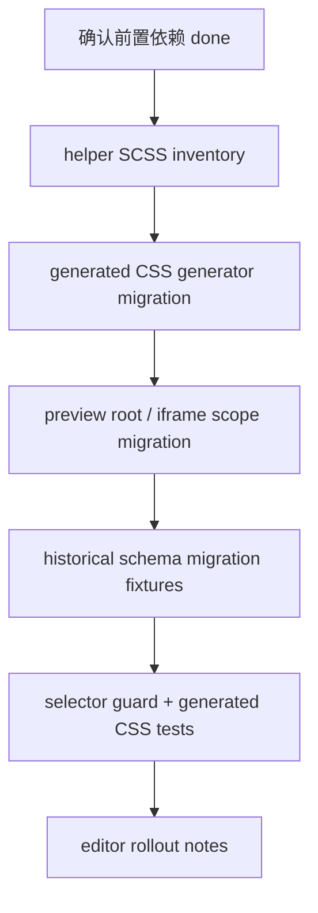

# editor-theme-helper-migration feature design

## 0. 术语约定

| 术语 | 定义 | 防冲突结论 |
|---|---|---|
| EditorThemeCss | theme-editor 生成 CSS 与 editor preview 消费 CSS 的统一契约。 | roadmap 第 4.5 节已定义，本 feature 只执行，不另起主题身份。 |
| Generated CSS | `ParseThemeData`、themeCss schema 或 helper SCSS 最终生成/注入的 CSS 文本。 | 不能继续生成 `.cxd-*` 组件选择器；必须输出 token / `[data-amis-theme]` / `.amis-*` 路径。 |
| Preview scope | editor preview root、iframe preview root、popover/modal preview 容器携带的主题作用域。 | `.AMISCSSWrapper` 可以保留为 preview 容器别名，但不得承载主题身份。 |
| Historical schema migration | `style2ThemeCss`、`JSONPipeIn` 等对旧 schema/style/themeCss 的整理和迁移。 | 需要明确旧 `.cxd-*` / themeCss 如何处理，避免新生成 CSS 正确、旧数据继续暴露主题前缀。 |
| Helper SCSS inventory | `packages/amis-theme-editor-helper/src/style/**` 与 `packages/amis-editor-core/scss/**` 中旧 `.cxd-*` / `.AMISCSSWrapper` 命中清单。 | 复用 selector inventory/guard 分类，不把 editor 内置 SCSS 变成新的例外黑洞。 |

## 1. 决策与约束

### 需求摘要

本 feature 迁移编辑器和 theme-editor 的主题身份来源：`ParseThemeData` 生成 CSS、editor preview / iframe preview 容器、历史 schema 迁移、theme-editor helper 内置 SCSS 都必须从 `.cxd-*` / `.AMISCSSWrapper` 主题身份转向 ThemeScope、stable `.amis-*` 和 TokenContract。验收必须拆成四条线：generated CSS、preview scope、historical schema migration、helper SCSS inventory。

明确不做：

- 不把 `.AMISCSSWrapper` 全量删除；它可作为 preview / 用户 CSS 容器别名保留，但不能作为主题身份 source-of-truth。
- 不迁移核心组件 SCSS 或 Table/Select/Dialog 等运行时组件选择器；这些属于 `core-component-selector-migration`。
- 不删除 DOM-only `.cxd-*` alias，不决定 legacy alias 退出；这些属于 `legacy-prefix-teardown`。
- 不重写 editor/plugin schema 体系；只迁移主题 CSS 生成、读取、预览和历史数据边界。
- 不为 theme-editor 定义第二套 token 命名；必须消费 TokenContract 的 `--amis-*`、旧 token alias 和 layer 规则。

### 复杂度档位

- 结构 = modules（跨 amis-editor-core、amis-editor、amis-theme-editor-helper、SCSS 和历史 schema）。
- 可读性 = public（theme-editor helper 是外部使用者会碰到的包）。
- 可演进性 = stable（后续 theme-editor token schema 要依赖同一生成契约）。
- 可测试性 = verified（需要 generated CSS 文本检查、preview DOM scope、历史 schema fixture、SCSS inventory/guard）。
- Compatibility = migration-compatible（旧 schema 需要迁移边界，旧 `.AMISCSSWrapper` 不作为主题身份）。

### 关键决策

1. **四线验收，缺一不可**
   只改 `ParseThemeData` 不算完成；必须同时覆盖 generated CSS、preview scope、historical schema migration、helper SCSS inventory。

2. **`.AMISCSSWrapper` 降级为容器别名**
   它可以继续帮助旧用户 CSS 或 preview 容器定位，但 theme identity 必须来自 `data-amis-theme`，CSS variable 读取也不能只读 `:root, .AMISCSSWrapper`。

3. **生成器只消费 ThemeScope / TokenContract**
   `ParseThemeData` 不再硬编码 `.cxd-Button--...`；自定义按钮、尺寸和组件态 selector 走 `[data-amis-theme] .amis-*` 或 token 输出。

4. **历史 schema 迁移显式边界**
   `style2ThemeCss` / `JSONPipeIn` 要明确旧 style/themeCss 与 `.cxd-*` selector 的处理：能映射的转入 stable/token 路径，不能自动迁移的进入 migration notes，不静默保留为新输出。

5. **实现 admission 严格等待依赖 done**
   本 design 可以在前置 design-review passed 后起草；implementation 开始前必须确认 `token-contract-css-layers`、`stylesheet-stable-selector-build`、`overlay-theme-scope-propagation` 已 `done`。

### 基线风险与验证入口

- `packages/amis-theme-editor-helper/src/helper/ParseThemeData.ts` 直接生成 `.cxd-Button--...` 和 `.cxd-Button--size-...`。
- `packages/amis-editor-core/src/util.ts` 的 `getAllCssVar()` 仍读取 `:root, .AMISCSSWrapper` 和 `.app-popover, #editor-preview-body`。
- `packages/amis-editor-core/src/component/Preview.tsx` 的 `#editor-preview-body` 仍带 `AMISCSSWrapper`，但未显式写 `data-amis-theme`。
- `packages/amis-editor-core/src/component/IFramePreview.tsx` 初始化 iframe body 内 `.ae-IFramePreview AMISCSSWrapper`，`iframeContentDidMount()` 只加 `ae-PreviewIFrameBody`。
- `packages/amis-editor-core/src/manager.ts#getThemeClassPrefix()` 仍返回 `getTheme(...).classPrefix`。
- `packages/amis-theme-editor-helper/src/style/**`、`packages/amis-editor-core/scss/**`、`packages/amis-editor/src/plugin/**` 有大量 `.cxd-*`、`.AMISCSSWrapper`、themeCss selector 配置。

### Top 3 风险

1. **只修新生成，旧 schema 继续漏出 `.cxd-*`**：用户旧数据仍可能通过 style/themeCss 暴露主题前缀。缓解：单独 historical schema migration step 和 fixture。
2. **preview scope 与运行时 scope 不一致**：editor preview、iframe preview、popover/modal preview 可能各自读不同主题身份。缓解：preview root / iframe root / popover container 都用 ThemeScope 验证。
3. **helper SCSS 存量太大导致 guard 误伤**：editor/helper SCSS 中 `.cxd-*` 很多。缓解：先做 helper SCSS inventory + allowlist 分类，再逐类迁移，不要求无解释清零。

## 2. 名词与编排

### 2.1 名词层

#### 现状

- `ParseThemeData` 接收 `ThemeDefinition` 和 `scope: string[]`，`getCssVariable()` 把变量写入 `scope.join(', ')`，但 custom button class 仍硬编码 `.cxd-Button--...`。
- editor 侧 `getAllCssVar()` 从 style tag 读取 `:root, .AMISCSSWrapper` 和 `.app-popover, #editor-preview-body` selector 下的 CSS 变量。
- `Preview.tsx`、`IFramePreview.tsx`、`ScaffoldModal.tsx` 等 preview 容器仍使用 `.AMISCSSWrapper` 表示 CSS 环境。
- `manager.ts#getThemeClassPrefix()` 仍从 `getTheme(theme).classPrefix` 暴露旧主题前缀。
- theme-editor helper 的 `src/style/**` 和 editor-core/editor plugin SCSS 仍有大量 `.cxd-*` 内置 selector。

#### 变化

新增或固化以下名词：

| 名词 | 形态 | 职责 |
|---|---|---|
| ThemeCssGenerationOptions | 生成选项 | 输入 `theme`、ThemeScope、`componentClassPrefix: 'amis-'`、token namespace 和 legacy handling policy。 |
| GeneratedThemeCss | 生成结果 | 分离 tokenCss、selectorCss、customCss 和 migrationWarnings，便于测试和历史 schema 处理。 |
| PreviewThemeScope | DOM contract | editor preview root、iframe root、popover/modal preview 容器写入 `data-amis-theme`。 |
| HistoricalThemeCssMigration | 迁移策略 | 把旧 style/themeCss 中可迁移 selector/token 映射到 stable 路径，并记录不可自动迁移项。 |
| HelperScssInventory | inventory 分类 | 记录 helper/editor 内置 SCSS 中 `.cxd-*` / `.AMISCSSWrapper` 命中、owner 和退出条件。 |

接口示例：

```ts
interface ThemeCssGenerationOptions {
  theme: string;
  scope: ThemeScope;
  componentClassPrefix: 'amis-';
  tokenNamespace: '--amis';
  legacySelectorPolicy: 'warn-and-migrate' | 'reject-new';
}

interface GeneratedThemeCss {
  tokenCss: string;
  selectorCss: string;
  customCss: string;
  migrationWarnings: string[];
}
```

Interface 设计检查：

- Module / interface：EditorThemeCss 是 editor/theme-editor 对 ThemeScope、TokenContract、StableSelector 的消费接口。
- Seam placement：seam 放在 theme-editor CSS generator、schema migration 和 preview root scope，而不是各 plugin 手写 `.cxd-*`。
- Depth / locality：后续 token schema 变化集中在 helper options / generator / migration strategy。
- Dependency category：in-process generation + DOM preview + repository-local SCSS inventory。
- Adapter：HistoricalThemeCssMigration 是旧数据迁移边界，不是新的主题身份 adapter。
- Test surface：generated CSS 文本不包含 `.cxd-`；preview / iframe root 有 `data-amis-theme`；旧 schema fixture 产生 stable output 或 warning；helper SCSS inventory 无未分类新增。

### 2.2 编排层

#### 现状

当前链路是“theme-editor 生成旧 token / `.cxd-*` selector → editor preview 用 `.AMISCSSWrapper` 和 `#editor-preview-body` 读取变量 → 历史 schema 进入 `style2ThemeCss` 整理 → plugin/style 面板继续引用 themeCss 旧 selector”。主题身份在生成器、preview 容器和历史 schema 中分散。

#### 变化

主流程分四条线汇合：



流程级约束：

- implementation admission 前重新读取 items.yaml；依赖未 `done` 时只能停。
- `ParseThemeData` 输出 `.amis-*` / `[data-amis-theme]` / token，不再输出 `.cxd-*` 新 selector。
- `.AMISCSSWrapper` 可保留在 DOM class，但 `data-amis-theme` 是主题身份；CSS var 读取 scope 要覆盖 TokenContract scope。
- `style2ThemeCss` / historical migration 不能静默吞掉旧 `.cxd-*`；可迁移则迁移，不可迁移则输出 warning/notes。
- editor/helper SCSS 中旧命中必须进入 inventory/allowlist，新增未分类命中失败。

### 2.3 挂载点清单

- ThemeCssGenerationOptions / GeneratedThemeCss：删掉后 theme-editor 仍会按旧 `.cxd-*` 生成 CSS。
- ParseThemeData selector/token migration：删掉后自定义按钮、尺寸和组件态继续生成主题前缀 selector。
- PreviewThemeScope：删掉后 editor preview / iframe preview 仍靠 `.AMISCSSWrapper` 承载主题身份。
- HistoricalThemeCssMigration fixtures：删掉后旧 schema/themeCss 迁移不可验证。
- HelperScssInventory / guard evidence：删掉后 editor/helper 内置 `.cxd-*` 命中无法收口。

### 2.4 推进策略

1. **实现准入与基线**：确认三项依赖已 done，记录 ParseThemeData、getAllCssVar、Preview/IFrame、helper SCSS、plugin selector 基线。
   退出信号：baseline inventory 覆盖 generated CSS、preview scope、historical schema、helper SCSS 四类。
2. **Helper SCSS inventory**：分类 `amis-theme-editor-helper/src/style/**`、`amis-editor-core/scss/**`、editor plugin selector 中的 `.cxd-*` / `.AMISCSSWrapper`。
   退出信号：每个保留命中有分类、owner 和退出条件。
3. **Generated CSS migration**：迁移 ParseThemeData 和生成选项，输出 tokenCss / selectorCss / customCss / migrationWarnings。
   退出信号：generated CSS fixture 不包含 `.cxd-`，自定义 Button/size 走 stable selector 或 token。
4. **Preview scope migration**：让 editor preview root、iframe preview root、popover/modal preview container 带 `data-amis-theme`，并迁移 CSS var 读取 scope。
   退出信号：preview / iframe DOM 断言能观察 `data-amis-theme`，`getAllCssVar()` 不只依赖 `.AMISCSSWrapper`。
5. **Historical schema migration**：为 `style2ThemeCss` / `JSONPipeIn` 等旧数据路径补 fixture 和迁移说明。
   退出信号：旧 style/themeCss fixture 输出 stable themeCss 或 migration warning。
6. **范围收口与 guard**：运行 selector guard、generated CSS grep、editor/helper diff review，确认不误改 core component migration / legacy teardown。
   退出信号：无未分类 `.cxd-*` 新增，剩余命中可交给 legacy-prefix-teardown 或 docs rollout。
7. **交接材料**：记录 editor migration notes、剩余 helper SCSS inventory、旧 schema 行为和用户可见风险。
   退出信号：acceptance 可从生成 CSS、preview DOM、fixture、inventory 和命令输出核验。

### 2.5 结构健康度与微重构

##### 评估

- 文件级 — `packages/amis-theme-editor-helper/src/helper/ParseThemeData.ts`：生成 CSS 职责集中，但 token/selector 旧逻辑混在各 parse 方法中；本项可新增小 helper，不做全量重写。
- 文件级 — `packages/amis-editor-core/src/util.ts`：包含 JSON/schema 迁移、CSS var 读取等多职责；本项只触碰 themeCss/style2ThemeCss/getAllCssVar 相关点。
- 文件级 — `packages/amis-editor-core/src/component/Preview.tsx` / `IFramePreview.tsx`：preview scope 接入点清晰，不应重写编辑器渲染流程。
- 目录级 — `packages/amis-theme-editor-helper/src/style/**` 与 `packages/amis-editor-core/scss/**` 存量 `.cxd-*` 多；本项需要 inventory，而不是一次性重组目录。
- compound 命中：DOM alias 不能替代 editor CSS generator 迁移，生成器必须转向 ThemeScope + `.amis-*`。

##### 结论：不做前置微重构

##### 方案

- 不拆 ParseThemeData / util.ts / Preview.tsx 大文件。
- 允许新增 generation options、migration fixture、inventory 文件或局部 helper，保证行为变化可被生成 CSS 和 preview DOM 证据观察。
- 如果实现阶段发现需要重构 schema migration 管线，暂停该 step，另开 refactor 或拆 roadmap item，不在本项夹带。

##### 超出范围的观察

- editor 插件中大量 `themeCss.*ClassName` 配置可能需要更长周期的 UX/配置整理；本项只迁移主题身份和生成/预览边界。
- `.AMISCSSWrapper` 最终是否删除由 legacy-prefix-teardown/docs rollout 决定。

## 3. 验收契约

### 3.1 关键场景清单

- 输入：theme-editor 自定义 Button 类型/尺寸 → 期望 generated CSS 不含 `.cxd-`，输出 token / `[data-amis-theme] .amis-Button` 或等价 stable selector。
- 输入：editor preview root 渲染 → 期望 `#editor-preview-body` 或 preview root 带 `data-amis-theme`，`.AMISCSSWrapper` 不作为主题身份。
- 输入：iframe preview 渲染 → 期望 iframe document 内 preview root/body 带正确 `data-amis-theme`。
- 输入：旧 schema/style 进入 `JSONPipeIn` / `style2ThemeCss` → 期望可迁移项转成 stable themeCss，不可迁移项有 warning/notes。
- 输入：helper/editor SCSS inventory/guard 运行 → 期望 `.cxd-*` / `.AMISCSSWrapper` 剩余命中都有分类，新增未分类失败。
- 反向核对：不迁移 core component SCSS，不删除 DOM-only alias，不执行 legacy-prefix-teardown，不把 `.AMISCSSWrapper` 当主题身份继续推荐。

### 3.2 Acceptance Coverage Matrix

| Scenario | Covered By Step | Evidence Type | Command / Action | Core? |
|---|---|---|---|---|
| implementation admission 依赖 done | S1 | items.yaml / workflow hook | `codestable-workflow-next.py epic --roadmap ... --json` | yes |
| generated CSS 不含 `.cxd-` | S3 | unit/fixture / grep | ParseThemeData generated CSS fixture + `rg -n "\\.cxd-"` | yes |
| preview root 带 `data-amis-theme` | S4 | DOM assertion / manual fixture | editor preview targeted test 或 manual path | yes |
| iframe preview 带 `data-amis-theme` | S4 | DOM assertion / manual fixture | iframe preview targeted test 或 manual path | yes |
| historical schema migration | S5 | fixture | `JSONPipeIn` / `style2ThemeCss` fixture | yes |
| helper SCSS inventory 分类完整 | S2 / S6 | inventory / command | selector guard + helper SCSS grep | yes |
| 范围守护 | S6 | diff review | `git diff -- packages/amis-ui packages/amis-core packages/amis` | yes |

### 3.3 DoD Contract

| ID | 要求 | 证据 | 阻塞级别 |
|---|---|---|---|
| DOD-DESIGN-001 | design 与 checklist 覆盖 generated CSS、preview scope、historical schema migration、helper SCSS inventory 四类验收 | design review | blocking |
| DOD-IMPL-001 | checklist steps 完成，生成 CSS / preview / schema fixture / inventory 证据落盘 | checklist / implementation report | blocking |
| DOD-REVIEW-001 | code review passed，确认没有 core component migration 或 legacy teardown 范围外 diff | review report | blocking |
| DOD-QA-001 | QA 覆盖 generated CSS、preview scope、iframe preview、schema migration、helper SCSS guard | QA report | blocking |
| DOD-ACCEPT-001 | acceptance 回写 roadmap 状态，并记录剩余 editor/helper legacy 命中 | acceptance report | blocking |

Validation Commands:

| ID | 命令 | 目的 | 核心性 | 失败处理 |
|---|---|---|---|---|
| CMD-001 | `npm run build --workspace amis-theme-editor-helper` | 校验 theme-editor helper 构建 | core | fix-or-block |
| CMD-002 | `npm run build --workspace amis-editor-core` | 校验 editor-core preview / util 改动 | core | fix-or-block |
| CMD-003 | `npm run build --workspace amis-editor` | 校验 editor plugin/themeCss 配置入口 | supporting | fix-or-block |
| CMD-004 | `npm run check:theme-selectors --workspace amis-ui` | 校验 editor/helper 旧 selector 新增策略 | core | fix-or-block |
| CMD-005 | `rg -n "\\.cxd-" packages/amis-theme-editor-helper packages/amis-editor-core packages/amis-editor` | 核对 generated/helper/editor 旧 selector 剩余命中 | core | document-baseline |
| CMD-006 | `rg -n "AMISCSSWrapper|getCssVarById|data-amis-theme|ParseThemeData|style2ThemeCss" packages/amis-editor-core packages/amis-theme-editor-helper packages/amis-editor` | 核对 preview scope / schema migration 命中 | core | document-baseline |
| CMD-007 | `python3 /Users/songmingxu/.agents/skills/cs-onboard/tools/validate-yaml.py --file .codestable/features/2026-07-25-editor-theme-helper-migration/editor-theme-helper-migration-checklist.yaml --yaml-only` | 校验 checklist YAML | core | fix-or-block |

Required Artifacts: design、checklist、design-review、helper SCSS inventory、generated CSS fixture、preview/iframe scope evidence、historical schema fixture、implementation report、code review、QA、acceptance。

## 4. 与项目级架构文档的关系

- 本 feature 是 ADR-001 EditorThemeCss 契约的执行层细化，不新增替代 ADR。
- 本 feature 消费 TokenContract、StableSelector 和 OverlayThemeScope，不定义第二套主题身份。
- acceptance 后如 ThemeCssGenerationOptions / GeneratedThemeCss 成为稳定接口，应沉淀到 architecture/compound，供 docs rollout 和 legacy-prefix-teardown 使用。
