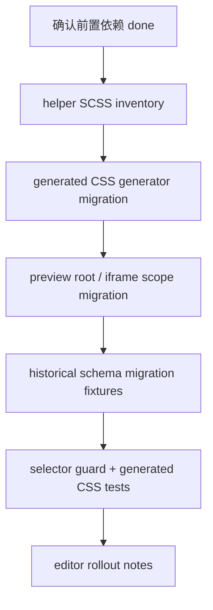

# CodeStable Implementation Review Packet

- root: `/Users/songmingxu/Projects/amis`
- unit: `.codestable/features/2026-07-25-editor-theme-helper-migration`
- stage: `implementation`

## Reviewer Mission

Review the implementation as an independent Task agent. Verify the code directly from the packet instead of trusting the implementer summary.

## Stage Focus

scope drift, hidden behavior changes, missing tests, maintainability, edge cases, security, and production safety

## Reviewer Output Contract

- Lead with findings, ordered by severity.
- Include severity (`P0`/`P1`/`P2`/`P3`) and confidence for each finding.
- Reference concrete files, code, docs, or validation evidence when possible.
- If there are no blocking findings, say so explicitly and list residual risks or test gaps.

## Unit Documents
### `.codestable/features/2026-07-25-editor-theme-helper-migration/approval-report.md`

```
---
doc_type: approval-report
unit: 2026-07-25-editor-theme-helper-migration
status: approved
reason: design-review-local-only-authorization
approvals:
  design-review-local-only: approved
approval_groups: {}
created_at: 2026-07-25
---

# Approval Report

## Decision: design-review-local-only

已批准 owner 降级授权 `design-review-local-only`。

## Decision History

- 2026-07-25：owner 明确回复“批准 editor design-review-local-only”，允许独立 reviewer 工具不可用时以本地审查降级完成本轮 design review。

## Why Now

`editor-theme-helper-migration` 是 theme system refactor epic 的下一个子 feature。按 CodeStable gate，首次 design review 需要独立 Task agent reviewer；当前 reviewer tool 在创建 agent 前被参数 schema 拒绝，无法产生 reviewer id 或审查输出。

## Context

- Design: `.codestable/features/2026-07-25-editor-theme-helper-migration/editor-theme-helper-migration-design.md`
- Checklist: `.codestable/features/2026-07-25-editor-theme-helper-migration/editor-theme-helper-migration-checklist.yaml`
- Design review checkpoint: `.codestable/features/2026-07-25-editor-theme-helper-migration/editor-theme-helper-migration-design-review.md`
- Roadmap item: `editor-theme-helper-migration`

## Options

### Option A: 批准 `editor design-review-local-only`

允许主 agent 对 design / checklist / roadmap / ADR / 前置 feature / 关键代码事实做本地逐项审查，并在审查报告中保留 local-only 降级来源。该批准不等于确认 design，也不进入实现；design 仍需后续 epic 批量确认。

**Decision**：approved，2026-07-25，owner 明确回复“批准 editor design-review-local-only”。

### Option B: 不批准，稍后重试独立 reviewer

保持 design-review gate blocked，等待 Task agent reviewer 可用后重试。

## Recommendation

建议批准 Option A。该 feature 当前只落设计和 checklist，不改业务代码；local-only 降级只影响方案审查来源，不会跳过后续实现、code review、QA 或 acceptance。

## Risks And Tradeoffs

- local-only 缺少独立 reviewer 的第二视角，可能漏看 editor 历史 schema、preview/iframe scope 或 helper SCSS 存量边界。
- 不批准会让 epic child design batch 停在本项，直到 reviewer tool 可用。
- 批准后本地审查重点检查 generated CSS、preview scope、historical schema migration、helper SCSS inventory 四条验收线。

## Non-Automatic Actions

- 不自动批准 design。
- 不自动进入实现。
- 不自动提交 commit。
- 不自动 push。
- 不跳过后续 code review、QA 或 acceptance。

## After Approval

授权已生效。本轮 design review 可以用 local-only 降级完成，但该授权不自动确认 design，也不进入实现；design 仍需后续 owner 整体确认或 epic 批量确认。
```

### `.codestable/features/2026-07-25-editor-theme-helper-migration/editor-theme-helper-migration-checklist.yaml`

```
feature: 2026-07-25-editor-theme-helper-migration
created: 2026-07-25

steps:
  - action: "实现准入与基线：确认 token-contract-css-layers、stylesheet-stable-selector-build、overlay-theme-scope-propagation 已 done，并记录四类基线"
    exit_signal: "baseline inventory 覆盖 generated CSS、preview scope、historical schema、helper SCSS 四类"
    status: done
  - action: "Helper SCSS inventory：分类 amis-theme-editor-helper、amis-editor-core、amis-editor 中的 .cxd-* / AMISCSSWrapper 命中"
    exit_signal: "每个保留命中有分类、owner 和退出条件"
    status: done
  - action: "Generated CSS migration：迁移 ParseThemeData 和生成选项，输出 tokenCss / selectorCss / customCss / migrationWarnings"
    exit_signal: "generated CSS fixture 不包含 .cxd-，自定义 Button/size 走 stable selector 或 token"
    status: done
  - action: "Preview scope migration：让 editor preview root、iframe preview root、popover/modal preview container 带 data-amis-theme，并迁移 CSS var 读取 scope"
    exit_signal: "preview / iframe DOM 断言能观察 data-amis-theme，getAllCssVar 不只依赖 AMISCSSWrapper"
    status: done
  - action: "Historical schema migration：为 style2ThemeCss / JSONPipeIn 旧数据路径补 fixture 和迁移说明"
    exit_signal: "旧 style/themeCss fixture 输出 stable themeCss 或 migration warning"
    status: done
  - action: "范围收口与 guard：运行 selector guard、generated CSS grep、editor/helper diff review"
    exit_signal: "无未分类 .cxd-* 新增，剩余命中可交给 legacy-prefix-teardown 或 docs rollout"
    status: done
  - action: "交接材料：记录 editor migration notes、剩余 helper SCSS inventory、旧 schema 行为和用户可见风险"
    exit_signal: "acceptance 可从生成 CSS、preview DOM、fixture、inventory 和命令输出核验"
    status: done

checks:
  - item: "implementation 开始前重新确认三项依赖 status=done，design-review passed 只允许 design admission"
    source: 关键决策
    status: done
  - item: "EditorThemeCss 只消费 ThemeScope / TokenContract / StableSelector，不定义第二套主题身份"
    source: 名词契约
    status: done
  - item: "ParseThemeData 不再生成 .cxd-Button 或 .cxd-Button--size 等新 selector"
    source: generated CSS
    status: done
  - item: "GeneratedThemeCss 区分 tokenCss、selectorCss、customCss 和 migrationWarnings"
    source: generated CSS
    status: done
  - item: "editor preview root 带 data-amis-theme，AMISCSSWrapper 不作为主题身份"
    source: preview scope
    status: done
  - item: "iframe preview root/body 在对应 document 内带 data-amis-theme"
    source: preview scope
    status: done
  - item: "getAllCssVar / getCssVarById 读取 TokenContract scope，不只依赖 :root, .AMISCSSWrapper"
    source: preview scope
    status: done
  - item: "style2ThemeCss / JSONPipeIn 旧数据路径有 fixture 和 migration warning 证据"
    source: historical schema
    status: done
  - item: "helper/editor SCSS 中 .cxd-* / AMISCSSWrapper 剩余命中均有 inventory 分类、owner 和退出条件"
    source: helper SCSS inventory
    status: done
  - item: "不迁移 core component SCSS，不删除 DOM-only alias，不执行 legacy-prefix-teardown"
    source: 范围守护
    status: done
  - item: "selector guard 是必跑命令；若前置项未提供真实命令，实现阶段必须阻塞或回前置项补齐"
    source: 验证入口
    status: done
  - item: "acceptance 能从 generated CSS、preview DOM、schema fixture、inventory、命令输出核验四条验收线"
    source: DoD
    status: done

dod:
  commands:
    - id: CMD-001
      command: "npm run build --workspace amis-theme-editor-helper"
      core: true
      failure_handling: fix-or-block
    - id: CMD-002
      command: "npm run build --workspace amis-editor-core"
      core: true
      failure_handling: fix-or-block
    - id: CMD-003
      command: "npm run build --workspace amis-editor"
      core: false
      failure_handling: fix-or-block
    - id: CMD-004
      command: "npm run check:theme-selectors --workspace amis-ui"
      core: true
      failure_handling: fix-or-block
    - id: CMD-008
      command: "npx jest packages/amis-theme-editor-helper/__tests__/ParseThemeData.test.ts"
      core: true
      failure_handling: fix-or-block
    - id: CMD-009
      command: "npx jest packages/amis-editor-core/__tests__/themeScope.test.ts"
      core: true
      failure_handling: fix-or-block
    - id: CMD-010
      command: "npx jest packages/amis-editor-core/__tests__/themeCssMigration.test.ts"
      core: true
      failure_handling: fix-or-block
    - id: CMD-005
      command: "rg -n \"\\.cxd-\" packages/amis-theme-editor-helper packages/amis-editor-core packages/amis-editor"
      core: true
      failure_handling: document-baseline
    - id: CMD-006
      command: "rg -n \"AMISCSSWrapper|getCssVarById|data-amis-theme|ParseThemeData|style2ThemeCss\" packages/amis-editor-core packages/amis-theme-editor-helper packages/amis-editor"
      core: true
      failure_handling: document-baseline
    - id: CMD-007
      command: "python3 /Users/songmingxu/.agents/skills/cs-onboard/tools/validate-yaml.py --file .codestable/features/2026-07-25-editor-theme-helper-migration/editor-theme-helper-migration-checklist.yaml --yaml-only"
      core: true
      failure_handling: fix-or-block
  evidence_required:
    - helper_scss_inventory
    - generated_css_fixture
    - preview_scope_evidence
    - iframe_scope_evidence
    - historical_schema_fixture
    - selector_guard_output
    - diff_summary
  cleanliness:
    debug_output: forbidden
    temporary_todo: forbidden
    commented_code: forbidden
    unused_import: forbidden
```

### `.codestable/features/2026-07-25-editor-theme-helper-migration/editor-theme-helper-migration-design-review.md`

```
---
doc_type: feature-design-review
feature: 2026-07-25-editor-theme-helper-migration
status: passed
review_state: passed
review_reason: ""
reviewer_id: "local-only:user-approved-2026-07-25"
reviewed: 2026-07-25
round: 1
---

# editor-theme-helper-migration feature design 审查报告

## 1. Scope And Inputs

- Design: `.codestable/features/2026-07-25-editor-theme-helper-migration/editor-theme-helper-migration-design.md`
- Checklist: `.codestable/features/2026-07-25-editor-theme-helper-migration/editor-theme-helper-migration-checklist.yaml`
- Roadmap: `.codestable/roadmap/theme-system-refactor/theme-system-refactor-roadmap.md`
- Roadmap item: `editor-theme-helper-migration`
- ADR: `.codestable/requirements/adrs/001-tokenized-theme-system.md`
- Prior features: `token-contract-css-layers`, `stylesheet-stable-selector-build`, `overlay-theme-scope-propagation`, `core-component-selector-migration`
- Code facts checked: `packages/amis-theme-editor-helper/src/helper/ParseThemeData.ts`, `packages/amis-theme-editor-helper/src/style/**`, `packages/amis-editor-core/src/util.ts`, `packages/amis-editor-core/src/manager.ts`, `packages/amis-editor-core/src/component/Preview.tsx`, `packages/amis-editor-core/src/component/IFramePreview.tsx`, `packages/amis-editor-core/src/component/ScaffoldModal.tsx`, `packages/amis-editor-core/scss/**`, `packages/amis-editor/src/plugin/**`

### Independent Review

- Status: local-only
- Detection: local-only
- Provider / agent: none
- Raw output summary: reviewer tool attempts were rejected before an agent id was created because the tool wrapper still injected empty optional fields or treated `message` and `items` as mixed.
- Merge policy: 本地逐项核验 design、checklist、roadmap、ADR、前置 feature 和关键代码事实。
- Gate effect: owner 已批准 local-only 降级，允许本轮 design review 给出最终 verdict。

## 2. Design Summary

- Goal: 迁移 editor preview 与 theme-editor helper 到 ThemeScope、stable selector 和 TokenContract。
- Key contracts: EditorThemeCss、ThemeCssGenerationOptions、GeneratedThemeCss、PreviewThemeScope、HistoricalThemeCssMigration、HelperScssInventory。
- Steps: 7 步；从依赖 done 准入、helper SCSS inventory、generated CSS migration、preview scope、historical schema migration，到范围收口和交接材料。
- Checks: 12 项；覆盖实现准入、主题身份唯一性、ParseThemeData 输出、preview/iframe scope、CSS var 读取、旧 schema fixture、helper SCSS inventory、selector guard 和 acceptance 四线核验。
- Baseline / validation: 设计列出 helper/editor 构建、theme selector guard、generated CSS grep、preview scope grep、schema migration fixture 和 checklist YAML 校验。

## 3. Findings

### blocking

- none

### important

- none

### nit

- none

### suggestion

- [ ] FDR-001 实现阶段建议把 HelperScssInventory 做成固定格式清单，至少包含命中 selector、文件、分类、owner、保留原因和退出条件。
  - Evidence: design 第 0 节和第 2.1 节已把 HelperScssInventory 定义为 helper/editor 内置 SCSS 迁移边界；checklist 也要求剩余命中均有分类、owner 和退出条件。
  - Impact: 不阻塞 design；固定格式能让后续 `legacy-prefix-teardown` 直接消费，减少再次人工解释。
- [ ] FDR-002 `.AMISCSSWrapper` 的保留语义必须在实现报告中反复核对：它只能是 preview / 用户 CSS 容器别名，不能继续作为主题身份来源。
  - Evidence: design 第 1 节关键决策已明确 Theme identity 必须来自 `data-amis-theme`，`getAllCssVar()` 也不能只读 `:root, .AMISCSSWrapper`。
  - Impact: 不阻塞 design；这是实现和 QA 最容易回退到旧心智的点。
- [ ] FDR-003 historical schema migration 需要至少覆盖 `style2ThemeCss` 和 `JSONPipeIn` 两条路径，不能只靠 generated CSS 新路径证明完成。
  - Evidence: design 将 historical schema migration 列为四条核心验收线之一，checklist 要求 fixture 和 migration warning 证据。
  - Impact: 不阻塞 design；旧 schema 是用户存量页面最可能继续泄露 `.cxd-*` 的入口。

### learning

- 这个 design 正确把 editor/helper 迁移拆成 generated CSS、preview scope、historical schema、helper SCSS inventory 四条线，避免只修 `ParseThemeData` 造成“新生成正确、旧数据继续泄露”的假完成。
- `.AMISCSSWrapper` 不是必须立刻删除的类名，但它必须从“主题身份”降级为“容器别名”；这个边界和 roadmap 对干净迁移的共识一致。

### praise

- design 明确把 core component SCSS、DOM-only alias 退出和 legacy teardown 排除在本项之外，范围边界清晰。
- implementation admission 明确要求前置三项依赖 `done`，没有把 design-review passed 误当成可实现依赖。

## 4. User Review Focus

- 用户需要重点拍板：是否认可 editor/helper 迁移以四条验收线为完成标准，且 `.AMISCSSWrapper` 只保留为容器别名。
- implement 需要重点遵守：先确认前置依赖 `done`；`ParseThemeData`、preview/iframe root、`style2ThemeCss` / `JSONPipeIn`、helper SCSS inventory 必须同时推进。
- code review / QA / acceptance 需要重点复核：generated CSS 是否不含 `.cxd-`，preview/iframe 是否有 `data-amis-theme`，旧 schema fixture 是否有迁移或 warning，helper/editor SCSS 剩余命中是否可解释。

## 5. Evidence Confidence Ledger

| Check | Verdict | Evidence Class | Basis | Follow-up |
|---|---|---|---|---|
| Acceptance Coverage Matrix | pass | E | design 第 3.2 节覆盖依赖 done、generated CSS、preview root、iframe preview、historical schema、helper SCSS inventory 和范围守护 | implementation / QA 落命令与 fixture 证据 |
| DoD Contract | pass | E | design 第 3.3 节与 checklist `dod.commands` 覆盖 helper/editor 构建、selector guard、grep、preview/schema 证据和 YAML 校验 | none |
| Steps and checks traceability | pass | E | checklist 7 steps / 12 checks 均可追溯到 design 第 1-3 节 | none |
| Roadmap contract compliance | pass | E/C | roadmap 要求迁移编辑器、预览容器、theme-editor helper、历史 schema 和内置 SCSS 的 `.cxd-*` / `AMISCSSWrapper` 主题身份依赖；design 全部覆盖且保留 `.AMISCSSWrapper` 容器别名边界 | none |
| Module interface design | pass | E/C | EditorThemeCss、GeneratedThemeCss、PreviewThemeScope、HistoricalThemeCssMigration、HelperScssInventory 的 seam 清晰，分别落在生成、预览、迁移、inventory 边界 | 实现阶段避免把 helper options 变成第二套 theme identity |
| Validation and artifacts | pass | E | checklist YAML 与 roadmap items YAML 待本轮命令复验；local-only 授权已记录在 approval-report | 跑 YAML / workflow / diff check |

Summary: E=6, C=2, H=0, H-only core checks=none。

## 6. Residual Risk

- local-only design review 缺少独立 reviewer 视角；用户 review 应重点看旧 schema 和 preview/iframe scope 是否需要更多 fixture。
- helper/editor SCSS 存量命中可能很大，本项用 inventory 收口而不是承诺一次性清零；后续 legacy-prefix-teardown 必须消费该 inventory。
- 如果前置 selector guard 或 TokenContract 还未真正实现，本项 implementation 会被阻塞；这是设计刻意保留的 fail-closed 边界。

## 7. Verdict

- Status: passed
- Next: 交回 epic child design batch；所有子 feature design-review passed 后再统一进入 owner design confirmation。

## 8. Focused Closure

- none
```

### `.codestable/features/2026-07-25-editor-theme-helper-migration/editor-theme-helper-migration-design.md`

```
---
doc_type: feature-design
feature: 2026-07-25-editor-theme-helper-migration
roadmap: theme-system-refactor
roadmap_item: editor-theme-helper-migration
execution_lane: goal
status: approved
summary: 迁移 editor preview 与 theme-editor helper 到 ThemeScope、stable selector 和 token contract
tags: [theme, editor, theme-editor, preview, generated-css]
---

# editor-theme-helper-migration feature design

## 0. 术语约定

| 术语 | 定义 | 防冲突结论 |
|---|---|---|
| EditorThemeCss | theme-editor 生成 CSS 与 editor preview 消费 CSS 的统一契约。 | roadmap 第 4.5 节已定义，本 feature 只执行，不另起主题身份。 |
| Generated CSS | `ParseThemeData`、themeCss schema 或 helper SCSS 最终生成/注入的 CSS 文本。 | 不能继续生成 `.cxd-*` 组件选择器；必须输出 token / `[data-amis-theme]` / `.amis-*` 路径。 |
| Preview scope | editor preview root、iframe preview root、popover/modal preview 容器携带的主题作用域。 | `.AMISCSSWrapper` 可以保留为 preview 容器别名，但不得承载主题身份。 |
| Historical schema migration | `style2ThemeCss`、`JSONPipeIn` 等对旧 schema/style/themeCss 的整理和迁移。 | 需要明确旧 `.cxd-*` / themeCss 如何处理，避免新生成 CSS 正确、旧数据继续暴露主题前缀。 |
| Helper SCSS inventory | `packages/amis-theme-editor-helper/src/style/**` 与 `packages/amis-editor-core/scss/**` 中旧 `.cxd-*` / `.AMISCSSWrapper` 命中清单。 | 复用 selector inventory/guard 分类，不把 editor 内置 SCSS 变成新的例外黑洞。 |

## 1. 决策与约束

### 需求摘要

本 feature 迁移编辑器和 theme-editor 的主题身份来源：`ParseThemeData` 生成 CSS、editor preview / iframe preview 容器、历史 schema 迁移、theme-editor helper 内置 SCSS 都必须从 `.cxd-*` / `.AMISCSSWrapper` 主题身份转向 ThemeScope、stable `.amis-*` 和 TokenContract。验收必须拆成四条线：generated CSS、preview scope、historical schema migration、helper SCSS inventory。

明确不做：

- 不把 `.AMISCSSWrapper` 全量删除；它可作为 preview / 用户 CSS 容器别名保留，但不能作为主题身份 source-of-truth。
- 不迁移核心组件 SCSS 或 Table/Select/Dialog 等运行时组件选择器；这些属于 `core-component-selector-migration`。
- 不删除 DOM-only `.cxd-*` alias，不决定 legacy alias 退出；这些属于 `legacy-prefix-teardown`。
- 不重写 editor/plugin schema 体系；只迁移主题 CSS 生成、读取、预览和历史数据边界。
- 不为 theme-editor 定义第二套 token 命名；必须消费 TokenContract 的 `--amis-*`、旧 token alias 和 layer 规则。

### 复杂度档位

- 结构 = modules（跨 amis-editor-core、amis-editor、amis-theme-editor-helper、SCSS 和历史 schema）。
- 可读性 = public（theme-editor helper 是外部使用者会碰到的包）。
- 可演进性 = stable（后续 theme-editor token schema 要依赖同一生成契约）。
- 可测试性 = verified（需要 generated CSS 文本检查、preview DOM scope、历史 schema fixture、SCSS inventory/guard）。
- Compatibility = migration-compatible（旧 schema 需要迁移边界，旧 `.AMISCSSWrapper` 不作为主题身份）。

### 关键决策

1. **四线验收，缺一不可**
   只改 `ParseThemeData` 不算完成；必须同时覆盖 generated CSS、preview scope、historical schema migration、helper SCSS inventory。

2. **`.AMISCSSWrapper` 降级为容器别名**
   它可以继续帮助旧用户 CSS 或 preview 容器定位，但 theme identity 必须来自 `data-amis-theme`，CSS variable 读取也不能只读 `:root, .AMISCSSWrapper`。

3. **生成器只消费 ThemeScope / TokenContract**
   `ParseThemeData` 不再硬编码 `.cxd-Button--...`；自定义按钮、尺寸和组件态 selector 走 `[data-amis-theme] .amis-*` 或 token 输出。

4. **历史 schema 迁移显式边界**
   `style2ThemeCss` / `JSONPipeIn` 要明确旧 style/themeCss 与 `.cxd-*` selector 的处理：能映射的转入 stable/token 路径，不能自动迁移的进入 migration notes，不静默保留为新输出。

5. **实现 admission 严格等待依赖 done**
   本 design 可以在前置 design-review passed 后起草；implementation 开始前必须确认 `token-contract-css-layers`、`stylesheet-stable-selector-build`、`overlay-theme-scope-propagation` 已 `done`。

### 基线风险与验证入口

- `packages/amis-theme-editor-helper/src/helper/ParseThemeData.ts` 直接生成 `.cxd-Button--...` 和 `.cxd-Button--size-...`。
- `packages/amis-editor-core/src/util.ts` 的 `getAllCssVar()` 仍读取 `:root, .AMISCSSWrapper` 和 `.app-popover, #editor-preview-body`。
- `packages/amis-editor-core/src/component/Preview.tsx` 的 `#editor-preview-body` 仍带 `AMISCSSWrapper`，但未显式写 `data-amis-theme`。
- `packages/amis-editor-core/src/component/IFramePreview.tsx` 初始化 iframe body 内 `.ae-IFramePreview AMISCSSWrapper`，`iframeContentDidMount()` 只加 `ae-PreviewIFrameBody`。
- `packages/amis-editor-core/src/manager.ts#getThemeClassPrefix()` 仍返回 `getTheme(...).classPrefix`。
- `packages/amis-theme-editor-helper/src/style/**`、`packages/amis-editor-core/scss/**`、`packages/amis-editor/src/plugin/**` 有大量 `.cxd-*`、`.AMISCSSWrapper`、themeCss selector 配置。

### Top 3 风险

1. **只修新生成，旧 schema 继续漏出 `.cxd-*`**：用户旧数据仍可能通过 style/themeCss 暴露主题前缀。缓解：单独 historical schema migration step 和 fixture。
2. **preview scope 与运行时 scope 不一致**：editor preview、iframe preview、popover/modal preview 可能各自读不同主题身份。缓解：preview root / iframe root / popover container 都用 ThemeScope 验证。
3. **helper SCSS 存量太大导致 guard 误伤**：editor/helper SCSS 中 `.cxd-*` 很多。缓解：先做 helper SCSS inventory + allowlist 分类，再逐类迁移，不要求无解释清零。

## 2. 名词与编排

### 2.1 名词层

#### 现状

- `ParseThemeData` 接收 `ThemeDefinition` 和 `scope: string[]`，`getCssVariable()` 把变量写入 `scope.join(', ')`，但 custom button class 仍硬编码 `.cxd-Button--...`。
- editor 侧 `getAllCssVar()` 从 style tag 读取 `:root, .AMISCSSWrapper` 和 `.app-popover, #editor-preview-body` selector 下的 CSS 变量。
- `Preview.tsx`、`IFramePreview.tsx`、`ScaffoldModal.tsx` 等 preview 容器仍使用 `.AMISCSSWrapper` 表示 CSS 环境。
- `manager.ts#getThemeClassPrefix()` 仍从 `getTheme(theme).classPrefix` 暴露旧主题前缀。
- theme-editor helper 的 `src/style/**` 和 editor-core/editor plugin SCSS 仍有大量 `.cxd-*` 内置 selector。

#### 变化

新增或固化以下名词：

| 名词 | 形态 | 职责 |
|---|---|---|
| ThemeCssGenerationOptions | 生成选项 | 输入 `theme`、ThemeScope、`componentClassPrefix: 'amis-'`、token namespace 和 legacy handling policy。 |
| GeneratedThemeCss | 生成结果 | 分离 tokenCss、selectorCss、customCss 和 migrationWarnings，便于测试和历史 schema 处理。 |
| PreviewThemeScope | DOM contract | editor preview root、iframe root、popover/modal preview 容器写入 `data-amis-theme`。 |
| HistoricalThemeCssMigration | 迁移策略 | 把旧 style/themeCss 中可迁移 selector/token 映射到 stable 路径，并记录不可自动迁移项。 |
| HelperScssInventory | inventory 分类 | 记录 helper/editor 内置 SCSS 中 `.cxd-*` / `.AMISCSSWrapper` 命中、owner 和退出条件。 |

接口示例：

```ts
interface ThemeCssGenerationOptions {
  theme: string;
  scope: ThemeScope;
  componentClassPrefix: 'amis-';
  tokenNamespace: '--amis';
  legacySelectorPolicy: 'warn-and-migrate' | 'reject-new';
}

interface GeneratedThemeCss {
  tokenCss: string;
  selectorCss: string;
  customCss: string;
  migrationWarnings: string[];
}
```

Interface 设计检查：

- Module / interface：EditorThemeCss 是 editor/theme-editor 对 ThemeScope、TokenContract、StableSelector 的消费接口。
- Seam placement：seam 放在 theme-editor CSS generator、schema migration 和 preview root scope，而不是各 plugin 手写 `.cxd-*`。
- Depth / locality：后续 token schema 变化集中在 helper options / generator / migration strategy。
- Dependency category：in-process generation + DOM preview + repository-local SCSS inventory。
- Adapter：HistoricalThemeCssMigration 是旧数据迁移边界，不是新的主题身份 adapter。
- Test surface：generated CSS 文本不包含 `.cxd-`；preview / iframe root 有 `data-amis-theme`；旧 schema fixture 产生 stable output 或 warning；helper SCSS inventory 无未分类新增。

### 2.2 编排层

#### 现状

当前链路是“theme-editor 生成旧 token / `.cxd-*` selector → editor preview 用 `.AMISCSSWrapper` 和 `#editor-preview-body` 读取变量 → 历史 schema 进入 `style2ThemeCss` 整理 → plugin/style 面板继续引用 themeCss 旧 selector”。主题身份在生成器、preview 容器和历史 schema 中分散。

#### 变化

主流程分四条线汇合：



流程级约束：

- implementation admission 前重新读取 items.yaml；依赖未 `done` 时只能停。
- `ParseThemeData` 输出 `.amis-*` / `[data-amis-theme]` / token，不再输出 `.cxd-*` 新 selector。
- `.AMISCSSWrapper` 可保留在 DOM class，但 `data-amis-theme` 是主题身份；CSS var 读取 scope 要覆盖 TokenContract scope。
- `style2ThemeCss` / historical migration 不能静默吞掉旧 `.cxd-*`；可迁移则迁移，不可迁移则输出 warning/notes。
- editor/helper SCSS 中旧命中必须进入 inventory/allowlist，新增未分类命中失败。

### 2.3 挂载点清单

- ThemeCssGenerationOptions / GeneratedThemeCss：删掉后 theme-editor 仍会按旧 `.cxd-*` 生成 CSS。
- ParseThemeData selector/token migration：删掉后自定义按钮、尺寸和组件态继续生成主题前缀 selector。
- PreviewThemeScope：删掉后 editor preview / iframe preview 仍靠 `.AMISCSSWrapper` 承载主题身份。
- HistoricalThemeCssMigration fixtures：删掉后旧 schema/themeCss 迁移不可验证。
- HelperScssInventory / guard evidence：删掉后 editor/helper 内置 `.cxd-*` 命中无法收口。

### 2.4 推进策略

1. **实现准入与基线**：确认三项依赖已 done，记录 ParseThemeData、getAllCssVar、Preview/IFrame、helper SCSS、plugin selector 基线。
   退出信号：baseline inventory 覆盖 generated CSS、preview scope、historical schema、helper SCSS 四类。
2. **Helper SCSS inventory**：分类 `amis-theme-editor-helper/src/style/**`、`amis-editor-core/scss/**`、editor plugin selector 中的 `.cxd-*` / `.AMISCSSWrapper`。
   退出信号：每个保留命中有分类、owner 和退出条件。
3. **Generated CSS migration**：迁移 ParseThemeData 和生成选项，输出 tokenCss / selectorCss / customCss / migrationWarnings。
   退出信号：generated CSS fixture 不包含 `.cxd-`，自定义 Button/size 走 stable selector 或 token。
4. **Preview scope migration**：让 editor preview root、iframe preview root、popover/modal preview container 带 `data-amis-theme`，并迁移 CSS var 读取 scope。
   退出信号：preview / iframe DOM 断言能观察 `data-amis-theme`，`getAllCssVar()` 不只依赖 `.AMISCSSWrapper`。
5. **Historical schema migration**：为 `style2ThemeCss` / `JSONPipeIn` 等旧数据路径补 fixture 和迁移说明。
   退出信号：旧 style/themeCss fixture 输出 stable themeCss 或 migration warning。
6. **范围收口与 guard**：运行 selector guard、generated CSS grep、editor/helper diff review，确认不误改 core component migration / legacy teardown。
   退出信号：无未分类 `.cxd-*` 新增，剩余命中可交给 legacy-prefix-teardown 或 docs rollout。
7. **交接材料**：记录 editor migration notes、剩余 helper SCSS inventory、旧 schema 行为和用户可见风险。
   退出信号：acceptance 可从生成 CSS、preview DOM、fixture、inventory 和命令输出核验。

### 2.5 结构健康度与微重构

##### 评估

- 文件级 — `packages/amis-theme-editor-helper/src/helper/ParseThemeData.ts`：生成 CSS 职责集中，但 token/selector 旧逻辑混在各 parse 方法中；本项可新增小 helper，不做全量重写。
- 文件级 — `packages/amis-editor-core/src/util.ts`：包含 JSON/schema 迁移、CSS var 读取等多职责；本项只触碰 themeCss/style2ThemeCss/getAllCssVar 相关点。
- 文件级 — `packages/amis-editor-core/src/component/Preview.tsx` / `IFramePreview.tsx`：preview scope 接入点清晰，不应重写编辑器渲染流程。
- 目录级 — `packages/amis-theme-editor-helper/src/style/**` 与 `packages/amis-editor-core/scss/**` 存量 `.cxd-*` 多；本项需要 inventory，而不是一次性重组目录。
- compound 命中：DOM alias 不能替代 editor CSS generator 迁移，生成器必须转向 ThemeScope + `.amis-*`。

##### 结论：不做前置微重构

##### 方案

- 不拆 ParseThemeData / util.ts / Preview.tsx 大文件。
- 允许新增 generation options、migration fixture、inventory 文件或局部 helper，保证行为变化可被生成 CSS 和 preview DOM 证据观察。
- 如果实现阶段发现需要重构 schema migration 管线，暂停该 step，另开 refactor 或拆 roadmap item，不在本项夹带。

##### 超出范围的观察

- editor 插件中大量 `themeCss.*ClassName` 配置可能需要更长周期的 UX/配置整理；本项只迁移主题身份和生成/预览边界。
- `.AMISCSSWrapper` 最终是否删除由 legacy-prefix-teardown/docs rollout 决定。

## 3. 验收契约

### 3.1 关键场景清单

- 输入：theme-editor 自定义 Button 类型/尺寸 → 期望 generated CSS 不含 `.cxd-`，输出 token / `[data-amis-theme] .amis-Button` 或等价 stable selector。
- 输入：editor preview root 渲染 → 期望 `#editor-preview-body` 或 preview root 带 `data-amis-theme`，`.AMISCSSWrapper` 不作为主题身份。
- 输入：iframe preview 渲染 → 期望 iframe document 内 preview root/body 带正确 `data-amis-theme`。
- 输入：旧 schema/style 进入 `JSONPipeIn` / `style2ThemeCss` → 期望可迁移项转成 stable themeCss，不可迁移项有 warning/notes。
- 输入：helper/editor SCSS inventory/guard 运行 → 期望 `.cxd-*` / `.AMISCSSWrapper` 剩余命中都有分类，新增未分类失败。
- 反向核对：不迁移 core component SCSS，不删除 DOM-only alias，不执行 legacy-prefix-teardown，不把 `.AMISCSSWrapper` 当主题身份继续推荐。

### 3.2 Acceptance Coverage Matrix

| Scenario | Covered By Step | Evidence Type | Command / Action | Core? |
|---|---|---|---|---|
| implementation admission 依赖 done | S1 | items.yaml / workflow hook | `codestable-workflow-next.py epic --roadmap ... --json` | yes |
| generated CSS 不含 `.cxd-` | S3 | unit/fixture / grep | ParseThemeData generated CSS fixture + `rg -n "\\.cxd-"` | yes |
| preview root 带 `data-amis-theme` | S4 | DOM assertion / manual fixture | editor preview targeted test 或 manual path | yes |
| iframe preview 带 `data-amis-theme` | S4 | DOM assertion / manual fixture | iframe preview targeted test 或 manual path | yes |
| historical schema migration | S5 | fixture | `JSONPipeIn` / `style2ThemeCss` fixture | yes |
| helper SCSS inventory 分类完整 | S2 / S6 | inventory / command | selector guard + helper SCSS grep | yes |
| 范围守护 | S6 | diff review | `git diff -- packages/amis-ui packages/amis-core packages/amis` | yes |

### 3.3 DoD Contract

| ID | 要求 | 证据 | 阻塞级别 |
|---|---|---|---|
| DOD-DESIGN-001 | design 与 checklist 覆盖 generated CSS、preview scope、historical schema migration、helper SCSS inventory 四类验收 | design review | blocking |
| DOD-IMPL-001 | checklist steps 完成，生成 CSS / preview / schema fixture / inventory 证据落盘 | checklist / implementation report | blocking |
| DOD-REVIEW-001 | code review passed，确认没有 core component migration 或 legacy teardown 范围外 diff | review report | blocking |
| DOD-QA-001 | QA 覆盖 generated CSS、preview scope、iframe preview、schema migration、helper SCSS guard | QA report | blocking |
| DOD-ACCEPT-001 | acceptance 回写 roadmap 状态，并记录剩余 editor/helper legacy 命中 | acceptance report | blocking |

Validation Commands:

| ID | 命令 | 目的 | 核心性 | 失败处理 |
|---|---|---|---|---|
| CMD-001 | `npm run build --workspace amis-theme-editor-helper` | 校验 theme-editor helper 构建 | core | fix-or-block |
| CMD-002 | `npm run build --workspace amis-editor-core` | 校验 editor-core preview / util 改动 | core | fix-or-block |
| CMD-003 | `npm run build --workspace amis-editor` | 校验 editor plugin/themeCss 配置入口 | supporting | fix-or-block |
| CMD-004 | `npm run check:theme-selectors --workspace amis-ui` | 校验 editor/helper 旧 selector 新增策略 | core | fix-or-block |
| CMD-005 | `rg -n "\\.cxd-" packages/amis-theme-editor-helper packages/amis-editor-core packages/amis-editor` | 核对 generated/helper/editor 旧 selector 剩余命中 | core | document-baseline |
| CMD-006 | `rg -n "AMISCSSWrapper|getCssVarById|data-amis-theme|ParseThemeData|style2ThemeCss" packages/amis-editor-core packages/amis-theme-editor-helper packages/amis-editor` | 核对 preview scope / schema migration 命中 | core | document-baseline |
| CMD-007 | `python3 /Users/songmingxu/.agents/skills/cs-onboard/tools/validate-yaml.py --file .codestable/features/2026-07-25-editor-theme-helper-migration/editor-theme-helper-migration-checklist.yaml --yaml-only` | 校验 checklist YAML | core | fix-or-block |

Required Artifacts: design、checklist、design-review、helper SCSS inventory、generated CSS fixture、preview/iframe scope evidence、historical schema fixture、implementation report、code review、QA、acceptance。

## 4. 与项目级架构文档的关系

- 本 feature 是 ADR-001 EditorThemeCss 契约的执行层细化，不新增替代 ADR。
- 本 feature 消费 TokenContract、StableSelector 和 OverlayThemeScope，不定义第二套主题身份。
- acceptance 后如 ThemeCssGenerationOptions / GeneratedThemeCss 成为稳定接口，应沉淀到 architecture/compound，供 docs rollout 和 legacy-prefix-teardown 使用。
```

### `.codestable/features/2026-07-25-editor-theme-helper-migration/editor-theme-helper-migration-evidence-pack.md`

```
---
doc_type: feature-evidence-pack
feature: 2026-07-25-editor-theme-helper-migration
status: generated
---

# 2026-07-25-editor-theme-helper-migration evidence pack

## 1. Scope

- Design: `.codestable/features/2026-07-25-editor-theme-helper-migration/editor-theme-helper-migration-design.md`
- Checklist: `.codestable/features/2026-07-25-editor-theme-helper-migration/editor-theme-helper-migration-checklist.yaml`

## 2. DoD Results

```json
{
  "gate_id": "dod-runner",
  "stage": "implementation.before_review",
  "status": "passed",
  "blocking": [],
  "warnings": [],
  "evidence": [
    {
      "command": "npm run build --workspace amis-theme-editor-helper",
      "exit_code": 0,
      "stdout": "\n> amis-theme-editor-helper@2.0.26 build\n> npm run clean-dist && cross-env NODE_ENV=production rollup -c\n\n\n> amis-theme-editor-helper@2.0.26 clean-dist\n> rimraf lib/** esm/**\n\n",
      "stderr": "enderers/Shadow.tsx: (84:5)\n\n\u001b[7m84\u001b[0m     editorValueToken\n\u001b[7m  \u001b[0m \u001b[91m    ~~~~~~~~~~~~~~~~\u001b[0m\n\nsrc/renderers/Shadow.tsx: (84:5)\n\n\u001b[7m84\u001b[0m     editorValueToken\n\u001b[7m  \u001b[0m \u001b[91m    ~~~~~~~~~~~~~~~~\u001b[0m\n\n(!) Plugin typescript: @rollup/plugin-typescript TS7006: Parameter 'value' implicitly has an 'any' type.\nsrc/renderers/Shadow.tsx: (388:39)\n\n\u001b[7m388\u001b[0m                             onChange={value => {\n\u001b[7m   \u001b[0m \u001b[91m                                      ~~~~~\u001b[0m\n\nsrc/renderers/Shadow.tsx: (399:39)\n\n\u001b[7m399\u001b[0m                             onChange={value => {\n\u001b[7m   \u001b[0m \u001b[91m                                      ~~~~~\u001b[0m\n\nsrc/renderers/Shadow.tsx: (410:39)\n\n\u001b[7m410\u001b[0m                             onChange={value => {\n\u001b[7m   \u001b[0m \u001b[91m                                      ~~~~~\u001b[0m\n\nsrc/renderers/Shadow.tsx: (423:39)\n\n\u001b[7m423\u001b[0m                             onChange={value => {\n\u001b[7m   \u001b[0m \u001b[91m                                      ~~~~~\u001b[0m\n\nsrc/renderers/Shadow.tsx: (388:39)\n\n\u001b[7m388\u001b[0m                             onChange={value => {\n\u001b[7m   \u001b[0m \u001b[91m                                      ~~~~~\u001b[0m\n\nsrc/renderers/Shadow.tsx: (399:39)\n\n\u001b[7m399\u001b[0m                             onChange={value => {\n\u001b[7m   \u001b[0m \u001b[91m                                      ~~~~~\u001b[0m\n\nsrc/renderers/Shadow.tsx: (410:39)\n\n\u001b[7m410\u001b[0m                             onChange={value => {\n\u001b[7m   \u001b[0m \u001b[91m                                      ~~~~~\u001b[0m\n\nsrc/renderers/Shadow.tsx: (423:39)\n\n\u001b[7m423\u001b[0m                             onChange={value => {\n\u001b[7m   \u001b[0m \u001b[91m                                      ~~~~~\u001b[0m\n\n(!) Plugin typescript: @rollup/plugin-typescript TS2339: Property 'data' does not exist on type 'SizeEditorProps'.\nsrc/renderers/Size.tsx: (25:5)\n\n\u001b[7m25\u001b[0m     data,\n\u001b[7m  \u001b[0m \u001b[91m    ~~~~\u001b[0m\n\nsrc/renderers/Size.tsx: (25:5)\n\n\u001b[7m25\u001b[0m     data,\n\u001b[7m  \u001b[0m \u001b[91m    ~~~~\u001b[0m\n\n(!) Plugin typescript: @rollup/plugin-typescript TS2339: Property 'sizesOptions' does not exist on type 'SizeEditorProps'.\nsrc/renderers/Size.tsx: (26:5)\n\n\u001b[7m26\u001b[0m     sizesOptions = data.sizesOptions,\n\u001b[7m  \u001b[0m \u001b[91m    ~~~~~~~~~~~~\u001b[0m\n\nsrc/renderers/Size.tsx: (26:5)\n\n\u001b[7m26\u001b[0m     sizesOptions = data.sizesOptions,\n\u001b[7m  \u001b[0m \u001b[91m    ~~~~~~~~~~~~\u001b[0m\n\n(!) Plugin typescript: @rollup/plugin-typescript TS2339: Property 'value' does not exist on type 'SizeEditorProps'.\nsrc/renderers/Size.tsx: (27:5)\n\n\u001b[7m27\u001b[0m     value: defaultValue,\n\u001b[7m  \u001b[0m \u001b[91m    ~~~~~\u001b[0m\n\nsrc/renderers/Size.tsx: (27:5)\n\n\u001b[7m27\u001b[0m     value: defaultValue,\n\u001b[7m  \u001b[0m \u001b[91m    ~~~~~\u001b[0m\n\n(!) Plugin typescript: @rollup/plugin-typescript TS2339: Property 'onChange' does not exist on type 'SizeEditorProps'.\nsrc/renderers/Size.tsx: (28:5)\n\n\u001b[7m28\u001b[0m     onChange,\n\u001b[7m  \u001b[0m \u001b[91m    ~~~~~~~~\u001b[0m\n\nsrc/renderers/Size.tsx: (28:5)\n\n\u001b[7m28\u001b[0m     onChange,\n\u001b[7m  \u001b[0m \u001b[91m    ~~~~~~~~\u001b[0m\n\n(!) Plugin typescript: @rollup/plugin-typescript TS2339: Property 'editorValue' does not exist on type 'SizeEditorProps'.\nsrc/renderers/Size.tsx: (32:5)\n\n\u001b[7m32\u001b[0m     editorValue,\n\u001b[7m  \u001b[0m \u001b[91m    ~~~~~~~~~~~\u001b[0m\n\nsrc/renderers/Size.tsx: (32:5)\n\n\u001b[7m32\u001b[0m     editorValue,\n\u001b[7m  \u001b[0m \u001b[91m    ~~~~~~~~~~~\u001b[0m\n\n(!) Plugin typescript: @rollup/plugin-typescript TS2339: Property 'label' does not exist on type 'SizeEditorProps'.\nsrc/renderers/Size.tsx: (33:5)\n\n\u001b[7m33\u001b[0m     label\n\u001b[7m  \u001b[0m \u001b[91m    ~~~~~\u001b[0m\n\nsrc/renderers/Size.tsx: (33:5)\n\n\u001b[7m33\u001b[0m     label\n\u001b[7m  \u001b[0m \u001b[91m    ~~~~~\u001b[0m\n\n(!) Plugin typescript: @rollup/plugin-typescript TS2339: Property 'hasOpen' does not exist on type 'ThemeWrapperControlProps'.\nsrc/renderers/ThemeWrapper.tsx: (70:29)\n\n\u001b[7m70\u001b[0m   const {hasSenior = false, hasOpen = false, body, seniorBody, title} = props;\n\u001b[7m  \u001b[0m \u001b[91m                            ~~~~~~~\u001b[0m\n\nsrc/renderers/ThemeWrapper.tsx: (70:29)\n\n\u001b[7m70\u001b[0m   const {hasSenior = false, hasOpen = false, body, seniorBody, title} = props;\n\u001b[7m  \u001b[0m \u001b[91m                            ~~~~~~~\u001b[0m\n\ncreated esm in 2.4s\n",
      "id": "CMD-001",
      "core": true,
      "failure_handling": "fix-or-block"
    },
    {
      "command": "npm run build --workspace amis-editor-core",
      "exit_code": 0,
      "stdout": "前层  请执行i18n update\n\u001b[0m\n\u001b[33m\n【i18n】在语料包中未发现以下字段 src/util.ts：层  请执行i18n update\n\u001b[0m\n\u001b[33m\n【i18n】在语料包中未发现以下字段 src/manager.ts：注册插件「  请执行i18n update\n\u001b[0m\n\u001b[33m\n【i18n】在语料包中未发现以下字段 src/manager.ts：」异常，已存在同名插件：  请执行i18n update\n\u001b[0m\n\u001b[33m\n【i18n】在语料包中未发现以下字段 src/manager.ts：注册插件「  请执行i18n update\n\u001b[0m\n\u001b[33m\n【i18n】在语料包中未发现以下字段 src/manager.ts：」异常，已存在同名插件：  请执行i18n update\n\u001b[0m\n\u001b[33m\n【i18n】在语料包中未发现以下字段 src/manager.ts：[amis-editor]当前已有  请执行i18n update\n\u001b[0m\n\u001b[33m\n【i18n】在语料包中未发现以下字段 src/manager.ts：插件  请执行i18n update\n\u001b[0m\n\u001b[33m\n【i18n】在语料包中未发现以下字段 src/component/Panel/AMisCodeEditor.tsx：代码有误，错误的地方是\n   请执行i18n update\n\u001b[0m\n\u001b[33m\n【i18n】在语料包中未发现以下字段 src/component/factory.tsx：拦截到  请执行i18n update\n\u001b[0m\n\u001b[33m\n【i18n】在语料包中未发现以下字段 src/component/factory.tsx：渲染错误  请执行i18n update\n\u001b[0m\n\u001b[33m\n【i18n】在语料包中未发现以下字段 src/component/Panel/Outline.tsx：-[公共配置]  请执行i18n update\n\u001b[0m\n\u001b[33m\n【i18n】在语料包中未发现以下字段 src/component/Panel/Outline.tsx：-[表单配置]  请执行i18n update\n\u001b[0m\n\u001b[33m\n【i18n】在语料包中未发现以下字段 src/component/Panel/Outline.tsx：（抽屉式弹窗）  请执行i18n update\n\u001b[0m\n\u001b[33m\n【i18n】在语料包中未发现以下字段 src/component/Panel/Outline.tsx：（确认对话框）  请执行i18n update\n\u001b[0m\n\u001b[33m\n【i18n】在语料包中未发现以下字段 src/component/Panel/Outline.tsx：（弹窗）  请执行i18n update\n\u001b[0m\n\u001b[33m\n【i18n】在语料包中未发现以下字段 src/component/Panel/RenderersPanel.tsx：点击添加「  请执行i18n update\n\u001b[0m\n\u001b[33m\n【i18n】在语料包中未发现以下字段 src/component/Panel/DialogList.tsx：当前弹窗已关联   请执行i18n update\n\u001b[0m\n\u001b[33m\n【i18n】在语料包中未发现以下字段 src/component/Panel/DialogList.tsx： 个事件，删除后，所配置的事件动作将一起被删除。  请执行i18n update\n\u001b[0m\n\u001b[33m\n【i18n】在语料包中未发现以下字段 src/component/Panel/DialogList.tsx：确认删除弹窗「  请执行i18n update\n\u001b[0m\n\u001b[33m\n【i18n】在语料包中未发现以下字段 src/component/Panel/DialogList.tsx： - 复制  请执行i18n update\n\u001b[0m\n\u001b[33m\n【i18n】在语料包中未发现以下字段 src/component/Panel/DialogList.tsx： - 复制  请执行i18n update\n\u001b[0m\n\u001b[33m\n【i18n】在语料包中未发现以下字段 src/component/Panel/DialogList.tsx： (未使用)  请执行i18n update\n\u001b[0m\n\u001b[33m\n【i18n】在语料包中未发现以下字段 src/plugin/BasicToolbar.tsx：快速构建「  请执行i18n update\n\u001b[0m\n\u001b[33m\n【i18n】在语料包中未发现以下字段 src/plugin/BasicToolbar.tsx：选中  请执行i18n update\n\u001b[0m\n\u001b[33m\n【i18n】在语料包中未发现以下字段 src/plugin/BasicToolbar.tsx：快速构建「  请执行i18n update\n\u001b[0m\n\u001b[33m\n【i18n】在语料包中未发现以下字段 src/plugin/DataDebug.tsx：层  请执行i18n update\n\u001b[0m\n\u001b[33m\n【i18n】在语料包中未发现以下字段 src/util.ts：当前层  请执行i18n update\n\u001b[0m\n\u001b[33m\n【i18n】在语料包中未发现以下字段 src/util.ts：层  请执行i18n update\n\u001b[0m\n\u001b[33m\n【i18n】在语料包中未发现以下字段 src/manager.ts：注册插件「  请执行i18n update\n\u001b[0m\n\u001b[33m\n【i18n】在语料包中未发现以下字段 src/manager.ts：」异常，已存在同名插件：  请执行i18n update\n\u001b[0m\n\u001b[33m\n【i18n】在语料包中未发现以下字段 src/manager.ts：注册插件「  请执行i18n update\n\u001b[0m\n\u001b[33m\n【i18n】在语料包中未发现以下字段 src/manager.ts：」异常，已存在同名插件：  请执行i18n update\n\u001b[0m\n\u001b[33m\n【i18n】在语料包中未发现以下字段 src/manager.ts：[amis-editor]当前已有  请执行i18n update\n\u001b[0m\n\u001b[33m\n【i18n】在语料包中未发现以下字段 src/manager.ts：插件  请执行i18n update\n\u001b[0m\n\u001b[33m\n【i18n】在语料包中未发现以下字段 src/component/Panel/AMisCodeEditor.tsx：代码有误，错误的地方是\n   请执行i18n update\n\u001b[0m\n\u001b[33m\n【i18n】在语料包中未发现以下字段 src/component/factory.tsx：拦截到  请执行i18n update\n\u001b[0m\n\u001b[33m\n【i18n】在语料包中未发现以下字段 src/component/factory.tsx：渲染错误  请执行i18n update\n\u001b[0m\n\u001b[33m\n【i18n】在语料包中未发现以下字段 src/component/Panel/Outline.tsx：-[公共配置]  请执行i18n update\n\u001b[0m\n\u001b[33m\n【i18n】在语料包中未发现以下字段 src/component/Panel/Outline.tsx：-[表单配置]  请执行i18n update\n\u001b[0m\n\u001b[33m\n【i18n】在语料包中未发现以下字段 src/component/Panel/Outline.tsx：（抽屉式弹窗）  请执行i18n update\n\u001b[0m\n\u001b[33m\n【i18n】在语料包中未发现以下字段 src/component/Panel/Outline.tsx：（确认对话框）  请执行i18n update\n\u001b[0m\n\u001b[33m\n【i18n】在语料包中未发现以下字段 src/component/Panel/Outline.tsx：（弹窗）  请执行i18n update\n\u001b[0m\n\u001b[33m\n【i18n】在语料包中未发现以下字段 src/component/Panel/RenderersPanel.tsx：点击添加「  请执行i18n update\n\u001b[0m\n\u001b[33m\n【i18n】在语料包中未发现以下字段 src/component/Panel/DialogList.tsx：当前弹窗已关联   请执行i18n update\n\u001b[0m\n\u001b[33m\n【i18n】在语料包中未发现以下字段 src/component/Panel/DialogList.tsx： 个事件，删除后，所配置的事件动作将一起被删除。  请执行i18n update\n\u001b[0m\n\u001b[33m\n【i18n】在语料包中未发现以下字段 src/component/Panel/DialogList.tsx：确认删除弹窗「  请执行i18n update\n\u001b[0m\n\u001b[33m\n【i18n】在语料包中未发现以下字段 src/component/Panel/DialogList.tsx： - 复制  请执行i18n update\n\u001b[0m\n\u001b[33m\n【i18n】在语料包中未发现以下字段 src/component/Panel/DialogList.tsx： - 复制  请执行i18n update\n\u001b[0m\n\u001b[33m\n【i18n】在语料包中未发现以下字段 src/component/Panel/DialogList.tsx： (未使用)  请执行i18n update\n\u001b[0m\n",
      "stderr": "77:14)\n\n\u001b[7m1177\u001b[0m             (obj, item) => Object.assign(obj, item),\n\u001b[7m    \u001b[0m \u001b[91m             ~~~\u001b[0m\n\n(!) Plugin typescript: @rollup/plugin-typescript TS2339: Property 'id' does not exist on type 'EditorModalBody'.\n  Property 'id' does not exist on type 'DialogSchema & { $$id?: string | undefined; $$ref?: string | undefined; $$originId?: string | undefined; actionType?: string | undefined; }'.\nsrc/store/editor.ts: (1390:59)\n\n\u001b[7m1390\u001b[0m           const modalSchema = find(modals, modal => modal.id === id);\n\u001b[7m    \u001b[0m \u001b[91m                                                          ~~\u001b[0m\n\nsrc/store/editor.ts: (1390:59)\n\n\u001b[7m1390\u001b[0m           const modalSchema = find(modals, modal => modal.id === id);\n\u001b[7m    \u001b[0m \u001b[91m                                                          ~~\u001b[0m\n\n(!) Plugin typescript: @rollup/plugin-typescript TS2339: Property '$$id' does not exist on type 'DialogSchema | DrawerSchema'.\n  Property '$$id' does not exist on type 'DialogSchema'.\nsrc/util.ts: (1906:59)\n\n\u001b[7m1906\u001b[0m       if (body && !body.$ref && !modals.find(item => item.$$id === body.$$id)) {\n\u001b[7m    \u001b[0m \u001b[91m                                                          ~~~~\u001b[0m\n\nsrc/util.ts: (1927:36)\n\n\u001b[7m1927\u001b[0m           modals.find(item => item.$$id === definition.$$originId)\n\u001b[7m    \u001b[0m \u001b[91m                                   ~~~~\u001b[0m\n\nsrc/util.ts: (1941:47)\n\n\u001b[7m1941\u001b[0m     const idx = modals.findIndex(item => item.$$id === schema.$$id);\n\u001b[7m    \u001b[0m \u001b[91m                                              ~~~~\u001b[0m\n\nsrc/util.ts: (1906:59)\n\n\u001b[7m1906\u001b[0m       if (body && !body.$ref && !modals.find(item => item.$$id === body.$$id)) {\n\u001b[7m    \u001b[0m \u001b[91m                                                          ~~~~\u001b[0m\n\nsrc/util.ts: (1927:36)\n\n\u001b[7m1927\u001b[0m           modals.find(item => item.$$id === definition.$$originId)\n\u001b[7m    \u001b[0m \u001b[91m                                   ~~~~\u001b[0m\n\nsrc/util.ts: (1941:47)\n\n\u001b[7m1941\u001b[0m     const idx = modals.findIndex(item => item.$$id === schema.$$id);\n\u001b[7m    \u001b[0m \u001b[91m                                              ~~~~\u001b[0m\n\n(!) Plugin typescript: @rollup/plugin-typescript TS7006: Parameter 'key' implicitly has an 'any' type.\nsrc/variable.ts: (266:43)\n\n\u001b[7m266\u001b[0m     const node = findTree(options, (item, key, level, paths) => {\n\u001b[7m   \u001b[0m \u001b[91m                                          ~~~\u001b[0m\n\nsrc/variable.ts: (266:43)\n\n\u001b[7m266\u001b[0m     const node = findTree(options, (item, key, level, paths) => {\n\u001b[7m   \u001b[0m \u001b[91m                                          ~~~\u001b[0m\n\n(!) Plugin typescript: @rollup/plugin-typescript TS7006: Parameter 'level' implicitly has an 'any' type.\nsrc/variable.ts: (266:48)\n\n\u001b[7m266\u001b[0m     const node = findTree(options, (item, key, level, paths) => {\n\u001b[7m   \u001b[0m \u001b[91m                                               ~~~~~\u001b[0m\n\nsrc/variable.ts: (266:48)\n\n\u001b[7m266\u001b[0m     const node = findTree(options, (item, key, level, paths) => {\n\u001b[7m   \u001b[0m \u001b[91m                                               ~~~~~\u001b[0m\n\n(!) Plugin typescript: @rollup/plugin-typescript TS7006: Parameter 'paths' implicitly has an 'any' type.\nsrc/variable.ts: (266:55)\n\n\u001b[7m266\u001b[0m     const node = findTree(options, (item, key, level, paths) => {\n\u001b[7m   \u001b[0m \u001b[91m                                                      ~~~~~\u001b[0m\n\nsrc/variable.ts: (266:55)\n\n\u001b[7m266\u001b[0m     const node = findTree(options, (item, key, level, paths) => {\n\u001b[7m   \u001b[0m \u001b[91m                                                      ~~~~~\u001b[0m\n\n(!) Circular dependency\nsrc/component/Editor.tsx -> src/component/SubEditor.tsx -> src/component/Editor.tsx\n(!) Use of eval is strongly discouraged\nhttps://rollupjs.org/guide/en/#avoiding-eval\nsrc/layout/flex.ts\n35:                         return size - colSize;\n36:                     }, 1);\n37:                     if (leftSize >= eval(context.data.$$defaultColSize || 1)) {\n                                        ^\n38:                         position = 'right';\n39:                     }\ncreated esm in 7.1s\n",
      "id": "CMD-002",
      "core": true,
      "failure_handling": "fix-or-block"
    },
    {
      "command": "npm run build --workspace amis-editor",
      "exit_code": 0,
      "stdout": "          {label: '选项A', value: 'A'},\n                      {label: '选项B', value: 'B'}\n                    ]</li>\n                  </ul>  请执行i18n update\n\u001b[0m\n\u001b[33m\n【i18n】在语料包中未发现以下字段 src/plugin/Form/TransferPicker.tsx：静态展示节点点击  请执行i18n update\n\u001b[0m\n\u001b[33m\n【i18n】在语料包中未发现以下字段 src/plugin/Form/TransferPicker.tsx：静态展示时节点点击时触发  请执行i18n update\n\u001b[0m\n\u001b[33m\n【i18n】在语料包中未发现以下字段 src/plugin/Form/TransferPicker.tsx：当前选项索引  请执行i18n update\n\u001b[0m\n\u001b[33m\n【i18n】在语料包中未发现以下字段 src/plugin/Form/DiffEditor.tsx：左右两边的代码做对比，支持的语言包括：  请执行i18n update\n\u001b[0m\n\u001b[33m\n【i18n】在语料包中未发现以下字段 src/plugin/Form/DiffEditor.tsx：等等  请执行i18n update\n\u001b[0m\n\u001b[33m\n【i18n】在语料包中未发现以下字段 src/plugin/Form/CodeEditor.tsx：代码编辑器，采用 monaco-editor 支持：  请执行i18n update\n\u001b[0m\n\u001b[33m\n【i18n】在语料包中未发现以下字段 src/plugin/Form/CodeEditor.tsx：等等  请执行i18n update\n\u001b[0m\n\u001b[33m\n【i18n】在语料包中未发现以下字段 src/plugin/Form/LocationPicker.tsx：传入参数格式应满足如下要求：<br/>\n                    <pre>  请执行i18n update\n\u001b[0m\n\u001b[33m\n【i18n】在语料包中未发现以下字段 src/plugin/Form/InputSubForm.tsx：多选模式  请执行i18n update\n\u001b[0m\n\u001b[33m\n【i18n】在语料包中未发现以下字段 src/plugin/Button.tsx：指定此次操作完后关闭当前   请执行i18n update\n\u001b[0m\n\u001b[33m\n【i18n】在语料包中未发现以下字段 src/plugin/Button.tsx：启用loading效果  请执行i18n update\n\u001b[0m\n\u001b[33m\n【i18n】在语料包中未发现以下字段 src/plugin/AnchorNav.tsx：锚点内容  请执行i18n update\n\u001b[0m\n\u001b[33m\n【i18n】在语料包中未发现以下字段 src/plugin/TableView.tsx：单元格   请执行i18n update\n\u001b[0m\n\u001b[33m\n【i18n】在语料包中未发现以下字段 src/plugin/TableView.tsx：行   请执行i18n update\n\u001b[0m\n\u001b[33m\n【i18n】在语料包中未发现以下字段 src/plugin/IFrame.tsx：IFrame 页面（  请执行i18n update\n\u001b[0m\n\u001b[33m\n【i18n】在语料包中未发现以下字段 src/plugin/Table.tsx：懒渲染行数  请执行i18n update\n\u001b[0m\n\u001b[33m\n【i18n】在语料包中未发现以下字段 src/plugin/Table.tsx：表格渲染时，超过多少行后才开始懒渲染，默认 100 行。可以提升渲染性能。  请执行i18n update\n\u001b[0m\n\u001b[33m\n【i18n】在语料包中未发现以下字段 src/plugin/Table2.tsx：懒渲染行数  请执行i18n update\n\u001b[0m\n\u001b[33m\n【i18n】在语料包中未发现以下字段 src/plugin/Table2.tsx：表格渲染时，超过多少行后才开始懒渲染，默认 100 行。可以提升渲染性能。  请执行i18n update\n\u001b[0m\n\u001b[33m\n【i18n】在语料包中未发现以下字段 src/plugin/Table2.tsx：当前表格仅展示  请执行i18n update\n\u001b[0m\n\u001b[33m\n【i18n】在语料包中未发现以下字段 src/plugin/Table2.tsx：条数据用于效果预览，点击顶部「预览」查看真实场景数据，组件面板Mock配置中可修改相关配置  请执行i18n update\n\u001b[0m\n\u001b[33m\n【i18n】在语料包中未发现以下字段 src/plugin/TableCell2.tsx：>列  请执行i18n update\n\u001b[0m\n\u001b[33m\n【i18n】在语料包中未发现以下字段 src/plugin/Chart.tsx：debugger; // 可以浏览器中断点调试\n\n// 查看原始数据\nconsole.log(config)\n\n// 返回新的结果 \nreturn {}  请执行i18n update\n\u001b[0m\n\u001b[33m\n【i18n】在语料包中未发现以下字段 src/plugin/Carousel.tsx：配置轮播容器  请执行i18n update\n\u001b[0m\n\u001b[33m\n【i18n】在语料包中未发现以下字段 src/plugin/Carousel.tsx：配置轮播容器  请执行i18n update\n\u001b[0m\n\u001b[33m\n【i18n】在语料包中未发现以下字段 src/plugin/Others/TableCell.tsx：>列  请执行i18n update\n\u001b[0m\n\u001b[33m\n【i18n】在语料包中未发现以下字段 src/plugin/Dialog.tsx：是否可全屏  请执行i18n update\n\u001b[0m\n\u001b[33m\n【i18n】在语料包中未发现以下字段 src/util.ts：静态展示节点点击  请执行i18n update\n\u001b[0m\n\u001b[33m\n【i18n】在语料包中未发现以下字段 src/util.ts：静态展示时节点点击时触发  请执行i18n update\n\u001b[0m\n\u001b[33m\n【i18n】在语料包中未发现以下字段 src/util.ts：所点击的选项索引  请执行i18n update\n\u001b[0m\n\u001b[33m\n【i18n】在语料包中未发现以下字段 src/plugin/Layout/FlexPluginBase.tsx：插入列级容器  请执行i18n update\n\u001b[0m\n\u001b[33m\n【i18n】在语料包中未发现以下字段 src/plugin/Layout/FlexPluginBase.tsx：插入列级容器  请执行i18n update\n\u001b[0m\n\u001b[33m\n【i18n】在语料包中未发现以下字段 src/plugin/Layout/FlexPluginBase.tsx：插入列级容器  请执行i18n update\n\u001b[0m\n\u001b[33m\n【i18n】在语料包中未发现以下字段 src/plugin/CRUD2/BaseCRUD.tsx：创建向导  请执行i18n update\n\u001b[0m\n\u001b[33m\n【i18n】在语料包中未发现以下字段 src/plugin/CRUD2/BaseCRUD.tsx：移动端下拉刷新文案配置  请执行i18n update\n\u001b[0m\n\u001b[33m\n【i18n】在语料包中未发现以下字段 src/renderer/event-control/actionsPanelPlugins/modalActionsPanel/openDialog.tsx：打开   请执行i18n update\n\u001b[0m\n\u001b[33m\n【i18n】在语料包中未发现以下字段 src/renderer/event-control/actionsPanelPlugins/modalActionsPanel/openDialog.tsx：，点击查看弹窗配置  请执行i18n update\n\u001b[0m\n\u001b[33m\n【i18n】在语料包中未发现以下字段 src/renderer/event-control/actionsPanelPlugins/componentActionsPanel/setValue.tsx：指定行数  请执行i18n update\n\u001b[0m\n\u001b[33m\n【i18n】在语料包中未发现以下字段 src/renderer/event-control/actionsPanelPlugins/componentActionsPanel/setValue.tsx：新增属性  请执行i18n update\n\u001b[0m\n\u001b[33m\n【i18n】在语料包中未发现以下字段 src/renderer/event-control/actionsPanelPlugins/componentActionsPanel/setValue.tsx：第 ${index + 1} 行  请执行i18n update\n\u001b[0m\n\u001b[33m\n【i18n】在语料包中未发现以下字段 src/renderer/event-control/actionsPanelPlugins/componentActionsPanel/setValue.tsx：新增属性  请执行i18n update\n\u001b[0m\n",
      "stderr": "c/renderer/ValidationControl.tsx: (392:7)\n\n\u001b[7m392\u001b[0m       name,\n\u001b[7m   \u001b[0m \u001b[91m      ~~~~\u001b[0m\n\n(!) Plugin typescript: @rollup/plugin-typescript TS2339: Property 'placeholder' does not exist on type 'Readonly<ValidationControlProps>'.\nsrc/renderer/ValidationControl.tsx: (393:7)\n\n\u001b[7m393\u001b[0m       placeholder,\n\u001b[7m   \u001b[0m \u001b[91m      ~~~~~~~~~~~\u001b[0m\n\nsrc/renderer/ValidationControl.tsx: (393:7)\n\n\u001b[7m393\u001b[0m       placeholder,\n\u001b[7m   \u001b[0m \u001b[91m      ~~~~~~~~~~~\u001b[0m\n\n(!) Plugin typescript: @rollup/plugin-typescript TS2339: Property 'rendererSchema' does not exist on type 'Readonly<ValidationControlProps>'.\nsrc/renderer/ValidationControl.tsx: (394:7)\n\n\u001b[7m394\u001b[0m       rendererSchema: _rendererSchema\n\u001b[7m   \u001b[0m \u001b[91m      ~~~~~~~~~~~~~~\u001b[0m\n\nsrc/renderer/ValidationControl.tsx: (394:7)\n\n\u001b[7m394\u001b[0m       rendererSchema: _rendererSchema\n\u001b[7m   \u001b[0m \u001b[91m      ~~~~~~~~~~~~~~\u001b[0m\n\n(!) Plugin typescript: @rollup/plugin-typescript TS2339: Property 'rendererSchema' does not exist on type 'ValidationControlProps'.\nsrc/renderer/ValidationControl.tsx: (465:32)\n\n\u001b[7m465\u001b[0m     let rendererSchema = props.rendererSchema;\n\u001b[7m   \u001b[0m \u001b[91m                               ~~~~~~~~~~~~~~\u001b[0m\n\nsrc/renderer/ValidationControl.tsx: (465:32)\n\n\u001b[7m465\u001b[0m     let rendererSchema = props.rendererSchema;\n\u001b[7m   \u001b[0m \u001b[91m                               ~~~~~~~~~~~~~~\u001b[0m\n\n(!) Plugin typescript: @rollup/plugin-typescript TS2339: Property 'className' does not exist on type 'Readonly<ValidationControlProps>'.\nsrc/renderer/ValidationControl.tsx: (476:12)\n\n\u001b[7m476\u001b[0m     const {className} = this.props;\n\u001b[7m   \u001b[0m \u001b[91m           ~~~~~~~~~\u001b[0m\n\nsrc/renderer/ValidationControl.tsx: (476:12)\n\n\u001b[7m476\u001b[0m     const {className} = this.props;\n\u001b[7m   \u001b[0m \u001b[91m           ~~~~~~~~~\u001b[0m\n\n(!) Plugin typescript: @rollup/plugin-typescript TS2339: Property 'render' does not exist on type 'valueFormatControlProps'.\nsrc/renderer/ValueFormatControl.tsx: (55:10)\n\n\u001b[7m55\u001b[0m   const {render, value, onChange, placeholder} = props;\n\u001b[7m  \u001b[0m \u001b[91m         ~~~~~~\u001b[0m\n\nsrc/renderer/ValueFormatControl.tsx: (55:10)\n\n\u001b[7m55\u001b[0m   const {render, value, onChange, placeholder} = props;\n\u001b[7m  \u001b[0m \u001b[91m         ~~~~~~\u001b[0m\n\n(!) Plugin typescript: @rollup/plugin-typescript TS2339: Property 'value' does not exist on type 'valueFormatControlProps'.\nsrc/renderer/ValueFormatControl.tsx: (55:18)\n\n\u001b[7m55\u001b[0m   const {render, value, onChange, placeholder} = props;\n\u001b[7m  \u001b[0m \u001b[91m                 ~~~~~\u001b[0m\n\nsrc/renderer/ValueFormatControl.tsx: (55:18)\n\n\u001b[7m55\u001b[0m   const {render, value, onChange, placeholder} = props;\n\u001b[7m  \u001b[0m \u001b[91m                 ~~~~~\u001b[0m\n\n(!) Plugin typescript: @rollup/plugin-typescript TS2339: Property 'onChange' does not exist on type 'valueFormatControlProps'.\nsrc/renderer/ValueFormatControl.tsx: (55:25)\n\n\u001b[7m55\u001b[0m   const {render, value, onChange, placeholder} = props;\n\u001b[7m  \u001b[0m \u001b[91m                        ~~~~~~~~\u001b[0m\n\nsrc/renderer/ValueFormatControl.tsx: (55:25)\n\n\u001b[7m55\u001b[0m   const {render, value, onChange, placeholder} = props;\n\u001b[7m  \u001b[0m \u001b[91m                        ~~~~~~~~\u001b[0m\n\n(!) Plugin typescript: @rollup/plugin-typescript TS7006: Parameter 'propValue' implicitly has an 'any' type.\nsrc/tpl/options.tsx: (558:33)\n\n\u001b[7m558\u001b[0m                           (key, propValue) =>\n\u001b[7m   \u001b[0m \u001b[91m                                ~~~~~~~~~\u001b[0m\n\nsrc/tpl/options.tsx: (690:33)\n\n\u001b[7m690\u001b[0m                           (key, propValue) =>\n\u001b[7m   \u001b[0m \u001b[91m                                ~~~~~~~~~\u001b[0m\n\nsrc/tpl/options.tsx: (558:33)\n\n\u001b[7m558\u001b[0m                           (key, propValue) =>\n\u001b[7m   \u001b[0m \u001b[91m                                ~~~~~~~~~\u001b[0m\n\nsrc/tpl/options.tsx: (690:33)\n\n\u001b[7m690\u001b[0m                           (key, propValue) =>\n\u001b[7m   \u001b[0m \u001b[91m                                ~~~~~~~~~\u001b[0m\n\n(!) Circular dependency\nsrc/renderer/event-control/helper.tsx -> src/renderer/event-control/comp-action-select.tsx -> src/renderer/event-control/helper.tsx\ncreated esm in 11.9s\n",
      "id": "CMD-003",
      "core": false,
      "failure_handling": "fix-or-block"
    },
    {
      "command": "npm run check:theme-selectors --workspace amis-ui",
      "exit_code": 0,
      "stdout": "\n> amis-ui@6.13.0 check:theme-selectors\n> node ./scripts/checkThemeSelectors.js\n\nTheme selector guard passed: 1503 legacy baseline match(es), 0 new violation(s).\n",
      "stderr": "",
      "id": "CMD-004",
      "core": true,
      "failure_handling": "fix-or-block"
    },
    {
      "command": "npx jest packages/amis-theme-editor-helper/__tests__/ParseThemeData.test.ts",
      "exit_code": 0,
      "stdout": "jest-haste-map: duplicate manual mock found: monaco\n  The following files share their name; please delete one of them:\n    * <rootDir>/__mocks__/monaco.ts\n    * <rootDir>/.worktrees/script-editor-lsp/__mocks__/monaco.ts\n\njest-haste-map: duplicate manual mock found: styleMock\n  The following files share their name; please delete one of them:\n    * <rootDir>/__mocks__/styleMock.js\n    * <rootDir>/.worktrees/script-editor-lsp/__mocks__/styleMock.js\n\njest-haste-map: duplicate manual mock found: svgJsMock\n  The following files share their name; please delete one of them:\n    * <rootDir>/__mocks__/svgJsMock.js\n    * <rootDir>/.worktrees/script-editor-lsp/__mocks__/svgJsMock.js\n\njest-haste-map: duplicate manual mock found: svgMock\n  The following files share their name; please delete one of them:\n    * <rootDir>/__mocks__/svgMock.js\n    * <rootDir>/.worktrees/script-editor-lsp/__mocks__/svgMock.js\n\n",
      "stderr": "PASS packages/amis-theme-editor-helper/__tests__/ParseThemeData.test.ts\n  ParseThemeData\n    ✓ generates custom button CSS with stable theme scoped selectors (2 ms)\n\nTest Suites: 1 passed, 1 total\nTests:       1 passed, 1 total\nSnapshots:   0 total\nTime:        3.08 s, estimated 4 s\nRan all test suites matching /packages\\/amis-theme-editor-helper\\/__tests__\\/ParseThemeData.test.ts/i.\n",
      "id": "CMD-008",
      "core": true,
      "failure_handling": "fix-or-block"
    },
    {
      "command": "npx jest packages/amis-editor-core/__tests__/themeScope.test.ts",
      "exit_code": 0,
      "stdout": "jest-haste-map: duplicate manual mock found: monaco\n  The following files share their name; please delete one of them:\n    * <rootDir>/__mocks__/monaco.ts\n    * <rootDir>/.worktrees/script-editor-lsp/__mocks__/monaco.ts\n\njest-haste-map: duplicate manual mock found: styleMock\n  The following files share their name; please delete one of them:\n    * <rootDir>/__mocks__/styleMock.js\n    * <rootDir>/.worktrees/script-editor-lsp/__mocks__/styleMock.js\n\njest-haste-map: duplicate manual mock found: svgJsMock\n  The following files share their name; please delete one of them:\n    * <rootDir>/__mocks__/svgJsMock.js\n    * <rootDir>/.worktrees/script-editor-lsp/__mocks__/svgJsMock.js\n\njest-haste-map: duplicate manual mock found: svgMock\n  The following files share their name; please delete one of them:\n    * <rootDir>/__mocks__/svgMock.js\n    * <rootDir>/.worktrees/script-editor-lsp/__mocks__/svgMock.js\n\n",
      "stderr": "PASS packages/amis-editor-core/__tests__/themeScope.test.ts\n  editor themeScope helpers\n    ✓ resolves theme names from string, ThemeInstance-like objects, and fallback (1 ms)\n    ✓ creates preview scope props and applies them to DOM nodes (2 ms)\n\nTest Suites: 1 passed, 1 total\nTests:       2 passed, 2 total\nSnapshots:   0 total\nTime:        0.563 s, estimated 1 s\nRan all test suites matching /packages\\/amis-editor-core\\/__tests__\\/themeScope.test.ts/i.\n",
      "id": "CMD-009",
      "core": true,
      "failure_handling": "fix-or-block"
    },
    {
      "command": "npx jest packages/amis-editor-core/__tests__/themeCssMigration.test.ts",
      "exit_code": 0,
      "stdout": "jest-haste-map: duplicate manual mock found: monaco\n  The following files share their name; please delete one of them:\n    * <rootDir>/__mocks__/monaco.ts\n    * <rootDir>/.worktrees/script-editor-lsp/__mocks__/monaco.ts\n\njest-haste-map: duplicate manual mock found: styleMock\n  The following files share their name; please delete one of them:\n    * <rootDir>/__mocks__/styleMock.js\n    * <rootDir>/.worktrees/script-editor-lsp/__mocks__/styleMock.js\n\njest-haste-map: duplicate manual mock found: svgJsMock\n  The following files share their name; please delete one of them:\n    * <rootDir>/__mocks__/svgJsMock.js\n    * <rootDir>/.worktrees/script-editor-lsp/__mocks__/svgJsMock.js\n\njest-haste-map: duplicate manual mock found: svgMock\n  The following files share their name; please delete one of them:\n    * <rootDir>/__mocks__/svgMock.js\n    * <rootDir>/.worktrees/script-editor-lsp/__mocks__/svgMock.js\n\n",
      "stderr": "PASS packages/amis-editor-core/__tests__/themeCssMigration.test.ts\n  theme CSS schema migration\n    ✓ moves legacy style into themeCss and warns when dropping cxd selector keys (2 ms)\n\nTest Suites: 1 passed, 1 total\nTests:       1 passed, 1 total\nSnapshots:   0 total\nTime:        1.123 s, estimated 2 s\nRan all test suites matching /packages\\/amis-editor-core\\/__tests__\\/themeCssMigration.test.ts/i.\n",
      "id": "CMD-010",
      "core": true,
      "failure_handling": "fix-or-block"
    },
    {
      "command": "rg -n \"\\.cxd-\" packages/amis-theme-editor-helper packages/amis-editor-core packages/amis-editor",
      "exit_code": 0,
      "stdout": "rc/plugin/Page.tsx:144:      match: '.cxd-Page-subTitle',\npackages/amis-editor/src/plugin/Page.tsx:368:                    selector: '.cxd-Page'\npackages/amis-editor/src/plugin/Page.tsx:372:                    selector: '.cxd-Page-body'\npackages/amis-editor/src/plugin/Page.tsx:376:                    selector: '.cxd-Page-title'\npackages/amis-editor/src/plugin/Page.tsx:380:                    selector: '.cxd-Page-toolbar'\npackages/amis-editor/src/plugin/Page.tsx:384:                    selector: '.cxd-Page-aside'\npackages/amis-theme-editor-helper/src/style/_border.scss:122:    .cxd-Form-item {\npackages/amis-theme-editor-helper/src/style/_border.scss:131:      .cxd-Select {\npackages/amis-theme-editor-helper/src/style/_border.scss:157:      .cxd-Select {\npackages/amis-theme-editor-helper/src/style/index.scss:13:.cxd-PopOver {\npackages/amis-theme-editor-helper/src/style/_color-picker.scss:244:    .cxd-SearchBox.is-active {\npackages/amis-theme-editor-helper/src/style/_color-picker.scss:283:    .cxd-Number {\npackages/amis-theme-editor-helper/src/style/_color-picker.scss:286:    .cxd-Number-handler-wrap {\npackages/amis-theme-editor-helper/src/style/_color-picker.scss:289:    .cxd-Number-input {\npackages/amis-editor/src/plugin/Button.tsx:380:                selector: '.cxd-Button'\npackages/amis-theme-editor-helper/__tests__/ParseThemeData.test.ts:39:    expect(generated.selectorCss).not.toContain('.cxd-');\npackages/amis-theme-editor-helper/__tests__/ParseThemeData.test.ts:47:      'migrated legacy selector .cxd-Button--accent to .amis-Button--accent'\npackages/amis-theme-editor-helper/__tests__/ParseThemeData.test.ts:50:      'migrated legacy selector .cxd-Button--size-compact to .amis-Button--size-compact'\npackages/amis-editor/src/plugin/Tabs.tsx:391:                  selector: '.cxd-Tabs'\npackages/amis-editor/src/plugin/Tabs.tsx:395:                  selector: '.cxd-Tabs-toolbar'\npackages/amis-editor/src/plugin/Tabs.tsx:399:                  selector: '.cxd-Tabs-link'\npackages/amis-editor/src/plugin/Tabs.tsx:403:                  selector: '.cxd-Tabs-content'\npackages/amis-editor/src/plugin/Form/Form.tsx:151:      match: ':scope.cxd-Panel .cxd-Panel-title',\npackages/amis-editor/src/plugin/Form/InputNumber.tsx:340:                    selector: '.cxd-from-item'\npackages/amis-editor/src/plugin/Form/InputNumber.tsx:344:                    selector: '.cxd-Form-label'\npackages/amis-editor/src/plugin/Form/InputNumber.tsx:348:                    selector: '.cxd-Number'\npackages/amis-editor/src/plugin/Form/InputNumber.tsx:352:                    selector: '.cxd-Number-input'\npackages/amis-editor/src/plugin/Form/Item.tsx:43:          match: '.cxd-Form-label',\npackages/amis-editor/src/plugin/Form/Item.tsx:47:          match: '.cxd-Form-description',\npackages/amis-editor/src/plugin/Form/InputTree.tsx:845:                selector: '.cxd-TreeControl'\npackages/amis-editor/src/plugin/Form/InputTree.tsx:849:                selector: '.cxd-Tabs-toolbar'\npackages/amis-editor/src/plugin/Form/Picker.tsx:628:                    selector: '.cxd-from-item'\npackages/amis-editor/src/plugin/Form/Picker.tsx:632:                    selector: '.cxd-Form-label'\npackages/amis-editor/src/plugin/Form/Picker.tsx:636:                    selector: '.cxd-Picker'\npackages/amis-editor/src/plugin/Form/Picker.tsx:640:                    selector: '.cxd-Picker-input'\npackages/amis-editor/src/plugin/Panel.tsx:89:      match: ':scope.cxd-Panel .cxd-Panel-title',\npackages/amis-editor/src/plugin/Form/InputText.tsx:519:                  selector: '.cxd-from-item'\npackages/amis-editor/src/plugin/Form/InputText.tsx:523:                  selector: '.cxd-Form-label'\npackages/amis-editor/src/plugin/Form/InputText.tsx:527:                  selector: '.cxd-TextControl'\npackages/amis-editor/src/plugin/Form/InputText.tsx:531:                  selector: '.cxd-TextControl-input'\npackages/amis-editor/src/plugin/Form/InputText.tsx:535:                  selector: '.cxd-TextControl-input input'\n",
      "stderr": "",
      "id": "CMD-005",
      "core": true,
      "failure_handling": "document-baseline"
    },
    {
      "command": "rg -n \"AMISCSSWrapper|getCssVarById|data-amis-theme|ParseThemeData|style2ThemeCss\" packages/amis-editor-core packages/amis-theme-editor-helper packages/amis-editor",
      "exit_code": 0,
      "stdout": "des('[data-amis-theme')) {\npackages/amis-theme-editor-helper/src/index.ts:4:export * from './helper/ParseThemeData';\npackages/amis-editor-core/src/util.ts:161:    obj = style2ThemeCss(obj);\npackages/amis-editor-core/src/util.ts:1231:export function getCssVarById(id: string, selectorText: string | string[]) {\npackages/amis-editor-core/src/util.ts:1263:  const cssVars = getCssVarById('baseStyle', [\npackages/amis-editor-core/src/util.ts:1265:    '[data-amis-theme',\npackages/amis-editor-core/src/util.ts:1266:    '.AMISCSSWrapper'\npackages/amis-editor-core/src/util.ts:1268:  const themeCssVars = getCssVarById(\npackages/amis-editor-core/src/util.ts:1270:    ['[data-amis-theme', '.app-popover', '#editor-preview-body']\npackages/amis-editor-core/src/util.ts:1291:export function style2ThemeCss(data: any) {\npackages/amis-editor-core/src/component/ScaffoldModal.tsx:224:        className=\"ae-scaffoldForm-Modal :AMISCSSWrapper\"\npackages/amis-editor/src/renderer/ActionApiControl.tsx:367:      className: 'ae-ApiControl-form :AMISCSSWrapper',\npackages/amis-editor/src/renderer/crud2-control/AddColumnModal.tsx:153:        contentClassName=\"ae-Scaffold-Modal :AMISCSSWrapper\"\npackages/amis-editor-core/src/component/IFramePreview.tsx:66:    )}</head><body ${themeAttrs}><div class=\"ae-IFramePreview AMISCSSWrapper\" ${themeAttrs}></div></body></html>`;\npackages/amis-theme-editor-helper/__tests__/ParseThemeData.test.ts:1:import {ParseThemeData} from '../src/helper/ParseThemeData';\npackages/amis-theme-editor-helper/__tests__/ParseThemeData.test.ts:3:describe('ParseThemeData', () => {\npackages/amis-theme-editor-helper/__tests__/ParseThemeData.test.ts:5:    const parser = new ParseThemeData(\npackages/amis-theme-editor-helper/__tests__/ParseThemeData.test.ts:41:      '[data-amis-theme=\"custom\"] .amis-Button--accent'\npackages/amis-theme-editor-helper/__tests__/ParseThemeData.test.ts:44:      '[data-amis-theme=\"custom\"] .amis-Button--size-compact'\npackages/amis-editor-core/src/component/Preview.tsx:683:          'AMISCSSWrapper',\npackages/amis-editor-core/src/component/Panel/RightPanels.tsx:119:          'AMISCSSWrapper',\npackages/amis-editor/src/component/BaseControl.ts:422:        className: 'pt-4 right-panel-pop :AMISCSSWrapper',\npackages/amis-editor-core/__tests__/themeScope.test.ts:18:      'data-amis-theme': 'dark'\npackages/amis-editor-core/__tests__/themeScope.test.ts:24:    expect(node).toHaveAttribute('data-amis-theme', 'antd');\npackages/amis-editor-core/__tests__/themeScope.test.ts:26:      'data-amis-theme=\"a&quot;b\"'\npackages/amis-editor-core/src/themeScope.ts:31:  const selector = `[data-amis-theme=\"${value.replace(/\"/g, '\\\\\"')}\"]`;\npackages/amis-editor-core/src/themeScope.ts:35:    attribute: 'data-amis-theme',\npackages/amis-editor-core/src/themeScope.ts:47:    'data-amis-theme': getEditorThemeScope(theme, fallbackTheme).value\npackages/amis-editor-core/src/themeScope.ts:73:  return `data-amis-theme=\"${escapeHtmlAttribute(\npackages/amis-editor-core/src/themeScope.ts:74:    props['data-amis-theme']\npackages/amis-editor/src/plugin/CRUD2/BaseCRUD.tsx:182:        'ae-Scaffold-Modal ae-Scaffold-Modal--CRUD ae-Scaffold-Modal-content :AMISCSSWrapper', //  ae-formItemControl\npackages/amis-editor/src/plugin/Images.tsx:23:    imageGallaryClassName: 'app-popover :AMISCSSWrapper',\npackages/amis-editor/src/renderer/event-control/action-config-dialog.tsx:453:            className: 'action-config-panel :AMISCSSWrapper'\npackages/amis-editor/src/renderer/APIControl.tsx:530:      className: 'ae-ApiControl-form :AMISCSSWrapper',\npackages/amis-editor/src/plugin/Nav.tsx:37:    popupClassName: 'app-popover :AMISCSSWrapper',\npackages/amis-editor/src/plugin/Form/Form.tsx:469:      className: 'ae-Scaffold-Modal ae-Scaffold-Modal-content :AMISCSSWrapper',\npackages/amis-editor/examples/component/PanelPreview.tsx:36:      <div className=\"AMISCSSWrapper editor-right-panel\">\npackages/amis-editor/src/plugin/Form/Picker.tsx:65:    modalClassName: 'app-popover :AMISCSSWrapper'\n",
      "stderr": "",
      "id": "CMD-006",
      "core": true,
      "failure_handling": "document-baseline"
    },
    {
      "command": "python3 /Users/songmingxu/.agents/skills/cs-onboard/tools/validate-yaml.py --file .codestable/features/2026-07-25-editor-theme-helper-migration/editor-theme-helper-migration-checklist.yaml --yaml-only",
      "exit_code": 0,
      "stdout": "Validated 1 file(s): 1 passed, 0 failed.\n\n  ✓ .codestable/features/2026-07-25-editor-theme-helper-migration/editor-theme-helper-migration-checklist.yaml\n\nAll files valid.\n",
      "stderr": "",
      "id": "CMD-007",
      "core": true,
      "failure_handling": "fix-or-block"
    }
  ],
  "providers": {},
  "feature": "2026-07-25-editor-theme-helper-migration",
  "inputs": {
    "checklist": ".codestable/features/2026-07-25-editor-theme-helper-migration/editor-theme-helper-migration-checklist.yaml"
  },
  "input_digests": {
    "checklist": "10cc3798bd745342c2fcd4289d49cf9cef7e619ccca1ed19ccd8ce349dc53224"
  }
}
```

## 3. Validation Commands

Extracted from checklist `dod.commands`; see DoD Results for command status.

## 4. Scope And Cleanliness

Design bytes: 14539
Checklist bytes: 5150

## 5. Residual Risks

- none

## 6. Provider Signals

```json
{
  "archguard": {
    "status": "skipped",
    "reason": "archguard collection disabled",
    "warnings": []
  },
  "meta_cc": {
    "status": "skipped",
    "reason": "meta-cc collection disabled",
    "warnings": []
  }
}
```

## 7. Gate Results

```json
{
  "gate_id": "scope-gate",
  "stage": "implementation.before_review",
  "status": "passed",
  "blocking": [],
  "warnings": [],
  "evidence": [
    {
      "changed_files": [
        ".codestable/features/2026-07-25-editor-theme-helper-migration/editor-theme-helper-migration-checklist.yaml",
        "packages/amis-editor-core/src/component/IFramePreview.tsx",
        "packages/amis-editor-core/src/component/Panel/RightPanels.tsx",
        "packages/amis-editor-core/src/component/Preview.tsx",
        "packages/amis-editor-core/src/component/ScaffoldModal.tsx",
        "packages/amis-editor-core/src/manager.ts",
        "packages/amis-editor-core/src/util.ts",
        "packages/amis-editor/src/plugin/Collapse.tsx",
        "packages/amis-theme-editor-helper/src/helper/ParseThemeData.ts",
        ".codestable/features/2026-07-25-editor-theme-helper-migration/editor-theme-helper-migration-helper-scss-inventory.md",
        ".codestable/features/2026-07-25-editor-theme-helper-migration/editor-theme-helper-migration-implementation.md",
        "packages/amis-editor-core/__tests__/themeCssMigration.test.ts",
        "packages/amis-editor-core/__tests__/themeScope.test.ts",
        "packages/amis-editor-core/src/themeScope.ts",
        "packages/amis-theme-editor-helper/__tests__/ParseThemeData.test.ts"
      ],
      "ignored_machine_artifacts": [
        ".codestable/features/2026-07-25-editor-theme-helper-migration/editor-theme-helper-migration-dod-results.json"
      ],
      "allowed_prefixes": [
        ".codestable/features/2026-07-25-editor-theme-helper-migration",
        "packages/amis-editor-core",
        "packages/amis-editor",
        "packages/amis-theme-editor-helper"
      ]
    }
  ],
  "providers": {},
  "feature": "2026-07-25-editor-theme-helper-migration",
  "inputs": {
    "feature_dir": ".codestable/features/2026-07-25-editor-theme-helper-migration"
  },
  "input_digests": {}
}
```
```

### `.codestable/features/2026-07-25-editor-theme-helper-migration/editor-theme-helper-migration-helper-scss-inventory.md`

```
---
doc_type: helper-scss-inventory
feature: 2026-07-25-editor-theme-helper-migration
roadmap: theme-system-refactor
roadmap_item: editor-theme-helper-migration
status: current
updated: 2026-07-26
---

# editor-theme-helper-migration helper SCSS inventory

## 1. 结论

本轮没有把 helper/editor 内置 SCSS 全量清零，而是完成分类和 guard 收口：`npm run check:theme-selectors --workspace amis-ui` 当前通过，基线为 1503 个 legacy match，0 个新增未分类 violation。剩余 editor/helper 命中属于迁移期存量，不作为新的公共主题 API。

核心边界：

- `.AMISCSSWrapper` 只保留为 preview / popover / modal 容器别名，不再作为主题身份来源。
- `.cxd-*` 的 SCSS/CSS 双轨兼容不实现；存量命中必须有分类、owner 和退出条件。
- 新生成 CSS 和 preview scope 已迁到 `[data-amis-theme]` / `.amis-*`。
- 本 inventory 是 `legacy-prefix-teardown` 和 docs rollout 的输入，不是永久 allowlist。

## 2. 命令快照

```bash
rg --count-matches "\.cxd-|AMISCSSWrapper" \
  packages/amis-theme-editor-helper/src/style \
  packages/amis-editor-core/scss \
  packages/amis-editor/src/plugin
```

结果：28 个文件，78 处命中。

```bash
npm run check:theme-selectors --workspace amis-ui
```

结果：`Theme selector guard passed: 1503 legacy baseline match(es), 0 new violation(s).`

## 3. 分类清单

| Area | File / Lines | Selector / Token | Classification | Owner | Retain Reason | Exit Condition |
|---|---|---|---|---|---|---|
| theme-editor helper style | `packages/amis-theme-editor-helper/src/style/_padding-and-margin.scss:116,206` | `.cxd-Form-item` | internal-legacy | editor-theme-helper-migration | theme-editor helper 面板内部 Form 布局存量样式 | helper 面板样式迁到 `.amis-Form-item` 或 token 化布局变量 |
| theme-editor helper style | `packages/amis-theme-editor-helper/src/style/_border.scss:122,131,157` | `.cxd-Form-item`, `.cxd-Select` | internal-legacy | editor-theme-helper-migration | border 控制面板依赖旧 Form/Select DOM | helper 面板控件稳定类迁移后删除 |
| theme-editor helper style | `packages/amis-theme-editor-helper/src/style/_radius.scss:7` | `.cxd-Form-item` | internal-legacy | editor-theme-helper-migration | radius 控制面板内部布局存量 | helper Form selector 统一迁移后删除 |
| theme-editor helper style | `packages/amis-theme-editor-helper/src/style/index.scss:13` | `.cxd-PopOver` | internal-legacy | editor-theme-helper-migration | helper popover 旧容器样式 | popover container 统一 ThemeScope + stable selector 后删除 |
| theme-editor helper style | `packages/amis-theme-editor-helper/src/style/_color-picker.scss:244,283,286,289` | `.cxd-SearchBox`, `.cxd-Number*` | internal-legacy | editor-theme-helper-migration | color picker 内部搜索和数字输入样式存量 | helper 控件样式迁到 stable selector/token 后删除 |
| editor-core SCSS | `packages/amis-editor-core/scss/control/_formItem-control.scss:155,160` | `.cxd-Combo*` | internal-legacy | editor-theme-helper-migration | editor form-item 控制面板内部 Combo 布局 | Combo 控件稳定类迁移后删除 |
| editor-core SCSS | `packages/amis-editor-core/scss/control/_switch-more-control.scss:37,38` | `.cxd-DropDown`, `.cxd-Button` | internal-legacy | editor-theme-helper-migration | switch-more 控制面板操作按钮样式 | DropDown/Button helper 样式 stable 化后删除 |
| editor-core SCSS | `packages/amis-editor-core/scss/control/_key-value-map-control.scss:20` | `.cxd-Container-body` | internal-legacy | editor-theme-helper-migration | key-value-map 控制面板容器样式 | Container 稳定类或局部 editor class 替代后删除 |
| editor-core SCSS | `packages/amis-editor-core/scss/control/_api-control.scss:153,157` | `.cxd-EditorControl`, `.cxd-MonacoEditor-placeholder` | internal-legacy | editor-theme-helper-migration | API control 兼容旧 editor 控件 DOM | editor control 稳定类补齐后删除 |
| editor-core SCSS | `packages/amis-editor-core/scss/control/_nav-control.scss:80,83,86,91,94,181` | `.cxd-Form-groupColumn`, `.cxd-TextControl*`, `.cxd-IconPickerControl-*` | internal-legacy | editor-theme-helper-migration | nav 控制面板旧 Form/Text/Icon 控件样式 | 控件稳定类迁移或 token 化后删除 |
| editor-core SCSS | `packages/amis-editor-core/scss/control/_status.scss:29,30,32,39,48,63` | `.cxd-Combo*`, `.cxd-Form-*`, `.cxd-Icon*` | internal-legacy | editor-theme-helper-migration | status 控制面板内部布局 | 控件稳定类迁移后删除 |
| editor-core SCSS | `packages/amis-editor-core/scss/_mixin.scss:87` | `.cxd-Collapse-content` | internal-legacy | editor-theme-helper-migration | editor mixin 依赖旧 Collapse DOM | Collapse editor 样式 stable 化后删除 |
| editor-core SCSS | `packages/amis-editor-core/scss/style-control/_theme-css-code.scss:83,103` | `.cxd-MonacoEditor-placeholder`, `.cxd-ThemeCssCode-custom-editor` | internal-legacy | editor-theme-helper-migration | ThemeCss code editor 内部存量样式 | editor code control stable class 替代后删除 |
| editor-core SCSS | `packages/amis-editor-core/scss/editor.scss:283,286` | commented `.cxd-Page*` | docs-historical | theme-system-validation-docs-rollout | 注释中的历史 selector，不生成 CSS | docs rollout 或后续清理注释时删除 |
| editor plugin themeCss config | `packages/amis-editor/src/plugin/Page.tsx:140,144,368,372,376,380,384` | `.cxd-Page*` | themeCss-config-legacy | editor-theme-helper-migration | 旧 themeCss 配置 selector，用户 schema 迁移需要识别 | themeCss 配置迁移到 stable selector 或 migration warning 后删除 |
| editor plugin themeCss config | `packages/amis-editor/src/plugin/Button.tsx:380` | `.cxd-Button` | themeCss-config-legacy | editor-theme-helper-migration | Button 旧 themeCss selector 配置 | Button themeCss selector stable 化后删除 |
| editor plugin themeCss config | `packages/amis-editor/src/plugin/Tabs.tsx:391,395,399,403` | `.cxd-Tabs*` | themeCss-config-legacy | editor-theme-helper-migration | Tabs 旧 themeCss selector 配置 | Tabs themeCss selector stable 化后删除 |
| editor plugin themeCss config | `packages/amis-editor/src/plugin/Panel.tsx:89` and `packages/amis-editor/src/plugin/Form/Form.tsx:151` | `:scope.cxd-Panel .cxd-Panel-title` | themeCss-config-legacy | editor-theme-helper-migration | Panel/Form 旧样式定位配置 | Panel/Form themeCss stable selector 替代后删除 |
| editor plugin themeCss config | `packages/amis-editor/src/plugin/Form/Item.tsx:43,47` | `.cxd-Form-label`, `.cxd-Form-description` | themeCss-config-legacy | editor-theme-helper-migration | Form item 旧 themeCss selector 配置 | Form item stable selector 替代后删除 |
| editor plugin themeCss config | `packages/amis-editor/src/plugin/Form/InputText.tsx:519,523,527,531,535` | `.cxd-from-item`, `.cxd-Form-label`, `.cxd-TextControl*` | themeCss-config-legacy | editor-theme-helper-migration | InputText 旧 themeCss selector 配置 | InputText themeCss stable selector 替代后删除 |
| editor plugin themeCss config | `packages/amis-editor/src/plugin/Form/InputNumber.tsx:340,344,348,352` | `.cxd-from-item`, `.cxd-Form-label`, `.cxd-Number*` | themeCss-config-legacy | editor-theme-helper-migration | InputNumber 旧 themeCss selector 配置 | InputNumber themeCss stable selector 替代后删除 |
| editor plugin themeCss config | `packages/amis-editor/src/plugin/Form/InputTree.tsx:845,849` | `.cxd-TreeControl`, `.cxd-Tabs-toolbar` | themeCss-config-legacy | editor-theme-helper-migration | InputTree 旧 themeCss selector 配置 | InputTree themeCss stable selector 替代后删除 |
| editor plugin themeCss config | `packages/amis-editor/src/plugin/Form/Picker.tsx:628,632,636,640` | `.cxd-from-item`, `.cxd-Form-label`, `.cxd-Picker*` | themeCss-config-legacy | editor-theme-helper-migration | Picker 旧 themeCss selector 配置 | Picker themeCss stable selector 替代后删除 |
| preview / popover wrapper | `packages/amis-editor/src/plugin/CRUD2/BaseCRUD.tsx:182`, `Images.tsx:23`, `Form/Form.tsx:469`, `Nav.tsx:37`, `Form/Picker.tsx:65` | `:AMISCSSWrapper` / `app-popover :AMISCSSWrapper` | container-alias-retained | editor-theme-helper-migration | preview/modal/popover 容器别名；不承载 theme identity | 对应容器补齐 `data-amis-theme` 后，docs rollout 决定是否移除别名 |

## 4. Handoff

- `legacy-prefix-teardown` 应消费本 inventory 和 selector guard baseline，继续收敛剩余 `.cxd-*` 与 `AMISCSSWrapper`。
- `theme-system-validation-docs-rollout` 应把“`.AMISCSSWrapper` 只是容器别名，不是主题身份”写入迁移文档。
- 任何新增 `.cxd-*` selector、`classPrefix` selector 或未分类 helper SCSS 命中都应由 `check:theme-selectors` 阻断。
```

### `.codestable/features/2026-07-25-editor-theme-helper-migration/editor-theme-helper-migration-implementation.md`

```
---
doc_type: feature-implementation
feature: 2026-07-25-editor-theme-helper-migration
roadmap: theme-system-refactor
roadmap_item: editor-theme-helper-migration
status: ready-for-review
implemented: 2026-07-26
blocked_gate: null
---

# editor-theme-helper-migration 实现记录

## 1. Scope

本轮把 editor preview 与 theme-editor helper 的主题身份从 `.cxd-*` / `.AMISCSSWrapper` 迁到 ThemeScope、`[data-amis-theme]` 和 stable `.amis-*` 路径。四条验收线均已覆盖：generated CSS、preview scope、historical schema migration、helper SCSS inventory。

本轮没有删除 `.AMISCSSWrapper` 容器别名，没有实现 SCSS/CSS legacy selector 双轨兼容，没有提前执行 `legacy-prefix-teardown`，也没有迁移 core component SCSS。

## 2. Step Evidence

| Step | 退出信号 | 证据 |
|---|---|---|
| S1 实现准入与基线 | 三项前置依赖已 done，基线覆盖四类范围 | roadmap items 显示 `token-contract-css-layers`、`stylesheet-stable-selector-build`、`overlay-theme-scope-propagation` 均 `done`；`rg` 基线覆盖 generated CSS、preview scope、historical schema、helper SCSS。 |
| S2 Helper SCSS inventory | 每个保留命中有分类、owner 和退出条件 | 新增 `editor-theme-helper-migration-helper-scss-inventory.md`；28 个文件、78 处 helper/editor 命中均已分类。 |
| S3 Generated CSS migration | generated CSS fixture 不含 `.cxd-`，custom Button/size 走 stable selector | `ParseThemeData` 新增 `ThemeCssGenerationOptions` / `GeneratedThemeCss`，custom Button selector 生成 `[data-amis-theme] .amis-Button--*`；`ParseThemeData.test.ts` 通过。 |
| S4 Preview scope migration | preview / iframe DOM 能观察 `data-amis-theme`，CSS var 读取不只依赖 `.AMISCSSWrapper` | 新增 `themeScope.ts`；`Preview`、`IFramePreview`、`ScaffoldModal`、`RightPanels` 写入 `data-amis-theme`；`getAllCssVar()` 读取 `[data-amis-theme]` scope；`themeScope.test.ts` 通过。 |
| S5 Historical schema migration | 旧 style/themeCss fixture 输出 stable themeCss 或 warning | `clearDirtyCssKey()` 删除旧 selector key 时记录 migration warning；`themeCssMigration.test.ts` 覆盖 `JSONPipeIn` 旧 schema fixture。 |
| S6 范围收口与 guard | 无未分类 `.cxd-*` 新增，剩余命中可交给后续项 | `npm run check:theme-selectors --workspace amis-ui` 通过，1503 legacy baseline / 0 new violation；`rg` 基线已记录。 |
| S7 交接材料 | acceptance 可从四条线核验 | implementation、inventory、DoD results 均已落盘，等待 review / QA / acceptance。 |

## 3. Implementation Details

- `packages/amis-theme-editor-helper/src/helper/ParseThemeData.ts`：新增 `ThemeCssGenerationOptions`、`GeneratedThemeCss`、`getGeneratedCss()` 和 migration warning；custom Button / size selector 从 legacy `.cxd-*` 生成路径迁到 `[data-amis-theme] .amis-Button--*`。
- `packages/amis-editor-core/src/themeScope.ts`：新增 editor 专用 ThemeScope helper，保留 raw custom theme key，避免通过 `getThemeScope('dark')` 被默认主题归一化。
- `packages/amis-editor-core/src/component/Preview.tsx`：preview root 写入 `data-amis-theme`，并把 `env.theme` 解析为 editor scope 名。
- `packages/amis-editor-core/src/component/IFramePreview.tsx`：iframe body、`.ae-IFramePreview` 和 `.ae-PageWrapper` 写入 `data-amis-theme`。
- `packages/amis-editor-core/src/component/ScaffoldModal.tsx`、`Panel/RightPanels.tsx`：modal / right panel preview 容器写入 `data-amis-theme`，保留 `AMISCSSWrapper` 容器别名。
- `packages/amis-editor-core/src/util.ts`：`getCssVarById()` 支持多个 selector；`getAllCssVar()` 读取 `[data-amis-theme]`；`clearDirtyCssKey()` 对旧 `.cxd-*` selector key 写入 migration warning。
- `packages/amis-editor-core/src/manager.ts`、`packages/amis-editor/src/plugin/Collapse.tsx`：保留 `getThemeClassPrefix()` 兼容面，新增 `getThemeClassName()` 并把 Collapse DOM 查询迁到 theme classnames。
- `packages/amis-theme-editor-helper/__tests__/ParseThemeData.test.ts`：覆盖 generated CSS stable selector 和 migration warning。
- `packages/amis-editor-core/__tests__/themeScope.test.ts`：覆盖 editor theme name resolution、DOM props 和 HTML attr escape。
- `packages/amis-editor-core/__tests__/themeCssMigration.test.ts`：覆盖 `JSONPipeIn` 旧 style / `.cxd-*` dirty selector 清理和 warning。

## 4. Commands

通过：

- `PYTHONPATH=/Users/songmingxu/Projects/gold-market/.venv/lib/python3.13/site-packages python3 /Users/songmingxu/.agents/skills/cs-onboard/tools/codestable-dod-runner.py --checklist .codestable/features/2026-07-25-editor-theme-helper-migration/editor-theme-helper-migration-checklist.yaml --json-out .codestable/features/2026-07-25-editor-theme-helper-migration/editor-theme-helper-migration-dod-results.json`
- `npm run build --workspace amis-theme-editor-helper`
- `npm run build --workspace amis-editor-core`
- `npm run build --workspace amis-editor`
- `npm run check:theme-selectors --workspace amis-ui` -> 1503 legacy baseline，0 new violation。
- `npx jest packages/amis-theme-editor-helper/__tests__/ParseThemeData.test.ts`
- `npx jest packages/amis-editor-core/__tests__/themeScope.test.ts`
- `npx jest packages/amis-editor-core/__tests__/themeCssMigration.test.ts`
- `python3 /Users/songmingxu/.agents/skills/cs-onboard/tools/validate-yaml.py --file .codestable/features/2026-07-25-editor-theme-helper-migration/editor-theme-helper-migration-checklist.yaml --yaml-only`

基线记录：

- `rg -n "\.cxd-" packages/amis-theme-editor-helper packages/amis-editor-core packages/amis-editor` -> exit 0，剩余命中已进入 inventory 或历史迁移测试。
- `rg -n "AMISCSSWrapper|getCssVarById|data-amis-theme|ParseThemeData|style2ThemeCss" packages/amis-editor-core packages/amis-theme-editor-helper packages/amis-editor` -> exit 0，显示 preview scope / schema migration / container alias 命中。

说明：

- build 命令仍输出项目既有 i18n、Sass deprecation、Rollup TypeScript warning；exit code 均为 0。
- Jest 仍输出 `.worktrees/script-editor-lsp` 下 duplicate manual mock warning；exit code 均为 0。

## 5. Cleanliness

- 未新增 debug output。
- 未新增临时 TODO / FIXME / XXX。
- 未注释掉旧代码。
- 未提交 `lib` / `esm` 生成产物。
- 未新增 SCSS/CSS `.cxd-*` 兼容 selector；guard 已证明 0 new violation。
- `.AMISCSSWrapper` 仅作为容器别名保留，主题身份由 `data-amis-theme` 承担。

## 6. Next Steps

- 进入 implementation.before_review gates：scope gate、evidence pack、review packet。
- code review 需要重点核查 `ParseThemeData` 后向兼容、preview scope 传播和 `JSONPipeIn` warning 不污染正常 schema。
- QA / acceptance 需要引用四条线证据，并把剩余 helper/editor legacy 命中交给 `legacy-prefix-teardown`。
```

## Git Diff Stat

```
### unstaged
.../editor-theme-helper-migration-checklist.yaml   |  50 +++++----
 .../src/component/IFramePreview.tsx                |  30 ++++-
 .../src/component/Panel/RightPanels.tsx            |   2 +
 .../amis-editor-core/src/component/Preview.tsx     |  12 +-
 .../src/component/ScaffoldModal.tsx                |   7 +-
 packages/amis-editor-core/src/manager.ts           |   4 +
 packages/amis-editor-core/src/util.ts              |  41 ++++++-
 packages/amis-editor/src/plugin/Collapse.tsx       |   2 +-
 .../src/helper/ParseThemeData.ts                   | 122 +++++++++++++++++++--
 9 files changed, 233 insertions(+), 37 deletions(-)

### staged
No staged diff.
```

## Focused Diff

### Unstaged

```diff
diff --git a/.codestable/features/2026-07-25-editor-theme-helper-migration/editor-theme-helper-migration-checklist.yaml b/.codestable/features/2026-07-25-editor-theme-helper-migration/editor-theme-helper-migration-checklist.yaml
index 5d700de43..8cf751d27 100644
--- a/.codestable/features/2026-07-25-editor-theme-helper-migration/editor-theme-helper-migration-checklist.yaml
+++ b/.codestable/features/2026-07-25-editor-theme-helper-migration/editor-theme-helper-migration-checklist.yaml
@@ -4,63 +4,63 @@ created: 2026-07-25
 steps:
   - action: "实现准入与基线：确认 token-contract-css-layers、stylesheet-stable-selector-build、overlay-theme-scope-propagation 已 done，并记录四类基线"
     exit_signal: "baseline inventory 覆盖 generated CSS、preview scope、historical schema、helper SCSS 四类"
-    status: pending
+    status: done
   - action: "Helper SCSS inventory：分类 amis-theme-editor-helper、amis-editor-core、amis-editor 中的 .cxd-* / AMISCSSWrapper 命中"
     exit_signal: "每个保留命中有分类、owner 和退出条件"
-    status: pending
+    status: done
   - action: "Generated CSS migration：迁移 ParseThemeData 和生成选项，输出 tokenCss / selectorCss / customCss / migrationWarnings"
     exit_signal: "generated CSS fixture 不包含 .cxd-，自定义 Button/size 走 stable selector 或 token"
-    status: pending
+    status: done
   - action: "Preview scope migration：让 editor preview root、iframe preview root、popover/modal preview container 带 data-amis-theme，并迁移 CSS var 读取 scope"
     exit_signal: "preview / iframe DOM 断言能观察 data-amis-theme，getAllCssVar 不只依赖 AMISCSSWrapper"
-    status: pending
+    status: done
   - action: "Historical schema migration：为 style2ThemeCss / JSONPipeIn 旧数据路径补 fixture 和迁移说明"
     exit_signal: "旧 style/themeCss fixture 输出 stable themeCss 或 migration warning"
-    status: pending
+    status: done
   - action: "范围收口与 guard：运行 selector guard、generated CSS grep、editor/helper diff review"
     exit_signal: "无未分类 .cxd-* 新增，剩余命中可交给 legacy-prefix-teardown 或 docs rollout"
-    status: pending
+    status: done
   - action: "交接材料：记录 editor migration notes、剩余 helper SCSS inventory、旧 schema 行为和用户可见风险"
     exit_signal: "acceptance 可从生成 CSS、preview DOM、fixture、inventory 和命令输出核验"
-    status: pending
+    status: done

 checks:
   - item: "implementation 开始前重新确认三项依赖 status=done，design-review passed 只允许 design admission"
     source: 关键决策
-    status: pending
+    status: done
   - item: "EditorThemeCss 只消费 ThemeScope / TokenContract / StableSelector，不定义第二套主题身份"
     source: 名词契约
-    status: pending
+    status: done
   - item: "ParseThemeData 不再生成 .cxd-Button 或 .cxd-Button--size 等新 selector"
     source: generated CSS
-    status: pending
+    status: done
   - item: "GeneratedThemeCss 区分 tokenCss、selectorCss、customCss 和 migrationWarnings"
     source: generated CSS
-    status: pending
+    status: done
   - item: "editor preview root 带 data-amis-theme，AMISCSSWrapper 不作为主题身份"
     source: preview scope
-    status: pending
+    status: done
   - item: "iframe preview root/body 在对应 document 内带 data-amis-theme"
     source: preview scope
-    status: pending
+    status: done
   - item: "getAllCssVar / getCssVarById 读取 TokenContract scope，不只依赖 :root, .AMISCSSWrapper"
     source: preview scope
-    status: pending
+    status: done
   - item: "style2ThemeCss / JSONPipeIn 旧数据路径有 fixture 和 migration warning 证据"
     source: historical schema
-    status: pending
+    status: done
   - item: "helper/editor SCSS 中 .cxd-* / AMISCSSWrapper 剩余命中均有 inventory 分类、owner 和退出条件"
     source: helper SCSS inventory
-    status: pending
+    status: done
   - item: "不迁移 core component SCSS，不删除 DOM-only alias，不执行 legacy-prefix-teardown"
     source: 范围守护
-    status: pending
+    status: done
   - item: "selector guard 是必跑命令；若前置项未提供真实命令，实现阶段必须阻塞或回前置项补齐"
     source: 验证入口
-    status: pending
+    status: done
   - item: "acceptance 能从 generated CSS、preview DOM、schema fixture、inventory、命令输出核验四条验收线"
     source: DoD
-    status: pending
+    status: done

 dod:
   commands:
@@ -80,6 +80,18 @@ dod:
       command: "npm run check:theme-selectors --workspace amis-ui"
       core: true
       failure_handling: fix-or-block
+    - id: CMD-008
+      command: "npx jest packages/amis-theme-editor-helper/__tests__/ParseThemeData.test.ts"
+      core: true
+      failure_handling: fix-or-block
+    - id: CMD-009
+      command: "npx jest packages/amis-editor-core/__tests__/themeScope.test.ts"
+      core: true
+      failure_handling: fix-or-block
+    - id: CMD-010
+      command: "npx jest packages/amis-editor-core/__tests__/themeCssMigration.test.ts"
+      core: true
+      failure_handling: fix-or-block
     - id: CMD-005
       command: "rg -n \"\\.cxd-\" packages/amis-theme-editor-helper packages/amis-editor-core packages/amis-editor"
       core: true
diff --git a/packages/amis-editor-core/src/component/IFramePreview.tsx b/packages/amis-editor-core/src/component/IFramePreview.tsx
index 96d13ffdd..313edbbec 100644
--- a/packages/amis-editor-core/src/component/IFramePreview.tsx
+++ b/packages/amis-editor-core/src/component/IFramePreview.tsx
@@ -12,6 +12,12 @@ import {
   resizeSensor
 } from 'amis';
 import {isAlive} from 'mobx-state-tree';
+import {
+  applyEditorThemeScope,
+  getEditorThemeScopeHtmlAttrs,
+  getEditorThemeScopeProps,
+  resolveEditorThemeName
+} from '../themeScope';

 /**
  * 这个用了 observer，所以能最小程度的刷新，数据不变按理是不会刷新的。
@@ -33,6 +39,10 @@ export default class IFramePreview extends React.Component<IFramePreviewProps> {
   iframeRef: HTMLIFrameElement;
   constructor(props: IFramePreviewProps) {
     super(props);
+    const themeAttrs = getEditorThemeScopeHtmlAttrs(
+      props.env?.theme,
+      props.manager.config.theme || 'cxd'
+    );

     const styles = [].slice
       .call(document.querySelectorAll('link[rel="stylesheet"], style'))
@@ -53,7 +63,7 @@ export default class IFramePreview extends React.Component<IFramePreviewProps> {

     this.initialContent = `<!DOCTYPE html><html><head>${styles.join(
       ''
-    )}</head><body><div class="ae-IFramePreview AMISCSSWrapper"></div></body></html>`;
+    )}</head><body ${themeAttrs}><div class="ae-IFramePreview AMISCSSWrapper" ${themeAttrs}></div></body></html>`;
   }

   componentDidMount() {
@@ -103,6 +113,18 @@ export default class IFramePreview extends React.Component<IFramePreviewProps> {
   iframeContentDidMount() {
     const body = this.iframeRef.contentWindow?.document.body;
     body?.classList.add('ae-PreviewIFrameBody');
+    applyEditorThemeScope(body, this.getThemeName());
+    applyEditorThemeScope(
+      body?.querySelector('.ae-IFramePreview') as HTMLElement,
+      this.getThemeName()
+    );
+  }
+
+  getThemeName() {
+    return resolveEditorThemeName(
+      this.props.env?.theme,
+      this.props.manager.config.theme || 'cxd'
+    );
   }

   render() {
@@ -117,7 +139,11 @@ export default class IFramePreview extends React.Component<IFramePreviewProps> {
         contentDidMount={this.iframeContentDidMount}
       >
         <InnerComponent store={store} editable={editable} manager={manager} />
-        <div ref={this.dialogMountRef} className="ae-PageWrapper">
+        <div
+          ref={this.dialogMountRef}
+          className="ae-PageWrapper"
+          {...getEditorThemeScopeProps(this.getThemeName())}
+        >
           {render(
             editable ? store.filteredSchema : store.filteredSchemaForPreview,
             {
diff --git a/packages/amis-editor-core/src/component/Panel/RightPanels.tsx b/packages/amis-editor-core/src/component/Panel/RightPanels.tsx
index a9f478027..81ba37b33 100644
--- a/packages/amis-editor-core/src/component/Panel/RightPanels.tsx
+++ b/packages/amis-editor-core/src/component/Panel/RightPanels.tsx
@@ -9,6 +9,7 @@ import {autobind, isHasPluginIcon} from '../../util';
 import {findDomCompat as findDOMNode} from 'amis-core';
 import {PanelItem} from '../../plugin';
 import {WidthDraggableBtn} from '../base/WidthDraggableBtn';
+import {getEditorThemeScopeProps} from '../../themeScope';

 export interface RightPanelsProps {
   store: EditorStoreType;
@@ -112,6 +113,7 @@ export class RightPanels extends React.Component<

     return panels.length > 0 ? (
       <div
+        {...getEditorThemeScopeProps(theme, manager.config.theme || 'cxd')}
         className={cx(
           'editor-right-panel width-draggable',
           'AMISCSSWrapper',
diff --git a/packages/amis-editor-core/src/component/Preview.tsx b/packages/amis-editor-core/src/component/Preview.tsx
index decde3ab3..f39f3dde7 100644
--- a/packages/amis-editor-core/src/component/Preview.tsx
+++ b/packages/amis-editor-core/src/component/Preview.tsx
@@ -25,6 +25,10 @@ import {reaction} from 'mobx';
 import type {RendererConfig} from 'amis-core';
 import IFramePreview from './IFramePreview';
 import {SchemaRenderer} from './SchemaRenderer';
+import {
+  getEditorThemeScopeProps,
+  resolveEditorThemeName
+} from '../themeScope';

 export interface PreviewProps {
   // isEditorEnabled?: (
@@ -656,9 +660,14 @@ export default class Preview extends Component<PreviewProps> {
       ...rest
     } = this.props;

+    const themeName = resolveEditorThemeName(
+      theme || amisEnv?.theme || this.env.theme,
+      manager.config.theme || 'cxd'
+    );
     const env = {
       ...this.env,
-      ...amisEnv
+      ...amisEnv,
+      theme: themeName
     };

     return (
@@ -668,6 +677,7 @@ export default class Preview extends Component<PreviewProps> {
         onDragLeave={this.handleDragLeave}
         onDragOver={this.handleDragOver}
         onDrop={this.handleDrop}
+        {...getEditorThemeScopeProps(themeName)}
         className={cx(
           'ae-Preview',
           'AMISCSSWrapper',
diff --git a/packages/amis-editor-core/src/component/ScaffoldModal.tsx b/packages/amis-editor-core/src/component/ScaffoldModal.tsx
index 7ef7b166c..9070888b3 100644
--- a/packages/amis-editor-core/src/component/ScaffoldModal.tsx
+++ b/packages/amis-editor-core/src/component/ScaffoldModal.tsx
@@ -4,6 +4,7 @@ import {EditorStoreType} from '../store/editor';
 import {render, Modal, getTheme, Icon, Spinner, Button} from 'amis';
 import {observer} from 'mobx-react';
 import {autobind, isObject} from '../util';
+import {getEditorThemeScopeProps} from '../themeScope';

 export interface SubEditorProps {
   store: EditorStoreType;
@@ -235,7 +236,11 @@ export class ScaffoldModal extends React.Component<SubEditorProps> {
           ) : null}
           <div className={cx('Modal-title')}>{scaffoldFormContext?.title}</div>
         </div>
-        <div ref={this.modalBodyRef} className={cx('Modal-body')}>
+        <div
+          ref={this.modalBodyRef}
+          className={cx('Modal-body')}
+          {...getEditorThemeScopeProps(theme, manager.config.theme || 'cxd')}
+        >
           {scaffoldFormContext ? (
             render(
               this.buildSchema(),
diff --git a/packages/amis-editor-core/src/manager.ts b/packages/amis-editor-core/src/manager.ts
index fe1d3bd25..9892989cb 100644
--- a/packages/amis-editor-core/src/manager.ts
+++ b/packages/amis-editor-core/src/manager.ts
@@ -2496,6 +2496,10 @@ export class EditorManager {
     return getTheme(this.config.theme || 'cxd').classPrefix;
   }

+  getThemeClassName(name: string) {
+    return getTheme(this.config.theme || 'cxd').classnames(name);
+  }
+
   /**
    * 销毁函数
    */
diff --git a/packages/amis-editor-core/src/util.ts b/packages/amis-editor-core/src/util.ts
index 39d328e91..16c3543e6 100644
--- a/packages/amis-editor-core/src/util.ts
+++ b/packages/amis-editor-core/src/util.ts
@@ -58,6 +58,20 @@ export {
 export let themeConfig: any = {};
 export let themeOptionsData: any = {};
 export let cssVars: any = {};
+export const THEME_CSS_MIGRATION_WARNINGS_KEY =
+  '__themeCssMigrationWarnings';
+
+export function migrateLegacyThemeSelector(selector: string) {
+  return selector.replace(/\.cxd-/g, '.amis-');
+}
+
+function appendThemeCssMigrationWarning(data: any, warning: string) {
+  const warnings = data[THEME_CSS_MIGRATION_WARNINGS_KEY] || [];
+
+  if (!warnings.includes(warning)) {
+    data[THEME_CSS_MIGRATION_WARNINGS_KEY] = [...warnings, warning];
+  }
+}

 export function __uri(id: string) {
   return id;
@@ -1214,14 +1228,21 @@ export function setThemeConfig(config: any) {
  * @param selectorText 选择器
  * @returns css变量
  */
-export function getCssVarById(id: string, selectorText: string) {
+export function getCssVarById(id: string, selectorText: string | string[]) {
   const styleSheets = document.styleSheets;
   let cssVars: PlainObject = {};
+  const selectorTexts = Array.isArray(selectorText)
+    ? selectorText
+    : [selectorText];
   for (const styleSheet of styleSheets) {
     if ((styleSheet.ownerNode as Element)?.id === id) {
       for (let i = 0; i < styleSheet.cssRules.length; i++) {
         const cssRule = styleSheet.cssRules[i] as any;
-        if ((cssRule as any).selectorText?.includes(selectorText)) {
+        if (
+          selectorTexts.some(selector =>
+            (cssRule as any).selectorText?.includes(selector)
+          )
+        ) {
           const cssText = cssRule.style.cssText;
           const cssArr = cssText.split('; ');
           cssArr.forEach((item: string) => {
@@ -1239,10 +1260,14 @@ export function getCssVarById(id: string, selectorText: string) {
 }

 export function getAllCssVar() {
-  const cssVars = getCssVarById('baseStyle', ':root, .AMISCSSWrapper');
+  const cssVars = getCssVarById('baseStyle', [
+    ':root',
+    '[data-amis-theme',
+    '.AMISCSSWrapper'
+  ]);
   const themeCssVars = getCssVarById(
     'themeCss',
-    '.app-popover, #editor-preview-body'
+    ['[data-amis-theme', '.app-popover', '#editor-preview-body']
   );

   return Object.assign({}, cssVars, themeCssVars);
@@ -1334,6 +1359,14 @@ export function clearDirtyCssKey(data: any) {
   const temp = {...data};
   Object.keys(temp).forEach(key => {
     if (key.startsWith('.') || key.startsWith('#')) {
+      if (key.includes('.cxd-')) {
+        appendThemeCssMigrationWarning(
+          temp,
+          `removed legacy selector ${key}; stable candidate ${migrateLegacyThemeSelector(
+            key
+          )}`
+        );
+      }
       delete temp[key];
     }
     if (key === 'editorState') {
diff --git a/packages/amis-editor/src/plugin/Collapse.tsx b/packages/amis-editor/src/plugin/Collapse.tsx
index a37ebc3fc..e8021fc3d 100644
--- a/packages/amis-editor/src/plugin/Collapse.tsx
+++ b/packages/amis-editor/src/plugin/Collapse.tsx
@@ -283,7 +283,7 @@ export class CollapsePlugin extends BasePlugin {
       return false;
     } else if (
       (mouseEvent.target as HTMLElement).closest(
-        `.${this.manager.getThemeClassPrefix()}Collapse-arrow-wrap`
+        `.${this.manager.getThemeClassName('Collapse-arrow-wrap')}`
       )
     ) {
       return false;
diff --git a/packages/amis-theme-editor-helper/src/helper/ParseThemeData.ts b/packages/amis-theme-editor-helper/src/helper/ParseThemeData.ts
index 77a6e9f3f..4f2de995e 100644
--- a/packages/amis-theme-editor-helper/src/helper/ParseThemeData.ts
+++ b/packages/amis-theme-editor-helper/src/helper/ParseThemeData.ts
@@ -1,15 +1,46 @@
 import type {PlainObject, ThemeDefinition} from './declares';

+const LEGACY_THEME_CLASS_PREFIX = ['.', 'cxd-'].join('');
+
+export interface ThemeCssGenerationOptions {
+  theme?: string;
+  scope?: string | {selector?: string; value?: string};
+  componentClassPrefix?: 'amis-';
+  tokenNamespace?: '--amis';
+  legacySelectorPolicy?: 'warn-and-migrate' | 'reject-new';
+}
+
+export interface GeneratedThemeCss {
+  tokenCss: string;
+  selectorCss: string;
+  customCss: string;
+  migrationWarnings: string[];
+}
+
 export class ParseThemeData {
   style: string[] = [];
   class: string[] = [];
+  migrationWarnings: string[] = [];
   data: ThemeDefinition;
   scope: string[];
   theme: string;
-  constructor(data: ThemeDefinition, scope: string[]) {
+  options: Required<ThemeCssGenerationOptions>;
+
+  constructor(
+    data: ThemeDefinition,
+    scope: string[],
+    options: ThemeCssGenerationOptions = {}
+  ) {
     this.data = data;
-    this.scope = scope;
-    this.theme = data.config.key;
+    this.theme = options.theme || data.config.key;
+    this.options = {
+      theme: this.theme,
+      scope: options.scope || '',
+      componentClassPrefix: options.componentClassPrefix || 'amis-',
+      tokenNamespace: options.tokenNamespace || '--amis',
+      legacySelectorPolicy: options.legacySelectorPolicy || 'warn-and-migrate'
+    };
+    this.scope = this.normalizeScope(scope);
   }

   generator() {
@@ -36,6 +67,15 @@ export class ParseThemeData {
     return this.getCssVariable() + this.getCustomClass();
   }

+  getGeneratedCss(): GeneratedThemeCss {
+    return {
+      tokenCss: this.getCssVariable(),
+      selectorCss: this.getCustomClass(),
+      customCss: this.getCustomStyle(),
+      migrationWarnings: [...this.migrationWarnings]
+    };
+  }
+
   getCssVariable() {
     return `${this.scope.join(', ')}{${this.style.join(';')};}\n`;
   }
@@ -66,8 +106,62 @@ export class ParseThemeData {
    * 装载class
    */
   classFormat(classname: string, value: string) {
-    // 自定义的不需要在命名空间下了
-    this.class.push(`${classname}{${value}}`);
+    this.class.push(`${this.scopeSelector(classname)}{${value}}`);
+  }
+
+  private normalizeScope(scope: string[]) {
+    const themeScope = this.themeScopeSelector();
+    const scopes = [...(scope || [])];
+    const hasThemeScope = scopes.some(item =>
+      item.includes('[data-amis-theme')
+    );
+
+    if (!hasThemeScope) {
+      scopes.push(themeScope);
+    }
+
+    return scopes;
+  }
+
+  private themeScopeSelector() {
+    const scope = this.options.scope;
+    if (typeof scope === 'string' && scope) {
+      return scope;
+    }
+
+    if (typeof scope === 'object' && scope?.selector) {
+      return scope.selector;
+    }
+
+    if (typeof scope === 'object' && scope?.value) {
+      return `[data-amis-theme="${scope.value.replace(/"/g, '\\"')}"]`;
+    }
+
+    return `[data-amis-theme="${this.theme.replace(/"/g, '\\"')}"]`;
+  }
+
+  private scopeSelector(selector: string) {
+    if (selector.includes('[data-amis-theme')) {
+      return selector;
+    }
+
+    return `${this.themeScopeSelector()} ${selector}`;
+  }
+
+  private stableButtonClass(modifier: string) {
+    return `.${this.options.componentClassPrefix}Button--${modifier}`;
+  }
+
+  private legacyThemeClass(name: string) {
+    return `${LEGACY_THEME_CLASS_PREFIX}${name}`;
+  }
+
+  private recordLegacySelectorMigration(from: string, to: string) {
+    const warning = `migrated legacy selector ${from} to ${to}`;
+
+    if (!this.migrationWarnings.includes(warning)) {
+      this.migrationWarnings.push(warning);
+    }
   }

   /**
@@ -224,13 +318,18 @@ export class ParseThemeData {
             `border-style: var(--button-${fontType}-${state}-top-border-style) var(--button-${fontType}-${state}-right-border-style) var(--button-${fontType}-${state}-bottom-border-style) var(--button-${fontType}-${state}-left-border-style)`
           ].join(';');

-        this.classFormat(`.cxd-Button--${fontType}`, `${style('default')}`);
+        const buttonSelector = this.stableButtonClass(fontType);
+        this.recordLegacySelectorMigration(
+          this.legacyThemeClass(`Button--${fontType}`),
+          buttonSelector
+        );
+        this.classFormat(buttonSelector, `${style('default')}`);
         this.classFormat(
-          `.cxd-Button--${fontType}:not(:disabled):not(.is-disabled):hover`,
+          `${buttonSelector}:not(:disabled):not(.is-disabled):hover`,
           `${style('hover')}`
         );
         this.classFormat(
-          `.cxd-Button--${fontType}:not(:disabled):not(.is-disabled):hover:active`,
+          `${buttonSelector}:not(:disabled):not(.is-disabled):hover:active`,
           `${style('active')}`
         );
       }
@@ -239,8 +338,13 @@ export class ParseThemeData {
       setButtonCssValue(item.token, item.body);
       if (item.custom) {
         const fontType = item.type;
+        const sizeSelector = this.stableButtonClass(`size-${fontType}`);
+        this.recordLegacySelectorMigration(
+          this.legacyThemeClass(`Button--size-${fontType}`),
+          sizeSelector
+        );
         this.classFormat(
-          `.cxd-Button--size-${fontType}`,
+          sizeSelector,
           [
             `font-size: var(--button-size-${fontType}-fonSize)`,
             `font-weight: var(--button-size-${fontType}-fontWeight)`,
```

### Staged

```diff
No staged diff.
```

### Untracked Files

#### `.codestable/features/2026-07-25-editor-theme-helper-migration/editor-theme-helper-migration-dod-results.json`

```
{
  "gate_id": "dod-runner",
  "stage": "implementation.before_review",
  "status": "passed",
  "blocking": [],
  "warnings": [],
  "evidence": [
    {
      "command": "npm run build --workspace amis-theme-editor-helper",
      "exit_code": 0,
      "stdout": "\n> amis-theme-editor-helper@2.0.26 build\n> npm run clean-dist && cross-env NODE_ENV=production rollup -c\n\n\n> amis-theme-editor-helper@2.0.26 clean-dist\n> rimraf lib/** esm/**\n\n",
      "stderr": "enderers/Shadow.tsx: (84:5)\n\n\u001b[7m84\u001b[0m     editorValueToken\n\u001b[7m  \u001b[0m \u001b[91m    ~~~~~~~~~~~~~~~~\u001b[0m\n\nsrc/renderers/Shadow.tsx: (84:5)\n\n\u001b[7m84\u001b[0m     editorValueToken\n\u001b[7m  \u001b[0m \u001b[91m    ~~~~~~~~~~~~~~~~\u001b[0m\n\n(!) Plugin typescript: @rollup/plugin-typescript TS7006: Parameter 'value' implicitly has an 'any' type.\nsrc/renderers/Shadow.tsx: (388:39)\n\n\u001b[7m388\u001b[0m                             onChange={value => {\n\u001b[7m   \u001b[0m \u001b[91m                                      ~~~~~\u001b[0m\n\nsrc/renderers/Shadow.tsx: (399:39)\n\n\u001b[7m399\u001b[0m                             onChange={value => {\n\u001b[7m   \u001b[0m \u001b[91m                                      ~~~~~\u001b[0m\n\nsrc/renderers/Shadow.tsx: (410:39)\n\n\u001b[7m410\u001b[0m                             onChange={value => {\n\u001b[7m   \u001b[0m \u001b[91m                                      ~~~~~\u001b[0m\n\nsrc/renderers/Shadow.tsx: (423:39)\n\n\u001b[7m423\u001b[0m                             onChange={value => {\n\u001b[7m   \u001b[0m \u001b[91m                                      ~~~~~\u001b[0m\n\nsrc/renderers/Shadow.tsx: (388:39)\n\n\u001b[7m388\u001b[0m                             onChange={value => {\n\u001b[7m   \u001b[0m \u001b[91m                                      ~~~~~\u001b[0m\n\nsrc/renderers/Shadow.tsx: (399:39)\n\n\u001b[7m399\u001b[0m                             onChange={value => {\n\u001b[7m   \u001b[0m \u001b[91m                                      ~~~~~\u001b[0m\n\nsrc/renderers/Shadow.tsx: (410:39)\n\n\u001b[7m410\u001b[0m                             onChange={value => {\n\u001b[7m   \u001b[0m \u001b[91m                                      ~~~~~\u001b[0m\n\nsrc/renderers/Shadow.tsx: (423:39)\n\n\u001b[7m423\u001b[0m                             onChange={value => {\n\u001b[7m   \u001b[0m \u001b[91m                                      ~~~~~\u001b[0m\n\n(!) Plugin typescript: @rollup/plugin-typescript TS2339: Property 'data' does not exist on type 'SizeEditorProps'.\nsrc/renderers/Size.tsx: (25:5)\n\n\u001b[7m25\u001b[0m     data,\n\u001b[7m  \u001b[0m \u001b[91m    ~~~~\u001b[0m\n\nsrc/renderers/Size.tsx: (25:5)\n\n\u001b[7m25\u001b[0m     data,\n\u001b[7m  \u001b[0m \u001b[91m    ~~~~\u001b[0m\n\n(!) Plugin typescript: @rollup/plugin-typescript TS2339: Property 'sizesOptions' does not exist on type 'SizeEditorProps'.\nsrc/renderers/Size.tsx: (26:5)\n\n\u001b[7m26\u001b[0m     sizesOptions = data.sizesOptions,\n\u001b[7m  \u001b[0m \u001b[91m    ~~~~~~~~~~~~\u001b[0m\n\nsrc/renderers/Size.tsx: (26:5)\n\n\u001b[7m26\u001b[0m     sizesOptions = data.sizesOptions,\n\u001b[7m  \u001b[0m \u001b[91m    ~~~~~~~~~~~~\u001b[0m\n\n(!) Plugin typescript: @rollup/plugin-typescript TS2339: Property 'value' does not exist on type 'SizeEditorProps'.\nsrc/renderers/Size.tsx: (27:5)\n\n\u001b[7m27\u001b[0m     value: defaultValue,\n\u001b[7m  \u001b[0m \u001b[91m    ~~~~~\u001b[0m\n\nsrc/renderers/Size.tsx: (27:5)\n\n\u001b[7m27\u001b[0m     value: defaultValue,\n\u001b[7m  \u001b[0m \u001b[91m    ~~~~~\u001b[0m\n\n(!) Plugin typescript: @rollup/plugin-typescript TS2339: Property 'onChange' does not exist on type 'SizeEditorProps'.\nsrc/renderers/Size.tsx: (28:5)\n\n\u001b[7m28\u001b[0m     onChange,\n\u001b[7m  \u001b[0m \u001b[91m    ~~~~~~~~\u001b[0m\n\nsrc/renderers/Size.tsx: (28:5)\n\n\u001b[7m28\u001b[0m     onChange,\n\u001b[7m  \u001b[0m \u001b[91m    ~~~~~~~~\u001b[0m\n\n(!) Plugin typescript: @rollup/plugin-typescript TS2339: Property 'editorValue' does not exist on type 'SizeEditorProps'.\nsrc/renderers/Size.tsx: (32:5)\n\n\u001b[7m32\u001b[0m     editorValue,\n\u001b[7m  \u001b[0m \u001b[91m    ~~~~~~~~~~~\u001b[0m\n\nsrc/renderers/Size.tsx: (32:5)\n\n\u001b[7m32\u001b[0m     editorValue,\n\u001b[7m  \u001b[0m \u001b[91m    ~~~~~~~~~~~\u001b[0m\n\n(!) Plugin typescript: @rollup/plugin-typescript TS2339: Property 'label' does not exist on type 'SizeEditorProps'.\nsrc/renderers/Size.tsx: (33:5)\n\n\u001b[7m33\u001b[0m     label\n\u001b[7m  \u001b[0m \u001b[91m    ~~~~~\u001b[0m\n\nsrc/renderers/Size.tsx: (33:5)\n\n\u001b[7m33\u001b[0m     label\n\u001b[7m  \u001b[0m \u001b[91m    ~~~~~\u001b[0m\n\n(!) Plugin typescript: @rollup/plugin-typescript TS2339: Property 'hasOpen' does not exist on type 'ThemeWrapperControlProps'.\nsrc/renderers/ThemeWrapper.tsx: (70:29)\n\n\u001b[7m70\u001b[0m   const {hasSenior = false, hasOpen = false, body, seniorBody, title} = props;\n\u001b[7m  \u001b[0m \u001b[91m                            ~~~~~~~\u001b[0m\n\nsrc/renderers/ThemeWrapper.tsx: (70:29)\n\n\u001b[7m70\u001b[0m   const {hasSenior = false, hasOpen = false, body, seniorBody, title} = props;\n\u001b[7m  \u001b[0m \u001b[91m                            ~~~~~~~\u001b[0m\n\ncreated esm in 2.4s\n",
      "id": "CMD-001",
      "core": true,
      "failure_handling": "fix-or-block"
    },
    {
      "command": "npm run build --workspace amis-editor-core",
      "exit_code": 0,
      "stdout": "前层  请执行i18n update\n\u001b[0m\n\u001b[33m\n【i18n】在语料包中未发现以下字段 src/util.ts：层  请执行i18n update\n\u001b[0m\n\u001b[33m\n【i18n】在语料包中未发现以下字段 src/manager.ts：注册插件「  请执行i18n update\n\u001b[0m\n\u001b[33m\n【i18n】在语料包中未发现以下字段 src/manager.ts：」异常，已存在同名插件：  请执行i18n update\n\u001b[0m\n\u001b[33m\n【i18n】在语料包中未发现以下字段 src/manager.ts：注册插件「  请执行i18n update\n\u001b[0m\n\u001b[33m\n【i18n】在语料包中未发现以下字段 src/manager.ts：」异常，已存在同名插件：  请执行i18n update\n\u001b[0m\n\u001b[33m\n【i18n】在语料包中未发现以下字段 src/manager.ts：[amis-editor]当前已有  请执行i18n update\n\u001b[0m\n\u001b[33m\n【i18n】在语料包中未发现以下字段 src/manager.ts：插件  请执行i18n update\n\u001b[0m\n\u001b[33m\n【i18n】在语料包中未发现以下字段 src/component/Panel/AMisCodeEditor.tsx：代码有误，错误的地方是\n   请执行i18n update\n\u001b[0m\n\u001b[33m\n【i18n】在语料包中未发现以下字段 src/component/factory.tsx：拦截到  请执行i18n update\n\u001b[0m\n\u001b[33m\n【i18n】在语料包中未发现以下字段 src/component/factory.tsx：渲染错误  请执行i18n update\n\u001b[0m\n\u001b[33m\n【i18n】在语料包中未发现以下字段 src/component/Panel/Outline.tsx：-[公共配置]  请执行i18n update\n\u001b[0m\n\u001b[33m\n【i18n】在语料包中未发现以下字段 src/component/Panel/Outline.tsx：-[表单配置]  请执行i18n update\n\u001b[0m\n\u001b[33m\n【i18n】在语料包中未发现以下字段 src/component/Panel/Outline.tsx：（抽屉式弹窗）  请执行i18n update\n\u001b[0m\n\u001b[33m\n【i18n】在语料包中未发现以下字段 src/component/Panel/Outline.tsx：（确认对话框）  请执行i18n update\n\u001b[0m\n\u001b[33m\n【i18n】在语料包中未发现以下字段 src/component/Panel/Outline.tsx：（弹窗）  请执行i18n update\n\u001b[0m\n\u001b[33m\n【i18n】在语料包中未发现以下字段 src/component/Panel/RenderersPanel.tsx：点击添加「  请执行i18n update\n\u001b[0m\n\u001b[33m\n【i18n】在语料包中未发现以下字段 src/component/Panel/DialogList.tsx：当前弹窗已关联   请执行i18n update\n\u001b[0m\n\u001b[33m\n【i18n】在语料包中未发现以下字段 src/component/Panel/DialogList.tsx： 个事件，删除后，所配置的事件动作将一起被删除。  请执行i18n update\n\u001b[0m\n\u001b[33m\n【i18n】在语料包中未发现以下字段 src/component/Panel/DialogList.tsx：确认删除弹窗「  请执行i18n update\n\u001b[0m\n\u001b[33m\n【i18n】在语料包中未发现以下字段 src/component/Panel/DialogList.tsx： - 复制  请执行i18n update\n\u001b[0m\n\u001b[33m\n【i18n】在语料包中未发现以下字段 src/component/Panel/DialogList.tsx： - 复制  请执行i18n update\n\u001b[0m\n\u001b[33m\n【i18n】在语料包中未发现以下字段 src/component/Panel/DialogList.tsx： (未使用)  请执行i18n update\n\u001b[0m\n\u001b[33m\n【i18n】在语料包中未发现以下字段 src/plugin/BasicToolbar.tsx：快速构建「  请执行i18n update\n\u001b[0m\n\u001b[33m\n【i18n】在语料包中未发现以下字段 src/plugin/BasicToolbar.tsx：选中  请执行i18n update\n\u001b[0m\n\u001b[33m\n【i18n】在语料包中未发现以下字段 src/plugin/BasicToolbar.tsx：快速构建「  请执行i18n update\n\u001b[0m\n\u001b[33m\n【i18n】在语料包中未发现以下字段 src/plugin/DataDebug.tsx：层  请执行i18n update\n\u001b[0m\n\u001b[33m\n【i18n】在语料包中未发现以下字段 src/util.ts：当前层  请执行i18n update\n\u001b[0m\n\u001b[33m\n【i18n】在语料包中未发现以下字段 src/util.ts：层  请执行i18n update\n\u001b[0m\n\u001b[33m\n【i18n】在语料包中未发现以下字段 src/manager.ts：注册插件「  请执行i18n update\n\u001b[0m\n\u001b[33m\n【i18n】在语料包中未发现以下字段 src/manager.ts：」异常，已存在同名插件：  请执行i18n update\n\u001b[0m\n\u001b[33m\n【i18n】在语料包中未发现以下字段 src/manager.ts：注册插件「  请执行i18n update\n\u001b[0m\n\u001b[33m\n【i18n】在语料包中未发现以下字段 src/manager.ts：」异常，已存在同名插件：  请执行i18n update\n\u001b[0m\n\u001b[33m\n【i18n】在语料包中未发现以下字段 src/manager.ts：[amis-editor]当前已有  请执行i18n update\n\u001b[0m\n\u001b[33m\n【i18n】在语料包中未发现以下字段 src/manager.ts：插件  请执行i18n update\n\u001b[0m\n\u001b[33m\n【i18n】在语料包中未发现以下字段 src/component/Panel/AMisCodeEditor.tsx：代码有误，错误的地方是\n   请执行i18n update\n\u001b[0m\n\u001b[33m\n【i18n】在语料包中未发现以下字段 src/component/factory.tsx：拦截到  请执行i18n update\n\u001b[0m\n\u001b[33m\n【i18n】在语料包中未发现以下字段 src/component/factory.tsx：渲染错误  请执行i18n update\n\u001b[0m\n\u001b[33m\n【i18n】在语料包中未发现以下字段 src/component/Panel/Outline.tsx：-[公共配置]  请执行i18n update\n\u001b[0m\n\u001b[33m\n【i18n】在语料包中未发现以下字段 src/component/Panel/Outline.tsx：-[表单配置]  请执行i18n update\n\u001b[0m\n\u001b[33m\n【i18n】在语料包中未发现以下字段 src/component/Panel/Outline.tsx：（抽屉式弹窗）  请执行i18n update\n\u001b[0m\n\u001b[33m\n【i18n】在语料包中未发现以下字段 src/component/Panel/Outline.tsx：（确认对话框）  请执行i18n update\n\u001b[0m\n\u001b[33m\n【i18n】在语料包中未发现以下字段 src/component/Panel/Outline.tsx：（弹窗）  请执行i18n update\n\u001b[0m\n\u001b[33m\n【i18n】在语料包中未发现以下字段 src/component/Panel/RenderersPanel.tsx：点击添加「  请执行i18n update\n\u001b[0m\n\u001b[33m\n【i18n】在语料包中未发现以下字段 src/component/Panel/DialogList.tsx：当前弹窗已关联   请执行i18n update\n\u001b[0m\n\u001b[33m\n【i18n】在语料包中未发现以下字段 src/component/Panel/DialogList.tsx： 个事件，删除后，所配置的事件动作将一起被删除。  请执行i18n update\n\u001b[0m\n\u001b[33m\n【i18n】在语料包中未发现以下字段 src/component/Panel/DialogList.tsx：确认删除弹窗「  请执行i18n update\n\u001b[0m\n\u001b[33m\n【i18n】在语料包中未发现以下字段 src/component/Panel/DialogList.tsx： - 复制  请执行i18n update\n\u001b[0m\n\u001b[33m\n【i18n】在语料包中未发现以下字段 src/component/Panel/DialogList.tsx： - 复制  请执行i18n update\n\u001b[0m\n\u001b[33m\n【i18n】在语料包中未发现以下字段 src/component/Panel/DialogList.tsx： (未使用)  请执行i18n update\n\u001b[0m\n",
      "stderr": "77:14)\n\n\u001b[7m1177\u001b[0m             (obj, item) => Object.assign(obj, item),\n\u001b[7m    \u001b[0m \u001b[91m             ~~~\u001b[0m\n\n(!) Plugin typescript: @rollup/plugin-typescript TS2339: Property 'id' does not exist on type 'EditorModalBody'.\n  Property 'id' does not exist on type 'DialogSchema & { $$id?: string | undefined; $$ref?: string | undefined; $$originId?: string | undefined; actionType?: string | undefined; }'.\nsrc/store/editor.ts: (1390:59)\n\n\u001b[7m1390\u001b[0m           const modalSchema = find(modals, modal => modal.id === id);\n\u001b[7m    \u001b[0m \u001b[91m                                                          ~~\u001b[0m\n\nsrc/store/editor.ts: (1390:59)\n\n\u001b[7m1390\u001b[0m           const modalSchema = find(modals, modal => modal.id === id);\n\u001b[7m    \u001b[0m \u001b[91m                                                          ~~\u001b[0m\n\n(!) Plugin typescript: @rollup/plugin-typescript TS2339: Property '$$id' does not exist on type 'DialogSchema | DrawerSchema'.\n  Property '$$id' does not exist on type 'DialogSchema'.\nsrc/util.ts: (1906:59)\n\n\u001b[7m1906\u001b[0m       if (body && !body.$ref && !modals.find(item => item.$$id === body.$$id)) {\n\u001b[7m    \u001b[0m \u001b[91m                                                          ~~~~\u001b[0m\n\nsrc/util.ts: (1927:36)\n\n\u001b[7m1927\u001b[0m           modals.find(item => item.$$id === definition.$$originId)\n\u001b[7m    \u001b[0m \u001b[91m                                   ~~~~\u001b[0m\n\nsrc/util.ts: (1941:47)\n\n\u001b[7m1941\u001b[0m     const idx = modals.findIndex(item => item.$$id === schema.$$id);\n\u001b[7m    \u001b[0m \u001b[91m                                              ~~~~\u001b[0m\n\nsrc/util.ts: (1906:59)\n\n\u001b[7m1906\u001b[0m       if (body && !body.$ref && !modals.find(item => item.$$id === body.$$id)) {\n\u001b[7m    \u001b[0m \u001b[91m                                                          ~~~~\u001b[0m\n\nsrc/util.ts: (1927:36)\n\n\u001b[7m1927\u001b[0m           modals.find(item => item.$$id === definition.$$originId)\n\u001b[7m    \u001b[0m \u001b[91m                                   ~~~~\u001b[0m\n\nsrc/util.ts: (1941:47)\n\n\u001b[7m1941\u001b[0m     const idx = modals.findIndex(item => item.$$id === schema.$$id);\n\u001b[7m    \u001b[0m \u001b[91m                                              ~~~~\u001b[0m\n\n(!) Plugin typescript: @rollup/plugin-typescript TS7006: Parameter 'key' implicitly has an 'any' type.\nsrc/variable.ts: (266:43)\n\n\u001b[7m266\u001b[0m     const node = findTree(options, (item, key, level, paths) => {\n\u001b[7m   \u001b[0m \u001b[91m                                          ~~~\u001b[0m\n\nsrc/variable.ts: (266:43)\n\n\u001b[7m266\u001b[0m     const node = findTree(options, (item, key, level, paths) => {\n\u001b[7m   \u001b[0m \u001b[91m                                          ~~~\u001b[0m\n\n(!) Plugin typescript: @rollup/plugin-typescript TS7006: Parameter 'level' implicitly has an 'any' type.\nsrc/variable.ts: (266:48)\n\n\u001b[7m266\u001b[0m     const node = findTree(options, (item, key, level, paths) => {\n\u001b[7m   \u001b[0m \u001b[91m                                               ~~~~~\u001b[0m\n\nsrc/variable.ts: (266:48)\n\n\u001b[7m266\u001b[0m     const node = findTree(options, (item, key, level, paths) => {\n\u001b[7m   \u001b[0m \u001b[91m                                               ~~~~~\u001b[0m\n\n(!) Plugin typescript: @rollup/plugin-typescript TS7006: Parameter 'paths' implicitly has an 'any' type.\nsrc/variable.ts: (266:55)\n\n\u001b[7m266\u001b[0m     const node = findTree(options, (item, key, level, paths) => {\n\u001b[7m   \u001b[0m \u001b[91m                                                      ~~~~~\u001b[0m\n\nsrc/variable.ts: (266:55)\n\n\u001b[7m266\u001b[0m     const node = findTree(options, (item, key, level, paths) => {\n\u001b[7m   \u001b[0m \u001b[91m                                                      ~~~~~\u001b[0m\n\n(!) Circular dependency\nsrc/component/Editor.tsx -> src/component/SubEditor.tsx -> src/component/Editor.tsx\n(!) Use of eval is strongly discouraged\nhttps://rollupjs.org/guide/en/#avoiding-eval\nsrc/layout/flex.ts\n35:                         return size - colSize;\n36:                     }, 1);\n37:                     if (leftSize >= eval(context.data.$$defaultColSize || 1)) {\n                                        ^\n38:                         position = 'right';\n39:                     }\ncreated esm in 7.1s\n",
      "id": "CMD-002",
      "core": true,
      "failure_handling": "fix-or-block"
    },
    {
      "command": "npm run build --workspace amis-editor",
      "exit_code": 0,
      "stdout": "          {label: '选项A', value: 'A'},\n                      {label: '选项B', value: 'B'}\n                    ]</li>\n                  </ul>  请执行i18n update\n\u001b[0m\n\u001b[33m\n【i18n】在语料包中未发现以下字段 src/plugin/Form/TransferPicker.tsx：静态展示节点点击  请执行i18n update\n\u001b[0m\n\u001b[33m\n【i18n】在语料包中未发现以下字段 src/plugin/Form/TransferPicker.tsx：静态展示时节点点击时触发  请执行i18n update\n\u001b[0m\n\u001b[33m\n【i18n】在语料包中未发现以下字段 src/plugin/Form/TransferPicker.tsx：当前选项索引  请执行i18n update\n\u001b[0m\n\u001b[33m\n【i18n】在语料包中未发现以下字段 src/plugin/Form/DiffEditor.tsx：左右两边的代码做对比，支持的语言包括：  请执行i18n update\n\u001b[0m\n\u001b[33m\n【i18n】在语料包中未发现以下字段 src/plugin/Form/DiffEditor.tsx：等等  请执行i18n update\n\u001b[0m\n\u001b[33m\n【i18n】在语料包中未发现以下字段 src/plugin/Form/CodeEditor.tsx：代码编辑器，采用 monaco-editor 支持：  请执行i18n update\n\u001b[0m\n\u001b[33m\n【i18n】在语料包中未发现以下字段 src/plugin/Form/CodeEditor.tsx：等等  请执行i18n update\n\u001b[0m\n\u001b[33m\n【i18n】在语料包中未发现以下字段 src/plugin/Form/LocationPicker.tsx：传入参数格式应满足如下要求：<br/>\n                    <pre>  请执行i18n update\n\u001b[0m\n\u001b[33m\n【i18n】在语料包中未发现以下字段 src/plugin/Form/InputSubForm.tsx：多选模式  请执行i18n update\n\u001b[0m\n\u001b[33m\n【i18n】在语料包中未发现以下字段 src/plugin/Button.tsx：指定此次操作完后关闭当前   请执行i18n update\n\u001b[0m\n\u001b[33m\n【i18n】在语料包中未发现以下字段 src/plugin/Button.tsx：启用loading效果  请执行i18n update\n\u001b[0m\n\u001b[33m\n【i18n】在语料包中未发现以下字段 src/plugin/AnchorNav.tsx：锚点内容  请执行i18n update\n\u001b[0m\n\u001b[33m\n【i18n】在语料包中未发现以下字段 src/plugin/TableView.tsx：单元格   请执行i18n update\n\u001b[0m\n\u001b[33m\n【i18n】在语料包中未发现以下字段 src/plugin/TableView.tsx：行   请执行i18n update\n\u001b[0m\n\u001b[33m\n【i18n】在语料包中未发现以下字段 src/plugin/IFrame.tsx：IFrame 页面（  请执行i18n update\n\u001b[0m\n\u001b[33m\n【i18n】在语料包中未发现以下字段 src/plugin/Table.tsx：懒渲染行数  请执行i18n update\n\u001b[0m\n\u001b[33m\n【i18n】在语料包中未发现以下字段 src/plugin/Table.tsx：表格渲染时，超过多少行后才开始懒渲染，默认 100 行。可以提升渲染性能。  请执行i18n update\n\u001b[0m\n\u001b[33m\n【i18n】在语料包中未发现以下字段 src/plugin/Table2.tsx：懒渲染行数  请执行i18n update\n\u001b[0m\n\u001b[33m\n【i18n】在语料包中未发现以下字段 src/plugin/Table2.tsx：表格渲染时，超过多少行后才开始懒渲染，默认 100 行。可以提升渲染性能。  请执行i18n update\n\u001b[0m\n\u001b[33m\n【i18n】在语料包中未发现以下字段 src/plugin/Table2.tsx：当前表格仅展示  请执行i18n update\n\u001b[0m\n\u001b[33m\n【i18n】在语料包中未发现以下字段 src/plugin/Table2.tsx：条数据用于效果预览，点击顶部「预览」查看真实场景数据，组件面板Mock配置中可修改相关配置  请执行i18n update\n\u001b[0m\n\u001b[33m\n【i18n】在语料包中未发现以下字段 src/plugin/TableCell2.tsx：>列  请执行i18n update\n\u001b[0m\n\u001b[33m\n【i18n】在语料包中未发现以下字段 src/plugin/Chart.tsx：debugger; // 可以浏览器中断点调试\n\n// 查看原始数据\nconsole.log(config)\n\n// 返回新的结果 \nreturn {}  请执行i18n update\n\u001b[0m\n\u001b[33m\n【i18n】在语料包中未发现以下字段 src/plugin/Carousel.tsx：配置轮播容器  请执行i18n update\n\u001b[0m\n\u001b[33m\n【i18n】在语料包中未发现以下字段 src/plugin/Carousel.tsx：配置轮播容器  请执行i18n update\n\u001b[0m\n\u001b[33m\n【i18n】在语料包中未发现以下字段 src/plugin/Others/TableCell.tsx：>列  请执行i18n update\n\u001b[0m\n\u001b[33m\n【i18n】在语料包中未发现以下字段 src/plugin/Dialog.tsx：是否可全屏  请执行i18n update\n\u001b[0m\n\u001b[33m\n【i18n】在语料包中未发现以下字段 src/util.ts：静态展示节点点击  请执行i18n update\n\u001b[0m\n\u001b[33m\n【i18n】在语料包中未发现以下字段 src/util.ts：静态展示时节点点击时触发  请执行i18n update\n\u001b[0m\n\u001b[33m\n【i18n】在语料包中未发现以下字段 src/util.ts：所点击的选项索引  请执行i18n update\n\u001b[0m\n\u001b[33m\n【i18n】在语料包中未发现以下字段 src/plugin/Layout/FlexPluginBase.tsx：插入列级容器  请执行i18n update\n\u001b[0m\n\u001b[33m\n【i18n】在语料包中未发现以下字段 src/plugin/Layout/FlexPluginBase.tsx：插入列级容器  请执行i18n update\n\u001b[0m\n\u001b[33m\n【i18n】在语料包中未发现以下字段 src/plugin/Layout/FlexPluginBase.tsx：插入列级容器  请执行i18n update\n\u001b[0m\n\u001b[33m\n【i18n】在语料包中未发现以下字段 src/plugin/CRUD2/BaseCRUD.tsx：创建向导  请执行i18n update\n\u001b[0m\n\u001b[33m\n【i18n】在语料包中未发现以下字段 src/plugin/CRUD2/BaseCRUD.tsx：移动端下拉刷新文案配置  请执行i18n update\n\u001b[0m\n\u001b[33m\n【i18n】在语料包中未发现以下字段 src/renderer/event-control/actionsPanelPlugins/modalActionsPanel/openDialog.tsx：打开   请执行i18n update\n\u001b[0m\n\u001b[33m\n【i18n】在语料包中未发现以下字段 src/renderer/event-control/actionsPanelPlugins/modalActionsPanel/openDialog.tsx：，点击查看弹窗配置  请执行i18n update\n\u001b[0m\n\u001b[33m\n【i18n】在语料包中未发现以下字段 src/renderer/event-control/actionsPanelPlugins/componentActionsPanel/setValue.tsx：指定行数  请执行i18n update\n\u001b[0m\n\u001b[33m\n【i18n】在语料包中未发现以下字段 src/renderer/event-control/actionsPanelPlugins/componentActionsPanel/setValue.tsx：新增属性  请执行i18n update\n\u001b[0m\n\u001b[33m\n【i18n】在语料包中未发现以下字段 src/renderer/event-control/actionsPanelPlugins/componentActionsPanel/setValue.tsx：第 ${index + 1} 行  请执行i18n update\n\u001b[0m\n\u001b[33m\n【i18n】在语料包中未发现以下字段 src/renderer/event-control/actionsPanelPlugins/componentActionsPanel/setValue.tsx：新增属性  请执行i18n update\n\u001b[0m\n",
      "stderr": "c/renderer/ValidationControl.tsx: (392:7)\n\n\u001b[7m392\u001b[0m       name,\n\u001b[7m   \u001b[0m \u001b[91m      ~~~~\u001b[0m\n\n(!) Plugin typescript: @rollup/plugin-typescript TS2339: Property 'placeholder' does not exist on type 'Readonly<ValidationControlProps>'.\nsrc/renderer/ValidationControl.tsx: (393:7)\n\n\u001b[7m393\u001b[0m       placeholder,\n\u001b[7m   \u001b[0m \u001b[91m      ~~~~~~~~~~~\u001b[0m\n\nsrc/renderer/ValidationControl.tsx: (393:7)\n\n\u001b[7m393\u001b[0m       placeholder,\n\u001b[7m   \u001b[0m \u001b[91m      ~~~~~~~~~~~\u001b[0m\n\n(!) Plugin typescript: @rollup/plugin-typescript TS2339: Property 'rendererSchema' does not exist on type 'Readonly<ValidationControlProps>'.\nsrc/renderer/ValidationControl.tsx: (394:7)\n\n\u001b[7m394\u001b[0m       rendererSchema: _rendererSchema\n\u001b[7m   \u001b[0m \u001b[91m      ~~~~~~~~~~~~~~\u001b[0m\n\nsrc/renderer/ValidationControl.tsx: (394:7)\n\n\u001b[7m394\u001b[0m       rendererSchema: _rendererSchema\n\u001b[7m   \u001b[0m \u001b[91m      ~~~~~~~~~~~~~~\u001b[0m\n\n(!) Plugin typescript: @rollup/plugin-typescript TS2339: Property 'rendererSchema' does not exist on type 'ValidationControlProps'.\nsrc/renderer/ValidationControl.tsx: (465:32)\n\n\u001b[7m465\u001b[0m     let rendererSchema = props.rendererSchema;\n\u001b[7m   \u001b[0m \u001b[91m                               ~~~~~~~~~~~~~~\u001b[0m\n\nsrc/renderer/ValidationControl.tsx: (465:32)\n\n\u001b[7m465\u001b[0m     let rendererSchema = props.rendererSchema;\n\u001b[7m   \u001b[0m \u001b[91m                               ~~~~~~~~~~~~~~\u001b[0m\n\n(!) Plugin typescript: @rollup/plugin-typescript TS2339: Property 'className' does not exist on type 'Readonly<ValidationControlProps>'.\nsrc/renderer/ValidationControl.tsx: (476:12)\n\n\u001b[7m476\u001b[0m     const {className} = this.props;\n\u001b[7m   \u001b[0m \u001b[91m           ~~~~~~~~~\u001b[0m\n\nsrc/renderer/ValidationControl.tsx: (476:12)\n\n\u001b[7m476\u001b[0m     const {className} = this.props;\n\u001b[7m   \u001b[0m \u001b[91m           ~~~~~~~~~\u001b[0m\n\n(!) Plugin typescript: @rollup/plugin-typescript TS2339: Property 'render' does not exist on type 'valueFormatControlProps'.\nsrc/renderer/ValueFormatControl.tsx: (55:10)\n\n\u001b[7m55\u001b[0m   const {render, value, onChange, placeholder} = props;\n\u001b[7m  \u001b[0m \u001b[91m         ~~~~~~\u001b[0m\n\nsrc/renderer/ValueFormatControl.tsx: (55:10)\n\n\u001b[7m55\u001b[0m   const {render, value, onChange, placeholder} = props;\n\u001b[7m  \u001b[0m \u001b[91m         ~~~~~~\u001b[0m\n\n(!) Plugin typescript: @rollup/plugin-typescript TS2339: Property 'value' does not exist on type 'valueFormatControlProps'.\nsrc/renderer/ValueFormatControl.tsx: (55:18)\n\n\u001b[7m55\u001b[0m   const {render, value, onChange, placeholder} = props;\n\u001b[7m  \u001b[0m \u001b[91m                 ~~~~~\u001b[0m\n\nsrc/renderer/ValueFormatControl.tsx: (55:18)\n\n\u001b[7m55\u001b[0m   const {render, value, onChange, placeholder} = props;\n\u001b[7m  \u001b[0m \u001b[91m                 ~~~~~\u001b[0m\n\n(!) Plugin typescript: @rollup/plugin-typescript TS2339: Property 'onChange' does not exist on type 'valueFormatControlProps'.\nsrc/renderer/ValueFormatControl.tsx: (55:25)\n\n\u001b[7m55\u001b[0m   const {render, value, onChange, placeholder} = props;\n\u001b[7m  \u001b[0m \u001b[91m                        ~~~~~~~~\u001b[0m\n\nsrc/renderer/ValueFormatControl.tsx: (55:25)\n\n\u001b[7m55\u001b[0m   const {render, value, onChange, placeholder} = props;\n\u001b[7m  \u001b[0m \u001b[91m                        ~~~~~~~~\u001b[0m\n\n(!) Plugin typescript: @rollup/plugin-typescript TS7006: Parameter 'propValue' implicitly has an 'any' type.\nsrc/tpl/options.tsx: (558:33)\n\n\u001b[7m558\u001b[0m                           (key, propValue) =>\n\u001b[7m   \u001b[0m \u001b[91m                                ~~~~~~~~~\u001b[0m\n\nsrc/tpl/options.tsx: (690:33)\n\n\u001b[7m690\u001b[0m                           (key, propValue) =>\n\u001b[7m   \u001b[0m \u001b[91m                                ~~~~~~~~~\u001b[0m\n\nsrc/tpl/options.tsx: (558:33)\n\n\u001b[7m558\u001b[0m                           (key, propValue) =>\n\u001b[7m   \u001b[0m \u001b[91m                                ~~~~~~~~~\u001b[0m\n\nsrc/tpl/options.tsx: (690:33)\n\n\u001b[7m690\u001b[0m                           (key, propValue) =>\n\u001b[7m   \u001b[0m \u001b[91m                                ~~~~~~~~~\u001b[0m\n\n(!) Circular dependency\nsrc/renderer/event-control/helper.tsx -> src/renderer/event-control/comp-action-select.tsx -> src/renderer/event-control/helper.tsx\ncreated esm in 11.9s\n",
      "id": "CMD-003",
      "core": false,
      "failure_handling": "fix-or-block"
    },
    {
      "command": "npm run check:theme-selectors --workspace amis-ui",
      "exit_code": 0,
      "stdout": "\n> amis-ui@6.13.0 check:theme-selectors\n> node ./scripts/checkThemeSelectors.js\n\nTheme selector guard passed: 1503 legacy baseline match(es), 0 new violation(s).\n",
      "stderr": "",
      "id": "CMD-004",
      "core": true,
      "failure_handling": "fix-or-block"
    },
    {
      "command": "npx jest packages/amis-theme-editor-helper/__tests__/ParseThemeData.test.ts",
      "exit_code": 0,
      "stdout": "jest-haste-map: duplicate manual mock found: monaco\n  The following files share their name; please delete one of them:\n    * <rootDir>/__mocks__/monaco.ts\n    * <rootDir>/.worktrees/script-editor-lsp/__mocks__/monaco.ts\n\njest-haste-map: duplicate manual mock found: styleMock\n  The following files share their name; please delete one of them:\n    * <rootDir>/__mocks__/styleMock.js\n    * <rootDir>/.worktrees/script-editor-lsp/__mocks__/styleMock.js\n\njest-haste-map: duplicate manual mock found: svgJsMock\n  The following files share their name; please delete one of them:\n    * <rootDir>/__mocks__/svgJsMock.js\n    * <rootDir>/.worktrees/script-editor-lsp/__mocks__/svgJsMock.js\n\njest-haste-map: duplicate manual mock found: svgMock\n  The following files share their name; please delete one of them:\n    * <rootDir>/__mocks__/svgMock.js\n    * <rootDir>/.worktrees/script-editor-lsp/__mocks__/svgMock.js\n\n",
      "stderr": "PASS packages/amis-theme-editor-helper/__tests__/ParseThemeData.test.ts\n  ParseThemeData\n    ✓ generates custom button CSS with stable theme scoped selectors (2 ms)\n\nTest Suites: 1 passed, 1 total\nTests:       1 passed, 1 total\nSnapshots:   0 total\nTime:        3.08 s, estimated 4 s\nRan all test suites matching /packages\\/amis-theme-editor-helper\\/__tests__\\/ParseThemeData.test.ts/i.\n",
      "id": "CMD-008",
      "core": true,
      "failure_handling": "fix-or-block"
    },
    {
      "command": "npx jest packages/amis-editor-core/__tests__/themeScope.test.ts",
      "exit_code": 0,
      "stdout": "jest-haste-map: duplicate manual mock found: monaco\n  The following files share their name; please delete one of them:\n    * <rootDir>/__mocks__/monaco.ts\n    * <rootDir>/.worktrees/script-editor-lsp/__mocks__/monaco.ts\n\njest-haste-map: duplicate manual mock found: styleMock\n  The following files share their name; please delete one of them:\n    * <rootDir>/__mocks__/styleMock.js\n    * <rootDir>/.worktrees/script-editor-lsp/__mocks__/styleMock.js\n\njest-haste-map: duplicate manual mock found: svgJsMock\n  The following files share their name; please delete one of them:\n    * <rootDir>/__mocks__/svgJsMock.js\n    * <rootDir>/.worktrees/script-editor-lsp/__mocks__/svgJsMock.js\n\njest-haste-map: duplicate manual mock found: svgMock\n  The following files share their name; please delete one of them:\n    * <rootDir>/__mocks__/svgMock.js\n    * <rootDir>/.worktrees/script-editor-lsp/__mocks__/svgMock.js\n\n",
      "stderr": "PASS packages/amis-editor-core/__tests__/themeScope.test.ts\n  editor themeScope helpers\n    ✓ resolves theme names from string, ThemeInstance-like objects, and fallback (1 ms)\n    ✓ creates preview scope props and applies them to DOM nodes (2 ms)\n\nTest Suites: 1 passed, 1 total\nTests:       2 passed, 2 total\nSnapshots:   0 total\nTime:        0.563 s, estimated 1 s\nRan all test suites matching /packages\\/amis-editor-core\\/__tests__\\/themeScope.test.ts/i.\n",
      "id": "CMD-009",
      "core": true,
      "failure_handling": "fix-or-block"
    },
    {
      "command": "npx jest packages/amis-editor-core/__tests__/themeCssMigration.test.ts",
      "exit_code": 0,
      "stdout": "jest-haste-map: duplicate manual mock found: monaco\n  The following files share their name; please delete one of them:\n    * <rootDir>/__mocks__/monaco.ts\n    * <rootDir>/.worktrees/script-editor-lsp/__mocks__/monaco.ts\n\njest-haste-map: duplicate manual mock found: styleMock\n  The following files share their name; please delete one of them:\n    * <rootDir>/__mocks__/styleMock.js\n    * <rootDir>/.worktrees/script-editor-lsp/__mocks__/styleMock.js\n\njest-haste-map: duplicate manual mock found: svgJsMock\n  The following files share their name; please delete one of them:\n    * <rootDir>/__mocks__/svgJsMock.js\n    * <rootDir>/.worktrees/script-editor-lsp/__mocks__/svgJsMock.js\n\njest-haste-map: duplicate manual mock found: svgMock\n  The following files share their name; please delete one of them:\n    * <rootDir>/__mocks__/svgMock.js\n    * <rootDir>/.worktrees/script-editor-lsp/__mocks__/svgMock.js\n\n",
      "stderr": "PASS packages/amis-editor-core/__tests__/themeCssMigration.test.ts\n  theme CSS schema migration\n    ✓ moves legacy style into themeCss and warns when dropping cxd selector keys (2 ms)\n\nTest Suites: 1 passed, 1 total\nTests:       1 passed, 1 total\nSnapshots:   0 total\nTime:        1.123 s, estimated 2 s\nRan all test suites matching /packages\\/amis-editor-core\\/__tests__\\/themeCssMigration.test.ts/i.\n",
      "id": "CMD-010",
      "core": true,
      "failure_handling": "fix-or-block"
    },
    {
      "command": "rg -n \"\\.cxd-\" packages/amis-theme-editor-helper packages/amis-editor-core packages/amis-editor",
      "exit_code": 0,
      "stdout": "rc/plugin/Page.tsx:144:      match: '.cxd-Page-subTitle',\npackages/amis-editor/src/plugin/Page.tsx:368:                    selector: '.cxd-Page'\npackages/amis-editor/src/plugin/Page.tsx:372:                    selector: '.cxd-Page-body'\npackages/amis-editor/src/plugin/Page.tsx:376:                    selector: '.cxd-Page-title'\npackages/amis-editor/src/plugin/Page.tsx:380:                    selector: '.cxd-Page-toolbar'\npackages/amis-editor/src/plugin/Page.tsx:384:                    selector: '.cxd-Page-aside'\npackages/amis-theme-editor-helper/src/style/_border.scss:122:    .cxd-Form-item {\npackages/amis-theme-editor-helper/src/style/_border.scss:131:      .cxd-Select {\npackages/amis-theme-editor-helper/src/style/_border.scss:157:      .cxd-Select {\npackages/amis-theme-editor-helper/src/style/index.scss:13:.cxd-PopOver {\npackages/amis-theme-editor-helper/src/style/_color-picker.scss:244:    .cxd-SearchBox.is-active {\npackages/amis-theme-editor-helper/src/style/_color-picker.scss:283:    .cxd-Number {\npackages/amis-theme-editor-helper/src/style/_color-picker.scss:286:    .cxd-Number-handler-wrap {\npackages/amis-theme-editor-helper/src/style/_color-picker.scss:289:    .cxd-Number-input {\npackages/amis-editor/src/plugin/Button.tsx:380:                selector: '.cxd-Button'\npackages/amis-theme-editor-helper/__tests__/ParseThemeData.test.ts:39:    expect(generated.selectorCss).not.toContain('.cxd-');\npackages/amis-theme-editor-helper/__tests__/ParseThemeData.test.ts:47:      'migrated legacy selector .cxd-Button--accent to .amis-Button--accent'\npackages/amis-theme-editor-helper/__tests__/ParseThemeData.test.ts:50:      'migrated legacy selector .cxd-Button--size-compact to .amis-Button--size-compact'\npackages/amis-editor/src/plugin/Tabs.tsx:391:                  selector: '.cxd-Tabs'\npackages/amis-editor/src/plugin/Tabs.tsx:395:                  selector: '.cxd-Tabs-toolbar'\npackages/amis-editor/src/plugin/Tabs.tsx:399:                  selector: '.cxd-Tabs-link'\npackages/amis-editor/src/plugin/Tabs.tsx:403:                  selector: '.cxd-Tabs-content'\npackages/amis-editor/src/plugin/Form/Form.tsx:151:      match: ':scope.cxd-Panel .cxd-Panel-title',\npackages/amis-editor/src/plugin/Form/InputNumber.tsx:340:                    selector: '.cxd-from-item'\npackages/amis-editor/src/plugin/Form/InputNumber.tsx:344:                    selector: '.cxd-Form-label'\npackages/amis-editor/src/plugin/Form/InputNumber.tsx:348:                    selector: '.cxd-Number'\npackages/amis-editor/src/plugin/Form/InputNumber.tsx:352:                    selector: '.cxd-Number-input'\npackages/amis-editor/src/plugin/Form/Item.tsx:43:          match: '.cxd-Form-label',\npackages/amis-editor/src/plugin/Form/Item.tsx:47:          match: '.cxd-Form-description',\npackages/amis-editor/src/plugin/Form/InputTree.tsx:845:                selector: '.cxd-TreeControl'\npackages/amis-editor/src/plugin/Form/InputTree.tsx:849:                selector: '.cxd-Tabs-toolbar'\npackages/amis-editor/src/plugin/Form/Picker.tsx:628:                    selector: '.cxd-from-item'\npackages/amis-editor/src/plugin/Form/Picker.tsx:632:                    selector: '.cxd-Form-label'\npackages/amis-editor/src/plugin/Form/Picker.tsx:636:                    selector: '.cxd-Picker'\npackages/amis-editor/src/plugin/Form/Picker.tsx:640:                    selector: '.cxd-Picker-input'\npackages/amis-editor/src/plugin/Panel.tsx:89:      match: ':scope.cxd-Panel .cxd-Panel-title',\npackages/amis-editor/src/plugin/Form/InputText.tsx:519:                  selector: '.cxd-from-item'\npackages/amis-editor/src/plugin/Form/InputText.tsx:523:                  selector: '.cxd-Form-label'\npackages/amis-editor/src/plugin/Form/InputText.tsx:527:                  selector: '.cxd-TextControl'\npackages/amis-editor/src/plugin/Form/InputText.tsx:531:                  selector: '.cxd-TextControl-input'\npackages/amis-editor/src/plugin/Form/InputText.tsx:535:                  selector: '.cxd-TextControl-input input'\n",
      "stderr": "",
      "id": "CMD-005",
      "core": true,
      "failure_handling": "document-baseline"
    },
    {
      "command": "rg -n \"AMISCSSWrapper|getCssVarById|data-amis-theme|ParseThemeData|style2ThemeCss\" packages/amis-editor-core packages/amis-theme-editor-helper packages/amis-editor",
      "exit_code": 0,
      "stdout": "des('[data-amis-theme')) {\npackages/amis-theme-editor-helper/src/index.ts:4:export * from './helper/ParseThemeData';\npackages/amis-editor-core/src/util.ts:161:    obj = style2ThemeCss(obj);\npackages/amis-editor-core/src/util.ts:1231:export function getCssVarById(id: string, selectorText: string | string[]) {\npackages/amis-editor-core/src/util.ts:1263:  const cssVars = getCssVarById('baseStyle', [\npackages/amis-editor-core/src/util.ts:1265:    '[data-amis-theme',\npackages/amis-editor-core/src/util.ts:1266:    '.AMISCSSWrapper'\npackages/amis-editor-core/src/util.ts:1268:  const themeCssVars = getCssVarById(\npackages/amis-editor-core/src/util.ts:1270:    ['[data-amis-theme', '.app-popover', '#editor-preview-body']\npackages/amis-editor-core/src/util.ts:1291:export function style2ThemeCss(data: any) {\npackages/amis-editor-core/src/component/ScaffoldModal.tsx:224:        className=\"ae-scaffoldForm-Modal :AMISCSSWrapper\"\npackages/amis-editor/src/renderer/ActionApiControl.tsx:367:      className: 'ae-ApiControl-form :AMISCSSWrapper',\npackages/amis-editor/src/renderer/crud2-control/AddColumnModal.tsx:153:        contentClassName=\"ae-Scaffold-Modal :AMISCSSWrapper\"\npackages/amis-editor-core/src/component/IFramePreview.tsx:66:    )}</head><body ${themeAttrs}><div class=\"ae-IFramePreview AMISCSSWrapper\" ${themeAttrs}></div></body></html>`;\npackages/amis-theme-editor-helper/__tests__/ParseThemeData.test.ts:1:import {ParseThemeData} from '../src/helper/ParseThemeData';\npackages/amis-theme-editor-helper/__tests__/ParseThemeData.test.ts:3:describe('ParseThemeData', () => {\npackages/amis-theme-editor-helper/__tests__/ParseThemeData.test.ts:5:    const parser = new ParseThemeData(\npackages/amis-theme-editor-helper/__tests__/ParseThemeData.test.ts:41:      '[data-amis-theme=\"custom\"] .amis-Button--accent'\npackages/amis-theme-editor-helper/__tests__/ParseThemeData.test.ts:44:      '[data-amis-theme=\"custom\"] .amis-Button--size-compact'\npackages/amis-editor-core/src/component/Preview.tsx:683:          'AMISCSSWrapper',\npackages/amis-editor-core/src/component/Panel/RightPanels.tsx:119:          'AMISCSSWrapper',\npackages/amis-editor/src/component/BaseControl.ts:422:        className: 'pt-4 right-panel-pop :AMISCSSWrapper',\npackages/amis-editor-core/__tests__/themeScope.test.ts:18:      'data-amis-theme': 'dark'\npackages/amis-editor-core/__tests__/themeScope.test.ts:24:    expect(node).toHaveAttribute('data-amis-theme', 'antd');\npackages/amis-editor-core/__tests__/themeScope.test.ts:26:      'data-amis-theme=\"a&quot;b\"'\npackages/amis-editor-core/src/themeScope.ts:31:  const selector = `[data-amis-theme=\"${value.replace(/\"/g, '\\\\\"')}\"]`;\npackages/amis-editor-core/src/themeScope.ts:35:    attribute: 'data-amis-theme',\npackages/amis-editor-core/src/themeScope.ts:47:    'data-amis-theme': getEditorThemeScope(theme, fallbackTheme).value\npackages/amis-editor-core/src/themeScope.ts:73:  return `data-amis-theme=\"${escapeHtmlAttribute(\npackages/amis-editor-core/src/themeScope.ts:74:    props['data-amis-theme']\npackages/amis-editor/src/plugin/CRUD2/BaseCRUD.tsx:182:        'ae-Scaffold-Modal ae-Scaffold-Modal--CRUD ae-Scaffold-Modal-content :AMISCSSWrapper', //  ae-formItemControl\npackages/amis-editor/src/plugin/Images.tsx:23:    imageGallaryClassName: 'app-popover :AMISCSSWrapper',\npackages/amis-editor/src/renderer/event-control/action-config-dialog.tsx:453:            className: 'action-config-panel :AMISCSSWrapper'\npackages/amis-editor/src/renderer/APIControl.tsx:530:      className: 'ae-ApiControl-form :AMISCSSWrapper',\npackages/amis-editor/src/plugin/Nav.tsx:37:    popupClassName: 'app-popover :AMISCSSWrapper',\npackages/amis-editor/src/plugin/Form/Form.tsx:469:      className: 'ae-Scaffold-Modal ae-Scaffold-Modal-content :AMISCSSWrapper',\npackages/amis-editor/examples/component/PanelPreview.tsx:36:      <div className=\"AMISCSSWrapper editor-right-panel\">\npackages/amis-editor/src/plugin/Form/Picker.tsx:65:    modalClassName: 'app-popover :AMISCSSWrapper'\n",
      "stderr": "",
      "id": "CMD-006",
      "core": true,
      "failure_handling": "document-baseline"
    },
    {
      "command": "python3 /Users/songmingxu/.agents/skills/cs-onboard/tools/validate-yaml.py --file .codestable/features/2026-07-25-editor-theme-helper-migration/editor-theme-helper-migration-checklist.yaml --yaml-only",
      "exit_code": 0,
      "stdout": "Validated 1 file(s): 1 passed, 0 failed.\n\n  ✓ .codestable/features/2026-07-25-editor-theme-helper-migration/editor-theme-helper-migration-checklist.yaml\n\nAll files valid.\n",
      "stderr": "",
      "id": "CMD-007",
      "core": true,
      "failure_handling": "fix-or-block"
    }
  ],
  "providers": {},
  "feature": "2026-07-25-editor-theme-helper-migration",
  "inputs": {
    "checklist": ".codestable/features/2026-07-25-editor-theme-helper-migration/editor-theme-helper-migration-checklist.yaml"
  },
  "input_digests": {
    "checklist": "10cc3798bd745342c2fcd4289d49cf9cef7e619ccca1ed19ccd8ce349dc53224"
  }
}
```

#### `.codestable/features/2026-07-25-editor-theme-helper-migration/editor-theme-helper-migration-evidence-pack-results.json`

```
{
  "gate_id": "evidence-pack",
  "stage": "implementation.before_review",
  "status": "passed",
  "blocking": [],
  "warnings": [],
  "evidence": [
    {
      "out": ".codestable/features/2026-07-25-editor-theme-helper-migration/editor-theme-helper-migration-evidence-pack.md",
      "providers": {
        "archguard": {
          "status": "skipped",
          "reason": "archguard collection disabled",
          "warnings": []
        },
        "meta_cc": {
          "status": "skipped",
          "reason": "meta-cc collection disabled",
          "warnings": []
        }
      }
    }
  ],
  "providers": {},
  "feature": "2026-07-25-editor-theme-helper-migration",
  "inputs": {
    "design": ".codestable/features/2026-07-25-editor-theme-helper-migration/editor-theme-helper-migration-design.md",
    "checklist": ".codestable/features/2026-07-25-editor-theme-helper-migration/editor-theme-helper-migration-checklist.yaml",
    "out": ".codestable/features/2026-07-25-editor-theme-helper-migration/editor-theme-helper-migration-evidence-pack.md",
    "dod_results": ".codestable/features/2026-07-25-editor-theme-helper-migration/editor-theme-helper-migration-dod-results.json",
    "gate_results": ".codestable/features/2026-07-25-editor-theme-helper-migration/editor-theme-helper-migration-scope-gate.json"
  },
  "input_digests": {
    "design": "153e563b9bb71474fe3e9f737958a4db490722b59e19e8e5902aab47bf86f007",
    "checklist": "10cc3798bd745342c2fcd4289d49cf9cef7e619ccca1ed19ccd8ce349dc53224",
    "dod_results": "17b164ae01ab87fc71a76d224829364b14807c36efe1a10bb6ec312377cdd412",
    "gate_results": "c14da8ffae1a9e0e69a8af2d9b76b53434e1287c1fb711ef7f02c82989b08429",
    "out": "1ca524c03a263ccefa96903d63e677b9b10f6d4ba3d4e143e429b7ebfaf20ef4"
  }
}
```

#### `.codestable/features/2026-07-25-editor-theme-helper-migration/editor-theme-helper-migration-evidence-pack.md`

```
---
doc_type: feature-evidence-pack
feature: 2026-07-25-editor-theme-helper-migration
status: generated
---

# 2026-07-25-editor-theme-helper-migration evidence pack

## 1. Scope

- Design: `.codestable/features/2026-07-25-editor-theme-helper-migration/editor-theme-helper-migration-design.md`
- Checklist: `.codestable/features/2026-07-25-editor-theme-helper-migration/editor-theme-helper-migration-checklist.yaml`

## 2. DoD Results

```json
{
  "gate_id": "dod-runner",
  "stage": "implementation.before_review",
  "status": "passed",
  "blocking": [],
  "warnings": [],
  "evidence": [
    {
      "command": "npm run build --workspace amis-theme-editor-helper",
      "exit_code": 0,
      "stdout": "\n> amis-theme-editor-helper@2.0.26 build\n> npm run clean-dist && cross-env NODE_ENV=production rollup -c\n\n\n> amis-theme-editor-helper@2.0.26 clean-dist\n> rimraf lib/** esm/**\n\n",
      "stderr": "enderers/Shadow.tsx: (84:5)\n\n\u001b[7m84\u001b[0m     editorValueToken\n\u001b[7m  \u001b[0m \u001b[91m    ~~~~~~~~~~~~~~~~\u001b[0m\n\nsrc/renderers/Shadow.tsx: (84:5)\n\n\u001b[7m84\u001b[0m     editorValueToken\n\u001b[7m  \u001b[0m \u001b[91m    ~~~~~~~~~~~~~~~~\u001b[0m\n\n(!) Plugin typescript: @rollup/plugin-typescript TS7006: Parameter 'value' implicitly has an 'any' type.\nsrc/renderers/Shadow.tsx: (388:39)\n\n\u001b[7m388\u001b[0m                             onChange={value => {\n\u001b[7m   \u001b[0m \u001b[91m                                      ~~~~~\u001b[0m\n\nsrc/renderers/Shadow.tsx: (399:39)\n\n\u001b[7m399\u001b[0m                             onChange={value => {\n\u001b[7m   \u001b[0m \u001b[91m                                      ~~~~~\u001b[0m\n\nsrc/renderers/Shadow.tsx: (410:39)\n\n\u001b[7m410\u001b[0m                             onChange={value => {\n\u001b[7m   \u001b[0m \u001b[91m                                      ~~~~~\u001b[0m\n\nsrc/renderers/Shadow.tsx: (423:39)\n\n\u001b[7m423\u001b[0m                             onChange={value => {\n\u001b[7m   \u001b[0m \u001b[91m                                      ~~~~~\u001b[0m\n\nsrc/renderers/Shadow.tsx: (388:39)\n\n\u001b[7m388\u001b[0m                             onChange={value => {\n\u001b[7m   \u001b[0m \u001b[91m                                      ~~~~~\u001b[0m\n\nsrc/renderers/Shadow.tsx: (399:39)\n\n\u001b[7m399\u001b[0m                             onChange={value => {\n\u001b[7m   \u001b[0m \u001b[91m                                      ~~~~~\u001b[0m\n\nsrc/renderers/Shadow.tsx: (410:39)\n\n\u001b[7m410\u001b[0m                             onChange={value => {\n\u001b[7m   \u001b[0m \u001b[91m                                      ~~~~~\u001b[0m\n\nsrc/renderers/Shadow.tsx: (423:39)\n\n\u001b[7m423\u001b[0m                             onChange={value => {\n\u001b[7m   \u001b[0m \u001b[91m                                      ~~~~~\u001b[0m\n\n(!) Plugin typescript: @rollup/plugin-typescript TS2339: Property 'data' does not exist on type 'SizeEditorProps'.\nsrc/renderers/Size.tsx: (25:5)\n\n\u001b[7m25\u001b[0m     data,\n\u001b[7m  \u001b[0m \u001b[91m    ~~~~\u001b[0m\n\nsrc/renderers/Size.tsx: (25:5)\n\n\u001b[7m25\u001b[0m     data,\n\u001b[7m  \u001b[0m \u001b[91m    ~~~~\u001b[0m\n\n(!) Plugin typescript: @rollup/plugin-typescript TS2339: Property 'sizesOptions' does not exist on type 'SizeEditorProps'.\nsrc/renderers/Size.tsx: (26:5)\n\n\u001b[7m26\u001b[0m     sizesOptions = data.sizesOptions,\n\u001b[7m  \u001b[0m \u001b[91m    ~~~~~~~~~~~~\u001b[0m\n\nsrc/renderers/Size.tsx: (26:5)\n\n\u001b[7m26\u001b[0m     sizesOptions = data.sizesOptions,\n\u001b[7m  \u001b[0m \u001b[91m    ~~~~~~~~~~~~\u001b[0m\n\n(!) Plugin typescript: @rollup/plugin-typescript TS2339: Property 'value' does not exist on type 'SizeEditorProps'.\nsrc/renderers/Size.tsx: (27:5)\n\n\u001b[7m27\u001b[0m     value: defaultValue,\n\u001b[7m  \u001b[0m \u001b[91m    ~~~~~\u001b[0m\n\nsrc/renderers/Size.tsx: (27:5)\n\n\u001b[7m27\u001b[0m     value: defaultValue,\n\u001b[7m  \u001b[0m \u001b[91m    ~~~~~\u001b[0m\n\n(!) Plugin typescript: @rollup/plugin-typescript TS2339: Property 'onChange' does not exist on type 'SizeEditorProps'.\nsrc/renderers/Size.tsx: (28:5)\n\n\u001b[7m28\u001b[0m     onChange,\n\u001b[7m  \u001b[0m \u001b[91m    ~~~~~~~~\u001b[0m\n\nsrc/renderers/Size.tsx: (28:5)\n\n\u001b[7m28\u001b[0m     onChange,\n\u001b[7m  \u001b[0m \u001b[91m    ~~~~~~~~\u001b[0m\n\n(!) Plugin typescript: @rollup/plugin-typescript TS2339: Property 'editorValue' does not exist on type 'SizeEditorProps'.\nsrc/renderers/Size.tsx: (32:5)\n\n\u001b[7m32\u001b[0m     editorValue,\n\u001b[7m  \u001b[0m \u001b[91m    ~~~~~~~~~~~\u001b[0m\n\nsrc/renderers/Size.tsx: (32:5)\n\n\u001b[7m32\u001b[0m     editorValue,\n\u001b[7m  \u001b[0m \u001b[91m    ~~~~~~~~~~~\u001b[0m\n\n(!) Plugin typescript: @rollup/plugin-typescript TS2339: Property 'label' does not exist on type 'SizeEditorProps'.\nsrc/renderers/Size.tsx: (33:5)\n\n\u001b[7m33\u001b[0m     label\n\u001b[7m  \u001b[0m \u001b[91m    ~~~~~\u001b[0m\n\nsrc/renderers/Size.tsx: (33:5)\n\n\u001b[7m33\u001b[0m     label\n\u001b[7m  \u001b[0m \u001b[91m    ~~~~~\u001b[0m\n\n(!) Plugin typescript: @rollup/plugin-typescript TS2339: Property 'hasOpen' does not exist on type 'ThemeWrapperControlProps'.\nsrc/renderers/ThemeWrapper.tsx: (70:29)\n\n\u001b[7m70\u001b[0m   const {hasSenior = false, hasOpen = false, body, seniorBody, title} = props;\n\u001b[7m  \u001b[0m \u001b[91m                            ~~~~~~~\u001b[0m\n\nsrc/renderers/ThemeWrapper.tsx: (70:29)\n\n\u001b[7m70\u001b[0m   const {hasSenior = false, hasOpen = false, body, seniorBody, title} = props;\n\u001b[7m  \u001b[0m \u001b[91m                            ~~~~~~~\u001b[0m\n\ncreated esm in 2.4s\n",
      "id": "CMD-001",
      "core": true,
      "failure_handling": "fix-or-block"
    },
    {
      "command": "npm run build --workspace amis-editor-core",
      "exit_code": 0,
      "stdout": "前层  请执行i18n update\n\u001b[0m\n\u001b[33m\n【i18n】在语料包中未发现以下字段 src/util.ts：层  请执行i18n update\n\u001b[0m\n\u001b[33m\n【i18n】在语料包中未发现以下字段 src/manager.ts：注册插件「  请执行i18n update\n\u001b[0m\n\u001b[33m\n【i18n】在语料包中未发现以下字段 src/manager.ts：」异常，已存在同名插件：  请执行i18n update\n\u001b[0m\n\u001b[33m\n【i18n】在语料包中未发现以下字段 src/manager.ts：注册插件「  请执行i18n update\n\u001b[0m\n\u001b[33m\n【i18n】在语料包中未发现以下字段 src/manager.ts：」异常，已存在同名插件：  请执行i18n update\n\u001b[0m\n\u001b[33m\n【i18n】在语料包中未发现以下字段 src/manager.ts：[amis-editor]当前已有  请执行i18n update\n\u001b[0m\n\u001b[33m\n【i18n】在语料包中未发现以下字段 src/manager.ts：插件  请执行i18n update\n\u001b[0m\n\u001b[33m\n【i18n】在语料包中未发现以下字段 src/component/Panel/AMisCodeEditor.tsx：代码有误，错误的地方是\n   请执行i18n update\n\u001b[0m\n\u001b[33m\n【i18n】在语料包中未发现以下字段 src/component/factory.tsx：拦截到  请执行i18n update\n\u001b[0m\n\u001b[33m\n【i18n】在语料包中未发现以下字段 src/component/factory.tsx：渲染错误  请执行i18n update\n\u001b[0m\n\u001b[33m\n【i18n】在语料包中未发现以下字段 src/component/Panel/Outline.tsx：-[公共配置]  请执行i18n update\n\u001b[0m\n\u001b[33m\n【i18n】在语料包中未发现以下字段 src/component/Panel/Outline.tsx：-[表单配置]  请执行i18n update\n\u001b[0m\n\u001b[33m\n【i18n】在语料包中未发现以下字段 src/component/Panel/Outline.tsx：（抽屉式弹窗）  请执行i18n update\n\u001b[0m\n\u001b[33m\n【i18n】在语料包中未发现以下字段 src/component/Panel/Outline.tsx：（确认对话框）  请执行i18n update\n\u001b[0m\n\u001b[33m\n【i18n】在语料包中未发现以下字段 src/component/Panel/Outline.tsx：（弹窗）  请执行i18n update\n\u001b[0m\n\u001b[33m\n【i18n】在语料包中未发现以下字段 src/component/Panel/RenderersPanel.tsx：点击添加「  请执行i18n update\n\u001b[0m\n\u001b[33m\n【i18n】在语料包中未发现以下字段 src/component/Panel/DialogList.tsx：当前弹窗已关联   请执行i18n update\n\u001b[0m\n\u001b[33m\n【i18n】在语料包中未发现以下字段 src/component/Panel/DialogList.tsx： 个事件，删除后，所配置的事件动作将一起被删除。  请执行i18n update\n\u001b[0m\n\u001b[33m\n【i18n】在语料包中未发现以下字段 src/component/Panel/DialogList.tsx：确认删除弹窗「  请执行i18n update\n\u001b[0m\n\u001b[33m\n【i18n】在语料包中未发现以下字段 src/component/Panel/DialogList.tsx： - 复制  请执行i18n update\n\u001b[0m\n\u001b[33m\n【i18n】在语料包中未发现以下字段 src/component/Panel/DialogList.tsx： - 复制  请执行i18n update\n\u001b[0m\n\u001b[33m\n【i18n】在语料包中未发现以下字段 src/component/Panel/DialogList.tsx： (未使用)  请执行i18n update\n\u001b[0m\n\u001b[33m\n【i18n】在语料包中未发现以下字段 src/plugin/BasicToolbar.tsx：快速构建「  请执行i18n update\n\u001b[0m\n\u001b[33m\n【i18n】在语料包中未发现以下字段 src/plugin/BasicToolbar.tsx：选中  请执行i18n update\n\u001b[0m\n\u001b[33m\n【i18n】在语料包中未发现以下字段 src/plugin/BasicToolbar.tsx：快速构建「  请执行i18n update\n\u001b[0m\n\u001b[33m\n【i18n】在语料包中未发现以下字段 src/plugin/DataDebug.tsx：层  请执行i18n update\n\u001b[0m\n\u001b[33m\n【i18n】在语料包中未发现以下字段 src/util.ts：当前层  请执行i18n update\n\u001b[0m\n\u001b[33m\n【i18n】在语料包中未发现以下字段 src/util.ts：层  请执行i18n update\n\u001b[0m\n\u001b[33m\n【i18n】在语料包中未发现以下字段 src/manager.ts：注册插件「  请执行i18n update\n\u001b[0m\n\u001b[33m\n【i18n】在语料包中未发现以下字段 src/manager.ts：」异常，已存在同名插件：  请执行i18n update\n\u001b[0m\n\u001b[33m\n【i18n】在语料包中未发现以下字段 src/manager.ts：注册插件「  请执行i18n update\n\u001b[0m\n\u001b[33m\n【i18n】在语料包中未发现以下字段 src/manager.ts：」异常，已存在同名插件：  请执行i18n update\n\u001b[0m\n\u001b[33m\n【i18n】在语料包中未发现以下字段 src/manager.ts：[amis-editor]当前已有  请执行i18n update\n\u001b[0m\n\u001b[33m\n【i18n】在语料包中未发现以下字段 src/manager.ts：插件  请执行i18n update\n\u001b[0m\n\u001b[33m\n【i18n】在语料包中未发现以下字段 src/component/Panel/AMisCodeEditor.tsx：代码有误，错误的地方是\n   请执行i18n update\n\u001b[0m\n\u001b[33m\n【i18n】在语料包中未发现以下字段 src/component/factory.tsx：拦截到  请执行i18n update\n\u001b[0m\n\u001b[33m\n【i18n】在语料包中未发现以下字段 src/component/factory.tsx：渲染错误  请执行i18n update\n\u001b[0m\n\u001b[33m\n【i18n】在语料包中未发现以下字段 src/component/Panel/Outline.tsx：-[公共配置]  请执行i18n update\n\u001b[0m\n\u001b[33m\n【i18n】在语料包中未发现以下字段 src/component/Panel/Outline.tsx：-[表单配置]  请执行i18n update\n\u001b[0m\n\u001b[33m\n【i18n】在语料包中未发现以下字段 src/component/Panel/Outline.tsx：（抽屉式弹窗）  请执行i18n update\n\u001b[0m\n\u001b[33m\n【i18n】在语料包中未发现以下字段 src/component/Panel/Outline.tsx：（确认对话框）  请执行i18n update\n\u001b[0m\n\u001b[33m\n【i18n】在语料包中未发现以下字段 src/component/Panel/Outline.tsx：（弹窗）  请执行i18n update\n\u001b[0m\n\u001b[33m\n【i18n】在语料包中未发现以下字段 src/component/Panel/RenderersPanel.tsx：点击添加「  请执行i18n update\n\u001b[0m\n\u001b[33m\n【i18n】在语料包中未发现以下字段 src/component/Panel/DialogList.tsx：当前弹窗已关联   请执行i18n update\n\u001b[0m\n\u001b[33m\n【i18n】在语料包中未发现以下字段 src/component/Panel/DialogList.tsx： 个事件，删除后，所配置的事件动作将一起被删除。  请执行i18n update\n\u001b[0m\n\u001b[33m\n【i18n】在语料包中未发现以下字段 src/component/Panel/DialogList.tsx：确认删除弹窗「  请执行i18n update\n\u001b[0m\n\u001b[33m\n【i18n】在语料包中未发现以下字段 src/component/Panel/DialogList.tsx： - 复制  请执行i18n update\n\u001b[0m\n\u001b[33m\n【i18n】在语料包中未发现以下字段 src/component/Panel/DialogList.tsx： - 复制  请执行i18n update\n\u001b[0m\n\u001b[33m\n【i18n】在语料包中未发现以下字段 src/component/Panel/DialogList.tsx： (未使用)  请执行i18n update\n\u001b[0m\n",
      "stderr": "77:14)\n\n\u001b[7m1177\u001b[0m             (obj, item) => Object.assign(obj, item),\n\u001b[7m    \u001b[0m \u001b[91m             ~~~\u001b[0m\n\n(!) Plugin typescript: @rollup/plugin-typescript TS2339: Property 'id' does not exist on type 'EditorModalBody'.\n  Property 'id' does not exist on type 'DialogSchema & { $$id?: string | undefined; $$ref?: string | undefined; $$originId?: string | undefined; actionType?: string | undefined; }'.\nsrc/store/editor.ts: (1390:59)\n\n\u001b[7m1390\u001b[0m           const modalSchema = find(modals, modal => modal.id === id);\n\u001b[7m    \u001b[0m \u001b[91m                                                          ~~\u001b[0m\n\nsrc/store/editor.ts: (1390:59)\n\n\u001b[7m1390\u001b[0m           const modalSchema = find(modals, modal => modal.id === id);\n\u001b[7m    \u001b[0m \u001b[91m                                                          ~~\u001b[0m\n\n(!) Plugin typescript: @rollup/plugin-typescript TS2339: Property '$$id' does not exist on type 'DialogSchema | DrawerSchema'.\n  Property '$$id' does not exist on type 'DialogSchema'.\nsrc/util.ts: (1906:59)\n\n\u001b[7m1906\u001b[0m       if (body && !body.$ref && !modals.find(item => item.$$id === body.$$id)) {\n\u001b[7m    \u001b[0m \u001b[91m                                                          ~~~~\u001b[0m\n\nsrc/util.ts: (1927:36)\n\n\u001b[7m1927\u001b[0m           modals.find(item => item.$$id === definition.$$originId)\n\u001b[7m    \u001b[0m \u001b[91m                                   ~~~~\u001b[0m\n\nsrc/util.ts: (1941:47)\n\n\u001b[7m1941\u001b[0m     const idx = modals.findIndex(item => item.$$id === schema.$$id);\n\u001b[7m    \u001b[0m \u001b[91m                                              ~~~~\u001b[0m\n\nsrc/util.ts: (1906:59)\n\n\u001b[7m1906\u001b[0m       if (body && !body.$ref && !modals.find(item => item.$$id === body.$$id)) {\n\u001b[7m    \u001b[0m \u001b[91m                                                          ~~~~\u001b[0m\n\nsrc/util.ts: (1927:36)\n\n\u001b[7m1927\u001b[0m           modals.find(item => item.$$id === definition.$$originId)\n\u001b[7m    \u001b[0m \u001b[91m                                   ~~~~\u001b[0m\n\nsrc/util.ts: (1941:47)\n\n\u001b[7m1941\u001b[0m     const idx = modals.findIndex(item => item.$$id === schema.$$id);\n\u001b[7m    \u001b[0m \u001b[91m                                              ~~~~\u001b[0m\n\n(!) Plugin typescript: @rollup/plugin-typescript TS7006: Parameter 'key' implicitly has an 'any' type.\nsrc/variable.ts: (266:43)\n\n\u001b[7m266\u001b[0m     const node = findTree(options, (item, key, level, paths) => {\n\u001b[7m   \u001b[0m \u001b[91m                                          ~~~\u001b[0m\n\nsrc/variable.ts: (266:43)\n\n\u001b[7m266\u001b[0m     const node = findTree(options, (item, key, level, paths) => {\n\u001b[7m   \u001b[0m \u001b[91m                                          ~~~\u001b[0m\n\n(!) Plugin typescript: @rollup/plugin-typescript TS7006: Parameter 'level' implicitly has an 'any' type.\nsrc/variable.ts: (266:48)\n\n\u001b[7m266\u001b[0m     const node = findTree(options, (item, key, level, paths) => {\n\u001b[7m   \u001b[0m \u001b[91m                                               ~~~~~\u001b[0m\n\nsrc/variable.ts: (266:48)\n\n\u001b[7m266\u001b[0m     const node = findTree(options, (item, key, level, paths) => {\n\u001b[7m   \u001b[0m \u001b[91m                                               ~~~~~\u001b[0m\n\n(!) Plugin typescript: @rollup/plugin-typescript TS7006: Parameter 'paths' implicitly has an 'any' type.\nsrc/variable.ts: (266:55)\n\n\u001b[7m266\u001b[0m     const node = findTree(options, (item, key, level, paths) => {\n\u001b[7m   \u001b[0m \u001b[91m                                                      ~~~~~\u001b[0m\n\nsrc/variable.ts: (266:55)\n\n\u001b[7m266\u001b[0m     const node = findTree(options, (item, key, level, paths) => {\n\u001b[7m   \u001b[0m \u001b[91m                                                      ~~~~~\u001b[0m\n\n(!) Circular dependency\nsrc/component/Editor.tsx -> src/component/SubEditor.tsx -> src/component/Editor.tsx\n(!) Use of eval is strongly discouraged\nhttps://rollupjs.org/guide/en/#avoiding-eval\nsrc/layout/flex.ts\n35:                         return size - colSize;\n36:                     }, 1);\n37:                     if (leftSize >= eval(context.data.$$defaultColSize || 1)) {\n                                        ^\n38:                         position = 'right';\n39:                     }\ncreated esm in 7.1s\n",
      "id": "CMD-002",
      "core": true,
      "failure_handling": "fix-or-block"
    },
    {
      "command": "npm run build --workspace amis-editor",
      "exit_code": 0,
      "stdout": "          {label: '选项A', value: 'A'},\n                      {label: '选项B', value: 'B'}\n                    ]</li>\n                  </ul>  请执行i18n update\n\u001b[0m\n\u001b[33m\n【i18n】在语料包中未发现以下字段 src/plugin/Form/TransferPicker.tsx：静态展示节点点击  请执行i18n update\n\u001b[0m\n\u001b[33m\n【i18n】在语料包中未发现以下字段 src/plugin/Form/TransferPicker.tsx：静态展示时节点点击时触发  请执行i18n update\n\u001b[0m\n\u001b[33m\n【i18n】在语料包中未发现以下字段 src/plugin/Form/TransferPicker.tsx：当前选项索引  请执行i18n update\n\u001b[0m\n\u001b[33m\n【i18n】在语料包中未发现以下字段 src/plugin/Form/DiffEditor.tsx：左右两边的代码做对比，支持的语言包括：  请执行i18n update\n\u001b[0m\n\u001b[33m\n【i18n】在语料包中未发现以下字段 src/plugin/Form/DiffEditor.tsx：等等  请执行i18n update\n\u001b[0m\n\u001b[33m\n【i18n】在语料包中未发现以下字段 src/plugin/Form/CodeEditor.tsx：代码编辑器，采用 monaco-editor 支持：  请执行i18n update\n\u001b[0m\n\u001b[33m\n【i18n】在语料包中未发现以下字段 src/plugin/Form/CodeEditor.tsx：等等  请执行i18n update\n\u001b[0m\n\u001b[33m\n【i18n】在语料包中未发现以下字段 src/plugin/Form/LocationPicker.tsx：传入参数格式应满足如下要求：<br/>\n                    <pre>  请执行i18n update\n\u001b[0m\n\u001b[33m\n【i18n】在语料包中未发现以下字段 src/plugin/Form/InputSubForm.tsx：多选模式  请执行i18n update\n\u001b[0m\n\u001b[33m\n【i18n】在语料包中未发现以下字段 src/plugin/Button.tsx：指定此次操作完后关闭当前   请执行i18n update\n\u001b[0m\n\u001b[33m\n【i18n】在语料包中未发现以下字段 src/plugin/Button.tsx：启用loading效果  请执行i18n update\n\u001b[0m\n\u001b[33m\n【i18n】在语料包中未发现以下字段 src/plugin/AnchorNav.tsx：锚点内容  请执行i18n update\n\u001b[0m\n\u001b[33m\n【i18n】在语料包中未发现以下字段 src/plugin/TableView.tsx：单元格   请执行i18n update\n\u001b[0m\n\u001b[33m\n【i18n】在语料包中未发现以下字段 src/plugin/TableView.tsx：行   请执行i18n update\n\u001b[0m\n\u001b[33m\n【i18n】在语料包中未发现以下字段 src/plugin/IFrame.tsx：IFrame 页面（  请执行i18n update\n\u001b[0m\n\u001b[33m\n【i18n】在语料包中未发现以下字段 src/plugin/Table.tsx：懒渲染行数  请执行i18n update\n\u001b[0m\n\u001b[33m\n【i18n】在语料包中未发现以下字段 src/plugin/Table.tsx：表格渲染时，超过多少行后才开始懒渲染，默认 100 行。可以提升渲染性能。  请执行i18n update\n\u001b[0m\n\u001b[33m\n【i18n】在语料包中未发现以下字段 src/plugin/Table2.tsx：懒渲染行数  请执行i18n update\n\u001b[0m\n\u001b[33m\n【i18n】在语料包中未发现以下字段 src/plugin/Table2.tsx：表格渲染时，超过多少行后才开始懒渲染，默认 100 行。可以提升渲染性能。  请执行i18n update\n\u001b[0m\n\u001b[33m\n【i18n】在语料包中未发现以下字段 src/plugin/Table2.tsx：当前表格仅展示  请执行i18n update\n\u001b[0m\n\u001b[33m\n【i18n】在语料包中未发现以下字段 src/plugin/Table2.tsx：条数据用于效果预览，点击顶部「预览」查看真实场景数据，组件面板Mock配置中可修改相关配置  请执行i18n update\n\u001b[0m\n\u001b[33m\n【i18n】在语料包中未发现以下字段 src/plugin/TableCell2.tsx：>列  请执行i18n update\n\u001b[0m\n\u001b[33m\n【i18n】在语料包中未发现以下字段 src/plugin/Chart.tsx：debugger; // 可以浏览器中断点调试\n\n// 查看原始数据\nconsole.log(config)\n\n// 返回新的结果 \nreturn {}  请执行i18n update\n\u001b[0m\n\u001b[33m\n【i18n】在语料包中未发现以下字段 src/plugin/Carousel.tsx：配置轮播容器  请执行i18n update\n\u001b[0m\n\u001b[33m\n【i18n】在语料包中未发现以下字段 src/plugin/Carousel.tsx：配置轮播容器  请执行i18n update\n\u001b[0m\n\u001b[33m\n【i18n】在语料包中未发现以下字段 src/plugin/Others/TableCell.tsx：>列  请执行i18n update\n\u001b[0m\n\u001b[33m\n【i18n】在语料包中未发现以下字段 src/plugin/Dialog.tsx：是否可全屏  请执行i18n update\n\u001b[0m\n\u001b[33m\n【i18n】在语料包中未发现以下字段 src/util.ts：静态展示节点点击  请执行i18n update\n\u001b[0m\n\u001b[33m\n【i18n】在语料包中未发现以下字段 src/util.ts：静态展示时节点点击时触发  请执行i18n update\n\u001b[0m\n\u001b[33m\n【i18n】在语料包中未发现以下字段 src/util.ts：所点击的选项索引  请执行i18n update\n\u001b[0m\n\u001b[33m\n【i18n】在语料包中未发现以下字段 src/plugin/Layout/FlexPluginBase.tsx：插入列级容器  请执行i18n update\n\u001b[0m\n\u001b[33m\n【i18n】在语料包中未发现以下字段 src/plugin/Layout/FlexPluginBase.tsx：插入列级容器  请执行i18n update\n\u001b[0m\n\u001b[33m\n【i18n】在语料包中未发现以下字段 src/plugin/Layout/FlexPluginBase.tsx：插入列级容器  请执行i18n update\n\u001b[0m\n\u001b[33m\n【i18n】在语料包中未发现以下字段 src/plugin/CRUD2/BaseCRUD.tsx：创建向导  请执行i18n update\n\u001b[0m\n\u001b[33m\n【i18n】在语料包中未发现以下字段 src/plugin/CRUD2/BaseCRUD.tsx：移动端下拉刷新文案配置  请执行i18n update\n\u001b[0m\n\u001b[33m\n【i18n】在语料包中未发现以下字段 src/renderer/event-control/actionsPanelPlugins/modalActionsPanel/openDialog.tsx：打开   请执行i18n update\n\u001b[0m\n\u001b[33m\n【i18n】在语料包中未发现以下字段 src/renderer/event-control/actionsPanelPlugins/modalActionsPanel/openDialog.tsx：，点击查看弹窗配置  请执行i18n update\n\u001b[0m\n\u001b[33m\n【i18n】在语料包中未发现以下字段 src/renderer/event-control/actionsPanelPlugins/componentActionsPanel/setValue.tsx：指定行数  请执行i18n update\n\u001b[0m\n\u001b[33m\n【i18n】在语料包中未发现以下字段 src/renderer/event-control/actionsPanelPlugins/componentActionsPanel/setValue.tsx：新增属性  请执行i18n update\n\u001b[0m\n\u001b[33m\n【i18n】在语料包中未发现以下字段 src/renderer/event-control/actionsPanelPlugins/componentActionsPanel/setValue.tsx：第 ${index + 1} 行  请执行i18n update\n\u001b[0m\n\u001b[33m\n【i18n】在语料包中未发现以下字段 src/renderer/event-control/actionsPanelPlugins/componentActionsPanel/setValue.tsx：新增属性  请执行i18n update\n\u001b[0m\n",
      "stderr": "c/renderer/ValidationControl.tsx: (392:7)\n\n\u001b[7m392\u001b[0m       name,\n\u001b[7m   \u001b[0m \u001b[91m      ~~~~\u001b[0m\n\n(!) Plugin typescript: @rollup/plugin-typescript TS2339: Property 'placeholder' does not exist on type 'Readonly<ValidationControlProps>'.\nsrc/renderer/ValidationControl.tsx: (393:7)\n\n\u001b[7m393\u001b[0m       placeholder,\n\u001b[7m   \u001b[0m \u001b[91m      ~~~~~~~~~~~\u001b[0m\n\nsrc/renderer/ValidationControl.tsx: (393:7)\n\n\u001b[7m393\u001b[0m       placeholder,\n\u001b[7m   \u001b[0m \u001b[91m      ~~~~~~~~~~~\u001b[0m\n\n(!) Plugin typescript: @rollup/plugin-typescript TS2339: Property 'rendererSchema' does not exist on type 'Readonly<ValidationControlProps>'.\nsrc/renderer/ValidationControl.tsx: (394:7)\n\n\u001b[7m394\u001b[0m       rendererSchema: _rendererSchema\n\u001b[7m   \u001b[0m \u001b[91m      ~~~~~~~~~~~~~~\u001b[0m\n\nsrc/renderer/ValidationControl.tsx: (394:7)\n\n\u001b[7m394\u001b[0m       rendererSchema: _rendererSchema\n\u001b[7m   \u001b[0m \u001b[91m      ~~~~~~~~~~~~~~\u001b[0m\n\n(!) Plugin typescript: @rollup/plugin-typescript TS2339: Property 'rendererSchema' does not exist on type 'ValidationControlProps'.\nsrc/renderer/ValidationControl.tsx: (465:32)\n\n\u001b[7m465\u001b[0m     let rendererSchema = props.rendererSchema;\n\u001b[7m   \u001b[0m \u001b[91m                               ~~~~~~~~~~~~~~\u001b[0m\n\nsrc/renderer/ValidationControl.tsx: (465:32)\n\n\u001b[7m465\u001b[0m     let rendererSchema = props.rendererSchema;\n\u001b[7m   \u001b[0m \u001b[91m                               ~~~~~~~~~~~~~~\u001b[0m\n\n(!) Plugin typescript: @rollup/plugin-typescript TS2339: Property 'className' does not exist on type 'Readonly<ValidationControlProps>'.\nsrc/renderer/ValidationControl.tsx: (476:12)\n\n\u001b[7m476\u001b[0m     const {className} = this.props;\n\u001b[7m   \u001b[0m \u001b[91m           ~~~~~~~~~\u001b[0m\n\nsrc/renderer/ValidationControl.tsx: (476:12)\n\n\u001b[7m476\u001b[0m     const {className} = this.props;\n\u001b[7m   \u001b[0m \u001b[91m           ~~~~~~~~~\u001b[0m\n\n(!) Plugin typescript: @rollup/plugin-typescript TS2339: Property 'render' does not exist on type 'valueFormatControlProps'.\nsrc/renderer/ValueFormatControl.tsx: (55:10)\n\n\u001b[7m55\u001b[0m   const {render, value, onChange, placeholder} = props;\n\u001b[7m  \u001b[0m \u001b[91m         ~~~~~~\u001b[0m\n\nsrc/renderer/ValueFormatControl.tsx: (55:10)\n\n\u001b[7m55\u001b[0m   const {render, value, onChange, placeholder} = props;\n\u001b[7m  \u001b[0m \u001b[91m         ~~~~~~\u001b[0m\n\n(!) Plugin typescript: @rollup/plugin-typescript TS2339: Property 'value' does not exist on type 'valueFormatControlProps'.\nsrc/renderer/ValueFormatControl.tsx: (55:18)\n\n\u001b[7m55\u001b[0m   const {render, value, onChange, placeholder} = props;\n\u001b[7m  \u001b[0m \u001b[91m                 ~~~~~\u001b[0m\n\nsrc/renderer/ValueFormatControl.tsx: (55:18)\n\n\u001b[7m55\u001b[0m   const {render, value, onChange, placeholder} = props;\n\u001b[7m  \u001b[0m \u001b[91m                 ~~~~~\u001b[0m\n\n(!) Plugin typescript: @rollup/plugin-typescript TS2339: Property 'onChange' does not exist on type 'valueFormatControlProps'.\nsrc/renderer/ValueFormatControl.tsx: (55:25)\n\n\u001b[7m55\u001b[0m   const {render, value, onChange, placeholder} = props;\n\u001b[7m  \u001b[0m \u001b[91m                        ~~~~~~~~\u001b[0m\n\nsrc/renderer/ValueFormatControl.tsx: (55:25)\n\n\u001b[7m55\u001b[0m   const {render, value, onChange, placeholder} = props;\n\u001b[7m  \u001b[0m \u001b[91m                        ~~~~~~~~\u001b[0m\n\n(!) Plugin typescript: @rollup/plugin-typescript TS7006: Parameter 'propValue' implicitly has an 'any' type.\nsrc/tpl/options.tsx: (558:33)\n\n\u001b[7m558\u001b[0m                           (key, propValue) =>\n\u001b[7m   \u001b[0m \u001b[91m                                ~~~~~~~~~\u001b[0m\n\nsrc/tpl/options.tsx: (690:33)\n\n\u001b[7m690\u001b[0m                           (key, propValue) =>\n\u001b[7m   \u001b[0m \u001b[91m                                ~~~~~~~~~\u001b[0m\n\nsrc/tpl/options.tsx: (558:33)\n\n\u001b[7m558\u001b[0m                           (key, propValue) =>\n\u001b[7m   \u001b[0m \u001b[91m                                ~~~~~~~~~\u001b[0m\n\nsrc/tpl/options.tsx: (690:33)\n\n\u001b[7m690\u001b[0m                           (key, propValue) =>\n\u001b[7m   \u001b[0m \u001b[91m                                ~~~~~~~~~\u001b[0m\n\n(!) Circular dependency\nsrc/renderer/event-control/helper.tsx -> src/renderer/event-control/comp-action-select.tsx -> src/renderer/event-control/helper.tsx\ncreated esm in 11.9s\n",
      "id": "CMD-003",
      "core": false,
      "failure_handling": "fix-or-block"
    },
    {
      "command": "npm run check:theme-selectors --workspace amis-ui",
      "exit_code": 0,
      "stdout": "\n> amis-ui@6.13.0 check:theme-selectors\n> node ./scripts/checkThemeSelectors.js\n\nTheme selector guard passed: 1503 legacy baseline match(es), 0 new violation(s).\n",
      "stderr": "",
      "id": "CMD-004",
      "core": true,
      "failure_handling": "fix-or-block"
    },
    {
      "command": "npx jest packages/amis-theme-editor-helper/__tests__/ParseThemeData.test.ts",
      "exit_code": 0,
      "stdout": "jest-haste-map: duplicate manual mock found: monaco\n  The following files share their name; please delete one of them:\n    * <rootDir>/__mocks__/monaco.ts\n    * <rootDir>/.worktrees/script-editor-lsp/__mocks__/monaco.ts\n\njest-haste-map: duplicate manual mock found: styleMock\n  The following files share their name; please delete one of them:\n    * <rootDir>/__mocks__/styleMock.js\n    * <rootDir>/.worktrees/script-editor-lsp/__mocks__/styleMock.js\n\njest-haste-map: duplicate manual mock found: svgJsMock\n  The following files share their name; please delete one of them:\n    * <rootDir>/__mocks__/svgJsMock.js\n    * <rootDir>/.worktrees/script-editor-lsp/__mocks__/svgJsMock.js\n\njest-haste-map: duplicate manual mock found: svgMock\n  The following files share their name; please delete one of them:\n    * <rootDir>/__mocks__/svgMock.js\n    * <rootDir>/.worktrees/script-editor-lsp/__mocks__/svgMock.js\n\n",
      "stderr": "PASS packages/amis-theme-editor-helper/__tests__/ParseThemeData.test.ts\n  ParseThemeData\n    ✓ generates custom button CSS with stable theme scoped selectors (2 ms)\n\nTest Suites: 1 passed, 1 total\nTests:       1 passed, 1 total\nSnapshots:   0 total\nTime:        3.08 s, estimated 4 s\nRan all test suites matching /packages\\/amis-theme-editor-helper\\/__tests__\\/ParseThemeData.test.ts/i.\n",
      "id": "CMD-008",
      "core": true,
      "failure_handling": "fix-or-block"
    },
    {
      "command": "npx jest packages/amis-editor-core/__tests__/themeScope.test.ts",
      "exit_code": 0,
      "stdout": "jest-haste-map: duplicate manual mock found: monaco\n  The following files share their name; please delete one of them:\n    * <rootDir>/__mocks__/monaco.ts\n    * <rootDir>/.worktrees/script-editor-lsp/__mocks__/monaco.ts\n\njest-haste-map: duplicate manual mock found: styleMock\n  The following files share their name; please delete one of them:\n    * <rootDir>/__mocks__/styleMock.js\n    * <rootDir>/.worktrees/script-editor-lsp/__mocks__/styleMock.js\n\njest-haste-map: duplicate manual mock found: svgJsMock\n  The following files share their name; please delete one of them:\n    * <rootDir>/__mocks__/svgJsMock.js\n    * <rootDir>/.worktrees/script-editor-lsp/__mocks__/svgJsMock.js\n\njest-haste-map: duplicate manual mock found: svgMock\n  The following files share their name; please delete one of them:\n    * <rootDir>/__mocks__/svgMock.js\n    * <rootDir>/.worktrees/script-editor-lsp/__mocks__/svgMock.js\n\n",
      "stderr": "PASS packages/amis-editor-core/__tests__/themeScope.test.ts\n  editor themeScope helpers\n    ✓ resolves theme names from string, ThemeInstance-like objects, and fallback (1 ms)\n    ✓ creates preview scope props and applies them to DOM nodes (2 ms)\n\nTest Suites: 1 passed, 1 total\nTests:       2 passed, 2 total\nSnapshots:   0 total\nTime:        0.563 s, estimated 1 s\nRan all test suites matching /packages\\/amis-editor-core\\/__tests__\\/themeScope.test.ts/i.\n",
      "id": "CMD-009",
      "core": true,
      "failure_handling": "fix-or-block"
    },
    {
      "command": "npx jest packages/amis-editor-core/__tests__/themeCssMigration.test.ts",
      "exit_code": 0,
      "stdout": "jest-haste-map: duplicate manual mock found: monaco\n  The following files share their name; please delete one of them:\n    * <rootDir>/__mocks__/monaco.ts\n    * <rootDir>/.worktrees/script-editor-lsp/__mocks__/monaco.ts\n\njest-haste-map: duplicate manual mock found: styleMock\n  The following files share their name; please delete one of them:\n    * <rootDir>/__mocks__/styleMock.js\n    * <rootDir>/.worktrees/script-editor-lsp/__mocks__/styleMock.js\n\njest-haste-map: duplicate manual mock found: svgJsMock\n  The following files share their name; please delete one of them:\n    * <rootDir>/__mocks__/svgJsMock.js\n    * <rootDir>/.worktrees/script-editor-lsp/__mocks__/svgJsMock.js\n\njest-haste-map: duplicate manual mock found: svgMock\n  The following files share their name; please delete one of them:\n    * <rootDir>/__mocks__/svgMock.js\n    * <rootDir>/.worktrees/script-editor-lsp/__mocks__/svgMock.js\n\n",
      "stderr": "PASS packages/amis-editor-core/__tests__/themeCssMigration.test.ts\n  theme CSS schema migration\n    ✓ moves legacy style into themeCss and warns when dropping cxd selector keys (2 ms)\n\nTest Suites: 1 passed, 1 total\nTests:       1 passed, 1 total\nSnapshots:   0 total\nTime:        1.123 s, estimated 2 s\nRan all test suites matching /packages\\/amis-editor-core\\/__tests__\\/themeCssMigration.test.ts/i.\n",
      "id": "CMD-010",
      "core": true,
      "failure_handling": "fix-or-block"
    },
    {
      "command": "rg -n \"\\.cxd-\" packages/amis-theme-editor-helper packages/amis-editor-core packages/amis-editor",
      "exit_code": 0,
      "stdout": "rc/plugin/Page.tsx:144:      match: '.cxd-Page-subTitle',\npackages/amis-editor/src/plugin/Page.tsx:368:                    selector: '.cxd-Page'\npackages/amis-editor/src/plugin/Page.tsx:372:                    selector: '.cxd-Page-body'\npackages/amis-editor/src/plugin/Page.tsx:376:                    selector: '.cxd-Page-title'\npackages/amis-editor/src/plugin/Page.tsx:380:                    selector: '.cxd-Page-toolbar'\npackages/amis-editor/src/plugin/Page.tsx:384:                    selector: '.cxd-Page-aside'\npackages/amis-theme-editor-helper/src/style/_border.scss:122:    .cxd-Form-item {\npackages/amis-theme-editor-helper/src/style/_border.scss:131:      .cxd-Select {\npackages/amis-theme-editor-helper/src/style/_border.scss:157:      .cxd-Select {\npackages/amis-theme-editor-helper/src/style/index.scss:13:.cxd-PopOver {\npackages/amis-theme-editor-helper/src/style/_color-picker.scss:244:    .cxd-SearchBox.is-active {\npackages/amis-theme-editor-helper/src/style/_color-picker.scss:283:    .cxd-Number {\npackages/amis-theme-editor-helper/src/style/_color-picker.scss:286:    .cxd-Number-handler-wrap {\npackages/amis-theme-editor-helper/src/style/_color-picker.scss:289:    .cxd-Number-input {\npackages/amis-editor/src/plugin/Button.tsx:380:                selector: '.cxd-Button'\npackages/amis-theme-editor-helper/__tests__/ParseThemeData.test.ts:39:    expect(generated.selectorCss).not.toContain('.cxd-');\npackages/amis-theme-editor-helper/__tests__/ParseThemeData.test.ts:47:      'migrated legacy selector .cxd-Button--accent to .amis-Button--accent'\npackages/amis-theme-editor-helper/__tests__/ParseThemeData.test.ts:50:      'migrated legacy selector .cxd-Button--size-compact to .amis-Button--size-compact'\npackages/amis-editor/src/plugin/Tabs.tsx:391:                  selector: '.cxd-Tabs'\npackages/amis-editor/src/plugin/Tabs.tsx:395:                  selector: '.cxd-Tabs-toolbar'\npackages/amis-editor/src/plugin/Tabs.tsx:399:                  selector: '.cxd-Tabs-link'\npackages/amis-editor/src/plugin/Tabs.tsx:403:                  selector: '.cxd-Tabs-content'\npackages/amis-editor/src/plugin/Form/Form.tsx:151:      match: ':scope.cxd-Panel .cxd-Panel-title',\npackages/amis-editor/src/plugin/Form/InputNumber.tsx:340:                    selector: '.cxd-from-item'\npackages/amis-editor/src/plugin/Form/InputNumber.tsx:344:                    selector: '.cxd-Form-label'\npackages/amis-editor/src/plugin/Form/InputNumber.tsx:348:                    selector: '.cxd-Number'\npackages/amis-editor/src/plugin/Form/InputNumber.tsx:352:                    selector: '.cxd-Number-input'\npackages/amis-editor/src/plugin/Form/Item.tsx:43:          match: '.cxd-Form-label',\npackages/amis-editor/src/plugin/Form/Item.tsx:47:          match: '.cxd-Form-description',\npackages/amis-editor/src/plugin/Form/InputTree.tsx:845:                selector: '.cxd-TreeControl'\npackages/amis-editor/src/plugin/Form/InputTree.tsx:849:                selector: '.cxd-Tabs-toolbar'\npackages/amis-editor/src/plugin/Form/Picker.tsx:628:                    selector: '.cxd-from-item'\npackages/amis-editor/src/plugin/Form/Picker.tsx:632:                    selector: '.cxd-Form-label'\npackages/amis-editor/src/plugin/Form/Picker.tsx:636:                    selector: '.cxd-Picker'\npackages/amis-editor/src/plugin/Form/Picker.tsx:640:                    selector: '.cxd-Picker-input'\npackages/amis-editor/src/plugin/Panel.tsx:89:      match: ':scope.cxd-Panel .cxd-Panel-title',\npackages/amis-editor/src/plugin/Form/InputText.tsx:519:                  selector: '.cxd-from-item'\npackages/amis-editor/src/plugin/Form/InputText.tsx:523:                  selector: '.cxd-Form-label'\npackages/amis-editor/src/plugin/Form/InputText.tsx:527:                  selector: '.cxd-TextControl'\npackages/amis-editor/src/plugin/Form/InputText.tsx:531:                  selector: '.cxd-TextControl-input'\npackages/amis-editor/src/plugin/Form/InputText.tsx:535:                  selector: '.cxd-TextControl-input input'\n",
      "stderr": "",
      "id": "CMD-005",
      "core": true,
      "failure_handling": "document-baseline"
    },
    {
      "command": "rg -n \"AMISCSSWrapper|getCssVarById|data-amis-theme|ParseThemeData|style2ThemeCss\" packages/amis-editor-core packages/amis-theme-editor-helper packages/amis-editor",
      "exit_code": 0,
      "stdout": "des('[data-amis-theme')) {\npackages/amis-theme-editor-helper/src/index.ts:4:export * from './helper/ParseThemeData';\npackages/amis-editor-core/src/util.ts:161:    obj = style2ThemeCss(obj);\npackages/amis-editor-core/src/util.ts:1231:export function getCssVarById(id: string, selectorText: string | string[]) {\npackages/amis-editor-core/src/util.ts:1263:  const cssVars = getCssVarById('baseStyle', [\npackages/amis-editor-core/src/util.ts:1265:    '[data-amis-theme',\npackages/amis-editor-core/src/util.ts:1266:    '.AMISCSSWrapper'\npackages/amis-editor-core/src/util.ts:1268:  const themeCssVars = getCssVarById(\npackages/amis-editor-core/src/util.ts:1270:    ['[data-amis-theme', '.app-popover', '#editor-preview-body']\npackages/amis-editor-core/src/util.ts:1291:export function style2ThemeCss(data: any) {\npackages/amis-editor-core/src/component/ScaffoldModal.tsx:224:        className=\"ae-scaffoldForm-Modal :AMISCSSWrapper\"\npackages/amis-editor/src/renderer/ActionApiControl.tsx:367:      className: 'ae-ApiControl-form :AMISCSSWrapper',\npackages/amis-editor/src/renderer/crud2-control/AddColumnModal.tsx:153:        contentClassName=\"ae-Scaffold-Modal :AMISCSSWrapper\"\npackages/amis-editor-core/src/component/IFramePreview.tsx:66:    )}</head><body ${themeAttrs}><div class=\"ae-IFramePreview AMISCSSWrapper\" ${themeAttrs}></div></body></html>`;\npackages/amis-theme-editor-helper/__tests__/ParseThemeData.test.ts:1:import {ParseThemeData} from '../src/helper/ParseThemeData';\npackages/amis-theme-editor-helper/__tests__/ParseThemeData.test.ts:3:describe('ParseThemeData', () => {\npackages/amis-theme-editor-helper/__tests__/ParseThemeData.test.ts:5:    const parser = new ParseThemeData(\npackages/amis-theme-editor-helper/__tests__/ParseThemeData.test.ts:41:      '[data-amis-theme=\"custom\"] .amis-Button--accent'\npackages/amis-theme-editor-helper/__tests__/ParseThemeData.test.ts:44:      '[data-amis-theme=\"custom\"] .amis-Button--size-compact'\npackages/amis-editor-core/src/component/Preview.tsx:683:          'AMISCSSWrapper',\npackages/amis-editor-core/src/component/Panel/RightPanels.tsx:119:          'AMISCSSWrapper',\npackages/amis-editor/src/component/BaseControl.ts:422:        className: 'pt-4 right-panel-pop :AMISCSSWrapper',\npackages/amis-editor-core/__tests__/themeScope.test.ts:18:      'data-amis-theme': 'dark'\npackages/amis-editor-core/__tests__/themeScope.test.ts:24:    expect(node).toHaveAttribute('data-amis-theme', 'antd');\npackages/amis-editor-core/__tests__/themeScope.test.ts:26:      'data-amis-theme=\"a&quot;b\"'\npackages/amis-editor-core/src/themeScope.ts:31:  const selector = `[data-amis-theme=\"${value.replace(/\"/g, '\\\\\"')}\"]`;\npackages/amis-editor-core/src/themeScope.ts:35:    attribute: 'data-amis-theme',\npackages/amis-editor-core/src/themeScope.ts:47:    'data-amis-theme': getEditorThemeScope(theme, fallbackTheme).value\npackages/amis-editor-core/src/themeScope.ts:73:  return `data-amis-theme=\"${escapeHtmlAttribute(\npackages/amis-editor-core/src/themeScope.ts:74:    props['data-amis-theme']\npackages/amis-editor/src/plugin/CRUD2/BaseCRUD.tsx:182:        'ae-Scaffold-Modal ae-Scaffold-Modal--CRUD ae-Scaffold-Modal-content :AMISCSSWrapper', //  ae-formItemControl\npackages/amis-editor/src/plugin/Images.tsx:23:    imageGallaryClassName: 'app-popover :AMISCSSWrapper',\npackages/amis-editor/src/renderer/event-control/action-config-dialog.tsx:453:            className: 'action-config-panel :AMISCSSWrapper'\npackages/amis-editor/src/renderer/APIControl.tsx:530:      className: 'ae-ApiControl-form :AMISCSSWrapper',\npackages/amis-editor/src/plugin/Nav.tsx:37:    popupClassName: 'app-popover :AMISCSSWrapper',\npackages/amis-editor/src/plugin/Form/Form.tsx:469:      className: 'ae-Scaffold-Modal ae-Scaffold-Modal-content :AMISCSSWrapper',\npackages/amis-editor/examples/component/PanelPreview.tsx:36:      <div className=\"AMISCSSWrapper editor-right-panel\">\npackages/amis-editor/src/plugin/Form/Picker.tsx:65:    modalClassName: 'app-popover :AMISCSSWrapper'\n",
      "stderr": "",
      "id": "CMD-006",
      "core": true,
      "failure_handling": "document-baseline"
    },
    {
      "command": "python3 /Users/songmingxu/.agents/skills/cs-onboard/tools/validate-yaml.py --file .codestable/features/2026-07-25-editor-theme-helper-migration/editor-theme-helper-migration-checklist.yaml --yaml-only",
      "exit_code": 0,
      "stdout": "Validated 1 file(s): 1 passed, 0 failed.\n\n  ✓ .codestable/features/2026-07-25-editor-theme-helper-migration/editor-theme-helper-migration-checklist.yaml\n\nAll files valid.\n",
      "stderr": "",
      "id": "CMD-007",
      "core": true,
      "failure_handling": "fix-or-block"
    }
  ],
  "providers": {},
  "feature": "2026-07-25-editor-theme-helper-migration",
  "inputs": {
    "checklist": ".codestable/features/2026-07-25-editor-theme-helper-migration/editor-theme-helper-migration-checklist.yaml"
  },
  "input_digests": {
    "checklist": "10cc3798bd745342c2fcd4289d49cf9cef7e619ccca1ed19ccd8ce349dc53224"
  }
}
```

## 3. Validation Commands

Extracted from checklist `dod.commands`; see DoD Results for command status.

## 4. Scope And Cleanliness

Design bytes: 14539
Checklist bytes: 5150

## 5. Residual Risks

- none

## 6. Provider Signals

```json
{
  "archguard": {
    "status": "skipped",
    "reason": "archguard collection disabled",
    "warnings": []
  },
  "meta_cc": {
    "status": "skipped",
    "reason": "meta-cc collection disabled",
    "warnings": []
  }
}
```

## 7. Gate Results

```json
{
  "gate_id": "scope-gate",
  "stage": "implementation.before_review",
  "status": "passed",
  "blocking": [],
  "warnings": [],
  "evidence": [
    {
      "changed_files": [
        ".codestable/features/2026-07-25-editor-theme-helper-migration/editor-theme-helper-migration-checklist.yaml",
        "packages/amis-editor-core/src/component/IFramePreview.tsx",
        "packages/amis-editor-core/src/component/Panel/RightPanels.tsx",
        "packages/amis-editor-core/src/component/Preview.tsx",
        "packages/amis-editor-core/src/component/ScaffoldModal.tsx",
        "packages/amis-editor-core/src/manager.ts",
        "packages/amis-editor-core/src/util.ts",
        "packages/amis-editor/src/plugin/Collapse.tsx",
        "packages/amis-theme-editor-helper/src/helper/ParseThemeData.ts",
        ".codestable/features/2026-07-25-editor-theme-helper-migration/editor-theme-helper-migration-helper-scss-inventory.md",
        ".codestable/features/2026-07-25-editor-theme-helper-migration/editor-theme-helper-migration-implementation.md",
        "packages/amis-editor-core/__tests__/themeCssMigration.test.ts",
        "packages/amis-editor-core/__tests__/themeScope.test.ts",
        "packages/amis-editor-core/src/themeScope.ts",
        "packages/amis-theme-editor-helper/__tests__/ParseThemeData.test.ts"
      ],
      "ignored_machine_artifacts": [
        ".codestable/features/2026-07-25-editor-theme-helper-migration/editor-theme-helper-migration-dod-results.json"
      ],
      "allowed_prefixes": [
        ".codestable/features/2026-07-25-editor-theme-helper-migration",
        "packages/amis-editor-core",
        "packages/amis-editor",
        "packages/amis-theme-editor-helper"
      ]
    }
  ],
  "providers": {},
  "feature": "2026-07-25-editor-theme-helper-migration",
  "inputs": {
    "feature_dir": ".codestable/features/2026-07-25-editor-theme-helper-migration"
  },
  "input_digests": {}
}
```
```

#### `.codestable/features/2026-07-25-editor-theme-helper-migration/editor-theme-helper-migration-helper-scss-inventory.md`

```
---
doc_type: helper-scss-inventory
feature: 2026-07-25-editor-theme-helper-migration
roadmap: theme-system-refactor
roadmap_item: editor-theme-helper-migration
status: current
updated: 2026-07-26
---

# editor-theme-helper-migration helper SCSS inventory

## 1. 结论

本轮没有把 helper/editor 内置 SCSS 全量清零，而是完成分类和 guard 收口：`npm run check:theme-selectors --workspace amis-ui` 当前通过，基线为 1503 个 legacy match，0 个新增未分类 violation。剩余 editor/helper 命中属于迁移期存量，不作为新的公共主题 API。

核心边界：

- `.AMISCSSWrapper` 只保留为 preview / popover / modal 容器别名，不再作为主题身份来源。
- `.cxd-*` 的 SCSS/CSS 双轨兼容不实现；存量命中必须有分类、owner 和退出条件。
- 新生成 CSS 和 preview scope 已迁到 `[data-amis-theme]` / `.amis-*`。
- 本 inventory 是 `legacy-prefix-teardown` 和 docs rollout 的输入，不是永久 allowlist。

## 2. 命令快照

```bash
rg --count-matches "\.cxd-|AMISCSSWrapper" \
  packages/amis-theme-editor-helper/src/style \
  packages/amis-editor-core/scss \
  packages/amis-editor/src/plugin
```

结果：28 个文件，78 处命中。

```bash
npm run check:theme-selectors --workspace amis-ui
```

结果：`Theme selector guard passed: 1503 legacy baseline match(es), 0 new violation(s).`

## 3. 分类清单

| Area | File / Lines | Selector / Token | Classification | Owner | Retain Reason | Exit Condition |
|---|---|---|---|---|---|---|
| theme-editor helper style | `packages/amis-theme-editor-helper/src/style/_padding-and-margin.scss:116,206` | `.cxd-Form-item` | internal-legacy | editor-theme-helper-migration | theme-editor helper 面板内部 Form 布局存量样式 | helper 面板样式迁到 `.amis-Form-item` 或 token 化布局变量 |
| theme-editor helper style | `packages/amis-theme-editor-helper/src/style/_border.scss:122,131,157` | `.cxd-Form-item`, `.cxd-Select` | internal-legacy | editor-theme-helper-migration | border 控制面板依赖旧 Form/Select DOM | helper 面板控件稳定类迁移后删除 |
| theme-editor helper style | `packages/amis-theme-editor-helper/src/style/_radius.scss:7` | `.cxd-Form-item` | internal-legacy | editor-theme-helper-migration | radius 控制面板内部布局存量 | helper Form selector 统一迁移后删除 |
| theme-editor helper style | `packages/amis-theme-editor-helper/src/style/index.scss:13` | `.cxd-PopOver` | internal-legacy | editor-theme-helper-migration | helper popover 旧容器样式 | popover container 统一 ThemeScope + stable selector 后删除 |
| theme-editor helper style | `packages/amis-theme-editor-helper/src/style/_color-picker.scss:244,283,286,289` | `.cxd-SearchBox`, `.cxd-Number*` | internal-legacy | editor-theme-helper-migration | color picker 内部搜索和数字输入样式存量 | helper 控件样式迁到 stable selector/token 后删除 |
| editor-core SCSS | `packages/amis-editor-core/scss/control/_formItem-control.scss:155,160` | `.cxd-Combo*` | internal-legacy | editor-theme-helper-migration | editor form-item 控制面板内部 Combo 布局 | Combo 控件稳定类迁移后删除 |
| editor-core SCSS | `packages/amis-editor-core/scss/control/_switch-more-control.scss:37,38` | `.cxd-DropDown`, `.cxd-Button` | internal-legacy | editor-theme-helper-migration | switch-more 控制面板操作按钮样式 | DropDown/Button helper 样式 stable 化后删除 |
| editor-core SCSS | `packages/amis-editor-core/scss/control/_key-value-map-control.scss:20` | `.cxd-Container-body` | internal-legacy | editor-theme-helper-migration | key-value-map 控制面板容器样式 | Container 稳定类或局部 editor class 替代后删除 |
| editor-core SCSS | `packages/amis-editor-core/scss/control/_api-control.scss:153,157` | `.cxd-EditorControl`, `.cxd-MonacoEditor-placeholder` | internal-legacy | editor-theme-helper-migration | API control 兼容旧 editor 控件 DOM | editor control 稳定类补齐后删除 |
| editor-core SCSS | `packages/amis-editor-core/scss/control/_nav-control.scss:80,83,86,91,94,181` | `.cxd-Form-groupColumn`, `.cxd-TextControl*`, `.cxd-IconPickerControl-*` | internal-legacy | editor-theme-helper-migration | nav 控制面板旧 Form/Text/Icon 控件样式 | 控件稳定类迁移或 token 化后删除 |
| editor-core SCSS | `packages/amis-editor-core/scss/control/_status.scss:29,30,32,39,48,63` | `.cxd-Combo*`, `.cxd-Form-*`, `.cxd-Icon*` | internal-legacy | editor-theme-helper-migration | status 控制面板内部布局 | 控件稳定类迁移后删除 |
| editor-core SCSS | `packages/amis-editor-core/scss/_mixin.scss:87` | `.cxd-Collapse-content` | internal-legacy | editor-theme-helper-migration | editor mixin 依赖旧 Collapse DOM | Collapse editor 样式 stable 化后删除 |
| editor-core SCSS | `packages/amis-editor-core/scss/style-control/_theme-css-code.scss:83,103` | `.cxd-MonacoEditor-placeholder`, `.cxd-ThemeCssCode-custom-editor` | internal-legacy | editor-theme-helper-migration | ThemeCss code editor 内部存量样式 | editor code control stable class 替代后删除 |
| editor-core SCSS | `packages/amis-editor-core/scss/editor.scss:283,286` | commented `.cxd-Page*` | docs-historical | theme-system-validation-docs-rollout | 注释中的历史 selector，不生成 CSS | docs rollout 或后续清理注释时删除 |
| editor plugin themeCss config | `packages/amis-editor/src/plugin/Page.tsx:140,144,368,372,376,380,384` | `.cxd-Page*` | themeCss-config-legacy | editor-theme-helper-migration | 旧 themeCss 配置 selector，用户 schema 迁移需要识别 | themeCss 配置迁移到 stable selector 或 migration warning 后删除 |
| editor plugin themeCss config | `packages/amis-editor/src/plugin/Button.tsx:380` | `.cxd-Button` | themeCss-config-legacy | editor-theme-helper-migration | Button 旧 themeCss selector 配置 | Button themeCss selector stable 化后删除 |
| editor plugin themeCss config | `packages/amis-editor/src/plugin/Tabs.tsx:391,395,399,403` | `.cxd-Tabs*` | themeCss-config-legacy | editor-theme-helper-migration | Tabs 旧 themeCss selector 配置 | Tabs themeCss selector stable 化后删除 |
| editor plugin themeCss config | `packages/amis-editor/src/plugin/Panel.tsx:89` and `packages/amis-editor/src/plugin/Form/Form.tsx:151` | `:scope.cxd-Panel .cxd-Panel-title` | themeCss-config-legacy | editor-theme-helper-migration | Panel/Form 旧样式定位配置 | Panel/Form themeCss stable selector 替代后删除 |
| editor plugin themeCss config | `packages/amis-editor/src/plugin/Form/Item.tsx:43,47` | `.cxd-Form-label`, `.cxd-Form-description` | themeCss-config-legacy | editor-theme-helper-migration | Form item 旧 themeCss selector 配置 | Form item stable selector 替代后删除 |
| editor plugin themeCss config | `packages/amis-editor/src/plugin/Form/InputText.tsx:519,523,527,531,535` | `.cxd-from-item`, `.cxd-Form-label`, `.cxd-TextControl*` | themeCss-config-legacy | editor-theme-helper-migration | InputText 旧 themeCss selector 配置 | InputText themeCss stable selector 替代后删除 |
| editor plugin themeCss config | `packages/amis-editor/src/plugin/Form/InputNumber.tsx:340,344,348,352` | `.cxd-from-item`, `.cxd-Form-label`, `.cxd-Number*` | themeCss-config-legacy | editor-theme-helper-migration | InputNumber 旧 themeCss selector 配置 | InputNumber themeCss stable selector 替代后删除 |
| editor plugin themeCss config | `packages/amis-editor/src/plugin/Form/InputTree.tsx:845,849` | `.cxd-TreeControl`, `.cxd-Tabs-toolbar` | themeCss-config-legacy | editor-theme-helper-migration | InputTree 旧 themeCss selector 配置 | InputTree themeCss stable selector 替代后删除 |
| editor plugin themeCss config | `packages/amis-editor/src/plugin/Form/Picker.tsx:628,632,636,640` | `.cxd-from-item`, `.cxd-Form-label`, `.cxd-Picker*` | themeCss-config-legacy | editor-theme-helper-migration | Picker 旧 themeCss selector 配置 | Picker themeCss stable selector 替代后删除 |
| preview / popover wrapper | `packages/amis-editor/src/plugin/CRUD2/BaseCRUD.tsx:182`, `Images.tsx:23`, `Form/Form.tsx:469`, `Nav.tsx:37`, `Form/Picker.tsx:65` | `:AMISCSSWrapper` / `app-popover :AMISCSSWrapper` | container-alias-retained | editor-theme-helper-migration | preview/modal/popover 容器别名；不承载 theme identity | 对应容器补齐 `data-amis-theme` 后，docs rollout 决定是否移除别名 |

## 4. Handoff

- `legacy-prefix-teardown` 应消费本 inventory 和 selector guard baseline，继续收敛剩余 `.cxd-*` 与 `AMISCSSWrapper`。
- `theme-system-validation-docs-rollout` 应把“`.AMISCSSWrapper` 只是容器别名，不是主题身份”写入迁移文档。
- 任何新增 `.cxd-*` selector、`classPrefix` selector 或未分类 helper SCSS 命中都应由 `check:theme-selectors` 阻断。
```

#### `.codestable/features/2026-07-25-editor-theme-helper-migration/editor-theme-helper-migration-implementation.md`

```
---
doc_type: feature-implementation
feature: 2026-07-25-editor-theme-helper-migration
roadmap: theme-system-refactor
roadmap_item: editor-theme-helper-migration
status: ready-for-review
implemented: 2026-07-26
blocked_gate: null
---

# editor-theme-helper-migration 实现记录

## 1. Scope

本轮把 editor preview 与 theme-editor helper 的主题身份从 `.cxd-*` / `.AMISCSSWrapper` 迁到 ThemeScope、`[data-amis-theme]` 和 stable `.amis-*` 路径。四条验收线均已覆盖：generated CSS、preview scope、historical schema migration、helper SCSS inventory。

本轮没有删除 `.AMISCSSWrapper` 容器别名，没有实现 SCSS/CSS legacy selector 双轨兼容，没有提前执行 `legacy-prefix-teardown`，也没有迁移 core component SCSS。

## 2. Step Evidence

| Step | 退出信号 | 证据 |
|---|---|---|
| S1 实现准入与基线 | 三项前置依赖已 done，基线覆盖四类范围 | roadmap items 显示 `token-contract-css-layers`、`stylesheet-stable-selector-build`、`overlay-theme-scope-propagation` 均 `done`；`rg` 基线覆盖 generated CSS、preview scope、historical schema、helper SCSS。 |
| S2 Helper SCSS inventory | 每个保留命中有分类、owner 和退出条件 | 新增 `editor-theme-helper-migration-helper-scss-inventory.md`；28 个文件、78 处 helper/editor 命中均已分类。 |
| S3 Generated CSS migration | generated CSS fixture 不含 `.cxd-`，custom Button/size 走 stable selector | `ParseThemeData` 新增 `ThemeCssGenerationOptions` / `GeneratedThemeCss`，custom Button selector 生成 `[data-amis-theme] .amis-Button--*`；`ParseThemeData.test.ts` 通过。 |
| S4 Preview scope migration | preview / iframe DOM 能观察 `data-amis-theme`，CSS var 读取不只依赖 `.AMISCSSWrapper` | 新增 `themeScope.ts`；`Preview`、`IFramePreview`、`ScaffoldModal`、`RightPanels` 写入 `data-amis-theme`；`getAllCssVar()` 读取 `[data-amis-theme]` scope；`themeScope.test.ts` 通过。 |
| S5 Historical schema migration | 旧 style/themeCss fixture 输出 stable themeCss 或 warning | `clearDirtyCssKey()` 删除旧 selector key 时记录 migration warning；`themeCssMigration.test.ts` 覆盖 `JSONPipeIn` 旧 schema fixture。 |
| S6 范围收口与 guard | 无未分类 `.cxd-*` 新增，剩余命中可交给后续项 | `npm run check:theme-selectors --workspace amis-ui` 通过，1503 legacy baseline / 0 new violation；`rg` 基线已记录。 |
| S7 交接材料 | acceptance 可从四条线核验 | implementation、inventory、DoD results 均已落盘，等待 review / QA / acceptance。 |

## 3. Implementation Details

- `packages/amis-theme-editor-helper/src/helper/ParseThemeData.ts`：新增 `ThemeCssGenerationOptions`、`GeneratedThemeCss`、`getGeneratedCss()` 和 migration warning；custom Button / size selector 从 legacy `.cxd-*` 生成路径迁到 `[data-amis-theme] .amis-Button--*`。
- `packages/amis-editor-core/src/themeScope.ts`：新增 editor 专用 ThemeScope helper，保留 raw custom theme key，避免通过 `getThemeScope('dark')` 被默认主题归一化。
- `packages/amis-editor-core/src/component/Preview.tsx`：preview root 写入 `data-amis-theme`，并把 `env.theme` 解析为 editor scope 名。
- `packages/amis-editor-core/src/component/IFramePreview.tsx`：iframe body、`.ae-IFramePreview` 和 `.ae-PageWrapper` 写入 `data-amis-theme`。
- `packages/amis-editor-core/src/component/ScaffoldModal.tsx`、`Panel/RightPanels.tsx`：modal / right panel preview 容器写入 `data-amis-theme`，保留 `AMISCSSWrapper` 容器别名。
- `packages/amis-editor-core/src/util.ts`：`getCssVarById()` 支持多个 selector；`getAllCssVar()` 读取 `[data-amis-theme]`；`clearDirtyCssKey()` 对旧 `.cxd-*` selector key 写入 migration warning。
- `packages/amis-editor-core/src/manager.ts`、`packages/amis-editor/src/plugin/Collapse.tsx`：保留 `getThemeClassPrefix()` 兼容面，新增 `getThemeClassName()` 并把 Collapse DOM 查询迁到 theme classnames。
- `packages/amis-theme-editor-helper/__tests__/ParseThemeData.test.ts`：覆盖 generated CSS stable selector 和 migration warning。
- `packages/amis-editor-core/__tests__/themeScope.test.ts`：覆盖 editor theme name resolution、DOM props 和 HTML attr escape。
- `packages/amis-editor-core/__tests__/themeCssMigration.test.ts`：覆盖 `JSONPipeIn` 旧 style / `.cxd-*` dirty selector 清理和 warning。

## 4. Commands

通过：

- `PYTHONPATH=/Users/songmingxu/Projects/gold-market/.venv/lib/python3.13/site-packages python3 /Users/songmingxu/.agents/skills/cs-onboard/tools/codestable-dod-runner.py --checklist .codestable/features/2026-07-25-editor-theme-helper-migration/editor-theme-helper-migration-checklist.yaml --json-out .codestable/features/2026-07-25-editor-theme-helper-migration/editor-theme-helper-migration-dod-results.json`
- `npm run build --workspace amis-theme-editor-helper`
- `npm run build --workspace amis-editor-core`
- `npm run build --workspace amis-editor`
- `npm run check:theme-selectors --workspace amis-ui` -> 1503 legacy baseline，0 new violation。
- `npx jest packages/amis-theme-editor-helper/__tests__/ParseThemeData.test.ts`
- `npx jest packages/amis-editor-core/__tests__/themeScope.test.ts`
- `npx jest packages/amis-editor-core/__tests__/themeCssMigration.test.ts`
- `python3 /Users/songmingxu/.agents/skills/cs-onboard/tools/validate-yaml.py --file .codestable/features/2026-07-25-editor-theme-helper-migration/editor-theme-helper-migration-checklist.yaml --yaml-only`

基线记录：

- `rg -n "\.cxd-" packages/amis-theme-editor-helper packages/amis-editor-core packages/amis-editor` -> exit 0，剩余命中已进入 inventory 或历史迁移测试。
- `rg -n "AMISCSSWrapper|getCssVarById|data-amis-theme|ParseThemeData|style2ThemeCss" packages/amis-editor-core packages/amis-theme-editor-helper packages/amis-editor` -> exit 0，显示 preview scope / schema migration / container alias 命中。

说明：

- build 命令仍输出项目既有 i18n、Sass deprecation、Rollup TypeScript warning；exit code 均为 0。
- Jest 仍输出 `.worktrees/script-editor-lsp` 下 duplicate manual mock warning；exit code 均为 0。

## 5. Cleanliness

- 未新增 debug output。
- 未新增临时 TODO / FIXME / XXX。
- 未注释掉旧代码。
- 未提交 `lib` / `esm` 生成产物。
- 未新增 SCSS/CSS `.cxd-*` 兼容 selector；guard 已证明 0 new violation。
- `.AMISCSSWrapper` 仅作为容器别名保留，主题身份由 `data-amis-theme` 承担。

## 6. Next Steps

- 进入 implementation.before_review gates：scope gate、evidence pack、review packet。
- code review 需要重点核查 `ParseThemeData` 后向兼容、preview scope 传播和 `JSONPipeIn` warning 不污染正常 schema。
- QA / acceptance 需要引用四条线证据，并把剩余 helper/editor legacy 命中交给 `legacy-prefix-teardown`。
```

#### `.codestable/features/2026-07-25-editor-theme-helper-migration/editor-theme-helper-migration-scope-gate.json`

```
{
  "gate_id": "scope-gate",
  "stage": "implementation.before_review",
  "status": "passed",
  "blocking": [],
  "warnings": [],
  "evidence": [
    {
      "changed_files": [
        ".codestable/features/2026-07-25-editor-theme-helper-migration/editor-theme-helper-migration-checklist.yaml",
        "packages/amis-editor-core/src/component/IFramePreview.tsx",
        "packages/amis-editor-core/src/component/Panel/RightPanels.tsx",
        "packages/amis-editor-core/src/component/Preview.tsx",
        "packages/amis-editor-core/src/component/ScaffoldModal.tsx",
        "packages/amis-editor-core/src/manager.ts",
        "packages/amis-editor-core/src/util.ts",
        "packages/amis-editor/src/plugin/Collapse.tsx",
        "packages/amis-theme-editor-helper/src/helper/ParseThemeData.ts",
        ".codestable/features/2026-07-25-editor-theme-helper-migration/editor-theme-helper-migration-helper-scss-inventory.md",
        ".codestable/features/2026-07-25-editor-theme-helper-migration/editor-theme-helper-migration-implementation.md",
        "packages/amis-editor-core/__tests__/themeCssMigration.test.ts",
        "packages/amis-editor-core/__tests__/themeScope.test.ts",
        "packages/amis-editor-core/src/themeScope.ts",
        "packages/amis-theme-editor-helper/__tests__/ParseThemeData.test.ts"
      ],
      "ignored_machine_artifacts": [
        ".codestable/features/2026-07-25-editor-theme-helper-migration/editor-theme-helper-migration-dod-results.json"
      ],
      "allowed_prefixes": [
        ".codestable/features/2026-07-25-editor-theme-helper-migration",
        "packages/amis-editor-core",
        "packages/amis-editor",
        "packages/amis-theme-editor-helper"
      ]
    }
  ],
  "providers": {},
  "feature": "2026-07-25-editor-theme-helper-migration",
  "inputs": {
    "feature_dir": ".codestable/features/2026-07-25-editor-theme-helper-migration"
  },
  "input_digests": {}
}
```

#### `packages/amis-editor-core/__tests__/themeCssMigration.test.ts`

```
import {
  JSONPipeIn,
  THEME_CSS_MIGRATION_WARNINGS_KEY
} from '../src/util';

describe('theme CSS schema migration', () => {
  it('moves legacy style into themeCss and warns when dropping cxd selector keys', () => {
    const migrated = JSONPipeIn({
      type: 'page',
      style: {
        background: '#fff',
        color: '#333'
      },
      '.cxd-Page-title': {
        color: 'red'
      }
    });

    expect(migrated.style.background).toBeUndefined();
    expect(migrated.style.color).toBeUndefined();
    expect(migrated.themeCss.baseControlClassName).toMatchObject({
      'background:default': '#fff',
      'font:default': {
        color: '#333'
      }
    });
    expect(migrated['.cxd-Page-title']).toBeUndefined();
    expect(migrated[THEME_CSS_MIGRATION_WARNINGS_KEY]).toContain(
      'removed legacy selector .cxd-Page-title; stable candidate .amis-Page-title'
    );
  });
});
```

#### `packages/amis-editor-core/__tests__/themeScope.test.ts`

```
import {
  applyEditorThemeScope,
  getEditorThemeScopeHtmlAttrs,
  getEditorThemeScopeProps,
  resolveEditorThemeName
} from '../src/themeScope';

describe('editor themeScope helpers', () => {
  it('resolves theme names from string, ThemeInstance-like objects, and fallback', () => {
    expect(resolveEditorThemeName('dark')).toBe('dark');
    expect(resolveEditorThemeName({scope: {value: 'antd'}})).toBe('antd');
    expect(resolveEditorThemeName({name: 'custom'})).toBe('custom');
    expect(resolveEditorThemeName(undefined, 'cxd')).toBe('cxd');
  });

  it('creates preview scope props and applies them to DOM nodes', () => {
    expect(getEditorThemeScopeProps('dark')).toEqual({
      'data-amis-theme': 'dark'
    });

    const node = document.createElement('div');
    applyEditorThemeScope(node, 'antd');

    expect(node).toHaveAttribute('data-amis-theme', 'antd');
    expect(getEditorThemeScopeHtmlAttrs('a"b')).toBe(
      'data-amis-theme="a&quot;b"'
    );
  });
});
```

#### `packages/amis-editor-core/src/themeScope.ts`

```
import {
  applyThemeScope,
  ThemeScope,
  ThemeScopeProps
} from 'amis-core';

export function resolveEditorThemeName(
  theme?: any,
  fallbackTheme: string = 'cxd'
) {
  if (typeof theme === 'string' && theme) {
    return theme;
  }

  if (theme?.scope?.value) {
    return theme.scope.value;
  }

  if (theme?.name) {
    return theme.name;
  }

  return fallbackTheme;
}

export function getEditorThemeScope(
  theme?: any,
  fallbackTheme?: string
): ThemeScope {
  const value = resolveEditorThemeName(theme, fallbackTheme);
  const selector = `[data-amis-theme="${value.replace(/"/g, '\\"')}"]`;

  return {
    theme: value,
    attribute: 'data-amis-theme',
    value,
    selector,
    tokenScopeSelector: selector
  };
}

export function getEditorThemeScopeProps(
  theme?: any,
  fallbackTheme?: string
): ThemeScopeProps {
  return {
    'data-amis-theme': getEditorThemeScope(theme, fallbackTheme).value
  };
}

export function applyEditorThemeScope(
  node: HTMLElement | null | undefined,
  theme?: any,
  fallbackTheme?: string
) {
  return applyThemeScope(node, getEditorThemeScope(theme, fallbackTheme));
}

function escapeHtmlAttribute(value: string) {
  return value
    .replace(/&/g, '&amp;')
    .replace(/"/g, '&quot;')
    .replace(/</g, '&lt;')
    .replace(/>/g, '&gt;');
}

export function getEditorThemeScopeHtmlAttrs(
  theme?: any,
  fallbackTheme?: string
) {
  const props = getEditorThemeScopeProps(theme, fallbackTheme);

  return `data-amis-theme="${escapeHtmlAttribute(
    props['data-amis-theme']
  )}"`;
}
```

#### `packages/amis-theme-editor-helper/__tests__/ParseThemeData.test.ts`

```
import {ParseThemeData} from '../src/helper/ParseThemeData';

describe('ParseThemeData', () => {
  it('generates custom button CSS with stable theme scoped selectors', () => {
    const parser = new ParseThemeData(
      {
        config: {
          key: 'custom',
          name: 'custom',
          description: ''
        }
      } as any,
      [':root']
    );

    parser.parseButton({
      type: [
        {
          type: 'accent',
          custom: true,
          default: {token: '[REDACTED]', body: {}},
          hover: {token: '[REDACTED]', body: {}},
          active: {token: '[REDACTED]', body: {}},
          disabled: {token: '[REDACTED]', body: {}}
        }
      ],
      size: [
        {
          type: 'compact',
          custom: true,
          token: '[REDACTED]',
          body: {}
        }
      ]
    });

    const generated = parser.getGeneratedCss();

    expect(generated.selectorCss).not.toContain('.cxd-');
    expect(generated.selectorCss).toContain(
      '[data-amis-theme="custom"] .amis-Button--accent'
    );
    expect(generated.selectorCss).toContain(
      '[data-amis-theme="custom"] .amis-Button--size-compact'
    );
    expect(generated.migrationWarnings).toContain(
      'migrated legacy selector .cxd-Button--accent to .amis-Button--accent'
    );
    expect(generated.migrationWarnings).toContain(
      'migrated legacy selector .cxd-Button--size-compact to .amis-Button--size-compact'
    );
  });
});
```


## Validation Commands And Results
- DoD runner: .codestable/features/2026-07-25-editor-theme-helper-migration/editor-theme-helper-migration-dod-results.json status=passed
- Scope gate: .codestable/features/2026-07-25-editor-theme-helper-migration/editor-theme-helper-migration-scope-gate.json status=passed
- Selector guard: npm run check:theme-selectors --workspace amis-ui -> 1503 baseline, 0 new violation

## Reviewer Risk Prompts
- Check database and migration safety.
- Check concurrency and race conditions.
- Check idempotency and rerun behavior.
- Check crash-resume persistence.
- Check provider cost and production writes.
- Check deterministic LLM boundary for IDs, paths, enums, and foreign keys.
