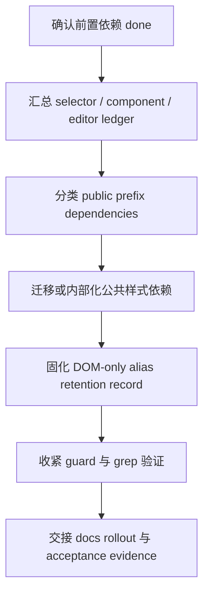

# legacy-prefix-teardown feature design

## 0. 术语约定

| 术语 | 定义 | 防冲突结论 |
|---|---|---|
| Legacy prefix public contract | 用户、插件、editor 或库样式把 `.cxd-*`、`.antd-*`、`.dark-*` 或 `classPrefix` 当作公共样式 API 的依赖。 | 本 feature 的目标是退出该契约；不是把 `.cxd-*` 再包装成新 API。 |
| DOM-only legacy alias | 显式迁移开关开启后 DOM 同时输出 `.prismui-*` 和 `.cxd-*`，让老定制页面自己的 `.cxd-*` CSS 在迁移期继续命中。 | 只允许 `cxd`，不生成库 CSS，不从任意 `classPrefix` 推导 `antd` / `dark` alias。 |
| LegacyPrefixLedger | 汇总 selector allowlist、ComponentMigrationLedger、HelperScssInventory 和剩余 `classPrefix` 命中的机器可读清单。 | 它是 teardown 的输入和验收证据，不是长期例外列表。 |
| AliasRetentionRecord | 记录 DOM-only alias 开关的默认状态、适用范围、人工复审责任方、复审窗口和退出评估材料。 | 复审是人工评估，不绑定固定版本卡点；目标是在可用迁移路径形成后不晚于 1 年触发评估。 |
| PrefixTeardownBoundary | 哪些旧前缀依赖被删除、内部化、迁移到 stable selector，哪些留给 docs rollout。 | 不覆盖 IE11 动态 token；IE11 只保留静态 CSS 降级说明。 |

## 1. 决策与约束

### 需求摘要

本 feature 承接前置的 selector inventory、核心组件迁移和 editor/helper 迁移，收口旧主题前缀作为公共样式 API 的最后一段治理。核心目标是：默认主路径只暴露稳定 `.prismui-*`、`[data-prismui-theme]` 和 token；剩余 `classPrefix` / `.cxd-*` 依赖要么迁移到 stable selector，要么标记为内部 legacy，要么进入 DOM-only alias 的显式迁移边界；最终交给 docs rollout 的只剩用户迁移说明、复审材料和风险记录。

明确不做：

- 不重新启用 SCSS/CSS `.cxd-*` legacy selector 双编译或双产物。
- 不把 `.cxd-*`、`.antd-*`、`.dark-*` 写成新的公共样式定制入口。
- 不承诺 DOM-only alias 一定退出或在某个固定版本退出；退出必须经过最多 1 年窗口内的人工评估。
- 不迁移尚未完成的 core component / editor helper 具体选择器；implementation 前置依赖必须先 `done`。
- 不把 IE11 变成动态 token 主题能力；IE11 只留静态 CSS 降级边界。
- 不替代 `theme-system-validation-docs-rollout` 写完整用户指南；本项只产出 docs rollout 可消费的迁移事实和风险清单。

### 复杂度档位

- 结构 = modules（跨 Theme Runtime、SCSS guard、core/editor migration ledger、docs input）。
- 可读性 = public（涉及用户可见迁移开关和公开样式 API 收口）。
- 可演进性 = stable（teardown 结果会决定后续是否还能新增前缀依赖）。
- 可测试性 = verified（需要 guard、grep、targeted runtime test 和 ledger 完整性证据）。
- Compatibility = migration-compatible（只保留显式 DOM-only alias 的迁移窗口）。

### 关键决策

1. **实现 admission 必须等待依赖 done**
   本 design 可以在 `core-component-selector-migration` 与 `editor-theme-helper-migration` design-review passed 后起草；implementation 开始前必须确认这两个依赖以及它们的前置 guard / inventory 已 `done`。

2. **默认主路径不含旧前缀 API**
   `ThemeInstance.classnames`、组件 DOM、主题覆写和用户文档主路径必须围绕 `.prismui-*`、`[data-prismui-theme]` 和 token；`classPrefix` 只能作为 legacy/internal 或行为对象兼容字段存在。

3. **DOM-only alias 是显式迁移能力，不是样式契约**
   `legacyDomClassAlias` 默认关闭，只允许显式 `cxd`；不得生成 `.cxd-*` 库 CSS，不得要求 theme-editor 生成 `.cxd-*`，不得从 `classPrefix` 自动推导其他主题 alias。

4. **剩余命中必须可审计**
   任何剩余 `.cxd-*`、`.antd-*`、`.dark-*`、`#{$ns}` 或样式相关 `classPrefix` 命中必须进入 LegacyPrefixLedger，带分类、owner、保留原因、退出条件和下一归属。

5. **退出机制是人工评估，不是自动计时炸弹**
   AliasRetentionRecord 记录“可用迁移路径形成后不晚于 1 年触发人工评估”的窗口、责任方和评估材料；评估后由 owner 决定继续保留、收窄或退出，不绑定固定版本卡点。

### 基线风险与验证入口

- `packages/amis-core/src/theme.tsx` 已有 `componentClassPrefix: 'amis-'`、`legacyDomClassAlias?: false | 'cxd'`、`makeStableClassnames()` 和默认关闭的 DOM-only alias。
- `packages/amis-core/src/Root.tsx` 已通过 `ThemeScopeRoot` 输出 `data-prismui-theme`，但仍把 `classPrefix` 透传给 renderer props。
- `packages/amis-core/src/theme.tsx#getClassPrefix()` 与 `packages/amis-editor-core/src/manager.ts#getThemeClassPrefix()` 仍暴露旧前缀读取点。
- `packages/amis-ui/src/themes/cxd.ts`、`antd.ts`、`dark.ts` 仍声明 `classPrefix`；需要区分主题行为对象兼容字段和公共样式 API。
- `packages/amis-ui/scss/themes/cxd-ie11.scss`、`packages/amis/build.sh` 的 `cxd.css` / `cxd-ie11.css` 文件名兼容不能被误解为 selector 兼容。
- 前置 design 指向 `selector guard`、`ComponentMigrationLedger`、`HelperScssInventory`；本项 implementation 若拿不到这些真实产物必须 fail-closed。

### Top 3 风险

1. **teardown 被误做成“大删除”**：直接删 `classPrefix` 可能破坏内部行为配置或第三方组件传参。缓解：先做 LegacyPrefixLedger 分类，只迁移公共样式依赖，保留内部 legacy 字段并标明退出条件。
2. **DOM-only alias 变成长期公共 API**：文档或测试如果把 `.cxd-*` 写成推荐入口，会反向固化旧体系。缓解：AliasRetentionRecord、docs rollout input 和 guard 都把 alias 标为 migration-only，默认关闭。
3. **前置 ledger 不完整导致验收假通过**：如果 core/editor 剩余命中没有分类，本项无法知道该删什么。缓解：implementation admission 明确依赖前置项 `done` 和 ledger artifacts，缺失即阻塞。

## 2. 名词与编排

### 2.1 名词层

#### 现状

- Theme Runtime 已新增 `componentClassPrefix`、`legacyDomClassAlias`、`stableClassnames` 和 `scope`，但 `classPrefix` 仍存在于 `ThemeConfig`、`ThemeProps` 和部分调用链中。
- Button pilot 已证明默认 `.prismui-*`、显式 `.cxd-*` DOM alias、Root `data-prismui-theme` 的最小闭环。
- Stylesheet build design 定义 selector inventory、allowlist 和 guard，拒绝新增 SCSS `.cxd-*` legacy selector。
- Core component migration design 定义 ComponentMigrationLedger，要求剩余 `#{$ns}` / `.cxd-*` / `classPrefix` 命中有分类、owner 和退出条件。
- Editor helper migration design 定义 HelperScssInventory，要求 `.AMISCSSWrapper` 只能是容器别名，theme identity 来自 `data-prismui-theme`。
- compound 结论已拒绝 SCSS/CSS `.cxd-*` 兼容开关，允许显式 DOM-only alias。

#### 变化

新增或固化以下名词：

| 名词 | 形态 | 职责 |
|---|---|---|
| LegacyPrefixLedger | YAML/JSON 或固定 Markdown 表格 | 合并前置 allowlist / ledger / inventory，列出所有剩余旧前缀公共依赖及处理状态。 |
| PrefixDependencyKind | 枚举 | 区分 public selector、runtime alias、internal passthrough、theme behavior config、file-name compatibility、docs historical、generated artifact。 |
| PrefixTeardownDecision | 记录 | 对每类命中给出 migrate、internalize、retain-temporarily、handoff-to-docs、drop 的决策。 |
| AliasRetentionRecord | YAML/Markdown | 记录 DOM-only alias 显式开关、默认状态、适用范围、人工评估窗口、责任方和退出评估材料。 |
| PrefixPublicApiGuard | guard 规则 | 默认阻止新增旧前缀公共选择器、样式相关 `classPrefix` 依赖和 editor/helper `.cxd-*` 生成路径。 |

接口示例：

```yaml
alias_retention:
  capability: "DOM-only .cxd-* class alias"
  default: false
  explicit_values: ["cxd"]
  library_css_compatibility: false
  review_policy: "可用迁移路径形成后不晚于 1 年触发人工评估"
  decision_owner: "theme architecture owner"
  exit_evidence:
    - "selector guard has no new public prefix dependencies"
    - "docs provide stable .prismui-* / token migration path"
    - "known legacy consumers have migration notes or risk acceptance"
```

Interface 设计检查：

- Module / interface：LegacyPrefixLedger 是前置迁移 feature 与 docs rollout / acceptance 之间的交接接口。
- Seam placement：seam 放在 ledger、runtime alias policy 和 guard，不让每个组件或 editor 插件自行决定旧前缀是否保留。
- Depth / locality：删除或收窄旧前缀策略时，变更集中在 Theme Runtime policy、guard 和 ledger。
- Dependency strategy：repository-local artifacts；不依赖外部服务。
- Adapter：DOM-only alias 不是 adapter，是 Theme Runtime 的显式迁移输出；本项只治理生命周期。
- Test surface：runtime alias on/off 单测、selector guard、grep、ledger completeness check、docs handoff diff review。

### 2.2 编排层

#### 现状

当前迁移链路是多条 feature 分别产生证据：Runtime 证明 `.prismui-*` 主路径和 DOM alias，Stylesheet Build 建 guard，Core Migration 输出组件 ledger，Editor Migration 输出 helper/editor inventory。缺口在于：这些证据还没有汇总成一个“旧前缀公共契约是否退出”的最终判定，也没有把 DOM-only alias 的复审和退出边界写成可执行材料。

#### 变化

主流程：



流程级约束：

- implementation admission 前必须重新读取 items.yaml；依赖未 `done` 时只能停。
- 任何旧前缀命中不能只写“保留”，必须有 PrefixDependencyKind、owner、保留原因和退出条件。
- `legacyDomClassAlias` 默认关闭，显式开启才可输出 `.cxd-*`；alias 关闭路径必须被测试覆盖。
- 不允许新增 `.cxd-*` / `.antd-*` / `.dark-*` 库 CSS、SCSS helper 双输出或 theme-editor `.cxd-*` 新生成路径。
- 文件名兼容如 `cxd.css` / `cxd-ie11.css` 必须标为 file-name compatibility，不得写成 selector 兼容。
- docs rollout 接收的是迁移事实和风险记录，不是旧前缀 API 推荐文案。

### 2.3 挂载点清单

- LegacyPrefixLedger：删掉后无法证明剩余旧前缀依赖已被迁移、内部化或有退出条件。
- PrefixPublicApiGuard：删掉后新增 `.cxd-*` / `classPrefix` 公共样式依赖无法被阻止。
- Theme Runtime alias policy：删掉后 DOM-only `.cxd-*` alias 的默认关闭和显式开启边界不可验证。
- AliasRetentionRecord：删掉后最多 1 年内人工评估、责任方和退出材料没有 durable evidence。
- Docs rollout handoff：删掉后下一项无法把用户心智收口到 token / `.prismui-*` / `[data-prismui-theme]`。

### 2.4 推进策略

1. **实现准入与依赖核验**：确认 core-component-selector-migration、editor-theme-helper-migration 及其前置 selector guard / ledger artifacts 已 `done`。
   退出信号：items.yaml 依赖均 `done`，且前置 ledger / inventory 文件路径可被读取。
2. **LegacyPrefixLedger 汇总**：合并 selector allowlist、ComponentMigrationLedger、HelperScssInventory 和 runtime/editor `classPrefix` 扫描。
   退出信号：所有剩余旧前缀命中都有 PrefixDependencyKind、owner、保留原因、退出条件和下一归属。
3. **公共依赖迁移或内部化**：迁移 public selector / DOM query / editor generator 依赖，或将不可删除项标为 internal legacy。
   退出信号：默认公共路径不依赖 `.cxd-*` / `classPrefix`，保留项全部在 ledger 中解释。
4. **DOM-only alias policy 固化**：确认 `legacyDomClassAlias` 默认关闭、只允许 `cxd` 显式开启、不生成库 CSS，并补 AliasRetentionRecord。
   退出信号：alias off/on 测试通过，retention record 含复审窗口、人工责任方和退出评估材料。
5. **guard 收紧与反向验证**：运行 selector guard、grep 和 targeted runtime/editor 检查，确认无新增旧前缀公共依赖。
   退出信号：guard 通过；新增 `.cxd-*` / `.antd-*` / `.dark-*` / 样式相关 `classPrefix` 命中为 0 或均有 ledger 分类。
6. **交接 docs rollout**：整理用户迁移 notes、文件名兼容说明、IE11 静态 CSS 边界、alias 风险和退出评估材料。
   退出信号：docs rollout 可以直接从 handoff 生成用户指南、贡献指南和发布风险记录。
7. **acceptance 证据收口**：形成 implementation / review / QA / acceptance 可核验证据包。
   退出信号：命令输出、ledger、retention record、diff summary 和 docs handoff 都可由仓库事实反查。

### 2.5 结构健康度与微重构

##### 评估

- 文件级 — `packages/amis-core/src/theme.tsx`：Theme Runtime 仍是 alias policy 的正确位置；本项不拆文件，只收紧 policy 和测试。
- 文件级 — `packages/amis-core/src/Root.tsx`：Root scope 已在前置完成，本项只核验 `classPrefix` 透传是否仍属于 internal legacy，不重写 Root。
- 文件级 — `packages/amis-editor-core/src/manager.ts`：`getThemeClassPrefix()` 是旧公共读取点之一，但 editor 具体迁移属于前置；本项只按前置结果决定是否内部化、保留或交 docs。
- 目录级 — `.codestable/features/**`：前置 ledger / inventory 分散在多个 feature 目录；本项适合新增一个汇总 ledger，而不是改写前置报告。
- 目录级 — docs：完整文档更新属于 `theme-system-validation-docs-rollout`，本项只新增 handoff 材料或记录。
- compound 命中：`2026-07-24-explore-cxd-compat-compile-switch.md` 已要求 DOM-only alias 与 SCSS/CSS selector 兼容分离。

##### 结论：不做前置微重构

本项不做代码结构预重构。原因：teardown 的主要风险不是文件太胖，而是旧前缀依赖分类不清；新增汇总 ledger / retention record 比拆现有 runtime/editor 文件更能降低风险。

##### 超出范围的观察

- 如果 implementation 发现 `classPrefix` 同时承担样式 API 和第三方组件行为配置，不能在本项内粗暴删除；应拆成 internal behavior config 与 public styling contract 两类。
- 如果 docs rollout 需要 codemod 或迁移工具，另在 docs rollout 或后续 feature 中设计，不塞进 teardown。

## 3. 验收契约

### 3.1 关键场景清单

- 输入：前置 core/editor ledger 与 selector allowlist → 期望 LegacyPrefixLedger 汇总所有剩余旧前缀命中，并带分类、owner、退出条件。
- 输入：默认渲染 Button / core migrated component → 期望 DOM 主路径为 `.prismui-*`，默认不输出 `.cxd-*` alias。
- 输入：显式开启 `legacyDomClassAlias: 'cxd'` → 期望 DOM 同时有 `.prismui-*` 与 `.cxd-*`，但库 CSS 不新增 `.cxd-*` selector。
- 输入：新增 `.cxd-Foo` / `.antd-Foo` / `.dark-Foo` SCSS selector 或 theme-editor 生成路径 → 期望 guard 失败。
- 输入：保留 `cxd.css` / `cxd-ie11.css` 文件名兼容 → 期望 ledger 标为 file-name compatibility，文档 handoff 不把它解释成 selector 兼容。
- 输入：AliasRetentionRecord 审查 → 期望包含默认状态、显式值、适用范围、人工复审窗口、责任方和退出评估材料。
- 反向核对：不写 SCSS/CSS legacy selector 兼容层，不自动支持 `antd` / `dark` alias，不承诺 IE11 动态 token 切换，不替 docs rollout 写完整指南。

### 3.2 Acceptance Coverage Matrix

| Scenario | Covered By Step | Evidence Type | Command / Action | Core? |
|---|---|---|---|---|
| implementation admission 依赖 done | S1 | items.yaml / workflow hook | `codestable-workflow-next.py epic --roadmap ... --json` | yes |
| LegacyPrefixLedger 完整分类 | S2 | ledger / grep | legacy prefix ledger completeness check + `rg` | yes |
| public selector / classPrefix 依赖已迁移或内部化 | S3 | diff review / grep | `rg -n "\\.cxd-|\\.antd-|\\.dark-|classPrefix"` scoped scan | yes |
| alias 默认关闭 | S4 | unit/render test | `npm test --workspace amis-core -- theme` | yes |
| alias 显式开启且只支持 cxd | S4 | unit/render test | `npm test --workspace amis-core -- theme` | yes |
| 不生成 `.cxd-*` 库 CSS | S4 / S5 | grep / built artifact check | `rg -n "\\.cxd-" packages/amis-ui/scss packages/amis-ui/lib packages/amis-ui/esm` | yes |
| guard 阻止新增旧前缀公共依赖 | S5 | command | `npm run check:theme-selectors --workspace amis-ui` | yes |
| file-name compatibility 不等于 selector compatibility | S6 | handoff / ledger | docs rollout handoff review | yes |
| IE11 只保留静态 CSS 降级边界 | S6 | handoff / docs input | IE11 migration notes | yes |

### 3.3 DoD Contract

| ID | 要求 | 证据 | 阻塞级别 |
|---|---|---|---|
| DOD-DESIGN-001 | design 与 checklist 覆盖旧前缀公共 API 退出、DOM-only alias、ledger、guard、人工复审和 docs handoff | design review | blocking |
| DOD-IMPL-001 | LegacyPrefixLedger、AliasRetentionRecord、guard 收紧和 docs handoff 均落盘 | implementation report | blocking |
| DOD-REVIEW-001 | code review passed，确认没有新增 SCSS/CSS `.cxd-*` 兼容层或自动 `antd` / `dark` alias | review report | blocking |
| DOD-QA-001 | QA 覆盖 alias off/on、guard、ledger 完整性、IE11 静态边界和文件名兼容说明 | QA report | blocking |
| DOD-ACCEPT-001 | acceptance 回写 roadmap 状态，并把 docs rollout 所需迁移材料交接完整 | acceptance report | blocking |

Validation Commands:

| ID | 命令 | 目的 | 核心性 | 失败处理 |
|---|---|---|---|---|
| CMD-001 | `PYTHONPATH=/Users/songmingxu/Projects/gold-market/.venv/lib/python3.13/site-packages python3 /Users/songmingxu/.agents/skills/cs-onboard/tools/codestable-workflow-next.py epic --roadmap .codestable/roadmap/theme-system-refactor --json` | 确认 workflow 与依赖状态 | core | fix-or-block |
| CMD-002 | `npm test --workspace amis-core -- theme` | 验证 Theme Runtime alias policy | core | fix-or-block |
| CMD-003 | `npm test --workspace amis -- button` | 验证渲染路径默认 stable class 和 alias 边界 | core | fix-or-block |
| CMD-004 | `npm run check:theme-selectors --workspace amis-ui` | 校验 selector guard 收紧 | core | fix-or-block |
| CMD-005 | `npm run stylelint` | 校验 SCSS 规则未被破坏 | supporting | fix-or-block |
| CMD-006 | `npm run typecheck` | 校验 TS 类型与 public/internal 边界 | supporting | document-baseline |
| CMD-007 | `rg -n "\\.cxd-|\\.antd-|\\.dark-|classPrefix" packages/amis-core/src packages/amis-ui/src packages/amis-ui/scss packages/amis/src packages/amis-editor-core/src packages/amis-theme-editor-helper/src` | 核对剩余旧前缀和 classPrefix 命中 | core | document-baseline |
| CMD-008 | `python3 /Users/songmingxu/.agents/skills/cs-onboard/tools/validate-yaml.py --file .codestable/features/2026-07-25-legacy-prefix-teardown/legacy-prefix-teardown-checklist.yaml --yaml-only` | 校验 checklist YAML | core | fix-or-block |
| CMD-009 | `npm test --workspace amis -- --runTestsByPath __tests__/renderers/Tabs.test.tsx __tests__/renderers/List.test.tsx __tests__/renderers/Table.test.tsx __tests__/renderers/Form/inputSubForm.test.tsx __tests__/renderers/Video.test.tsx` | 验证相关 renderer 测试和 snapshot 已迁到 stable class 主路径 | core | fix-or-block |
| CMD-010 | `npm test --workspace amis -- --runTestsByPath __tests__/renderers/Tree.test.tsx __tests__/renderers/Form/formula.test.tsx` | 验证 Tree / FormulaPicker 行为查询和 snapshot 已迁到 stable class 主路径 | core | fix-or-block |

Required Artifacts: LegacyPrefixLedger、AliasRetentionRecord、selector guard output、alias runtime test evidence、legacy prefix grep summary、docs rollout handoff、implementation report、code review、QA、acceptance。

## 4. 与项目级架构文档的关系

- 本 feature 执行 ADR-001 中“`.cxd-*` 不再作为公共样式 API，DOM-only alias 仅迁移辅助”的决策，不新增替代 ADR。
- 本 feature 消费 `stylesheet-stable-selector-build` 的 guard、`core-component-selector-migration` 的 ComponentMigrationLedger、`editor-theme-helper-migration` 的 HelperScssInventory。
- acceptance 后如 LegacyPrefixLedger / AliasRetentionRecord 成为稳定治理格式，应沉淀到 architecture / compound，供 docs rollout 和后续人工复审使用。
