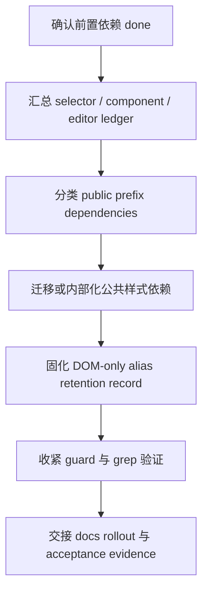

# CodeStable Implementation Review Packet

- root: `/Users/songmingxu/Projects/amis`
- unit: `.codestable/features/2026-07-25-legacy-prefix-teardown`
- stage: `implementation`

## Reviewer Mission

Review the implementation as an independent Task agent. Verify the code directly from the packet instead of trusting the implementer summary.

## Stage Focus

scope drift, hidden behavior changes, missing tests, maintainability, edge cases, security, and production safety

## Reviewer Output Contract

- Lead with findings, ordered by severity.
- Include severity (`P0`/`P1`/`P2`/`P3`) and confidence for each finding.
- Reference concrete files, code, docs, or validation evidence when possible.
- If there are no blocking findings, say so explicitly and list residual risks or test gaps.

## Unit Documents
### `.codestable/features/2026-07-25-legacy-prefix-teardown/approval-report.md`

```
---
doc_type: approval-report
unit: 2026-07-25-legacy-prefix-teardown
status: approved
reason: design-review-local-only-authorization
approvals:
  design-review-local-only: approved
approval_groups: {}
created_at: 2026-07-25
---

# Approval Report

## Decision: design-review-local-only

已批准 owner 降级授权 `design-review-local-only`。

## Decision History

- 2026-07-25：owner 在“继续把剩余收口项设计完”的上下文中明确回复“可以”，允许独立 reviewer 工具不可用时以本地审查降级完成剩余 child design review。

## Why Now

`legacy-prefix-teardown` 是 theme system refactor epic 的下一个子 feature。按 CodeStable gate，首次 design review 需要独立 Task agent reviewer；当前 reviewer tool 在创建 agent 前被参数 schema 拒绝，无法产生 reviewer id 或审查输出。

## Context

- Design: `.codestable/features/2026-07-25-legacy-prefix-teardown/legacy-prefix-teardown-design.md`
- Checklist: `.codestable/features/2026-07-25-legacy-prefix-teardown/legacy-prefix-teardown-checklist.yaml`
- Design review checkpoint: `.codestable/features/2026-07-25-legacy-prefix-teardown/legacy-prefix-teardown-design-review.md`
- Roadmap item: `legacy-prefix-teardown`

## Options

### Option A: 批准 `legacy design-review-local-only`

允许主 agent 对 design / checklist / roadmap / ADR / compound / 前置 feature / 关键代码事实做本地逐项审查，并在审查报告中保留 local-only 降级来源。该批准不等于确认 design，也不进入实现；design 仍需后续 epic 批量确认。

**Decision**：approved，2026-07-25，owner 明确回复“可以”继续完成剩余设计批次。

### Option B: 不批准，稍后重试独立 reviewer

保持 design-review gate blocked，等待 Task agent reviewer 可用后重试。

## Recommendation

建议批准 Option A。该 feature 当前只落设计和 checklist，不改业务代码；local-only 降级只影响方案审查来源，不会跳过后续实现、code review、QA 或 acceptance。

## Risks And Tradeoffs

- local-only 缺少独立 reviewer 的第二视角，可能漏看 alias 生命周期、文件名兼容和公共 API 退出边界。
- 不批准会让 epic child design batch 停在本项，直到 reviewer tool 可用。
- 批准后仍应在本地审查中重点检查 `.cxd-*` 是否没有被重新定义为公共 API、DOM-only alias 是否默认关闭、复审机制是否保留人工评估。

## Non-Automatic Actions

- 不自动批准 design。
- 不自动进入实现。
- 不自动提交 commit。
- 不自动 push。
- 不跳过后续 code review、QA 或 acceptance。

## After Approval

授权已生效。本轮 design review 可以用 local-only 降级完成，但该授权不自动确认 design，也不进入实现；design 仍需后续 owner 整体确认或 epic 批量确认。
```

### `.codestable/features/2026-07-25-legacy-prefix-teardown/legacy-prefix-teardown-alias-retention-record.md`

```
---
doc_type: alias-retention-record
feature: 2026-07-25-legacy-prefix-teardown
roadmap: theme-system-refactor
roadmap_item: legacy-prefix-teardown
status: current
updated: 2026-07-28
---

# DOM-only AliasRetentionRecord

## 1. Capability

| Field | Value |
|---|---|
| Capability | DOM-only `.cxd-*` class alias |
| Runtime option | `legacyDomClassAlias` |
| Default | `false` |
| Explicit values | `cxd` only |
| Unsupported values | `antd` / `dark` / arbitrary `classPrefix` |
| Library CSS compatibility | `false` |
| SCSS/CSS dual output | forbidden |
| Theme identity | `[data-prismui-theme]`, not `.cxd-*` |

## 2. Retention Policy

DOM-only alias 只服务迁移期老定制页面：如果页面自己写了 `.cxd-*` 覆写，可以在显式开启后继续命中 DOM；amis 库 CSS、theme-editor 生成 CSS、官方文档主路径都不得把 `.cxd-*` 当成新的样式契约。

复审机制是人工评估：在可用迁移路径形成后不晚于 1 年触发一次 architecture owner 评估。评估结论可以是继续保留、收窄适用范围或退出；不绑定固定版本卡点，不自动退出。

## 3. Decision Owner And Review Inputs

| Item | Value |
|---|---|
| Decision owner | theme architecture owner |
| Review trigger | stable `.prismui-*` / token migration docs and examples are available |
| Review window | not later than 1 year after migration path is available |
| Required inputs | selector guard trend, docs migration guide, known legacy consumer feedback, release risk notes |
| Allowed outcomes | retain, narrow, deprecate with schedule, remove after explicit owner decision |

## 4. Exit Evidence

- selector guard continues to report 0 new public prefix violations.
- docs rollout provides stable `.prismui-*` / `[data-prismui-theme]` / token migration path.
- legacy consumers have migration notes or explicit risk acceptance.
- no core UI path requires `.cxd-*` for library CSS styling.
- file-name compatibility such as `cxd.css` is documented separately from selector compatibility.

## 5. Verification Hooks

- `packages/amis-core/__tests__/theme.test.ts` covers default stable class output and explicit `cxd` alias.
- This feature adds a non-`cxd` alias regression so runtime does not silently generate `antd-*` or `dark-*`.
- `packages/amis-ui/scripts/checkThemeSelectors.js` blocks new source `.cxd-*` selectors and `${classPrefix}` DOM selector strings.
```

### `.codestable/features/2026-07-25-legacy-prefix-teardown/legacy-prefix-teardown-checklist.yaml`

```
feature: 2026-07-25-legacy-prefix-teardown
created: 2026-07-25

steps:
  - action: "实现准入与依赖核验：确认 core-component-selector-migration、editor-theme-helper-migration 及前置 selector guard / ledger artifacts 已 done"
    exit_signal: "items.yaml 依赖均 done，且前置 ledger / inventory 文件路径可被读取"
    status: done
  - action: "LegacyPrefixLedger 汇总：合并 selector allowlist、ComponentMigrationLedger、HelperScssInventory 和 runtime/editor classPrefix 扫描"
    exit_signal: "所有剩余旧前缀命中都有 PrefixDependencyKind、owner、保留原因、退出条件和下一归属"
    status: done
  - action: "公共依赖迁移或内部化：迁移 public selector / DOM query / editor generator 依赖，或将不可删除项标为 internal legacy"
    exit_signal: "默认公共路径不依赖 .cxd-* / classPrefix，保留项全部在 ledger 中解释"
    status: done
  - action: "DOM-only alias policy 固化：确认 legacyDomClassAlias 默认关闭、只允许 cxd 显式开启、不生成库 CSS，并补 AliasRetentionRecord"
    exit_signal: "alias off/on 测试通过，retention record 含复审窗口、人工责任方和退出评估材料"
    status: done
  - action: "guard 收紧与反向验证：运行 selector guard、grep 和 targeted runtime/editor 检查，确认无新增旧前缀公共依赖"
    exit_signal: "guard 通过；新增 .cxd-* / .antd-* / .dark-* / 样式相关 classPrefix 命中为 0 或均有 ledger 分类"
    status: done
  - action: "交接 docs rollout：整理用户迁移 notes、文件名兼容说明、IE11 静态 CSS 边界、alias 风险和退出评估材料"
    exit_signal: "docs rollout 可以直接从 handoff 生成用户指南、贡献指南和发布风险记录"
    status: done
  - action: "acceptance 证据收口：形成 implementation / review / QA / acceptance 可核验证据包"
    exit_signal: "命令输出、ledger、retention record、diff summary 和 docs handoff 都可由仓库事实反查"
    status: done

checks:
  - item: "implementation 开始前重新确认 core-component-selector-migration 和 editor-theme-helper-migration status=done，design-review passed 只允许 design admission"
    source: 关键决策
    status: pending
  - item: "默认主路径只暴露 .prismui-*、data-prismui-theme 和 token，不把旧前缀写成公共样式 API"
    source: Legacy prefix public contract
    status: pending
  - item: "legacyDomClassAlias 默认关闭，只允许显式 cxd，不从 classPrefix 自动推导 antd / dark alias"
    source: DOM-only alias policy
    status: pending
  - item: "不生成 .cxd-* 库 CSS，不启用 SCSS/CSS legacy selector 双编译或双产物"
    source: CSS 边界
    status: pending
  - item: "LegacyPrefixLedger 覆盖 selector allowlist、ComponentMigrationLedger、HelperScssInventory 和 runtime/editor classPrefix 扫描"
    source: LegacyPrefixLedger
    status: pending
  - item: "剩余 .cxd-* / .antd-* / .dark-* / #{$ns} / 样式相关 classPrefix 命中均有分类、owner、保留原因和退出条件"
    source: LegacyPrefixLedger
    status: pending
  - item: "PrefixDependencyKind 区分 public selector、runtime alias、internal passthrough、theme behavior config、file-name compatibility、docs historical、generated artifact"
    source: PrefixDependencyKind
    status: pending
  - item: "AliasRetentionRecord 记录默认状态、显式值、适用范围、人工复审窗口、责任方和退出评估材料"
    source: AliasRetentionRecord
    status: pending
  - item: "复审机制表达为最多 1 年窗口内人工评估，不绑定固定版本卡点，不自动退出"
    source: 退出机制
    status: pending
  - item: "cxd.css / cxd-ie11.css 等文件名兼容被标为 file-name compatibility，不被解释成 selector compatibility"
    source: 文件名兼容
    status: pending
  - item: "IE11 只保留静态 CSS 降级边界，不承诺动态 token 主题切换"
    source: IE11 边界
    status: pending
  - item: "docs rollout handoff 包含用户迁移 notes、alias 风险、文件名兼容说明和退出评估材料"
    source: docs handoff
    status: pending
  - item: "selector guard 是必跑命令；若前置项未提供真实命令，实现阶段必须阻塞或回前置项补齐"
    source: 验证入口
    status: pending
  - item: "acceptance 能从 ledger、retention record、guard output、grep summary、docs handoff 和命令输出核验完成状态"
    source: DoD
    status: pending

dod:
  commands:
    - id: CMD-001
      command: "PYTHONPATH=/Users/songmingxu/Projects/gold-market/.venv/lib/python3.13/site-packages python3 /Users/songmingxu/.agents/skills/cs-onboard/tools/codestable-workflow-next.py epic --roadmap .codestable/roadmap/theme-system-refactor --json"
      core: true
      failure_handling: fix-or-block
    - id: CMD-002
      command: "npm test --workspace amis-core -- theme"
      core: true
      failure_handling: fix-or-block
    - id: CMD-003
      command: "npm test --workspace amis -- button"
      core: true
      failure_handling: fix-or-block
    - id: CMD-004
      command: "npm run check:theme-selectors --workspace amis-ui"
      core: true
      failure_handling: fix-or-block
    - id: CMD-005
      command: "npm run stylelint"
      core: false
      failure_handling: fix-or-block
    - id: CMD-006
      command: "npm run typecheck"
      core: false
      failure_handling: document-baseline
    - id: CMD-007
      command: "rg -n \"\\.cxd-|\\.antd-|\\.dark-|classPrefix\" packages/amis-core/src packages/amis-ui/src packages/amis-ui/scss packages/amis/src packages/amis-editor-core/src packages/amis-theme-editor-helper/src"
      core: true
      failure_handling: document-baseline
    - id: CMD-008
      command: "python3 /Users/songmingxu/.agents/skills/cs-onboard/tools/validate-yaml.py --file .codestable/features/2026-07-25-legacy-prefix-teardown/legacy-prefix-teardown-checklist.yaml --yaml-only"
      core: true
      failure_handling: fix-or-block
    - id: CMD-009
      command: "npm test --workspace amis -- --runTestsByPath __tests__/renderers/Tabs.test.tsx __tests__/renderers/List.test.tsx __tests__/renderers/Table.test.tsx __tests__/renderers/Form/inputSubForm.test.tsx __tests__/renderers/Video.test.tsx"
      core: true
      failure_handling: fix-or-block
    - id: CMD-010
      command: "npm test --workspace amis -- --runTestsByPath __tests__/renderers/Tree.test.tsx __tests__/renderers/Form/formula.test.tsx"
      core: true
      failure_handling: fix-or-block
  evidence_required:
    - LegacyPrefixLedger
    - AliasRetentionRecord
    - selector_guard_output
    - alias_runtime_test_evidence
    - legacy_prefix_grep_summary
    - docs_rollout_handoff
    - diff_summary
  cleanliness:
    debug_output: forbidden
    temporary_todo: forbidden
    commented_code: forbidden
    unused_import: forbidden
```

### `.codestable/features/2026-07-25-legacy-prefix-teardown/legacy-prefix-teardown-design-review.md`

```
---
doc_type: feature-design-review
feature: 2026-07-25-legacy-prefix-teardown
status: passed
review_state: passed
review_reason: ""
reviewer_id: "local-only:user-approved-2026-07-25"
reviewed: 2026-07-25
round: 1
---

# legacy-prefix-teardown feature design 审查报告

## 1. Scope And Inputs

- Design: `.codestable/features/2026-07-25-legacy-prefix-teardown/legacy-prefix-teardown-design.md`
- Checklist: `.codestable/features/2026-07-25-legacy-prefix-teardown/legacy-prefix-teardown-checklist.yaml`
- Roadmap: `.codestable/roadmap/theme-system-refactor/theme-system-refactor-roadmap.md`
- Roadmap item: `legacy-prefix-teardown`
- ADR: `.codestable/requirements/adrs/001-tokenized-theme-system.md`
- Compound: `.codestable/compound/2026-07-24-explore-cxd-compat-compile-switch.md`
- Prior features: `theme-runtime-button-pilot`, `stylesheet-stable-selector-build`, `core-component-selector-migration`, `editor-theme-helper-migration`
- Code facts checked: `packages/amis-core/src/theme.tsx`, `packages/amis-core/src/Root.tsx`, `packages/amis-editor-core/src/manager.ts`, `packages/amis-ui/src/themes/cxd.ts`, `packages/amis-ui/src/themes/antd.ts`, `packages/amis-ui/src/themes/dark.ts`, `packages/amis/build.sh`, `packages/amis-ui/scss/themes/cxd-ie11.scss`

### Independent Review

- Status: local-only
- Detection: local-only
- Provider / agent: none
- Raw output summary: reviewer tool attempts were rejected before an agent id was created because the tool wrapper injected empty optional fields (`reasoning_effort`) and/or mixed `message` with `items`.
- Merge policy: 本地逐项核验 design、checklist、roadmap、ADR、compound、前置 feature 和关键代码事实。
- Gate effect: owner 已批准 local-only 降级，允许本轮 design review 给出最终 verdict。

## 2. Design Summary

- Goal: 收敛旧主题前缀公共样式契约，治理 DOM-only `.cxd-*` alias 的显式开关、人工复审和退出边界。
- Key contracts: LegacyPrefixLedger、PrefixDependencyKind、PrefixTeardownDecision、AliasRetentionRecord、PrefixPublicApiGuard。
- Steps: 7 步；从依赖 done 准入、ledger 汇总、公共依赖迁移/内部化，到 alias policy、guard 收紧、docs handoff 和 acceptance 证据收口。
- Checks: 14 项；覆盖依赖准入、默认主路径、alias 默认关闭、禁止 SCSS/CSS legacy selector、ledger 分类、人工复审、文件名兼容、IE11 静态边界和 docs handoff。
- Baseline / validation: 设计列出 workflow hook、amis-core theme test、amis Button render test、theme selector guard、stylelint、typecheck、legacy prefix grep 和 checklist YAML 校验。

## 3. Findings

### blocking

- none

### important

- none

### nit

- none

### suggestion

- [ ] FDR-001 实现阶段建议把 LegacyPrefixLedger 做成机器可读 YAML/JSON，而不是只写 Markdown 表格。
  - Evidence: design 第 2.1 节允许 YAML/JSON 或固定 Markdown；checklist 要求剩余命中均有分类、owner、保留原因、退出条件和下一归属。
  - Impact: 不阻塞 design；机器可读格式能让 docs rollout、guard 和后续人工复审复用同一份证据，降低重新扫描成本。
- [ ] FDR-002 AliasRetentionRecord 的 `decision_owner` 不应长期停留在泛称，implementation/acceptance 阶段需要落到可执行的责任角色或小组。
  - Evidence: design 示例里写 `theme architecture owner`，roadmap notes 要求记录人工决策责任方。
  - Impact: 不阻塞 design；没有明确责任方会让“最多 1 年内复审”变成无人触发的软约束。
- [ ] FDR-003 `rg` 扫描命令很宽，implementation 阶段需要配合 ledger diff 或 guard 区分既有历史命中和本项新增命中。
  - Evidence: checklist `CMD-007` 使用跨包宽扫，failure_handling 是 `document-baseline`。
  - Impact: 不阻塞 design；如果只看 grep 总量，很容易把历史债务误判成本项失败。

### learning

- teardown 的核心不是“删掉所有 classPrefix”，而是把旧前缀从公共样式契约里退出；`classPrefix` 可能仍作为 internal legacy 或主题行为配置存在。
- `cxd.css` / `cxd-ie11.css` 这类文件名兼容需要单独分类，否则用户和文档容易把文件名兼容误解成 `.cxd-*` selector 兼容。

### praise

- design 正确保留了“最多 1 年内人工评估”的语义，没有把 DOM-only alias 退出写成自动版本卡点。
- 明确拒绝 SCSS/CSS `.cxd-*` 双轨，同时给 DOM-only alias 留出可审计迁移窗口，和 ADR / compound 共识一致。

## 4. User Review Focus

- 用户需要重点拍板：是否认可 legacy teardown 的完成标准是 ledger + guard + alias retention + docs handoff，而不是强行一次性删除所有 `classPrefix` 字段。
- implement 需要重点遵守：先等 core/editor 前置项 `done`；不能绕过前置 ledger；不能新增 `.cxd-*` 库 CSS 或自动 `antd` / `dark` alias。
- code review / QA / acceptance 需要重点复核：DOM-only alias 默认关闭、旧前缀剩余命中全可解释、文件名兼容不被包装成 selector 兼容、人工复审责任方真实可执行。

## 5. Evidence Confidence Ledger

| Check | Verdict | Evidence Class | Basis | Follow-up |
|---|---|---|---|---|
| Acceptance Coverage Matrix | pass | E | design 第 3.2 节覆盖依赖 done、LegacyPrefixLedger、public dependency 收口、alias off/on、不生成 `.cxd-*` 库 CSS、guard、file-name compatibility 和 IE11 静态边界 | implementation / QA 落命令与 ledger 证据 |
| DoD Contract | pass | E | design 第 3.3 节与 checklist `dod.commands` 覆盖 workflow hook、runtime/render test、guard、stylelint、typecheck、grep 和 YAML 校验 | none |
| Steps and checks traceability | pass | E | checklist 7 steps / 14 checks 均可追溯到 design 第 1-3 节 | none |
| Roadmap contract compliance | pass | E/C | roadmap 要求移除或内部化剩余 classPrefix 公共依赖，收敛 DOM-only alias 开关、文档、复审机制和移除条件；design 全部覆盖，并保留“人工评估非固定卡点” | none |
| Module interface design | pass | E/C | LegacyPrefixLedger、AliasRetentionRecord 和 PrefixPublicApiGuard 的 seam 清晰，分别承接前置 feature、runtime alias policy 和 guard | 实现阶段优先机器可读 ledger |
| Validation and artifacts | pass | E | checklist YAML 与 roadmap items YAML 待本轮命令复验；local-only 授权已记录在 approval-report | 跑 YAML / workflow / diff check |

Summary: E=6, C=2, H=0, H-only core checks=none。

## 6. Residual Risk

- local-only design review 缺少独立 reviewer 视角；用户 review 应重点看 legacy ledger 是否需要更强机器可读约束。
- 前置 core/editor 的 ledger 如果实现阶段不完整，本项会被阻塞；这是设计刻意保留的 fail-closed 边界。
- alias retention 的责任方如果没有在 implementation/acceptance 落实，1 年内人工评估可能无法触发。

## 7. Verdict

- Status: passed
- Next: 交回 epic child design batch；继续推进 `theme-system-validation-docs-rollout`，所有子 feature design-review passed 后再统一进入 owner design confirmation。

## 8. Focused Closure

- none
```

### `.codestable/features/2026-07-25-legacy-prefix-teardown/legacy-prefix-teardown-design.md`

```
---
doc_type: feature-design
feature: 2026-07-25-legacy-prefix-teardown
roadmap: theme-system-refactor
roadmap_item: legacy-prefix-teardown
execution_lane: goal
status: approved
summary: 收敛 legacy theme prefix 公共依赖，并治理 DOM-only cxd alias 的显式开关、复审与退出边界
tags: [theme, legacy-prefix, migration, selector-guard, compatibility]
---

# legacy-prefix-teardown feature design

## 0. 术语约定

| 术语 | 定义 | 防冲突结论 |
|---|---|---|
| Legacy prefix public contract | 用户、插件、editor 或库样式把 `.cxd-*`、`.antd-*`、`.dark-*` 或 `classPrefix` 当作公共样式 API 的依赖。 | 本 feature 的目标是退出该契约；不是把 `.cxd-*` 再包装成新 API。 |
| DOM-only legacy alias | 显式迁移开关开启后 DOM 同时输出 `.prismui-*` 和 `.cxd-*`，让老定制页面自己的 `.cxd-*` CSS 在迁移期继续命中。 | 只允许 `cxd`，不生成库 CSS，不从任意 `classPrefix` 推导 `antd` / `dark` alias。 |
| LegacyPrefixLedger | 汇总 selector allowlist、ComponentMigrationLedger、HelperScssInventory 和剩余 `classPrefix` 命中的机器可读清单。 | 它是 teardown 的输入和验收证据，不是长期例外列表。 |
| AliasRetentionRecord | 记录 DOM-only alias 开关的默认状态、适用范围、人工复审责任方、复审窗口和退出评估材料。 | 复审是人工评估，不绑定固定版本卡点；目标是在可用迁移路径形成后不晚于 1 年触发评估。 |
| PrefixTeardownBoundary | 哪些旧前缀依赖被删除、内部化、迁移到 stable selector，哪些留给 docs rollout。 | 不覆盖 IE11 动态 token；IE11 只保留静态 CSS 降级说明。 |

## 1. 决策与约束

### 需求摘要

本 feature 承接前置的 selector inventory、核心组件迁移和 editor/helper 迁移，收口旧主题前缀作为公共样式 API 的最后一段治理。核心目标是：默认主路径只暴露稳定 `.prismui-*`、`[data-prismui-theme]` 和 token；剩余 `classPrefix` / `.cxd-*` 依赖要么迁移到 stable selector，要么标记为内部 legacy，要么进入 DOM-only alias 的显式迁移边界；最终交给 docs rollout 的只剩用户迁移说明、复审材料和风险记录。

明确不做：

- 不重新启用 SCSS/CSS `.cxd-*` legacy selector 双编译或双产物。
- 不把 `.cxd-*`、`.antd-*`、`.dark-*` 写成新的公共样式定制入口。
- 不承诺 DOM-only alias 一定退出或在某个固定版本退出；退出必须经过最多 1 年窗口内的人工评估。
- 不迁移尚未完成的 core component / editor helper 具体选择器；implementation 前置依赖必须先 `done`。
- 不把 IE11 变成动态 token 主题能力；IE11 只留静态 CSS 降级边界。
- 不替代 `theme-system-validation-docs-rollout` 写完整用户指南；本项只产出 docs rollout 可消费的迁移事实和风险清单。

### 复杂度档位

- 结构 = modules（跨 Theme Runtime、SCSS guard、core/editor migration ledger、docs input）。
- 可读性 = public（涉及用户可见迁移开关和公开样式 API 收口）。
- 可演进性 = stable（teardown 结果会决定后续是否还能新增前缀依赖）。
- 可测试性 = verified（需要 guard、grep、targeted runtime test 和 ledger 完整性证据）。
- Compatibility = migration-compatible（只保留显式 DOM-only alias 的迁移窗口）。

### 关键决策

1. **实现 admission 必须等待依赖 done**
   本 design 可以在 `core-component-selector-migration` 与 `editor-theme-helper-migration` design-review passed 后起草；implementation 开始前必须确认这两个依赖以及它们的前置 guard / inventory 已 `done`。

2. **默认主路径不含旧前缀 API**
   `ThemeInstance.classnames`、组件 DOM、主题覆写和用户文档主路径必须围绕 `.prismui-*`、`[data-prismui-theme]` 和 token；`classPrefix` 只能作为 legacy/internal 或行为对象兼容字段存在。

3. **DOM-only alias 是显式迁移能力，不是样式契约**
   `legacyDomClassAlias` 默认关闭，只允许显式 `cxd`；不得生成 `.cxd-*` 库 CSS，不得要求 theme-editor 生成 `.cxd-*`，不得从 `classPrefix` 自动推导其他主题 alias。

4. **剩余命中必须可审计**
   任何剩余 `.cxd-*`、`.antd-*`、`.dark-*`、`#{$ns}` 或样式相关 `classPrefix` 命中必须进入 LegacyPrefixLedger，带分类、owner、保留原因、退出条件和下一归属。

5. **退出机制是人工评估，不是自动计时炸弹**
   AliasRetentionRecord 记录“可用迁移路径形成后不晚于 1 年触发人工评估”的窗口、责任方和评估材料；评估后由 owner 决定继续保留、收窄或退出，不绑定固定版本卡点。

### 基线风险与验证入口

- `packages/amis-core/src/theme.tsx` 已有 `componentClassPrefix: 'amis-'`、`legacyDomClassAlias?: false | 'cxd'`、`makeStableClassnames()` 和默认关闭的 DOM-only alias。
- `packages/amis-core/src/Root.tsx` 已通过 `ThemeScopeRoot` 输出 `data-prismui-theme`，但仍把 `classPrefix` 透传给 renderer props。
- `packages/amis-core/src/theme.tsx#getClassPrefix()` 与 `packages/amis-editor-core/src/manager.ts#getThemeClassPrefix()` 仍暴露旧前缀读取点。
- `packages/amis-ui/src/themes/cxd.ts`、`antd.ts`、`dark.ts` 仍声明 `classPrefix`；需要区分主题行为对象兼容字段和公共样式 API。
- `packages/amis-ui/scss/themes/cxd-ie11.scss`、`packages/amis/build.sh` 的 `cxd.css` / `cxd-ie11.css` 文件名兼容不能被误解为 selector 兼容。
- 前置 design 指向 `selector guard`、`ComponentMigrationLedger`、`HelperScssInventory`；本项 implementation 若拿不到这些真实产物必须 fail-closed。

### Top 3 风险

1. **teardown 被误做成“大删除”**：直接删 `classPrefix` 可能破坏内部行为配置或第三方组件传参。缓解：先做 LegacyPrefixLedger 分类，只迁移公共样式依赖，保留内部 legacy 字段并标明退出条件。
2. **DOM-only alias 变成长期公共 API**：文档或测试如果把 `.cxd-*` 写成推荐入口，会反向固化旧体系。缓解：AliasRetentionRecord、docs rollout input 和 guard 都把 alias 标为 migration-only，默认关闭。
3. **前置 ledger 不完整导致验收假通过**：如果 core/editor 剩余命中没有分类，本项无法知道该删什么。缓解：implementation admission 明确依赖前置项 `done` 和 ledger artifacts，缺失即阻塞。

## 2. 名词与编排

### 2.1 名词层

#### 现状

- Theme Runtime 已新增 `componentClassPrefix`、`legacyDomClassAlias`、`stableClassnames` 和 `scope`，但 `classPrefix` 仍存在于 `ThemeConfig`、`ThemeProps` 和部分调用链中。
- Button pilot 已证明默认 `.prismui-*`、显式 `.cxd-*` DOM alias、Root `data-prismui-theme` 的最小闭环。
- Stylesheet build design 定义 selector inventory、allowlist 和 guard，拒绝新增 SCSS `.cxd-*` legacy selector。
- Core component migration design 定义 ComponentMigrationLedger，要求剩余 `#{$ns}` / `.cxd-*` / `classPrefix` 命中有分类、owner 和退出条件。
- Editor helper migration design 定义 HelperScssInventory，要求 `.AMISCSSWrapper` 只能是容器别名，theme identity 来自 `data-prismui-theme`。
- compound 结论已拒绝 SCSS/CSS `.cxd-*` 兼容开关，允许显式 DOM-only alias。

#### 变化

新增或固化以下名词：

| 名词 | 形态 | 职责 |
|---|---|---|
| LegacyPrefixLedger | YAML/JSON 或固定 Markdown 表格 | 合并前置 allowlist / ledger / inventory，列出所有剩余旧前缀公共依赖及处理状态。 |
| PrefixDependencyKind | 枚举 | 区分 public selector、runtime alias、internal passthrough、theme behavior config、file-name compatibility、docs historical、generated artifact。 |
| PrefixTeardownDecision | 记录 | 对每类命中给出 migrate、internalize、retain-temporarily、handoff-to-docs、drop 的决策。 |
| AliasRetentionRecord | YAML/Markdown | 记录 DOM-only alias 显式开关、默认状态、适用范围、人工评估窗口、责任方和退出评估材料。 |
| PrefixPublicApiGuard | guard 规则 | 默认阻止新增旧前缀公共选择器、样式相关 `classPrefix` 依赖和 editor/helper `.cxd-*` 生成路径。 |

接口示例：

```yaml
alias_retention:
  capability: "DOM-only .cxd-* class alias"
  default: false
  explicit_values: ["cxd"]
  library_css_compatibility: false
  review_policy: "可用迁移路径形成后不晚于 1 年触发人工评估"
  decision_owner: "theme architecture owner"
  exit_evidence:
    - "selector guard has no new public prefix dependencies"
    - "docs provide stable .prismui-* / token migration path"
    - "known legacy consumers have migration notes or risk acceptance"
```

Interface 设计检查：

- Module / interface：LegacyPrefixLedger 是前置迁移 feature 与 docs rollout / acceptance 之间的交接接口。
- Seam placement：seam 放在 ledger、runtime alias policy 和 guard，不让每个组件或 editor 插件自行决定旧前缀是否保留。
- Depth / locality：删除或收窄旧前缀策略时，变更集中在 Theme Runtime policy、guard 和 ledger。
- Dependency strategy：repository-local artifacts；不依赖外部服务。
- Adapter：DOM-only alias 不是 adapter，是 Theme Runtime 的显式迁移输出；本项只治理生命周期。
- Test surface：runtime alias on/off 单测、selector guard、grep、ledger completeness check、docs handoff diff review。

### 2.2 编排层

#### 现状

当前迁移链路是多条 feature 分别产生证据：Runtime 证明 `.prismui-*` 主路径和 DOM alias，Stylesheet Build 建 guard，Core Migration 输出组件 ledger，Editor Migration 输出 helper/editor inventory。缺口在于：这些证据还没有汇总成一个“旧前缀公共契约是否退出”的最终判定，也没有把 DOM-only alias 的复审和退出边界写成可执行材料。

#### 变化

主流程：



流程级约束：

- implementation admission 前必须重新读取 items.yaml；依赖未 `done` 时只能停。
- 任何旧前缀命中不能只写“保留”，必须有 PrefixDependencyKind、owner、保留原因和退出条件。
- `legacyDomClassAlias` 默认关闭，显式开启才可输出 `.cxd-*`；alias 关闭路径必须被测试覆盖。
- 不允许新增 `.cxd-*` / `.antd-*` / `.dark-*` 库 CSS、SCSS helper 双输出或 theme-editor `.cxd-*` 新生成路径。
- 文件名兼容如 `cxd.css` / `cxd-ie11.css` 必须标为 file-name compatibility，不得写成 selector 兼容。
- docs rollout 接收的是迁移事实和风险记录，不是旧前缀 API 推荐文案。

### 2.3 挂载点清单

- LegacyPrefixLedger：删掉后无法证明剩余旧前缀依赖已被迁移、内部化或有退出条件。
- PrefixPublicApiGuard：删掉后新增 `.cxd-*` / `classPrefix` 公共样式依赖无法被阻止。
- Theme Runtime alias policy：删掉后 DOM-only `.cxd-*` alias 的默认关闭和显式开启边界不可验证。
- AliasRetentionRecord：删掉后最多 1 年内人工评估、责任方和退出材料没有 durable evidence。
- Docs rollout handoff：删掉后下一项无法把用户心智收口到 token / `.prismui-*` / `[data-prismui-theme]`。

### 2.4 推进策略

1. **实现准入与依赖核验**：确认 core-component-selector-migration、editor-theme-helper-migration 及其前置 selector guard / ledger artifacts 已 `done`。
   退出信号：items.yaml 依赖均 `done`，且前置 ledger / inventory 文件路径可被读取。
2. **LegacyPrefixLedger 汇总**：合并 selector allowlist、ComponentMigrationLedger、HelperScssInventory 和 runtime/editor `classPrefix` 扫描。
   退出信号：所有剩余旧前缀命中都有 PrefixDependencyKind、owner、保留原因、退出条件和下一归属。
3. **公共依赖迁移或内部化**：迁移 public selector / DOM query / editor generator 依赖，或将不可删除项标为 internal legacy。
   退出信号：默认公共路径不依赖 `.cxd-*` / `classPrefix`，保留项全部在 ledger 中解释。
4. **DOM-only alias policy 固化**：确认 `legacyDomClassAlias` 默认关闭、只允许 `cxd` 显式开启、不生成库 CSS，并补 AliasRetentionRecord。
   退出信号：alias off/on 测试通过，retention record 含复审窗口、人工责任方和退出评估材料。
5. **guard 收紧与反向验证**：运行 selector guard、grep 和 targeted runtime/editor 检查，确认无新增旧前缀公共依赖。
   退出信号：guard 通过；新增 `.cxd-*` / `.antd-*` / `.dark-*` / 样式相关 `classPrefix` 命中为 0 或均有 ledger 分类。
6. **交接 docs rollout**：整理用户迁移 notes、文件名兼容说明、IE11 静态 CSS 边界、alias 风险和退出评估材料。
   退出信号：docs rollout 可以直接从 handoff 生成用户指南、贡献指南和发布风险记录。
7. **acceptance 证据收口**：形成 implementation / review / QA / acceptance 可核验证据包。
   退出信号：命令输出、ledger、retention record、diff summary 和 docs handoff 都可由仓库事实反查。

### 2.5 结构健康度与微重构

##### 评估

- 文件级 — `packages/amis-core/src/theme.tsx`：Theme Runtime 仍是 alias policy 的正确位置；本项不拆文件，只收紧 policy 和测试。
- 文件级 — `packages/amis-core/src/Root.tsx`：Root scope 已在前置完成，本项只核验 `classPrefix` 透传是否仍属于 internal legacy，不重写 Root。
- 文件级 — `packages/amis-editor-core/src/manager.ts`：`getThemeClassPrefix()` 是旧公共读取点之一，但 editor 具体迁移属于前置；本项只按前置结果决定是否内部化、保留或交 docs。
- 目录级 — `.codestable/features/**`：前置 ledger / inventory 分散在多个 feature 目录；本项适合新增一个汇总 ledger，而不是改写前置报告。
- 目录级 — docs：完整文档更新属于 `theme-system-validation-docs-rollout`，本项只新增 handoff 材料或记录。
- compound 命中：`2026-07-24-explore-cxd-compat-compile-switch.md` 已要求 DOM-only alias 与 SCSS/CSS selector 兼容分离。

##### 结论：不做前置微重构

本项不做代码结构预重构。原因：teardown 的主要风险不是文件太胖，而是旧前缀依赖分类不清；新增汇总 ledger / retention record 比拆现有 runtime/editor 文件更能降低风险。

##### 超出范围的观察

- 如果 implementation 发现 `classPrefix` 同时承担样式 API 和第三方组件行为配置，不能在本项内粗暴删除；应拆成 internal behavior config 与 public styling contract 两类。
- 如果 docs rollout 需要 codemod 或迁移工具，另在 docs rollout 或后续 feature 中设计，不塞进 teardown。

## 3. 验收契约

### 3.1 关键场景清单

- 输入：前置 core/editor ledger 与 selector allowlist → 期望 LegacyPrefixLedger 汇总所有剩余旧前缀命中，并带分类、owner、退出条件。
- 输入：默认渲染 Button / core migrated component → 期望 DOM 主路径为 `.prismui-*`，默认不输出 `.cxd-*` alias。
- 输入：显式开启 `legacyDomClassAlias: 'cxd'` → 期望 DOM 同时有 `.prismui-*` 与 `.cxd-*`，但库 CSS 不新增 `.cxd-*` selector。
- 输入：新增 `.cxd-Foo` / `.antd-Foo` / `.dark-Foo` SCSS selector 或 theme-editor 生成路径 → 期望 guard 失败。
- 输入：保留 `cxd.css` / `cxd-ie11.css` 文件名兼容 → 期望 ledger 标为 file-name compatibility，文档 handoff 不把它解释成 selector 兼容。
- 输入：AliasRetentionRecord 审查 → 期望包含默认状态、显式值、适用范围、人工复审窗口、责任方和退出评估材料。
- 反向核对：不写 SCSS/CSS legacy selector 兼容层，不自动支持 `antd` / `dark` alias，不承诺 IE11 动态 token 切换，不替 docs rollout 写完整指南。

### 3.2 Acceptance Coverage Matrix

| Scenario | Covered By Step | Evidence Type | Command / Action | Core? |
|---|---|---|---|---|
| implementation admission 依赖 done | S1 | items.yaml / workflow hook | `codestable-workflow-next.py epic --roadmap ... --json` | yes |
| LegacyPrefixLedger 完整分类 | S2 | ledger / grep | legacy prefix ledger completeness check + `rg` | yes |
| public selector / classPrefix 依赖已迁移或内部化 | S3 | diff review / grep | `rg -n "\\.cxd-|\\.antd-|\\.dark-|classPrefix"` scoped scan | yes |
| alias 默认关闭 | S4 | unit/render test | `npm test --workspace amis-core -- theme` | yes |
| alias 显式开启且只支持 cxd | S4 | unit/render test | `npm test --workspace amis-core -- theme` | yes |
| 不生成 `.cxd-*` 库 CSS | S4 / S5 | grep / built artifact check | `rg -n "\\.cxd-" packages/amis-ui/scss packages/amis-ui/lib packages/amis-ui/esm` | yes |
| guard 阻止新增旧前缀公共依赖 | S5 | command | `npm run check:theme-selectors --workspace amis-ui` | yes |
| file-name compatibility 不等于 selector compatibility | S6 | handoff / ledger | docs rollout handoff review | yes |
| IE11 只保留静态 CSS 降级边界 | S6 | handoff / docs input | IE11 migration notes | yes |

### 3.3 DoD Contract

| ID | 要求 | 证据 | 阻塞级别 |
|---|---|---|---|
| DOD-DESIGN-001 | design 与 checklist 覆盖旧前缀公共 API 退出、DOM-only alias、ledger、guard、人工复审和 docs handoff | design review | blocking |
| DOD-IMPL-001 | LegacyPrefixLedger、AliasRetentionRecord、guard 收紧和 docs handoff 均落盘 | implementation report | blocking |
| DOD-REVIEW-001 | code review passed，确认没有新增 SCSS/CSS `.cxd-*` 兼容层或自动 `antd` / `dark` alias | review report | blocking |
| DOD-QA-001 | QA 覆盖 alias off/on、guard、ledger 完整性、IE11 静态边界和文件名兼容说明 | QA report | blocking |
| DOD-ACCEPT-001 | acceptance 回写 roadmap 状态，并把 docs rollout 所需迁移材料交接完整 | acceptance report | blocking |

Validation Commands:

| ID | 命令 | 目的 | 核心性 | 失败处理 |
|---|---|---|---|---|
| CMD-001 | `PYTHONPATH=/Users/songmingxu/Projects/gold-market/.venv/lib/python3.13/site-packages python3 /Users/songmingxu/.agents/skills/cs-onboard/tools/codestable-workflow-next.py epic --roadmap .codestable/roadmap/theme-system-refactor --json` | 确认 workflow 与依赖状态 | core | fix-or-block |
| CMD-002 | `npm test --workspace amis-core -- theme` | 验证 Theme Runtime alias policy | core | fix-or-block |
| CMD-003 | `npm test --workspace amis -- button` | 验证渲染路径默认 stable class 和 alias 边界 | core | fix-or-block |
| CMD-004 | `npm run check:theme-selectors --workspace amis-ui` | 校验 selector guard 收紧 | core | fix-or-block |
| CMD-005 | `npm run stylelint` | 校验 SCSS 规则未被破坏 | supporting | fix-or-block |
| CMD-006 | `npm run typecheck` | 校验 TS 类型与 public/internal 边界 | supporting | document-baseline |
| CMD-007 | `rg -n "\\.cxd-|\\.antd-|\\.dark-|classPrefix" packages/amis-core/src packages/amis-ui/src packages/amis-ui/scss packages/amis/src packages/amis-editor-core/src packages/amis-theme-editor-helper/src` | 核对剩余旧前缀和 classPrefix 命中 | core | document-baseline |
| CMD-008 | `python3 /Users/songmingxu/.agents/skills/cs-onboard/tools/validate-yaml.py --file .codestable/features/2026-07-25-legacy-prefix-teardown/legacy-prefix-teardown-checklist.yaml --yaml-only` | 校验 checklist YAML | core | fix-or-block |
| CMD-009 | `npm test --workspace amis -- --runTestsByPath __tests__/renderers/Tabs.test.tsx __tests__/renderers/List.test.tsx __tests__/renderers/Table.test.tsx __tests__/renderers/Form/inputSubForm.test.tsx __tests__/renderers/Video.test.tsx` | 验证相关 renderer 测试和 snapshot 已迁到 stable class 主路径 | core | fix-or-block |
| CMD-010 | `npm test --workspace amis -- --runTestsByPath __tests__/renderers/Tree.test.tsx __tests__/renderers/Form/formula.test.tsx` | 验证 Tree / FormulaPicker 行为查询和 snapshot 已迁到 stable class 主路径 | core | fix-or-block |

Required Artifacts: LegacyPrefixLedger、AliasRetentionRecord、selector guard output、alias runtime test evidence、legacy prefix grep summary、docs rollout handoff、implementation report、code review、QA、acceptance。

## 4. 与项目级架构文档的关系

- 本 feature 执行 ADR-001 中“`.cxd-*` 不再作为公共样式 API，DOM-only alias 仅迁移辅助”的决策，不新增替代 ADR。
- 本 feature 消费 `stylesheet-stable-selector-build` 的 guard、`core-component-selector-migration` 的 ComponentMigrationLedger、`editor-theme-helper-migration` 的 HelperScssInventory。
- acceptance 后如 LegacyPrefixLedger / AliasRetentionRecord 成为稳定治理格式，应沉淀到 architecture / compound，供 docs rollout 和后续人工复审使用。
```

### `.codestable/features/2026-07-25-legacy-prefix-teardown/legacy-prefix-teardown-docs-rollout-handoff.md`

```
---
doc_type: docs-rollout-handoff
feature: 2026-07-25-legacy-prefix-teardown
roadmap: theme-system-refactor
roadmap_item: legacy-prefix-teardown
status: ready-for-docs-rollout
updated: 2026-07-28
---

# legacy-prefix-teardown Docs Rollout Handoff

## 1. User-Facing Message

最终用户不需要理解主题类前缀。主题定制主路径应写成：

- 标准样式值：使用 `--prismui-*` token。
- 组件定位：使用稳定 `.prismui-*` component class。
- 主题差异：使用 `[data-prismui-theme="..."]` 作用域。
- 非标准遗留覆写：迁移期可评估显式 DOM-only `.cxd-*` alias，但不把它写成推荐入口。

## 2. Must Say

- `classPrefix` 是 legacy/internal 兼容字段，不再是公开主题样式 API。
- DOM-only `.cxd-*` alias 默认关闭，只允许显式 `cxd`，只为了迁移老定制 CSS。
- amis 不提供 `.cxd-*` SCSS/CSS selector 双编译，不生成 parallel legacy CSS selector layer。
- `cxd.css` / `cxd-ie11.css` 是文件名兼容和 IE11 静态 CSS 降级边界，不代表 `.cxd-*` selector compatibility。
- IE11 只保留静态 CSS 降级说明，不承诺动态 token theme switching。

## 3. Must Not Say

- 不要把 `.cxd-*`、`.antd-*`、`.dark-*` 作为新主题覆写推荐写法。
- 不要建议用户通过 `classPrefix` 创建新的主题样式命名空间。
- 不要承诺 DOM-only alias 会在固定版本自动退出。
- 不要把 `.AMISCSSWrapper` 描述成主题身份；它只是 editor/preview 容器别名。

## 4. Migration Notes For Docs Rollout

| Legacy Pattern | Replacement / Guidance |
|---|---|
| `.cxd-Button` | `.prismui-Button` |
| `.cxd-Button--primary` with theme-specific values | `[data-prismui-theme="custom"] .prismui-Button--primary` or token override |
| `#{$ns}` in custom SCSS | stable selector helper or explicit `.prismui-*` |
| `classPrefix` based DOM query | stable helper such as `getStableClassSelector()` |
| theme-editor old `.cxd-*` selector configs | migrate to scoped `[data-prismui-theme] .prismui-*` and record warnings for historical schema |
| `cxd.css` / `cxd-ie11.css` | keep as file names; explain separately from selector policy |

## 5. Risk Notes

- Large `classPrefix` grep output contains legacy props passthrough and third-party behavior configuration. Do not tell users these are all supported public styling hooks.
- Remaining `#{$ns}` SCSS baseline is migration debt guarded by policy; it is not permission to add new old-prefix selectors.
- DOM-only alias helps old custom pages, but it increases the chance that users keep writing `.cxd-*`; docs should describe it as a temporary migration aid.

## 6. Inputs To Consume

- `.codestable/features/2026-07-25-legacy-prefix-teardown/legacy-prefix-teardown-ledger.md`
- `.codestable/features/2026-07-25-legacy-prefix-teardown/legacy-prefix-teardown-alias-retention-record.md`
- `packages/amis-ui/scripts/theme-selectors/policy.json`
- `.codestable/features/2026-07-25-editor-theme-helper-migration/editor-theme-helper-migration-helper-scss-inventory.md`
- `.codestable/features/2026-07-25-core-component-selector-migration/core-component-selector-migration-ledger.md`
```

### `.codestable/features/2026-07-25-legacy-prefix-teardown/legacy-prefix-teardown-evidence-pack.md`

```
---
doc_type: feature-evidence-pack
feature: 2026-07-25-legacy-prefix-teardown
status: generated
---

# 2026-07-25-legacy-prefix-teardown evidence pack

## 1. Scope

- Design: `.codestable/features/2026-07-25-legacy-prefix-teardown/legacy-prefix-teardown-design.md`
- Checklist: `.codestable/features/2026-07-25-legacy-prefix-teardown/legacy-prefix-teardown-checklist.yaml`

## 2. DoD Results

```json
{
  "gate_id": "dod-runner",
  "stage": "implementation.before_review",
  "status": "passed",
  "blocking": [],
  "warnings": [
    "CMD-006: non-core command failed with exit 2"
  ],
  "evidence": [
    {
      "command": "PYTHONPATH=/Users/songmingxu/Projects/gold-market/.venv/lib/python3.13/site-packages python3 /Users/songmingxu/.agents/skills/cs-onboard/tools/codestable-workflow-next.py epic --roadmap .codestable/roadmap/theme-system-refactor --json",
      "exit_code": 0,
      "stdout": "{\n  \"ok\": true,\n  \"workflow\": \"epic\",\n  \"status\": \"dispatch_goal\",\n  \"next_action\": \"dispatch-epic-goal-driver-or-print-goal\",\n  \"reason\": \"epic goal package is ready to dispatch\",\n  \"must_continue\": true,\n  \"final_answer_allowed\": false,\n  \"blocking\": [],\n  \"warnings\": [],\n  \"missing_artifacts\": [],\n  \"evidence\": {\n    \"goal_state\": \".codestable/roadmap/theme-system-refactor/goal-state.yaml\",\n    \"execution_confirmation_id\": \"goal-execution-20260725160058\",\n    \"acceptance_authorization_ref\": \"approval-report.md#goal-acceptance\",\n    \"commit_authorization_ref\": \"approval-report.md#goal-commits\"\n  }\n}\n",
      "stderr": "",
      "id": "CMD-001",
      "core": true,
      "failure_handling": "fix-or-block"
    },
    {
      "command": "npm test --workspace amis-core -- theme",
      "exit_code": 0,
      "stdout": "\n> amis-core@6.13.0 test\n> jest theme\n\n",
      "stderr": "PASS __tests__/theme.test.ts\n  ✓ theme runtime uses stable component classnames by default (1 ms)\n  ✓ theme runtime exposes a data attribute scope (1 ms)\n  ✓ makeStableClassnames prefixes only component tokens\n  ✓ stable class selector helpers prefer the primary component class (1 ms)\n  ✓ explicit legacy DOM alias updates cached theme classnames\n  ✓ legacy DOM alias does not auto-generate non-cxd theme prefixes (1 ms)\n  ✓ overlay theme helpers resolve nearest DOM scope (1 ms)\n  ✓ overlay theme helpers apply scope idempotently (1 ms)\n  ✓ overlay container resolver preserves custom container scope\n\nTest Suites: 1 passed, 1 total\nTests:       9 passed, 9 total\nSnapshots:   0 total\nTime:        1.082 s\nRan all test suites matching /theme/i.\n",
      "id": "CMD-002",
      "core": true,
      "failure_handling": "fix-or-block"
    },
    {
      "command": "npm test --workspace amis -- button",
      "exit_code": 0,
      "stdout": "\n> amis@6.13.0 test\n> jest button\n\n",
      "stderr": "PASS __tests__/renderers/ButtonToolbar.test.tsx (7.499 s)\nPASS __tests__/renderers/Form/buttonToolBar.test.tsx (7.779 s)\nPASS __tests__/renderers/Form/button.test.tsx (7.802 s)\nPASS __tests__/renderers/Form/buttonGroupSelect.test.tsx (8.201 s)\nPASS __tests__/renderers/DropDownButton.test.tsx (9.841 s)\n\nTest Suites: 5 passed, 5 total\nTests:       19 passed, 19 total\nSnapshots:   20 passed, 20 total\nTime:        10.573 s\nRan all test suites matching /button/i.\n",
      "id": "CMD-003",
      "core": true,
      "failure_handling": "fix-or-block"
    },
    {
      "command": "npm run check:theme-selectors --workspace amis-ui",
      "exit_code": 0,
      "stdout": "\n> amis-ui@6.13.0 check:theme-selectors\n> node ./scripts/checkThemeSelectors.js\n\nTheme selector guard passed: 7 old-prefix/classPrefix baseline match(es), 0 new violation(s).\n",
      "stderr": "",
      "id": "CMD-004",
      "core": true,
      "failure_handling": "fix-or-block"
    },
    {
      "command": "npm run stylelint",
      "exit_code": 0,
      "stdout": "\n> stylelint\n> npx stylelint 'packages/**/*.scss'\n\n",
      "stderr": "",
      "id": "CMD-005",
      "core": false,
      "failure_handling": "fix-or-block"
    },
    {
      "command": "npm run typecheck",
      "exit_code": 2,
      "stdout": "e: string; id: string; parentId: string; key: string; pristine: any; data: any; rowSpans: any; index: number; newIndex: number; path: string; expandable: boolean; checkdisable: boolean; isHover: boolean; children: IMSTArray<...> & IStateTreeNode<...>; depth: number; } & NonEmptyObject & { ...; } & { ...; }...'.\npackages/amis/src/renderers/Table/TableRow.tsx(370,21): error TS2339: Property 'loading' does not exist on type '{ storeType: string; id: string; parentId: string; key: string; pristine: any; data: any; rowSpans: any; index: number; newIndex: number; path: string; expandable: boolean; checkdisable: boolean; isHover: boolean; children: IMSTArray<...> & IStateTreeNode<...>; depth: number; } & NonEmptyObject & { ...; } & { ...; }...'.\npackages/amis/src/renderers/Table/TableRow.tsx(371,19): error TS2339: Property 'error' does not exist on type '{ storeType: string; id: string; parentId: string; key: string; pristine: any; data: any; rowSpans: any; index: number; newIndex: number; path: string; expandable: boolean; checkdisable: boolean; isHover: boolean; children: IMSTArray<...> & IStateTreeNode<...>; depth: number; } & NonEmptyObject & { ...; } & { ...; }...'.\npackages/amis/src/renderers/Table/VirtualTableBody.tsx(91,29): error TS2339: Property 'height' does not exist on type '{ storeType: string; id: string; parentId: string; key: string; pristine: any; data: any; rowSpans: any; index: number; newIndex: number; path: string; expandable: boolean; checkdisable: boolean; isHover: boolean; children: IMSTArray<...> & IStateTreeNode<...>; depth: number; } & NonEmptyObject & { ...; } & { ...; }...'.\npackages/amis/src/renderers/Wizard.tsx(564,31): error TS2345: Argument of type 'false | AMISApi | undefined' is not assignable to parameter of type 'Api'.\n  Type 'undefined' is not assignable to type 'Api'.\nscripts/build-schemas.ts(28,3): error TS2305: Module '\"ts-json-schema-generator\"' has no exported member 'getAllOfDefinitionReducer'.\nscripts/build-schemas.ts(32,3): error TS2305: Module '\"ts-json-schema-generator\"' has no exported member 'IndexedAccessTypeNodeParser'.\nscripts/build-schemas.ts(108,9): error TS2345: Argument of type 'MyIndexedAccessTypeNodeParser' is not assignable to parameter of type 'SubNodeParser'.\n  Property 'supportsNode' is missing in type 'MyIndexedAccessTypeNodeParser' but required in type 'SubNodeParser'.\nscripts/build-schemas.ts(109,11): error TS2554: Expected 0 arguments, but got 2.\nscripts/build-schemas.ts(151,27): error TS2339: Property 'typeChecker' does not exist on type 'MyIndexedAccessTypeNodeParser'.\nscripts/build-schemas.ts(155,18): error TS2339: Property 'childNodeParser' does not exist on type 'MyIndexedAccessTypeNodeParser'.\nscripts/build-schemas.ts(156,16): error TS18046: 'member' is of type 'unknown'.\nscripts/build-schemas.ts(168,7): error TS2415: Class 'MyObjectTypeFormatter' incorrectly extends base class 'ObjectTypeFormatter'.\n  Property 'childTypeFormatter' is private in type 'ObjectTypeFormatter' but not in type 'MyObjectTypeFormatter'.\nscripts/build-schemas.ts(179,19): error TS2341: Property 'getObjectDefinition' is private and only accessible within class 'ObjectTypeFormatter'.\nscripts/build-schemas.ts(184,14): error TS2341: Property 'getObjectDefinition' is private and only accessible within class 'ObjectTypeFormatter'.\nscripts/build-schemas.ts(270,46): error TS2339: Property 'getPreserveLiterals' does not exist on type 'StringType'.\nscripts/build-schemas.ts(272,63): error TS2339: Property 'isString' does not exist on type 'LiteralType'.\nscripts/build-schemas.ts(292,32): error TS2341: Property 'childTypeFormatter' is private and only accessible within class 'IntersectionTypeFormatter'.\nscripts/build-schemas.ts(294,36): error TS2341: Property 'childTypeFormatter' is private and only accessible within class 'IntersectionTypeFormatter'.\nscripts/build-schemas.ts(307,42): error TS2341: Property 'childTypeFormatter' is private and only accessible within class 'IntersectionTypeFormatter'.\n",
      "stderr": "",
      "id": "CMD-006",
      "core": false,
      "failure_handling": "document-baseline"
    },
    {
      "command": "rg -n \"\\.cxd-|\\.antd-|\\.dark-|classPrefix\" packages/amis-core/src packages/amis-ui/src packages/amis-ui/scss packages/amis/src packages/amis-editor-core/src packages/amis-theme-editor-helper/src",
      "exit_code": 0,
      "stdout": "nu/MenuItem.tsx:32:  classPrefix: string;\npackages/amis/src/renderers/Form/InputSubForm.tsx:600:      classPrefix: ns,\npackages/amis-ui/src/components/schema-editor/Object.tsx:281:      classPrefix,\npackages/amis-ui/src/components/schema-editor/Object.tsx:373:                classPrefix={classPrefix}\npackages/amis-ui/src/components/schema-editor/Object.tsx:408:                  classPrefix={classPrefix}\npackages/amis-ui/src/components/schema-editor/Object.tsx:461:      classPrefix,\npackages/amis-ui/src/components/schema-editor/Object.tsx:493:                    classPrefix={classPrefix}\npackages/amis/src/renderers/Form/ChainedSelect.tsx:333:      classPrefix: ns,\npackages/amis/src/renderers/Form/ChainedSelect.tsx:394:          classPrefix={ns}\npackages/amis/src/renderers/Form/ChainedSelect.tsx:415:              classPrefix={ns}\npackages/amis-ui/src/components/schema-editor/Array.tsx:38:      classPrefix,\npackages/amis-ui/src/components/schema-editor/Array.tsx:78:          classPrefix={classPrefix}\npackages/amis-ui/src/components/schema-editor/Array.tsx:99:      classPrefix,\npackages/amis-ui/src/components/schema-editor/Array.tsx:123:                    classPrefix={classPrefix}\npackages/amis-ui/src/components/menu/SubMenu.tsx:37:  classPrefix: string;\npackages/amis/src/renderers/Form/Picker.tsx:547:      classPrefix: ns,\npackages/amis/src/renderers/Form/Picker.tsx:629:      classPrefix: ns,\npackages/amis/src/renderers/Form/Picker.tsx:735:      classPrefix: ns,\npackages/amis-ui/src/components/menu/index.tsx:60:  classPrefix: string;\npackages/amis-ui/src/components/menu/index.tsx:680:      classPrefix,\npackages/amis-ui/src/components/menu/index.tsx:738:          prefixCls={`${classPrefix}Nav-Menu`}\npackages/amis/src/renderers/Form/Switch.tsx:165:      classPrefix: ns,\npackages/amis/src/renderers/Form/Switch.tsx:183:            classPrefix={ns}\npackages/amis-ui/src/components/schema-editor/index.tsx:179:      classPrefix,\npackages/amis-ui/src/components/schema-editor/index.tsx:244:          classPrefix={classPrefix}\npackages/amis/src/renderers/Form/InputFormula.tsx:191:      classPrefix: ns,\npackages/amis/src/renderers/Form/Radio.tsx:153:      classPrefix: ns,\npackages/amis/src/renderers/Form/ButtonGroupSelect.tsx:100:      classPrefix: ns,\npackages/amis/src/renderers/Form/Checkboxes.tsx:366:      classPrefix: ns\npackages/amis/src/renderers/Form/InputText.tsx:1038:      classPrefix: ns,\npackages/amis/src/renderers/Form/InputText.tsx:1177:      classPrefix: ns,\npackages/amis/src/renderers/Form/InputText.tsx:1279:      classPrefix: ns\npackages/amis/src/renderers/Form/Combo.tsx:1337:      classPrefix: ns,\npackages/amis/src/renderers/Form/Combo.tsx:1510:      classPrefix: ns,\npackages/amis/src/renderers/Form/Combo.tsx:1619:      classPrefix: ns,\npackages/amis/src/renderers/Form/Combo.tsx:1695:      classPrefix: ns,\npackages/amis/src/renderers/Form/Combo.tsx:2068:      classPrefix: ns,\npackages/amis/src/renderers/Form/InputYearRange.tsx:24:      classPrefix: ns,\npackages/amis/src/renderers/Form/InputYearRange.tsx:46:          classPrefix={ns}\npackages/amis/src/renderers/Form/Editor.tsx:299:      classPrefix: ns,\npackages/amis/src/renderers/Form/Editor.tsx:338:          classPrefix={ns}\npackages/amis/src/renderers/Form/ButtonToolbar.tsx:47:    const {render, classPrefix: ns, buttons} = this.props;\npackages/amis/src/renderers/Form/Group.tsx:170:      classPrefix: ns,\npackages/amis/src/renderers/Form/InputTree.tsx:530:    const {classPrefix: ns, searchConfig, mobileUI, testIdBuilder} = this.props;\npackages/amis/src/renderers/Form/InputTree.tsx:551:      classPrefix: ns,\npackages/amis/src/renderers/Form/InputTree.tsx:628:        classPrefix={ns}\npackages/amis-ui/scss/components/_condition-builder.scss:178:        & > .cxd-Button:not(:last-child) {\npackages/amis-ui/scss/components/form/_form.scss:186:      // 兼容 @media (min-width: 576px) .cxd-Form-control--sizeLg\npackages/amis-ui/scss/components/_mobile-dev-tool.scss:26:    .cxd-PopOver {\n",
      "stderr": "",
      "id": "CMD-007",
      "core": true,
      "failure_handling": "document-baseline"
    },
    {
      "command": "python3 /Users/songmingxu/.agents/skills/cs-onboard/tools/validate-yaml.py --file .codestable/features/2026-07-25-legacy-prefix-teardown/legacy-prefix-teardown-checklist.yaml --yaml-only",
      "exit_code": 0,
      "stdout": "Validated 1 file(s): 1 passed, 0 failed.\n\n  ✓ .codestable/features/2026-07-25-legacy-prefix-teardown/legacy-prefix-teardown-checklist.yaml\n\nAll files valid.\n",
      "stderr": "",
      "id": "CMD-008",
      "core": true,
      "failure_handling": "fix-or-block"
    },
    {
      "command": "npm test --workspace amis -- --runTestsByPath __tests__/renderers/Tabs.test.tsx __tests__/renderers/List.test.tsx __tests__/renderers/Table.test.tsx __tests__/renderers/Form/inputSubForm.test.tsx __tests__/renderers/Video.test.tsx",
      "exit_code": 0,
      "stdout": "\n> amis@6.13.0 test\n> jest --runTestsByPath __tests__/renderers/Tabs.test.tsx __tests__/renderers/List.test.tsx __tests__/renderers/Table.test.tsx __tests__/renderers/Form/inputSubForm.test.tsx __tests__/renderers/Video.test.tsx\n\n",
      "stderr": "PASS __tests__/renderers/Video.test.tsx (7.281 s)\nPASS __tests__/renderers/List.test.tsx (7.53 s)\nPASS __tests__/renderers/Tabs.test.tsx (9.1 s)\nPASS __tests__/renderers/Table.test.tsx (9.953 s)\nPASS __tests__/renderers/Form/inputSubForm.test.tsx (12.032 s)\n\nTest Suites: 5 passed, 5 total\nTests:       51 passed, 51 total\nSnapshots:   37 passed, 37 total\nTime:        12.795 s\nRan all test suites within paths \"__tests__/renderers/Tabs.test.tsx\", \"__tests__/renderers/List.test.tsx\", \"__tests__/renderers/Table.test.tsx\", \"__tests__/renderers/Form/inputSubForm.test.tsx\", \"__tests__/renderers/Video.test.tsx\".\n",
      "id": "CMD-009",
      "core": true,
      "failure_handling": "fix-or-block"
    },
    {
      "command": "npm test --workspace amis -- --runTestsByPath __tests__/renderers/Tree.test.tsx __tests__/renderers/Form/formula.test.tsx",
      "exit_code": 0,
      "stdout": "\n> amis@6.13.0 test\n> jest --runTestsByPath __tests__/renderers/Tree.test.tsx __tests__/renderers/Form/formula.test.tsx\n\n",
      "stderr": "PASS __tests__/renderers/Form/formula.test.tsx (5.483 s)\nPASS __tests__/renderers/Tree.test.tsx (5.94 s)\n\nTest Suites: 2 passed, 2 total\nTests:       14 passed, 14 total\nSnapshots:   3 passed, 3 total\nTime:        6.596 s\nRan all test suites within paths \"__tests__/renderers/Tree.test.tsx\", \"__tests__/renderers/Form/formula.test.tsx\".\n",
      "id": "CMD-010",
      "core": true,
      "failure_handling": "fix-or-block"
    }
  ],
  "providers": {},
  "feature": "2026-07-25-legacy-prefix-teardown",
  "inputs": {
    "checklist": ".codestable/features/2026-07-25-legacy-prefix-teardown/legacy-prefix-teardown-checklist.yaml"
  },
  "input_digests": {
    "checklist": "4119a74600793a6a5e9858c4cddab52e7f822d827bff0640d0d07b9fb9d6cf71"
  }
}
```

## 3. Validation Commands

Extracted from checklist `dod.commands`; see DoD Results for command status.

## 4. Scope And Cleanliness

Design bytes: 15017
Checklist bytes: 5774

## 5. Residual Risks

- CMD-006: non-core command failed with exit 2

## 6. Provider Signals

```json
{
  "archguard": {
    "status": "skipped",
    "reason": "archguard collection disabled",
    "warnings": []
  },
  "meta_cc": {
    "status": "skipped",
    "reason": "meta-cc collection disabled",
    "warnings": []
  }
}
```

## 7. Gate Results

```json
{
  "gate_id": "scope-gate",
  "stage": "implementation.before_review",
  "status": "passed",
  "blocking": [],
  "warnings": [],
  "evidence": [
    {
      "changed_files": [
        ".codestable/features/2026-07-25-legacy-prefix-teardown/legacy-prefix-teardown-checklist.yaml",
        ".codestable/features/2026-07-25-legacy-prefix-teardown/legacy-prefix-teardown-design.md",
        ".codestable/roadmap/theme-system-refactor/goal-state.yaml",
        "packages/amis-core/__tests__/theme.test.ts",
        "packages/amis-core/src/components/PopOver.tsx",
        "packages/amis-core/src/index.tsx",
        "packages/amis-core/src/theme.tsx",
        "packages/amis-ui/scripts/checkThemeSelectors.js",
        "packages/amis-ui/scripts/theme-selectors/policy.json",
        "packages/amis-ui/src/components/ArrayInput.tsx",
        "packages/amis-ui/src/components/CalendarMobile.tsx",
        "packages/amis-ui/src/components/ResultList.tsx",
        "packages/amis-ui/src/components/Tabs.tsx",
        "packages/amis-ui/src/components/Tree.tsx",
        "packages/amis-ui/src/components/UserSelect.tsx",
        "packages/amis-ui/src/components/formula/VariableList.tsx",
        "packages/amis-ui/src/components/table/index.tsx",
        "packages/amis/__tests__/renderers/Form/__snapshots__/formula.test.tsx.snap",
        "packages/amis/__tests__/renderers/Form/__snapshots__/inputSubForm.test.tsx.snap",
        "packages/amis/__tests__/renderers/Form/inputSubForm.test.tsx",
        "packages/amis/__tests__/renderers/List.test.tsx",
        "packages/amis/__tests__/renderers/Tabs.test.tsx",
        "packages/amis/__tests__/renderers/Tree.test.tsx",
        "packages/amis/__tests__/renderers/Video.test.tsx",
        "packages/amis/__tests__/renderers/__snapshots__/List.test.tsx.snap",
        "packages/amis/__tests__/renderers/__snapshots__/Tabs.test.tsx.snap",
        "packages/amis/__tests__/renderers/__snapshots__/Tree.test.tsx.snap",
        "packages/amis/__tests__/renderers/__snapshots__/Video.test.tsx.snap",
        "packages/amis/src/renderers/Cards.tsx",
        "packages/amis/src/renderers/Form/Combo.tsx",
        "packages/amis/src/renderers/Form/InputImage.tsx",
        "packages/amis/src/renderers/Form/InputSubForm.tsx",
        "packages/amis/src/renderers/List.tsx",
        "packages/amis/src/renderers/QuickEdit.tsx",
        "packages/amis/src/renderers/Table/ColumnToggler.tsx",
        "packages/amis/src/renderers/Table/index.tsx",
        "packages/amis/src/renderers/Video.tsx",
        ".codestable/features/2026-07-25-legacy-prefix-teardown/legacy-prefix-teardown-alias-retention-record.md",
        ".codestable/features/2026-07-25-legacy-prefix-teardown/legacy-prefix-teardown-docs-rollout-handoff.md",
        ".codestable/features/2026-07-25-legacy-prefix-teardown/legacy-prefix-teardown-evidence-pack.md",
        ".codestable/features/2026-07-25-legacy-prefix-teardown/legacy-prefix-teardown-implementation.md",
        ".codestable/features/2026-07-25-legacy-prefix-teardown/legacy-prefix-teardown-ledger.md",
        ".codestable/features/2026-07-25-legacy-prefix-teardown/legacy-prefix-teardown-review-packet.md",
        ".codestable/features/2026-07-25-legacy-prefix-teardown/legacy-prefix-teardown-scope-gate.json",
        "packages/amis-ui/scripts/theme-selectors/fixtures/bad/legacy-dom-selector.tsx",
        "packages/amis-ui/scripts/theme-selectors/fixtures/good/stable-dom-selector.tsx"
      ],
      "ignored_machine_artifacts": [
        ".codestable/features/2026-07-25-legacy-prefix-teardown/legacy-prefix-teardown-dod-results.json",
        ".codestable/features/2026-07-25-legacy-prefix-teardown/legacy-prefix-teardown-evidence-pack-results.json"
      ],
      "allowed_prefixes": [
        ".codestable/features/2026-07-25-legacy-prefix-teardown",
        ".codestable/features/2026-07-25-legacy-prefix-teardown",
        ".codestable/roadmap/theme-system-refactor/goal-state.yaml",
        "packages/amis-core/src",
        "packages/amis-core/__tests__",
        "packages/amis-ui/scripts/checkThemeSelectors.js",
        "packages/amis-ui/scripts/theme-selectors",
        "packages/amis-ui/src",
        "packages/amis/src",
        "packages/amis/__tests__"
      ]
    }
  ],
  "providers": {},
  "feature": "2026-07-25-legacy-prefix-teardown",
  "inputs": {
    "feature_dir": ".codestable/features/2026-07-25-legacy-prefix-teardown"
  },
  "input_digests": {}
}
```
```

### `.codestable/features/2026-07-25-legacy-prefix-teardown/legacy-prefix-teardown-implementation.md`

```
---
doc_type: feature-implementation
feature: 2026-07-25-legacy-prefix-teardown
roadmap: theme-system-refactor
roadmap_item: legacy-prefix-teardown
status: implemented
implemented: 2026-07-28
---

# legacy-prefix-teardown 实现报告

## 1. Scope

本轮按 goal lane 执行 `legacy-prefix-teardown` implementation。核心处理的是旧前缀公共样式 API 的退出证据：汇总 ledger、收敛 DOM-only alias policy、补强 selector guard 反例、交接 docs rollout 材料，并修复主题 scope 类型导出缺口。

## 2. Step Evidence

| Step | Status | Evidence |
|---|---|---|
| S1 实现准入与依赖核验 | done | `codestable-workflow-next.py feature --require-implementation-ready --json` pass；`core-component-selector-migration` 与 `editor-theme-helper-migration` 均 `done`；前置 ledger / inventory 可读 |
| S2 LegacyPrefixLedger 汇总 | done | 新增 `legacy-prefix-teardown-ledger.md`；消费 selector policy、ComponentMigrationLedger、HelperScssInventory、runtime alias 与 file-name compatibility |
| S3 公共依赖迁移或内部化 | done | `classprefix-dom-selector=0`；已迁移 `ns` / `themePrefix` / `cx(...)` 别名驱动的 DOM / Sortable 行为选择器；保留广义 `classPrefix` 为 internal / legacy passthrough；修复 `ThemeScopeProps` barrel export；`legacyDomClassAlias` 归一化非法值为 false |
| S4 DOM-only alias policy 固化 | done | 新增 `legacy-prefix-teardown-alias-retention-record.md`；`npm test --workspace amis-core -- theme` 覆盖默认关闭、显式 `cxd`、非法 `antd` 不输出旧类 |
| S5 guard 收紧与反向验证 | done | `checkThemeSelectors.js --update` 将 policy baseline 收敛为 7 条 portal scope 记录；新增 bad fixture 覆盖 `classPrefix` / `ns` / `themePrefix`、间接 alias、`props.classPrefix`、解构 alias、预构造 selector 变量、`${cx(...)}`、`classList.contains(cx(...))` 的 DOM selector 与 Sortable selector；default/good pass，bad expected fail |
| S6 docs rollout 交接 | done | 新增 `legacy-prefix-teardown-docs-rollout-handoff.md`，覆盖用户迁移口径、must say/must not say、IE11 静态边界、文件名兼容说明 |
| S7 evidence 收口 | done | 本报告、ledger、retention record、handoff、DoD runner、scope gate 与 evidence pack 为 review / QA / acceptance 提供可核验证据 |

## 3. Code Changes

- `packages/amis-core/src/theme.tsx`：新增 `normalizeLegacyDomClassAlias()`，确保 runtime 只接受显式 `cxd`，非法 alias 不进入 classnames cache key。
- `packages/amis-core/src/index.tsx`：导出 `ThemeScopeProps`，修复 editor theme scope helper 的跨包类型入口。
- `packages/amis-core/__tests__/theme.test.ts`：新增非法 non-`cxd` alias 回归。
- `packages/amis-ui/scripts/checkThemeSelectors.js`：`classprefix-dom-selector` 支持 `classPrefix` / `ns` / `themePrefix`、简单 alias 变量、`props.classPrefix`、解构 alias、预构造 selector/className 变量、`${cx(...)}` / `${classnames(...)}` 在 DOM API、`classList.contains` 与 Sortable selector 上的行为选择器扫描。
- `packages/amis-ui/scripts/theme-selectors/policy.json`：收窄 baseline 到 7 条 portal scope 记录，并更新 `classprefix-dom-selector` 扫描说明。
- `packages/amis-ui/scripts/theme-selectors/fixtures/bad/legacy-dom-selector.tsx`：新增 `${classPrefix}`、`${ns}`、`${themePrefix}`、间接 alias、`props.classPrefix`、解构 alias、预构造 selector、`${cx(...)}`、`classList.contains(cx(...))` DOM / Sortable selector 反例。
- `packages/amis-ui/scripts/theme-selectors/fixtures/good/stable-dom-selector.tsx`：新增 stable selector 正例。
- `packages/amis-core/src/components/PopOver.tsx`、`packages/amis-ui/src/components/{Tabs,UserSelect,CalendarMobile,Tree}.tsx`、`packages/amis-ui/src/components/formula/VariableList.tsx`、`packages/amis-ui/src/components/table/index.tsx`、`packages/amis/src/renderers/*`：将行为 DOM selector / Sortable selector 从 classPrefix alias 或 `${cx(...)}` 迁移到 stable selector helper。
- `packages/amis/__tests__/renderers/{Tabs,List,Tree,Video}.test.tsx`、`packages/amis/__tests__/renderers/Form/{formula,inputSubForm}.test.tsx` 及对应 snapshots：将相关测试查询和快照更新到 stable class 主路径，保留尚未迁移组件的既有 `cxd-*` snapshot 证据。

## 4. Validation

| Command | Result |
|---|---|
| `PYTHONPATH=... codestable-workflow-next.py epic --roadmap ... --json` | pass；返回 `dispatch_goal`，两份 ApprovalRef 均可见 |
| `npm test --workspace amis-core -- theme` | pass；10 tests |
| `npm test --workspace amis -- button` | pass；5 suites / 110 tests |
| `npm run check:theme-selectors --workspace amis-ui` | pass；7 baseline / 0 new violation |
| `node packages/amis-ui/scripts/checkThemeSelectors.js --fixture good` | pass；0 baseline / 0 violation |
| `node packages/amis-ui/scripts/checkThemeSelectors.js --fixture bad` | expected fail；命中 `classprefix-dom-selector`、`scss-ns-selector`、`theme-prefix-selector` |
| `npm run stylelint` | pass |
| `python3 .../validate-yaml.py --file legacy-prefix-teardown-checklist.yaml --yaml-only` | pass；PyYAML fallback warning |
| `npm test --workspace amis -- --runTestsByPath __tests__/renderers/Tabs.test.tsx __tests__/renderers/List.test.tsx __tests__/renderers/Table.test.tsx __tests__/renderers/Form/inputSubForm.test.tsx __tests__/renderers/Video.test.tsx` | pass；5 suites / 51 tests / 37 snapshots；更新 24 个旧 `.cxd-*` 快照 |
| `npm test --workspace amis -- --runTestsByPath __tests__/renderers/Tree.test.tsx __tests__/renderers/Form/formula.test.tsx` | pass；2 suites / 14 tests / 3 snapshots；补充 Tree 与 FormulaPicker stable class 主路径覆盖 |
| `rg -n "\\.cxd-|\\.antd-|\\.dark-|classPrefix" ...` | exit 0；作为 document-baseline，已由 ledger 分类 |

## 5. Typecheck Baseline

`npm run typecheck` 当前失败，但本轮已修复主题链路新增/前序真实缺口 `ThemeScopeProps` barrel export。剩余错误集中在既有 editor schema typing、event-control modal body、validation control、test container nullability、build-schemas dependency API 和若干 renderer store typing，不落在本次修改文件；`CMD-006` 已按 supporting / non-core 命令调整为 `document-baseline`，DoD runner 必须将它记录为警告证据而不是 blocking。

## 6. Cleanliness

- 未新增 SCSS/CSS `.cxd-*` compatibility layer。
- 未自动支持 `antd` / `dark` DOM alias。
- 未把 `classPrefix` 批量删除或改造成新的公共样式 API。
- 新增文档均为 feature 目录内可审计产物；新增代码无调试输出、临时 TODO/FIXME 或注释掉代码。
```

### `.codestable/features/2026-07-25-legacy-prefix-teardown/legacy-prefix-teardown-ledger.md`

```
---
doc_type: legacy-prefix-ledger
feature: 2026-07-25-legacy-prefix-teardown
roadmap: theme-system-refactor
roadmap_item: legacy-prefix-teardown
status: current
updated: 2026-07-28
source_policy: packages/amis-ui/scripts/theme-selectors/policy.json
---

# legacy-prefix-teardown LegacyPrefixLedger

## 1. 结论

本 ledger 汇总 selector guard、core component migration ledger、editor helper inventory 与本轮 runtime / file-name 扫描，用来判断旧前缀是否仍是公共样式 API。结论是：默认公共样式主路径已经转向 `.prismui-*`、`[data-prismui-theme]` 和 token；剩余旧前缀命中必须按下表分类治理，不能被解释为新的 `.cxd-*` 公共定制入口。

本轮收紧了 selector policy：`npm run check:theme-selectors --workspace amis-ui` 当前为 7 个 portal scope baseline match，0 个新增 violation；`classprefix-dom-selector` 为 0。该扫描覆盖 `classPrefix`、常见别名 `ns` / `themePrefix`、简单 alias 变量、`props.classPrefix`、解构 alias、预构造 selector/className 变量、`${cx(...)}` / `${classnames(...)}` 在 DOM API、`classList.contains` 与 Sortable selector 上的行为选择器。新增 bad fixture 覆盖这些路径，防止旧公共依赖回流。

## 2. 输入证据

| Source | Path | Current Signal | Consumption |
|---|---|---|---|
| Selector policy | `packages/amis-ui/scripts/theme-selectors/policy.json` | 7 baseline；`theme-prefix-selector=0`、`classprefix-dom-selector=0`；行为选择器扫描覆盖 `classPrefix` / `ns` / `themePrefix` / alias 变量 / props alias / `cx(...)` selector | PrefixPublicApiGuard 的机器基线 |
| ComponentMigrationLedger | `.codestable/features/2026-07-25-core-component-selector-migration/core-component-selector-migration-ledger.md` | Wave A/B/C done；DOM selector dependency 已迁到 stable helper；广义 `classPrefix` passthrough 不批量删除 | 区分 DOM selector debt 与 props passthrough |
| HelperScssInventory | `.codestable/features/2026-07-25-editor-theme-helper-migration/editor-theme-helper-migration-helper-scss-inventory.md` | editor/helper `.cxd-*` 与 `.AMISCSSWrapper` 属内部迁移输入 | 防止把 editor helper 存量当公共 API |
| Runtime alias policy | `packages/amis-core/src/theme.tsx` | `legacyDomClassAlias` 默认 false；只识别显式 `cxd` | DOM-only alias 生命周期治理 |
| File-name compatibility | `packages/amis/build.sh`、`packages/amis-ui/scss/themes/cxd-ie11.scss` | `cxd.css` / `cxd-ie11.css` 仍是文件名兼容 | 不等于 selector compatibility |

## 3. PrefixDependencyKind Ledger

| Kind | Current Matches / Paths | Owner | Decision | Retain Reason | Exit Condition / Next Owner |
|---|---|---|---|---|---|
| `public selector` | No new `.cxd-*` / `.antd-*` / `.dark-*`; guard baseline only | `legacy-prefix-teardown` | migrate / block new | 旧 selector 基线只允许减少，不允许未分类增加 | guard 继续 0 new violation；后续组件迁移逐步删除 baseline |
| `behavior dom selector` | `classprefix-dom-selector=0` across `querySelector` / `querySelectorAll` / `closest` / `matches` / `classList.contains` / Sortable `handle` / `filter` / `ghostClass` | `legacy-prefix-teardown` | migrated | 行为定位必须跟随稳定 `.prismui-*` 主路径，不能依赖 DOM-only alias | 新增命中直接阻塞；如确属非公共行为例外，必须先扩 ledger 分类 |
| `scss-selector` | 0 current `#{$ns}` policy baseline entries; theme entries resolve `$ns` to stable `prismui-` | `legacy-prefix-teardown` / later component waves | retain-temporarily | 非本 roadmap wave 的 SCSS 存量，当前作为迁移债务而非 API 推荐 | 后续迁移到 stable `.prismui-*` helper 或 token |
| `internal legacy` | 0 theme-prefix policy entries；helper inventory still records historical `.cxd-*` or `AMISCSSWrapper` inputs | `editor-theme-helper-migration` then `theme-system-validation-docs-rollout` | internalize / handoff | editor/helper 内部样式和历史 themeCss 输入，需要迁移文档承接 | helper stable selector 补齐后删除；docs 说明 `.AMISCSSWrapper` 只是容器别名 |
| `runtime alias` | `legacyDomClassAlias?: false | 'cxd'` | `legacy-prefix-teardown` | retain-temporarily | 兼容老定制页面自己的 `.cxd-*` CSS；不生成库 CSS | 可用迁移路径形成后不晚于 1 年触发人工评估 |
| `theme behavior config` | `classPrefix: 'cxd-'/'antd-'/'dark-'` in theme objects | `legacy-prefix-teardown` | internalize | 仍供旧组件和行为配置透传；不是新样式定制入口 | 文档从公共 API 中移除；后续重构可拆 internal behavior config |
| `legacy props passthrough` | broad `classPrefix` props across renderers/components | owning renderer/component | retain-temporarily | 传给旧组件或第三方封装，不等同 DOM selector debt | 只在对应组件迁移时收窄，不在本项批量删除 |
| `file-name compatibility` | `cxd.css` / `cxd-ie11.css` build references | release/docs owner | retain-temporarily | 文件名兼容既有产物和 IE11 静态 CSS 边界 | docs rollout 明确“文件名兼容不等于 selector compatibility” |
| `docs historical` | 0 policy baseline entries | `theme-system-validation-docs-rollout` | handoff-to-docs | 历史注释/示例引用，不生成样式输出 | docs rollout 删除或改写为 token / `.prismui-*` / `[data-prismui-theme]` |
| `generated artifact` | `lib` / `esm` ignored by guard | build owner | ignore generated | 构建产物不手写 | 由源码 guard 和 build 产物检查覆盖 |

## 4. Top Baseline Hotspots

| Count | File | Classification |
|---:|---|---|
| 113 | `packages/amis-ui/scss/components/_menu.scss` | `scss-selector` migration debt |
| 104 | `packages/amis-ui/scss/components/_timeline.scss` | `scss-selector` migration debt |
| 93 | `packages/amis-ui/scss/components/_tabs.scss` | `scss-selector` migration debt |
| 58 | `packages/amis-ui/scss/components/_steps.scss` | `scss-selector` migration debt |
| 58 | `packages/amis-ui/scss/components/form/_transfer.scss` | `scss-selector` migration debt |
| 50 | `packages/amis-ui/scss/components/form/_number.scss` | `scss-selector` migration debt |
| 45 | `packages/amis-ui/scss/components/form/_combo.scss` | `scss-selector` migration debt |
| 44 | `packages/amis-ui/scss/components/_condition-builder.scss` | `scss-selector` migration debt |

## 5. Teardown Decisions

- 默认主路径：`.prismui-*` component class、`[data-prismui-theme]` theme identity、`--prismui-*` token。
- 新增公共旧前缀选择器：禁止；guard 默认失败，不通过 baseline 扩张掩盖。
- DOM-only `.cxd-*` alias：保留为显式迁移能力；默认关闭；不支持 `antd` / `dark` alias；不生成库 CSS。
- 广义 `classPrefix`：保留为 internal / legacy passthrough；不作为用户主题定制文档入口；后续只按组件边界逐步删除。
- `cxd.css` / `cxd-ie11.css`：只算文件名兼容和 IE11 静态 CSS 边界，不代表 `.cxd-*` selector 兼容层。

## 6. Verification Snapshot

| Check | Result |
|---|---|
| `npm run check:theme-selectors --workspace amis-ui` | pass；7 baseline / 0 new violation |
| `node packages/amis-ui/scripts/checkThemeSelectors.js --fixture good` | pass；0 baseline / 0 violation |
| `node packages/amis-ui/scripts/checkThemeSelectors.js --fixture bad` | expected fail；命中 `classprefix-dom-selector`、`scss-ns-selector`、`theme-prefix-selector` |
| `npm test --workspace amis-core -- theme` | pass；新增 alias 非 `cxd` 回归已覆盖 |
| `npm test --workspace amis -- button` | baseline pass |
| `npm test --workspace amis -- --runTestsByPath __tests__/renderers/Tabs.test.tsx __tests__/renderers/List.test.tsx __tests__/renderers/Table.test.tsx __tests__/renderers/Form/inputSubForm.test.tsx __tests__/renderers/Video.test.tsx` | pass；相关 renderer 测试查询和 snapshot 已迁到 stable class 主路径 |
| `npm test --workspace amis -- --runTestsByPath __tests__/renderers/Tree.test.tsx __tests__/renderers/Form/formula.test.tsx` | pass；Tree / FormulaPicker 行为查询和 snapshot 已迁到 stable class 主路径 |
```

### `.codestable/features/2026-07-25-legacy-prefix-teardown/legacy-prefix-teardown-review-packet.md`

```
[large file omitted]
```

## Git Diff Stat

```
### unstaged
.../legacy-prefix-teardown-checklist.yaml          |   24 +-
 .../legacy-prefix-teardown-design.md               |    4 +-
 .../roadmap/theme-system-refactor/goal-state.yaml  |    2 +-
 packages/amis-core/__tests__/theme.test.ts         |   26 +-
 packages/amis-core/src/components/PopOver.tsx      |    7 +-
 packages/amis-core/src/index.tsx                   |    8 +-
 packages/amis-core/src/theme.tsx                   |   10 +-
 packages/amis-ui/scripts/checkThemeSelectors.js    |  302 ++-
 .../amis-ui/scripts/theme-selectors/policy.json    |   56 +-
 packages/amis-ui/src/components/ArrayInput.tsx     |    6 +-
 packages/amis-ui/src/components/CalendarMobile.tsx |   14 +-
 packages/amis-ui/src/components/ResultList.tsx     |    9 +-
 packages/amis-ui/src/components/Tabs.tsx           |   16 +-
 packages/amis-ui/src/components/Tree.tsx           |   17 +-
 packages/amis-ui/src/components/UserSelect.tsx     |   19 +-
 .../src/components/formula/VariableList.tsx        |   10 +-
 packages/amis-ui/src/components/table/index.tsx    |   10 +-
 .../Form/__snapshots__/formula.test.tsx.snap       |  672 +++---
 .../Form/__snapshots__/inputSubForm.test.tsx.snap  | 1005 ++++-----
 .../__tests__/renderers/Form/inputSubForm.test.tsx |   52 +-
 packages/amis/__tests__/renderers/List.test.tsx    |   33 +-
 packages/amis/__tests__/renderers/Tabs.test.tsx    |   26 +-
 packages/amis/__tests__/renderers/Tree.test.tsx    |   20 +-
 packages/amis/__tests__/renderers/Video.test.tsx   |    7 +
 .../renderers/__snapshots__/List.test.tsx.snap     | 2155 ++++++++++----------
 .../renderers/__snapshots__/Tabs.test.tsx.snap     | 1591 ++++++++-------
 .../renderers/__snapshots__/Tree.test.tsx.snap     | 1032 +++++-----
 .../renderers/__snapshots__/Video.test.tsx.snap    |  224 +-
 packages/amis/src/renderers/Cards.tsx              |    9 +-
 packages/amis/src/renderers/Form/Combo.tsx         |   12 +-
 packages/amis/src/renderers/Form/InputImage.tsx    |   11 +-
 packages/amis/src/renderers/Form/InputSubForm.tsx  |   18 +-
 packages/amis/src/renderers/List.tsx               |   11 +-
 packages/amis/src/renderers/QuickEdit.tsx          |   45 +-
 .../amis/src/renderers/Table/ColumnToggler.tsx     |   11 +-
 packages/amis/src/renderers/Table/index.tsx        |   10 +-
 packages/amis/src/renderers/Video.tsx              |   13 +-
 37 files changed, 3984 insertions(+), 3513 deletions(-)

### staged
No staged diff.
```

## Focused Diff

### Unstaged

```diff
diff --git a/.codestable/features/2026-07-25-legacy-prefix-teardown/legacy-prefix-teardown-checklist.yaml b/.codestable/features/2026-07-25-legacy-prefix-teardown/legacy-prefix-teardown-checklist.yaml
index 7c404ab2d..b647ccf0f 100644
--- a/.codestable/features/2026-07-25-legacy-prefix-teardown/legacy-prefix-teardown-checklist.yaml
+++ b/.codestable/features/2026-07-25-legacy-prefix-teardown/legacy-prefix-teardown-checklist.yaml
@@ -4,25 +4,25 @@ created: 2026-07-25
 steps:
   - action: "实现准入与依赖核验：确认 core-component-selector-migration、editor-theme-helper-migration 及前置 selector guard / ledger artifacts 已 done"
     exit_signal: "items.yaml 依赖均 done，且前置 ledger / inventory 文件路径可被读取"
-    status: pending
+    status: done
   - action: "LegacyPrefixLedger 汇总：合并 selector allowlist、ComponentMigrationLedger、HelperScssInventory 和 runtime/editor classPrefix 扫描"
     exit_signal: "所有剩余旧前缀命中都有 PrefixDependencyKind、owner、保留原因、退出条件和下一归属"
-    status: pending
+    status: done
   - action: "公共依赖迁移或内部化：迁移 public selector / DOM query / editor generator 依赖，或将不可删除项标为 internal legacy"
     exit_signal: "默认公共路径不依赖 .cxd-* / classPrefix，保留项全部在 ledger 中解释"
-    status: pending
+    status: done
   - action: "DOM-only alias policy 固化：确认 legacyDomClassAlias 默认关闭、只允许 cxd 显式开启、不生成库 CSS，并补 AliasRetentionRecord"
     exit_signal: "alias off/on 测试通过，retention record 含复审窗口、人工责任方和退出评估材料"
-    status: pending
+    status: done
   - action: "guard 收紧与反向验证：运行 selector guard、grep 和 targeted runtime/editor 检查，确认无新增旧前缀公共依赖"
     exit_signal: "guard 通过；新增 .cxd-* / .antd-* / .dark-* / 样式相关 classPrefix 命中为 0 或均有 ledger 分类"
-    status: pending
+    status: done
   - action: "交接 docs rollout：整理用户迁移 notes、文件名兼容说明、IE11 静态 CSS 边界、alias 风险和退出评估材料"
     exit_signal: "docs rollout 可以直接从 handoff 生成用户指南、贡献指南和发布风险记录"
-    status: pending
+    status: done
   - action: "acceptance 证据收口：形成 implementation / review / QA / acceptance 可核验证据包"
     exit_signal: "命令输出、ledger、retention record、diff summary 和 docs handoff 都可由仓库事实反查"
-    status: pending
+    status: done

 checks:
   - item: "implementation 开始前重新确认 core-component-selector-migration 和 editor-theme-helper-migration status=done，design-review passed 只允许 design admission"
@@ -93,7 +93,7 @@ dod:
     - id: CMD-006
       command: "npm run typecheck"
       core: false
-      failure_handling: fix-or-block
+      failure_handling: document-baseline
     - id: CMD-007
       command: "rg -n \"\\.cxd-|\\.antd-|\\.dark-|classPrefix\" packages/amis-core/src packages/amis-ui/src packages/amis-ui/scss packages/amis/src packages/amis-editor-core/src packages/amis-theme-editor-helper/src"
       core: true
@@ -102,6 +102,14 @@ dod:
       command: "python3 /Users/songmingxu/.agents/skills/cs-onboard/tools/validate-yaml.py --file .codestable/features/2026-07-25-legacy-prefix-teardown/legacy-prefix-teardown-checklist.yaml --yaml-only"
       core: true
       failure_handling: fix-or-block
+    - id: CMD-009
+      command: "npm test --workspace amis -- --runTestsByPath __tests__/renderers/Tabs.test.tsx __tests__/renderers/List.test.tsx __tests__/renderers/Table.test.tsx __tests__/renderers/Form/inputSubForm.test.tsx __tests__/renderers/Video.test.tsx"
+      core: true
+      failure_handling: fix-or-block
+    - id: CMD-010
+      command: "npm test --workspace amis -- --runTestsByPath __tests__/renderers/Tree.test.tsx __tests__/renderers/Form/formula.test.tsx"
+      core: true
+      failure_handling: fix-or-block
   evidence_required:
     - LegacyPrefixLedger
     - AliasRetentionRecord
diff --git a/.codestable/features/2026-07-25-legacy-prefix-teardown/legacy-prefix-teardown-design.md b/.codestable/features/2026-07-25-legacy-prefix-teardown/legacy-prefix-teardown-design.md
index 941b82621..ac95a454f 100644
--- a/.codestable/features/2026-07-25-legacy-prefix-teardown/legacy-prefix-teardown-design.md
+++ b/.codestable/features/2026-07-25-legacy-prefix-teardown/legacy-prefix-teardown-design.md
@@ -245,9 +245,11 @@ Validation Commands:
 | CMD-003 | `npm test --workspace amis -- button` | 验证渲染路径默认 stable class 和 alias 边界 | core | fix-or-block |
 | CMD-004 | `npm run check:theme-selectors --workspace amis-ui` | 校验 selector guard 收紧 | core | fix-or-block |
 | CMD-005 | `npm run stylelint` | 校验 SCSS 规则未被破坏 | supporting | fix-or-block |
-| CMD-006 | `npm run typecheck` | 校验 TS 类型与 public/internal 边界 | supporting | fix-or-block |
+| CMD-006 | `npm run typecheck` | 校验 TS 类型与 public/internal 边界 | supporting | document-baseline |
 | CMD-007 | `rg -n "\\.cxd-|\\.antd-|\\.dark-|classPrefix" packages/amis-core/src packages/amis-ui/src packages/amis-ui/scss packages/amis/src packages/amis-editor-core/src packages/amis-theme-editor-helper/src` | 核对剩余旧前缀和 classPrefix 命中 | core | document-baseline |
 | CMD-008 | `python3 /Users/songmingxu/.agents/skills/cs-onboard/tools/validate-yaml.py --file .codestable/features/2026-07-25-legacy-prefix-teardown/legacy-prefix-teardown-checklist.yaml --yaml-only` | 校验 checklist YAML | core | fix-or-block |
+| CMD-009 | `npm test --workspace amis -- --runTestsByPath __tests__/renderers/Tabs.test.tsx __tests__/renderers/List.test.tsx __tests__/renderers/Table.test.tsx __tests__/renderers/Form/inputSubForm.test.tsx __tests__/renderers/Video.test.tsx` | 验证相关 renderer 测试和 snapshot 已迁到 stable class 主路径 | core | fix-or-block |
+| CMD-010 | `npm test --workspace amis -- --runTestsByPath __tests__/renderers/Tree.test.tsx __tests__/renderers/Form/formula.test.tsx` | 验证 Tree / FormulaPicker 行为查询和 snapshot 已迁到 stable class 主路径 | core | fix-or-block |

 Required Artifacts: LegacyPrefixLedger、AliasRetentionRecord、selector guard output、alias runtime test evidence、legacy prefix grep summary、docs rollout handoff、implementation report、code review、QA、acceptance。

diff --git a/.codestable/roadmap/theme-system-refactor/goal-state.yaml b/.codestable/roadmap/theme-system-refactor/goal-state.yaml
index f1bb4d2e9..72f6e1ae8 100644
--- a/.codestable/roadmap/theme-system-refactor/goal-state.yaml
+++ b/.codestable/roadmap/theme-system-refactor/goal-state.yaml
@@ -65,7 +65,7 @@ features:
     review: ".codestable/features/2026-07-25-legacy-prefix-teardown/legacy-prefix-teardown-review.md"
     qa: ".codestable/features/2026-07-25-legacy-prefix-teardown/legacy-prefix-teardown-qa.md"
     acceptance: ".codestable/features/2026-07-25-legacy-prefix-teardown/legacy-prefix-teardown-acceptance.md"
-    status: pending
+    status: implementing
   - slug: theme-system-validation-docs-rollout
     roadmap_item: theme-system-validation-docs-rollout
     feature_dir: ".codestable/features/2026-07-25-theme-system-validation-docs-rollout"
diff --git a/packages/amis-core/__tests__/theme.test.ts b/packages/amis-core/__tests__/theme.test.ts
index 55bda8f29..3b9addd08 100644
--- a/packages/amis-core/__tests__/theme.test.ts
+++ b/packages/amis-core/__tests__/theme.test.ts
@@ -74,6 +74,16 @@ test('explicit legacy DOM alias updates cached theme classnames', () => {
   );
 });

+test('legacy DOM alias does not auto-generate non-cxd theme prefixes', () => {
+  theme('cxd', {
+    legacyDomClassAlias: 'antd' as any
+  });
+
+  expect(getTheme('cxd').classnames('Button', 'Button--primary')).toBe(
+    'amis-Button amis-Button--primary'
+  );
+});
+
 test('overlay theme helpers resolve nearest DOM scope', () => {
   const root = document.createElement('div');
   const child = document.createElement('div');
@@ -113,12 +123,14 @@ test('overlay container resolver preserves custom container scope', () => {

   expect(customResolution.container).toBe(custom);
   expect(customResolution.scope).toMatchObject({
-      theme: 'dark',
-      value: 'dark',
-      selector: '[data-prismui-theme="dark"]'
-  });
-  expect(resolveOverlayContainer(null, fallback, getThemeScope('cxd'))).toEqual({
-    container: fallback,
-    scope: getThemeScope('cxd')
+    theme: 'dark',
+    value: 'dark',
+    selector: '[data-prismui-theme="dark"]'
   });
+  expect(resolveOverlayContainer(null, fallback, getThemeScope('cxd'))).toEqual(
+    {
+      container: fallback,
+      scope: getThemeScope('cxd')
+    }
+  );
 });
diff --git a/packages/amis-core/src/components/PopOver.tsx b/packages/amis-core/src/components/PopOver.tsx
index c0c23c906..5445ff401 100644
--- a/packages/amis-core/src/components/PopOver.tsx
+++ b/packages/amis-core/src/components/PopOver.tsx
@@ -6,7 +6,7 @@

 import React from 'react';
 import {findDomCompat as findDOMNode} from '../utils/findDomCompat';
-import {ClassNamesFn, themeable} from '../theme';
+import {ClassNamesFn, getStableClassSelector, themeable} from '../theme';
 import {autobind, camel, preventDefault, TestIdBuilder} from '../utils';
 import {SubPopoverDisplayedID} from './Overlay';

@@ -117,7 +117,7 @@ export class PopOver extends React.PureComponent<PopOverProps, PopOverState> {
   @autobind
   handleRootMouseDownCapture(e: MouseEvent) {
     const target = e.target as HTMLElement;
-    const {overlay: closeOnOutside, classPrefix: ns} = this.props;
+    const {overlay: closeOnOutside, classnames: cx} = this.props;
     const isLeftButton =
       (e.button === 1 && window.event !== null) || e.button === 0;

@@ -133,7 +133,8 @@ export class PopOver extends React.PureComponent<PopOverProps, PopOverState> {
         .find(n => n.startsWith(SubPopoverDisplayedID)) &&
       ((!this.wrapperRef.current.contains(target) &&
         !target.closest('[role=dialog]')) ||
-        (target.matches(`.${ns}Modal`) && target === this.wrapperRef.current))
+        (target.matches(getStableClassSelector(cx, 'Modal')) &&
+          target === this.wrapperRef.current))
     ); // 干脆过滤掉来自弹框里面的点击
   }

diff --git a/packages/amis-core/src/index.tsx b/packages/amis-core/src/index.tsx
index 2725f0068..af653849c 100644
--- a/packages/amis-core/src/index.tsx
+++ b/packages/amis-core/src/index.tsx
@@ -82,7 +82,12 @@ import {
   normalizeThemeName,
   defaultTheme
 } from './theme';
-import type {ClassNamesFn, ThemeProps, ThemeScope} from './theme';
+import type {
+  ClassNamesFn,
+  ThemeProps,
+  ThemeScope,
+  ThemeScopeProps
+} from './theme';
 const classPrefix = getClassPrefix();

 export * from './actions';
@@ -238,6 +243,7 @@ export {
   resolveOverlayContainer,
   normalizeThemeName,
   ThemeScope,
+  ThemeScopeProps,
   // 全局广播事件
   bindGlobalEvent,
   dispatchGlobalEvent,
diff --git a/packages/amis-core/src/theme.tsx b/packages/amis-core/src/theme.tsx
index c33fe6b60..ba62da9b1 100644
--- a/packages/amis-core/src/theme.tsx
+++ b/packages/amis-core/src/theme.tsx
@@ -175,6 +175,12 @@ function makeThemeClassnames(
   ));
 }

+function normalizeLegacyDomClassAlias(
+  legacyDomClassAlias: ThemeConfig['legacyDomClassAlias']
+): LegacyDomClassAlias {
+  return legacyDomClassAlias === 'cxd' ? 'cxd' : false;
+}
+
 export interface ThemeInstance extends ThemeConfig {
   name: string;
   scope: ThemeScope;
@@ -288,7 +294,9 @@ export function getTheme(theme: string): ThemeInstance {

   const config = themes[theme];
   const componentClassPrefix = config.componentClassPrefix || 'amis-';
-  const legacyDomClassAlias = config.legacyDomClassAlias || false;
+  const legacyDomClassAlias = normalizeLegacyDomClassAlias(
+    config.legacyDomClassAlias
+  );
   const classnamesKey = `${componentClassPrefix}|${legacyDomClassAlias || ''}`;

   if (!config.getRendererConfig) {
diff --git a/packages/amis-ui/scripts/checkThemeSelectors.js b/packages/amis-ui/scripts/checkThemeSelectors.js
index 9f8df3322..70ea2c8c2 100644
--- a/packages/amis-ui/scripts/checkThemeSelectors.js
+++ b/packages/amis-ui/scripts/checkThemeSelectors.js
@@ -29,8 +29,7 @@ const categories = {
     description:
       'Existing editor/theme-editor legacy selectors that are internal migration inputs, not public CSS API.',
     owner: 'editor-theme-helper-migration',
-    exit_condition:
-      'Replace during editor/theme-editor helper migration.'
+    exit_condition: 'Replace during editor/theme-editor helper migration.'
   },
   'dom-alias-generated': {
     description:
@@ -66,7 +65,8 @@ const scans = [
   },
   {
     id: 'theme-prefix-selector',
-    description: 'Theme-prefixed .cxd-* / .antd-* / .dark-* selector usage in source styles and editor helpers.',
+    description:
+      'Theme-prefixed .cxd-* / .antd-* / .dark-* selector usage in source styles and editor helpers.',
     paths: [
       'packages/amis-ui/scss',
       'packages/amis-theme-editor-helper/src',
@@ -78,7 +78,8 @@ const scans = [
   },
   {
     id: 'classprefix-dom-selector',
-    description: 'Runtime DOM selectors that interpolate classPrefix into a CSS selector string.',
+    description:
+      'Runtime DOM selectors that interpolate classPrefix or known classPrefix aliases into CSS selector strings.',
     paths: [
       'packages/amis-core/src',
       'packages/amis/src',
@@ -87,7 +88,8 @@ const scans = [
       'packages/amis-theme-editor-helper/src'
     ],
     extensions: ['.ts', '.tsx'],
-    regex: '\\.\\$\\{[^}]*classPrefix[^}]*\\}',
+    regex:
+      '(querySelector|querySelectorAll|closest|matches|handle|filter|ghostClass).*\\$\\{(classPrefix|ns|themePrefix)\\}',
     defaultCategory: 'migration-target'
   }
 ];
@@ -141,6 +143,247 @@ function normalizeLine(line) {
   return line.trim().replace(/\s+/g, ' ');
 }

+function countChar(value, char) {
+  return value.split(char).length - 1;
+}
+
+function collectCallLines(lines, index, maxLines = 12) {
+  const result = [];
+  let depth = 0;
+
+  for (let current = index; current < lines.length; current++) {
+    const line = lines[current];
+    result.push({line, index: current});
+    depth += countChar(line, '(') - countChar(line, ')');
+
+    if ((depth <= 0 && current > index) || result.length >= maxLines) {
+      break;
+    }
+  }
+
+  return result;
+}
+
+function collectPropertyLines(lines, index, maxLines = 4) {
+  const result = [];
+
+  for (let current = index; current < lines.length; current++) {
+    const line = lines[current];
+    result.push({line, index: current});
+
+    if (line.includes(',') || result.length >= maxLines) {
+      break;
+    }
+  }
+
+  return result;
+}
+
+function escapeRegExp(value) {
+  return value.replace(/[.*+?^${}()|[\]\\]/g, '\\$&');
+}
+
+function makeTemplateClassSelectorPattern(aliases) {
+  return new RegExp(
+    '`[^`]*\\.\\$\\{\\s*(?:' +
+      [...aliases].map(escapeRegExp).join('|') +
+      ')\\s*\\}[^`]*`'
+  );
+}
+
+function makeTemplateClassNamePattern(aliases) {
+  return new RegExp(
+    '`[^`]*\\$\\{\\s*(?:' +
+      [...aliases].map(escapeRegExp).join('|') +
+      ')\\s*\\}[A-Za-z0-9_-][^`]*`'
+  );
+}
+
+function hasCxSelector(line) {
+  return /`[^`]*\.\$\{\s*(?:cx|classnames)\s*\([^`]*`/.test(line);
+}
+
+function hasCxClassName(line) {
+  return /`[^`]*\$\{\s*(?:cx|classnames)\s*\([^`]*`/.test(line);
+}
+
+function hasHardcodedLegacySelector(line) {
+  return /['"`][^'"`]*\.(?:cxd|antd|dark)-[A-Za-z0-9_-]+/.test(line);
+}
+
+function hasClassListContainsCx(line) {
+  return /\bclassList\.contains\(\s*(?:cx|classnames)\s*\(/.test(line);
+}
+
+function isClassPrefixExpression(expression) {
+  return /^(?:this\.)?(?:props\.)?(?:classPrefix|themePrefix)$/.test(
+    expression
+  );
+}
+
+function collectDangerousVars(lines) {
+  const aliases = new Set(['classPrefix', 'ns', 'themePrefix']);
+  const selectorVars = new Set();
+  const classNameVars = new Set();
+  const declarationPattern =
+    /^\s*(?:const|let|var)\s+([A-Za-z_$][\w$]*)\s*=\s*(.+?);?\s*$/;
+  const destructuredAliasPattern =
+    /^\s*(?:const|let|var)\s*{[^}]*\b(?:classPrefix|themePrefix)\s*:\s*([A-Za-z_$][\w$]*)/;
+
+  let changed = true;
+  while (changed) {
+    changed = false;
+
+    lines.forEach(line => {
+      const destructuredAlias = line.match(destructuredAliasPattern);
+      if (destructuredAlias && !aliases.has(destructuredAlias[1])) {
+        aliases.add(destructuredAlias[1]);
+        changed = true;
+      }
+
+      const match = line.match(declarationPattern);
+      if (!match) {
+        return;
+      }
+
+      const [, name, expression] = match;
+      const normalizedExpression = expression.trim();
+      const selectorInterpolation = makeTemplateClassSelectorPattern(aliases);
+      const classNameInterpolation = makeTemplateClassNamePattern(aliases);
+
+      if (
+        (aliases.has(normalizedExpression) ||
+          isClassPrefixExpression(normalizedExpression)) &&
+        !aliases.has(name)
+      ) {
+        aliases.add(name);
+        changed = true;
+      }
+
+      if (
+        (selectorInterpolation.test(normalizedExpression) ||
+          hasCxSelector(normalizedExpression) ||
+          hasHardcodedLegacySelector(normalizedExpression) ||
+          selectorVars.has(normalizedExpression)) &&
+        !selectorVars.has(name)
+      ) {
+        selectorVars.add(name);
+        changed = true;
+      }
+
+      if (
+        (classNameInterpolation.test(normalizedExpression) ||
+          hasCxClassName(normalizedExpression) ||
+          classNameVars.has(normalizedExpression)) &&
+        !classNameVars.has(name)
+      ) {
+        classNameVars.add(name);
+        changed = true;
+      }
+    });
+  }
+
+  return {aliases, selectorVars, classNameVars};
+}
+
+function firstArgumentName(line) {
+  const match = line.match(/\(\s*([A-Za-z_$][\w$]*)\s*\)?\s*[),;]/);
+  return match ? match[1] : null;
+}
+
+function propertyValueName(line) {
+  const match = line.match(/:\s*([A-Za-z_$][\w$]*)\s*[,}]/);
+  return match ? match[1] : null;
+}
+
+function findClassPrefixDomSelectorMatches(lines) {
+  const selectorApiPattern =
+    /\b(?:querySelector|querySelectorAll|closest|matches)\s*\(/;
+  const selectorOptionPattern = /\b(?:handle|filter)\s*:/;
+  const ghostClassPattern = /\bghostClass\s*:/;
+  const classListContainsPattern = /\bclassList\.contains\s*\(/;
+  const {aliases, selectorVars, classNameVars} = collectDangerousVars(lines);
+  const classSelectorInterpolation = makeTemplateClassSelectorPattern(aliases);
+  const classNameInterpolation = makeTemplateClassNamePattern(aliases);
+  const matches = [];
+  const seen = new Set();
+
+  function addContextMatches(context, matcher, variableSet) {
+    for (const {line, index} of context) {
+      const variableName = firstArgumentName(line) || propertyValueName(line);
+      const matched =
+        typeof matcher === 'function' ? matcher(line) : matcher.test(line);
+      if (!matched && !(variableName && variableSet?.has(variableName))) {
+        continue;
+      }
+
+      const key = `${index}\u0000${line}`;
+      if (seen.has(key)) {
+        continue;
+      }
+
+      seen.add(key);
+      matches.push({line, lineNumber: index + 1});
+    }
+  }
+
+  lines.forEach((line, index) => {
+    if (selectorApiPattern.test(line)) {
+      addContextMatches(
+        collectCallLines(lines, index),
+        line => {
+          return (
+            classSelectorInterpolation.test(line) ||
+            hasCxSelector(line) ||
+            hasHardcodedLegacySelector(line)
+          );
+        },
+        selectorVars
+      );
+    }
+
+    if (selectorOptionPattern.test(line)) {
+      addContextMatches(
+        collectPropertyLines(lines, index),
+        line => {
+          return (
+            classSelectorInterpolation.test(line) ||
+            hasCxSelector(line) ||
+            hasHardcodedLegacySelector(line)
+          );
+        },
+        selectorVars
+      );
+    }
+
+    if (ghostClassPattern.test(line)) {
+      addContextMatches(
+        collectPropertyLines(lines, index),
+        line => {
+          return classNameInterpolation.test(line) || hasCxClassName(line);
+        },
+        classNameVars
+      );
+    }
+
+    if (classListContainsPattern.test(line)) {
+      addContextMatches(
+        collectCallLines(lines, index),
+        line => {
+          return (
+            classNameInterpolation.test(line) ||
+            hasCxClassName(line) ||
+            hasClassListContainsCx(line)
+          );
+        },
+        classNameVars
+      );
+    }
+  });
+
+  return matches;
+}
+
 function classifyMatch(scan, file, line) {
   const normalizedFile = toPosix(file);

@@ -192,6 +435,20 @@ function scanFiles(activeScans) {
       const rel = toPosix(path.relative(repoRoot, file));
       const lines = fs.readFileSync(file, 'utf8').split(/\r?\n/);

+      if (scan.id === 'classprefix-dom-selector') {
+        findClassPrefixDomSelectorMatches(lines).forEach(match => {
+          addEntry(entries, {
+            scan: scan.id,
+            category: classifyMatch(scan, rel, match.line),
+            file: rel,
+            pattern: scan.regex,
+            text: normalizeLine(match.line),
+            line: match.lineNumber
+          });
+        });
+        continue;
+      }
+
       lines.forEach((line, index) => {
         if (!regex.test(line)) {
           return;
@@ -234,7 +491,10 @@ function summarize(entries) {
 function loadPolicy() {
   if (!fs.existsSync(policyPath)) {
     throw new Error(
-      `Missing theme selector policy: ${path.relative(repoRoot, policyPath)}. Run with --update to create it.`
+      `Missing theme selector policy: ${path.relative(
+        repoRoot,
+        policyPath
+      )}. Run with --update to create it.`
     );
   }

@@ -288,14 +548,16 @@ function writePolicy(entries) {
       'Locks the current selector migration baseline. Existing entries may be removed, but new unclassified legacy selector matches fail npm run check:theme-selectors --workspace amis-ui.',
     categories,
     ignored_generated_segments: [...generatedSegments].sort(),
-    scans: scans.map(({id, description, paths, extensions, regex, defaultCategory}) => ({
-      id,
-      description,
-      paths,
-      extensions,
-      regex,
-      default_category: defaultCategory
-    })),
+    scans: scans.map(
+      ({id, description, paths, extensions, regex, defaultCategory}) => ({
+        id,
+        description,
+        paths,
+        extensions,
+        regex,
+        default_category: defaultCategory
+      })
+    ),
     summary: summarize(entries),
     entries
   };
@@ -315,18 +577,20 @@ function main() {

     writePolicy(currentEntries);
     console.log(
-      `Updated ${toPosix(path.relative(repoRoot, policyPath))}: ${summarize(currentEntries).total_matches} allowed baseline matches.`
+      `Updated ${toPosix(path.relative(repoRoot, policyPath))}: ${
+        summarize(currentEntries).total_matches
+      } allowed baseline matches.`
     );
     return;
   }

-  const policy = fixtureName
-    ? {entries: []}
-    : loadPolicy();
+  const policy = fixtureName ? {entries: []} : loadPolicy();
   const violations = checkAgainstPolicy(currentEntries, policy);

   if (violations.length) {
-    console.error('Theme selector guard failed: new unclassified legacy selector matches found.');
+    console.error(
+      'Theme selector guard failed: new unclassified legacy selector matches found.'
+    );
     for (const violation of violations.slice(0, 50)) {
       console.error(
         `- ${violation.file}:${violation.lines[0]} [${violation.scan}] ${violation.text}`
diff --git a/packages/amis-ui/scripts/theme-selectors/policy.json b/packages/amis-ui/scripts/theme-selectors/policy.json
index 132775f29..de119f8be 100644
--- a/packages/amis-ui/scripts/theme-selectors/policy.json
+++ b/packages/amis-ui/scripts/theme-selectors/policy.json
@@ -1,6 +1,6 @@
 {
   "version": 1,
-  "updated": "2026-07-26",
+  "updated": "2026-07-28",
   "purpose": "Locks the current selector migration baseline. Existing entries may be removed, but new unclassified legacy selector matches fail npm run check:theme-selectors --workspace amis-ui.",
   "categories": {
     "public-forbidden": {
@@ -72,7 +72,7 @@
     },
     {
       "id": "classprefix-dom-selector",
-      "description": "Runtime DOM selectors that interpolate classPrefix into a CSS selector string.",
+      "description": "Runtime DOM selectors that interpolate classPrefix or known classPrefix aliases into CSS selector strings.",
       "paths": [
         "packages/amis-core/src",
         "packages/amis/src",
@@ -84,20 +84,20 @@
         ".ts",
         ".tsx"
       ],
-      "regex": "\\.\\$\\{[^}]*classPrefix[^}]*\\}",
+      "regex": "(querySelector|querySelectorAll|closest|matches|handle|filter|ghostClass).*\\$\\{(classPrefix|ns|themePrefix)\\}",
       "default_category": "migration-target"
     }
   ],
   "summary": {
-    "total_matches": 1507,
+    "total_matches": 7,
     "by_scan": {
       "scss-ns-selector": 0,
-      "theme-prefix-selector": 42
+      "theme-prefix-selector": 38
     },
     "by_category": {
       "migration-target": 1448,
       "docs-historical": 22,
-      "internal-legacy": 37
+      "internal-legacy": 33
     }
   },
   "entries": [
@@ -12630,50 +12630,6 @@
         103
       ]
     },
-    {
-      "scan": "theme-prefix-selector",
-      "category": "internal-legacy",
-      "file": "packages/amis-theme-editor-helper/src/helper/ParseThemeData.ts",
-      "pattern": "\\.(?:cxd|antd|dark)-[A-Za-z0-9_-]+",
-      "text": "`.cxd-Button--${fontType}:not(:disabled):not(.is-disabled):hover:active`,",
-      "count": 1,
-      "lines": [
-        233
-      ]
-    },
-    {
-      "scan": "theme-prefix-selector",
-      "category": "internal-legacy",
-      "file": "packages/amis-theme-editor-helper/src/helper/ParseThemeData.ts",
-      "pattern": "\\.(?:cxd|antd|dark)-[A-Za-z0-9_-]+",
-      "text": "`.cxd-Button--${fontType}:not(:disabled):not(.is-disabled):hover`,",
-      "count": 1,
-      "lines": [
-        229
-      ]
-    },
-    {
-      "scan": "theme-prefix-selector",
-      "category": "internal-legacy",
-      "file": "packages/amis-theme-editor-helper/src/helper/ParseThemeData.ts",
-      "pattern": "\\.(?:cxd|antd|dark)-[A-Za-z0-9_-]+",
-      "text": "`.cxd-Button--size-${fontType}`,",
-      "count": 1,
-      "lines": [
-        243
-      ]
-    },
-    {
-      "scan": "theme-prefix-selector",
-      "category": "internal-legacy",
-      "file": "packages/amis-theme-editor-helper/src/helper/ParseThemeData.ts",
-      "pattern": "\\.(?:cxd|antd|dark)-[A-Za-z0-9_-]+",
-      "text": "this.classFormat(`.cxd-Button--${fontType}`, `${style('default')}`);",
-      "count": 1,
-      "lines": [
-        227
-      ]
-    },
     {
       "scan": "theme-prefix-selector",
       "category": "internal-legacy",
diff --git a/packages/amis-ui/src/components/ArrayInput.tsx b/packages/amis-ui/src/components/ArrayInput.tsx
index deebec4b8..c18ce69c4 100644
--- a/packages/amis-ui/src/components/ArrayInput.tsx
+++ b/packages/amis-ui/src/components/ArrayInput.tsx
@@ -1,5 +1,5 @@
 import React from 'react';
-import {ThemeProps, themeable} from 'amis-core';
+import {getStableClassName, ThemeProps, themeable} from 'amis-core';
 import {LocaleProps, localeable} from 'amis-core';
 import InputBox from './InputBox';
 import {Icon} from './icons';
@@ -88,7 +88,7 @@ export class ArrayInput extends React.Component<ArrayInputProps> {

   initDragging() {
     const onChange = this.props.onChange;
-    const ns = this.props.classPrefix;
+    const cx = this.props.classnames;
     const dom = findDOMNode(this) as HTMLElement;
     this.sortable = new Sortable(
       dom.querySelector(`.drag-group`) as HTMLElement,
@@ -96,7 +96,7 @@ export class ArrayInput extends React.Component<ArrayInputProps> {
         group: `array-input-${this.id}`,
         animation: 150,
         handle: `.drag-bar`,
-        ghostClass: `${ns}ArrayInput-item--dragging`,
+        ghostClass: getStableClassName(cx, 'ArrayInput-item--dragging'),
         onEnd: (e: any) => {
           // 没有移动
           if (e.newIndex === e.oldIndex) {
diff --git a/packages/amis-ui/src/components/CalendarMobile.tsx b/packages/amis-ui/src/components/CalendarMobile.tsx
index 3f753f1b5..6bf235e38 100644
--- a/packages/amis-ui/src/components/CalendarMobile.tsx
+++ b/packages/amis-ui/src/components/CalendarMobile.tsx
@@ -7,7 +7,7 @@
 import React from 'react';
 import moment from 'moment';
 import Calendar from './calendar/Calendar';
-import {themeable, ThemeProps} from 'amis-core';
+import {getStableClassSelector, themeable, ThemeProps} from 'amis-core';
 import {LocaleProps, localeable} from 'amis-core';
 import {autobind} from 'amis-core';
 import {ShortCuts} from './DatePicker';
@@ -154,7 +154,7 @@ export class CalendarMobile extends React.Component<

   componentDidUpdate(prevProps: CalendarMobileProps) {
     const props = this.props;
-    const {classPrefix: ns} = props;
+    const {classnames: cx} = props;

     if (
       prevProps.minDate !== props.minDate ||
@@ -189,9 +189,17 @@ export class CalendarMobile extends React.Component<
         },
         () =>
           requestAnimationFrame(() => {
+            const calendarSelector = getStableClassSelector(
+              cx,
+              'CalendarMobile'
+            );
+            const embedSelector = getStableClassSelector(
+              cx,
+              'CalendarMobile-embed'
+            );
             document
               .querySelector(
-                `.${ns}CalendarMobile:not(.${ns}CalendarMobile-embed) .rdtRangeStart:not(.rdtNew)`
+                `${calendarSelector}:not(${embedSelector}) .rdtRangeStart:not(.rdtNew)`
               )
               ?.scrollIntoView();
           })
diff --git a/packages/amis-ui/src/components/ResultList.tsx b/packages/amis-ui/src/components/ResultList.tsx
index cff554e0e..33888cbbe 100644
--- a/packages/amis-ui/src/components/ResultList.tsx
+++ b/packages/amis-ui/src/components/ResultList.tsx
@@ -11,6 +11,7 @@ import {Option, Options} from './Select';
 import {ThemeProps, themeable} from 'amis-core';
 import {Icon} from './icons';
 import {autobind, guid} from 'amis-core';
+import {getStableClassName, getStableClassSelector} from 'amis-core';
 import {LocaleProps, localeable, ClassNamesFn} from 'amis-core';
 import TransferSearch from './TransferSearch';
 import VirtualList, {AutoSizer} from './virtual-list';
@@ -123,10 +124,10 @@ export class ResultList extends React.Component<
   }

   initSortable() {
-    const ns = this.props.classPrefix;
+    const cx = this.props.classnames;
     const dom = findDOMNode(this) as HTMLElement;
     const container = dom.querySelector(
-      `.${ns}Selections-items`
+      getStableClassSelector(cx, 'Selections-items')
     ) as HTMLElement;

     if (!container) {
@@ -136,8 +137,8 @@ export class ResultList extends React.Component<
     this.sortable = new Sortable(container, {
       group: `selections-${this.id}`,
       animation: 150,
-      handle: `.${ns}Selections-dragbar`,
-      ghostClass: `${ns}Selections-item--dragging`,
+      handle: getStableClassSelector(cx, 'Selections-dragbar'),
+      ghostClass: getStableClassName(cx, 'Selections-item--dragging'),
       onEnd: (e: any) => {
         // 没有移动
         if (e.newIndex === e.oldIndex) {
diff --git a/packages/amis-ui/src/components/Tabs.tsx b/packages/amis-ui/src/components/Tabs.tsx
index 4ef059109..d77821a86 100644
--- a/packages/amis-ui/src/components/Tabs.tsx
+++ b/packages/amis-ui/src/components/Tabs.tsx
@@ -18,6 +18,7 @@ import {themeable, ThemeProps, noop} from 'amis-core';
 import {uncontrollable} from 'amis-core';
 import {isObjectShallowModified} from 'amis-core';
 import {autobind, guid} from 'amis-core';
+import {getStableClassName, getStableClassSelector} from 'amis-core';
 import {Icon} from './icons';
 import debounce from 'lodash/debounce';
 import {findDomCompat as findDOMNode} from 'amis-core';
@@ -334,12 +335,11 @@ export class Tabs extends React.Component<TabsProps, any> {
     }

     // 移动端取消箭头切换，改为滚动切换激活项居中
-    const {classPrefix: ns, activeKey, mobileUI} = this.props;
+    const {activeKey, classnames: cx, mobileUI} = this.props;
     if (mobileUI && preProps.activeKey !== activeKey) {
-      const {classPrefix: ns} = this.props;
       const dom = findDOMNode(this) as HTMLElement;
       const activeTab = dom.querySelector(
-        `.${ns}Tabs-link.is-active`
+        `${getStableClassSelector(cx, 'Tabs-link')}.is-active`
       ) as HTMLElement;
       const parentWidth = (activeTab.parentNode?.parentNode as any).offsetWidth;
       const offsetLeft = activeTab.offsetLeft;
@@ -486,16 +486,18 @@ export class Tabs extends React.Component<TabsProps, any> {

   @autobind
   initDragging() {
-    const {classPrefix: ns, onDragChange} = this.props;
+    const {classnames: cx, onDragChange} = this.props;
     const dom = findDOMNode(this) as HTMLElement;

     this.sortable = new Sortable(
-      dom.querySelector(`.${ns}Tabs-links`) as HTMLElement,
+      dom.querySelector(
+        getStableClassSelector(cx, 'Tabs-links')
+      ) as HTMLElement,
       {
         group: this.id,
         animation: 250,
-        handle: `.${ns}Tabs-link`,
-        ghostClass: `${ns}Tabs-link--dragging`,
+        handle: getStableClassSelector(cx, 'Tabs-link'),
+        ghostClass: getStableClassName(cx, 'Tabs-link--dragging'),
         onStart: () => {
           this.draging = true;
         },
diff --git a/packages/amis-ui/src/components/Tree.tsx b/packages/amis-ui/src/components/Tree.tsx
index 5d3a48322..e99e6d4b3 100644
--- a/packages/amis-ui/src/components/Tree.tsx
+++ b/packages/amis-ui/src/components/Tree.tsx
@@ -30,7 +30,8 @@ import {
   flattenTreeWithLeafNodes,
   TestIdBuilder,
   resizeSensor,
-  calculateHeight
+  calculateHeight,
+  getStableClassSelector
 } from 'amis-core';
 import {Option, Options, value2array} from './Select';
 import {themeable, ThemeProps, highlight} from 'amis-core';
@@ -293,7 +294,7 @@ export class TreeSelector extends React.Component<
   }

   componentDidMount() {
-    const {enableNodePath} = this.props;
+    const {enableNodePath, classnames: cx} = this.props;

     // onRef只有渲染器的情况才会使用
     this.props.onRef?.(this);
@@ -301,8 +302,9 @@ export class TreeSelector extends React.Component<

     let treeElement: HTMLElement = this.root.current!;
     treeElement =
-      treeElement?.parentElement?.matches('.cxd-TreeControl') &&
-      treeElement.parentElement.childElementCount === 1
+      treeElement?.parentElement?.matches(
+        getStableClassSelector(cx, 'TreeControl')
+      ) && treeElement.parentElement.childElementCount === 1
         ? treeElement.parentElement
         : treeElement;

@@ -1662,7 +1664,7 @@ export class TreeSelector extends React.Component<

   @autobind
   handleVirtualHeight() {
-    const {virtualThreshold} = this.props;
+    const {virtualThreshold, classnames: cx} = this.props;
     const {flattenedOptions, itemHeight} = this.state;

     if (virtualThreshold && flattenedOptions.length > virtualThreshold) {
@@ -1677,8 +1679,9 @@ export class TreeSelector extends React.Component<
       }

       treeElement =
-        treeElement?.parentElement?.matches('.cxd-TreeControl') &&
-        treeElement.parentElement.childElementCount === 1
+        treeElement?.parentElement?.matches(
+          getStableClassSelector(cx, 'TreeControl')
+        ) && treeElement.parentElement.childElementCount === 1
           ? treeElement.parentElement
           : treeElement;

diff --git a/packages/amis-ui/src/components/UserSelect.tsx b/packages/amis-ui/src/components/UserSelect.tsx
index 4991f5313..25d8731b2 100644
--- a/packages/amis-ui/src/components/UserSelect.tsx
+++ b/packages/amis-ui/src/components/UserSelect.tsx
@@ -4,7 +4,14 @@
  */

 import React from 'react';
-import {eachTree, Payload, themeable, ThemeProps} from 'amis-core';
+import {
+  eachTree,
+  getStableClassName,
+  getStableClassSelector,
+  Payload,
+  themeable,
+  ThemeProps
+} from 'amis-core';
 import {LocaleProps, localeable} from 'amis-core';
 import ResultBox from './ResultBox';
 import type {Option} from 'amis-core';
@@ -244,14 +251,16 @@ export class UserSelect extends React.Component<
   }

   initDragging() {
-    const ns = this.props.classPrefix;
+    const cx = this.props.classnames;
     this.sortable = new Sortable(
-      document.querySelector(`.${ns}UserSelect-checkContent`) as HTMLElement,
+      document.querySelector(
+        getStableClassSelector(cx, 'UserSelect-checkContent')
+      ) as HTMLElement,
       {
         group: `UserSelect-checkContent`,
         animation: 150,
-        handle: `.${ns}UserSelect-dragBar`,
-        ghostClass: `${ns}UserSelect--dragging`,
+        handle: getStableClassSelector(cx, 'UserSelect-dragBar'),
+        ghostClass: getStableClassName(cx, 'UserSelect--dragging'),
         onEnd: (e: any) => {
           if (!this.state.isEdit || e.newIndex === e.oldIndex) {
             return;
diff --git a/packages/amis-ui/src/components/formula/VariableList.tsx b/packages/amis-ui/src/components/formula/VariableList.tsx
index e6e30e9b7..435b5f9f8 100644
--- a/packages/amis-ui/src/components/formula/VariableList.tsx
+++ b/packages/amis-ui/src/components/formula/VariableList.tsx
@@ -1,6 +1,12 @@
 import React, {useEffect} from 'react';

-import {themeable, ThemeProps, filterTree, mapTree} from 'amis-core';
+import {
+  themeable,
+  ThemeProps,
+  filterTree,
+  mapTree,
+  getStableClassSelector
+} from 'amis-core';
 import GroupedSelection from '../GroupedSelection';
 import Tabs, {Tab} from '../Tabs';
 import TreeSelection from '../TreeSelection';
@@ -178,7 +184,7 @@ function VariableList(props: VariableListProps) {
                         popOverContainer ||
                         (() =>
                           document.querySelector(
-                            `.${cx('FormulaPicker-Modal')}`
+                            getStableClassSelector(cx, 'FormulaPicker-Modal')
                           ))
                       }
                       popOverRender={({onClose}) => (
diff --git a/packages/amis-ui/src/components/table/index.tsx b/packages/amis-ui/src/components/table/index.tsx
index a88cff786..4e405acbe 100644
--- a/packages/amis-ui/src/components/table/index.tsx
+++ b/packages/amis-ui/src/components/table/index.tsx
@@ -21,7 +21,9 @@ import {
   isObject,
   offset,
   getScrollParent,
-  position
+  position,
+  getStableClassName,
+  getStableClassSelector
 } from 'amis-core';
 import {resizeSensor} from 'amis-core';
 import {getStyleNumber} from 'amis-core';
@@ -515,7 +517,7 @@ export class Table extends React.PureComponent<TableProps, TableState> {
     this.sortable = new Sortable(this.tbodyDom?.current as HTMLElement, {
       group: 'table',
       animation: 150,
-      handle: `.${cx('Table-dragCell')}`,
+      handle: getStableClassSelector(cx, 'Table-dragCell'),
       ghostClass: 'is-dragging',
       onMove: (e: any) => {
         const dragged = e.dragged;
@@ -523,7 +525,9 @@ export class Table extends React.PureComponent<TableProps, TableState> {

         if (
           related &&
-          related.classList.contains(`${cx('Table-summary-row')}`)
+          related.classList.contains(
+            getStableClassName(cx, 'Table-summary-row')
+          )
         ) {
           return false;
         }
diff --git a/packages/amis/__tests__/renderers/Form/__snapshots__/formula.test.tsx.snap b/packages/amis/__tests__/renderers/Form/__snapshots__/formula.test.tsx.snap
index e5ed8943d..59634bf9f 100644
--- a/packages/amis/__tests__/renderers/Form/__snapshots__/formula.test.tsx.snap
+++ b/packages/amis/__tests__/renderers/Form/__snapshots__/formula.test.tsx.snap
@@ -3,444 +3,448 @@
 exports[`Renderer:formula 1`] = `
 <div>
   <div
-    class="cxd-Panel cxd-Panel--default cxd-Panel--form"
-    data-role="container"
+    data-prismui-theme="cxd"
   >
     <div
-      class="cxd-Panel-heading"
+      class="amis-Panel amis-Panel--default amis-Panel--form"
+      data-role="container"
     >
-      <h3
-        class="cxd-Panel-title"
+      <div
+        class="amis-Panel-heading"
       >
-        <span
-          class="cxd-TplField fr-view"
+        <h3
+          class="amis-Panel-title"
         >
-          <span>
-            The form
+          <span
+            class="amis-TplField fr-view"
+          >
+            <span>
+              The form
+            </span>
           </span>
-        </span>
-      </h3>
-    </div>
-    <div
-      class="cxd-Panel-body"
-    >
-      <form
-        class="cxd-Form cxd-Form--normal"
-        novalidate=""
+        </h3>
+      </div>
+      <div
+        class="amis-Panel-body"
       >
-        <input
-          style="display: none;"
-          type="submit"
-        />
-        <div
-          class="cxd-Form-item cxd-Form-item--normal"
-          data-amis-name="a"
-          data-role="form-item"
+        <form
+          class="amis-Form amis-Form--normal"
+          novalidate=""
         >
-          <label
-            class="cxd-Form-label"
+          <input
+            style="display: none;"
+            type="submit"
+          />
+          <div
+            class="amis-Form-item amis-Form-item--normal"
+            data-amis-name="a"
+            data-role="form-item"
           >
-            <span>
-              <span
-                class="cxd-TplField fr-view"
-              >
-                <span>
-                  a
+            <label
+              class="amis-Form-label"
+            >
+              <span>
+                <span
+                  class="amis-TplField fr-view"
+                >
+                  <span>
+                    a
+                  </span>
                 </span>
               </span>
-            </span>
-          </label>
-          <div
-            class="cxd-NumberControl cxd-Form-control"
-          >
+            </label>
             <div
-              class="cxd-Number cxd-Number--borderFull"
+              class="cxd-NumberControl amis-Form-control"
             >
               <div
-                class="cxd-Number-handler-wrap"
+                class="cxd-Number amis-Number--borderFull"
               >
-                <span
-                  aria-disabled="false"
-                  aria-label="Increase Value"
-                  class="cxd-Number-handler cxd-Number-handler-up"
-                  role="button"
-                  unselectable="on"
+                <div
+                  class="cxd-Number-handler-wrap"
                 >
                   <span
-                    class="cxd-Number-handler-up-inner"
+                    aria-disabled="false"
+                    aria-label="Increase Value"
+                    class="cxd-Number-handler cxd-Number-handler-up"
+                    role="button"
                     unselectable="on"
-                  />
-                </span>
-                <span
-                  aria-disabled="false"
-                  aria-label="Decrease Value"
-                  class="cxd-Number-handler cxd-Number-handler-down"
-                  role="button"
-                  unselectable="on"
-                >
+                  >
+                    <span
+                      class="cxd-Number-handler-up-inner"
+                      unselectable="on"
+                    />
+                  </span>
                   <span
-                    class="cxd-Number-handler-down-inner"
+                    aria-disabled="false"
+                    aria-label="Decrease Value"
+                    class="cxd-Number-handler cxd-Number-handler-down"
+                    role="button"
                     unselectable="on"
+                  >
+                    <span
+                      class="cxd-Number-handler-down-inner"
+                      unselectable="on"
+                    />
+                  </span>
+                </div>
+                <div
+                  class="cxd-Number-input-wrap"
+                >
+                  <input
+                    aria-valuenow="1"
+                    autocomplete="off"
+                    class="cxd-Number-input"
+                    name="a"
+                    role="spinbutton"
+                    step="1"
+                    value="1"
                   />
-                </span>
-              </div>
-              <div
-                class="cxd-Number-input-wrap"
-              >
-                <input
-                  aria-valuenow="1"
-                  autocomplete="off"
-                  class="cxd-Number-input"
-                  name="a"
-                  role="spinbutton"
-                  step="1"
-                  value="1"
-                />
+                </div>
               </div>
             </div>
           </div>
-        </div>
-        <div
-          class="cxd-Form-item cxd-Form-item--normal"
-          data-amis-name="b"
-          data-role="form-item"
-        >
-          <label
-            class="cxd-Form-label"
+          <div
+            class="amis-Form-item amis-Form-item--normal"
+            data-amis-name="b"
+            data-role="form-item"
           >
-            <span>
-              <span
-                class="cxd-TplField fr-view"
-              >
-                <span>
-                  b
+            <label
+              class="amis-Form-label"
+            >
+              <span>
+                <span
+                  class="amis-TplField fr-view"
+                >
+                  <span>
+                    b
+                  </span>
                 </span>
               </span>
-            </span>
-          </label>
-          <div
-            class="cxd-NumberControl cxd-Form-control"
-          >
+            </label>
             <div
-              class="cxd-Number cxd-Number--borderFull"
+              class="cxd-NumberControl amis-Form-control"
             >
               <div
-                class="cxd-Number-handler-wrap"
+                class="cxd-Number amis-Number--borderFull"
               >
-                <span
-                  aria-disabled="false"
-                  aria-label="Increase Value"
-                  class="cxd-Number-handler cxd-Number-handler-up"
-                  role="button"
-                  unselectable="on"
+                <div
+                  class="cxd-Number-handler-wrap"
                 >
                   <span
-                    class="cxd-Number-handler-up-inner"
+                    aria-disabled="false"
+                    aria-label="Increase Value"
+                    class="cxd-Number-handler cxd-Number-handler-up"
+                    role="button"
                     unselectable="on"
-                  />
-                </span>
-                <span
-                  aria-disabled="false"
-                  aria-label="Decrease Value"
-                  class="cxd-Number-handler cxd-Number-handler-down"
-                  role="button"
-                  unselectable="on"
-                >
+                  >
+                    <span
+                      class="cxd-Number-handler-up-inner"
+                      unselectable="on"
+                    />
+                  </span>
                   <span
-                    class="cxd-Number-handler-down-inner"
+                    aria-disabled="false"
+                    aria-label="Decrease Value"
+                    class="cxd-Number-handler cxd-Number-handler-down"
+                    role="button"
                     unselectable="on"
+                  >
+                    <span
+                      class="cxd-Number-handler-down-inner"
+                      unselectable="on"
+                    />
+                  </span>
+                </div>
+                <div
+                  class="cxd-Number-input-wrap"
+                >
+                  <input
+                    aria-valuenow="2"
+                    autocomplete="off"
+                    class="cxd-Number-input"
+                    name="b"
+                    role="spinbutton"
+                    step="1"
+                    value="2"
                   />
-                </span>
-              </div>
-              <div
-                class="cxd-Number-input-wrap"
-              >
-                <input
-                  aria-valuenow="2"
-                  autocomplete="off"
-                  class="cxd-Number-input"
-                  name="b"
-                  role="spinbutton"
-                  step="1"
-                  value="2"
-                />
+                </div>
               </div>
             </div>
           </div>
-        </div>
-        <div
-          class="cxd-Form-item cxd-Form-item--normal"
-          data-amis-name="sum1"
-          data-role="form-item"
-        >
-          <label
-            class="cxd-Form-label"
+          <div
+            class="amis-Form-item amis-Form-item--normal"
+            data-amis-name="sum1"
+            data-role="form-item"
           >
-            <span>
-              <span
-                class="cxd-TplField fr-view"
-              >
-                <span>
-                  sum1
+            <label
+              class="amis-Form-label"
+            >
+              <span>
+                <span
+                  class="amis-TplField fr-view"
+                >
+                  <span>
+                    sum1
+                  </span>
                 </span>
               </span>
-            </span>
-          </label>
-          <div
-            class="cxd-NumberControl cxd-Form-control"
-          >
+            </label>
             <div
-              class="cxd-Number cxd-Number--borderFull"
+              class="cxd-NumberControl amis-Form-control"
             >
               <div
-                class="cxd-Number-handler-wrap"
+                class="cxd-Number amis-Number--borderFull"
               >
-                <span
-                  aria-disabled="false"
-                  aria-label="Increase Value"
-                  class="cxd-Number-handler cxd-Number-handler-up"
-                  role="button"
-                  unselectable="on"
+                <div
+                  class="cxd-Number-handler-wrap"
                 >
                   <span
-                    class="cxd-Number-handler-up-inner"
+                    aria-disabled="false"
+                    aria-label="Increase Value"
+                    class="cxd-Number-handler cxd-Number-handler-up"
+                    role="button"
                     unselectable="on"
-                  />
-                </span>
-                <span
-                  aria-disabled="false"
-                  aria-label="Decrease Value"
-                  class="cxd-Number-handler cxd-Number-handler-down"
-                  role="button"
-                  unselectable="on"
-                >
+                  >
+                    <span
+                      class="cxd-Number-handler-up-inner"
+                      unselectable="on"
+                    />
+                  </span>
                   <span
-                    class="cxd-Number-handler-down-inner"
+                    aria-disabled="false"
+                    aria-label="Decrease Value"
+                    class="cxd-Number-handler cxd-Number-handler-down"
+                    role="button"
                     unselectable="on"
+                  >
+                    <span
+                      class="cxd-Number-handler-down-inner"
+                      unselectable="on"
+                    />
+                  </span>
+                </div>
+                <div
+                  class="cxd-Number-input-wrap"
+                >
+                  <input
+                    aria-valuenow="3"
+                    autocomplete="off"
+                    class="cxd-Number-input"
+                    name="sum1"
+                    role="spinbutton"
+                    step="1"
+                    value="3"
                   />
-                </span>
-              </div>
-              <div
-                class="cxd-Number-input-wrap"
-              >
-                <input
-                  aria-valuenow="3"
-                  autocomplete="off"
-                  class="cxd-Number-input"
-                  name="sum1"
-                  role="spinbutton"
-                  step="1"
-                  value="3"
-                />
+                </div>
               </div>
             </div>
           </div>
-        </div>
-        <div
-          class="cxd-Form-item cxd-Form-item--normal"
-          data-amis-name="sum2"
-          data-role="form-item"
-        >
-          <label
-            class="cxd-Form-label"
+          <div
+            class="amis-Form-item amis-Form-item--normal"
+            data-amis-name="sum2"
+            data-role="form-item"
           >
-            <span>
-              <span
-                class="cxd-TplField fr-view"
-              >
-                <span>
-                  sum2
+            <label
+              class="amis-Form-label"
+            >
+              <span>
+                <span
+                  class="amis-TplField fr-view"
+                >
+                  <span>
+                    sum2
+                  </span>
                 </span>
               </span>
-            </span>
-          </label>
-          <div
-            class="cxd-NumberControl cxd-Form-control"
-          >
+            </label>
             <div
-              class="cxd-Number cxd-Number--borderFull"
+              class="cxd-NumberControl amis-Form-control"
             >
               <div
-                class="cxd-Number-handler-wrap"
+                class="cxd-Number amis-Number--borderFull"
               >
-                <span
-                  aria-disabled="false"
-                  aria-label="Increase Value"
-                  class="cxd-Number-handler cxd-Number-handler-up"
-                  role="button"
-                  unselectable="on"
+                <div
+                  class="cxd-Number-handler-wrap"
                 >
                   <span
-                    class="cxd-Number-handler-up-inner"
+                    aria-disabled="false"
+                    aria-label="Increase Value"
+                    class="cxd-Number-handler cxd-Number-handler-up"
+                    role="button"
                     unselectable="on"
-                  />
-                </span>
-                <span
-                  aria-disabled="false"
-                  aria-label="Decrease Value"
-                  class="cxd-Number-handler cxd-Number-handler-down"
-                  role="button"
-                  unselectable="on"
-                >
+                  >
+                    <span
+                      class="cxd-Number-handler-up-inner"
+                      unselectable="on"
+                    />
+                  </span>
                   <span
-                    class="cxd-Number-handler-down-inner"
+                    aria-disabled="false"
+                    aria-label="Decrease Value"
+                    class="cxd-Number-handler cxd-Number-handler-down"
+                    role="button"
                     unselectable="on"
+                  >
+                    <span
+                      class="cxd-Number-handler-down-inner"
+                      unselectable="on"
+                    />
+                  </span>
+                </div>
+                <div
+                  class="cxd-Number-input-wrap"
+                >
+                  <input
+                    aria-valuenow="4"
+                    autocomplete="off"
+                    class="cxd-Number-input"
+                    name="sum2"
+                    role="spinbutton"
+                    step="1"
+                    value="4"
                   />
-                </span>
-              </div>
-              <div
-                class="cxd-Number-input-wrap"
-              >
-                <input
-                  aria-valuenow="4"
-                  autocomplete="off"
-                  class="cxd-Number-input"
-                  name="sum2"
-                  role="spinbutton"
-                  step="1"
-                  value="4"
-                />
+                </div>
               </div>
             </div>
           </div>
-        </div>
-        <div
-          class="cxd-Form-item cxd-Form-item--normal"
-          data-amis-name="sum3"
-          data-role="form-item"
-        >
-          <label
-            class="cxd-Form-label"
+          <div
+            class="amis-Form-item amis-Form-item--normal"
+            data-amis-name="sum3"
+            data-role="form-item"
           >
-            <span>
-              <span
-                class="cxd-TplField fr-view"
-              >
-                <span>
-                  sum3
+            <label
+              class="amis-Form-label"
+            >
+              <span>
+                <span
+                  class="amis-TplField fr-view"
+                >
+                  <span>
+                    sum3
+                  </span>
                 </span>
               </span>
-            </span>
-          </label>
-          <div
-            class="cxd-NumberControl cxd-Form-control"
-          >
+            </label>
             <div
-              class="cxd-Number cxd-Number--borderFull"
+              class="cxd-NumberControl amis-Form-control"
             >
               <div
-                class="cxd-Number-handler-wrap"
+                class="cxd-Number amis-Number--borderFull"
               >
-                <span
-                  aria-disabled="false"
-                  aria-label="Increase Value"
-                  class="cxd-Number-handler cxd-Number-handler-up"
-                  role="button"
-                  unselectable="on"
+                <div
+                  class="cxd-Number-handler-wrap"
                 >
                   <span
-                    class="cxd-Number-handler-up-inner"
+                    aria-disabled="false"
+                    aria-label="Increase Value"
+                    class="cxd-Number-handler cxd-Number-handler-up"
+                    role="button"
                     unselectable="on"
-                  />
-                </span>
-                <span
-                  aria-disabled="false"
-                  aria-label="Decrease Value"
-                  class="cxd-Number-handler cxd-Number-handler-down"
-                  role="button"
-                  unselectable="on"
-                >
+                  >
+                    <span
+                      class="cxd-Number-handler-up-inner"
+                      unselectable="on"
+                    />
+                  </span>
                   <span
-                    class="cxd-Number-handler-down-inner"
+                    aria-disabled="false"
+                    aria-label="Decrease Value"
+                    class="cxd-Number-handler cxd-Number-handler-down"
+                    role="button"
                     unselectable="on"
+                  >
+                    <span
+                      class="cxd-Number-handler-down-inner"
+                      unselectable="on"
+                    />
+                  </span>
+                </div>
+                <div
+                  class="cxd-Number-input-wrap"
+                >
+                  <input
+                    aria-valuenow="5"
+                    autocomplete="off"
+                    class="cxd-Number-input"
+                    name="sum3"
+                    role="spinbutton"
+                    step="1"
+                    value="5"
                   />
-                </span>
-              </div>
-              <div
-                class="cxd-Number-input-wrap"
-              >
-                <input
-                  aria-valuenow="5"
-                  autocomplete="off"
-                  class="cxd-Number-input"
-                  name="sum3"
-                  role="spinbutton"
-                  step="1"
-                  value="5"
-                />
+                </div>
               </div>
             </div>
           </div>
-        </div>
-        <div
-          class="cxd-Form-item cxd-Form-item--normal"
-          data-amis-name="sum4"
-          data-role="form-item"
-        >
-          <label
-            class="cxd-Form-label"
+          <div
+            class="amis-Form-item amis-Form-item--normal"
+            data-amis-name="sum4"
+            data-role="form-item"
           >
-            <span>
-              <span
-                class="cxd-TplField fr-view"
-              >
-                <span>
-                  sum4
+            <label
+              class="amis-Form-label"
+            >
+              <span>
+                <span
+                  class="amis-TplField fr-view"
+                >
+                  <span>
+                    sum4
+                  </span>
                 </span>
               </span>
-            </span>
-          </label>
-          <div
-            class="cxd-NumberControl cxd-Form-control"
-          >
+            </label>
             <div
-              class="cxd-Number cxd-Number--borderFull"
+              class="cxd-NumberControl amis-Form-control"
             >
               <div
-                class="cxd-Number-handler-wrap"
+                class="cxd-Number amis-Number--borderFull"
               >
-                <span
-                  aria-disabled="false"
-                  aria-label="Increase Value"
-                  class="cxd-Number-handler cxd-Number-handler-up"
-                  role="button"
-                  unselectable="on"
+                <div
+                  class="cxd-Number-handler-wrap"
                 >
                   <span
-                    class="cxd-Number-handler-up-inner"
+                    aria-disabled="false"
+                    aria-label="Increase Value"
+                    class="cxd-Number-handler cxd-Number-handler-up"
+                    role="button"
                     unselectable="on"
-                  />
-                </span>
-                <span
-                  aria-disabled="false"
-                  aria-label="Decrease Value"
-                  class="cxd-Number-handler cxd-Number-handler-down"
-                  role="button"
-                  unselectable="on"
-                >
+                  >
+                    <span
+                      class="cxd-Number-handler-up-inner"
+                      unselectable="on"
+                    />
+                  </span>
                   <span
-                    class="cxd-Number-handler-down-inner"
+                    aria-disabled="false"
+                    aria-label="Decrease Value"
+                    class="cxd-Number-handler cxd-Number-handler-down"
+                    role="button"
                     unselectable="on"
+                  >
+                    <span
+                      class="cxd-Number-handler-down-inner"
+                      unselectable="on"
+                    />
+                  </span>
+                </div>
+                <div
+                  class="cxd-Number-input-wrap"
+                >
+                  <input
+                    aria-valuenow="5"
+                    autocomplete="off"
+                    class="cxd-Number-input"
+                    name="sum4"
+                    role="spinbutton"
+                    step="1"
+                    value="5"
                   />
-                </span>
-              </div>
-              <div
-                class="cxd-Number-input-wrap"
-              >
-                <input
-                  aria-valuenow="5"
-                  autocomplete="off"
-                  class="cxd-Number-input"
-                  name="sum4"
-                  role="spinbutton"
-                  step="1"
-                  value="5"
-                />
+                </div>
               </div>
             </div>
           </div>
-        </div>
-      </form>
+        </form>
+      </div>
     </div>
   </div>
 </div>
diff --git a/packages/amis/__tests__/renderers/Form/__snapshots__/inputSubForm.test.tsx.snap b/packages/amis/__tests__/renderers/Form/__snapshots__/inputSubForm.test.tsx.snap
index 4d9ea598f..64b9d3ae0 100644
--- a/packages/amis/__tests__/renderers/Form/__snapshots__/inputSubForm.test.tsx.snap
+++ b/packages/amis/__tests__/renderers/Form/__snapshots__/inputSubForm.test.tsx.snap
@@ -7,122 +7,127 @@ exports[`Renderer:InputSubForm base 1`] = `
 >
   <div>
     <div
-      class="cxd-Panel cxd-Panel--default cxd-Panel--form"
-      data-role="container"
+      data-prismui-theme="cxd"
     >
       <div
-        class="cxd-Panel-heading"
+        class="amis-Panel amis-Panel--default amis-Panel--form"
+        data-role="container"
       >
-        <h3
-          class="cxd-Panel-title"
+        <div
+          class="amis-Panel-heading"
         >
-          <span
-            class="cxd-TplField fr-view"
+          <h3
+            class="amis-Panel-title"
           >
-            <span>
-              表单
+            <span
+              class="amis-TplField fr-view"
+            >
+              <span>
+                表单
+              </span>
             </span>
-          </span>
-        </h3>
-      </div>
-      <div
-        class="cxd-Panel-body"
-      >
-        <form
-          class="cxd-Form cxd-Form--normal"
-          novalidate=""
+          </h3>
+        </div>
+        <div
+          class="amis-Panel-body"
         >
-          <input
-            style="display: none;"
-            type="submit"
-          />
-          <div
-            class="cxd-Form-item cxd-Form-item--normal"
-            data-amis-name="form"
-            data-role="form-item"
+          <form
+            class="amis-Form amis-Form--normal"
+            novalidate=""
           >
-            <label
-              class="cxd-Form-label"
+            <input
+              style="display: none;"
+              type="submit"
+            />
+            <div
+              class="amis-Form-item amis-Form-item--normal"
+              data-amis-name="form"
+              data-role="form-item"
             >
-              <span>
-                <span
-                  class="cxd-TplField fr-view"
-                >
-                  <span>
-                    子Form
+              <label
+                class="amis-Form-label"
+              >
+                <span>
+                  <span
+                    class="amis-TplField fr-view"
+                  >
+                    <span>
+                      子Form
+                    </span>
                   </span>
                 </span>
-              </span>
-            </label>
-            <div
-              class="cxd-SubFormControl cxd-Form-control"
-            >
+              </label>
               <div
-                class="cxd-SubForm-values"
+                class="cxd-SubFormControl amis-Form-control"
               >
                 <div
-                  class="cxd-SubForm-value"
-                  data-position="bottom"
-                  data-tooltip="编辑详情"
+                  class="amis-SubForm-values"
                 >
-                  <span
-                    class="cxd-SubForm-valueLabel"
+                  <div
+                    class="amis-SubForm-value"
+                    data-position="bottom"
+                    data-tooltip="编辑详情"
                   >
                     <span
-                      class="cxd-TplField fr-view"
+                      class="amis-SubForm-valueLabel"
                     >
-                      <span>
-                        设置子表单
+                      <span
+                        class="amis-TplField fr-view"
+                      >
+                        <span>
+                          设置子表单
+                        </span>
                       </span>
                     </span>
-                  </span>
-                  <a
-                    class="cxd-SubForm-valueEdit"
-                  >
-                    <icon-mock
-                      classname="icon icon-pencil"
-                      icon="pencil"
-                    />
-                  </a>
+                    <a
+                      class="amis-SubForm-valueEdit"
+                    >
+                      <icon-mock
+                        classname="icon icon-pencil"
+                        icon="pencil"
+                      />
+                    </a>
+                  </div>
                 </div>
               </div>
             </div>
-          </div>
-        </form>
-      </div>
-      <div
-        class="cxd-Panel-footerWrap"
-      >
+          </form>
+        </div>
         <div
-          class="cxd-Panel-btnToolbar cxd-Panel-footer"
+          class="amis-Panel-footerWrap"
         >
-          <button
-            class="cxd-Button cxd-Button--primary cxd-Button--size-default"
-            type="submit"
+          <div
+            class="amis-Panel-btnToolbar amis-Panel-footer"
           >
-            <span>
-              提交
-            </span>
-          </button>
+            <button
+              class="amis-Button amis-Button--primary amis-Button--size-default"
+              type="submit"
+            >
+              <span>
+                提交
+              </span>
+            </button>
+          </div>
         </div>
       </div>
     </div>
   </div>
   <div
-    class="amis-dialog-widget cxd-Modal cxd-Modal--1th"
+    class="amis-dialog-widget amis-Modal amis-Modal--1th"
+    data-prismui-theme="cxd"
     role="dialog"
   >
     <div
-      class="cxd-Modal-overlay in"
+      class="amis-Modal-overlay in"
     />
     <div
-      class="cxd-Modal-content in"
+      class="amis-Modal-content in"
     >
       <div
-        class="cxd-Modal-header"
+        class="amis-Modal-header"
       >
         <a
-          class="cxd-Modal-close"
+          class="amis-Modal-close"
           data-position="left"
           data-tooltip="关闭"
         >
@@ -132,17 +137,17 @@ exports[`Renderer:InputSubForm base 1`] = `
           />
         </a>
         <div
-          class="cxd-Modal-title"
+          class="amis-Modal-title"
         >
           配置子表单
         </div>
       </div>
       <div
-        class="cxd-Modal-body"
+        class="amis-Modal-body"
         role="dialog-body"
       >
         <div
-          class="cxd-Form cxd-Form--horizontal"
+          class="amis-Form amis-Form--horizontal"
           novalidate=""
         >
           <input
@@ -150,16 +155,16 @@ exports[`Renderer:InputSubForm base 1`] = `
             type="submit"
           />
           <div
-            class="cxd-Form-item cxd-Form-item--horizontal"
+            class="amis-Form-item amis-Form-item--horizontal"
             data-amis-name="a"
             data-role="form-item"
           >
             <label
-              class="cxd-Form-label cxd-Form-itemColumn--normal"
+              class="amis-Form-label amis-Form-itemColumn--normal"
             >
               <span>
                 <span
-                  class="cxd-TplField fr-view"
+                  class="amis-TplField fr-view"
                 >
                   <span>
                     A
@@ -168,13 +173,13 @@ exports[`Renderer:InputSubForm base 1`] = `
               </span>
             </label>
             <div
-              class="cxd-Form-value"
+              class="amis-Form-value"
             >
               <div
-                class="cxd-Form-control cxd-TextControl"
+                class="amis-Form-control cxd-TextControl"
               >
                 <div
-                  class="cxd-TextControl-input"
+                  class="amis-TextControl-input"
                 >
                   <input
                     autocomplete="off"
@@ -190,16 +195,16 @@ exports[`Renderer:InputSubForm base 1`] = `
             </div>
           </div>
           <div
-            class="cxd-Form-item cxd-Form-item--horizontal"
+            class="amis-Form-item amis-Form-item--horizontal"
             data-amis-name="b"
             data-role="form-item"
           >
             <label
-              class="cxd-Form-label cxd-Form-itemColumn--normal"
+              class="amis-Form-label amis-Form-itemColumn--normal"
             >
               <span>
                 <span
-                  class="cxd-TplField fr-view"
+                  class="amis-TplField fr-view"
                 >
                   <span>
                     B
@@ -208,13 +213,13 @@ exports[`Renderer:InputSubForm base 1`] = `
               </span>
             </label>
             <div
-              class="cxd-Form-value"
+              class="amis-Form-value"
             >
               <div
-                class="cxd-Form-control cxd-TextControl"
+                class="amis-Form-control cxd-TextControl"
               >
                 <div
-                  class="cxd-TextControl-input"
+                  class="amis-TextControl-input"
                 >
                   <input
                     autocomplete="off"
@@ -232,10 +237,10 @@ exports[`Renderer:InputSubForm base 1`] = `
         </div>
       </div>
       <div
-        class="cxd-Modal-footer"
+        class="amis-Modal-footer"
       >
         <button
-          class="cxd-Button cxd-Button--default cxd-Button--size-default"
+          class="amis-Button amis-Button--default amis-Button--size-default"
           type="button"
         >
           <span>
@@ -243,7 +248,7 @@ exports[`Renderer:InputSubForm base 1`] = `
           </span>
         </button>
         <button
-          class="cxd-Button cxd-Button--primary cxd-Button--size-default"
+          class="amis-Button amis-Button--primary amis-Button--size-default"
           type="button"
         >
           <span>
@@ -259,148 +264,152 @@ exports[`Renderer:InputSubForm base 1`] = `
 exports[`Renderer:InputSubForm with addButtonClassName & itemsClassName & itemClassName & addButtonText & labelField 1`] = `
 <div>
   <div
-    class="cxd-Panel cxd-Panel--default cxd-Panel--form"
-    data-role="container"
+    data-prismui-theme="cxd"
   >
     <div
-      class="cxd-Panel-heading"
+      class="amis-Panel amis-Panel--default amis-Panel--form"
+      data-role="container"
     >
-      <h3
-        class="cxd-Panel-title"
+      <div
+        class="amis-Panel-heading"
       >
-        <span
-          class="cxd-TplField fr-view"
+        <h3
+          class="amis-Panel-title"
         >
-          <span>
-            表单
+          <span
+            class="amis-TplField fr-view"
+          >
+            <span>
+              表单
+            </span>
           </span>
-        </span>
-      </h3>
-    </div>
-    <div
-      class="cxd-Panel-body"
-    >
-      <form
-        class="cxd-Form cxd-Form--normal"
-        novalidate=""
+        </h3>
+      </div>
+      <div
+        class="amis-Panel-body"
       >
-        <input
-          style="display: none;"
-          type="submit"
-        />
-        <div
-          class="cxd-Form-item cxd-Form-item--normal"
-          data-amis-name="form2"
-          data-role="form-item"
+        <form
+          class="amis-Form amis-Form--normal"
+          novalidate=""
         >
-          <label
-            class="cxd-Form-label"
+          <input
+            style="display: none;"
+            type="submit"
+          />
+          <div
+            class="amis-Form-item amis-Form-item--normal"
+            data-amis-name="form2"
+            data-role="form-item"
           >
-            <span>
-              <span
-                class="cxd-TplField fr-view"
-              >
-                <span>
-                  多选
+            <label
+              class="amis-Form-label"
+            >
+              <span>
+                <span
+                  class="amis-TplField fr-view"
+                >
+                  <span>
+                    多选
+                  </span>
                 </span>
               </span>
-            </span>
-          </label>
-          <div
-            class="cxd-SubFormControl cxd-Form-control"
-          >
+            </label>
             <div
-              class="cxd-SubForm-values items-wrapper"
+              class="cxd-SubFormControl amis-Form-control"
             >
               <div
-                class="cxd-SubForm-value item-classname"
+                class="amis-SubForm-values items-wrapper"
               >
-                <span
-                  class="cxd-SubForm-valueLabel"
-                >
-                  设置
-                </span>
-                <a
-                  class="cxd-SubForm-valueEdit"
-                  data-index="0"
+                <div
+                  class="amis-SubForm-value item-classname"
                 >
-                  <icon-mock
-                    classname="icon icon-pencil"
-                    icon="pencil"
-                  />
-                </a>
-                <a
-                  class="cxd-SubForm-valueDel"
-                  data-index="0"
+                  <span
+                    class="amis-SubForm-valueLabel"
+                  >
+                    设置
+                  </span>
+                  <a
+                    class="amis-SubForm-valueEdit"
+                    data-index="0"
+                  >
+                    <icon-mock
+                      classname="icon icon-pencil"
+                      icon="pencil"
+                    />
+                  </a>
+                  <a
+                    class="amis-SubForm-valueDel"
+                    data-index="0"
+                  >
+                    <icon-mock
+                      classname="icon icon-close"
+                      icon="close"
+                    />
+                  </a>
+                </div>
+                <div
+                  class="amis-SubForm-value item-classname"
                 >
-                  <icon-mock
-                    classname="icon icon-close"
-                    icon="close"
-                  />
-                </a>
+                  <span
+                    class="amis-SubForm-valueLabel"
+                  >
+                    设置
+                  </span>
+                  <a
+                    class="amis-SubForm-valueEdit"
+                    data-index="1"
+                  >
+                    <icon-mock
+                      classname="icon icon-pencil"
+                      icon="pencil"
+                    />
+                  </a>
+                  <a
+                    class="amis-SubForm-valueDel"
+                    data-index="1"
+                  >
+                    <icon-mock
+                      classname="icon icon-close"
+                      icon="close"
+                    />
+                  </a>
+                </div>
               </div>
               <div
-                class="cxd-SubForm-value item-classname"
+                class="amis-SubForm-toolbar"
               >
-                <span
-                  class="cxd-SubForm-valueLabel"
-                >
-                  设置
-                </span>
-                <a
-                  class="cxd-SubForm-valueEdit"
-                  data-index="1"
+                <button
+                  class="amis-Button amis-SubForm-addBtn thisis-add-btn"
+                  type="button"
                 >
                   <icon-mock
-                    classname="icon icon-pencil"
-                    icon="pencil"
+                    classname="icon icon-plus"
+                    icon="plus"
                   />
-                </a>
-                <a
-                  class="cxd-SubForm-valueDel"
-                  data-index="1"
-                >
-                  <icon-mock
-                    classname="icon icon-close"
-                    icon="close"
-                  />
-                </a>
+                  <span>
+                    自定义的新增
+                  </span>
+                </button>
               </div>
             </div>
-            <div
-              class="cxd-SubForm-toolbar"
-            >
-              <button
-                class="cxd-Button cxd-SubForm-addBtn thisis-add-btn"
-                type="button"
-              >
-                <icon-mock
-                  classname="icon icon-plus"
-                  icon="plus"
-                />
-                <span>
-                  自定义的新增
-                </span>
-              </button>
-            </div>
           </div>
-        </div>
-      </form>
-    </div>
-    <div
-      class="cxd-Panel-footerWrap"
-    >
+        </form>
+      </div>
       <div
-        class="cxd-Panel-btnToolbar cxd-Panel-footer"
+        class="amis-Panel-footerWrap"
       >
-        <button
-          class="cxd-Button cxd-Button--primary cxd-Button--size-default"
-          type="submit"
+        <div
+          class="amis-Panel-btnToolbar amis-Panel-footer"
         >
-          <span>
-            提交
-          </span>
-        </button>
+          <button
+            class="amis-Button amis-Button--primary amis-Button--size-default"
+            type="submit"
+          >
+            <span>
+              提交
+            </span>
+          </button>
+        </div>
       </div>
     </div>
   </div>
@@ -410,208 +419,212 @@ exports[`Renderer:InputSubForm with addButtonClassName & itemsClassName & itemCl
 exports[`Renderer:InputSubForm with draggable & addable & removable 1`] = `
 <div>
   <div
-    class="cxd-Panel cxd-Panel--default cxd-Panel--form"
-    data-role="container"
+    data-prismui-theme="cxd"
   >
     <div
-      class="cxd-Panel-heading"
+      class="amis-Panel amis-Panel--default amis-Panel--form"
+      data-role="container"
     >
-      <h3
-        class="cxd-Panel-title"
+      <div
+        class="amis-Panel-heading"
       >
-        <span
-          class="cxd-TplField fr-view"
+        <h3
+          class="amis-Panel-title"
         >
-          <span>
-            表单
+          <span
+            class="amis-TplField fr-view"
+          >
+            <span>
+              表单
+            </span>
           </span>
-        </span>
-      </h3>
-    </div>
-    <div
-      class="cxd-Panel-body"
-    >
-      <form
-        class="cxd-Form cxd-Form--normal"
-        novalidate=""
+        </h3>
+      </div>
+      <div
+        class="amis-Panel-body"
       >
-        <input
-          style="display: none;"
-          type="submit"
-        />
-        <div
-          class="cxd-Form-item cxd-Form-item--normal"
-          data-amis-name="form"
-          data-role="form-item"
+        <form
+          class="amis-Form amis-Form--normal"
+          novalidate=""
         >
-          <label
-            class="cxd-Form-label"
+          <input
+            style="display: none;"
+            type="submit"
+          />
+          <div
+            class="amis-Form-item amis-Form-item--normal"
+            data-amis-name="form"
+            data-role="form-item"
           >
-            <span>
-              <span
-                class="cxd-TplField fr-view"
-              >
-                <span>
-                  子Form
+            <label
+              class="amis-Form-label"
+            >
+              <span>
+                <span
+                  class="amis-TplField fr-view"
+                >
+                  <span>
+                    子Form
+                  </span>
                 </span>
               </span>
-            </span>
-          </label>
-          <div
-            class="cxd-SubFormControl cxd-Form-control"
-          >
+            </label>
             <div
-              class="cxd-SubForm-values"
+              class="cxd-SubFormControl amis-Form-control"
             >
               <div
-                class="cxd-SubForm-value"
+                class="amis-SubForm-values"
               >
-                <a
-                  class="cxd-SubForm-valueDragBar"
-                >
-                  <icon-mock
-                    classname="icon icon-drag-bar"
-                    icon="drag-bar"
-                  />
-                </a>
-                <span
-                  class="cxd-SubForm-valueLabel"
+                <div
+                  class="amis-SubForm-value"
                 >
+                  <a
+                    class="amis-SubForm-valueDragBar"
+                  >
+                    <icon-mock
+                      classname="icon icon-drag-bar"
+                      icon="drag-bar"
+                    />
+                  </a>
                   <span
-                    class="cxd-TplField fr-view"
+                    class="amis-SubForm-valueLabel"
                   >
-                    <span>
-                      设置val-b-change
+                    <span
+                      class="amis-TplField fr-view"
+                    >
+                      <span>
+                        设置val-b-change
+                      </span>
                     </span>
                   </span>
-                </span>
-                <a
-                  class="cxd-SubForm-valueEdit"
-                  data-index="0"
-                >
-                  <icon-mock
-                    classname="icon icon-pencil"
-                    icon="pencil"
-                  />
-                </a>
-                <a
-                  class="cxd-SubForm-valueDel"
-                  data-index="0"
-                >
-                  <icon-mock
-                    classname="icon icon-close"
-                    icon="close"
-                  />
-                </a>
-              </div>
-              <div
-                class="cxd-SubForm-value"
-              >
-                <a
-                  class="cxd-SubForm-valueDragBar"
-                >
-                  <icon-mock
-                    classname="icon icon-drag-bar"
-                    icon="drag-bar"
-                  />
-                </a>
-                <span
-                  class="cxd-SubForm-valueLabel"
+                  <a
+                    class="amis-SubForm-valueEdit"
+                    data-index="0"
+                  >
+                    <icon-mock
+                      classname="icon icon-pencil"
+                      icon="pencil"
+                    />
+                  </a>
+                  <a
+                    class="amis-SubForm-valueDel"
+                    data-index="0"
+                  >
+                    <icon-mock
+                      classname="icon icon-close"
+                      icon="close"
+                    />
+                  </a>
+                </div>
+                <div
+                  class="amis-SubForm-value"
                 >
+                  <a
+                    class="amis-SubForm-valueDragBar"
+                  >
+                    <icon-mock
+                      classname="icon icon-drag-bar"
+                      icon="drag-bar"
+                    />
+                  </a>
                   <span
-                    class="cxd-TplField fr-view"
+                    class="amis-SubForm-valueLabel"
                   >
-                    <span>
-                      设置val-c
+                    <span
+                      class="amis-TplField fr-view"
+                    >
+                      <span>
+                        设置val-c
+                      </span>
                     </span>
                   </span>
-                </span>
-                <a
-                  class="cxd-SubForm-valueEdit"
-                  data-index="1"
-                >
-                  <icon-mock
-                    classname="icon icon-pencil"
-                    icon="pencil"
-                  />
-                </a>
-                <a
-                  class="cxd-SubForm-valueDel"
-                  data-index="1"
-                >
-                  <icon-mock
-                    classname="icon icon-close"
-                    icon="close"
-                  />
-                </a>
-              </div>
-              <div
-                class="cxd-SubForm-value"
-              >
-                <a
-                  class="cxd-SubForm-valueDragBar"
-                >
-                  <icon-mock
-                    classname="icon icon-drag-bar"
-                    icon="drag-bar"
-                  />
-                </a>
-                <span
-                  class="cxd-SubForm-valueLabel"
+                  <a
+                    class="amis-SubForm-valueEdit"
+                    data-index="1"
+                  >
+                    <icon-mock
+                      classname="icon icon-pencil"
+                      icon="pencil"
+                    />
+                  </a>
+                  <a
+                    class="amis-SubForm-valueDel"
+                    data-index="1"
+                  >
+                    <icon-mock
+                      classname="icon icon-close"
+                      icon="close"
+                    />
+                  </a>
+                </div>
+                <div
+                  class="amis-SubForm-value"
                 >
+                  <a
+                    class="amis-SubForm-valueDragBar"
+                  >
+                    <icon-mock
+                      classname="icon icon-drag-bar"
+                      icon="drag-bar"
+                    />
+                  </a>
                   <span
-                    class="cxd-TplField fr-view"
+                    class="amis-SubForm-valueLabel"
                   >
-                    <span>
-                      设置val-d
+                    <span
+                      class="amis-TplField fr-view"
+                    >
+                      <span>
+                        设置val-d
+                      </span>
                     </span>
                   </span>
-                </span>
-                <a
-                  class="cxd-SubForm-valueEdit"
-                  data-index="2"
-                >
-                  <icon-mock
-                    classname="icon icon-pencil"
-                    icon="pencil"
-                  />
-                </a>
-                <a
-                  class="cxd-SubForm-valueDel"
-                  data-index="2"
-                >
-                  <icon-mock
-                    classname="icon icon-close"
-                    icon="close"
-                  />
-                </a>
+                  <a
+                    class="amis-SubForm-valueEdit"
+                    data-index="2"
+                  >
+                    <icon-mock
+                      classname="icon icon-pencil"
+                      icon="pencil"
+                    />
+                  </a>
+                  <a
+                    class="amis-SubForm-valueDel"
+                    data-index="2"
+                  >
+                    <icon-mock
+                      classname="icon icon-close"
+                      icon="close"
+                    />
+                  </a>
+                </div>
+              </div>
+              <div
+                class="amis-SubForm-toolbar"
+              >
+                <span
+                  class="amis-Combo-dragableTip"
+                />
               </div>
-            </div>
-            <div
-              class="cxd-SubForm-toolbar"
-            >
-              <span
-                class="cxd-Combo-dragableTip"
-              />
             </div>
           </div>
-        </div>
-      </form>
-    </div>
-    <div
-      class="cxd-Panel-footerWrap"
-    >
+        </form>
+      </div>
       <div
-        class="cxd-Panel-btnToolbar cxd-Panel-footer"
+        class="amis-Panel-footerWrap"
       >
-        <button
-          class="cxd-Button cxd-Button--primary cxd-Button--size-default"
-          type="submit"
+        <div
+          class="amis-Panel-btnToolbar amis-Panel-footer"
         >
-          <span>
-            提交
-          </span>
-        </button>
+          <button
+            class="amis-Button amis-Button--primary amis-Button--size-default"
+            type="submit"
+          >
+            <span>
+              提交
+            </span>
+          </button>
+        </div>
       </div>
     </div>
   </div>
@@ -621,161 +634,165 @@ exports[`Renderer:InputSubForm with draggable & addable & removable 1`] = `
 exports[`Renderer:InputSubForm with multiple & maxLength & btnLabel 1`] = `
 <div>
   <div
-    class="cxd-Panel cxd-Panel--default cxd-Panel--form"
-    data-role="container"
+    data-prismui-theme="cxd"
   >
     <div
-      class="cxd-Panel-heading"
+      class="amis-Panel amis-Panel--default amis-Panel--form"
+      data-role="container"
     >
-      <h3
-        class="cxd-Panel-title"
+      <div
+        class="amis-Panel-heading"
       >
-        <span
-          class="cxd-TplField fr-view"
+        <h3
+          class="amis-Panel-title"
         >
-          <span>
-            表单
+          <span
+            class="amis-TplField fr-view"
+          >
+            <span>
+              表单
+            </span>
           </span>
-        </span>
-      </h3>
-    </div>
-    <div
-      class="cxd-Panel-body"
-    >
-      <form
-        class="cxd-Form cxd-Form--normal"
-        novalidate=""
+        </h3>
+      </div>
+      <div
+        class="amis-Panel-body"
       >
-        <input
-          style="display: none;"
-          type="submit"
-        />
-        <div
-          class="cxd-Form-item cxd-Form-item--normal"
-          data-amis-name="form"
-          data-role="form-item"
+        <form
+          class="amis-Form amis-Form--normal"
+          novalidate=""
         >
-          <label
-            class="cxd-Form-label"
+          <input
+            style="display: none;"
+            type="submit"
+          />
+          <div
+            class="amis-Form-item amis-Form-item--normal"
+            data-amis-name="form"
+            data-role="form-item"
           >
-            <span>
-              <span
-                class="cxd-TplField fr-view"
-              >
-                <span>
-                  子Form
+            <label
+              class="amis-Form-label"
+            >
+              <span>
+                <span
+                  class="amis-TplField fr-view"
+                >
+                  <span>
+                    子Form
+                  </span>
                 </span>
               </span>
-            </span>
-          </label>
-          <div
-            class="cxd-SubFormControl cxd-Form-control"
-          >
+            </label>
             <div
-              class="cxd-SubForm-values"
+              class="cxd-SubFormControl amis-Form-control"
             >
               <div
-                class="cxd-SubForm-value"
+                class="amis-SubForm-values"
               >
-                <span
-                  class="cxd-SubForm-valueLabel"
+                <div
+                  class="amis-SubForm-value"
                 >
                   <span
-                    class="cxd-TplField fr-view"
+                    class="amis-SubForm-valueLabel"
                   >
-                    <span>
-                      设置val-1-1
+                    <span
+                      class="amis-TplField fr-view"
+                    >
+                      <span>
+                        设置val-1-1
+                      </span>
                     </span>
                   </span>
-                </span>
-                <a
-                  class="cxd-SubForm-valueEdit"
-                  data-index="0"
-                >
-                  <icon-mock
-                    classname="icon icon-pencil"
-                    icon="pencil"
-                  />
-                </a>
-                <a
-                  class="cxd-SubForm-valueDel"
-                  data-index="0"
-                >
-                  <icon-mock
-                    classname="icon icon-close"
-                    icon="close"
-                  />
-                </a>
-              </div>
-              <div
-                class="cxd-SubForm-value"
-              >
-                <span
-                  class="cxd-SubForm-valueLabel"
+                  <a
+                    class="amis-SubForm-valueEdit"
+                    data-index="0"
+                  >
+                    <icon-mock
+                      classname="icon icon-pencil"
+                      icon="pencil"
+                    />
+                  </a>
+                  <a
+                    class="amis-SubForm-valueDel"
+                    data-index="0"
+                  >
+                    <icon-mock
+                      classname="icon icon-close"
+                      icon="close"
+                    />
+                  </a>
+                </div>
+                <div
+                  class="amis-SubForm-value"
                 >
                   <span
-                    class="cxd-TplField fr-view"
+                    class="amis-SubForm-valueLabel"
                   >
-                    <span>
-                      设置val-2-1
+                    <span
+                      class="amis-TplField fr-view"
+                    >
+                      <span>
+                        设置val-2-1
+                      </span>
                     </span>
                   </span>
-                </span>
-                <a
-                  class="cxd-SubForm-valueEdit"
-                  data-index="1"
-                >
-                  <icon-mock
-                    classname="icon icon-pencil"
-                    icon="pencil"
-                  />
-                </a>
-                <a
-                  class="cxd-SubForm-valueDel"
-                  data-index="1"
+                  <a
+                    class="amis-SubForm-valueEdit"
+                    data-index="1"
+                  >
+                    <icon-mock
+                      classname="icon icon-pencil"
+                      icon="pencil"
+                    />
+                  </a>
+                  <a
+                    class="amis-SubForm-valueDel"
+                    data-index="1"
+                  >
+                    <icon-mock
+                      classname="icon icon-close"
+                      icon="close"
+                    />
+                  </a>
+                </div>
+              </div>
+              <div
+                class="amis-SubForm-toolbar"
+              >
+                <button
+                  class="amis-Button amis-SubForm-addBtn"
+                  disabled=""
+                  type="button"
                 >
                   <icon-mock
-                    classname="icon icon-close"
-                    icon="close"
+                    classname="icon icon-plus"
+                    icon="plus"
                   />
-                </a>
+                  <span>
+                    新增一项
+                  </span>
+                </button>
               </div>
             </div>
-            <div
-              class="cxd-SubForm-toolbar"
-            >
-              <button
-                class="cxd-Button cxd-SubForm-addBtn"
-                disabled=""
-                type="button"
-              >
-                <icon-mock
-                  classname="icon icon-plus"
-                  icon="plus"
-                />
-                <span>
-                  新增一项
-                </span>
-              </button>
-            </div>
           </div>
-        </div>
-      </form>
-    </div>
-    <div
-      class="cxd-Panel-footerWrap"
-    >
+        </form>
+      </div>
       <div
-        class="cxd-Panel-btnToolbar cxd-Panel-footer"
+        class="amis-Panel-footerWrap"
       >
-        <button
-          class="cxd-Button cxd-Button--primary cxd-Button--size-default"
-          type="submit"
+        <div
+          class="amis-Panel-btnToolbar amis-Panel-footer"
         >
-          <span>
-            提交
-          </span>
-        </button>
+          <button
+            class="amis-Button amis-Button--primary amis-Button--size-default"
+            type="submit"
+          >
+            <span>
+              提交
+            </span>
+          </button>
+        </div>
       </div>
     </div>
   </div>
diff --git a/packages/amis/__tests__/renderers/Form/inputSubForm.test.tsx b/packages/amis/__tests__/renderers/Form/inputSubForm.test.tsx
index 5a70bb104..0e804a3d7 100644
--- a/packages/amis/__tests__/renderers/Form/inputSubForm.test.tsx
+++ b/packages/amis/__tests__/renderers/Form/inputSubForm.test.tsx
@@ -56,10 +56,12 @@ test('Renderer:InputSubForm base', async () => {

   fireEvent.click(getByText('设置子表单'));

-  expect(baseElement.querySelector('.cxd-Modal .cxd-Form')).toBeInTheDocument();
+  expect(
+    baseElement.querySelector('.prismui-Modal .prismui-Form')
+  ).toBeInTheDocument();

   const inputs = baseElement.querySelectorAll(
-    '.cxd-Modal .cxd-Form .cxd-TextControl-input input'
+    '.prismui-Modal .prismui-Form .prismui-TextControl-input input'
   );
   expect(inputs!.length).toBe(2);
   expect(baseElement).toMatchSnapshot();
@@ -121,7 +123,7 @@ test('Renderer:InputSubForm with multiple & maxLength & btnLabel', async () => {
     fireEvent.click(getByText('新增一项'));

     const inputs = baseElement.querySelectorAll(
-      '.cxd-Modal .cxd-Form .cxd-TextControl-input input'
+      '.prismui-Modal .prismui-Form .prismui-TextControl-input input'
     );
     fireEvent.change(inputs[0], {
       target: {value: val1}
@@ -160,11 +162,11 @@ test('Renderer:InputSubForm with multiple & maxLength & btnLabel', async () => {
   ]);

   expect(
-    container.querySelector('.cxd-SubForm-toolbar .cxd-SubForm-addBtn')!
+    container.querySelector('.prismui-SubForm-toolbar .prismui-SubForm-addBtn')!
   ).toHaveAttribute('disabled');

   const values = container.querySelectorAll(
-    '.cxd-SubForm-values .cxd-SubForm-value'
+    '.prismui-SubForm-values .prismui-SubForm-value'
   );

   expect(values!.length).toBe(2);
@@ -224,33 +226,37 @@ test('Renderer:InputSubForm with draggable & addable & removable', async () => {
   );

   let values = container.querySelectorAll(
-    '.cxd-SubForm-values .cxd-SubForm-value'
+    '.prismui-SubForm-values .prismui-SubForm-value'
   );

   expect(values!.length).toBe(4);
   expect(values[1]).toHaveTextContent('设置val-b');

   expect(
-    values[0].querySelector('.cxd-SubForm-valueDragBar')
+    values[0].querySelector('.prismui-SubForm-valueDragBar')
   ).toBeInTheDocument();

-  fireEvent.click(values[0].querySelector('.cxd-SubForm-valueDel')!);
+  fireEvent.click(values[0].querySelector('.prismui-SubForm-valueDel')!);

   await wait(200);

-  values = container.querySelectorAll('.cxd-SubForm-values .cxd-SubForm-value');
+  values = container.querySelectorAll(
+    '.prismui-SubForm-values .prismui-SubForm-value'
+  );

   expect(values!.length).toBe(3);
   expect(values[1]).toHaveTextContent('设置val-c');

-  fireEvent.click(values[0].querySelector('.cxd-SubForm-valueEdit')!);
+  fireEvent.click(values[0].querySelector('.prismui-SubForm-valueEdit')!);

   await wait(200);

-  expect(baseElement.querySelector('.cxd-Modal .cxd-Form')).toBeInTheDocument();
+  expect(
+    baseElement.querySelector('.prismui-Modal .prismui-Form')
+  ).toBeInTheDocument();

   const firstInput = baseElement.querySelector(
-    '.cxd-Modal .cxd-Form .cxd-TextControl-input input'
+    '.prismui-Modal .prismui-Form .prismui-TextControl-input input'
   )!;

   expect((firstInput as HTMLInputElement)!.value).toBe('val-b');
@@ -320,21 +326,21 @@ test('Renderer:InputSubForm with addButtonClassName & itemsClassName & itemClass
   await wait(500);

   expect(container).toMatchSnapshot();
-  expect(container.querySelector('.cxd-SubForm-values')).toHaveClass(
+  expect(container.querySelector('.prismui-SubForm-values')).toHaveClass(
     'items-wrapper'
   );
   expect(
-    container.querySelector('.cxd-SubForm-values .cxd-SubForm-value')
+    container.querySelector('.prismui-SubForm-values .prismui-SubForm-value')
   ).toHaveClass('item-classname');

   // labelField 这里不知为何不生效
   // expect(
-  //   container.querySelector('.cxd-SubForm-values .cxd-SubForm-value')
+  //   container.querySelector('.prismui-SubForm-values .prismui-SubForm-value')
   // ).toHaveTextContent('val-a');
-  expect(container.querySelector('.cxd-SubForm-addBtn')).toHaveClass(
+  expect(container.querySelector('.prismui-SubForm-addBtn')).toHaveClass(
     'thisis-add-btn'
   );
-  expect(container.querySelector('.cxd-SubForm-addBtn')).toHaveTextContent(
+  expect(container.querySelector('.prismui-SubForm-addBtn')).toHaveTextContent(
     '自定义的新增'
   );
 });
@@ -377,10 +383,12 @@ test('Renderer:InputSubForm-can-access-superdata-1', async () => {

   fireEvent.click(getByText('设置子表单'));

-  expect(baseElement.querySelector('.cxd-Modal .cxd-Form')).toBeInTheDocument();
+  expect(
+    baseElement.querySelector('.prismui-Modal .prismui-Form')
+  ).toBeInTheDocument();

   const inputs = baseElement.querySelectorAll(
-    '.cxd-Modal .cxd-Form .cxd-TextControl-input input'
+    '.prismui-Modal .prismui-Form .prismui-TextControl-input input'
   );
   expect(inputs!.length).toBe(2);
   expect((inputs[0] as HTMLInputElement).value).toBe('');
@@ -426,10 +434,12 @@ test('Renderer:InputSubForm-can-access-superdata-2', async () => {

   fireEvent.click(getByText('设置子表单'));

-  expect(baseElement.querySelector('.cxd-Modal .cxd-Form')).toBeInTheDocument();
+  expect(
+    baseElement.querySelector('.prismui-Modal .prismui-Form')
+  ).toBeInTheDocument();

   const inputs = baseElement.querySelectorAll(
-    '.cxd-Modal .cxd-Form .cxd-TextControl-input input'
+    '.prismui-Modal .prismui-Form .prismui-TextControl-input input'
   );
   expect(inputs!.length).toBe(2);
   expect((inputs[0] as HTMLInputElement).value).toBe('123');
diff --git a/packages/amis/__tests__/renderers/List.test.tsx b/packages/amis/__tests__/renderers/List.test.tsx
index f38b96d09..b5f232d5b 100644
--- a/packages/amis/__tests__/renderers/List.test.tsx
+++ b/packages/amis/__tests__/renderers/List.test.tsx
@@ -140,15 +140,15 @@ test('Renderer:list with title & header & footer & headerClassName & footerClass
     })
   );

-  const header = container.querySelector('.cxd-List-header');
+  const header = container.querySelector('.prismui-List-header');
   expect(header).toHaveClass('headerTplClassName');
   expect(header).toHaveTextContent('头部标题');

-  const footer = container.querySelector('.cxd-List-footer');
+  const footer = container.querySelector('.prismui-List-footer');
   expect(footer).toHaveClass('footerButtonClassName');
-  expect(footer!.querySelector('.cxd-Button')).toBeInTheDocument();
+  expect(footer!.querySelector('.prismui-Button')).toBeInTheDocument();

-  expect(container.querySelector('.cxd-List-heading')).toHaveTextContent(
+  expect(container.querySelector('.prismui-List-heading')).toHaveTextContent(
     'listTitleForTest'
   );

@@ -189,12 +189,12 @@ test('Renderer:list with itemAction', () => {
     })
   );

-  fireEvent.click(container.querySelector('.cxd-ListItem')!);
+  fireEvent.click(container.querySelector('.prismui-ListItem')!);

   expect(baseElement).toMatchSnapshot();
-  expect(baseElement.querySelector('.cxd-Modal-content')).toBeInTheDocument();
+  expect(baseElement.querySelector('.prismui-Modal-content')).toBeInTheDocument();

-  expect(baseElement.querySelector('.cxd-Modal-content')).toHaveTextContent(
+  expect(baseElement.querySelector('.prismui-Modal-content')).toHaveTextContent(
     `当前行的数据 browser: ${miniRows[0].browser}, version: ${miniRows[0].version}`
   );
 });
@@ -235,15 +235,16 @@ describe('Renderer:list with listItem', () => {
     expect(container).toMatchSnapshot();

     expect(
-      container.querySelector('.cxd-ListItem .cxd-ListItem-title')!.innerHTML
+      container.querySelector('.prismui-ListItem .prismui-ListItem-title')!.innerHTML
     ).toBe(miniRows[0].platform);
     expect(
-      container.querySelector('.cxd-ListItem .cxd-ListItem-title')
+      container.querySelector('.prismui-ListItem .prismui-ListItem-title')
     ).toHaveClass('classForItemTitle');
     expect(
-      container.querySelector('.cxd-ListItem .cxd-ListItem-subtitle')!.innerHTML
+      container.querySelector('.prismui-ListItem .prismui-ListItem-subtitle')!
+        .innerHTML
     ).toBe(`等级为：${miniRows[0].grade}`);
-    expect(container.querySelector('.cxd-ListItem')).toHaveTextContent(
+    expect(container.querySelector('.prismui-ListItem')).toHaveTextContent(
       'this is list item desc'
     );
   });
@@ -267,7 +268,7 @@ describe('Renderer:list with listItem', () => {
     );

     expect(container).toMatchSnapshot();
-    const avatar = container.querySelector('.cxd-ListItem-avatar')!;
+    const avatar = container.querySelector('.prismui-ListItem-avatar')!;
     expect(avatar).toHaveClass('avatarClassNameForTest');
     expect(avatar.querySelector('img')).toHaveAttribute(
       'src',
@@ -299,8 +300,8 @@ describe('Renderer:list with listItem', () => {
     );

     expect(container).toMatchSnapshot();
-    expect(container.querySelector('.cxd-ListItem')!).toHaveClass(
-      'cxd-ListItem--actions-at-right'
+    expect(container.querySelector('.prismui-ListItem')!).toHaveClass(
+      'amis-ListItem--actions-at-right'
     );

     rerender(
@@ -326,8 +327,8 @@ describe('Renderer:list with listItem', () => {
       })
     );

-    expect(container.querySelector('.cxd-ListItem')!).toHaveClass(
-      'cxd-ListItem--actions-at-left'
+    expect(container.querySelector('.prismui-ListItem')!).toHaveClass(
+      'amis-ListItem--actions-at-left'
     );
   });
 });
diff --git a/packages/amis/__tests__/renderers/Tabs.test.tsx b/packages/amis/__tests__/renderers/Tabs.test.tsx
index 4df3e9984..71db6439c 100644
--- a/packages/amis/__tests__/renderers/Tabs.test.tsx
+++ b/packages/amis/__tests__/renderers/Tabs.test.tsx
@@ -364,7 +364,7 @@ test('Renderer:tabs editable', async () => {
   fireEvent.doubleClick(getByText('其他配置'));

   await waitFor(() => {
-    expect(!container.querySelector('.cxd-Tabs-link-edit')).toBeFalsy();
+    expect(!container.querySelector('.prismui-Tabs-link-edit')).toBeFalsy();
   });
 });

@@ -396,10 +396,10 @@ test('Renderer:tabs closable', async () => {
     )
   );

-  fireEvent.click(container.querySelector('.cxd-Tabs-link-close')!);
+  fireEvent.click(container.querySelector('.prismui-Tabs-link-close')!);

   await waitFor(() => {
-    expect(container.querySelectorAll('.cxd-Tabs-link').length).toBe(1);
+    expect(container.querySelectorAll('.prismui-Tabs-link').length).toBe(1);
   });
 });

@@ -432,7 +432,7 @@ test('Renderer:tabs disabled', async () => {

   expect(
     container
-      .querySelectorAll('.cxd-Tabs-link')[0]
+      .querySelectorAll('.prismui-Tabs-link')[0]
       .classList.contains('is-active')
   ).toBeTruthy();
 });
@@ -524,26 +524,28 @@ test('Renderer:tabs with collapseOnExceed', async () => {
     )
   );

-  expect(container.querySelectorAll('.cxd-Tabs-link')!.length).toBe(3);
+  expect(container.querySelectorAll('.prismui-Tabs-link')!.length).toBe(3);
   expect(
-    container.querySelector('.is-active.cxd-Tabs-pane')!
+    container.querySelector('.is-active.prismui-Tabs-pane')!
   ).toHaveTextContent('Content 1');

-  const showMore = container.querySelector('.cxd-Tabs-link .cxd-Tabs-togglor')!;
+  const showMore = container.querySelector(
+    '.prismui-Tabs-link .prismui-Tabs-togglor'
+  )!;
   expect(showMore).toBeInTheDocument();

   fireEvent.click(showMore);
   await wait(100);

   expect(
-    container.querySelectorAll('.cxd-Tabs-PopOver .cxd-Tabs-link')!.length
+    container.querySelectorAll('.prismui-Tabs-PopOver .prismui-Tabs-link')!.length
   ).toBe(3);
   expect(container).toMatchSnapshot('popover show');

   fireEvent.click(getByText('Tab 5'));
   await wait(100);
   expect(
-    container.querySelector('.is-active.cxd-Tabs-pane')!
+    container.querySelector('.is-active.prismui-Tabs-pane')!
   ).toHaveTextContent('Content 5');
 });

@@ -613,7 +615,7 @@ test('Renderer:Tabs delete actions', async () => {
     })
   );

-  const tabs = container.querySelectorAll('.cxd-Tabs-links .cxd-Tabs-link');
+  const tabs = container.querySelectorAll('.prismui-Tabs-links .prismui-Tabs-link');

   expect(tabs.length).toBe(3);
   expect(tabs[0].textContent).toBe('选项卡1');
@@ -622,14 +624,14 @@ test('Renderer:Tabs delete actions', async () => {

   fireEvent.click(getByText('删除选项卡1'));
   await wait(300);
-  const tabs1 = container.querySelectorAll('.cxd-Tabs-links .cxd-Tabs-link');
+  const tabs1 = container.querySelectorAll('.prismui-Tabs-links .prismui-Tabs-link');
   expect(tabs1.length).toBe(2);
   expect(tabs1[0].textContent).toBe('选项卡2');
   expect(tabs1[1].textContent).toBe('选项卡3');

   fireEvent.click(getByText('删除选项卡3'));
   await wait(300);
-  const tabs2 = container.querySelectorAll('.cxd-Tabs-links .cxd-Tabs-link');
+  const tabs2 = container.querySelectorAll('.prismui-Tabs-links .prismui-Tabs-link');
   expect(tabs2.length).toBe(1);
   expect(tabs2[0].textContent).toBe('选项卡2');
 });
diff --git a/packages/amis/__tests__/renderers/Tree.test.tsx b/packages/amis/__tests__/renderers/Tree.test.tsx
index 7799668d8..6c632fb80 100644
--- a/packages/amis/__tests__/renderers/Tree.test.tsx
+++ b/packages/amis/__tests__/renderers/Tree.test.tsx
@@ -342,36 +342,36 @@ test('Tree defer load data', async () => {
   );

   // 展开第一个节点
-  fireEvent.click(container.querySelectorAll('.cxd-Tree-itemArrow')[0]);
+  fireEvent.click(container.querySelectorAll('.prismui-Tree-itemArrow')[0]);
   await waitFor(() =>
     expect(
       container
-        .querySelectorAll('.cxd-Tree-itemArrow')[0]
+        .querySelectorAll('.prismui-Tree-itemArrow')[0]
         .classList.contains('is-folded')
     ).toBeFalsy()
   );
   // 收起第一个节点
-  fireEvent.click(container.querySelectorAll('.cxd-Tree-itemArrow')[0]);
+  fireEvent.click(container.querySelectorAll('.prismui-Tree-itemArrow')[0]);
   await waitFor(() =>
     expect(
       container
-        .querySelectorAll('.cxd-Tree-itemArrow')[0]
+        .querySelectorAll('.prismui-Tree-itemArrow')[0]
         .classList.contains('is-folded')
     ).toBeTruthy()
   );

   // 展开第二个节点
-  fireEvent.click(container.querySelectorAll('.cxd-Tree-itemArrow')[1]);
+  fireEvent.click(container.querySelectorAll('.prismui-Tree-itemArrow')[1]);
   await waitFor(() =>
     expect(
       container
-        .querySelectorAll('.cxd-Tree-itemArrow')[1]
+        .querySelectorAll('.prismui-Tree-itemArrow')[1]
         .classList.contains('is-folded')
     ).toBeFalsy()
   );

   // 检查节点 1 是收起的
-  expect(container.querySelectorAll('.cxd-Tree-itemArrow')[0]).toHaveClass(
+  expect(container.querySelectorAll('.prismui-Tree-itemArrow')[0]).toHaveClass(
     'is-folded'
   );
 });
@@ -421,7 +421,7 @@ test('Tree: add child & cancel', async () => {
       makeEnv({})
     )
   );
-  const targetNode = container.querySelector('.cxd-Tree-addTopBtn')!;
+  const targetNode = container.querySelector('.prismui-Tree-addTopBtn')!;

   fireEvent.click(targetNode);
   await waitFor(() => container.querySelector('input'));
@@ -598,10 +598,10 @@ test('Tree: single value mode should not render input when searchable enabled an
   );

   const singleModeInput = container.querySelector(
-    '.single .cxd-ResultBox-value-input'
+    '.single .prismui-ResultBox-value-input'
   );
   const multipleModeInput = container.querySelector(
-    '.multiple .cxd-ResultBox-value-input'
+    '.multiple .prismui-ResultBox-value-input'
   );

   /** 单选模式且已选值，不应该再有 input */
diff --git a/packages/amis/__tests__/renderers/Video.test.tsx b/packages/amis/__tests__/renderers/Video.test.tsx
index 0bc06561b..ed62928c4 100644
--- a/packages/amis/__tests__/renderers/Video.test.tsx
+++ b/packages/amis/__tests__/renderers/Video.test.tsx
@@ -2,6 +2,12 @@ import {render} from '@testing-library/react';
 import {render as amisRender} from '../../src';
 import {makeEnv} from '../helper';

+function normalizeVideoControlText(container: HTMLElement) {
+  container.querySelectorAll('.video-react-control-text').forEach(element => {
+    element.textContent = element.textContent?.trimEnd() || '';
+  });
+}
+
 test('Renderer:alert', () => {
   const {container} = render(
     amisRender(
@@ -18,5 +24,6 @@ test('Renderer:alert', () => {
     )
   );

+  normalizeVideoControlText(container);
   expect(container).toMatchSnapshot();
 });
diff --git a/packages/amis/__tests__/renderers/__snapshots__/List.test.tsx.snap b/packages/amis/__tests__/renderers/__snapshots__/List.test.tsx.snap
index fdc8af5c5..590811d1e 100644
--- a/packages/amis/__tests__/renderers/__snapshots__/List.test.tsx.snap
+++ b/packages/amis/__tests__/renderers/__snapshots__/List.test.tsx.snap
@@ -3,752 +3,756 @@
 exports[`Renderer:list 1`] = `
 <div>
   <div
-    class="cxd-Page"
+    data-prismui-theme="cxd"
   >
     <div
-      class="cxd-Page-content"
+      class="amis-Page"
     >
       <div
-        class="cxd-Page-main"
+        class="amis-Page-content"
       >
         <div
-          class="cxd-Page-body"
-          role="page-body"
+          class="amis-Page-main"
         >
           <div
-            class="cxd-Service"
+            class="amis-Page-body"
+            role="page-body"
           >
             <div
-              class="cxd-Panel cxd-Panel--default"
-              data-role="container"
+              class="cxd-Service"
             >
               <div
-                class="cxd-Panel-heading"
+                class="amis-Panel amis-Panel--default"
+                data-role="container"
               >
-                <h3
-                  class="cxd-Panel-title"
+                <div
+                  class="amis-Panel-heading"
                 >
-                  <span
-                    class="cxd-TplField fr-view"
+                  <h3
+                    class="amis-Panel-title"
                   >
-                    <span>
-                      简单 List 示例
+                    <span
+                      class="amis-TplField fr-view"
+                    >
+                      <span>
+                        简单 List 示例
+                      </span>
                     </span>
-                  </span>
-                </h3>
-              </div>
-              <div
-                class="cxd-Panel-body"
-              >
+                  </h3>
+                </div>
                 <div
-                  class="cxd-List"
+                  class="amis-Panel-body"
                 >
                   <div
-                    class="cxd-List-content-wrapper"
+                    class="amis-List"
                   >
                     <div
-                      class="cxd-List-main"
+                      class="amis-List-content-wrapper"
                     >
                       <div
-                        class="cxd-List-fixedTop"
-                      />
-                      <div
-                        class="cxd-List-items"
+                        class="amis-List-main"
                       >
                         <div
-                          class="cxd-ListItem cxd-ListItem--actions-at-right cxd-ListItem--hasItemAction"
-                          data-index="0"
-                          style="scroll-margin-top: var(--affix-offset-top);"
+                          class="amis-List-fixedTop"
+                        />
+                        <div
+                          class="amis-List-items"
                         >
                           <div
-                            class="cxd-ListItem-actions"
+                            class="amis-ListItem amis-ListItem--actions-at-right amis-ListItem--hasItemAction"
+                            data-index="0"
+                            style="scroll-margin-top: var(--affix-offset-top);"
                           >
-                            <button
-                              class="cxd-Button cxd-Button--link cxd-Button--size-sm"
-                              type="button"
+                            <div
+                              class="amis-ListItem-actions"
                             >
-                              <span>
-                                查看详情
-                              </span>
-                            </button>
-                          </div>
-                          <div
-                            class="cxd-ListItem-content"
-                          >
+                              <button
+                                class="amis-Button amis-Button--link amis-Button--size-sm"
+                                type="button"
+                              >
+                                <span>
+                                  查看详情
+                                </span>
+                              </button>
+                            </div>
                             <div
-                              class="cxd-Hbox cxd-Hbox--xs"
+                              class="amis-ListItem-content"
                             >
                               <div
-                                class="cxd-Hbox-col"
+                                class="amis-Hbox amis-Hbox--xs"
                               >
                                 <div
-                                  class="cxd-ListItem-field"
+                                  class="amis-Hbox-col"
                                 >
-                                  <label
-                                    class="cxd-ListItem-fieldLabel"
-                                  >
-                                    Engine
-                                  </label>
                                   <div
-                                    class="cxd-ListItem-fieldValue"
+                                    class="amis-ListItem-field"
                                   >
-                                    <span
-                                      class="cxd-PlainField"
+                                    <label
+                                      class="amis-ListItem-fieldLabel"
                                     >
-                                      Trident
-                                    </span>
+                                      Engine
+                                    </label>
+                                    <div
+                                      class="amis-ListItem-fieldValue"
+                                    >
+                                      <span
+                                        class="amis-PlainField"
+                                      >
+                                        Trident
+                                      </span>
+                                    </div>
                                   </div>
                                 </div>
-                              </div>
-                              <div
-                                class="cxd-Hbox-col"
-                              >
                                 <div
-                                  class="cxd-ListItem-field"
+                                  class="amis-Hbox-col"
                                 >
-                                  <label
-                                    class="cxd-ListItem-fieldLabel"
-                                  >
-                                    Version
-                                  </label>
                                   <div
-                                    class="cxd-ListItem-fieldValue"
+                                    class="amis-ListItem-field"
                                   >
-                                    <span
-                                      class="cxd-PlainField"
+                                    <label
+                                      class="amis-ListItem-fieldLabel"
+                                    >
+                                      Version
+                                    </label>
+                                    <div
+                                      class="amis-ListItem-fieldValue"
                                     >
-                                      4
-                                    </span>
+                                      <span
+                                        class="amis-PlainField"
+                                      >
+                                        4
+                                      </span>
+                                    </div>
                                   </div>
                                 </div>
                               </div>
                             </div>
                           </div>
-                        </div>
-                        <div
-                          class="cxd-ListItem cxd-ListItem--actions-at-right cxd-ListItem--hasItemAction"
-                          data-index="1"
-                          style="scroll-margin-top: var(--affix-offset-top);"
-                        >
                           <div
-                            class="cxd-ListItem-actions"
+                            class="amis-ListItem amis-ListItem--actions-at-right amis-ListItem--hasItemAction"
+                            data-index="1"
+                            style="scroll-margin-top: var(--affix-offset-top);"
                           >
-                            <button
-                              class="cxd-Button cxd-Button--link cxd-Button--size-sm"
-                              type="button"
+                            <div
+                              class="amis-ListItem-actions"
                             >
-                              <span>
-                                查看详情
-                              </span>
-                            </button>
-                          </div>
-                          <div
-                            class="cxd-ListItem-content"
-                          >
+                              <button
+                                class="amis-Button amis-Button--link amis-Button--size-sm"
+                                type="button"
+                              >
+                                <span>
+                                  查看详情
+                                </span>
+                              </button>
+                            </div>
                             <div
-                              class="cxd-Hbox cxd-Hbox--xs"
+                              class="amis-ListItem-content"
                             >
                               <div
-                                class="cxd-Hbox-col"
+                                class="amis-Hbox amis-Hbox--xs"
                               >
                                 <div
-                                  class="cxd-ListItem-field"
+                                  class="amis-Hbox-col"
                                 >
-                                  <label
-                                    class="cxd-ListItem-fieldLabel"
-                                  >
-                                    Engine
-                                  </label>
                                   <div
-                                    class="cxd-ListItem-fieldValue"
+                                    class="amis-ListItem-field"
                                   >
-                                    <span
-                                      class="cxd-PlainField"
+                                    <label
+                                      class="amis-ListItem-fieldLabel"
+                                    >
+                                      Engine
+                                    </label>
+                                    <div
+                                      class="amis-ListItem-fieldValue"
                                     >
-                                      Trident
-                                    </span>
+                                      <span
+                                        class="amis-PlainField"
+                                      >
+                                        Trident
+                                      </span>
+                                    </div>
                                   </div>
                                 </div>
-                              </div>
-                              <div
-                                class="cxd-Hbox-col"
-                              >
                                 <div
-                                  class="cxd-ListItem-field"
+                                  class="amis-Hbox-col"
                                 >
-                                  <label
-                                    class="cxd-ListItem-fieldLabel"
-                                  >
-                                    Version
-                                  </label>
                                   <div
-                                    class="cxd-ListItem-fieldValue"
+                                    class="amis-ListItem-field"
                                   >
-                                    <span
-                                      class="cxd-PlainField"
+                                    <label
+                                      class="amis-ListItem-fieldLabel"
                                     >
-                                      4
-                                    </span>
+                                      Version
+                                    </label>
+                                    <div
+                                      class="amis-ListItem-fieldValue"
+                                    >
+                                      <span
+                                        class="amis-PlainField"
+                                      >
+                                        4
+                                      </span>
+                                    </div>
                                   </div>
                                 </div>
                               </div>
                             </div>
                           </div>
-                        </div>
-                        <div
-                          class="cxd-ListItem cxd-ListItem--actions-at-right cxd-ListItem--hasItemAction"
-                          data-index="2"
-                          style="scroll-margin-top: var(--affix-offset-top);"
-                        >
                           <div
-                            class="cxd-ListItem-actions"
+                            class="amis-ListItem amis-ListItem--actions-at-right amis-ListItem--hasItemAction"
+                            data-index="2"
+                            style="scroll-margin-top: var(--affix-offset-top);"
                           >
-                            <button
-                              class="cxd-Button cxd-Button--link cxd-Button--size-sm"
-                              type="button"
+                            <div
+                              class="amis-ListItem-actions"
                             >
-                              <span>
-                                查看详情
-                              </span>
-                            </button>
-                          </div>
-                          <div
-                            class="cxd-ListItem-content"
-                          >
+                              <button
+                                class="amis-Button amis-Button--link amis-Button--size-sm"
+                                type="button"
+                              >
+                                <span>
+                                  查看详情
+                                </span>
+                              </button>
+                            </div>
                             <div
-                              class="cxd-Hbox cxd-Hbox--xs"
+                              class="amis-ListItem-content"
                             >
                               <div
-                                class="cxd-Hbox-col"
+                                class="amis-Hbox amis-Hbox--xs"
                               >
                                 <div
-                                  class="cxd-ListItem-field"
+                                  class="amis-Hbox-col"
                                 >
-                                  <label
-                                    class="cxd-ListItem-fieldLabel"
-                                  >
-                                    Engine
-                                  </label>
                                   <div
-                                    class="cxd-ListItem-fieldValue"
+                                    class="amis-ListItem-field"
                                   >
-                                    <span
-                                      class="cxd-PlainField"
+                                    <label
+                                      class="amis-ListItem-fieldLabel"
                                     >
-                                      Trident
-                                    </span>
+                                      Engine
+                                    </label>
+                                    <div
+                                      class="amis-ListItem-fieldValue"
+                                    >
+                                      <span
+                                        class="amis-PlainField"
+                                      >
+                                        Trident
+                                      </span>
+                                    </div>
                                   </div>
                                 </div>
-                              </div>
-                              <div
-                                class="cxd-Hbox-col"
-                              >
                                 <div
-                                  class="cxd-ListItem-field"
+                                  class="amis-Hbox-col"
                                 >
-                                  <label
-                                    class="cxd-ListItem-fieldLabel"
-                                  >
-                                    Version
-                                  </label>
                                   <div
-                                    class="cxd-ListItem-fieldValue"
+                                    class="amis-ListItem-field"
                                   >
-                                    <span
-                                      class="cxd-PlainField"
+                                    <label
+                                      class="amis-ListItem-fieldLabel"
+                                    >
+                                      Version
+                                    </label>
+                                    <div
+                                      class="amis-ListItem-fieldValue"
                                     >
-                                      4
-                                    </span>
+                                      <span
+                                        class="amis-PlainField"
+                                      >
+                                        4
+                                      </span>
+                                    </div>
                                   </div>
                                 </div>
                               </div>
                             </div>
                           </div>
-                        </div>
-                        <div
-                          class="cxd-ListItem cxd-ListItem--actions-at-right cxd-ListItem--hasItemAction"
-                          data-index="3"
-                          style="scroll-margin-top: var(--affix-offset-top);"
-                        >
                           <div
-                            class="cxd-ListItem-actions"
+                            class="amis-ListItem amis-ListItem--actions-at-right amis-ListItem--hasItemAction"
+                            data-index="3"
+                            style="scroll-margin-top: var(--affix-offset-top);"
                           >
-                            <button
-                              class="cxd-Button cxd-Button--link cxd-Button--size-sm"
-                              type="button"
+                            <div
+                              class="amis-ListItem-actions"
                             >
-                              <span>
-                                查看详情
-                              </span>
-                            </button>
-                          </div>
-                          <div
-                            class="cxd-ListItem-content"
-                          >
+                              <button
+                                class="amis-Button amis-Button--link amis-Button--size-sm"
+                                type="button"
+                              >
+                                <span>
+                                  查看详情
+                                </span>
+                              </button>
+                            </div>
                             <div
-                              class="cxd-Hbox cxd-Hbox--xs"
+                              class="amis-ListItem-content"
                             >
                               <div
-                                class="cxd-Hbox-col"
+                                class="amis-Hbox amis-Hbox--xs"
                               >
                                 <div
-                                  class="cxd-ListItem-field"
+                                  class="amis-Hbox-col"
                                 >
-                                  <label
-                                    class="cxd-ListItem-fieldLabel"
-                                  >
-                                    Engine
-                                  </label>
                                   <div
-                                    class="cxd-ListItem-fieldValue"
+                                    class="amis-ListItem-field"
                                   >
-                                    <span
-                                      class="cxd-PlainField"
+                                    <label
+                                      class="amis-ListItem-fieldLabel"
+                                    >
+                                      Engine
+                                    </label>
+                                    <div
+                                      class="amis-ListItem-fieldValue"
                                     >
-                                      Trident
-                                    </span>
+                                      <span
+                                        class="amis-PlainField"
+                                      >
+                                        Trident
+                                      </span>
+                                    </div>
                                   </div>
                                 </div>
-                              </div>
-                              <div
-                                class="cxd-Hbox-col"
-                              >
                                 <div
-                                  class="cxd-ListItem-field"
+                                  class="amis-Hbox-col"
                                 >
-                                  <label
-                                    class="cxd-ListItem-fieldLabel"
-                                  >
-                                    Version
-                                  </label>
                                   <div
-                                    class="cxd-ListItem-fieldValue"
+                                    class="amis-ListItem-field"
                                   >
-                                    <span
-                                      class="cxd-PlainField"
+                                    <label
+                                      class="amis-ListItem-fieldLabel"
                                     >
-                                      3
-                                    </span>
+                                      Version
+                                    </label>
+                                    <div
+                                      class="amis-ListItem-fieldValue"
+                                    >
+                                      <span
+                                        class="amis-PlainField"
+                                      >
+                                        3
+                                      </span>
+                                    </div>
                                   </div>
                                 </div>
                               </div>
                             </div>
                           </div>
-                        </div>
-                        <div
-                          class="cxd-ListItem cxd-ListItem--actions-at-right cxd-ListItem--hasItemAction"
-                          data-index="4"
-                          style="scroll-margin-top: var(--affix-offset-top);"
-                        >
                           <div
-                            class="cxd-ListItem-actions"
+                            class="amis-ListItem amis-ListItem--actions-at-right amis-ListItem--hasItemAction"
+                            data-index="4"
+                            style="scroll-margin-top: var(--affix-offset-top);"
                           >
-                            <button
-                              class="cxd-Button cxd-Button--link cxd-Button--size-sm"
-                              type="button"
+                            <div
+                              class="amis-ListItem-actions"
                             >
-                              <span>
-                                查看详情
-                              </span>
-                            </button>
-                          </div>
-                          <div
-                            class="cxd-ListItem-content"
-                          >
+                              <button
+                                class="amis-Button amis-Button--link amis-Button--size-sm"
+                                type="button"
+                              >
+                                <span>
+                                  查看详情
+                                </span>
+                              </button>
+                            </div>
                             <div
-                              class="cxd-Hbox cxd-Hbox--xs"
+                              class="amis-ListItem-content"
                             >
                               <div
-                                class="cxd-Hbox-col"
+                                class="amis-Hbox amis-Hbox--xs"
                               >
                                 <div
-                                  class="cxd-ListItem-field"
+                                  class="amis-Hbox-col"
                                 >
-                                  <label
-                                    class="cxd-ListItem-fieldLabel"
-                                  >
-                                    Engine
-                                  </label>
                                   <div
-                                    class="cxd-ListItem-fieldValue"
+                                    class="amis-ListItem-field"
                                   >
-                                    <span
-                                      class="cxd-PlainField"
+                                    <label
+                                      class="amis-ListItem-fieldLabel"
                                     >
-                                      Trident
-                                    </span>
+                                      Engine
+                                    </label>
+                                    <div
+                                      class="amis-ListItem-fieldValue"
+                                    >
+                                      <span
+                                        class="amis-PlainField"
+                                      >
+                                        Trident
+                                      </span>
+                                    </div>
                                   </div>
                                 </div>
-                              </div>
-                              <div
-                                class="cxd-Hbox-col"
-                              >
                                 <div
-                                  class="cxd-ListItem-field"
+                                  class="amis-Hbox-col"
                                 >
-                                  <label
-                                    class="cxd-ListItem-fieldLabel"
-                                  >
-                                    Version
-                                  </label>
                                   <div
-                                    class="cxd-ListItem-fieldValue"
+                                    class="amis-ListItem-field"
                                   >
-                                    <span
-                                      class="cxd-PlainField"
+                                    <label
+                                      class="amis-ListItem-fieldLabel"
+                                    >
+                                      Version
+                                    </label>
+                                    <div
+                                      class="amis-ListItem-fieldValue"
                                     >
-                                      4
-                                    </span>
+                                      <span
+                                        class="amis-PlainField"
+                                      >
+                                        4
+                                      </span>
+                                    </div>
                                   </div>
                                 </div>
                               </div>
                             </div>
                           </div>
-                        </div>
-                        <div
-                          class="cxd-ListItem cxd-ListItem--actions-at-right cxd-ListItem--hasItemAction"
-                          data-index="5"
-                          style="scroll-margin-top: var(--affix-offset-top);"
-                        >
                           <div
-                            class="cxd-ListItem-actions"
+                            class="amis-ListItem amis-ListItem--actions-at-right amis-ListItem--hasItemAction"
+                            data-index="5"
+                            style="scroll-margin-top: var(--affix-offset-top);"
                           >
-                            <button
-                              class="cxd-Button cxd-Button--link cxd-Button--size-sm"
-                              type="button"
+                            <div
+                              class="amis-ListItem-actions"
                             >
-                              <span>
-                                查看详情
-                              </span>
-                            </button>
-                          </div>
-                          <div
-                            class="cxd-ListItem-content"
-                          >
+                              <button
+                                class="amis-Button amis-Button--link amis-Button--size-sm"
+                                type="button"
+                              >
+                                <span>
+                                  查看详情
+                                </span>
+                              </button>
+                            </div>
                             <div
-                              class="cxd-Hbox cxd-Hbox--xs"
+                              class="amis-ListItem-content"
                             >
                               <div
-                                class="cxd-Hbox-col"
+                                class="amis-Hbox amis-Hbox--xs"
                               >
                                 <div
-                                  class="cxd-ListItem-field"
+                                  class="amis-Hbox-col"
                                 >
-                                  <label
-                                    class="cxd-ListItem-fieldLabel"
-                                  >
-                                    Engine
-                                  </label>
                                   <div
-                                    class="cxd-ListItem-fieldValue"
+                                    class="amis-ListItem-field"
                                   >
-                                    <span
-                                      class="cxd-PlainField"
+                                    <label
+                                      class="amis-ListItem-fieldLabel"
+                                    >
+                                      Engine
+                                    </label>
+                                    <div
+                                      class="amis-ListItem-fieldValue"
                                     >
-                                      Gecko
-                                    </span>
+                                      <span
+                                        class="amis-PlainField"
+                                      >
+                                        Gecko
+                                      </span>
+                                    </div>
                                   </div>
                                 </div>
-                              </div>
-                              <div
-                                class="cxd-Hbox-col"
-                              >
                                 <div
-                                  class="cxd-ListItem-field"
+                                  class="amis-Hbox-col"
                                 >
-                                  <label
-                                    class="cxd-ListItem-fieldLabel"
-                                  >
-                                    Version
-                                  </label>
                                   <div
-                                    class="cxd-ListItem-fieldValue"
+                                    class="amis-ListItem-field"
                                   >
-                                    <span
-                                      class="cxd-PlainField"
+                                    <label
+                                      class="amis-ListItem-fieldLabel"
                                     >
-                                      4
-                                    </span>
+                                      Version
+                                    </label>
+                                    <div
+                                      class="amis-ListItem-fieldValue"
+                                    >
+                                      <span
+                                        class="amis-PlainField"
+                                      >
+                                        4
+                                      </span>
+                                    </div>
                                   </div>
                                 </div>
                               </div>
                             </div>
                           </div>
-                        </div>
-                        <div
-                          class="cxd-ListItem cxd-ListItem--actions-at-right cxd-ListItem--hasItemAction"
-                          data-index="6"
-                          style="scroll-margin-top: var(--affix-offset-top);"
-                        >
                           <div
-                            class="cxd-ListItem-actions"
+                            class="amis-ListItem amis-ListItem--actions-at-right amis-ListItem--hasItemAction"
+                            data-index="6"
+                            style="scroll-margin-top: var(--affix-offset-top);"
                           >
-                            <button
-                              class="cxd-Button cxd-Button--link cxd-Button--size-sm"
-                              type="button"
+                            <div
+                              class="amis-ListItem-actions"
                             >
-                              <span>
-                                查看详情
-                              </span>
-                            </button>
-                          </div>
-                          <div
-                            class="cxd-ListItem-content"
-                          >
+                              <button
+                                class="amis-Button amis-Button--link amis-Button--size-sm"
+                                type="button"
+                              >
+                                <span>
+                                  查看详情
+                                </span>
+                              </button>
+                            </div>
                             <div
-                              class="cxd-Hbox cxd-Hbox--xs"
+                              class="amis-ListItem-content"
                             >
                               <div
-                                class="cxd-Hbox-col"
+                                class="amis-Hbox amis-Hbox--xs"
                               >
                                 <div
-                                  class="cxd-ListItem-field"
+                                  class="amis-Hbox-col"
                                 >
-                                  <label
-                                    class="cxd-ListItem-fieldLabel"
-                                  >
-                                    Engine
-                                  </label>
                                   <div
-                                    class="cxd-ListItem-fieldValue"
+                                    class="amis-ListItem-field"
                                   >
-                                    <span
-                                      class="cxd-PlainField"
+                                    <label
+                                      class="amis-ListItem-fieldLabel"
                                     >
-                                      Gecko
-                                    </span>
+                                      Engine
+                                    </label>
+                                    <div
+                                      class="amis-ListItem-fieldValue"
+                                    >
+                                      <span
+                                        class="amis-PlainField"
+                                      >
+                                        Gecko
+                                      </span>
+                                    </div>
                                   </div>
                                 </div>
-                              </div>
-                              <div
-                                class="cxd-Hbox-col"
-                              >
                                 <div
-                                  class="cxd-ListItem-field"
+                                  class="amis-Hbox-col"
                                 >
-                                  <label
-                                    class="cxd-ListItem-fieldLabel"
-                                  >
-                                    Version
-                                  </label>
                                   <div
-                                    class="cxd-ListItem-fieldValue"
+                                    class="amis-ListItem-field"
                                   >
-                                    <span
-                                      class="cxd-PlainField"
+                                    <label
+                                      class="amis-ListItem-fieldLabel"
+                                    >
+                                      Version
+                                    </label>
+                                    <div
+                                      class="amis-ListItem-fieldValue"
                                     >
-                                      5
-                                    </span>
+                                      <span
+                                        class="amis-PlainField"
+                                      >
+                                        5
+                                      </span>
+                                    </div>
                                   </div>
                                 </div>
                               </div>
                             </div>
                           </div>
-                        </div>
-                        <div
-                          class="cxd-ListItem cxd-ListItem--actions-at-right cxd-ListItem--hasItemAction"
-                          data-index="7"
-                          style="scroll-margin-top: var(--affix-offset-top);"
-                        >
                           <div
-                            class="cxd-ListItem-actions"
+                            class="amis-ListItem amis-ListItem--actions-at-right amis-ListItem--hasItemAction"
+                            data-index="7"
+                            style="scroll-margin-top: var(--affix-offset-top);"
                           >
-                            <button
-                              class="cxd-Button cxd-Button--link cxd-Button--size-sm"
-                              type="button"
+                            <div
+                              class="amis-ListItem-actions"
                             >
-                              <span>
-                                查看详情
-                              </span>
-                            </button>
-                          </div>
-                          <div
-                            class="cxd-ListItem-content"
-                          >
+                              <button
+                                class="amis-Button amis-Button--link amis-Button--size-sm"
+                                type="button"
+                              >
+                                <span>
+                                  查看详情
+                                </span>
+                              </button>
+                            </div>
                             <div
-                              class="cxd-Hbox cxd-Hbox--xs"
+                              class="amis-ListItem-content"
                             >
                               <div
-                                class="cxd-Hbox-col"
+                                class="amis-Hbox amis-Hbox--xs"
                               >
                                 <div
-                                  class="cxd-ListItem-field"
+                                  class="amis-Hbox-col"
                                 >
-                                  <label
-                                    class="cxd-ListItem-fieldLabel"
-                                  >
-                                    Engine
-                                  </label>
                                   <div
-                                    class="cxd-ListItem-fieldValue"
+                                    class="amis-ListItem-field"
                                   >
-                                    <span
-                                      class="cxd-PlainField"
+                                    <label
+                                      class="amis-ListItem-fieldLabel"
+                                    >
+                                      Engine
+                                    </label>
+                                    <div
+                                      class="amis-ListItem-fieldValue"
                                     >
-                                      Gecko
-                                    </span>
+                                      <span
+                                        class="amis-PlainField"
+                                      >
+                                        Gecko
+                                      </span>
+                                    </div>
                                   </div>
                                 </div>
-                              </div>
-                              <div
-                                class="cxd-Hbox-col"
-                              >
                                 <div
-                                  class="cxd-ListItem-field"
+                                  class="amis-Hbox-col"
                                 >
-                                  <label
-                                    class="cxd-ListItem-fieldLabel"
-                                  >
-                                    Version
-                                  </label>
                                   <div
-                                    class="cxd-ListItem-fieldValue"
+                                    class="amis-ListItem-field"
                                   >
-                                    <span
-                                      class="cxd-PlainField"
+                                    <label
+                                      class="amis-ListItem-fieldLabel"
                                     >
-                                      5
-                                    </span>
+                                      Version
+                                    </label>
+                                    <div
+                                      class="amis-ListItem-fieldValue"
+                                    >
+                                      <span
+                                        class="amis-PlainField"
+                                      >
+                                        5
+                                      </span>
+                                    </div>
                                   </div>
                                 </div>
                               </div>
                             </div>
                           </div>
-                        </div>
-                        <div
-                          class="cxd-ListItem cxd-ListItem--actions-at-right cxd-ListItem--hasItemAction"
-                          data-index="8"
-                          style="scroll-margin-top: var(--affix-offset-top);"
-                        >
                           <div
-                            class="cxd-ListItem-actions"
+                            class="amis-ListItem amis-ListItem--actions-at-right amis-ListItem--hasItemAction"
+                            data-index="8"
+                            style="scroll-margin-top: var(--affix-offset-top);"
                           >
-                            <button
-                              class="cxd-Button cxd-Button--link cxd-Button--size-sm"
-                              type="button"
+                            <div
+                              class="amis-ListItem-actions"
                             >
-                              <span>
-                                查看详情
-                              </span>
-                            </button>
-                          </div>
-                          <div
-                            class="cxd-ListItem-content"
-                          >
+                              <button
+                                class="amis-Button amis-Button--link amis-Button--size-sm"
+                                type="button"
+                              >
+                                <span>
+                                  查看详情
+                                </span>
+                              </button>
+                            </div>
                             <div
-                              class="cxd-Hbox cxd-Hbox--xs"
+                              class="amis-ListItem-content"
                             >
                               <div
-                                class="cxd-Hbox-col"
+                                class="amis-Hbox amis-Hbox--xs"
                               >
                                 <div
-                                  class="cxd-ListItem-field"
+                                  class="amis-Hbox-col"
                                 >
-                                  <label
-                                    class="cxd-ListItem-fieldLabel"
-                                  >
-                                    Engine
-                                  </label>
                                   <div
-                                    class="cxd-ListItem-fieldValue"
+                                    class="amis-ListItem-field"
                                   >
-                                    <span
-                                      class="cxd-PlainField"
+                                    <label
+                                      class="amis-ListItem-fieldLabel"
                                     >
-                                      Gecko
-                                    </span>
+                                      Engine
+                                    </label>
+                                    <div
+                                      class="amis-ListItem-fieldValue"
+                                    >
+                                      <span
+                                        class="amis-PlainField"
+                                      >
+                                        Gecko
+                                      </span>
+                                    </div>
                                   </div>
                                 </div>
-                              </div>
-                              <div
-                                class="cxd-Hbox-col"
-                              >
                                 <div
-                                  class="cxd-ListItem-field"
+                                  class="amis-Hbox-col"
                                 >
-                                  <label
-                                    class="cxd-ListItem-fieldLabel"
-                                  >
-                                    Version
-                                  </label>
                                   <div
-                                    class="cxd-ListItem-fieldValue"
+                                    class="amis-ListItem-field"
                                   >
-                                    <span
-                                      class="cxd-PlainField"
+                                    <label
+                                      class="amis-ListItem-fieldLabel"
+                                    >
+                                      Version
+                                    </label>
+                                    <div
+                                      class="amis-ListItem-fieldValue"
                                     >
-                                      5
-                                    </span>
+                                      <span
+                                        class="amis-PlainField"
+                                      >
+                                        5
+                                      </span>
+                                    </div>
                                   </div>
                                 </div>
                               </div>
                             </div>
                           </div>
-                        </div>
-                        <div
-                          class="cxd-ListItem cxd-ListItem--actions-at-right cxd-ListItem--hasItemAction"
-                          data-index="9"
-                          style="scroll-margin-top: var(--affix-offset-top);"
-                        >
                           <div
-                            class="cxd-ListItem-actions"
+                            class="amis-ListItem amis-ListItem--actions-at-right amis-ListItem--hasItemAction"
+                            data-index="9"
+                            style="scroll-margin-top: var(--affix-offset-top);"
                           >
-                            <button
-                              class="cxd-Button cxd-Button--link cxd-Button--size-sm"
-                              type="button"
+                            <div
+                              class="amis-ListItem-actions"
                             >
-                              <span>
-                                查看详情
-                              </span>
-                            </button>
-                          </div>
-                          <div
-                            class="cxd-ListItem-content"
-                          >
+                              <button
+                                class="amis-Button amis-Button--link amis-Button--size-sm"
+                                type="button"
+                              >
+                                <span>
+                                  查看详情
+                                </span>
+                              </button>
+                            </div>
                             <div
-                              class="cxd-Hbox cxd-Hbox--xs"
+                              class="amis-ListItem-content"
                             >
                               <div
-                                class="cxd-Hbox-col"
+                                class="amis-Hbox amis-Hbox--xs"
                               >
                                 <div
-                                  class="cxd-ListItem-field"
+                                  class="amis-Hbox-col"
                                 >
-                                  <label
-                                    class="cxd-ListItem-fieldLabel"
-                                  >
-                                    Engine
-                                  </label>
                                   <div
-                                    class="cxd-ListItem-fieldValue"
+                                    class="amis-ListItem-field"
                                   >
-                                    <span
-                                      class="cxd-PlainField"
+                                    <label
+                                      class="amis-ListItem-fieldLabel"
+                                    >
+                                      Engine
+                                    </label>
+                                    <div
+                                      class="amis-ListItem-fieldValue"
                                     >
-                                      Gecko
-                                    </span>
+                                      <span
+                                        class="amis-PlainField"
+                                      >
+                                        Gecko
+                                      </span>
+                                    </div>
                                   </div>
                                 </div>
-                              </div>
-                              <div
-                                class="cxd-Hbox-col"
-                              >
                                 <div
-                                  class="cxd-ListItem-field"
+                                  class="amis-Hbox-col"
                                 >
-                                  <label
-                                    class="cxd-ListItem-fieldLabel"
-                                  >
-                                    Version
-                                  </label>
                                   <div
-                                    class="cxd-ListItem-fieldValue"
+                                    class="amis-ListItem-field"
                                   >
-                                    <span
-                                      class="cxd-PlainField"
+                                    <label
+                                      class="amis-ListItem-fieldLabel"
                                     >
-                                      5
-                                    </span>
+                                      Version
+                                    </label>
+                                    <div
+                                      class="amis-ListItem-fieldValue"
+                                    >
+                                      <span
+                                        class="amis-PlainField"
+                                      >
+                                        5
+                                      </span>
+                                    </div>
                                   </div>
                                 </div>
                               </div>
@@ -776,173 +780,177 @@ exports[`Renderer:list with itemAction 1`] = `
 >
   <div>
     <div
-      class="cxd-Page"
+      data-prismui-theme="cxd"
     >
       <div
-        class="cxd-Page-content"
+        class="amis-Page"
       >
         <div
-          class="cxd-Page-main"
+          class="amis-Page-content"
         >
           <div
-            class="cxd-Page-body"
-            role="page-body"
+            class="amis-Page-main"
           >
             <div
-              class="cxd-List"
+              class="amis-Page-body"
+              role="page-body"
             >
               <div
-                class="cxd-List-content-wrapper"
+                class="amis-List"
               >
                 <div
-                  class="cxd-List-main"
+                  class="amis-List-content-wrapper"
                 >
                   <div
-                    class="cxd-List-fixedTop"
+                    class="amis-List-main"
                   >
                     <div
-                      class="cxd-List-heading"
+                      class="amis-List-fixedTop"
                     >
-                      listTitleForTest
+                      <div
+                        class="amis-List-heading"
+                      >
+                        listTitleForTest
+                      </div>
                     </div>
-                  </div>
-                  <div
-                    class="cxd-List-items"
-                  >
                     <div
-                      class="cxd-ListItem cxd-ListItem--actions-at-right cxd-ListItem--hasItemAction"
-                      data-index="0"
-                      style="scroll-margin-top: var(--affix-offset-top);"
+                      class="amis-List-items"
                     >
                       <div
-                        class="cxd-ListItem-content"
+                        class="amis-ListItem amis-ListItem--actions-at-right amis-ListItem--hasItemAction"
+                        data-index="0"
+                        style="scroll-margin-top: var(--affix-offset-top);"
                       >
                         <div
-                          class="cxd-ListItem-field"
+                          class="amis-ListItem-content"
                         >
-                          <label
-                            class="cxd-ListItem-fieldLabel"
-                          >
-                            Engine
-                          </label>
                           <div
-                            class="cxd-ListItem-fieldValue"
+                            class="amis-ListItem-field"
                           >
-                            <span
-                              class="cxd-PlainField"
+                            <label
+                              class="amis-ListItem-fieldLabel"
                             >
-                              Trident
-                            </span>
+                              Engine
+                            </label>
+                            <div
+                              class="amis-ListItem-fieldValue"
+                            >
+                              <span
+                                class="amis-PlainField"
+                              >
+                                Trident
+                              </span>
+                            </div>
                           </div>
-                        </div>
-                        <div
-                          class="cxd-ListItem-field"
-                        >
-                          <label
-                            class="cxd-ListItem-fieldLabel"
-                          >
-                            Version
-                          </label>
                           <div
-                            class="cxd-ListItem-fieldValue"
+                            class="amis-ListItem-field"
                           >
-                            <span
-                              class="cxd-PlainField"
+                            <label
+                              class="amis-ListItem-fieldLabel"
                             >
-                              4
-                            </span>
+                              Version
+                            </label>
+                            <div
+                              class="amis-ListItem-fieldValue"
+                            >
+                              <span
+                                class="amis-PlainField"
+                              >
+                                4
+                              </span>
+                            </div>
                           </div>
                         </div>
                       </div>
-                    </div>
-                    <div
-                      class="cxd-ListItem cxd-ListItem--actions-at-right cxd-ListItem--hasItemAction"
-                      data-index="1"
-                      style="scroll-margin-top: var(--affix-offset-top);"
-                    >
                       <div
-                        class="cxd-ListItem-content"
+                        class="amis-ListItem amis-ListItem--actions-at-right amis-ListItem--hasItemAction"
+                        data-index="1"
+                        style="scroll-margin-top: var(--affix-offset-top);"
                       >
                         <div
-                          class="cxd-ListItem-field"
+                          class="amis-ListItem-content"
                         >
-                          <label
-                            class="cxd-ListItem-fieldLabel"
-                          >
-                            Engine
-                          </label>
                           <div
-                            class="cxd-ListItem-fieldValue"
+                            class="amis-ListItem-field"
                           >
-                            <span
-                              class="cxd-PlainField"
+                            <label
+                              class="amis-ListItem-fieldLabel"
                             >
-                              Trident
-                            </span>
+                              Engine
+                            </label>
+                            <div
+                              class="amis-ListItem-fieldValue"
+                            >
+                              <span
+                                class="amis-PlainField"
+                              >
+                                Trident
+                              </span>
+                            </div>
                           </div>
-                        </div>
-                        <div
-                          class="cxd-ListItem-field"
-                        >
-                          <label
-                            class="cxd-ListItem-fieldLabel"
-                          >
-                            Version
-                          </label>
                           <div
-                            class="cxd-ListItem-fieldValue"
+                            class="amis-ListItem-field"
                           >
-                            <span
-                              class="cxd-PlainField"
+                            <label
+                              class="amis-ListItem-fieldLabel"
                             >
-                              4
-                            </span>
+                              Version
+                            </label>
+                            <div
+                              class="amis-ListItem-fieldValue"
+                            >
+                              <span
+                                class="amis-PlainField"
+                              >
+                                4
+                              </span>
+                            </div>
                           </div>
                         </div>
                       </div>
-                    </div>
-                    <div
-                      class="cxd-ListItem cxd-ListItem--actions-at-right cxd-ListItem--hasItemAction"
-                      data-index="2"
-                      style="scroll-margin-top: var(--affix-offset-top);"
-                    >
                       <div
-                        class="cxd-ListItem-content"
+                        class="amis-ListItem amis-ListItem--actions-at-right amis-ListItem--hasItemAction"
+                        data-index="2"
+                        style="scroll-margin-top: var(--affix-offset-top);"
                       >
                         <div
-                          class="cxd-ListItem-field"
+                          class="amis-ListItem-content"
                         >
-                          <label
-                            class="cxd-ListItem-fieldLabel"
+                          <div
+                            class="amis-ListItem-field"
                           >
-                            Engine
-                          </label>
-                          <div
-                            class="cxd-ListItem-fieldValue"
-                          >
-                            <span
-                              class="cxd-PlainField"
+                            <label
+                              class="amis-ListItem-fieldLabel"
                             >
-                              Trident
-                            </span>
+                              Engine
+                            </label>
+                            <div
+                              class="amis-ListItem-fieldValue"
+                            >
+                              <span
+                                class="amis-PlainField"
+                              >
+                                Trident
+                              </span>
+                            </div>
                           </div>
-                        </div>
-                        <div
-                          class="cxd-ListItem-field"
-                        >
-                          <label
-                            class="cxd-ListItem-fieldLabel"
-                          >
-                            Version
-                          </label>
                           <div
-                            class="cxd-ListItem-fieldValue"
+                            class="amis-ListItem-field"
                           >
-                            <span
-                              class="cxd-PlainField"
+                            <label
+                              class="amis-ListItem-fieldLabel"
                             >
-                              4
-                            </span>
+                              Version
+                            </label>
+                            <div
+                              class="amis-ListItem-fieldValue"
+                            >
+                              <span
+                                class="amis-PlainField"
+                              >
+                                4
+                              </span>
+                            </div>
                           </div>
                         </div>
                       </div>
@@ -957,20 +965,21 @@ exports[`Renderer:list with itemAction 1`] = `
     </div>
   </div>
   <div
-    class="amis-dialog-widget cxd-Modal cxd-Modal--1th"
+    class="amis-dialog-widget amis-Modal amis-Modal--1th"
+    data-prismui-theme="cxd"
     role="dialog"
   >
     <div
-      class="cxd-Modal-overlay in"
+      class="amis-Modal-overlay in"
     />
     <div
-      class="cxd-Modal-content in"
+      class="amis-Modal-content in"
     >
       <div
-        class="cxd-Modal-header"
+        class="amis-Modal-header"
       >
         <a
-          class="cxd-Modal-close"
+          class="amis-Modal-close"
           data-position="left"
           data-tooltip="关闭"
         >
@@ -980,17 +989,17 @@ exports[`Renderer:list with itemAction 1`] = `
           />
         </a>
         <div
-          class="cxd-Modal-title"
+          class="amis-Modal-title"
         >
           详情
         </div>
       </div>
       <div
-        class="cxd-Modal-body"
+        class="amis-Modal-body"
         role="dialog-body"
       >
         <span
-          class="cxd-TplField fr-view"
+          class="amis-TplField fr-view"
         >
           <span>
             当前行的数据 browser: Internet Explorer 4.0, version: 4
@@ -998,10 +1007,10 @@ exports[`Renderer:list with itemAction 1`] = `
         </span>
       </div>
       <div
-        class="cxd-Modal-footer"
+        class="amis-Modal-footer"
       >
         <button
-          class="cxd-Button cxd-Button--default cxd-Button--size-default"
+          class="amis-Button amis-Button--default amis-Button--size-default"
           type="button"
         >
           <span>
@@ -1009,7 +1018,7 @@ exports[`Renderer:list with itemAction 1`] = `
           </span>
         </button>
         <button
-          class="cxd-Button cxd-Button--primary cxd-Button--size-default"
+          class="amis-Button amis-Button--primary amis-Button--size-default"
           type="button"
         >
           <span>
@@ -1025,203 +1034,207 @@ exports[`Renderer:list with itemAction 1`] = `
 exports[`Renderer:list with listItem actions & actionsPosition 1`] = `
 <div>
   <div
-    class="cxd-Page"
+    data-prismui-theme="cxd"
   >
     <div
-      class="cxd-Page-content"
+      class="amis-Page"
     >
       <div
-        class="cxd-Page-main"
+        class="amis-Page-content"
       >
         <div
-          class="cxd-Page-body"
-          role="page-body"
+          class="amis-Page-main"
         >
           <div
-            class="cxd-List"
+            class="amis-Page-body"
+            role="page-body"
           >
             <div
-              class="cxd-List-content-wrapper"
+              class="amis-List"
             >
               <div
-                class="cxd-List-main"
+                class="amis-List-content-wrapper"
               >
                 <div
-                  class="cxd-List-fixedTop"
-                />
-                <div
-                  class="cxd-List-items"
+                  class="amis-List-main"
                 >
                   <div
-                    class="cxd-ListItem cxd-ListItem--actions-at-right"
-                    data-index="0"
-                    style="scroll-margin-top: var(--affix-offset-top);"
+                    class="amis-List-fixedTop"
+                  />
+                  <div
+                    class="amis-List-items"
                   >
                     <div
-                      class="cxd-ListItem-actions"
-                    >
-                      <button
-                        class="cxd-Button cxd-Button--link cxd-Button--size-sm"
-                        type="button"
-                      >
-                        <span>
-                          查看详情
-                        </span>
-                      </button>
-                    </div>
-                    <div
-                      class="cxd-ListItem-content"
+                      class="amis-ListItem amis-ListItem--actions-at-right"
+                      data-index="0"
+                      style="scroll-margin-top: var(--affix-offset-top);"
                     >
                       <div
-                        class="cxd-ListItem-field"
+                        class="amis-ListItem-actions"
                       >
-                        <label
-                          class="cxd-ListItem-fieldLabel"
+                        <button
+                          class="amis-Button amis-Button--link amis-Button--size-sm"
+                          type="button"
                         >
-                          Engine
-                        </label>
-                        <div
-                          class="cxd-ListItem-fieldValue"
-                        >
-                          <span
-                            class="cxd-PlainField"
-                          >
-                            Trident
+                          <span>
+                            查看详情
                           </span>
-                        </div>
+                        </button>
                       </div>
                       <div
-                        class="cxd-ListItem-field"
+                        class="amis-ListItem-content"
                       >
-                        <label
-                          class="cxd-ListItem-fieldLabel"
+                        <div
+                          class="amis-ListItem-field"
                         >
-                          Version
-                        </label>
+                          <label
+                            class="amis-ListItem-fieldLabel"
+                          >
+                            Engine
+                          </label>
+                          <div
+                            class="amis-ListItem-fieldValue"
+                          >
+                            <span
+                              class="amis-PlainField"
+                            >
+                              Trident
+                            </span>
+                          </div>
+                        </div>
                         <div
-                          class="cxd-ListItem-fieldValue"
+                          class="amis-ListItem-field"
                         >
-                          <span
-                            class="cxd-PlainField"
+                          <label
+                            class="amis-ListItem-fieldLabel"
                           >
-                            4
-                          </span>
+                            Version
+                          </label>
+                          <div
+                            class="amis-ListItem-fieldValue"
+                          >
+                            <span
+                              class="amis-PlainField"
+                            >
+                              4
+                            </span>
+                          </div>
                         </div>
                       </div>
                     </div>
-                  </div>
-                  <div
-                    class="cxd-ListItem cxd-ListItem--actions-at-right"
-                    data-index="1"
-                    style="scroll-margin-top: var(--affix-offset-top);"
-                  >
-                    <div
-                      class="cxd-ListItem-actions"
-                    >
-                      <button
-                        class="cxd-Button cxd-Button--link cxd-Button--size-sm"
-                        type="button"
-                      >
-                        <span>
-                          查看详情
-                        </span>
-                      </button>
-                    </div>
                     <div
-                      class="cxd-ListItem-content"
+                      class="amis-ListItem amis-ListItem--actions-at-right"
+                      data-index="1"
+                      style="scroll-margin-top: var(--affix-offset-top);"
                     >
                       <div
-                        class="cxd-ListItem-field"
+                        class="amis-ListItem-actions"
                       >
-                        <label
-                          class="cxd-ListItem-fieldLabel"
+                        <button
+                          class="amis-Button amis-Button--link amis-Button--size-sm"
+                          type="button"
                         >
-                          Engine
-                        </label>
-                        <div
-                          class="cxd-ListItem-fieldValue"
-                        >
-                          <span
-                            class="cxd-PlainField"
-                          >
-                            Trident
+                          <span>
+                            查看详情
                           </span>
-                        </div>
+                        </button>
                       </div>
                       <div
-                        class="cxd-ListItem-field"
+                        class="amis-ListItem-content"
                       >
-                        <label
-                          class="cxd-ListItem-fieldLabel"
+                        <div
+                          class="amis-ListItem-field"
                         >
-                          Version
-                        </label>
+                          <label
+                            class="amis-ListItem-fieldLabel"
+                          >
+                            Engine
+                          </label>
+                          <div
+                            class="amis-ListItem-fieldValue"
+                          >
+                            <span
+                              class="amis-PlainField"
+                            >
+                              Trident
+                            </span>
+                          </div>
+                        </div>
                         <div
-                          class="cxd-ListItem-fieldValue"
+                          class="amis-ListItem-field"
                         >
-                          <span
-                            class="cxd-PlainField"
+                          <label
+                            class="amis-ListItem-fieldLabel"
                           >
-                            4
-                          </span>
+                            Version
+                          </label>
+                          <div
+                            class="amis-ListItem-fieldValue"
+                          >
+                            <span
+                              class="amis-PlainField"
+                            >
+                              4
+                            </span>
+                          </div>
                         </div>
                       </div>
                     </div>
-                  </div>
-                  <div
-                    class="cxd-ListItem cxd-ListItem--actions-at-right"
-                    data-index="2"
-                    style="scroll-margin-top: var(--affix-offset-top);"
-                  >
                     <div
-                      class="cxd-ListItem-actions"
-                    >
-                      <button
-                        class="cxd-Button cxd-Button--link cxd-Button--size-sm"
-                        type="button"
-                      >
-                        <span>
-                          查看详情
-                        </span>
-                      </button>
-                    </div>
-                    <div
-                      class="cxd-ListItem-content"
+                      class="amis-ListItem amis-ListItem--actions-at-right"
+                      data-index="2"
+                      style="scroll-margin-top: var(--affix-offset-top);"
                     >
                       <div
-                        class="cxd-ListItem-field"
+                        class="amis-ListItem-actions"
                       >
-                        <label
-                          class="cxd-ListItem-fieldLabel"
+                        <button
+                          class="amis-Button amis-Button--link amis-Button--size-sm"
+                          type="button"
                         >
-                          Engine
-                        </label>
-                        <div
-                          class="cxd-ListItem-fieldValue"
-                        >
-                          <span
-                            class="cxd-PlainField"
-                          >
-                            Trident
+                          <span>
+                            查看详情
                           </span>
-                        </div>
+                        </button>
                       </div>
                       <div
-                        class="cxd-ListItem-field"
+                        class="amis-ListItem-content"
                       >
-                        <label
-                          class="cxd-ListItem-fieldLabel"
+                        <div
+                          class="amis-ListItem-field"
                         >
-                          Version
-                        </label>
+                          <label
+                            class="amis-ListItem-fieldLabel"
+                          >
+                            Engine
+                          </label>
+                          <div
+                            class="amis-ListItem-fieldValue"
+                          >
+                            <span
+                              class="amis-PlainField"
+                            >
+                              Trident
+                            </span>
+                          </div>
+                        </div>
                         <div
-                          class="cxd-ListItem-fieldValue"
+                          class="amis-ListItem-field"
                         >
-                          <span
-                            class="cxd-PlainField"
+                          <label
+                            class="amis-ListItem-fieldLabel"
                           >
-                            4
-                          </span>
+                            Version
+                          </label>
+                          <div
+                            class="amis-ListItem-fieldValue"
+                          >
+                            <span
+                              class="amis-PlainField"
+                            >
+                              4
+                            </span>
+                          </div>
                         </div>
                       </div>
                     </div>
@@ -1240,191 +1253,195 @@ exports[`Renderer:list with listItem actions & actionsPosition 1`] = `
 exports[`Renderer:list with listItem avatar & avatarClassName 1`] = `
 <div>
   <div
-    class="cxd-Page"
+    data-prismui-theme="cxd"
   >
     <div
-      class="cxd-Page-content"
+      class="amis-Page"
     >
       <div
-        class="cxd-Page-main"
+        class="amis-Page-content"
       >
         <div
-          class="cxd-Page-body"
-          role="page-body"
+          class="amis-Page-main"
         >
           <div
-            class="cxd-List"
+            class="amis-Page-body"
+            role="page-body"
           >
             <div
-              class="cxd-List-content-wrapper"
+              class="amis-List"
             >
               <div
-                class="cxd-List-main"
+                class="amis-List-content-wrapper"
               >
                 <div
-                  class="cxd-List-fixedTop"
-                />
-                <div
-                  class="cxd-List-items"
+                  class="amis-List-main"
                 >
                   <div
-                    class="cxd-ListItem cxd-ListItem--actions-at-right"
-                    data-index="0"
-                    style="scroll-margin-top: var(--affix-offset-top);"
+                    class="amis-List-fixedTop"
+                  />
+                  <div
+                    class="amis-List-items"
                   >
-                    <span
-                      class="cxd-ListItem-avatar avatarClassNameForTest"
-                    >
-                      
-                    </span>
                     <div
-                      class="cxd-ListItem-content"
+                      class="amis-ListItem amis-ListItem--actions-at-right"
+                      data-index="0"
+                      style="scroll-margin-top: var(--affix-offset-top);"
                     >
+                      <span
+                        class="amis-ListItem-avatar avatarClassNameForTest"
+                      >
+                        
+                      </span>
                       <div
-                        class="cxd-ListItem-field"
+                        class="amis-ListItem-content"
                       >
-                        <label
-                          class="cxd-ListItem-fieldLabel"
-                        >
-                          Engine
-                        </label>
                         <div
-                          class="cxd-ListItem-fieldValue"
+                          class="amis-ListItem-field"
                         >
-                          <span
-                            class="cxd-PlainField"
+                          <label
+                            class="amis-ListItem-fieldLabel"
                           >
-                            Trident
-                          </span>
+                            Engine
+                          </label>
+                          <div
+                            class="amis-ListItem-fieldValue"
+                          >
+                            <span
+                              class="amis-PlainField"
+                            >
+                              Trident
+                            </span>
+                          </div>
                         </div>
-                      </div>
-                      <div
-                        class="cxd-ListItem-field"
-                      >
-                        <label
-                          class="cxd-ListItem-fieldLabel"
-                        >
-                          Version
-                        </label>
                         <div
-                          class="cxd-ListItem-fieldValue"
+                          class="amis-ListItem-field"
                         >
-                          <span
-                            class="cxd-PlainField"
+                          <label
+                            class="amis-ListItem-fieldLabel"
                           >
-                            4
-                          </span>
+                            Version
+                          </label>
+                          <div
+                            class="amis-ListItem-fieldValue"
+                          >
+                            <span
+                              class="amis-PlainField"
+                            >
+                              4
+                            </span>
+                          </div>
                         </div>
                       </div>
                     </div>
-                  </div>
-                  <div
-                    class="cxd-ListItem cxd-ListItem--actions-at-right"
-                    data-index="1"
-                    style="scroll-margin-top: var(--affix-offset-top);"
-                  >
-                    <span
-                      class="cxd-ListItem-avatar avatarClassNameForTest"
-                    >
-                      
-                    </span>
                     <div
-                      class="cxd-ListItem-content"
+                      class="amis-ListItem amis-ListItem--actions-at-right"
+                      data-index="1"
+                      style="scroll-margin-top: var(--affix-offset-top);"
                     >
+                      <span
+                        class="amis-ListItem-avatar avatarClassNameForTest"
+                      >
+                        
+                      </span>
                       <div
-                        class="cxd-ListItem-field"
+                        class="amis-ListItem-content"
                       >
-                        <label
-                          class="cxd-ListItem-fieldLabel"
-                        >
-                          Engine
-                        </label>
                         <div
-                          class="cxd-ListItem-fieldValue"
+                          class="amis-ListItem-field"
                         >
-                          <span
-                            class="cxd-PlainField"
+                          <label
+                            class="amis-ListItem-fieldLabel"
                           >
-                            Trident
-                          </span>
+                            Engine
+                          </label>
+                          <div
+                            class="amis-ListItem-fieldValue"
+                          >
+                            <span
+                              class="amis-PlainField"
+                            >
+                              Trident
+                            </span>
+                          </div>
                         </div>
-                      </div>
-                      <div
-                        class="cxd-ListItem-field"
-                      >
-                        <label
-                          class="cxd-ListItem-fieldLabel"
-                        >
-                          Version
-                        </label>
                         <div
-                          class="cxd-ListItem-fieldValue"
+                          class="amis-ListItem-field"
                         >
-                          <span
-                            class="cxd-PlainField"
+                          <label
+                            class="amis-ListItem-fieldLabel"
                           >
-                            4
-                          </span>
+                            Version
+                          </label>
+                          <div
+                            class="amis-ListItem-fieldValue"
+                          >
+                            <span
+                              class="amis-PlainField"
+                            >
+                              4
+                            </span>
+                          </div>
                         </div>
                       </div>
                     </div>
-                  </div>
-                  <div
-                    class="cxd-ListItem cxd-ListItem--actions-at-right"
-                    data-index="2"
-                    style="scroll-margin-top: var(--affix-offset-top);"
-                  >
-                    <span
-                      class="cxd-ListItem-avatar avatarClassNameForTest"
-                    >
-                      
-                    </span>
                     <div
-                      class="cxd-ListItem-content"
+                      class="amis-ListItem amis-ListItem--actions-at-right"
+                      data-index="2"
+                      style="scroll-margin-top: var(--affix-offset-top);"
                     >
+                      <span
+                        class="amis-ListItem-avatar avatarClassNameForTest"
+                      >
+                        
+                      </span>
                       <div
-                        class="cxd-ListItem-field"
+                        class="amis-ListItem-content"
                       >
-                        <label
-                          class="cxd-ListItem-fieldLabel"
-                        >
-                          Engine
-                        </label>
                         <div
-                          class="cxd-ListItem-fieldValue"
+                          class="amis-ListItem-field"
                         >
-                          <span
-                            class="cxd-PlainField"
+                          <label
+                            class="amis-ListItem-fieldLabel"
                           >
-                            Trident
-                          </span>
+                            Engine
+                          </label>
+                          <div
+                            class="amis-ListItem-fieldValue"
+                          >
+                            <span
+                              class="amis-PlainField"
+                            >
+                              Trident
+                            </span>
+                          </div>
                         </div>
-                      </div>
-                      <div
-                        class="cxd-ListItem-field"
-                      >
-                        <label
-                          class="cxd-ListItem-fieldLabel"
-                        >
-                          Version
-                        </label>
                         <div
-                          class="cxd-ListItem-fieldValue"
+                          class="amis-ListItem-field"
                         >
-                          <span
-                            class="cxd-PlainField"
+                          <label
+                            class="amis-ListItem-fieldLabel"
                           >
-                            4
-                          </span>
+                            Version
+                          </label>
+                          <div
+                            class="amis-ListItem-fieldValue"
+                          >
+                            <span
+                              class="amis-PlainField"
+                            >
+                              4
+                            </span>
+                          </div>
                         </div>
                       </div>
                     </div>
@@ -1443,224 +1460,228 @@ exports[`Renderer:list with listItem avatar & avatarClassName 1`] = `
 exports[`Renderer:list with listItem title & titleClassName & subTitle & desc 1`] = `
 <div>
   <div
-    class="cxd-Page"
+    data-prismui-theme="cxd"
   >
     <div
-      class="cxd-Page-content"
+      class="amis-Page"
     >
       <div
-        class="cxd-Page-main"
+        class="amis-Page-content"
       >
         <div
-          class="cxd-Page-body"
-          role="page-body"
+          class="amis-Page-main"
         >
           <div
-            class="cxd-List"
+            class="amis-Page-body"
+            role="page-body"
           >
             <div
-              class="cxd-List-content-wrapper"
+              class="amis-List"
             >
               <div
-                class="cxd-List-main"
+                class="amis-List-content-wrapper"
               >
                 <div
-                  class="cxd-List-fixedTop"
-                />
-                <div
-                  class="cxd-List-items"
+                  class="amis-List-main"
                 >
                   <div
-                    class="cxd-ListItem cxd-ListItem--actions-at-right"
-                    data-index="0"
-                    style="scroll-margin-top: var(--affix-offset-top);"
+                    class="amis-List-fixedTop"
+                  />
+                  <div
+                    class="amis-List-items"
                   >
                     <div
-                      class="cxd-ListItem-content"
+                      class="amis-ListItem amis-ListItem--actions-at-right"
+                      data-index="0"
+                      style="scroll-margin-top: var(--affix-offset-top);"
                     >
-                      <p
-                        class="cxd-ListItem-title classForItemTitle"
-                      >
-                        Win 95+
-                      </p>
-                      <div>
-                        <small
-                          class="cxd-ListItem-subtitle"
-                        >
-                          等级为：A
-                        </small>
-                      </div>
-                      <span
-                        class="cxd-TplField fr-view"
-                      >
-                        <span>
-                          this is list item desc
-                        </span>
-                      </span>
                       <div
-                        class="cxd-ListItem-field"
+                        class="amis-ListItem-content"
                       >
-                        <label
-                          class="cxd-ListItem-fieldLabel"
+                        <p
+                          class="amis-ListItem-title classForItemTitle"
+                        >
+                          Win 95+
+                        </p>
+                        <div>
+                          <small
+                            class="amis-ListItem-subtitle"
+                          >
+                            等级为：A
+                          </small>
+                        </div>
+                        <span
+                          class="amis-TplField fr-view"
                         >
-                          Engine
-                        </label>
+                          <span>
+                            this is list item desc
+                          </span>
+                        </span>
                         <div
-                          class="cxd-ListItem-fieldValue"
+                          class="amis-ListItem-field"
                         >
-                          <span
-                            class="cxd-PlainField"
+                          <label
+                            class="amis-ListItem-fieldLabel"
                           >
-                            Trident
-                          </span>
+                            Engine
+                          </label>
+                          <div
+                            class="amis-ListItem-fieldValue"
+                          >
+                            <span
+                              class="amis-PlainField"
+                            >
+                              Trident
+                            </span>
+                          </div>
                         </div>
-                      </div>
-                      <div
-                        class="cxd-ListItem-field"
-                      >
-                        <label
-                          class="cxd-ListItem-fieldLabel"
-                        >
-                          Version
-                        </label>
                         <div
-                          class="cxd-ListItem-fieldValue"
+                          class="amis-ListItem-field"
                         >
-                          <span
-                            class="cxd-PlainField"
+                          <label
+                            class="amis-ListItem-fieldLabel"
                           >
-                            4
-                          </span>
+                            Version
+                          </label>
+                          <div
+                            class="amis-ListItem-fieldValue"
+                          >
+                            <span
+                              class="amis-PlainField"
+                            >
+                              4
+                            </span>
+                          </div>
                         </div>
                       </div>
                     </div>
-                  </div>
-                  <div
-                    class="cxd-ListItem cxd-ListItem--actions-at-right"
-                    data-index="1"
-                    style="scroll-margin-top: var(--affix-offset-top);"
-                  >
                     <div
-                      class="cxd-ListItem-content"
+                      class="amis-ListItem amis-ListItem--actions-at-right"
+                      data-index="1"
+                      style="scroll-margin-top: var(--affix-offset-top);"
                     >
-                      <p
-                        class="cxd-ListItem-title classForItemTitle"
-                      >
-                        Win 95+
-                      </p>
-                      <div>
-                        <small
-                          class="cxd-ListItem-subtitle"
-                        >
-                          等级为：B
-                        </small>
-                      </div>
-                      <span
-                        class="cxd-TplField fr-view"
-                      >
-                        <span>
-                          this is list item desc
-                        </span>
-                      </span>
                       <div
-                        class="cxd-ListItem-field"
+                        class="amis-ListItem-content"
                       >
-                        <label
-                          class="cxd-ListItem-fieldLabel"
+                        <p
+                          class="amis-ListItem-title classForItemTitle"
                         >
-                          Engine
-                        </label>
+                          Win 95+
+                        </p>
+                        <div>
+                          <small
+                            class="amis-ListItem-subtitle"
+                          >
+                            等级为：B
+                          </small>
+                        </div>
+                        <span
+                          class="amis-TplField fr-view"
+                        >
+                          <span>
+                            this is list item desc
+                          </span>
+                        </span>
                         <div
-                          class="cxd-ListItem-fieldValue"
+                          class="amis-ListItem-field"
                         >
-                          <span
-                            class="cxd-PlainField"
+                          <label
+                            class="amis-ListItem-fieldLabel"
                           >
-                            Trident
-                          </span>
+                            Engine
+                          </label>
+                          <div
+                            class="amis-ListItem-fieldValue"
+                          >
+                            <span
+                              class="amis-PlainField"
+                            >
+                              Trident
+                            </span>
+                          </div>
                         </div>
-                      </div>
-                      <div
-                        class="cxd-ListItem-field"
-                      >
-                        <label
-                          class="cxd-ListItem-fieldLabel"
-                        >
-                          Version
-                        </label>
                         <div
-                          class="cxd-ListItem-fieldValue"
+                          class="amis-ListItem-field"
                         >
-                          <span
-                            class="cxd-PlainField"
+                          <label
+                            class="amis-ListItem-fieldLabel"
                           >
-                            4
-                          </span>
+                            Version
+                          </label>
+                          <div
+                            class="amis-ListItem-fieldValue"
+                          >
+                            <span
+                              class="amis-PlainField"
+                            >
+                              4
+                            </span>
+                          </div>
                         </div>
                       </div>
                     </div>
-                  </div>
-                  <div
-                    class="cxd-ListItem cxd-ListItem--actions-at-right"
-                    data-index="2"
-                    style="scroll-margin-top: var(--affix-offset-top);"
-                  >
                     <div
-                      class="cxd-ListItem-content"
+                      class="amis-ListItem amis-ListItem--actions-at-right"
+                      data-index="2"
+                      style="scroll-margin-top: var(--affix-offset-top);"
                     >
-                      <p
-                        class="cxd-ListItem-title classForItemTitle"
-                      >
-                        Win 95+
-                      </p>
-                      <div>
-                        <small
-                          class="cxd-ListItem-subtitle"
-                        >
-                          等级为：C
-                        </small>
-                      </div>
-                      <span
-                        class="cxd-TplField fr-view"
-                      >
-                        <span>
-                          this is list item desc
-                        </span>
-                      </span>
                       <div
-                        class="cxd-ListItem-field"
+                        class="amis-ListItem-content"
                       >
-                        <label
-                          class="cxd-ListItem-fieldLabel"
+                        <p
+                          class="amis-ListItem-title classForItemTitle"
                         >
-                          Engine
-                        </label>
+                          Win 95+
+                        </p>
+                        <div>
+                          <small
+                            class="amis-ListItem-subtitle"
+                          >
+                            等级为：C
+                          </small>
+                        </div>
+                        <span
+                          class="amis-TplField fr-view"
+                        >
+                          <span>
+                            this is list item desc
+                          </span>
+                        </span>
                         <div
-                          class="cxd-ListItem-fieldValue"
+                          class="amis-ListItem-field"
                         >
-                          <span
-                            class="cxd-PlainField"
+                          <label
+                            class="amis-ListItem-fieldLabel"
                           >
-                            Trident
-                          </span>
+                            Engine
+                          </label>
+                          <div
+                            class="amis-ListItem-fieldValue"
+                          >
+                            <span
+                              class="amis-PlainField"
+                            >
+                              Trident
+                            </span>
+                          </div>
                         </div>
-                      </div>
-                      <div
-                        class="cxd-ListItem-field"
-                      >
-                        <label
-                          class="cxd-ListItem-fieldLabel"
-                        >
-                          Version
-                        </label>
                         <div
-                          class="cxd-ListItem-fieldValue"
+                          class="amis-ListItem-field"
                         >
-                          <span
-                            class="cxd-PlainField"
+                          <label
+                            class="amis-ListItem-fieldLabel"
                           >
-                            4
-                          </span>
+                            Version
+                          </label>
+                          <div
+                            class="amis-ListItem-fieldValue"
+                          >
+                            <span
+                              class="amis-PlainField"
+                            >
+                              4
+                            </span>
+                          </div>
                         </div>
                       </div>
                     </div>
@@ -1679,70 +1700,74 @@ exports[`Renderer:list with listItem title & titleClassName & subTitle & desc 1`
 exports[`Renderer:list with title & header & footer & headerClassName & footerClassName 1`] = `
 <div>
   <div
-    class="cxd-Page"
+    data-prismui-theme="cxd"
   >
     <div
-      class="cxd-Page-content"
+      class="amis-Page"
     >
       <div
-        class="cxd-Page-main"
+        class="amis-Page-content"
       >
         <div
-          class="cxd-Page-body"
-          role="page-body"
+          class="amis-Page-main"
         >
           <div
-            class="cxd-List"
+            class="amis-Page-body"
+            role="page-body"
           >
             <div
-              class="cxd-List-content-wrapper"
+              class="amis-List"
             >
               <div
-                class="cxd-List-main"
+                class="amis-List-content-wrapper"
               >
                 <div
-                  class="cxd-List-fixedTop"
+                  class="amis-List-main"
                 >
                   <div
-                    class="cxd-List-header headerTplClassName"
+                    class="amis-List-fixedTop"
+                  >
+                    <div
+                      class="amis-List-header headerTplClassName"
+                    >
+                      <span
+                        class="amis-TplField fr-view"
+                      >
+                        <span>
+                          头部标题
+                        </span>
+                      </span>
+                    </div>
+                    <div
+                      class="amis-List-heading"
+                    >
+                      listTitleForTest
+                    </div>
+                  </div>
+                  <div
+                    class="amis-List-placeholder"
                   >
                     <span
-                      class="cxd-TplField fr-view"
+                      class="amis-TplField fr-view"
                     >
                       <span>
-                        头部标题
+                        暂无数据
                       </span>
                     </span>
                   </div>
                   <div
-                    class="cxd-List-heading"
+                    class="amis-List-footer footerButtonClassName"
                   >
-                    listTitleForTest
+                    <button
+                      class="amis-Button amis-Button--default amis-Button--size-default"
+                      type="button"
+                    >
+                      <span>
+                        底部按钮
+                      </span>
+                    </button>
                   </div>
                 </div>
-                <div
-                  class="cxd-List-placeholder"
-                >
-                  <span
-                    class="cxd-TplField fr-view"
-                  >
-                    <span>
-                      暂无数据
-                    </span>
-                  </span>
-                </div>
-                <div
-                  class="cxd-List-footer footerButtonClassName"
-                >
-                  <button
-                    class="cxd-Button cxd-Button--default cxd-Button--size-default"
-                    type="button"
-                  >
-                    <span>
-                      底部按钮
-                    </span>
-                  </button>
-                </div>
               </div>
             </div>
           </div>
diff --git a/packages/amis/__tests__/renderers/__snapshots__/Tabs.test.tsx.snap b/packages/amis/__tests__/renderers/__snapshots__/Tabs.test.tsx.snap
index d6fc3fb93..ccd134d91 100644
--- a/packages/amis/__tests__/renderers/__snapshots__/Tabs.test.tsx.snap
+++ b/packages/amis/__tests__/renderers/__snapshots__/Tabs.test.tsx.snap
@@ -3,125 +3,129 @@
 exports[`Renderer:tabs as form item 1`] = `
 <div>
   <div
-    class="cxd-Panel cxd-Panel--default cxd-Panel--form"
-    data-role="container"
+    data-prismui-theme="cxd"
   >
     <div
-      class="cxd-Panel-heading"
+      class="amis-Panel amis-Panel--default amis-Panel--form"
+      data-role="container"
     >
-      <h3
-        class="cxd-Panel-title"
+      <div
+        class="amis-Panel-heading"
       >
-        <span
-          class="cxd-TplField fr-view"
+        <h3
+          class="amis-Panel-title"
         >
-          <span>
-            表单
+          <span
+            class="amis-TplField fr-view"
+          >
+            <span>
+              表单
+            </span>
           </span>
-        </span>
-      </h3>
-    </div>
-    <div
-      class="cxd-Panel-body"
-    >
-      <form
-        class="cxd-Form cxd-Form--normal"
-        novalidate=""
+        </h3>
+      </div>
+      <div
+        class="amis-Panel-body"
       >
-        <input
-          style="display: none;"
-          type="submit"
-        />
-        <div
-          class="cxd-Tabs cxd-Tabs--line"
-          data-role="container"
+        <form
+          class="amis-Form amis-Form--normal"
+          novalidate=""
         >
+          <input
+            style="display: none;"
+            type="submit"
+          />
           <div
-            class="cxd-Tabs-linksContainer-wrapper"
+            class="amis-Tabs amis-Tabs--line"
+            data-role="container"
           >
             <div
-              class="cxd-Tabs-linksContainer"
+              class="amis-Tabs-linksContainer-wrapper"
             >
               <div
-                class="cxd-Tabs-linksContainer-main"
+                class="amis-Tabs-linksContainer"
               >
-                <ul
-                  class="cxd-Tabs-links"
-                  role="tablist"
+                <div
+                  class="amis-Tabs-linksContainer-main"
                 >
-                  <li
-                    class="cxd-Tabs-link"
+                  <ul
+                    class="amis-Tabs-links"
+                    role="tablist"
                   >
-                    <a
-                      title="Tab 1"
+                    <li
+                      class="amis-Tabs-link"
                     >
-                      <span
-                        class="cxd-Tabs-link-text"
+                      <a
+                        title="Tab 1"
                       >
-                        Tab 1
-                      </span>
-                    </a>
-                  </li>
-                  <li
-                    class="cxd-Tabs-link is-active"
-                  >
-                    <a
-                      title="Tab 2"
+                        <span
+                          class="amis-Tabs-link-text"
+                        >
+                          Tab 1
+                        </span>
+                      </a>
+                    </li>
+                    <li
+                      class="amis-Tabs-link is-active"
                     >
-                      <span
-                        class="cxd-Tabs-link-text"
+                      <a
+                        title="Tab 2"
                       >
-                        Tab 2
-                      </span>
-                    </a>
-                  </li>
-                </ul>
+                        <span
+                          class="amis-Tabs-link-text"
+                        >
+                          Tab 2
+                        </span>
+                      </a>
+                    </li>
+                  </ul>
+                </div>
               </div>
             </div>
-          </div>
-          <div
-            class="cxd-Tabs-content"
-          >
             <div
-              class="cxd-Tabs-pane"
+              class="amis-Tabs-content"
             >
-              <span
-                class="cxd-TplField fr-view"
+              <div
+                class="amis-Tabs-pane"
               >
-                <span>
-                  Content 1
+                <span
+                  class="amis-TplField fr-view"
+                >
+                  <span>
+                    Content 1
+                  </span>
                 </span>
-              </span>
-            </div>
-            <div
-              class="in is-active cxd-Tabs-pane"
-            >
-              <span
-                class="cxd-TplField fr-view"
+              </div>
+              <div
+                class="in is-active amis-Tabs-pane"
               >
-                <span>
-                  Content 2
+                <span
+                  class="amis-TplField fr-view"
+                >
+                  <span>
+                    Content 2
+                  </span>
                 </span>
-              </span>
+              </div>
             </div>
           </div>
-        </div>
-      </form>
-    </div>
-    <div
-      class="cxd-Panel-footerWrap"
-    >
+        </form>
+      </div>
       <div
-        class="cxd-Panel-btnToolbar cxd-Panel-footer"
+        class="amis-Panel-footerWrap"
       >
-        <button
-          class="cxd-Button cxd-Button--primary cxd-Button--size-default"
-          type="submit"
+        <div
+          class="amis-Panel-btnToolbar amis-Panel-footer"
         >
-          <span>
-            submitText
-          </span>
-        </button>
+          <button
+            class="amis-Button amis-Button--primary amis-Button--size-default"
+            type="submit"
+          >
+            <span>
+              submitText
+            </span>
+          </button>
+        </div>
       </div>
     </div>
   </div>
@@ -131,83 +135,87 @@ exports[`Renderer:tabs as form item 1`] = `
 exports[`Renderer:tabs change active tab 1`] = `
 <div>
   <div
-    class="cxd-Tabs cxd-Tabs--line tabs-wrapper"
-    data-role="container"
+    data-prismui-theme="cxd"
   >
     <div
-      class="cxd-Tabs-linksContainer-wrapper"
+      class="amis-Tabs amis-Tabs--line tabs-wrapper"
+      data-role="container"
     >
       <div
-        class="cxd-Tabs-linksContainer"
+        class="amis-Tabs-linksContainer-wrapper"
       >
         <div
-          class="cxd-Tabs-linksContainer-main"
+          class="amis-Tabs-linksContainer"
         >
-          <ul
-            class="cxd-Tabs-links"
-            role="tablist"
+          <div
+            class="amis-Tabs-linksContainer-main"
           >
-            <li
-              class="cxd-Tabs-link is-active"
+            <ul
+              class="amis-Tabs-links"
+              role="tablist"
             >
-              <a
-                title="基本配置"
+              <li
+                class="amis-Tabs-link is-active"
               >
+                <a
+                  title="基本配置"
+                >
+                  <span
+                    class="amis-Tabs-link-text"
+                  >
+                    基本配置
+                  </span>
+                </a>
                 <span
-                  class="cxd-Tabs-link-text"
+                  class="amis-Tabs-link-close"
                 >
-                  基本配置
+                  <icon-mock
+                    classname="amis-Tabs-link-close-icon icon-close"
+                    icon="close"
+                  />
                 </span>
-              </a>
-              <span
-                class="cxd-Tabs-link-close"
-              >
-                <icon-mock
-                  classname="cxd-Tabs-link-close-icon icon-close"
-                  icon="close"
-                />
-              </span>
-            </li>
-            <li
-              class="cxd-Tabs-link"
-            >
-              <a
-                title="其他配置"
+              </li>
+              <li
+                class="amis-Tabs-link"
               >
+                <a
+                  title="其他配置"
+                >
+                  <span
+                    class="amis-Tabs-link-text"
+                  >
+                    其他配置
+                  </span>
+                </a>
                 <span
-                  class="cxd-Tabs-link-text"
+                  class="amis-Tabs-link-close"
                 >
-                  其他配置
+                  <icon-mock
+                    classname="amis-Tabs-link-close-icon icon-close"
+                    icon="close"
+                  />
                 </span>
-              </a>
-              <span
-                class="cxd-Tabs-link-close"
-              >
-                <icon-mock
-                  classname="cxd-Tabs-link-close-icon icon-close"
-                  icon="close"
-                />
-              </span>
-            </li>
-          </ul>
+              </li>
+            </ul>
+          </div>
         </div>
       </div>
-    </div>
-    <div
-      class="cxd-Tabs-content"
-    >
       <div
-        class="in is-active cxd-Tabs-pane"
+        class="amis-Tabs-content"
       >
-        <span
-          class="cxd-TplField fr-view"
+        <div
+          class="in is-active amis-Tabs-pane"
         >
-          <span>
-            <p>
-              tab1 内容
-            </p>
+          <span
+            class="amis-TplField fr-view"
+          >
+            <span>
+              <p>
+                tab1 内容
+              </p>
+            </span>
           </span>
-        </span>
+        </div>
       </div>
     </div>
   </div>
@@ -217,156 +225,160 @@ exports[`Renderer:tabs change active tab 1`] = `
 exports[`Renderer:tabs change active tab 2`] = `
 <div>
   <div
-    class="cxd-Tabs cxd-Tabs--line tabs-wrapper"
-    data-role="container"
+    data-prismui-theme="cxd"
   >
     <div
-      class="cxd-Tabs-linksContainer-wrapper"
+      class="amis-Tabs amis-Tabs--line tabs-wrapper"
+      data-role="container"
     >
       <div
-        class="cxd-Tabs-linksContainer"
+        class="amis-Tabs-linksContainer-wrapper"
       >
         <div
-          class="cxd-Tabs-linksContainer-main"
+          class="amis-Tabs-linksContainer"
         >
-          <ul
-            class="cxd-Tabs-links"
-            role="tablist"
+          <div
+            class="amis-Tabs-linksContainer-main"
           >
-            <li
-              class="cxd-Tabs-link"
+            <ul
+              class="amis-Tabs-links"
+              role="tablist"
             >
-              <a
-                title="基本配置"
+              <li
+                class="amis-Tabs-link"
               >
+                <a
+                  title="基本配置"
+                >
+                  <span
+                    class="amis-Tabs-link-text"
+                  >
+                    基本配置
+                  </span>
+                </a>
                 <span
-                  class="cxd-Tabs-link-text"
+                  class="amis-Tabs-link-close"
                 >
-                  基本配置
+                  <icon-mock
+                    classname="amis-Tabs-link-close-icon icon-close"
+                    icon="close"
+                  />
                 </span>
-              </a>
-              <span
-                class="cxd-Tabs-link-close"
-              >
-                <icon-mock
-                  classname="cxd-Tabs-link-close-icon icon-close"
-                  icon="close"
-                />
-              </span>
-            </li>
-            <li
-              class="cxd-Tabs-link is-active"
-            >
-              <a
-                title="其他配置"
+              </li>
+              <li
+                class="amis-Tabs-link is-active"
               >
+                <a
+                  title="其他配置"
+                >
+                  <span
+                    class="amis-Tabs-link-text"
+                  >
+                    其他配置
+                  </span>
+                </a>
                 <span
-                  class="cxd-Tabs-link-text"
+                  class="amis-Tabs-link-close"
                 >
-                  其他配置
+                  <icon-mock
+                    classname="amis-Tabs-link-close-icon icon-close"
+                    icon="close"
+                  />
                 </span>
-              </a>
-              <span
-                class="cxd-Tabs-link-close"
-              >
-                <icon-mock
-                  classname="cxd-Tabs-link-close-icon icon-close"
-                  icon="close"
-                />
-              </span>
-            </li>
-          </ul>
+              </li>
+            </ul>
+          </div>
         </div>
       </div>
-    </div>
-    <div
-      class="cxd-Tabs-content"
-    >
-      <div
-        class="cxd-Tabs-pane"
-      >
-        <span
-          class="cxd-TplField fr-view"
-        >
-          <span>
-            <p>
-              tab1 内容
-            </p>
-          </span>
-        </span>
-      </div>
       <div
-        class="in is-active cxd-Tabs-pane"
+        class="amis-Tabs-content"
       >
         <div
-          class="cxd-Form-item cxd-Form-item--normal"
-          data-amis-name="c"
-          data-role="form-item"
+          class="amis-Tabs-pane"
         >
-          <label
-            class="cxd-Form-label"
+          <span
+            class="amis-TplField fr-view"
           >
             <span>
-              <span
-                class="cxd-TplField fr-view"
-              >
-                <span>
-                  文本3
-                </span>
-              </span>
+              <p>
+                tab1 内容
+              </p>
             </span>
-          </label>
+          </span>
+        </div>
+        <div
+          class="in is-active amis-Tabs-pane"
+        >
           <div
-            class="cxd-Form-control cxd-TextControl"
+            class="amis-Form-item amis-Form-item--normal"
+            data-amis-name="c"
+            data-role="form-item"
           >
+            <label
+              class="amis-Form-label"
+            >
+              <span>
+                <span
+                  class="amis-TplField fr-view"
+                >
+                  <span>
+                    文本3
+                  </span>
+                </span>
+              </span>
+            </label>
             <div
-              class="cxd-TextControl-input"
+              class="amis-Form-control cxd-TextControl"
             >
-              <input
-                autocomplete="off"
-                class=""
-                name="c"
-                placeholder=""
-                size="10"
-                type="text"
-                value=""
-              />
+              <div
+                class="amis-TextControl-input"
+              >
+                <input
+                  autocomplete="off"
+                  class=""
+                  name="c"
+                  placeholder=""
+                  size="10"
+                  type="text"
+                  value=""
+                />
+              </div>
             </div>
           </div>
-        </div>
-        <div
-          class="cxd-Form-item cxd-Form-item--normal"
-          data-amis-name="d"
-          data-role="form-item"
-        >
-          <label
-            class="cxd-Form-label"
+          <div
+            class="amis-Form-item amis-Form-item--normal"
+            data-amis-name="d"
+            data-role="form-item"
           >
-            <span>
-              <span
-                class="cxd-TplField fr-view"
-              >
-                <span>
-                  文本4
+            <label
+              class="amis-Form-label"
+            >
+              <span>
+                <span
+                  class="amis-TplField fr-view"
+                >
+                  <span>
+                    文本4
+                  </span>
                 </span>
               </span>
-            </span>
-          </label>
-          <div
-            class="cxd-Form-control cxd-TextControl"
-          >
+            </label>
             <div
-              class="cxd-TextControl-input"
+              class="amis-Form-control cxd-TextControl"
             >
-              <input
-                autocomplete="off"
-                class=""
-                name="d"
-                placeholder=""
-                size="10"
-                type="text"
-                value=""
-              />
+              <div
+                class="amis-TextControl-input"
+              >
+                <input
+                  autocomplete="off"
+                  class=""
+                  name="d"
+                  placeholder=""
+                  size="10"
+                  type="text"
+                  value=""
+                />
+              </div>
             </div>
           </div>
         </div>
@@ -379,67 +391,71 @@ exports[`Renderer:tabs change active tab 2`] = `
 exports[`Renderer:tabs tabsMode 1`] = `
 <div>
   <div
-    class="cxd-Tabs cxd-Tabs--card"
-    data-role="container"
+    data-prismui-theme="cxd"
   >
     <div
-      class="cxd-Tabs-linksContainer-wrapper"
+      class="amis-Tabs amis-Tabs--card"
+      data-role="container"
     >
       <div
-        class="cxd-Tabs-linksContainer"
+        class="amis-Tabs-linksContainer-wrapper"
       >
         <div
-          class="cxd-Tabs-linksContainer-main"
+          class="amis-Tabs-linksContainer"
         >
-          <ul
-            class="cxd-Tabs-links"
-            role="tablist"
+          <div
+            class="amis-Tabs-linksContainer-main"
           >
-            <li
-              class="cxd-Tabs-link is-active"
+            <ul
+              class="amis-Tabs-links"
+              role="tablist"
             >
-              <a
-                title="基本配置"
+              <li
+                class="amis-Tabs-link is-active"
               >
-                <span
-                  class="cxd-Tabs-link-text"
+                <a
+                  title="基本配置"
                 >
-                  基本配置
-                </span>
-              </a>
-            </li>
-            <li
-              class="cxd-Tabs-link"
-            >
-              <a
-                title="其他配置"
+                  <span
+                    class="amis-Tabs-link-text"
+                  >
+                    基本配置
+                  </span>
+                </a>
+              </li>
+              <li
+                class="amis-Tabs-link"
               >
-                <span
-                  class="cxd-Tabs-link-text"
+                <a
+                  title="其他配置"
                 >
-                  其他配置
-                </span>
-              </a>
-            </li>
-          </ul>
+                  <span
+                    class="amis-Tabs-link-text"
+                  >
+                    其他配置
+                  </span>
+                </a>
+              </li>
+            </ul>
+          </div>
         </div>
       </div>
-    </div>
-    <div
-      class="cxd-Tabs-content"
-    >
       <div
-        class="in is-active cxd-Tabs-pane"
+        class="amis-Tabs-content"
       >
-        <span
-          class="cxd-TplField fr-view"
+        <div
+          class="in is-active amis-Tabs-pane"
         >
-          <span>
-            <p>
-              tab1 内容
-            </p>
+          <span
+            class="amis-TplField fr-view"
+          >
+            <span>
+              <p>
+                tab1 内容
+              </p>
+            </span>
           </span>
-        </span>
+        </div>
       </div>
     </div>
   </div>
@@ -449,67 +465,71 @@ exports[`Renderer:tabs tabsMode 1`] = `
 exports[`Renderer:tabs tabsMode 2`] = `
 <div>
   <div
-    class="cxd-Tabs cxd-Tabs--radio"
-    data-role="container"
+    data-prismui-theme="cxd"
   >
     <div
-      class="cxd-Tabs-linksContainer-wrapper"
+      class="amis-Tabs amis-Tabs--radio"
+      data-role="container"
     >
       <div
-        class="cxd-Tabs-linksContainer"
+        class="amis-Tabs-linksContainer-wrapper"
       >
         <div
-          class="cxd-Tabs-linksContainer-main"
+          class="amis-Tabs-linksContainer"
         >
-          <ul
-            class="cxd-Tabs-links"
-            role="tablist"
+          <div
+            class="amis-Tabs-linksContainer-main"
           >
-            <li
-              class="cxd-Tabs-link is-active"
+            <ul
+              class="amis-Tabs-links"
+              role="tablist"
             >
-              <a
-                title="基本配置"
+              <li
+                class="amis-Tabs-link is-active"
               >
-                <span
-                  class="cxd-Tabs-link-text"
+                <a
+                  title="基本配置"
                 >
-                  基本配置
-                </span>
-              </a>
-            </li>
-            <li
-              class="cxd-Tabs-link"
-            >
-              <a
-                title="其他配置"
+                  <span
+                    class="amis-Tabs-link-text"
+                  >
+                    基本配置
+                  </span>
+                </a>
+              </li>
+              <li
+                class="amis-Tabs-link"
               >
-                <span
-                  class="cxd-Tabs-link-text"
+                <a
+                  title="其他配置"
                 >
-                  其他配置
-                </span>
-              </a>
-            </li>
-          </ul>
+                  <span
+                    class="amis-Tabs-link-text"
+                  >
+                    其他配置
+                  </span>
+                </a>
+              </li>
+            </ul>
+          </div>
         </div>
       </div>
-    </div>
-    <div
-      class="cxd-Tabs-content"
-    >
       <div
-        class="in is-active cxd-Tabs-pane"
+        class="amis-Tabs-content"
       >
-        <span
-          class="cxd-TplField fr-view"
+        <div
+          class="in is-active amis-Tabs-pane"
         >
-          <span>
-            <p>
-              tab1 内容
-            </p>
+          <span
+            class="amis-TplField fr-view"
+          >
+            <span>
+              <p>
+                tab1 内容
+              </p>
+            </span>
           </span>
-        </span>
+        </div>
       </div>
     </div>
   </div>
@@ -519,59 +539,63 @@ exports[`Renderer:tabs tabsMode 2`] = `
 exports[`Renderer:tabs tabsMode 3`] = `
 <div>
   <div
-    class="cxd-Tabs cxd-Tabs--vertical"
-    data-role="container"
+    data-prismui-theme="cxd"
   >
     <div
-      class="cxd-Tabs-linksWrapper"
+      class="amis-Tabs amis-Tabs--vertical"
+      data-role="container"
     >
-      <ul
-        class="cxd-Tabs-links"
-        role="tablist"
+      <div
+        class="amis-Tabs-linksWrapper"
       >
-        <li
-          class="cxd-Tabs-link is-active"
+        <ul
+          class="amis-Tabs-links"
+          role="tablist"
         >
-          <a
-            title="基本配置"
+          <li
+            class="amis-Tabs-link is-active"
           >
-            <span
-              class="cxd-Tabs-link-text"
+            <a
+              title="基本配置"
             >
-              基本配置
-            </span>
-          </a>
-        </li>
-        <li
-          class="cxd-Tabs-link"
-        >
-          <a
-            title="其他配置"
+              <span
+                class="amis-Tabs-link-text"
+              >
+                基本配置
+              </span>
+            </a>
+          </li>
+          <li
+            class="amis-Tabs-link"
           >
-            <span
-              class="cxd-Tabs-link-text"
+            <a
+              title="其他配置"
             >
-              其他配置
-            </span>
-          </a>
-        </li>
-      </ul>
-    </div>
-    <div
-      class="cxd-Tabs-content"
-    >
+              <span
+                class="amis-Tabs-link-text"
+              >
+                其他配置
+              </span>
+            </a>
+          </li>
+        </ul>
+      </div>
       <div
-        class="in is-active cxd-Tabs-pane"
+        class="amis-Tabs-content"
       >
-        <span
-          class="cxd-TplField fr-view"
+        <div
+          class="in is-active amis-Tabs-pane"
         >
-          <span>
-            <p>
-              tab1 内容
-            </p>
+          <span
+            class="amis-TplField fr-view"
+          >
+            <span>
+              <p>
+                tab1 内容
+              </p>
+            </span>
           </span>
-        </span>
+        </div>
       </div>
     </div>
   </div>
@@ -581,99 +605,103 @@ exports[`Renderer:tabs tabsMode 3`] = `
 exports[`Renderer:tabs tabsMode 4`] = `
 <div>
   <div
-    class="cxd-Tabs cxd-Tabs--chrome"
-    data-role="container"
+    data-prismui-theme="cxd"
   >
     <div
-      class="cxd-Tabs-linksWrapper"
+      class="amis-Tabs amis-Tabs--chrome"
+      data-role="container"
     >
-      <ul
-        class="cxd-Tabs-links"
-        role="tablist"
+      <div
+        class="amis-Tabs-linksWrapper"
       >
-        <li
-          class="cxd-Tabs-link is-active"
+        <ul
+          class="amis-Tabs-links"
+          role="tablist"
         >
-          <a
-            title="基本配置"
-          >
-            <span
-              class="cxd-Tabs-link-text"
-            >
-              基本配置
-            </span>
-          </a>
-          <div
-            class="chrome-tab-background"
+          <li
+            class="amis-Tabs-link is-active"
           >
-            <svg
-              class="chrome-tab-background--right"
-              viewBox="0 0 124 124"
+            <a
+              title="基本配置"
             >
-              <path
-                d="M0,0 C0,68.483309 55.516691,124 124,124 L0,124 L0,-1 C0.00132103964,-0.667821298 0,-0.334064922 0,0 Z"
-              />
-            </svg>
-            <svg
-              class="chrome-tab-background--left"
-              viewBox="0 0 124 124"
-            >
-              <path
-                d="M124,0 L124,125 L0,125 L0,125 C68.483309,125 124,69.483309 124,1 L123.992,0 L124,0 Z"
-              />
-            </svg>
-          </div>
-        </li>
-        <li
-          class="cxd-Tabs-link"
-        >
-          <a
-            title="其他配置"
-          >
-            <span
-              class="cxd-Tabs-link-text"
+              <span
+                class="amis-Tabs-link-text"
+              >
+                基本配置
+              </span>
+            </a>
+            <div
+              class="chrome-tab-background"
             >
-              其他配置
-            </span>
-          </a>
-          <div
-            class="chrome-tab-background"
+              <svg
+                class="chrome-tab-background--right"
+                viewBox="0 0 124 124"
+              >
+                <path
+                  d="M0,0 C0,68.483309 55.516691,124 124,124 L0,124 L0,-1 C0.00132103964,-0.667821298 0,-0.334064922 0,0 Z"
+                />
+              </svg>
+              <svg
+                class="chrome-tab-background--left"
+                viewBox="0 0 124 124"
+              >
+                <path
+                  d="M124,0 L124,125 L0,125 L0,125 C68.483309,125 124,69.483309 124,1 L123.992,0 L124,0 Z"
+                />
+              </svg>
+            </div>
+          </li>
+          <li
+            class="amis-Tabs-link"
           >
-            <svg
-              class="chrome-tab-background--right"
-              viewBox="0 0 124 124"
+            <a
+              title="其他配置"
             >
-              <path
-                d="M0,0 C0,68.483309 55.516691,124 124,124 L0,124 L0,-1 C0.00132103964,-0.667821298 0,-0.334064922 0,0 Z"
-              />
-            </svg>
-            <svg
-              class="chrome-tab-background--left"
-              viewBox="0 0 124 124"
+              <span
+                class="amis-Tabs-link-text"
+              >
+                其他配置
+              </span>
+            </a>
+            <div
+              class="chrome-tab-background"
             >
-              <path
-                d="M124,0 L124,125 L0,125 L0,125 C68.483309,125 124,69.483309 124,1 L123.992,0 L124,0 Z"
-              />
-            </svg>
-          </div>
-        </li>
-      </ul>
-    </div>
-    <div
-      class="cxd-Tabs-content"
-    >
+              <svg
+                class="chrome-tab-background--right"
+                viewBox="0 0 124 124"
+              >
+                <path
+                  d="M0,0 C0,68.483309 55.516691,124 124,124 L0,124 L0,-1 C0.00132103964,-0.667821298 0,-0.334064922 0,0 Z"
+                />
+              </svg>
+              <svg
+                class="chrome-tab-background--left"
+                viewBox="0 0 124 124"
+              >
+                <path
+                  d="M124,0 L124,125 L0,125 L0,125 C68.483309,125 124,69.483309 124,1 L123.992,0 L124,0 Z"
+                />
+              </svg>
+            </div>
+          </li>
+        </ul>
+      </div>
       <div
-        class="in is-active cxd-Tabs-pane"
+        class="amis-Tabs-content"
       >
-        <span
-          class="cxd-TplField fr-view"
+        <div
+          class="in is-active amis-Tabs-pane"
         >
-          <span>
-            <p>
-              tab1 内容
-            </p>
+          <span
+            class="amis-TplField fr-view"
+          >
+            <span>
+              <p>
+                tab1 内容
+              </p>
+            </span>
           </span>
-        </span>
+        </div>
       </div>
     </div>
   </div>
@@ -683,67 +711,71 @@ exports[`Renderer:tabs tabsMode 4`] = `
 exports[`Renderer:tabs tabsMode 5`] = `
 <div>
   <div
-    class="cxd-Tabs cxd-Tabs--simple"
-    data-role="container"
+    data-prismui-theme="cxd"
   >
     <div
-      class="cxd-Tabs-linksContainer-wrapper"
+      class="amis-Tabs amis-Tabs--simple"
+      data-role="container"
     >
       <div
-        class="cxd-Tabs-linksContainer"
+        class="amis-Tabs-linksContainer-wrapper"
       >
         <div
-          class="cxd-Tabs-linksContainer-main"
+          class="amis-Tabs-linksContainer"
         >
-          <ul
-            class="cxd-Tabs-links"
-            role="tablist"
+          <div
+            class="amis-Tabs-linksContainer-main"
           >
-            <li
-              class="cxd-Tabs-link is-active"
+            <ul
+              class="amis-Tabs-links"
+              role="tablist"
             >
-              <a
-                title="基本配置"
+              <li
+                class="amis-Tabs-link is-active"
               >
-                <span
-                  class="cxd-Tabs-link-text"
+                <a
+                  title="基本配置"
                 >
-                  基本配置
-                </span>
-              </a>
-            </li>
-            <li
-              class="cxd-Tabs-link"
-            >
-              <a
-                title="其他配置"
+                  <span
+                    class="amis-Tabs-link-text"
+                  >
+                    基本配置
+                  </span>
+                </a>
+              </li>
+              <li
+                class="amis-Tabs-link"
               >
-                <span
-                  class="cxd-Tabs-link-text"
+                <a
+                  title="其他配置"
                 >
-                  其他配置
-                </span>
-              </a>
-            </li>
-          </ul>
+                  <span
+                    class="amis-Tabs-link-text"
+                  >
+                    其他配置
+                  </span>
+                </a>
+              </li>
+            </ul>
+          </div>
         </div>
       </div>
-    </div>
-    <div
-      class="cxd-Tabs-content"
-    >
       <div
-        class="in is-active cxd-Tabs-pane"
+        class="amis-Tabs-content"
       >
-        <span
-          class="cxd-TplField fr-view"
+        <div
+          class="in is-active amis-Tabs-pane"
         >
-          <span>
-            <p>
-              tab1 内容
-            </p>
+          <span
+            class="amis-TplField fr-view"
+          >
+            <span>
+              <p>
+                tab1 内容
+              </p>
+            </span>
           </span>
-        </span>
+        </div>
       </div>
     </div>
   </div>
@@ -753,67 +785,71 @@ exports[`Renderer:tabs tabsMode 5`] = `
 exports[`Renderer:tabs tabsMode 6`] = `
 <div>
   <div
-    class="cxd-Tabs cxd-Tabs--strong"
-    data-role="container"
+    data-prismui-theme="cxd"
   >
     <div
-      class="cxd-Tabs-linksContainer-wrapper"
+      class="amis-Tabs amis-Tabs--strong"
+      data-role="container"
     >
       <div
-        class="cxd-Tabs-linksContainer"
+        class="amis-Tabs-linksContainer-wrapper"
       >
         <div
-          class="cxd-Tabs-linksContainer-main"
+          class="amis-Tabs-linksContainer"
         >
-          <ul
-            class="cxd-Tabs-links"
-            role="tablist"
+          <div
+            class="amis-Tabs-linksContainer-main"
           >
-            <li
-              class="cxd-Tabs-link is-active"
+            <ul
+              class="amis-Tabs-links"
+              role="tablist"
             >
-              <a
-                title="基本配置"
+              <li
+                class="amis-Tabs-link is-active"
               >
-                <span
-                  class="cxd-Tabs-link-text"
+                <a
+                  title="基本配置"
                 >
-                  基本配置
-                </span>
-              </a>
-            </li>
-            <li
-              class="cxd-Tabs-link"
-            >
-              <a
-                title="其他配置"
+                  <span
+                    class="amis-Tabs-link-text"
+                  >
+                    基本配置
+                  </span>
+                </a>
+              </li>
+              <li
+                class="amis-Tabs-link"
               >
-                <span
-                  class="cxd-Tabs-link-text"
+                <a
+                  title="其他配置"
                 >
-                  其他配置
-                </span>
-              </a>
-            </li>
-          </ul>
+                  <span
+                    class="amis-Tabs-link-text"
+                  >
+                    其他配置
+                  </span>
+                </a>
+              </li>
+            </ul>
+          </div>
         </div>
       </div>
-    </div>
-    <div
-      class="cxd-Tabs-content"
-    >
       <div
-        class="in is-active cxd-Tabs-pane"
+        class="amis-Tabs-content"
       >
-        <span
-          class="cxd-TplField fr-view"
+        <div
+          class="in is-active amis-Tabs-pane"
         >
-          <span>
-            <p>
-              tab1 内容
-            </p>
+          <span
+            class="amis-TplField fr-view"
+          >
+            <span>
+              <p>
+                tab1 内容
+              </p>
+            </span>
           </span>
-        </span>
+        </div>
       </div>
     </div>
   </div>
@@ -823,67 +859,71 @@ exports[`Renderer:tabs tabsMode 6`] = `
 exports[`Renderer:tabs tabsMode 7`] = `
 <div>
   <div
-    class="cxd-Tabs cxd-Tabs--tiled"
-    data-role="container"
+    data-prismui-theme="cxd"
   >
     <div
-      class="cxd-Tabs-linksContainer-wrapper"
+      class="amis-Tabs amis-Tabs--tiled"
+      data-role="container"
     >
       <div
-        class="cxd-Tabs-linksContainer"
+        class="amis-Tabs-linksContainer-wrapper"
       >
         <div
-          class="cxd-Tabs-linksContainer-main"
+          class="amis-Tabs-linksContainer"
         >
-          <ul
-            class="cxd-Tabs-links"
-            role="tablist"
+          <div
+            class="amis-Tabs-linksContainer-main"
           >
-            <li
-              class="cxd-Tabs-link is-active"
+            <ul
+              class="amis-Tabs-links"
+              role="tablist"
             >
-              <a
-                title="基本配置"
+              <li
+                class="amis-Tabs-link is-active"
               >
-                <span
-                  class="cxd-Tabs-link-text"
+                <a
+                  title="基本配置"
                 >
-                  基本配置
-                </span>
-              </a>
-            </li>
-            <li
-              class="cxd-Tabs-link"
-            >
-              <a
-                title="其他配置"
+                  <span
+                    class="amis-Tabs-link-text"
+                  >
+                    基本配置
+                  </span>
+                </a>
+              </li>
+              <li
+                class="amis-Tabs-link"
               >
-                <span
-                  class="cxd-Tabs-link-text"
+                <a
+                  title="其他配置"
                 >
-                  其他配置
-                </span>
-              </a>
-            </li>
-          </ul>
+                  <span
+                    class="amis-Tabs-link-text"
+                  >
+                    其他配置
+                  </span>
+                </a>
+              </li>
+            </ul>
+          </div>
         </div>
       </div>
-    </div>
-    <div
-      class="cxd-Tabs-content"
-    >
       <div
-        class="in is-active cxd-Tabs-pane"
+        class="amis-Tabs-content"
       >
-        <span
-          class="cxd-TplField fr-view"
+        <div
+          class="in is-active amis-Tabs-pane"
         >
-          <span>
-            <p>
-              tab1 内容
-            </p>
+          <span
+            class="amis-TplField fr-view"
+          >
+            <span>
+              <p>
+                tab1 内容
+              </p>
+            </span>
           </span>
-        </span>
+        </div>
       </div>
     </div>
   </div>
@@ -893,59 +933,63 @@ exports[`Renderer:tabs tabsMode 7`] = `
 exports[`Renderer:tabs tabsMode 8`] = `
 <div>
   <div
-    class="cxd-Tabs cxd-Tabs--sidebar sidebar--right"
-    data-role="container"
+    data-prismui-theme="cxd"
   >
     <div
-      class="cxd-Tabs-linksWrapper"
+      class="amis-Tabs amis-Tabs--sidebar sidebar--right"
+      data-role="container"
     >
-      <ul
-        class="cxd-Tabs-links"
-        role="tablist"
+      <div
+        class="amis-Tabs-linksWrapper"
       >
-        <li
-          class="cxd-Tabs-link is-active"
+        <ul
+          class="amis-Tabs-links"
+          role="tablist"
         >
-          <a
-            title="基本配置"
+          <li
+            class="amis-Tabs-link is-active"
           >
-            <span
-              class="cxd-Tabs-link-text"
+            <a
+              title="基本配置"
             >
-              基本配置
-            </span>
-          </a>
-        </li>
-        <li
-          class="cxd-Tabs-link"
-        >
-          <a
-            title="其他配置"
+              <span
+                class="amis-Tabs-link-text"
+              >
+                基本配置
+              </span>
+            </a>
+          </li>
+          <li
+            class="amis-Tabs-link"
           >
-            <span
-              class="cxd-Tabs-link-text"
+            <a
+              title="其他配置"
             >
-              其他配置
-            </span>
-          </a>
-        </li>
-      </ul>
-    </div>
-    <div
-      class="cxd-Tabs-content"
-    >
+              <span
+                class="amis-Tabs-link-text"
+              >
+                其他配置
+              </span>
+            </a>
+          </li>
+        </ul>
+      </div>
       <div
-        class="in is-active cxd-Tabs-pane"
+        class="amis-Tabs-content"
       >
-        <span
-          class="cxd-TplField fr-view"
+        <div
+          class="in is-active amis-Tabs-pane"
         >
-          <span>
-            <p>
-              tab1 内容
-            </p>
+          <span
+            class="amis-TplField fr-view"
+          >
+            <span>
+              <p>
+                tab1 内容
+              </p>
+            </span>
           </span>
-        </span>
+        </div>
       </div>
     </div>
   </div>
@@ -955,79 +999,83 @@ exports[`Renderer:tabs tabsMode 8`] = `
 exports[`Renderer:tabs toolbar 1`] = `
 <div>
   <div
-    class="cxd-Tabs cxd-Tabs--line"
-    data-role="container"
+    data-prismui-theme="cxd"
   >
     <div
-      class="cxd-Tabs-linksContainer-wrapper cxd-Tabs-linksContainer-wrapper--toolbar"
+      class="amis-Tabs amis-Tabs--line"
+      data-role="container"
     >
       <div
-        class="cxd-Tabs-linksContainer"
+        class="amis-Tabs-linksContainer-wrapper amis-Tabs-linksContainer-wrapper--toolbar"
       >
         <div
-          class="cxd-Tabs-linksContainer-main"
+          class="amis-Tabs-linksContainer"
         >
-          <ul
-            class="cxd-Tabs-links"
-            role="tablist"
+          <div
+            class="amis-Tabs-linksContainer-main"
           >
-            <li
-              class="cxd-Tabs-link is-active"
+            <ul
+              class="amis-Tabs-links"
+              role="tablist"
             >
-              <a
-                title="基本配置"
+              <li
+                class="amis-Tabs-link is-active"
               >
-                <span
-                  class="cxd-Tabs-link-text"
+                <a
+                  title="基本配置"
                 >
-                  基本配置
-                </span>
-              </a>
-            </li>
-            <li
-              class="cxd-Tabs-link"
-            >
-              <a
-                title="其他配置"
+                  <span
+                    class="amis-Tabs-link-text"
+                  >
+                    基本配置
+                  </span>
+                </a>
+              </li>
+              <li
+                class="amis-Tabs-link"
               >
-                <span
-                  class="cxd-Tabs-link-text"
+                <a
+                  title="其他配置"
                 >
-                  其他配置
-                </span>
-              </a>
-            </li>
-            <div
-              class="cxd-Tabs-toolbar toolbarClassName"
-            >
-              <button
-                class="cxd-Button cxd-Button--default cxd-Button--size-sm"
-                type="button"
+                  <span
+                    class="amis-Tabs-link-text"
+                  >
+                    其他配置
+                  </span>
+                </a>
+              </li>
+              <div
+                class="amis-Tabs-toolbar toolbarClassName"
               >
-                <span>
-                  按钮
-                </span>
-              </button>
-            </div>
-          </ul>
+                <button
+                  class="amis-Button amis-Button--default amis-Button--size-sm"
+                  type="button"
+                >
+                  <span>
+                    按钮
+                  </span>
+                </button>
+              </div>
+            </ul>
+          </div>
         </div>
       </div>
-    </div>
-    <div
-      class="cxd-Tabs-content"
-    >
       <div
-        class="in is-active cxd-Tabs-pane"
+        class="amis-Tabs-content"
       >
-        <span
-          class="cxd-TplField fr-view"
+        <div
+          class="in is-active amis-Tabs-pane"
         >
-          <span>
-            <p>
-              tab1 内容
-            </p>
+          <span
+            class="amis-TplField fr-view"
+          >
+            <span>
+              <p>
+                tab1 内容
+              </p>
+            </span>
           </span>
-        </span>
+        </div>
       </div>
     </div>
   </div>
@@ -1037,64 +1085,141 @@ exports[`Renderer:tabs toolbar 1`] = `
 exports[`Renderer:tabs with collapseOnExceed: popover show 1`] = `
 <div>
   <div
-    class="cxd-Tabs cxd-Tabs--tiled has-popover"
-    data-role="container"
+    data-prismui-theme="cxd"
   >
     <div
-      class="cxd-Tabs-linksContainer-wrapper"
+      class="amis-Tabs amis-Tabs--tiled"
+      data-role="container"
     >
       <div
-        class="cxd-Tabs-linksContainer"
+        class="amis-Tabs-linksContainer-wrapper"
       >
         <div
-          class="cxd-Tabs-linksContainer-main"
+          class="amis-Tabs-linksContainer"
         >
+          <div
+            class="amis-Tabs-linksContainer-main"
+          >
+            <ul
+              class="amis-Tabs-links"
+              role="tablist"
+            >
+              <li
+                class="amis-Tabs-link is-active"
+              >
+                <a
+                  title="Tab 1"
+                >
+                  <span
+                    class="amis-Tabs-link-text"
+                  >
+                    Tab 1
+                  </span>
+                </a>
+              </li>
+              <li
+                class="amis-Tabs-link"
+              >
+                <a
+                  title="Tab 2"
+                >
+                  <span
+                    class="amis-Tabs-link-text"
+                  >
+                    Tab 2
+                  </span>
+                </a>
+              </li>
+              <li
+                class="amis-Tabs-link"
+              >
+                <a
+                  class="amis-Tabs-togglor is-opened"
+                >
+                  <span>
+                    更多
+                  </span>
+                  <span
+                    class="amis-Tabs-togglor-arrow"
+                  >
+                    <icon-mock
+                      classname="icon icon-right-arrow-bold"
+                      icon="right-arrow-bold"
+                    />
+                  </span>
+                </a>
+              </li>
+            </ul>
+          </div>
+        </div>
+      </div>
+      <div
+        class="amis-Tabs-content"
+      >
+        <div
+          class="in is-active amis-Tabs-pane"
+        >
+          <span
+            class="amis-TplField fr-view"
+          >
+            <span>
+              Content 1
+            </span>
+          </span>
+        </div>
+      </div>
+      <div
+        class="has-popover"
+        data-prismui-theme="cxd"
+      >
+        <div
+          class="amis-PopOver amis-Tabs-PopOver"
+          role="popover"
+          style="display: block; min-width: auto; left: 0px; top: 0px; visibility: hidden;"
+          theme="cxd"
+        >
+          <div
+            class="cxd-PopOver-overlay"
+          />
           <ul
-            class="cxd-Tabs-links"
-            role="tablist"
+            class="amis-Tabs-PopOverList amis-DropDown-menu"
           >
             <li
-              class="cxd-Tabs-link is-active"
+              class="amis-Tabs-link"
             >
               <a
-                title="Tab 1"
+                title="Tab 3"
               >
                 <span
-                  class="cxd-Tabs-link-text"
+                  class="amis-Tabs-link-text"
                 >
-                  Tab 1
+                  Tab 3
                 </span>
               </a>
             </li>
             <li
-              class="cxd-Tabs-link"
+              class="amis-Tabs-link"
             >
               <a
-                title="Tab 2"
+                title="Tab 4"
               >
                 <span
-                  class="cxd-Tabs-link-text"
+                  class="amis-Tabs-link-text"
                 >
-                  Tab 2
+                  Tab 4
                 </span>
               </a>
             </li>
             <li
-              class="cxd-Tabs-link"
+              class="amis-Tabs-link"
             >
               <a
-                class="cxd-Tabs-togglor is-opened"
+                title="Tab 5"
               >
-                <span>
-                  更多
-                </span>
                 <span
-                  class="cxd-Tabs-togglor-arrow"
+                  class="amis-Tabs-link-text"
                 >
-                  <icon-mock
-                    classname="icon icon-right-arrow-bold"
-                    icon="right-arrow-bold"
-                  />
+                  Tab 5
                 </span>
               </a>
             </li>
@@ -1102,74 +1227,6 @@ exports[`Renderer:tabs with collapseOnExceed: popover show 1`] = `
         </div>
       </div>
     </div>
-    <div
-      class="cxd-Tabs-content"
-    >
-      <div
-        class="in is-active cxd-Tabs-pane"
-      >
-        <span
-          class="cxd-TplField fr-view"
-        >
-          <span>
-            Content 1
-          </span>
-        </span>
-      </div>
-    </div>
-    <div
-      class="cxd-PopOver cxd-Tabs-PopOver"
-      role="popover"
-      style="display: block; min-width: auto; left: 0px; top: 0px; visibility: hidden;"
-      theme="cxd"
-    >
-      <div
-        class="cxd-PopOver-overlay"
-      />
-      <ul
-        class="cxd-Tabs-PopOverList cxd-DropDown-menu"
-      >
-        <li
-          class="cxd-Tabs-link"
-        >
-          <a
-            title="Tab 3"
-          >
-            <span
-              class="cxd-Tabs-link-text"
-            >
-              Tab 3
-            </span>
-          </a>
-        </li>
-        <li
-          class="cxd-Tabs-link"
-        >
-          <a
-            title="Tab 4"
-          >
-            <span
-              class="cxd-Tabs-link-text"
-            >
-              Tab 4
-            </span>
-          </a>
-        </li>
-        <li
-          class="cxd-Tabs-link"
-        >
-          <a
-            title="Tab 5"
-          >
-            <span
-              class="cxd-Tabs-link-text"
-            >
-              Tab 5
-            </span>
-          </a>
-        </li>
-      </ul>
-    </div>
   </div>
 </div>
 `;
diff --git a/packages/amis/__tests__/renderers/__snapshots__/Tree.test.tsx.snap b/packages/amis/__tests__/renderers/__snapshots__/Tree.test.tsx.snap
index c46911025..140de45c9 100644
--- a/packages/amis/__tests__/renderers/__snapshots__/Tree.test.tsx.snap
+++ b/packages/amis/__tests__/renderers/__snapshots__/Tree.test.tsx.snap
@@ -3,336 +3,340 @@
 exports[`Tree: basic & disabled children & default check children 1`] = `
 <div>
   <div
-    class="cxd-Page"
+    data-prismui-theme="cxd"
   >
     <div
-      class="cxd-Page-content"
+      class="amis-Page"
     >
       <div
-        class="cxd-Page-main"
+        class="amis-Page-content"
       >
         <div
-          class="cxd-Page-body"
-          role="page-body"
+          class="amis-Page-main"
         >
           <div
-            class="cxd-Panel cxd-Panel--default cxd-Panel--form"
-            data-role="container"
+            class="amis-Page-body"
+            role="page-body"
           >
             <div
-              class="cxd-Panel-heading"
+              class="amis-Panel amis-Panel--default amis-Panel--form"
+              data-role="container"
             >
-              <h3
-                class="cxd-Panel-title"
+              <div
+                class="amis-Panel-heading"
               >
-                <span
-                  class="cxd-TplField fr-view"
+                <h3
+                  class="amis-Panel-title"
                 >
-                  <span>
-                    表单
+                  <span
+                    class="amis-TplField fr-view"
+                  >
+                    <span>
+                      表单
+                    </span>
                   </span>
-                </span>
-              </h3>
-            </div>
-            <div
-              class="cxd-Panel-body"
-            >
-              <form
-                class="cxd-Form cxd-Form--normal"
-                novalidate=""
+                </h3>
+              </div>
+              <div
+                class="amis-Panel-body"
               >
-                <input
-                  style="display: none;"
-                  type="submit"
-                />
-                <div
-                  class="cxd-Form-item cxd-Form-item--normal"
-                  data-amis-name="tree"
-                  data-role="form-item"
+                <form
+                  class="amis-Form amis-Form--normal"
+                  novalidate=""
                 >
-                  <label
-                    class="cxd-Form-label"
+                  <input
+                    style="display: none;"
+                    type="submit"
+                  />
+                  <div
+                    class="amis-Form-item amis-Form-item--normal"
+                    data-amis-name="tree"
+                    data-role="form-item"
                   >
-                    <span>
-                      <span
-                        class="cxd-TplField fr-view"
-                      >
-                        <span>
-                          Tree
+                    <label
+                      class="amis-Form-label"
+                    >
+                      <span>
+                        <span
+                          class="amis-TplField fr-view"
+                        >
+                          <span>
+                            Tree
+                          </span>
                         </span>
                       </span>
-                    </span>
-                  </label>
-                  <div
-                    class="cxd-TreeControl cxd-Form-control"
-                  >
+                    </label>
                     <div
-                      class="cxd-Tree "
+                      class="cxd-TreeControl amis-Form-control"
                     >
-                      <ul
-                        class="cxd-Tree-list"
+                      <div
+                        class="amis-Tree"
                       >
-                        <li
-                          class="cxd-Tree-item "
-                          style="--Tree-depth: 0;"
+                        <ul
+                          class="amis-Tree-list"
                         >
-                          <div
-                            class="cxd-Tree-itemLabel"
+                          <li
+                            class="amis-Tree-item"
+                            style="--Tree-depth: 0;"
                           >
                             <div
-                              class="cxd-Tree-itemArrow"
+                              class="amis-Tree-itemLabel"
                             >
-                              <icon-mock
-                                classname="icon icon-down-arrow-bold"
-                                icon="down-arrow-bold"
-                              />
-                            </div>
-                            <div
-                              class="cxd-Tree-itemLabel-item"
-                            >
-                              <i
-                                class="cxd-Tree-itemIcon cxd-Tree-folderIcon"
+                              <div
+                                class="amis-Tree-itemArrow"
                               >
                                 <icon-mock
-                                  classname="icon icon-folder"
-                                  icon="folder"
+                                  classname="icon icon-down-arrow-bold"
+                                  icon="down-arrow-bold"
                                 />
-                              </i>
-                              <span
-                                class="cxd-Tree-itemText"
-                                title="Folder A"
-                              >
-                                Folder A
-                              </span>
+                              </div>
                               <div
-                                class="cxd-Tree-item-icons"
-                              />
-                            </div>
-                          </div>
-                        </li>
-                        <li
-                          class="cxd-Tree-item  cxd-Tree-item--isLeaf is-child"
-                          style="--Tree-depth: 1;"
-                        >
-                          <div
-                            class="cxd-Tree-itemLabel"
-                          >
-                            <span
-                              class="cxd-Tree-itemArrowPlaceholder"
-                            />
-                            <div
-                              class="cxd-Tree-itemLabel-item"
-                            >
-                              <i
-                                class="cxd-Tree-itemIcon cxd-Tree-leafIcon"
+                                class="amis-Tree-itemLabel-item"
                               >
-                                <icon-mock
-                                  classname="icon icon-file"
-                                  icon="file"
+                                <i
+                                  class="amis-Tree-itemIcon amis-Tree-folderIcon"
+                                >
+                                  <icon-mock
+                                    classname="icon icon-folder"
+                                    icon="folder"
+                                  />
+                                </i>
+                                <span
+                                  class="amis-Tree-itemText"
+                                  title="Folder A"
+                                >
+                                  Folder A
+                                </span>
+                                <div
+                                  class="amis-Tree-item-icons"
                                 />
-                              </i>
-                              <span
-                                class="cxd-Tree-itemText"
-                                title="file A"
-                              >
-                                file A
-                              </span>
-                              <div
-                                class="cxd-Tree-item-icons"
-                              />
+                              </div>
                             </div>
-                          </div>
-                        </li>
-                        <li
-                          class="cxd-Tree-item  is-child"
-                          style="--Tree-depth: 1;"
-                        >
-                          <div
-                            class="cxd-Tree-itemLabel"
+                          </li>
+                          <li
+                            class="amis-Tree-item amis-Tree-item--isLeaf is-child"
+                            style="--Tree-depth: 1;"
                           >
                             <div
-                              class="cxd-Tree-itemArrow"
+                              class="amis-Tree-itemLabel"
                             >
-                              <icon-mock
-                                classname="icon icon-down-arrow-bold"
-                                icon="down-arrow-bold"
+                              <span
+                                class="amis-Tree-itemArrowPlaceholder"
                               />
+                              <div
+                                class="amis-Tree-itemLabel-item"
+                              >
+                                <i
+                                  class="amis-Tree-itemIcon amis-Tree-leafIcon"
+                                >
+                                  <icon-mock
+                                    classname="icon icon-file"
+                                    icon="file"
+                                  />
+                                </i>
+                                <span
+                                  class="amis-Tree-itemText"
+                                  title="file A"
+                                >
+                                  file A
+                                </span>
+                                <div
+                                  class="amis-Tree-item-icons"
+                                />
+                              </div>
                             </div>
+                          </li>
+                          <li
+                            class="amis-Tree-item is-child"
+                            style="--Tree-depth: 1;"
+                          >
                             <div
-                              class="cxd-Tree-itemLabel-item"
+                              class="amis-Tree-itemLabel"
                             >
-                              <i
-                                class="cxd-Tree-itemIcon cxd-Tree-folderIcon"
+                              <div
+                                class="amis-Tree-itemArrow"
                               >
                                 <icon-mock
-                                  classname="icon icon-folder"
-                                  icon="folder"
+                                  classname="icon icon-down-arrow-bold"
+                                  icon="down-arrow-bold"
                                 />
-                              </i>
-                              <span
-                                class="cxd-Tree-itemText"
-                                title="Folder B"
-                              >
-                                Folder B
-                              </span>
+                              </div>
                               <div
-                                class="cxd-Tree-item-icons"
-                              />
+                                class="amis-Tree-itemLabel-item"
+                              >
+                                <i
+                                  class="amis-Tree-itemIcon amis-Tree-folderIcon"
+                                >
+                                  <icon-mock
+                                    classname="icon icon-folder"
+                                    icon="folder"
+                                  />
+                                </i>
+                                <span
+                                  class="amis-Tree-itemText"
+                                  title="Folder B"
+                                >
+                                  Folder B
+                                </span>
+                                <div
+                                  class="amis-Tree-item-icons"
+                                />
+                              </div>
                             </div>
-                          </div>
-                        </li>
-                        <li
-                          class="cxd-Tree-item  cxd-Tree-item--isLeaf is-child"
-                          style="--Tree-depth: 2;"
-                        >
-                          <div
-                            class="cxd-Tree-itemLabel"
+                          </li>
+                          <li
+                            class="amis-Tree-item amis-Tree-item--isLeaf is-child"
+                            style="--Tree-depth: 2;"
                           >
-                            <span
-                              class="cxd-Tree-itemArrowPlaceholder"
-                            />
                             <div
-                              class="cxd-Tree-itemLabel-item"
+                              class="amis-Tree-itemLabel"
                             >
-                              <i
-                                class="cxd-Tree-itemIcon cxd-Tree-leafIcon"
-                              >
-                                <icon-mock
-                                  classname="icon icon-file"
-                                  icon="file"
-                                />
-                              </i>
                               <span
-                                class="cxd-Tree-itemText"
-                                title="file b1"
-                              >
-                                file b1
-                              </span>
-                              <div
-                                class="cxd-Tree-item-icons"
+                                class="amis-Tree-itemArrowPlaceholder"
                               />
+                              <div
+                                class="amis-Tree-itemLabel-item"
+                              >
+                                <i
+                                  class="amis-Tree-itemIcon amis-Tree-leafIcon"
+                                >
+                                  <icon-mock
+                                    classname="icon icon-file"
+                                    icon="file"
+                                  />
+                                </i>
+                                <span
+                                  class="amis-Tree-itemText"
+                                  title="file b1"
+                                >
+                                  file b1
+                                </span>
+                                <div
+                                  class="amis-Tree-item-icons"
+                                />
+                              </div>
                             </div>
-                          </div>
-                        </li>
-                        <li
-                          class="cxd-Tree-item  cxd-Tree-item--isLeaf is-child"
-                          style="--Tree-depth: 2;"
-                        >
-                          <div
-                            class="cxd-Tree-itemLabel"
+                          </li>
+                          <li
+                            class="amis-Tree-item amis-Tree-item--isLeaf is-child"
+                            style="--Tree-depth: 2;"
                           >
-                            <span
-                              class="cxd-Tree-itemArrowPlaceholder"
-                            />
                             <div
-                              class="cxd-Tree-itemLabel-item"
+                              class="amis-Tree-itemLabel"
                             >
-                              <i
-                                class="cxd-Tree-itemIcon cxd-Tree-leafIcon"
-                              >
-                                <icon-mock
-                                  classname="icon icon-file"
-                                  icon="file"
-                                />
-                              </i>
                               <span
-                                class="cxd-Tree-itemText"
-                                title="file b2"
-                              >
-                                file b2
-                              </span>
-                              <div
-                                class="cxd-Tree-item-icons"
+                                class="amis-Tree-itemArrowPlaceholder"
                               />
+                              <div
+                                class="amis-Tree-itemLabel-item"
+                              >
+                                <i
+                                  class="amis-Tree-itemIcon amis-Tree-leafIcon"
+                                >
+                                  <icon-mock
+                                    classname="icon icon-file"
+                                    icon="file"
+                                  />
+                                </i>
+                                <span
+                                  class="amis-Tree-itemText"
+                                  title="file b2"
+                                >
+                                  file b2
+                                </span>
+                                <div
+                                  class="amis-Tree-item-icons"
+                                />
+                              </div>
                             </div>
-                          </div>
-                        </li>
-                        <li
-                          class="cxd-Tree-item  cxd-Tree-item--isLeaf"
-                          style="--Tree-depth: 0;"
-                        >
-                          <div
-                            class="cxd-Tree-itemLabel"
+                          </li>
+                          <li
+                            class="amis-Tree-item amis-Tree-item--isLeaf"
+                            style="--Tree-depth: 0;"
                           >
-                            <span
-                              class="cxd-Tree-itemArrowPlaceholder"
-                            />
                             <div
-                              class="cxd-Tree-itemLabel-item"
+                              class="amis-Tree-itemLabel"
                             >
-                              <i
-                                class="cxd-Tree-itemIcon cxd-Tree-leafIcon"
-                              >
-                                <icon-mock
-                                  classname="icon icon-file"
-                                  icon="file"
-                                />
-                              </i>
                               <span
-                                class="cxd-Tree-itemText"
-                                title="file C"
-                              >
-                                file C
-                              </span>
-                              <div
-                                class="cxd-Tree-item-icons"
+                                class="amis-Tree-itemArrowPlaceholder"
                               />
+                              <div
+                                class="amis-Tree-itemLabel-item"
+                              >
+                                <i
+                                  class="amis-Tree-itemIcon amis-Tree-leafIcon"
+                                >
+                                  <icon-mock
+                                    classname="icon icon-file"
+                                    icon="file"
+                                  />
+                                </i>
+                                <span
+                                  class="amis-Tree-itemText"
+                                  title="file C"
+                                >
+                                  file C
+                                </span>
+                                <div
+                                  class="amis-Tree-item-icons"
+                                />
+                              </div>
                             </div>
-                          </div>
-                        </li>
-                        <li
-                          class="cxd-Tree-item  cxd-Tree-item--isLeaf"
-                          style="--Tree-depth: 0;"
-                        >
-                          <div
-                            class="cxd-Tree-itemLabel"
+                          </li>
+                          <li
+                            class="amis-Tree-item amis-Tree-item--isLeaf"
+                            style="--Tree-depth: 0;"
                           >
-                            <span
-                              class="cxd-Tree-itemArrowPlaceholder"
-                            />
                             <div
-                              class="cxd-Tree-itemLabel-item"
+                              class="amis-Tree-itemLabel"
                             >
-                              <i
-                                class="cxd-Tree-itemIcon cxd-Tree-leafIcon"
-                              >
-                                <icon-mock
-                                  classname="icon icon-file"
-                                  icon="file"
-                                />
-                              </i>
                               <span
-                                class="cxd-Tree-itemText"
-                                title="file D"
-                              >
-                                file D
-                              </span>
-                              <div
-                                class="cxd-Tree-item-icons"
+                                class="amis-Tree-itemArrowPlaceholder"
                               />
+                              <div
+                                class="amis-Tree-itemLabel-item"
+                              >
+                                <i
+                                  class="amis-Tree-itemIcon amis-Tree-leafIcon"
+                                >
+                                  <icon-mock
+                                    classname="icon icon-file"
+                                    icon="file"
+                                  />
+                                </i>
+                                <span
+                                  class="amis-Tree-itemText"
+                                  title="file D"
+                                >
+                                  file D
+                                </span>
+                                <div
+                                  class="amis-Tree-item-icons"
+                                />
+                              </div>
                             </div>
-                          </div>
-                        </li>
-                      </ul>
+                          </li>
+                        </ul>
+                      </div>
                     </div>
                   </div>
-                </div>
-              </form>
-            </div>
-            <div
-              class="cxd-Panel-footerWrap"
-            >
+                </form>
+              </div>
               <div
-                class="cxd-Panel-btnToolbar cxd-Panel-footer"
+                class="amis-Panel-footerWrap"
               >
-                <button
-                  class="cxd-Button cxd-Button--primary cxd-Button--size-default"
-                  type="submit"
+                <div
+                  class="amis-Panel-btnToolbar amis-Panel-footer"
                 >
-                  <span>
-                    提交
-                  </span>
-                </button>
+                  <button
+                    class="amis-Button amis-Button--primary amis-Button--size-default"
+                    type="submit"
+                  >
+                    <span>
+                      提交
+                    </span>
+                  </button>
+                </div>
               </div>
             </div>
           </div>
@@ -346,336 +350,340 @@ exports[`Tree: basic & disabled children & default check children 1`] = `
 exports[`Tree: showOutline 1`] = `
 <div>
   <div
-    class="cxd-Page"
+    data-prismui-theme="cxd"
   >
     <div
-      class="cxd-Page-content"
+      class="amis-Page"
     >
       <div
-        class="cxd-Page-main"
+        class="amis-Page-content"
       >
         <div
-          class="cxd-Page-body"
-          role="page-body"
+          class="amis-Page-main"
         >
           <div
-            class="cxd-Panel cxd-Panel--default cxd-Panel--form"
-            data-role="container"
+            class="amis-Page-body"
+            role="page-body"
           >
             <div
-              class="cxd-Panel-heading"
+              class="amis-Panel amis-Panel--default amis-Panel--form"
+              data-role="container"
             >
-              <h3
-                class="cxd-Panel-title"
+              <div
+                class="amis-Panel-heading"
               >
-                <span
-                  class="cxd-TplField fr-view"
+                <h3
+                  class="amis-Panel-title"
                 >
-                  <span>
-                    表单
+                  <span
+                    class="amis-TplField fr-view"
+                  >
+                    <span>
+                      表单
+                    </span>
                   </span>
-                </span>
-              </h3>
-            </div>
-            <div
-              class="cxd-Panel-body"
-            >
-              <form
-                class="cxd-Form cxd-Form--normal"
-                novalidate=""
+                </h3>
+              </div>
+              <div
+                class="amis-Panel-body"
               >
-                <input
-                  style="display: none;"
-                  type="submit"
-                />
-                <div
-                  class="cxd-Form-item cxd-Form-item--normal"
-                  data-amis-name="tree"
-                  data-role="form-item"
+                <form
+                  class="amis-Form amis-Form--normal"
+                  novalidate=""
                 >
-                  <label
-                    class="cxd-Form-label"
+                  <input
+                    style="display: none;"
+                    type="submit"
+                  />
+                  <div
+                    class="amis-Form-item amis-Form-item--normal"
+                    data-amis-name="tree"
+                    data-role="form-item"
                   >
-                    <span>
-                      <span
-                        class="cxd-TplField fr-view"
-                      >
-                        <span>
-                          Tree
+                    <label
+                      class="amis-Form-label"
+                    >
+                      <span>
+                        <span
+                          class="amis-TplField fr-view"
+                        >
+                          <span>
+                            Tree
+                          </span>
                         </span>
                       </span>
-                    </span>
-                  </label>
-                  <div
-                    class="cxd-TreeControl cxd-Form-control"
-                  >
+                    </label>
                     <div
-                      class="cxd-Tree  cxd-Tree--outline"
+                      class="cxd-TreeControl amis-Form-control"
                     >
-                      <ul
-                        class="cxd-Tree-list"
+                      <div
+                        class="amis-Tree amis-Tree--outline"
                       >
-                        <li
-                          class="cxd-Tree-item "
-                          style="--Tree-depth: 0;"
+                        <ul
+                          class="amis-Tree-list"
                         >
-                          <div
-                            class="cxd-Tree-itemLabel"
+                          <li
+                            class="amis-Tree-item"
+                            style="--Tree-depth: 0;"
                           >
                             <div
-                              class="cxd-Tree-itemArrow"
+                              class="amis-Tree-itemLabel"
                             >
-                              <icon-mock
-                                classname="icon icon-down-arrow-bold"
-                                icon="down-arrow-bold"
-                              />
-                            </div>
-                            <div
-                              class="cxd-Tree-itemLabel-item"
-                            >
-                              <i
-                                class="cxd-Tree-itemIcon cxd-Tree-folderIcon"
+                              <div
+                                class="amis-Tree-itemArrow"
                               >
                                 <icon-mock
-                                  classname="icon icon-folder"
-                                  icon="folder"
+                                  classname="icon icon-down-arrow-bold"
+                                  icon="down-arrow-bold"
                                 />
-                              </i>
-                              <span
-                                class="cxd-Tree-itemText"
-                                title="Folder A"
-                              >
-                                Folder A
-                              </span>
+                              </div>
                               <div
-                                class="cxd-Tree-item-icons"
-                              />
-                            </div>
-                          </div>
-                        </li>
-                        <li
-                          class="cxd-Tree-item  cxd-Tree-item--isLeaf is-child"
-                          style="--Tree-depth: 1;"
-                        >
-                          <div
-                            class="cxd-Tree-itemLabel"
-                          >
-                            <span
-                              class="cxd-Tree-itemArrowPlaceholder"
-                            />
-                            <div
-                              class="cxd-Tree-itemLabel-item"
-                            >
-                              <i
-                                class="cxd-Tree-itemIcon cxd-Tree-leafIcon"
+                                class="amis-Tree-itemLabel-item"
                               >
-                                <icon-mock
-                                  classname="icon icon-file"
-                                  icon="file"
+                                <i
+                                  class="amis-Tree-itemIcon amis-Tree-folderIcon"
+                                >
+                                  <icon-mock
+                                    classname="icon icon-folder"
+                                    icon="folder"
+                                  />
+                                </i>
+                                <span
+                                  class="amis-Tree-itemText"
+                                  title="Folder A"
+                                >
+                                  Folder A
+                                </span>
+                                <div
+                                  class="amis-Tree-item-icons"
                                 />
-                              </i>
-                              <span
-                                class="cxd-Tree-itemText"
-                                title="file A"
-                              >
-                                file A
-                              </span>
-                              <div
-                                class="cxd-Tree-item-icons"
-                              />
+                              </div>
                             </div>
-                          </div>
-                        </li>
-                        <li
-                          class="cxd-Tree-item  is-child"
-                          style="--Tree-depth: 1;"
-                        >
-                          <div
-                            class="cxd-Tree-itemLabel"
+                          </li>
+                          <li
+                            class="amis-Tree-item amis-Tree-item--isLeaf is-child"
+                            style="--Tree-depth: 1;"
                           >
                             <div
-                              class="cxd-Tree-itemArrow"
+                              class="amis-Tree-itemLabel"
                             >
-                              <icon-mock
-                                classname="icon icon-down-arrow-bold"
-                                icon="down-arrow-bold"
+                              <span
+                                class="amis-Tree-itemArrowPlaceholder"
                               />
+                              <div
+                                class="amis-Tree-itemLabel-item"
+                              >
+                                <i
+                                  class="amis-Tree-itemIcon amis-Tree-leafIcon"
+                                >
+                                  <icon-mock
+                                    classname="icon icon-file"
+                                    icon="file"
+                                  />
+                                </i>
+                                <span
+                                  class="amis-Tree-itemText"
+                                  title="file A"
+                                >
+                                  file A
+                                </span>
+                                <div
+                                  class="amis-Tree-item-icons"
+                                />
+                              </div>
                             </div>
+                          </li>
+                          <li
+                            class="amis-Tree-item is-child"
+                            style="--Tree-depth: 1;"
+                          >
                             <div
-                              class="cxd-Tree-itemLabel-item"
+                              class="amis-Tree-itemLabel"
                             >
-                              <i
-                                class="cxd-Tree-itemIcon cxd-Tree-folderIcon"
+                              <div
+                                class="amis-Tree-itemArrow"
                               >
                                 <icon-mock
-                                  classname="icon icon-folder"
-                                  icon="folder"
+                                  classname="icon icon-down-arrow-bold"
+                                  icon="down-arrow-bold"
                                 />
-                              </i>
-                              <span
-                                class="cxd-Tree-itemText"
-                                title="Folder B"
-                              >
-                                Folder B
-                              </span>
+                              </div>
                               <div
-                                class="cxd-Tree-item-icons"
-                              />
+                                class="amis-Tree-itemLabel-item"
+                              >
+                                <i
+                                  class="amis-Tree-itemIcon amis-Tree-folderIcon"
+                                >
+                                  <icon-mock
+                                    classname="icon icon-folder"
+                                    icon="folder"
+                                  />
+                                </i>
+                                <span
+                                  class="amis-Tree-itemText"
+                                  title="Folder B"
+                                >
+                                  Folder B
+                                </span>
+                                <div
+                                  class="amis-Tree-item-icons"
+                                />
+                              </div>
                             </div>
-                          </div>
-                        </li>
-                        <li
-                          class="cxd-Tree-item  cxd-Tree-item--isLeaf is-child"
-                          style="--Tree-depth: 2;"
-                        >
-                          <div
-                            class="cxd-Tree-itemLabel"
+                          </li>
+                          <li
+                            class="amis-Tree-item amis-Tree-item--isLeaf is-child"
+                            style="--Tree-depth: 2;"
                           >
-                            <span
-                              class="cxd-Tree-itemArrowPlaceholder"
-                            />
                             <div
-                              class="cxd-Tree-itemLabel-item"
+                              class="amis-Tree-itemLabel"
                             >
-                              <i
-                                class="cxd-Tree-itemIcon cxd-Tree-leafIcon"
-                              >
-                                <icon-mock
-                                  classname="icon icon-file"
-                                  icon="file"
-                                />
-                              </i>
                               <span
-                                class="cxd-Tree-itemText"
-                                title="file b1"
-                              >
-                                file b1
-                              </span>
-                              <div
-                                class="cxd-Tree-item-icons"
+                                class="amis-Tree-itemArrowPlaceholder"
                               />
+                              <div
+                                class="amis-Tree-itemLabel-item"
+                              >
+                                <i
+                                  class="amis-Tree-itemIcon amis-Tree-leafIcon"
+                                >
+                                  <icon-mock
+                                    classname="icon icon-file"
+                                    icon="file"
+                                  />
+                                </i>
+                                <span
+                                  class="amis-Tree-itemText"
+                                  title="file b1"
+                                >
+                                  file b1
+                                </span>
+                                <div
+                                  class="amis-Tree-item-icons"
+                                />
+                              </div>
                             </div>
-                          </div>
-                        </li>
-                        <li
-                          class="cxd-Tree-item  cxd-Tree-item--isLeaf is-child"
-                          style="--Tree-depth: 2;"
-                        >
-                          <div
-                            class="cxd-Tree-itemLabel"
+                          </li>
+                          <li
+                            class="amis-Tree-item amis-Tree-item--isLeaf is-child"
+                            style="--Tree-depth: 2;"
                           >
-                            <span
-                              class="cxd-Tree-itemArrowPlaceholder"
-                            />
                             <div
-                              class="cxd-Tree-itemLabel-item"
+                              class="amis-Tree-itemLabel"
                             >
-                              <i
-                                class="cxd-Tree-itemIcon cxd-Tree-leafIcon"
-                              >
-                                <icon-mock
-                                  classname="icon icon-file"
-                                  icon="file"
-                                />
-                              </i>
                               <span
-                                class="cxd-Tree-itemText"
-                                title="file b2"
-                              >
-                                file b2
-                              </span>
-                              <div
-                                class="cxd-Tree-item-icons"
+                                class="amis-Tree-itemArrowPlaceholder"
                               />
+                              <div
+                                class="amis-Tree-itemLabel-item"
+                              >
+                                <i
+                                  class="amis-Tree-itemIcon amis-Tree-leafIcon"
+                                >
+                                  <icon-mock
+                                    classname="icon icon-file"
+                                    icon="file"
+                                  />
+                                </i>
+                                <span
+                                  class="amis-Tree-itemText"
+                                  title="file b2"
+                                >
+                                  file b2
+                                </span>
+                                <div
+                                  class="amis-Tree-item-icons"
+                                />
+                              </div>
                             </div>
-                          </div>
-                        </li>
-                        <li
-                          class="cxd-Tree-item  cxd-Tree-item--isLeaf"
-                          style="--Tree-depth: 0;"
-                        >
-                          <div
-                            class="cxd-Tree-itemLabel"
+                          </li>
+                          <li
+                            class="amis-Tree-item amis-Tree-item--isLeaf"
+                            style="--Tree-depth: 0;"
                           >
-                            <span
-                              class="cxd-Tree-itemArrowPlaceholder"
-                            />
                             <div
-                              class="cxd-Tree-itemLabel-item"
+                              class="amis-Tree-itemLabel"
                             >
-                              <i
-                                class="cxd-Tree-itemIcon cxd-Tree-leafIcon"
-                              >
-                                <icon-mock
-                                  classname="icon icon-file"
-                                  icon="file"
-                                />
-                              </i>
                               <span
-                                class="cxd-Tree-itemText"
-                                title="file C"
-                              >
-                                file C
-                              </span>
-                              <div
-                                class="cxd-Tree-item-icons"
+                                class="amis-Tree-itemArrowPlaceholder"
                               />
+                              <div
+                                class="amis-Tree-itemLabel-item"
+                              >
+                                <i
+                                  class="amis-Tree-itemIcon amis-Tree-leafIcon"
+                                >
+                                  <icon-mock
+                                    classname="icon icon-file"
+                                    icon="file"
+                                  />
+                                </i>
+                                <span
+                                  class="amis-Tree-itemText"
+                                  title="file C"
+                                >
+                                  file C
+                                </span>
+                                <div
+                                  class="amis-Tree-item-icons"
+                                />
+                              </div>
                             </div>
-                          </div>
-                        </li>
-                        <li
-                          class="cxd-Tree-item  cxd-Tree-item--isLeaf"
-                          style="--Tree-depth: 0;"
-                        >
-                          <div
-                            class="cxd-Tree-itemLabel"
+                          </li>
+                          <li
+                            class="amis-Tree-item amis-Tree-item--isLeaf"
+                            style="--Tree-depth: 0;"
                           >
-                            <span
-                              class="cxd-Tree-itemArrowPlaceholder"
-                            />
                             <div
-                              class="cxd-Tree-itemLabel-item"
+                              class="amis-Tree-itemLabel"
                             >
-                              <i
-                                class="cxd-Tree-itemIcon cxd-Tree-leafIcon"
-                              >
-                                <icon-mock
-                                  classname="icon icon-file"
-                                  icon="file"
-                                />
-                              </i>
                               <span
-                                class="cxd-Tree-itemText"
-                                title="file D"
-                              >
-                                file D
-                              </span>
-                              <div
-                                class="cxd-Tree-item-icons"
+                                class="amis-Tree-itemArrowPlaceholder"
                               />
+                              <div
+                                class="amis-Tree-itemLabel-item"
+                              >
+                                <i
+                                  class="amis-Tree-itemIcon amis-Tree-leafIcon"
+                                >
+                                  <icon-mock
+                                    classname="icon icon-file"
+                                    icon="file"
+                                  />
+                                </i>
+                                <span
+                                  class="amis-Tree-itemText"
+                                  title="file D"
+                                >
+                                  file D
+                                </span>
+                                <div
+                                  class="amis-Tree-item-icons"
+                                />
+                              </div>
                             </div>
-                          </div>
-                        </li>
-                      </ul>
+                          </li>
+                        </ul>
+                      </div>
                     </div>
                   </div>
-                </div>
-              </form>
-            </div>
-            <div
-              class="cxd-Panel-footerWrap"
-            >
+                </form>
+              </div>
               <div
-                class="cxd-Panel-btnToolbar cxd-Panel-footer"
+                class="amis-Panel-footerWrap"
               >
-                <button
-                  class="cxd-Button cxd-Button--primary cxd-Button--size-default"
-                  type="submit"
+                <div
+                  class="amis-Panel-btnToolbar amis-Panel-footer"
                 >
-                  <span>
-                    提交
-                  </span>
-                </button>
+                  <button
+                    class="amis-Button amis-Button--primary amis-Button--size-default"
+                    type="submit"
+                  >
+                    <span>
+                      提交
+                    </span>
+                  </button>
+                </div>
               </div>
             </div>
           </div>
diff --git a/packages/amis/__tests__/renderers/__snapshots__/Video.test.tsx.snap b/packages/amis/__tests__/renderers/__snapshots__/Video.test.tsx.snap
index f94e12df3..47fa65d4d 100644
--- a/packages/amis/__tests__/renderers/__snapshots__/Video.test.tsx.snap
+++ b/packages/amis/__tests__/renderers/__snapshots__/Video.test.tsx.snap
@@ -3,166 +3,170 @@
 exports[`Renderer:alert 1`] = `
 <div>
   <div
-    class="cxd-Video"
+    data-prismui-theme="cxd"
   >
     <div
-      class="cxd-Video-player"
+      class="amis-Video"
     >
       <div
-        class="video-react-controls-enabled video-react-paused video-react-fluid video-react-user-active video-react-workinghover video-react"
-        role="region"
-        style="padding-top: 56.25%;"
-        tabindex="-1"
+        class="amis-Video-player"
       >
-        <video
-          class="video-react-video"
-          poster=""
-          preload="auto"
-          src="https://example.com/video.mp4"
+        <div
+          class="video-react-controls-enabled video-react-paused video-react-fluid video-react-user-active video-react-workinghover video-react"
+          role="region"
+          style="padding-top: 56.25%;"
           tabindex="-1"
         >
-          <source
+          <video
+            class="video-react-video"
+            poster=""
+            preload="auto"
             src="https://example.com/video.mp4"
-          />
-        </video>
-        <div
-          class="video-react-loading-spinner"
-        />
-        <button
-          aria-live="polite"
-          class="video-react-button video-react-big-play-button video-react-big-play-button-center big-play-button-hide"
-          tabindex="0"
-          type="button"
-        >
-          <span
-            class="video-react-control-text"
+            tabindex="-1"
           >
-            Play Video
-          </span>
-        </button>
-        <div
-          class="video-react-control-bar video-react-control-bar-auto-hide"
-        >
+            <source
+              src="https://example.com/video.mp4"
+            />
+          </video>
+          <div
+            class="video-react-loading-spinner"
+          />
           <button
-            class="video-react-play-control video-react-control video-react-button video-react-paused"
+            aria-live="polite"
+            class="video-react-button video-react-big-play-button video-react-big-play-button-center big-play-button-hide"
             tabindex="0"
             type="button"
           >
             <span
               class="video-react-control-text"
             >
-              Play
+              Play Video
             </span>
           </button>
           <div
-            class="video-react-volume-menu-button-horizontal video-react-vol-3 video-react-volume-menu-button video-react-menu-button-inline video-react-control video-react-button video-react-menu-button"
-            role="button"
-            tabindex="0"
+            class="video-react-control-bar video-react-control-bar-auto-hide"
           >
+            <button
+              class="video-react-play-control video-react-control video-react-button video-react-paused"
+              tabindex="0"
+              type="button"
+            >
+              <span
+                class="video-react-control-text"
+              >
+                Play
+              </span>
+            </button>
             <div
-              class="video-react-menu"
+              class="video-react-volume-menu-button-horizontal video-react-vol-3 video-react-volume-menu-button video-react-menu-button-inline video-react-control video-react-button video-react-menu-button"
+              role="button"
+              tabindex="0"
             >
               <div
-                class="video-react-menu-content"
+                class="video-react-menu"
               >
                 <div
-                  aria-label="volume level"
-                  aria-valuemax="100"
-                  aria-valuemin="0"
-                  aria-valuenow="100.00"
-                  aria-valuetext="100.00%"
-                  class="video-react-volume-bar video-react-slider-bar video-react-slider-horizontal video-react-slider"
-                  role="slider"
-                  tabindex="0"
+                  class="video-react-menu-content"
                 >
                   <div
-                    class="video-react-volume-level"
-                    style="width: 100.00%;"
+                    aria-label="volume level"
+                    aria-valuemax="100"
+                    aria-valuemin="0"
+                    aria-valuenow="100.00"
+                    aria-valuetext="100.00%"
+                    class="video-react-volume-bar video-react-slider-bar video-react-slider-horizontal video-react-slider"
+                    role="slider"
+                    tabindex="0"
                   >
-                    <span
-                      class="video-react-control-text"
-                    />
+                    <div
+                      class="video-react-volume-level"
+                      style="width: 100.00%;"
+                    >
+                      <span
+                        class="video-react-control-text"
+                      />
+                    </div>
                   </div>
                 </div>
               </div>
             </div>
-          </div>
-          <div
-            class="video-react-current-time video-react-time-control video-react-control"
-          >
             <div
-              aria-live="off"
-              class="video-react-current-time-display"
+              class="video-react-current-time video-react-time-control video-react-control"
             >
-              <span
-                class="video-react-control-text"
+              <div
+                aria-live="off"
+                class="video-react-current-time-display"
               >
-                Current Time
-              </span>
-              0:00
-            </div>
-          </div>
-          <div
-            class="video-react-time-control video-react-time-divider"
-            dir="ltr"
-          >
-            <div>
-              <span>
-                /
-              </span>
+                <span
+                  class="video-react-control-text"
+                >
+                  Current Time
+                </span>
+                0:00
+              </div>
             </div>
-          </div>
-          <div
-            class="video-react-duration video-react-time-control video-react-control"
-          >
             <div
-              aria-live="off"
-              class="video-react-duration-display"
+              class="video-react-time-control video-react-time-divider"
+              dir="ltr"
             >
-              <span
-                class="video-react-control-text"
-              >
-                Duration Time
-              </span>
-              0:00
+              <div>
+                <span>
+                  /
+                </span>
+              </div>
             </div>
-          </div>
-          <div
-            class="video-react-progress-control video-react-control"
-          >
             <div
-              aria-label="video progress bar"
-              aria-valuemax="100"
-              aria-valuemin="0"
-              aria-valuenow="NaN"
-              aria-valuetext="0:00"
-              class="video-react-progress-holder video-react-slider-horizontal video-react-slider"
-              role="slider"
-              tabindex="0"
+              class="video-react-duration video-react-time-control video-react-control"
             >
               <div
-                class="video-react-play-progress video-react-slider-bar"
-                data-current-time="0:00"
+                aria-live="off"
+                class="video-react-duration-display"
               >
                 <span
                   class="video-react-control-text"
                 >
-                  Progress: NaN%
+                  Duration Time
                 </span>
+                0:00
               </div>
             </div>
-          </div>
-          <button
-            class="video-react-icon-fullscreen video-react-fullscreen-control video-react-control video-react-button video-react-icon"
-            tabindex="0"
-            type="button"
-          >
-            <span
-              class="video-react-control-text"
+            <div
+              class="video-react-progress-control video-react-control"
             >
-              Non-Fullscreen
-            </span>
-          </button>
+              <div
+                aria-label="video progress bar"
+                aria-valuemax="100"
+                aria-valuemin="0"
+                aria-valuenow="NaN"
+                aria-valuetext="0:00"
+                class="video-react-progress-holder video-react-slider-horizontal video-react-slider"
+                role="slider"
+                tabindex="0"
+              >
+                <div
+                  class="video-react-play-progress video-react-slider-bar"
+                  data-current-time="0:00"
+                >
+                  <span
+                    class="video-react-control-text"
+                  >
+                    Progress: NaN%
+                  </span>
+                </div>
+              </div>
+            </div>
+            <button
+              class="video-react-icon-fullscreen video-react-fullscreen-control video-react-control video-react-button video-react-icon"
+              tabindex="0"
+              type="button"
+            >
+              <span
+                class="video-react-control-text"
+              >
+                Non-Fullscreen
+              </span>
+            </button>
+          </div>
         </div>
       </div>
     </div>
diff --git a/packages/amis/src/renderers/Cards.tsx b/packages/amis/src/renderers/Cards.tsx
index af9e12f60..9202a1279 100644
--- a/packages/amis/src/renderers/Cards.tsx
+++ b/packages/amis/src/renderers/Cards.tsx
@@ -5,6 +5,7 @@ import {
   RendererProps,
   ScopedContext,
   buildStyle,
+  getStableClassSelector,
   getMatchedEventTargets,
   getPropValue
 } from 'amis-core';
@@ -594,13 +595,15 @@ export default class Cards extends React.Component<GridProps, object> {

     const store = this.props.store;
     const dom = findDOMNode(this) as HTMLElement;
-    const ns = this.props.classPrefix;
+    const cx = this.props.classnames;
     this.sortable = new Sortable(
-      dom.querySelector(`.${ns}Cards-body`) as HTMLElement,
+      dom.querySelector(
+        getStableClassSelector(cx, 'Cards-body')
+      ) as HTMLElement,
       {
         group: 'table',
         animation: 150,
-        handle: `.${ns}Card-dragBtn`,
+        handle: getStableClassSelector(cx, 'Card-dragBtn'),
         ghostClass: `is-dragging`,
         onEnd: (e: any) => {
           // 没有移动
diff --git a/packages/amis/src/renderers/Form/Combo.tsx b/packages/amis/src/renderers/Form/Combo.tsx
index 508901edc..24c8aa4a9 100644
--- a/packages/amis/src/renderers/Form/Combo.tsx
+++ b/packages/amis/src/renderers/Form/Combo.tsx
@@ -7,6 +7,8 @@ import {
   FormItem,
   FormControlProps,
   FormBaseControl,
+  getStableClassName,
+  getStableClassSelector,
   resolveEventData,
   ApiObject,
   FormHorizontal,
@@ -1105,17 +1107,19 @@ export default class ComboControl extends React.Component<ComboProps> {
   }

   initDragging() {
-    const ns = this.props.classPrefix;
+    const cx = this.props.classnames;
     const submitOnChange = this.props.submitOnChange;
     const dom = findDOMNode(this) as HTMLElement;

     this.sortable = new Sortable(
-      dom.querySelector(`.${ns}Combo-items`) as HTMLElement,
+      dom.querySelector(
+        getStableClassSelector(cx, 'Combo-items')
+      ) as HTMLElement,
       {
         group: `combo-${this.id}`,
         animation: 150,
-        handle: `.${ns}Combo-itemDrager`,
-        ghostClass: `${ns}Combo-item--dragging`,
+        handle: getStableClassSelector(cx, 'Combo-itemDrager'),
+        ghostClass: getStableClassName(cx, 'Combo-item--dragging'),
         onEnd: (e: any) => {
           // 没有移动
           if (e.newIndex === e.oldIndex) {
diff --git a/packages/amis/src/renderers/Form/InputImage.tsx b/packages/amis/src/renderers/Form/InputImage.tsx
index 62dd558c3..0dd3aae2c 100644
--- a/packages/amis/src/renderers/Form/InputImage.tsx
+++ b/packages/amis/src/renderers/Form/InputImage.tsx
@@ -6,6 +6,8 @@ import {
   prettyBytes,
   resolveEventData,
   CustomStyle,
+  getStableClassName,
+  getStableClassSelector,
   setThemeClassName,
   PlainObject,
   localeFormatter,
@@ -1573,12 +1575,15 @@ export default class ImageControl extends React.Component<
   }

   initDragging(dom: HTMLElement) {
-    const ns = this.props.classPrefix;
+    const cx = this.props.classnames;
     this.sortable = new Sortable(dom, {
       group: `inputimages-${this.id}`,
       animation: 150,
-      handle: `.${ns}ImageControl-item [data-role="dragBar"]`,
-      ghostClass: `${ns}ImageControl-item--dragging`,
+      handle: `${getStableClassSelector(
+        cx,
+        'ImageControl-item'
+      )} [data-role="dragBar"]`,
+      ghostClass: getStableClassName(cx, 'ImageControl-item--dragging'),
       onEnd: (e: any) => {
         // 没有移动
         if (e.newIndex === e.oldIndex) {
diff --git a/packages/amis/src/renderers/Form/InputSubForm.tsx b/packages/amis/src/renderers/Form/InputSubForm.tsx
index 0ff2facff..43172e352 100644
--- a/packages/amis/src/renderers/Form/InputSubForm.tsx
+++ b/packages/amis/src/renderers/Form/InputSubForm.tsx
@@ -1,5 +1,11 @@
 import React from 'react';
-import {FormItem, FormControlProps, FormBaseControl} from 'amis-core';
+import {
+  FormItem,
+  FormControlProps,
+  FormBaseControl,
+  getStableClassName,
+  getStableClassSelector
+} from 'amis-core';
 import cx from 'classnames';
 import omit from 'lodash/omit';
 import pick from 'lodash/pick';
@@ -303,16 +309,18 @@ export default class SubFormControl extends React.PureComponent<
   }

   initDragging() {
-    const ns = this.props.classPrefix;
+    const cx = this.props.classnames;
     const submitOnChange = this.props.submitOnChange;
     const dom = findDOMNode(this) as HTMLElement;
     this.sortable = new Sortable(
-      dom.querySelector(`.${ns}SubForm-values`) as HTMLElement,
+      dom.querySelector(
+        getStableClassSelector(cx, 'SubForm-values')
+      ) as HTMLElement,
       {
         group: `SubForm-${this.id}`,
         animation: 150,
-        handle: `.${ns}SubForm-valueDragBar`,
-        ghostClass: `${ns}SubForm-value--dragging`,
+        handle: getStableClassSelector(cx, 'SubForm-valueDragBar'),
+        ghostClass: getStableClassName(cx, 'SubForm-value--dragging'),
         onEnd: (e: any) => {
           // 没有移动
           if (e.newIndex === e.oldIndex) {
diff --git a/packages/amis/src/renderers/List.tsx b/packages/amis/src/renderers/List.tsx
index be930ab74..9cb4d53c5 100644
--- a/packages/amis/src/renderers/List.tsx
+++ b/packages/amis/src/renderers/List.tsx
@@ -31,7 +31,8 @@ import {
   isDisabled,
   AMISRemarkBase,
   noop,
-  isClickOnInput
+  isClickOnInput,
+  getStableClassSelector
 } from 'amis-core';

 import QuickEdit, {SchemaQuickEdit} from './QuickEdit';
@@ -728,13 +729,15 @@ export default class List extends React.Component<ListProps, ListState> {
   initDragging() {
     const store = this.props.store;
     const dom = findDOMNode(this) as HTMLElement;
-    const ns = this.props.classPrefix;
+    const cx = this.props.classnames;
     this.sortable = new Sortable(
-      dom.querySelector(`.${ns}List-items`) as HTMLElement,
+      dom.querySelector(
+        getStableClassSelector(cx, 'List-items')
+      ) as HTMLElement,
       {
         group: 'table',
         animation: 150,
-        handle: `.${ns}ListItem-dragBtn`,
+        handle: getStableClassSelector(cx, 'ListItem-dragBtn'),
         ghostClass: 'is-dragging',
         onEnd: (e: any) => {
           // 没有移动
diff --git a/packages/amis/src/renderers/QuickEdit.tsx b/packages/amis/src/renderers/QuickEdit.tsx
index 38d602282..248ff810d 100644
--- a/packages/amis/src/renderers/QuickEdit.tsx
+++ b/packages/amis/src/renderers/QuickEdit.tsx
@@ -10,6 +10,7 @@ import {
   AMISSchema,
   RendererProps,
   difference,
+  getStableClassSelector,
   getPropValue,
   getRendererByName,
   noop,
@@ -169,9 +170,13 @@ export const HocQuickEdit =
       }

       handleWindowKeyPress(e: Event) {
-        const ns = this.props.classPrefix;
+        const cx = this.props.classnames;
+        const quickEditableSelector = getStableClassSelector(
+          cx,
+          'Field--quickEditable'
+        );
         let el: HTMLElement = (e.target as HTMLElement).closest(
-          `.${ns}Field--quickEditable`
+          quickEditableSelector
         ) as HTMLElement;
         if (!el) {
           return;
@@ -204,12 +209,16 @@ export const HocQuickEdit =
         }

         e.preventDefault();
-        const ns = this.props.classPrefix;
+        const cx = this.props.classnames;
+        const quickEditableSelector = getStableClassSelector(
+          cx,
+          'Field--quickEditable'
+        );
+        const quickEditableTabSelector = `${quickEditableSelector}[tabindex]`;
         let el: HTMLElement =
           ((e.target as HTMLElement).closest(
-            `.${ns}Field--quickEditable`
-          ) as HTMLElement) ||
-          document.querySelector(`.${ns}Field--quickEditable`);
+            quickEditableSelector
+          ) as HTMLElement) || document.querySelector(quickEditableSelector);
         if (!el) {
           return;
         }
@@ -220,12 +229,12 @@ export const HocQuickEdit =
         }

         let current = table.querySelector(
-          `.${ns}Field--quickEditable:focus`
+          `${quickEditableSelector}:focus`
         ) as HTMLTableDataCellElement;

         if (!current) {
           let dom = table.querySelector(
-            `.${ns}Field--quickEditable[tabindex]`
+            quickEditableTabSelector
           ) as HTMLElement;
           dom && dom.focus();
         } else {
@@ -254,7 +263,7 @@ export const HocQuickEdit =
               prevTd = current.previousElementSibling as HTMLTableCellElement;

               while (prevTd) {
-                if (prevTd.matches(`.${ns}Field--quickEditable[tabindex]`)) {
+                if (prevTd.matches(quickEditableTabSelector)) {
                   break;
                 }
                 prevTd = prevTd.previousElementSibling;
@@ -266,7 +275,7 @@ export const HocQuickEdit =
                 let tds = (
                   (current.parentNode as HTMLElement)
                     .previousSibling as HTMLElement
-                ).querySelectorAll(`.${ns}Field--quickEditable[tabindex]`);
+                ).querySelectorAll(quickEditableTabSelector);

                 if (tds.length) {
                   (tds[tds.length - 1] as HTMLElement).focus();
@@ -276,11 +285,7 @@ export const HocQuickEdit =
             case 'right':
               nextTd = current.nextSibling;
               while (nextTd) {
-                if (
-                  (nextTd as Element).matches(
-                    `.${ns}Field--quickEditable[tabindex]`
-                  )
-                ) {
+                if ((nextTd as Element).matches(quickEditableTabSelector)) {
                   break;
                 }

@@ -292,7 +297,7 @@ export const HocQuickEdit =
               } else if ((current.parentNode as HTMLElement).nextSibling) {
                 nextTd = (
                   (current.parentNode as HTMLElement).nextSibling as HTMLElement
-                ).querySelector(`.${ns}Field--quickEditable[tabindex]`);
+                ).querySelector(quickEditableTabSelector);

                 if (nextTd) {
                   (nextTd as any).focus();
@@ -392,7 +397,11 @@ export const HocQuickEdit =
           return;
         }
         currentOpened = null;
-        const ns = this.props.classPrefix;
+        const cx = this.props.classnames;
+        const quickEditableSelector = getStableClassSelector(
+          cx,
+          'Field--quickEditable'
+        );
         this.setState(
           {
             isOpened: false
@@ -401,7 +410,7 @@ export const HocQuickEdit =
             let el = findDOMNode(this) as HTMLElement;
             let table = el.closest('table') as HTMLElement;
             ((table &&
-              table.querySelectorAll(`td.${ns}Field--quickEditable:focus`)
+              table.querySelectorAll(`td${quickEditableSelector}:focus`)
                 .length) ||
               el) &&
               el.focus();
diff --git a/packages/amis/src/renderers/Table/ColumnToggler.tsx b/packages/amis/src/renderers/Table/ColumnToggler.tsx
index 9592c78fa..d12e6b1b9 100644
--- a/packages/amis/src/renderers/Table/ColumnToggler.tsx
+++ b/packages/amis/src/renderers/Table/ColumnToggler.tsx
@@ -12,6 +12,7 @@ import {TooltipWrapper} from 'amis-ui';

 import {noop, autobind, anyChanged, createObject} from 'amis-core';
 import {filter} from 'amis-core';
+import {getStableClassName, getStableClassSelector} from 'amis-core';
 import {Icon} from 'amis-ui';
 import {RootClose} from 'amis-core';
 import type {TooltipObject} from 'amis-ui/lib/components/TooltipWrapper';
@@ -259,15 +260,17 @@ export default class ColumnToggler<

   initDragging() {
     const dom = findDOMNode(this) as HTMLElement;
-    const ns = this.props.classPrefix;
+    const cx = this.props.classnames;

     this.sortable = new Sortable(
-      dom.querySelector(`.${ns}ColumnToggler-modal-content`) as HTMLElement,
+      dom.querySelector(
+        getStableClassSelector(cx, 'ColumnToggler-modal-content')
+      ) as HTMLElement,
       {
         group: `ColumnToggler-modal-content`,
         animation: 150,
-        handle: `.${ns}ColumnToggler-menuItem-dragBar`,
-        ghostClass: `${ns}ColumnToggler-menuItem--dragging`,
+        handle: getStableClassSelector(cx, 'ColumnToggler-menuItem-dragBar'),
+        ghostClass: getStableClassName(cx, 'ColumnToggler-menuItem--dragging'),
         onEnd: (e: any) => {
           if (e.newIndex === e.oldIndex) return;
           this.moveColumn(e.oldIndex, e.newIndex);
diff --git a/packages/amis/src/renderers/Table/index.tsx b/packages/amis/src/renderers/Table/index.tsx
index 48de66eff..081c904c9 100644
--- a/packages/amis/src/renderers/Table/index.tsx
+++ b/packages/amis/src/renderers/Table/index.tsx
@@ -47,6 +47,7 @@ import {
   loopTooMuch,
   filterClassNameObject
 } from 'amis-core';
+import {getStableClassSelector} from 'amis-core';
 import {
   Button,
   Icon,
@@ -1544,14 +1545,17 @@ export default class Table<
   }

   initDragging() {
-    const {store, classPrefix: ns} = this.props;
+    const {store, classnames: cx} = this.props;
     this.sortable = new Sortable(
       (this.table as HTMLElement).querySelector(':scope>tbody') as HTMLElement,
       {
         group: 'table',
         animation: 150,
-        handle: `.${ns}Table-dragCell`,
-        filter: `.${ns}Table-dragCell.is-dragDisabled`,
+        handle: getStableClassSelector(cx, 'Table-dragCell'),
+        filter: `${getStableClassSelector(
+          cx,
+          'Table-dragCell'
+        )}.is-dragDisabled`,
         ghostClass: 'is-dragging',
         onEnd: async (e: any) => {
           // 没有移动
diff --git a/packages/amis/src/renderers/Video.tsx b/packages/amis/src/renderers/Video.tsx
index 329dd9539..a4a6b25aa 100644
--- a/packages/amis/src/renderers/Video.tsx
+++ b/packages/amis/src/renderers/Video.tsx
@@ -12,7 +12,12 @@ import {
   PlaybackRateMenuButton
   // @ts-ignore
 } from 'video-react';
-import {autobind, getPropValue, padArr} from 'amis-core';
+import {
+  autobind,
+  getPropValue,
+  getStableClassSelector,
+  padArr
+} from 'amis-core';
 import {Renderer, RendererProps} from 'amis-core';
 import {resolveVariable} from 'amis-core';
 import {filter} from 'amis-core';
@@ -539,11 +544,13 @@ export default class Video extends React.Component<VideoProps, VideoState> {
   }

   moveCursorToIndex(index: number) {
-    const {classPrefix: ns} = this.props;
+    const {classnames: cx} = this.props;
     if (!this.frameDom || !this.cursorDom) {
       return;
     }
-    const items = this.frameDom.querySelectorAll(`.${ns}Video-frame`);
+    const items = this.frameDom.querySelectorAll(
+      getStableClassSelector(cx, 'Video-frame')
+    );

     if (items && items.length && items[index]) {
       this.currentIndex = index;
```

### Staged

```diff
No staged diff.
```

### Untracked Files

#### `.codestable/features/2026-07-25-legacy-prefix-teardown/legacy-prefix-teardown-alias-retention-record.md`

```
---
doc_type: alias-retention-record
feature: 2026-07-25-legacy-prefix-teardown
roadmap: theme-system-refactor
roadmap_item: legacy-prefix-teardown
status: current
updated: 2026-07-28
---

# DOM-only AliasRetentionRecord

## 1. Capability

| Field | Value |
|---|---|
| Capability | DOM-only `.cxd-*` class alias |
| Runtime option | `legacyDomClassAlias` |
| Default | `false` |
| Explicit values | `cxd` only |
| Unsupported values | `antd` / `dark` / arbitrary `classPrefix` |
| Library CSS compatibility | `false` |
| SCSS/CSS dual output | forbidden |
| Theme identity | `[data-prismui-theme]`, not `.cxd-*` |

## 2. Retention Policy

DOM-only alias 只服务迁移期老定制页面：如果页面自己写了 `.cxd-*` 覆写，可以在显式开启后继续命中 DOM；amis 库 CSS、theme-editor 生成 CSS、官方文档主路径都不得把 `.cxd-*` 当成新的样式契约。

复审机制是人工评估：在可用迁移路径形成后不晚于 1 年触发一次 architecture owner 评估。评估结论可以是继续保留、收窄适用范围或退出；不绑定固定版本卡点，不自动退出。

## 3. Decision Owner And Review Inputs

| Item | Value |
|---|---|
| Decision owner | theme architecture owner |
| Review trigger | stable `.prismui-*` / token migration docs and examples are available |
| Review window | not later than 1 year after migration path is available |
| Required inputs | selector guard trend, docs migration guide, known legacy consumer feedback, release risk notes |
| Allowed outcomes | retain, narrow, deprecate with schedule, remove after explicit owner decision |

## 4. Exit Evidence

- selector guard continues to report 0 new public prefix violations.
- docs rollout provides stable `.prismui-*` / `[data-prismui-theme]` / token migration path.
- legacy consumers have migration notes or explicit risk acceptance.
- no core UI path requires `.cxd-*` for library CSS styling.
- file-name compatibility such as `cxd.css` is documented separately from selector compatibility.

## 5. Verification Hooks

- `packages/amis-core/__tests__/theme.test.ts` covers default stable class output and explicit `cxd` alias.
- This feature adds a non-`cxd` alias regression so runtime does not silently generate `antd-*` or `dark-*`.
- `packages/amis-ui/scripts/checkThemeSelectors.js` blocks new source `.cxd-*` selectors and `${classPrefix}` DOM selector strings.
```

#### `.codestable/features/2026-07-25-legacy-prefix-teardown/legacy-prefix-teardown-docs-rollout-handoff.md`

```
---
doc_type: docs-rollout-handoff
feature: 2026-07-25-legacy-prefix-teardown
roadmap: theme-system-refactor
roadmap_item: legacy-prefix-teardown
status: ready-for-docs-rollout
updated: 2026-07-28
---

# legacy-prefix-teardown Docs Rollout Handoff

## 1. User-Facing Message

最终用户不需要理解主题类前缀。主题定制主路径应写成：

- 标准样式值：使用 `--prismui-*` token。
- 组件定位：使用稳定 `.prismui-*` component class。
- 主题差异：使用 `[data-prismui-theme="..."]` 作用域。
- 非标准遗留覆写：迁移期可评估显式 DOM-only `.cxd-*` alias，但不把它写成推荐入口。

## 2. Must Say

- `classPrefix` 是 legacy/internal 兼容字段，不再是公开主题样式 API。
- DOM-only `.cxd-*` alias 默认关闭，只允许显式 `cxd`，只为了迁移老定制 CSS。
- amis 不提供 `.cxd-*` SCSS/CSS selector 双编译，不生成 parallel legacy CSS selector layer。
- `cxd.css` / `cxd-ie11.css` 是文件名兼容和 IE11 静态 CSS 降级边界，不代表 `.cxd-*` selector compatibility。
- IE11 只保留静态 CSS 降级说明，不承诺动态 token theme switching。

## 3. Must Not Say

- 不要把 `.cxd-*`、`.antd-*`、`.dark-*` 作为新主题覆写推荐写法。
- 不要建议用户通过 `classPrefix` 创建新的主题样式命名空间。
- 不要承诺 DOM-only alias 会在固定版本自动退出。
- 不要把 `.AMISCSSWrapper` 描述成主题身份；它只是 editor/preview 容器别名。

## 4. Migration Notes For Docs Rollout

| Legacy Pattern | Replacement / Guidance |
|---|---|
| `.cxd-Button` | `.prismui-Button` |
| `.cxd-Button--primary` with theme-specific values | `[data-prismui-theme="custom"] .prismui-Button--primary` or token override |
| `#{$ns}` in custom SCSS | stable selector helper or explicit `.prismui-*` |
| `classPrefix` based DOM query | stable helper such as `getStableClassSelector()` |
| theme-editor old `.cxd-*` selector configs | migrate to scoped `[data-prismui-theme] .prismui-*` and record warnings for historical schema |
| `cxd.css` / `cxd-ie11.css` | keep as file names; explain separately from selector policy |

## 5. Risk Notes

- Large `classPrefix` grep output contains legacy props passthrough and third-party behavior configuration. Do not tell users these are all supported public styling hooks.
- Remaining `#{$ns}` SCSS baseline is migration debt guarded by policy; it is not permission to add new old-prefix selectors.
- DOM-only alias helps old custom pages, but it increases the chance that users keep writing `.cxd-*`; docs should describe it as a temporary migration aid.

## 6. Inputs To Consume

- `.codestable/features/2026-07-25-legacy-prefix-teardown/legacy-prefix-teardown-ledger.md`
- `.codestable/features/2026-07-25-legacy-prefix-teardown/legacy-prefix-teardown-alias-retention-record.md`
- `packages/amis-ui/scripts/theme-selectors/policy.json`
- `.codestable/features/2026-07-25-editor-theme-helper-migration/editor-theme-helper-migration-helper-scss-inventory.md`
- `.codestable/features/2026-07-25-core-component-selector-migration/core-component-selector-migration-ledger.md`
```

#### `.codestable/features/2026-07-25-legacy-prefix-teardown/legacy-prefix-teardown-dod-results.json`

```
{
  "gate_id": "dod-runner",
  "stage": "implementation.before_review",
  "status": "passed",
  "blocking": [],
  "warnings": [
    "CMD-006: non-core command failed with exit 2"
  ],
  "evidence": [
    {
      "command": "PYTHONPATH=/Users/songmingxu/Projects/gold-market/.venv/lib/python3.13/site-packages python3 /Users/songmingxu/.agents/skills/cs-onboard/tools/codestable-workflow-next.py epic --roadmap .codestable/roadmap/theme-system-refactor --json",
      "exit_code": 0,
      "stdout": "{\n  \"ok\": true,\n  \"workflow\": \"epic\",\n  \"status\": \"dispatch_goal\",\n  \"next_action\": \"dispatch-epic-goal-driver-or-print-goal\",\n  \"reason\": \"epic goal package is ready to dispatch\",\n  \"must_continue\": true,\n  \"final_answer_allowed\": false,\n  \"blocking\": [],\n  \"warnings\": [],\n  \"missing_artifacts\": [],\n  \"evidence\": {\n    \"goal_state\": \".codestable/roadmap/theme-system-refactor/goal-state.yaml\",\n    \"execution_confirmation_id\": \"goal-execution-20260725160058\",\n    \"acceptance_authorization_ref\": \"approval-report.md#goal-acceptance\",\n    \"commit_authorization_ref\": \"approval-report.md#goal-commits\"\n  }\n}\n",
      "stderr": "",
      "id": "CMD-001",
      "core": true,
      "failure_handling": "fix-or-block"
    },
    {
      "command": "npm test --workspace amis-core -- theme",
      "exit_code": 0,
      "stdout": "\n> amis-core@6.13.0 test\n> jest theme\n\n",
      "stderr": "PASS __tests__/theme.test.ts\n  ✓ theme runtime uses stable component classnames by default (1 ms)\n  ✓ theme runtime exposes a data attribute scope (1 ms)\n  ✓ makeStableClassnames prefixes only component tokens\n  ✓ stable class selector helpers prefer the primary component class (1 ms)\n  ✓ explicit legacy DOM alias updates cached theme classnames\n  ✓ legacy DOM alias does not auto-generate non-cxd theme prefixes (1 ms)\n  ✓ overlay theme helpers resolve nearest DOM scope (1 ms)\n  ✓ overlay theme helpers apply scope idempotently (1 ms)\n  ✓ overlay container resolver preserves custom container scope\n\nTest Suites: 1 passed, 1 total\nTests:       9 passed, 9 total\nSnapshots:   0 total\nTime:        1.082 s\nRan all test suites matching /theme/i.\n",
      "id": "CMD-002",
      "core": true,
      "failure_handling": "fix-or-block"
    },
    {
      "command": "npm test --workspace amis -- button",
      "exit_code": 0,
      "stdout": "\n> amis@6.13.0 test\n> jest button\n\n",
      "stderr": "PASS __tests__/renderers/ButtonToolbar.test.tsx (7.499 s)\nPASS __tests__/renderers/Form/buttonToolBar.test.tsx (7.779 s)\nPASS __tests__/renderers/Form/button.test.tsx (7.802 s)\nPASS __tests__/renderers/Form/buttonGroupSelect.test.tsx (8.201 s)\nPASS __tests__/renderers/DropDownButton.test.tsx (9.841 s)\n\nTest Suites: 5 passed, 5 total\nTests:       19 passed, 19 total\nSnapshots:   20 passed, 20 total\nTime:        10.573 s\nRan all test suites matching /button/i.\n",
      "id": "CMD-003",
      "core": true,
      "failure_handling": "fix-or-block"
    },
    {
      "command": "npm run check:theme-selectors --workspace amis-ui",
      "exit_code": 0,
      "stdout": "\n> amis-ui@6.13.0 check:theme-selectors\n> node ./scripts/checkThemeSelectors.js\n\nTheme selector guard passed: 7 old-prefix/classPrefix baseline match(es), 0 new violation(s).\n",
      "stderr": "",
      "id": "CMD-004",
      "core": true,
      "failure_handling": "fix-or-block"
    },
    {
      "command": "npm run stylelint",
      "exit_code": 0,
      "stdout": "\n> stylelint\n> npx stylelint 'packages/**/*.scss'\n\n",
      "stderr": "",
      "id": "CMD-005",
      "core": false,
      "failure_handling": "fix-or-block"
    },
    {
      "command": "npm run typecheck",
      "exit_code": 2,
      "stdout": "e: string; id: string; parentId: string; key: string; pristine: any; data: any; rowSpans: any; index: number; newIndex: number; path: string; expandable: boolean; checkdisable: boolean; isHover: boolean; children: IMSTArray<...> & IStateTreeNode<...>; depth: number; } & NonEmptyObject & { ...; } & { ...; }...'.\npackages/amis/src/renderers/Table/TableRow.tsx(370,21): error TS2339: Property 'loading' does not exist on type '{ storeType: string; id: string; parentId: string; key: string; pristine: any; data: any; rowSpans: any; index: number; newIndex: number; path: string; expandable: boolean; checkdisable: boolean; isHover: boolean; children: IMSTArray<...> & IStateTreeNode<...>; depth: number; } & NonEmptyObject & { ...; } & { ...; }...'.\npackages/amis/src/renderers/Table/TableRow.tsx(371,19): error TS2339: Property 'error' does not exist on type '{ storeType: string; id: string; parentId: string; key: string; pristine: any; data: any; rowSpans: any; index: number; newIndex: number; path: string; expandable: boolean; checkdisable: boolean; isHover: boolean; children: IMSTArray<...> & IStateTreeNode<...>; depth: number; } & NonEmptyObject & { ...; } & { ...; }...'.\npackages/amis/src/renderers/Table/VirtualTableBody.tsx(91,29): error TS2339: Property 'height' does not exist on type '{ storeType: string; id: string; parentId: string; key: string; pristine: any; data: any; rowSpans: any; index: number; newIndex: number; path: string; expandable: boolean; checkdisable: boolean; isHover: boolean; children: IMSTArray<...> & IStateTreeNode<...>; depth: number; } & NonEmptyObject & { ...; } & { ...; }...'.\npackages/amis/src/renderers/Wizard.tsx(564,31): error TS2345: Argument of type 'false | AMISApi | undefined' is not assignable to parameter of type 'Api'.\n  Type 'undefined' is not assignable to type 'Api'.\nscripts/build-schemas.ts(28,3): error TS2305: Module '\"ts-json-schema-generator\"' has no exported member 'getAllOfDefinitionReducer'.\nscripts/build-schemas.ts(32,3): error TS2305: Module '\"ts-json-schema-generator\"' has no exported member 'IndexedAccessTypeNodeParser'.\nscripts/build-schemas.ts(108,9): error TS2345: Argument of type 'MyIndexedAccessTypeNodeParser' is not assignable to parameter of type 'SubNodeParser'.\n  Property 'supportsNode' is missing in type 'MyIndexedAccessTypeNodeParser' but required in type 'SubNodeParser'.\nscripts/build-schemas.ts(109,11): error TS2554: Expected 0 arguments, but got 2.\nscripts/build-schemas.ts(151,27): error TS2339: Property 'typeChecker' does not exist on type 'MyIndexedAccessTypeNodeParser'.\nscripts/build-schemas.ts(155,18): error TS2339: Property 'childNodeParser' does not exist on type 'MyIndexedAccessTypeNodeParser'.\nscripts/build-schemas.ts(156,16): error TS18046: 'member' is of type 'unknown'.\nscripts/build-schemas.ts(168,7): error TS2415: Class 'MyObjectTypeFormatter' incorrectly extends base class 'ObjectTypeFormatter'.\n  Property 'childTypeFormatter' is private in type 'ObjectTypeFormatter' but not in type 'MyObjectTypeFormatter'.\nscripts/build-schemas.ts(179,19): error TS2341: Property 'getObjectDefinition' is private and only accessible within class 'ObjectTypeFormatter'.\nscripts/build-schemas.ts(184,14): error TS2341: Property 'getObjectDefinition' is private and only accessible within class 'ObjectTypeFormatter'.\nscripts/build-schemas.ts(270,46): error TS2339: Property 'getPreserveLiterals' does not exist on type 'StringType'.\nscripts/build-schemas.ts(272,63): error TS2339: Property 'isString' does not exist on type 'LiteralType'.\nscripts/build-schemas.ts(292,32): error TS2341: Property 'childTypeFormatter' is private and only accessible within class 'IntersectionTypeFormatter'.\nscripts/build-schemas.ts(294,36): error TS2341: Property 'childTypeFormatter' is private and only accessible within class 'IntersectionTypeFormatter'.\nscripts/build-schemas.ts(307,42): error TS2341: Property 'childTypeFormatter' is private and only accessible within class 'IntersectionTypeFormatter'.\n",
      "stderr": "",
      "id": "CMD-006",
      "core": false,
      "failure_handling": "document-baseline"
    },
    {
      "command": "rg -n \"\\.cxd-|\\.antd-|\\.dark-|classPrefix\" packages/amis-core/src packages/amis-ui/src packages/amis-ui/scss packages/amis/src packages/amis-editor-core/src packages/amis-theme-editor-helper/src",
      "exit_code": 0,
      "stdout": "nu/MenuItem.tsx:32:  classPrefix: string;\npackages/amis/src/renderers/Form/InputSubForm.tsx:600:      classPrefix: ns,\npackages/amis-ui/src/components/schema-editor/Object.tsx:281:      classPrefix,\npackages/amis-ui/src/components/schema-editor/Object.tsx:373:                classPrefix={classPrefix}\npackages/amis-ui/src/components/schema-editor/Object.tsx:408:                  classPrefix={classPrefix}\npackages/amis-ui/src/components/schema-editor/Object.tsx:461:      classPrefix,\npackages/amis-ui/src/components/schema-editor/Object.tsx:493:                    classPrefix={classPrefix}\npackages/amis/src/renderers/Form/ChainedSelect.tsx:333:      classPrefix: ns,\npackages/amis/src/renderers/Form/ChainedSelect.tsx:394:          classPrefix={ns}\npackages/amis/src/renderers/Form/ChainedSelect.tsx:415:              classPrefix={ns}\npackages/amis-ui/src/components/schema-editor/Array.tsx:38:      classPrefix,\npackages/amis-ui/src/components/schema-editor/Array.tsx:78:          classPrefix={classPrefix}\npackages/amis-ui/src/components/schema-editor/Array.tsx:99:      classPrefix,\npackages/amis-ui/src/components/schema-editor/Array.tsx:123:                    classPrefix={classPrefix}\npackages/amis-ui/src/components/menu/SubMenu.tsx:37:  classPrefix: string;\npackages/amis/src/renderers/Form/Picker.tsx:547:      classPrefix: ns,\npackages/amis/src/renderers/Form/Picker.tsx:629:      classPrefix: ns,\npackages/amis/src/renderers/Form/Picker.tsx:735:      classPrefix: ns,\npackages/amis-ui/src/components/menu/index.tsx:60:  classPrefix: string;\npackages/amis-ui/src/components/menu/index.tsx:680:      classPrefix,\npackages/amis-ui/src/components/menu/index.tsx:738:          prefixCls={`${classPrefix}Nav-Menu`}\npackages/amis/src/renderers/Form/Switch.tsx:165:      classPrefix: ns,\npackages/amis/src/renderers/Form/Switch.tsx:183:            classPrefix={ns}\npackages/amis-ui/src/components/schema-editor/index.tsx:179:      classPrefix,\npackages/amis-ui/src/components/schema-editor/index.tsx:244:          classPrefix={classPrefix}\npackages/amis/src/renderers/Form/InputFormula.tsx:191:      classPrefix: ns,\npackages/amis/src/renderers/Form/Radio.tsx:153:      classPrefix: ns,\npackages/amis/src/renderers/Form/ButtonGroupSelect.tsx:100:      classPrefix: ns,\npackages/amis/src/renderers/Form/Checkboxes.tsx:366:      classPrefix: ns\npackages/amis/src/renderers/Form/InputText.tsx:1038:      classPrefix: ns,\npackages/amis/src/renderers/Form/InputText.tsx:1177:      classPrefix: ns,\npackages/amis/src/renderers/Form/InputText.tsx:1279:      classPrefix: ns\npackages/amis/src/renderers/Form/Combo.tsx:1337:      classPrefix: ns,\npackages/amis/src/renderers/Form/Combo.tsx:1510:      classPrefix: ns,\npackages/amis/src/renderers/Form/Combo.tsx:1619:      classPrefix: ns,\npackages/amis/src/renderers/Form/Combo.tsx:1695:      classPrefix: ns,\npackages/amis/src/renderers/Form/Combo.tsx:2068:      classPrefix: ns,\npackages/amis/src/renderers/Form/InputYearRange.tsx:24:      classPrefix: ns,\npackages/amis/src/renderers/Form/InputYearRange.tsx:46:          classPrefix={ns}\npackages/amis/src/renderers/Form/Editor.tsx:299:      classPrefix: ns,\npackages/amis/src/renderers/Form/Editor.tsx:338:          classPrefix={ns}\npackages/amis/src/renderers/Form/ButtonToolbar.tsx:47:    const {render, classPrefix: ns, buttons} = this.props;\npackages/amis/src/renderers/Form/Group.tsx:170:      classPrefix: ns,\npackages/amis/src/renderers/Form/InputTree.tsx:530:    const {classPrefix: ns, searchConfig, mobileUI, testIdBuilder} = this.props;\npackages/amis/src/renderers/Form/InputTree.tsx:551:      classPrefix: ns,\npackages/amis/src/renderers/Form/InputTree.tsx:628:        classPrefix={ns}\npackages/amis-ui/scss/components/_condition-builder.scss:178:        & > .cxd-Button:not(:last-child) {\npackages/amis-ui/scss/components/form/_form.scss:186:      // 兼容 @media (min-width: 576px) .cxd-Form-control--sizeLg\npackages/amis-ui/scss/components/_mobile-dev-tool.scss:26:    .cxd-PopOver {\n",
      "stderr": "",
      "id": "CMD-007",
      "core": true,
      "failure_handling": "document-baseline"
    },
    {
      "command": "python3 /Users/songmingxu/.agents/skills/cs-onboard/tools/validate-yaml.py --file .codestable/features/2026-07-25-legacy-prefix-teardown/legacy-prefix-teardown-checklist.yaml --yaml-only",
      "exit_code": 0,
      "stdout": "Validated 1 file(s): 1 passed, 0 failed.\n\n  ✓ .codestable/features/2026-07-25-legacy-prefix-teardown/legacy-prefix-teardown-checklist.yaml\n\nAll files valid.\n",
      "stderr": "",
      "id": "CMD-008",
      "core": true,
      "failure_handling": "fix-or-block"
    },
    {
      "command": "npm test --workspace amis -- --runTestsByPath __tests__/renderers/Tabs.test.tsx __tests__/renderers/List.test.tsx __tests__/renderers/Table.test.tsx __tests__/renderers/Form/inputSubForm.test.tsx __tests__/renderers/Video.test.tsx",
      "exit_code": 0,
      "stdout": "\n> amis@6.13.0 test\n> jest --runTestsByPath __tests__/renderers/Tabs.test.tsx __tests__/renderers/List.test.tsx __tests__/renderers/Table.test.tsx __tests__/renderers/Form/inputSubForm.test.tsx __tests__/renderers/Video.test.tsx\n\n",
      "stderr": "PASS __tests__/renderers/Video.test.tsx (7.281 s)\nPASS __tests__/renderers/List.test.tsx (7.53 s)\nPASS __tests__/renderers/Tabs.test.tsx (9.1 s)\nPASS __tests__/renderers/Table.test.tsx (9.953 s)\nPASS __tests__/renderers/Form/inputSubForm.test.tsx (12.032 s)\n\nTest Suites: 5 passed, 5 total\nTests:       51 passed, 51 total\nSnapshots:   37 passed, 37 total\nTime:        12.795 s\nRan all test suites within paths \"__tests__/renderers/Tabs.test.tsx\", \"__tests__/renderers/List.test.tsx\", \"__tests__/renderers/Table.test.tsx\", \"__tests__/renderers/Form/inputSubForm.test.tsx\", \"__tests__/renderers/Video.test.tsx\".\n",
      "id": "CMD-009",
      "core": true,
      "failure_handling": "fix-or-block"
    },
    {
      "command": "npm test --workspace amis -- --runTestsByPath __tests__/renderers/Tree.test.tsx __tests__/renderers/Form/formula.test.tsx",
      "exit_code": 0,
      "stdout": "\n> amis@6.13.0 test\n> jest --runTestsByPath __tests__/renderers/Tree.test.tsx __tests__/renderers/Form/formula.test.tsx\n\n",
      "stderr": "PASS __tests__/renderers/Form/formula.test.tsx (5.483 s)\nPASS __tests__/renderers/Tree.test.tsx (5.94 s)\n\nTest Suites: 2 passed, 2 total\nTests:       14 passed, 14 total\nSnapshots:   3 passed, 3 total\nTime:        6.596 s\nRan all test suites within paths \"__tests__/renderers/Tree.test.tsx\", \"__tests__/renderers/Form/formula.test.tsx\".\n",
      "id": "CMD-010",
      "core": true,
      "failure_handling": "fix-or-block"
    }
  ],
  "providers": {},
  "feature": "2026-07-25-legacy-prefix-teardown",
  "inputs": {
    "checklist": ".codestable/features/2026-07-25-legacy-prefix-teardown/legacy-prefix-teardown-checklist.yaml"
  },
  "input_digests": {
    "checklist": "4119a74600793a6a5e9858c4cddab52e7f822d827bff0640d0d07b9fb9d6cf71"
  }
}
```

#### `.codestable/features/2026-07-25-legacy-prefix-teardown/legacy-prefix-teardown-evidence-pack-results.json`

```
{
  "gate_id": "evidence-pack",
  "stage": "implementation.before_review",
  "status": "passed",
  "blocking": [],
  "warnings": [],
  "evidence": [
    {
      "out": ".codestable/features/2026-07-25-legacy-prefix-teardown/legacy-prefix-teardown-evidence-pack.md",
      "providers": {
        "archguard": {
          "status": "skipped",
          "reason": "archguard collection disabled",
          "warnings": []
        },
        "meta_cc": {
          "status": "skipped",
          "reason": "meta-cc collection disabled",
          "warnings": []
        }
      }
    }
  ],
  "providers": {},
  "feature": "2026-07-25-legacy-prefix-teardown",
  "inputs": {
    "design": ".codestable/features/2026-07-25-legacy-prefix-teardown/legacy-prefix-teardown-design.md",
    "checklist": ".codestable/features/2026-07-25-legacy-prefix-teardown/legacy-prefix-teardown-checklist.yaml",
    "out": ".codestable/features/2026-07-25-legacy-prefix-teardown/legacy-prefix-teardown-evidence-pack.md",
    "dod_results": ".codestable/features/2026-07-25-legacy-prefix-teardown/legacy-prefix-teardown-dod-results.json",
    "gate_results": ".codestable/features/2026-07-25-legacy-prefix-teardown/legacy-prefix-teardown-scope-gate.json"
  },
  "input_digests": {
    "design": "05c7a00ad560d1ac75374c3a8db5ed634b47a2c1d2615e8a829a36563cf56f56",
    "checklist": "4119a74600793a6a5e9858c4cddab52e7f822d827bff0640d0d07b9fb9d6cf71",
    "dod_results": "c93cf48024ed5aa5e511aa149ddd48e9ffab7485c6d5c130207132c9fe3f433e",
    "gate_results": "5435291d07a66dfe49d9e40b77b4300ab7992f721608eb372baa7b5a0679bf98",
    "out": "1028dc469ced2caa35838981efc84eb8a45b6713f11499b9a5fc640a741f047e"
  }
}
```

#### `.codestable/features/2026-07-25-legacy-prefix-teardown/legacy-prefix-teardown-evidence-pack.md`

```
---
doc_type: feature-evidence-pack
feature: 2026-07-25-legacy-prefix-teardown
status: generated
---

# 2026-07-25-legacy-prefix-teardown evidence pack

## 1. Scope

- Design: `.codestable/features/2026-07-25-legacy-prefix-teardown/legacy-prefix-teardown-design.md`
- Checklist: `.codestable/features/2026-07-25-legacy-prefix-teardown/legacy-prefix-teardown-checklist.yaml`

## 2. DoD Results

```json
{
  "gate_id": "dod-runner",
  "stage": "implementation.before_review",
  "status": "passed",
  "blocking": [],
  "warnings": [
    "CMD-006: non-core command failed with exit 2"
  ],
  "evidence": [
    {
      "command": "PYTHONPATH=/Users/songmingxu/Projects/gold-market/.venv/lib/python3.13/site-packages python3 /Users/songmingxu/.agents/skills/cs-onboard/tools/codestable-workflow-next.py epic --roadmap .codestable/roadmap/theme-system-refactor --json",
      "exit_code": 0,
      "stdout": "{\n  \"ok\": true,\n  \"workflow\": \"epic\",\n  \"status\": \"dispatch_goal\",\n  \"next_action\": \"dispatch-epic-goal-driver-or-print-goal\",\n  \"reason\": \"epic goal package is ready to dispatch\",\n  \"must_continue\": true,\n  \"final_answer_allowed\": false,\n  \"blocking\": [],\n  \"warnings\": [],\n  \"missing_artifacts\": [],\n  \"evidence\": {\n    \"goal_state\": \".codestable/roadmap/theme-system-refactor/goal-state.yaml\",\n    \"execution_confirmation_id\": \"goal-execution-20260725160058\",\n    \"acceptance_authorization_ref\": \"approval-report.md#goal-acceptance\",\n    \"commit_authorization_ref\": \"approval-report.md#goal-commits\"\n  }\n}\n",
      "stderr": "",
      "id": "CMD-001",
      "core": true,
      "failure_handling": "fix-or-block"
    },
    {
      "command": "npm test --workspace amis-core -- theme",
      "exit_code": 0,
      "stdout": "\n> amis-core@6.13.0 test\n> jest theme\n\n",
      "stderr": "PASS __tests__/theme.test.ts\n  ✓ theme runtime uses stable component classnames by default (1 ms)\n  ✓ theme runtime exposes a data attribute scope (1 ms)\n  ✓ makeStableClassnames prefixes only component tokens\n  ✓ stable class selector helpers prefer the primary component class (1 ms)\n  ✓ explicit legacy DOM alias updates cached theme classnames\n  ✓ legacy DOM alias does not auto-generate non-cxd theme prefixes (1 ms)\n  ✓ overlay theme helpers resolve nearest DOM scope (1 ms)\n  ✓ overlay theme helpers apply scope idempotently (1 ms)\n  ✓ overlay container resolver preserves custom container scope\n\nTest Suites: 1 passed, 1 total\nTests:       9 passed, 9 total\nSnapshots:   0 total\nTime:        1.082 s\nRan all test suites matching /theme/i.\n",
      "id": "CMD-002",
      "core": true,
      "failure_handling": "fix-or-block"
    },
    {
      "command": "npm test --workspace amis -- button",
      "exit_code": 0,
      "stdout": "\n> amis@6.13.0 test\n> jest button\n\n",
      "stderr": "PASS __tests__/renderers/ButtonToolbar.test.tsx (7.499 s)\nPASS __tests__/renderers/Form/buttonToolBar.test.tsx (7.779 s)\nPASS __tests__/renderers/Form/button.test.tsx (7.802 s)\nPASS __tests__/renderers/Form/buttonGroupSelect.test.tsx (8.201 s)\nPASS __tests__/renderers/DropDownButton.test.tsx (9.841 s)\n\nTest Suites: 5 passed, 5 total\nTests:       19 passed, 19 total\nSnapshots:   20 passed, 20 total\nTime:        10.573 s\nRan all test suites matching /button/i.\n",
      "id": "CMD-003",
      "core": true,
      "failure_handling": "fix-or-block"
    },
    {
      "command": "npm run check:theme-selectors --workspace amis-ui",
      "exit_code": 0,
      "stdout": "\n> amis-ui@6.13.0 check:theme-selectors\n> node ./scripts/checkThemeSelectors.js\n\nTheme selector guard passed: 7 old-prefix/classPrefix baseline match(es), 0 new violation(s).\n",
      "stderr": "",
      "id": "CMD-004",
      "core": true,
      "failure_handling": "fix-or-block"
    },
    {
      "command": "npm run stylelint",
      "exit_code": 0,
      "stdout": "\n> stylelint\n> npx stylelint 'packages/**/*.scss'\n\n",
      "stderr": "",
      "id": "CMD-005",
      "core": false,
      "failure_handling": "fix-or-block"
    },
    {
      "command": "npm run typecheck",
      "exit_code": 2,
      "stdout": "e: string; id: string; parentId: string; key: string; pristine: any; data: any; rowSpans: any; index: number; newIndex: number; path: string; expandable: boolean; checkdisable: boolean; isHover: boolean; children: IMSTArray<...> & IStateTreeNode<...>; depth: number; } & NonEmptyObject & { ...; } & { ...; }...'.\npackages/amis/src/renderers/Table/TableRow.tsx(370,21): error TS2339: Property 'loading' does not exist on type '{ storeType: string; id: string; parentId: string; key: string; pristine: any; data: any; rowSpans: any; index: number; newIndex: number; path: string; expandable: boolean; checkdisable: boolean; isHover: boolean; children: IMSTArray<...> & IStateTreeNode<...>; depth: number; } & NonEmptyObject & { ...; } & { ...; }...'.\npackages/amis/src/renderers/Table/TableRow.tsx(371,19): error TS2339: Property 'error' does not exist on type '{ storeType: string; id: string; parentId: string; key: string; pristine: any; data: any; rowSpans: any; index: number; newIndex: number; path: string; expandable: boolean; checkdisable: boolean; isHover: boolean; children: IMSTArray<...> & IStateTreeNode<...>; depth: number; } & NonEmptyObject & { ...; } & { ...; }...'.\npackages/amis/src/renderers/Table/VirtualTableBody.tsx(91,29): error TS2339: Property 'height' does not exist on type '{ storeType: string; id: string; parentId: string; key: string; pristine: any; data: any; rowSpans: any; index: number; newIndex: number; path: string; expandable: boolean; checkdisable: boolean; isHover: boolean; children: IMSTArray<...> & IStateTreeNode<...>; depth: number; } & NonEmptyObject & { ...; } & { ...; }...'.\npackages/amis/src/renderers/Wizard.tsx(564,31): error TS2345: Argument of type 'false | AMISApi | undefined' is not assignable to parameter of type 'Api'.\n  Type 'undefined' is not assignable to type 'Api'.\nscripts/build-schemas.ts(28,3): error TS2305: Module '\"ts-json-schema-generator\"' has no exported member 'getAllOfDefinitionReducer'.\nscripts/build-schemas.ts(32,3): error TS2305: Module '\"ts-json-schema-generator\"' has no exported member 'IndexedAccessTypeNodeParser'.\nscripts/build-schemas.ts(108,9): error TS2345: Argument of type 'MyIndexedAccessTypeNodeParser' is not assignable to parameter of type 'SubNodeParser'.\n  Property 'supportsNode' is missing in type 'MyIndexedAccessTypeNodeParser' but required in type 'SubNodeParser'.\nscripts/build-schemas.ts(109,11): error TS2554: Expected 0 arguments, but got 2.\nscripts/build-schemas.ts(151,27): error TS2339: Property 'typeChecker' does not exist on type 'MyIndexedAccessTypeNodeParser'.\nscripts/build-schemas.ts(155,18): error TS2339: Property 'childNodeParser' does not exist on type 'MyIndexedAccessTypeNodeParser'.\nscripts/build-schemas.ts(156,16): error TS18046: 'member' is of type 'unknown'.\nscripts/build-schemas.ts(168,7): error TS2415: Class 'MyObjectTypeFormatter' incorrectly extends base class 'ObjectTypeFormatter'.\n  Property 'childTypeFormatter' is private in type 'ObjectTypeFormatter' but not in type 'MyObjectTypeFormatter'.\nscripts/build-schemas.ts(179,19): error TS2341: Property 'getObjectDefinition' is private and only accessible within class 'ObjectTypeFormatter'.\nscripts/build-schemas.ts(184,14): error TS2341: Property 'getObjectDefinition' is private and only accessible within class 'ObjectTypeFormatter'.\nscripts/build-schemas.ts(270,46): error TS2339: Property 'getPreserveLiterals' does not exist on type 'StringType'.\nscripts/build-schemas.ts(272,63): error TS2339: Property 'isString' does not exist on type 'LiteralType'.\nscripts/build-schemas.ts(292,32): error TS2341: Property 'childTypeFormatter' is private and only accessible within class 'IntersectionTypeFormatter'.\nscripts/build-schemas.ts(294,36): error TS2341: Property 'childTypeFormatter' is private and only accessible within class 'IntersectionTypeFormatter'.\nscripts/build-schemas.ts(307,42): error TS2341: Property 'childTypeFormatter' is private and only accessible within class 'IntersectionTypeFormatter'.\n",
      "stderr": "",
      "id": "CMD-006",
      "core": false,
      "failure_handling": "document-baseline"
    },
    {
      "command": "rg -n \"\\.cxd-|\\.antd-|\\.dark-|classPrefix\" packages/amis-core/src packages/amis-ui/src packages/amis-ui/scss packages/amis/src packages/amis-editor-core/src packages/amis-theme-editor-helper/src",
      "exit_code": 0,
      "stdout": "nu/MenuItem.tsx:32:  classPrefix: string;\npackages/amis/src/renderers/Form/InputSubForm.tsx:600:      classPrefix: ns,\npackages/amis-ui/src/components/schema-editor/Object.tsx:281:      classPrefix,\npackages/amis-ui/src/components/schema-editor/Object.tsx:373:                classPrefix={classPrefix}\npackages/amis-ui/src/components/schema-editor/Object.tsx:408:                  classPrefix={classPrefix}\npackages/amis-ui/src/components/schema-editor/Object.tsx:461:      classPrefix,\npackages/amis-ui/src/components/schema-editor/Object.tsx:493:                    classPrefix={classPrefix}\npackages/amis/src/renderers/Form/ChainedSelect.tsx:333:      classPrefix: ns,\npackages/amis/src/renderers/Form/ChainedSelect.tsx:394:          classPrefix={ns}\npackages/amis/src/renderers/Form/ChainedSelect.tsx:415:              classPrefix={ns}\npackages/amis-ui/src/components/schema-editor/Array.tsx:38:      classPrefix,\npackages/amis-ui/src/components/schema-editor/Array.tsx:78:          classPrefix={classPrefix}\npackages/amis-ui/src/components/schema-editor/Array.tsx:99:      classPrefix,\npackages/amis-ui/src/components/schema-editor/Array.tsx:123:                    classPrefix={classPrefix}\npackages/amis-ui/src/components/menu/SubMenu.tsx:37:  classPrefix: string;\npackages/amis/src/renderers/Form/Picker.tsx:547:      classPrefix: ns,\npackages/amis/src/renderers/Form/Picker.tsx:629:      classPrefix: ns,\npackages/amis/src/renderers/Form/Picker.tsx:735:      classPrefix: ns,\npackages/amis-ui/src/components/menu/index.tsx:60:  classPrefix: string;\npackages/amis-ui/src/components/menu/index.tsx:680:      classPrefix,\npackages/amis-ui/src/components/menu/index.tsx:738:          prefixCls={`${classPrefix}Nav-Menu`}\npackages/amis/src/renderers/Form/Switch.tsx:165:      classPrefix: ns,\npackages/amis/src/renderers/Form/Switch.tsx:183:            classPrefix={ns}\npackages/amis-ui/src/components/schema-editor/index.tsx:179:      classPrefix,\npackages/amis-ui/src/components/schema-editor/index.tsx:244:          classPrefix={classPrefix}\npackages/amis/src/renderers/Form/InputFormula.tsx:191:      classPrefix: ns,\npackages/amis/src/renderers/Form/Radio.tsx:153:      classPrefix: ns,\npackages/amis/src/renderers/Form/ButtonGroupSelect.tsx:100:      classPrefix: ns,\npackages/amis/src/renderers/Form/Checkboxes.tsx:366:      classPrefix: ns\npackages/amis/src/renderers/Form/InputText.tsx:1038:      classPrefix: ns,\npackages/amis/src/renderers/Form/InputText.tsx:1177:      classPrefix: ns,\npackages/amis/src/renderers/Form/InputText.tsx:1279:      classPrefix: ns\npackages/amis/src/renderers/Form/Combo.tsx:1337:      classPrefix: ns,\npackages/amis/src/renderers/Form/Combo.tsx:1510:      classPrefix: ns,\npackages/amis/src/renderers/Form/Combo.tsx:1619:      classPrefix: ns,\npackages/amis/src/renderers/Form/Combo.tsx:1695:      classPrefix: ns,\npackages/amis/src/renderers/Form/Combo.tsx:2068:      classPrefix: ns,\npackages/amis/src/renderers/Form/InputYearRange.tsx:24:      classPrefix: ns,\npackages/amis/src/renderers/Form/InputYearRange.tsx:46:          classPrefix={ns}\npackages/amis/src/renderers/Form/Editor.tsx:299:      classPrefix: ns,\npackages/amis/src/renderers/Form/Editor.tsx:338:          classPrefix={ns}\npackages/amis/src/renderers/Form/ButtonToolbar.tsx:47:    const {render, classPrefix: ns, buttons} = this.props;\npackages/amis/src/renderers/Form/Group.tsx:170:      classPrefix: ns,\npackages/amis/src/renderers/Form/InputTree.tsx:530:    const {classPrefix: ns, searchConfig, mobileUI, testIdBuilder} = this.props;\npackages/amis/src/renderers/Form/InputTree.tsx:551:      classPrefix: ns,\npackages/amis/src/renderers/Form/InputTree.tsx:628:        classPrefix={ns}\npackages/amis-ui/scss/components/_condition-builder.scss:178:        & > .cxd-Button:not(:last-child) {\npackages/amis-ui/scss/components/form/_form.scss:186:      // 兼容 @media (min-width: 576px) .cxd-Form-control--sizeLg\npackages/amis-ui/scss/components/_mobile-dev-tool.scss:26:    .cxd-PopOver {\n",
      "stderr": "",
      "id": "CMD-007",
      "core": true,
      "failure_handling": "document-baseline"
    },
    {
      "command": "python3 /Users/songmingxu/.agents/skills/cs-onboard/tools/validate-yaml.py --file .codestable/features/2026-07-25-legacy-prefix-teardown/legacy-prefix-teardown-checklist.yaml --yaml-only",
      "exit_code": 0,
      "stdout": "Validated 1 file(s): 1 passed, 0 failed.\n\n  ✓ .codestable/features/2026-07-25-legacy-prefix-teardown/legacy-prefix-teardown-checklist.yaml\n\nAll files valid.\n",
      "stderr": "",
      "id": "CMD-008",
      "core": true,
      "failure_handling": "fix-or-block"
    },
    {
      "command": "npm test --workspace amis -- --runTestsByPath __tests__/renderers/Tabs.test.tsx __tests__/renderers/List.test.tsx __tests__/renderers/Table.test.tsx __tests__/renderers/Form/inputSubForm.test.tsx __tests__/renderers/Video.test.tsx",
      "exit_code": 0,
      "stdout": "\n> amis@6.13.0 test\n> jest --runTestsByPath __tests__/renderers/Tabs.test.tsx __tests__/renderers/List.test.tsx __tests__/renderers/Table.test.tsx __tests__/renderers/Form/inputSubForm.test.tsx __tests__/renderers/Video.test.tsx\n\n",
      "stderr": "PASS __tests__/renderers/Video.test.tsx (7.281 s)\nPASS __tests__/renderers/List.test.tsx (7.53 s)\nPASS __tests__/renderers/Tabs.test.tsx (9.1 s)\nPASS __tests__/renderers/Table.test.tsx (9.953 s)\nPASS __tests__/renderers/Form/inputSubForm.test.tsx (12.032 s)\n\nTest Suites: 5 passed, 5 total\nTests:       51 passed, 51 total\nSnapshots:   37 passed, 37 total\nTime:        12.795 s\nRan all test suites within paths \"__tests__/renderers/Tabs.test.tsx\", \"__tests__/renderers/List.test.tsx\", \"__tests__/renderers/Table.test.tsx\", \"__tests__/renderers/Form/inputSubForm.test.tsx\", \"__tests__/renderers/Video.test.tsx\".\n",
      "id": "CMD-009",
      "core": true,
      "failure_handling": "fix-or-block"
    },
    {
      "command": "npm test --workspace amis -- --runTestsByPath __tests__/renderers/Tree.test.tsx __tests__/renderers/Form/formula.test.tsx",
      "exit_code": 0,
      "stdout": "\n> amis@6.13.0 test\n> jest --runTestsByPath __tests__/renderers/Tree.test.tsx __tests__/renderers/Form/formula.test.tsx\n\n",
      "stderr": "PASS __tests__/renderers/Form/formula.test.tsx (5.483 s)\nPASS __tests__/renderers/Tree.test.tsx (5.94 s)\n\nTest Suites: 2 passed, 2 total\nTests:       14 passed, 14 total\nSnapshots:   3 passed, 3 total\nTime:        6.596 s\nRan all test suites within paths \"__tests__/renderers/Tree.test.tsx\", \"__tests__/renderers/Form/formula.test.tsx\".\n",
      "id": "CMD-010",
      "core": true,
      "failure_handling": "fix-or-block"
    }
  ],
  "providers": {},
  "feature": "2026-07-25-legacy-prefix-teardown",
  "inputs": {
    "checklist": ".codestable/features/2026-07-25-legacy-prefix-teardown/legacy-prefix-teardown-checklist.yaml"
  },
  "input_digests": {
    "checklist": "4119a74600793a6a5e9858c4cddab52e7f822d827bff0640d0d07b9fb9d6cf71"
  }
}
```

## 3. Validation Commands

Extracted from checklist `dod.commands`; see DoD Results for command status.

## 4. Scope And Cleanliness

Design bytes: 15017
Checklist bytes: 5774

## 5. Residual Risks

- CMD-006: non-core command failed with exit 2

## 6. Provider Signals

```json
{
  "archguard": {
    "status": "skipped",
    "reason": "archguard collection disabled",
    "warnings": []
  },
  "meta_cc": {
    "status": "skipped",
    "reason": "meta-cc collection disabled",
    "warnings": []
  }
}
```

## 7. Gate Results

```json
{
  "gate_id": "scope-gate",
  "stage": "implementation.before_review",
  "status": "passed",
  "blocking": [],
  "warnings": [],
  "evidence": [
    {
      "changed_files": [
        ".codestable/features/2026-07-25-legacy-prefix-teardown/legacy-prefix-teardown-checklist.yaml",
        ".codestable/features/2026-07-25-legacy-prefix-teardown/legacy-prefix-teardown-design.md",
        ".codestable/roadmap/theme-system-refactor/goal-state.yaml",
        "packages/amis-core/__tests__/theme.test.ts",
        "packages/amis-core/src/components/PopOver.tsx",
        "packages/amis-core/src/index.tsx",
        "packages/amis-core/src/theme.tsx",
        "packages/amis-ui/scripts/checkThemeSelectors.js",
        "packages/amis-ui/scripts/theme-selectors/policy.json",
        "packages/amis-ui/src/components/ArrayInput.tsx",
        "packages/amis-ui/src/components/CalendarMobile.tsx",
        "packages/amis-ui/src/components/ResultList.tsx",
        "packages/amis-ui/src/components/Tabs.tsx",
        "packages/amis-ui/src/components/Tree.tsx",
        "packages/amis-ui/src/components/UserSelect.tsx",
        "packages/amis-ui/src/components/formula/VariableList.tsx",
        "packages/amis-ui/src/components/table/index.tsx",
        "packages/amis/__tests__/renderers/Form/__snapshots__/formula.test.tsx.snap",
        "packages/amis/__tests__/renderers/Form/__snapshots__/inputSubForm.test.tsx.snap",
        "packages/amis/__tests__/renderers/Form/inputSubForm.test.tsx",
        "packages/amis/__tests__/renderers/List.test.tsx",
        "packages/amis/__tests__/renderers/Tabs.test.tsx",
        "packages/amis/__tests__/renderers/Tree.test.tsx",
        "packages/amis/__tests__/renderers/Video.test.tsx",
        "packages/amis/__tests__/renderers/__snapshots__/List.test.tsx.snap",
        "packages/amis/__tests__/renderers/__snapshots__/Tabs.test.tsx.snap",
        "packages/amis/__tests__/renderers/__snapshots__/Tree.test.tsx.snap",
        "packages/amis/__tests__/renderers/__snapshots__/Video.test.tsx.snap",
        "packages/amis/src/renderers/Cards.tsx",
        "packages/amis/src/renderers/Form/Combo.tsx",
        "packages/amis/src/renderers/Form/InputImage.tsx",
        "packages/amis/src/renderers/Form/InputSubForm.tsx",
        "packages/amis/src/renderers/List.tsx",
        "packages/amis/src/renderers/QuickEdit.tsx",
        "packages/amis/src/renderers/Table/ColumnToggler.tsx",
        "packages/amis/src/renderers/Table/index.tsx",
        "packages/amis/src/renderers/Video.tsx",
        ".codestable/features/2026-07-25-legacy-prefix-teardown/legacy-prefix-teardown-alias-retention-record.md",
        ".codestable/features/2026-07-25-legacy-prefix-teardown/legacy-prefix-teardown-docs-rollout-handoff.md",
        ".codestable/features/2026-07-25-legacy-prefix-teardown/legacy-prefix-teardown-evidence-pack.md",
        ".codestable/features/2026-07-25-legacy-prefix-teardown/legacy-prefix-teardown-implementation.md",
        ".codestable/features/2026-07-25-legacy-prefix-teardown/legacy-prefix-teardown-ledger.md",
        ".codestable/features/2026-07-25-legacy-prefix-teardown/legacy-prefix-teardown-review-packet.md",
        ".codestable/features/2026-07-25-legacy-prefix-teardown/legacy-prefix-teardown-scope-gate.json",
        "packages/amis-ui/scripts/theme-selectors/fixtures/bad/legacy-dom-selector.tsx",
        "packages/amis-ui/scripts/theme-selectors/fixtures/good/stable-dom-selector.tsx"
      ],
      "ignored_machine_artifacts": [
        ".codestable/features/2026-07-25-legacy-prefix-teardown/legacy-prefix-teardown-dod-results.json",
        ".codestable/features/2026-07-25-legacy-prefix-teardown/legacy-prefix-teardown-evidence-pack-results.json"
      ],
      "allowed_prefixes": [
        ".codestable/features/2026-07-25-legacy-prefix-teardown",
        ".codestable/features/2026-07-25-legacy-prefix-teardown",
        ".codestable/roadmap/theme-system-refactor/goal-state.yaml",
        "packages/amis-core/src",
        "packages/amis-core/__tests__",
        "packages/amis-ui/scripts/checkThemeSelectors.js",
        "packages/amis-ui/scripts/theme-selectors",
        "packages/amis-ui/src",
        "packages/amis/src",
        "packages/amis/__tests__"
      ]
    }
  ],
  "providers": {},
  "feature": "2026-07-25-legacy-prefix-teardown",
  "inputs": {
    "feature_dir": ".codestable/features/2026-07-25-legacy-prefix-teardown"
  },
  "input_digests": {}
}
```
```

#### `.codestable/features/2026-07-25-legacy-prefix-teardown/legacy-prefix-teardown-implementation.md`

```
---
doc_type: feature-implementation
feature: 2026-07-25-legacy-prefix-teardown
roadmap: theme-system-refactor
roadmap_item: legacy-prefix-teardown
status: implemented
implemented: 2026-07-28
---

# legacy-prefix-teardown 实现报告

## 1. Scope

本轮按 goal lane 执行 `legacy-prefix-teardown` implementation。核心处理的是旧前缀公共样式 API 的退出证据：汇总 ledger、收敛 DOM-only alias policy、补强 selector guard 反例、交接 docs rollout 材料，并修复主题 scope 类型导出缺口。

## 2. Step Evidence

| Step | Status | Evidence |
|---|---|---|
| S1 实现准入与依赖核验 | done | `codestable-workflow-next.py feature --require-implementation-ready --json` pass；`core-component-selector-migration` 与 `editor-theme-helper-migration` 均 `done`；前置 ledger / inventory 可读 |
| S2 LegacyPrefixLedger 汇总 | done | 新增 `legacy-prefix-teardown-ledger.md`；消费 selector policy、ComponentMigrationLedger、HelperScssInventory、runtime alias 与 file-name compatibility |
| S3 公共依赖迁移或内部化 | done | `classprefix-dom-selector=0`；已迁移 `ns` / `themePrefix` / `cx(...)` 别名驱动的 DOM / Sortable 行为选择器；保留广义 `classPrefix` 为 internal / legacy passthrough；修复 `ThemeScopeProps` barrel export；`legacyDomClassAlias` 归一化非法值为 false |
| S4 DOM-only alias policy 固化 | done | 新增 `legacy-prefix-teardown-alias-retention-record.md`；`npm test --workspace amis-core -- theme` 覆盖默认关闭、显式 `cxd`、非法 `antd` 不输出旧类 |
| S5 guard 收紧与反向验证 | done | `checkThemeSelectors.js --update` 将 policy baseline 收敛为 7 条 portal scope 记录；新增 bad fixture 覆盖 `classPrefix` / `ns` / `themePrefix`、间接 alias、`props.classPrefix`、解构 alias、预构造 selector 变量、`${cx(...)}`、`classList.contains(cx(...))` 的 DOM selector 与 Sortable selector；default/good pass，bad expected fail |
| S6 docs rollout 交接 | done | 新增 `legacy-prefix-teardown-docs-rollout-handoff.md`，覆盖用户迁移口径、must say/must not say、IE11 静态边界、文件名兼容说明 |
| S7 evidence 收口 | done | 本报告、ledger、retention record、handoff、DoD runner、scope gate 与 evidence pack 为 review / QA / acceptance 提供可核验证据 |

## 3. Code Changes

- `packages/amis-core/src/theme.tsx`：新增 `normalizeLegacyDomClassAlias()`，确保 runtime 只接受显式 `cxd`，非法 alias 不进入 classnames cache key。
- `packages/amis-core/src/index.tsx`：导出 `ThemeScopeProps`，修复 editor theme scope helper 的跨包类型入口。
- `packages/amis-core/__tests__/theme.test.ts`：新增非法 non-`cxd` alias 回归。
- `packages/amis-ui/scripts/checkThemeSelectors.js`：`classprefix-dom-selector` 支持 `classPrefix` / `ns` / `themePrefix`、简单 alias 变量、`props.classPrefix`、解构 alias、预构造 selector/className 变量、`${cx(...)}` / `${classnames(...)}` 在 DOM API、`classList.contains` 与 Sortable selector 上的行为选择器扫描。
- `packages/amis-ui/scripts/theme-selectors/policy.json`：收窄 baseline 到 7 条 portal scope 记录，并更新 `classprefix-dom-selector` 扫描说明。
- `packages/amis-ui/scripts/theme-selectors/fixtures/bad/legacy-dom-selector.tsx`：新增 `${classPrefix}`、`${ns}`、`${themePrefix}`、间接 alias、`props.classPrefix`、解构 alias、预构造 selector、`${cx(...)}`、`classList.contains(cx(...))` DOM / Sortable selector 反例。
- `packages/amis-ui/scripts/theme-selectors/fixtures/good/stable-dom-selector.tsx`：新增 stable selector 正例。
- `packages/amis-core/src/components/PopOver.tsx`、`packages/amis-ui/src/components/{Tabs,UserSelect,CalendarMobile,Tree}.tsx`、`packages/amis-ui/src/components/formula/VariableList.tsx`、`packages/amis-ui/src/components/table/index.tsx`、`packages/amis/src/renderers/*`：将行为 DOM selector / Sortable selector 从 classPrefix alias 或 `${cx(...)}` 迁移到 stable selector helper。
- `packages/amis/__tests__/renderers/{Tabs,List,Tree,Video}.test.tsx`、`packages/amis/__tests__/renderers/Form/{formula,inputSubForm}.test.tsx` 及对应 snapshots：将相关测试查询和快照更新到 stable class 主路径，保留尚未迁移组件的既有 `cxd-*` snapshot 证据。

## 4. Validation

| Command | Result |
|---|---|
| `PYTHONPATH=... codestable-workflow-next.py epic --roadmap ... --json` | pass；返回 `dispatch_goal`，两份 ApprovalRef 均可见 |
| `npm test --workspace amis-core -- theme` | pass；10 tests |
| `npm test --workspace amis -- button` | pass；5 suites / 110 tests |
| `npm run check:theme-selectors --workspace amis-ui` | pass；7 baseline / 0 new violation |
| `node packages/amis-ui/scripts/checkThemeSelectors.js --fixture good` | pass；0 baseline / 0 violation |
| `node packages/amis-ui/scripts/checkThemeSelectors.js --fixture bad` | expected fail；命中 `classprefix-dom-selector`、`scss-ns-selector`、`theme-prefix-selector` |
| `npm run stylelint` | pass |
| `python3 .../validate-yaml.py --file legacy-prefix-teardown-checklist.yaml --yaml-only` | pass；PyYAML fallback warning |
| `npm test --workspace amis -- --runTestsByPath __tests__/renderers/Tabs.test.tsx __tests__/renderers/List.test.tsx __tests__/renderers/Table.test.tsx __tests__/renderers/Form/inputSubForm.test.tsx __tests__/renderers/Video.test.tsx` | pass；5 suites / 51 tests / 37 snapshots；更新 24 个旧 `.cxd-*` 快照 |
| `npm test --workspace amis -- --runTestsByPath __tests__/renderers/Tree.test.tsx __tests__/renderers/Form/formula.test.tsx` | pass；2 suites / 14 tests / 3 snapshots；补充 Tree 与 FormulaPicker stable class 主路径覆盖 |
| `rg -n "\\.cxd-|\\.antd-|\\.dark-|classPrefix" ...` | exit 0；作为 document-baseline，已由 ledger 分类 |

## 5. Typecheck Baseline

`npm run typecheck` 当前失败，但本轮已修复主题链路新增/前序真实缺口 `ThemeScopeProps` barrel export。剩余错误集中在既有 editor schema typing、event-control modal body、validation control、test container nullability、build-schemas dependency API 和若干 renderer store typing，不落在本次修改文件；`CMD-006` 已按 supporting / non-core 命令调整为 `document-baseline`，DoD runner 必须将它记录为警告证据而不是 blocking。

## 6. Cleanliness

- 未新增 SCSS/CSS `.cxd-*` compatibility layer。
- 未自动支持 `antd` / `dark` DOM alias。
- 未把 `classPrefix` 批量删除或改造成新的公共样式 API。
- 新增文档均为 feature 目录内可审计产物；新增代码无调试输出、临时 TODO/FIXME 或注释掉代码。
```

#### `.codestable/features/2026-07-25-legacy-prefix-teardown/legacy-prefix-teardown-ledger.md`

```
---
doc_type: legacy-prefix-ledger
feature: 2026-07-25-legacy-prefix-teardown
roadmap: theme-system-refactor
roadmap_item: legacy-prefix-teardown
status: current
updated: 2026-07-28
source_policy: packages/amis-ui/scripts/theme-selectors/policy.json
---

# legacy-prefix-teardown LegacyPrefixLedger

## 1. 结论

本 ledger 汇总 selector guard、core component migration ledger、editor helper inventory 与本轮 runtime / file-name 扫描，用来判断旧前缀是否仍是公共样式 API。结论是：默认公共样式主路径已经转向 `.prismui-*`、`[data-prismui-theme]` 和 token；剩余旧前缀命中必须按下表分类治理，不能被解释为新的 `.cxd-*` 公共定制入口。

本轮收紧了 selector policy：`npm run check:theme-selectors --workspace amis-ui` 当前为 7 个 portal scope baseline match，0 个新增 violation；`classprefix-dom-selector` 为 0。该扫描覆盖 `classPrefix`、常见别名 `ns` / `themePrefix`、简单 alias 变量、`props.classPrefix`、解构 alias、预构造 selector/className 变量、`${cx(...)}` / `${classnames(...)}` 在 DOM API、`classList.contains` 与 Sortable selector 上的行为选择器。新增 bad fixture 覆盖这些路径，防止旧公共依赖回流。

## 2. 输入证据

| Source | Path | Current Signal | Consumption |
|---|---|---|---|
| Selector policy | `packages/amis-ui/scripts/theme-selectors/policy.json` | 7 baseline；`theme-prefix-selector=0`、`classprefix-dom-selector=0`；行为选择器扫描覆盖 `classPrefix` / `ns` / `themePrefix` / alias 变量 / props alias / `cx(...)` selector | PrefixPublicApiGuard 的机器基线 |
| ComponentMigrationLedger | `.codestable/features/2026-07-25-core-component-selector-migration/core-component-selector-migration-ledger.md` | Wave A/B/C done；DOM selector dependency 已迁到 stable helper；广义 `classPrefix` passthrough 不批量删除 | 区分 DOM selector debt 与 props passthrough |
| HelperScssInventory | `.codestable/features/2026-07-25-editor-theme-helper-migration/editor-theme-helper-migration-helper-scss-inventory.md` | editor/helper `.cxd-*` 与 `.AMISCSSWrapper` 属内部迁移输入 | 防止把 editor helper 存量当公共 API |
| Runtime alias policy | `packages/amis-core/src/theme.tsx` | `legacyDomClassAlias` 默认 false；只识别显式 `cxd` | DOM-only alias 生命周期治理 |
| File-name compatibility | `packages/amis/build.sh`、`packages/amis-ui/scss/themes/cxd-ie11.scss` | `cxd.css` / `cxd-ie11.css` 仍是文件名兼容 | 不等于 selector compatibility |

## 3. PrefixDependencyKind Ledger

| Kind | Current Matches / Paths | Owner | Decision | Retain Reason | Exit Condition / Next Owner |
|---|---|---|---|---|---|
| `public selector` | No new `.cxd-*` / `.antd-*` / `.dark-*`; guard baseline only | `legacy-prefix-teardown` | migrate / block new | 旧 selector 基线只允许减少，不允许未分类增加 | guard 继续 0 new violation；后续组件迁移逐步删除 baseline |
| `behavior dom selector` | `classprefix-dom-selector=0` across `querySelector` / `querySelectorAll` / `closest` / `matches` / `classList.contains` / Sortable `handle` / `filter` / `ghostClass` | `legacy-prefix-teardown` | migrated | 行为定位必须跟随稳定 `.prismui-*` 主路径，不能依赖 DOM-only alias | 新增命中直接阻塞；如确属非公共行为例外，必须先扩 ledger 分类 |
| `scss-selector` | 0 current `#{$ns}` policy baseline entries; theme entries resolve `$ns` to stable `prismui-` | `legacy-prefix-teardown` / later component waves | retain-temporarily | 非本 roadmap wave 的 SCSS 存量，当前作为迁移债务而非 API 推荐 | 后续迁移到 stable `.prismui-*` helper 或 token |
| `internal legacy` | 0 theme-prefix policy entries；helper inventory still records historical `.cxd-*` or `AMISCSSWrapper` inputs | `editor-theme-helper-migration` then `theme-system-validation-docs-rollout` | internalize / handoff | editor/helper 内部样式和历史 themeCss 输入，需要迁移文档承接 | helper stable selector 补齐后删除；docs 说明 `.AMISCSSWrapper` 只是容器别名 |
| `runtime alias` | `legacyDomClassAlias?: false | 'cxd'` | `legacy-prefix-teardown` | retain-temporarily | 兼容老定制页面自己的 `.cxd-*` CSS；不生成库 CSS | 可用迁移路径形成后不晚于 1 年触发人工评估 |
| `theme behavior config` | `classPrefix: 'cxd-'/'antd-'/'dark-'` in theme objects | `legacy-prefix-teardown` | internalize | 仍供旧组件和行为配置透传；不是新样式定制入口 | 文档从公共 API 中移除；后续重构可拆 internal behavior config |
| `legacy props passthrough` | broad `classPrefix` props across renderers/components | owning renderer/component | retain-temporarily | 传给旧组件或第三方封装，不等同 DOM selector debt | 只在对应组件迁移时收窄，不在本项批量删除 |
| `file-name compatibility` | `cxd.css` / `cxd-ie11.css` build references | release/docs owner | retain-temporarily | 文件名兼容既有产物和 IE11 静态 CSS 边界 | docs rollout 明确“文件名兼容不等于 selector compatibility” |
| `docs historical` | 0 policy baseline entries | `theme-system-validation-docs-rollout` | handoff-to-docs | 历史注释/示例引用，不生成样式输出 | docs rollout 删除或改写为 token / `.prismui-*` / `[data-prismui-theme]` |
| `generated artifact` | `lib` / `esm` ignored by guard | build owner | ignore generated | 构建产物不手写 | 由源码 guard 和 build 产物检查覆盖 |

## 4. Top Baseline Hotspots

| Count | File | Classification |
|---:|---|---|
| 113 | `packages/amis-ui/scss/components/_menu.scss` | `scss-selector` migration debt |
| 104 | `packages/amis-ui/scss/components/_timeline.scss` | `scss-selector` migration debt |
| 93 | `packages/amis-ui/scss/components/_tabs.scss` | `scss-selector` migration debt |
| 58 | `packages/amis-ui/scss/components/_steps.scss` | `scss-selector` migration debt |
| 58 | `packages/amis-ui/scss/components/form/_transfer.scss` | `scss-selector` migration debt |
| 50 | `packages/amis-ui/scss/components/form/_number.scss` | `scss-selector` migration debt |
| 45 | `packages/amis-ui/scss/components/form/_combo.scss` | `scss-selector` migration debt |
| 44 | `packages/amis-ui/scss/components/_condition-builder.scss` | `scss-selector` migration debt |

## 5. Teardown Decisions

- 默认主路径：`.prismui-*` component class、`[data-prismui-theme]` theme identity、`--prismui-*` token。
- 新增公共旧前缀选择器：禁止；guard 默认失败，不通过 baseline 扩张掩盖。
- DOM-only `.cxd-*` alias：保留为显式迁移能力；默认关闭；不支持 `antd` / `dark` alias；不生成库 CSS。
- 广义 `classPrefix`：保留为 internal / legacy passthrough；不作为用户主题定制文档入口；后续只按组件边界逐步删除。
- `cxd.css` / `cxd-ie11.css`：只算文件名兼容和 IE11 静态 CSS 边界，不代表 `.cxd-*` selector 兼容层。

## 6. Verification Snapshot

| Check | Result |
|---|---|
| `npm run check:theme-selectors --workspace amis-ui` | pass；7 baseline / 0 new violation |
| `node packages/amis-ui/scripts/checkThemeSelectors.js --fixture good` | pass；0 baseline / 0 violation |
| `node packages/amis-ui/scripts/checkThemeSelectors.js --fixture bad` | expected fail；命中 `classprefix-dom-selector`、`scss-ns-selector`、`theme-prefix-selector` |
| `npm test --workspace amis-core -- theme` | pass；新增 alias 非 `cxd` 回归已覆盖 |
| `npm test --workspace amis -- button` | baseline pass |
| `npm test --workspace amis -- --runTestsByPath __tests__/renderers/Tabs.test.tsx __tests__/renderers/List.test.tsx __tests__/renderers/Table.test.tsx __tests__/renderers/Form/inputSubForm.test.tsx __tests__/renderers/Video.test.tsx` | pass；相关 renderer 测试查询和 snapshot 已迁到 stable class 主路径 |
| `npm test --workspace amis -- --runTestsByPath __tests__/renderers/Tree.test.tsx __tests__/renderers/Form/formula.test.tsx` | pass；Tree / FormulaPicker 行为查询和 snapshot 已迁到 stable class 主路径 |
```

#### `.codestable/features/2026-07-25-legacy-prefix-teardown/legacy-prefix-teardown-review-packet.md`

```
[large file omitted]
```

#### `.codestable/features/2026-07-25-legacy-prefix-teardown/legacy-prefix-teardown-scope-gate.json`

```
{
  "gate_id": "scope-gate",
  "stage": "implementation.before_review",
  "status": "passed",
  "blocking": [],
  "warnings": [],
  "evidence": [
    {
      "changed_files": [
        ".codestable/features/2026-07-25-legacy-prefix-teardown/legacy-prefix-teardown-checklist.yaml",
        ".codestable/features/2026-07-25-legacy-prefix-teardown/legacy-prefix-teardown-design.md",
        ".codestable/roadmap/theme-system-refactor/goal-state.yaml",
        "packages/amis-core/__tests__/theme.test.ts",
        "packages/amis-core/src/components/PopOver.tsx",
        "packages/amis-core/src/index.tsx",
        "packages/amis-core/src/theme.tsx",
        "packages/amis-ui/scripts/checkThemeSelectors.js",
        "packages/amis-ui/scripts/theme-selectors/policy.json",
        "packages/amis-ui/src/components/ArrayInput.tsx",
        "packages/amis-ui/src/components/CalendarMobile.tsx",
        "packages/amis-ui/src/components/ResultList.tsx",
        "packages/amis-ui/src/components/Tabs.tsx",
        "packages/amis-ui/src/components/Tree.tsx",
        "packages/amis-ui/src/components/UserSelect.tsx",
        "packages/amis-ui/src/components/formula/VariableList.tsx",
        "packages/amis-ui/src/components/table/index.tsx",
        "packages/amis/__tests__/renderers/Form/__snapshots__/formula.test.tsx.snap",
        "packages/amis/__tests__/renderers/Form/__snapshots__/inputSubForm.test.tsx.snap",
        "packages/amis/__tests__/renderers/Form/inputSubForm.test.tsx",
        "packages/amis/__tests__/renderers/List.test.tsx",
        "packages/amis/__tests__/renderers/Tabs.test.tsx",
        "packages/amis/__tests__/renderers/Tree.test.tsx",
        "packages/amis/__tests__/renderers/Video.test.tsx",
        "packages/amis/__tests__/renderers/__snapshots__/List.test.tsx.snap",
        "packages/amis/__tests__/renderers/__snapshots__/Tabs.test.tsx.snap",
        "packages/amis/__tests__/renderers/__snapshots__/Tree.test.tsx.snap",
        "packages/amis/__tests__/renderers/__snapshots__/Video.test.tsx.snap",
        "packages/amis/src/renderers/Cards.tsx",
        "packages/amis/src/renderers/Form/Combo.tsx",
        "packages/amis/src/renderers/Form/InputImage.tsx",
        "packages/amis/src/renderers/Form/InputSubForm.tsx",
        "packages/amis/src/renderers/List.tsx",
        "packages/amis/src/renderers/QuickEdit.tsx",
        "packages/amis/src/renderers/Table/ColumnToggler.tsx",
        "packages/amis/src/renderers/Table/index.tsx",
        "packages/amis/src/renderers/Video.tsx",
        ".codestable/features/2026-07-25-legacy-prefix-teardown/legacy-prefix-teardown-alias-retention-record.md",
        ".codestable/features/2026-07-25-legacy-prefix-teardown/legacy-prefix-teardown-docs-rollout-handoff.md",
        ".codestable/features/2026-07-25-legacy-prefix-teardown/legacy-prefix-teardown-evidence-pack.md",
        ".codestable/features/2026-07-25-legacy-prefix-teardown/legacy-prefix-teardown-implementation.md",
        ".codestable/features/2026-07-25-legacy-prefix-teardown/legacy-prefix-teardown-ledger.md",
        ".codestable/features/2026-07-25-legacy-prefix-teardown/legacy-prefix-teardown-review-packet.md",
        ".codestable/features/2026-07-25-legacy-prefix-teardown/legacy-prefix-teardown-scope-gate.json",
        "packages/amis-ui/scripts/theme-selectors/fixtures/bad/legacy-dom-selector.tsx",
        "packages/amis-ui/scripts/theme-selectors/fixtures/good/stable-dom-selector.tsx"
      ],
      "ignored_machine_artifacts": [
        ".codestable/features/2026-07-25-legacy-prefix-teardown/legacy-prefix-teardown-dod-results.json",
        ".codestable/features/2026-07-25-legacy-prefix-teardown/legacy-prefix-teardown-evidence-pack-results.json"
      ],
      "allowed_prefixes": [
        ".codestable/features/2026-07-25-legacy-prefix-teardown",
        ".codestable/features/2026-07-25-legacy-prefix-teardown",
        ".codestable/roadmap/theme-system-refactor/goal-state.yaml",
        "packages/amis-core/src",
        "packages/amis-core/__tests__",
        "packages/amis-ui/scripts/checkThemeSelectors.js",
        "packages/amis-ui/scripts/theme-selectors",
        "packages/amis-ui/src",
        "packages/amis/src",
        "packages/amis/__tests__"
      ]
    }
  ],
  "providers": {},
  "feature": "2026-07-25-legacy-prefix-teardown",
  "inputs": {
    "feature_dir": ".codestable/features/2026-07-25-legacy-prefix-teardown"
  },
  "input_digests": {}
}
```

#### `packages/amis-ui/scripts/theme-selectors/fixtures/bad/legacy-dom-selector.tsx`

```
const classPrefix = 'cxd-';
const ns = classPrefix;
const themePrefix = classPrefix;
const props = {classPrefix};
const prefix = ns;
const propPrefix = props.classPrefix;
const {classPrefix: destructuredPrefix} = props;
const selector = `.${prefix}GuardFixture-prebuilt`;
const draggingClassName = `${prefix}GuardFixture--prebuilt-dragging`;
const target = document.body;
const root = document.body;
const cx = (value: string) => `amis-${value} cxd-${value}`;

document.querySelector(`.${classPrefix}GuardFixture`);
document.querySelector(`.${ns}GuardFixture`);
document.querySelector(`.${propPrefix}GuardFixture-from-props`);
document.querySelector(`.${destructuredPrefix}GuardFixture-destructured`);
document.querySelector(selector);
target.closest(`.${themePrefix}GuardFixture`);
target.matches(`.${ns}GuardFixture.is-active`);
target.matches(`.${cx('GuardFixture-cx')}`);
target.classList.contains(cx('GuardFixture-cx'));

new Sortable(root, {
  handle: `.${ns}GuardFixture-handle`,
  filter: `.${themePrefix}GuardFixture-disabled`,
  ghostClass: `${ns}GuardFixture--dragging`
});

new Sortable(root, {
  handle: selector,
  ghostClass: draggingClassName
});
```

#### `packages/amis-ui/scripts/theme-selectors/fixtures/good/stable-dom-selector.tsx`

```
import {getStableClassName, getStableClassSelector} from 'amis-core';

const cx = (value: string) => `amis-${value}`;
const root = document.body;

document.querySelector(getStableClassSelector(cx, 'GuardFixture'));
document.body.closest(getStableClassSelector(cx, 'GuardFixture'));
document.body.matches(
  `${getStableClassSelector(cx, 'GuardFixture')}.is-active`
);

new Sortable(root, {
  handle: getStableClassSelector(cx, 'GuardFixture-handle'),
  filter: `${getStableClassSelector(cx, 'GuardFixture')}.is-disabled`,
  ghostClass: getStableClassName(cx, 'GuardFixture--dragging')
});
```


## Validation Commands And Results
- DoD: passed with warning CMD-006 existing typecheck baseline
- Scope gate: passed
- Evidence pack: passed
- Targeted Tree/Formula tests: passed
- Bad selector fixture: expected fail, includes props.classPrefix and destructured alias

## Reviewer Risk Prompts
- Check database and migration safety.
- Check concurrency and race conditions.
- Check idempotency and rerun behavior.
- Check crash-resume persistence.
- Check provider cost and production writes.
- Check deterministic LLM boundary for IDs, paths, enums, and foreign keys.
