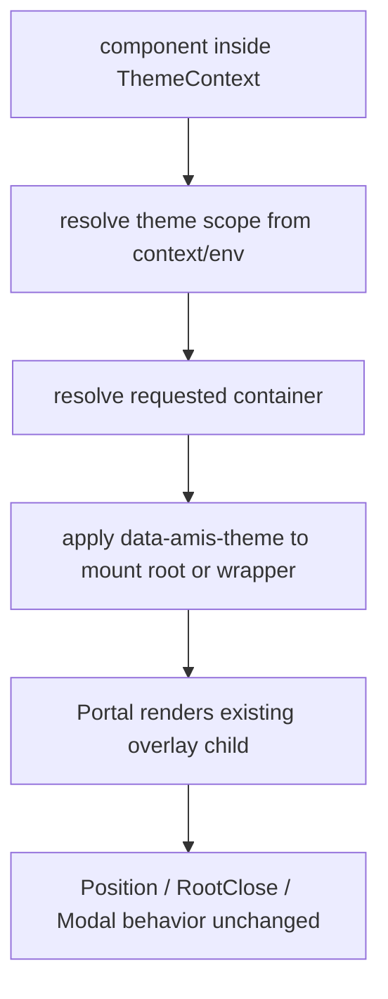

# overlay-theme-scope-propagation feature design

## 0. 术语约定

| 术语 | 定义 | 防冲突结论 |
|---|---|---|
| OverlayThemeScope | 浮层从触发 root 继承并携带 `data-amis-theme` 的统一 DOM scope 契约。 | roadmap 第 4.4 节已定义该名，本 feature 只细化执行，不另起机制。 |
| Portal mount root | `react-overlays/Portal` 最终把浮层节点挂载到的 DOM 容器或 wrapper。 | 当前 Overlay / Modal 多处直接用 `Portal container={...}`，该边界是主题作用域最容易丢失的位置。 |
| Scope applicator | 给浮层 mount root 或 wrapper 写入 `data-amis-theme` 的统一 helper。 | 不允许各组件手写属性复制逻辑，避免 Dialog、Tooltip、Select 各有一套规则。 |
| Container resolver | 将 `container`、`containerSelector`、`env.getModalContainer`、默认 body 解析为实际 DOM 容器的流程。 | 现有 Overlay 和 Modal 已有容器解析逻辑，本 feature 只在解析后补主题 scope，不改定位语义。 |
| 多 root | 同一页面存在多个 amis root，不同 root 可能有不同 `data-amis-theme`。 | 浮层必须使用触发组件所在 root 的 ThemeScope，不能回退到全局默认主题。 |

## 1. 决策与约束

### 需求摘要

本 feature 承接 ADR-001 “统一浮层主题传播”的决策，目标是让渲染到 `body`、自定义 container、modal container、editor preview 或 iframe preview 的浮层节点都能带上正确 `data-amis-theme`，从而拿到 scoped token 和 theme-scoped selector。覆盖面聚焦 Overlay、Dialog/Drawer/Modal、Tooltip/Popover、Dropdown 和 Select 下拉层。

明确不做：

- 不重写浮层定位、动画、RootClose、拖拽或关闭语义。
- 不迁移组件选择器、SCSS token 或 editor/theme-editor 生成 CSS。
- 不把 `env.getModalContainer` 废弃；它仍是业务自定义容器入口。
- 不为每个组件手写 `data-amis-theme`；必须通过统一 helper 或统一 wrapper 传播。
- 不承诺解决所有第三方库浮层；本 feature 只覆盖 amis 当前 Overlay / Modal / Tooltip / PopOver / Select 主路径。

### 复杂度档位

- 结构 = modules（偏离局部默认：scope applicator、container resolver、Overlay/Modal 接入和测试需要清晰边界）。
- 可读性 = team（默认：内部主题架构迁移，错误信息和 helper 命名需要让后续组件迁移者读懂）。
- 可演进性 = stable（偏离 active：后续新增浮层类型会依赖同一 helper）。
- 可测试性 = verified（偏离 tested：核心是多 root / body / custom container / editor preview 的 DOM invariant，必须有 targeted tests 或 fixture）。
- Compatibility = backward-compatible（偏离 current-only：现有 container API 和定位行为必须保持）。

### 关键决策

1. **scope seam 放在 Overlay / modal container 边界**
   普通 Root 子树已经由 `ThemeScopeRoot` 输出 `data-amis-theme`；portal 脱离普通 DOM 树，最小正确挂点是容器解析后的 mount root 或浮层 wrapper。

2. **统一 helper，不让组件各自复制属性**
   roadmap 已定义 `getNearestThemeScope()`、`applyThemeScope()`、`resolveOverlayContainer()` 方向。实现阶段应收敛到一个 DOM scope applicator，Dialog、Tooltip、Dropdown、Select 只通过 Overlay/Modal 主路径受益。

3. **不改变定位语义**
   `Overlay` 的 `Position` 依赖 container 计算定位；`Modal` 有 fullscreen container 处理和拖拽行为。本 feature 只能给 DOM 补 scope 或包 wrapper，不能改变容器选择、offset、scroll parent、RootClose 或 draggable 语义。

4. **多 root 以触发组件上下文为准**
   `ThemeContext` / `env.theme` 已有 root 主题名。浮层不能从 `document.body` 猜主题，也不能用 `defaultTheme` 覆盖触发 root 的主题。

5. **editor / iframe preview 作为验证边界，不做 editor 迁移**
   editor preview 和 iframe preview 需要同样的 scope 注入规则；但 `.AMISCSSWrapper`、theme-editor helper、生成 CSS 迁移仍属于 `editor-theme-helper-migration`。

### 基线风险与验证入口

- `packages/amis-core/src/components/Overlay.tsx` 是通用 portal 入口，`Portal container={container}` 目前不负责主题作用域。
- `packages/amis-ui/src/components/Modal.tsx` 直接使用 `Portal container={getContainerWithFullscreen(container)}`，需要单独接入或复用 helper。
- `TooltipWrapper`、`DropDownButton`、`Select` 等大量传 `container={env.getModalContainer}` 或 `popOverContainer`，本 feature 不应逐个改业务行为。
- `packages/amis-ui/src/components/Select.tsx` 超过 1400 行，`Dialog.tsx` / `Drawer.tsx` 也较大；实现阶段要避免在这些胖组件里散落 scope 逻辑。

### Top 3 风险

1. **多 root 主题串线**：body 下浮层如果读全局默认主题，会污染另一个 amis root。缓解：测试两个 root 不同 theme，分别触发 overlay，断言 portal 节点主题不同。
2. **改坏定位/关闭语义**：为了加 wrapper 可能影响 `Position`、RootClose、Modal 拖拽或 z-index。缓解：scope applicator 优先写现有 mount root / child wrapper 属性，不重排 DOM；targeted tests 只验证 scope，定位行为由既有测试兜底。
3. **editor preview 被误迁移**：为了覆盖 editor preview 可能顺手改 `.AMISCSSWrapper` 或 theme-editor CSS。缓解：本 feature 只让 preview 浮层容器能拿到 `data-amis-theme`，反向核对不修改 theme-editor helper。

## 2. 名词与编排

### 2.1 名词层

#### 现状

- `Root` 已通过 `ThemeScopeRoot` 在 renderer 子树外层输出 `data-amis-theme`，但 design 明确未覆盖 overlay / portal。
- `Overlay` 通过 `react-overlays/Portal` 把 `Position` 包裹后的 child 挂到 `container`、`containerSelector`、`env.getModalContainer` 或 body fallback。
- `Modal` 也直接使用 `Portal`，并通过 `getContainerWithFullscreen()` 处理 fullscreen container。
- `TooltipWrapper`、`DropDownButton`、`Select` 等组件将 `env.getModalContainer`、自定义 `popOverContainer` 或本组件 DOM 作为浮层容器传入。
- editor 侧 `ScaffoldModal` 通过 `getPopOverContainer()` 把 popover 挂到 modal body 父节点，且仍保留 `.AMISCSSWrapper` 语义。

#### 变化

新增或固化以下名词：

| 名词 | 形态 | 职责 |
|---|---|---|
| ThemeScopeCarrier | 值对象 / helper 输入 | 表达当前 themeName 与 ThemeScope，来自 ThemeContext / env.theme。 |
| getNearestThemeScope | DOM helper | 从触发节点或容器向上找到最近 `data-amis-theme`，用于 custom container 继承。 |
| applyThemeScope | DOM helper | 将 `data-amis-theme` 写入浮层 mount root / wrapper，幂等且不改其他属性。 |
| resolveOverlayContainer | helper | 在现有 container 解析结果上补 scope，不改变业务 container 决策。 |
| ScopedPortal / equivalent wrapper | React 接入点 | 在 `Overlay` / `Modal` 使用 Portal 时确保挂载节点或包裹节点带 scope。 |

接口示例：

```ts
interface ThemeScopeCarrier {
  theme: string;
  scope: ThemeScope;
}

function getNearestThemeScope(node: HTMLElement | null): ThemeScope | null;
function applyThemeScope(node: HTMLElement, scope: ThemeScope): void;
function resolveOverlayContainer(
  requested: HTMLElement | (() => HTMLElement | null) | undefined,
  fallback: () => HTMLElement,
  scope: ThemeScope
): HTMLElement;
```

Interface 设计检查：

- Module / interface：OverlayThemeScope helper 是唯一 DOM scope applicator；Overlay / Modal 只消费该 helper。
- Seam placement：seam 放在 Portal container 解析和 mount root 装饰点，因为这里是普通 DOM 树与 portal 树的边界。
- Depth / locality：后续新增浮层类型时复用 helper，不在组件内手写 `data-amis-theme`。
- Dependency category：in-process DOM；测试可用 jsdom + fake container。
- Adapter：无。
- Test surface：Dialog、Tooltip、Dropdown、Select 在默认 body container、自定义 container、多 root、editor/iframe preview 代表场景下能拿到正确 `data-amis-theme`。

### 2.2 编排层

#### 现状

当前主流程是：

1. Root 子树有 `ThemeContext` 和 `ThemeScopeRoot`。
2. 组件触发 Tooltip / PopOver / Select / Dialog 等浮层。
3. 组件把 `container` / `popOverContainer` / `env.getModalContainer` 传给 Overlay 或 Modal。
4. Overlay / Modal 通过 Portal 挂到目标容器，portal 节点不保证携带 `data-amis-theme`。

#### 变化

主流程保持原有 container 和定位决策，只在 portal 边界补 scope：



流程级约束：

- `applyThemeScope()` 必须幂等；同一 container 重复打开/关闭浮层不能堆叠无关 class 或 wrapper。
- custom container 已带 `data-amis-theme` 时优先保留其 scope；未带时使用触发 root 的 ThemeScope 装饰。
- body container 下必须能拿到触发 root 的 theme scope；不能从 body 猜主题。
- iframe preview 下使用对应 document 的 body/container，不跨 document 写属性。
- Overlay / Modal 不改变现有 `containerSelector`、`getModalContainer`、fullscreen container、RootClose 和 Position 行为。

### 2.3 挂载点清单

- OverlayThemeScope helper：删掉后 portal 边界无统一主题作用域传播。
- Overlay Portal 接入点：删掉后 Tooltip/Popover/Dropdown/Select 等 Overlay 主路径无法自动带 scope。
- Modal Portal 接入点：删掉后 Dialog/Drawer/Modal 默认挂 body 时仍可能丢主题。
- Targeted tests / fixtures：删掉后多 root、body、自定义 container、editor/iframe preview 无法自动回归。
- CodeStable feature artifact：删掉后后续 component migration 无法知道 overlay scope 已经怎样保证。

### 2.4 推进策略

1. **基线预检**：记录 Overlay/Modal 当前 container 解析和高风险调用点。
   退出信号：列出默认 body、自定义 container、env.getModalContainer、containerSelector 的现状证据。
2. **Scope helper**：实现 ThemeScope DOM helper 和幂等 apply 规则。
   退出信号：单测覆盖从 context/env 得到 scope、写入/保留 container scope、跨 document 不串线。
3. **Overlay 接入**：在 Overlay portal 边界应用 scope。
   退出信号：Tooltip/Popover/Dropdown/Select 代表路径在 body/custom container 下可观察 `data-amis-theme`。
4. **Modal 接入**：在 Modal/Dialog/Drawer 主 portal 边界应用 scope。
   退出信号：Dialog/Drawer 默认 container 和自定义 container 下可观察正确 `data-amis-theme`，拖拽/closeOnOutside 不被破坏。
5. **多 root 与 preview 验证**：覆盖两个 amis root 不同 theme、editor preview、iframe preview 代表场景。
   退出信号：每个场景都有 DOM 断言或手工证据路径。
6. **范围收口**：记录未迁移的 editor/theme-editor CSS、第三方库浮层和组件选择器迁移边界。
   退出信号：diff 未触碰无关迁移，QA/acceptance 能反向核对范围。

### 2.5 结构健康度与微重构

##### 评估

- 文件级 — `packages/amis-core/src/components/Overlay.tsx`：约 381 行，是合适的 portal scope seam；本 feature 可做小范围接入。
- 文件级 — `packages/amis-ui/src/components/Modal.tsx`：约 481 行，直接使用 Portal 和 fullscreen container；需要接入但不应重写拖拽/动画。
- 文件级 — `packages/amis-ui/src/components/Select.tsx`：约 1427 行，过胖；本 feature 不应在 Select 内散落 scope 逻辑。
- 文件级 — `packages/amis/src/renderers/Dialog.tsx` / `Drawer.tsx`：均较大且包含业务渲染逻辑；应通过 Modal / env container 主路径受益，避免局部补丁。
- 目录级 — `packages/amis-core/src/components` 已有 Overlay/PopOver 等基础组件；新增 helper 如属于 core DOM scope，优先放 core 侧而不是 amis-ui 侧。
- compound / roadmap 命中：ADR-001 和 roadmap 都明确浮层是高风险边界，要求统一 helper；无相反约束。

##### 结论：微重构（新增统一 helper）

##### 方案

- 搬什么：不搬迁现有 Overlay / Modal 逻辑；新增 OverlayThemeScope helper，并在 Overlay/Modal portal 边界调用。
- 搬到哪：优先落在 `packages/amis-core/src` 的 theme/DOM scope 相邻位置，具体文件名由实现阶段按现有导出习惯确定。
- 行为不变怎么验证：现有 Overlay/Modal tests 或 targeted tests 通过；新增断言只关注 `data-amis-theme`，定位/关闭/拖拽路径不变。
- 步骤序列：
  1. 新增 helper 和单元测试。
  2. Overlay 接入 helper。
  3. Modal 接入 helper。
  4. 增加多 root / preview 代表验证。

##### 超出范围的观察

- Select / Dialog / Drawer 文件较胖，后续组件迁移可能需要专项重构；本 feature 不做。
- editor/theme-editor preview 的完整 CSS 生成迁移留给 `editor-theme-helper-migration`。

## 3. 验收契约

### 3.1 关键场景清单

- 输入：Root theme 为 `cxd`，Tooltip 渲染到默认 body container → 期望 portal 节点或 wrapper 可观察 `data-amis-theme="cxd"`。
- 输入：两个 amis root 分别为 `cxd` 和 `dark`，各自打开 Tooltip/Dropdown → 期望两个 portal 节点主题不串线。
- 输入：Dropdown/Select 使用自定义 `popOverContainer` → 期望 container 或浮层 wrapper 携带触发 root 的 theme scope。
- 输入：Dialog/Drawer/Modal 使用 `env.getModalContainer` 或默认 body → 期望 modal root 带正确 `data-amis-theme`。
- 输入：editor preview / iframe preview 的容器属于独立 document → 期望 scope 写在对应 document 的容器/浮层，不跨 document。
- 反向核对：不修改组件 SCSS、不迁移 editor/theme-editor helper、不改变 Overlay positioning / Modal dragging / RootClose 行为。

### 3.2 Acceptance Coverage Matrix

| Scenario | Covered By Step | Evidence Type | Command / Action | Core? |
|---|---|---|---|---|
| Tooltip body container 带 scope | S3 | test / DOM assertion | `npm test --workspace amis -- Tooltip` 或新增 targeted test | yes |
| Dropdown / PopOver custom container 带 scope | S3 | test / DOM assertion | `npm test --workspace amis -- DropDownButton` 或新增 targeted test | yes |
| Select 下拉层带 scope | S3 | test / DOM assertion | `npm test --workspace amis -- Select` 或新增 targeted test | yes |
| Dialog / Drawer / Modal 带 scope | S4 | test / DOM assertion | `npm test --workspace amis -- Dialog` 或新增 targeted test | yes |
| 多 root 不串主题 | S5 | test | 两个 root 不同 theme 的 jsdom case | yes |
| editor / iframe preview 边界 | S5 / S6 | manual / fixture | editor preview representative fixture | no |
| 不改定位/动画/拖拽/RootClose | S6 | diff review / existing tests | `git diff -- packages/amis-core/src/components/Overlay.tsx packages/amis-ui/src/components/Modal.tsx` | yes |

### 3.3 DoD Contract

| ID | 要求 | 证据 | 阻塞级别 |
|---|---|---|---|
| DOD-DESIGN-001 | design 与 checklist 覆盖 helper、Overlay、Modal、多 root、preview 和范围边界 | design review | blocking |
| DOD-IMPL-001 | checklist steps 全部完成且关键 DOM invariant 有证据 | checklist / implementation report | blocking |
| DOD-REVIEW-001 | code review passed 且无 unresolved blocking | review report | blocking |
| DOD-QA-001 | QA 覆盖 body/custom container、多 root、Dialog/Tooltip/Dropdown/Select | QA report | blocking |
| DOD-ACCEPT-001 | acceptance 回写 roadmap 状态并记录未覆盖第三方/editor CSS 边界 | acceptance report | blocking |

Validation Commands:

| ID | 命令 | 目的 | 核心性 | 失败处理 |
|---|---|---|---|---|
| CMD-001 | `npm test --workspace amis-core -- theme` | 校验 ThemeScope helper 基础不变量 | core | fix-or-block |
| CMD-002 | `npm test --workspace amis -- Dialog` | 记录 Dialog full suite 中旧 snapshot baseline risk | supporting | document-baseline |
| CMD-003 | `npm test --workspace amis -- Tooltip` | 记录 Tooltip full suite 中旧 `.cxd-*` selector baseline risk | supporting | document-baseline |
| CMD-004 | `npm test --workspace amis -- Select` | 记录 Select full suite 中旧 `.cxd-*` selector / `classPrefix` baseline risk | supporting | document-baseline |
| CMD-005 | `npm run stylelint` | 确认未引入 SCSS 规则问题 | supporting | fix-or-block |
| CMD-006 | `rg -n "data-amis-theme|getNearestThemeScope|applyThemeScope|resolveOverlayContainer" packages/amis-core packages/amis-ui packages/amis` | 核对 scope 新增命中集中在允许路径 | core | document-baseline |
| CMD-007 | `python3 /Users/songmingxu/.agents/skills/cs-onboard/tools/validate-yaml.py --file .codestable/features/2026-07-25-overlay-theme-scope-propagation/overlay-theme-scope-propagation-checklist.yaml --yaml-only` | 校验 checklist YAML | core | fix-or-block |
| CMD-008 | `npm test --workspace amis-core -- Overlay` | 校验 Overlay body/custom/multi-root/iframe scope 传播和 descendant selector 命中 | core | fix-or-block |
| CMD-009 | `npm test --workspace amis -- renderers/Dialog.test.tsx` | 校验 Dialog body/custom/null container scope 传播 | core | fix-or-block |
| CMD-010 | `npm test --workspace amis -- DrawerThemeScope` | 校验 Drawer body/custom/null container scope 传播 | core | fix-or-block |
| CMD-011 | `npm test --workspace amis -- OverlayThemeScope` | 校验真实 amisRender 多 root + shared env + body portal scope 来源 | core | fix-or-block |

CMD-002 / CMD-003 / CMD-004 的执行期降级由 `approval-report.md#overlay-dod-baseline-narrowing` 批准；本 feature 的阻塞验证以 targeted overlay scope tests、stylelint、YAML、scope-gate、dod-runner 和 evidence pack 为准，full suite 失败交给后续 `core-component-selector-migration` 清理。

Required Artifacts: design、checklist、design-review、implementation report、code review、QA、acceptance、DOM invariant 证据、命令输出摘要。

## 4. 与项目级架构文档的关系

- 本 feature 是 ADR-001 Overlay Scope 的执行层细化，不新增替代 ADR。
- 若实现阶段确认 helper API 名称稳定，可在 acceptance 后把 OverlayThemeScope helper 作为 architecture/compound 可复用约定沉淀。
- 不更新 `requirements/CONTEXT.md`；主题作用域术语已存在，OverlayThemeScope 属于 roadmap 内部执行术语。
