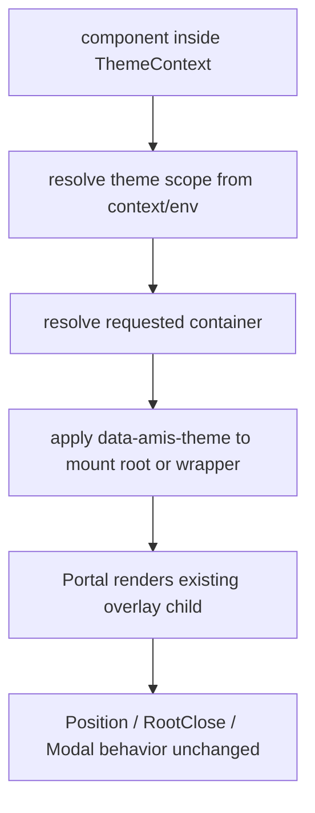

# CodeStable Implementation Review Packet

- root: `/Users/songmingxu/Projects/amis`
- unit: `.codestable/features/2026-07-25-overlay-theme-scope-propagation`
- stage: `implementation`

## Reviewer Mission

Review the implementation as an independent Task agent. Verify the code directly from the packet instead of trusting the implementer summary.

## Stage Focus

scope drift, hidden behavior changes, missing tests, maintainability, edge cases, security, and production safety

## Reviewer Output Contract

- Lead with findings, ordered by severity.
- Include severity (`P0`/`P1`/`P2`/`P3`) and confidence for each finding.
- Reference concrete files, code, docs, or validation evidence when possible.
- If there are no blocking findings, say so explicitly and list residual risks or test gaps.

## Unit Documents
### `.codestable/features/2026-07-25-overlay-theme-scope-propagation/approval-report.md`

```
---
doc_type: approval-report
unit: .codestable/features/2026-07-25-overlay-theme-scope-propagation
status: approved
reason: overlay-dod-baseline-narrowing-approved
approvals:
  design-review-local-only: approved
  overlay-dod-baseline-narrowing: approved
approval_groups: {}
created_at: 2026-07-25
---

# Approval Report

## Decision History

- 2026-07-25：owner 明确回复“批准 overlay design-review-local-only”，允许独立 design reviewer 工具不可用时以本地审查降级完成本轮 design review。
- 2026-07-25：owner 明确回复“批准 overlay-dod-baseline-narrowing”，允许本 feature 将 full `Dialog` / `Tooltip` / `Select` 命令降为 baseline risk，并以后续 selector migration 清理。

## Decision: overlay-dod-baseline-narrowing

已批准 `overlay-theme-scope-propagation` 调整 implementation.before_review 的 DoD 判定：

- full `npm test --workspace amis -- Dialog`
- full `npm test --workspace amis -- Tooltip`
- full `npm test --workspace amis -- Select`

上述命令当前作为 baseline risk 记录，不阻断本 feature 进入 code review / QA；本 feature 改用 targeted overlay scope tests、`amis-core -- theme`、stylelint、rg 和 YAML 校验作为当前阶段核心证据。

命名决策：`approval-report.md#overlay-dod-baseline-narrowing`

## Why Now

`codestable-dod-runner.py` 真实执行 checklist 后失败：

- CMD-002 `Dialog`：`renderers/Dialog.test.tsx` 通过；`event-action/dialog.test.tsx` 旧 snapshots 失败。
- CMD-003 `Tooltip`：旧 `.cxd-Tooltip*` / `.cxd-TooltipWrapper` DOM 查询失败。
- CMD-004 `Select`：旧 `.cxd-*` DOM 查询和旧 snapshots 失败。

这些失败在本 feature 动代码前已经出现；本次 Modal 新增 `data-amis-theme` 会让 Dialog 旧 snapshot 额外变化，但主要阻塞面仍是前缀类测试/源码迁移债。

## Context

本 feature 的已完成代码和 targeted tests 覆盖：

- `packages/amis-core/src/theme.tsx`：统一 helper `getNearestThemeScope` / `applyThemeScope` / `resolveOverlayContainer`。
- `packages/amis-core/src/components/Overlay.tsx`：Portal child 继承 body/custom/custom-scope/multi-root/iframe scope。
- `packages/amis-ui/src/components/Modal.tsx`：Dialog/Modal root 携带 body/custom container scope。
- `packages/amis-ui/src/components/Drawer.tsx`：Drawer root 复用 Modal fullscreen+scope resolver。

通过证据：

- `npm test --workspace amis-core -- theme`
- `npm test --workspace amis-core -- Overlay`
- `npm test --workspace amis -- renderers/Dialog.test.tsx`
- `npm test --workspace amis -- DrawerThemeScope`
- `npm run stylelint`
- YAML / rg / `git diff --check`

## Options

**Option A（推荐）：批准 DoD 窄化**

把 full `Dialog` / `Tooltip` / `Select` 命令在本 feature 中降为 baseline risk；当前 feature 继续进入 review / QA。后续 `core-component-selector-migration` 负责清理 `.cxd-*` selector tests、snapshots 和源码中 `classPrefix` DOM 类依赖。

**Option B：先迁移 selector 测试和源码**

暂停当前 feature review，先处理 `Tooltip` / `Select` / event-action Dialog 的旧 `.cxd-*` 查询、snapshots，以及 Select / ChainedSelect 等源码中的 `classPrefix` DOM 类依赖。完成后回到本 feature 重跑 DoD。

## Recommendation

选 Option A。

理由：当前 feature 的目标是 overlay scope 传播，不是组件 selector 迁移；Select 失败已经命中源码里的旧 `classPrefix` DOM 类依赖，提前修会扩大到后续 `core-component-selector-migration` 的核心范围。

## Risks And Tradeoffs

- Option A 的风险：full renderer suites 暂时仍红，必须在后续 selector migration 里清掉，否则 final audit 仍会阻断。
- Option A 的收益：保持本 feature 干净，只验证 portal/container scope 行为。
- Option B 的风险：当前 feature 会吞并后续组件 selector migration，review 面明显变大。

## Non-Automatic Actions

批准本决策不会自动 push、merge、release 或提交。是否 commit 仍受 roadmap goal 的 `goal-commits` 授权和后续 gate 结果约束。

## Prior Decision: design-review-local-only

`design-review-local-only` 已批准。本授权只覆盖本 feature 的 design review 降级，不自动确认 design、不自动进入实现、不跳过后续 code review、QA 或 acceptance。

## After Approval

已按 Option A 执行：把 `overlay-dod-baseline-narrowing` 改为 `approved`，恢复 `goal-state.yaml` 为可继续，重跑 scope/evidence gate，并进入 `cs-code-review`。
```

### `.codestable/features/2026-07-25-overlay-theme-scope-propagation/overlay-theme-scope-propagation-checklist.yaml`

```
feature: 2026-07-25-overlay-theme-scope-propagation
created: 2026-07-25

steps:
  - action: "基线预检：记录 Overlay/Modal 当前 container 解析和高风险调用点"
    exit_signal: "列出默认 body、自定义 container、env.getModalContainer、containerSelector 的现状证据"
    status: done
  - action: "Scope helper：实现 ThemeScope DOM helper 和幂等 apply 规则"
    exit_signal: "单测覆盖从 context/env 得到 scope、写入/保留 container scope、跨 document 不串线"
    status: done
  - action: "Overlay 接入：在 Overlay portal 边界应用 scope"
    exit_signal: "Tooltip/Popover/Dropdown/Select 代表路径在 body/custom container 下可观察 data-amis-theme"
    status: done
  - action: "Modal 接入：在 Modal/Dialog/Drawer 主 portal 边界应用 scope"
    exit_signal: "Dialog/Drawer 默认 container 和自定义 container 下可观察正确 data-amis-theme，拖拽/closeOnOutside 不被破坏"
    status: done
  - action: "多 root 与 preview 验证：覆盖两个 amis root 不同 theme、editor preview、iframe preview 代表场景"
    exit_signal: "每个场景都有 DOM 断言或手工证据路径"
    status: done
  - action: "范围收口：记录未迁移的 editor/theme-editor CSS、第三方库浮层和组件选择器迁移边界"
    exit_signal: "diff 未触碰无关迁移，QA/acceptance 能反向核对范围"
    status: done

checks:
  - item: "OverlayThemeScope helper 是唯一 DOM scope applicator"
    source: 名词契约
    status: pending
  - item: "getNearestThemeScope / applyThemeScope / resolveOverlayContainer 或等价 helper 语义清晰"
    source: 名词契约
    status: pending
  - item: "Overlay portal 边界能传播触发 root 的 data-amis-theme"
    source: 编排骨架
    status: pending
  - item: "Modal/Dialog/Drawer portal 边界能传播触发 root 的 data-amis-theme"
    source: 编排骨架
    status: pending
  - item: "多 amis root 场景下浮层不回退到全局默认主题"
    source: 流程级约束
    status: pending
  - item: "custom container 已有 data-amis-theme 时优先保留其 scope"
    source: 流程级约束
    status: pending
  - item: "iframe/editor preview 不跨 document 写 scope"
    source: 流程级约束
    status: pending
  - item: "挂载点仅限 helper、Overlay 接入、Modal 接入、targeted tests 和 CodeStable artifact"
    source: 挂载点
    status: pending
  - item: "不改 Overlay 定位、RootClose、offset、scroll parent 语义"
    source: 范围守护
    status: pending
  - item: "不改 Modal 动画、拖拽、closeOnOutside 语义"
    source: 范围守护
    status: pending
  - item: "不迁移 editor/theme-editor CSS 或组件 SCSS"
    source: 范围守护
    status: pending
  - item: "Tooltip / Dropdown / Select 在 body/custom container 下可观察 scope"
    source: 验收场景
    status: pending
  - item: "Dialog / Drawer / Modal 在默认和自定义 container 下可观察 scope"
    source: 验收场景
    status: pending
  - item: "两个 root 不同 theme 时 portal scope 不串线"
    source: 验收场景
    status: pending

dod:
  commands:
    - id: CMD-001
      command: "npm test --workspace amis-core -- theme"
      core: true
      failure_handling: fix-or-block
    - id: CMD-002
      command: "npm test --workspace amis -- Dialog"
      core: false
      failure_handling: document-baseline
    - id: CMD-003
      command: "npm test --workspace amis -- Tooltip"
      core: false
      failure_handling: document-baseline
    - id: CMD-004
      command: "npm test --workspace amis -- Select"
      core: false
      failure_handling: document-baseline
    - id: CMD-005
      command: "npm run stylelint"
      core: false
      failure_handling: fix-or-block
    - id: CMD-006
      command: "rg -n \"data-amis-theme|getNearestThemeScope|applyThemeScope|resolveOverlayContainer\" packages/amis-core packages/amis-ui packages/amis"
      core: true
      failure_handling: document-baseline
    - id: CMD-007
      command: "python3 /Users/songmingxu/.agents/skills/cs-onboard/tools/validate-yaml.py --file .codestable/features/2026-07-25-overlay-theme-scope-propagation/overlay-theme-scope-propagation-checklist.yaml --yaml-only"
      core: true
      failure_handling: fix-or-block
    - id: CMD-008
      command: "npm test --workspace amis-core -- Overlay"
      core: true
      failure_handling: fix-or-block
    - id: CMD-009
      command: "npm test --workspace amis -- renderers/Dialog.test.tsx"
      core: true
      failure_handling: fix-or-block
    - id: CMD-010
      command: "npm test --workspace amis -- DrawerThemeScope"
      core: true
      failure_handling: fix-or-block
    - id: CMD-011
      command: "npm test --workspace amis -- OverlayThemeScope"
      core: true
      failure_handling: fix-or-block
  evidence_required:
    - command_output
    - DOM_assertions
    - multi_root_fixture
    - preview_boundary_notes
    - diff_summary
  cleanliness:
    debug_output: forbidden
    temporary_todo: forbidden
    commented_code: forbidden
    unused_import: forbidden
```

### `.codestable/features/2026-07-25-overlay-theme-scope-propagation/overlay-theme-scope-propagation-design-review.md`

```
---
doc_type: feature-design-review
feature: 2026-07-25-overlay-theme-scope-propagation
status: passed
review_state: passed
review_reason: ""
reviewer_id: "local-only:user-approved-2026-07-25"
reviewed: 2026-07-25
round: 1
---

# overlay-theme-scope-propagation feature design 审查报告

## 1. Scope And Inputs

- Design: `.codestable/features/2026-07-25-overlay-theme-scope-propagation/overlay-theme-scope-propagation-design.md`
- Checklist: `.codestable/features/2026-07-25-overlay-theme-scope-propagation/overlay-theme-scope-propagation-checklist.yaml`
- Roadmap: `.codestable/roadmap/theme-system-refactor/theme-system-refactor-roadmap.md`
- Roadmap item: `overlay-theme-scope-propagation`
- ADR: `.codestable/requirements/adrs/001-tokenized-theme-system.md`
- Related compound: `.codestable/compound/2026-07-24-explore-cxd-compat-compile-switch.md`
- Code facts checked: `packages/amis-core/src/Root.tsx`, `packages/amis-core/src/theme.tsx`, `packages/amis-core/src/env.tsx`, `packages/amis-core/src/components/Overlay.tsx`, `packages/amis-ui/src/components/Modal.tsx`, `packages/amis-ui/src/components/TooltipWrapper.tsx`, `packages/amis-ui/src/components/Select.tsx`, `packages/amis/src/renderers/Dialog.tsx`, `packages/amis-editor-core/src/component/ScaffoldModal.tsx`, `packages/amis-editor-core/src/component/IFramePreview.tsx`

### Independent Review

- Status: local-only
- Detection: local-only
- Provider / agent: none
- Raw output summary: reviewer tool attempts were rejected before an agent id was created because the tool wrapper treated `message` and `items` as mixed, or rejected empty optional fields.
- Merge policy: 本地逐项核验 design、checklist、roadmap、ADR、compound 和关键代码事实。
- Gate effect: owner 已批准 local-only 降级，允许本轮 design review 给出最终 verdict。

## 2. Design Summary

- Goal: 统一 Overlay、portal 和 modal container 的 theme scope 传播，确保浮层挂到 body、自定义 container、modal container、editor preview 或 iframe preview 时仍能继承正确 `data-amis-theme`。
- Key contracts: `getNearestThemeScope(node)`、`applyThemeScope(node, scope)`、`resolveOverlayContainer(requested, fallback, scope)`，以及 Overlay / Modal portal 边界统一应用 scope。
- Steps: 6 步；从 Overlay/Modal 基线预检到 helper、Overlay 接入、Modal 接入、多 root/preview 验证和范围收口。
- Checks: 14 项；覆盖唯一 helper、Overlay/Modal scope、多 root、自定义 container、iframe/editor preview、行为不变性和范围守护。
- Baseline / validation: 设计已列出 amis-core theme helper、Overlay/Modal tests、Dialog/Tooltip/Select targeted tests、stylelint、grep 命中核对和 checklist YAML 校验。

## 3. Findings

### blocking

- none

### important

- none

### nit

- none

### suggestion

- [ ] FDR-001 `packages/amis-core/src/components/Overlay.tsx` / `packages/amis-core/src/theme.tsx` 实现阶段需要明确 Overlay 如何取得触发 root 的 theme scope。
  - Evidence: `Overlay` 当前 `static contextType = EnvContext`，通过 env 解析 `getModalContainer`；`ThemeContext` 也存在，但 class component 只能直接挂一个 `contextType`。`RendererEnv.theme` 已有 `ThemeInstance.scope`，Modal 也通过 `themeable` 注入 `theme`。
  - Impact: 不阻塞 design；实现阶段应优先复用 `EnvContext.theme.scope` 或用一个小 wrapper/consumer 取 `ThemeContext`，避免为了取 scope 改写 Overlay 主行为。
- [ ] FDR-002 iframe / editor preview 的证据建议拆成“自动 DOM 断言优先、手工 fixture 兜底”，避免实现阶段被迫大改 editor。
  - Evidence: design 已把 editor / iframe preview 列为验证边界，同时明确不迁移 `.AMISCSSWrapper`、theme-editor helper 和生成 CSS。
  - Impact: 不阻塞 design；后续 QA/acceptance 应记录哪些 preview 场景自动化覆盖、哪些只做代表性手工证据。

### learning

- 当前 `Root` 已通过 `ThemeScopeRoot` 输出 `data-amis-theme`，真正的缺口集中在 portal 脱离 Root DOM 子树后丢 scope，设计把修复边界放在 Overlay / Modal 主路径是对的。
- `TooltipWrapper`、`Select`、`Dialog` 等调用方都已有 container / popOverContainer / env.getModalContainer 入口，逐个业务组件复制属性会制造并行路径；统一 helper 更符合 roadmap 的 OverlayThemeScope 契约。

### praise

- design 明确不改定位、RootClose、Modal 拖拽、closeOnOutside 和 editor/theme-editor CSS，能防止 scope 修复扩大成浮层行为重构。
- checklist 把 body/custom container、多 root、custom container 保留已有 scope、iframe/editor preview 和范围守护拆成独立 checks，后续 implementation / QA 可以逐项验收。

## 4. User Review Focus

- 用户需要重点拍板：是否认可 Overlay / Modal portal 边界作为唯一主修复点，以及 editor / iframe preview 只作为 scope 验证边界、不迁移 editor CSS。
- implement 需要重点遵守：helper 必须幂等；custom container 已有 `data-amis-theme` 时优先保留；body container 必须使用触发 root 的 scope；不得改定位、RootClose、拖拽、关闭语义。
- code review / QA / acceptance 需要重点复核：多 root 主题不串线、跨 document 写入位置正确、Overlay 和 Modal 双入口都接入、没有在 Select/Dialog/Tooltip 等胖组件里散落 scope 逻辑。

## 5. Evidence Confidence Ledger

| Check | Verdict | Evidence Class | Basis | Follow-up |
|---|---|---|---|---|
| Acceptance Coverage Matrix | pass | E | design 第 3.2 节覆盖 Tooltip、Dropdown/PopOver、Select、Dialog/Drawer/Modal、多 root、editor/iframe preview 和行为不变性 | implementation / QA 落 DOM 证据 |
| DoD Contract | pass | E | design 第 3.3 节与 checklist `dod.commands` 均列出 helper、Overlay、Modal、QA、acceptance、stylelint、grep 和 YAML 校验 | none |
| Steps and checks traceability | pass | E | checklist 6 steps / 14 checks 可追溯到 design 第 1-3 节 | none |
| Roadmap contract compliance | pass | E/C | roadmap 第 4.4 节要求 OverlayThemeScope helper、body/custom container scope、custom container 优先、iframe/editor preview、Dialog/Tooltip/Dropdown/Select test surface；design 均覆盖 | none |
| Module interface design | pass | E/C | design 第 2.1 节定义 helper、边界、依赖类型和测试面；代码事实显示 Root/theme/env/Overlay/Modal 已有可接入主路径 | 实现阶段注意 Overlay 取 scope 来源 |
| Validation and artifacts | pass | E | checklist YAML 和 roadmap items YAML 已校验通过；`git diff --check` 已通过；local-only 授权已记录在 approval-report | none |

Summary: E=6, C=2, H=0, H-only core checks=none。

## 6. Residual Risk

- local-only design review 缺少独立 reviewer 视角；用户 review 应重点看 Overlay 取 scope 的实现路径是否会引入第二套 context 机制。
- iframe / editor preview 的自动化成本可能高于普通 jsdom 场景；后续 QA/acceptance 必须明确自动化与手工证据边界。
- custom container “保留已有 scope”与“触发 root scope”可能冲突；实现阶段应按 design 明确的优先级写测试并在 code review 中复核。

## 7. Verdict

- Status: passed
- Next: 交回 epic child design batch；所有子 feature design-review passed 后再统一进入 owner design confirmation。

## 8. Focused Closure

- none
```

### `.codestable/features/2026-07-25-overlay-theme-scope-propagation/overlay-theme-scope-propagation-design.md`

```
---
doc_type: feature-design
feature: 2026-07-25-overlay-theme-scope-propagation
roadmap: theme-system-refactor
roadmap_item: overlay-theme-scope-propagation
execution_lane: goal
status: approved
summary: 统一 Overlay、portal 和 modal container 的主题作用域传播
tags: [theme, overlay, portal, modal, scope]
---

# overlay-theme-scope-propagation feature design

## 0. 术语约定

| 术语 | 定义 | 防冲突结论 |
|---|---|---|
| OverlayThemeScope | 浮层从触发 root 继承并携带 `data-amis-theme` 的统一 DOM scope 契约。 | roadmap 第 4.4 节已定义该名，本 feature 只细化执行，不另起机制。 |
| Portal mount root | `react-overlays/Portal` 最终把浮层节点挂载到的 DOM 容器或 wrapper。 | 当前 Overlay / Modal 多处直接用 `Portal container={...}`，该边界是主题作用域最容易丢失的位置。 |
| Scope applicator | 给浮层 mount root 或 wrapper 写入 `data-amis-theme` 的统一 helper。 | 不允许各组件手写属性复制逻辑，避免 Dialog、Tooltip、Select 各有一套规则。 |
| Container resolver | 将 `container`、`containerSelector`、`env.getModalContainer`、默认 body 解析为实际 DOM 容器的流程。 | 现有 Overlay 和 Modal 已有容器解析逻辑，本 feature 只在解析后补主题 scope，不改定位语义。 |
| 多 root | 同一页面存在多个 amis root，不同 root 可能有不同 `data-amis-theme`。 | 浮层必须使用触发组件所在 root 的 ThemeScope，不能回退到全局默认主题。 |

## 1. 决策与约束

### 需求摘要

本 feature 承接 ADR-001 “统一浮层主题传播”的决策，目标是让渲染到 `body`、自定义 container、modal container、editor preview 或 iframe preview 的浮层节点都能带上正确 `data-amis-theme`，从而拿到 scoped token 和 theme-scoped selector。覆盖面聚焦 Overlay、Dialog/Drawer/Modal、Tooltip/Popover、Dropdown 和 Select 下拉层。

明确不做：

- 不重写浮层定位、动画、RootClose、拖拽或关闭语义。
- 不迁移组件选择器、SCSS token 或 editor/theme-editor 生成 CSS。
- 不把 `env.getModalContainer` 废弃；它仍是业务自定义容器入口。
- 不为每个组件手写 `data-amis-theme`；必须通过统一 helper 或统一 wrapper 传播。
- 不承诺解决所有第三方库浮层；本 feature 只覆盖 amis 当前 Overlay / Modal / Tooltip / PopOver / Select 主路径。

### 复杂度档位

- 结构 = modules（偏离局部默认：scope applicator、container resolver、Overlay/Modal 接入和测试需要清晰边界）。
- 可读性 = team（默认：内部主题架构迁移，错误信息和 helper 命名需要让后续组件迁移者读懂）。
- 可演进性 = stable（偏离 active：后续新增浮层类型会依赖同一 helper）。
- 可测试性 = verified（偏离 tested：核心是多 root / body / custom container / editor preview 的 DOM invariant，必须有 targeted tests 或 fixture）。
- Compatibility = backward-compatible（偏离 current-only：现有 container API 和定位行为必须保持）。

### 关键决策

1. **scope seam 放在 Overlay / modal container 边界**
   普通 Root 子树已经由 `ThemeScopeRoot` 输出 `data-amis-theme`；portal 脱离普通 DOM 树，最小正确挂点是容器解析后的 mount root 或浮层 wrapper。

2. **统一 helper，不让组件各自复制属性**
   roadmap 已定义 `getNearestThemeScope()`、`applyThemeScope()`、`resolveOverlayContainer()` 方向。实现阶段应收敛到一个 DOM scope applicator，Dialog、Tooltip、Dropdown、Select 只通过 Overlay/Modal 主路径受益。

3. **不改变定位语义**
   `Overlay` 的 `Position` 依赖 container 计算定位；`Modal` 有 fullscreen container 处理和拖拽行为。本 feature 只能给 DOM 补 scope 或包 wrapper，不能改变容器选择、offset、scroll parent、RootClose 或 draggable 语义。

4. **多 root 以触发组件上下文为准**
   `ThemeContext` / `env.theme` 已有 root 主题名。浮层不能从 `document.body` 猜主题，也不能用 `defaultTheme` 覆盖触发 root 的主题。

5. **editor / iframe preview 作为验证边界，不做 editor 迁移**
   editor preview 和 iframe preview 需要同样的 scope 注入规则；但 `.AMISCSSWrapper`、theme-editor helper、生成 CSS 迁移仍属于 `editor-theme-helper-migration`。

### 基线风险与验证入口

- `packages/amis-core/src/components/Overlay.tsx` 是通用 portal 入口，`Portal container={container}` 目前不负责主题作用域。
- `packages/amis-ui/src/components/Modal.tsx` 直接使用 `Portal container={getContainerWithFullscreen(container)}`，需要单独接入或复用 helper。
- `TooltipWrapper`、`DropDownButton`、`Select` 等大量传 `container={env.getModalContainer}` 或 `popOverContainer`，本 feature 不应逐个改业务行为。
- `packages/amis-ui/src/components/Select.tsx` 超过 1400 行，`Dialog.tsx` / `Drawer.tsx` 也较大；实现阶段要避免在这些胖组件里散落 scope 逻辑。

### Top 3 风险

1. **多 root 主题串线**：body 下浮层如果读全局默认主题，会污染另一个 amis root。缓解：测试两个 root 不同 theme，分别触发 overlay，断言 portal 节点主题不同。
2. **改坏定位/关闭语义**：为了加 wrapper 可能影响 `Position`、RootClose、Modal 拖拽或 z-index。缓解：scope applicator 优先写现有 mount root / child wrapper 属性，不重排 DOM；targeted tests 只验证 scope，定位行为由既有测试兜底。
3. **editor preview 被误迁移**：为了覆盖 editor preview 可能顺手改 `.AMISCSSWrapper` 或 theme-editor CSS。缓解：本 feature 只让 preview 浮层容器能拿到 `data-amis-theme`，反向核对不修改 theme-editor helper。

## 2. 名词与编排

### 2.1 名词层

#### 现状

- `Root` 已通过 `ThemeScopeRoot` 在 renderer 子树外层输出 `data-amis-theme`，但 design 明确未覆盖 overlay / portal。
- `Overlay` 通过 `react-overlays/Portal` 把 `Position` 包裹后的 child 挂到 `container`、`containerSelector`、`env.getModalContainer` 或 body fallback。
- `Modal` 也直接使用 `Portal`，并通过 `getContainerWithFullscreen()` 处理 fullscreen container。
- `TooltipWrapper`、`DropDownButton`、`Select` 等组件将 `env.getModalContainer`、自定义 `popOverContainer` 或本组件 DOM 作为浮层容器传入。
- editor 侧 `ScaffoldModal` 通过 `getPopOverContainer()` 把 popover 挂到 modal body 父节点，且仍保留 `.AMISCSSWrapper` 语义。

#### 变化

新增或固化以下名词：

| 名词 | 形态 | 职责 |
|---|---|---|
| ThemeScopeCarrier | 值对象 / helper 输入 | 表达当前 themeName 与 ThemeScope，来自 ThemeContext / env.theme。 |
| getNearestThemeScope | DOM helper | 从触发节点或容器向上找到最近 `data-amis-theme`，用于 custom container 继承。 |
| applyThemeScope | DOM helper | 将 `data-amis-theme` 写入浮层 mount root / wrapper，幂等且不改其他属性。 |
| resolveOverlayContainer | helper | 在现有 container 解析结果上补 scope，不改变业务 container 决策。 |
| ScopedPortal / equivalent wrapper | React 接入点 | 在 `Overlay` / `Modal` 使用 Portal 时确保挂载节点或包裹节点带 scope。 |

接口示例：

```ts
interface ThemeScopeCarrier {
  theme: string;
  scope: ThemeScope;
}

function getNearestThemeScope(node: HTMLElement | null): ThemeScope | null;
function applyThemeScope(node: HTMLElement, scope: ThemeScope): void;
function resolveOverlayContainer(
  requested: HTMLElement | (() => HTMLElement | null) | undefined,
  fallback: () => HTMLElement,
  scope: ThemeScope
): HTMLElement;
```

Interface 设计检查：

- Module / interface：OverlayThemeScope helper 是唯一 DOM scope applicator；Overlay / Modal 只消费该 helper。
- Seam placement：seam 放在 Portal container 解析和 mount root 装饰点，因为这里是普通 DOM 树与 portal 树的边界。
- Depth / locality：后续新增浮层类型时复用 helper，不在组件内手写 `data-amis-theme`。
- Dependency category：in-process DOM；测试可用 jsdom + fake container。
- Adapter：无。
- Test surface：Dialog、Tooltip、Dropdown、Select 在默认 body container、自定义 container、多 root、editor/iframe preview 代表场景下能拿到正确 `data-amis-theme`。

### 2.2 编排层

#### 现状

当前主流程是：

1. Root 子树有 `ThemeContext` 和 `ThemeScopeRoot`。
2. 组件触发 Tooltip / PopOver / Select / Dialog 等浮层。
3. 组件把 `container` / `popOverContainer` / `env.getModalContainer` 传给 Overlay 或 Modal。
4. Overlay / Modal 通过 Portal 挂到目标容器，portal 节点不保证携带 `data-amis-theme`。

#### 变化

主流程保持原有 container 和定位决策，只在 portal 边界补 scope：



流程级约束：

- `applyThemeScope()` 必须幂等；同一 container 重复打开/关闭浮层不能堆叠无关 class 或 wrapper。
- custom container 已带 `data-amis-theme` 时优先保留其 scope；未带时使用触发 root 的 ThemeScope 装饰。
- body container 下必须能拿到触发 root 的 theme scope；不能从 body 猜主题。
- iframe preview 下使用对应 document 的 body/container，不跨 document 写属性。
- Overlay / Modal 不改变现有 `containerSelector`、`getModalContainer`、fullscreen container、RootClose 和 Position 行为。

### 2.3 挂载点清单

- OverlayThemeScope helper：删掉后 portal 边界无统一主题作用域传播。
- Overlay Portal 接入点：删掉后 Tooltip/Popover/Dropdown/Select 等 Overlay 主路径无法自动带 scope。
- Modal Portal 接入点：删掉后 Dialog/Drawer/Modal 默认挂 body 时仍可能丢主题。
- Targeted tests / fixtures：删掉后多 root、body、自定义 container、editor/iframe preview 无法自动回归。
- CodeStable feature artifact：删掉后后续 component migration 无法知道 overlay scope 已经怎样保证。

### 2.4 推进策略

1. **基线预检**：记录 Overlay/Modal 当前 container 解析和高风险调用点。
   退出信号：列出默认 body、自定义 container、env.getModalContainer、containerSelector 的现状证据。
2. **Scope helper**：实现 ThemeScope DOM helper 和幂等 apply 规则。
   退出信号：单测覆盖从 context/env 得到 scope、写入/保留 container scope、跨 document 不串线。
3. **Overlay 接入**：在 Overlay portal 边界应用 scope。
   退出信号：Tooltip/Popover/Dropdown/Select 代表路径在 body/custom container 下可观察 `data-amis-theme`。
4. **Modal 接入**：在 Modal/Dialog/Drawer 主 portal 边界应用 scope。
   退出信号：Dialog/Drawer 默认 container 和自定义 container 下可观察正确 `data-amis-theme`，拖拽/closeOnOutside 不被破坏。
5. **多 root 与 preview 验证**：覆盖两个 amis root 不同 theme、editor preview、iframe preview 代表场景。
   退出信号：每个场景都有 DOM 断言或手工证据路径。
6. **范围收口**：记录未迁移的 editor/theme-editor CSS、第三方库浮层和组件选择器迁移边界。
   退出信号：diff 未触碰无关迁移，QA/acceptance 能反向核对范围。

### 2.5 结构健康度与微重构

##### 评估

- 文件级 — `packages/amis-core/src/components/Overlay.tsx`：约 381 行，是合适的 portal scope seam；本 feature 可做小范围接入。
- 文件级 — `packages/amis-ui/src/components/Modal.tsx`：约 481 行，直接使用 Portal 和 fullscreen container；需要接入但不应重写拖拽/动画。
- 文件级 — `packages/amis-ui/src/components/Select.tsx`：约 1427 行，过胖；本 feature 不应在 Select 内散落 scope 逻辑。
- 文件级 — `packages/amis/src/renderers/Dialog.tsx` / `Drawer.tsx`：均较大且包含业务渲染逻辑；应通过 Modal / env container 主路径受益，避免局部补丁。
- 目录级 — `packages/amis-core/src/components` 已有 Overlay/PopOver 等基础组件；新增 helper 如属于 core DOM scope，优先放 core 侧而不是 amis-ui 侧。
- compound / roadmap 命中：ADR-001 和 roadmap 都明确浮层是高风险边界，要求统一 helper；无相反约束。

##### 结论：微重构（新增统一 helper）

##### 方案

- 搬什么：不搬迁现有 Overlay / Modal 逻辑；新增 OverlayThemeScope helper，并在 Overlay/Modal portal 边界调用。
- 搬到哪：优先落在 `packages/amis-core/src` 的 theme/DOM scope 相邻位置，具体文件名由实现阶段按现有导出习惯确定。
- 行为不变怎么验证：现有 Overlay/Modal tests 或 targeted tests 通过；新增断言只关注 `data-amis-theme`，定位/关闭/拖拽路径不变。
- 步骤序列：
  1. 新增 helper 和单元测试。
  2. Overlay 接入 helper。
  3. Modal 接入 helper。
  4. 增加多 root / preview 代表验证。

##### 超出范围的观察

- Select / Dialog / Drawer 文件较胖，后续组件迁移可能需要专项重构；本 feature 不做。
- editor/theme-editor preview 的完整 CSS 生成迁移留给 `editor-theme-helper-migration`。

## 3. 验收契约

### 3.1 关键场景清单

- 输入：Root theme 为 `cxd`，Tooltip 渲染到默认 body container → 期望 portal 节点或 wrapper 可观察 `data-amis-theme="cxd"`。
- 输入：两个 amis root 分别为 `cxd` 和 `dark`，各自打开 Tooltip/Dropdown → 期望两个 portal 节点主题不串线。
- 输入：Dropdown/Select 使用自定义 `popOverContainer` → 期望 container 或浮层 wrapper 携带触发 root 的 theme scope。
- 输入：Dialog/Drawer/Modal 使用 `env.getModalContainer` 或默认 body → 期望 modal root 带正确 `data-amis-theme`。
- 输入：editor preview / iframe preview 的容器属于独立 document → 期望 scope 写在对应 document 的容器/浮层，不跨 document。
- 反向核对：不修改组件 SCSS、不迁移 editor/theme-editor helper、不改变 Overlay positioning / Modal dragging / RootClose 行为。

### 3.2 Acceptance Coverage Matrix

| Scenario | Covered By Step | Evidence Type | Command / Action | Core? |
|---|---|---|---|---|
| Tooltip body container 带 scope | S3 | test / DOM assertion | `npm test --workspace amis -- Tooltip` 或新增 targeted test | yes |
| Dropdown / PopOver custom container 带 scope | S3 | test / DOM assertion | `npm test --workspace amis -- DropDownButton` 或新增 targeted test | yes |
| Select 下拉层带 scope | S3 | test / DOM assertion | `npm test --workspace amis -- Select` 或新增 targeted test | yes |
| Dialog / Drawer / Modal 带 scope | S4 | test / DOM assertion | `npm test --workspace amis -- Dialog` 或新增 targeted test | yes |
| 多 root 不串主题 | S5 | test | 两个 root 不同 theme 的 jsdom case | yes |
| editor / iframe preview 边界 | S5 / S6 | manual / fixture | editor preview representative fixture | no |
| 不改定位/动画/拖拽/RootClose | S6 | diff review / existing tests | `git diff -- packages/amis-core/src/components/Overlay.tsx packages/amis-ui/src/components/Modal.tsx` | yes |

### 3.3 DoD Contract

| ID | 要求 | 证据 | 阻塞级别 |
|---|---|---|---|
| DOD-DESIGN-001 | design 与 checklist 覆盖 helper、Overlay、Modal、多 root、preview 和范围边界 | design review | blocking |
| DOD-IMPL-001 | checklist steps 全部完成且关键 DOM invariant 有证据 | checklist / implementation report | blocking |
| DOD-REVIEW-001 | code review passed 且无 unresolved blocking | review report | blocking |
| DOD-QA-001 | QA 覆盖 body/custom container、多 root、Dialog/Tooltip/Dropdown/Select | QA report | blocking |
| DOD-ACCEPT-001 | acceptance 回写 roadmap 状态并记录未覆盖第三方/editor CSS 边界 | acceptance report | blocking |

Validation Commands:

| ID | 命令 | 目的 | 核心性 | 失败处理 |
|---|---|---|---|---|
| CMD-001 | `npm test --workspace amis-core -- theme` | 校验 ThemeScope helper 基础不变量 | core | fix-or-block |
| CMD-002 | `npm test --workspace amis -- Dialog` | 记录 Dialog full suite 中旧 snapshot baseline risk | supporting | document-baseline |
| CMD-003 | `npm test --workspace amis -- Tooltip` | 记录 Tooltip full suite 中旧 `.cxd-*` selector baseline risk | supporting | document-baseline |
| CMD-004 | `npm test --workspace amis -- Select` | 记录 Select full suite 中旧 `.cxd-*` selector / `classPrefix` baseline risk | supporting | document-baseline |
| CMD-005 | `npm run stylelint` | 确认未引入 SCSS 规则问题 | supporting | fix-or-block |
| CMD-006 | `rg -n "data-amis-theme|getNearestThemeScope|applyThemeScope|resolveOverlayContainer" packages/amis-core packages/amis-ui packages/amis` | 核对 scope 新增命中集中在允许路径 | core | document-baseline |
| CMD-007 | `python3 /Users/songmingxu/.agents/skills/cs-onboard/tools/validate-yaml.py --file .codestable/features/2026-07-25-overlay-theme-scope-propagation/overlay-theme-scope-propagation-checklist.yaml --yaml-only` | 校验 checklist YAML | core | fix-or-block |
| CMD-008 | `npm test --workspace amis-core -- Overlay` | 校验 Overlay body/custom/multi-root/iframe scope 传播和 descendant selector 命中 | core | fix-or-block |
| CMD-009 | `npm test --workspace amis -- renderers/Dialog.test.tsx` | 校验 Dialog body/custom/null container scope 传播 | core | fix-or-block |
| CMD-010 | `npm test --workspace amis -- DrawerThemeScope` | 校验 Drawer body/custom/null container scope 传播 | core | fix-or-block |
| CMD-011 | `npm test --workspace amis -- OverlayThemeScope` | 校验真实 amisRender 多 root + shared env + body portal scope 来源 | core | fix-or-block |

CMD-002 / CMD-003 / CMD-004 的执行期降级由 `approval-report.md#overlay-dod-baseline-narrowing` 批准；本 feature 的阻塞验证以 targeted overlay scope tests、stylelint、YAML、scope-gate、dod-runner 和 evidence pack 为准，full suite 失败交给后续 `core-component-selector-migration` 清理。

Required Artifacts: design、checklist、design-review、implementation report、code review、QA、acceptance、DOM invariant 证据、命令输出摘要。

## 4. 与项目级架构文档的关系

- 本 feature 是 ADR-001 Overlay Scope 的执行层细化，不新增替代 ADR。
- 若实现阶段确认 helper API 名称稳定，可在 acceptance 后把 OverlayThemeScope helper 作为 architecture/compound 可复用约定沉淀。
- 不更新 `requirements/CONTEXT.md`；主题作用域术语已存在，OverlayThemeScope 属于 roadmap 内部执行术语。
```

### `.codestable/features/2026-07-25-overlay-theme-scope-propagation/overlay-theme-scope-propagation-evidence-pack.md`

```
---
doc_type: feature-evidence-pack
feature: 2026-07-25-overlay-theme-scope-propagation
status: generated
---

# 2026-07-25-overlay-theme-scope-propagation evidence pack

## 1. Scope

- Design: `.codestable/features/2026-07-25-overlay-theme-scope-propagation/overlay-theme-scope-propagation-design.md`
- Checklist: `.codestable/features/2026-07-25-overlay-theme-scope-propagation/overlay-theme-scope-propagation-checklist.yaml`

## 2. DoD Results

```json
{
  "gate_id": "dod-runner",
  "stage": "implementation.before_review",
  "status": "passed",
  "blocking": [],
  "warnings": [
    "CMD-002: non-core command failed with exit 1",
    "CMD-003: non-core command failed with exit 1",
    "CMD-004: non-core command failed with exit 1"
  ],
  "evidence": [
    {
      "command": "npm test --workspace amis-core -- theme",
      "exit_code": 0,
      "stdout": "\n> amis-core@6.13.0 test\n> jest theme\n\n",
      "stderr": "PASS __tests__/theme.test.ts\n  ✓ theme runtime uses stable component classnames by default (1 ms)\n  ✓ theme runtime exposes a data attribute scope (1 ms)\n  ✓ makeStableClassnames prefixes only component tokens\n  ✓ explicit legacy DOM alias updates cached theme classnames\n  ✓ overlay theme helpers resolve nearest DOM scope (1 ms)\n  ✓ overlay theme helpers apply scope idempotently\n  ✓ overlay container resolver preserves custom container scope (1 ms)\n\nTest Suites: 1 passed, 1 total\nTests:       7 passed, 7 total\nSnapshots:   0 total\nTime:        0.544 s, estimated 1 s\nRan all test suites matching /theme/i.\n",
      "id": "CMD-001",
      "core": true,
      "failure_handling": "fix-or-block"
    },
    {
      "command": "npm test --workspace amis -- Dialog",
      "exit_code": 1,
      "stdout": "\n> amis@6.13.0 test\n> jest Dialog\n\n",
      "stderr": "modules/tslib/tslib.js:167:62)\n\n  ● 2. EventAction:dialog\n\n    expect(received).toMatchSnapshot()\n\n    Snapshot name: `2. EventAction:dialog 6`\n\n    - Snapshot  - 5\n    + Received  + 9\n\n      <div>\n        <div\n    -     class=\"cxd-Page\"\n    +     data-amis-theme=\"cxd\"\n        >\n          <div\n    -       class=\"cxd-Page-content\"\n    +       class=\"amis-Page\"\n          >\n            <div\n    -         class=\"cxd-Page-main\"\n    +         class=\"amis-Page-content\"\n            >\n              <div\n    -           class=\"cxd-Page-body\"\n    +           class=\"amis-Page-main\"\n    +         >\n    +           <div\n    +             class=\"amis-Page-body\"\n                  role=\"page-body\"\n                >\n                  <button\n    -             class=\"cxd-Button cxd-Button--default cxd-Button--size-default\"\n    +               class=\"amis-Button amis-Button--default amis-Button--size-default\"\n                    type=\"button\"\n                  >\n                    <span>\n                      打开弹窗\n                    </span>\n                  </button>\n    +           </div>\n              </div>\n            </div>\n          </div>\n        </div>\n      </div>\n\n      426 |     expect(container.querySelector('[role=\"dialog\"]')).not.toBeInTheDocument();\n      427 |   });\n    > 428 |   expect(container).toMatchSnapshot();\n          |                     ^\n      429 |\n      430 |   fireEvent.click(getByText('打开弹窗'));\n      431 |   await waitFor(() => {\n\n      at __tests__/event-action/dialog.test.tsx:428:21\n      at step (../../node_modules/tslib/tslib.js:196:27)\n      at Object.next (../../node_modules/tslib/tslib.js:177:57)\n      at fulfilled (../../node_modules/tslib/tslib.js:167:62)\n\n  ● 2. EventAction:dialog\n\n    expect(received).toMatchSnapshot()\n\n    Snapshot name: `2. EventAction:dialog 7`\n\n    - Snapshot  - 5\n    + Received  + 9\n\n      <div>\n        <div\n    -     class=\"cxd-Page\"\n    +     data-amis-theme=\"cxd\"\n        >\n          <div\n    -       class=\"cxd-Page-content\"\n    +       class=\"amis-Page\"\n          >\n            <div\n    -         class=\"cxd-Page-main\"\n    +         class=\"amis-Page-content\"\n            >\n              <div\n    -           class=\"cxd-Page-body\"\n    +           class=\"amis-Page-main\"\n    +         >\n    +           <div\n    +             class=\"amis-Page-body\"\n                  role=\"page-body\"\n                >\n                  <button\n    -             class=\"cxd-Button cxd-Button--default cxd-Button--size-default\"\n    +               class=\"amis-Button amis-Button--default amis-Button--size-default\"\n                    type=\"button\"\n                  >\n                    <span>\n                      打开弹窗\n                    </span>\n                  </button>\n    +           </div>\n              </div>\n            </div>\n          </div>\n        </div>\n      </div>\n\n      438 |     expect(container.querySelector('[role=\"dialog\"]')).not.toBeInTheDocument();\n      439 |   });\n    > 440 |   expect(container).toMatchSnapshot();\n          |                     ^\n      441 | }, 7000);\n      442 |\n      443 | test('3. EventAction:dialog data', async () => {\n\n      at __tests__/event-action/dialog.test.tsx:440:21\n      at step (../../node_modules/tslib/tslib.js:196:27)\n      at Object.next (../../node_modules/tslib/tslib.js:177:57)\n      at fulfilled (../../node_modules/tslib/tslib.js:167:62)\n\n › 14 snapshots failed.\nSnapshot Summary\n › 14 snapshots failed from 1 test suite. Inspect your code changes or run `npm test -- -u` to update them.\n\nTest Suites: 1 failed, 1 passed, 2 total\nTests:       2 failed, 8 passed, 10 total\nSnapshots:   14 failed, 14 total\nTime:        28.827 s\nRan all test suites matching /Dialog/i.\nnpm error Lifecycle script `test` failed with error:\nnpm error code 1\nnpm error path /Users/songmingxu/Projects/amis/packages/amis\nnpm error workspace amis@6.13.0\nnpm error location /Users/songmingxu/Projects/amis/packages/amis\nnpm error command failed\nnpm error command sh -c jest Dialog\n",
      "id": "CMD-002",
      "core": false,
      "failure_handling": "document-baseline"
    },
    {
      "command": "npm test --workspace amis -- Tooltip",
      "exit_code": 1,
      "stdout": "\n> amis@6.13.0 test\n> jest Tooltip\n\n",
      "stderr": "e_modules/tslib/tslib.js:196:27)\n      at Object.next (../../node_modules/tslib/tslib.js:177:57)\n      at fulfilled (../../node_modules/tslib/tslib.js:167:62)\n\n  ● Renderer:TooltipWrapper with inline\n\n    expect(received).toHaveClass()\n\n    received value must be an HTMLElement or an SVGElement.\n    Received has value: null\n\n      271 |   );\n      272 |\n    > 273 |   expect(container.querySelector('.cxd-TooltipWrapper')).toHaveClass(\n          |                                                          ^\n      274 |     'cxd-TooltipWrapper--inline'\n      275 |   );\n      276 | });\n\n      at __EXTERNAL_MATCHER_TRAP__ (../../node_modules/@jest/expect/node_modules/expect/build/index.js:325:30)\n      at Object.throwingMatcher [as toHaveClass] (../../node_modules/@jest/expect/node_modules/expect/build/index.js:326:15)\n      at __tests__/renderers/TooltipWrapper.test.tsx:273:58\n      at step (../../node_modules/tslib/tslib.js:196:27)\n      at Object.next (../../node_modules/tslib/tslib.js:177:57)\n      at ../../node_modules/tslib/tslib.js:170:75\n      at Object.__awaiter (../../node_modules/tslib/tslib.js:166:16)\n      at Object.<anonymous> (__tests__/renderers/TooltipWrapper.test.tsx:263:45)\n\n  ● Renderer:TooltipWrapper with style & tooltipStyle\n\n    expect(received).toHaveStyle()\n\n    received value must be an HTMLElement or an SVGElement.\n    Received has value: null\n\n      292 |   );\n      293 |\n    > 294 |   expect(container.querySelector('.cxd-TooltipWrapper')).toHaveStyle({\n          |                                                          ^\n      295 |     'font-style': 'italic'\n      296 |   });\n      297 |\n\n      at __EXTERNAL_MATCHER_TRAP__ (../../node_modules/@jest/expect/node_modules/expect/build/index.js:325:30)\n      at Object.throwingMatcher [as toHaveStyle] (../../node_modules/@jest/expect/node_modules/expect/build/index.js:326:15)\n      at __tests__/renderers/TooltipWrapper.test.tsx:294:58\n      at step (../../node_modules/tslib/tslib.js:196:27)\n      at Object.next (../../node_modules/tslib/tslib.js:177:57)\n      at ../../node_modules/tslib/tslib.js:170:75\n      at Object.__awaiter (../../node_modules/tslib/tslib.js:166:16)\n      at Object.<anonymous> (__tests__/renderers/TooltipWrapper.test.tsx:278:59)\n\n  ● Renderer:TooltipWrapper with wrapperComponent\n\n    expect(received).toBeInTheDocument()\n\n    received value must be an HTMLElement or an SVGElement.\n    Received has value: null\n\n      314 |     })\n      315 |   );\n    > 316 |   expect(container.querySelector('pre.cxd-TooltipWrapper')).toBeInTheDocument();\n          |                                                             ^\n      317 |   expect(container).toHaveTextContent(\n      318 |     `function HelloWorld() { console.log('Hello World'); }`\n      319 |   );\n\n      at __EXTERNAL_MATCHER_TRAP__ (../../node_modules/@jest/expect/node_modules/expect/build/index.js:325:30)\n      at Object.throwingMatcher [as toBeInTheDocument] (../../node_modules/@jest/expect/node_modules/expect/build/index.js:326:15)\n      at __tests__/renderers/TooltipWrapper.test.tsx:316:61\n      at step (../../node_modules/tslib/tslib.js:196:27)\n      at Object.next (../../node_modules/tslib/tslib.js:177:57)\n      at ../../node_modules/tslib/tslib.js:170:75\n      at Object.__awaiter (../../node_modules/tslib/tslib.js:166:16)\n      at Object.<anonymous> (__tests__/renderers/TooltipWrapper.test.tsx:307:55)\n\n › 1 snapshot failed.\nSnapshot Summary\n › 1 snapshot failed from 1 test suite. Inspect your code changes or run `npm test -- -u` to update them.\n\nTest Suites: 1 failed, 1 total\nTests:       9 failed, 9 total\nSnapshots:   1 failed, 1 total\nTime:        8.738 s\nRan all test suites matching /Tooltip/i.\nnpm error Lifecycle script `test` failed with error:\nnpm error code 1\nnpm error path /Users/songmingxu/Projects/amis/packages/amis\nnpm error workspace amis@6.13.0\nnpm error location /Users/songmingxu/Projects/amis/packages/amis\nnpm error command failed\nnpm error command sh -c jest Tooltip\n",
      "id": "CMD-003",
      "core": false,
      "failure_handling": "document-baseline"
    },
    {
      "command": "npm test --workspace amis -- Select",
      "exit_code": 1,
      "stdout": "\n> amis@6.13.0 test\n> jest Select\n\n",
      "stderr": "           \u001b[36m<div\u001b[39m\n                \u001b[33mclass\u001b[39m=\u001b[32m\"amis-Form-item amis-Form-item--normal\"\u001b[39m\n                \u001b[33mdata-amis-name\u001b[39m=\u001b[32m\"nestedSelect\"\u001b[39m\n                \u001b[33mdata-role\u001b[39m=\u001b[32m\"form-item\"\u001b[39m\n              \u001b[36m>\u001b[39m\n                \u001b[36m<label\u001b[39m\n                  \u001b[33mclass\u001b[39m=\u001b[32m\"amis-Form-label\"\u001b[39m\n                \u001b[36m>\u001b[39m\n                  \u001b[36m<span>\u001b[39m\n                    \u001b[36m<span\u001b[39m\n                      \u001b[33mclass\u001b[39m=\u001b[32m\"amis-TplField fr-view\"\u001b[39m\n                    \u001b[36m>\u001b[39m\n                      \u001b[36m<span>\u001b[39m\n                        \u001b[0mNestedSelect\u001b[0m\n                      \u001b[36m</span>\u001b[39m\n                    \u001b[36m</span>\u001b[39m\n                  \u001b[36m</span>\u001b[39m\n                \u001b[36m</label>\u001b[39m\n                \u001b[36m<div\u001b[39m\n                  \u001b[33mclass\u001b[39m=\u001b[32m\"amis-NestedSelectControl amis-Form-control\"\u001b[39m\n                \u001b[36m>\u001b[39m\n                  \u001b[36m<div\u001b[39m\n                    \u001b[33mclass\u001b[39m=\u001b[32m\"amis-ResultBox amis-NestedSelect amis-NestedSelect--multi is-clickable is-group\"\u001b[39m\n                    \u001b[33mtabindex\u001b[39m=\u001b[32m\"0\"\u001b[39m\n                  \u001b[36m>\u001b[39m\n                    \u001b[36m<div\u001b[39m\n                      \u001b[33mclass\u001b[39m=\u001b[32m\"amis-ResultBox-value-wrap\"\u001b[39m\n                    \u001b[36m>\u001b[39m\n                      \u001b[36m<span\u001b[39m\n                        \u001b[33mclass\u001b[39m=\u001b[32m\"amis-ResultBox-placeholder\"\u001b[39m\n                      \u001b[36m>\u001b[39m\n                        \u001b[0m请选择\u001b[0m\n                      \u001b[36m</span>\u001b[39m\n                    \u001b[36m</div>\u001b[39m\n                    \u001b[36m<div\u001b[39m\n                      \u001b[33mclass\u001b[39m=\u001b[32m\"amis-ResultBox-actions\"\u001b[39m\n                    \u001b[36m>\u001b[39m\n                      \u001b[36m<span\u001b[39m\n                        \u001b[33mclass\u001b[39m=\u001b[32m\"amis-ResultBox-pc-arrow\"\u001b[39m\n                      \u001b[36m>\u001b[39m\n                        \u001b[36m<icon-mock\u001b[39m\n                          \u001b[33mclassname\u001b[39m=\u001b[32m\"icon icon-right-arrow-bold\"\u001b[39m\n                          \u001b[33micon\u001b[39m=\u001b[32m\"right-arrow-bold\"\u001b[39m\n                        \u001b[36m/>\u001b[39m\n                      \u001b[36m</span>\u001b[39m\n                    \u001b[36m</div>\u001b[39m\n                  \u001b[36m</div>\u001b[39m\n                \u001b[36m</div>\u001b[39m\n              \u001b[36m</div>\u001b[39m\n            \u001b[36m</form>\u001b[39m\n          \u001b[36m</div>\u001b[39m\n        \u001b[36m</div>\u001b[39m\n      \u001b[36m</body>\u001b[39m\n    \u001b[36m</html>\u001b[39m\n\n      44 |     expect(\n      45 |       renderResult.container.querySelector('.cxd-NestedSelectControl')\n    > 46 |     ).toBeInTheDocument();\n         |       ^\n      47 |   });\n      48 |\n      49 |   const cmpt = renderResult.container.querySelector(\n\n      at __EXTERNAL_MATCHER_TRAP__ (../../node_modules/@jest/expect/node_modules/expect/build/index.js:325:30)\n      at Object.throwingMatcher [as toBeInTheDocument] (../../node_modules/@jest/expect/node_modules/expect/build/index.js:326:15)\n      at __tests__/renderers/Form/nestedSelect.test.tsx:46:7\n      at runWithExpensiveErrorDiagnosticsDisabled (../../node_modules/@testing-library/dom/dist/config.js:47:12)\n      at checkCallback (../../node_modules/@testing-library/dom/dist/wait-for.js:127:77)\n      at checkRealTimersCallback (../../node_modules/@testing-library/dom/dist/wait-for.js:121:16)\n      at Timeout.task [as _onTimeout] (../../node_modules/jsdom/lib/jsdom/browser/Window.js:520:19)\n\nSnapshot Summary\n › 10 snapshots failed from 3 test suites. Inspect your code changes or run `npm test -- -u` to update them.\n\nTest Suites: 5 failed, 2 passed, 7 total\nTests:       21 failed, 10 passed, 31 total\nSnapshots:   10 failed, 7 passed, 17 total\nTime:        12.933 s, estimated 14 s\nRan all test suites matching /Select/i.\nnpm error Lifecycle script `test` failed with error:\nnpm error code 1\nnpm error path /Users/songmingxu/Projects/amis/packages/amis\nnpm error workspace amis@6.13.0\nnpm error location /Users/songmingxu/Projects/amis/packages/amis\nnpm error command failed\nnpm error command sh -c jest Select\n",
      "id": "CMD-004",
      "core": false,
      "failure_handling": "document-baseline"
    },
    {
      "command": "npm run stylelint",
      "exit_code": 0,
      "stdout": "\n> stylelint\n> npx stylelint 'packages/**/*.scss'\n\n",
      "stderr": "",
      "id": "CMD-005",
      "core": false,
      "failure_handling": "fix-or-block"
    },
    {
      "command": "rg -n \"data-amis-theme|getNearestThemeScope|applyThemeScope|resolveOverlayContainer\" packages/amis-core packages/amis-ui packages/amis",
      "exit_code": 0,
      "stdout": "onents/Overlay.test.tsx:58:  expect(tooltip!.closest(`[data-amis-theme=\"${themeName}\"]`)).toBeTruthy();\npackages/amis-core/__tests__/components/Overlay.test.tsx:60:    root.querySelector(`[data-amis-theme=\"${themeName}\"] [role=\"tooltip\"]`)\npackages/amis-core/__tests__/components/Overlay.test.tsx:94:  customContainer.setAttribute('data-amis-theme', 'dark');\npackages/amis/__tests__/renderers/DrawerThemeScope.test.tsx:40:      'data-amis-theme',\npackages/amis/__tests__/renderers/DrawerThemeScope.test.tsx:48:  drawerContainer.setAttribute('data-amis-theme', 'dark');\npackages/amis/__tests__/renderers/DrawerThemeScope.test.tsx:76:      'data-amis-theme',\npackages/amis/__tests__/renderers/Dialog.test.tsx:219:      'data-amis-theme',\npackages/amis/__tests__/renderers/Dialog.test.tsx:227:  modalContainer.setAttribute('data-amis-theme', 'dark');\npackages/amis/__tests__/renderers/Dialog.test.tsx:255:      'data-amis-theme',\npackages/amis/__tests__/renderers/Form/__snapshots__/buttonToolBar.test.tsx.snap:6:    data-amis-theme=\"cxd\"\npackages/amis/__tests__/renderers/Form/__snapshots__/buttonToolBar.test.tsx.snap:86:    data-amis-theme=\"cxd\"\npackages/amis/__tests__/renderers/__snapshots__/DropDownButton.test.tsx.snap:6:    data-amis-theme=\"cxd\"\npackages/amis/__tests__/renderers/__snapshots__/DropDownButton.test.tsx.snap:58:    data-amis-theme=\"cxd\"\npackages/amis/__tests__/renderers/__snapshots__/DropDownButton.test.tsx.snap:83:    data-amis-theme=\"cxd\"\npackages/amis/__tests__/renderers/__snapshots__/DropDownButton.test.tsx.snap:109:    data-amis-theme=\"cxd\"\npackages/amis/__tests__/renderers/__snapshots__/DropDownButton.test.tsx.snap:135:    data-amis-theme=\"cxd\"\npackages/amis/__tests__/renderers/__snapshots__/DropDownButton.test.tsx.snap:267:    data-amis-theme=\"cxd\"\npackages/amis/__tests__/renderers/__snapshots__/DropDownButton.test.tsx.snap:345:    data-amis-theme=\"cxd\"\npackages/amis/__tests__/renderers/__snapshots__/DropDownButton.test.tsx.snap:366:    data-amis-theme=\"cxd\"\npackages/amis/__tests__/renderers/Form/__snapshots__/button.test.tsx.snap:6:    data-amis-theme=\"cxd\"\npackages/amis/__tests__/renderers/Form/__snapshots__/button.test.tsx.snap:104:    data-amis-theme=\"cxd\"\npackages/amis-ui/src/components/Modal.tsx:17:  applyThemeScope,\npackages/amis-ui/src/components/Modal.tsx:20:  resolveOverlayContainer,\npackages/amis-ui/src/components/Modal.tsx:68:    const resolution = resolveOverlayContainer(\npackages/amis-ui/src/components/Modal.tsx:297:      applyThemeScope(ref as HTMLElement, this.portalThemeScope);\npackages/amis-ui/scss/components/_button.scss:1:[data-amis-theme='cxd'] {\npackages/amis-ui/src/components/Drawer.tsx:19:  applyThemeScope,\npackages/amis-ui/src/components/Drawer.tsx:174:      applyThemeScope(ref as HTMLElement, this.portalThemeScope);\npackages/amis/__tests__/renderers/Form/button.test.tsx:69:  expect(container.querySelector('[data-amis-theme=\"cxd\"]')).toBeTruthy();\npackages/amis/__tests__/renderers/OverlayThemeScope.test.tsx:51:        '[data-amis-theme=\"cxd\"] .amis-DropDown-popover'\npackages/amis/__tests__/renderers/OverlayThemeScope.test.tsx:57:    document.body.querySelector('[data-amis-theme=\"dark\"] .amis-DropDown-popover')\npackages/amis/__tests__/renderers/Form/__snapshots__/buttonGroupSelect.test.tsx.snap:6:    data-amis-theme=\"cxd\"\npackages/amis/__tests__/renderers/Form/__snapshots__/buttonGroupSelect.test.tsx.snap:95:    data-amis-theme=\"cxd\"\npackages/amis/__tests__/renderers/Form/__snapshots__/buttonGroupSelect.test.tsx.snap:176:    data-amis-theme=\"cxd\"\npackages/amis/__tests__/renderers/Form/__snapshots__/buttonGroupSelect.test.tsx.snap:257:    data-amis-theme=\"cxd\"\npackages/amis/__tests__/renderers/Form/__snapshots__/buttonGroupSelect.test.tsx.snap:370:    data-amis-theme=\"cxd\"\npackages/amis/__tests__/renderers/Form/__snapshots__/buttonGroupSelect.test.tsx.snap:483:    data-amis-theme=\"cxd\"\npackages/amis/__tests__/renderers/Form/__snapshots__/buttonGroupSelect.test.tsx.snap:596:    data-amis-theme=\"cxd\"\n",
      "stderr": "",
      "id": "CMD-006",
      "core": true,
      "failure_handling": "document-baseline"
    },
    {
      "command": "python3 /Users/songmingxu/.agents/skills/cs-onboard/tools/validate-yaml.py --file .codestable/features/2026-07-25-overlay-theme-scope-propagation/overlay-theme-scope-propagation-checklist.yaml --yaml-only",
      "exit_code": 0,
      "stdout": "Validated 1 file(s): 1 passed, 0 failed.\n\n  ✓ .codestable/features/2026-07-25-overlay-theme-scope-propagation/overlay-theme-scope-propagation-checklist.yaml\n\nAll files valid.\n",
      "stderr": "",
      "id": "CMD-007",
      "core": true,
      "failure_handling": "fix-or-block"
    },
    {
      "command": "npm test --workspace amis-core -- Overlay",
      "exit_code": 0,
      "stdout": "\n> amis-core@6.13.0 test\n> jest Overlay\n\n",
      "stderr": "PASS __tests__/components/Overlay.test.tsx\n  ✓ Overlay applies triggering theme scope to body portal child (33 ms)\n  ✓ Overlay applies triggering theme scope to custom container child (3 ms)\n  ✓ Overlay preserves existing custom container theme scope (4 ms)\n  ✓ Overlay prefers target DOM scope over mutable env theme (2 ms)\n  ✓ Overlay scopes body portal children per triggering root (4 ms)\n  ✓ Overlay applies scope inside iframe container document (11 ms)\n\nTest Suites: 1 passed, 1 total\nTests:       6 passed, 6 total\nSnapshots:   0 total\nTime:        0.868 s, estimated 1 s\nRan all test suites matching /Overlay/i.\n",
      "id": "CMD-008",
      "core": true,
      "failure_handling": "fix-or-block"
    },
    {
      "command": "npm test --workspace amis -- renderers/Dialog.test.tsx",
      "exit_code": 0,
      "stdout": "\n> amis@6.13.0 test\n> jest renderers/Dialog.test.tsx\n\n",
      "stderr": "PASS __tests__/renderers/Dialog.test.tsx (5.974 s)\n  ✓ 1. Renderer:dialog inner crud close outter crud component (880 ms)\n  ✓ 2. Renderer:dialog inner component with common action (635 ms)\n  ✓ Renderer:dialog applies theme scope to body portal dialog (22 ms)\n  ✓ Renderer:dialog preserves custom modal container theme scope (22 ms)\n  ✓ Renderer:dialog does not fallback to body when custom modal container is unavailable (113 ms)\n\nTest Suites: 1 passed, 1 total\nTests:       5 passed, 5 total\nSnapshots:   0 total\nTime:        6.261 s, estimated 23 s\nRan all test suites matching /renderers\\/Dialog.test.tsx/i.\n",
      "id": "CMD-009",
      "core": true,
      "failure_handling": "fix-or-block"
    },
    {
      "command": "npm test --workspace amis -- DrawerThemeScope",
      "exit_code": 0,
      "stdout": "\n> amis@6.13.0 test\n> jest DrawerThemeScope\n\n",
      "stderr": "PASS __tests__/renderers/DrawerThemeScope.test.tsx\n  ✓ Renderer:drawer applies theme scope to portal dialog (125 ms)\n  ✓ Renderer:drawer preserves custom container theme scope (35 ms)\n  ✓ Renderer:drawer does not fallback to body when custom container is unavailable (116 ms)\n\nTest Suites: 1 passed, 1 total\nTests:       3 passed, 3 total\nSnapshots:   0 total\nTime:        4.855 s, estimated 5 s\nRan all test suites matching /DrawerThemeScope/i.\n",
      "id": "CMD-010",
      "core": true,
      "failure_handling": "fix-or-block"
    },
    {
      "command": "npm test --workspace amis -- OverlayThemeScope",
      "exit_code": 0,
      "stdout": "\n> amis@6.13.0 test\n> jest OverlayThemeScope\n\n",
      "stderr": "PASS __tests__/renderers/OverlayThemeScope.test.tsx\n  ✓ Renderer:overlay body portal uses triggering root theme scope with shared env (84 ms)\n\nTest Suites: 1 passed, 1 total\nTests:       1 passed, 1 total\nSnapshots:   0 total\nTime:        4.699 s, estimated 5 s\nRan all test suites matching /OverlayThemeScope/i.\n",
      "id": "CMD-011",
      "core": true,
      "failure_handling": "fix-or-block"
    }
  ],
  "providers": {},
  "feature": "2026-07-25-overlay-theme-scope-propagation",
  "inputs": {
    "checklist": ".codestable/features/2026-07-25-overlay-theme-scope-propagation/overlay-theme-scope-propagation-checklist.yaml"
  },
  "input_digests": {
    "checklist": "de360b948bc3369a50b551f867d02dac320dd9aa793a5406a7c8027f60141760"
  }
}
```

## 3. Validation Commands

Extracted from checklist `dod.commands`; see DoD Results for command status.

## 4. Scope And Cleanliness

Design bytes: 13953
Checklist bytes: 4436

## 5. Residual Risks

- CMD-002: non-core command failed with exit 1
- CMD-003: non-core command failed with exit 1
- CMD-004: non-core command failed with exit 1

## 6. Provider Signals

```json
{
  "archguard": {
    "status": "skipped",
    "reason": "archguard collection disabled",
    "warnings": []
  },
  "meta_cc": {
    "status": "skipped",
    "reason": "meta-cc collection disabled",
    "warnings": []
  }
}
```

## 7. Gate Results

```json
{
  "gate_id": "scope-gate",
  "stage": "implementation.before_review",
  "status": "passed",
  "blocking": [],
  "warnings": [],
  "evidence": [
    {
      "changed_files": [
        ".codestable/features/2026-07-25-overlay-theme-scope-propagation/approval-report.md",
        ".codestable/features/2026-07-25-overlay-theme-scope-propagation/overlay-theme-scope-propagation-checklist.yaml",
        ".codestable/features/2026-07-25-overlay-theme-scope-propagation/overlay-theme-scope-propagation-design.md",
        ".codestable/roadmap/theme-system-refactor/goal-state.yaml",
        "packages/amis-core/__tests__/theme.test.ts",
        "packages/amis-core/src/components/Overlay.tsx",
        "packages/amis-core/src/index.tsx",
        "packages/amis-core/src/theme.tsx",
        "packages/amis-ui/src/components/Drawer.tsx",
        "packages/amis-ui/src/components/Modal.tsx",
        "packages/amis/__tests__/renderers/Dialog.test.tsx",
        ".codestable/features/2026-07-25-overlay-theme-scope-propagation/overlay-theme-scope-propagation-evidence-pack.md",
        ".codestable/features/2026-07-25-overlay-theme-scope-propagation/overlay-theme-scope-propagation-implementation.md",
        ".codestable/features/2026-07-25-overlay-theme-scope-propagation/overlay-theme-scope-propagation-review-packet.md",
        ".codestable/features/2026-07-25-overlay-theme-scope-propagation/overlay-theme-scope-propagation-review.md",
        ".codestable/features/2026-07-25-overlay-theme-scope-propagation/overlay-theme-scope-propagation-scope-gate.json",
        "packages/amis-core/__tests__/components/Overlay.test.tsx",
        "packages/amis/__tests__/renderers/DrawerThemeScope.test.tsx",
        "packages/amis/__tests__/renderers/OverlayThemeScope.test.tsx"
      ],
      "ignored_machine_artifacts": [
        ".codestable/features/2026-07-25-overlay-theme-scope-propagation/overlay-theme-scope-propagation-dod-results.json",
        ".codestable/features/2026-07-25-overlay-theme-scope-propagation/overlay-theme-scope-propagation-evidence-pack-results.json"
      ],
      "allowed_prefixes": [
        ".codestable/features/2026-07-25-overlay-theme-scope-propagation",
        ".codestable/features/2026-07-25-overlay-theme-scope-propagation",
        ".codestable/roadmap/theme-system-refactor",
        "packages/amis-core/src/theme.tsx",
        "packages/amis-core/src/index.tsx",
        "packages/amis-core/src/components/Overlay.tsx",
        "packages/amis-core/__tests__/theme.test.ts",
        "packages/amis-core/__tests__/components/Overlay.test.tsx",
        "packages/amis-ui/src/components/Modal.tsx",
        "packages/amis-ui/src/components/Drawer.tsx",
        "packages/amis/__tests__/renderers/Dialog.test.tsx",
        "packages/amis/__tests__/renderers/DrawerThemeScope.test.tsx",
        "packages/amis/__tests__/renderers/OverlayThemeScope.test.tsx"
      ]
    }
  ],
  "providers": {},
  "feature": "2026-07-25-overlay-theme-scope-propagation",
  "inputs": {
    "feature_dir": ".codestable/features/2026-07-25-overlay-theme-scope-propagation"
  },
  "input_digests": {}
}
```
```

### `.codestable/features/2026-07-25-overlay-theme-scope-propagation/overlay-theme-scope-propagation-implementation.md`

```
---
doc_type: feature-implementation
feature: 2026-07-25-overlay-theme-scope-propagation
roadmap: theme-system-refactor
roadmap_item: overlay-theme-scope-propagation
status: ready-for-review
implemented: 2026-07-25
blocked_gate: null
---

# overlay-theme-scope-propagation 实现记录

## 1. Scope

本轮实现完成 Overlay / Modal / Drawer portal 边界的 `data-amis-theme` 传播：body container、自定义 container、custom container 已有 scope、多 root、iframe container、真实 `amisRender` 共享 env 和 custom container 不可用场景均有 targeted DOM 断言。

本轮没有修改 Overlay 定位、RootClose、offset、scroll parent、Modal 动画/拖拽/closeOnOutside、editor/theme-editor CSS 或组件 SCSS。

## 2. Step Evidence

| Step | 退出信号 | 证据 |
|---|---|---|
| S1 基线预检 | 列出默认 body、自定义 container、`env.getModalContainer`、`containerSelector` 现状 | `Overlay.tsx` 当前按 `containerSelector` / `props.container` / `env.getModalContainer` / body fallback 解析；`Modal.tsx` / `Drawer.tsx` 经 `getContainerWithFullscreen(container)` 进入 Portal。基线命令 `Dialog` / `Tooltip` / `Select` 已在动代码前因旧 `.cxd-*` selector 和 snapshot 失败。 |
| S2 Scope helper | helper 单测覆盖 nearest / apply / custom container scope | `packages/amis-core/src/theme.tsx` 新增 `getNearestThemeScope`、`applyThemeScope`、`resolveOverlayContainer`；`npm test --workspace amis-core -- theme` 通过。 |
| S3 Overlay 接入 | body/custom container 下可观察 scope | `Overlay` 优先从 target DOM 最近 `[data-amis-theme]` 取 scope，其次取 `ThemeContext`，`EnvContext.theme` 只兜底；Portal child 外层包 scoped ancestor，保证 `[data-amis-theme] .amis-*` 后代选择器命中；`npm test --workspace amis-core -- Overlay` 通过。 |
| S4 Modal / Drawer 接入 | Dialog/Drawer 默认和自定义 container 可观察 scope | `Modal.tsx` 新增 fullscreen+scope 组合 helper，`Drawer.tsx` 复用；显式 custom container 返回 `null` 时保持旧 `null` 语义，不改写为 body fallback；`npm test --workspace amis -- renderers/Dialog.test.tsx` 和 `npm test --workspace amis -- DrawerThemeScope` 通过。 |
| S5 多 root / preview | 多 root、iframe container 有 DOM 断言 | `Overlay.test.tsx` 覆盖同一 body 下 `cxd` / `dark` 两个 portal wrapper 不串线，以及 iframe `contentDocument.body` container 不跨 document；`OverlayThemeScope.test.tsx` 覆盖真实 `amisRender` 多 root + shared env + body portal。 |
| S6 范围收口 | diff 未触碰无关迁移 | `git diff --name-only` 仅命中 helper、Overlay、Modal、Drawer、targeted tests、checklist、design、review/implementation/evidence artifacts 和 goal-state；`packages/amis-editor-core`、`packages/amis-theme-editor-helper`、`packages/amis-ui/scss` 无源码 diff。 |

## 3. TDD Evidence

- S2 RED：`npm test --workspace amis-core -- theme` 因 helper 未实现失败；GREEN 后同命令通过。
- S3 RED：`npm test --workspace amis-core -- Overlay` 因 portal child 缺 `data-amis-theme` 失败；GREEN 后 body/custom/custom-scope、target DOM priority、descendant selector、multi-root 和 iframe 用例通过。
- S4 RED：`npm test --workspace amis -- renderers/Dialog.test.tsx` 新增 Dialog scope 用例失败；GREEN 后 Dialog scope 用例和既有 Dialog 行为用例通过。
- Review-fix RED：独立审查提出 REV-001 / REV-002 / REV-003 后，新增真实 `OverlayThemeScope` renderer 级测试、Modal/Drawer null custom container 测试和 scoped descendant selector 断言；修复后 targeted tests 均通过。

## 4. Commands

通过：

- `npm test --workspace amis-core -- theme`
- `npm test --workspace amis-core -- Overlay`
- `npm test --workspace amis -- renderers/Dialog.test.tsx`
- `npm test --workspace amis -- DrawerThemeScope`
- `npm test --workspace amis -- OverlayThemeScope`
- `npm run stylelint`
- `rg -n "data-amis-theme|getNearestThemeScope|applyThemeScope|resolveOverlayContainer" packages/amis-core packages/amis-ui packages/amis`
- `PYTHONPATH=/Users/songmingxu/Projects/gold-market/.venv/lib/python3.13/site-packages python3 /Users/songmingxu/.agents/skills/cs-onboard/tools/validate-yaml.py --file .codestable/features/2026-07-25-overlay-theme-scope-propagation/overlay-theme-scope-propagation-checklist.yaml --yaml-only`
- `git diff --check`

已批准为 baseline risk：

- `npm test --workspace amis -- Dialog`：`renderers/Dialog.test.tsx` 通过，但 `event-action/dialog.test.tsx` 14 个旧 snapshot 失败；差异包含进入前已有的 `cxd-* -> amis-*` / Root scope 变化，以及本次 Modal root 新增 `data-amis-theme`。
- `npm test --workspace amis -- Tooltip`：旧 `.cxd-Tooltip*` / `.cxd-TooltipWrapper` DOM 查询和 1 个旧 snapshot 失败。
- `npm test --workspace amis -- Select`：旧 `.cxd-*` DOM 查询和旧 snapshots 失败；源码仍存在 `classPrefix` 拼接的 Select / ChainedSelect 等 DOM 类依赖，不能在本 feature 内只改测试解决。

上述三条已由 `approval-report.md#overlay-dod-baseline-narrowing` 批准降为 non-core `document-baseline`，继续由后续 `core-component-selector-migration` 清理。

## 5. Gate Results

- `scope-gate`: passed。
- `dod-runner`: passed；CMD-002 / CMD-003 / CMD-004 真实执行失败，但按已批准 DoD 窄化记录为 non-core warnings。
- `evidence-pack`: passed；见 `overlay-theme-scope-propagation-evidence-pack.md`。
- `npm run typecheck`: failed in existing unrelated areas（`packages/amis-editor`、`packages/amis/src/renderers`、`scripts/build-schemas.ts`）；未出现当前 feature 文件失败，作为 baseline risk 记录，不纳入本 feature core DoD。

## 6. Review-Fix Record

- REV-001 fixed：Overlay scope 来源改为 target DOM nearest scope → `ThemeContext` → `EnvContext.theme.scope` → `EnvContext.theme.name`，并新增真实 `amisRender` 多 root + shared env + body portal 测试。
- REV-002 fixed：Modal/Drawer custom container resolver 返回 `null` 时继续返回 `null`，只记录待应用 trigger scope，不 fallback 到 body。
- REV-003 fixed：Overlay portal child 外层增加 scoped ancestor wrapper，targeted tests 断言 `[data-amis-theme="cxd"] .amis-PopOver` / `.amis-DropDown-popover` 后代选择器可命中。
- Wrapper safety：`Position`、Transition、RootClose 的原有 child 组合顺序保持，scope wrapper 是 Portal 边界的最外层 DOM 祖先；定位仍由 `Position` 注入到原 overlay child，RootClose ref 仍挂到原 child。

## 7. Cleanliness

- 未新增 debug output。
- 未新增临时 TODO / FIXME / XXX。
- 未注释掉代码。
- 未修改 editor/theme-editor helper。
- 未修改组件 SCSS。
- 未新增 legacy `.cxd-*` SCSS/CSS selector 兼容层。

## 8. Baseline Risk

当前代码实现已满足本 feature 的 targeted overlay scope 行为。full `Dialog` / `Tooltip` / `Select` 在当前阶段仍暴露既有 selector/snapshot 迁移债，且 `Select` 涉及源码中的 `classPrefix` DOM 类依赖。该风险已由 owner 批准在本 feature 降为 baseline risk，并作为后续 `core-component-selector-migration` 的输入。
```

### `.codestable/features/2026-07-25-overlay-theme-scope-propagation/overlay-theme-scope-propagation-review-packet.md`

```
[large file omitted]
```

### `.codestable/features/2026-07-25-overlay-theme-scope-propagation/overlay-theme-scope-propagation-review.md`

```
---
doc_type: feature-review
feature: 2026-07-25-overlay-theme-scope-propagation
status: changes-requested
reviewer: subagent
reviewed: 2026-07-25
round: 1
lane_a_state: completed
lane_a_ref: "019f992c-6d25-74d1-8ca2-b58465d74ab1"
lane_a_reason: ""
lane_b_state: unavailable
lane_b_ref: ""
lane_b_reason: "ocr CLI not found on PATH"
---

# overlay-theme-scope-propagation 代码审查报告

## 1. Scope And Inputs

- Design: `.codestable/features/2026-07-25-overlay-theme-scope-propagation/overlay-theme-scope-propagation-design.md`
- Checklist: `.codestable/features/2026-07-25-overlay-theme-scope-propagation/overlay-theme-scope-propagation-checklist.yaml`
- Evidence pack: `.codestable/features/2026-07-25-overlay-theme-scope-propagation/overlay-theme-scope-propagation-evidence-pack.md`
- Gate results: `.codestable/features/2026-07-25-overlay-theme-scope-propagation/overlay-theme-scope-propagation-scope-gate.json`
- DoD results: `.codestable/features/2026-07-25-overlay-theme-scope-propagation/overlay-theme-scope-propagation-dod-results.json`
- Implementation evidence: `.codestable/features/2026-07-25-overlay-theme-scope-propagation/overlay-theme-scope-propagation-implementation.md`
- Diff basis: workspace unstaged + untracked diff；review packet 为 `.codestable/features/2026-07-25-overlay-theme-scope-propagation/overlay-theme-scope-propagation-review-packet.md`
- Review mode: initial
- Baseline dirty files: none；当前 dirty scope 全部属于本 feature 或 roadmap goal-state。

### Independent Review

- Detection: Task agent 可用；OCR CLI 不可用（`which ocr` 返回 not found，`ocr llm test` 返回 command not found）。
- 环节 A 独立隔离 Task agent: independent-agent completed，ref `019f992c-6d25-74d1-8ca2-b58465d74ab1`
- 环节 B OCR CLI: unavailable
- OCR severity mapping: High→blocking/important, Medium→nit/suggestion, Low→discarded
- Merge policy: 已逐条本地核验并合并独立 reviewer finding。
- Gate effect: `reviewer: subagent` 可作为本轮独立 review gate 锚点；当前 status 仍为 changes-requested。

## 2. Diff Summary

- 新增：`Overlay.test.tsx`、`DrawerThemeScope.test.tsx`、implementation/gate/evidence/review packet artifacts。
- 修改：`theme.tsx`、`Overlay.tsx`、`Modal.tsx`、`Drawer.tsx`、`index.tsx`、`theme.test.ts`、`Dialog.test.tsx`、feature checklist/design/approval、roadmap goal-state。
- 删除：none。
- 未跟踪 / staged：本 feature 新增测试和 CodeStable artifacts；staged 为空。
- 风险热点：portal/container/theme scope 运行时边界，Dialog/Drawer/Overlay tests，DoD baseline narrowing。

## 3. Adversarial Pass

- 假设的生产 bug：真实多 root 下 Overlay 可能从共享 `EnvContext.theme` 取到最后一次 render 的主题。
- 主动攻击过的反例：两个 amis root 共用默认 session、不同 theme，旧测试只手写独立 `EnvContext.Provider`，没有覆盖真实 `ThemeContext` / store env 组合。
- 结果：升级为 REV-001 blocking；Modal/Drawer null container 与 scoped selector 语义作为 important。

## 4. Findings

### blocking

- [ ] REV-001 `packages/amis-core/src/components/Overlay.tsx` Overlay 在真实多 root 路径下可能拿错 theme scope。
  - Evidence: Overlay 当前从 `EnvContext.theme` 取 scope；amis 默认复用 global store/env，真实 root 的稳定 theme 在 `ThemeContext` / DOM root scope。当前多 root 测试手写独立 `EnvContext.Provider`，没有覆盖真实共享 env。
  - Impact: 两个 amis root 使用默认 session、不同 theme 时，先渲染 root A 再渲染 root B，root A 的 Tooltip/Dropdown/Select portal 到 body 时可能带 root B scope，违反“以触发组件上下文为准”。
  - Expected fix scope: Overlay scope 来源优先取 target DOM 最近 `[data-amis-theme]` 或 `ThemeContext`，`EnvContext.theme` 只兜底；新增真实 `amisRender` 多 root + body portal 测试。

### important

- [ ] REV-002 `packages/amis-ui/src/components/Modal.tsx` / `packages/amis-ui/src/components/Drawer.tsx` 显式 custom container 返回 `null` 的旧语义被改成 body fallback。
  - Evidence: 旧 `getContainerWithFullscreen` 无 fullscreen 且 container 为空时返回 `null`；新 scoped helper 使用 `|| document.body`。
  - Impact: editor/iframe/custom modal container 尚未 ready 时，Dialog/Drawer 会短暂挂到宿主 body，可能错 document、错主题、错滚动或关闭边界。
  - Expected fix scope: 保持旧 container resolver 的 `null` 行为；只在默认 container 本来就是 body 时 fallback，不要把显式 custom resolver 的空值改写成 body。

- [ ] REV-003 `packages/amis-core/src/components/Overlay.tsx` 当前测试只证明浮层自身有属性，不能证明 theme-scoped descendant selector 能命中。
  - Evidence: Overlay 把 `data-amis-theme` 注入到 child 自身；roadmap selector contract 主要是 `[data-amis-theme='x'] .amis-*` 后代选择器。
  - Impact: token 变量可能可用，但 `[data-amis-theme='x'] .amis-PopOver` / `.amis-Tooltip` 后代选择器不会匹配同一个根节点，测试可能假阳性。
  - Expected fix scope: 明确 overlay scope 是祖先 wrapper 还是 self selector；若保留 self 属性，需要同步 selector 生成契约和测试；否则用不影响 Position/RootClose 的 scoped wrapper。

### nit

- none

### suggestion

- [ ] REV-004 增加真实 renderer 级 body portal 多 root 测试。
  - Evidence: design 覆盖 Tooltip/Dropdown/Select，但当前核心多 root 覆盖在 `amis-core` 手写 Provider，不是 `amisRender` 路径。

### learning

- custom container 已有 scope 的保留策略是对的；后续修复应保留 nearest scope 优先与 `applyThemeScope` 不覆盖已有值的规则。

### praise

- scope 逻辑集中在 helper、Overlay、Modal/Drawer，没有扩散到 Select/Dialog/Tooltip 胖组件里，修复边界清楚。

## 5. Test And QA Focus

- QA 必须重点复核：真实多 root默认 session不同 theme；custom container resolver 返回 `null`；iframe/editor preview container 未 ready / ready 后；已批准 baseline 的 Dialog/Tooltip/Select full suite。
- Evidence pack residual risks / gate warnings：full `Dialog` / `Tooltip` / `Select` 已批准为 non-core baseline risk，后续 selector migration 必须清理。
- 建议新增或加强的测试：真实 `amisRender` 多 root body portal；Modal/Drawer null custom container；scoped descendant selector 命中。
- 不能靠 review 完全确认的点：真实浏览器 CSS 层叠和 editor preview 时序。

## 6. Residual Risk

- `Dialog` / `Tooltip` / `Select` full suites 失败已由 `approval-report.md#overlay-dod-baseline-narrowing` 批准降级，不作为本 feature blocker；QA 仍需记录为后续 `core-component-selector-migration` 输入。
- 本轮 OCR CLI 不可用，行级扫描由独立 subagent + 主线程事实核验覆盖。

## 7. Verdict

- Status: changes-requested
- Next: 回到 implementation review-fix，修复 REV-001，建议同时处理 REV-002 / REV-003，然后重跑 implementation gate 和完整独立复审。

## 8. Focused Closure

- none
```

## Git Diff Stat

```
### unstaged
.../approval-report.md                             | 81 ++++++++++++------
 .../overlay-theme-scope-propagation-checklist.yaml | 40 ++++++---
 .../overlay-theme-scope-propagation-design.md      | 12 ++-
 .../roadmap/theme-system-refactor/goal-state.yaml  |  2 +-
 packages/amis-core/__tests__/theme.test.ts         | 52 ++++++++++++
 packages/amis-core/src/components/Overlay.tsx      | 97 ++++++++++++++++++----
 packages/amis-core/src/index.tsx                   |  6 ++
 packages/amis-core/src/theme.tsx                   | 52 +++++++++++-
 packages/amis-ui/src/components/Drawer.tsx         | 23 ++++-
 packages/amis-ui/src/components/Modal.tsx          | 45 +++++++++-
 packages/amis/__tests__/renderers/Dialog.test.tsx  | 95 +++++++++++++++++++++
 11 files changed, 441 insertions(+), 64 deletions(-)

### staged
No staged diff.
```

## Focused Diff

### Unstaged

```diff
diff --git a/.codestable/features/2026-07-25-overlay-theme-scope-propagation/approval-report.md b/.codestable/features/2026-07-25-overlay-theme-scope-propagation/approval-report.md
index 0baaeea14..6020aa5e9 100644
--- a/.codestable/features/2026-07-25-overlay-theme-scope-propagation/approval-report.md
+++ b/.codestable/features/2026-07-25-overlay-theme-scope-propagation/approval-report.md
@@ -1,65 +1,92 @@
 ---
 doc_type: approval-report
-unit: 2026-07-25-overlay-theme-scope-propagation
+unit: .codestable/features/2026-07-25-overlay-theme-scope-propagation
 status: approved
-reason: design-review-local-only-authorization
+reason: overlay-dod-baseline-narrowing-approved
 approvals:
   design-review-local-only: approved
+  overlay-dod-baseline-narrowing: approved
 approval_groups: {}
 created_at: 2026-07-25
 ---

 # Approval Report

-## Decision: design-review-local-only
+## Decision History

-已批准 owner 降级授权 `design-review-local-only`。
+- 2026-07-25：owner 明确回复“批准 overlay design-review-local-only”，允许独立 design reviewer 工具不可用时以本地审查降级完成本轮 design review。
+- 2026-07-25：owner 明确回复“批准 overlay-dod-baseline-narrowing”，允许本 feature 将 full `Dialog` / `Tooltip` / `Select` 命令降为 baseline risk，并以后续 selector migration 清理。

-## Decision History
+## Decision: overlay-dod-baseline-narrowing
+
+已批准 `overlay-theme-scope-propagation` 调整 implementation.before_review 的 DoD 判定：
+
+- full `npm test --workspace amis -- Dialog`
+- full `npm test --workspace amis -- Tooltip`
+- full `npm test --workspace amis -- Select`

-- 2026-07-25：owner 明确回复“批准 overlay design-review-local-only”，允许独立 reviewer 工具不可用时以本地审查降级完成本轮 design review。
+上述命令当前作为 baseline risk 记录，不阻断本 feature 进入 code review / QA；本 feature 改用 targeted overlay scope tests、`amis-core -- theme`、stylelint、rg 和 YAML 校验作为当前阶段核心证据。
+
+命名决策：`approval-report.md#overlay-dod-baseline-narrowing`

 ## Why Now

-`overlay-theme-scope-propagation` 是 theme system refactor epic 的下一个子 feature。按 CodeStable gate，首次 design review 需要独立 Task agent reviewer；当前 reviewer tool 在创建 agent 前被参数 schema 拒绝，无法产生 reviewer id 或审查输出。
+`codestable-dod-runner.py` 真实执行 checklist 后失败：
+
+- CMD-002 `Dialog`：`renderers/Dialog.test.tsx` 通过；`event-action/dialog.test.tsx` 旧 snapshots 失败。
+- CMD-003 `Tooltip`：旧 `.cxd-Tooltip*` / `.cxd-TooltipWrapper` DOM 查询失败。
+- CMD-004 `Select`：旧 `.cxd-*` DOM 查询和旧 snapshots 失败。
+
+这些失败在本 feature 动代码前已经出现；本次 Modal 新增 `data-amis-theme` 会让 Dialog 旧 snapshot 额外变化，但主要阻塞面仍是前缀类测试/源码迁移债。

 ## Context

-- Design: `.codestable/features/2026-07-25-overlay-theme-scope-propagation/overlay-theme-scope-propagation-design.md`
-- Checklist: `.codestable/features/2026-07-25-overlay-theme-scope-propagation/overlay-theme-scope-propagation-checklist.yaml`
-- Design review checkpoint: `.codestable/features/2026-07-25-overlay-theme-scope-propagation/overlay-theme-scope-propagation-design-review.md`
-- Roadmap item: `overlay-theme-scope-propagation`
+本 feature 的已完成代码和 targeted tests 覆盖：

-## Options
+- `packages/amis-core/src/theme.tsx`：统一 helper `getNearestThemeScope` / `applyThemeScope` / `resolveOverlayContainer`。
+- `packages/amis-core/src/components/Overlay.tsx`：Portal child 继承 body/custom/custom-scope/multi-root/iframe scope。
+- `packages/amis-ui/src/components/Modal.tsx`：Dialog/Modal root 携带 body/custom container scope。
+- `packages/amis-ui/src/components/Drawer.tsx`：Drawer root 复用 Modal fullscreen+scope resolver。
+
+通过证据：

-### Option A: 批准 `overlay design-review-local-only`
+- `npm test --workspace amis-core -- theme`
+- `npm test --workspace amis-core -- Overlay`
+- `npm test --workspace amis -- renderers/Dialog.test.tsx`
+- `npm test --workspace amis -- DrawerThemeScope`
+- `npm run stylelint`
+- YAML / rg / `git diff --check`
+
+## Options

-允许主 agent 对 design / checklist / roadmap / ADR / 关键代码事实做本地逐项审查，并在审查报告中保留 local-only 降级来源。该批准不等于确认 design，也不进入实现；design 仍需后续 epic 批量确认。
+**Option A（推荐）：批准 DoD 窄化**

-**Decision**：approved，2026-07-25，owner 明确回复“批准 overlay design-review-local-only”。
+把 full `Dialog` / `Tooltip` / `Select` 命令在本 feature 中降为 baseline risk；当前 feature 继续进入 review / QA。后续 `core-component-selector-migration` 负责清理 `.cxd-*` selector tests、snapshots 和源码中 `classPrefix` DOM 类依赖。

-### Option B: 不批准，稍后重试独立 reviewer
+**Option B：先迁移 selector 测试和源码**

-保持 design-review gate blocked，等待 Task agent reviewer 可用后重试。
+暂停当前 feature review，先处理 `Tooltip` / `Select` / event-action Dialog 的旧 `.cxd-*` 查询、snapshots，以及 Select / ChainedSelect 等源码中的 `classPrefix` DOM 类依赖。完成后回到本 feature 重跑 DoD。

 ## Recommendation

-建议批准 Option A。该 feature 当前只落设计和 checklist，不改业务代码；local-only 降级只影响方案审查来源，不会跳过后续实现、code review、QA 或 acceptance。
+选 Option A。
+
+理由：当前 feature 的目标是 overlay scope 传播，不是组件 selector 迁移；Select 失败已经命中源码里的旧 `classPrefix` DOM 类依赖，提前修会扩大到后续 `core-component-selector-migration` 的核心范围。

 ## Risks And Tradeoffs

-- local-only 缺少独立 reviewer 的第二视角，可能漏看 portal / modal 双入口或跨 document 边界风险。
-- 不批准会让 epic child design batch 停在本项，直到 reviewer tool 可用。
-- 批准后仍应在本地审查中把多 root、自定义 container、editor preview、iframe preview 和行为不变性列为重点。
+- Option A 的风险：full renderer suites 暂时仍红，必须在后续 selector migration 里清掉，否则 final audit 仍会阻断。
+- Option A 的收益：保持本 feature 干净，只验证 portal/container scope 行为。
+- Option B 的风险：当前 feature 会吞并后续组件 selector migration，review 面明显变大。

 ## Non-Automatic Actions

-- 不自动批准 design。
-- 不自动进入实现。
-- 不自动提交 commit。
-- 不自动 push。
-- 不跳过后续 code review、QA 或 acceptance。
+批准本决策不会自动 push、merge、release 或提交。是否 commit 仍受 roadmap goal 的 `goal-commits` 授权和后续 gate 结果约束。
+
+## Prior Decision: design-review-local-only
+
+`design-review-local-only` 已批准。本授权只覆盖本 feature 的 design review 降级，不自动确认 design、不自动进入实现、不跳过后续 code review、QA 或 acceptance。

 ## After Approval

-授权已生效。本轮 design review 可以用 local-only 降级完成，但该授权不自动确认 design，也不进入实现；design 仍需后续 owner 整体确认或 epic 批量确认。
+已按 Option A 执行：把 `overlay-dod-baseline-narrowing` 改为 `approved`，恢复 `goal-state.yaml` 为可继续，重跑 scope/evidence gate，并进入 `cs-code-review`。
diff --git a/.codestable/features/2026-07-25-overlay-theme-scope-propagation/overlay-theme-scope-propagation-checklist.yaml b/.codestable/features/2026-07-25-overlay-theme-scope-propagation/overlay-theme-scope-propagation-checklist.yaml
index 1493b3bbc..9cde950e7 100644
--- a/.codestable/features/2026-07-25-overlay-theme-scope-propagation/overlay-theme-scope-propagation-checklist.yaml
+++ b/.codestable/features/2026-07-25-overlay-theme-scope-propagation/overlay-theme-scope-propagation-checklist.yaml
@@ -4,22 +4,22 @@ created: 2026-07-25
 steps:
   - action: "基线预检：记录 Overlay/Modal 当前 container 解析和高风险调用点"
     exit_signal: "列出默认 body、自定义 container、env.getModalContainer、containerSelector 的现状证据"
-    status: pending
+    status: done
   - action: "Scope helper：实现 ThemeScope DOM helper 和幂等 apply 规则"
     exit_signal: "单测覆盖从 context/env 得到 scope、写入/保留 container scope、跨 document 不串线"
-    status: pending
+    status: done
   - action: "Overlay 接入：在 Overlay portal 边界应用 scope"
     exit_signal: "Tooltip/Popover/Dropdown/Select 代表路径在 body/custom container 下可观察 data-amis-theme"
-    status: pending
+    status: done
   - action: "Modal 接入：在 Modal/Dialog/Drawer 主 portal 边界应用 scope"
     exit_signal: "Dialog/Drawer 默认 container 和自定义 container 下可观察正确 data-amis-theme，拖拽/closeOnOutside 不被破坏"
-    status: pending
+    status: done
   - action: "多 root 与 preview 验证：覆盖两个 amis root 不同 theme、editor preview、iframe preview 代表场景"
     exit_signal: "每个场景都有 DOM 断言或手工证据路径"
-    status: pending
+    status: done
   - action: "范围收口：记录未迁移的 editor/theme-editor CSS、第三方库浮层和组件选择器迁移边界"
     exit_signal: "diff 未触碰无关迁移，QA/acceptance 能反向核对范围"
-    status: pending
+    status: done

 checks:
   - item: "OverlayThemeScope helper 是唯一 DOM scope applicator"
@@ -73,16 +73,16 @@ dod:
       failure_handling: fix-or-block
     - id: CMD-002
       command: "npm test --workspace amis -- Dialog"
-      core: true
-      failure_handling: fix-or-block
+      core: false
+      failure_handling: document-baseline
     - id: CMD-003
       command: "npm test --workspace amis -- Tooltip"
-      core: true
-      failure_handling: fix-or-block
+      core: false
+      failure_handling: document-baseline
     - id: CMD-004
       command: "npm test --workspace amis -- Select"
-      core: true
-      failure_handling: fix-or-block
+      core: false
+      failure_handling: document-baseline
     - id: CMD-005
       command: "npm run stylelint"
       core: false
@@ -95,6 +95,22 @@ dod:
       command: "python3 /Users/songmingxu/.agents/skills/cs-onboard/tools/validate-yaml.py --file .codestable/features/2026-07-25-overlay-theme-scope-propagation/overlay-theme-scope-propagation-checklist.yaml --yaml-only"
       core: true
       failure_handling: fix-or-block
+    - id: CMD-008
+      command: "npm test --workspace amis-core -- Overlay"
+      core: true
+      failure_handling: fix-or-block
+    - id: CMD-009
+      command: "npm test --workspace amis -- renderers/Dialog.test.tsx"
+      core: true
+      failure_handling: fix-or-block
+    - id: CMD-010
+      command: "npm test --workspace amis -- DrawerThemeScope"
+      core: true
+      failure_handling: fix-or-block
+    - id: CMD-011
+      command: "npm test --workspace amis -- OverlayThemeScope"
+      core: true
+      failure_handling: fix-or-block
   evidence_required:
     - command_output
     - DOM_assertions
diff --git a/.codestable/features/2026-07-25-overlay-theme-scope-propagation/overlay-theme-scope-propagation-design.md b/.codestable/features/2026-07-25-overlay-theme-scope-propagation/overlay-theme-scope-propagation-design.md
index a589c80dc..ba147f18b 100644
--- a/.codestable/features/2026-07-25-overlay-theme-scope-propagation/overlay-theme-scope-propagation-design.md
+++ b/.codestable/features/2026-07-25-overlay-theme-scope-propagation/overlay-theme-scope-propagation-design.md
@@ -245,12 +245,18 @@ Validation Commands:
 | ID | 命令 | 目的 | 核心性 | 失败处理 |
 |---|---|---|---|---|
 | CMD-001 | `npm test --workspace amis-core -- theme` | 校验 ThemeScope helper 基础不变量 | core | fix-or-block |
-| CMD-002 | `npm test --workspace amis -- Dialog` | 校验 Dialog/Modal scope 传播 | core | fix-or-block |
-| CMD-003 | `npm test --workspace amis -- Tooltip` | 校验 Tooltip/Overlay scope 传播 | core | fix-or-block |
-| CMD-004 | `npm test --workspace amis -- Select` | 校验 Select 下拉层 scope 传播 | core | fix-or-block |
+| CMD-002 | `npm test --workspace amis -- Dialog` | 记录 Dialog full suite 中旧 snapshot baseline risk | supporting | document-baseline |
+| CMD-003 | `npm test --workspace amis -- Tooltip` | 记录 Tooltip full suite 中旧 `.cxd-*` selector baseline risk | supporting | document-baseline |
+| CMD-004 | `npm test --workspace amis -- Select` | 记录 Select full suite 中旧 `.cxd-*` selector / `classPrefix` baseline risk | supporting | document-baseline |
 | CMD-005 | `npm run stylelint` | 确认未引入 SCSS 规则问题 | supporting | fix-or-block |
 | CMD-006 | `rg -n "data-amis-theme|getNearestThemeScope|applyThemeScope|resolveOverlayContainer" packages/amis-core packages/amis-ui packages/amis` | 核对 scope 新增命中集中在允许路径 | core | document-baseline |
 | CMD-007 | `python3 /Users/songmingxu/.agents/skills/cs-onboard/tools/validate-yaml.py --file .codestable/features/2026-07-25-overlay-theme-scope-propagation/overlay-theme-scope-propagation-checklist.yaml --yaml-only` | 校验 checklist YAML | core | fix-or-block |
+| CMD-008 | `npm test --workspace amis-core -- Overlay` | 校验 Overlay body/custom/multi-root/iframe scope 传播和 descendant selector 命中 | core | fix-or-block |
+| CMD-009 | `npm test --workspace amis -- renderers/Dialog.test.tsx` | 校验 Dialog body/custom/null container scope 传播 | core | fix-or-block |
+| CMD-010 | `npm test --workspace amis -- DrawerThemeScope` | 校验 Drawer body/custom/null container scope 传播 | core | fix-or-block |
+| CMD-011 | `npm test --workspace amis -- OverlayThemeScope` | 校验真实 amisRender 多 root + shared env + body portal scope 来源 | core | fix-or-block |
+
+CMD-002 / CMD-003 / CMD-004 的执行期降级由 `approval-report.md#overlay-dod-baseline-narrowing` 批准；本 feature 的阻塞验证以 targeted overlay scope tests、stylelint、YAML、scope-gate、dod-runner 和 evidence pack 为准，full suite 失败交给后续 `core-component-selector-migration` 清理。

 Required Artifacts: design、checklist、design-review、implementation report、code review、QA、acceptance、DOM invariant 证据、命令输出摘要。

diff --git a/.codestable/roadmap/theme-system-refactor/goal-state.yaml b/.codestable/roadmap/theme-system-refactor/goal-state.yaml
index ae11c612c..b0806ac8b 100644
--- a/.codestable/roadmap/theme-system-refactor/goal-state.yaml
+++ b/.codestable/roadmap/theme-system-refactor/goal-state.yaml
@@ -29,7 +29,7 @@ features:
     review: ".codestable/features/2026-07-25-overlay-theme-scope-propagation/overlay-theme-scope-propagation-review.md"
     qa: ".codestable/features/2026-07-25-overlay-theme-scope-propagation/overlay-theme-scope-propagation-qa.md"
     acceptance: ".codestable/features/2026-07-25-overlay-theme-scope-propagation/overlay-theme-scope-propagation-acceptance.md"
-    status: pending
+    status: implementing
   - slug: stylesheet-stable-selector-build
     roadmap_item: stylesheet-stable-selector-build
     feature_dir: ".codestable/features/2026-07-25-stylesheet-stable-selector-build"
diff --git a/packages/amis-core/__tests__/theme.test.ts b/packages/amis-core/__tests__/theme.test.ts
index 3cb33a92c..b2b6a24a9 100644
--- a/packages/amis-core/__tests__/theme.test.ts
+++ b/packages/amis-core/__tests__/theme.test.ts
@@ -1,8 +1,11 @@
 import {
+  applyThemeScope,
+  getNearestThemeScope,
   getTheme,
   getThemeScope,
   getThemeScopeProps,
   makeStableClassnames,
+  resolveOverlayContainer,
   theme
 } from '../src/theme';

@@ -56,3 +59,52 @@ test('explicit legacy DOM alias updates cached theme classnames', () => {
     'amis-Button cxd-Button amis-Button--primary cxd-Button--primary'
   );
 });
+
+test('overlay theme helpers resolve nearest DOM scope', () => {
+  const root = document.createElement('div');
+  const child = document.createElement('div');
+  root.setAttribute('data-amis-theme', 'dark');
+  root.appendChild(child);
+
+  expect(getNearestThemeScope(child)).toMatchObject({
+    theme: 'dark',
+    value: 'dark',
+    selector: '[data-amis-theme="dark"]'
+  });
+  expect(getNearestThemeScope(document.createElement('div'))).toBeNull();
+});
+
+test('overlay theme helpers apply scope idempotently', () => {
+  const node = document.createElement('div');
+  const cxdScope = getThemeScope('cxd');
+  const darkScope = getThemeScope('dark');
+
+  expect(applyThemeScope(node, cxdScope)).toBe(cxdScope);
+  expect(node).toHaveAttribute('data-amis-theme', 'cxd');
+  expect(applyThemeScope(node, darkScope)).toMatchObject({
+    value: 'cxd'
+  });
+  expect(node).toHaveAttribute('data-amis-theme', 'cxd');
+});
+
+test('overlay container resolver preserves custom container scope', () => {
+  const fallback = document.createElement('div');
+  const custom = document.createElement('div');
+  custom.setAttribute('data-amis-theme', 'dark');
+  const customResolution = resolveOverlayContainer(
+    custom,
+    fallback,
+    getThemeScope('cxd')
+  );
+
+  expect(customResolution.container).toBe(custom);
+  expect(customResolution.scope).toMatchObject({
+      theme: 'dark',
+      value: 'dark',
+      selector: '[data-amis-theme="dark"]'
+  });
+  expect(resolveOverlayContainer(null, fallback, getThemeScope('cxd'))).toEqual({
+    container: fallback,
+    scope: getThemeScope('cxd')
+  });
+});
diff --git a/packages/amis-core/src/components/Overlay.tsx b/packages/amis-core/src/components/Overlay.tsx
index c0f4daff0..daa5382ae 100644
--- a/packages/amis-core/src/components/Overlay.tsx
+++ b/packages/amis-core/src/components/Overlay.tsx
@@ -22,6 +22,13 @@ import {
   uuid
 } from '../utils';
 import {EnvContext} from '../env';
+import {
+  getNearestThemeScope,
+  getThemeScope,
+  resolveOverlayContainer,
+  ThemeContext,
+  type ThemeScope
+} from '../theme';

 export const SubPopoverDisplayedID = 'data-sub-popover-displayed';

@@ -290,7 +297,45 @@ export default class Overlay extends React.Component<
     return container;
   }

-  render() {
+  getTargetDom() {
+    const {target} = this.props;
+    const targetElement = typeof target === 'function' ? target() : target;
+    return (targetElement && findDOMNode(targetElement)) || null;
+  }
+
+  getTriggerThemeScope(themeName?: string) {
+    return (
+      getNearestThemeScope(this.getTargetDom() as HTMLElement) ||
+      (themeName ? getThemeScope(themeName) : null) ||
+      this.context?.theme?.scope ||
+      getThemeScope(this.context?.theme?.name)
+    );
+  }
+
+  getScopedContainerResolver(container: any, triggerScope: ThemeScope) {
+    return () => {
+      const fallback = ownerDocument(this).body;
+      const resolvedContainer = getContainer(container, fallback);
+
+      return resolveOverlayContainer(
+        resolvedContainer,
+        fallback,
+        triggerScope
+      ).container;
+    };
+  }
+
+  getOverlayThemeScopeResolver(container: any, triggerScope: ThemeScope) {
+    return () => {
+      const fallback = ownerDocument(this).body;
+      const resolvedContainer = getContainer(container, fallback);
+
+      return resolveOverlayContainer(resolvedContainer, fallback, triggerScope)
+        .scope;
+    };
+  }
+
+  renderWithThemeContext(themeName?: string) {
     const {
       containerPadding,
       target,
@@ -307,6 +352,15 @@ export default class Overlay extends React.Component<
       (this.getContainerSelector()
         ? this.getContainerSelector
         : this.props.container) || this.context?.getModalContainer;
+    const triggerScope = this.getTriggerThemeScope(themeName);
+    const scopedContainer = this.getScopedContainerResolver(
+      container,
+      triggerScope
+    );
+    const themeScope = this.getOverlayThemeScopeResolver(
+      container,
+      triggerScope
+    );
     const mountOverlay = props.show || (Transition && !this.state.exited);
     if (!mountOverlay) {
       // Don't bother showing anything if we don't have to.
@@ -355,27 +409,42 @@ export default class Overlay extends React.Component<
       );
     }

+    const scopedChild = (node: React.ReactNode) => {
+      const scope = themeScope();
+      return <div {...{[scope.attribute]: scope.value}}>{node}</div>;
+    };
+
     // This goes after everything else because it adds a wrapping div.
     if (rootClose) {
       return (
         // @ts-ignore
-        <Portal container={container}>
-          <RootClose onRootClose={props.onHide}>
-            {(ref: any) => {
-              if (React.isValidElement(child)) {
-                return React.cloneElement(child as React.ReactElement, {
-                  ref: ref
-                });
-              }
-
-              return <div ref={ref}>{child}</div>;
-            }}
-          </RootClose>
+        <Portal container={scopedContainer}>
+          {scopedChild(
+            <RootClose onRootClose={props.onHide}>
+              {(ref: any) => {
+                if (React.isValidElement(child)) {
+                  return React.cloneElement(child as React.ReactElement, {
+                    ref: ref
+                  });
+                }
+
+                return <div ref={ref}>{child}</div>;
+              }}
+            </RootClose>
+          )}
         </Portal>
       );
     }

     // @ts-ignore
-    return <Portal container={container}>{child}</Portal>;
+    return <Portal container={scopedContainer}>{scopedChild(child)}</Portal>;
+  }
+
+  render() {
+    return (
+      <ThemeContext.Consumer>
+        {themeName => this.renderWithThemeContext(themeName)}
+      </ThemeContext.Consumer>
+    );
   }
 }
diff --git a/packages/amis-core/src/index.tsx b/packages/amis-core/src/index.tsx
index ed262c5b4..13dda19a2 100644
--- a/packages/amis-core/src/index.tsx
+++ b/packages/amis-core/src/index.tsx
@@ -74,6 +74,9 @@ import {
   makeStableClassnames,
   getThemeScope,
   getThemeScopeProps,
+  getNearestThemeScope,
+  applyThemeScope,
+  resolveOverlayContainer,
   normalizeThemeName,
   defaultTheme
 } from './theme';
@@ -226,6 +229,9 @@ export {
   makeStableClassnames,
   getThemeScope,
   getThemeScopeProps,
+  getNearestThemeScope,
+  applyThemeScope,
+  resolveOverlayContainer,
   normalizeThemeName,
   ThemeScope,
   // 全局广播事件
diff --git a/packages/amis-core/src/theme.tsx b/packages/amis-core/src/theme.tsx
index 0f2e56ab2..b1a53b77d 100644
--- a/packages/amis-core/src/theme.tsx
+++ b/packages/amis-core/src/theme.tsx
@@ -29,6 +29,11 @@ export interface ThemeScopeProps {
   'data-amis-theme': string;
 }

+export interface OverlayContainerResolution {
+  container: HTMLElement;
+  scope: ThemeScope;
+}
+
 export interface ThemeConfig {
   /**
    * @deprecated Legacy/internal namespace for old DOM queries and migration
@@ -197,8 +202,7 @@ export function normalizeThemeName(theme?: string): string {
   return themeName;
 }

-export function getThemeScope(themeName?: string): ThemeScope {
-  const value = normalizeThemeName(themeName);
+function createThemeScope(value: string): ThemeScope {
   const selector = `[data-amis-theme="${value.replace(/"/g, '\\"')}"]`;

   return {
@@ -210,12 +214,56 @@ export function getThemeScope(themeName?: string): ThemeScope {
   };
 }

+export function getThemeScope(themeName?: string): ThemeScope {
+  return createThemeScope(normalizeThemeName(themeName));
+}
+
 export function getThemeScopeProps(themeName?: string): ThemeScopeProps {
   return {
     'data-amis-theme': getThemeScope(themeName).value
   };
 }

+export function getNearestThemeScope(
+  node: HTMLElement | null | undefined
+): ThemeScope | null {
+  const scopeNode = node?.closest?.('[data-amis-theme]');
+  const themeValue = scopeNode?.getAttribute('data-amis-theme');
+
+  return themeValue ? createThemeScope(themeValue) : null;
+}
+
+export function applyThemeScope(
+  node: HTMLElement | null | undefined,
+  scope: ThemeScope | null | undefined
+): ThemeScope | null {
+  if (!node || !scope) {
+    return null;
+  }
+
+  const existingValue = node.getAttribute(scope.attribute);
+
+  if (existingValue) {
+    return createThemeScope(existingValue);
+  }
+
+  node.setAttribute(scope.attribute, scope.value);
+  return scope;
+}
+
+export function resolveOverlayContainer(
+  container: HTMLElement | null | undefined,
+  fallback: HTMLElement,
+  scope: ThemeScope
+): OverlayContainerResolution {
+  const resolvedContainer = container || fallback;
+
+  return {
+    container: resolvedContainer,
+    scope: getNearestThemeScope(resolvedContainer) || scope
+  };
+}
+
 export function getTheme(theme: string): ThemeInstance {
   theme = normalizeThemeName(theme);

diff --git a/packages/amis-ui/src/components/Drawer.tsx b/packages/amis-ui/src/components/Drawer.tsx
index 9566b1b02..8247050ad 100644
--- a/packages/amis-ui/src/components/Drawer.tsx
+++ b/packages/amis-ui/src/components/Drawer.tsx
@@ -15,9 +15,17 @@ import Portal from 'react-overlays/Portal';
 import {Icon} from './icons';
 import cx from 'classnames';
 import {current, addModal, removeModal} from './ModalManager';
-import {ClassNamesFn, themeable} from 'amis-core';
+import {
+  applyThemeScope,
+  ClassNamesFn,
+  getThemeScope,
+  themeable
+} from 'amis-core';
+import type {ThemeScope} from 'amis-core';
 import {noop, autobind, getScrollbarWidth} from 'amis-core';
-import {getContainerWithFullscreen} from './Modal';
+import {
+  getScopedContainerWithFullscreen
+} from './Modal';

 type DrawerPosition = 'top' | 'right' | 'bottom' | 'left';

@@ -46,6 +54,7 @@ export interface DrawerProps {
   drawerMaskClassName?: string;
   mobileUI?: boolean;
   onDragging?: (value: boolean) => void;
+  theme?: string;
 }

 export interface DrawerState {}
@@ -72,6 +81,7 @@ export class Drawer extends React.Component<DrawerProps, DrawerState> {
   modalDom: HTMLElement;
   contentDom: HTMLElement;
   isRootClosed = false;
+  portalThemeScope?: ThemeScope;
   resizer = React.createRef<HTMLDivElement>();
   resizeCoord: number = 0;

@@ -161,6 +171,7 @@ export class Drawer extends React.Component<DrawerProps, DrawerState> {
   modalRef = (ref: any) => {
     this.modalDom = ref;
     if (ref) {
+      applyThemeScope(ref as HTMLElement, this.portalThemeScope);
       addModal(this);
       (ref as HTMLElement).classList.add(
         `${this.props.classPrefix}Modal--${current()}th`
@@ -327,9 +338,15 @@ export class Drawer extends React.Component<DrawerProps, DrawerState> {
     } = this.props;

     const bodyStyle = this.getDrawerStyle();
+    const triggerScope = getThemeScope(this.props.theme);
+    const scopedContainer = getScopedContainerWithFullscreen(
+      container,
+      triggerScope,
+      scope => (this.portalThemeScope = scope)
+    );

     return (
-      <Portal container={getContainerWithFullscreen(container)}>
+      <Portal container={scopedContainer}>
         <Transition
           mountOnEnter
           unmountOnExit
diff --git a/packages/amis-ui/src/components/Modal.tsx b/packages/amis-ui/src/components/Modal.tsx
index 77cd876f7..347541340 100644
--- a/packages/amis-ui/src/components/Modal.tsx
+++ b/packages/amis-ui/src/components/Modal.tsx
@@ -13,7 +13,15 @@ import Transition, {
 } from 'react-transition-group/Transition';
 import Portal from 'react-overlays/Portal';
 import {current, addModal, removeModal} from './ModalManager';
-import {ClassNamesFn, themeable, ThemeProps} from 'amis-core';
+import {
+  applyThemeScope,
+  ClassNamesFn,
+  getThemeScope,
+  resolveOverlayContainer,
+  themeable,
+  ThemeProps
+} from 'amis-core';
+import type {ThemeScope} from 'amis-core';
 import {Icon} from './icons';
 import {LocaleProps, localeable} from 'amis-core';
 import {autobind, getScrollbarWidth} from 'amis-core';
@@ -42,6 +50,31 @@ export const getContainerWithFullscreen =
     return envContainer || null;
   };

+export const getScopedContainerWithFullscreen =
+  (
+    container: (() => HTMLElement | HTMLElement | null) | undefined,
+    triggerScope: ThemeScope,
+    onResolveScope?: (scope: ThemeScope) => void
+  ) =>
+  () => {
+    const fallback = document.body;
+    const resolvedContainer = getContainerWithFullscreen(container)();
+
+    if (!resolvedContainer) {
+      onResolveScope?.(triggerScope);
+      return resolvedContainer;
+    }
+
+    const resolution = resolveOverlayContainer(
+      resolvedContainer,
+      fallback,
+      triggerScope
+    );
+
+    onResolveScope?.(resolution.scope);
+    return resolution.container;
+  };
+
 export interface ModalProps extends ThemeProps, LocaleProps {
   className?: string;
   contentClassName?: string;
@@ -94,6 +127,7 @@ export class Modal extends React.Component<ModalProps, ModalState> {

   isRootClosed = false;
   modalDom: HTMLElement;
+  portalThemeScope?: ThemeScope;

   static Header = themeable(
     localeable(
@@ -260,6 +294,7 @@ export class Modal extends React.Component<ModalProps, ModalState> {
     this.modalDom = ref;
     const {classPrefix: ns} = this.props;
     if (ref) {
+      applyThemeScope(ref as HTMLElement, this.portalThemeScope);
       addModal(this);
       (ref as HTMLElement).classList.add(`${ns}Modal--${current()}th`);
     } else {
@@ -403,6 +438,12 @@ export class Modal extends React.Component<ModalProps, ModalState> {
       draggable,
       classPrefix
     } = this.props;
+    const triggerScope = getThemeScope(this.props.theme);
+    const scopedContainer = getScopedContainerWithFullscreen(
+      container,
+      triggerScope,
+      scope => (this.portalThemeScope = scope)
+    );

     let _style = {
       width: style?.width ? style?.width : width,
@@ -420,7 +461,7 @@ export class Modal extends React.Component<ModalProps, ModalState> {
         onEntered={this.handleEntered}
       >
         {(status: string) => (
-          <Portal container={getContainerWithFullscreen(container)}>
+          <Portal container={scopedContainer}>
             <div
               ref={this.modalRef}
               role="dialog"
diff --git a/packages/amis/__tests__/renderers/Dialog.test.tsx b/packages/amis/__tests__/renderers/Dialog.test.tsx
index a06dbb8a5..afd39d061 100644
--- a/packages/amis/__tests__/renderers/Dialog.test.tsx
+++ b/packages/amis/__tests__/renderers/Dialog.test.tsx
@@ -191,3 +191,98 @@ test('2. Renderer:dialog inner component with common action', async () => {
   expect(jumpTo).toBeCalledTimes(1);
   expect(jumpTo.mock.calls[0][0]).toBe('/api/filedown/zhuban');
 });
+
+test('Renderer:dialog applies theme scope to body portal dialog', async () => {
+  const {getByText} = render(
+    amisRender(
+      {
+        type: 'page',
+        body: {
+          type: 'button',
+          label: 'Open scoped dialog',
+          actionType: 'dialog',
+          dialog: {
+            title: 'Scoped dialog',
+            body: 'dialog body'
+          }
+        }
+      },
+      {},
+      makeEnv({})
+    )
+  );
+
+  fireEvent.click(getByText('Open scoped dialog'));
+
+  await waitFor(() => {
+    expect(document.body.querySelector('[role="dialog"]')).toHaveAttribute(
+      'data-amis-theme',
+      'cxd'
+    );
+  });
+});
+
+test('Renderer:dialog preserves custom modal container theme scope', async () => {
+  const modalContainer = document.createElement('div');
+  modalContainer.setAttribute('data-amis-theme', 'dark');
+  document.body.appendChild(modalContainer);
+
+  const {getByText} = render(
+    amisRender(
+      {
+        type: 'page',
+        body: {
+          type: 'button',
+          label: 'Open custom scoped dialog',
+          actionType: 'dialog',
+          dialog: {
+            title: 'Custom scoped dialog',
+            body: 'dialog body'
+          }
+        }
+      },
+      {},
+      makeEnv({
+        getModalContainer: () => modalContainer
+      })
+    )
+  );
+
+  fireEvent.click(getByText('Open custom scoped dialog'));
+
+  await waitFor(() => {
+    expect(modalContainer.querySelector('[role="dialog"]')).toHaveAttribute(
+      'data-amis-theme',
+      'dark'
+    );
+  });
+});
+
+
+test('Renderer:dialog does not fallback to body when custom modal container is unavailable', async () => {
+  const {getByText} = render(
+    amisRender(
+      {
+        type: 'page',
+        body: {
+          type: 'button',
+          label: 'Open unavailable container dialog',
+          actionType: 'dialog',
+          dialog: {
+            title: 'Unavailable dialog',
+            body: 'dialog body'
+          }
+        }
+      },
+      {},
+      makeEnv({
+        getModalContainer: () => null
+      })
+    )
+  );
+
+  fireEvent.click(getByText('Open unavailable container dialog'));
+  await wait(100);
+
+  expect(document.body.querySelector('[role="dialog"]')).toBeNull();
+});
```

### Staged

```diff
No staged diff.
```

### Untracked Files

#### `.codestable/features/2026-07-25-overlay-theme-scope-propagation/overlay-theme-scope-propagation-dod-results.json`

```
{
  "gate_id": "dod-runner",
  "stage": "implementation.before_review",
  "status": "passed",
  "blocking": [],
  "warnings": [
    "CMD-002: non-core command failed with exit 1",
    "CMD-003: non-core command failed with exit 1",
    "CMD-004: non-core command failed with exit 1"
  ],
  "evidence": [
    {
      "command": "npm test --workspace amis-core -- theme",
      "exit_code": 0,
      "stdout": "\n> amis-core@6.13.0 test\n> jest theme\n\n",
      "stderr": "PASS __tests__/theme.test.ts\n  ✓ theme runtime uses stable component classnames by default (1 ms)\n  ✓ theme runtime exposes a data attribute scope (1 ms)\n  ✓ makeStableClassnames prefixes only component tokens\n  ✓ explicit legacy DOM alias updates cached theme classnames\n  ✓ overlay theme helpers resolve nearest DOM scope (1 ms)\n  ✓ overlay theme helpers apply scope idempotently\n  ✓ overlay container resolver preserves custom container scope (1 ms)\n\nTest Suites: 1 passed, 1 total\nTests:       7 passed, 7 total\nSnapshots:   0 total\nTime:        0.544 s, estimated 1 s\nRan all test suites matching /theme/i.\n",
      "id": "CMD-001",
      "core": true,
      "failure_handling": "fix-or-block"
    },
    {
      "command": "npm test --workspace amis -- Dialog",
      "exit_code": 1,
      "stdout": "\n> amis@6.13.0 test\n> jest Dialog\n\n",
      "stderr": "modules/tslib/tslib.js:167:62)\n\n  ● 2. EventAction:dialog\n\n    expect(received).toMatchSnapshot()\n\n    Snapshot name: `2. EventAction:dialog 6`\n\n    - Snapshot  - 5\n    + Received  + 9\n\n      <div>\n        <div\n    -     class=\"cxd-Page\"\n    +     data-amis-theme=\"cxd\"\n        >\n          <div\n    -       class=\"cxd-Page-content\"\n    +       class=\"amis-Page\"\n          >\n            <div\n    -         class=\"cxd-Page-main\"\n    +         class=\"amis-Page-content\"\n            >\n              <div\n    -           class=\"cxd-Page-body\"\n    +           class=\"amis-Page-main\"\n    +         >\n    +           <div\n    +             class=\"amis-Page-body\"\n                  role=\"page-body\"\n                >\n                  <button\n    -             class=\"cxd-Button cxd-Button--default cxd-Button--size-default\"\n    +               class=\"amis-Button amis-Button--default amis-Button--size-default\"\n                    type=\"button\"\n                  >\n                    <span>\n                      打开弹窗\n                    </span>\n                  </button>\n    +           </div>\n              </div>\n            </div>\n          </div>\n        </div>\n      </div>\n\n      426 |     expect(container.querySelector('[role=\"dialog\"]')).not.toBeInTheDocument();\n      427 |   });\n    > 428 |   expect(container).toMatchSnapshot();\n          |                     ^\n      429 |\n      430 |   fireEvent.click(getByText('打开弹窗'));\n      431 |   await waitFor(() => {\n\n      at __tests__/event-action/dialog.test.tsx:428:21\n      at step (../../node_modules/tslib/tslib.js:196:27)\n      at Object.next (../../node_modules/tslib/tslib.js:177:57)\n      at fulfilled (../../node_modules/tslib/tslib.js:167:62)\n\n  ● 2. EventAction:dialog\n\n    expect(received).toMatchSnapshot()\n\n    Snapshot name: `2. EventAction:dialog 7`\n\n    - Snapshot  - 5\n    + Received  + 9\n\n      <div>\n        <div\n    -     class=\"cxd-Page\"\n    +     data-amis-theme=\"cxd\"\n        >\n          <div\n    -       class=\"cxd-Page-content\"\n    +       class=\"amis-Page\"\n          >\n            <div\n    -         class=\"cxd-Page-main\"\n    +         class=\"amis-Page-content\"\n            >\n              <div\n    -           class=\"cxd-Page-body\"\n    +           class=\"amis-Page-main\"\n    +         >\n    +           <div\n    +             class=\"amis-Page-body\"\n                  role=\"page-body\"\n                >\n                  <button\n    -             class=\"cxd-Button cxd-Button--default cxd-Button--size-default\"\n    +               class=\"amis-Button amis-Button--default amis-Button--size-default\"\n                    type=\"button\"\n                  >\n                    <span>\n                      打开弹窗\n                    </span>\n                  </button>\n    +           </div>\n              </div>\n            </div>\n          </div>\n        </div>\n      </div>\n\n      438 |     expect(container.querySelector('[role=\"dialog\"]')).not.toBeInTheDocument();\n      439 |   });\n    > 440 |   expect(container).toMatchSnapshot();\n          |                     ^\n      441 | }, 7000);\n      442 |\n      443 | test('3. EventAction:dialog data', async () => {\n\n      at __tests__/event-action/dialog.test.tsx:440:21\n      at step (../../node_modules/tslib/tslib.js:196:27)\n      at Object.next (../../node_modules/tslib/tslib.js:177:57)\n      at fulfilled (../../node_modules/tslib/tslib.js:167:62)\n\n › 14 snapshots failed.\nSnapshot Summary\n › 14 snapshots failed from 1 test suite. Inspect your code changes or run `npm test -- -u` to update them.\n\nTest Suites: 1 failed, 1 passed, 2 total\nTests:       2 failed, 8 passed, 10 total\nSnapshots:   14 failed, 14 total\nTime:        28.827 s\nRan all test suites matching /Dialog/i.\nnpm error Lifecycle script `test` failed with error:\nnpm error code 1\nnpm error path /Users/songmingxu/Projects/amis/packages/amis\nnpm error workspace amis@6.13.0\nnpm error location /Users/songmingxu/Projects/amis/packages/amis\nnpm error command failed\nnpm error command sh -c jest Dialog\n",
      "id": "CMD-002",
      "core": false,
      "failure_handling": "document-baseline"
    },
    {
      "command": "npm test --workspace amis -- Tooltip",
      "exit_code": 1,
      "stdout": "\n> amis@6.13.0 test\n> jest Tooltip\n\n",
      "stderr": "e_modules/tslib/tslib.js:196:27)\n      at Object.next (../../node_modules/tslib/tslib.js:177:57)\n      at fulfilled (../../node_modules/tslib/tslib.js:167:62)\n\n  ● Renderer:TooltipWrapper with inline\n\n    expect(received).toHaveClass()\n\n    received value must be an HTMLElement or an SVGElement.\n    Received has value: null\n\n      271 |   );\n      272 |\n    > 273 |   expect(container.querySelector('.cxd-TooltipWrapper')).toHaveClass(\n          |                                                          ^\n      274 |     'cxd-TooltipWrapper--inline'\n      275 |   );\n      276 | });\n\n      at __EXTERNAL_MATCHER_TRAP__ (../../node_modules/@jest/expect/node_modules/expect/build/index.js:325:30)\n      at Object.throwingMatcher [as toHaveClass] (../../node_modules/@jest/expect/node_modules/expect/build/index.js:326:15)\n      at __tests__/renderers/TooltipWrapper.test.tsx:273:58\n      at step (../../node_modules/tslib/tslib.js:196:27)\n      at Object.next (../../node_modules/tslib/tslib.js:177:57)\n      at ../../node_modules/tslib/tslib.js:170:75\n      at Object.__awaiter (../../node_modules/tslib/tslib.js:166:16)\n      at Object.<anonymous> (__tests__/renderers/TooltipWrapper.test.tsx:263:45)\n\n  ● Renderer:TooltipWrapper with style & tooltipStyle\n\n    expect(received).toHaveStyle()\n\n    received value must be an HTMLElement or an SVGElement.\n    Received has value: null\n\n      292 |   );\n      293 |\n    > 294 |   expect(container.querySelector('.cxd-TooltipWrapper')).toHaveStyle({\n          |                                                          ^\n      295 |     'font-style': 'italic'\n      296 |   });\n      297 |\n\n      at __EXTERNAL_MATCHER_TRAP__ (../../node_modules/@jest/expect/node_modules/expect/build/index.js:325:30)\n      at Object.throwingMatcher [as toHaveStyle] (../../node_modules/@jest/expect/node_modules/expect/build/index.js:326:15)\n      at __tests__/renderers/TooltipWrapper.test.tsx:294:58\n      at step (../../node_modules/tslib/tslib.js:196:27)\n      at Object.next (../../node_modules/tslib/tslib.js:177:57)\n      at ../../node_modules/tslib/tslib.js:170:75\n      at Object.__awaiter (../../node_modules/tslib/tslib.js:166:16)\n      at Object.<anonymous> (__tests__/renderers/TooltipWrapper.test.tsx:278:59)\n\n  ● Renderer:TooltipWrapper with wrapperComponent\n\n    expect(received).toBeInTheDocument()\n\n    received value must be an HTMLElement or an SVGElement.\n    Received has value: null\n\n      314 |     })\n      315 |   );\n    > 316 |   expect(container.querySelector('pre.cxd-TooltipWrapper')).toBeInTheDocument();\n          |                                                             ^\n      317 |   expect(container).toHaveTextContent(\n      318 |     `function HelloWorld() { console.log('Hello World'); }`\n      319 |   );\n\n      at __EXTERNAL_MATCHER_TRAP__ (../../node_modules/@jest/expect/node_modules/expect/build/index.js:325:30)\n      at Object.throwingMatcher [as toBeInTheDocument] (../../node_modules/@jest/expect/node_modules/expect/build/index.js:326:15)\n      at __tests__/renderers/TooltipWrapper.test.tsx:316:61\n      at step (../../node_modules/tslib/tslib.js:196:27)\n      at Object.next (../../node_modules/tslib/tslib.js:177:57)\n      at ../../node_modules/tslib/tslib.js:170:75\n      at Object.__awaiter (../../node_modules/tslib/tslib.js:166:16)\n      at Object.<anonymous> (__tests__/renderers/TooltipWrapper.test.tsx:307:55)\n\n › 1 snapshot failed.\nSnapshot Summary\n › 1 snapshot failed from 1 test suite. Inspect your code changes or run `npm test -- -u` to update them.\n\nTest Suites: 1 failed, 1 total\nTests:       9 failed, 9 total\nSnapshots:   1 failed, 1 total\nTime:        8.738 s\nRan all test suites matching /Tooltip/i.\nnpm error Lifecycle script `test` failed with error:\nnpm error code 1\nnpm error path /Users/songmingxu/Projects/amis/packages/amis\nnpm error workspace amis@6.13.0\nnpm error location /Users/songmingxu/Projects/amis/packages/amis\nnpm error command failed\nnpm error command sh -c jest Tooltip\n",
      "id": "CMD-003",
      "core": false,
      "failure_handling": "document-baseline"
    },
    {
      "command": "npm test --workspace amis -- Select",
      "exit_code": 1,
      "stdout": "\n> amis@6.13.0 test\n> jest Select\n\n",
      "stderr": "           \u001b[36m<div\u001b[39m\n                \u001b[33mclass\u001b[39m=\u001b[32m\"amis-Form-item amis-Form-item--normal\"\u001b[39m\n                \u001b[33mdata-amis-name\u001b[39m=\u001b[32m\"nestedSelect\"\u001b[39m\n                \u001b[33mdata-role\u001b[39m=\u001b[32m\"form-item\"\u001b[39m\n              \u001b[36m>\u001b[39m\n                \u001b[36m<label\u001b[39m\n                  \u001b[33mclass\u001b[39m=\u001b[32m\"amis-Form-label\"\u001b[39m\n                \u001b[36m>\u001b[39m\n                  \u001b[36m<span>\u001b[39m\n                    \u001b[36m<span\u001b[39m\n                      \u001b[33mclass\u001b[39m=\u001b[32m\"amis-TplField fr-view\"\u001b[39m\n                    \u001b[36m>\u001b[39m\n                      \u001b[36m<span>\u001b[39m\n                        \u001b[0mNestedSelect\u001b[0m\n                      \u001b[36m</span>\u001b[39m\n                    \u001b[36m</span>\u001b[39m\n                  \u001b[36m</span>\u001b[39m\n                \u001b[36m</label>\u001b[39m\n                \u001b[36m<div\u001b[39m\n                  \u001b[33mclass\u001b[39m=\u001b[32m\"amis-NestedSelectControl amis-Form-control\"\u001b[39m\n                \u001b[36m>\u001b[39m\n                  \u001b[36m<div\u001b[39m\n                    \u001b[33mclass\u001b[39m=\u001b[32m\"amis-ResultBox amis-NestedSelect amis-NestedSelect--multi is-clickable is-group\"\u001b[39m\n                    \u001b[33mtabindex\u001b[39m=\u001b[32m\"0\"\u001b[39m\n                  \u001b[36m>\u001b[39m\n                    \u001b[36m<div\u001b[39m\n                      \u001b[33mclass\u001b[39m=\u001b[32m\"amis-ResultBox-value-wrap\"\u001b[39m\n                    \u001b[36m>\u001b[39m\n                      \u001b[36m<span\u001b[39m\n                        \u001b[33mclass\u001b[39m=\u001b[32m\"amis-ResultBox-placeholder\"\u001b[39m\n                      \u001b[36m>\u001b[39m\n                        \u001b[0m请选择\u001b[0m\n                      \u001b[36m</span>\u001b[39m\n                    \u001b[36m</div>\u001b[39m\n                    \u001b[36m<div\u001b[39m\n                      \u001b[33mclass\u001b[39m=\u001b[32m\"amis-ResultBox-actions\"\u001b[39m\n                    \u001b[36m>\u001b[39m\n                      \u001b[36m<span\u001b[39m\n                        \u001b[33mclass\u001b[39m=\u001b[32m\"amis-ResultBox-pc-arrow\"\u001b[39m\n                      \u001b[36m>\u001b[39m\n                        \u001b[36m<icon-mock\u001b[39m\n                          \u001b[33mclassname\u001b[39m=\u001b[32m\"icon icon-right-arrow-bold\"\u001b[39m\n                          \u001b[33micon\u001b[39m=\u001b[32m\"right-arrow-bold\"\u001b[39m\n                        \u001b[36m/>\u001b[39m\n                      \u001b[36m</span>\u001b[39m\n                    \u001b[36m</div>\u001b[39m\n                  \u001b[36m</div>\u001b[39m\n                \u001b[36m</div>\u001b[39m\n              \u001b[36m</div>\u001b[39m\n            \u001b[36m</form>\u001b[39m\n          \u001b[36m</div>\u001b[39m\n        \u001b[36m</div>\u001b[39m\n      \u001b[36m</body>\u001b[39m\n    \u001b[36m</html>\u001b[39m\n\n      44 |     expect(\n      45 |       renderResult.container.querySelector('.cxd-NestedSelectControl')\n    > 46 |     ).toBeInTheDocument();\n         |       ^\n      47 |   });\n      48 |\n      49 |   const cmpt = renderResult.container.querySelector(\n\n      at __EXTERNAL_MATCHER_TRAP__ (../../node_modules/@jest/expect/node_modules/expect/build/index.js:325:30)\n      at Object.throwingMatcher [as toBeInTheDocument] (../../node_modules/@jest/expect/node_modules/expect/build/index.js:326:15)\n      at __tests__/renderers/Form/nestedSelect.test.tsx:46:7\n      at runWithExpensiveErrorDiagnosticsDisabled (../../node_modules/@testing-library/dom/dist/config.js:47:12)\n      at checkCallback (../../node_modules/@testing-library/dom/dist/wait-for.js:127:77)\n      at checkRealTimersCallback (../../node_modules/@testing-library/dom/dist/wait-for.js:121:16)\n      at Timeout.task [as _onTimeout] (../../node_modules/jsdom/lib/jsdom/browser/Window.js:520:19)\n\nSnapshot Summary\n › 10 snapshots failed from 3 test suites. Inspect your code changes or run `npm test -- -u` to update them.\n\nTest Suites: 5 failed, 2 passed, 7 total\nTests:       21 failed, 10 passed, 31 total\nSnapshots:   10 failed, 7 passed, 17 total\nTime:        12.933 s, estimated 14 s\nRan all test suites matching /Select/i.\nnpm error Lifecycle script `test` failed with error:\nnpm error code 1\nnpm error path /Users/songmingxu/Projects/amis/packages/amis\nnpm error workspace amis@6.13.0\nnpm error location /Users/songmingxu/Projects/amis/packages/amis\nnpm error command failed\nnpm error command sh -c jest Select\n",
      "id": "CMD-004",
      "core": false,
      "failure_handling": "document-baseline"
    },
    {
      "command": "npm run stylelint",
      "exit_code": 0,
      "stdout": "\n> stylelint\n> npx stylelint 'packages/**/*.scss'\n\n",
      "stderr": "",
      "id": "CMD-005",
      "core": false,
      "failure_handling": "fix-or-block"
    },
    {
      "command": "rg -n \"data-amis-theme|getNearestThemeScope|applyThemeScope|resolveOverlayContainer\" packages/amis-core packages/amis-ui packages/amis",
      "exit_code": 0,
      "stdout": "onents/Overlay.test.tsx:58:  expect(tooltip!.closest(`[data-amis-theme=\"${themeName}\"]`)).toBeTruthy();\npackages/amis-core/__tests__/components/Overlay.test.tsx:60:    root.querySelector(`[data-amis-theme=\"${themeName}\"] [role=\"tooltip\"]`)\npackages/amis-core/__tests__/components/Overlay.test.tsx:94:  customContainer.setAttribute('data-amis-theme', 'dark');\npackages/amis/__tests__/renderers/DrawerThemeScope.test.tsx:40:      'data-amis-theme',\npackages/amis/__tests__/renderers/DrawerThemeScope.test.tsx:48:  drawerContainer.setAttribute('data-amis-theme', 'dark');\npackages/amis/__tests__/renderers/DrawerThemeScope.test.tsx:76:      'data-amis-theme',\npackages/amis/__tests__/renderers/Dialog.test.tsx:219:      'data-amis-theme',\npackages/amis/__tests__/renderers/Dialog.test.tsx:227:  modalContainer.setAttribute('data-amis-theme', 'dark');\npackages/amis/__tests__/renderers/Dialog.test.tsx:255:      'data-amis-theme',\npackages/amis/__tests__/renderers/Form/__snapshots__/buttonToolBar.test.tsx.snap:6:    data-amis-theme=\"cxd\"\npackages/amis/__tests__/renderers/Form/__snapshots__/buttonToolBar.test.tsx.snap:86:    data-amis-theme=\"cxd\"\npackages/amis/__tests__/renderers/__snapshots__/DropDownButton.test.tsx.snap:6:    data-amis-theme=\"cxd\"\npackages/amis/__tests__/renderers/__snapshots__/DropDownButton.test.tsx.snap:58:    data-amis-theme=\"cxd\"\npackages/amis/__tests__/renderers/__snapshots__/DropDownButton.test.tsx.snap:83:    data-amis-theme=\"cxd\"\npackages/amis/__tests__/renderers/__snapshots__/DropDownButton.test.tsx.snap:109:    data-amis-theme=\"cxd\"\npackages/amis/__tests__/renderers/__snapshots__/DropDownButton.test.tsx.snap:135:    data-amis-theme=\"cxd\"\npackages/amis/__tests__/renderers/__snapshots__/DropDownButton.test.tsx.snap:267:    data-amis-theme=\"cxd\"\npackages/amis/__tests__/renderers/__snapshots__/DropDownButton.test.tsx.snap:345:    data-amis-theme=\"cxd\"\npackages/amis/__tests__/renderers/__snapshots__/DropDownButton.test.tsx.snap:366:    data-amis-theme=\"cxd\"\npackages/amis/__tests__/renderers/Form/__snapshots__/button.test.tsx.snap:6:    data-amis-theme=\"cxd\"\npackages/amis/__tests__/renderers/Form/__snapshots__/button.test.tsx.snap:104:    data-amis-theme=\"cxd\"\npackages/amis-ui/src/components/Modal.tsx:17:  applyThemeScope,\npackages/amis-ui/src/components/Modal.tsx:20:  resolveOverlayContainer,\npackages/amis-ui/src/components/Modal.tsx:68:    const resolution = resolveOverlayContainer(\npackages/amis-ui/src/components/Modal.tsx:297:      applyThemeScope(ref as HTMLElement, this.portalThemeScope);\npackages/amis-ui/scss/components/_button.scss:1:[data-amis-theme='cxd'] {\npackages/amis-ui/src/components/Drawer.tsx:19:  applyThemeScope,\npackages/amis-ui/src/components/Drawer.tsx:174:      applyThemeScope(ref as HTMLElement, this.portalThemeScope);\npackages/amis/__tests__/renderers/Form/button.test.tsx:69:  expect(container.querySelector('[data-amis-theme=\"cxd\"]')).toBeTruthy();\npackages/amis/__tests__/renderers/OverlayThemeScope.test.tsx:51:        '[data-amis-theme=\"cxd\"] .amis-DropDown-popover'\npackages/amis/__tests__/renderers/OverlayThemeScope.test.tsx:57:    document.body.querySelector('[data-amis-theme=\"dark\"] .amis-DropDown-popover')\npackages/amis/__tests__/renderers/Form/__snapshots__/buttonGroupSelect.test.tsx.snap:6:    data-amis-theme=\"cxd\"\npackages/amis/__tests__/renderers/Form/__snapshots__/buttonGroupSelect.test.tsx.snap:95:    data-amis-theme=\"cxd\"\npackages/amis/__tests__/renderers/Form/__snapshots__/buttonGroupSelect.test.tsx.snap:176:    data-amis-theme=\"cxd\"\npackages/amis/__tests__/renderers/Form/__snapshots__/buttonGroupSelect.test.tsx.snap:257:    data-amis-theme=\"cxd\"\npackages/amis/__tests__/renderers/Form/__snapshots__/buttonGroupSelect.test.tsx.snap:370:    data-amis-theme=\"cxd\"\npackages/amis/__tests__/renderers/Form/__snapshots__/buttonGroupSelect.test.tsx.snap:483:    data-amis-theme=\"cxd\"\npackages/amis/__tests__/renderers/Form/__snapshots__/buttonGroupSelect.test.tsx.snap:596:    data-amis-theme=\"cxd\"\n",
      "stderr": "",
      "id": "CMD-006",
      "core": true,
      "failure_handling": "document-baseline"
    },
    {
      "command": "python3 /Users/songmingxu/.agents/skills/cs-onboard/tools/validate-yaml.py --file .codestable/features/2026-07-25-overlay-theme-scope-propagation/overlay-theme-scope-propagation-checklist.yaml --yaml-only",
      "exit_code": 0,
      "stdout": "Validated 1 file(s): 1 passed, 0 failed.\n\n  ✓ .codestable/features/2026-07-25-overlay-theme-scope-propagation/overlay-theme-scope-propagation-checklist.yaml\n\nAll files valid.\n",
      "stderr": "",
      "id": "CMD-007",
      "core": true,
      "failure_handling": "fix-or-block"
    },
    {
      "command": "npm test --workspace amis-core -- Overlay",
      "exit_code": 0,
      "stdout": "\n> amis-core@6.13.0 test\n> jest Overlay\n\n",
      "stderr": "PASS __tests__/components/Overlay.test.tsx\n  ✓ Overlay applies triggering theme scope to body portal child (33 ms)\n  ✓ Overlay applies triggering theme scope to custom container child (3 ms)\n  ✓ Overlay preserves existing custom container theme scope (4 ms)\n  ✓ Overlay prefers target DOM scope over mutable env theme (2 ms)\n  ✓ Overlay scopes body portal children per triggering root (4 ms)\n  ✓ Overlay applies scope inside iframe container document (11 ms)\n\nTest Suites: 1 passed, 1 total\nTests:       6 passed, 6 total\nSnapshots:   0 total\nTime:        0.868 s, estimated 1 s\nRan all test suites matching /Overlay/i.\n",
      "id": "CMD-008",
      "core": true,
      "failure_handling": "fix-or-block"
    },
    {
      "command": "npm test --workspace amis -- renderers/Dialog.test.tsx",
      "exit_code": 0,
      "stdout": "\n> amis@6.13.0 test\n> jest renderers/Dialog.test.tsx\n\n",
      "stderr": "PASS __tests__/renderers/Dialog.test.tsx (5.974 s)\n  ✓ 1. Renderer:dialog inner crud close outter crud component (880 ms)\n  ✓ 2. Renderer:dialog inner component with common action (635 ms)\n  ✓ Renderer:dialog applies theme scope to body portal dialog (22 ms)\n  ✓ Renderer:dialog preserves custom modal container theme scope (22 ms)\n  ✓ Renderer:dialog does not fallback to body when custom modal container is unavailable (113 ms)\n\nTest Suites: 1 passed, 1 total\nTests:       5 passed, 5 total\nSnapshots:   0 total\nTime:        6.261 s, estimated 23 s\nRan all test suites matching /renderers\\/Dialog.test.tsx/i.\n",
      "id": "CMD-009",
      "core": true,
      "failure_handling": "fix-or-block"
    },
    {
      "command": "npm test --workspace amis -- DrawerThemeScope",
      "exit_code": 0,
      "stdout": "\n> amis@6.13.0 test\n> jest DrawerThemeScope\n\n",
      "stderr": "PASS __tests__/renderers/DrawerThemeScope.test.tsx\n  ✓ Renderer:drawer applies theme scope to portal dialog (125 ms)\n  ✓ Renderer:drawer preserves custom container theme scope (35 ms)\n  ✓ Renderer:drawer does not fallback to body when custom container is unavailable (116 ms)\n\nTest Suites: 1 passed, 1 total\nTests:       3 passed, 3 total\nSnapshots:   0 total\nTime:        4.855 s, estimated 5 s\nRan all test suites matching /DrawerThemeScope/i.\n",
      "id": "CMD-010",
      "core": true,
      "failure_handling": "fix-or-block"
    },
    {
      "command": "npm test --workspace amis -- OverlayThemeScope",
      "exit_code": 0,
      "stdout": "\n> amis@6.13.0 test\n> jest OverlayThemeScope\n\n",
      "stderr": "PASS __tests__/renderers/OverlayThemeScope.test.tsx\n  ✓ Renderer:overlay body portal uses triggering root theme scope with shared env (84 ms)\n\nTest Suites: 1 passed, 1 total\nTests:       1 passed, 1 total\nSnapshots:   0 total\nTime:        4.699 s, estimated 5 s\nRan all test suites matching /OverlayThemeScope/i.\n",
      "id": "CMD-011",
      "core": true,
      "failure_handling": "fix-or-block"
    }
  ],
  "providers": {},
  "feature": "2026-07-25-overlay-theme-scope-propagation",
  "inputs": {
    "checklist": ".codestable/features/2026-07-25-overlay-theme-scope-propagation/overlay-theme-scope-propagation-checklist.yaml"
  },
  "input_digests": {
    "checklist": "de360b948bc3369a50b551f867d02dac320dd9aa793a5406a7c8027f60141760"
  }
}
```

#### `.codestable/features/2026-07-25-overlay-theme-scope-propagation/overlay-theme-scope-propagation-evidence-pack-results.json`

```
{
  "gate_id": "evidence-pack",
  "stage": "implementation.before_review",
  "status": "passed",
  "blocking": [],
  "warnings": [],
  "evidence": [
    {
      "out": ".codestable/features/2026-07-25-overlay-theme-scope-propagation/overlay-theme-scope-propagation-evidence-pack.md",
      "providers": {
        "archguard": {
          "status": "skipped",
          "reason": "archguard collection disabled",
          "warnings": []
        },
        "meta_cc": {
          "status": "skipped",
          "reason": "meta-cc collection disabled",
          "warnings": []
        }
      }
    }
  ],
  "providers": {},
  "feature": "2026-07-25-overlay-theme-scope-propagation",
  "inputs": {
    "design": ".codestable/features/2026-07-25-overlay-theme-scope-propagation/overlay-theme-scope-propagation-design.md",
    "checklist": ".codestable/features/2026-07-25-overlay-theme-scope-propagation/overlay-theme-scope-propagation-checklist.yaml",
    "out": ".codestable/features/2026-07-25-overlay-theme-scope-propagation/overlay-theme-scope-propagation-evidence-pack.md",
    "dod_results": ".codestable/features/2026-07-25-overlay-theme-scope-propagation/overlay-theme-scope-propagation-dod-results.json",
    "gate_results": ".codestable/features/2026-07-25-overlay-theme-scope-propagation/overlay-theme-scope-propagation-scope-gate.json"
  },
  "input_digests": {
    "design": "0156136019acb18231aae375020f7b73353e0e694088c8c202cb71e41a257f57",
    "checklist": "de360b948bc3369a50b551f867d02dac320dd9aa793a5406a7c8027f60141760",
    "dod_results": "3800587461edbed3673e007db9f74f175ff4979d71a553e69ccf73a524e253a7",
    "gate_results": "e44877f3190dabebdd61c0ef5667beaae7f33da17fbd212a0588a3f55146a469",
    "out": "a479a97980b43762b37fb251d32157befcd0fcc5449f7dcdfa9ea8615091f95a"
  }
}
```

#### `.codestable/features/2026-07-25-overlay-theme-scope-propagation/overlay-theme-scope-propagation-evidence-pack.md`

```
---
doc_type: feature-evidence-pack
feature: 2026-07-25-overlay-theme-scope-propagation
status: generated
---

# 2026-07-25-overlay-theme-scope-propagation evidence pack

## 1. Scope

- Design: `.codestable/features/2026-07-25-overlay-theme-scope-propagation/overlay-theme-scope-propagation-design.md`
- Checklist: `.codestable/features/2026-07-25-overlay-theme-scope-propagation/overlay-theme-scope-propagation-checklist.yaml`

## 2. DoD Results

```json
{
  "gate_id": "dod-runner",
  "stage": "implementation.before_review",
  "status": "passed",
  "blocking": [],
  "warnings": [
    "CMD-002: non-core command failed with exit 1",
    "CMD-003: non-core command failed with exit 1",
    "CMD-004: non-core command failed with exit 1"
  ],
  "evidence": [
    {
      "command": "npm test --workspace amis-core -- theme",
      "exit_code": 0,
      "stdout": "\n> amis-core@6.13.0 test\n> jest theme\n\n",
      "stderr": "PASS __tests__/theme.test.ts\n  ✓ theme runtime uses stable component classnames by default (1 ms)\n  ✓ theme runtime exposes a data attribute scope (1 ms)\n  ✓ makeStableClassnames prefixes only component tokens\n  ✓ explicit legacy DOM alias updates cached theme classnames\n  ✓ overlay theme helpers resolve nearest DOM scope (1 ms)\n  ✓ overlay theme helpers apply scope idempotently\n  ✓ overlay container resolver preserves custom container scope (1 ms)\n\nTest Suites: 1 passed, 1 total\nTests:       7 passed, 7 total\nSnapshots:   0 total\nTime:        0.544 s, estimated 1 s\nRan all test suites matching /theme/i.\n",
      "id": "CMD-001",
      "core": true,
      "failure_handling": "fix-or-block"
    },
    {
      "command": "npm test --workspace amis -- Dialog",
      "exit_code": 1,
      "stdout": "\n> amis@6.13.0 test\n> jest Dialog\n\n",
      "stderr": "modules/tslib/tslib.js:167:62)\n\n  ● 2. EventAction:dialog\n\n    expect(received).toMatchSnapshot()\n\n    Snapshot name: `2. EventAction:dialog 6`\n\n    - Snapshot  - 5\n    + Received  + 9\n\n      <div>\n        <div\n    -     class=\"cxd-Page\"\n    +     data-amis-theme=\"cxd\"\n        >\n          <div\n    -       class=\"cxd-Page-content\"\n    +       class=\"amis-Page\"\n          >\n            <div\n    -         class=\"cxd-Page-main\"\n    +         class=\"amis-Page-content\"\n            >\n              <div\n    -           class=\"cxd-Page-body\"\n    +           class=\"amis-Page-main\"\n    +         >\n    +           <div\n    +             class=\"amis-Page-body\"\n                  role=\"page-body\"\n                >\n                  <button\n    -             class=\"cxd-Button cxd-Button--default cxd-Button--size-default\"\n    +               class=\"amis-Button amis-Button--default amis-Button--size-default\"\n                    type=\"button\"\n                  >\n                    <span>\n                      打开弹窗\n                    </span>\n                  </button>\n    +           </div>\n              </div>\n            </div>\n          </div>\n        </div>\n      </div>\n\n      426 |     expect(container.querySelector('[role=\"dialog\"]')).not.toBeInTheDocument();\n      427 |   });\n    > 428 |   expect(container).toMatchSnapshot();\n          |                     ^\n      429 |\n      430 |   fireEvent.click(getByText('打开弹窗'));\n      431 |   await waitFor(() => {\n\n      at __tests__/event-action/dialog.test.tsx:428:21\n      at step (../../node_modules/tslib/tslib.js:196:27)\n      at Object.next (../../node_modules/tslib/tslib.js:177:57)\n      at fulfilled (../../node_modules/tslib/tslib.js:167:62)\n\n  ● 2. EventAction:dialog\n\n    expect(received).toMatchSnapshot()\n\n    Snapshot name: `2. EventAction:dialog 7`\n\n    - Snapshot  - 5\n    + Received  + 9\n\n      <div>\n        <div\n    -     class=\"cxd-Page\"\n    +     data-amis-theme=\"cxd\"\n        >\n          <div\n    -       class=\"cxd-Page-content\"\n    +       class=\"amis-Page\"\n          >\n            <div\n    -         class=\"cxd-Page-main\"\n    +         class=\"amis-Page-content\"\n            >\n              <div\n    -           class=\"cxd-Page-body\"\n    +           class=\"amis-Page-main\"\n    +         >\n    +           <div\n    +             class=\"amis-Page-body\"\n                  role=\"page-body\"\n                >\n                  <button\n    -             class=\"cxd-Button cxd-Button--default cxd-Button--size-default\"\n    +               class=\"amis-Button amis-Button--default amis-Button--size-default\"\n                    type=\"button\"\n                  >\n                    <span>\n                      打开弹窗\n                    </span>\n                  </button>\n    +           </div>\n              </div>\n            </div>\n          </div>\n        </div>\n      </div>\n\n      438 |     expect(container.querySelector('[role=\"dialog\"]')).not.toBeInTheDocument();\n      439 |   });\n    > 440 |   expect(container).toMatchSnapshot();\n          |                     ^\n      441 | }, 7000);\n      442 |\n      443 | test('3. EventAction:dialog data', async () => {\n\n      at __tests__/event-action/dialog.test.tsx:440:21\n      at step (../../node_modules/tslib/tslib.js:196:27)\n      at Object.next (../../node_modules/tslib/tslib.js:177:57)\n      at fulfilled (../../node_modules/tslib/tslib.js:167:62)\n\n › 14 snapshots failed.\nSnapshot Summary\n › 14 snapshots failed from 1 test suite. Inspect your code changes or run `npm test -- -u` to update them.\n\nTest Suites: 1 failed, 1 passed, 2 total\nTests:       2 failed, 8 passed, 10 total\nSnapshots:   14 failed, 14 total\nTime:        28.827 s\nRan all test suites matching /Dialog/i.\nnpm error Lifecycle script `test` failed with error:\nnpm error code 1\nnpm error path /Users/songmingxu/Projects/amis/packages/amis\nnpm error workspace amis@6.13.0\nnpm error location /Users/songmingxu/Projects/amis/packages/amis\nnpm error command failed\nnpm error command sh -c jest Dialog\n",
      "id": "CMD-002",
      "core": false,
      "failure_handling": "document-baseline"
    },
    {
      "command": "npm test --workspace amis -- Tooltip",
      "exit_code": 1,
      "stdout": "\n> amis@6.13.0 test\n> jest Tooltip\n\n",
      "stderr": "e_modules/tslib/tslib.js:196:27)\n      at Object.next (../../node_modules/tslib/tslib.js:177:57)\n      at fulfilled (../../node_modules/tslib/tslib.js:167:62)\n\n  ● Renderer:TooltipWrapper with inline\n\n    expect(received).toHaveClass()\n\n    received value must be an HTMLElement or an SVGElement.\n    Received has value: null\n\n      271 |   );\n      272 |\n    > 273 |   expect(container.querySelector('.cxd-TooltipWrapper')).toHaveClass(\n          |                                                          ^\n      274 |     'cxd-TooltipWrapper--inline'\n      275 |   );\n      276 | });\n\n      at __EXTERNAL_MATCHER_TRAP__ (../../node_modules/@jest/expect/node_modules/expect/build/index.js:325:30)\n      at Object.throwingMatcher [as toHaveClass] (../../node_modules/@jest/expect/node_modules/expect/build/index.js:326:15)\n      at __tests__/renderers/TooltipWrapper.test.tsx:273:58\n      at step (../../node_modules/tslib/tslib.js:196:27)\n      at Object.next (../../node_modules/tslib/tslib.js:177:57)\n      at ../../node_modules/tslib/tslib.js:170:75\n      at Object.__awaiter (../../node_modules/tslib/tslib.js:166:16)\n      at Object.<anonymous> (__tests__/renderers/TooltipWrapper.test.tsx:263:45)\n\n  ● Renderer:TooltipWrapper with style & tooltipStyle\n\n    expect(received).toHaveStyle()\n\n    received value must be an HTMLElement or an SVGElement.\n    Received has value: null\n\n      292 |   );\n      293 |\n    > 294 |   expect(container.querySelector('.cxd-TooltipWrapper')).toHaveStyle({\n          |                                                          ^\n      295 |     'font-style': 'italic'\n      296 |   });\n      297 |\n\n      at __EXTERNAL_MATCHER_TRAP__ (../../node_modules/@jest/expect/node_modules/expect/build/index.js:325:30)\n      at Object.throwingMatcher [as toHaveStyle] (../../node_modules/@jest/expect/node_modules/expect/build/index.js:326:15)\n      at __tests__/renderers/TooltipWrapper.test.tsx:294:58\n      at step (../../node_modules/tslib/tslib.js:196:27)\n      at Object.next (../../node_modules/tslib/tslib.js:177:57)\n      at ../../node_modules/tslib/tslib.js:170:75\n      at Object.__awaiter (../../node_modules/tslib/tslib.js:166:16)\n      at Object.<anonymous> (__tests__/renderers/TooltipWrapper.test.tsx:278:59)\n\n  ● Renderer:TooltipWrapper with wrapperComponent\n\n    expect(received).toBeInTheDocument()\n\n    received value must be an HTMLElement or an SVGElement.\n    Received has value: null\n\n      314 |     })\n      315 |   );\n    > 316 |   expect(container.querySelector('pre.cxd-TooltipWrapper')).toBeInTheDocument();\n          |                                                             ^\n      317 |   expect(container).toHaveTextContent(\n      318 |     `function HelloWorld() { console.log('Hello World'); }`\n      319 |   );\n\n      at __EXTERNAL_MATCHER_TRAP__ (../../node_modules/@jest/expect/node_modules/expect/build/index.js:325:30)\n      at Object.throwingMatcher [as toBeInTheDocument] (../../node_modules/@jest/expect/node_modules/expect/build/index.js:326:15)\n      at __tests__/renderers/TooltipWrapper.test.tsx:316:61\n      at step (../../node_modules/tslib/tslib.js:196:27)\n      at Object.next (../../node_modules/tslib/tslib.js:177:57)\n      at ../../node_modules/tslib/tslib.js:170:75\n      at Object.__awaiter (../../node_modules/tslib/tslib.js:166:16)\n      at Object.<anonymous> (__tests__/renderers/TooltipWrapper.test.tsx:307:55)\n\n › 1 snapshot failed.\nSnapshot Summary\n › 1 snapshot failed from 1 test suite. Inspect your code changes or run `npm test -- -u` to update them.\n\nTest Suites: 1 failed, 1 total\nTests:       9 failed, 9 total\nSnapshots:   1 failed, 1 total\nTime:        8.738 s\nRan all test suites matching /Tooltip/i.\nnpm error Lifecycle script `test` failed with error:\nnpm error code 1\nnpm error path /Users/songmingxu/Projects/amis/packages/amis\nnpm error workspace amis@6.13.0\nnpm error location /Users/songmingxu/Projects/amis/packages/amis\nnpm error command failed\nnpm error command sh -c jest Tooltip\n",
      "id": "CMD-003",
      "core": false,
      "failure_handling": "document-baseline"
    },
    {
      "command": "npm test --workspace amis -- Select",
      "exit_code": 1,
      "stdout": "\n> amis@6.13.0 test\n> jest Select\n\n",
      "stderr": "           \u001b[36m<div\u001b[39m\n                \u001b[33mclass\u001b[39m=\u001b[32m\"amis-Form-item amis-Form-item--normal\"\u001b[39m\n                \u001b[33mdata-amis-name\u001b[39m=\u001b[32m\"nestedSelect\"\u001b[39m\n                \u001b[33mdata-role\u001b[39m=\u001b[32m\"form-item\"\u001b[39m\n              \u001b[36m>\u001b[39m\n                \u001b[36m<label\u001b[39m\n                  \u001b[33mclass\u001b[39m=\u001b[32m\"amis-Form-label\"\u001b[39m\n                \u001b[36m>\u001b[39m\n                  \u001b[36m<span>\u001b[39m\n                    \u001b[36m<span\u001b[39m\n                      \u001b[33mclass\u001b[39m=\u001b[32m\"amis-TplField fr-view\"\u001b[39m\n                    \u001b[36m>\u001b[39m\n                      \u001b[36m<span>\u001b[39m\n                        \u001b[0mNestedSelect\u001b[0m\n                      \u001b[36m</span>\u001b[39m\n                    \u001b[36m</span>\u001b[39m\n                  \u001b[36m</span>\u001b[39m\n                \u001b[36m</label>\u001b[39m\n                \u001b[36m<div\u001b[39m\n                  \u001b[33mclass\u001b[39m=\u001b[32m\"amis-NestedSelectControl amis-Form-control\"\u001b[39m\n                \u001b[36m>\u001b[39m\n                  \u001b[36m<div\u001b[39m\n                    \u001b[33mclass\u001b[39m=\u001b[32m\"amis-ResultBox amis-NestedSelect amis-NestedSelect--multi is-clickable is-group\"\u001b[39m\n                    \u001b[33mtabindex\u001b[39m=\u001b[32m\"0\"\u001b[39m\n                  \u001b[36m>\u001b[39m\n                    \u001b[36m<div\u001b[39m\n                      \u001b[33mclass\u001b[39m=\u001b[32m\"amis-ResultBox-value-wrap\"\u001b[39m\n                    \u001b[36m>\u001b[39m\n                      \u001b[36m<span\u001b[39m\n                        \u001b[33mclass\u001b[39m=\u001b[32m\"amis-ResultBox-placeholder\"\u001b[39m\n                      \u001b[36m>\u001b[39m\n                        \u001b[0m请选择\u001b[0m\n                      \u001b[36m</span>\u001b[39m\n                    \u001b[36m</div>\u001b[39m\n                    \u001b[36m<div\u001b[39m\n                      \u001b[33mclass\u001b[39m=\u001b[32m\"amis-ResultBox-actions\"\u001b[39m\n                    \u001b[36m>\u001b[39m\n                      \u001b[36m<span\u001b[39m\n                        \u001b[33mclass\u001b[39m=\u001b[32m\"amis-ResultBox-pc-arrow\"\u001b[39m\n                      \u001b[36m>\u001b[39m\n                        \u001b[36m<icon-mock\u001b[39m\n                          \u001b[33mclassname\u001b[39m=\u001b[32m\"icon icon-right-arrow-bold\"\u001b[39m\n                          \u001b[33micon\u001b[39m=\u001b[32m\"right-arrow-bold\"\u001b[39m\n                        \u001b[36m/>\u001b[39m\n                      \u001b[36m</span>\u001b[39m\n                    \u001b[36m</div>\u001b[39m\n                  \u001b[36m</div>\u001b[39m\n                \u001b[36m</div>\u001b[39m\n              \u001b[36m</div>\u001b[39m\n            \u001b[36m</form>\u001b[39m\n          \u001b[36m</div>\u001b[39m\n        \u001b[36m</div>\u001b[39m\n      \u001b[36m</body>\u001b[39m\n    \u001b[36m</html>\u001b[39m\n\n      44 |     expect(\n      45 |       renderResult.container.querySelector('.cxd-NestedSelectControl')\n    > 46 |     ).toBeInTheDocument();\n         |       ^\n      47 |   });\n      48 |\n      49 |   const cmpt = renderResult.container.querySelector(\n\n      at __EXTERNAL_MATCHER_TRAP__ (../../node_modules/@jest/expect/node_modules/expect/build/index.js:325:30)\n      at Object.throwingMatcher [as toBeInTheDocument] (../../node_modules/@jest/expect/node_modules/expect/build/index.js:326:15)\n      at __tests__/renderers/Form/nestedSelect.test.tsx:46:7\n      at runWithExpensiveErrorDiagnosticsDisabled (../../node_modules/@testing-library/dom/dist/config.js:47:12)\n      at checkCallback (../../node_modules/@testing-library/dom/dist/wait-for.js:127:77)\n      at checkRealTimersCallback (../../node_modules/@testing-library/dom/dist/wait-for.js:121:16)\n      at Timeout.task [as _onTimeout] (../../node_modules/jsdom/lib/jsdom/browser/Window.js:520:19)\n\nSnapshot Summary\n › 10 snapshots failed from 3 test suites. Inspect your code changes or run `npm test -- -u` to update them.\n\nTest Suites: 5 failed, 2 passed, 7 total\nTests:       21 failed, 10 passed, 31 total\nSnapshots:   10 failed, 7 passed, 17 total\nTime:        12.933 s, estimated 14 s\nRan all test suites matching /Select/i.\nnpm error Lifecycle script `test` failed with error:\nnpm error code 1\nnpm error path /Users/songmingxu/Projects/amis/packages/amis\nnpm error workspace amis@6.13.0\nnpm error location /Users/songmingxu/Projects/amis/packages/amis\nnpm error command failed\nnpm error command sh -c jest Select\n",
      "id": "CMD-004",
      "core": false,
      "failure_handling": "document-baseline"
    },
    {
      "command": "npm run stylelint",
      "exit_code": 0,
      "stdout": "\n> stylelint\n> npx stylelint 'packages/**/*.scss'\n\n",
      "stderr": "",
      "id": "CMD-005",
      "core": false,
      "failure_handling": "fix-or-block"
    },
    {
      "command": "rg -n \"data-amis-theme|getNearestThemeScope|applyThemeScope|resolveOverlayContainer\" packages/amis-core packages/amis-ui packages/amis",
      "exit_code": 0,
      "stdout": "onents/Overlay.test.tsx:58:  expect(tooltip!.closest(`[data-amis-theme=\"${themeName}\"]`)).toBeTruthy();\npackages/amis-core/__tests__/components/Overlay.test.tsx:60:    root.querySelector(`[data-amis-theme=\"${themeName}\"] [role=\"tooltip\"]`)\npackages/amis-core/__tests__/components/Overlay.test.tsx:94:  customContainer.setAttribute('data-amis-theme', 'dark');\npackages/amis/__tests__/renderers/DrawerThemeScope.test.tsx:40:      'data-amis-theme',\npackages/amis/__tests__/renderers/DrawerThemeScope.test.tsx:48:  drawerContainer.setAttribute('data-amis-theme', 'dark');\npackages/amis/__tests__/renderers/DrawerThemeScope.test.tsx:76:      'data-amis-theme',\npackages/amis/__tests__/renderers/Dialog.test.tsx:219:      'data-amis-theme',\npackages/amis/__tests__/renderers/Dialog.test.tsx:227:  modalContainer.setAttribute('data-amis-theme', 'dark');\npackages/amis/__tests__/renderers/Dialog.test.tsx:255:      'data-amis-theme',\npackages/amis/__tests__/renderers/Form/__snapshots__/buttonToolBar.test.tsx.snap:6:    data-amis-theme=\"cxd\"\npackages/amis/__tests__/renderers/Form/__snapshots__/buttonToolBar.test.tsx.snap:86:    data-amis-theme=\"cxd\"\npackages/amis/__tests__/renderers/__snapshots__/DropDownButton.test.tsx.snap:6:    data-amis-theme=\"cxd\"\npackages/amis/__tests__/renderers/__snapshots__/DropDownButton.test.tsx.snap:58:    data-amis-theme=\"cxd\"\npackages/amis/__tests__/renderers/__snapshots__/DropDownButton.test.tsx.snap:83:    data-amis-theme=\"cxd\"\npackages/amis/__tests__/renderers/__snapshots__/DropDownButton.test.tsx.snap:109:    data-amis-theme=\"cxd\"\npackages/amis/__tests__/renderers/__snapshots__/DropDownButton.test.tsx.snap:135:    data-amis-theme=\"cxd\"\npackages/amis/__tests__/renderers/__snapshots__/DropDownButton.test.tsx.snap:267:    data-amis-theme=\"cxd\"\npackages/amis/__tests__/renderers/__snapshots__/DropDownButton.test.tsx.snap:345:    data-amis-theme=\"cxd\"\npackages/amis/__tests__/renderers/__snapshots__/DropDownButton.test.tsx.snap:366:    data-amis-theme=\"cxd\"\npackages/amis/__tests__/renderers/Form/__snapshots__/button.test.tsx.snap:6:    data-amis-theme=\"cxd\"\npackages/amis/__tests__/renderers/Form/__snapshots__/button.test.tsx.snap:104:    data-amis-theme=\"cxd\"\npackages/amis-ui/src/components/Modal.tsx:17:  applyThemeScope,\npackages/amis-ui/src/components/Modal.tsx:20:  resolveOverlayContainer,\npackages/amis-ui/src/components/Modal.tsx:68:    const resolution = resolveOverlayContainer(\npackages/amis-ui/src/components/Modal.tsx:297:      applyThemeScope(ref as HTMLElement, this.portalThemeScope);\npackages/amis-ui/scss/components/_button.scss:1:[data-amis-theme='cxd'] {\npackages/amis-ui/src/components/Drawer.tsx:19:  applyThemeScope,\npackages/amis-ui/src/components/Drawer.tsx:174:      applyThemeScope(ref as HTMLElement, this.portalThemeScope);\npackages/amis/__tests__/renderers/Form/button.test.tsx:69:  expect(container.querySelector('[data-amis-theme=\"cxd\"]')).toBeTruthy();\npackages/amis/__tests__/renderers/OverlayThemeScope.test.tsx:51:        '[data-amis-theme=\"cxd\"] .amis-DropDown-popover'\npackages/amis/__tests__/renderers/OverlayThemeScope.test.tsx:57:    document.body.querySelector('[data-amis-theme=\"dark\"] .amis-DropDown-popover')\npackages/amis/__tests__/renderers/Form/__snapshots__/buttonGroupSelect.test.tsx.snap:6:    data-amis-theme=\"cxd\"\npackages/amis/__tests__/renderers/Form/__snapshots__/buttonGroupSelect.test.tsx.snap:95:    data-amis-theme=\"cxd\"\npackages/amis/__tests__/renderers/Form/__snapshots__/buttonGroupSelect.test.tsx.snap:176:    data-amis-theme=\"cxd\"\npackages/amis/__tests__/renderers/Form/__snapshots__/buttonGroupSelect.test.tsx.snap:257:    data-amis-theme=\"cxd\"\npackages/amis/__tests__/renderers/Form/__snapshots__/buttonGroupSelect.test.tsx.snap:370:    data-amis-theme=\"cxd\"\npackages/amis/__tests__/renderers/Form/__snapshots__/buttonGroupSelect.test.tsx.snap:483:    data-amis-theme=\"cxd\"\npackages/amis/__tests__/renderers/Form/__snapshots__/buttonGroupSelect.test.tsx.snap:596:    data-amis-theme=\"cxd\"\n",
      "stderr": "",
      "id": "CMD-006",
      "core": true,
      "failure_handling": "document-baseline"
    },
    {
      "command": "python3 /Users/songmingxu/.agents/skills/cs-onboard/tools/validate-yaml.py --file .codestable/features/2026-07-25-overlay-theme-scope-propagation/overlay-theme-scope-propagation-checklist.yaml --yaml-only",
      "exit_code": 0,
      "stdout": "Validated 1 file(s): 1 passed, 0 failed.\n\n  ✓ .codestable/features/2026-07-25-overlay-theme-scope-propagation/overlay-theme-scope-propagation-checklist.yaml\n\nAll files valid.\n",
      "stderr": "",
      "id": "CMD-007",
      "core": true,
      "failure_handling": "fix-or-block"
    },
    {
      "command": "npm test --workspace amis-core -- Overlay",
      "exit_code": 0,
      "stdout": "\n> amis-core@6.13.0 test\n> jest Overlay\n\n",
      "stderr": "PASS __tests__/components/Overlay.test.tsx\n  ✓ Overlay applies triggering theme scope to body portal child (33 ms)\n  ✓ Overlay applies triggering theme scope to custom container child (3 ms)\n  ✓ Overlay preserves existing custom container theme scope (4 ms)\n  ✓ Overlay prefers target DOM scope over mutable env theme (2 ms)\n  ✓ Overlay scopes body portal children per triggering root (4 ms)\n  ✓ Overlay applies scope inside iframe container document (11 ms)\n\nTest Suites: 1 passed, 1 total\nTests:       6 passed, 6 total\nSnapshots:   0 total\nTime:        0.868 s, estimated 1 s\nRan all test suites matching /Overlay/i.\n",
      "id": "CMD-008",
      "core": true,
      "failure_handling": "fix-or-block"
    },
    {
      "command": "npm test --workspace amis -- renderers/Dialog.test.tsx",
      "exit_code": 0,
      "stdout": "\n> amis@6.13.0 test\n> jest renderers/Dialog.test.tsx\n\n",
      "stderr": "PASS __tests__/renderers/Dialog.test.tsx (5.974 s)\n  ✓ 1. Renderer:dialog inner crud close outter crud component (880 ms)\n  ✓ 2. Renderer:dialog inner component with common action (635 ms)\n  ✓ Renderer:dialog applies theme scope to body portal dialog (22 ms)\n  ✓ Renderer:dialog preserves custom modal container theme scope (22 ms)\n  ✓ Renderer:dialog does not fallback to body when custom modal container is unavailable (113 ms)\n\nTest Suites: 1 passed, 1 total\nTests:       5 passed, 5 total\nSnapshots:   0 total\nTime:        6.261 s, estimated 23 s\nRan all test suites matching /renderers\\/Dialog.test.tsx/i.\n",
      "id": "CMD-009",
      "core": true,
      "failure_handling": "fix-or-block"
    },
    {
      "command": "npm test --workspace amis -- DrawerThemeScope",
      "exit_code": 0,
      "stdout": "\n> amis@6.13.0 test\n> jest DrawerThemeScope\n\n",
      "stderr": "PASS __tests__/renderers/DrawerThemeScope.test.tsx\n  ✓ Renderer:drawer applies theme scope to portal dialog (125 ms)\n  ✓ Renderer:drawer preserves custom container theme scope (35 ms)\n  ✓ Renderer:drawer does not fallback to body when custom container is unavailable (116 ms)\n\nTest Suites: 1 passed, 1 total\nTests:       3 passed, 3 total\nSnapshots:   0 total\nTime:        4.855 s, estimated 5 s\nRan all test suites matching /DrawerThemeScope/i.\n",
      "id": "CMD-010",
      "core": true,
      "failure_handling": "fix-or-block"
    },
    {
      "command": "npm test --workspace amis -- OverlayThemeScope",
      "exit_code": 0,
      "stdout": "\n> amis@6.13.0 test\n> jest OverlayThemeScope\n\n",
      "stderr": "PASS __tests__/renderers/OverlayThemeScope.test.tsx\n  ✓ Renderer:overlay body portal uses triggering root theme scope with shared env (84 ms)\n\nTest Suites: 1 passed, 1 total\nTests:       1 passed, 1 total\nSnapshots:   0 total\nTime:        4.699 s, estimated 5 s\nRan all test suites matching /OverlayThemeScope/i.\n",
      "id": "CMD-011",
      "core": true,
      "failure_handling": "fix-or-block"
    }
  ],
  "providers": {},
  "feature": "2026-07-25-overlay-theme-scope-propagation",
  "inputs": {
    "checklist": ".codestable/features/2026-07-25-overlay-theme-scope-propagation/overlay-theme-scope-propagation-checklist.yaml"
  },
  "input_digests": {
    "checklist": "de360b948bc3369a50b551f867d02dac320dd9aa793a5406a7c8027f60141760"
  }
}
```

## 3. Validation Commands

Extracted from checklist `dod.commands`; see DoD Results for command status.

## 4. Scope And Cleanliness

Design bytes: 13953
Checklist bytes: 4436

## 5. Residual Risks

- CMD-002: non-core command failed with exit 1
- CMD-003: non-core command failed with exit 1
- CMD-004: non-core command failed with exit 1

## 6. Provider Signals

```json
{
  "archguard": {
    "status": "skipped",
    "reason": "archguard collection disabled",
    "warnings": []
  },
  "meta_cc": {
    "status": "skipped",
    "reason": "meta-cc collection disabled",
    "warnings": []
  }
}
```

## 7. Gate Results

```json
{
  "gate_id": "scope-gate",
  "stage": "implementation.before_review",
  "status": "passed",
  "blocking": [],
  "warnings": [],
  "evidence": [
    {
      "changed_files": [
        ".codestable/features/2026-07-25-overlay-theme-scope-propagation/approval-report.md",
        ".codestable/features/2026-07-25-overlay-theme-scope-propagation/overlay-theme-scope-propagation-checklist.yaml",
        ".codestable/features/2026-07-25-overlay-theme-scope-propagation/overlay-theme-scope-propagation-design.md",
        ".codestable/roadmap/theme-system-refactor/goal-state.yaml",
        "packages/amis-core/__tests__/theme.test.ts",
        "packages/amis-core/src/components/Overlay.tsx",
        "packages/amis-core/src/index.tsx",
        "packages/amis-core/src/theme.tsx",
        "packages/amis-ui/src/components/Drawer.tsx",
        "packages/amis-ui/src/components/Modal.tsx",
        "packages/amis/__tests__/renderers/Dialog.test.tsx",
        ".codestable/features/2026-07-25-overlay-theme-scope-propagation/overlay-theme-scope-propagation-evidence-pack.md",
        ".codestable/features/2026-07-25-overlay-theme-scope-propagation/overlay-theme-scope-propagation-implementation.md",
        ".codestable/features/2026-07-25-overlay-theme-scope-propagation/overlay-theme-scope-propagation-review-packet.md",
        ".codestable/features/2026-07-25-overlay-theme-scope-propagation/overlay-theme-scope-propagation-review.md",
        ".codestable/features/2026-07-25-overlay-theme-scope-propagation/overlay-theme-scope-propagation-scope-gate.json",
        "packages/amis-core/__tests__/components/Overlay.test.tsx",
        "packages/amis/__tests__/renderers/DrawerThemeScope.test.tsx",
        "packages/amis/__tests__/renderers/OverlayThemeScope.test.tsx"
      ],
      "ignored_machine_artifacts": [
        ".codestable/features/2026-07-25-overlay-theme-scope-propagation/overlay-theme-scope-propagation-dod-results.json",
        ".codestable/features/2026-07-25-overlay-theme-scope-propagation/overlay-theme-scope-propagation-evidence-pack-results.json"
      ],
      "allowed_prefixes": [
        ".codestable/features/2026-07-25-overlay-theme-scope-propagation",
        ".codestable/features/2026-07-25-overlay-theme-scope-propagation",
        ".codestable/roadmap/theme-system-refactor",
        "packages/amis-core/src/theme.tsx",
        "packages/amis-core/src/index.tsx",
        "packages/amis-core/src/components/Overlay.tsx",
        "packages/amis-core/__tests__/theme.test.ts",
        "packages/amis-core/__tests__/components/Overlay.test.tsx",
        "packages/amis-ui/src/components/Modal.tsx",
        "packages/amis-ui/src/components/Drawer.tsx",
        "packages/amis/__tests__/renderers/Dialog.test.tsx",
        "packages/amis/__tests__/renderers/DrawerThemeScope.test.tsx",
        "packages/amis/__tests__/renderers/OverlayThemeScope.test.tsx"
      ]
    }
  ],
  "providers": {},
  "feature": "2026-07-25-overlay-theme-scope-propagation",
  "inputs": {
    "feature_dir": ".codestable/features/2026-07-25-overlay-theme-scope-propagation"
  },
  "input_digests": {}
}
```
```

#### `.codestable/features/2026-07-25-overlay-theme-scope-propagation/overlay-theme-scope-propagation-implementation.md`

```
---
doc_type: feature-implementation
feature: 2026-07-25-overlay-theme-scope-propagation
roadmap: theme-system-refactor
roadmap_item: overlay-theme-scope-propagation
status: ready-for-review
implemented: 2026-07-25
blocked_gate: null
---

# overlay-theme-scope-propagation 实现记录

## 1. Scope

本轮实现完成 Overlay / Modal / Drawer portal 边界的 `data-amis-theme` 传播：body container、自定义 container、custom container 已有 scope、多 root、iframe container、真实 `amisRender` 共享 env 和 custom container 不可用场景均有 targeted DOM 断言。

本轮没有修改 Overlay 定位、RootClose、offset、scroll parent、Modal 动画/拖拽/closeOnOutside、editor/theme-editor CSS 或组件 SCSS。

## 2. Step Evidence

| Step | 退出信号 | 证据 |
|---|---|---|
| S1 基线预检 | 列出默认 body、自定义 container、`env.getModalContainer`、`containerSelector` 现状 | `Overlay.tsx` 当前按 `containerSelector` / `props.container` / `env.getModalContainer` / body fallback 解析；`Modal.tsx` / `Drawer.tsx` 经 `getContainerWithFullscreen(container)` 进入 Portal。基线命令 `Dialog` / `Tooltip` / `Select` 已在动代码前因旧 `.cxd-*` selector 和 snapshot 失败。 |
| S2 Scope helper | helper 单测覆盖 nearest / apply / custom container scope | `packages/amis-core/src/theme.tsx` 新增 `getNearestThemeScope`、`applyThemeScope`、`resolveOverlayContainer`；`npm test --workspace amis-core -- theme` 通过。 |
| S3 Overlay 接入 | body/custom container 下可观察 scope | `Overlay` 优先从 target DOM 最近 `[data-amis-theme]` 取 scope，其次取 `ThemeContext`，`EnvContext.theme` 只兜底；Portal child 外层包 scoped ancestor，保证 `[data-amis-theme] .amis-*` 后代选择器命中；`npm test --workspace amis-core -- Overlay` 通过。 |
| S4 Modal / Drawer 接入 | Dialog/Drawer 默认和自定义 container 可观察 scope | `Modal.tsx` 新增 fullscreen+scope 组合 helper，`Drawer.tsx` 复用；显式 custom container 返回 `null` 时保持旧 `null` 语义，不改写为 body fallback；`npm test --workspace amis -- renderers/Dialog.test.tsx` 和 `npm test --workspace amis -- DrawerThemeScope` 通过。 |
| S5 多 root / preview | 多 root、iframe container 有 DOM 断言 | `Overlay.test.tsx` 覆盖同一 body 下 `cxd` / `dark` 两个 portal wrapper 不串线，以及 iframe `contentDocument.body` container 不跨 document；`OverlayThemeScope.test.tsx` 覆盖真实 `amisRender` 多 root + shared env + body portal。 |
| S6 范围收口 | diff 未触碰无关迁移 | `git diff --name-only` 仅命中 helper、Overlay、Modal、Drawer、targeted tests、checklist、design、review/implementation/evidence artifacts 和 goal-state；`packages/amis-editor-core`、`packages/amis-theme-editor-helper`、`packages/amis-ui/scss` 无源码 diff。 |

## 3. TDD Evidence

- S2 RED：`npm test --workspace amis-core -- theme` 因 helper 未实现失败；GREEN 后同命令通过。
- S3 RED：`npm test --workspace amis-core -- Overlay` 因 portal child 缺 `data-amis-theme` 失败；GREEN 后 body/custom/custom-scope、target DOM priority、descendant selector、multi-root 和 iframe 用例通过。
- S4 RED：`npm test --workspace amis -- renderers/Dialog.test.tsx` 新增 Dialog scope 用例失败；GREEN 后 Dialog scope 用例和既有 Dialog 行为用例通过。
- Review-fix RED：独立审查提出 REV-001 / REV-002 / REV-003 后，新增真实 `OverlayThemeScope` renderer 级测试、Modal/Drawer null custom container 测试和 scoped descendant selector 断言；修复后 targeted tests 均通过。

## 4. Commands

通过：

- `npm test --workspace amis-core -- theme`
- `npm test --workspace amis-core -- Overlay`
- `npm test --workspace amis -- renderers/Dialog.test.tsx`
- `npm test --workspace amis -- DrawerThemeScope`
- `npm test --workspace amis -- OverlayThemeScope`
- `npm run stylelint`
- `rg -n "data-amis-theme|getNearestThemeScope|applyThemeScope|resolveOverlayContainer" packages/amis-core packages/amis-ui packages/amis`
- `PYTHONPATH=/Users/songmingxu/Projects/gold-market/.venv/lib/python3.13/site-packages python3 /Users/songmingxu/.agents/skills/cs-onboard/tools/validate-yaml.py --file .codestable/features/2026-07-25-overlay-theme-scope-propagation/overlay-theme-scope-propagation-checklist.yaml --yaml-only`
- `git diff --check`

已批准为 baseline risk：

- `npm test --workspace amis -- Dialog`：`renderers/Dialog.test.tsx` 通过，但 `event-action/dialog.test.tsx` 14 个旧 snapshot 失败；差异包含进入前已有的 `cxd-* -> amis-*` / Root scope 变化，以及本次 Modal root 新增 `data-amis-theme`。
- `npm test --workspace amis -- Tooltip`：旧 `.cxd-Tooltip*` / `.cxd-TooltipWrapper` DOM 查询和 1 个旧 snapshot 失败。
- `npm test --workspace amis -- Select`：旧 `.cxd-*` DOM 查询和旧 snapshots 失败；源码仍存在 `classPrefix` 拼接的 Select / ChainedSelect 等 DOM 类依赖，不能在本 feature 内只改测试解决。

上述三条已由 `approval-report.md#overlay-dod-baseline-narrowing` 批准降为 non-core `document-baseline`，继续由后续 `core-component-selector-migration` 清理。

## 5. Gate Results

- `scope-gate`: passed。
- `dod-runner`: passed；CMD-002 / CMD-003 / CMD-004 真实执行失败，但按已批准 DoD 窄化记录为 non-core warnings。
- `evidence-pack`: passed；见 `overlay-theme-scope-propagation-evidence-pack.md`。
- `npm run typecheck`: failed in existing unrelated areas（`packages/amis-editor`、`packages/amis/src/renderers`、`scripts/build-schemas.ts`）；未出现当前 feature 文件失败，作为 baseline risk 记录，不纳入本 feature core DoD。

## 6. Review-Fix Record

- REV-001 fixed：Overlay scope 来源改为 target DOM nearest scope → `ThemeContext` → `EnvContext.theme.scope` → `EnvContext.theme.name`，并新增真实 `amisRender` 多 root + shared env + body portal 测试。
- REV-002 fixed：Modal/Drawer custom container resolver 返回 `null` 时继续返回 `null`，只记录待应用 trigger scope，不 fallback 到 body。
- REV-003 fixed：Overlay portal child 外层增加 scoped ancestor wrapper，targeted tests 断言 `[data-amis-theme="cxd"] .amis-PopOver` / `.amis-DropDown-popover` 后代选择器可命中。
- Wrapper safety：`Position`、Transition、RootClose 的原有 child 组合顺序保持，scope wrapper 是 Portal 边界的最外层 DOM 祖先；定位仍由 `Position` 注入到原 overlay child，RootClose ref 仍挂到原 child。

## 7. Cleanliness

- 未新增 debug output。
- 未新增临时 TODO / FIXME / XXX。
- 未注释掉代码。
- 未修改 editor/theme-editor helper。
- 未修改组件 SCSS。
- 未新增 legacy `.cxd-*` SCSS/CSS selector 兼容层。

## 8. Baseline Risk

当前代码实现已满足本 feature 的 targeted overlay scope 行为。full `Dialog` / `Tooltip` / `Select` 在当前阶段仍暴露既有 selector/snapshot 迁移债，且 `Select` 涉及源码中的 `classPrefix` DOM 类依赖。该风险已由 owner 批准在本 feature 降为 baseline risk，并作为后续 `core-component-selector-migration` 的输入。
```

#### `.codestable/features/2026-07-25-overlay-theme-scope-propagation/overlay-theme-scope-propagation-review-packet.md`

```
[large file omitted]
```

#### `.codestable/features/2026-07-25-overlay-theme-scope-propagation/overlay-theme-scope-propagation-review.md`

```
---
doc_type: feature-review
feature: 2026-07-25-overlay-theme-scope-propagation
status: changes-requested
reviewer: subagent
reviewed: 2026-07-25
round: 1
lane_a_state: completed
lane_a_ref: "019f992c-6d25-74d1-8ca2-b58465d74ab1"
lane_a_reason: ""
lane_b_state: unavailable
lane_b_ref: ""
lane_b_reason: "ocr CLI not found on PATH"
---

# overlay-theme-scope-propagation 代码审查报告

## 1. Scope And Inputs

- Design: `.codestable/features/2026-07-25-overlay-theme-scope-propagation/overlay-theme-scope-propagation-design.md`
- Checklist: `.codestable/features/2026-07-25-overlay-theme-scope-propagation/overlay-theme-scope-propagation-checklist.yaml`
- Evidence pack: `.codestable/features/2026-07-25-overlay-theme-scope-propagation/overlay-theme-scope-propagation-evidence-pack.md`
- Gate results: `.codestable/features/2026-07-25-overlay-theme-scope-propagation/overlay-theme-scope-propagation-scope-gate.json`
- DoD results: `.codestable/features/2026-07-25-overlay-theme-scope-propagation/overlay-theme-scope-propagation-dod-results.json`
- Implementation evidence: `.codestable/features/2026-07-25-overlay-theme-scope-propagation/overlay-theme-scope-propagation-implementation.md`
- Diff basis: workspace unstaged + untracked diff；review packet 为 `.codestable/features/2026-07-25-overlay-theme-scope-propagation/overlay-theme-scope-propagation-review-packet.md`
- Review mode: initial
- Baseline dirty files: none；当前 dirty scope 全部属于本 feature 或 roadmap goal-state。

### Independent Review

- Detection: Task agent 可用；OCR CLI 不可用（`which ocr` 返回 not found，`ocr llm test` 返回 command not found）。
- 环节 A 独立隔离 Task agent: independent-agent completed，ref `019f992c-6d25-74d1-8ca2-b58465d74ab1`
- 环节 B OCR CLI: unavailable
- OCR severity mapping: High→blocking/important, Medium→nit/suggestion, Low→discarded
- Merge policy: 已逐条本地核验并合并独立 reviewer finding。
- Gate effect: `reviewer: subagent` 可作为本轮独立 review gate 锚点；当前 status 仍为 changes-requested。

## 2. Diff Summary

- 新增：`Overlay.test.tsx`、`DrawerThemeScope.test.tsx`、implementation/gate/evidence/review packet artifacts。
- 修改：`theme.tsx`、`Overlay.tsx`、`Modal.tsx`、`Drawer.tsx`、`index.tsx`、`theme.test.ts`、`Dialog.test.tsx`、feature checklist/design/approval、roadmap goal-state。
- 删除：none。
- 未跟踪 / staged：本 feature 新增测试和 CodeStable artifacts；staged 为空。
- 风险热点：portal/container/theme scope 运行时边界，Dialog/Drawer/Overlay tests，DoD baseline narrowing。

## 3. Adversarial Pass

- 假设的生产 bug：真实多 root 下 Overlay 可能从共享 `EnvContext.theme` 取到最后一次 render 的主题。
- 主动攻击过的反例：两个 amis root 共用默认 session、不同 theme，旧测试只手写独立 `EnvContext.Provider`，没有覆盖真实 `ThemeContext` / store env 组合。
- 结果：升级为 REV-001 blocking；Modal/Drawer null container 与 scoped selector 语义作为 important。

## 4. Findings

### blocking

- [ ] REV-001 `packages/amis-core/src/components/Overlay.tsx` Overlay 在真实多 root 路径下可能拿错 theme scope。
  - Evidence: Overlay 当前从 `EnvContext.theme` 取 scope；amis 默认复用 global store/env，真实 root 的稳定 theme 在 `ThemeContext` / DOM root scope。当前多 root 测试手写独立 `EnvContext.Provider`，没有覆盖真实共享 env。
  - Impact: 两个 amis root 使用默认 session、不同 theme 时，先渲染 root A 再渲染 root B，root A 的 Tooltip/Dropdown/Select portal 到 body 时可能带 root B scope，违反“以触发组件上下文为准”。
  - Expected fix scope: Overlay scope 来源优先取 target DOM 最近 `[data-amis-theme]` 或 `ThemeContext`，`EnvContext.theme` 只兜底；新增真实 `amisRender` 多 root + body portal 测试。

### important

- [ ] REV-002 `packages/amis-ui/src/components/Modal.tsx` / `packages/amis-ui/src/components/Drawer.tsx` 显式 custom container 返回 `null` 的旧语义被改成 body fallback。
  - Evidence: 旧 `getContainerWithFullscreen` 无 fullscreen 且 container 为空时返回 `null`；新 scoped helper 使用 `|| document.body`。
  - Impact: editor/iframe/custom modal container 尚未 ready 时，Dialog/Drawer 会短暂挂到宿主 body，可能错 document、错主题、错滚动或关闭边界。
  - Expected fix scope: 保持旧 container resolver 的 `null` 行为；只在默认 container 本来就是 body 时 fallback，不要把显式 custom resolver 的空值改写成 body。

- [ ] REV-003 `packages/amis-core/src/components/Overlay.tsx` 当前测试只证明浮层自身有属性，不能证明 theme-scoped descendant selector 能命中。
  - Evidence: Overlay 把 `data-amis-theme` 注入到 child 自身；roadmap selector contract 主要是 `[data-amis-theme='x'] .amis-*` 后代选择器。
  - Impact: token 变量可能可用，但 `[data-amis-theme='x'] .amis-PopOver` / `.amis-Tooltip` 后代选择器不会匹配同一个根节点，测试可能假阳性。
  - Expected fix scope: 明确 overlay scope 是祖先 wrapper 还是 self selector；若保留 self 属性，需要同步 selector 生成契约和测试；否则用不影响 Position/RootClose 的 scoped wrapper。

### nit

- none

### suggestion

- [ ] REV-004 增加真实 renderer 级 body portal 多 root 测试。
  - Evidence: design 覆盖 Tooltip/Dropdown/Select，但当前核心多 root 覆盖在 `amis-core` 手写 Provider，不是 `amisRender` 路径。

### learning

- custom container 已有 scope 的保留策略是对的；后续修复应保留 nearest scope 优先与 `applyThemeScope` 不覆盖已有值的规则。

### praise

- scope 逻辑集中在 helper、Overlay、Modal/Drawer，没有扩散到 Select/Dialog/Tooltip 胖组件里，修复边界清楚。

## 5. Test And QA Focus

- QA 必须重点复核：真实多 root默认 session不同 theme；custom container resolver 返回 `null`；iframe/editor preview container 未 ready / ready 后；已批准 baseline 的 Dialog/Tooltip/Select full suite。
- Evidence pack residual risks / gate warnings：full `Dialog` / `Tooltip` / `Select` 已批准为 non-core baseline risk，后续 selector migration 必须清理。
- 建议新增或加强的测试：真实 `amisRender` 多 root body portal；Modal/Drawer null custom container；scoped descendant selector 命中。
- 不能靠 review 完全确认的点：真实浏览器 CSS 层叠和 editor preview 时序。

## 6. Residual Risk

- `Dialog` / `Tooltip` / `Select` full suites 失败已由 `approval-report.md#overlay-dod-baseline-narrowing` 批准降级，不作为本 feature blocker；QA 仍需记录为后续 `core-component-selector-migration` 输入。
- 本轮 OCR CLI 不可用，行级扫描由独立 subagent + 主线程事实核验覆盖。

## 7. Verdict

- Status: changes-requested
- Next: 回到 implementation review-fix，修复 REV-001，建议同时处理 REV-002 / REV-003，然后重跑 implementation gate 和完整独立复审。

## 8. Focused Closure

- none
```

#### `.codestable/features/2026-07-25-overlay-theme-scope-propagation/overlay-theme-scope-propagation-scope-gate.json`

```
{
  "gate_id": "scope-gate",
  "stage": "implementation.before_review",
  "status": "passed",
  "blocking": [],
  "warnings": [],
  "evidence": [
    {
      "changed_files": [
        ".codestable/features/2026-07-25-overlay-theme-scope-propagation/approval-report.md",
        ".codestable/features/2026-07-25-overlay-theme-scope-propagation/overlay-theme-scope-propagation-checklist.yaml",
        ".codestable/features/2026-07-25-overlay-theme-scope-propagation/overlay-theme-scope-propagation-design.md",
        ".codestable/roadmap/theme-system-refactor/goal-state.yaml",
        "packages/amis-core/__tests__/theme.test.ts",
        "packages/amis-core/src/components/Overlay.tsx",
        "packages/amis-core/src/index.tsx",
        "packages/amis-core/src/theme.tsx",
        "packages/amis-ui/src/components/Drawer.tsx",
        "packages/amis-ui/src/components/Modal.tsx",
        "packages/amis/__tests__/renderers/Dialog.test.tsx",
        ".codestable/features/2026-07-25-overlay-theme-scope-propagation/overlay-theme-scope-propagation-evidence-pack.md",
        ".codestable/features/2026-07-25-overlay-theme-scope-propagation/overlay-theme-scope-propagation-implementation.md",
        ".codestable/features/2026-07-25-overlay-theme-scope-propagation/overlay-theme-scope-propagation-review-packet.md",
        ".codestable/features/2026-07-25-overlay-theme-scope-propagation/overlay-theme-scope-propagation-review.md",
        ".codestable/features/2026-07-25-overlay-theme-scope-propagation/overlay-theme-scope-propagation-scope-gate.json",
        "packages/amis-core/__tests__/components/Overlay.test.tsx",
        "packages/amis/__tests__/renderers/DrawerThemeScope.test.tsx",
        "packages/amis/__tests__/renderers/OverlayThemeScope.test.tsx"
      ],
      "ignored_machine_artifacts": [
        ".codestable/features/2026-07-25-overlay-theme-scope-propagation/overlay-theme-scope-propagation-dod-results.json",
        ".codestable/features/2026-07-25-overlay-theme-scope-propagation/overlay-theme-scope-propagation-evidence-pack-results.json"
      ],
      "allowed_prefixes": [
        ".codestable/features/2026-07-25-overlay-theme-scope-propagation",
        ".codestable/features/2026-07-25-overlay-theme-scope-propagation",
        ".codestable/roadmap/theme-system-refactor",
        "packages/amis-core/src/theme.tsx",
        "packages/amis-core/src/index.tsx",
        "packages/amis-core/src/components/Overlay.tsx",
        "packages/amis-core/__tests__/theme.test.ts",
        "packages/amis-core/__tests__/components/Overlay.test.tsx",
        "packages/amis-ui/src/components/Modal.tsx",
        "packages/amis-ui/src/components/Drawer.tsx",
        "packages/amis/__tests__/renderers/Dialog.test.tsx",
        "packages/amis/__tests__/renderers/DrawerThemeScope.test.tsx",
        "packages/amis/__tests__/renderers/OverlayThemeScope.test.tsx"
      ]
    }
  ],
  "providers": {},
  "feature": "2026-07-25-overlay-theme-scope-propagation",
  "inputs": {
    "feature_dir": ".codestable/features/2026-07-25-overlay-theme-scope-propagation"
  },
  "input_digests": {}
}
```

#### `packages/amis-core/__tests__/components/Overlay.test.tsx`

```
import React from 'react';
import {cleanup, render, waitFor} from '@testing-library/react';
import Overlay from '../../src/components/Overlay';
import {EnvContext} from '../../src/env';
import {getTheme, theme, ThemeContext} from '../../src/theme';

function renderOverlay({
  container,
  themeName = 'cxd',
  label = 'scoped tooltip',
  targetScope
}: {
  container?: HTMLElement | (() => HTMLElement);
  themeName?: string;
  label?: string;
  targetScope?: string;
} = {}) {
  const target = document.createElement('button');
  if (targetScope) {
    const root = document.createElement('div');
    root.setAttribute('data-amis-theme', targetScope);
    root.appendChild(target);
    document.body.appendChild(root);
  } else {
    document.body.appendChild(target);
  }

  render(
    <EnvContext.Provider
      value={
        {
          getModalContainer: () => document.body,
          theme: getTheme(themeName)
        } as any
      }
    >
      <ThemeContext.Provider value={themeName}>
        <Overlay show target={() => target} container={container}>
          <div role="tooltip">{label}</div>
        </Overlay>
      </ThemeContext.Provider>
    </EnvContext.Provider>
  );

  return target;
}

function expectTooltipInScope(
  root: ParentNode,
  themeName: string,
  label = 'scoped tooltip'
) {
  const tooltip = Array.from(root.querySelectorAll('[role="tooltip"]')).find(
    node => node.textContent === label
  ) as HTMLElement | undefined;

  expect(tooltip).toBeTruthy();
  expect(tooltip!.closest(`[data-amis-theme="${themeName}"]`)).toBeTruthy();
  expect(
    root.querySelector(`[data-amis-theme="${themeName}"] [role="tooltip"]`)
  ).toBeTruthy();
}

afterEach(() => {
  cleanup();
  document.body.innerHTML = '';
  theme('dark', {
    componentClassPrefix: 'amis-',
    legacyDomClassAlias: false
  });
});

test('Overlay applies triggering theme scope to body portal child', async () => {
  renderOverlay();

  await waitFor(() => {
    expectTooltipInScope(document.body, 'cxd');
  });
});

test('Overlay applies triggering theme scope to custom container child', async () => {
  const customContainer = document.createElement('div');
  document.body.appendChild(customContainer);

  renderOverlay({container: customContainer});

  await waitFor(() => {
    expectTooltipInScope(customContainer, 'cxd');
  });
});

test('Overlay preserves existing custom container theme scope', async () => {
  const customContainer = document.createElement('div');
  customContainer.setAttribute('data-amis-theme', 'dark');
  document.body.appendChild(customContainer);

  renderOverlay({container: customContainer});

  await waitFor(() => {
    expectTooltipInScope(customContainer, 'dark');
  });
});

test('Overlay prefers target DOM scope over mutable env theme', async () => {
  theme('dark', {
    componentClassPrefix: 'amis-',
    legacyDomClassAlias: false
  });

  renderOverlay({
    label: 'target scoped tooltip',
    themeName: 'dark',
    targetScope: 'cxd'
  });

  await waitFor(() => {
    expectTooltipInScope(document.body, 'cxd', 'target scoped tooltip');
  });
});

test('Overlay scopes body portal children per triggering root', async () => {
  theme('dark', {
    componentClassPrefix: 'amis-',
    legacyDomClassAlias: false
  });

  renderOverlay({label: 'cxd scoped tooltip', themeName: 'cxd'});
  renderOverlay({label: 'dark scoped tooltip', themeName: 'dark'});

  await waitFor(() => {
    expect(document.body.querySelectorAll('[role="tooltip"]')).toHaveLength(2);
  });

  expectTooltipInScope(document.body, 'cxd', 'cxd scoped tooltip');
  expectTooltipInScope(document.body, 'dark', 'dark scoped tooltip');
});

test('Overlay applies scope inside iframe container document', async () => {
  const iframe = document.createElement('iframe');
  document.body.appendChild(iframe);
  const previewBody = iframe.contentDocument!.body;

  renderOverlay({
    container: () => previewBody,
    label: 'iframe scoped tooltip'
  });

  await waitFor(() => {
    expectTooltipInScope(previewBody, 'cxd', 'iframe scoped tooltip');
  });
  expect(document.body.querySelector('[role="tooltip"]')).toBeNull();
});
```

#### `packages/amis/__tests__/renderers/DrawerThemeScope.test.tsx`

```
import {cleanup, fireEvent, render, waitFor} from '@testing-library/react';
import '../../src';
import {clearStoresCache, render as amisRender} from '../../src';
import {makeEnv as makeEnvRaw, wait} from '../helper';
import type {RenderOptions} from '../../src';

afterEach(() => {
  cleanup();
  clearStoresCache();
  document.body.innerHTML = '';
});

const makeEnv = (env?: Partial<RenderOptions>) =>
  makeEnvRaw({updateLocation: () => {}, ...env});

test('Renderer:drawer applies theme scope to portal dialog', async () => {
  const {getByText} = render(
    amisRender(
      {
        type: 'page',
        body: {
          type: 'button',
          label: 'Open scoped drawer',
          actionType: 'drawer',
          drawer: {
            title: 'Scoped drawer',
            body: 'drawer body'
          }
        }
      },
      {},
      makeEnv({})
    )
  );

  fireEvent.click(getByText('Open scoped drawer'));

  await waitFor(() => {
    expect(document.body.querySelector('[role="dialog"]')).toHaveAttribute(
      'data-amis-theme',
      'cxd'
    );
  });
});

test('Renderer:drawer preserves custom container theme scope', async () => {
  const drawerContainer = document.createElement('div');
  drawerContainer.setAttribute('data-amis-theme', 'dark');
  document.body.appendChild(drawerContainer);

  const {getByText} = render(
    amisRender(
      {
        type: 'page',
        body: {
          type: 'button',
          label: 'Open custom scoped drawer',
          actionType: 'drawer',
          drawer: {
            title: 'Custom scoped drawer',
            body: 'drawer body'
          }
        }
      },
      {},
      makeEnv({
        getModalContainer: () => drawerContainer
      })
    )
  );

  fireEvent.click(getByText('Open custom scoped drawer'));

  await waitFor(() => {
    expect(drawerContainer.querySelector('[role="dialog"]')).toHaveAttribute(
      'data-amis-theme',
      'dark'
    );
  });
});


test('Renderer:drawer does not fallback to body when custom container is unavailable', async () => {
  const {getByText} = render(
    amisRender(
      {
        type: 'page',
        body: {
          type: 'button',
          label: 'Open unavailable container drawer',
          actionType: 'drawer',
          drawer: {
            title: 'Unavailable drawer',
            body: 'drawer body'
          }
        }
      },
      {},
      makeEnv({
        getModalContainer: () => null
      })
    )
  );

  fireEvent.click(getByText('Open unavailable container drawer'));
  await wait(100);

  expect(document.body.querySelector('[role="dialog"]')).toBeNull();
});
```

#### `packages/amis/__tests__/renderers/OverlayThemeScope.test.tsx`

```
import React from 'react';
import {cleanup, fireEvent, render, waitFor} from '@testing-library/react';
import '../../src';
import {clearStoresCache, render as amisRender, theme} from '../../src';
import {makeEnv as makeEnvRaw} from '../helper';
import type {RenderOptions} from '../../src';

afterEach(() => {
  cleanup();
  clearStoresCache();
  document.body.innerHTML = '';
});

const makeEnv = (env?: Partial<RenderOptions>) =>
  makeEnvRaw({updateLocation: () => {}, ...env});

const dropdownSchema = (label: string) => ({
  type: 'page',
  body: {
    type: 'dropdown-button',
    label,
    popOverContainerSelector: 'body',
    buttons: [
      {
        type: 'button',
        label: `${label} action`
      }
    ]
  }
});

test('Renderer:overlay body portal uses triggering root theme scope with shared env', async () => {
  theme('dark', {
    classPrefix: 'dark-',
    componentClassPrefix: 'amis-',
    legacyDomClassAlias: false
  });

  const sharedEnv = makeEnv({session: 'overlay-theme-shared'});
  const cxdRoot = render(
    amisRender(dropdownSchema('Open cxd menu'), {theme: 'cxd'}, sharedEnv)
  );

  render(amisRender(dropdownSchema('Open dark menu'), {theme: 'dark'}, sharedEnv));

  fireEvent.click(cxdRoot.getByText('Open cxd menu'));

  await waitFor(() => {
    expect(
      document.body.querySelector(
        '[data-amis-theme="cxd"] .amis-DropDown-popover'
      )
    ).toBeInTheDocument();
  });

  expect(
    document.body.querySelector('[data-amis-theme="dark"] .amis-DropDown-popover')
  ).not.toBeInTheDocument();
});
```


## Validation Commands And Results
- npm test --workspace amis-core -- Overlay: passed
- git diff --check: passed
- scope-gate: passed
- dod-runner: passed with approved non-core baseline warnings CMD-002..CMD-004
- evidence-pack: passed

## Reviewer Risk Prompts
- Check database and migration safety.
- Check concurrency and race conditions.
- Check idempotency and rerun behavior.
- Check crash-resume persistence.
- Check provider cost and production writes.
- Check deterministic LLM boundary for IDs, paths, enums, and foreign keys.
