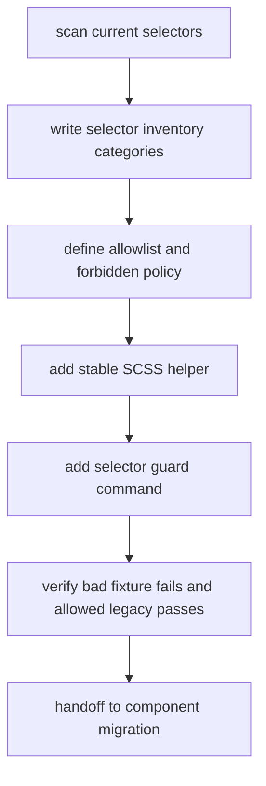

# stylesheet-stable-selector-build feature design

## 0. 术语约定

| 术语 | 定义 | 防冲突结论 |
|---|---|---|
| StableSelector | 新主题系统中稳定组件选择器契约，公共组件类名固定为 `.amis-*`，主题身份不进入组件类名。 | ADR-001 已确定稳定前缀为 `amis-`；本 feature 沿用，不重新讨论前缀名。 |
| SCSS helper | 用于输出 `.amis-*` 和 `[data-amis-theme]` 的 Sass mixin / function / convention。 | 当前 `packages/amis-ui/scss/_mixins.scss` 仍大量拼 `#{$ns}`；本 feature 建 helper，不批量迁移所有 mixin。 |
| Selector inventory | 对现有 `#{$ns}`、`.cxd-*`、`classPrefix` 相关样式/源码依赖的分类清单。 | compound 已确认 `.cxd-*` SCSS/CSS 双轨兼容高影响；inventory 用来区分既有债务、允许的 DOM alias、内部 legacy、docs historical 和 generated artifact。 |
| Allowlist | guard 允许保留的既有命中列表和分类规则。 | 允许是迁移期间的审计工具，不是继续新增 `.cxd-*` 公共 API。 |
| Guard | 本 feature 之后阻止新增前缀选择器/样式依赖的检查命令或脚本。 | 当前 stylelint 规则很薄，只校验基本 SCSS 格式；本 feature 可新增项目级 selector 检查，但不替代后续组件迁移。 |

## 1. 决策与约束

### 需求摘要

本 feature 承接 `theme-runtime-button-pilot` 和 `token-contract-css-layers`，目标是给后续批量组件迁移建立样式侧工具和护栏：SCSS helper 输出稳定 `.amis-*` 组件选择器和 `[data-amis-theme]` 主题作用域，selector inventory 记录既有 `#{$ns}` / `.cxd-*` / `classPrefix` 样式依赖，allowlist 定义迁移期允许项，guard 阻止新增前缀选择器和 editor `.cxd-*` 依赖扩散。

明确不做：

- 不迁移 Form、Select、Dialog、Table、Dropdown、Tooltip、Popover 等核心组件的全部 SCSS。
- 不重写 `_mixins.scss` 中所有 `#{$ns}` 调用；只提供后续迁移使用的 helper 和验证路径。
- 不把 `.cxd-*` 重新定义为库 CSS 兼容选择器；不输出 `.cxd-*` SCSS/CSS legacy selector 双轨。
- 不迁移 editor/theme-editor helper 或历史 schema；只把 editor `.cxd-*` / `.AMISCSSWrapper` 命中列入 inventory 分类。
- 不改变运行时 DOM-only `.cxd-*` alias 的策略；该策略由 Theme Runtime / legacy-prefix-teardown 管理。

### 复杂度档位

- 结构 = modules（偏离单文件默认：helper、inventory、allowlist、guard 需要分别服务 SCSS、源码和 CI/本地验证）。
- 可读性 = public（偏离内部默认：未来组件迁移者和贡献者需要读懂 helper/guard 的错误信息和分类规则）。
- 可演进性 = stable（偏离 active：guard 一旦进入开发流程，会决定哪些 selector 写法允许新增）。
- 可测试性 = verified（偏离普通 tested：需要通过脚本/grep fixture 证明新增坏 selector 会失败、允许项不会误伤）。
- Compatibility = backward-compatible（偏离 current-only：inventory 允许既有债务保留，但阻止新增债务）。

### 关键决策

1. **先建 guard，再做批量迁移**
   后续组件迁移前必须先能区分“新增坏 selector”和“既有待迁移债务”。否则每次组件迁移都会被全仓库旧命中淹没，review 无法判断是否倒退。

2. **SCSS helper 只输出新公共路径**
   helper 的职责是简化 `.amis-*` 和 `[data-amis-theme]` 写法，不提供 `.cxd-*` 双输出开关。DOM-only alias 是运行时 classnames 迁移辅助，不是 SCSS helper 功能。

3. **inventory 分类先行，allowlist 明确退出口径**
   inventory 至少分类为：`public-forbidden`、`dom-alias-generated`、`internal-legacy`、`docs-historical`、`generated-artifact`、`migration-target`。guard 只能允许带分类的既有项，并要求新增项必须归入允许分类或失败。

4. **guard 以脚本/命令为主，不把复杂语义硬塞进 stylelint**
   当前 `.stylelintrc.json` 规则很薄；selector policy 涉及跨目录分类、历史 allowlist 和源码 `classPrefix` 依赖，适合项目脚本或专用检查，而不是只靠 stylelint 配置。

5. **editor 命中先纳入 inventory，不在本项迁移**
   editor/theme-editor 是后续 `editor-theme-helper-migration` 的专项；本 feature 只让 guard 能识别 editor legacy 命中，防止新增。

### 基线风险与验证入口

- `packages/amis-ui/scss` 当前约 140 个文件命中 `#{$ns}`，迁移面大；本 feature 不能把 guard 设计成“全量零命中”，否则会立刻阻断所有开发。
- `packages/amis-ui/scss/components/_condition-builder.scss`、`_mobile-dev-tool.scss` 等已有 `.cxd-*` 样式命中；这些需要 inventory 分类，不应由本项直接重写。
- `packages/amis-theme-editor-helper/src/helper/ParseThemeData.ts` 和 `packages/amis-theme-editor-helper/src/style/**` 仍生成/依赖 `.cxd-*`；本项只分类，不迁移。
- `python3 ... codestable-workflow-next.py` 默认 Python 缺 PyYAML 时会误报 artifact parse error；验证 workflow hook 时需使用带 PyYAML 的环境或记录基线。

### Top 3 风险

1. **guard 误伤既有债务**：如果一开始要求全仓库无 `#{$ns}` / `.cxd-*`，后续无法开发。缓解：先生成 inventory + allowlist，guard 只拦新增或未分类项。
2. **helper 重新打开 `.cxd-*` CSS 兼容层**：如果 helper 支持双输出，会绕回被拒绝的兼容策略。缓解：helper 只输出 `.amis-*` / `[data-amis-theme]`，`.cxd-*` 只可作为 inventory 分类或 DOM alias 说明。
3. **分类太宽导致 guard 形同虚设**：如果 allowlist 只写“legacy allowed”，新增坏 selector 很容易混入。缓解：每类必须有范围、路径、原因和退出 owner，新增命中默认失败。

## 2. 名词与编排

### 2.1 名词层

#### 现状

- `packages/amis-ui/scss/_mixins.scss` 和 `packages/amis-ui/scss/components/**` 大量使用 `#{$ns}` 拼组件选择器；fixed-string grep 显示 `packages/amis-ui/scss` 约 140 个文件命中 `#{$ns}`。
- `packages/amis-ui/scss/components/_button.scss` 已有 Button pilot 的 `.amis-Button` 和 `[data-amis-theme='cxd']` 最小 proof。
- `.stylelintrc.json` 只包含基本格式规则和 `postcss-scss` syntax，没有 selector policy。
- `packages/amis-ui/rollup.config.js` 固定抽取 theme CSS 和 helper CSS，没有 selector inventory / guard。
- `packages/amis-theme-editor-helper` 和 `packages/amis-editor-core` 仍有 `.cxd-*`、`.AMISCSSWrapper`、`getTheme(...).classPrefix` 依赖，属于后续 editor 迁移输入。

#### 变化

新增或固化以下公共名词：

| 名词 | 形态 | 职责 |
|---|---|---|
| Stable selector helper | SCSS mixin/function/convention | 生成 `.amis-{Component}` 和 `[data-amis-theme='{theme}']` 作用域，供后续组件迁移使用。 |
| Selector inventory | YAML/JSON/Markdown 清单或脚本输出 | 记录现有 `#{$ns}`、`.cxd-*`、`classPrefix` 样式依赖及分类。 |
| Selector allowlist | 机器可读规则 | guard 读取 allowlist，允许既有分类项，阻止新增未分类项。 |
| Selector guard | npm script / node script / shell-safe command | 对 SCSS 和相关源码执行 selector policy 检查，作为后续 feature 的必跑命令。 |
| Classification taxonomy | 文档化枚举 | 定义 `public-forbidden`、`dom-alias-generated`、`internal-legacy`、`docs-historical`、`generated-artifact`、`migration-target` 等类别。 |

接口示例：

```scss
@mixin amis-component($name) {
  .amis-#{$name} {
    @content;
  }
}

@mixin amis-theme($theme) {
  [data-amis-theme='#{$theme}'] {
    @content;
  }
}
```

```yaml
categories:
  migration-target:
    description: "既有 #{$ns} 组件样式，后续组件迁移逐步消除"
  public-forbidden:
    description: "新增公共 .cxd-* / .antd-* / .dark-* 选择器，默认失败"
  internal-legacy:
    description: "迁移期内部 legacy 读取点，必须有 owner 和退出条件"
```

Interface 设计检查：

- Module / interface：StableSelector helper 和 guard 是 `amis-ui` 样式构建对后续组件迁移的公共接口。
- Seam placement：seam 放在 SCSS helper + selector guard，不放在每个组件手写字符串替换中。
- Depth / locality：后续新增组件样式只需要使用 helper 并通过 guard；选择器策略变化集中在 allowlist/guard。
- Dependency category：build-time / repository-local；无远程依赖。
- Adapter：无；inventory/allowlist 是迁移审计数据，不是运行时 adapter。
- Test surface：guard fixture、allowlist 校验、selector grep、stylelint、Button proof 不回退。

### 2.2 编排层

#### 现状

当前 selector 迁移缺少统一入口：组件 SCSS 直接写 `.#{$ns}Component`，源码里大量 `classPrefix` 用于 DOM 查询、浮层传参和子组件传参；stylelint 不知道哪些 selector 是旧债、哪些是新增违规。Button pilot 已证明 `.amis-Button` 可渲染，但没有防止新组件继续写 `#{$ns}`。

#### 变化

主流程是“先分类、再护栏、再提供迁移工具”的线性流程：



流程级约束：

- guard 初始不能要求全仓库清零旧命中；它必须基于 inventory/allowlist 判断“新增未分类命中”。
- guard 默认失败对象包括新增 `.cxd-*` SCSS selector、新增主题前缀组件 selector、新增无分类 `#{$ns}` 组件 selector、新增 editor `.cxd-*` 依赖和新增基于 `classPrefix` 的样式 DOM 查询。
- 已有 `classPrefix` 运行时传参不在本 feature 中直接禁止；只把 style/DOM selector 依赖纳入分类和后续迁移计划。
- helper 不能生成 `.cxd-*` 库 CSS，不能从任意 theme prefix 自动生成主题前缀 selector。
- Button pilot 的 `.amis-Button` proof 应继续作为 guard 的允许正例。

### 2.3 挂载点清单

- Stable selector SCSS helper：删掉后后续组件迁移没有统一 `.amis-*` / `[data-amis-theme]` 写法。
- Selector inventory / allowlist：删掉后 guard 无法区分既有债务和新增违规。
- Selector guard command：删掉后新增 `.cxd-*` / `#{$ns}` 样式债务无法被自动阻止。
- Roadmap / feature artifact：删掉后后续 component migration 无法恢复本项分类与 guard 约束。

### 2.4 推进策略

1. **基线扫描**：统计并保存当前 `#{$ns}`、`.cxd-*`、`classPrefix` 样式相关命中，区分 SCSS、runtime DOM query、editor/helper 和 docs/generated。
   退出信号：inventory 能解释现有主要命中，不要求零命中。
2. **分类与 allowlist**：定义 selector 分类 taxonomy、允许范围、owner/退出条件和新增失败规则。
   退出信号：allowlist 是机器可读或可被 guard 消费的结构，不是散文。
3. **SCSS helper**：提供 `.amis-*` / `[data-amis-theme]` 的稳定 helper 和最小使用示例。
   退出信号：helper 不输出 `.cxd-*`，Button proof 或 fixture 能使用 helper 路径。
4. **Guard 命令**：新增 selector policy 检查入口，能读取 inventory/allowlist 并在新增违规时失败。
   退出信号：至少有正例/反例 fixture 或等价测试证明 guard 有效。
5. **验证集成**：把 guard 加入本 feature 的验证命令，并记录与 stylelint/build 的关系。
   退出信号：`npm run stylelint`、selector guard、targeted grep 可运行；基线红灯有归因。
6. **交接收口**：更新实现报告，明确 component migration 如何消费 helper、inventory 和 guard。
   退出信号：后续 roadmap items 可直接引用 guard 命令和分类边界。

### 2.5 结构健康度与微重构

##### 评估

- 文件级 — `packages/amis-ui/scss/_mixins.scss`：包含大量旧 `#{$ns}` mixin 和组件选择器拼接；本 feature 不应大规模改写，以免行为变化过大。
- 文件级 — `.stylelintrc.json`：规则极薄，适合保留基本格式检查；selector 语义不适合全部塞进 stylelint。
- 目录级 — `packages/amis-ui/scss`：已有 131 个 SCSS 文件，components 目录约 96 个直接子文件；新增 helper/inventory 继续平铺会加重目录拥挤。
- 目录级 — `packages/amis-ui/scss/components`：是后续 component migration 主战场；本 feature 不在该目录新增大规模迁移文件。
- compound 命中 — `.codestable/compound/2026-07-24-explore-cxd-compat-compile-switch.md` 要求 selector guard 能区分 “generated DOM alias” 与 “源码新增 `.cxd-*` 选择器”，并拒绝 SCSS/CSS legacy selector 兼容。

##### 结论：微重构（重组 selector 工具入口）

##### 方案

- 搬什么：不搬迁现有组件 SCSS；新增 selector 工具/策略入口，避免继续塞进 `_mixins.scss` 或 components 根目录。
- 搬到哪：优先落在 `packages/amis-ui/scss/` 下专门的 selector/helper 入口，guard 脚本/allowlist 落在实现阶段按现有 scripts 约定选择的项目级位置。
- 行为不变怎么验证：新增 helper/guard 不改变现有主题 CSS 输出，除非显式接入 fixture；stylelint/build/grep 记录通过或基线归因。
- 步骤序列：
  1. 建立 inventory/allowlist/guard 的独立入口。
  2. 建立 stable selector helper 的最小入口。
  3. 只用 fixture 或 Button proof 验证新路径，不批量改组件。

##### 建议沉淀的 convention

- 是否稳定模式：稳定模式。
- 规则一句话：新增主题组件样式必须使用 stable selector helper 或 `.amis-*` / `[data-amis-theme]` 公共路径，新增 `#{$ns}` / `.cxd-*` 选择器必须被 guard 拒绝。
- 适用范围：`packages/amis-ui/scss`、与样式 DOM query 相关的 `packages/amis-core` / `packages/amis` / editor helper。

##### 超出范围的观察

- `packages/amis-ui/scss/_mixins.scss` 后续可能需要专项拆分，但本 feature 只建工具和 guard，不做大规模 mixin 重构。
- 源码中大量 `classPrefix` 是组件传参或运行时行为，不全是样式 selector 债务；后续 core component migration 需要逐类判断。

## 3. 验收契约

### 3.1 关键场景清单

- 输入：当前仓库 selector 扫描 → 期望生成/维护 inventory，既有 `#{$ns}`、`.cxd-*`、editor/helper 命中有分类。
- 输入：新增 `.cxd-Foo` SCSS selector 或新增未分类 `#{$ns}` 组件 selector → 期望 guard 失败。
- 输入：既有 allowlist 命中 → 期望 guard 通过但保留分类和退出条件。
- 输入：使用 stable selector helper 写 `.amis-Foo` / `[data-amis-theme='cxd'] .amis-Foo` → 期望 guard 通过。
- 输入：Button pilot `.amis-Button` proof → 期望不被 guard 当成 legacy selector。
- 反向核对：本 feature 不应批量迁移核心组件、不应修改 editor/helper 生成 CSS、不应新增 SCSS `.cxd-*` 兼容输出。

### 3.2 Acceptance Coverage Matrix

| Scenario | Covered By Step | Evidence Type | Command / Action | Core? |
|---|---|---|---|---|
| inventory 覆盖现有 selector 命中 | S1 / S2 | script output / diff review | selector inventory command | yes |
| 新增 `.cxd-*` selector 会失败 | S4 | fixture / command | selector guard bad fixture | yes |
| 允许的旧命中可通过且有分类 | S2 / S4 | command / diff review | selector guard allowlist check | yes |
| stable helper 输出新路径 | S3 | SCSS fixture / diff review | grep `.amis-` / `[data-amis-theme]` helper usage | yes |
| 不做 SCSS legacy selector 兼容 | S4 / S6 | grep / diff review | `rg -n "\\.cxd-|#\\{\\$ns\\}" packages/amis-ui/scss` 新增分类核对 | yes |
| 不迁移 editor/helper | S6 | git diff review | `git diff -- packages/amis-theme-editor-helper packages/amis-editor-core` | yes |

### 3.3 DoD Contract

| ID | 要求 | 证据 | 阻塞级别 |
|---|---|---|---|
| DOD-DESIGN-001 | design 与 checklist 覆盖 helper、inventory、allowlist、guard 和范围边界 | design review | blocking |
| DOD-IMPL-001 | checklist steps 全部完成且 guard 有正反例证据 | checklist / implementation report | blocking |
| DOD-REVIEW-001 | code review passed 且无 unresolved blocking | review report | blocking |
| DOD-QA-001 | QA 覆盖 selector scan、guard failure、allowlist pass 和范围守护 | QA report | blocking |
| DOD-ACCEPT-001 | acceptance 回写 roadmap 状态并记录后续迁移消费方式 | acceptance report | blocking |

Validation Commands:

| ID | 命令 | 目的 | 核心性 | 失败处理 |
|---|---|---|---|---|
| CMD-001 | `npm run stylelint` | 校验 SCSS 基础规则 | core | fix-or-block |
| CMD-002 | `npm run build --workspace amis-ui` | 校验 helper/guard 未破坏主题构建 | core | fix-or-block 或 document-baseline |
| CMD-003 | `rg -n -F '#{$ns}' packages/amis-ui/scss` | 记录旧 ns selector 基线和新增分类 | core | document-baseline |
| CMD-004 | `rg -n "\\.cxd-|\\.antd-|\\.dark-" packages/amis-ui/scss packages/amis-theme-editor-helper packages/amis-editor-core` | 记录/阻止主题前缀 selector 扩散 | core | document-baseline |
| CMD-005 | `npm run check:theme-selectors --workspace amis-ui` | 校验新增违规 selector 会失败 | core | fix-or-block |
| CMD-006 | `python3 /Users/songmingxu/.agents/skills/cs-onboard/tools/validate-yaml.py --file .codestable/features/2026-07-25-stylesheet-stable-selector-build/stylesheet-stable-selector-build-checklist.yaml --yaml-only` | 校验 checklist YAML | core | fix-or-block |

Required Artifacts: design、checklist、design-review、selector inventory / allowlist、implementation report、code review、QA、acceptance、命令输出摘要。

## 4. 与项目级架构文档的关系

- 本 feature 是 ADR-001 的 Stylesheet Build 执行层细化，不新增替代 ADR。
- 如果实现阶段确认 selector 分类 taxonomy 和 guard 命令稳定，应在收尾时通过 `cs-keep` 记录为 compound convention，供后续 component migration 复用。
- `requirements/CONTEXT.md` 暂不新增业务术语；StableSelector / SelectorInventory 属于本 roadmap 内部执行术语。
