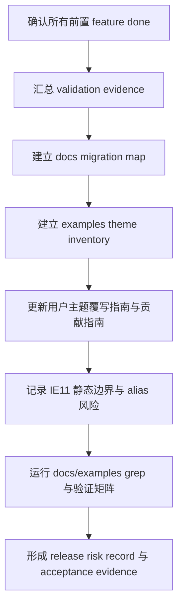

# theme-system-validation-docs-rollout feature design

## 0. 术语约定

| 术语 | 定义 | 防冲突结论 |
|---|---|---|
| Validation Matrix | 汇总 runtime、token、selector、overlay、editor、legacy alias、docs/examples 的跨包验证矩阵。 | 不是替代各 feature 的测试；它只证明整体主题系统已按同一契约收口。 |
| Docs Rollout Handoff | 从前置 feature 接收的 LegacyPrefixLedger、AliasRetentionRecord、selector guard、editor migration notes 和 IE11 静态边界材料。 | docs rollout 只消费已验收事实，不重新定义 ADR 或兼容策略。 |
| Theme Override Guide | 面向用户的主题覆写指南：token、`.amis-*`、`[data-amis-theme]`、`amis.user` layer 或加载顺序。 | 不再推荐 `#{$ns}`、`.cxd-*`、`.antd-*`、`.dark-*` 作为新定制入口。 |
| Examples Inventory | examples 和文档站样式中旧主题前缀命中的分类清单。 | examples 中的旧前缀命中要迁移、标注历史、或纳入风险；不能静默留下。 |
| Release Risk Record | 发布前面向维护者的风险清单：破坏性心智变化、DOM-only alias、IE11 静态降级、已知未迁移项。 | 不是营销 release note；它是 acceptance 和发布决策证据。 |

## 1. 决策与约束

### 需求摘要

本 feature 是 theme system refactor 的最后一个收口项：把前面 runtime、token、selector、overlay、component、editor、legacy teardown 产生的事实落到可执行验证矩阵、examples inventory、贡献文档、用户主题覆写指南、IE11 静态降级说明和发布风险记录。完成后，用户主路径应只看到主题名、token、稳定 `.amis-*` 组件类名和 `[data-amis-theme]` 主题作用域，不再需要理解 `classPrefix`、`#{$ns}` 或 `.cxd-*` 主题前缀。

明确不做：

- 不在本项重新设计 Theme Runtime、TokenContract、OverlayThemeScope、EditorThemeCss 或 legacy alias policy。
- 不替前置 feature 补实现；如果前置验证证据缺失，本项必须阻塞或回到对应 feature。
- 不把 `#{$ns}` / `.cxd-*` 保留为新贡献文档的推荐写法。
- 不承诺 IE11 支持基于 CSS custom properties 的动态 token 主题切换。
- 不把 examples 中所有历史主题差异都强行 token 化；非标准差异可改为 `[data-amis-theme] .amis-*` 或记录为风险。
- 不自动发布、push、merge、release 或修改远程文档站。

### 复杂度档位

- 结构 = modules（跨 docs、examples、package scripts、build output、前置 feature artifact）。
- 可读性 = public（用户指南和贡献指南直接影响外部心智）。
- 可演进性 = stable（后续新增主题能力要沿用同一验证矩阵和文档口径）。
- 可测试性 = verified（需要 docs grep、examples inventory、build/test/guard、手工路径或截图证据）。
- Compatibility = migration-compatible（解释 DOM-only alias 和 IE11 静态边界，不扩大兼容承诺）。

### 关键决策

1. **implementation admission 必须等待 legacy-prefix-teardown done**
   本 design 可在 legacy design-review passed 后起草；实现前必须确认所有前置 feature 至少完成 acceptance 所需证据，尤其 LegacyPrefixLedger、AliasRetentionRecord、selector guard 和 editor/helper handoff。

2. **文档主路径只讲新心智**
   `docs/zh-CN/extend/contribute.md` 不能继续要求 `#{$ns}` 生成 `.cxd-Avatar`；用户主题覆写指南应围绕 token、stable selector、theme scope 和 user layer / 加载顺序。

3. **旧心智必须分类处理**
   docs/examples 中的 `cxd-`、`antd-`、`dark-`、`#{$ns}`、`classPrefix` 命中必须分类为 migrate、historical mention、file-name compatibility、generated artifact、risk accepted 或 follow-up，不允许静默保留。

4. **IE11 只写静态降级边界**
   `cxd-ie11.css` / `default-ie11.css` / SDK `cxd-ie11.css` 只能描述为静态 CSS 降级产物；不得暗示它支持 token 动态主题切换或 CSS variables。

5. **发布风险记录是验收产物**
   主题系统改变公共样式心智，必须形成 release risk record，列出用户可见变化、迁移辅助、已知限制、验证命令和人工复审材料。

### 基线风险与验证入口

- `docs/zh-CN/extend/contribute.md` 仍写“必须有 `#{$ns}`，在 cxd 主题下转成 `.cxd-Avatar`”。
- `docs/zh-CN/start/getting-started.md` 仍以 `cxd.css` / `antd.css` 和 `theme: 'cxd'` 介绍主题样式，并说明 IE11 引入 `amis/sdk/cxd-ie11.css`。
- `docs/zh-CN/style/css-vars.md` 仍列旧变量如 `--primary`、`--button-color`，未表达 `--amis-*` 分层。
- `docs/zh-CN/style/index.md` 仍推荐源码修改 `scss/themes/cxd.scss` 生成主题 CSS。
- `examples/style.scss` 有大量 `.cxd-*` / `.antd-*` / `.dark-*` 选择器，用于文档站 layout、AsideNav、Drawer 等样式。
- `examples/sdk-placeholder.html` 与 `examples/embed.tsx` 仍引用 cxd / antd / dark 主题入口或 `amis-scope`。
- `packages/amis/build.sh` 仍生成 `*-ie11.css` 和 SDK `cxd-ie11.css` 文件名兼容。

### Top 3 风险

1. **文档更新早于实现事实**：如果前置 feature 未 done，docs 可能承诺不存在的 token/guard/alias 行为。缓解：S1 admission 必须读取前置 acceptance evidence，缺失即阻塞。
2. **新旧文档心智并存**：贡献指南继续写 `#{$ns}`，用户指南又写 `.amis-*`，会让迁移失败。缓解：S3 docs grep 必须阻止未分类旧心智残留。
3. **examples 仍靠旧前缀展示成功**：示例站可能掩盖核心路径未迁移。缓解：Examples Inventory 单独分类，并要求示例主路径迁移到 `.amis-*` / `[data-amis-theme]` 或明确风险。

## 2. 名词与编排

### 2.1 名词层

#### 现状

- Roadmap 已定义 Verification And Docs 模块，负责测试矩阵、示例验证、贡献文档、用户覆写指南、IE11 CSS 说明和发布风险。
- ADR-001 已接受 token + theme scope 双通道；`.cxd-*` SCSS/CSS legacy selector 兼容被拒绝，DOM-only alias 只作为迁移辅助。
- 前置 designs 分别产出 TokenContract、StableSelector guard、OverlayThemeScope、ComponentMigrationLedger、EditorThemeCss、LegacyPrefixLedger / AliasRetentionRecord。
- 文档和 examples 中仍存在旧主题心智：`#{$ns}` 贡献说明、`cxd.css` 主题引入、旧 CSS variables、examples/style.scss 的 `.cxd-*` / `.antd-*` / `.dark-*`。

#### 变化

新增或固化以下名词：

| 名词 | 形态 | 职责 |
|---|---|---|
| ThemeSystemValidationMatrix | Markdown / YAML | 汇总每个主题系统契约、对应命令、手工路径、证据文件和责任 feature。 |
| DocsMigrationMap | Markdown / YAML | 列出 docs 文件、旧心智命中、新文案目标、迁移状态和风险。 |
| ExamplesThemeInventory | Markdown / YAML | 列出 examples 中主题前缀命中、分类、迁移方案和是否阻塞发布。 |
| ThemeOverrideGuide | docs 页面或章节 | 面向用户解释 token、`.amis-*`、`[data-amis-theme]`、user layer / 加载顺序和 DOM-only alias 迁移边界。 |
| ReleaseRiskRecord | Markdown | 发布风险、已知限制、IE11 静态降级、DOM-only alias 复审材料和验证摘要。 |

接口示例：

```yaml
validation_matrix:
  - contract: "Stable selector public path"
    evidence:
      - "selector guard output"
      - "docs grep has no unclassified #{$ns} / .cxd-* recommendation"
    owner_feature: "stylesheet-stable-selector-build"
    rollout_status: "ready|blocked|risk-accepted"
```

Interface 设计检查：

- Module / interface：ValidationMatrix / DocsMigrationMap 是前置 feature 与发布验收之间的交接接口。
- Seam placement：seam 放在 docs rollout artifacts，而不是让每个实现 feature 自己零散改文档。
- Depth / locality：后续主题系统新增能力时，只需扩展矩阵行和文档映射。
- Dependency strategy：repository-local docs/examples/build artifacts；手工浏览器路径可作为 supporting evidence。
- Adapter：无；DOM-only alias 是迁移说明，不是 docs adapter。
- Test surface：docs grep、examples grep、package scripts、targeted build/test/guard、手工路径记录。

### 2.2 编排层

#### 现状

前置 feature 的设计已经定义了各自的实现和验证入口，但还缺一个最终编排层把这些入口合并为发布前可审的整体证据。docs/examples 的旧主题前缀命中也还没有统一分流：有些要迁移，有些是历史说明，有些是文件名兼容，有些可能是发布风险。

#### 变化

主流程：



流程级约束：

- 前置 feature 未 done 或核心证据缺失时，不得写“已完成”式用户文档。
- docs 中保留旧前缀只能是 historical mention、file-name compatibility 或 migration warning，不能作为推荐路径。
- examples 中保留旧前缀必须进入 ExamplesThemeInventory，并标明是否阻塞发布或由后续示例改造处理。
- IE11 文档必须明确“静态 CSS 降级”和“不支持动态 token 主题切换”两点。
- release risk record 必须能从 validation matrix、docs grep、examples inventory 和前置 acceptance evidence 反查。

### 2.3 挂载点清单

- ThemeSystemValidationMatrix：删掉后无法证明 theme refactor 的跨包契约已整体验证。
- DocsMigrationMap：删掉后文档旧心智命中无法分类收口。
- ExamplesThemeInventory：删掉后 examples 中 `.cxd-*` / `.antd-*` / `.dark-*` 可能静默遗留。
- ThemeOverrideGuide / contribution docs update：删掉后最终用户仍会学习 `#{$ns}` / `.cxd-*`。
- ReleaseRiskRecord：删掉后发布决策缺少 alias、IE11 和迁移风险证据。

### 2.4 推进策略

1. **实现准入与证据汇总**：确认所有前置 feature `done`，读取 LegacyPrefixLedger、AliasRetentionRecord、selector guard、editor/helper notes、component ledger 和 overlay/editor 验证证据。
   退出信号：每个前置 item 有 acceptance evidence；缺失项明确阻塞或回对应 feature。
2. **Validation Matrix 建立**：把 runtime、token、selector、overlay、component、editor、legacy alias、docs/examples 映射到命令、手工路径和证据文件。
   退出信号：每个 ADR-001 核心契约都有至少一条核心证据和责任 feature。
3. **DocsMigrationMap 与文档更新**：更新 getting-started、contribute、style/css-vars、style/index 和必要主题指南，移除推荐 `#{$ns}` / `.cxd-*` 的新用法。
   退出信号：docs grep 中旧前缀心智命中均被迁移、标为历史说明或文件名兼容。
4. **ExamplesThemeInventory 与示例收口**：扫描 examples/style.scss、sdk-placeholder、embed 和主题示例，迁移主路径或记录风险。
   退出信号：examples 旧前缀命中均有分类；阻塞项被修复或进入 release risk record。
5. **IE11 与 alias 迁移说明**：把 IE11 静态 CSS 降级、DOM-only alias 默认关闭和人工复审策略写入 rollout notes。
   退出信号：用户文档不暗示 IE11 动态 token；alias 文案只作为迁移辅助。
6. **验证与发布风险记录**：运行 build/test/guard/docs grep/examples grep，形成 ReleaseRiskRecord。
   退出信号：核心命令通过或有基线归因；risk record 列出已知限制、迁移材料和发布判断。
7. **acceptance 证据收口**：回写 roadmap 状态，整理 final validation packet。
   退出信号：acceptance 可从矩阵、文档 diff、examples inventory、命令输出和 risk record 反查完成状态。

### 2.5 结构健康度与微重构

##### 评估

- 文件级 — `docs/zh-CN/extend/contribute.md`：贡献指南单文件承载组件开发流程，本项只替换主题样式章节，不拆文档。
- 文件级 — `docs/zh-CN/start/getting-started.md`：入门文档较长，但主题样式章节是稳定锚点；本项只更新主题引入、IE11 和主题配置说明。
- 文件级 — `docs/zh-CN/style/css-vars.md`：旧 CSS variables 列表可能需要迁移到 `--amis-*` 分层说明；如篇幅过长，可在实现阶段新增主题 token 指南并从该页链接。
- 文件级 — `examples/style.scss`：示例站样式旧前缀命中集中但数量较多；本项可迁移主路径或 inventory 分类，不做样式系统重构。
- 目录级 — `.codestable/features/**`：本项新增收口 artifacts 是合适落点，避免把发布证据散在多个前置 feature 目录。
- docs 目录级：如实现需要新增专门主题指南，优先放 `docs/zh-CN/style/`，不新增无关目录层级。

##### 结论：不做前置微重构

本项不做前置微重构。原因：主要工作是文档和验证收口，不是代码结构搬移；若实现阶段发现 CSS variables 文档需要拆页，应作为本 feature 内的文档组织决策并保持链接可追踪。

##### 超出范围的观察

- 若需要自动 codemod 帮用户从 `.cxd-*` 迁移到 `.amis-*`，应另开后续工具型 feature。
- 若 examples 视觉差异需要重设计，不在本项内解决；本项只保证主题系统心智和验证证据不冲突。

## 3. 验收契约

### 3.1 关键场景清单

- 输入：前置 feature acceptance evidence → 期望 Validation Matrix 中每个 ADR-001 核心契约都有命令或手工证据。
- 输入：`docs/zh-CN/extend/contribute.md` → 期望不再推荐 `#{$ns}` 生成 `.cxd-*`，改为 stable selector / helper / token 写法。
- 输入：用户查找主题覆写方式 → 期望能看到 token、`.amis-*`、`[data-amis-theme]`、user layer / 加载顺序和 DOM-only alias 迁移边界。
- 输入：IE11 主题说明 → 期望明确静态 CSS 降级，不承诺动态 token 主题切换。
- 输入：examples/style.scss 与示例入口 grep → 期望旧前缀命中已迁移或进入 ExamplesThemeInventory 分类。
- 输入：docs/examples grep → 期望未分类 `cxd-` / `antd-` / `dark-` / `#{$ns}` / `classPrefix` 命中为 0。
- 输入：发布前 review → 期望 ReleaseRiskRecord 列出 alias、IE11、旧前缀迁移、剩余风险和验证摘要。
- 反向核对：不修改 ADR 决策，不恢复 SCSS/CSS legacy selector 双轨，不自动发布或推送远端。

### 3.2 Acceptance Coverage Matrix

| Scenario | Covered By Step | Evidence Type | Command / Action | Core? |
|---|---|---|---|---|
| 前置 evidence 完整 | S1 | artifact review | items.yaml + feature acceptance evidence | yes |
| ADR-001 核心契约有验证矩阵 | S2 | matrix | ThemeSystemValidationMatrix review | yes |
| contribute 不再推荐 `#{$ns}` / `.cxd-*` | S3 | docs grep / diff review | `rg -n "#\\{\\$ns\\}|\\.cxd-" docs/zh-CN/extend/contribute.md` | yes |
| 主题覆写指南覆盖 token / stable selector / theme scope | S3 | docs review | docs diff review | yes |
| IE11 静态降级边界明确 | S5 | docs review / grep | `rg -n "IE11|cxd-ie11|CSS 变量" docs/zh-CN/start docs/zh-CN/style` | yes |
| examples 旧前缀命中分类完整 | S4 | inventory / grep | `rg -n "\\.cxd-|\\.antd-|\\.dark-" examples` | yes |
| docs/examples 无未分类旧心智残留 | S6 | grep / inventory | docs/examples prefix grep + migration map | yes |
| 发布风险记录完整 | S6 / S7 | release risk record | ReleaseRiskRecord review | yes |

### 3.3 DoD Contract

| ID | 要求 | 证据 | 阻塞级别 |
|---|---|---|---|
| DOD-DESIGN-001 | design 与 checklist 覆盖验证矩阵、docs migration、examples inventory、IE11、alias、release risk | design review | blocking |
| DOD-IMPL-001 | ValidationMatrix、DocsMigrationMap、ExamplesThemeInventory、ThemeOverrideGuide、ReleaseRiskRecord 均落盘 | implementation report | blocking |
| DOD-REVIEW-001 | code review passed，确认文档不再推荐旧前缀主路径，examples 残留均可解释 | review report | blocking |
| DOD-QA-001 | QA 覆盖 build/test/guard、docs grep、examples grep、手工主题/浮层/editor preview 路径 | QA report | blocking |
| DOD-ACCEPT-001 | acceptance 回写 roadmap 状态，并明确是否可进入 goal/package 或发布准备 | acceptance report | blocking |

Validation Commands:

| ID | 命令 | 目的 | 核心性 | 失败处理 |
|---|---|---|---|---|
| CMD-001 | `PYTHONPATH=/Users/songmingxu/Projects/gold-market/.venv/lib/python3.13/site-packages python3 /Users/songmingxu/.agents/skills/cs-onboard/tools/codestable-workflow-next.py epic --roadmap .codestable/roadmap/theme-system-refactor --json` | 确认 workflow 与依赖状态 | core | fix-or-block |
| CMD-002 | `npm run typecheck` | 跨包类型验证；当前存在 broad baseline，作为非核心基线记录 | non-core | document-baseline |
| CMD-003 | `npm run stylelint` | SCSS 规则验证 | core | fix-or-block |
| CMD-004 | `npm run check:theme-selectors --workspace amis-ui` | selector guard 验证 | core | fix-or-block |
| CMD-005 | `npm test --workspace amis-core -- theme` | Theme Runtime 验证 | core | fix-or-block |
| CMD-006 | `npm test --workspace amis -- button` | stable class / alias 渲染路径验证 | core | fix-or-block |
| CMD-007 | `rg -n "#\\{\\$ns\\}|\\.cxd-|\\.antd-|\\.dark-|classPrefix" docs examples` | docs/examples 旧心智残留扫描 | core | document-baseline |
| CMD-008 | `rg -n "IE11|cxd-ie11|CSS 变量|data-amis-theme|--amis-|amis-" docs/zh-CN/start docs/zh-CN/style docs/zh-CN/extend` | 核对主题文档关键术语 | core | document-baseline |
| CMD-009 | `python3 /Users/songmingxu/.agents/skills/cs-onboard/tools/validate-yaml.py --file .codestable/features/2026-07-25-theme-system-validation-docs-rollout/theme-system-validation-docs-rollout-checklist.yaml --yaml-only` | 校验 checklist YAML | core | fix-or-block |

Required Artifacts: ThemeSystemValidationMatrix、DocsMigrationMap、ExamplesThemeInventory、ThemeOverrideGuide / docs diff、IE11 static fallback notes、ReleaseRiskRecord、docs/examples grep output、manual validation notes、implementation report、code review、QA、acceptance。

## 4. 与项目级架构文档的关系

- 本 feature 不新增 ADR；它把 ADR-001、roadmap 和前置 feature 的执行事实落实到文档和发布验证。
- acceptance 后如 ValidationMatrix / DocsMigrationMap 成为长期流程，应沉淀到 architecture / compound 或贡献文档。
- 如果实现阶段发现 ADR-001 与真实用户文档需求冲突，必须回 `cs-domain` 或 roadmap planning 修订，不得在 docs rollout 中偷偷改决策。
