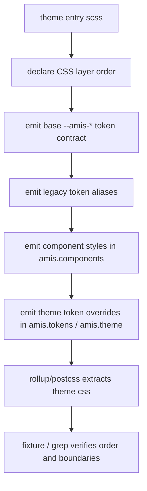

# token-contract-css-layers feature design

## 0. 术语约定

| 术语 | 定义 | 防冲突结论 |
|---|---|---|
| TokenContract | amis 主题 token 的命名、分层、作用域、旧 token 映射和 CSS layer 顺序契约。 | 代码中尚无正式 `TokenContract` 模块；roadmap 第 4.2 节已经使用该名，本 feature 沿用。 |
| `--amis-*` token | 新主题系统的公共 token 命名空间，覆盖 palette、semantic、component、state 四层。 | 当前 SCSS 主要使用 `--colors-*`、`--fonts-*`、`--borders-*`、`--sizes-*`、`--Button*`、`--button-*`；本 feature 只建立集中映射，不要求一次性改完所有消费点。 |
| CSS layer | 浏览器层叠层级，固定声明 `@layer amis.reset, amis.tokens, amis.components, amis.theme, amis.user;`。 | 当前 `packages/amis-ui/scss` 未使用 `@layer`；本 feature 建立 layer 入口和 fixture，不迁移全部组件选择器。 |
| 旧 token alias | 旧变量到新 `--amis-*` token 的集中桥接，例如 `--colors-brand-5: var(--amis-palette-brand-500)` 或反向兼容映射。 | 只允许集中定义；不允许后续组件继续新增散落的旧 token。 |
| IE11 静态降级 | 不支持 CSS custom properties 动态主题切换的环境只能消费静态 CSS 产物。 | 只定义边界和验证说明；不承诺 IE11 动态 token 能力。 |

## 1. 决策与约束

### 需求摘要

本 feature 从 ADR-001 和 roadmap 的 `token-contract-css-layers` 条目起步，目标是把主题系统的 token 与 CSS layer 公共契约固定下来：新代码应该使用 `--amis-*` token、主题身份用 `[data-amis-theme]` 表达、主题包通过 `amis.theme` 层覆写，用户覆写通过 `amis.user` 或更晚加载 CSS 进入。成功标准是后续 `stylesheet-stable-selector-build`、`core-component-selector-migration` 和 `editor-theme-helper-migration` 可以依赖这份契约执行，而不用重新发明 token 名、layer 顺序或旧变量映射规则。

明确不做：

- 不迁移全部组件 SCSS，也不把所有 `#{$ns}` / `.cxd-*` 选择器改成 `.amis-*`。
- 不迁移 editor、theme-editor helper、`ParseThemeData` 或 `.AMISCSSWrapper` 的主题身份依赖。
- 不移除旧 `--colors-*`、`--button-*`、`--Button*` token；只建立集中映射和新增代码边界。
- 不输出 `.cxd-*` SCSS/CSS legacy selector 兼容层；DOM-only `.cxd-*` alias 属于运行时迁移策略，不属于本 feature 的 SCSS 契约。
- 不承诺 IE11 支持 CSS custom properties 动态主题切换；IE11 只保留静态 CSS 降级说明和构建边界。

### 复杂度档位

- 结构 = modules（偏离单文件默认：TokenContract 是跨 theme entry、components、editor helper 的共享协议，必须落在独立 token 入口/文档化模块，而不是继续堆进 `_properties.scss`）。
- 可读性 = public（偏离内部默认：这是主题作者、组件迁移和用户覆写文档的公共契约，命名规则和示例必须可读）。
- 可演进性 = stable（偏离 active：token 命名和 layer 顺序一旦被组件、编辑器和用户 CSS 依赖，后续变更必须通过迁移映射）。
- 可测试性 = verified（偏离普通 tested：需要用构建产物/fixture 检查 layer 顺序、`--amis-*` 映射、旧 token alias 和 forbidden selector 边界）。
- Compatibility = backward-compatible（偏离 current-only：旧 token 继续可读，新增公共路径转向 `--amis-*`）。

### 关键决策

1. **先建 token contract，再做组件迁移**
   TokenContract 只定义命名、层级、映射和覆写入口；组件如何改选择器、如何批量消费 component/state token 交给后续 `stylesheet-stable-selector-build` 与 `core-component-selector-migration`。这样可以避免在没有公共契约时，每个组件各自发明 `--amis-*` token。

2. **CSS layer 顺序必须集中声明且可被构建产物观察**
   `@layer amis.reset, amis.tokens, amis.components, amis.theme, amis.user;` 是 ADR-001 的公共协议。实现阶段需要让主题入口产物或 fixture 中能 grep 到该顺序，不能只写在文档里。

3. **旧 token 映射集中治理，不散落在组件里**
   当前 `_properties.scss` 同时承载基础色、语义变量和大量组件变量，文件已接近 900 行。新 `--amis-*` token 和旧 token alias 应集中到 token contract 入口，组件迁移阶段只能消费或补充该入口，不允许直接新增散落的旧命名。

4. **主题覆写优先通过 `[data-amis-theme]` 下的 token 值进入**
   cxd / dark / antd 等主题包优先覆写 `--amis-*` token；结构、形态或非标准差异才进入 `@layer amis.theme` 的 theme-scoped selector。这样保持“标准值 token 化，非标准选择器覆写”的共识。

5. **IE11 只作为静态边界记录**
   IE11 入口如 `cxd-ie11.scss`、`dark-ie11.scss` 可以继续作为静态 CSS 产物存在，但不能成为新 token contract 的动态切换目标。实现和文档都要避免暗示 IE11 支持运行时 token 主题切换。

### 基线风险与验证入口

- `python3 /Users/songmingxu/.agents/skills/cs-onboard/tools/codestable-workflow-next.py epic --roadmap .codestable/roadmap/theme-system-refactor --json` 当前因本地 Python 缺少 PyYAML 报 `PyYAML is required for strict CodeStable gate artifact parsing`，不是 roadmap YAML 内容本身失败；实现阶段应记录该基线，不能把它归咎为本 feature 引入。
- `npm run typecheck` 已有跨仓库基线红灯，上一项 acceptance 已记录不指向主题 runtime 试点；本 feature 仍应跑 targeted SCSS/build/stylelint/grep，并把全量 typecheck 作为 document-baseline。
- `packages/amis-ui/scss/_properties.scss` 当前是 token 事实中心但职责过重；实现阶段需要优先做可验证的 token 入口拆分或映射入口，而不是继续追加大量变量。

### Top 3 风险

1. **token 爆炸和语义漂移**：如果新 token 只按组件局部需要随手加，会复制旧 `--Button*` / `--button-*` 的混乱。缓解：先定义 palette / semantic / component / state 命名规则和 alias 方向，review 检查新增 token 是否归层。
2. **CSS layer 只停留在文档**：如果构建产物没有稳定输出 layer 顺序，后续用户覆写优先级仍不可证。缓解：新增 fixture 或主题入口检查，验收 grep `@layer amis.reset, amis.tokens, amis.components, amis.theme, amis.user`。
3. **把 editor/helper 迁移偷塞进本 feature**：`ParseThemeData` 和 `.AMISCSSWrapper` 影响面大，容易导致范围失控。缓解：本 feature 只定义旧 token 映射和 editor 后续消费边界，反向核对不修改 editor helper 行为。

## 2. 名词与编排

### 2.1 名词层

#### 现状

- `packages/amis-ui/scss/_variables.scss` 保留 Sass 变量和颜色计算能力，README 明确说明颜色计算暂时仍依赖 Sass，CSS custom properties 与 Sass variables 并存。
- `packages/amis-ui/scss/_properties.scss` 是当前 CSS custom properties 的主要定义点，包含 `:root, .AMISCSSWrapper` 下的大量基础变量、语义变量和组件变量，例如 `--colors-*`、`--fonts-*`、`--borders-*`、`--sizes-*`、`--Button*`。
- `packages/amis-ui/scss/themes/*.scss` 当前按主题入口导入 `../properties`、`../components`、`./*-variables` 和 `./common`；dark / antd 等变量文件仍直接覆写旧 token。
- `packages/amis-theme-editor-helper/src/helper/ParseThemeData.ts` 仍生成和读取 `--button-*` 旧 token；这是后续 `editor-theme-helper-migration` 的输入，不在本 feature 中迁移。

#### 变化

新增或固化以下公共名词：

| 名词 | 形态 | 职责 |
|---|---|---|
| Token layer declaration | SCSS/CSS 入口声明 | 集中声明 `amis.reset`、`amis.tokens`、`amis.components`、`amis.theme`、`amis.user` 的层叠顺序。 |
| Amis token namespace | CSS custom properties | 新公共 token 使用 `--amis-*`，分为 palette、semantic、component、state 四层。 |
| Legacy token alias map | SCSS token 映射入口 | 集中维护旧 token 与新 token 的映射，保证旧变量继续可读，但新增代码不扩散旧命名。 |
| Theme token override entry | theme-scoped token 覆写入口 | 主题包通过 `[data-amis-theme='cxd'|'dark'|'antd']` 覆写 token 值。 |
| User override boundary | layer / load-order 规则 | 用户覆写进入 `amis.user` 或晚于 amis CSS 加载，文档不再要求理解 `$ns` / `.cxd-*`。 |

接口示例：

```scss
@layer amis.reset, amis.tokens, amis.components, amis.theme, amis.user;

@layer amis.tokens {
  :root {
    --amis-palette-brand-500: #2468f2;
    --amis-color-brand-bg: var(--amis-palette-brand-500);
    --amis-Button-primary-bg: var(--amis-color-brand-bg);

    /* legacy alias: old tokens continue to resolve through the new contract */
    --colors-brand-5: var(--amis-palette-brand-500);
    --Button--primary-bg: var(--amis-Button-primary-bg);
  }

  [data-amis-theme='dark'] {
    --amis-color-brand-bg: var(--amis-palette-brand-400);
  }
}

@layer amis.theme {
  [data-amis-theme='antd'] .amis-Tabs {
    /* 非标准结构或形态差异 */
  }
}
```

Interface 设计检查：

- Module / interface：TokenContract 是 `amis-ui` SCSS 层对 `amis-core` ThemeScope、组件样式、theme-editor helper 和用户 CSS 的公共接口。
- Seam placement：seam 放在 token SCSS 入口和 layer declaration，不放在每个组件内部。
- Depth / locality：后续调整 token 命名、旧 token alias 或 layer 顺序时，变更集中在 token contract 入口和主题入口。
- Dependency category：build-time / in-process；无远程依赖。
- Adapter：旧 token alias 是兼容映射，不是运行时 adapter；DOM-only `.cxd-*` alias 不属于本接口。
- Test surface：SCSS fixture / theme build / stylelint / grep 检查 layer 顺序、`--amis-*` token、legacy alias 和 forbidden `.cxd-*` selector。

### 2.2 编排层

#### 现状

当前主题 CSS 构建是线性导入链：

1. 主题入口如 `themes/cxd.scss` 导入 `../properties`。
2. 再导入 `../components` 输出组件样式。
3. 再导入主题变量文件和 `common`，部分主题在入口中继续追加 `:root, .AMISCSSWrapper` 覆写。
4. `packages/amis-ui/rollup.config.js` 用 `rollup-plugin-postcss` 和 `postcss-import` 抽出 `lib/themes/{theme}.css`。

当前没有 CSS layer，因此 token、组件样式、主题覆写和用户 CSS 的优先级主要靠导入顺序和 CSS 选择器权重。

#### 变化

主流程保持线性，不引入新构建系统：



流程级约束：

- layer 顺序必须在主题产物或专用 fixture 中可观察，且顺序只能有一个 canonical 声明。
- `--amis-*` token 是新增公共命名；旧 token alias 可保留但必须集中维护。
- 主题包覆写 token 时使用 `[data-amis-theme]`，不得新增 `.cxd-*` / `.antd-*` / `.dark-*` 组件选择器。
- 组件层只消费 token；组件选择器稳定化由后续 selector build 和 component migration 承担。
- 旧 token 映射方向需要保证旧消费点不坏：短期内允许 `--colors-*` / `--Button*` 继续解析到新 token，新增 `--amis-*` 则成为新代码主路径。

### 2.3 挂载点清单

- `amis-ui` token contract SCSS 入口：新增或调整 token 层、legacy alias 层和 theme override 入口；删掉后 `--amis-*` token 公共契约消失。
- 主题 SCSS 入口：`cxd` / `dark` / `antd` / `default` 等主题包必须接入 layer declaration 和 token override 规则；删掉后主题产物无法证明 layer 顺序。
- 构建/验证 fixture：新增可 grep 的 CSS layer 和 token 映射验证入口；删掉后后续 feature 无法自动核对契约。
- CodeStable feature artifact：design / checklist / review 记录 TokenContract 对 ADR-001 和 roadmap 的承接关系；删掉后长程执行无法恢复本项边界。

### 2.4 推进策略

1. **基线预检**：记录当前 `_properties.scss`、theme variables、rollup theme extraction、workflow hook/PyYAML 基线和 selector/token grep。
   退出信号：基线命令有记录，且失败项能区分为环境/既有问题或本 feature 引入。
2. **契约骨架**：建立 CSS layer declaration 和 `--amis-*` token taxonomy 的最小入口。
   退出信号：fixture 或主题产物可观察 canonical layer 顺序和至少一个 palette→semantic→component/state token 链。
3. **旧 token alias 映射**：把旧 `--colors-*`、`--Button*` / `--button-*` 的首批映射集中到 legacy alias map。
   退出信号：旧 token 仍能解析，新 `--amis-*` token 成为映射源，且 alias 未散落进组件文件。
4. **主题覆写入口**：让 cxd/dark/antd/default 的 token 覆写通过 `[data-amis-theme]` 或明确的主题 token 层进入。
   退出信号：主题覆写不依赖 `.cxd-*` selector，且 IE11 入口不被误标为动态 token 主题能力。
5. **构建和 guard 证据**：补充 stylelint/build/grep 或 fixture 检查，证明 layer 顺序、token 命名和 forbidden selector 边界。
   退出信号：核心命令通过；若全量 build/typecheck 存在基线红灯，已记录归因。
6. **收口记录**：更新实现证据和后续 feature 交接说明，明确哪些迁移留给 selector build、component migration、editor migration 和 docs rollout。
   退出信号：checklist 全部完成，design 范围守护均可反向核对。

### 2.5 结构健康度与微重构

##### 评估

- 文件级 — `packages/amis-ui/scss/_properties.scss`：约 898 行，混合基础变量、语义变量、组件变量和旧兼容变量；本 feature 若继续追加 `--amis-*` 会加剧职责混杂。
- 文件级 — `packages/amis-ui/scss/_variables.scss`：约 439 行，主要承担 Sass 变量和颜色计算；不适合作为 CSS custom properties contract 的主入口。
- 文件级 — `packages/amis-ui/scss/themes/_dark-variables.scss` / `_antd-variables.scss`：约 229/238 行，集中覆写旧 `--colors-*`；适合后续接入 theme override，但不应在本 feature 中大规模重写。
- 目录级 — `packages/amis-ui/scss`：约 131 个 SCSS 文件，目录已有 base/components/themes/helpers 等结构；新增 2 个以上 token contract 文件继续放根目录会增加摊平。
- 目录级 — `packages/amis-ui/scss/themes`：已有多个 theme 入口和 variables 文件；本 feature 只接入入口规则，不重组 theme 目录。
- compound 命中 — `.codestable/compound/2026-07-24-explore-cxd-compat-compile-switch.md` 明确拒绝 SCSS/CSS legacy selector 兼容，允许 DOM-only alias；本 feature 按该约束执行。

##### 结论：微重构（重组 token 入口）

##### 方案

- 搬什么：不搬迁现有所有变量；先把新 TokenContract 相关入口从 `_properties.scss` 中独立出来，旧 `_properties.scss` 继续作为消费/兼容入口导入它。
- 搬到哪：优先新增 `packages/amis-ui/scss/tokens/` 下的 layer declaration、base token、legacy alias、theme override 相关入口；具体文件名由实现阶段按最小闭环确定。
- 行为不变怎么验证：现有主题入口仍能编译，stylelint 通过，旧 token grep 能看到集中 alias，新增 `--amis-*` grep 只出现在 token contract/fixture/允许的最小 proof 中。
- 步骤序列：
  1. 建立 token 目录和最小 contract 入口，不改变组件消费点。
  2. 让 `_properties.scss` 或主题入口接入该 contract，确保旧导入链继续可用。
  3. 用 fixture/grep/build 证明 layer 顺序和 alias 集中。

##### 建议沉淀的 convention

- 是否稳定模式：稳定模式。
- 规则一句话：主题 token 公共契约统一放在 `packages/amis-ui/scss/tokens/`，组件 SCSS 不新增散落的旧 token alias。
- 适用范围：`packages/amis-ui/scss` 主题系统相关文件。
  → 建议实现跑通后走 `cs-keep` 归档到 compound，未来 design 在 compound 检索时直接命中。

##### 超出范围的观察

- `packages/amis-theme-editor-helper/src/helper/ParseThemeData.ts` 仍生成 `--button-*` 和 `.cxd-*` 语义，需在 `editor-theme-helper-migration` 专项处理。
- `packages/amis-ui/scss/components/**` 仍大量使用 `#{$ns}`，需在 `stylesheet-stable-selector-build` 和 `core-component-selector-migration` 专项处理。

## 3. 验收契约

### 3.1 关键场景清单

- 输入：默认主题 CSS 构建或 token fixture → 期望可观察到 canonical CSS layer 顺序 `amis.reset`、`amis.tokens`、`amis.components`、`amis.theme`、`amis.user`。
- 输入：最小 Button/token proof → 期望 `--amis-palette-*` → `--amis-color-*` → `--amis-Button-*` 的链路可读。
- 输入：旧 `--colors-brand-5` / `--Button*` 或 `--button-*` 旧消费点 → 期望通过集中 alias 继续解析，不要求组件一次性迁移。
- 输入：dark / antd / cxd 主题覆写 → 期望主题差异通过 `[data-amis-theme]` token override 或 `amis.theme` 的 theme-scoped selector 表达。
- 输入：IE11 theme entry → 期望文档/注释/验证说明只承诺静态 CSS 降级，不承诺动态 token 切换。
- 反向核对：本 feature 不应新增 `.cxd-*` SCSS/CSS selector 兼容，不应迁移 editor helper，不应把组件全量选择器迁移塞进 token contract。

### 3.2 Acceptance Coverage Matrix

| Scenario | Covered By Step | Evidence Type | Command / Action | Core? |
|---|---|---|---|---|
| canonical layer order 可观察 | S2 / S5 | command / grep | `rg -n "@layer amis\\.reset, amis\\.tokens, amis\\.components, amis\\.theme, amis\\.user" packages/amis-ui/scss` | yes |
| `--amis-*` 分层链路存在 | S2 | grep / diff review | `rg -n "--amis-(palette|color|Button)" packages/amis-ui/scss` | yes |
| 旧 token alias 集中 | S3 | grep / diff review | `rg -n "--colors-|--Button|--button-" packages/amis-ui/scss/tokens packages/amis-ui/scss/_properties.scss packages/amis-ui/scss/themes` | yes |
| 主题覆写使用 `[data-amis-theme]` | S4 | grep / fixture | `rg -n "data-amis-theme|\\.cxd-" packages/amis-ui/scss` | yes |
| IE11 只保留静态降级边界 | S4 / S6 | diff review | 检查 `*-ie11.scss` 未被描述为动态 token 切换入口 | yes |
| 不迁移 editor/helper | S6 | git diff review | `git diff -- packages/amis-theme-editor-helper packages/amis-editor-core` | yes |
| SCSS/CSS legacy selector 兼容未新增 | S5 / S6 | grep | `rg -n "\\.cxd-|#\\{\\$ns\\}" packages/amis-ui/scss` 并分类新增/既有 | yes |

### 3.3 DoD Contract

| ID | 要求 | 证据 | 阻塞级别 |
|---|---|---|---|
| DOD-DESIGN-001 | design 与 checklist 覆盖 ADR-001 的 token/layer/IE11/legacy alias 边界 | design review | blocking |
| DOD-IMPL-001 | checklist steps 全部完成且实现证据落盘 | checklist / implementation report | blocking |
| DOD-REVIEW-001 | code review passed 且无 unresolved blocking | review report | blocking |
| DOD-QA-001 | QA 覆盖 layer、token、legacy alias、theme override 和范围守护 | QA report | blocking |
| DOD-ACCEPT-001 | acceptance 回写 roadmap 状态并记录基线红灯 | acceptance report | blocking |

Validation Commands:

| ID | 命令 | 目的 | 核心性 | 失败处理 |
|---|---|---|---|---|
| CMD-001 | `npm run stylelint` | 校验 SCSS 规则 | core | fix-or-block |
| CMD-002 | `npm run build --workspace amis-ui` | 校验主题 CSS 构建链路 | core | fix-or-block 或 document-baseline |
| CMD-003 | `rg -n "@layer amis\\.reset, amis\\.tokens, amis\\.components, amis\\.theme, amis\\.user" packages/amis-ui/scss` | 校验 layer 顺序入口 | core | fix-or-block |
| CMD-004 | `rg -n "--amis-(palette|color|Button)" packages/amis-ui/scss` | 校验新 token 命名空间和分层 proof | core | fix-or-block |
| CMD-005 | `rg -n "\\.cxd-|#\\{\\$ns\\}" packages/amis-ui/scss` | 校验未新增 SCSS legacy selector 兼容；既有命中需分类 | core | document-baseline |
| CMD-006 | `python3 /Users/songmingxu/.agents/skills/cs-onboard/tools/validate-yaml.py --file .codestable/features/2026-07-25-token-contract-css-layers/token-contract-css-layers-checklist.yaml --yaml-only` | 校验 checklist YAML | core | fix-or-block |
| CMD-007 | `python3 /Users/songmingxu/.agents/skills/cs-onboard/tools/codestable-workflow-next.py epic --roadmap .codestable/roadmap/theme-system-refactor --json` | 校验 epic workflow hook | supporting | document-baseline |

Required Artifacts: design、checklist、design-review、implementation report、code review、QA、acceptance、必要命令输出摘要。

## 4. 与项目级架构文档的关系

- 本 feature 是 ADR-001 的执行层细化，不新增替代 ADR。
- 若实现阶段确认 `packages/amis-ui/scss/tokens/` 作为稳定目录约定，应在收尾时通过 `cs-keep` 或 compound 记录“主题 token 公共契约目录”。
- `requirements/CONTEXT.md` 暂不需要新增业务术语；`TokenContract` 作为 roadmap 模块术语已足够。
- 验收阶段需要回写 roadmap item 状态；不直接修改后续 feature 的边界，除非实现发现 ADR-001 与代码事实冲突。
