本文面向需要理解 amis runtime 渲染机制、开发自定义渲染器、排查 schema 渲染问题的开发者，说明渲染器的核心概念、静态架构、注册与匹配机制，以及 schema 如何通过递归渲染形成最终 React 组件树。

如果还不了解 amis 配置和组件树，请先阅读[配置与组件](./schema)。如果要理解可视化编辑器如何在渲染器之上增加编辑态能力，请阅读[编辑器架构](../../editor/editor-architecture)。

## 核心心智模型

amis 的渲染器机制把 JSON schema 转换成 React 组件树。schema 里的 `type` 不是 React 组件本身，而是一个渲染器查找 key；runtime 会根据 `type` 或路径匹配到 `RendererConfig`，再由 `SchemaRenderer` 把 schema、数据域、环境能力和递归 `render` 方法一起下发给真实组件。

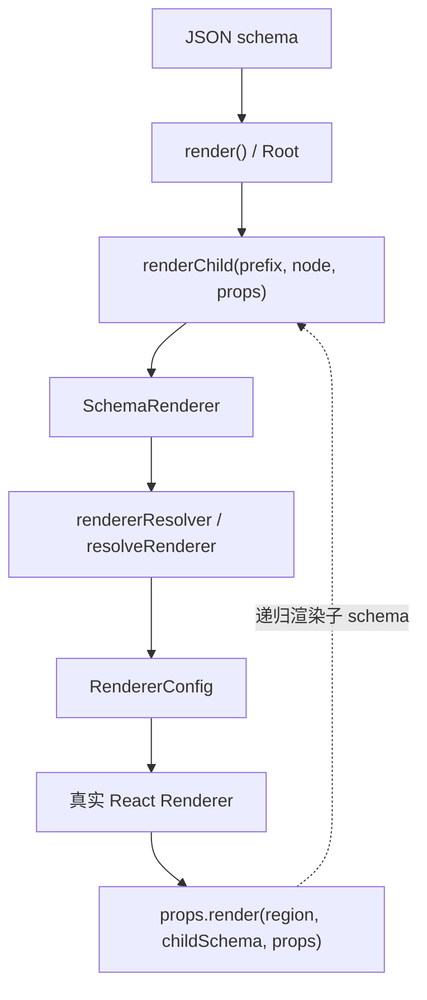

这套模型有四个重点：

- `render()` 负责建立一次渲染会话，包括 `RendererStore`、`env`、主题、国际化、根上下文。
- `SchemaRenderer` 是每个 schema 节点的通用适配层，负责解析 renderer、处理显隐/表达式/样式/事件、拼装 props。
- 真实 renderer 只需要消费 props，并在需要渲染子 schema 时调用 `props.render()`。
- 递归不是由每个 renderer 自己创建 `SchemaRenderer`，而是统一回到 `renderChild()`，保证路径、数据域、环境和状态处理一致。

## 概念名词

| 名词                 | 含义                                                                                    | 典型位置                                      |
| -------------------- | --------------------------------------------------------------------------------------- | --------------------------------------------- |
| schema               | 描述页面或组件的 JSON 配置，通常包含 `type` 和其他属性                                  | `docs/zh-CN/concepts/schema.md`               |
| schema 节点          | schema 树上的一个节点，可以是对象、数组、字符串、数字或 React element                   | `SchemaNode`                                  |
| renderer / 渲染器    | 接收 schema props 并输出 React UI 的组件实现                                            | `packages/amis/src/renderers/`                |
| `RendererConfig`     | 渲染器注册信息，包含 `type`、`test`、`name`、`component`、`storeType`、`alias` 等       | `amis-core/src/factory.tsx`                   |
| `RendererProps`      | 下发给真实 renderer 的运行时 props，包含 `render`、`env`、`data`、`$path`、`$schema` 等 | `amis-core/src/factory.tsx`                   |
| `@Renderer()`        | 注册渲染器的装饰器，内部调用 `registerRenderer()`                                       | `amis-core/src/factory.tsx`                   |
| `registerRenderer()` | 把 renderer 加入全局 registry，建立 type 到 renderer 的映射                             | `amis-core/src/factory.tsx`                   |
| `resolveRenderer()`  | 根据 schema 的 `type` 或路径查找命中的 `RendererConfig`                                 | `amis-core/src/factory.tsx`                   |
| `SchemaRenderer`     | 通用 schema 节点渲染器，负责把 schema 节点适配成真实 renderer props                     | `amis-core/src/SchemaRenderer.tsx`            |
| `Root`               | 根渲染容器，提供主题、语言、root store、定义解析和根级 wrapper                          | `amis-core/src/Root.tsx`                      |
| `RootRenderer`       | 根页面运行时，维护页面数据、弹窗、抽屉、动作、错误和 loading                            | `amis-core/src/RootRenderer.tsx`              |
| `RendererStore`      | 一次渲染会话的 root store，按 `options.session` 缓存                                    | `amis-core/src/store/`                        |
| `env`                | 运行时环境能力，如 fetcher、notify、jumpTo、rendererResolver、loadRenderer              | `amis-core/src/env.tsx`                       |
| region               | 子 schema 的逻辑区域名，如 `body`、`toolbar`、`actions`、`columns`                      | renderer 调用 `render(region, schema)` 时传入 |
| `$path`              | 当前节点在渲染树中的路径，用于 renderer 匹配、调试和递归定位                            | `renderChild()` 生成                          |

## 静态架构

amis runtime 的静态结构可以分成注册层、会话层、适配层和组件层。

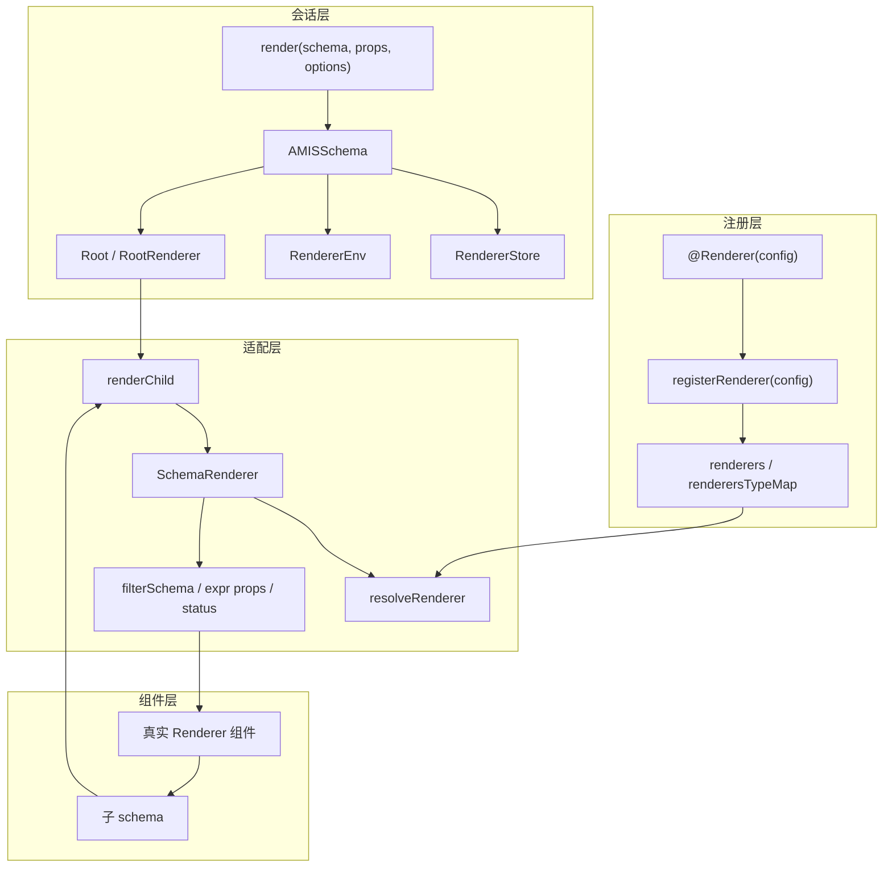

各层职责如下：

- 注册层只解决“某类 schema 应该由哪个 renderer 处理”。
- 会话层只解决“这一次 render 使用什么环境、数据、主题、语言和 root store”。
- 适配层只解决“一个 schema 节点如何变成真实组件 props”。
- 组件层只解决“组件如何根据 props 输出 UI，以及在哪些区域继续渲染子 schema”。

## 渲染器注册机制

渲染器可以通过装饰器或直接调用 `registerRenderer()` 注册。大多数内置渲染器使用 `@Renderer()`。

```tsx
@Renderer({
  type: 'tpl',
  alias: ['html'],
  name: 'tpl'
})
export class TplRenderer extends Tpl {}

@Renderer({
  type: 'page',
  storeType: ServiceStore.name,
  isolateScope: true
})
export class PageRenderer extends PageRendererBase {}
```

注册时会发生几件事：

1. 如果配置了 `type`，会转成小写，并生成默认 `test` 规则。
2. 如果配置了 `component`，会根据 `storeType`、`isolateScope` 等配置包装组件。
3. 渲染器会被加入全局 `renderers` 列表，并按照 `weight` 排序。
4. `type` 会进入 `renderersTypeMap`，后续 `resolveRenderer()` 可以优先通过 `schema.type` 直接命中。
5. `alias` 会生成 fork 配置，让多个 `type` 指向同一个原始 renderer。

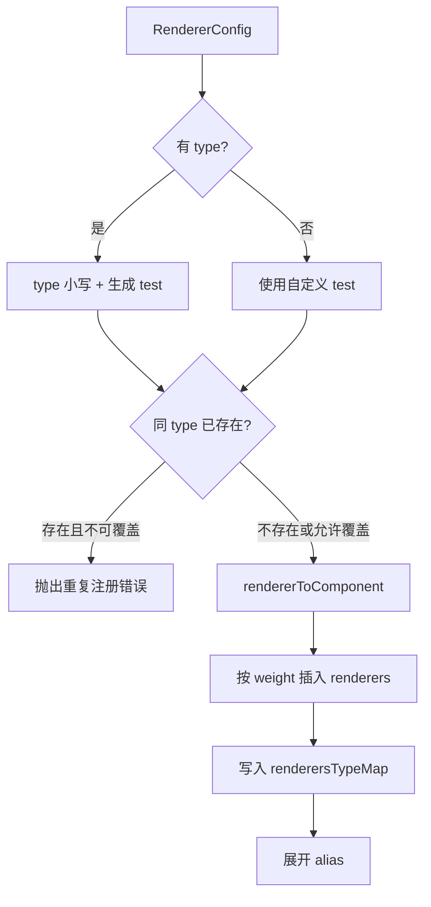

## 渲染会话创建

业务侧通常调用 `render(schema, props, options)`。这个 API 返回的是 `AMISSchema` React 组件，而不是立即执行完整渲染。

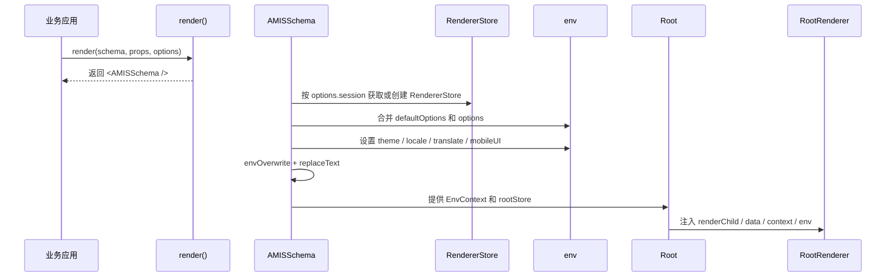

`options.session` 很重要。默认 session 是 `global`，同一个 session 会复用 `RendererStore` 和 env；如果需要隔离不同渲染实例的状态或环境，应传入不同 session。

## 递归渲染流程

递归渲染从 `RootRenderer.render()` 开始。根节点和每个子节点都会回到同一个 `renderChild()` 函数。

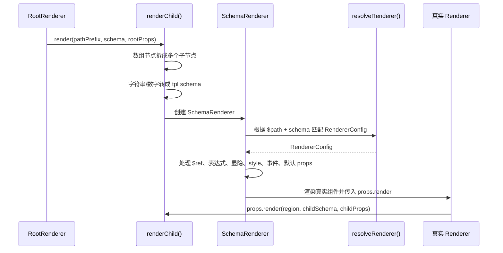

以 `page.body` 为例，流程大致是：

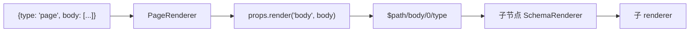

这里的 `region` 只是一段路径和语义标识，不是 DOM 区域。它会参与 `$path` 生成，也让调试、编辑器和复杂 renderer 能知道子 schema 来自哪个逻辑位置。

## `SchemaRenderer` 的节点适配职责

`SchemaRenderer` 是递归链路中最关键的适配层。它不是业务组件，而是所有 schema 节点共同经过的运行时管道。

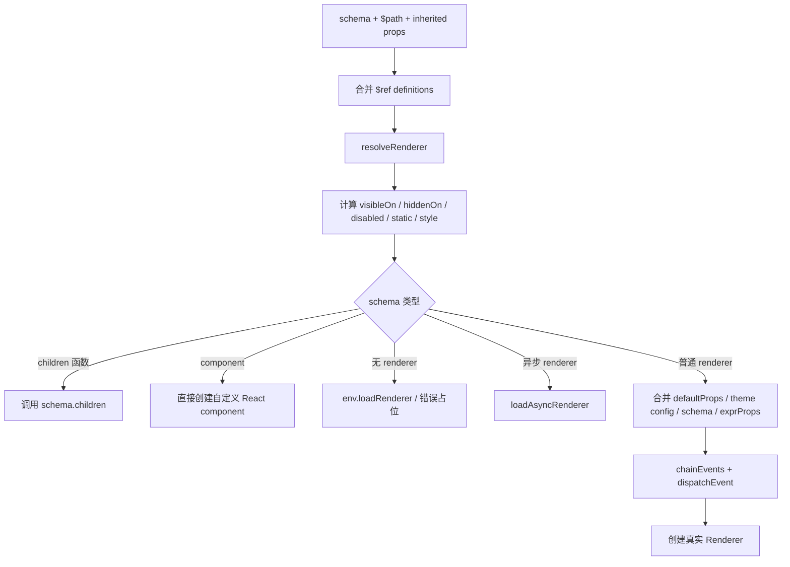

它主要处理这些事情：

- `$ref`：把 definitions 中的配置合并到当前 schema。
- renderer 匹配：通过 `env.rendererResolver` 或默认 `resolveRenderer()` 找 renderer。
- 表达式与状态：处理 `visibleOn`、`hiddenOn`、`disabled`、`static`、动态 style 等。
- props 过滤：避免把 `type`、`body`、`children` 等 schema 控制字段无脑传给子节点。
- 事件绑定：把 schema 事件和上层事件合并，并提供 `dispatchEvent()`。
- 递归入口：向真实 renderer 下发 `render: this.renderChild`。
- 异步与错误：找不到 renderer 时走 `env.loadRenderer`，异步 renderer 走 `loadAsyncRenderer()`。

## 渲染器匹配规则

默认 `resolveRenderer(path, schema)` 优先使用 `schema.type` 匹配。

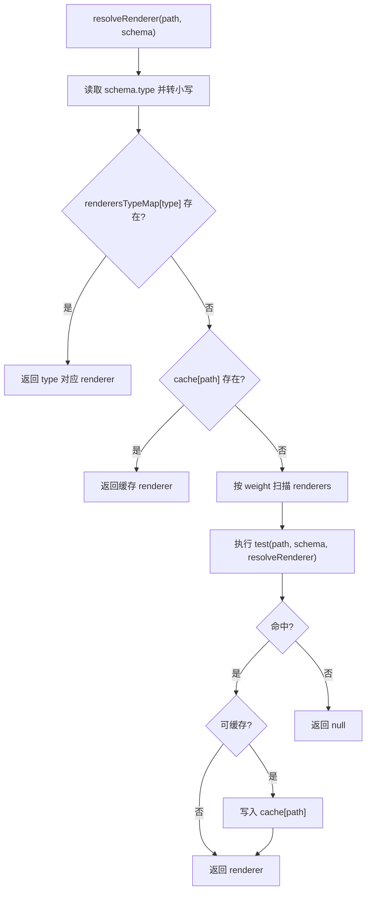

因此新渲染器优先推荐声明唯一 `type`。基于路径的 `test` 能处理少数历史或特殊场景，但更难缓存，也更难推断。

## `RendererProps` 传递模型

真实 renderer 拿到的 props 来自多个来源，后者会覆盖前者。

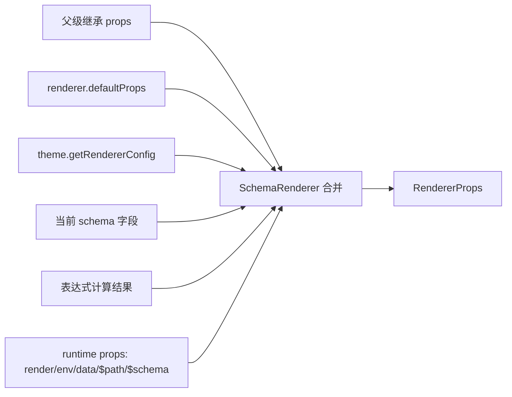

常用 props 包括：

- `render(region, node, props)`：递归渲染子 schema 的唯一入口。
- `env`：运行时环境能力，如请求、跳转、通知、复制、rendererResolver。
- `data`：当前数据域，通常来自 root store 或上层 renderer 扩展。
- `$path`：当前节点路径。
- `$schema`：当前原始 schema。
- `dispatchEvent()`：触发事件动作系统。
- `rootStore`、`statusStore`：页面级数据、loading、弹窗、显隐/禁用/静态状态等。

## 数据域、Store 和 Scoped

amis 的渲染过程不只是组件树递归，还包含数据域和组件作用域。

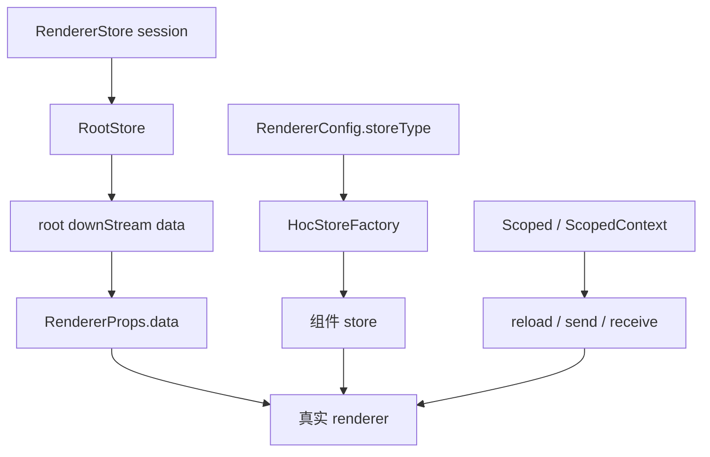

关键规则：

- `RootRenderer` 创建页面级 `RootStore`，初始化 `data`、`context`、`location`、`params` 和全局变量。
- 配置了 `storeType` 的 renderer 会被 `HocStoreFactory` 包装，拥有自己的组件 store。
- 配置了 `isolateScope` 的 renderer 会被 `Scoped()` 包装，形成独立的命名作用域。
- `ScopedContext` 支持跨组件动作，例如按目标组件名 reload、receive、send。

## 异步渲染器和找不到渲染器

如果 `RendererConfig` 只有 `getComponent` 而没有 `component`，它就是异步渲染器。`SchemaRenderer` 会先渲染 `LazyComponent`，等 `loadAsyncRenderer()` 加载完成后重新解析。

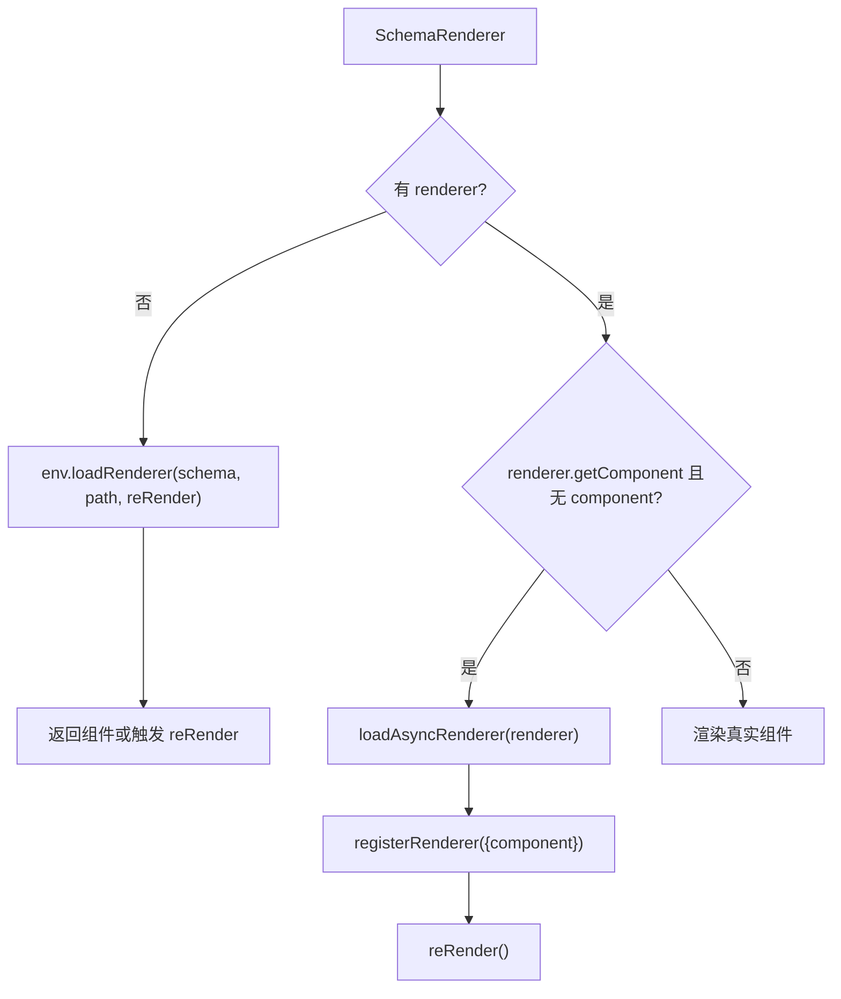

默认 `env.loadRenderer` 会展示“找不到对应的渲染器”错误。业务方可以覆盖 `loadRenderer`，实现按需加载自定义 renderer。

## 扩展点

| 目标                   | 推荐扩展点                                  | 说明                                                            |
| ---------------------- | ------------------------------------------- | --------------------------------------------------------------- |
| 注册新的 schema `type` | `@Renderer({type})` 或 `registerRenderer()` | 最常见的自定义 renderer 入口                                    |
| 覆盖内置 renderer      | `registerRenderer({type, override: true})`  | 需要确认兼容原 schema 协议                                      |
| 为 renderer 加 store   | `RendererConfig.storeType`                  | 会通过 `HocStoreFactory` 包装组件                               |
| 隔离组件作用域         | `RendererConfig.isolateScope`               | 常用于 page、crud、form 等有目标组件管理的 renderer             |
| 支持别名               | `RendererConfig.alias`                      | 例如 `tpl` 同时支持 `html`                                      |
| 运行前统一改 schema    | `addSchemaFilter()`                         | 会在真实 renderer 渲染前执行                                    |
| 自定义 renderer 匹配   | `RendererConfig.test`                       | 少用，优先选择 `type`                                           |
| 自定义整体环境         | `render(schema, props, options)`            | 覆盖 fetcher、notify、jumpTo、loadRenderer、rendererResolver 等 |
| 根级 wrapper           | `addRootWrapper()`                          | 用于注入全局 Provider 或外层上下文                              |

## 设计约束

- 自定义 renderer 应优先提供稳定唯一的 `type`，避免依赖路径匹配。
- renderer 内部渲染子 schema 时必须使用 props 下发的 `render()`，不要手动创建 `SchemaRenderer`。
- 不要把 schema 控制字段当成普通 DOM props 全量透传，`SchemaRenderer` 已经负责过滤和转换。
- 需要数据加载、状态同步或 scoped 能力时，优先使用已有 store/scoped 机制，不要在 renderer 中创建平行状态通道。
- 覆盖内置 renderer 时，要保持原 schema 协议兼容；否则会影响已有页面和编辑器插件。

## 源码索引

| 关注点                                                 | 入口文件                                    |
| ------------------------------------------------------ | ------------------------------------------- |
| `render()` API、`AMISSchema`、session/env 创建         | `packages/amis-core/src/index.tsx`          |
| 根上下文、主题、语言、root wrapper                     | `packages/amis-core/src/Root.tsx`           |
| 页面级数据、动作、弹窗、抽屉、loading、错误            | `packages/amis-core/src/RootRenderer.tsx`   |
| schema 节点适配、renderer 解析、递归 render 下发       | `packages/amis-core/src/SchemaRenderer.tsx` |
| renderer 注册、匹配、异步加载、schema filter、默认 env | `packages/amis-core/src/factory.tsx`        |
| Scoped 目标组件通信                                    | `packages/amis-core/src/Scoped.tsx`         |
| RendererStore / RootStore / 组件 store                 | `packages/amis-core/src/store/`             |
| 内置 renderer 实现                                     | `packages/amis/src/renderers/`              |
