本文面向需要理解、集成或二次开发 amis 可视化编辑器的开发者，说明编辑器里的核心概念、静态结构、插件加载流程、渲染接入流程，以及面板、物料、工具栏和右键菜单如何围绕当前选中节点重建。

如果只想快速接入编辑器，请先看[可视化编辑器](./editor)。如果要写插件或定制编辑器能力，请结合[可视化编辑器定制指南](./editor-customization)阅读本文。

## 核心心智模型

amis editor 本质上是在 amis 渲染流程外包了一层“编辑态协议”。业务 schema 仍然由 amis renderer 渲染；编辑器通过插件识别每个 schema 节点，把节点包装成可点选、可高亮、可拖拽、可配置的编辑节点。

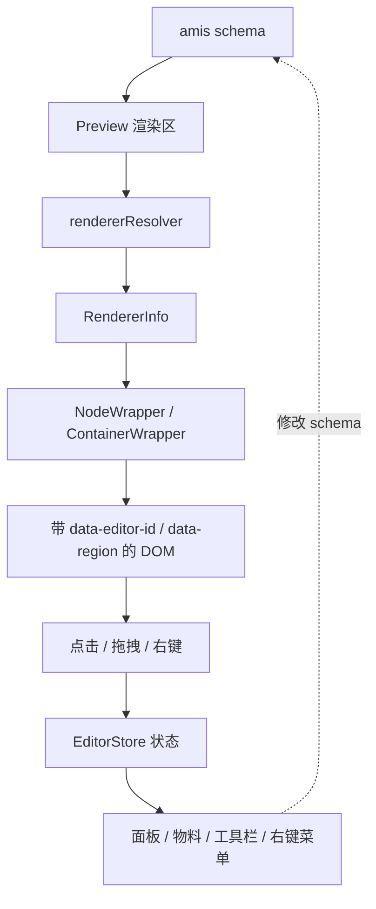

这条链路里有三个重要边界：

- `Editor` 是 React 外壳，负责创建 `EditorStore` 和 `EditorManager`，组合左侧面板、预览区、右侧面板、弹窗、脚手架等 UI。
- `EditorManager` 是编辑器控制层，负责插件实例化、事件派发、渲染器 hack、物料收集、面板收集、DND、schema 修改。
- 插件是扩展点，负责声明“某类 amis renderer 在编辑器里应该如何被识别、展示、配置和插入”。

## 概念名词

| 名词               | 含义                                                                                       | 典型来源                                             |
| ------------------ | ------------------------------------------------------------------------------------------ | ---------------------------------------------------- |
| `Editor`           | 可视化编辑器主组件，承载编辑器外壳、预览区和左右面板                                       | `packages/amis-editor-core/src/component/Editor.tsx` |
| `EditorStore`      | 编辑器状态树，保存 schema、当前选中节点、面板、物料、拖拽状态、弹窗状态等                  | `packages/amis-editor-core/src/store/editor.ts`      |
| `EditorManager`    | 非 UI 控制层，连接 store、插件、amis renderer、DND 和事件系统                              | `packages/amis-editor-core/src/manager.ts`           |
| 插件               | 编辑器能力单元，可以提供渲染器识别、配置面板、组件物料、工具栏、右键菜单、事件动作等       | `BasePlugin` 或自定义 `PluginInterface`              |
| 渲染器插件         | 绑定了 `rendererName` 的插件，用于让某种 amis renderer 可点选、可配置、可拖入              | `rendererName = 'input-text'`                        |
| 全局插件           | 不绑定具体 renderer 的插件，用于新增全局面板、菜单、工具或监听事件                         | 左侧业务资源面板、审计插件                           |
| `RendererInfo`     | 某个 schema 节点在编辑器中的能力描述，包含名称、区域、面板、schema、wrapper 行为等         | `getRendererInfo()` 返回值                           |
| `SubRendererInfo`  | 组件物料信息，用于左侧“组件”面板或插入面板展示和拖入                                       | `buildSubRenderers()` 返回值                         |
| 面板               | 编辑器左右侧 tab。右侧通常是当前节点配置面板，左侧通常是组件、结构、大纲等辅助面板         | `PanelItem` / `BasicPanelItem`                       |
| 组件物料           | 可以插入到当前区域的组件候选项，通常包含名称、图标、描述、分类、预览 schema、默认 scaffold | `SubRendererInfo`                                    |
| 容器区域           | 容器组件可插入子节点的位置，如 `body`、`toolbar`、`columns`、`items`                       | `RegionConfig`                                       |
| 工具栏             | 选中框附近的快捷操作按钮，如复制、删除、上移、配置等                                       | `buildEditorToolbar()`                               |
| 右键菜单           | 在画布或大纲节点上右键出现的上下文菜单                                                     | `buildEditorContextMenu()`                           |
| `NodeWrapper`      | 普通节点编辑态包装器，负责渲染原组件并标记 `data-editor-id`                                | `component/NodeWrapper.tsx`                          |
| `ContainerWrapper` | 容器节点编辑态包装器，在 `NodeWrapper` 基础上处理容器区域                                  | `component/ContainerWrapper.tsx`                     |
| `RegionWrapper`    | 区域包装器，标记 `data-region` 和 `data-region-host`，并在 store 中创建区域节点            | `component/RegionWrapper.tsx`                        |
| `SubEditor`        | 弹窗、抽屉等无法在主画布中直接编辑的结构，会打开子编辑器处理                               | `component/SubEditor.tsx`                            |

## 静态架构

编辑器分为“包层级”“运行时层级”和“扩展层级”。`amis-editor-core` 提供编辑器核心，`amis-editor` 在核心之上注册 amis 内置组件插件。

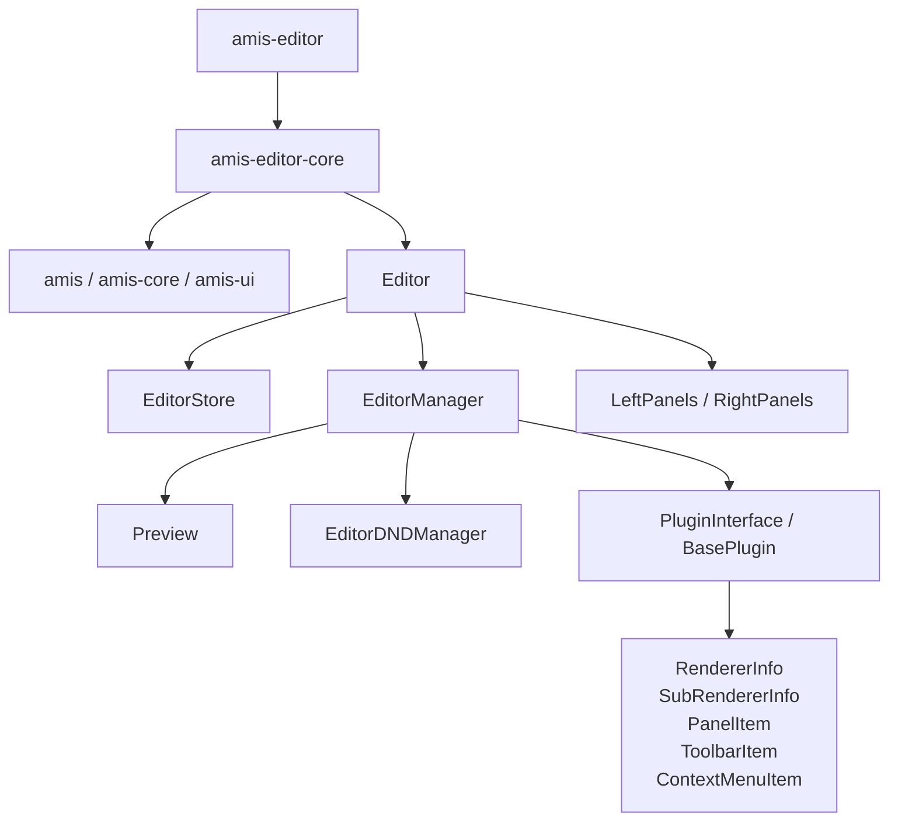

静态结构里的职责划分如下：

- `Editor` 不直接决定某个组件能否编辑，它只创建核心对象并摆放 UI 区域。
- `EditorManager` 统一调用插件，避免面板、工具栏、菜单、物料各自绕过插件体系。
- `Preview` 通过 amis 的 `rendererResolver` 切入渲染流程，在 editable 模式下把普通 renderer 替换成编辑态 wrapper。
- `EditorStore` 只保存状态和 schema 树，不负责解释插件语义。
- 插件是所有二次开发能力的主要入口，同一个插件可以同时提供 renderer 识别、配置面板、物料、工具栏和右键菜单。

## Schema、节点树和 DOM 标记

编辑器会围绕同一份 schema 建立三种视图：

| 视图         | 作用                                                                    |
| ------------ | ----------------------------------------------------------------------- |
| schema 树    | 最终输出给业务方的 amis 配置，节点通过 `$$id` 保持唯一标识              |
| 编辑器节点树 | 运行时的可编辑节点模型，记录父子关系、区域、渲染器信息、组件实例等      |
| DOM 标记     | 画布上可交互的真实 DOM，靠 `data-editor-id` 和 `data-region` 回到节点树 |

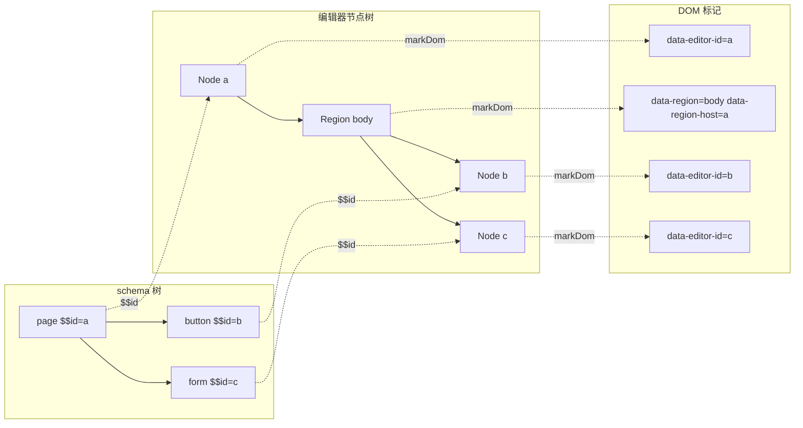

这套映射让交互逻辑可以从鼠标事件命中的 DOM 回到 schema 节点：点击 `data-editor-id` 选中组件，拖拽命中 `data-region` 判断插入位置，右键命中节点后由插件生成上下文菜单。

> 备注：编辑器通过 React props 和 context 暴露给外层的节点对象是一个轻量 facade，不应该把它当成长期持有的原始状态引用。需要读取实时节点状态时，仍然应该回到 `EditorStore` 按 `id` 重新查询，这样面板、表单和 wrapper 才不会拿到陈旧节点。

## 加载流程

编辑器挂载时会先创建 store 和 manager，然后 manager 合并全局插件和实例插件。预览区真正渲染 schema 时，才会逐个节点解析对应的编辑器信息。

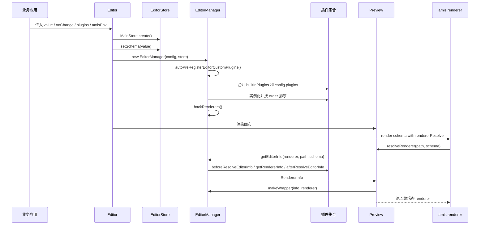

插件来源有三类：

- 通过 `registerEditorPlugin()` 注册到全局插件池，后续编辑器实例默认可见。
- 通过 `Editor` 的 `plugins` 属性只注入当前实例。
- 通过 `window.AMISEditorCustomPlugins` 或 postMessage 动态注册自定义组件插件。

插件实例化时会受 `disableBultinPlugin`、`disablePluginList` 和 `order` 影响。带 `rendererName` 的插件还会把 `events` 和 `actions` 记录到 `pluginEvents` / `pluginActions`，用于事件动作面板。

## 渲染接入流程

编辑态的核心不是重写 amis renderer，而是在 `rendererResolver` 里替换 renderer 的 `component`。

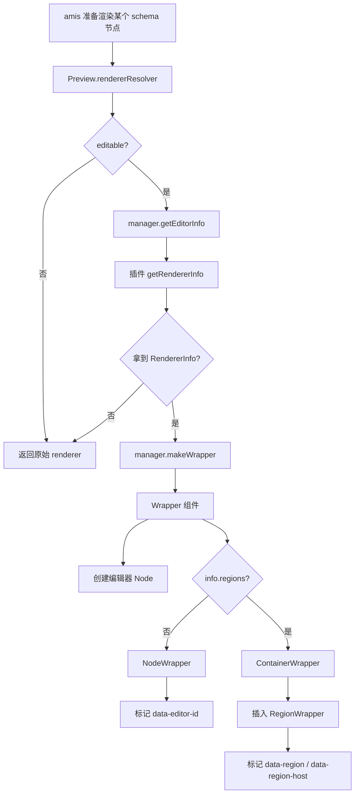

`BasePlugin.getRendererInfo()` 的默认规则是：schema 有 `$$id`，插件有 `name` 和 `rendererName`，并且 `rendererName` 匹配 amis renderer 的 `name` 或 `origin.name`。满足后，它会把插件上的 `regions`、`panelBody`、`wrapperResolve`、`filterProps`、`scaffoldForm` 等能力复制到 `RendererInfo`。

容器区域有两种插入方式：

- 简单容器：组件通过 `render('body', schema)` 之类的方式渲染子节点，`ContainerWrapper` 可以基于 `regions` 包装。
- 复杂容器：插件通过 `renderMethod`、`matchRegion`、`renderMethodOverride` 指定要 hack 的 React 方法或 JSX 位置，再由 `hackIn()` 插入 `RegionWrapper`。

## 选中节点后的重建流程

画布点击节点后，store 的 `activeId` 变化，manager 上的 reaction 会重建依赖当前节点的所有编辑器 UI。

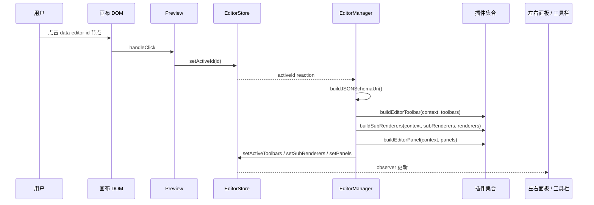

这也是很多扩展点“看起来没有主动调用”的原因：插件只需要实现 `buildEditorPanel()`、`buildEditorToolbar()` 或 `buildSubRenderers()`，当选中节点或区域变化时，manager 会统一收集并写回 store。

## 面板架构

面板统一使用 `PanelItem` 描述，靠 `position` 区分左右侧：

- `position: 'left'` 进入左侧面板。
- `position` 为空或为 `'right'` 进入右侧面板。

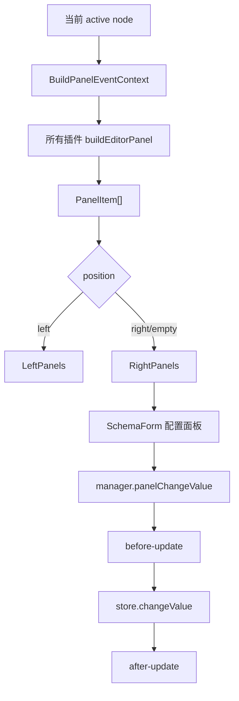

`BasePlugin.buildEditorPanel()` 提供了默认右侧配置面板：当当前节点属于该插件，并且插件声明了 `panelBody`、`panelBodyCreator` 或 `panelBodyAsyncCreator`，会自动生成 `key: 'config'` 的面板。这个面板内部使用 `makeSchemaFormRender()` 创建 `SchemaForm`，表单变更会统一走 `manager.panelChangeValue()`，因此可以触发 `before-update` 和 `after-update`。

左侧面板更适合放全局能力，例如大纲、组件物料、自定义资源、代码面板。右侧面板更适合放当前节点配置，例如属性、样式、事件、数据等。

## 组件物料架构

组件物料来自插件的 `buildSubRenderers()`。物料收集和当前选中容器、当前区域有关，因此不同区域可以展示不同候选组件。

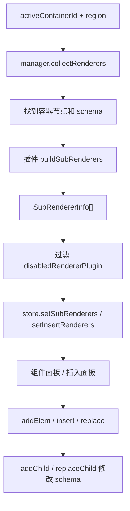

默认情况下，继承 `BasePlugin` 且声明了 `name` 和 `description` 的插件会自动生成一个物料。如果插件声明 `scaffolds`，则可以生成多个物料；如果要完全控制展示条件、分类、排序或可插入区域，可以重写 `buildSubRenderers()`。

物料和画布编辑能力是两件事：

- 物料决定“能不能从面板里拖入或点击插入”。
- `RendererInfo` 决定“已经在画布上的 schema 节点能不能被识别和编辑”。

多数真实组件应该同时提供两者，但全局插件或纯辅助面板可以只提供其中一种。

## 工具栏和右键菜单

工具栏和右键菜单都以当前节点上下文为输入，由插件共同追加能力。

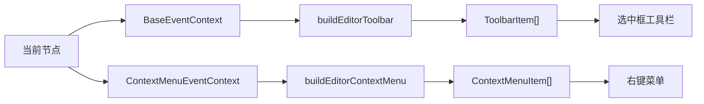

工具栏适合放高频、轻量、和选中框强相关的动作。右键菜单适合放低频、上下文相关或需要分组的动作。二者都不要求插件绑定 `rendererName`；如果动作只对某类组件生效，在插件方法内判断 `context.info.renderer.name`、`context.info.plugin` 或 schema 即可。

## 容器区域和拖拽

容器区域是拖拽插入的关键协议。插件通过 `regions` 声明某个 renderer 有哪些可插入区域，每个区域可以声明显示名称、占位文案、偏好的物料分类、DND 模式和接受规则。

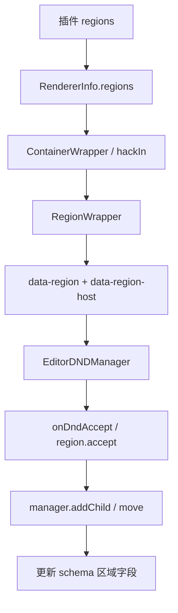

常见区域字段包括 `body`、`toolbar`、`actions`、`columns`、`items` 等。区域不是 DOM 层随便取名，而是必须能映射到 schema 的某个子结构；否则拖入后无法正确写回 schema。

## 事件系统

manager 提供统一事件派发：插件方法和 `Editor` props 上的监听器都会被归一到同一个事件对象中。

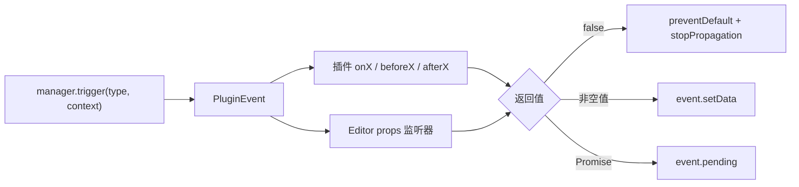

常用事件包括：

- `before-resolve-editor-info` / `after-resolve-editor-info`：控制节点是否能被编辑器识别。
- `build-panels` / `build-toolbars` / `build-context-menus`：补充或调整 UI 能力。
- `before-insert` / `after-insert`：插入 schema 前后。
- `before-update` / `after-update`：面板修改 schema 前后。
- `before-replace` / `after-replace`：替换 renderer 或粘贴配置前后。
- `on-dnd-accept`：控制拖拽是否接受。

## 定制入口选择

| 目标                       | 推荐入口                                                         | 原因                                    |
| -------------------------- | ---------------------------------------------------------------- | --------------------------------------- |
| 禁用某些内置能力           | `disableBultinPlugin` / `disablePluginList`                      | 不需要新增插件                          |
| 只给当前实例追加能力       | `plugins` 属性                                                   | 作用域清晰，不污染全局插件池            |
| 新增左侧业务面板           | 全局插件 `buildEditorPanel()` + `position: 'left'`               | 不需要绑定 renderer                     |
| 给某个组件增加右侧配置     | 渲染器插件 + `panelBody` / `panelBodyCreator`                    | 复用 `BasePlugin` 默认配置面板          |
| 让自定义组件出现在组件面板 | `buildSubRenderers()` 或插件 `name` / `description` / `scaffold` | 物料和插入流程都走统一机制              |
| 让自定义组件可点选         | `rendererName` + `getRendererInfo()`                             | 需要生成 `RendererInfo` 并包装 renderer |
| 声明容器可插入区域         | `regions` / `RegionConfig`                                       | DND 和插入面板都依赖区域协议            |
| 增加选中框快捷按钮         | `buildEditorToolbar()`                                           | 和当前 active 节点绑定                  |
| 增加右键操作               | `buildEditorContextMenu()`                                       | 适合上下文动作和分组动作                |
| 重做左右面板外壳           | `LeftPanelsComponent` / `RightPanelsComponent`                   | 只在需要替换容器布局时使用              |

## 设计约束

- 插件应该通过官方扩展点参与编辑器流程，不要直接修改 store 内部状态或手动操作 DOM 标记。
- `rendererName` 只表达“这个插件绑定哪类 amis renderer”，不要把它当作分类、场景或业务类型。
- `regions` 必须和 schema 子结构对应，区域 key 应该稳定、可读、可被 `addChild()` 写回。
- 面板修改 schema 应通过 `panelChangeValue()` 或 manager 提供的 schema 操作方法，避免绕过 `before-update` / `after-update`。
- 全局插件和渲染器插件要分清边界：全局插件负责外壳能力，渲染器插件负责某类组件的编辑能力。

## 源码索引

| 关注点                                                              | 入口文件                                                                                                                        |
| ------------------------------------------------------------------- | ------------------------------------------------------------------------------------------------------------------------------- |
| 编辑器主壳                                                          | `packages/amis-editor-core/src/component/Editor.tsx`                                                                            |
| 预览区和 rendererResolver                                           | `packages/amis-editor-core/src/component/Preview.tsx`                                                                           |
| 管理器、插件加载、事件派发、物料和面板收集                          | `packages/amis-editor-core/src/manager.ts`                                                                                      |
| 插件接口、`BasePlugin`、`RendererInfo`、`PanelItem`、`RegionConfig` | `packages/amis-editor-core/src/plugin.ts`                                                                                       |
| 编辑态 wrapper 创建、区域 hack、配置面板渲染                        | `packages/amis-editor-core/src/component/factory.tsx`                                                                           |
| 普通节点 DOM 标记                                                   | `packages/amis-editor-core/src/component/NodeWrapper.tsx`                                                                       |
| 容器区域 DOM 标记                                                   | `packages/amis-editor-core/src/component/RegionWrapper.tsx`                                                                     |
| 左右面板外壳                                                        | `packages/amis-editor-core/src/component/Panel/LeftPanels.tsx`、`packages/amis-editor-core/src/component/Panel/RightPanels.tsx` |
| 内置组件插件                                                        | `packages/amis-editor/src/plugin/`                                                                                              |
